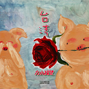

台湾
============================

|  |  |
| :--: | :-- |
| [ 台湾](https://emumo.xiami.com/album/2105606850) | **艺人**: [左小祖咒](../index.md) **语种**: 国语 **唱片公司**: 左小祖咒工作室 **发行时间**: 2020年01月01日 **专辑类别**: 录音室专辑 **专辑风格**: 国语流行 Mandarin Pop, 华语唱作人 Chinese Singer-Songwriter, 摇滚 Rock & Roll **播放数**: 845723 **收藏数**: 538 **评论数**: 82  |

## 简介

&nbsp;这张专辑被左小祖咒称为："我的超级傻情歌专辑" ，共11首歌曲。  
专辑前后制作周期用时五年，所有的作品用了台湾这个美丽的地方，用人们无法知道的歌曲的音乐来重新填写词曲这个概念下完成的作品。它像一部老电影让你想起无数陈年往事的时刻、又想起当下的自己，再次思考我们不同的人生。左小也说这些台湾歌曲都是他小时候的枕边歌儿。  
&nbsp;  
&nbsp;

## 曲目

- [认识你很高兴](./2105606850/U8BGIe2c455.md)
- [你们说得对对对](./2105606850/8JfJeVf85c7.md)
- [你去你来又离开](./2105606850/8JfJePf3a05.md)
- [你就是我的](./2105606850/8JfJeR1da2a.md)
- [没有理想的人不伤心](./2105606850/U8BGId292ba.md)
- [二十岁的某一天](./2105606850/8JfJeOede92.md)
- [你是一个好人](./2105606850/bCnDBYq6e3dc.md)
- [做你能做的一切](./2105606850/mT9L1G59cbb.md)
- [2303](./2105606850/xOuKqlfdaf7.md)
- [一定不再想你](./2105606850/mT9L1D939d4.md)
- [有话好好说](./2105606850/b1sSDjM3e80d.md)

## 评论

|  |  |  |  |
| :-- | :-- | :-- | :-- |
|  [虾米用户](https://emumo.xiami.com/u/5806141)  2020-06-14 14:43 赞(0) 踩(0) | 
这张的编曲 怎么这么好听 完全可以忽略左叔的声线
 |
|  [虾米用户](https://emumo.xiami.com/u/575652) I'll be back... 2020-04-18 13:14 赞(1) 踩(0) | 
每天你醒来抱紧我的器官
 |
|  [虾米用户](https://emumo.xiami.com/u/41693350) Law and Orde... 2020-03-10 13:06 赞(0) 踩(0) | 
这年头就是要愚乐嘛，左叔做的不错！值得学习！
 |
|  [虾米用户](https://emumo.xiami.com/u/250516240)  2020-02-12 11:48 赞(0) 踩(0) | 
这张怎么这么好听
 |
|  [虾米用户](https://emumo.xiami.com/u/9980215)  2020-02-04 07:07 赞(0) 踩(0) | 
好听
 |
|  [虾米用户](https://emumo.xiami.com/u/36938932) 倒霉的小伙子比洞還潮濕的... 2020-01-19 00:47 赞(0) 踩(0) | 
跟馮老流氓合作真是太對口了
 |
|  [虾米用户](https://emumo.xiami.com/u/435500627)  2020-01-17 17:49 赞(1) 踩(0) | 
光听出个爱你一万年，谁能给介绍介
 |
|  [虾米用户](https://emumo.xiami.com/u/3409043) 我还没想好要写什么... 2020-01-10 14:59 赞(0) 踩(0) | 
一定不再想你也太像伍佰的爱你一万年了吧。。。。。。
 |
| ⇒ |  [虾米用户](https://emumo.xiami.com/u/8774387) 你是一道彩虹 2020-01-16 19:26 赞(0) 踩(0) | 
哦哟
 |
| ⇒ |  [虾米用户](https://emumo.xiami.com/u/401954902)   2020-03-31 09:21 赞(0) 踩(0) | 
都说作曲有大野克夫了   
 |
|  [虾米用户](https://emumo.xiami.com/u/1344348) 想你。 2020-01-10 11:30 赞(0) 踩(0) | 
&amp;amp;quot;国语流行&amp;amp;quot;
 |
|  [虾米用户](https://emumo.xiami.com/u/27793105)  2020-01-07 23:00 赞(0) 踩(0) | 
很好听啊，左叔正常水准的作品！
 |
|  [虾米用户](https://emumo.xiami.com/u/9160880) Thiên Mệnh B... 2020-01-07 09:44 赞(2) 踩(0) | 
难怪我说这名字咋这么熟悉，远来有过新闻事件的 ^_^
 |
|  [虾米用户](https://emumo.xiami.com/u/27793105)  2020-01-07 00:11 赞(5) 踩(0) | 
为什么我还是觉得这专辑的歌编曲依旧上乘，配上左叔这癫疯摇滚的唱腔，不仅有种2020年代的当代魔幻浪漫主义，还有一种平原罗曼蒂克的野性浪漫，仿佛整个人都在一望无际的荒原上肆意裸奔且没有任何的束缚，这绝不是网上冲浪所能比的快乐！
 |
|  [虾米用户](https://emumo.xiami.com/u/4257620) 独立，另类音乐二手黑胶私... 2020-01-06 11:25 赞(3) 踩(0) | 
恶心别人 恶心自己 恶心的华语音乐
 |
|  [虾米用户](https://emumo.xiami.com/u/141027886) 在下还没想好要写什么… 2020-01-06 08:40 赞(2) 踩(0) | 
hhh看到2020还有人紧着左叔骂我就放心了
 |
|  [虾米用户](https://emumo.xiami.com/u/50275922) 遥远的相似性 2020-01-06 04:15 赞(0) 踩(0) | 
这一年也打算不着调，去年也是..甜蜜吧…我很久很久的感情...
 |
|  [虾米用户](https://emumo.xiami.com/u/18057843) 唵南无湿婆耶～ 2020-01-04 12:00 赞(1) 踩(0) | 
神品～
 |
|  [虾米用户](https://emumo.xiami.com/u/8667503) 暂无签名~ 2020-01-03 08:29 赞(1) 踩(0) | 
大船开不到沙漠，可沙漠里真的有船.
 |
|  [虾米用户](https://emumo.xiami.com/u/1219739) 心有猛虎细嗅蔷薇~ 2020-01-02 18:58 赞(0) 踩(0) | 
都在调调上 算我输~
 |
|  [虾米用户](https://emumo.xiami.com/u/18677362) 活着就是 创造更多回忆 ... 2020-01-02 15:08 赞(2) 踩(0) | 
封面好看
 |
| ⇒ |  [虾米用户](https://emumo.xiami.com/u/27793105)  2020-01-07 00:07 赞(0) 踩(0) | 
同感
 |
|  [虾米用户](https://emumo.xiami.com/u/261301937) 摇滚文青 2020-01-02 11:41 赞(0) 踩(0) | 
《你们说得对对对》这首歌在“嬉笑怒骂式”的慵懒唱腔中，就如黑夜中的一把利剑插入某些脑残决策者的心里，很有现实批判意义，很摇滚，怒赞一波。跟窦唯的《拆》很合拍！
 |
|  [虾米用户](https://emumo.xiami.com/u/261301937) 摇滚文青 2020-01-02 11:33 赞(0) 踩(0) | 
哈哈，很棒
 |
|  [虾米用户](https://emumo.xiami.com/u/4728694)   2020-01-02 11:26 赞(2) 踩(0) | 
听这张专辑有种找彩蛋的感觉，各种重新编曲的熟悉的旋律。经左小这么一唱，真是充满恶趣味，让人快乐！
 |
|  [虾米用户](https://emumo.xiami.com/u/426886644)  2020-01-02 09:08 赞(2) 踩(0) | 
当左老板在唱爱情的时候他到底在唱什么？
 |
|  [虾米用户](https://emumo.xiami.com/u/260167529) 爱音乐的疯子 2020-01-02 08:23 赞(0) 踩(0) | 
推荐《一定不再想你》《没有理想的人不伤心》《认识你很高兴》
 |
|  [虾米用户](https://emumo.xiami.com/u/260167529) 爱音乐的疯子 2020-01-02 08:22 赞(0) 踩(0) | 
还找来了新裤子合作 左小合作名单又更新了 专找nb的人合作 习惯了唱腔后这个专辑还是可以的
 |
|  [虾米用户](https://emumo.xiami.com/u/6321298) 上善若洪水 2020-01-02 08:09 赞(1) 踩(0) | 
真好听
 |
|  [虾米用户](https://emumo.xiami.com/u/7345510) 我真的喜欢吃虾 2020-01-02 08:05 赞(0) 踩(0) | 
左小老师是艺术家
 |
|  [虾米用户](https://emumo.xiami.com/u/310564827) -我爱你 -请再说一次吧 2020-01-02 06:22 赞(0) 踩(0) | 
又傻又甜，用左老师的方式可爱。
 |
|  [虾米用户](https://emumo.xiami.com/u/84571136) 唯有音乐不离不弃 2020-01-02 00:22 赞(0) 踩(0) | 
来了
 |
|  [虾米用户](https://emumo.xiami.com/u/9582683)  2020-01-01 23:50 赞(0) 踩(0) | 
ktv 录的么
 |
|  [虾米用户](https://emumo.xiami.com/u/57451464) 回忆像一只凌晨3点的蚊子... 2020-01-01 23:09 赞(0) 踩(0) | 
新年第一餐：台湾料理
 |
|  [虾米用户](https://emumo.xiami.com/u/49679180) 星河下  电子荒原 2020-01-01 23:05 赞(0) 踩(0) | 
左叔新年快乐 
 |
|  [虾米用户](https://emumo.xiami.com/u/240203031)  2020-01-01 22:35 赞(0) 踩(0) | 
左小真的无敌
 |
|  [虾米用户](https://emumo.xiami.com/u/43492923) 行到水穷我才开始害怕，夕... 2020-01-01 21:46 赞(0) 踩(0) | 
-
 |
|  [虾米用户](https://emumo.xiami.com/u/14637601)  2020-01-01 20:45 赞(0) 踩(0) | 
从来无法习惯祖儿跑调式唱法，配乐是不错的。
 |
|  [虾米用户](https://emumo.xiami.com/u/43646390) 喜欢音乐真是太好了～♡ 2020-01-01 20:06 赞(0) 踩(0) | 
就对了 你爱我我爱我你不爱我杀了你
 |
|  [虾米用户](https://emumo.xiami.com/u/211341)  2020-01-01 19:54 赞(2) 踩(0) | 
******
 |
|  [虾米用户](https://emumo.xiami.com/u/320043000)  2020-01-01 19:50 赞(0) 踩(0) | 
专辑编曲好无敌，一如既往高水准的制作
 |
|  [虾米用户](https://emumo.xiami.com/u/324598200)  2020-01-01 19:21 赞(0) 踩(0) | 
.∵iituucmtnu
 |
|  [虾米用户](https://emumo.xiami.com/u/13714628) 爱音乐爱生活 2020-01-01 19:12 赞(0) 踩(0) | 
  
 |
|  [虾米用户](https://emumo.xiami.com/u/1308967) 虾米听重型极端音乐这块的... 2020-01-01 15:21 赞(2) 踩(0) | 
真的烂，什么台湾料理，无论这算是抄袭还是翻唱都是一盘又油又腻食之无味弃之不可惜的回锅肉！
 |
| ⇒ |  [虾米用户](https://emumo.xiami.com/u/216784802) 好的音乐最重要的是真实，... 2020-01-01 17:16 赞(0) 踩(0) | 
说说看，抄袭谁了？哪些人，我倒想听听
 |
| ⇒ |  [虾米用户](https://emumo.xiami.com/u/261301937) 摇滚文青 2020-01-02 11:34 赞(0) 踩(0) | 
呵呵→_→，脑子是日用品，怎么到你这却是装饰品了？
 |
| ⇒ |  [虾米用户](https://emumo.xiami.com/u/1308967) 虾米听重型极端音乐这块的... 2020-01-02 13:50 赞(0) 踩(0) | 
<q><b>小悲说：</b></q>
 |
| ⇒ |  [虾米用户](https://emumo.xiami.com/u/1308967) 虾米听重型极端音乐这块的... 2020-01-02 13:51 赞(0) 踩(0) | 
<q><b>黑色梦中说：</b></q>
 |
| ⇒ |  [虾米用户](https://emumo.xiami.com/u/261301937) 摇滚文青 2020-01-02 18:04 赞(0) 踩(0) | 
<q><b>燕十三说：</b></q>
 |
| ⇒ |  [虾米用户](https://emumo.xiami.com/u/1308967) 虾米听重型极端音乐这块的... 2020-01-02 19:19 赞(0) 踩(0) | 
<q><b>黑色梦中说：</b></q>
 |
| ⇒ |  [虾米用户](https://emumo.xiami.com/u/223196261) 飞 蛾 2020-01-02 21:29 赞(0) 踩(0) | 
听的正是这股油腻味儿
 |
| ⇒ |  [虾米用户](https://emumo.xiami.com/u/222802757) 单循控  没电脑只有果1... 2020-07-20 15:49 赞(0) 踩(0) | 
人家专辑序言都说了 这就是用12首台湾老歌的调子结构做底子 重配词曲编曲的概念作品～调皮 真诚～爱了
 |
|  [虾米用户](https://emumo.xiami.com/u/4436786)   2020-01-01 14:58 赞(0) 踩(0) | 
新年快乐呀～
 |
|  [虾米用户](https://emumo.xiami.com/u/6476437) 一梦如是 2020-01-01 12:33 赞(0) 踩(0) | 
新年听新歌
 |
|  [虾米用户](https://emumo.xiami.com/u/344018512) 我还没想好要写什么... 2020-01-01 11:43 赞(0) 踩(0) | 

 |
|  [虾米用户](https://emumo.xiami.com/u/185793286)  2020-01-01 10:40 赞(0) 踩(0) | 
/
 |
|  [虾米用户](https://emumo.xiami.com/u/68729574) 我还没想好要写什么... 2020-01-01 10:32 赞(2) 踩(0) | 
随意试听了几首，已经觉得这张专辑的质量很上乘了 
 |
|  [虾米用户](https://emumo.xiami.com/u/47494497) 李志、陈升，“虾米也没有... 2020-01-01 09:47 赞(1) 踩(0) | 
怎么这么可爱噢
 |
|  [虾米用户](https://emumo.xiami.com/u/216784802) 好的音乐最重要的是真实，... 2020-01-01 07:55 赞(4) 踩(0) | 
编曲超过今天大部分流行音乐，而且还和流行音乐一样，这还就是一张爱情主题的唱片，除了一如既往的怪异唱法，没毛病
 |
|  [虾米用户](https://emumo.xiami.com/u/10015929)  2020-01-01 07:54 赞(0) 踩(0) | 
有木有全家福 
 |
|  [虾米用户](https://emumo.xiami.com/u/283157776)  2020-01-01 07:36 赞(0) 踩(0) | 
新年快乐
 |
|  [虾米用户](https://emumo.xiami.com/u/1867517) I tried my b... 2020-01-01 07:31 赞(1) 踩(0) | 
2020 第一专 现在开始
 |
|  [虾米用户](https://emumo.xiami.com/u/197493114) 如自由无尽头 2020-01-01 07:29 赞(0) 踩(0) | 
温柔如你
 |
|  [虾米用户](https://emumo.xiami.com/u/52087380) 快乐每一天！ 2020-01-01 07:23 赞(0) 踩(0) | 
左叔，2020年快乐！
 |
|  [虾米用户](https://emumo.xiami.com/u/3899922) Mr.不靠譜 2020-01-01 06:22 赞(0) 踩(0) | 
新年快乐
 |
|  [虾米用户](https://emumo.xiami.com/u/51693757) 我还没想好要写什么... 2020-01-01 03:08 赞(0) 踩(0) | 
这张莫明甜
 |
|  [虾米用户](https://emumo.xiami.com/u/252626203) 本來是個快樂的人 2020-01-01 03:07 赞(0) 踩(0) | 
来听啦
 |
|  [虾米用户](https://emumo.xiami.com/u/22444238) 邱比已搬移至网易云音乐  2020-01-01 02:38 赞(1) 踩(0) | 
Get
 |
|  [虾米用户](https://emumo.xiami.com/u/427032673)  2020-01-01 02:25 赞(1) 踩(0) | 
实不相瞒，我喜欢这张专辑
 |
|  [虾米用户](https://emumo.xiami.com/u/80626448) 我还没想好要写什么... 2020-01-01 02:17 赞(0) 踩(0) | 
新年快乐！
 |
|  [虾米用户](https://emumo.xiami.com/u/3024677) 相信未来 2020-01-01 01:20 赞(1) 踩(0) | 
喜欢
 |
|  [虾米用户](https://emumo.xiami.com/u/2529121) 我还没想好要写什么... 2020-01-01 01:03 赞(0) 踩(0) | 
封面不错
 |
|  [虾米用户](https://emumo.xiami.com/u/13952797) 我还没想好要写什么... 2020-01-01 00:59 赞(0) 踩(0) | 
可以，没白熬夜
 |
|  [虾米用户](https://emumo.xiami.com/u/7844697) 崭新 2020-01-01 00:53 赞(0) 踩(0) | 
平安有爱
 |
|  [虾米用户](https://emumo.xiami.com/u/27555439) 有音乐就无需考虑方向！ 2020-01-01 00:53 赞(1) 踩(0) | 
新年快乐！
 |
|  [虾米用户](https://emumo.xiami.com/u/5035422) 我想不好写什么 2020-01-01 00:38 赞(0) 踩(0) | 
大过年的，听这也太脱力了吧 
 |
|  [虾米用户](https://emumo.xiami.com/u/3714518) 死人 2020-01-01 00:21 赞(1) 踩(0) | 
开屏！
 |
|  [虾米用户](https://emumo.xiami.com/u/43875708)  遣词造句 穿山过水 他... 2020-01-01 00:19 赞(1) 踩(0) | 
慢品人间烟火色 闲观万事岁月长
 |
|  [虾米用户](https://emumo.xiami.com/u/10702362) 我还没想好要写什么... 2020-01-01 00:05 赞(0) 踩(0) | 
左老师威武
 |
|  [虾米用户](https://emumo.xiami.com/u/92967)  2020-01-01 00:02 赞(0) 踩(0) | 
形式感强
 |
|  [虾米用户](https://emumo.xiami.com/u/46404804) ： 2020-01-01 00:01 赞(0) 踩(0) | 
2020
 |
|  [虾米用户](https://emumo.xiami.com/u/340103) 我还没想好要写什么... 2020-01-01 00:00 赞(0) 踩(0) | 
左叔好准点啊
 |
