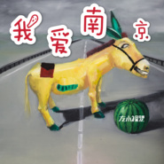

我爱南京
============================

|  |  |
| :--: | :-- |
| [ 我爱南京](https://emumo.xiami.com/album/2108380095) | **艺人**: [左小祖咒](../index.md) **语种**: 国语 **唱片公司**: 左小祖咒工作室 **发行时间**: 2020年04月29日 **专辑类别**: EP, 单曲 **专辑风格**: 民谣 Folk, 当代民谣 Contemporary Folk, 另类摇滚 Alternative Rock **播放数**: 42567 **收藏数**: 37 **评论数**: 22  |

## 简介

## 曲目

- [我爱南京](./2108380095/xUpZCucbfb6.md)

## 评论

|  |  |  |  |
| :-- | :-- | :-- | :-- |
|  [虾米用户](https://emumo.xiami.com/u/222802757) 单循控  没电脑只有果1... 2020-08-07 19:06 赞(1) 踩(0) | 
爱了 左小加雨墨的编曲～妩媚温暖小复古且不腻   听不厌
 |
|  [虾米用户](https://emumo.xiami.com/u/413798934) 我 2020-06-23 22:14 赞(0) 踩(0) | 
总是喜欢没办法
 |
|  [虾米用户](https://emumo.xiami.com/u/5806141)  2020-06-14 14:37 赞(0) 踩(0) | 
致敬 李BB吗
 |
|  [虾米用户](https://emumo.xiami.com/u/20699580) Are you an a... 2020-06-10 11:36 赞(0) 踩(0) | 
我也爱南京
 |
|  [虾米用户](https://emumo.xiami.com/u/18210853) 万能的金属不在时间门外 2020-05-13 13:32 赞(1) 踩(0) | 
B哥和左小就够了
 |
|  [虾米用户](https://emumo.xiami.com/u/280483507)   2020-05-12 18:04 赞(0) 踩(0) | 
可能是左叔有歌词的歌曲里面最容易让人第一次听就接受的歌曲。
 |
|  [虾米用户](https://emumo.xiami.com/u/261301937) 摇滚文青 2020-05-11 17:10 赞(2) 踩(0) | 
摇滚乐最核心最内核的不是什么虚幻的摇滚精神，而是批判和态度！
 |
|  [虾米用户](https://emumo.xiami.com/u/40025171) 杂食动物来者不拒 2020-05-06 21:30 赞(0) 踩(0) | 
你再唱南京就不爱你了-_-||
 |
|  [虾米用户](https://emumo.xiami.com/u/8579292) Rhythm blues... 2020-05-06 15:02 赞(1) 踩(0) | 
我也爱
 |
|  [虾米用户](https://emumo.xiami.com/u/638437) 在路上 2020-05-04 00:03 赞(1) 踩(0) | 
不错
 |
|  [虾米用户](https://emumo.xiami.com/u/433565240) 教小朋友投资！！ 2020-05-01 13:12 赞(0) 踩(0) | 
？？？
 |
|  [虾米用户](https://emumo.xiami.com/u/316951273)  2020-05-01 01:32 赞(0) 踩(0) | 
嗯
 |
|  [虾米用户](https://emumo.xiami.com/u/344836157) 好久不见，祝大家开心。 2020-05-01 01:29 赞(0) 踩(0) | 
柔化了，也很好！
 |
|  [虾米用户](https://emumo.xiami.com/u/349233856)  2020-04-30 12:24 赞(0) 踩(0) | 
会回来的
 |
|  [虾米用户](https://emumo.xiami.com/u/1796724)  2020-04-30 11:50 赞(0) 踩(0) | 
走民谣路线就对了嘛！
 |
|  [虾米用户](https://emumo.xiami.com/u/260167529) 爱音乐的疯子 2020-04-30 11:48 赞(2) 踩(0) | 
这次唱的非常顺耳 难得啊 很民谣
 |
|  [虾米用户](https://emumo.xiami.com/u/999948) 这家伙很装逼什么也没留下... 2020-04-30 07:19 赞(1) 踩(0) | 
你离开了南京，从此没有人和我说话。
 |
|  [虾米用户](https://emumo.xiami.com/u/23641059) 虾友们W98357917... 2020-04-29 21:01 赞(1) 踩(0) | 
，
 |
|  [虾米用户](https://emumo.xiami.com/u/1929787) 让一部分非洲大人富起来，... 2020-04-29 20:22 赞(2) 踩(0) | 
你离开了南京从此没人和我说话  ------李B
 |
|  [虾米用户](https://emumo.xiami.com/u/324850786) 當你我錯過今天 人潮將彼... 2020-04-29 20:13 赞(2) 踩(0) | 
合作的女歌手呢
 |
| ⇒ |  [虾米用户](https://emumo.xiami.com/u/316261284) ☁:星屿___ 2020-04-29 20:37 赞(0) 踩(0) | 
哈哈哈
 |
|  [虾米用户](https://emumo.xiami.com/u/43492923) 行到水穷我才开始害怕，夕... 2020-04-29 20:13 赞(1) 踩(0) | 
-
 |
