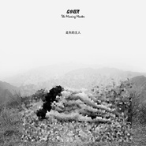

走失的主人
============================

|  |  |
| :--: | :-- |
| [ 走失的主人](https://emumo.xiami.com/album/317714) | **艺人**: [左小祖咒](../index.md) **语种**: 国语 **唱片公司**: 左小祖咒工作室 **发行时间**: 1998年10月31日 **专辑类别**: 录音室专辑 **专辑风格**: 迷幻摇滚 Psychedelic Rock, 摇滚 Rock & Roll, 后朋克 Post-Punk **播放数**: 249175 **收藏数**: 1386 **评论数**: 151  |

## 简介

被评为〝一种肮脏病态美学〞、〝唯美的刑台〞、〝是偏执狂最极端的深思熟虑式朋克〞、〝既有暴烈的先锋之声&nbsp;又有至纯的感性抒情〞、〝NO的污秽诗篇所表现的是一个世纪走向终结时，人们复杂的心情，像中国白喜一样，是在葬礼上的一次热闹非凡的吹吹打打〞、〝是探索家精神与诗人气质的完美结合〞、〝是一种临界现象，是一种玲珑、凄惨、相对软弱的灭绝品种，有点像初吻的勇气或吻后的怀疑〞、〝丝绒革命的另一面〞、〝我们听到了一种狂暴、扭曲、诡异、愤怒声音，这就是NO乐队和他们的灵魂人物左小发出的声音〞、〝无论《走失的主人》引起的是惊惧，是感动，是厌恶，是沉思。它最终在雄辩的混乱中完成了对人格的震撼〞，如上被种种极端与异化文字所论述的专辑，经过了十年间乐迷的考验与社会沉淀，早已稳固地确定了它在中国摇滚进程中不可撼动地，竖起世代交替的标竿地位。  
这张对中国摇滚发展具有革命性标志与新世代宣言式的作品，同样意味着足以超越时空局限，并具有永恒价值的第一步，也是左小祖咒创作生命中最重要的一大步。这张处女专辑被形容为：的错乱声乐革命，的荒诞灵魂叫嚣，的无聊精神冷酷，的绝情文化颠覆&nbsp;。

## 曲目

- [走失的主人](./317714/bqH8WYy35fb5.md)
- [正宗Genuine](./317714/cqGs7faa51.md)
- [新长安New Chang An](./317714/fE3Ak654fe.md)
- [阿丝玛Asma](./317714/bAIQpc21b3.md)
- [让我再见一次大夫Let Me See the Surgeon Again](./317714/ULxW6c3cd.md)
- [关河令Guan He Song](./317714/cqGsBf4248.md)
- [勋章之梦Dream Of Medal](./317714/ULxY84b8b.md)
- [六枝花Six Flowers](./317714/bAIQtd836d.md)
- [媚笑阳台Flattering Balcony](./317714/cqGsE1e0ed.md)

## 评论

|  |  |  |
| :-- | :-- | :-- |
|  [虾米用户](https://emumo.xiami.com/u/203939497)  2020-11-02 12:04 赞(0) 踩(0) | 
可算想起来打码了
 |
|  [虾米用户](https://emumo.xiami.com/u/283307881)  2020-09-19 23:47 赞(0) 踩(0) | 
万能的马赛克
 |
|  [虾米用户](https://emumo.xiami.com/u/7246495) Duet. 2020-09-01 18:57 赞(1) 踩(0) | 
最好听的部分是贝司
 |
|  [虾米用户](https://emumo.xiami.com/u/33737266) たけしの死ぬための生き方 2020-08-07 16:29 赞(0) 踩(0) | 
封面自我阉割了
 |
|  [虾米用户](https://emumo.xiami.com/u/347352104)  2020-07-09 15:23 赞(0) 踩(0) | 
.
 |
|  [虾米用户](https://emumo.xiami.com/u/47410192) feifeirun 2018-10-31 21:31 赞(1) 踩(0) | 
二十年了
 |
|  [虾米用户](https://emumo.xiami.com/u/338744450) 看的见我的未来 2018-09-11 14:48 赞(3) 踩(0) | 
这封面什么玩意儿这是！   
 |
|  [虾米用户](https://emumo.xiami.com/u/297999609) 去克洛里吧 2018-07-09 00:09 赞(0) 踩(0) | 

 |
|  [虾米用户](https://emumo.xiami.com/u/115308254) 你来看我啦 2018-06-13 16:27 赞(2) 踩(0) | 
&amp;ldquo;一群裸男如何过一条有食人鱼的河？&amp;rdquo;
 |
|  [虾米用户](https://emumo.xiami.com/u/5168071) Keep walking 2018-06-06 18:41 赞(4) 踩(0) | 
98年发行的这个版本不是这个封面。这个封面是09年再版的封面。 <a href="https://music.douban.com/subject/1419356/" target="_blank" rel="nofollow noreferrer noopener">https://music.douban.com/subject/1419356/</a>
 |
|  [虾米用户](https://emumo.xiami.com/u/6088217)  2018-05-10 15:53 赞(0) 踩(0) | 
再听 左老板儿在&amp;ldquo;东村&amp;rdquo;的嗓儿～
 |
|  [虾米用户](https://emumo.xiami.com/u/15811423)  2018-02-14 15:51 赞(1) 踩(0) | 
左小祖宗
 |
|  [虾米用户](https://emumo.xiami.com/u/43492923) 行到水穷我才开始害怕，夕... 2018-02-01 21:09 赞(0) 踩(0) | 
棒
 |
|  [虾米用户](https://emumo.xiami.com/u/6384723)   2018-01-30 04:33 赞(1) 踩(0) | 
左叔只喜欢他早期的作品，虽然现在几乎不听他的歌了，关河令仍然是最喜欢的他的歌。
 |
|  [虾米用户](https://emumo.xiami.com/u/48084409) 我还没想好要写什么.. 2018-01-04 20:33 赞(3) 踩(0) | 
NO乐队是左小最实验最先锋的时期，那时他还叫祖咒，乐队成员还有边巴平措和夜千
 |
|  [虾米用户](https://emumo.xiami.com/u/6037950) No surprises 2017-12-30 06:07 赞(1) 踩(0) | 
还是唐朝女牵着人狗那封面好吧，那个年代才看到那封面创意感到很有意思，现在是觉得很经典，也怀念
 |
| ⇒ |  [虾米用户](https://emumo.xiami.com/u/194548)  2018-01-28 00:21 赞(0) 踩(0) | 
你说的。。。。。。没错
 |
|  [虾米用户](https://emumo.xiami.com/u/13601734) 分享你 2017-10-27 23:39 赞(4) 踩(0) | 
《为无名山增高一米》是由一群来自北京“东村”的艺术家王世华、苍鑫、高炀、左小祖咒、马宗垠、张洹、马六明、张彬彬、朱冥、段英梅，共同创作。
 |
|  [虾米用户](https://emumo.xiami.com/u/250237955) Yingmei Duan 2016-11-27 23:53 赞(2) 踩(0) | 
正宗歌曲是和段英梅一起唱的，不是徐桐
 |
|  [虾米用户](https://emumo.xiami.com/u/47776922) 小马，你以前不是这样的 2016-10-26 11:50 赞(0) 踩(0) | 
左小实验 实验左小
 |
|  [虾米用户](https://emumo.xiami.com/u/28081732)  2016-10-14 11:45 赞(1) 踩(0) | 
09年这张确实不咋滴  编曲很土
 |
| ⇒ |  [虾米用户](https://emumo.xiami.com/u/124058)   2017-06-20 02:55 赞(0) 踩(0) | 
。。这张是99年的，09年原封不动再版
 |
|  [虾米用户](https://emumo.xiami.com/u/2303145) 我在荒岛上迎接黎明，太阳... 2016-09-26 15:56 赞(1) 踩(0) | 
编曲一级棒
 |
| ⇒ |  [虾米用户](https://emumo.xiami.com/u/6765500) 做一个有趣的人窦唯微信群... 2019-07-16 19:09 赞(0) 踩(0) | 
编曲是谁啊
 |
|  [虾米用户](https://emumo.xiami.com/u/44008091) 再见明天 2016-08-05 21:59 赞(0) 踩(0) | 
_
 |
|  [虾米用户](https://emumo.xiami.com/u/11563246) Che vuoi? 2015-12-24 20:27 赞(2) 踩(0) | 
这张好= = 网易听完了 虾米打卡
 |
|  [虾米用户](https://emumo.xiami.com/u/4330536)  2015-11-28 12:41 赞(0) 踩(0) | 
牛逼！
 |
|  [虾米用户](https://emumo.xiami.com/u/52039193) 或我应该相信是缘分 2015-10-27 09:54 赞(2) 踩(0) | 
2000年买的摩登天空首版苍蝇，no，特别喜欢走失的主人这张，无数个夜晚听着入睡，里面的吉他音色让我觉得特别美，和当时听的摇滚不一样，很像60年代的音色，从这张唱片之后能接受并喜欢那些60年代的大师了，鼓手张蔚特别棒，太喜欢这鼓的音色了，bass李剑现在成大腕了，改名李九君
 |
| ⇒ |  [虾米用户](https://emumo.xiami.com/u/525562) 青山青水青少年 2017-01-25 20:44 赞(0) 踩(0) | 
你听的六十年代哪个乐队这个音色了
 |
|  [虾米用户](https://emumo.xiami.com/u/6388480)  2015-10-16 09:09 赞(1) 踩(0) | 
十几年前买的左小祖咒的一张专辑，封面不是这样的，当时听完就崩溃了，还有这样唱歌的！！！但现在越来越喜欢听听他的歌
 |
|  [虾米用户](https://emumo.xiami.com/u/12058916) 自由的心 2015-10-05 21:35 赞(0) 踩(0) | 
.... 更喜欢前期作品诶
 |
|  [虾米用户](https://emumo.xiami.com/u/2339603) 别给我推radiohea... 2015-09-18 09:51 赞(0) 踩(0) | 
第二张糟透了
 |
|  [虾米用户](https://emumo.xiami.com/u/4337763) 我还没想好要写什么... 2015-08-21 14:42 赞(0) 踩(0) | 
这张好
 |
|  [虾米用户](https://emumo.xiami.com/u/1742487)  2015-07-23 00:45 赞(0) 踩(0) | 
我为无名山增高一米。
 |
|  [虾米用户](https://emumo.xiami.com/u/16888725) 952711 2015-07-20 15:04 赞(0) 踩(0) | 
niubi
 |
|  [虾米用户](https://emumo.xiami.com/u/355865) Let it go, l... 2015-06-21 10:07 赞(0) 踩(0) | 
<a href="http://emumo.xiami.com/u/6630660" target="_blank" rel="nofollow" name_card="6630660">@乱七∞糟</a> <a href="http://emumo.xiami.com/u/30705" target="_blank" rel="nofollow" name_card="30705">@beson</a> 这张专辑的首版资料需要呈现不？目前是2009年的10年后的再版资料。首版是1999年摩登天空出品的，专辑以NO乐队的名义发行。首版封面非常不同。曲序跟CD1是一样的。  另外，发现CD2的收录曲目跟<a href="http://www.xiami.com/album/356211" target="_blank" rel="nofollow noreferrer noopener">http://www.xiami.com/album/356211</a>这张貌似重叠率也非常之高。不过这个问题不是特别关键。
 |
|  [虾米用户](https://emumo.xiami.com/u/482881) 不愿散曲的未央歌 到后来... 2015-06-03 07:22 赞(1) 踩(0) | 
五年之前喜欢左小，但听的都是后期的作品。今天突然重新听到走失的主人，发现真的是神作。
 |
|  [虾米用户](https://emumo.xiami.com/u/3501937)  2015-05-08 16:20 赞(1) 踩(0) | 
封面是吕楠的片子
 |
|  [虾米用户](https://emumo.xiami.com/u/44653196)  2015-03-30 18:56 赞(1) 踩(0) | 
很多人说他跑调，但是他的歌调就是他自己的。根本就不存在跑调。
 |
|  [虾米用户](https://emumo.xiami.com/u/9585575) 友川かずき脑残粉 2015-02-28 03:55 赞(0) 踩(0) | 
《让我再见一次大夫》听出了AVANT-FOCK和丝绒倾向
 |
|  [虾米用户](https://emumo.xiami.com/u/42392037)  2014-12-18 18:37 赞(0) 踩(0) | 
看看
 |
|  [虾米用户](https://emumo.xiami.com/u/11968494) . 2014-11-26 13:01 赞(0) 踩(0) | 
.
 |
|  [虾米用户](https://emumo.xiami.com/u/25106387) 随便听听 2014-08-24 14:58 赞(0) 踩(0) | 
听了头皮发炸。好听
 |
|  [虾米用户](https://emumo.xiami.com/u/373683) 思想不是处才可怕 2014-04-27 02:07 赞(0) 踩(0) | 
有人能上传个老版吗
 |
| ⇒ |  [虾米用户](https://emumo.xiami.com/u/355865) Let it go, l... 2015-06-21 10:08 赞(0) 踩(0) | 
如楼上所示，也有一些乐迷希望首版资料呈现。<a href="http://emumo.xiami.com/u/30705" target="_blank" rel="nofollow" name_card="30705">@beson</a>
 |
|  [虾米用户](https://emumo.xiami.com/u/6990386)  2014-03-06 19:02 赞(0) 踩(0) | 
实在太牛逼
 |
|  [虾米用户](https://emumo.xiami.com/u/6958676)  2013-12-17 23:47 赞(2) 踩(0) | 
上架，下架，上架，下架。。。
 |
|  [虾米用户](https://emumo.xiami.com/u/1667369) 香港的一些老歌总唤起自己... 2013-11-12 20:01 赞(0) 踩(0) | 
無奈、黑色、幽默、小品、詩。。。
 |
|  [虾米用户](https://emumo.xiami.com/u/5159295)  2013-10-20 21:09 赞(1) 踩(0) | 
想吃宫爆鸡丁了
 |
|  [虾米用户](https://emumo.xiami.com/u/5765082) 来自第九区 2013-09-23 23:17 赞(0) 踩(0) | 
关河令真好听啊
 |
|  [虾米用户](https://emumo.xiami.com/u/8244559)  2013-09-22 10:40 赞(0) 踩(0) | 
******
 |
|  [虾米用户](https://emumo.xiami.com/u/597569) 何必故作姿态 2013-08-08 11:27 赞(0) 踩(0) | 
封面100分?
 |
|  [虾米用户](https://emumo.xiami.com/u/1534178)  2013-06-05 11:37 赞(0) 踩(0) | 
怎么下架了怎么下架了怎么下架了
 |
|  [虾米用户](https://emumo.xiami.com/u/11384320) 迷失的季节 2013-05-07 07:48 赞(0) 踩(0) | 
马B 为什么下架？
 |
|  [虾米用户](https://emumo.xiami.com/u/1670098) 快到我碗里来  ~~~ 2013-04-03 15:10 赞(0) 踩(0) | 
毛驴 毛驴 毛驴啊 ~~~
 |
|  [虾米用户](https://emumo.xiami.com/u/13764311)  2013-04-01 12:54 赞(0) 踩(0) | 
无名诗人
 |
|  [虾米用户](https://emumo.xiami.com/u/12469489) 郭紫春 2013-02-24 16:21 赞(0) 踩(0) | 
阿丝玛···
 |
|  [虾米用户](https://emumo.xiami.com/u/9991351)  2013-02-23 19:57 赞(1) 踩(0) | 
再版精致了，有点念当初那股子粗糙！！！！！
 |
|  [虾米用户](https://emumo.xiami.com/u/2920632)  2013-01-31 23:02 赞(0) 踩(0) | 
“走失”首版中透露这那种地下的狂躁和自渎式的反省在这张重混专辑中显得荡然无存。也许吴先生对首版lo-fi的录音还耿耿于怀。譬如他在某期谈话节目中向窦文涛抱怨早期的中国摇滚界缺乏专业录音师，乐器的好多效果都没有表现出来云云，以至于他干脆以个人名义来做这张再版。 从唱片效果来看，确实达到了该有的效果，猛一听还有国外大牌的感觉。但是那种当年的锐气似乎已经被岁月的砂纸磨掉了几分成色。Disc2有一种致敬的味道，这是值得肯定的，毕竟吴先生在中国的文化界还算颇有人缘。
 |
| ⇒ |  [虾米用户](https://emumo.xiami.com/u/5666721)  2016-04-04 12:42 赞(0) 踩(0) | 
某谈话节目就是锵锵吧。。。哪一期啊
 |
| ⇒ |  [虾米用户](https://emumo.xiami.com/u/2920632)  2016-04-04 20:15 赞(0) 踩(0) | 
<q><b>弥天乐说：</b></q>
 |
|  [虾米用户](https://emumo.xiami.com/u/599326) 永远年轻，永远热泪盈眶~ 2012-11-02 20:22 赞(0) 踩(0) | 
喜欢。
 |
|  [虾米用户](https://emumo.xiami.com/u/1539515) 我还没想好要写什么... 2012-10-26 21:16 赞(1) 踩(0) | 
关河令和苦鬼十几年前在病孩子上听到的。我从来没有想到过你可以获得今天这样的市场。唉
 |
| ⇒ |  [虾米用户](https://emumo.xiami.com/u/3605287)  2013-03-20 10:32 赞(0) 踩(0) | 
还有几个记得病孩子呢
 |
| ⇒ |  [虾米用户](https://emumo.xiami.com/u/1539515) 我还没想好要写什么... 2013-03-22 21:36 赞(0) 踩(0) | 
<q><b>毁灭三说：</b></q>
 |
|  [虾米用户](https://emumo.xiami.com/u/2363866)  2012-10-17 22:14 赞(0) 踩(0) | 
怪诞里的柔软
 |
|  [虾米用户](https://emumo.xiami.com/u/3206053) 照章办事 2012-08-24 18:06 赞(0) 踩(0) | 
我最想听香港的那版，到处找不到
 |
|  [虾米用户](https://emumo.xiami.com/u/6769973) 寻找慰藉旋律 早就上了瘾 2012-06-10 21:11 赞(0) 踩(0) | 
一向喜欢这样的感觉的说  懒懒懒的  又激情的说
 |
|  [虾米用户](https://emumo.xiami.com/u/78744)  2012-05-19 11:35 赞(0) 踩(0) | 
当年听就震撼得很，
 |
|  [虾米用户](https://emumo.xiami.com/u/9186631)  2012-05-16 10:15 赞(0) 踩(0) | 
tyujyjhj
 |
|  [虾米用户](https://emumo.xiami.com/u/7206952) jiawei 2012-04-21 22:05 赞(1) 踩(0) | 
丝绒之子
 |
|  [虾米用户](https://emumo.xiami.com/u/8220632)  2012-03-26 19:46 赞(0) 踩(0) | 
《走失的主人》大部分是在东村写的歌，非常凶猛，撕扯着我每一根头发，疼痛而发痒。左小祖咒的声音原始得有种无法解释的美感，不可质疑的，这是张充满挑战的专集。
 |
|  [虾米用户](https://emumo.xiami.com/u/4394128)  2012-03-18 23:27 赞(0) 踩(0) | 
左小祖咒
 |
|  [虾米用户](https://emumo.xiami.com/u/7811539) silence 2012-02-25 11:45 赞(0) 踩(0) | 
中午醒来 醒醒酒 听左小……非常醒酒
 |
|  [虾米用户](https://emumo.xiami.com/u/312179) 潜入深蓝，放肆幻听 2012-02-19 16:44 赞(0) 踩(0) | 
正宗太有感觉了。
 |
| ⇒ |  [虾米用户](https://emumo.xiami.com/u/373683) 思想不是处才可怕 2014-04-27 02:05 赞(0) 踩(0) | 
同爱
 |
|  [虾米用户](https://emumo.xiami.com/u/4214576) 我还没想好要写什么... 2012-02-16 09:31 赞(0) 踩(0) | 
room
 |
|  [虾米用户](https://emumo.xiami.com/u/60048)  2012-02-13 19:56 赞(0) 踩(0) | 
没说！这张要把《狂犬吠墓》一块卖才算正确的.....
 |
|  [虾米用户](https://emumo.xiami.com/u/686143)  2012-01-27 14:22 赞(0) 踩(0) | 
封面是为无名山增高一米么？
 |
|  [虾米用户](https://emumo.xiami.com/u/6387963) 我还没想好要写什么... 2012-01-05 09:14 赞(0) 踩(0) | 
为什么专辑里没有原版《走失的主人》？？更喜欢那张！
 |
| ⇒ |  [虾米用户](https://emumo.xiami.com/u/7506808)  2012-01-14 21:39 赞(0) 踩(0) | 
原版的在No乐队里能找到...
 |
| ⇒ |  [虾米用户](https://emumo.xiami.com/u/6387963) 我还没想好要写什么... 2012-01-15 18:15 赞(0) 踩(0) | 
<q><b>Suppon！说：</b></q>
 |
|  [虾米用户](https://emumo.xiami.com/u/7359333)  2011-12-22 20:24 赞(5) 踩(0) | 
这封面不是艾未未的么？
 |
|  [虾米用户](https://emumo.xiami.com/u/6956904) 定西 2011-11-30 15:48 赞(0) 踩(0) | 
KK
 |
|  [虾米用户](https://emumo.xiami.com/u/6740419)  2011-11-15 11:54 赞(0) 踩(0) | 
喜欢左小，喜欢民谣
 |
|  [虾米用户](https://emumo.xiami.com/u/3188423)  2011-11-03 20:07 赞(0) 踩(0) | 
另一种躁动
 |
|  [虾米用户](https://emumo.xiami.com/u/1631250)   2011-10-31 15:34 赞(0) 踩(0) | 
这就是中国的Lou Reed....
 |
|  [虾米用户](https://emumo.xiami.com/u/645218) 任性逍遥于有欲无欲之间 2011-10-30 12:14 赞(0) 踩(0) | 
喜欢这个调调
 |
|  [虾米用户](https://emumo.xiami.com/u/3510778)  2011-10-15 10:19 赞(0) 踩(0) | 
左小诅咒？
 |
|  [虾米用户](https://emumo.xiami.com/u/6232759) 喔喔喔奶糖 2011-10-13 15:38 赞(0) 踩(0) | 
越听越喜欢
 |
|  [虾米用户](https://emumo.xiami.com/u/6088217)  2011-10-11 22:10 赞(0) 踩(0) | 
xi huan
 |
|  [虾米用户](https://emumo.xiami.com/u/1485697)  2011-10-05 09:25 赞(0) 踩(0) | 
骨灰级经典
 |
|  [虾米用户](https://emumo.xiami.com/u/757170)  2011-09-22 14:36 赞(0) 踩(0) | 
先是摞了一堆猪，然后是摞了一堆女人.............左小啊........
 |
| ⇒ |  [虾米用户](https://emumo.xiami.com/u/1569233)   2011-09-26 02:04 赞(0) 踩(0) | 
你顺序弄反了。
 |
| ⇒ |  [虾米用户](https://emumo.xiami.com/u/757170)  2011-09-26 13:00 赞(0) 踩(0) | 
<q><b>反犬草田说：</b></q>
 |
| ⇒ |  [虾米用户](https://emumo.xiami.com/u/757170)  2011-09-29 17:30 赞(0) 踩(0) | 
<q><b>说：</b></q>
 |
|  [虾米用户](https://emumo.xiami.com/u/3255139)  2011-09-11 16:43 赞(0) 踩(0) | 
感觉
 |
|  [虾米用户](https://emumo.xiami.com/u/5591001)  2011-08-27 10:12 赞(0) 踩(0) | 
喜欢这种絮絮叨叨的感觉，没有刻意的感觉。
 |
|  [虾米用户](https://emumo.xiami.com/u/61745) yy 2011-08-20 04:32 赞(0) 踩(0) | 
... 这张的封面和另外一张遥相呼应......
 |
|  [虾米用户](https://emumo.xiami.com/u/1615836)  2011-08-10 14:05 赞(0) 踩(0) | 
我非常喜欢这张
 |
|  [虾米用户](https://emumo.xiami.com/u/2814644)  2011-07-26 10:19 赞(0) 踩(0) | 
好歌好歌
 |
|  [虾米用户](https://emumo.xiami.com/u/3625165)  2011-07-22 15:40 赞(0) 踩(0) | 
最喜欢的一张祖咒的专辑
 |
|  [虾米用户](https://emumo.xiami.com/u/312179) 潜入深蓝，放肆幻听 2011-07-03 10:45 赞(0) 踩(0) | 
正宗!正宗!
 |
|  [虾米用户](https://emumo.xiami.com/u/3179626)  2011-06-27 22:43 赞(0) 踩(0) | 
不知道
 |
|  [虾米用户](https://emumo.xiami.com/u/2624533) 打鼓的 2011-06-24 16:02 赞(0) 踩(0) | 
牛啊~~~~~~~~~
 |
|  [虾米用户](https://emumo.xiami.com/u/591117) 我还没想好要写什么... 2011-06-24 12:20 赞(0) 踩(0) | 
可以试听了
 |
|  [虾米用户](https://emumo.xiami.com/u/3619939)  2011-06-24 03:25 赞(0) 踩(0) | 
有人祈求高高阳台……
 |
|  [虾米用户](https://emumo.xiami.com/u/806724)  2011-06-23 18:24 赞(0) 踩(0) | 
媚笑阳台经典啊
 |
|  [虾米用户](https://emumo.xiami.com/u/1776437)   2011-06-23 15:19 赞(0) 踩(0) | 
《走失的主人》应该是是无法复制的。disc 2没必要要.
 |
|  [虾米用户](https://emumo.xiami.com/u/1550249) 我还没想好要写什么... 2011-06-23 14:18 赞(0) 踩(0) | 
终于又出来了  以为虾米要一禁到底呢……
 |
|  [虾米用户](https://emumo.xiami.com/u/721351)  2010-10-02 10:40 赞(0) 踩(0) | 
要是不跑调，左小就不是左小了！
 |
|  [虾米用户](https://emumo.xiami.com/u/509825)  2010-08-07 11:37 赞(0) 踩(0) | 
收起来~~
 |
|  [虾米用户](https://emumo.xiami.com/u/610834) 我还没想好要写什么... 2010-07-06 17:16 赞(1) 踩(0) | 
内容已删除
 |
| ⇒ |  [虾米用户](https://emumo.xiami.com/u/411732)  2010-08-05 13:04 赞(0) 踩(0) | 
刘德华大明星就不是冒充的吗？你怎么不骂他？连你什么都没有，都冒充自己很牛逼来，就算左小长得不帅也不说明他没有冒充的资本，你只是看左小祖咒不顺眼，大可以眼不见心不烦，却不必“专门”辛苦跑到这里舔一下左小的屁股，又立马吐出来，说不好
 |
| ⇒ |  [虾米用户](https://emumo.xiami.com/u/1122702)  2010-09-26 19:27 赞(0) 踩(0) | 
老兄，你看你一点都不。。。招来了这么。。。 哎
 |
| ⇒ |  [虾米用户](https://emumo.xiami.com/u/1652507)  2011-06-23 19:00 赞(0) 踩(0) | 
周杰伦，林志炫很适合正常人听。我也是个疯子。
 |
| ⇒ |  [虾米用户](https://emumo.xiami.com/u/27658) 导演 / 制片人 2011-08-23 11:52 赞(0) 踩(0) | 
传说中的五毛现身了？
 |
| ⇒ |  [虾米用户](https://emumo.xiami.com/u/1776437)   2011-08-24 22:05 赞(0) 踩(0) | 
<q><b>永远的蓝色海说：</b></q>
 |
|  [虾米用户](https://emumo.xiami.com/u/849243)  2010-05-05 18:28 赞(0) 踩(0) | 
听这个是需要勇气的，因为会听得人精神崩溃、头破血流。
 |
|  [虾米用户](https://emumo.xiami.com/u/165257)  2010-04-29 14:12 赞(0) 踩(0) | 
中国目前最好的摇滚专辑之一
 |
|  [虾米用户](https://emumo.xiami.com/u/719128)  2010-03-09 03:22 赞(0) 踩(0) | 
很多地方都删掉了，这里还有，真好
 |
|  [虾米用户](https://emumo.xiami.com/u/509074)  2009-11-27 23:55 赞(0) 踩(0) | 
喜欢虎子很多年。当时病医生乐队时代的夜上浓妆给我太多珍藏的喜爱。
 |
|  [虾米用户](https://emumo.xiami.com/u/463960)  2009-10-30 21:24 赞(0) 踩(0) | 
还是喜欢初版的,质朴的声音苍凉的音乐...
 |
|  [虾米用户](https://emumo.xiami.com/u/376769) 活着的，最寂寞 2009-10-14 02:18 赞(0) 踩(0) | 
终极版本没原版好。。。
 |
|  [虾米用户](https://emumo.xiami.com/u/427466)  2009-10-07 21:35 赞(1) 踩(0) | 
有多少人是不懂装懂？至少我听不懂。你们不要只是说他好，请说出他好在哪里，我也可以好好体会他的音乐
 |
| ⇒ |  [虾米用户](https://emumo.xiami.com/u/411732)  2009-10-09 21:11 赞(0) 踩(0) | 
首先，你的体会方式有问题 音乐不是用来懂得 感受是第一位的 不喜欢是正常的 不必勉强
 |
| ⇒ |  [虾米用户](https://emumo.xiami.com/u/376769) 活着的，最寂寞 2009-10-14 02:23 赞(0) 踩(0) | 
聆听老左的音乐必须将旋律与歌词分开~旋律只是衬托，歌词才是主题~混乱、无序、污秽、肮脏、真实、痛苦、扭曲、隐喻...显然无法吸引只想纯粹欣赏歌曲的听众。。。品味老左的音乐你得把它们当成有旋律的诗歌对待。。。
 |
| ⇒ |  [虾米用户](https://emumo.xiami.com/u/66494)  2009-10-24 19:21 赞(0) 踩(0) | 
<q><b>Sodom_Crow说：</b></q>
 |
| ⇒ |  [虾米用户](https://emumo.xiami.com/u/66494)  2009-10-24 19:26 赞(0) 踩(0) | 
<q><b>永远的蓝色海说：</b></q>
 |
| ⇒ |  [虾米用户](https://emumo.xiami.com/u/376769) 活着的，最寂寞 2009-10-25 11:23 赞(0) 踩(0) | 
<q><b>rockroll说：</b></q>
 |
| ⇒ |  [虾米用户](https://emumo.xiami.com/u/66494)  2009-10-25 14:26 赞(0) 踩(0) | 
<q><b>Sodom_Crow说：</b></q>
 |
| ⇒ |  [虾米用户](https://emumo.xiami.com/u/332689)  2010-08-07 18:06 赞(0) 踩(0) | 
这就叫做吃不到葡萄，说葡萄酸。哎，这俗话说的真好！
 |
| ⇒ |  [虾米用户](https://emumo.xiami.com/u/332689)  2010-08-07 18:07 赞(0) 踩(0) | 
<q><b>Sodom_Crow说：</b></q>
 |
|  [虾米用户](https://emumo.xiami.com/u/400367)  2009-10-06 23:29 赞(0) 踩(0) | 
磕碰了啊啊
 |
|  [虾米用户](https://emumo.xiami.com/u/400367)  2009-10-06 23:26 赞(0) 踩(0) | 
除了牛 没别的
 |
|  [虾米用户](https://emumo.xiami.com/u/183580)   2009-10-01 14:05 赞(0) 踩(0) | 
。。。
 |
|  [虾米用户](https://emumo.xiami.com/u/411732)  2009-10-01 13:25 赞(0) 踩(0) | 
经典阿丝玛
 |
|  [虾米用户](https://emumo.xiami.com/u/411732)  2009-09-28 12:46 赞(0) 踩(0) | 
超级棒
 |
|  [虾米用户](https://emumo.xiami.com/u/361993)  2009-09-05 00:33 赞(0) 踩(0) | 
绝对的高雅音乐 贵族音乐 ！
 |
|  [虾米用户](https://emumo.xiami.com/u/361993)  2009-09-05 00:24 赞(0) 踩(0) | 
绝对的高雅音乐 贵族音乐 ！
 |
|  [虾米用户](https://emumo.xiami.com/u/361056) 保持敏感，保持激情，保持... 2009-09-02 11:21 赞(1) 踩(0) | 
在喧哗的表面下左小的音乐本质上是沉默
 |
| ⇒ |  [虾米用户](https://emumo.xiami.com/u/721351)  2010-10-02 11:00 赞(0) 踩(0) | 
同感！！有些歌其实很伤感的
 |
|  [虾米用户](https://emumo.xiami.com/u/361056) 保持敏感，保持激情，保持... 2009-09-02 11:05 赞(0) 踩(0) | 
大餐
 |
|  [虾米用户](https://emumo.xiami.com/u/299163) 听不过来 2009-08-20 10:48 赞(0) 踩(0) | 
怎么听?
 |
|  [虾米用户](https://emumo.xiami.com/u/34307)  2009-08-06 17:48 赞(0) 踩(0) | 
祖大~原谅我从来没买过你的正版CD
 |
| ⇒ |  [虾米用户](https://emumo.xiami.com/u/4158) 一念心清凈，走進極樂境。 2009-08-17 14:32 赞(0) 踩(0) | 
看张北音乐节祖咒的视频看到一半就忍不住打开网页订购了此张。以后继续听MP3跟APE的，买了放着当收藏了~
 |
|  [虾米用户](https://emumo.xiami.com/u/34307)  2009-08-06 17:48 赞(0) 踩(0) | 
祖大~原谅我从来没买过你的正版CD
 |
|  [虾米用户](https://emumo.xiami.com/u/92913)  2009-07-21 12:53 赞(0) 踩(0) | 
唱出真理！
 |
|  [虾米用户](https://emumo.xiami.com/u/69047)  2009-03-10 12:06 赞(0) 踩(0) | 
十年前买过他这个专辑，
 |
|  [虾米用户](https://emumo.xiami.com/u/60048)  2009-03-05 15:01 赞(0) 踩(0) | 
十年之后，祖大被人传唱了，可怕的时代即将到来！我还以为《狂犬》也随碟打包呢！那似乎是和主人不可分的东西~
 |
| ⇒ |  [虾米用户](https://emumo.xiami.com/u/2089)  2009-03-09 21:58 赞(0) 踩(0) | 
这条裤衩似乎眼熟？！
 |
|  [虾米用户](https://emumo.xiami.com/u/66139) 我们病了。。。 2009-03-04 10:52 赞(0) 踩(0) | 
“一个追求无限完美的人，一个高尚的人。” 要是所有音乐人都像祖大学习，那，我们的耳朵有福了。
 |
