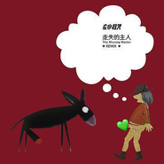

走失的主人 (Remix版)the missing master remix
============================

|  |  |
| :--: | :-- |
| [ 走失的主人 (Remix版)the missing master remix](https://emumo.xiami.com/album/356211) | **艺人**: [左小祖咒](../index.md) **语种**: 国语 **唱片公司**: 左小祖咒工作室 **发行时间**: 2009年12月21日 **专辑类别**: 录音室专辑 **专辑风格**: 电子舞曲 EDM / Electronic Dance Music, 流行摇滚 Pop Rock, 迷幻摇滚 Psychedelic Rock **播放数**: 45594 **收藏数**: 371 **评论数**: 36  |

## 简介

八位音乐家remix左小第一张专辑《走失的主人》

## 曲目

- [媚笑阳台 （郭大纲 Remix）](./356211/8Ga1fbf34e3.md)
- [让我再见一次大夫（王凡 Remix）](./356211/nnbdoU7045a.md)
- [新长安（B6 Remix）](./356211/8Ga1eYf516b.md)
- [关河令（B6 Remix）](./356211/mQ431Q60150.md)
- [正宗 （徐桐 Remix）](./356211/nnbg2G8c51d.md)
- [六枝花 （Dead J Remix）](./356211/mQ431T6bff2.md)
- [勋章之梦 (雷霖 Remix）](./356211/xLp2q5d75f6.md)
- [阿丝玛 （陈伟伦 Remix）](./356211/mQ431U4b6fd.md)
- [走失的主人（虎子 Remix ）](./356211/nnbglC594e9.md)

## 评论

|  |  |  |
| :-- | :-- | :-- |
|  [虾米用户](https://emumo.xiami.com/u/1569233)   2017-08-12 01:14 赞(0) 踩(0) | 
哭了，终于又能听了 
 |
|  [虾米用户](https://emumo.xiami.com/u/47975771)  2015-03-09 14:07 赞(3) 踩(0) | 
2000年买的no走失的主人，庙会之旅，木马muma，舌头小鸡出壳，苍蝇，最喜欢的是走失的主人和木马，走失的主人当时把我震到了，太好听了，从此开始听进去60年代的经典乐队。个人觉得从2000年之后中国没有出一个值得听的歌手和乐队
 |
| ⇒ |  [虾米用户](https://emumo.xiami.com/u/6014895)  2015-09-24 22:15 赞(0) 踩(0) | 
同感，中国音乐的黄金年代是2000年以前。许多摇滚歌手的第一张专辑。
 |
|  [虾米用户](https://emumo.xiami.com/u/8244559)  2015-03-04 16:01 赞(0) 踩(0) | 
******
 |
|  [虾米用户](https://emumo.xiami.com/u/5622081)  2014-09-13 19:21 赞(0) 踩(0) | 
太土了 玩的埋汰
 |
|  [虾米用户](https://emumo.xiami.com/u/10487800)  2013-12-31 14:37 赞(0) 踩(0) | 
电子
 |
|  [虾米用户](https://emumo.xiami.com/u/5187921)  2013-11-18 09:42 赞(0) 踩(0) | 
最新专辑，已经发行了。 <a href="http://user.qzone.qq.com/46424292" target="_blank" rel="nofollow noreferrer noopener">http://user.qzone.qq.com/46424292</a> <a href="http://site.douban.com/RGST/" target="_blank" rel="nofollow noreferrer noopener">http://site.douban.com/RGST/</a>
 |
|  [虾米用户](https://emumo.xiami.com/u/5765082) 来自第九区 2013-09-23 23:26 赞(0) 踩(0) | 
人造机械人弗兰克斯坦在寻找他走失的主人
 |
|  [虾米用户](https://emumo.xiami.com/u/1327901)  2012-11-29 16:16 赞(0) 踩(0) | 
和原版各有各的风味，个人喜欢remix版的走失的主人些，
 |
|  [虾米用户](https://emumo.xiami.com/u/10805545)  2012-09-26 16:12 赞(0) 踩(0) | 
就是好听！
 |
|  [虾米用户](https://emumo.xiami.com/u/8220632)  2012-03-26 19:14 赞(0) 踩(0) | 
个人较喜欢的一张左小祖咒的专集。
 |
|  [虾米用户](https://emumo.xiami.com/u/7984603) i need music... 2012-02-10 13:51 赞(0) 踩(0) | 
感觉
 |
|  [虾米用户](https://emumo.xiami.com/u/2357772)  2011-11-12 12:52 赞(0) 踩(0) | 
华语乐坛之先锋
 |
|  [虾米用户](https://emumo.xiami.com/u/949688)  2011-09-30 12:30 赞(0) 踩(0) | 
切合内心的某种
 |
|  [虾米用户](https://emumo.xiami.com/u/3445822) P.C/PC911/Pe... 2011-09-14 19:52 赞(0) 踩(0) | 
这个 这个 听完了 很好 很好.....  只想说 干  原来是 死 嬉皮士
 |
|  [虾米用户](https://emumo.xiami.com/u/5141460)  2011-08-09 12:22 赞(0) 踩(0) | 
我只是如雷贯耳，我只是试着听听
 |
|  [虾米用户](https://emumo.xiami.com/u/1059485) 神奇的六公主终于吃上了关... 2011-07-22 10:14 赞(0) 踩(0) | 
nice
 |
|  [虾米用户](https://emumo.xiami.com/u/4161796)  2011-07-12 20:06 赞(0) 踩(0) | 
摇滚大嘴也电子~
 |
| ⇒ |  [虾米用户](https://emumo.xiami.com/u/191582)  2011-10-30 10:50 赞(0) 踩(0) | 
老乡~现在的摇滚都坐在垫子上了，老腰小腰没垫子咯得慌~呵呵
 |
|  [虾米用户](https://emumo.xiami.com/u/712925) 别扯有的没的 2011-06-23 19:32 赞(0) 踩(0) | 
remix= =
 |
|  [虾米用户](https://emumo.xiami.com/u/1159259)  2010-07-31 07:40 赞(0) 踩(0) | 
终极版的超越了第一版！主要是录音上，这个remix显得没必要了
 |
|  [虾米用户](https://emumo.xiami.com/u/27175)   2009-12-18 16:37 赞(0) 踩(0) | 
我在<a href="http://www.google.cn/music/album?id=B9b49e6bb098a5871" target="_blank" rel="nofollow noreferrer noopener">http://www.google.cn/music/album?id=B9b49e6bb098a5871</a> 终于找到了remix版的。
 |
| ⇒ |  [虾米用户](https://emumo.xiami.com/u/342068) 我还没想好要写什么... 2010-01-01 15:13 赞(0) 踩(0) | 
那你怎么不发布？ 不发我发啦额
 |
| ⇒ |  [虾米用户](https://emumo.xiami.com/u/27175)   2010-01-01 16:50 赞(0) 踩(0) | 
<q><b>⌥M说：</b></q>
 |
| ⇒ |  [虾米用户](https://emumo.xiami.com/u/342068) 我还没想好要写什么... 2010-01-02 09:31 赞(0) 踩(0) | 
<q><b>本该在心中的热血说：</b></q>
 |
| ⇒ |  [虾米用户](https://emumo.xiami.com/u/220719) 自知不自見，自愛不自貴 2011-09-16 08:46 赞(0) 踩(0) | 
<q><b>本该在心中的热血说：</b></q>
 |
|  [虾米用户](https://emumo.xiami.com/u/8835)  2009-12-13 05:46 赞(0) 踩(0) | 
关河令和走失的主人不对，这两个是重混的，和走失的主人带的那张不一样，这张12月25号发行。
 |
| ⇒ |  [虾米用户](https://emumo.xiami.com/u/220719) 自知不自見，自愛不自貴 2011-09-16 08:49 赞(0) 踩(0) | 
我曾經對比過單獨remix版和走失的主人附帶的那張remix專輯，單獨版除了多了一首關河令以外，其他的歌曲都是一樣的。 當然，也有可能是我的分辨力不夠，哪首歌具體有不一樣的地方，請你詳細指出。。。
 |
|  [虾米用户](https://emumo.xiami.com/u/406003) 虾米！我不想听你推荐给我... 2009-12-04 13:47 赞(0) 踩(0) | 
喜欢阿诗玛。
 |
|  [虾米用户](https://emumo.xiami.com/u/406003) 虾米！我不想听你推荐给我... 2009-12-04 13:47 赞(0) 踩(0) | 
喜欢阿诗玛。
 |
|  [虾米用户](https://emumo.xiami.com/u/26217)  2009-12-04 12:57 赞(0) 踩(0) | 
这里面最喜欢remix版的阿诗玛。
 |
|  [虾米用户](https://emumo.xiami.com/u/108876)  2009-12-04 06:57 赞(0) 踩(0) | 
哎呀 这张专辑有意思哈
 |
|  [虾米用户](https://emumo.xiami.com/u/121442)  2009-12-03 10:28 赞(0) 踩(0) | 
哟，蛮好。
 |
| ⇒ |  [虾米用户](https://emumo.xiami.com/u/497196)  2009-12-04 02:43 赞(0) 踩(0) | 
我错了，‘关河令’是原版的，没找到remix版的。怎么办？
 |
| ⇒ |  [虾米用户](https://emumo.xiami.com/u/121442)  2009-12-04 15:13 赞(0) 踩(0) | 
<q><b>nraka说：</b></q>
 |
| ⇒ |  [虾米用户](https://emumo.xiami.com/u/497196)  2009-12-05 01:07 赞(0) 踩(0) | 
<q><b>リオ说：</b></q>
 |
