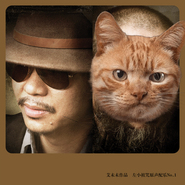

左小祖咒原声配乐No.1
============================

|  |  |
| :--: | :-- |
| [ 左小祖咒原声配乐No.1](https://emumo.xiami.com/album/365466) | **艺人**: [左小祖咒](../index.md) **语种**: 国语 **唱片公司**: 左小祖咒工作室 **发行时间**: 2010年05月05日 **专辑类别**: 录音室专辑 **专辑风格**: 原声 Soundtrack, 摇滚 Rock & Roll, 当代民谣 Contemporary Folk **播放数**: 166156 **收藏数**: 791 **评论数**: 110  |

## 简介

是为汶川地震死亡的具体的学生名单滚动影像编写的配乐

## 曲目

- [5.12遇难学生名录](./365466/nnbi515290a.md)
- [黄泉大道](./365466/bqvcP403626c.md)
- [我不能悲伤地坐在你身旁](./365466/mQ4WAX5b0a0.md)
- [再见 可爱的小伙子2010](./365466/yhMgW3a1e5c.md)
- [爱的劳工](./365466/8GaUoj29a39.md)
- [单刀会](./365466/bCk8NhE4b1d8.md)
- [这正合适MV](./365466/xLpVzB9dc24.md)
- [偶像](./365466/U56RRw2bf11.md)
- [当你需要的时候 它就来了](./365466/mQ4WBd941e5.md)

## 评论

|  |  |  |
| :-- | :-- | :-- |
|  [虾米用户](https://emumo.xiami.com/u/275338302)  2018-04-08 22:18 赞(0) 踩(0) | 
其它删了，还能想得通，《苦鬼2010》都删？
 |
|  [虾米用户](https://emumo.xiami.com/u/37764400)  2017-11-29 19:33 赞(0) 踩(0) | 
512呢？
 |
|  [虾米用户](https://emumo.xiami.com/u/73) 等风景都看透 谁陪我看细... 2017-09-25 07:11 赞(1) 踩(0) | 
连封面都被和谐了。。。
 |
|  [虾米用户](https://emumo.xiami.com/u/34243810) 音乐之灵魂解药 2015-04-27 23:16 赞(0) 踩(0) | 
喜欢《这正合适》
 |
|  [虾米用户](https://emumo.xiami.com/u/34243810) 音乐之灵魂解药 2015-04-27 23:16 赞(0) 踩(0) | 
《这正合适》音乐真好听
 |
|  [虾米用户](https://emumo.xiami.com/u/2022341) 懶似精靈。。。。 2015-04-09 22:08 赞(0) 踩(0) | 
現世安好，愿
 |
|  [虾米用户](https://emumo.xiami.com/u/45109239) 本月专听万海姆富尔特文格... 2015-03-17 07:21 赞(0) 踩(0) | 
还我词来
 |
|  [虾米用户](https://emumo.xiami.com/u/6770643) 谨言慎行，戒急用忍 2015-01-22 00:13 赞(0) 踩(0) | 
我就想知道：艾胖借了那么多债，都还了吗？
 |
|  [虾米用户](https://emumo.xiami.com/u/40460827) 肮脏的卡纳斯塔把泰菲鸭的... 2015-01-04 13:56 赞(1) 踩(0) | 
先不谈政治，艾胖的作品十个有八个是剽窃的，抄国外的就算了，还打我楚哥的主意。真心恶
 |
|  [虾米用户](https://emumo.xiami.com/u/12422893)  2014-10-17 10:45 赞(0) 踩(0) | 
北京画报MV没看到，到YOUTUB看了下
 |
|  [虾米用户](https://emumo.xiami.com/u/853138) 阿华 2014-09-25 00:08 赞(0) 踩(0) | 
致敬！正直而有勇气的人。
 |
|  [虾米用户](https://emumo.xiami.com/u/37388538)  2014-09-09 16:01 赞(1) 踩(0) | 
音乐很好听，左老师什么时候出版纯音乐阿！
 |
|  [虾米用户](https://emumo.xiami.com/u/4473674) 一切如梦幻泡影如露亦如电 2014-08-15 10:30 赞(0) 踩(0) | 
嘘……
 |
|  [虾米用户](https://emumo.xiami.com/u/4473674) 一切如梦幻泡影如露亦如电 2014-08-15 10:29 赞(1) 踩(0) | 
挨个弱的应该是5毛吧
 |
|  [虾米用户](https://emumo.xiami.com/u/54518)  2014-05-12 10:06 赞(0) 踩(0) | 
今天 汶川地震6周年。
 |
|  [虾米用户](https://emumo.xiami.com/u/4715251) 愿屁屁在喵星开开心心还有... 2014-04-11 10:58 赞(3) 踩(0) | 
内容已删除
 |
| ⇒ |  [虾米用户](https://emumo.xiami.com/u/6770643) 谨言慎行，戒急用忍 2015-01-22 00:12 赞(0) 踩(0) | 
哎，这也太奇葩了。和左小祖咒，什么仇？什么怨？
 |
|  [虾米用户](https://emumo.xiami.com/u/9991351)  2014-04-08 06:11 赞(1) 踩(0) | 
5.12遇难学生名录
 |
|  [虾米用户](https://emumo.xiami.com/u/2959220)  2014-03-10 20:14 赞(1) 踩(0) | 
以前没注意  艾未未都上来了
 |
|  [虾米用户](https://emumo.xiami.com/u/5187921)  2013-11-18 09:43 赞(1) 踩(0) | 
最新专辑，已经发行了。 <a href="http://user.qzone.qq.com/46424292" target="_blank" rel="nofollow noreferrer noopener">http://user.qzone.qq.com/46424292</a> <a href="http://site.douban.com/RGST/" target="_blank" rel="nofollow noreferrer noopener">http://site.douban.com/RGST/</a>
 |
|  [虾米用户](https://emumo.xiami.com/u/3487360) 0.0 2013-10-02 22:55 赞(1) 踩(0) | 
哎哟爱神
 |
|  [虾米用户](https://emumo.xiami.com/u/8244559)  2013-09-22 10:41 赞(1) 踩(0) | 
******
 |
|  [虾米用户](https://emumo.xiami.com/u/10395377) 要不然呢。 2013-08-24 21:54 赞(1) 踩(0) | 
怎么左小的专辑都下架了？？？
 |
|  [虾米用户](https://emumo.xiami.com/u/13528968) 爱摇滚，爱民谣，爱自由 2013-03-16 19:15 赞(1) 踩(0) | 
就是喜欢
 |
|  [虾米用户](https://emumo.xiami.com/u/3499643) 烦 2012-12-29 17:30 赞(13) 踩(0) | 
艾草泥马
 |
|  [虾米用户](https://emumo.xiami.com/u/3296808) 山中走兽云中燕，陆地牛羊 2012-12-09 11:10 赞(9) 踩(0) | 
老妈蹄花
 |
|  [虾米用户](https://emumo.xiami.com/u/1446973)  2012-08-25 23:18 赞(0) 踩(0) | 
封面右边的老逼 壳上是砖拍的么
 |
| ⇒ |  [虾米用户](https://emumo.xiami.com/u/13201376)  2013-04-05 17:14 赞(0) 踩(0) | 
JC叔叔打的
 |
|  [虾米用户](https://emumo.xiami.com/u/250868) 追憶似水年華 2012-07-22 12:29 赞(0) 踩(0) | 
那部纪录片的名字叫 花脸巴儿
 |
|  [虾米用户](https://emumo.xiami.com/u/559427) 你觉得恨，却离不开 2012-06-10 02:01 赞(0) 踩(0) | 
封面屌炸
 |
|  [虾米用户](https://emumo.xiami.com/u/6802919)  2012-04-26 16:21 赞(0) 踩(0) | 
艾婶
 |
|  [虾米用户](https://emumo.xiami.com/u/6802919)  2012-04-26 16:20 赞(2) 踩(0) | 
为了艾婶，值~~~
 |
|  [虾米用户](https://emumo.xiami.com/u/7234979) 自由诗人 2012-04-18 15:45 赞(0) 踩(0) | 
喜欢
 |
|  [虾米用户](https://emumo.xiami.com/u/8554770) ♫ ♬ ♪ ♩ ♭ ♪ 2012-03-28 15:41 赞(0) 踩(0) | 
很好
 |
|  [虾米用户](https://emumo.xiami.com/u/8220632)  2012-03-26 20:45 赞(0) 踩(0) | 
5.12遇难学生录...不想多说
 |
|  [虾米用户](https://emumo.xiami.com/u/5141460)  2012-03-07 16:28 赞(0) 踩(0) | 
音乐。
 |
|  [虾米用户](https://emumo.xiami.com/u/63835) 无为，无所不为。 2012-02-28 13:40 赞(0) 踩(0) | 
这张水准真实相当的高
 |
|  [虾米用户](https://emumo.xiami.com/u/7984603) i need music... 2012-02-10 13:50 赞(0) 踩(0) | 
感觉
 |
|  [虾米用户](https://emumo.xiami.com/u/982937) 爱的进步不是在于你昨天听... 2012-01-24 16:37 赞(0) 踩(0) | 
这里面有我最喜欢的 苦鬼 版本~
 |
|  [虾米用户](https://emumo.xiami.com/u/7367720)  2012-01-07 22:39 赞(0) 踩(0) | 
沉醉之美
 |
|  [虾米用户](https://emumo.xiami.com/u/7367720)  2012-01-07 22:37 赞(0) 踩(0) | 
令人沉醉
 |
|  [虾米用户](https://emumo.xiami.com/u/7367720)  2012-01-07 22:29 赞(0) 踩(0) | 
艾未未 左小咒 沉醉了
 |
|  [虾米用户](https://emumo.xiami.com/u/2003794)  2011-12-27 15:10 赞(0) 踩(0) | 
罪过罪过，一听就沉迷。继续码...
 |
|  [虾米用户](https://emumo.xiami.com/u/2686381) 没有平凡的风景，只有荒芜... 2011-12-25 21:17 赞(0) 踩(0) | 
听了陈升的新专辑，来关注一下，果然很不错。
 |
|  [虾米用户](https://emumo.xiami.com/u/7111610)  2011-12-16 23:25 赞(1) 踩(0) | 
小提琴拉动的每一下，都像是一把锯子在把人的心锁锯开……那一年在电视机前、网上看到的一切一切，任何一个正常的人都是不会忘记的……
 |
|  [虾米用户](https://emumo.xiami.com/u/114961)  2011-12-03 22:12 赞(0) 踩(0) | 
就是这么动听的让人无语
 |
|  [虾米用户](https://emumo.xiami.com/u/114961)  2011-12-03 22:12 赞(0) 踩(0) | 
就是这么动听的让人无语
 |
|  [虾米用户](https://emumo.xiami.com/u/2545793)  2011-11-30 11:48 赞(0) 踩(0) | 
巨好啊！
 |
|  [虾米用户](https://emumo.xiami.com/u/617738) 熊 2011-10-21 18:38 赞(1) 踩(0) | 
艾老儿跟小诅...精神食粮啊...
 |
|  [虾米用户](https://emumo.xiami.com/u/617738) 熊 2011-10-21 18:36 赞(1) 踩(0) | 
艾老儿是我的精神支柱。
 |
|  [虾米用户](https://emumo.xiami.com/u/5100718)  2011-10-19 09:02 赞(0) 踩(0) | 
碰撞
 |
|  [虾米用户](https://emumo.xiami.com/u/4796)  2011-10-14 12:03 赞(0) 踩(0) | 
左小祖咒
 |
|  [虾米用户](https://emumo.xiami.com/u/5710594) 以马内利 2011-10-13 08:49 赞(0) 踩(0) | 
用音乐表达政治！
 |
|  [虾米用户](https://emumo.xiami.com/u/6101637)  2011-10-04 10:55 赞(0) 踩(0) | 
I just like it
 |
|  [虾米用户](https://emumo.xiami.com/u/4394776)  2011-10-02 20:21 赞(0) 踩(0) | 
左小祖咒
 |
|  [虾米用户](https://emumo.xiami.com/u/3088175) 音乐在路上 2011-09-14 21:40 赞(0) 踩(0) | 
担当感动！
 |
|  [虾米用户](https://emumo.xiami.com/u/1106316)  2011-09-14 21:40 赞(0) 踩(0) | 
这正合适
 |
|  [虾米用户](https://emumo.xiami.com/u/1106316)  2011-09-14 21:40 赞(0) 踩(0) | 
这正合适
 |
|  [虾米用户](https://emumo.xiami.com/u/73964)  2011-09-08 17:31 赞(0) 踩(0) | 
回来就好
 |
|  [虾米用户](https://emumo.xiami.com/u/5201271)   2011-09-08 10:36 赞(0) 踩(0) | 
新摇滚民谣结合体~~新的味道~~北方的味道
 |
|  [虾米用户](https://emumo.xiami.com/u/5201271)   2011-09-08 10:35 赞(0) 踩(0) | 
新民谣教主
 |
|  [虾米用户](https://emumo.xiami.com/u/5741784)  2011-09-07 21:37 赞(0) 踩(0) | 
艾胖子
 |
|  [虾米用户](https://emumo.xiami.com/u/1296978)  2011-08-20 13:56 赞(0) 踩(0) | 
不好说什么
 |
|  [虾米用户](https://emumo.xiami.com/u/645218) 任性逍遥于有欲无欲之间 2011-07-19 21:01 赞(0) 踩(0) | 
喜欢这个调调
 |
|  [虾米用户](https://emumo.xiami.com/u/1035749)  2011-07-08 08:10 赞(1) 踩(0) | 
蔡宝健和陈国汉
 |
| ⇒ |  [虾米用户](https://emumo.xiami.com/u/1098391)  2011-07-30 12:42 赞(0) 踩(0) | 
观察帝。。
 |
|  [虾米用户](https://emumo.xiami.com/u/3179626)  2011-06-27 22:42 赞(0) 踩(0) | 
不知道
 |
|  [虾米用户](https://emumo.xiami.com/u/2336909)  2011-06-23 18:02 赞(0) 踩(0) | 
艾回来了，左小回归啦
 |
|  [虾米用户](https://emumo.xiami.com/u/437466) 文不能测字武不能防身 2011-06-23 14:32 赞(0) 踩(0) | 
左小来了，李志有戏么？
 |
| ⇒ |  [虾米用户](https://emumo.xiami.com/u/355865) Let it go, l... 2011-06-23 14:38 赞(0) 踩(0) | 
他们都曾经那啥来的么？我就知道李志了。。这个今天才知道XD
 |
| ⇒ |  [虾米用户](https://emumo.xiami.com/u/437466) 文不能测字武不能防身 2011-06-23 14:46 赞(0) 踩(0) | 
<q><b>Desperado说：</b></q>
 |
|  [虾米用户](https://emumo.xiami.com/u/1927860)  2011-06-23 14:02 赞(0) 踩(0) | 
“我不能悲伤地坐在你身旁”，这是那个左什么咒为爱卫卫作品的配乐集。呃，爱卫卫~~~~
 |
|  [虾米用户](https://emumo.xiami.com/u/1475537)  2011-06-23 13:05 赞(0) 踩(0) | 
求北京画报！
 |
|  [虾米用户](https://emumo.xiami.com/u/406003) 虾米！我不想听你推荐给我... 2011-06-23 12:23 赞(0) 踩(0) | 
怎么又有了?好神奇啊
 |
|  [虾米用户](https://emumo.xiami.com/u/73964)  2011-06-23 11:20 赞(0) 踩(0) | 
消失一段终于又能听了~  是配合艾未未刚刚被取保放出来吗呵呵
 |
|  [虾米用户](https://emumo.xiami.com/u/478527) 好想跟衣服在洗衣机里滚 2011-06-23 10:34 赞(0) 踩(0) | 
好砖 两巨头的合作
 |
|  [虾米用户](https://emumo.xiami.com/u/573243)  2011-06-23 10:32 赞(0) 踩(0) | 
左小祖
 |
|  [虾米用户](https://emumo.xiami.com/u/499102) Thru the Nev 2010-08-21 00:39 赞(0) 踩(0) | 
这张封面实在太凶险了！
 |
|  [虾米用户](https://emumo.xiami.com/u/1141663) 我还没想好要写什么... 2010-07-18 21:24 赞(0) 踩(0) | 
喜欢。
 |
|  [虾米用户](https://emumo.xiami.com/u/458876)  2010-06-08 10:33 赞(0) 踩(0) | 
D调~~
 |
|  [虾米用户](https://emumo.xiami.com/u/730939)  2010-05-27 23:01 赞(0) 踩(0) | 
已到了 听 就必听左小的 地步...
 |
| ⇒ |  [虾米用户](https://emumo.xiami.com/u/4158) 一念心清凈，走進極樂境。 2010-06-16 01:59 赞(0) 踩(0) | 
应该是听 就只听左小的 地步...
 |
|  [虾米用户](https://emumo.xiami.com/u/797859)  2010-05-22 16:43 赞(0) 踩(0) | 
太牛B,不得不顶起来,不过还是有所河蟹
 |
|  [虾米用户](https://emumo.xiami.com/u/525720) 住在隔壁的二大爷 2010-05-19 20:56 赞(0) 踩(0) | 
顶艾神
 |
|  [虾米用户](https://emumo.xiami.com/u/45531)  2010-05-17 16:38 赞(0) 踩(0) | 
河蟹凶猛~低调欣赏！
 |
| ⇒ |  [虾米用户](https://emumo.xiami.com/u/953840)  2010-07-04 11:10 赞(0) 踩(0) | 
确实 确实。河蟹从河里爬上岸了。
 |
|  [虾米用户](https://emumo.xiami.com/u/500870)  2010-05-12 17:02 赞(0) 踩(0) | 
终于来了！！！
 |
|  [虾米用户](https://emumo.xiami.com/u/61045) ~ 2010-05-10 22:36 赞(0) 踩(0) | 
老艾牛逼。。。。。
 |
|  [虾米用户](https://emumo.xiami.com/u/104175)  2010-05-10 21:39 赞(0) 踩(0) | 
看看虾米的反应。。
 |
|  [虾米用户](https://emumo.xiami.com/u/400367)  2010-05-10 20:54 赞(0) 踩(0) | 
!
 |
|  [虾米用户](https://emumo.xiami.com/u/382060)  2010-05-10 17:18 赞(0) 踩(0) | 
感謝放出，希望不被 河 蟹
 |
|  [虾米用户](https://emumo.xiami.com/u/623516)  2010-05-10 14:23 赞(0) 踩(0) | 
twitter观光团
 |
|  [虾米用户](https://emumo.xiami.com/u/617167)  2010-05-10 13:48 赞(0) 踩(0) | 
!!
 |
|  [虾米用户](https://emumo.xiami.com/u/78480)  2010-05-10 13:36 赞(0) 踩(0) | 
哦哟这个老牛逼啦 北京画报mv 想看看
 |
|  [虾米用户](https://emumo.xiami.com/u/944)  2010-05-10 12:43 赞(0) 踩(0) | 
蝦米確實尺度很寬哈~
 |
| ⇒ |  [虾米用户](https://emumo.xiami.com/u/27546) MArCo 2010-05-10 16:59 赞(0) 踩(0) | 
放几首歌曲子应该不会管吧……
 |
| ⇒ |  [虾米用户](https://emumo.xiami.com/u/944)  2010-05-10 18:08 赞(0) 踩(0) | 
<q><b>虾胡来说：</b></q>
 |
|  [虾米用户](https://emumo.xiami.com/u/174809)  2010-05-10 10:49 赞(0) 踩(0) | 
终于有了
 |
|  [虾米用户](https://emumo.xiami.com/u/591117) 我还没想好要写什么... 2010-05-10 10:27 赞(1) 踩(0) | 
推特观光团！
 |
|  [虾米用户](https://emumo.xiami.com/u/758706)  2010-03-26 13:12 赞(0) 踩(0) | 
1
 |
|  [虾米用户](https://emumo.xiami.com/u/516681)  2010-03-20 16:24 赞(0) 踩(0) | 
免费的也没人发啊
 |
|  [虾米用户](https://emumo.xiami.com/u/113987) 难忍能忍，难行能行。 2010-03-14 00:19 赞(0) 踩(0) | 
会不会河蟹哦
 |
|  [虾米用户](https://emumo.xiami.com/u/619002)  2010-03-09 20:59 赞(0) 踩(0) | 
这个牛了，期待啊。
 |
|  [虾米用户](https://emumo.xiami.com/u/514629)  2010-03-06 21:14 赞(0) 踩(0) | 
怎么没人发行
 |
|  [虾米用户](https://emumo.xiami.com/u/138054)  2010-02-23 13:32 赞(0) 踩(0) | 
期待
 |
|  [虾米用户](https://emumo.xiami.com/u/259165)  2010-02-01 21:24 赞(0) 踩(0) | 
不知哪位能发布下啊  期待啊
 |
| ⇒ |  [虾米用户](https://emumo.xiami.com/u/584769) 呵呵~ 2010-04-07 00:02 赞(0) 踩(0) | 
我发布了，可是有一首歌没有找到~~不知道行吗
 |
|  [虾米用户](https://emumo.xiami.com/u/162903)  2010-01-31 23:00 赞(0) 踩(0) | 
期待
 |
|  [虾米用户](https://emumo.xiami.com/u/634762) 听歌·睡觉 2010-01-26 09:14 赞(0) 踩(0) | 
坐等发布
 |
