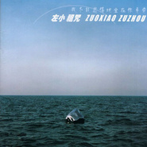

我不能悲伤地坐在你身旁
============================

|  |  |
| :--: | :-- |
| [ 我不能悲伤地坐在你身旁](https://emumo.xiami.com/album/6745) | **艺人**: [左小祖咒](../index.md) **语种**: 国语 **唱片公司**: 左小祖咒工作室 **发行时间**: 2005年05月25日 **专辑类别**: 录音室专辑 **专辑风格**: 国语流行 Mandarin Pop, 华语唱作人 Chinese Singer-Songwriter, 摇滚 Rock & Roll **播放数**: 3538438 **收藏数**: 2643 **评论数**: 197  |

## 简介

一张悬寂三年的旷世琴音  
凌迟你麻木的耳感 打开你被蒙蔽以久的听觉窍门  
倾囊而出 两次缩混 四次母带处理 全新出炉  
打造中国独立音乐的杰作  
  
左小祖咒 最新创作 4th专辑  
我不能悲伤地坐在你身旁  
  
⊙制作背景  
  
《我不能悲伤地坐在你身旁》是左小祖咒全新创作的第四张专辑唱片，创作期2001年至2002年，2003年5月制作完毕，悬寂了3年后才发行。此唱片完全由左小祖咒独立投资完成。  
  
较之他的上一张唱片，此张新唱片耗资较大、质量更高。唱片前期在北京摇音场录制，后期在台北特洛伊后期制作中心混音，台湾传奇制作人方无行与左小祖咒联手制作，好莱坞电影音效大师胡必烈再次担当唱片后期缩混。台湾另类创作女歌手及著名制作人陈珊妮与左小祖咒共同演唱了《当我离开你的时候》。内地顶级吉他手李延亮演奏了该唱片重头歌曲《我不能悲伤地坐在你身旁》和《平安大道的延伸》。唱片中的两首歌曲动用了弦乐组，专辑经过了两次缩混，四次母带处理，开辟了独立先锋音乐融入主流音乐的先河。  
  
⊙独特“左氏”风格  
  
在这张唱片中，左小祖咒仍然每一首歌都不自我重复，每一首歌都是一种新的可能性。所有的歌曲风格迥然不同，没有重复也不失整体，是一张编曲考究、配器新颖的专辑。  
  
专辑中表现出多元音乐类型的风貌，从英式到电子到古典到民族到民谣再到祖咒自身拿手的噪音音乐，经过他特殊唱腔的融合，将这些类型音乐无形间融成左小祖咒特有的“左氏”风格。其中他与陈珊妮倾情对唱的，具有 Bossa Nova 乐风的歌曲《当我离开你的时候》动人至深。场面宏大的《感激》动用世界各地之打击乐器数十种，摇滚、美声、民族三大唱法与蒙古喉鸣交相辉映，未曾使用任何旋律乐器便在热烈磅礴的气氛中讲述了一个入世的离奇神话。而同一主题的《恩惠》却以三件原声乐器同期录音的极简形式，营造了大漠旅人的意境，幷揭开冷峻下的温情。左小祖咒贯有的招牌式幽默，在歌曲《征服》和《这些天的一天》中再次众望所归地表现，戏谑的演唱方式与戏剧性的背景和声、口吻诙谐的歌词与观察独到的生活细节相结合，又创造出耳目一新的流行口语。  
  
⊙限量高价  
  
用作者自己的话来说，三十年的经验和直觉酿出的一坛佳酿，对你我而言这张新作都是张弥足珍贵的礼物。  
  
这张唱片售价高的原因是母版制作昂贵，仅出版了两千套，售价每张150元，并只在 www.zuoxiaozuzhou.com 邮购 。此举又进一步说明左小祖咒创意、胆识和特立独行的风格，也打破国内版 CD 售价最高的纪录，也许有人对这样的价钱有所非议，但从左小祖咒自信的眼光看起来，让人不禁更对这张唱片充满好奇。  
  
另外，左小祖咒还是一位全方位的音乐制作人，在这张新唱片制作期间，他还制作了导演朱文的《云的南方》的电影配乐和贾樟柯导演的《世界》主题歌，并受到欢迎。  
  
⊙左小祖咒的话  
  
★关于唱片  
  
这张唱片实际上是一张精选唱片，我说它精选是因为它的歌曲都很棒，出来一首就是一首，没有陪衬。不知道你注意到没有，我在做完地安门的时候，演出时已经在唱“我不能悲伤地坐在你身旁”和“平安大道的延伸”，这三年来，他们一直在问什么时候出。本来我想把这张唱片放在家里，等将来我有孩子了，到临终的时候我跟他说，儿子，你终于富了。但是这有点悲壮。现在不是凡高的时代，我觉得应该轻松一点。  
  
★关于网上试听  
  
乐迷非常够意思，非常忠实。到现在为止他们还没有把我的唱片上传。我在前面写了，最好不要上传MP3，那样的话音效的质量会减少至少40%，就不值钱了。我觉得再能扛一个月就会很棒。  
  
★关于价格  
  
到目前为止还没有，朱哲琴的《阿姐鼓》卖过一百多元。我不是要把价标得比他们高，即使卖60元他们也会说我黑。所以以后的唱片可能更贵，做得更少。我不需要摆那么多唱片在家里，放着很麻烦，你说是不是。  
  
★关于发片数量  
  
我们做事情要实际一点，不能吹牛说你唱片卖了十万张，二十万张，这是个假话，只是宣传的伎俩。对于我来说，我必须要控制这个，我觉得我的音乐只要我的一些乐迷朋友听到就可以了。如果赶时髦去买，没必要，花钱又多。邮购起来麻烦，如果你不听最好别听。  
  
★关于发行方式  
  
我已经声明了，别的地方都是假货。这叫独立，音乐独立，姿态也独立。有人打电话说批发，我说这张唱片不批发，只能邮购。当然，这对销量肯定会有很大的影响。我们不是要职业，但没有办法。但我真的想知道这张唱片到底有多少我的乐迷忠实的去听，他们才能告诉我，这样做没问题。要让消费的乐迷觉得，这样花钱是对的。就像我们上街去买西红柿，人家一块钱，你这里两块钱，但质量是一样的，那不行。你要确认你的质量比人家好，卖两块钱值。  
  
★关于唱片投资  
  
对！我独立投资的，台湾的方无行和忽必烈做的后期，他经过两次缩混，四次母带处理。我们对唱片的要求已经吹毛求疵。所以也是卖这么高的一个原因，我们不能对人说假话，你要把这个钱花到实处，花到音乐里，不能找一堆人来吃喝玩乐。比如有些电影说投资两千万，实际上在电影上就花了五百万，其他的都给造了。我在国外的一些朋友跟我说，这张唱片在西方做的话，至少要花七十万美金。  
  
★关于唱片公司  
  
曾经想找一个好的唱片公司，觉得这个唱片很好，可以让人懂得爱，应该让更多的人听到，但要需要一个好的公司，不能让这些孙子把唱片压坏了，封面印错了。  
  
⊙音乐多元 身份多重  
  
★关于唱片  
  
这张唱片是不一样的。我们见到很多的西方的，很棒的像卡洛斯·桑塔那，包括我们熟悉的涅盘乐队。还有很多很多的乐队都是，他们出的唱片都是，一张唱片的歌都差不多。但是这张唱片的风格是很多元的，通过唱腔和制作，融和成我的风格。有英式的、电子的、民谣的，和上升到民族，还有一些古典的东西。用了乐组，合唱队。像最后一首《感激》，用了近五十种打击乐和很多的人声做了一首歌。  
  
★合唱  
  
这张唱片是方无行跟我联手制作的。做到这首歌时他说，如果是男女声二重唱，听到这个章节的时候我想产生变化会比较有意思。然后物色人选，方无行就找到了陈珊妮，我说OK。她是三年前唱的这首歌，现在已经很火了。她前些天获了最佳唱片奖，我觉得这是奖项里的最高荣誉。  
  
★讨论新人  
  
我们应该多去用新人，世界永远是年轻人的。每次唱片都要换一些新的人，因为音乐是要变化的，而且，我要他们因为参与了这张唱片而骄傲。打个比方，大家谈论《加州旅馆》，我说太棒了，我在里面吹了一下口哨你没听见。一个作品可以让乐手荣誉的。假如朋友们在电台里听到我的歌，不知道我是谁，这是最棒的。一个真正意义上的成功，像《Yestday》和《加州旅馆》，知道这两首歌的人比知道老鹰乐队和披头士的还要多。是不是？大家会说，哦，这首歌我听过，原来是他们做的。  
  
★歌词  
  
这张唱片很多事情都像是天方夜潭的。阿丝玛到塔拉玛干，带着三个人。一个是她的情人，两个儿子。在塔拉玛干，这三个人都被她吃了。为什么要吃？我没有说。爱，一定要在一个特殊的环境下。男女之间要说爱情忠贞，都要经过天大的事情考验才可以。对于女人来讲，重要的是爱情，然后才是孩子。在塔拉玛干这个沙漠中，怎么处理她的爱？这要留给听到这张唱片的人去想。不要低估作者，也不能低估听众。如果一个东西被很快消化，也就很快完蛋。留一点给别人想，像一幅画，不能画得太满。  
  
★对于别人看法的回音  
  
这是我在做艺术之前定的一个标准，世界必须分成两半。我不想所有人说我好，也不想都说我坏。一般唱片里唱腔和我不同，我的唱片很少有混响，声音是干的。有些认为我唱歌太做作，另外一部分人认为我唱得太自然了。大爷一样，太不认真，就像一边唱歌一边干活。  
  
⊙贵的价值  
  
“这张是我青少年时期的梦想”  
  
新专辑上市之后，很多人都给出了较高的评价。在新专辑的内页中，左小祖咒写到：这是两三年前录制的讽刺抒情作品，我三十年来的经验和直觉酿出的一坛佳酿。记者采访他时，他也讲到：“这张是我到目前为止最满意的专辑，也是我青少年时期的梦想。我一直想做一张好听、保持摇滚乐传统、意味深长、制作精良的专辑，但以前的专辑在录制过程中总有一些遗憾。现在我做成了。”  
  
新专辑中，左小祖咒保持了自己一贯的“讽刺抒情”，“不仅讽刺，也自嘲，对爱情、婚姻、战争的嘲讽。我相信大家在听完之后，能够得到很多。在演唱时，我也改变了一些方法，尽量平缓但不煽情。现在的音乐，感情过于泛滥，歌还没唱眼泪就下来了。我们就不能慢慢来吗？”他说，“制作上，更是吹毛求疵，制作团队非常庞大，找了很多音乐人来参与，我要这张专辑多姿多彩。”  
  
⊙贵的理由  
  
“怕唱片公司搞错所以限量发行”  
  
虽然制作精良，但150元的价格还是让很多人难以想象。左小祖咒对这个价格这样解释，在内页中他写到：“原因是母版制作昂贵，仅出版两千张…这么迟出版这张唱片，一开始想的是让它的发行量大一点儿，因为只有发行大一些你们才能便宜地买到唱片，同时又不想把唱片压坏，不要印刷出错，不要让你们抱怨买不到唱片等等，但是这些尝试都失败了。这是让你们等了一些时间的真相。”  
  
采访中，他进一步解释道：“我是一个老牌歌手，我的唱片都是有人要发行的。这张也有很多人要发行，是因为我不让或者没谈好，我怕唱片在进厂加工、印刷、压片时出错。就像一本书，封面、作者都没问题，但是裁剪工人一刀裁坏了。所以我决定自己做，全过程由自己盯，因此在唱片中，你们才能听到对声音细节讲究的处理。”而之所以选择限量，是因为：“如果发行量大，我就要付出另外的投资，我要宣传、要拍MV，让更多人知道我发唱片了。但能有多大意思，我宁愿把钱花在唱片上面，保证当你拿到这张唱片时，是ok的。”  
  
⊙贵的底气  
  
“买或者不买，是你的事情”  
  
天价唱片，自然会打击一些人购买的欲望。但左小祖咒并不担心：“我是唱了10年的老牌歌手，我相信自己的歌迷基础。1998年第一张唱片，卖90块，质量、知名度都赶不上现在，还是卖了500张。所以毫不怀疑2000这个数字，问题只是这2000张卖几年的问题。音乐就是做给别人听的。如果这张唱片能挣点钱，我就能告诉别人，像我这样做、这样唱歌都ok了，能成为案例。”  
  
即使最终销售不好，他认为其原因也肯定不会是因为价格：“我开这个天价，150元，是很多地方一年的生活费。太黑了？我黑谁？是你的事。爱不爱听、买不买都是你的事。即使最后不行我也无所谓。对我来说，这张唱片就是我这几年挣了点钱，拿着几十万做着玩。什么叫彻底，这就是彻底。爱听就听，不爱听就别听。”不过，他还是比较担心盗版、MP3对唱片的冲击：“以前盗我的版，有公司帮我担待一点，这次再盗就是盗我的。我怎么都要查出来，跟他没完。反正我不干别的事了，闲着。即使是MP3，弄急了，我也没完。”  
  
1994年 录制第一首录音室歌曲《无解》，95年香港音乐传讯公司发行。  
1995年 录制第二首录音室歌曲《六枝花》 2000年台湾直接流行唱片公司发行。  
1998年10月 NO乐队首张专辑《走失的主人》香港Sonic Factory唱片公司发行。  
1999年4月 《走失的主人》中国大陆Bedhead唱片公司发行。  
2000年1月 长篇小说《狂犬吠墓》出版 香港Sonic Factory发行。  
第二张专辑《庙会之旅》中国大陆Bedhead唱片公司发行。  
《走失的主人》马来西亚黄火唱片公司发行。  
2001年11月11日 第三张专辑《左小祖咒在地安门》 京文嚎叫唱片发行。  
2001年12月 《左小祖咒在地安门》台湾直接流行唱片公司发行。  
2004年6月26日 《庙会之旅》[2004全新改版] 台湾直接流行唱片公司发行。  
2005年5月25日 《我不能悲伤地坐在你身旁》 北京北影录音录像出版社发行。  
&nbsp;

## 曲目

- [像孩子似的倾听MV](./6745/fMkN72040.md)
- [我不能悲伤地坐在你身旁](./6745/swBU22740.md)
- [征服](./6745/ok2Tf2d1c.md)
- [恩惠](./6745/jYtSa7237.md)
- [平安大道的延伸](./6745/fMkR53ac0.md)
- [当我离开你的时候](./6745/fMkS7389f.md)
- [怎么也不会流泪的你](./6745/nnbccb68d5a.md)
- [这些天的一天](./6745/jYtW11d95.md)
- [感激](./6745/swCb245e0.md)

## 评论

|  |  |  |  |
| :-- | :-- | :-- | :-- |
|  [虾米用户](https://emumo.xiami.com/u/379162683) 我想要记住你们，我想要你... 2020-08-13 01:01 赞(0) 踩(0) | 

 |
|  [虾米用户](https://emumo.xiami.com/u/49660160)   2020-04-24 22:54 赞(0) 踩(0) | 
左小最完美的歌在我心里，无论编曲作词。唱腔也是刚刚好
 |
|  [虾米用户](https://emumo.xiami.com/u/423581716)  2020-02-27 01:54 赞(0) 踩(0) | 
感觉很重要
 |
|  [虾米用户](https://emumo.xiami.com/u/42339537) 微博:善良的墨菲斯托，分... 2019-11-12 11:52 赞(1) 踩(0) | 
混音很好。
 |
|  [虾米用户](https://emumo.xiami.com/u/7204799)  2019-05-28 13:44 赞(0) 踩(0) | 
a masterpiece
 |
|  [虾米用户](https://emumo.xiami.com/u/2781794) OK. I Will S... 2019-04-19 23:53 赞(0) 踩(0) | 
打分，趁还能听。
 |
|  [虾米用户](https://emumo.xiami.com/u/11652852)   2019-03-15 16:44 赞(0) 踩(0) | 
《尊敬》呢？
 |
|  [虾米用户](https://emumo.xiami.com/u/377908950)  2018-12-27 00:15 赞(0) 踩(0) | 
这歌好听
 |
|  [虾米用户](https://emumo.xiami.com/u/103652) 心间一点赤砂痕，拭罢犹存 2018-11-18 14:05 赞(0) 踩(0) | 
难听到恐怖……
 |
|  [虾米用户](https://emumo.xiami.com/u/339191478)   2018-10-02 21:59 赞(0) 踩(0) | 
❤
 |
|  [虾米用户](https://emumo.xiami.com/u/43492923) 行到水穷我才开始害怕，夕... 2018-02-01 21:08 赞(1) 踩(0) | 
&amp;phi;
 |
|  [虾米用户](https://emumo.xiami.com/u/35509231) 提灯天后  策马小僧 2017-10-28 00:41 赞(3) 踩(0) | 
看完韩寒的推荐，有且只有一句话我非常赞同：这他妈的是什么玩意儿！
 |
|  [虾米用户](https://emumo.xiami.com/u/7987587) 我还没想好要写什么... 2017-10-28 00:19 赞(1) 踩(0) | 
這張是左小永遠都找不回的幸福了，我的那張是大立給刻的，善良溫馨的搖普們永遠死在了那個年代。這張是搖滾樂時代的悲歌。那時的左小也不是現在這個小丑，一切如往事不再！
 |
|  [虾米用户](https://emumo.xiami.com/u/2759713)  2017-10-28 00:11 赞(0) 踩(0) | 
我同意脱离兄的话，我看到了至少祖咒音乐的真实和多样性，当今还有真正的音乐吗？只有毫无思想的网络垃圾歌曲。和虚伪的歌功送德的东西，很多人都被**洗脑了吧。一群什么人啊？可笑
 |
|  [虾米用户](https://emumo.xiami.com/u/2759713)  2017-10-28 00:11 赞(2) 踩(0) | 
我就喜欢祖咒，我不觉得所谓的音乐就好到哪里？所谓的音乐没有灵魂，歌功送德还是快餐文化让我恶心。
 |
|  [虾米用户](https://emumo.xiami.com/u/303362565)  2017-07-11 07:15 赞(0) 踩(0) | 
感动。
 |
|  [虾米用户](https://emumo.xiami.com/u/3111190)  2017-06-01 13:35 赞(1) 踩(0) | 
有毒！
 |
|  [虾米用户](https://emumo.xiami.com/u/2736712) DADALADA!~ 2017-01-06 23:11 赞(0) 踩(0) | 
想问封面是啥
 |
| ⇒ |  [虾米用户](https://emumo.xiami.com/u/42253651)  2017-02-19 17:40 赞(0) 踩(0) | 
感觉像是鲸的鼻子
 |
| ⇒ |  [虾米用户](https://emumo.xiami.com/u/3223916)  2017-05-24 20:51 赞(0) 踩(0) | 
一个当代艺术作品。公海浮石
 |
| ⇒ |  [虾米用户](https://emumo.xiami.com/u/2736712) DADALADA!~ 2017-05-26 23:40 赞(0) 踩(0) | 
<q><b>窦三儿说：</b></q>
 |
|  [虾米用户](https://emumo.xiami.com/u/38801880)   2016-06-10 21:09 赞(0) 踩(0) | 
O(∩_∩)O
 |
|  [虾米用户](https://emumo.xiami.com/u/1744782)  2016-06-01 11:42 赞(0) 踩(0) | 
我不能悲伤地坐在你身旁
 |
|  [虾米用户](https://emumo.xiami.com/u/1070165) 天凉好个秋 2016-05-02 22:44 赞(0) 踩(0) | 
这张专辑如果你接受了左的唱腔的话，会发现其实还挺好听的……反正我07年听了几遍以后觉得挺好听。
 |
|  [虾米用户](https://emumo.xiami.com/u/13977459) 啊～第一次写，竟然是告别... 2016-04-24 16:22 赞(0) 踩(0) | 
haoting
 |
|  [虾米用户](https://emumo.xiami.com/u/33385349) 臭板儿是个傻逼。 2015-07-14 10:48 赞(3) 踩(0) | 
说左小微博SB的，你就是个敏感词。
 |
|  [虾米用户](https://emumo.xiami.com/u/472261) 别跟我讲道理 2015-06-16 12:13 赞(8) 踩(0) | 
唱的什么鬼 虾米为什么给我推这种东西 唱得难听可以出纯音乐专辑吗 呸
 |
|  [虾米用户](https://emumo.xiami.com/u/701718)  2015-05-14 10:51 赞(0) 踩(0) | 
内容已删除
 |
| ⇒ |  [虾米用户](https://emumo.xiami.com/u/736893) 身为橘子就要饱满多汁 2016-04-29 09:43 赞(0) 踩(0) | 
没有多少见识   心中没有多少墨水  还总想装着特别懂   说的就是您这种人
 |
| ⇒ |  [虾米用户](https://emumo.xiami.com/u/275433320)  2018-12-28 15:05 赞(0) 踩(0) | 
这跟LOU REED有一点关系？
 |
|  [虾米用户](https://emumo.xiami.com/u/6050488)  2015-04-16 23:30 赞(1) 踩(0) | 
觉得也就这歌能接受～
 |
|  [虾米用户](https://emumo.xiami.com/u/4366220)  2015-04-16 11:41 赞(0) 踩(0) | 
阿斯玛你记得嘛
 |
|  [虾米用户](https://emumo.xiami.com/u/10359452) ？ 2015-03-30 13:26 赞(1) 踩(0) | 
我永远忘不了高中的那次写生，整整单曲循环了半个月的像孩子似的倾听，后来每次再听，我都会想起那段时光
 |
|  [虾米用户](https://emumo.xiami.com/u/13048549) 回应大地的召唤 2015-03-07 07:18 赞(6) 踩(0) | 
看到韩寒推荐感觉这张专都降了一档次。。。
 |
|  [虾米用户](https://emumo.xiami.com/u/45535345)  2015-02-20 23:51 赞(1) 踩(0) | 
左小祖咒最牛的一张
 |
|  [虾米用户](https://emumo.xiami.com/u/13970592) 文不能测字 武不能防身 2015-02-05 19:34 赞(0) 踩(0) | 
编曲牛逼 唱得...咱们就不说了
 |
|  [虾米用户](https://emumo.xiami.com/u/27793105)  2014-12-26 13:44 赞(0) 踩(0) | 
左叔这张专辑整体质量和完成度都好高！！！精品杂烩
 |
|  [虾米用户](https://emumo.xiami.com/u/11968494) . 2014-11-25 22:54 赞(0) 踩(0) | 
。
 |
|  [虾米用户](https://emumo.xiami.com/u/3269814) 罄 2014-11-02 13:42 赞(0) 踩(0) | 
太棒了
 |
|  [虾米用户](https://emumo.xiami.com/u/37510408) 漂泊是成长必经的路牌 2014-10-20 23:21 赞(0) 踩(0) | 
喜欢那偏偏起伏的手鼓声、…
 |
|  [虾米用户](https://emumo.xiami.com/u/30808132)  2014-09-28 10:52 赞(2) 踩(0) | 
我们悲伤地坐在许多人身旁
 |
|  [虾米用户](https://emumo.xiami.com/u/603791)  2014-09-23 10:14 赞(1) 踩(0) | 
不唱更完美
 |
|  [虾米用户](https://emumo.xiami.com/u/36319648) 学识使人坚毅 2014-09-17 15:26 赞(0) 踩(0) | 
我不能悲伤的坐在你身旁，我会永远陪着你！
 |
|  [虾米用户](https://emumo.xiami.com/u/10435106) 听靓歌 2014-08-30 00:53 赞(0) 踩(0) | 
不错。
 |
|  [虾米用户](https://emumo.xiami.com/u/10435106) 听靓歌 2014-08-30 00:51 赞(0) 踩(0) | 
不错。
 |
|  [虾米用户](https://emumo.xiami.com/u/35950839) 我是尹弋，不是尹戈。 2014-08-18 17:29 赞(0) 踩(0) | 
坐一会儿吧
 |
|  [虾米用户](https://emumo.xiami.com/u/784923) 镜头晃得我有些晕 2014-07-11 12:01 赞(0) 踩(0) | 
最初听到一张诅咒的一张 也是最喜欢的一张
 |
|  [虾米用户](https://emumo.xiami.com/u/784923) 镜头晃得我有些晕 2014-07-11 12:01 赞(0) 踩(0) | 
经典 最爱的一张
 |
|  [虾米用户](https://emumo.xiami.com/u/12860581) xia'mi我回来啦 2014-07-06 22:26 赞(1) 踩(0) | 
他说他那时最喜欢的歌手是Bessie Smith，其实，他当然不是朋克，甚至不是摇滚，他是布鲁斯——只有最纯粹的民间歌者，才懂得音由心生心灭，大象无鼻无形。
 |
|  [虾米用户](https://emumo.xiami.com/u/1504014)  2014-07-04 13:58 赞(0) 踩(0) | 
我喜欢
 |
|  [虾米用户](https://emumo.xiami.com/u/4210793)  2014-06-09 12:42 赞(0) 踩(0) | 
要是没唱声更好！
 |
|  [虾米用户](https://emumo.xiami.com/u/32334006) 自己去想 我懒得写了 2014-05-17 16:49 赞(0) 踩(0) | 
独特的吟唱 诅咒一样
 |
|  [虾米用户](https://emumo.xiami.com/u/4087026)  2014-05-13 21:30 赞(0) 踩(0) | 
太牛b了！不知道最后卖了几张，我现在就有冲动立即买
 |
|  [虾米用户](https://emumo.xiami.com/u/12209295) 我还没想好要写什么... 2014-05-02 11:15 赞(2) 踩(0) | 
公知里唱歌最好的，歌手里最能挑逗民萃的傻逼。田忌赛马，错位竞争，果然不是盖的。
 |
|  [虾米用户](https://emumo.xiami.com/u/3621565)  2014-05-01 01:14 赞(29) 踩(0) | 
虽说这几年关注左小祖咒微博后才发现他是个傻逼，但是当年这张专辑还是不错的，初中的记忆
 |
| ⇒ |  [虾米用户](https://emumo.xiami.com/u/8287565)  2014-08-20 12:57 赞(0) 踩(0) | 
跟我一样的经历哈哈哈
 |
| ⇒ |  [虾米用户](https://emumo.xiami.com/u/603791)  2014-09-23 10:15 赞(0) 踩(0) | 
你说得对！
 |
| ⇒ |  [虾米用户](https://emumo.xiami.com/u/312179) 潜入深蓝，放肆幻听 2015-04-06 20:55 赞(0) 踩(0) | 
我也关注过他的微博，后来取消了。喜欢他的只限音乐。
 |
| ⇒ |  [虾米用户](https://emumo.xiami.com/u/1677729)   2015-10-16 08:33 赞(0) 踩(0) | 
是的，关注他微博以后发现他真的和其他傻逼无他。
 |
| ⇒ |  [虾米用户](https://emumo.xiami.com/u/598077)  2016-07-08 11:54 赞(0) 踩(0) | 
哈哈，想我关注他微博3个月实在受不了取关了，然后再也没听过他的歌。
 |
| ⇒ |  [虾米用户](https://emumo.xiami.com/u/345572014) 世界上的一切事物的存在，... 2018-05-10 12:14 赞(0) 踩(0) | 
左小在《北京画报》里唱过：有人在互联网下载我的歌，还骂我。
 |
| ⇒ |  [虾米用户](https://emumo.xiami.com/u/2343490) 我还没想好要写什么... 2020-04-10 18:22 赞(0) 踩(0) | 
他把有趣的一面在音乐、文学、艺术里献给了你，是男人都会有沉闷的一面，这也是真实的，他是艺术家不是娱乐明星，无法360度无死角娱乐你。
 |
|  [虾米用户](https://emumo.xiami.com/u/89157) 暂无签名~ 2014-04-16 16:10 赞(0) 踩(0) | 
太难听了，浪费了一个好好的歌名
 |
|  [虾米用户](https://emumo.xiami.com/u/4310328)  2014-04-13 21:04 赞(0) 踩(0) | 
我们一起唱过的。
 |
|  [虾米用户](https://emumo.xiami.com/u/34526385)  2014-04-05 11:19 赞(0) 踩(0) | 
ha
 |
|  [虾米用户](https://emumo.xiami.com/u/1240483) 语虚何以言知。 2014-03-13 13:05 赞(0) 踩(0) | 
不只是因为歌词，嗓音里有很真实的悲伤。
 |
|  [虾米用户](https://emumo.xiami.com/u/2034973)  2014-01-09 21:00 赞(0) 踩(0) | 
非常好听。
 |
|  [虾米用户](https://emumo.xiami.com/u/3805479) 我还没想好要写什么... 2013-12-26 21:18 赞(0) 踩(0) | 
音乐很赞！
 |
|  [虾米用户](https://emumo.xiami.com/u/4241789) 说什么大道理，找乐子而已 2013-11-21 16:15 赞(0) 踩(0) | 
我更喜欢陈珊妮的部分，总觉得左小鼻塞很严重。。。
 |
|  [虾米用户](https://emumo.xiami.com/u/5159295)  2013-10-26 21:26 赞(1) 踩(0) | 
惊心动魄，温婉欲泣。
 |
|  [虾米用户](https://emumo.xiami.com/u/16188618)  2013-07-23 08:44 赞(1) 踩(0) | 
比我在**吃炸鸡还要过瘾~
 |
|  [虾米用户](https://emumo.xiami.com/u/8244559)  2013-06-21 16:06 赞(6) 踩(0) | 
******
 |
|  [虾米用户](https://emumo.xiami.com/u/11413456)  2013-05-23 21:53 赞(0) 踩(0) | 
好
 |
|  [虾米用户](https://emumo.xiami.com/u/14837472) 233 2013-05-13 02:21 赞(0) 踩(0) | 
233
 |
|  [虾米用户](https://emumo.xiami.com/u/1582050)  2013-05-04 00:56 赞(0) 踩(0) | 
你马B 为什么全部下架？
 |
| ⇒ |  [虾米用户](https://emumo.xiami.com/u/14040671) 再见 可爱的小伙子 2013-05-07 23:59 赞(0) 踩(0) | 
因为做的太好了 卖的太好了也太贵了 擦！
 |
| ⇒ |  [虾米用户](https://emumo.xiami.com/u/1582050)  2013-05-09 18:34 赞(0) 踩(0) | 
<q><b>人格裂变说：</b></q>
 |
| ⇒ |  [虾米用户](https://emumo.xiami.com/u/14040671) 再见 可爱的小伙子 2013-05-16 23:55 赞(0) 踩(0) | 
<q><b>wall说：</b></q>
 |
| ⇒ |  [虾米用户](https://emumo.xiami.com/u/1582050)  2014-05-06 15:09 赞(0) 踩(0) | 
<q><b>人格裂变说：</b></q>
 |
|  [虾米用户](https://emumo.xiami.com/u/5997849)  2013-04-17 08:33 赞(0) 踩(0) | 
哦然后我就想听这张碟了…
 |
|  [虾米用户](https://emumo.xiami.com/u/131743)  2013-04-02 14:40 赞(0) 踩(0) | 
～@～
 |
|  [虾米用户](https://emumo.xiami.com/u/4275776) 虾米音质检测督查账号 2013-02-25 15:49 赞(0) 踩(0) | 
#音质报告# 已更新至合格320K~
 |
|  [虾米用户](https://emumo.xiami.com/u/9202681) 经历全在身上不要任何ta... 2013-02-01 23:56 赞(1) 踩(0) | 
当我推开那扇门想看看永恒荣光的状景那没有他们说的实用阶梯 然而我又不能悲伤地坐在你身旁
 |
|  [虾米用户](https://emumo.xiami.com/u/3422427)  2013-01-17 11:52 赞(0) 踩(0) | 
温故一下左老板，为明天看演出做准备。。。
 |
|  [虾米用户](https://emumo.xiami.com/u/7800626) 空 2013-01-07 15:44 赞(14) 踩(0) | 
如果你自由，你听得懂；如果你不自由，你更听得懂。
 |
| ⇒ |  [虾米用户](https://emumo.xiami.com/u/9003931) 千淘万漉虽辛苦 2013-05-03 23:37 赞(0) 踩(0) | 
好吧，我既不自由，也自由。
 |
| ⇒ |  [虾米用户](https://emumo.xiami.com/u/3320065)  2013-07-29 10:06 赞(0) 踩(0) | 
点赞!
 |
| ⇒ |  [虾米用户](https://emumo.xiami.com/u/30808132)  2014-09-28 11:13 赞(0) 踩(0) | 
是！！！
 |
|  [虾米用户](https://emumo.xiami.com/u/6401479) :-D 2013-01-06 17:42 赞(0) 踩(0) | 
第一次听的时候 真的是觉得什么玩意儿啊 故意唱的这样的吧 但就像HH说的一样“唱片中有一半的歌我也接受不了，就像有四分之一的罗大佑的歌我也接受不了一样，关键是在那个我能接受的部分，我非常的接受。”
 |
|  [虾米用户](https://emumo.xiami.com/u/4209667)  2013-01-01 20:05 赞(0) 踩(0) | 
初听有种莫名的喜感
 |
|  [虾米用户](https://emumo.xiami.com/u/11965084) 偶尔难过 2012-12-17 20:00 赞(0) 踩(0) | 
震撼
 |
|  [虾米用户](https://emumo.xiami.com/u/8048742)  2012-12-10 01:07 赞(0) 踩(0) | 
除了这张专辑 其他的我都听不了
 |
|  [虾米用户](https://emumo.xiami.com/u/3426740)  2012-09-04 12:21 赞(0) 踩(0) | 
不能。
 |
|  [虾米用户](https://emumo.xiami.com/u/1529746)  2012-07-29 11:17 赞(0) 踩(0) | 
第一次听到这么有力量的音乐，这才应该是民谣该有的样子，喜欢恩惠里面的鼓，还有别的配乐，真的很棒
 |
|  [虾米用户](https://emumo.xiami.com/u/8070919)  2012-06-24 15:28 赞(0) 踩(0) | 
大赞
 |
|  [虾米用户](https://emumo.xiami.com/u/9528529)  2012-06-20 21:19 赞(0) 踩(0) | 
极致........
 |
|  [虾米用户](https://emumo.xiami.com/u/918281) 拍摄现场需要一些状态 2012-06-02 15:02 赞(0) 踩(0) | 
左小祖咒是个有心人
 |
|  [虾米用户](https://emumo.xiami.com/u/4814644)  2012-05-15 23:16 赞(0) 踩(0) | 
感激好有气势，爽
 |
|  [虾米用户](https://emumo.xiami.com/u/8952284)  2012-04-28 20:11 赞(0) 踩(0) | 
不知为啥我现在觉得左小祖咒唱的这首比曲婉婷的更有味道在灭顶的苦难之上犹如鲸鱼般的从大海中浮起这专辑理念着实不理解啊可能就是不理解更有味道哈哈
 |
|  [虾米用户](https://emumo.xiami.com/u/7547525)  2012-04-25 23:47 赞(0) 踩(0) | 
没有理由地喜欢
 |
|  [虾米用户](https://emumo.xiami.com/u/2803177)  2012-04-24 15:24 赞(0) 踩(0) | 
我不能 悲伤地坐在 你身旁
 |
|  [虾米用户](https://emumo.xiami.com/u/8600785) 过雨，又是一番红素。 2012-04-19 16:15 赞(1) 踩(0) | 
左小是在用艺术玩音乐，用音乐调戏这个世界。
 |
|  [虾米用户](https://emumo.xiami.com/u/7234979) 自由诗人 2012-04-18 15:46 赞(0) 踩(0) | 
喜欢
 |
|  [虾米用户](https://emumo.xiami.com/u/6323638)  2012-04-02 12:58 赞(0) 踩(0) | 
还没听，但是多个朋友的重合介绍让我十分好奇。
 |
|  [虾米用户](https://emumo.xiami.com/u/2144169) 将门虚掩，虽然你已走远～... 2012-03-29 23:42 赞(0) 踩(0) | 
不要悲伤的坐在我身旁
 |
|  [虾米用户](https://emumo.xiami.com/u/1441815)  2012-03-27 11:01 赞(1) 踩(0) | 
各位神虾们，弄张320K的有木有啊？录音这么棒的专辑，192K有点不够用啊~~
 |
|  [虾米用户](https://emumo.xiami.com/u/8220632)  2012-03-26 20:28 赞(0) 踩(0) | 
我不能悲伤的坐在你身旁...
 |
|  [虾米用户](https://emumo.xiami.com/u/4381678)  2012-03-16 19:38 赞(0) 踩(0) | 
文艺的所爱，忧郁但有生命力！
 |
|  [虾米用户](https://emumo.xiami.com/u/4214576) 我还没想好要写什么... 2012-02-16 09:32 赞(0) 踩(0) | 
我不能悲伤地坐在你身旁
 |
|  [虾米用户](https://emumo.xiami.com/u/564599)  2012-01-09 22:18 赞(0) 踩(0) | 
曾经关注过一段时间左小的微博，但发现他的言论不太合我胃口遂取消关注。尽管如此，左小祖咒的音乐仍然属于我最喜爱的国内艺人之一，从当年那张《走失的主人》就是
 |
| ⇒ |  [虾米用户](https://emumo.xiami.com/u/3958382)  2012-03-20 09:06 赞(0) 踩(0) | 
同感
 |
|  [虾米用户](https://emumo.xiami.com/u/5568119)  2011-12-27 15:49 赞(1) 踩(0) | 
左小左小，走调农金之王
 |
| ⇒ |  [虾米用户](https://emumo.xiami.com/u/7367720)  2012-01-02 14:04 赞(0) 踩(0) | 
农金个屁
 |
|  [虾米用户](https://emumo.xiami.com/u/847662)  2011-12-26 18:56 赞(0) 踩(0) | 
为什么不能下载？
 |
|  [虾米用户](https://emumo.xiami.com/u/7367720)  2011-12-25 19:53 赞(0) 踩(0) | 
最喜欢左老板！！！！！！！！！！！！！！！！！！！！！！！！！！！！！！
 |
|  [虾米用户](https://emumo.xiami.com/u/7208075) 隐居修炼 2011-12-12 19:45 赞(0) 踩(0) | 
左老板，你是我的0像，
 |
|  [虾米用户](https://emumo.xiami.com/u/6466232)  2011-12-10 23:04 赞(0) 踩(0) | 
祖咒的专辑这一张听得最久，时刻都可以拿出来听的一张。
 |
|  [虾米用户](https://emumo.xiami.com/u/6641363)  2011-12-07 08:50 赞(0) 踩(0) | 
他叫左小祖咒...
 |
|  [虾米用户](https://emumo.xiami.com/u/7119074)  2011-12-06 00:30 赞(0) 踩(0) | 
就是他的歌 没的说
 |
|  [虾米用户](https://emumo.xiami.com/u/6956904) 定西 2011-11-30 15:43 赞(0) 踩(0) | 
呜呜呜呜呜呜
 |
|  [虾米用户](https://emumo.xiami.com/u/1973300)  2011-11-16 12:21 赞(0) 踩(0) | 
牛人的推荐哇，一定要听一听哒！到底是什么让他内牛满面
 |
|  [虾米用户](https://emumo.xiami.com/u/6740419)  2011-11-15 11:53 赞(0) 踩(0) | 
喜欢左小，喜欢民谣
 |
|  [虾米用户](https://emumo.xiami.com/u/6142232) 听凭感觉 2011-11-12 20:02 赞(0) 踩(0) | 
写意风格，犹如现代派书法，把字都弄得变形，但不失美感
 |
|  [虾米用户](https://emumo.xiami.com/u/3188423)  2011-11-03 20:08 赞(0) 踩(0) | 
额，不能悲伤
 |
|  [虾米用户](https://emumo.xiami.com/u/6535281)  2011-10-31 20:18 赞(0) 踩(0) | 
左爷 恩
 |
|  [虾米用户](https://emumo.xiami.com/u/5792031)  2011-10-23 10:43 赞(0) 踩(0) | 
不知道为什么，他的歌会让人很安定，或许因为真实吧
 |
|  [虾米用户](https://emumo.xiami.com/u/6311815)  2011-10-23 10:19 赞(0) 踩(0) | 
我不能悲伤地坐在你身旁
 |
|  [虾米用户](https://emumo.xiami.com/u/6201812)  2011-10-11 10:36 赞(0) 踩(0) | 
我不能悲伤的坐在你身旁
 |
|  [虾米用户](https://emumo.xiami.com/u/2343490) 我还没想好要写什么... 2011-09-27 12:19 赞(0) 踩(0) | 
已成经典
 |
|  [虾米用户](https://emumo.xiami.com/u/2759713)  2011-09-20 14:42 赞(0) 踩(0) | 
我不知道韩寒是谁？但我知道祖咒是谁，他是个战士。他是个真正的人。
 |
|  [虾米用户](https://emumo.xiami.com/u/5897631)  2011-09-20 12:30 赞(0) 踩(0) | 
我不能悲伤的坐在你的身旁
 |
|  [虾米用户](https://emumo.xiami.com/u/5779361)  2011-09-13 00:46 赞(0) 踩(0) | 
是人是鬼 是矫情是悲伤刺骨 仔细听听
 |
|  [虾米用户](https://emumo.xiami.com/u/3255139)  2011-09-11 16:38 赞(0) 踩(0) | 
感觉
 |
|  [虾米用户](https://emumo.xiami.com/u/3255139)  2011-09-11 16:38 赞(0) 踩(0) | 
感觉
 |
|  [虾米用户](https://emumo.xiami.com/u/4467095)  2011-09-04 00:15 赞(0) 踩(0) | 
呵呵
 |
|  [虾米用户](https://emumo.xiami.com/u/2959963) . 2011-08-23 15:13 赞(0) 踩(0) | 
不是别人能唱的歌
 |
|  [虾米用户](https://emumo.xiami.com/u/599631)  2011-08-14 14:51 赞(0) 踩(0) | 
记得以前虾米是没有祖咒的，分享一下
 |
|  [虾米用户](https://emumo.xiami.com/u/4305407)   2011-08-13 21:05 赞(0) 踩(0) | 
虾米就是好`
 |
|  [虾米用户](https://emumo.xiami.com/u/153147)  2011-08-10 01:09 赞(0) 踩(0) | 
我说这歌我喜欢，喜欢我的人说鄙视我，太残酷了
 |
| ⇒ |  [虾米用户](https://emumo.xiami.com/u/7332677) 时光飞逝了。 2012-07-09 23:48 赞(0) 踩(0) | 
哈哈哈 这歌就是给你写的 I可以悲伤的座在她身边了。
 |
|  [虾米用户](https://emumo.xiami.com/u/406003) 虾米！我不想听你推荐给我... 2011-08-03 11:47 赞(0) 踩(0) | 
打了一大段的文字又给删了.
 |
|  [虾米用户](https://emumo.xiami.com/u/1083253)   2011-07-31 09:35 赞(0) 踩(0) | 
听着听着就听出深意了。。。唉
 |
|  [虾米用户](https://emumo.xiami.com/u/5054760)  2011-07-29 10:59 赞(0) 踩(0) | 
读到内心的忧伤
 |
|  [虾米用户](https://emumo.xiami.com/u/1413609)  2011-07-11 18:17 赞(0) 踩(0) | 
Je l\'aime à mourir
 |
|  [虾米用户](https://emumo.xiami.com/u/284231)  2011-07-11 01:22 赞(0) 踩(0) | 
听第一次时 我却笑了
 |
|  [虾米用户](https://emumo.xiami.com/u/4477693)  2011-06-30 20:04 赞(0) 踩(0) | 
未雨绸缪、
 |
|  [虾米用户](https://emumo.xiami.com/u/1671808)  2011-06-30 15:19 赞(0) 踩(0) | 
有了！
 |
|  [虾米用户](https://emumo.xiami.com/u/299637)  2011-06-30 01:37 赞(0) 踩(0) | 
不能悲伤
 |
|  [虾米用户](https://emumo.xiami.com/u/689872)   2011-06-29 15:18 赞(0) 踩(0) | 
动听
 |
|  [虾米用户](https://emumo.xiami.com/u/3179626)  2011-06-27 22:44 赞(0) 踩(0) | 
不知道
 |
|  [虾米用户](https://emumo.xiami.com/u/3235539) 我还没想好要写什么... 2011-06-25 14:40 赞(0) 踩(0) | 
所以我还是滚吧
 |
|  [虾米用户](https://emumo.xiami.com/u/11087)  2011-06-24 13:41 赞(0) 踩(0) | 
我就知道 xiami 又会把这厮的传上来...
 |
|  [虾米用户](https://emumo.xiami.com/u/1941493)  2011-06-24 12:38 赞(0) 踩(0) | 
爱他
 |
|  [虾米用户](https://emumo.xiami.com/u/2220313)  2011-06-23 18:15 赞(0) 踩(0) | 
可以聽了
 |
|  [虾米用户](https://emumo.xiami.com/u/2019753)  2011-06-23 17:54 赞(0) 踩(0) | 
这个。。我还能说什么呢。。。
 |
|  [虾米用户](https://emumo.xiami.com/u/806724)  2011-06-23 12:03 赞(0) 踩(0) | 
第六首这么高被炒过了   不好
 |
|  [虾米用户](https://emumo.xiami.com/u/2367453)  2011-02-08 16:34 赞(0) 踩(0) | 
我不能悲伤地坐在你身旁
 |
|  [虾米用户](https://emumo.xiami.com/u/431391)  2010-09-07 15:17 赞(0) 踩(0) | 
听了两年，但还是相见恨晚。
 |
|  [虾米用户](https://emumo.xiami.com/u/830045)  2010-08-27 22:49 赞(0) 踩(0) | 
05年某人向我推荐了这张专辑，从此爱上左大师。
 |
|  [虾米用户](https://emumo.xiami.com/u/874192)  2010-08-19 13:40 赞(0) 踩(0) | 
不要只去听旋律。旋律是皮肉。词句才是心灵。一首牛逼作品是靠词句去填满的。那才是歌的灵魂。也是歌者的思想。掌权者不哭泣怎么赢得人民。祖咒的歌词里好多痛痒难耐的字句。我想大家应该要知道歌词的意义。左小祖咒。不算酸但很骚的一位诗人。
 |
| ⇒ |  [虾米用户](https://emumo.xiami.com/u/806724)  2011-06-23 12:03 赞(0) 踩(0) | 
<q><b>lwjfossil说：</b></q>
 |
| ⇒ |  [虾米用户](https://emumo.xiami.com/u/1652507)  2011-06-23 19:07 赞(0) 踩(0) | 
<q><b>lwjfossil说：</b></q>
 |
| ⇒ |  [虾米用户](https://emumo.xiami.com/u/5218881)  2011-12-03 23:25 赞(0) 踩(0) | 
<q><b>lwjfossil说：</b></q>
 |
| ⇒ |  [虾米用户](https://emumo.xiami.com/u/704945)  2017-10-30 10:10 赞(0) 踩(0) | 
与你恰恰相反，如果旋律烂，歌词多好都是一无是处，但凡能流芳百世的歌曲，都要有旋律作为厚实的基础。如果按你的说法，我们还听啥歌只看歌词就得了，左小直接去当诗人算了，免得浪费资源。左小似乎还没有任何声乐训练，没气息支持，走音伴随不在节拍点上...我不知道为什么这么多人会喜欢左小，难道就是因为韩寒推荐吗？？
 |
|  [虾米用户](https://emumo.xiami.com/u/1096680) 听着歌，忘了说话 2010-08-02 23:50 赞(0) 踩(0) | 
他怎么那样唱歌呢 歌词那么美 但是……
 |
|  [虾米用户](https://emumo.xiami.com/u/917010)  2010-07-25 15:58 赞(0) 踩(0) | 
这唱的是什么呀。我的耳朵
 |
|  [虾米用户](https://emumo.xiami.com/u/880204)  2010-07-05 10:29 赞(0) 踩(0) | 
初中的时候就听了，很多人认为我是个疯子。
 |
|  [虾米用户](https://emumo.xiami.com/u/1100354)  2010-06-28 19:33 赞(0) 踩(0) | 
听说他的歌不错
 |
|  [虾米用户](https://emumo.xiami.com/u/860378)  2010-05-12 09:23 赞(0) 踩(0) | 
被Lou Reed，Iggy Pop影响了吧。 如果边听边想象成Lou Reed学中文了，则我能忍。。。
 |
|  [虾米用户](https://emumo.xiami.com/u/841468)  2010-04-29 17:43 赞(0) 踩(0) | 
原谅我 。。。真的听不出什么好的。。看来我的 造诣太低了
 |
|  [虾米用户](https://emumo.xiami.com/u/16420)  2010-03-28 19:55 赞(0) 踩(0) | 
相当一部分人都是看了韩寒blog来这里找他的啊 ~
 |
| ⇒ |  [虾米用户](https://emumo.xiami.com/u/896428)  2010-05-18 21:48 赞(0) 踩(0) | 
谁说，我2005 就在听了
 |
|  [虾米用户](https://emumo.xiami.com/u/730091)   2010-03-16 12:48 赞(0) 踩(0) | 
左大师
 |
|  [虾米用户](https://emumo.xiami.com/u/562680)  2009-12-10 00:47 赞(0) 踩(0) | 
我喜欢他的提琴,尤其 我不能悲伤的坐在你身旁 ，感觉提琴在打我的心，很痛苦，很悲伤，很压抑，很舒服。。。。。。。。
 |
| ⇒ |  [虾米用户](https://emumo.xiami.com/u/118642)  2010-01-08 20:03 赞(0) 踩(0) | 
那你很有必要听一下王磊的《夜》
 |
|  [虾米用户](https://emumo.xiami.com/u/406003) 虾米！我不想听你推荐给我... 2009-12-05 17:19 赞(0) 踩(0) | 
哈哈哈，笑好很论评看
 |
|  [虾米用户](https://emumo.xiami.com/u/461445)  2009-11-04 18:26 赞(0) 踩(0) | 
看评论很好笑，哈哈哈
 |
|  [虾米用户](https://emumo.xiami.com/u/461445)  2009-11-04 18:26 赞(0) 踩(0) | 
看评论很好笑，哈哈哈
 |
|  [虾米用户](https://emumo.xiami.com/u/164727) 暂无签名~ 2009-10-24 17:00 赞(0) 踩(0) | 
耐听 喜欢他的旋律
 |
|  [虾米用户](https://emumo.xiami.com/u/6577)  2009-10-16 23:40 赞(0) 踩(0) | 
真好听
 |
|  [虾米用户](https://emumo.xiami.com/u/162032) ^_^! 2009-09-21 13:36 赞(0) 踩(0) | 
在没被这个世界摧残之前，左小的歌你是很难听得顺耳的
 |
|  [虾米用户](https://emumo.xiami.com/u/243454)  2009-09-09 02:12 赞(0) 踩(0) | 
有点意思。比李志强。
 |
| ⇒ |  [虾米用户](https://emumo.xiami.com/u/6577)  2009-10-16 23:39 赞(0) 踩(0) | 
确实，比李志强
 |
| ⇒ |  [虾米用户](https://emumo.xiami.com/u/610043)  2010-01-18 15:22 赞(0) 踩(0) | 
<q><b>Travis说：</b></q>
 |
| ⇒ |  [虾米用户](https://emumo.xiami.com/u/1140124) 我还没想好要写什么... 2010-08-10 14:47 赞(0) 踩(0) | 
比李志要博大吧！李志的东西比小我。
 |
|  [虾米用户](https://emumo.xiami.com/u/188778)  2009-09-07 20:51 赞(0) 踩(0) | 
质朴的声音和苍凉的语调，平实的故事，不平凡的心灵世界。
 |
|  [虾米用户](https://emumo.xiami.com/u/361993)  2009-09-04 23:45 赞(0) 踩(0) | 
绝对的高雅音乐 贵族音乐
 |
|  [虾米用户](https://emumo.xiami.com/u/308023) 荒野大嫖客 2009-08-09 10:18 赞(0) 踩(0) | 
大师
 |
| ⇒ |  [虾米用户](https://emumo.xiami.com/u/14218)  2009-08-11 10:39 赞(0) 踩(0) | 
重塑也很不错 joy division是他们的大师
 |
| ⇒ |  [虾米用户](https://emumo.xiami.com/u/308023) 荒野大嫖客 2009-09-23 20:25 赞(0) 踩(0) | 
<q><b>小康说：</b></q>
 |
|  [虾米用户](https://emumo.xiami.com/u/308023) 荒野大嫖客 2009-08-09 10:01 赞(0) 踩(0) | 
慕名而来，昨晚看张北他是重塑和张悬N多人的偶像。。
 |
|  [虾米用户](https://emumo.xiami.com/u/284929)  2009-07-23 17:19 赞(0) 踩(0) | 
他真的是在唱歌吗，为什么那么多人 zhuangbility 说听他歌是文艺小资行为艺术？？听不懂，我觉得就是在zhuangbility ,不如听和尚念经。 我一首也听不完。只想抽他
 |
| ⇒ |  [虾米用户](https://emumo.xiami.com/u/84563)  2009-09-08 14:32 赞(0) 踩(0) | 
+1 唱的都是些什么啊
 |
| ⇒ |  [虾米用户](https://emumo.xiami.com/u/164727) 暂无签名~ 2009-09-23 11:16 赞(0) 踩(0) | 
唉 你不喜欢也不用说别人装嘛你不喜欢又不代表所有人都不喜欢你喜欢的在别人眼中可能也是在装何必嘛
 |
| ⇒ |  [虾米用户](https://emumo.xiami.com/u/402669) 暂无签名~ 2013-08-27 16:47 赞(0) 踩(0) | 
<q><b>脱离说：</b></q>
 |
| ⇒ |  [虾米用户](https://emumo.xiami.com/u/1140124) 我还没想好要写什么... 2017-10-27 23:04 赞(0) 踩(0) | 
你已经习惯了甜美的主流流行音乐。你习惯了KTV式的歌曲。当然你们是大多数，国家也希望你们这样的越多越好。就像文学，他们希望最好都是郭敬明一样的好，他们害怕韩寒和王朔这样的。现在他们连鲁迅都害怕了，，，不要局限自己，尤其在艺术的欣赏上，这样你才会变的博大和明白。
 |
|  [虾米用户](https://emumo.xiami.com/u/12112)  2009-03-19 12:43 赞(0) 踩(0) | 
不得不承认,我一听到他的声音就忍不住要笑
 |
|  [虾米用户](https://emumo.xiami.com/u/12015)  2008-11-29 09:59 赞(0) 踩(0) | 
继续
 |
