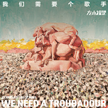

我们需要个歌手
============================

|  |  |
| :--: | :-- |
| [ 我们需要个歌手](https://emumo.xiami.com/album/810487971) | **艺人**: [左小祖咒](../index.md) **语种**: 国语 **唱片公司**: 摩登天空 **发行时间**: 2014年09月23日 **专辑类别**: 录音室专辑 **专辑风格**: 摇滚 Rock & Roll, 另类摇滚 Alternative Rock, 迷幻民谣 Psychedelic Folk **播放数**: 854767 **收藏数**: 1818 **评论数**: 352  |

## 简介

作为摩登天空初创期的签约艺人，左小在1999年出版的专辑《走失的主人》与《庙会之旅》经过十余年的检验，已经成为中国摇滚乐的标杆之作，时隔十五年，在摩登天空出版的第三张唱片，这张《我们需要个歌手》依然保持了他的本色，十余年的时光流转、风云变幻中，无论音乐风格上有着怎样的变化，左小的精神气质上那股与生俱来的奇葩性依然没有变化。  
  
《我们需要个歌手》依循了《我不能悲伤地坐在你身旁》时建立的抒情美学路线，但较之则有了更大的突破，在《我不能悲伤地坐在你身旁》中，左小祖咒用一种近似梵高笔下的星星般的光亮来抒情，来表达个体在时代变革中遭遇的苦难，而十年后的这张新专辑一反此前的悲情式表达，以一种迷醉般的狂喜来抒情，并将眼界放得更为辽阔。它相当于此前《我不能悲伤地坐在你身旁》与《你知道东方在哪一边》的混合体，诙谐与庄重并存，搞笑与严肃共生，一起形成了一个庞杂辽阔的抒情视界。这个抒情视界的打开，也与这些年来的社会发展与变化密切关联。专辑中“情歌”的概念被放大到人类情感的普遍性与共通性上，在抒情的外壳下，是对诸多世事的洞察与体悟，诸如信仰、环境、人际关系等问题被统一在情歌的框架下一一以拿捏到位、举重若轻的方式得以表达，而这也是左小最为擅长的。  
  
另外，整个专辑的阵容上，十年前与左小合作、并担任2010左小“万事如意”演唱会嘉宾的台湾唱作人陈珊妮这次再度献声，与他合唱《太平洋的风》，而这首歌的歌词则出自韩寒之手；内地、香港、台湾三地文化精英的集结，也为这张专辑增加了诸多看点。

## 曲目

- [财 富](./810487971/9c7flAf41d9.md)
- [你会说](./810487971/xL7Ffxd2783.md)
- [什么时候](./810487971/yhMrGqb7945.md)
- [阿弥陀佛](./810487971/xL7Ff0c45b7.md)
- [太平洋的风](./810487971/USdkN927d85.md)
- [当你需要的时候 它就来了](./810487971/mQMGqSe713c.md)
- [极乐行事](./810487971/xL7Ff313df9.md)
- [闷瓜也有春天](./810487971/yhMrsud9d25.md)

## 评论

|  |  |  |  |
| :-- | :-- | :-- | :-- |
|  [虾米用户](https://emumo.xiami.com/u/31481) 桃花潭水深千尺 2020-08-03 12:53 赞(0) 踩(0) | 
变得庸庸碌碌？还是从来就是？
 |
|  [虾米用户](https://emumo.xiami.com/u/295378769) 亦可搜索jimnosky 2019-12-10 13:19 赞(0) 踩(0) | 
这张真的很好听。像我这种05年底听完悲伤的你身旁就不再听的人，都久别重逢了
 |
|  [虾米用户](https://emumo.xiami.com/u/318746832)  2019-08-27 18:57 赞(0) 踩(0) | 
七头暗示18届
 |
|  [虾米用户](https://emumo.xiami.com/u/27793105)  2017-10-27 23:03 赞(0) 踩(0) | 
MV里看得到艾毛驴儿的影子，周云蓬老师还在微博上说左叔是意大利美声唱法呢，哈哈哈，你们两个真的不是兄弟吗？
 |
|  [虾米用户](https://emumo.xiami.com/u/248054181) 还是差的太远 还要还要翻... 2017-09-23 15:29 赞(2) 踩(0) | 
联合两个404歌手的吊诡大作
 |
|  [虾米用户](https://emumo.xiami.com/u/42403249)  2016-07-25 16:56 赞(0) 踩(0) | 
不觉得难听
 |
|  [虾米用户](https://emumo.xiami.com/u/25451937) 你曾被人用光速踢过吗！ 2016-04-25 23:40 赞(1) 踩(0) | 
这些猪让地面高了一米
 |
|  [虾米用户](https://emumo.xiami.com/u/11234562) 默然潜行人生 2016-04-09 00:22 赞(0) 踩(0) | 
当你觉得左小的音乐还可以 恭喜你 那么
 |
|  [虾米用户](https://emumo.xiami.com/u/2724370) 王权没有永恒，你将何去何... 2016-02-18 21:11 赞(3) 踩(0) | 
个人觉得跟陈升老师是完美组合呢（不喜勿拍-v-
 |
|  [虾米用户](https://emumo.xiami.com/u/17719900) 请把我的歌带回你的家 2015-12-29 00:38 赞(0) 踩(0) | 
这张曲子太弱了。
 |
|  [虾米用户](https://emumo.xiami.com/u/71877800) 民主，自由，真实… 2015-11-09 02:42 赞(0) 踩(0) | 
牛逼
 |
|  [虾米用户](https://emumo.xiami.com/u/8244559)  2015-10-28 14:48 赞(0) 踩(0) | 
******
 |
|  [虾米用户](https://emumo.xiami.com/u/37919108)   2015-10-07 23:56 赞(0) 踩(0) | 
太帅气了，每首编曲都太有特色了，不带重复的。特别、特别、太特别了。
 |
|  [虾米用户](https://emumo.xiami.com/u/5724770)  2015-09-28 10:38 赞(0) 踩(0) | 
表现式唱法
 |
|  [虾米用户](https://emumo.xiami.com/u/7322777) ∮ 2015-09-24 10:29 赞(0) 踩(0) | 
...A...
 |
|  [虾米用户](https://emumo.xiami.com/u/5799580)  2015-09-14 21:57 赞(0) 踩(0) | 
越听越牛逼
 |
|  [虾米用户](https://emumo.xiami.com/u/40776502) 继续宠爱/不整理别人翻唱... 2015-09-06 16:28 赞(0) 踩(0) | 
可怜233333333
 |
|  [虾米用户](https://emumo.xiami.com/u/12115998)  2015-08-28 17:05 赞(1) 踩(0) | 
地下左小死了没埋小左地下。。。所以左小炫丽地上了
 |
|  [虾米用户](https://emumo.xiami.com/u/54518)  2015-06-11 20:30 赞(0) 踩(0) | 
上
 |
|  [虾米用户](https://emumo.xiami.com/u/1017492)  2015-06-04 00:26 赞(2) 踩(0) | 
听多了左小总会有种思维定势 觉得他的东西总在框架里  很多歌会直接掠过 但不得不说真的掠过了好的东西 整张听起来 不高大上 编曲用俩字形容 亲民 虽然少了可以成为经典的东西 但全张东西听下来很舒服
 |
|  [虾米用户](https://emumo.xiami.com/u/2689520)  2015-05-25 11:02 赞(0) 踩(0) | 
精取奖提名
 |
|  [虾米用户](https://emumo.xiami.com/u/25601331) 你所经历的一切都会成为你... 2015-05-24 11:26 赞(0) 踩(0) | 
喜欢封面 
 |
|  [虾米用户](https://emumo.xiami.com/u/9047731) 失责亏恩 度时虚浮 意志... 2015-05-10 22:31 赞(0) 踩(0) | 
听完最荒唐后我觉得这个不是我喜欢的那个左小了，不过你喜欢要不用跟我吐槽。对于我来说就像那几句话，和现实贴得太近，就不美也不清醒。
 |
|  [虾米用户](https://emumo.xiami.com/u/42263789) 。 2015-04-30 00:18 赞(0) 踩(0) | 
左小开始学会绵里藏针了。。。。。
 |
|  [虾米用户](https://emumo.xiami.com/u/11932346) 這個世界為什麼那麼邪惡呢 2015-04-10 00:31 赞(0) 踩(0) | 
编曲完美 至于唱腔 仁者见仁 萝卜青菜各有所爱
 |
|  [虾米用户](https://emumo.xiami.com/u/5870654) 静虑深秘 2015-04-08 09:14 赞(0) 踩(0) | 
赞
 |
|  [虾米用户](https://emumo.xiami.com/u/312179) 潜入深蓝，放肆幻听 2015-04-04 21:17 赞(0) 踩(0) | 
这不还是原来那个左小吗。有什么值得喷的吗。
 |
|  [虾米用户](https://emumo.xiami.com/u/13048549) 回应大地的召唤 2015-03-11 23:35 赞(0) 踩(0) | 
其实并不是走调，悲伤时就要悲伤，难过时就要难过，又怎么好听的起来？
 |
|  [虾米用户](https://emumo.xiami.com/u/658405) 来自成都的平面设计师 2015-02-12 16:00 赞(0) 踩(0) | 
怪味，但嚼着回味！好！
 |
|  [虾米用户](https://emumo.xiami.com/u/40614954) 劝君逆水跃江头，劝君顺水... 2015-01-03 10:22 赞(0) 踩(0) | 
哈哈   大赞   三年前 听  我不能悲伤的坐在你身旁  听乐了   现在听哭了。玩笑那些苦难吧，让大家一起笑。我们只关心与自己有关的的人。
 |
|  [虾米用户](https://emumo.xiami.com/u/35501540)  2014-12-27 20:38 赞(0) 踩(0) | 
赞
 |
|  [虾米用户](https://emumo.xiami.com/u/35501540)  2014-12-27 20:05 赞(0) 踩(0) | 
赞
 |
|  [虾米用户](https://emumo.xiami.com/u/43281353)  2014-12-23 03:12 赞(0) 踩(0) | 

 |
|  [虾米用户](https://emumo.xiami.com/u/9047731) 失责亏恩 度时虚浮 意志... 2014-12-17 01:22 赞(0) 踩(0) | 
最荒唐真心土鳖，对不起，左小。对不起明哥。。。。。
 |
|  [虾米用户](https://emumo.xiami.com/u/4073313)  2014-12-04 13:29 赞(0) 踩(0) | 
封面好，作曲好，歌词好。一开嘴，邪乎的血肉模糊的。过瘾！！
 |
|  [虾米用户](https://emumo.xiami.com/u/3533094)  2014-11-20 23:43 赞(0) 踩(0) | 
俩字儿：上瘾
 |
|  [虾米用户](https://emumo.xiami.com/u/2353478) 泡一杯提拉米苏放一点蒜泥 2014-11-18 14:55 赞(0) 踩(0) | 
最最最荒唐的还能是什么
 |
|  [虾米用户](https://emumo.xiami.com/u/498661)  2014-11-13 09:30 赞(0) 踩(0) | 
一泡污
 |
|  [虾米用户](https://emumo.xiami.com/u/5020572)  2014-11-12 16:26 赞(3) 踩(0) | 
我真心希望 左小 可以有些互联网思维 编曲 录制真的很精益求精 能每次出两张CD么？你自己唱一张，另一张只有伴奏留给我们好么
 |
|  [虾米用户](https://emumo.xiami.com/u/498661)  2014-11-12 12:41 赞(2) 踩(0) | 
左小真心善于抱大腿，一张专辑祸害三个我喜欢的歌手，也是服了
 |
|  [虾米用户](https://emumo.xiami.com/u/1250039) 一个善于自毁前程的人。 2014-11-12 08:21 赞(1) 踩(0) | 
诅咒的编曲和歌词都太好了，至于唱腔，只是个人化的点缀，跑调不能阻止他的牛逼。认为喜欢他的人只是喜欢形式未免太武断，诅咒具备政治性但喜欢他首先是因为音乐好。想想吧，当你在草原听到乌兰巴托的风，除了哭，沉默，还能做什么。
 |
|  [虾米用户](https://emumo.xiami.com/u/10509307)  2014-11-11 11:31 赞(0) 踩(0) | 
照个相的编曲太TMD的赞了
 |
|  [虾米用户](https://emumo.xiami.com/u/462623)  2014-11-10 09:43 赞(0) 踩(0) | 
越听越有味道的专辑
 |
|  [虾米用户](https://emumo.xiami.com/u/8133145) o my sky 2014-11-08 01:31 赞(1) 踩(0) | 
我觉得，用难听这两个字，都是赞扬这专辑了。。  。等到左小诅咒赚够了这些天天怨气冲天的人的钱之后，然后大家才觉悟原来自己已经被利用了。。，然后左小诅咒可能过个十几年才能消停，或者死亡之类的。
 |
| ⇒ |  [虾米用户](https://emumo.xiami.com/u/3206053) 照章办事 2014-11-08 13:02 赞(0) 踩(0) | 
感觉你是一个明白人
 |
| ⇒ |  [虾米用户](https://emumo.xiami.com/u/8133145) o my sky 2014-11-09 18:41 赞(0) 踩(0) | 
<q><b>赵章说：</b></q>
 |
| ⇒ |  [虾米用户](https://emumo.xiami.com/u/3206053) 照章办事 2014-11-10 15:09 赞(0) 踩(0) | 
<q><b>Xiayul说：</b></q>
 |
| ⇒ |  [虾米用户](https://emumo.xiami.com/u/8133145) o my sky 2014-11-10 16:55 赞(0) 踩(0) | 
<q><b>赵章说：</b></q>
 |
| ⇒ |  [虾米用户](https://emumo.xiami.com/u/222802757) 单循控  没电脑只有果1... 2020-12-15 08:45 赞(0) 踩(0) | 
<q><b>Xiayul说：</b></q>
 |
| ⇒ |  [虾米用户](https://emumo.xiami.com/u/222802757) 单循控  没电脑只有果1... 2020-12-15 08:56 赞(0) 踩(0) | 
<q><b>Xiayul说：</b></q>
 |
|  [虾米用户](https://emumo.xiami.com/u/9606679)   2014-11-06 20:36 赞(0) 踩(0) | 
太平洋的风好好听！
 |
|  [虾米用户](https://emumo.xiami.com/u/7742202)  2014-11-06 00:05 赞(0) 踩(0) | 
越来越垃圾
 |
| ⇒ |  [虾米用户](https://emumo.xiami.com/u/8233033)  2014-12-11 22:17 赞(0) 踩(0) | 

 |
|  [虾米用户](https://emumo.xiami.com/u/624550)  2014-11-04 19:38 赞(0) 踩(0) | 
好好好
 |
|  [虾米用户](https://emumo.xiami.com/u/24648377) 别装逼 认真听 2014-11-03 07:52 赞(0) 踩(0) | 
你们真的需要个歌手
 |
|  [虾米用户](https://emumo.xiami.com/u/35492349) 平凡又没见过世面 2014-10-29 20:13 赞(0) 踩(0) | 
听过
 |
|  [虾米用户](https://emumo.xiami.com/u/822049) 我还没想好要写什么... 2014-10-20 21:39 赞(1) 踩(0) | 
什么几把玩意 太好听了
 |
| ⇒ |  [虾米用户](https://emumo.xiami.com/u/4315769) 爱是世上最美好的语言 2014-11-16 19:00 赞(0) 踩(0) | 
这个评价很到位
 |
|  [虾米用户](https://emumo.xiami.com/u/4007876)  2014-10-20 19:23 赞(0) 踩(0) | 
太平洋的风很好听啊，其它的歌就太搞了，搞摇滚也不用这么极端吧，把好好的歌唱歪才行？
 |
| ⇒ |  [虾米用户](https://emumo.xiami.com/u/5561089)  2014-11-04 13:04 赞(0) 踩(0) | 
这和摇滚不摇滚没什么关系 也和极端没什么关系 而且也不存在什么好好的歌非要唱成这样 这本来就是他自己的歌 又不是把本来别人好好的歌唱成什么样
 |
|  [虾米用户](https://emumo.xiami.com/u/5903523)   2014-10-19 09:21 赞(0) 踩(0) | 
左小祖咒还是比较适合小情调的歌曲 我不能悲伤的坐在你身旁
 |
|  [虾米用户](https://emumo.xiami.com/u/9991351)  2014-10-13 20:02 赞(0) 踩(0) | 
又有不一样的出彩的声音滚摇出来！
 |
|  [虾米用户](https://emumo.xiami.com/u/1321498) 我还没想好要写什么... 2014-10-13 15:10 赞(0) 踩(0) | 
矫情和投机之路继续，匠气十足毫无灵感，左小已经走不出自己给自己画的圈子了。听了祖咒8年的老歌迷表示对他现在完全路人。
 |
| ⇒ |  [虾米用户](https://emumo.xiami.com/u/38634495)  2014-10-13 21:50 赞(0) 踩(0) | 
不谙世事专心追求的只有小河何国峰了。
 |
| ⇒ |  [虾米用户](https://emumo.xiami.com/u/30653092) 严格来说，我只是喜欢流行... 2014-11-03 09:00 赞(0) 踩(0) | 
变的庸庸碌碌
 |
|  [虾米用户](https://emumo.xiami.com/u/2628020) 我还没想好要写什么... 2014-10-12 13:38 赞(0) 踩(0) | 
思想涣散 情绪饱满 越来越有味儿 那份嘶哑呐喊 触动心弦
 |
|  [虾米用户](https://emumo.xiami.com/u/36100852) 使黑色的光芒遍布我的心脏... 2014-10-12 13:28 赞(1) 踩(0) | 
封面赞。
 |
|  [虾米用户](https://emumo.xiami.com/u/33242961) 饮风抿雪 2014-10-11 13:50 赞(0) 踩(0) | 
喜欢-.-
 |
|  [虾米用户](https://emumo.xiami.com/u/13525289) 将摇滚进行到死 2014-10-10 07:13 赞(0) 踩(0) | 
这需要慢慢的听，
 |
|  [虾米用户](https://emumo.xiami.com/u/1233849)  2014-10-08 10:11 赞(0) 踩(0) | 
好吧，他们真的需要个歌手。。。
 |
|  [虾米用户](https://emumo.xiami.com/u/744592) 虾米关了，陪伴了我10年... 2014-10-07 22:09 赞(0) 踩(0) | 
左哥的歌越来越有思想啦
 |
|  [虾米用户](https://emumo.xiami.com/u/5688025)  2014-10-07 19:23 赞(0) 踩(0) | 
感觉很不错啊，怎么那么多说难听的
 |
| ⇒ |  [虾米用户](https://emumo.xiami.com/u/5561089)  2014-11-04 13:09 赞(0) 踩(0) | 
这张的确很多不错的
 |
|  [虾米用户](https://emumo.xiami.com/u/6688475)   2014-10-06 10:01 赞(0) 踩(0) | 
左小的姿态决定了他的多产
 |
|  [虾米用户](https://emumo.xiami.com/u/3935914) 你以为的，总是你以为 2014-10-05 20:56 赞(0) 踩(0) | 
这张专辑还真没觉得怎么走调，难听啊。难道这样也是个姿态吗？小先生也挺幽默啊
 |
|  [虾米用户](https://emumo.xiami.com/u/658948)  2014-10-03 08:44 赞(0) 踩(0) | 
良心音乐人
 |
|  [虾米用户](https://emumo.xiami.com/u/10281583)   2014-10-03 00:48 赞(0) 踩(0) | 
我真的是醉了………………
 |
|  [虾米用户](https://emumo.xiami.com/u/2479965)  2014-10-03 00:13 赞(0) 踩(0) | 
超级好听！！！！！
 |
|  [虾米用户](https://emumo.xiami.com/u/6445877)  2014-10-02 12:51 赞(4) 踩(0) | 
左小的专辑  配乐排一 歌词其次 至于演唱 我们不需要这样的歌手 但有时我们需要这样的音乐 .
 |
|  [虾米用户](https://emumo.xiami.com/u/12576793) 我还没想好要写什么... 2014-10-02 08:22 赞(0) 踩(0) | 
第一次听左小，看评论实在搞xiao~点开最荒唐吧，第一句很正常嗯，接着往下听，卧槽！还有当你需要的时候听完真塔玛通体舒畅~
 |
|  [虾米用户](https://emumo.xiami.com/u/294205)  2014-10-02 07:36 赞(0) 踩(0) | 
有点一味地走偏，听不到心里去。做作～
 |
|  [虾米用户](https://emumo.xiami.com/u/2218963) ～ 2014-10-01 01:18 赞(0) 踩(0) | 
温柔多了
 |
|  [虾米用户](https://emumo.xiami.com/u/155101)  2014-09-30 20:02 赞(0) 踩(0) | 
天生就是屌
 |
|  [虾米用户](https://emumo.xiami.com/u/10778392)   2014-09-30 13:51 赞(1) 踩(0) | 
依旧难听，但是就想听，哈哈
 |
|  [虾米用户](https://emumo.xiami.com/u/2558684) We are X！ 2014-09-30 08:50 赞(0) 踩(0) | 
@x林小花x 李老西，他们需要个歌手噢，你来听听看(*¯︶¯*)
 |
|  [虾米用户](https://emumo.xiami.com/u/7802465) 杀死那个广东人 2014-09-30 00:52 赞(0) 踩(0) | 
为无名山增高一米2333333333
 |
|  [虾米用户](https://emumo.xiami.com/u/2935784)  2014-09-29 22:37 赞(0) 踩(0) | 
。。。
 |
|  [虾米用户](https://emumo.xiami.com/u/14685521) 喜欢就去追寻啊！ 2014-09-29 11:55 赞(0) 踩(0) | 
还是跟以前一样的难听o(*////▽////*)q  偶尔也会听到一两句有调的，应该是我的耳朵坏了吧，恩。
 |
|  [虾米用户](https://emumo.xiami.com/u/14685521) 喜欢就去追寻啊！ 2014-09-29 11:55 赞(0) 踩(0) | 
还是跟以前一样的难听o(*////▽////*)q  偶尔也会听到一两句有调的，应该是我的耳朵坏了吧，恩。
 |
|  [虾米用户](https://emumo.xiami.com/u/14685521) 喜欢就去追寻啊！ 2014-09-29 11:54 赞(0) 踩(0) | 
还是跟以前一样的难听呢╰(*°▽°*)╯
 |
|  [虾米用户](https://emumo.xiami.com/u/2572835)  2014-09-28 22:17 赞(1) 踩(0) | 
内容已删除
 |
| ⇒ |  [虾米用户](https://emumo.xiami.com/u/37674090)  2014-10-01 21:02 赞(0) 踩(0) | 
对的
 |
|  [虾米用户](https://emumo.xiami.com/u/850168) 微信号buzai_myc 2014-09-28 22:09 赞(0) 踩(0) | 
很棒，已经循环听了很多遍
 |
|  [虾米用户](https://emumo.xiami.com/u/2805042) 最近太冷了 2014-09-28 10:00 赞(0) 踩(0) | 
陈升唱和声?
 |
|  [虾米用户](https://emumo.xiami.com/u/2046856) 爱音乐爱生活 2014-09-27 22:25 赞(0) 踩(0) | 
左小祖咒好像很腻害，可惜我欣赏不来。
 |
|  [虾米用户](https://emumo.xiami.com/u/40730702)  2014-09-27 17:59 赞(1) 踩(0) | 
很遗憾诅咒的音乐越来越不灵，一张不如一张唯一的优点就是这次不是150大元也希望不要在出现500了，怀念那个走失的诅咒。
 |
| ⇒ |  [虾米用户](https://emumo.xiami.com/u/38634495)  2014-10-04 22:55 赞(0) 踩(0) | 
在NO乐队是他的巅峰，现在他就是个造谣一时爽，全家火葬场的跳梁小丑。
 |
| ⇒ |  [虾米用户](https://emumo.xiami.com/u/40460827) 肮脏的卡纳斯塔把泰菲鸭的... 2014-10-12 13:21 赞(0) 踩(0) | 
<q><b>Uninstaller说：</b></q>
 |
| ⇒ |  [虾米用户](https://emumo.xiami.com/u/40460827) 肮脏的卡纳斯塔把泰菲鸭的... 2014-10-14 07:34 赞(0) 踩(0) | 
<q><b>Uninstaller说：</b></q>
 |
| ⇒ |  [虾米用户](https://emumo.xiami.com/u/38634495)  2017-10-27 23:25 赞(0) 踩(0) | 
<q><b>肮脏的卡纳斯塔说：</b></q>
 |
|  [虾米用户](https://emumo.xiami.com/u/33574251)  2014-09-27 16:23 赞(0) 踩(0) | 
左小祖咒永远是左小祖咒。永远是摇滚后花园的一朵大奇葩。
 |
|  [虾米用户](https://emumo.xiami.com/u/17154303)  2014-09-27 11:57 赞(0) 踩(0) | 
感觉。。没以前的好听点。总是差点的感觉。不过听了几天，又觉得还不错。
 |
|  [虾米用户](https://emumo.xiami.com/u/1750733) 热爱音乐 热爱生活 2014-09-27 07:48 赞(0) 踩(0) | 
封面是三胖的配种照吗？
 |
|  [虾米用户](https://emumo.xiami.com/u/6450)  2014-09-27 00:01 赞(4) 踩(0) | 
很久没听到这么难听的旋律了，好感动
 |
|  [虾米用户](https://emumo.xiami.com/u/2917052) 暂无签名~ 2014-09-26 23:37 赞(0) 踩(0) | 
我突然发现我的审美已经跟不上时代了。
 |
|  [虾米用户](https://emumo.xiami.com/u/2577460)   2014-09-26 23:01 赞(0) 踩(0) | 
你们乐队是需要一个歌手了。
 |
|  [虾米用户](https://emumo.xiami.com/u/2940320) 华语乐迷唱片控 2014-09-26 22:26 赞(0) 踩(0) | 
编曲好激烈 赞一个
 |
|  [虾米用户](https://emumo.xiami.com/u/7779218) 性冷淡. 2014-09-26 21:39 赞(0) 踩(0) | 
整张都他么挺棒的!
 |
|  [虾米用户](https://emumo.xiami.com/u/21715811)  2014-09-26 19:50 赞(0) 踩(0) | 
左大
 |
|  [虾米用户](https://emumo.xiami.com/u/21715811)  2014-09-26 19:50 赞(0) 踩(0) | 
帅到掉渣
 |
|  [虾米用户](https://emumo.xiami.com/u/2535572) 谎话…情歌… 2014-09-26 17:26 赞(0) 踩(0) | 
真他妈好听~这张的大众可接受度较上一张已经有了大跨越！！！我还依稀记得当年被上一张打败的场景！！
 |
|  [虾米用户](https://emumo.xiami.com/u/1588558) 我的精选集里混入了一些奇... 2014-09-26 17:16 赞(0) 踩(0) | 
只有最后三首在水准之上
 |
|  [虾米用户](https://emumo.xiami.com/u/37031425)   2014-09-26 15:10 赞(0) 踩(0) | 
看评论也是醉了
 |
|  [虾米用户](https://emumo.xiami.com/u/35353108) 456 2014-09-26 13:43 赞(0) 踩(0) | 
好听
 |
|  [虾米用户](https://emumo.xiami.com/u/36985307)  2014-09-26 13:10 赞(0) 踩(0) | 
对。
 |
|  [虾米用户](https://emumo.xiami.com/u/40997459) 豆瓣ID：9155346... 2014-09-26 11:48 赞(0) 踩(0) | 
封面也是醉了
 |
|  [虾米用户](https://emumo.xiami.com/u/33355312) “南风知我意，吹夢到西洲... 2014-09-26 09:44 赞(0) 踩(0) | 
真特么难听
 |
|  [虾米用户](https://emumo.xiami.com/u/25639638)  2014-09-26 09:30 赞(0) 踩(0) | 
祖咒叔好像唱得比以前好点
 |
|  [虾米用户](https://emumo.xiami.com/u/3343189) 我愛你 老婆！麼麼麼哈哈... 2014-09-26 09:10 赞(0) 踩(0) | 
左小诅咒真的是一种诅咒
 |
|  [虾米用户](https://emumo.xiami.com/u/6733300) 誩 2014-09-26 08:09 赞(0) 踩(0) | 
依然是左小，但是有了和台湾歌手合作交流后，有些平和中庸的思想了，但依旧有评判
 |
|  [虾米用户](https://emumo.xiami.com/u/9718274) 嘿！ 2014-09-26 07:49 赞(0) 踩(0) | 
依旧难听，不过我居然觉得比以前好听多了，这是进步了么？
 |
|  [虾米用户](https://emumo.xiami.com/u/1702986)  2014-09-26 04:04 赞(0) 踩(0) | 
很好  依旧那么难听……记得上一张我循环了一个月才顿悟   这张又要多久？
 |
|  [虾米用户](https://emumo.xiami.com/u/317561) 一天早上，听见有人敲了敲... 2014-09-26 01:38 赞(0) 踩(0) | 
在这里难听是一种表扬！
 |
|  [虾米用户](https://emumo.xiami.com/u/721351)  2014-09-26 00:13 赞(0) 踩(0) | 
听左小就别纠结什么唱功。
 |
|  [虾米用户](https://emumo.xiami.com/u/38657202)  2014-09-26 00:11 赞(0) 踩(0) | 
滑板鞋附体……
 |
|  [虾米用户](https://emumo.xiami.com/u/36271118)  2014-09-25 23:54 赞(0) 踩(0) | 
不过说左小祖咒唱功好 歌好听 的确很能体现你们不一样的品味 装逼利器～
 |
|  [虾米用户](https://emumo.xiami.com/u/36271118)  2014-09-25 23:52 赞(0) 踩(0) | 
陈升是音色自然带有浪子的感觉 但是左小诅咒刻意这样唱歌就是做作了。
 |
|  [虾米用户](https://emumo.xiami.com/u/369150) ♥︎stay hunge... 2014-09-25 23:27 赞(0) 踩(0) | 
声音很像伍佰
 |
|  [虾米用户](https://emumo.xiami.com/u/1268101)  2014-09-25 22:24 赞(0) 踩(0) | 
确实需要换一名歌手。欣赏不来这种唱腔。黄耀明的声音好听。vs陈珊妮的《太平洋的风》是唯一一首听完了的。
 |
|  [虾米用户](https://emumo.xiami.com/u/1268101)  2014-09-25 22:24 赞(0) 踩(0) | 
确实需要换一名歌手。欣赏不来这种唱腔。黄耀明的声音好听。vs陈珊妮的《太平洋的风》是唯一一首听完了的。
 |
|  [虾米用户](https://emumo.xiami.com/u/1313870)  2014-09-25 22:11 赞(0) 踩(0) | 

 |
|  [虾米用户](https://emumo.xiami.com/u/3428554) 我是好人 2014-09-25 22:09 赞(0) 踩(0) | 
唱的真难听。满分专辑！！！
 |
|  [虾米用户](https://emumo.xiami.com/u/122921)   2014-09-25 21:56 赞(0) 踩(0) | 
你开心就好
 |
|  [虾米用户](https://emumo.xiami.com/u/356023)  2014-09-25 21:47 赞(0) 踩(0) | 
最荒唐略牛逼！
 |
|  [虾米用户](https://emumo.xiami.com/u/36646226) 粉丝多也许是我有魅力吧 2014-09-25 21:19 赞(1) 踩(0) | 
评论让我很失望。❤
 |
|  [虾米用户](https://emumo.xiami.com/u/36646226) 粉丝多也许是我有魅力吧 2014-09-25 21:19 赞(0) 踩(0) | 
封面暗示的够明显了 但是不能说❤
 |
|  [虾米用户](https://emumo.xiami.com/u/6446544) 听歌都是听自己。 2014-09-25 21:02 赞(0) 踩(0) | 
不要听多，停不下来，中毒。
 |
| ⇒ |  [虾米用户](https://emumo.xiami.com/u/35339686)  2014-09-26 16:18 赞(0) 踩(0) | 
嗯，我的耳朵啊
 |
|  [虾米用户](https://emumo.xiami.com/u/18544189) 热情看世界.勇敢做自己 2014-09-25 20:59 赞(0) 踩(0) | 
左小
 |
|  [虾米用户](https://emumo.xiami.com/u/712925) 别扯有的没的 2014-09-25 20:43 赞(0) 踩(0) | 
终于等来咯~先赞后听
 |
|  [虾米用户](https://emumo.xiami.com/u/40325366)  2014-09-25 20:06 赞(0) 踩(0) | 
很遗憾——感觉这种东西总是被时间腐蚀
 |
|  [虾米用户](https://emumo.xiami.com/u/6851209) 因为生命存在失望 所以我... 2014-09-25 18:49 赞(0) 踩(0) | 
……
 |
|  [虾米用户](https://emumo.xiami.com/u/2736229) 乐迷正在绑架他所爱的乐队 2014-09-25 18:21 赞(0) 踩(0) | 
就是喜欢这个味儿！这种矛盾综合体简直听不够！
 |
|  [虾米用户](https://emumo.xiami.com/u/12281)  2014-09-25 17:59 赞(0) 踩(0) | 
黄耀明唱歌真好听
 |
|  [虾米用户](https://emumo.xiami.com/u/5774103)  2014-09-25 17:21 赞(0) 踩(0) | 
我很清楚我们需要的歌手不是你
 |
|  [虾米用户](https://emumo.xiami.com/u/349508)  2014-09-25 16:38 赞(0) 踩(0) | 
居然和明哥有合作，感动得流内。。。
 |
|  [虾米用户](https://emumo.xiami.com/u/6716304)  2014-09-25 16:31 赞(2) 踩(0) | 
左小祖咒和陈升，永远不能分清谁的调跑得更高远~~~~~~~~~
 |
|  [虾米用户](https://emumo.xiami.com/u/17124587) 阿那都品 2014-09-25 15:57 赞(0) 踩(0) | 
好
 |
|  [虾米用户](https://emumo.xiami.com/u/3206053) 照章办事 2014-09-25 15:43 赞(0) 踩(0) | 
一张内容厚实，感情真挚的摇滚专辑
 |
|  [虾米用户](https://emumo.xiami.com/u/1869182)  2014-09-25 15:08 赞(2) 踩(0) | 
我不是艺术家，听不懂
 |
|  [虾米用户](https://emumo.xiami.com/u/15846355) 18till i die 2014-09-25 14:46 赞(0) 踩(0) | 
我是来听陈升的。
 |
|  [虾米用户](https://emumo.xiami.com/u/6101452)  2014-09-25 14:39 赞(0) 踩(0) | 
照个相！！！！
 |
|  [虾米用户](https://emumo.xiami.com/u/35783) 身体给雨，灵魂给风。 2014-09-25 14:35 赞(0) 踩(0) | 
真是越来越【好听】了，但对左小来说，不知是好是坏。
 |
|  [虾米用户](https://emumo.xiami.com/u/124105) 心情大好！来点交响乐吧 2014-09-25 14:32 赞(0) 踩(0) | 
当你需要的时候 它就来了在草莓上听了左小这个版本的时候我酥麻了！这编曲比前一版要舒服太多了！啊啊啊啊啊啊啊啊啊啊啊啊
 |
|  [虾米用户](https://emumo.xiami.com/u/6169141) 是吗 2014-09-25 14:22 赞(0) 踩(0) | 
挺好
 |
|  [虾米用户](https://emumo.xiami.com/u/5543468)  2014-09-25 13:59 赞(0) 踩(0) | 
比前几张差了一些，左小祖咒的平均素质还不错，但这张拉低了不少。
 |
|  [虾米用户](https://emumo.xiami.com/u/35842986) 暂无签名~ 2014-09-25 13:07 赞(0) 踩(0) | 
编曲牛逼，歌词牛逼，居然也开始商业化起来了~~~
 |
|  [虾米用户](https://emumo.xiami.com/u/2747492) 么么 2014-09-25 12:46 赞(0) 踩(0) | 
我擦，封面最上面的猪好像是一双蛤蟆后腿？
 |
| ⇒ |  [虾米用户](https://emumo.xiami.com/u/35783) 身体给雨，灵魂给风。 2014-09-25 14:33 赞(0) 踩(0) | 
要么跳不了那么高。
 |
|  [虾米用户](https://emumo.xiami.com/u/1634596)  2014-09-25 12:37 赞(0) 踩(0) | 
换的这些校园乐手都是什么来路
 |
|  [虾米用户](https://emumo.xiami.com/u/38607076)  2014-09-25 12:08 赞(0) 踩(0) | 
有些人认为唱歌必须按他们对“正经”的定义来唱，可悲的世界观。
 |
|  [虾米用户](https://emumo.xiami.com/u/5501491)  2014-09-25 12:03 赞(0) 踩(0) | 
to me 本年度最佳国语专辑··
 |
|  [虾米用户](https://emumo.xiami.com/u/7345510) 我真的喜欢吃虾 2014-09-25 11:32 赞(2) 踩(0) | 
其实我也听不懂，不过上层都这么推崇他，所以他必定有他的牛逼之处，只是我没有那么牛逼的知道他的牛逼之处。
 |
|  [虾米用户](https://emumo.xiami.com/u/1162111)  2014-09-25 11:30 赞(0) 踩(0) | 
就不能好好唱歌吗？喜欢陈珊妮，那首歌形成强烈的对比
 |
|  [虾米用户](https://emumo.xiami.com/u/2182868)  2014-09-25 11:29 赞(0) 踩(0) | 
除了装逼你们能不能做点正事
 |
|  [虾米用户](https://emumo.xiami.com/u/3291628)  2014-09-25 11:12 赞(0) 踩(0) | 
编曲都不错
 |
|  [虾米用户](https://emumo.xiami.com/u/12237289) 每一个脚印 每一朵乌云 2014-09-25 10:57 赞(0) 踩(0) | 
牛逼 每次听左小的歌我都能感觉整个人都醉了
 |
|  [虾米用户](https://emumo.xiami.com/u/111609)  2014-09-25 10:32 赞(3) 踩(0) | 
还是我的滑板鞋比较好听。
 |
| ⇒ |  [虾米用户](https://emumo.xiami.com/u/8330415)  2014-09-25 20:50 赞(0) 踩(0) | 
的确 哈哈
 |
|  [虾米用户](https://emumo.xiami.com/u/111609)  2014-09-25 10:31 赞(0) 踩(0) | 
。。。。。。。。。。。。。。。。。。。无语
 |
|  [虾米用户](https://emumo.xiami.com/u/2326008)  2014-09-25 10:11 赞(0) 踩(0) | 
这是真正的难听！假！大！空！
 |
|  [虾米用户](https://emumo.xiami.com/u/13971176)  2014-09-25 09:59 赞(1) 踩(0) | 
呵呵~~~~~
 |
|  [虾米用户](https://emumo.xiami.com/u/413790) 惜知音再难觅 2014-09-25 09:58 赞(0) 踩(0) | 
封面赞，怎么过审的哈哈
 |
|  [虾米用户](https://emumo.xiami.com/u/36286480)  2014-09-25 09:49 赞(2) 踩(0) | 
你出唱片的前提是你是个歌手，你都唱成这样还来标榜什么啊！！！翻白眼！
 |
|  [虾米用户](https://emumo.xiami.com/u/2617510) secret stand 2014-09-25 09:47 赞(0) 踩(0) | 
头像还是那个梗啊。。。
 |
|  [虾米用户](https://emumo.xiami.com/u/41341252) 。 2014-09-25 09:23 赞(0) 踩(0) | 
流行音乐还差不多
 |
|  [虾米用户](https://emumo.xiami.com/u/41341252) 。 2014-09-25 09:15 赞(2) 踩(0) | 
到底哪里摇滚了，国摇垃圾
 |
| ⇒ |  [虾米用户](https://emumo.xiami.com/u/3206053) 照章办事 2014-09-25 15:47 赞(0) 踩(0) | 
挺摇滚的
 |
|  [虾米用户](https://emumo.xiami.com/u/30653092) 严格来说，我只是喜欢流行... 2014-09-25 09:14 赞(2) 踩(0) | 
比前面一张好像要好一点，不过依然没有什么惊喜。
 |
|  [虾米用户](https://emumo.xiami.com/u/678232) 我们都诗化了眼前的世界。 2014-09-25 09:12 赞(1) 踩(0) | 
哗众取宠，过去还认真做个音乐，现在做钱与名利的奴隶，还要给自己树立个贞节牌坊！
 |
|  [虾米用户](https://emumo.xiami.com/u/617351)  2014-09-25 08:45 赞(0) 踩(0) | 
越听越好听   百听不厌才叫好音乐懂吗？！
 |
|  [虾米用户](https://emumo.xiami.com/u/701718)  2014-09-25 08:19 赞(5) 踩(0) | 
在NO乐队认真做过几支歌，以后就都是哗众取宠了，靠吸引大家的好奇心骗销量！
 |
|  [虾米用户](https://emumo.xiami.com/u/319048) 向死而生 2014-09-25 08:12 赞(0) 踩(0) | 
万年不变的封面→_→果断取消关注
 |
|  [虾米用户](https://emumo.xiami.com/u/41023803)  2014-09-25 07:27 赞(1) 踩(0) | 
真的欣赏不了。
 |
|  [虾米用户](https://emumo.xiami.com/u/17719900) 请把我的歌带回你的家 2014-09-25 01:11 赞(3) 踩(0) | 
一直都有点哗众取宠，形式大于内容
 |
|  [虾米用户](https://emumo.xiami.com/u/2842812)  2014-09-25 00:44 赞(0) 踩(0) | 
好难听！！不错！
 |
|  [虾米用户](https://emumo.xiami.com/u/35343)  2014-09-25 00:27 赞(0) 踩(0) | 
封面太狠了吧 不至于吧  有点哗众取宠了哦
 |
|  [虾米用户](https://emumo.xiami.com/u/779540)  2014-09-25 00:10 赞(0) 踩(0) | 
哇靠！好讽刺的封面
 |
|  [虾米用户](https://emumo.xiami.com/u/2003179) 我不难过，我没有说谎。 2014-09-25 00:05 赞(0) 踩(0) | 
居然不知道。
 |
|  [虾米用户](https://emumo.xiami.com/u/8244559)  2014-09-25 00:03 赞(0) 踩(0) | 
******
 |
|  [虾米用户](https://emumo.xiami.com/u/21607895) 忠于自己，保持独立。 2014-09-24 23:57 赞(0) 踩(0) | 
就是难听！必须点赞
 |
|  [虾米用户](https://emumo.xiami.com/u/38607076)  2014-09-24 23:32 赞(0) 踩(0) | 
满分了
 |
|  [虾米用户](https://emumo.xiami.com/u/203043)  2014-09-24 22:45 赞(1) 踩(0) | 
呕
 |
|  [虾米用户](https://emumo.xiami.com/u/19157524)  2014-09-24 22:34 赞(2) 踩(0) | 
封面的意思是：左小祖咒做小豬粥
 |
| ⇒ |  [虾米用户](https://emumo.xiami.com/u/15813028) 寡居。 2014-09-25 22:16 赞(0) 踩(0) | 
哈哈哈！
 |
|  [虾米用户](https://emumo.xiami.com/u/41256413)  2014-09-24 22:30 赞(0) 踩(0) | 
左小\
 |
|  [虾米用户](https://emumo.xiami.com/u/3933648)  2014-09-24 22:08 赞(2) 踩(0) | 
编曲真耐听
 |
|  [虾米用户](https://emumo.xiami.com/u/41656466) 你该听音乐了！ 2014-09-24 22:07 赞(2) 踩(0) | 
以为听了三遍会觉得好听 可是不行 到底要听几遍
 |
|  [虾米用户](https://emumo.xiami.com/u/1603133)  2014-09-24 21:54 赞(1) 踩(0) | 
你们的逼格都没有我高  明明辣么好听！！！
 |
|  [虾米用户](https://emumo.xiami.com/u/5478421)  2014-09-24 21:33 赞(0) 踩(0) | 
这样下去猪还够用吗？满分！
 |
|  [虾米用户](https://emumo.xiami.com/u/155101)  2014-09-24 21:21 赞(3) 踩(0) | 
突破了曾经的难听，到达了更难听。
 |
| ⇒ |  [虾米用户](https://emumo.xiami.com/u/1603133)  2014-09-24 21:53 赞(0) 踩(0) | 
哈哈哈   其实和陈珊妮合唱的那首曲子还不错
 |
|  [虾米用户](https://emumo.xiami.com/u/9044431)  2014-09-24 21:21 赞(0) 踩(0) | 
感觉不如之前的，凸凸凸
 |
|  [虾米用户](https://emumo.xiami.com/u/4094581)   2014-09-24 21:12 赞(1) 踩(0) | 
biger than biger.
 |
|  [虾米用户](https://emumo.xiami.com/u/298615) 暂无签名~ 2014-09-24 21:00 赞(0) 踩(0) | 
死猪奇葩
 |
|  [虾米用户](https://emumo.xiami.com/u/203394) 三分似神，七分似我。 2014-09-24 20:42 赞(1) 踩(0) | 
我擦，必须点个赞。这个不能用表面的好听或者难听来形容和定义。
 |
|  [虾米用户](https://emumo.xiami.com/u/5478421)  2014-09-24 20:24 赞(0) 踩(0) | 
终于有了
 |
|  [虾米用户](https://emumo.xiami.com/u/1259073) 线段 2014-09-24 20:24 赞(3) 踩(0) | 
再出专辑，估计猪不够用了。
 |
| ⇒ |  [虾米用户](https://emumo.xiami.com/u/9458465) 好吃吗！ 2014-09-24 21:31 赞(0) 踩(0) | 
哈哈哈哈哈哈哈
 |
| ⇒ |  [虾米用户](https://emumo.xiami.com/u/13902803)  2014-09-25 18:57 赞(0) 踩(0) | 
哈哈哈哈
 |
|  [虾米用户](https://emumo.xiami.com/u/8096817)  2014-09-24 20:20 赞(1) 踩(0) | 
喜欢的自然继续喜欢，不喜欢的，也会自然绕道，也不会贸然评价，一般人真没那个道行。这个编曲真是超牛。喜欢，至于左小的唱，呵呵，习惯了就好了。大爱。
 |
| ⇒ |  [虾米用户](https://emumo.xiami.com/u/4914760) 暂无签名~ 2014-09-24 20:52 赞(0) 踩(0) | 
对头
 |
|  [虾米用户](https://emumo.xiami.com/u/2022341) 懶似精靈。。。。 2014-09-24 20:12 赞(0) 踩(0) | 
大叔唱着原则和良心呵！
 |
|  [虾米用户](https://emumo.xiami.com/u/35775202) But I'm a cr... 2014-09-24 19:50 赞(2) 踩(0) | 
真正装逼的人一眼就看得出来。
 |
|  [虾米用户](https://emumo.xiami.com/u/5404528)  2014-09-24 19:43 赞(0) 踩(0) | 
曲不错  编曲亮了 别做歌手了  浪费精力 唱得吓跑人
 |
|  [虾米用户](https://emumo.xiami.com/u/3531256) 倾听一切 2014-09-24 19:42 赞(2) 踩(0) | 
发现还是很难听，我就放心了.
 |
|  [虾米用户](https://emumo.xiami.com/u/1663201) 来自地球 2014-09-24 19:33 赞(0) 踩(0) | 
真tm难听啊
 |
|  [虾米用户](https://emumo.xiami.com/u/6661598)  2014-09-24 19:24 赞(0) 踩(0) | 
音乐不错 唱的真心欣赏不来
 |
|  [虾米用户](https://emumo.xiami.com/u/2790996)  2014-09-24 19:12 赞(1) 踩(0) | 
作曲太棒了，当个作曲家多好：）
 |
|  [虾米用户](https://emumo.xiami.com/u/11021720) Paul 2014-09-24 18:59 赞(0) 踩(0) | 
够难听
 |
|  [虾米用户](https://emumo.xiami.com/u/38884714)  2014-09-24 18:58 赞(0) 踩(0) | 
五音不全左小  装逼摇滚师
 |
|  [虾米用户](https://emumo.xiami.com/u/9739)  2014-09-24 18:16 赞(0) 踩(0) | 
还是那么有味道
 |
|  [虾米用户](https://emumo.xiami.com/u/694810)   2014-09-24 18:00 赞(0) 踩(0) | 
做家务的孩子们可以听着BGM干起来~ 左小祖咒的歌儿我听着就好想笑~太直白了，嗯。
 |
|  [虾米用户](https://emumo.xiami.com/u/2689520)  2014-09-24 17:25 赞(0) 踩(0) | 
从封面到每首歌，处处都是牛逼
 |
|  [虾米用户](https://emumo.xiami.com/u/7553389) 来，上船，去天狼星 2014-09-24 17:17 赞(1) 踩(0) | 
我擦了，一贯的难听，喜欢
 |
|  [虾米用户](https://emumo.xiami.com/u/11259253) 听靓歌 2014-09-24 17:16 赞(0) 踩(0) | 
太平洋的风。
 |
|  [虾米用户](https://emumo.xiami.com/u/15400066)  2014-09-24 17:08 赞(62) 踩(0) | 
你们的乐队确实需要一个歌手……
 |
|  [虾米用户](https://emumo.xiami.com/u/3592527)  2014-09-24 16:56 赞(39) 踩(0) | 
这些上层的猪啊
 |
| ⇒ |  [虾米用户](https://emumo.xiami.com/u/147361618) 再会 2018-11-25 00:25 赞(0) 踩(0) | 
专辑图应该是取自于左小诅咒与众艺术家当年做的一个行为艺术，《为无名山增高一米》
 |
|  [虾米用户](https://emumo.xiami.com/u/4400366) 再也不见 2014-09-24 16:55 赞(0) 踩(0) | 
。
 |
|  [虾米用户](https://emumo.xiami.com/u/139128) 上海那个什么鸟室内合唱团... 2014-09-24 16:49 赞(0) 踩(0) | 
闷瓜也有春天 开头听出了窦唯的赶脚~
 |
|  [虾米用户](https://emumo.xiami.com/u/2523233) 太热 2014-09-24 16:46 赞(0) 踩(0) | 
。。。。我觉得有点好听是怎么回事。。
 |
|  [虾米用户](https://emumo.xiami.com/u/40020756)  2014-09-24 16:43 赞(1) 踩(0) | 
先锋、地下、实验、另类都不等于天才和奇葩；只能代表一些人找到了作为一个人的本能，左小祖咒的归宿就是这个玩这个的，而且玩的不错，他早已脱离纯碎的音乐范畴，他就是一个独立活着的人，唱唱歌儿，说说自己想说的。
 |
|  [虾米用户](https://emumo.xiami.com/u/2982338) 我多想和你一样臭不要脸 2014-09-24 16:26 赞(0) 踩(0) | 
太平洋的风: 神歌！
 |
|  [虾米用户](https://emumo.xiami.com/u/139128) 上海那个什么鸟室内合唱团... 2014-09-24 16:22 赞(0) 踩(0) | 
音乐屌爆了，唱腔屌炸了！
 |
|  [虾米用户](https://emumo.xiami.com/u/66) 六楼后座 2014-09-24 15:43 赞(0) 踩(0) | 
这~~~酸爽。
 |
|  [虾米用户](https://emumo.xiami.com/u/3320065)  2014-09-24 15:36 赞(0) 踩(0) | 
在被删前听一下。
 |
|  [虾米用户](https://emumo.xiami.com/u/1210750) 暂无签名~ 2014-09-24 15:35 赞(0) 踩(0) | 
左小和陈升唱和声。。。画面太美不敢想象
 |
|  [虾米用户](https://emumo.xiami.com/u/3805479) 我还没想好要写什么... 2014-09-24 15:21 赞(0) 踩(0) | 
还是原来的配方，还是熟悉的味道。。
 |
|  [虾米用户](https://emumo.xiami.com/u/1364501)   2014-09-24 15:10 赞(0) 踩(0) | 
我咋就觉得这么好听呢，从NO乐队开始。
 |
|  [虾米用户](https://emumo.xiami.com/u/11770469)  2014-09-24 14:59 赞(0) 踩(0) | 
左小祖咒是个五音不全，公鸭嗓，唱歌极难听，但音乐天赋秉异的音乐奇才加疯子....鉴定完毕！
 |
|  [虾米用户](https://emumo.xiami.com/u/25118572)   2014-09-24 14:51 赞(0) 踩(0) | 
过瘾 依旧叛逆
 |
|  [虾米用户](https://emumo.xiami.com/u/1031) asca.lu 2014-09-24 14:25 赞(0) 踩(0) | 
旧照片稍微P一下就当新唱片封面
 |
|  [虾米用户](https://emumo.xiami.com/u/1144010) 在微博再见吧：LZYxL... 2014-09-24 14:14 赞(1) 踩(0) | 
F左叔要用这张照片当封面到什么时候…
 |
|  [虾米用户](https://emumo.xiami.com/u/320387) 赐我爱上你的力量 2014-09-24 14:02 赞(1) 踩(0) | 
歌和词细听还不错，唱的太难听了。。。这么多年都无法接受这种唱法。
 |
|  [虾米用户](https://emumo.xiami.com/u/652547)  2014-09-24 13:55 赞(0) 踩(0) | 
献给九月
 |
|  [虾米用户](https://emumo.xiami.com/u/51539) 冷暖自知 2014-09-24 13:52 赞(0) 踩(0) | 
这张 有些普通了
 |
|  [虾米用户](https://emumo.xiami.com/u/40882906) fuck you 2014-09-24 13:29 赞(0) 踩(0) | 
真他妈好听
 |
|  [虾米用户](https://emumo.xiami.com/u/30552315)  2014-09-24 13:22 赞(0) 踩(0) | 
左小这个怪大叔还是那么屌[哈哈]
 |
|  [虾米用户](https://emumo.xiami.com/u/181861)  2014-09-24 13:11 赞(0) 踩(0) | 
看《太平洋的风》歌词，这张专辑该被禁了吧！
 |
| ⇒ |  [虾米用户](https://emumo.xiami.com/u/40319056)  2014-09-24 13:24 赞(0) 踩(0) | 
的确
 |
| ⇒ |  [虾米用户](https://emumo.xiami.com/u/506652)  2014-09-24 15:52 赞(0) 踩(0) | 
没必要 根本没有多少人听的
 |
| ⇒ |  [虾米用户](https://emumo.xiami.com/u/5806141)  2014-09-24 18:40 赞(0) 踩(0) | 
有撒好Jin的  看看歌词 也不是很激进~
 |
|  [虾米用户](https://emumo.xiami.com/u/37130982) Electronicer 2014-09-24 13:08 赞(0) 踩(0) | 
您也知道你们需要个歌手
 |
|  [虾米用户](https://emumo.xiami.com/u/26363189) 我还没想好要写什么... 2014-09-24 12:53 赞(1) 踩(0) | 
故意这么唱是为了过滤那些不听歌词的人
 |
| ⇒ |  [虾米用户](https://emumo.xiami.com/u/32325308) 我还没想好要写什么... 2014-09-26 08:27 赞(0) 踩(0) | 
左小是个极有思想的摇滚艺人
 |
|  [虾米用户](https://emumo.xiami.com/u/680080) 爱的劳模 2014-09-24 12:48 赞(1) 踩(0) | 
越来越受不了了 左小 你以后就写诗吧 去当演员也行 音乐的顶峰你已经过去了 咔嚓
 |
| ⇒ |  [虾米用户](https://emumo.xiami.com/u/99701)  2014-09-24 15:17 赞(0) 踩(0) | 
请教你，请你说一个国内你更欣赏的艺人或乐队的名字，来溜溜
 |
| ⇒ |  [虾米用户](https://emumo.xiami.com/u/680080) 爱的劳模 2014-09-24 15:18 赞(0) 踩(0) | 
<q><b>粘液质的百忧解说：</b></q>
 |
| ⇒ |  [虾米用户](https://emumo.xiami.com/u/99701)  2014-09-24 15:34 赞(0) 踩(0) | 
<q><b>黑心棉1说：</b></q>
 |
| ⇒ |  [虾米用户](https://emumo.xiami.com/u/680080) 爱的劳模 2014-09-24 15:35 赞(0) 踩(0) | 
<q><b>粘液质的百忧解说：</b></q>
 |
| ⇒ |  [虾米用户](https://emumo.xiami.com/u/99701)  2014-09-24 15:39 赞(0) 踩(0) | 
<q><b>黑心棉1说：</b></q>
 |
| ⇒ |  [虾米用户](https://emumo.xiami.com/u/680080) 爱的劳模 2014-09-24 15:42 赞(0) 踩(0) | 
<q><b>粘液质的百忧解说：</b></q>
 |
| ⇒ |  [虾米用户](https://emumo.xiami.com/u/99701)  2014-09-24 16:00 赞(0) 踩(0) | 
<q><b>黑心棉1说：</b></q>
 |
| ⇒ |  [虾米用户](https://emumo.xiami.com/u/680080) 爱的劳模 2014-09-24 16:03 赞(0) 踩(0) | 
<q><b>粘液质的百忧解说：</b></q>
 |
| ⇒ |  [虾米用户](https://emumo.xiami.com/u/99701)  2014-09-24 16:17 赞(0) 踩(0) | 
<q><b>黑心棉1说：</b></q>
 |
| ⇒ |  [虾米用户](https://emumo.xiami.com/u/680080) 爱的劳模 2014-09-24 16:18 赞(0) 踩(0) | 
<q><b>粘液质的百忧解说：</b></q>
 |
| ⇒ |  [虾米用户](https://emumo.xiami.com/u/2982338) 我多想和你一样臭不要脸 2014-09-24 16:27 赞(0) 踩(0) | 
<q><b>黑心棉1说：</b></q>
 |
| ⇒ |  [虾米用户](https://emumo.xiami.com/u/99701)  2014-09-24 16:32 赞(0) 踩(0) | 
<q><b>黑心棉1说：</b></q>
 |
| ⇒ |  [虾米用户](https://emumo.xiami.com/u/99701)  2014-09-24 16:34 赞(0) 踩(0) | 
<q><b>克里斯醇说：</b></q>
 |
| ⇒ |  [虾米用户](https://emumo.xiami.com/u/2982338) 我多想和你一样臭不要脸 2014-09-24 16:45 赞(0) 踩(0) | 
<q><b>粘液质的百忧解说：</b></q>
 |
| ⇒ |  [虾米用户](https://emumo.xiami.com/u/99701)  2014-09-24 17:11 赞(0) 踩(0) | 
<q><b>克里斯醇说：</b></q>
 |
| ⇒ |  [虾米用户](https://emumo.xiami.com/u/5806141)  2014-09-24 18:41 赞(0) 踩(0) | 
<q><b>黑心棉1说：</b></q>
 |
|  [虾米用户](https://emumo.xiami.com/u/31228102)  2014-09-24 12:47 赞(0) 踩(0) | 
异类。
 |
|  [虾米用户](https://emumo.xiami.com/u/27907331) 生命中有多少事毁于大火， 2014-09-24 12:38 赞(0) 踩(0) | 
欣赏无能
 |
|  [虾米用户](https://emumo.xiami.com/u/27793105)  2014-09-24 12:30 赞(0) 踩(0) | 
有没有注意打和升哥的视频拍的像是《断背山》
 |
|  [虾米用户](https://emumo.xiami.com/u/5773358)  2014-09-24 12:20 赞(0) 踩(0) | 
咆哮的土狗强于沉睡的狮子。
 |
|  [虾米用户](https://emumo.xiami.com/u/36646226) 粉丝多也许是我有魅力吧 2014-09-24 12:19 赞(1) 踩(0) | 
封面的意思是、、、不敢过度解读❤
 |
|  [虾米用户](https://emumo.xiami.com/u/29344138)  2014-09-24 12:16 赞(0) 踩(0) | 
还挺好听
 |
|  [虾米用户](https://emumo.xiami.com/u/2020821)  2014-09-24 12:11 赞(0) 踩(0) | 
我真是爱死你了，已经多久都没有能听的歌了
 |
|  [虾米用户](https://emumo.xiami.com/u/6836773) 真诚 向往 思想 努力 2014-09-24 12:07 赞(0) 踩(0) | 
除了唱法有争议外，其他不错。
 |
|  [虾米用户](https://emumo.xiami.com/u/27793105)  2014-09-24 12:02 赞(0) 踩(0) | 
终于是出了啊！
 |
|  [虾米用户](https://emumo.xiami.com/u/2667968)   2014-09-24 11:59 赞(1) 踩(0) | 
装逼犯
 |
|  [虾米用户](https://emumo.xiami.com/u/2332621) SELF. 2014-09-24 11:59 赞(0) 踩(0) | 
和陈升可谓出奇和谐
 |
|  [虾米用户](https://emumo.xiami.com/u/4478476)  2014-09-24 11:58 赞(0) 踩(0) | 
是要死啊..这逼格太高..无福享受..妈蛋
 |
|  [虾米用户](https://emumo.xiami.com/u/1929787) 让一部分非洲大人富起来，... 2014-09-24 11:47 赞(0) 踩(0) | 
听过在说 高产
 |
|  [虾米用户](https://emumo.xiami.com/u/4822149) 漂浮的宇宙尘埃 2014-09-24 11:43 赞(1) 踩(0) | 
迷幻类嗑多了，又不敢明目张胆
 |
|  [虾米用户](https://emumo.xiami.com/u/7110306) 我还没想好要写什么... 2014-09-24 11:42 赞(0) 踩(0) | 
太平洋的风好听
 |
|  [虾米用户](https://emumo.xiami.com/u/1568042) 不信抬头看，苍天绕过谁 2014-09-24 11:38 赞(1) 踩(0) | 
我知道，我是真的土鳖，我根本听不懂，我觉得一首歌再深再内涵，好听还是首要的
 |
| ⇒ |  [虾米用户](https://emumo.xiami.com/u/99701)  2014-09-24 15:36 赞(0) 踩(0) | 
不好意思，弱错了。。。我觉得拿第一耳本能觉得好不好听来衡量音乐不太恰当，很多起初不能接受的音乐听多了真的很有魅力，超脱了旋律，当然也很好听，享受，离不开
 |
| ⇒ |  [虾米用户](https://emumo.xiami.com/u/1568042) 不信抬头看，苍天绕过谁 2014-09-24 15:43 赞(0) 踩(0) | 
<q><b>粘液质的百忧解说：</b></q>
 |
|  [虾米用户](https://emumo.xiami.com/u/26210182)  2014-09-24 11:30 赞(0) 踩(0) | 
23333左小的歌总是那么让人无言以对。。。
 |
|  [虾米用户](https://emumo.xiami.com/u/1935830)  2014-09-22 10:33 赞(0) 踩(0) | 
明哥得版本呢！！！
 |
|  [虾米用户](https://emumo.xiami.com/u/6021993) 爱上层楼  2014-09-22 00:16 赞(0) 踩(0) | 
这歌要命！还是乌兰巴托的夜走心这歌走菊花 看官们勿怒 我有病
 |
|  [虾米用户](https://emumo.xiami.com/u/1265200) 精神病人欢乐多 2014-09-18 14:39 赞(0) 踩(0) | 
.
 |
| ⇒ |  [虾米用户](https://emumo.xiami.com/u/3421804) 木星上行 2014-09-19 23:22 赞(0) 踩(0) | 
呵呵，痘逼
 |
| ⇒ |  [虾米用户](https://emumo.xiami.com/u/1265200) 精神病人欢乐多 2014-09-22 08:00 赞(0) 踩(0) | 
<q><b>林命他说：</b></q>
 |
|  [虾米用户](https://emumo.xiami.com/u/7312160)  2014-09-16 19:25 赞(146) 踩(0) | 
真他妈难听 满分
 |
| ⇒ |  [虾米用户](https://emumo.xiami.com/u/444386) Jazzy Mood 2014-09-25 11:21 赞(0) 踩(0) | 
HHHHHHHHH
 |
|  [虾米用户](https://emumo.xiami.com/u/1637876) 骚骚骚骚骚骚骚骚骚~~~ 2014-09-16 16:54 赞(0) 踩(0) | 
能飞的旋律啊~期待更牛X的~
 |
|  [虾米用户](https://emumo.xiami.com/u/617351)  2014-09-16 14:06 赞(0) 踩(0) | 
顶起~~
 |
|  [虾米用户](https://emumo.xiami.com/u/8244559)  2014-09-16 09:30 赞(0) 踩(0) | 
******
 |
|  [虾米用户](https://emumo.xiami.com/u/1047701) 再见虾米 2014-09-15 23:50 赞(0) 踩(0) | 
笑的停不下来…最后居然觉得严肃了
 |
|  [虾米用户](https://emumo.xiami.com/u/5907047) 8==D 2014-09-15 17:15 赞(0) 踩(0) | 
恩
 |
|  [虾米用户](https://emumo.xiami.com/u/108)   2014-09-15 15:43 赞(0) 踩(0) | 
MV 在艾未未的院子拍的?
 |
|  [虾米用户](https://emumo.xiami.com/u/11924571) 我还没想好要写什么... 2014-09-15 01:05 赞(0) 踩(0) | 
好想哭，为什么要把黄耀明拉扯进来…
 |
|  [虾米用户](https://emumo.xiami.com/u/10667092) 暂无签名~ 2014-09-15 00:03 赞(0) 踩(0) | 
这首歌我单曲循环三天了
 |
|  [虾米用户](https://emumo.xiami.com/u/40916439) 我爱摇滚乐，摇滚永不死！ 2014-09-14 23:56 赞(0) 踩(0) | 
做为1个中国人中国摇滚乐迷，1生最荒唐最遗憾的是错过中国这么唯1.1位摇滚“癫狂-病诗人”
 |
| ⇒ |  [虾米用户](https://emumo.xiami.com/u/10667092) 暂无签名~ 2014-09-15 00:02 赞(0) 踩(0) | 
说得太好了。我是95后
 |
|  [虾米用户](https://emumo.xiami.com/u/38762272) Daft. 2014-09-14 19:55 赞(0) 踩(0) | 
赞。
 |
|  [虾米用户](https://emumo.xiami.com/u/10604192)  2014-09-14 16:35 赞(0) 踩(0) | 
这编曲太流畅！人声飞起来了！跟着狂吼！最最最最荒唐的又是什么！！！！
 |
|  [虾米用户](https://emumo.xiami.com/u/6274967) 教授听 后摇 摇头说道 2014-09-14 12:05 赞(0) 踩(0) | 
高音起飞了
 |
|  [虾米用户](https://emumo.xiami.com/u/2736229) 乐迷正在绑架他所爱的乐队 2014-09-14 10:49 赞(0) 踩(0) | 
配乐简直赞，依然对诅咒的嗓音又爱又恨。。。坐等完整专辑！
 |
|  [虾米用户](https://emumo.xiami.com/u/7958509) Pinky 2014-09-14 07:39 赞(0) 踩(0) | 
一個謊言的最後必然是省略號可是製造這個謊言的人總是告訴我那是句號
 |
|  [虾米用户](https://emumo.xiami.com/u/12121162) 旋律爱好者 2014-09-13 22:30 赞(0) 踩(0) | 
毫无意外，完美的编曲配乐，还是这么折磨人的人声，感觉左小诅咒的配乐拿给任何一个常规歌手都能红
 |
|  [虾米用户](https://emumo.xiami.com/u/16112242) 天空是白色的 2014-09-13 20:35 赞(0) 踩(0) | 
啊呀呀
 |
|  [虾米用户](https://emumo.xiami.com/u/6384566) 暂无签名~ 2014-09-13 14:10 赞(0) 踩(0) | 
出了！！！！！
 |
|  [虾米用户](https://emumo.xiami.com/u/1053121)  2014-09-13 10:51 赞(0) 踩(0) | 
。。。
 |
|  [虾米用户](https://emumo.xiami.com/u/223023) 浮 光  掠影  中… ... 2014-09-13 09:44 赞(0) 踩(0) | 
最最最最荒唐的还能是什么
 |
|  [虾米用户](https://emumo.xiami.com/u/8717384)  2014-09-13 03:21 赞(0) 踩(0) | 
明哥
 |
|  [虾米用户](https://emumo.xiami.com/u/8901758) 我还没想好要写什么... 2014-09-13 00:28 赞(0) 踩(0) | 
快听哭了 明哥真的有唱这首歌吗
 |
|  [虾米用户](https://emumo.xiami.com/u/3562722) ~ 2014-09-12 21:40 赞(0) 踩(0) | 
滚你
 |
|  [虾米用户](https://emumo.xiami.com/u/10500801)  2014-09-12 20:37 赞(0) 踩(0) | 
要看 M丨V里的明哥
 |
|  [虾米用户](https://emumo.xiami.com/u/3320065)  2014-09-12 19:36 赞(0) 踩(0) | 
比合唱版还丧心病狂……
 |
|  [虾米用户](https://emumo.xiami.com/u/470723) 侘寂 2014-09-12 19:31 赞(1) 踩(0) | 
最荒唐的是你们唱了首这么荒唐的歌。
 |
|  [虾米用户](https://emumo.xiami.com/u/10224774) 文藝憤怒青年一名 2014-09-12 19:26 赞(0) 踩(0) | 
要听合唱版的左小土豆！
 |
|  [虾米用户](https://emumo.xiami.com/u/16076211)  2014-09-12 19:23 赞(0) 踩(0) | 
明哥呢？
 |
|  [虾米用户](https://emumo.xiami.com/u/3475541)  2014-09-12 19:08 赞(0) 踩(0) | 
前面很带感··听到小咒语的声音后··X了·········
 |
|  [虾米用户](https://emumo.xiami.com/u/35904030)  2014-09-12 17:59 赞(0) 踩(0) | 
也是醉了
 |
|  [虾米用户](https://emumo.xiami.com/u/4400366) 再也不见 2014-09-12 15:50 赞(0) 踩(0) | 
。。
 |
|  [虾米用户](https://emumo.xiami.com/u/2332621) SELF. 2014-09-12 15:25 赞(0) 踩(0) | 
不要！还我明哥！！
 |
|  [虾米用户](https://emumo.xiami.com/u/27224237) 永远在寻找能唤醒我耳朵的... 2014-09-12 14:16 赞(0) 踩(0) | 
黄耀明?
 |
|  [虾米用户](https://emumo.xiami.com/u/27793105)  2014-09-12 13:41 赞(0) 踩(0) | 
这是独唱版，不是MV的合唱喃
 |
|  [虾米用户](https://emumo.xiami.com/u/8411868)  2014-09-12 13:39 赞(0) 踩(0) | 
合唱版喃...
 |
|  [虾米用户](https://emumo.xiami.com/u/650147) 我还没想好要写什么... 2014-09-12 13:38 赞(0) 踩(0) | 
看完MV的时候快吐了
 |
|  [虾米用户](https://emumo.xiami.com/u/783320)   2014-09-12 13:36 赞(0) 踩(0) | 
她是皇后，我是弄臣……她……
 |
|  [虾米用户](https://emumo.xiami.com/u/27793105)  2014-09-12 13:34 赞(0) 踩(0) | 
MV很赞的，23号新专辑会收录这首歌吧
 |
|  [虾米用户](https://emumo.xiami.com/u/27793105)  2014-09-12 13:33 赞(0) 踩(0) | 
最靠谱，最荒唐
 |
|  [虾米用户](https://emumo.xiami.com/u/59223) 落之木然 2014-09-12 13:11 赞(0) 踩(0) | 
真是一张随便的专辑
 |
|  [虾米用户](https://emumo.xiami.com/u/1882463) 我还没想好要写什么... 2014-09-12 12:41 赞(0) 踩(0) | 
醉了。。
 |
|  [虾米用户](https://emumo.xiami.com/u/34826894) 这个家伙很聪明什么都没流 2014-09-12 12:00 赞(0) 踩(0) | 
左小：我强忍住不跑调
 |
|  [虾米用户](https://emumo.xiami.com/u/36104)   2014-09-12 11:49 赞(0) 踩(0) | 
黄耀明只出现在了封面里
 |
|  [虾米用户](https://emumo.xiami.com/u/1318972) 我还没想好要写什么... 2014-09-12 11:05 赞(0) 踩(0) | 
小编辑，这版本没有明哥。你也是清早起来被这首歌唱嘴了放错歌了吧？！
 |
|  [虾米用户](https://emumo.xiami.com/u/4047747)  2014-09-12 10:52 赞(0) 踩(0) | 
还真带劲~
 |
|  [虾米用户](https://emumo.xiami.com/u/4047747)  2014-09-12 10:50 赞(0) 踩(0) | 
听起来真带劲！好评~
 |
|  [虾米用户](https://emumo.xiami.com/u/5902512)  2014-09-12 10:45 赞(1) 踩(0) | 
这个版本……怎么没有明哥的声音
 |
|  [虾米用户](https://emumo.xiami.com/u/437950) 身寸 2014-09-12 10:41 赞(0) 踩(0) | 
鸡鸡鸡 基基基
 |
|  [虾米用户](https://emumo.xiami.com/u/1108806)  2014-09-12 10:41 赞(0) 踩(0) | 
是我耳鸣了吗 怎么没听到明哥的声音
 |
| ⇒ |  [虾米用户](https://emumo.xiami.com/u/36020926)  2014-09-12 17:33 赞(0) 踩(0) | 
独唱版，详情看MV
 |
|  [虾米用户](https://emumo.xiami.com/u/11353)  2014-09-12 10:35 赞(0) 踩(0) | 
这俩人都能合作?!
 |
|  [虾米用户](https://emumo.xiami.com/u/772502)   2014-09-12 10:35 赞(0) 踩(0) | 
也是醉了
 |
|  [虾米用户](https://emumo.xiami.com/u/4710261) 我还没想好要写什么... 2014-09-12 10:33 赞(0) 踩(0) | 
.
 |
|  [虾米用户](https://emumo.xiami.com/u/1318972) 我还没想好要写什么... 2014-09-12 10:32 赞(0) 踩(0) | 
听完，已醉倒在清晨的马桶盖上。
 |
