左小祖咒
============================

|  |  |
| :--: | :-- |
| [ 左小祖咒](https://i.xiami.com/zuoxiaozuzhou) | **播放数**: 27905136 **粉丝数**: 47759 **评论数**: 1979 **地区**: China 中国大陆 **风格**: 摇滚 Rock & Roll, 当代民谣 Contemporary Folk, 另类摇滚 Alternative Rock  |

## 档案

左小祖咒，1970年3月4日出生于中国江苏，摇滚歌手，音乐艺术家、诗人小说家 。    1993年，左小祖咒创建了艺术家部落“北京东村”，并组建NO乐队。90年代年，NO乐队发布的《走失的主人》和《庙会之旅》这两张赢得了批评家们的高度赞誉，开创了中国另类音乐的先河。1995年和北京东村艺术家集体创作的行为艺术作品 《为无名山增高一米》 参加了第48届威尼斯国际双年展    ， 另一个代表作品 《我也爱当代艺术》 应邀赴古巴参加哈瓦那新中国当代艺术革命展 ， 参加了第55届威尼斯国际平行展   。至今他已在北京，广州，深圳，长沙，西安，天津等各地画廊与美术馆举办过个人画展。       2000初左小祖咒第一本长篇小说 《狂犬吠墓》 发行，次年发布了专辑 《左小祖咒在地安门》 。之后他自我调整了三四年，在2005年发布了专辑 《我不能悲伤地坐在你身旁》 ，这张专辑改变了他的艺术轨迹，这张获得无数大奖与赞誉，同时获得了当年的华语音乐传媒大奖最佳摇滚艺人奖，次年发表的首张电影配乐专辑《美国》并获《Rolling Stones》杂志年度十大华语唱片。2008年，发行双专辑 《你知道东方在哪一边》 获《南方周末》文化原创榜年度致敬音乐，这也是世界上最贵的并卖出了单价为500元的专辑，获《Time Out北京》杂志城市英雄。       2010年，在北京世纪剧院举办首次个人演唱会 《万事如意》    ，专辑 《大事》 获华语音乐传媒大奖最佳国语男歌手和最佳作词人两个奖项， 获《GQ》杂志年度人物    。2011年发表的《庙会之旅II》获华语金曲奖年度国语十大专辑第一名，再获《TIMEOUT北京》杂志城市英雄   ，次年获《时尚先生Esquire》MAHB年度先生。2013年，《左小祖咒去奶子房》获阿比鹿音乐奖，2016年在西安曲江国际会议中心举办“最荒唐”个人不插电演唱会   ，2017年发表了由设计师孙晓曦设计系列谈话集《扯皮》，这本书获得德国红点传达设计大奖Best of the Best，第63届纽约TDC优异奖。第11届澳门设计双年展金奖、GDC17提名奖、台北设计奖评审团推荐奖、美国ADC和The One Show优异奖。这期间他陆续发布了《这小小的葡萄我从来没吃过》,《我们需要个歌手》,《上海岁月》,《风月情色在台北》,《相信的力量是无穷的》,《重庆女人》, 《四大名著》, 《希阿荣博》,《台湾》,《扎西持林》等专辑，迄今为止他一共发布了近五十张专辑，是中国摇滚歌手发表作品最多的艺术家。2018年，时隔6年再获《时尚先生Esquire》第十五届MAHB年度先生。

## 专辑

| 名称 | 语种 | 唱片公司 | 发行时间 | 专辑类别 | 专辑风格 |
| :--: | :-- | :-- | :-- | :-- | :-- |
| [ 一名低音吉他手](./albums/5021991120.md) | 国语 | 左小祖咒工作室 | 2020年12月01日 | EP, 单曲 | 实验摇滚 Experimental Rock, 流行摇滚 Pop Rock |
| [ 美丽的孩子](./albums/5021663653.md) | 国语 | 左小祖咒工作室 | 2020年10月30日 | 录音室专辑 | 国语流行 Mandarin Pop, 儿童音乐 Children's Music |
| [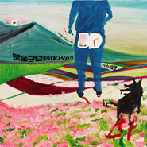 是金子总会花光的](./albums/5021420815.md) | 国语 | 左小祖咒工作室 | 2020年09月01日 | 原声带, 影视音乐 | 电影原声 Film Score |
| [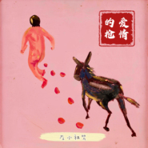 爱情的枪 (独饮版)](./albums/5021305504.md) | 国语 | 左小祖咒工作室 | 2020年08月18日 | EP, 单曲 | 成人另类 Adult Alternative, 当代民谣 Contemporary Folk |
| [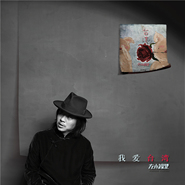 我爱台湾](./albums/5021043276.md) | 国语 | 左小祖咒工作室 | 2020年07月14日 | 录音室专辑 | 国语流行 Mandarin Pop |
| [ 最高处](./albums/5020832762.md) | 国语 | 左小祖咒工作室 | 2020年06月08日 | EP, 单曲 | 民谣 Folk, 另类唱作人 Alternative Singer-Songwriter, 当代民谣 Contemporary Folk |
| [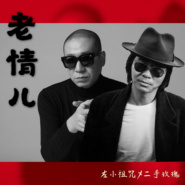 老情儿](./albums/5020605413.md) | 国语 | 左小祖咒工作室 | 2020年05月20日 | EP, 单曲 | 国语流行 Mandarin Pop, 摇滚 Rock & Roll, 另类摇滚 Alternative Rock |
| [ 我爱南京](./albums/2108380095.md) | 国语 | 左小祖咒工作室 | 2020年04月29日 | EP, 单曲 | 民谣 Folk, 当代民谣 Contemporary Folk, 另类摇滚 Alternative Rock |
| [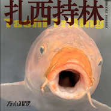 扎西持林](./albums/2108317049.md) | 藏语 | 左小祖咒工作室 | 2020年04月16日 | 录音室专辑 | 民谣 Folk, 福音 Gospel, 佛教音乐 Buddhist Music |
| [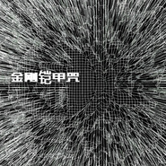 金刚铠甲咒](./albums/2105809288.md) | 藏语 | 左小祖咒工作室 | 2020年02月04日 | EP, 单曲 | 复合电气 Complextro, 意识说唱 Conscious Hip Hop, 迷幻科技舞曲 Acid Techno |
| [ 台湾](./albums/2105606850.md) | 国语 | 左小祖咒工作室 | 2020年01月01日 | 录音室专辑 | 国语流行 Mandarin Pop, 华语唱作人 Chinese Singer-Songwriter, 摇滚 Rock & Roll |
| [ 庙会之旅20周年](./albums/2105707765.md) | 国语 | 左小祖咒工作室 | 2019年12月25日 | 录音室专辑 | 另类摇滚 Alternative Rock, 迷幻民谣 Psychedelic Folk, 后朋克 Post-Punk |
| [ 希阿荣博](./albums/2105707748.md) | 藏语 | 左小祖咒工作室 | 2019年11月10日 | 录音室专辑 | 世界音乐 World Music, 能量电子 Power Electronics, 电子乐 Electronica |
| [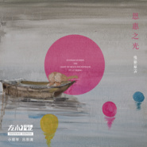 恩惠之光](./albums/2105707898.md) | 纯音乐 | 左小祖咒工作室 | 2019年09月25日 | 录音室专辑 | 器乐独奏 Solo Instrumental, 世界音乐 World Music, 轻音乐 Easy Listening |
| [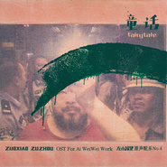 童话](./albums/2104943961.md) | 纯音乐 | 左小祖咒工作室 | 2019年06月25日 | 原声带, 影视音乐 | 迷幻摇滚 Psychedelic Rock, 噪音摇滚 Noise Rock, 工业摇滚 Industrial Rock |
| [ 一个孤僻的人](./albums/2104918360.md) | 国语 | 左小祖咒工作室 | 2019年05月18日 | 原声带, 影视音乐 | 器乐独奏 Solo Instrumental, 轻音乐 Easy Listening, 实验音乐 Experimental |
| [ 四大名著Ⅳ江湖](./albums/2104803813.md) | 国语 | 左小祖咒工作室 | 2019年03月04日 | 录音室专辑 | 另类摇滚 Alternative Rock, 新迷幻 Neo-Psychedelia, 前卫民谣 Progressive Folk |
| [ 四大名著Ⅰ甘露者](./albums/2104803789.md) | 国语 | 左小祖咒工作室 | 2019年03月04日 | 录音室专辑 | 另类摇滚 Alternative Rock, 迷幻民谣 Psychedelic Folk, 实验音乐 Experimental |
| [ 四大名著Ⅱ神仙会](./albums/2104803798.md) | 国语 | 左小祖咒工作室 | 2019年03月04日 | 录音室专辑 | 世界音乐 World Music, 迷幻摇滚 Psychedelic Rock, 前卫民谣 Progressive Folk |
| [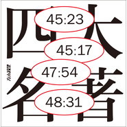 四大名著Ⅲ蒙娜丽莎](./albums/2104803809.md) | 国语 | 左小祖咒工作室 | 2019年03月04日 | 录音室专辑 | 迷幻摇滚 Psychedelic Rock, 新民谣 Neofolk, 中国地下说唱 Chinese Underground Hip Hop |
| [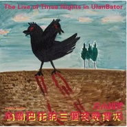 乌兰巴托的三个夜晚实况](./albums/2104491593.md) | 国语 | 左小祖咒工作室 | 2019年01月01日 | 现场专辑 | 摇滚 Rock & Roll, 另类摇滚 Alternative Rock, 民谣 Folk |
| [ 重庆女人](./albums/2104303685.md) | 国语 | 左小祖咒工作室 | 2018年12月04日 | 录音室专辑 | 摇滚 Rock & Roll, 民谣 Folk, 嘻哈 Hip-Hop |
| [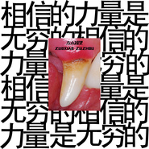 相信的力量是无穷的](./albums/5020997308.md) | 国语 | 摩登天空 | 2018年11月10日 | 录音室专辑 | 实验摇滚 Experimental Rock, 前卫摇滚 Progressive Rock, 先锋前卫摇滚 Avant-Prog |
| [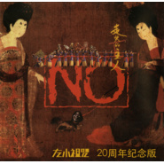 走失的主人20周年](./albums/2104113906.md) | 国语 | 独立发行 | 2018年10月31日 | 录音室专辑 | 摇滚 Rock & Roll, 迷幻摇滚 Psychedelic Rock, 后朋克 Post-Punk |
| [ 你之所以是你](./albums/2103842553.md) | 国语 | 星空盛典 | 2018年07月25日 | 原声带, 影视音乐 | 国语流行 Mandarin Pop, 电影原声 Film Score, 华语唱作人 Chinese Singer-Songwriter |
| [ 艺术家中的艺术家](./albums/2103769918.md) | 国语 | 左小祖咒工作室 | 2018年07月09日 | 精选集 | 摇滚 Rock & Roll, 实验摇滚 Experimental Rock, 迷幻摇滚 Psychedelic Rock |
| [ 非常抱歉](./albums/2103472705.md) | 国语 | 左小祖咒工作室 | 2018年01月11日 | 原声带, 影视音乐 | 原声 Soundtrack, 另类摇滚 Alternative Rock, 迷幻摇滚 Psychedelic Rock |
| [ 葡萄熟了](./albums/2103721999.md) | 国语 | 左小祖咒工作室 | 2018年01月01日 | 录音室专辑 | 儿歌 Nursery Rhyme, 当代唱作人 Contemporary Singer-Songwriter, 民谣 Folk |
| [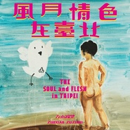 风月情色在台北THE SOUL and FLESH in TAIPEI](./albums/2102790750.md) | 国语 | 台湾足迹, 左小祖咒工作室 | 2017年07月16日 | 录音室专辑 | 摇滚 Rock & Roll, 民谣 Folk, 当代民谣 Contemporary Folk |
| [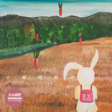 小威向前冲](./albums/2104881453.md) | 纯音乐 | 左小祖咒工作室 | 2017年06月01日 | 原声带, 影视音乐 | 器乐独奏 Solo Instrumental, 儿童音乐 Children's Music, 器乐流行 Instrumental Pop |
| [ 再见喀纳斯](./albums/2102697588.md) | 纯音乐 | 左小祖咒工作室 | 2017年02月22日 | 原声带, 影视音乐 | 实验音乐 Experimental, 世界音乐 World Music, 原声 Soundtrack |
| [ 罗曼蒂克消亡史](./albums/2102665604.md) | 国语 | 听见时代 | 2016年12月19日 | EP, 单曲 | 国语流行 Mandarin Pop |
| [ 把悲伤留给自己](./albums/2102664632.md) | 国语 | 左小祖咒工作室 | 2016年12月16日 | EP, 单曲 | 国语流行 Mandarin Pop, 流行摇滚 Pop Rock |
| [ 上海岁月The Shanghai Days](./albums/2102653933.md) | 国语 | 摩登天空 | 2016年11月26日 | 录音室专辑 | 另类唱作人 Alternative Singer-Songwriter, 摇滚 Rock & Roll, 民谣 Folk |
| [ 花神](./albums/2100393209.md) | 纯音乐 | 左小祖咒工作室 | 2016年10月10日 | 原声带, 影视音乐 | 原声 Soundtrack, 民谣 Folk, 世界音乐 World Music |
| [ 2016西安不插电](./albums/2102757102.md) | 国语 | 左小祖咒工作室 | 2016年05月28日 | 现场专辑 | 摇滚 Rock & Roll, 民谣 Folk, 迷幻摇滚 Psychedelic Rock |
| [ 陌生人在唱歌](./albums/2100248982.md) | 国语 | 左小祖咒工作室 | 2015年12月21日 | EP, 单曲 | 实验摇滚 Experimental Rock |
| [ 2010-2013北京现场](./albums/1127200987.md) | 国语 | 左小祖咒工作室 | 2015年03月16日 | 现场专辑 | 当代民谣 Contemporary Folk, 前卫摇滚 Progressive Rock, 摇滚 Rock & Roll |
| [ 我们需要个歌手](./albums/810487971.md) | 国语 | 摩登天空 | 2014年09月23日 | 录音室专辑 | 摇滚 Rock & Roll, 另类摇滚 Alternative Rock, 迷幻民谣 Psychedelic Folk |
| [ 一座城池 电影原声带](./albums/776991311.md) | 纯音乐 | 左小祖咒工作室 | 2013年08月16日 | 原声带, 影视音乐 | 电影原声 Film Score, 民谣 Folk, 摇滚 Rock & Roll |
| [ 这小小的葡萄我从来没吃过 Live](./albums/935336354.md) | 国语 | 左小祖咒工作室 | 2013年01月18日 | 现场专辑 | 摇滚 Rock & Roll, 当代民谣 Contemporary Folk, 后朋克 Post-Punk |
| [ 这小小的葡萄我从来没吃过](./albums/567432.md) | 国语 | 左小祖咒工作室 | 2013年01月01日 | 录音室专辑 | 儿歌 Nursery Rhyme, 当代唱作人 Contemporary Singer-Songwriter, 民谣 Folk |
| [ 最爱 电影原声](./albums/449457.md) | 纯音乐 | 左小祖咒工作室 | 2012年05月20日 | 原声带, 影视音乐 | 原声 Soundtrack, 中国民乐 Chinese Folk Music, 管弦乐流行 Orchestral Pop |
| [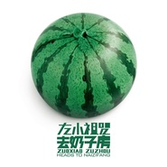 左小祖咒去奶子房](./albums/513353.md) | 国语 | 左小祖咒工作室 | 2012年05月12日 | 录音室专辑 | 民谣 Folk, 另类摇滚 Alternative Rock, 华语唱作人 Chinese Singer-Songwriter |
| [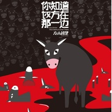 你知道对方在那一边You Know The Enemy is Over There](./albums/464584.md) | 纯音乐 | 左小祖咒工作室 | 2011年09月19日 | 原声带, 影视音乐 | 中国风 China-Wave, 原声 Soundtrack, 民谣 Folk |
| [ 庙会之旅II](./albums/464583.md) | 国语 | 左小祖咒工作室 | 2011年09月11日 | 录音室专辑 | 摇滚 Rock & Roll, 迷幻民谣 Psychedelic Folk |
| [ 左小祖咒原声配乐No.1](./albums/365466.md) | 国语 | 左小祖咒工作室 | 2010年05月05日 | 录音室专辑 | 原声 Soundtrack, 摇滚 Rock & Roll, 当代民谣 Contemporary Folk |
| [ 万事如意Live2010 All The Best Live](./albums/935335561.md) | 国语 | 左小祖咒工作室 | 2010年03月19日 | 现场专辑 | 另类摇滚 Alternative Rock, 民谣 Folk, 当代唱作人 Contemporary Singer-Songwriter |
| [ 走失的主人 (Remix版)the missing master remix](./albums/356211.md) | 国语 | 左小祖咒工作室 | 2009年12月21日 | 录音室专辑 | 电子舞曲 EDM / Electronic Dance Music, 流行摇滚 Pop Rock, 迷幻摇滚 Psychedelic Rock |
| [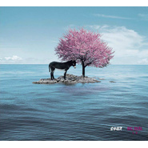 大事](./albums/356675.md) | 国语 | 左小祖咒工作室 | 2009年12月12日 | 录音室专辑 | 电子民谣 Folktronica, 摇滚 Rock & Roll, 迷幻摇滚 Psychedelic Rock |
| [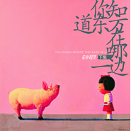 你知道东方在哪一边你知道东方在哪一边 下集](./albums/167403.md) | 国语 | 左小祖咒工作室 | 2008年03月08日 | 录音室专辑 | 摇滚 Rock & Roll, 噪音摇滚 Noise Rock, 当代民谣 Contemporary Folk |
| [ 美国 The U.S.A](./albums/32231.md) | 纯音乐 | 左小祖咒工作室 | 2006年04月01日 | 录音室专辑 | 华语唱作人 Chinese Singer-Songwriter, 原声 Soundtrack, 中国民乐 Chinese Folk Music |
| [ 我不能悲伤地坐在你身旁](./albums/6745.md) | 国语 | 左小祖咒工作室 | 2005年05月25日 | 录音室专辑 | 国语流行 Mandarin Pop, 华语唱作人 Chinese Singer-Songwriter, 摇滚 Rock & Roll |
| [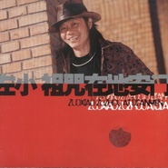 左小祖咒在地安门](./albums/2104461874.md) | 国语 | 左小祖咒工作室 | 2001年11月11日 | 录音室专辑 | 摇滚 Rock & Roll, 后朋克 Post-Punk, 当代唱作人 Contemporary Singer-Songwriter |
| [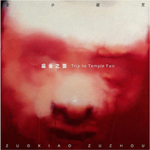 庙会之旅trip to temple fair](./albums/6746.md) | 国语 | 左小祖咒工作室 | 1999年12月25日 | 录音室专辑 | 华语唱作人 Chinese Singer-Songwriter, 摇滚 Rock & Roll, 后朋克 Post-Punk |
| [ 走失的主人](./albums/317714.md) | 国语 | 左小祖咒工作室 | 1998年10月31日 | 录音室专辑 | 迷幻摇滚 Psychedelic Rock, 摇滚 Rock & Roll, 后朋克 Post-Punk |

## 评论

|  |  |  |  |
| :-- | :-- | :-- | :-- |
|  [虾米用户](https://emumo.xiami.com/u/11439432) 我爱虾米 2021-01-13 20:28 赞(0) 踩(0) | 
左老板不厚道，虾米关停在即，写几首歌吧。
 |
| ⇒ |  [虾米用户](https://emumo.xiami.com/u/222802757) 单循控  搬去酷狗  -... 2021-01-24 02:10 赞(0) 踩(0) | 
早就发了 在河边观虾的日子   &amp;ldquo;昨天总是美丽得让人忘记烦恼 但再不舍也要告别&amp;rdquo;     昨天还有专业精神贵族品质的虾米   而今天注重品质和专业精神的贵族和中产阶级已经消亡   底层阶级壮大 屌丝文化崛起。 拥抱廉价的抖音神曲女团直播等文化快餐当道的明天吧～
 |
|  [虾米用户](https://emumo.xiami.com/u/42895677)  2020-12-05 17:56 赞(0) 踩(0) | 
高产，偶有珍品
 |
|  [虾米用户](https://emumo.xiami.com/u/222802757) 单循控  搬去酷狗  -... 2020-11-29 08:36 赞(1) 踩(0) | 
这些口吐芬芳骂左小&amp;amp;左小歌迷的  拉低了虾米用户综合素质的底线   它们迫不及待地标榜自己的真诚睿智和鉴赏能力的样子 丑得耀眼 不忍直视
 |
|  [虾米用户](https://emumo.xiami.com/u/1299362)  2020-09-24 01:02 赞(0) 踩(0) | 
中国大城市能喝得起星巴克那些个阶层得装逼用社交货币
 |
|  [虾米用户](https://emumo.xiami.com/u/9047731) 失责亏恩 度时虚浮 意志... 2020-08-01 15:48 赞(2) 踩(0) | 
我说左老板是治愈系的 您敢信吗
 |
| ⇒ |  [虾米用户](https://emumo.xiami.com/u/17705421) 不如就让我来介绍一下我们... 2020-09-04 09:26 赞(0) 踩(0) | 
暂时不信  嘿嘿嘿
 |
| ⇒ |  [虾米用户](https://emumo.xiami.com/u/222802757) 单循控  搬去酷狗  -... 2020-12-10 08:23 赞(0) 踩(0) | 
哈哈铁子早  祖咒不治愈谁治愈？ 中国的你看我关注了谁？几乎就他一个 近3年中国的就他出过的新歌有我觉得能收藏的 （个人口味而已哈 ）
 |
|  [虾米用户](https://emumo.xiami.com/u/3931495)  2020-07-31 02:54 赞(0) 踩(0) | 
好久没听了，久违的重新听左小祖咒，还是很好听，有一种伤悲的感觉
 |
|  [虾米用户](https://emumo.xiami.com/u/379162683) 我想要记住你们，我想要你... 2020-07-25 14:02 赞(0) 踩(0) | 
✧*｡
 |
|  [虾米用户](https://emumo.xiami.com/u/341976488) . 2020-07-19 20:31 赞(0) 踩(0) | 
王宝强？
 |
|  [虾米用户](https://emumo.xiami.com/u/358104299) 悲观的唯心存在现实解构虚... 2020-06-20 01:39 赞(1) 踩(0) | 
41515
 |
|  [虾米用户](https://emumo.xiami.com/u/407923357) 明天很不好 2020-06-11 00:36 赞(1) 踩(0) | 
感觉他的歌肯定很难翻唱.&amp;hellip;
 |
|  [虾米用户](https://emumo.xiami.com/u/146169064) 音乐 肉体通往灵魂的桥 2020-06-02 12:25 赞(1) 踩(0) | 
左小听了一整天  我觉得左叔没有一首歌是难听的 没有一首歌是不好的 我是不是病了
 |
|  [虾米用户](https://emumo.xiami.com/u/24749875)   2020-04-17 13:30 赞(2) 踩(0) | 
说真的，我听歌的进度有点赶不上他发专辑的速度了
 |
|  [虾米用户](https://emumo.xiami.com/u/231441544) 我还没想好要写什么... 2020-03-22 11:57 赞(0) 踩(0) | 
我特别想问，何以如此高产？！震惊啊！
 |
|  [虾米用户](https://emumo.xiami.com/u/411750771)  2020-03-06 18:05 赞(1) 踩(0) | 
全家火葬场的梗，你们了解一下
 |
|  [虾米用户](https://emumo.xiami.com/u/418643796) 黑泽明 2020-02-13 23:34 赞(0) 踩(0) | 
左哥何时有新演唱会啊。需要你
 |
|  [虾米用户](https://emumo.xiami.com/u/48084409) 我还没想好要写什么.. 2020-02-01 20:07 赞(1) 踩(0) | 
吴红巾，李红旗，张红兵这仨名字好有时代色彩
 |
|  [虾米用户](https://emumo.xiami.com/u/543137) 现在听歌和挖比特币差不多 2020-01-09 15:44 赞(0) 踩(0) | 
苦鬼哪去了
 |
|  [虾米用户](https://emumo.xiami.com/u/13186937) 今朝有酒今朝醉 2019-12-07 19:41 赞(4) 踩(0) | 
妈的，爱情的枪没了
 |
| ⇒ |  [虾米用户](https://emumo.xiami.com/u/45103)  2020-12-05 13:28 赞(0) 踩(0) | 
是啊，可怜的虾米
 |
|  [虾米用户](https://emumo.xiami.com/u/34310725) -再见- 2019-11-26 20:36 赞(0) 踩(0) | 
呕哑嘲哳声音像是有毛刺一般 时而低沉嘶哑时而尖锐刺耳“我不能悲伤地坐在你身旁” 反复咀嚼这句话 我却能莫名地能感觉到凄惨悲凉 哀痛 像一个漩涡 吞噬
 |
|  [虾米用户](https://emumo.xiami.com/u/431099981) 一杯长岛下肚，转身跳进西... 2019-11-13 19:17 赞(0) 踩(0) | 
爱情的枪呢！
 |
|  [虾米用户](https://emumo.xiami.com/u/43793127) to be free 2019-10-18 14:02 赞(0) 踩(0) | 
u
 |
|  [虾米用户](https://emumo.xiami.com/u/412745767) 你的美丽让你带走 2019-10-13 10:15 赞(2) 踩(0) | 
最开始听觉得这什么tm玩意但越听越喜欢
 |
|  [虾米用户](https://emumo.xiami.com/u/37148632) Take it easy 2019-09-06 18:22 赞(4) 踩(0) | 
爱情的枪真的很可惜
 |
|  [虾米用户](https://emumo.xiami.com/u/424580334)  2019-08-02 12:21 赞(0) 踩(0) | 
这么励志的歌曲我干了，唱成这样能成艺术家，我们干啥都离成功也不远了
 |
|  [虾米用户](https://emumo.xiami.com/u/34672791) 我还没想好要写什么... 2019-07-17 19:16 赞(1) 踩(0) | 
左小祖咒的音乐就像黑夜里的钻石 看上去漆黑一团 毫无光芒 但是只要你眼里有光芒 就会看到点点星光 璀璨耀眼
 |
|  [虾米用户](https://emumo.xiami.com/u/2410440) 独立自主的选择独立自主！ 2019-07-08 14:39 赞(0) 踩(0) | 
相貌很痞声音够猥琐，叹为观止
 |
|  [虾米用户](https://emumo.xiami.com/u/287412478)  2019-04-25 18:49 赞(1) 踩(0) | 
造谣一时爽…
 |
|  [虾米用户](https://emumo.xiami.com/u/318393988) 随心听乐。 2019-04-25 01:30 赞(1) 踩(0) | 
我其实是来看陈升的，想念他的歌，音乐应该是不分国界的，太可惜了。
 |
|  [虾米用户](https://emumo.xiami.com/u/368916693)  2019-04-09 21:07 赞(1) 踩(0) | 
伍佰&amp;amp;CHINA BLUE5月在上海和杭州都有演唱会，特别杭州站是伍佰出道30年来第一次在杭州举办专属演唱会。
 |
| ⇒ |  [虾米用户](https://emumo.xiami.com/u/194817212) 对视时会先友善一笑的人，... 2019-04-28 19:26 赞(0) 踩(0) | 
这里也能看到伍迷  两场都去，还有深圳场 
 |
|  [虾米用户](https://emumo.xiami.com/u/380307206)  2019-03-07 00:39 赞(4) 踩(0) | 
打Aiweiwei为什么是会被禁言？
 |
|  [虾米用户](https://emumo.xiami.com/u/378023059) 念佛成佛阿弥陀佛 2019-03-01 12:55 赞(0) 踩(0) | 
阿弥陀佛
 |
|  [虾米用户](https://emumo.xiami.com/u/196247306) 爱音乐，爱虾米 2019-02-28 10:49 赞(4) 踩(0) | 
左小“诅咒”不吉利，不好听，建议改成左小“吉祥”，谢谢！
 |
| ⇒ |  [虾米用户](https://emumo.xiami.com/u/617351)  2019-05-09 18:25 赞(0) 踩(0) | 
是祖！
 |
|  [虾米用户](https://emumo.xiami.com/u/45528314)  2019-02-23 12:18 赞(0) 踩(0) | 
当你无所事事的时候，想写点东西，就是自己的想法的时候。他的音乐能笼罩你，可以和无所事事的世界隔离。让想写的东西慢慢有了一点点思绪，然后就不用再在乎了。可能大脑里就是这种撕裂嗓音的节奏。当这个世界需要一点点不同的东西，给世界上另外一些想时不时和世界隔离的人一点点空间和启发。
 |
|  [虾米用户](https://emumo.xiami.com/u/360456497)  2019-02-16 15:21 赞(1) 踩(0) | 
怎么没有爱情的枪
 |
| ⇒ |  [虾米用户](https://emumo.xiami.com/u/85630952)  2019-03-17 20:05 赞(0) 踩(0) | 
被xx管理部门查封了！
 |
| ⇒ |  [虾米用户](https://emumo.xiami.com/u/360456497)  2019-04-02 10:45 赞(0) 踩(0) | 
<q><b>未知生物说：</b></q>
 |
| ⇒ |  [虾米用户](https://emumo.xiami.com/u/34243810) 音乐之灵魂解药 2019-05-19 21:51 赞(0) 踩(0) | 
<q><b>未知生物说：</b></q>
 |
|  [虾米用户](https://emumo.xiami.com/u/52339417) 世事何曾是绝对？ 2019-02-16 13:32 赞(1) 踩(0) | 
南方人表示完全不知道这位“音乐人”
 |
|  [虾米用户](https://emumo.xiami.com/u/306397541) 我不配得到自由 2019-01-31 12:23 赞(2) 踩(0) | 
难听，特别难听，但就是想听
 |
|  [虾米用户](https://emumo.xiami.com/u/323094438) 我还没想好要写什么... 2019-01-25 17:34 赞(0) 踩(0) | 
第一次听是在电影西红市首富，立刻被吸引，这个时代声音，这是去掉铜臭味声音的一种！用灵魂听，真好听
 |
|  [虾米用户](https://emumo.xiami.com/u/1878732)  2019-01-18 19:21 赞(2) 踩(0) | 
那些评论好不好听的人，你们为什么来这里？就因为看到别人都来吗？你既然不懂艺术、不懂摇滚、没有实验精神、没有想象力、连心也和灵魂都没有。艺术本来就是小众的。他又不是鸡，为什么要满足你的想法？艺术家只想掏心掏肺拿出自己最好的东西，结果肉包子喂了猪
 |
|  [虾米用户](https://emumo.xiami.com/u/244923385) 就这样吧... 2018-12-18 15:40 赞(2) 踩(0) | 
怎么出名的？什么人都可以红吗 ？
 |
| ⇒ |  [虾米用户](https://emumo.xiami.com/u/325618282)  2019-01-31 15:53 赞(0) 踩(0) | 
最贵的专辑左小祖咒的而且卖的很好
 |
| ⇒ |  [虾米用户](https://emumo.xiami.com/u/222802757) 单循控  搬去酷狗  -... 2020-06-20 18:13 赞(0) 踩(0) | 
为何要冷嘲热讽地踩～萝卜白菜各有所爱  不喜欢的艺人主页我连去都不去更不会留言评论～
 |
|  [虾米用户](https://emumo.xiami.com/u/401343943)  2018-12-08 23:46 赞(0) 踩(0) | 
很多年前第一次听到这个嗓音，欣赏不了，迄今，不能说喜欢，但却一直循环着。。。很美
 |
|  [虾米用户](https://emumo.xiami.com/u/55295191) Write, loaf,... 2018-11-20 17:52 赞(0) 踩(0) | 
升哥还在哦
 |
|  [虾米用户](https://emumo.xiami.com/u/344192331)  2018-11-11 19:10 赞(7) 踩(0) | 
内容已删除
 |
| ⇒ |  [虾米用户](https://emumo.xiami.com/u/212849944) 振羽不为伍 2018-11-17 12:27 赞(0) 踩(0) | 
就凭你说的这点话，就可以看出你听摇滚十几年是在吹牛逼
 |
| ⇒ |  [虾米用户](https://emumo.xiami.com/u/344192331)  2018-12-04 21:02 赞(0) 踩(0) | 
<q><b>Fenriz说：</b></q>
 |
| ⇒ |  [虾米用户](https://emumo.xiami.com/u/212849944) 振羽不为伍 2018-12-04 21:32 赞(0) 踩(0) | 
<q><b>jeremychung说：</b></q>
 |
| ⇒ |  [虾米用户](https://emumo.xiami.com/u/344192331)  2018-12-06 16:43 赞(0) 踩(0) | 
<q><b>Fenriz说：</b></q>
 |
| ⇒ |  [虾米用户](https://emumo.xiami.com/u/212849944) 振羽不为伍 2018-12-06 20:48 赞(0) 踩(0) | 
<q><b>jeremychung说：</b></q>
 |
| ⇒ |  [虾米用户](https://emumo.xiami.com/u/212849944) 振羽不为伍 2018-12-06 20:50 赞(0) 踩(0) | 
<q><b>jeremychung说：</b></q>
 |
| ⇒ |  [虾米用户](https://emumo.xiami.com/u/3324554)  2018-12-07 21:44 赞(0) 踩(0) | 
过来哥教你，去听阿丝玛吧，啥时候觉得有余音绕梁的感觉再来逼逼
 |
| ⇒ |  [虾米用户](https://emumo.xiami.com/u/344192331)  2018-12-08 17:16 赞(0) 踩(0) | 
<q><b>peers说：</b></q>
 |
| ⇒ |  [虾米用户](https://emumo.xiami.com/u/344192331)  2018-12-08 17:24 赞(0) 踩(0) | 
<q><b>Fenriz说：</b></q>
 |
| ⇒ |  [虾米用户](https://emumo.xiami.com/u/3324554)  2018-12-11 20:05 赞(0) 踩(0) | 
<q><b>jeremychung说：</b></q>
 |
| ⇒ |  [虾米用户](https://emumo.xiami.com/u/344192331)  2018-12-16 01:54 赞(0) 踩(0) | 
<q><b>peers说：</b></q>
 |
| ⇒ |  [虾米用户](https://emumo.xiami.com/u/274269926) 帅气，自卑，活力，坠落，... 2019-02-27 14:25 赞(0) 踩(0) | 
你看看你这说的是人话吗
 |
| ⇒ |  [虾米用户](https://emumo.xiami.com/u/344192331)  2019-02-28 09:09 赞(0) 踩(0) | 
<q><b>UI说：</b></q>
 |
| ⇒ |  [虾米用户](https://emumo.xiami.com/u/8808318)  2019-05-07 15:57 赞(0) 踩(0) | 
当我离开你的时候 这首歌配上他的唱法意外的好听呢 我感觉他编曲真的一流 唱法虽然确实难听  但编曲真不错  你听不懂可以不用听呀 听歌还花钱了吗…
 |
| ⇒ |  [虾米用户](https://emumo.xiami.com/u/325143321) 就这 2019-05-17 13:04 赞(0) 踩(0) | 
<q><b>Fenriz说：</b></q>
 |
| ⇒ |  [虾米用户](https://emumo.xiami.com/u/85516646) Fuck off 2019-06-15 07:59 赞(0) 踩(0) | 
<q><b>Fenriz说：</b></q>
 |
|  [虾米用户](https://emumo.xiami.com/u/216784802) 好的音乐最重要的是真实，... 2018-11-06 19:51 赞(7) 踩(0) | 
左小祖咒有两首著名的作品，一首叫“爱的劳工”，另一首叫“弟弟”，这两个作品曾经把我听哭过，非常感人，有生活气息，后来我分析其中感人的一个重要原因就是因为他的这个唱腔，然而如今这一切，你统统不能听了，放一首“乌兰巴托的夜”顶着全面，成为攻击他唱歌“难听”的证明，太荒唐了，有种，就全部开放，让大家了解一个完整的左小祖咒，敢吗？
 |
|  [虾米用户](https://emumo.xiami.com/u/406125361)  2018-11-05 19:22 赞(0) 踩(0) | 
词不错，可能是我不适合听这类民谣。欣赏不了
 |
|  [虾米用户](https://emumo.xiami.com/u/1024746) 灵魂不该屈服 2018-10-20 10:03 赞(2) 踩(0) | 
像抽烟，明知道不好还是要去抽
 |
|  [虾米用户](https://emumo.xiami.com/u/404711806)  2018-10-19 00:42 赞(3) 踩(0) | 
我没有装逼  我真的是喜欢听  第一次听觉得奇怪  后来越听越喜欢  越来越好听
 |
|  [虾米用户](https://emumo.xiami.com/u/404711806)  2018-10-19 00:40 赞(0) 踩(0) | 
不好听  但是我上瘾了 像毒瘾一样  就是喜欢听
 |
|  [虾米用户](https://emumo.xiami.com/u/51655433) Hola 2018-10-18 12:45 赞(0) 踩(0) | 
我是第44444个收藏(^^)
 |
|  [虾米用户](https://emumo.xiami.com/u/50388578) 越长大越孤单 2018-10-09 13:46 赞(2) 踩(0) | 
左老板的歌词大于音乐，你们不要再执念于好不好听的问题了。
 |
|  [虾米用户](https://emumo.xiami.com/u/339191478)   2018-10-02 21:40 赞(2) 踩(0) | 
我突然就聽懂了左小祖咒的歌。
 |
| ⇒ |  [虾米用户](https://emumo.xiami.com/u/1150742) 不在沉默中爆发，就在沉默... 2018-11-12 11:52 赞(0) 踩(0) | 
不容易啊，我一直喜欢
 |
|  [虾米用户](https://emumo.xiami.com/u/339191478)   2018-10-02 21:36 赞(1) 踩(0) | 
❤
 |
|  [虾米用户](https://emumo.xiami.com/u/248054181) 还是差的太远 还要还要翻... 2018-09-30 23:37 赞(1) 踩(0) | 
从审美的意图上，我不希望左小去歌手类比赛从审丑的方面，我反而感到期待甚至兴奋
 |
|  [虾米用户](https://emumo.xiami.com/u/380245384) 随便听听 2018-09-21 01:10 赞(4) 踩(0) | 
今天第一次听左小祖咒，感觉很有趣，因为编曲很牛逼，配合他刻意的唱腔调式，形成了很奇特的效果。以前听到有人说难听，但是这种音乐形式就不应该以好不好听来衡量，很创新的探索和结合，就该以包容的心态来欣赏一下，驻足观看一下。不必造神，他没多厉害；也不必诋毁，他也没那么低端胡闹，他就是一个很好玩的人而已。
 |
|  [虾米用户](https://emumo.xiami.com/u/380245384) 随便听听 2018-09-21 01:07 赞(2) 踩(0) | 
感觉左小祖咒挺有趣的
 |
|  [虾米用户](https://emumo.xiami.com/u/51989815) 心满意足地去生活。 2018-09-14 22:29 赞(0) 踩(0) | 
确实难听。。技术上也没啥创新
 |
|  [虾米用户](https://emumo.xiami.com/u/236199754)  2018-09-13 19:12 赞(0) 踩(0) | 
今晚昆明现场，哈哈哈哈
 |
|  [虾米用户](https://emumo.xiami.com/u/338744450) 看的见我的未来 2018-09-11 14:06 赞(1) 踩(0) | 
最近被你迷到了，左老师 
 |
|  [虾米用户](https://emumo.xiami.com/u/216784802) 好的音乐最重要的是真实，... 2018-09-06 07:17 赞(3) 踩(0) | 
自相矛盾，一面说不好听，没人要听，一面拼命地删他的歌，怕人听到他的歌
 |
|  [虾米用户](https://emumo.xiami.com/u/212849944) 振羽不为伍 2018-09-02 23:54 赞(1) 踩(0) | 
是真的迷人&amp;hellip;&amp;hellip;
 |
|  [虾米用户](https://emumo.xiami.com/u/48379032) 最后警告，谢绝野蛮人，，... 2018-08-30 16:09 赞(0) 踩(0) | 
强拆王
 |
|  [虾米用户](https://emumo.xiami.com/u/1668119) 我还没想好要写什么... 2018-08-23 14:46 赞(3) 踩(0) | 
我记得虾米之前有个分类设置，其中有项是最不喜欢的歌手，请问这功能还有吗？从哪点进去
 |
| ⇒ |  [虾米用户](https://emumo.xiami.com/u/3256844) 恩斯波肯 多姆 2018-08-30 16:21 赞(0) 踩(0) | 
哈哈哈哈哈哈音乐库里还有 但好像没法添加了
 |
|  [虾米用户](https://emumo.xiami.com/u/37132776)   2018-08-19 17:22 赞(3) 踩(0) | 
知乎观光团到此一游，端着清高的范干着现眼的事~
 |
|  [虾米用户](https://emumo.xiami.com/u/60048)  2018-08-18 18:04 赞(0) 踩(0) | 
哦！啥事入住虾米的
 |
|  [虾米用户](https://emumo.xiami.com/u/380054872)  2018-08-18 11:38 赞(1) 踩(0) | 
左小诅咒的曲子写的真好
 |
|  [虾米用户](https://emumo.xiami.com/u/14005659) 懒人一个 2018-08-15 11:22 赞(1) 踩(0) | 
说他好听的，不是脑子有毛病，就是耳朵有毛病
 |
|  [虾米用户](https://emumo.xiami.com/u/346910023) 有爱有家有朋友，无聊无趣... 2018-08-14 18:24 赞(0) 踩(0) | 
这是个让我无比纠结的歌手，喜欢他的词曲风，但是这嘶哑中带着颤抖的破锣烟酒嗓子。最多只能坚持听二十秒&amp;hellip;&amp;hellip;
 |
|  [虾米用户](https://emumo.xiami.com/u/22295186) 好久好久 2018-08-02 23:13 赞(4) 踩(0) | 
北京的东村，那个时代真的迷人
 |
|  [虾米用户](https://emumo.xiami.com/u/224032101)   2018-07-30 21:39 赞(2) 踩(0) | 
左叔 我从第一次听你的歌 到现在转眼八年了 第一次听是曲婉婷翻唱的我不能悲伤地坐在你身旁 后来还喜欢小莉 爱情的枪 自己还喜欢哼哼 当时还兴冲冲地给别人听你的歌 然后被人家说奇怪哈哈哈 后来还在韩寒的文章里看到你的名字 我觉得你是真的对我胃口的歌手这种爱好是没有办法跟别人分享的 因为没有办法去描述这种奇异的快乐快乐并孤独地听你的歌
 |
|  [虾米用户](https://emumo.xiami.com/u/3271266)   2018-07-30 16:38 赞(2) 踩(0) | 
有那么多优秀的玩噪音 后朋 后摇 迷幻 前卫 艺术的乐队 为什么会蜜汁迷恋这个人.....真的，毫无理由
 |
|  [虾米用户](https://emumo.xiami.com/u/4246682) 乜X都聽 2018-07-29 23:41 赞(1) 踩(0) | 
國王新衣
 |
|  [虾米用户](https://emumo.xiami.com/u/3743684)  2018-07-17 11:17 赞(0) 踩(0) | 
忧伤的老板不对
 |
|  [虾米用户](https://emumo.xiami.com/u/247978261) 吾 一所悬命 2018-07-13 15:48 赞(1) 踩(0) | 
有些人想做影响大众的艺术家，有些人想做影响艺术家的艺术家，他想做后者，我是这么以为的。
 |
|  [虾米用户](https://emumo.xiami.com/u/125488386) 大腦升級中，少話，，， 2018-07-12 12:14 赞(0) 踩(0) | 
地安门呢
 |
| ⇒ |  [虾米用户](https://emumo.xiami.com/u/43272234) 春雨不湿知心鬼 2018-08-18 15:34 赞(0) 踩(0) | 
作死
 |
|  [虾米用户](https://emumo.xiami.com/u/105087560) 不懂偷狗，都敢偷狗 2018-06-28 11:28 赞(2) 踩(0) | 
音乐不是拿来自我区分的的，但是音乐确实可以映射出一些人的偏执与自卑
 |
|  [虾米用户](https://emumo.xiami.com/u/87274606)  2018-06-28 10:01 赞(0) 踩(0) | 
谁有关于男人那首歌？偷偷传给我干么
 |
| ⇒ |  [虾米用户](https://emumo.xiami.com/u/124007714) 隔壁巷弄里沉重的枪声  ... 2018-07-12 11:01 赞(0) 踩(0) | 
嘿嘿
 |
|  [虾米用户](https://emumo.xiami.com/u/12723049) get money 2018-06-16 20:29 赞(2) 踩(0) | 
左老师，你在演唱会上的一句话，救了我
 |
|  [虾米用户](https://emumo.xiami.com/u/188450307) 我还没想好要写什么... 2018-06-07 22:21 赞(0) 踩(0) | 
对于这个音乐人，喜欢他的喜欢得要死，讨厌的人讨厌得要死！ 
 |
|  [虾米用户](https://emumo.xiami.com/u/30811023)  2018-06-03 21:17 赞(0) 踩(0) | 
喜欢左小祖咒的，如果不喜欢斌哥，那一定是假喜欢。请虾米音乐人-斌哥
 |
|  [虾米用户](https://emumo.xiami.com/u/45590285) 我还没想好要写什么... 2018-05-25 21:32 赞(0) 踩(0) | 
好厉害的左小祖咒，用灵魂在歌唱的斗士！
 |
| ⇒ |  [虾米用户](https://emumo.xiami.com/u/340772244)  2018-06-21 17:05 赞(0) 踩(0) | 
你是认真吗
 |
|  [虾米用户](https://emumo.xiami.com/u/7398337)  2018-05-23 03:59 赞(0) 踩(0) | 
艹
 |
|  [虾米用户](https://emumo.xiami.com/u/51989815) 心满意足地去生活。 2018-05-17 15:50 赞(1) 踩(0) | 
拆迁一事，败光人品，丢人现眼。
 |
|  [虾米用户](https://emumo.xiami.com/u/41914) 滚好滚坏，大家担待。 2018-05-16 09:48 赞(1) 踩(0) | 
决胜全面建成小康社会不允许有苦鬼！
 |
|  [虾米用户](https://emumo.xiami.com/u/74973026)  2018-05-12 09:47 赞(2) 踩(0) | 
至少他的乌兰巴托的夜是我听过的最好的版本
 |
| ⇒ |  [虾米用户](https://emumo.xiami.com/u/317851600)  2018-05-14 14:32 赞(0) 踩(0) | 
你可能没听过谭维维的
 |
|  [虾米用户](https://emumo.xiami.com/u/56312488) 真正的生活 2018-05-07 23:25 赞(0) 踩(0) | 
牛牛
 |
|  [虾米用户](https://emumo.xiami.com/u/260948438) 洞房花烛夜 2018-05-05 15:55 赞(2) 踩(0) | 
造谣一时爽...
 |
| ⇒ |  [虾米用户](https://emumo.xiami.com/u/422239389) 。。。 2020-06-11 13:21 赞(0) 踩(0) | 
左大师当年这一手坑了多少大V。我不想笑的，但是实在忍不住了，哈哈哈哈哈哈哈哈哈哈哈哈哈哈哈哈哈哈哈
 |
|  [虾米用户](https://emumo.xiami.com/u/331280639)  2018-05-04 13:31 赞(0) 踩(0) | 
我就努力听你的歌然后我想你告诉我怎么去欣赏你的歌从哪个角度会更不同特喜欢一剪梅。
 |
|  [虾米用户](https://emumo.xiami.com/u/360435758)  2018-05-03 17:08 赞(0) 踩(0) | 
喜欢爱的劳工。
 |
|  [虾米用户](https://emumo.xiami.com/u/347679901)  2018-04-24 18:56 赞(0) 踩(0) | 
他跟陈升什么关系?
 |
|  [虾米用户](https://emumo.xiami.com/u/9028760) 豆瓣见 spotify ... 2018-04-23 00:58 赞(0) 踩(0) | 
老师强烈安利 mark一下
 |
|  [虾米用户](https://emumo.xiami.com/u/319260136)  2018-04-22 08:57 赞(1) 踩(0) | 
他的歌很难听，难听的就像要死了，和悲伤垃圾的自己，在意境上却如此吻合！歇斯底里的腐烂着。
 |
|  [虾米用户](https://emumo.xiami.com/u/312613658) 何以解忧，唯有唱歌，为何... 2018-04-20 14:14 赞(2) 踩(0) | 
你懂左小诅咒吗？你能听出他歌声里的沧桑吗？不懂就不要乱说什么跑调不好听之类的，只要你在深夜，静静地聆听他的声音，你就会发现，我遭，我好想打他，别拦我，我打死他
 |
|  [虾米用户](https://emumo.xiami.com/u/5858730) AN aDdiCt 2018-04-17 12:56 赞(0) 踩(0) | 
只有经历了生活的沧桑你才能感受到它的孤寂唯美
 |
|  [虾米用户](https://emumo.xiami.com/u/78373642) miss out 2018-04-16 21:59 赞(0) 踩(0) | 
听就听不听走开觉得难听走开觉得有其他味道继续听反正大部分人或者几乎所有人都觉得难听包括我
 |
|  [虾米用户](https://emumo.xiami.com/u/38425646) 车20汽车音响，专业汽车... 2018-04-09 09:04 赞(0) 踩(0) | 
好听
 |
|  [虾米用户](https://emumo.xiami.com/u/281995360) 来到城市已经896天 2018-04-07 23:33 赞(0) 踩(0) | 
逼格高？不好意思，我来晚了。
 |
|  [虾米用户](https://emumo.xiami.com/u/18577189) 假如再也不能见到你，祝你... 2018-03-31 02:15 赞(1) 踩(0) | 
隔一段时间总想听听这声音就好像吸毒一样
 |
|  [虾米用户](https://emumo.xiami.com/u/51547384) 我还没想好要写什么... 2018-03-09 01:58 赞(0) 踩(0) | 
但是他编曲真的无敌棒啊，反差震撼。
 |
|  [虾米用户](https://emumo.xiami.com/u/20177386) 感谢一切美好的遇见❤️ 2018-02-27 15:16 赞(1) 踩(0) | 

 |
|  [虾米用户](https://emumo.xiami.com/u/342608693) 第一次喜欢上一个人的笑容... 2018-02-26 23:42 赞(0) 踩(0) | 
他的声音，，，，
 |
|  [虾米用户](https://emumo.xiami.com/u/18614113) 可以一直飘着飘着 2018-01-31 22:11 赞(1) 踩(0) | 
有的人耐看，有的歌耐听。
 |
|  [虾米用户](https://emumo.xiami.com/u/313966744)  2018-01-27 19:41 赞(30) 踩(0) | 
当你看清了这个社会，就会听懂左小的神曲
 |
| ⇒ |  [虾米用户](https://emumo.xiami.com/u/411931037)  2019-09-22 01:01 赞(0) 踩(0) | 
支持
 |
|  [虾米用户](https://emumo.xiami.com/u/220719) 自知不自見，自愛不自貴 2018-01-26 18:43 赞(2) 踩(0) | 
蝦米更徹底嘛，乾脆將 在地安門 那張一整個都消失掉。
 |
|  [虾米用户](https://emumo.xiami.com/u/27793105)  2018-01-16 20:41 赞(0) 踩(0) | 
新专辑留着没看，连在线听都不行了？
 |
|  [虾米用户](https://emumo.xiami.com/u/88252774)   2018-01-13 11:01 赞(1) 踩(0) | 
新专辑和谐了？
 |
|  [虾米用户](https://emumo.xiami.com/u/48084409) 我还没想好要写什么.. 2018-01-11 16:28 赞(6) 踩(0) | 
非常遗憾虾米没有左小的新专辑《非常抱歉》
 |
|  [虾米用户](https://emumo.xiami.com/u/216784802) 好的音乐最重要的是真实，... 2018-01-11 12:01 赞(0) 踩(0) | 
昨天刚收藏，今天就没了
 |
|  [虾米用户](https://emumo.xiami.com/u/31165393)  2018-01-06 13:18 赞(2) 踩(0) | 
怪不得好久没听到&amp;ldquo;的&amp;rdquo;了，原来地安门已不在
 |
|  [虾米用户](https://emumo.xiami.com/u/50768301) 舍不得虾米 2017-12-30 18:00 赞(0) 踩(0) | 
虽然真的很讨厌他这个人，但是说实话爱情的枪还是挺好听的
 |
| ⇒ |  [虾米用户](https://emumo.xiami.com/u/603294)  2018-03-25 11:30 赞(0) 踩(0) | 
耳朵也瞎
 |
|  [虾米用户](https://emumo.xiami.com/u/6037950) No surprises 2017-12-30 06:23 赞(0) 踩(0) | 
还是&amp;ldquo;丢失的主人&amp;rdquo;和&amp;ldquo;庙会之旅&amp;rdquo;经典。那个年代在听四大天王的听左小祖咒是不是太难为你们耳朵了？
 |
|  [虾米用户](https://emumo.xiami.com/u/286762865)  2017-12-26 23:12 赞(0) 踩(0) | 
第一次听觉得难听 可是莫名其妙的就会听很多遍 直到现在听了n遍刚才去听了下安来宁的 虽然也很不错 但没有这首让人留念
 |
|  [虾米用户](https://emumo.xiami.com/u/5851736) 我们来聊章北海！ 2017-12-21 21:35 赞(0) 踩(0) | 
别唱歌了
 |
|  [虾米用户](https://emumo.xiami.com/u/45894555)   2017-12-12 13:48 赞(1) 踩(0) | 
苦鬼不在了？
 |
|  [虾米用户](https://emumo.xiami.com/u/37764400)  2017-11-29 23:10 赞(0) 踩(0) | 
本来就难听啊
 |
|  [虾米用户](https://emumo.xiami.com/u/17449055) 风和音乐哪个更自由？ 2017-11-19 21:38 赞(1) 踩(0) | 
跑调比我还严重啊叔
 |
|  [虾米用户](https://emumo.xiami.com/u/321416942) 我还没想好要写什么... 2017-11-15 13:54 赞(1) 踩(0) | 

 |
|  [虾米用户](https://emumo.xiami.com/u/8760625) 我这家伙很聪明什么也没留... 2017-11-06 23:24 赞(7) 踩(0) | 
我居住国外近30年，因为刚刚知道曾轶可（一位才女），所以又通过《黑猫白猫》知道了你（一位才爷）。一听到你，就觉得你和 Devendra Barnhart 相似。太MD有味道了。只要给中国人更大的自由，或中国人有胆量去争取更多的自由，十三亿人就会人才辈出。
 |
| ⇒ |  [虾米用户](https://emumo.xiami.com/u/335174614)  2017-12-03 23:37 赞(0) 踩(0) | 
同样的方式熟知 发现一个很有深度的艺人
 |
|  [虾米用户](https://emumo.xiami.com/u/333367736) 世上哪有公平，一个甜甜圈... 2017-11-05 14:24 赞(4) 踩(0) | 
看到有这多人不理解左小祖咒唱的这么难听，还出来唱歌，为了帮助大家理解大家的不理解，我推荐大家看看和菜头写的关于左小祖咒的文章，可能会有帮助，注意只是有可能。
 |
|  [虾米用户](https://emumo.xiami.com/u/6629817)   2017-10-30 10:13 赞(2) 踩(0) | 
我就觉得词很酷 但是一听声音我就忍不住笑出来了哈哈哈哈
 |
|  [虾米用户](https://emumo.xiami.com/u/451239)  2017-10-30 10:08 赞(0) 踩(0) | 
5、热闹的故事左小祖咒唱的时候，人山人海往里挤，祖咒唱了一首，前几排好多人就撤了，说听不懂，有个小姑娘打电话给朋友听祖咒的歌，唱完一首钱歌，就打电话跟朋友炫耀开了姑娘：你没来后悔了吧？朋友：现在演什么呢？姑娘：不知道，反正现在台上这个人特帅！朋友：真的吗！都演什么了？姑娘：大屏幕里面放的，全是钱，钱上面还画着一个人，不像是他，应该是他朋友，反正你没来，真是亏大了。朋友：就这一个舞台吗，其他舞台演什么呢？姑娘：跟你说吧，我专门挑了一个人最多的舞台，这个舞台比别的舞台都热闹…………”x向我的友邻推荐小组话题：【草莓音乐节】____我在草莓看到的高手（随时更新）摘要: 1、混票的故事在验票安检前面，有一哥们儿，没买票。工作人员：票呢？ ...推荐语:
 |
|  [虾米用户](https://emumo.xiami.com/u/7381227) 全是屁话 2017-10-29 13:06 赞(0) 踩(0) | 
请问左小祖咒叔叔为什么我在苹果音乐都搜不到陈升叔叔的歌了太震惊了！！！！
 |
| ⇒ |  [虾米用户](https://emumo.xiami.com/u/10857967) 我～就是我！不喜勿進！ 2017-11-02 09:06 赞(0) 踩(0) | 
现在这种情况只有换其他区了
 |
| ⇒ |  [虾米用户](https://emumo.xiami.com/u/85630952)  2018-01-03 09:49 赞(0) 踩(0) | 
全网封锁了，，，估计苹果音乐被起诉了。没办法啊，现在只能将就着点不听升哥的歌了。
 |
|  [虾米用户](https://emumo.xiami.com/u/2279444) 爱在左，同情在右。 2017-10-28 00:44 赞(0) 踩(0) | 
十分期待哪天左叔能上电视，记得有一次接受祁又一采访时被问到会不会上电视，左小说我在灰名单之内，祁一脸懵逼，灰名单是什么……他说就是有可能变白了，有可能变黑了，哈哈哈哈
 |
|  [虾米用户](https://emumo.xiami.com/u/1976381)  2017-10-28 00:41 赞(1) 踩(0) | 
旋律不行，词还凑合，死人般的唱腔实在提不起兴趣，逼格高？？？？？？
 |
|  [虾米用户](https://emumo.xiami.com/u/320145)  2017-10-28 00:30 赞(1) 踩(0) | 
喜欢左小，最近 在老妈蹄花的配乐很好
 |
|  [虾米用户](https://emumo.xiami.com/u/3411071)  2017-10-28 00:22 赞(0) 踩(0) | 
狂暴扭曲诡异愤怒的声音 灵魂永远只在梦魇里复活并且舞蹈 有朋友说 如果和朋友去KTV一定不要点左小的歌 即使你再喜欢 好的东西大众能够接受 但最好的东西只能留给自己 好吧 大大的骷髅头耳麦 窝在自己的世界聆听这个震撼的灵魂、
 |
|  [虾米用户](https://emumo.xiami.com/u/1147116)  2017-10-27 23:59 赞(2) 踩(0) | 
在大家习惯了炸鸡汉堡的时候，还有这样一位，挥汗如雨地辛勤耕耘，诚恳真实。他代表中国摇滚，绰绰有余。
 |
|  [虾米用户](https://emumo.xiami.com/u/2300609)  2017-10-27 23:30 赞(0) 踩(0) | 
当一拨拨我们当年曾经极度看好的年轻乐队相继出现表达力和剖析度衰竭时,左小祖咒用他的颠覆震撼了我.
 |
|  [虾米用户](https://emumo.xiami.com/u/40627814) 一首曲子一声所爱 2017-10-27 23:29 赞(2) 踩(0) | 
摩擦摩擦..有人模仿你
 |
|  [虾米用户](https://emumo.xiami.com/u/2770767)  2017-10-27 23:21 赞(0) 踩(0) | 
最早觉得有人这么唱歌么。。。。现在觉得谁不这么唱谁就假。。。那些只是剩下旋律的噪音。。。不过我觉得他有太多埋伏的细节，太多细节我不懂，甚至不细节的地方，我必须承认他很牛逼，至少我学会了欣赏，他很会玩各种游戏。。现在我只能把他作为一种美丽的背景音乐。。
 |
|  [虾米用户](https://emumo.xiami.com/u/8194637) 飘浮 2017-10-27 23:19 赞(0) 踩(0) | 
特立独行，难以界定，民谣的边缘。乖戾，亮瞎大叔。。
 |
|  [虾米用户](https://emumo.xiami.com/u/4823118) 暂无签名~ 2017-10-27 23:14 赞(0) 踩(0) | 
唱歌一定要搭调？残死，屎碾，自杀黑的乐队很多都不搭调连死金都有不少不搭调
 |
|  [虾米用户](https://emumo.xiami.com/u/1399683)  2017-10-27 23:03 赞(1) 踩(0) | 
这么唱歌 简直荒唐，为了逼格，再听一次
 |
|  [虾米用户](https://emumo.xiami.com/u/43861746)  2017-10-27 22:59 赞(2) 踩(0) | 
其实更喜欢他早期的歌，地安门之前。邪恶有腔调，颠覆传统听觉审美。音乐其实就是一种声场，作为情绪载体，应有宽度和深度不是简单的悦耳跟流畅所能完全表达出的。吴红巾早期的歌词也很摇滚…
 |
|  [虾米用户](https://emumo.xiami.com/u/298948030) 中國詩音樂電影创始人作曲... 2017-10-17 22:02 赞(0) 踩(0) | 
你好
 |
|  [虾米用户](https://emumo.xiami.com/u/99226326) 原来我非不快乐。 2017-09-23 20:08 赞(2) 踩(0) | 
装逼的人人云亦云
 |
|  [虾米用户](https://emumo.xiami.com/u/321573147)  2017-09-23 04:19 赞(1) 踩(0) | 
跟他对唱的都是牛人，，，调居然没叫左哥给带走
 |
|  [虾米用户](https://emumo.xiami.com/u/288742545) 我在香港 2017-09-21 23:55 赞(0) 踩(0) | 
我从2001年发现左小祖咒这个人，一直听着他的音乐长大，现在越做越没有以前的味道了，关注也少了
 |
|  [虾米用户](https://emumo.xiami.com/u/280055859)  2017-09-21 12:39 赞(0) 踩(0) | 
医生建议吃两盒金嗓子喉片，估计症状会有所减轻 
 |
|  [虾米用户](https://emumo.xiami.com/u/1429337)  2017-09-19 12:50 赞(0) 踩(0) | 
祖咒哪里可以买到你的第一张最原始版的《走失的主人》??我很怀念那一版，也是最好的一版，尽显真质。以前虾米有的，后来换成了再版的。
 |
|  [虾米用户](https://emumo.xiami.com/u/6820570) 这是语言的变调，承接醒来... 2017-09-15 14:51 赞(2) 踩(0) | 
说他是有气无力唱法始祖、跑调的人，是都没听过自己唱歌的录音吗！？？？
 |
|  [虾米用户](https://emumo.xiami.com/u/95018014) 升迷 2017-09-11 13:20 赞(0) 踩(0) | 
就是很好听啊
 |
|  [虾米用户](https://emumo.xiami.com/u/744592) 虾米关了，陪伴了我10年... 2017-09-10 22:15 赞(0) 踩(0) | 
吴红巾，越玩越离谱，已经偏离了地下
 |
|  [虾米用户](https://emumo.xiami.com/u/318293260)   2017-09-09 16:04 赞(1) 踩(0) | 
告诉你们，把左叔的声音抹掉，听曲子，就会发现这人他娘的是个天才
 |
|  [虾米用户](https://emumo.xiami.com/u/302022470)  2017-09-02 23:33 赞(1) 踩(0) | 
谁知道发光曲线的雨墨是什么时候开始当左小的鼓手的?
 |
|  [虾米用户](https://emumo.xiami.com/u/199141371)  2017-08-23 12:30 赞(0) 踩(0) | 
有气无力唱法的始祖
 |
|  [虾米用户](https://emumo.xiami.com/u/163169786) 路过之后呢 2017-08-15 01:09 赞(4) 踩(0) | 
我没点进图册看之前以为是黄国伦 吓一惊啊妈的
 |
|  [虾米用户](https://emumo.xiami.com/u/271474861) 没啥好说的，还是听歌呗。 2017-08-09 11:37 赞(0) 踩(0) | 
我操，有人把婆婆比作中国的左小祖咒，由此我特意来听听左小祖咒的歌。我滴妈呀，不带这么侮辱婆婆的。这他妈是一个级别吗？几辈子也到不了婆婆那个高度！
 |
|  [虾米用户](https://emumo.xiami.com/u/186104444) 机场等艘船 2017-07-20 15:52 赞(0) 踩(0) | 
第一次听呢  特别
 |
|  [虾米用户](https://emumo.xiami.com/u/288579806) 极度郁闷… 2017-07-04 03:12 赞(2) 踩(0) | 
我就是来吐槽左小祖咒的，你算个毛线，这声音还出来唱歌
 |
|  [虾米用户](https://emumo.xiami.com/u/280055859)  2017-07-01 12:58 赞(1) 踩(0) | 
左爷他就是块臭豆腐
 |
|  [虾米用户](https://emumo.xiami.com/u/308518906) 瞎听的木耳 2017-06-30 09:58 赞(0) 踩(0) | 
罗永浩
 |
|  [虾米用户](https://emumo.xiami.com/u/5465392) 我还没想好要写什么... 2017-06-26 00:47 赞(0) 踩(0) | 
其实 所有觉得不好听的人，应该摆正态度，他是个音乐人，不单是歌手
 |
|  [虾米用户](https://emumo.xiami.com/u/85821584)  2017-06-25 12:57 赞(2) 踩(0) | 
最喜欢右大祝福了！
 |
|  [虾米用户](https://emumo.xiami.com/u/1611794)  2017-06-17 14:15 赞(0) 踩(0) | 
我怎么感觉很好听呢。是听觉系统出现问题了么。
 |
|  [虾米用户](https://emumo.xiami.com/u/4264517) 人生短短几十载，做有趣的... 2017-06-15 10:16 赞(1) 踩(0) | 
听歌十余载，这种唱法实在欣赏不来
 |
|  [虾米用户](https://emumo.xiami.com/u/153480918)  2017-06-14 11:24 赞(2) 踩(0) | 
其实我是来听陈升的 因为陈升的歌都搜不到了   
 |
| ⇒ |  [虾米用户](https://emumo.xiami.com/u/8512002) 我还没想好要写什么...... 2017-07-24 09:11 赞(0) 踩(0) | 
我也是，哎伤心
 |
|  [虾米用户](https://emumo.xiami.com/u/45351524)  2017-06-09 23:02 赞(0) 踩(0) | 
老觉得伤感和无奈，明明音乐没有那么直接，是因为音色吗？
 |
|  [虾米用户](https://emumo.xiami.com/u/52056952) 人生即是到來、相遇、陪伴... 2017-06-04 13:36 赞(0) 踩(0) | 

 |
|  [虾米用户](https://emumo.xiami.com/u/88730198)  2017-06-03 21:03 赞(1) 踩(0) | 
越往后期越没法听 前期简直超神
 |
|  [虾米用户](https://emumo.xiami.com/u/301565190)  2017-06-03 18:26 赞(0) 踩(0) | 
真他妈垃圾
 |
|  [虾米用户](https://emumo.xiami.com/u/33385349) 臭板儿是个傻逼。 2017-05-31 23:21 赞(0) 踩(0) | 
 
 |
|  [虾米用户](https://emumo.xiami.com/u/29631141) 操你，操开知觉之门 2017-05-17 19:32 赞(3) 踩(0) | 
左小祖咒，我今天再受累奉劝你一句：屙不出来别硬屙
 |
| ⇒ |  [虾米用户](https://emumo.xiami.com/u/29631141) 操你，操开知觉之门 2017-05-22 14:34 赞(0) 踩(0) | 
<q><b>说：</b></q>
 |
|  [虾米用户](https://emumo.xiami.com/u/17559861) 完美世界，音乐无边界！ 2017-05-11 03:00 赞(1) 踩(0) | 
西方蓝调风，拉扎又随便，哈哈   
 |
|  [虾米用户](https://emumo.xiami.com/u/744592) 虾米关了，陪伴了我10年... 2017-05-08 22:37 赞(2) 踩(0) | 
左哥自从 我不知道东方在哪一边 后就不能再听了
 |
|  [虾米用户](https://emumo.xiami.com/u/133556678)  2017-05-08 15:11 赞(4) 踩(0) | 
我喜欢左哥的风格，死了三天才闭眼。听他的歌让本来就懒惰的我更他吗消沉了，不管这世界这刻是激荡无比还是平静如水我都不想管了，老子累了我只想睡觉，若这里的规矩和这里的责任这里的理所当然这里的道德要来打扰我，我会摘下耳机竖起我的中指，告诉它，去你吗的！
 |
|  [虾米用户](https://emumo.xiami.com/u/5854459) 潮牌https://dw... 2017-05-07 10:48 赞(0) 踩(0) | 
的确 左小的旋律很多都很流畅 只是情感很奇怪 让你心底生出一种不知道什么样的感觉 似曾相识 又似曾不相识。。。好听但不直白也不隐晦 而是在直白和隐晦中摇摆 就是这风格吧
 |
|  [虾米用户](https://emumo.xiami.com/u/5854459) 潮牌https://dw... 2017-05-07 10:40 赞(0) 踩(0) | 
尤其《忧伤的老板》又好听   又有新的美学风格你在流行歌里  能见到一首歌表达出这样的情感吗  这样奇怪而深沉的情感  让人落泪~~ 耳朵只喝可口可乐的人是不会懂的其他很多歌也都有这种既好听又有新美学风格的厉害~~ 农夫的天空，泸沽湖之歌，也和万事兴等等~~ 当然早期是难听一点~~
 |
|  [虾米用户](https://emumo.xiami.com/u/5854459) 潮牌https://dw... 2017-05-07 10:35 赞(0) 踩(0) | 
可以去看看 苏定 培根 弗洛伊德 之类的画家。。就很好理解早期的左小祖咒了~~ 喵喵~~你应该有开放的美学态度~~
 |
|  [虾米用户](https://emumo.xiami.com/u/105720) Love Game of... 2017-05-06 23:39 赞(1) 踩(0) | 
真的不好听，个见，勿喷，喷我也不理你。再见！
 |
|  [虾米用户](https://emumo.xiami.com/u/2394327)  2017-05-02 02:00 赞(0) 踩(0) | 
老左，你在哪里的，我找你喝酒
 |
|  [虾米用户](https://emumo.xiami.com/u/2394327)  2017-05-01 02:23 赞(0) 踩(0) | 
老左。。。问个问题，为什么升搞哥在虾米没有了。。。。。。想和你两老哥喝酒
 |
|  [虾米用户](https://emumo.xiami.com/u/285164416)  2017-04-27 22:35 赞(0) 踩(0) | 
曲调悠扬，歌词耐人寻味
 |
|  [虾米用户](https://emumo.xiami.com/u/46008178) 世间本无事   庸人自扰... 2017-04-27 11:23 赞(0) 踩(0) | 
嗯
 |
|  [虾米用户](https://emumo.xiami.com/u/290896915) 不是失忆，只是不想回忆。 2017-04-24 13:30 赞(0) 踩(0) | 
左小的产量还是不错的！
 |
|  [虾米用户](https://emumo.xiami.com/u/75082502) 把别人带上正途，自己走向... 2017-04-21 19:48 赞(0) 踩(0) | 
大仙左小  
 |
|  [虾米用户](https://emumo.xiami.com/u/54367807) 666次的轮回 2017-04-19 23:05 赞(1) 踩(0) | 
之前听到左小诅咒的歌曲，一直难想象他唱歌时候到底是个什么样，是个什么状态。这个问题一直持续到2013年《私人定制》的诞生，换血后的弹棉花艺术家李成儒让我瞬间顿悟了！
 |
|  [虾米用户](https://emumo.xiami.com/u/336621) 辣上排安~ 2017-04-17 08:36 赞(0) 踩(0) | 
左小这么主流的音乐，听一听就装逼了，那你们真他妈是买见过什么是真的小众，什么是真的装逼
 |
| ⇒ |  [虾米用户](https://emumo.xiami.com/u/5854459) 潮牌https://dw... 2017-05-07 10:48 赞(0) 踩(0) | 
的确  左小的旋律很多都很流畅  只是情感很奇怪 让你心底生出一种不知道什么样的感觉  似曾相识 又似曾不相识。。。好听但不直白也不隐晦  而是在直白和隐晦中摇摆 就是这风格吧
 |
|  [虾米用户](https://emumo.xiami.com/u/22918317) 好方好方 2017-03-31 16:18 赞(0) 踩(0) | 
刻奇
 |
|  [虾米用户](https://emumo.xiami.com/u/14827518) 乱红 2017-03-29 18:41 赞(0) 踩(0) | 
当你想一个人悲伤一会儿，请听听左小的歌
 |
|  [虾米用户](https://emumo.xiami.com/u/50200547) 未来是个谜 2017-03-27 23:59 赞(3) 踩(0) | 
左小，是我最想睡的人。没有之一
 |
| ⇒ |  [虾米用户](https://emumo.xiami.com/u/203167258) 万变不离其宗 唯有音乐挚... 2017-04-12 12:58 赞(0) 踩(0) | 
牛逼
 |
|  [虾米用户](https://emumo.xiami.com/u/203496545) 我最爱的人 你是否真的存... 2017-03-22 10:31 赞(0) 踩(0) | 
从 在地安门 那张开始 就不适应他的歌儿  
 |
|  [虾米用户](https://emumo.xiami.com/u/3336291) 假装不是龙猫的身材 2017-03-14 21:55 赞(0) 踩(0) | 
看他专辑这些封面好眼熟，突然想起在壹会看他的画展&amp;hellip;
 |
|  [虾米用户](https://emumo.xiami.com/u/3090110)  2017-03-13 13:25 赞(0) 踩(0) | 
中了左小的毒，循环着听，但为什么向朋友们推荐不出去？？(┬＿┬)
 |
| ⇒ |  [虾米用户](https://emumo.xiami.com/u/170686588)  2017-04-04 16:54 赞(0) 踩(0) | 
他的风格需要特殊的人才能欣赏
 |
|  [虾米用户](https://emumo.xiami.com/u/3338260) 网易云ID 荼靡姐 欢迎... 2017-03-13 02:25 赞(1) 踩(0) | 
怎么说呢 第一次听觉得不好听 可是越听越想听 忍不住想循环的那种。。
 |
|  [虾米用户](https://emumo.xiami.com/u/40614954) 劝君逆水跃江头，劝君顺水... 2017-03-08 15:00 赞(2) 踩(0) | 
这么多年，各种软件各种耳机听了七八万首，现在喜欢燕池啦，程璧啦，但总觉得他们差点什么东西，或许是超脱了悦耳、歌词的感觉。就像人家说音乐就是音乐，你画了一幅画，说这也是音乐。 别人说：你TM装逼，嘿 我觉得你也装逼，所以我了解你。所以你看不起所有人 对吧。
 |
|  [虾米用户](https://emumo.xiami.com/u/11616586)  2017-02-25 18:00 赞(3) 踩(0) | 
妈币，这也叫音乐
 |
|  [虾米用户](https://emumo.xiami.com/u/50812128) _ 2017-02-18 18:10 赞(2) 踩(0) | 
几年前在韩寒书里了解到这位大兄弟的，诗人
 |
|  [虾米用户](https://emumo.xiami.com/u/7230633) 和光同尘  不欲见贤 2017-02-11 23:09 赞(0) 踩(0) | 
单拿出他的歌来说确实不是那种明显悦耳的旋律，但他的歌极有故事性；一张画，一个照片，一短音乐，一段影像要是赋予了故事，就入境界了。
 |
|  [虾米用户](https://emumo.xiami.com/u/40016390)   2017-02-10 23:55 赞(0) 踩(0) | 
每次听都有不一样的感动
 |
|  [虾米用户](https://emumo.xiami.com/u/254155802)  2017-02-09 22:32 赞(2) 踩(0) | 
我觉得左小祖咒唱的并没有那么好，但是作曲能力很强！！尤其是《乌兰巴托的夜》，改的非常好！
 |
|  [虾米用户](https://emumo.xiami.com/u/259769239) 生亦何欢，死亦何哀。(2... 2017-02-07 19:18 赞(1) 踩(0) | 
madan！ 如果你能上mtv我就能上奥斯卡了。
 |
|  [虾米用户](https://emumo.xiami.com/u/7118858)   2017-01-21 23:28 赞(1) 踩(0) | 
很耐听。
 |
|  [虾米用户](https://emumo.xiami.com/u/205834949) 不懂的太多，还不能死 2017-01-21 21:36 赞(0) 踩(0) | 
听的不是歌本身，听到的是你自己
 |
|  [虾米用户](https://emumo.xiami.com/u/121342568) 我还没想好要写什么... 2017-01-18 14:46 赞(3) 踩(0) | 
其实就是土摇 和乡村土嗨差不多 三十岁闲来无事的农民工举起铁锹高歌一首 一炮而红
 |
|  [虾米用户](https://emumo.xiami.com/u/875206) http://honnk... 2017-01-10 14:58 赞(3) 踩(0) | 
左叔的音乐，让你摸不到头脑，不断的跑调变调，但听起来就是那么得劲儿
 |
|  [虾米用户](https://emumo.xiami.com/u/875206) http://honnk... 2017-01-10 14:58 赞(0) 踩(0) | 
左叔的音乐，让你摸不到头脑，不断的跑调变调，但听起来就是那么得劲儿
 |
|  [虾米用户](https://emumo.xiami.com/u/2724370) 王权没有永恒，你将何去何... 2017-01-09 19:59 赞(4) 踩(0) | 
能不能把升总的歌借地儿塞到这来……/笑哭
 |
|  [虾米用户](https://emumo.xiami.com/u/839387)  2017-01-05 14:20 赞(3) 踩(0) | 
也只能给他  定义为   实验音乐
 |
|  [虾米用户](https://emumo.xiami.com/u/1156476) 四体不勤，五谷不分 2017-01-02 15:44 赞(0) 踩(0) | 
有毒
 |
|  [虾米用户](https://emumo.xiami.com/u/11628896) 我还没想好要写什么... 2016-12-22 09:05 赞(4) 踩(0) | 
上高中时第一次听虽然觉得有些不对我胃口，可从左叔的声音里听出一份真。时隔多年再听，这声音让我觉得刻意、做作、扭捏！
 |
|  [虾米用户](https://emumo.xiami.com/u/3719355)  2016-12-20 17:10 赞(3) 踩(0) | 
好吧。我承认不懂欣赏
 |
|  [虾米用户](https://emumo.xiami.com/u/17930065) 风 2016-12-18 14:15 赞(2) 踩(0) | 
我个人觉得挺好听的 声音很沙哑 有种撕裂的美
 |
|  [虾米用户](https://emumo.xiami.com/u/128327066)   2016-12-13 17:54 赞(1) 踩(0) | 
好听。能体味的人不多 
 |
|  [虾米用户](https://emumo.xiami.com/u/33106821) 口口相传的爱情，真是荒谬... 2016-11-23 15:23 赞(37) 踩(0) | 
真的他的歌非常好听，可能得到一定境界之后才能听出他的美，我高中的时候第一次听得时候也觉得唱腔什么的都好诡异啊，当时的感受用不适更合适，可是慢慢的好喜欢他唱的每一句，超脱，不羁，颓废，质问，像一个黑夜里喝醉了的醉汉躺在地上拿着酒壶唱着心里的姑娘。所以大家如果刚开始不喜欢的话不要乱评价了，那是因为你还没到听这首歌的资格，谢谢。
 |
| ⇒ |  [虾米用户](https://emumo.xiami.com/u/303494462)  2017-06-18 12:01 赞(0) 踩(0) | 
听些小众的音乐与众不同 显得自己有境界没什么错。但这个有点过了。
 |
| ⇒ |  [虾米用户](https://emumo.xiami.com/u/92626444) Go away. 2017-07-26 04:36 赞(0) 踩(0) | 
听音乐喜好也变得要有资格了？
 |
|  [虾米用户](https://emumo.xiami.com/u/234343466)   2016-11-14 18:08 赞(48) 踩(0) | 
看到你们说难听我也就放心了 
 |
|  [虾米用户](https://emumo.xiami.com/u/16926517) ,Ignorance 2016-11-13 16:30 赞(7) 踩(0) | 
每一个骂过他的人 他们经历了一些东西之后 可能再一次听到他的歌 会有一些不一样的感受
 |
|  [虾米用户](https://emumo.xiami.com/u/13401284)  2016-11-13 09:24 赞(10) 踩(0) | 
什么破歌。真特么难听。
 |
|  [虾米用户](https://emumo.xiami.com/u/240898162)  2016-11-05 09:49 赞(0) 踩(0) | 
孤独的人
 |
|  [虾米用户](https://emumo.xiami.com/u/9296229)  2016-11-02 20:41 赞(0) 踩(0) | 
有时听完，还挺想再听的
 |
|  [虾米用户](https://emumo.xiami.com/u/4875267) Allons-y！ 2016-10-27 12:53 赞(7) 踩(0) | 
很好的音乐家，不错的艺术家，不咋地的歌手。不过，要是非拿人家明显不在乎的feature说事儿，说人家唱歌不好因此整体也是垃圾，那也是有点没意思了，你说是不是？
 |
|  [虾米用户](https://emumo.xiami.com/u/68630552) This above a... 2016-10-21 08:35 赞(2) 踩(0) | 
说真的，看别人形容得我还以为左小祖咒是唱得有多难听呢，但是听《爱情的枪》，感觉还好啊……
 |
|  [虾米用户](https://emumo.xiami.com/u/32617419)   2016-10-18 22:44 赞(1) 踩(0) | 
艺术家，无需向世人解释什么！
 |
|  [虾米用户](https://emumo.xiami.com/u/222595531)   2016-10-09 00:36 赞(0) 踩(0) | 
666
 |
|  [虾米用户](https://emumo.xiami.com/u/216784802) 好的音乐最重要的是真实，... 2016-10-08 18:28 赞(9) 踩(0) | 
其实，左小祖咒最难听的歌，你们今天已经听不到了，这事。艾未未懂
 |
| ⇒ |  [虾米用户](https://emumo.xiami.com/u/6750806) 音药贩子，各种psy音药... 2016-10-28 20:55 赞(0) 踩(0) | 
<q><b>说：</b></q>
 |
| ⇒ |  [虾米用户](https://emumo.xiami.com/u/47004271) 松散生命 2016-10-28 21:07 赞(0) 踩(0) | 
<q><b>一页小城说：</b></q>
 |
|  [虾米用户](https://emumo.xiami.com/u/47004271) 松散生命 2016-10-04 22:15 赞(0) 踩(0) | 
伟大的艺术家。
 |
|  [虾米用户](https://emumo.xiami.com/u/2353478) 泡一杯提拉米苏放一点蒜泥 2016-09-22 14:29 赞(0) 踩(0) | 
垃圾 我回去听曾仁广了
 |
|  [虾米用户](https://emumo.xiami.com/u/26364056)  2016-08-31 20:28 赞(9) 踩(0) | 
用跑着调儿声音，唱着这不着调的社会……
 |
|  [虾米用户](https://emumo.xiami.com/u/3334135) 一个没有故事的人 2016-08-29 01:37 赞(1) 踩(0) | 
听了现场之后的感受是：左小祖咒在做的东西兴许是关于人类对听觉体验的细分市场？看起来他就是个唱歌的，但是他又远远不是一个唱歌的，整曲听完，就能体验到什么是精彩的细节内容和舒适的音乐交流。顺便说一句，罗盘sucks 
 |
|  [虾米用户](https://emumo.xiami.com/u/217405081)  2016-08-24 17:05 赞(1) 踩(0) | 
G20 testing
 |
|  [虾米用户](https://emumo.xiami.com/u/1541030) 以主之名 洗涤你的灵魂 2016-08-23 18:19 赞(0) 踩(0) | 
畸形
 |
|  [虾米用户](https://emumo.xiami.com/u/104036964)  2016-08-01 00:17 赞(4) 踩(0) | 
太难听了啊哈哈 
 |
|  [虾米用户](https://emumo.xiami.com/u/74639208) Music is per... 2016-07-30 18:03 赞(2) 踩(0) | 
对不起，欣赏不来
 |
|  [虾米用户](https://emumo.xiami.com/u/15381466)   2016-07-26 00:11 赞(7) 踩(0) | 
但是但是，凡是他跟别人合唱的歌，都好听到爆啊！
 |
|  [虾米用户](https://emumo.xiami.com/u/1725975)  2016-07-25 21:45 赞(0) 踩(0) | 
想听《咖啡时光》
 |
|  [虾米用户](https://emumo.xiami.com/u/42403249)  2016-07-25 17:02 赞(50) 踩(0) | 
有些人觉得分享左小诅咒是装逼，有些人觉得难听。其实我觉得，已经接受且稍微理解他音乐的人，很平淡的把左叔当做一种音乐形式。不过分吹捧，也不贬低。好听就循环，接受不了就下一曲。多简单的道理。
 |
|  [虾米用户](https://emumo.xiami.com/u/52087380) 快乐每一天！ 2016-07-23 07:16 赞(0) 踩(0) | 
独特，单是真的好听。
 |
|  [虾米用户](https://emumo.xiami.com/u/142980434) 永世降临，我不悲伤！ 2016-07-19 23:19 赞(0) 踩(0) | 
走失的主人，庙会之旅，经典经典，封王之作！无法被超越
 |
|  [虾米用户](https://emumo.xiami.com/u/142980434) 永世降临，我不悲伤！ 2016-07-19 22:41 赞(0) 踩(0) | 
庙会之旅特棒！
 |
|  [虾米用户](https://emumo.xiami.com/u/10183109) 我一直假装自己是个学霸… 2016-06-29 23:39 赞(0) 踩(0) | 
可是，我好爱他的现场！！！
 |
|  [虾米用户](https://emumo.xiami.com/u/11449786) 外表和内心没有什么关系 2016-06-29 03:00 赞(1) 踩(0) | 
有啥可吵的 不喜欢滚呀 我不反对你不喜欢 但用刷存在感装逼很他妈招人烦耶 谁给你的权利对别人的作品妄加评论 不懂得欣赏还不懂得尊重吗 还拿自己不懂尊重来炫耀 病不轻呀
 |
|  [虾米用户](https://emumo.xiami.com/u/1421419) gost 2016-06-26 14:04 赞(0) 踩(0) | 
你的评论让人觉得恶心……这里不属于你。
 |
|  [虾米用户](https://emumo.xiami.com/u/78576608)  2016-06-22 12:53 赞(2) 踩(0) | 
左爷的歌，必须认真听，反复的听！
 |
|  [虾米用户](https://emumo.xiami.com/u/42263789) 。 2016-06-10 11:28 赞(1) 踩(0) | 
必须旗帜鲜明拥护左小。。哈哈哈
 |
|  [虾米用户](https://emumo.xiami.com/u/26230285)  2016-06-10 01:13 赞(5) 踩(0) | 
说难听或者欣赏不了的人多我也就放心了，普通的总属于大多数，左叔的音乐和他的人生都不是。
 |
| ⇒ |  [虾米用户](https://emumo.xiami.com/u/109983192) 永不醒来 2016-07-19 23:02 赞(0) 踩(0) | 
可以
 |
|  [虾米用户](https://emumo.xiami.com/u/36098935) 暂无签名~ 2016-06-10 00:52 赞(1) 踩(0) | 
左小玩的不是音乐 玩的是人评论可见一斑
 |
|  [虾米用户](https://emumo.xiami.com/u/54964700) 无域空间设计 2016-05-25 10:11 赞(0) 踩(0) | 
另一种声音，低吟，不错。
 |
|  [虾米用户](https://emumo.xiami.com/u/17819982) 你在看我吗我在看什么。 2016-05-22 10:30 赞(0) 踩(0) | 
爱情的枪
 |
|  [虾米用户](https://emumo.xiami.com/u/97176120)   2016-05-21 12:47 赞(1) 踩(0) | 
what the fuck？？？核狗不是很懂你们
 |
|  [虾米用户](https://emumo.xiami.com/u/45200028)  2016-05-20 14:49 赞(1) 踩(0) | 
头像黄国伦……………………
 |
|  [虾米用户](https://emumo.xiami.com/u/48211350) 已弃虾米，勿扰 2016-04-19 21:52 赞(0) 踩(0) | 
罗永浩是谁，我知道罗大佑，唱喜羊羊那个
 |
| ⇒ |  [虾米用户](https://emumo.xiami.com/u/33385349) 臭板儿是个傻逼。 2016-04-21 21:02 赞(0) 踩(0) | 
《敢爱》这部剧里男主角的名字。
 |
|  [虾米用户](https://emumo.xiami.com/u/46464728) 不浪漫毋宁死 2016-03-28 22:49 赞(1) 踩(0) | 
歌词扎心窝儿了
 |
|  [虾米用户](https://emumo.xiami.com/u/75743744)   2016-03-25 15:52 赞(11) 踩(0) | 
有没有人喜欢陈升来听的   
 |
| ⇒ |  [虾米用户](https://emumo.xiami.com/u/114325144)   2016-03-27 21:36 赞(0) 踩(0) | 
有
 |
| ⇒ |  [虾米用户](https://emumo.xiami.com/u/52267222)  2016-07-30 11:38 赞(0) 踩(0) | 
有有有 
 |
|  [虾米用户](https://emumo.xiami.com/u/75743744)   2016-03-25 15:42 赞(0) 踩(0) | 
 
 |
|  [虾米用户](https://emumo.xiami.com/u/91450362)  2016-03-24 18:25 赞(0) 踩(0) | 
喜欢他的嗓音
 |
|  [虾米用户](https://emumo.xiami.com/u/124174962)   2016-03-22 02:54 赞(0) 踩(0) | 
秒回
 |
|  [虾米用户](https://emumo.xiami.com/u/48287110) 跳进音海。。 2016-03-21 03:00 赞(0) 踩(0) | 
左叔的声音很好听呀，有种莫名的吸引力，我的声线有点像这种，说他不会唱歌的想象杰伦哥曾今，是不是也有这么一群人说他不会唱歌。别自找打脸
 |
|  [虾米用户](https://emumo.xiami.com/u/122141900) 用民谣来温暖每一颗孤独的... 2016-03-11 11:11 赞(0) 踩(0) | 
左小祖咒
 |
|  [虾米用户](https://emumo.xiami.com/u/40166248) stonerfucker 2016-03-08 18:43 赞(3) 踩(0) | 
内容已删除
 |
| ⇒ |  [虾米用户](https://emumo.xiami.com/u/124174962)   2016-03-22 01:50 赞(0) 踩(0) | 
你好啊 坏哥哥
 |
| ⇒ |  [虾米用户](https://emumo.xiami.com/u/40166248) stonerfucker 2016-03-22 02:53 赞(0) 踩(0) | 
<q><b>美吃说：</b></q>
 |
| ⇒ |  [虾米用户](https://emumo.xiami.com/u/124174962)   2016-03-23 00:06 赞(0) 踩(0) | 
<q><b>坏哥哥大乐队说：</b></q>
 |
|  [虾米用户](https://emumo.xiami.com/u/10583383)  2016-02-24 14:43 赞(3) 踩(0) | 
左小的歌谁唱都比他唱的好听，谁唱都没有他唱的好听。这并不是绕口令，你懂的~
 |
|  [虾米用户](https://emumo.xiami.com/u/9479386) 我还没想好要写什么... 2016-02-19 10:17 赞(3) 踩(0) | 
我还以为是个美女 那么文艺的名字
 |
|  [虾米用户](https://emumo.xiami.com/u/522848) 浅喜似苍狗，深爱如长风！ 2016-02-15 12:20 赞(1) 踩(0) | 
我以前也不太喜欢他的歌，只听说左小牛逼的才华，一直到我们需要一个歌手专辑的出现，好牛逼好有创意的一张专辑
 |
|  [虾米用户](https://emumo.xiami.com/u/39938062)   2016-02-14 22:05 赞(2) 踩(0) | 
左小诅咒的歌是艺术，有争议很正常，这是给个人的也是给懂得人的。不喜欢也不要骂，要守规矩
 |
|  [虾米用户](https://emumo.xiami.com/u/3193317)   2016-02-13 12:49 赞(0) 踩(0) | 
真的听着不舒服
 |
|  [虾米用户](https://emumo.xiami.com/u/2655865) 做我的音乐海盗 2016-02-04 13:19 赞(0) 踩(0) | 
不得不说从前听曾轶可唱绵羊音的时候觉得这声音似曾相识，多年以后的今天又听到左小，终于找到了答案。曾轶可都不唱绵羊音了，你左小能有点进步不。
 |
|  [虾米用户](https://emumo.xiami.com/u/13075016)  ) (  2016-02-03 14:16 赞(1) 踩(0) | 
终于能听你的歌了，叔，你可真苦啊
 |
|  [虾米用户](https://emumo.xiami.com/u/101759548) 与真理为友 2016-02-03 00:57 赞(0) 踩(0) | 
我竟听完了一首
 |
|  [虾米用户](https://emumo.xiami.com/u/50159545) 人莫予毒，是孤独！ 2016-02-01 23:34 赞(1) 踩(0) | 
最吸引人的是真实吧，也许赞歌不如诗，诗不如平实说话言语，就算简陋单薄，你我皆能都懂。所以才有人愿意听左小的歌吧。
 |
|  [虾米用户](https://emumo.xiami.com/u/41021627) Breathturn 2016-01-28 11:10 赞(0) 踩(0) | 
你覺得不入流 那麼只是你有問題
 |
|  [虾米用户](https://emumo.xiami.com/u/39539741) 音乐白痴 2016-01-25 23:05 赞(1) 踩(0) | 
好难听呀，能不能好好唱歌 
 |
|  [虾米用户](https://emumo.xiami.com/u/10462938)  ​​​ 2016-01-21 23:50 赞(3) 踩(0) | 
搜艾未未搜出来相关人物有左小...
 |
|  [虾米用户](https://emumo.xiami.com/u/40600451)  2016-01-15 10:25 赞(2) 踩(0) | 
你们懂个屁，乱评论
 |
|  [虾米用户](https://emumo.xiami.com/u/72458756)  2016-01-11 00:28 赞(4) 踩(0) | 
垃圾！真正的垃圾！以为怪异就能披着艺术的外衣成为大师！哎……
 |
|  [虾米用户](https://emumo.xiami.com/u/88047832) 下起了雨 2016-01-09 17:04 赞(1) 踩(0) | 
我就远远的看他们撕逼！
 |
|  [虾米用户](https://emumo.xiami.com/u/31277956) Oops! Sorry  2016-01-07 11:07 赞(0) 踩(0) | 
太醜了
 |
|  [虾米用户](https://emumo.xiami.com/u/47097761) 1 2016-01-05 07:41 赞(2) 踩(0) | 
音乐就必须是悦耳的吗 艺术就必须是美的吗 看不懂瞎胡骂的人 呵呵
 |
| ⇒ |  [虾米用户](https://emumo.xiami.com/u/48933838) 重複 皺褶 度日 濃縮 ... 2016-05-27 14:32 赞(0) 踩(0) | 
羅玉鳳美不美
 |
| ⇒ |  [虾米用户](https://emumo.xiami.com/u/40171195)   2016-05-30 22:19 赞(0) 踩(0) | 
<q><b>空洞與弧線说：</b></q>
 |
| ⇒ |  [虾米用户](https://emumo.xiami.com/u/46969512)   2016-06-05 18:15 赞(0) 踩(0) | 
<q><b>海宝说：</b></q>
 |
|  [虾米用户](https://emumo.xiami.com/u/50258089) 中二啊 2016-01-03 10:24 赞(6) 踩(0) | 
点开左小祖咒的图片到23张有惊喜，然后过来点赞
 |
| ⇒ |  [虾米用户](https://emumo.xiami.com/u/52634215) 这家伙肚子很疼，什么也没... 2016-01-29 00:03 赞(0) 踩(0) | 
全是男的有木有！
 |
|  [虾米用户](https://emumo.xiami.com/u/172354) 这味道像彩虹… 2016-01-01 13:35 赞(2) 踩(0) | 
乌兰巴拖 这个版本听不腻是怎么回事
 |
|  [虾米用户](https://emumo.xiami.com/u/20386012)   2015-12-26 02:58 赞(0) 踩(0) | 
好好的一首乌兰巴托的夜，被唱成这样，这也是醉了
 |
|  [虾米用户](https://emumo.xiami.com/u/41432033)  2015-12-25 13:48 赞(5) 踩(0) | 
左老板我喜欢，并且觉得好听，我相信这样觉得的不止我一个。
 |
|  [虾米用户](https://emumo.xiami.com/u/2482671) 时间到溜 2015-12-20 00:53 赞(0) 踩(0) | 
魔幻啊~沧桑啊~阿鸡巴巴我喜欢啊~ 么么哒 呃呵呵呵呵呵呵呵
 |
|  [虾米用户](https://emumo.xiami.com/u/15289221) 冯洋 2015-12-16 16:13 赞(3) 踩(0) | 
他是蠢货 你们也是蠢货
 |
|  [虾米用户](https://emumo.xiami.com/u/44116446) 暂无签名~ 2015-12-15 16:40 赞(1) 踩(0) | 
初听不好听，但又舍不得停下，越听越有味道，而且歌词还很好
 |
|  [虾米用户](https://emumo.xiami.com/u/53626987) 我也可以是触手可及的温暖... 2015-12-11 12:09 赞(4) 踩(0) | 
左小的歌，就是，谁唱的都比他唱的好听。
 |
|  [虾米用户](https://emumo.xiami.com/u/27684693)  2015-12-09 01:26 赞(0) 踩(0) | 
******
 |
|  [虾米用户](https://emumo.xiami.com/u/28189399)   2015-12-05 17:57 赞(0) 踩(0) | 
一群装逼犯
 |
|  [虾米用户](https://emumo.xiami.com/u/45493250)  2015-12-05 02:21 赞(0) 踩(0) | 
第一首是听爱情的枪，有种洒脱得悲伤。特立独行，不问世事，好像不被人理解得梵高，又像冷漠无情的朱耷，戴上耳机冷清得夜晚才能读懂音调，不用看歌词，仅仅音乐就能引起人感情得共鸣。歌词不走心，但是调子走感情。不能引起自己得回忆，但可以指引自己得生活态度。第一次在虾米评论。。。。
 |
| ⇒ |  [虾米用户](https://emumo.xiami.com/u/12285646) 圣人不死大盗不止 2015-12-30 16:31 赞(0) 踩(0) | 
爱情的枪词曲陈升
 |
|  [虾米用户](https://emumo.xiami.com/u/5489840) 不听金属！ 2015-12-05 01:46 赞(1) 踩(0) | 
初二到大一，突然再听，突然感觉又听懂了很多东西。
 |
|  [虾米用户](https://emumo.xiami.com/u/52723436) 我还没想好要写什么... 2015-12-03 00:14 赞(1) 踩(0) | 
玷污了艺术
 |
|  [虾米用户](https://emumo.xiami.com/u/5196624)  2015-12-01 17:29 赞(0) 踩(0) | 
看评论掉智商.包括我这条..
 |
|  [虾米用户](https://emumo.xiami.com/u/48605334)  2015-12-01 14:59 赞(1) 踩(0) | 
实在无法欣赏
 |
|  [虾米用户](https://emumo.xiami.com/u/12000448)   2015-11-29 22:48 赞(0) 踩(0) | 
他真的会唱歌吗？
 |
|  [虾米用户](https://emumo.xiami.com/u/86713402)  2015-11-27 09:18 赞(0) 踩(0) | 
经典
 |
|  [虾米用户](https://emumo.xiami.com/u/79863624) 后来没有你 2015-11-24 21:59 赞(0) 踩(0) | 
很独特他唱的一剪梅 听一遍就能爱上
 |
|  [虾米用户](https://emumo.xiami.com/u/84536554)  2015-11-19 15:35 赞(0) 踩(0) | 
第一次听是不接受的，心想是什么鬼，之后也不知道怎么就喜欢上了，不能说他唱得多好，而是听之后觉得好像唱到心里去了，产生了某种共鸣。
 |
|  [虾米用户](https://emumo.xiami.com/u/624392) 红尘多可笑 2015-11-18 19:46 赞(0) 踩(0) | 
左叔的歌说不上来好听不好听，有时就是很想听，应该称之为魔性吧
 |
|  [虾米用户](https://emumo.xiami.com/u/73735358) 时间它杀死了所有从前 2015-11-16 18:18 赞(2) 踩(0) | 
如果我问你你就微笑 我就吻你 亲爱的 我爱你@万青
 |
|  [虾米用户](https://emumo.xiami.com/u/4162264) ch3.red/mp3 2015-11-14 01:37 赞(0) 踩(0) | 
一个字 装过头了
 |
|  [虾米用户](https://emumo.xiami.com/u/1677729)   2015-11-11 17:08 赞(0) 踩(0) | 
教科书般的大忽悠。一部分歌可以，但哪有他自己描述的那么牛逼。
 |
|  [虾米用户](https://emumo.xiami.com/u/50525802) 意淫的意 2015-11-11 02:07 赞(0) 踩(0) | 
看评论掉智商，左叔是我永远的精神导师。
 |
|  [虾米用户](https://emumo.xiami.com/u/47333814) 我还没想好要写什么... 2015-11-10 18:56 赞(0) 踩(0) | 
我的儿子叫钱云会为毛没有.
 |
|  [虾米用户](https://emumo.xiami.com/u/42362468)  2015-11-10 17:17 赞(0) 踩(0) | 
好听
 |
|  [虾米用户](https://emumo.xiami.com/u/43026979)  2015-11-08 03:41 赞(0) 踩(0) | 
额，无法言说，伴奏确实很长情，歌词也是
 |
|  [虾米用户](https://emumo.xiami.com/u/45430919)  2015-11-05 13:31 赞(2) 踩(0) | 
很怪，我第一回听，觉的好独特啊，听下去，收为喜欢了，难道我现己到给自己装逼看的程度了？
 |
| ⇒ |  [虾米用户](https://emumo.xiami.com/u/356023)  2015-11-09 21:49 赞(0) 踩(0) | 
自己喜欢就好，管他娘的！
 |
|  [虾米用户](https://emumo.xiami.com/u/1680436)  2015-10-31 03:27 赞(0) 踩(0) | 
装逼是我的事业，我要干到死为此[带墨镜笑][带墨镜笑][带墨镜笑]
 |
|  [虾米用户](https://emumo.xiami.com/u/53195502)  2015-10-27 13:15 赞(0) 踩(0) | 
我不知道该怎么评论他
 |
|  [虾米用户](https://emumo.xiami.com/u/10983536)  2015-10-23 23:50 赞(0) 踩(0) | 
今夜一醉
 |
|  [虾米用户](https://emumo.xiami.com/u/4406065) （闷树） 2015-10-23 19:53 赞(0) 踩(0) | 
他到底是很会唱歌还是不会唱歌？
 |
|  [虾米用户](https://emumo.xiami.com/u/1597014)  2015-10-21 22:39 赞(0) 踩(0) | 
左小祖咒诅咒的歌骚的的跟他的帽子和他的名字一样。。。
 |
|  [虾米用户](https://emumo.xiami.com/u/29227344) 逗逼你好逗逼再见 2015-10-21 17:14 赞(3) 踩(0) | 
今天在微博上看到有人喷老谢唱歌像念经，说这算什么摇滚嘛，幸好他没有来听左老板，要不然估计他现在应该在医院了
 |
|  [虾米用户](https://emumo.xiami.com/u/39689469) 我要做一个情商高的能给逗... 2015-10-20 16:20 赞(1) 踩(0) | 
低音 低的这么有穿透力！！！几个人能做到？
 |
|  [虾米用户](https://emumo.xiami.com/u/7980573)  2015-10-20 15:26 赞(16) 踩(0) | 
夭寿啦，易中天唱歌啦……
 |
|  [虾米用户](https://emumo.xiami.com/u/9044431)  2015-10-18 10:30 赞(0) 踩(0) | 
额......说难听的人这么多啊真心觉得好听 第一首爱上的是小莉
 |
|  [虾米用户](https://emumo.xiami.com/u/2029379)  2015-10-17 21:41 赞(19) 踩(0) | 
听了一剪梅，还不如让黄渤一个人来唱，左小祖咒唱的太难听了，然后专门去搜了一下他的来历和其他歌，他的歌曲要旋律没旋律，歌声也不优美，歌词也不内涵，为什么这么多人捧？别提什么地下音乐教父，难听就是难听。
 |
| ⇒ |  [虾米用户](https://emumo.xiami.com/u/85516646) Fuck off 2019-06-15 07:56 赞(0) 踩(0) | 
怎么，难听的地下教父你有意见？
 |
| ⇒ |  [虾米用户](https://emumo.xiami.com/u/303089564)  2020-02-16 23:35 赞(0) 踩(0) | 
您只听网易云音乐推荐歌单吧
 |
|  [虾米用户](https://emumo.xiami.com/u/24735415) 黑暗之光        ... 2015-10-16 14:43 赞(0) 踩(0) | 
好听
 |
|  [虾米用户](https://emumo.xiami.com/u/413188)  2015-10-16 14:04 赞(0) 踩(0) | 
齁嗓！
 |
|  [虾米用户](https://emumo.xiami.com/u/73902172) 那别人要把电影艺术和政治... 2015-10-15 22:56 赞(0) 踩(0) | 
同类
 |
|  [虾米用户](https://emumo.xiami.com/u/5933165)   2015-10-15 16:15 赞(3) 踩(0) | 
音乐不是好听不好听就能分辨的。左小的唱腔让人想哭是真，不是难听，而是让你认真关注歌曲本身，平淡说出伤心事，却已然发现述说者已被摧毁得千疮百孔。这种真实令人发指。
 |
|  [虾米用户](https://emumo.xiami.com/u/9994687)   2015-10-14 19:22 赞(0) 踩(0) | 
怪才
 |
|  [虾米用户](https://emumo.xiami.com/u/4001175)  2015-10-14 16:51 赞(1) 踩(0) | 
这种人的出现就是毁艺术的，夏洛特烦恼中的一剪梅根本不是左小祖咒这个版本，前奏是有原版的笛子声的。这他妈哪里是音乐，我想问问列位有美的感受么，简直就是狗屎~~~~~
 |
| ⇒ |  [虾米用户](https://emumo.xiami.com/u/9994687)   2015-10-14 19:23 赞(0) 踩(0) | 
滚去听KESHA
 |
| ⇒ |  [虾米用户](https://emumo.xiami.com/u/4001175)  2015-10-14 19:50 赞(0) 踩(0) | 
<q><b>赤貧の苦菊花说：</b></q>
 |
| ⇒ |  [虾米用户](https://emumo.xiami.com/u/4001175)  2015-10-14 19:50 赞(0) 踩(0) | 
<q><b>赤貧の苦菊花说：</b></q>
 |
| ⇒ |  [虾米用户](https://emumo.xiami.com/u/9994687)   2015-10-14 19:52 赞(0) 踩(0) | 
<q><b>jamsd说：</b></q>
 |
| ⇒ |  [虾米用户](https://emumo.xiami.com/u/9994687)   2015-10-14 20:56 赞(0) 踩(0) | 
<q><b>说：</b></q>
 |
| ⇒ |  [虾米用户](https://emumo.xiami.com/u/4001175)  2015-10-14 22:27 赞(0) 踩(0) | 
<q><b>赤貧の苦菊花说：</b></q>
 |
|  [虾米用户](https://emumo.xiami.com/u/49804325)  2015-10-14 11:36 赞(0) 踩(0) | 
好了，我无法接受这种艺术体现~ 这是。。。歌？
 |
|  [虾米用户](https://emumo.xiami.com/u/36499751) 溺死在水里 2015-10-13 15:45 赞(1) 踩(0) | 
真得觉得有些毁耳朵
 |
|  [虾米用户](https://emumo.xiami.com/u/52756373)  2015-10-13 14:58 赞(2) 踩(0) | 
唱的什么玩意
 |
|  [虾米用户](https://emumo.xiami.com/u/11328760) soul~ 2015-10-12 22:52 赞(0) 踩(0) | 
我只能说，乌兰巴托这首歌我喜欢～唱的咋样先不评论
 |
|  [虾米用户](https://emumo.xiami.com/u/23454796) 签nmb 2015-10-10 12:28 赞(2) 踩(0) | 
人家都是摇滚歌手，这货就是“摇滚师”，这波装逼只能给3分
 |
| ⇒ |  [虾米用户](https://emumo.xiami.com/u/10619017)  2015-10-11 09:47 赞(0) 踩(0) | 
呵呵，那些摇滚歌手也只能称之为，左小是纯正的音乐人，给许许多多电影，话剧配过音乐，他的声音不好听，但是他音乐的艺术价值不知道比多少人都高？他也没说自己是艺术家，就说个摇滚师怎么装比了？
 |
| ⇒ |  [虾米用户](https://emumo.xiami.com/u/23454796) 签nmb 2015-10-16 12:09 赞(0) 踩(0) | 
<q><b>拾荒说：</b></q>
 |
| ⇒ |  [虾米用户](https://emumo.xiami.com/u/56118219) 你好～再見 2015-10-25 08:41 赞(0) 踩(0) | 
<q><b>说：</b></q>
 |
| ⇒ |  [虾米用户](https://emumo.xiami.com/u/21958126) But the pain... 2015-10-27 17:05 赞(0) 踩(0) | 
<q><b>说：</b></q>
 |
| ⇒ |  [虾米用户](https://emumo.xiami.com/u/81012532)  2015-11-07 22:56 赞(0) 踩(0) | 
<q><b>拾荒说：</b></q>
 |
|  [虾米用户](https://emumo.xiami.com/u/43211827) 止于唇齿 掩于岁月 2015-10-10 09:42 赞(2) 踩(0) | 
第一首 爱情的枪就爱上了
 |
|  [虾米用户](https://emumo.xiami.com/u/7955537)  2015-10-09 23:47 赞(2) 踩(0) | 
话说一开始听左小的歌就是来提升逼格的23333一开始当然听得我。。。不是很。。可是一旦听多了接受了这种设定发现还是不错的？【大概是错觉】
 |
|  [虾米用户](https://emumo.xiami.com/u/8029490) lazyafternoo... 2015-10-08 23:31 赞(1) 踩(0) | 
第一次听，就挺好，跟名字一样有点儿邪乎，但这邪乎是真诚的不作，这度刚刚好
 |
|  [虾米用户](https://emumo.xiami.com/u/20272950) 是否爱本来善变。 2015-10-07 23:53 赞(0) 踩(0) | 
看到实验摇滚我就释然了
 |
|  [虾米用户](https://emumo.xiami.com/u/8335347) 暂无签名~ 2015-10-05 19:19 赞(3) 踩(0) | 
我来假装自己很有B格 但是我还是听不进去
 |
|  [虾米用户](https://emumo.xiami.com/u/33442773)  2015-10-04 22:56 赞(0) 踩(0) | 
爱情的枪3：15开始的女声是谁啊，声音好熟悉但是想不起。求助？
 |
|  [虾米用户](https://emumo.xiami.com/u/44861924) 你在我怀里下起了雨 2015-10-04 20:36 赞(2) 踩(0) | 
估计没有人第一遍就能喜欢他吧，但听进去后真的太有感觉~膜拜
 |
|  [虾米用户](https://emumo.xiami.com/u/50332872)  2015-10-04 17:29 赞(6) 踩(0) | 
这大哥唱自己的歌不拿谱不知道能不能唱出来第二遍？这声音气质很适合去唱喪歌阿
 |
|  [虾米用户](https://emumo.xiami.com/u/8697915)  2015-10-04 14:56 赞(0) 踩(0) | 
左小诅咒
 |
|  [虾米用户](https://emumo.xiami.com/u/37180673)  2015-10-04 09:40 赞(3) 踩(0) | 
独特，像老酒，愈喝愈醇，越听越爱。神奇的是，听完后脑海里还不停的萦绕，以至于觉得其他的都是庸词俗曲。上瘾了吗？
 |
|  [虾米用户](https://emumo.xiami.com/u/57350508)  2015-10-04 03:55 赞(1) 踩(0) | 
没法接受这样的声音和唱法，尤其是《我不能悲伤地坐在你身旁》。看逼哥的评论看到说像左小祖咒才来听的来着……我还是滚回去听逼哥吧。接受不能 
 |
|  [虾米用户](https://emumo.xiami.com/u/47330952)  2015-10-03 16:40 赞(0) 踩(0) | 
热门二楼的评论真是。。笑了 
 |
|  [虾米用户](https://emumo.xiami.com/u/1297122) 世界是个大监狱你们慢慢玩 2015-10-02 23:02 赞(1) 踩(0) | 
左小的声音听着挺诅咒的
 |
|  [虾米用户](https://emumo.xiami.com/u/17719900) 请把我的歌带回你的家 2015-10-01 23:47 赞(0) 踩(0) | 
他的音乐编曲都是特别特别特别的好。
 |
|  [虾米用户](https://emumo.xiami.com/u/449354) 我还没想好要写什么... 2015-10-01 13:21 赞(2) 踩(0) | 
左小现在俨然一副巨星的架势，比90年代地下摇滚的流氓气质差远了。
 |
|  [虾米用户](https://emumo.xiami.com/u/22111007) 生于最寒冷的冬天，取名叫... 2015-09-29 14:22 赞(0) 踩(0) | 
~
 |
|  [虾米用户](https://emumo.xiami.com/u/54964700) 无域空间设计 2015-09-28 09:50 赞(2) 踩(0) | 
耐听
 |
|  [虾米用户](https://emumo.xiami.com/u/3402153)  2015-09-27 11:12 赞(2) 踩(0) | 
安全就是模仿老外，既不好听也没创新
 |
|  [虾米用户](https://emumo.xiami.com/u/45499296) 你陪我留在天黑的世界。 2015-09-26 20:48 赞(1) 踩(0) | 
心情抑郁的时候来听又想骂人又想哭
 |
|  [虾米用户](https://emumo.xiami.com/u/52623091) 心有猛虎细嗅蔷薇 2015-09-24 17:09 赞(1) 踩(0) | 
听曲不停词？懂 ？不懂就别瞎BB
 |
| ⇒ |  [虾米用户](https://emumo.xiami.com/u/19683038)  2015-09-24 17:53 赞(0) 踩(0) | 
想看好句子你去读诗歌不是更好……
 |
|  [虾米用户](https://emumo.xiami.com/u/41471307) 焊上你的鼻孔 2015-09-24 08:00 赞(0) 踩(0) | 
这种腔调放到某几首曲子里还蛮惊艳。编曲也没什么黑点 
 |
|  [虾米用户](https://emumo.xiami.com/u/3722210) 何事？ 2015-09-23 11:17 赞(0) 踩(0) | 
前四首，和《当你需要的时候》不错
 |
|  [虾米用户](https://emumo.xiami.com/u/8767968) 残酷死亡金属爱好者 2015-09-16 18:59 赞(2) 踩(0) | 
左小祖咒一次接受采访说：听懂他的音乐的人他们明白了自己的人生受到了挫折，明白了自己生活是他妈多么的龌龊。哈哈
 |
|  [虾米用户](https://emumo.xiami.com/u/9906320)  2015-09-16 14:32 赞(0) 踩(0) | 
其实你好好点唱，你的歌可以显示出他们更多的对美感
 |
|  [虾米用户](https://emumo.xiami.com/u/576124) 给我音乐给我酒 给我电脑... 2015-09-15 00:29 赞(65) 踩(0) | 
在你春风得意的时候你就听不懂左小的歌，你不能理解这个歌手为何这样唱着这样的歌：当你伤心断肠失意落魄的时候 左小会悄悄坐在你身旁递给你一壶烈酒 解放你的忧伤和悲痛。等你一觉醒来 你依然会觉得左小是个傻差  因为你已然忘记了昨天的伤。但左小不在乎 他已经在那个夜晚偷走你的钱包 夺走你的贞操 吸干你的眼泪 搭上了北方的快车悄然离去...
 |
| ⇒ |  [虾米用户](https://emumo.xiami.com/u/8767968) 残酷死亡金属爱好者 2015-09-18 01:58 赞(0) 踩(0) | 
好评论！！
 |
| ⇒ |  [虾米用户](https://emumo.xiami.com/u/288220865)  2018-04-28 23:32 赞(0) 踩(0) | 
对！！
 |
| ⇒ |  [虾米用户](https://emumo.xiami.com/u/288220865)  2018-04-28 23:36 赞(0) 踩(0) | 
左小不在乎。这点特起范。
 |
|  [虾米用户](https://emumo.xiami.com/u/8767968) 残酷死亡金属爱好者 2015-09-10 01:43 赞(0) 踩(0) | 
他人很搞笑
 |
|  [虾米用户](https://emumo.xiami.com/u/23159508)   2015-09-09 17:11 赞(0) 踩(0) | 
爱情的枪，听出了CocoRosie的感觉。。。
 |
|  [虾米用户](https://emumo.xiami.com/u/10676852) 我还没想好要写什么... 2015-09-01 12:03 赞(1) 踩(0) | 
虾米的将此定位为实验摇滚真是好极了！实验嘛，总会有好和坏的结果，只是这听起来不像是好的，至少个人觉得：）
 |
| ⇒ |  [虾米用户](https://emumo.xiami.com/u/45894555)   2015-09-04 17:41 赞(0) 踩(0) | 
朋友你1先2弄清3什么4叫4实验5摇滚6 
 |
| ⇒ |  [虾米用户](https://emumo.xiami.com/u/9908904)  2015-09-07 10:26 赞(0) 踩(0) | 
实验失败摇滚w
 |
| ⇒ |  [虾米用户](https://emumo.xiami.com/u/10676852) 我还没想好要写什么... 2015-09-07 11:42 赞(0) 踩(0) | 
<q><b>少 女 唾 沫说：</b></q>
 |
|  [虾米用户](https://emumo.xiami.com/u/5037821)   2015-09-01 11:39 赞(1) 踩(0) | 
干瘪 胡聊 俗套
 |
|  [虾米用户](https://emumo.xiami.com/u/87469) 竹舜与n 2015-08-27 15:55 赞(0) 踩(0) | 
声音像罗大佑一样。。。抖死你
 |
|  [虾米用户](https://emumo.xiami.com/u/19683038)  2015-08-22 16:30 赞(3) 踩(0) | 
把他吹的跟神一样！其实他算个球啊？哗众取宠，代表作什么的屁都没有，除了装装逼还会什么，还不如像逼哥那样专业搞搞好音乐！
 |
| ⇒ |  [虾米用户](https://emumo.xiami.com/u/48341362)   2015-09-23 18:21 赞(0) 踩(0) | 
从不缺少跟你一样愚昧的人
 |
| ⇒ |  [虾米用户](https://emumo.xiami.com/u/52623091) 心有猛虎细嗅蔷薇 2015-09-24 17:07 赞(0) 踩(0) | 
年轻人好好去网上查查吧 居然说他没代表作 呵呵
 |
| ⇒ |  [虾米用户](https://emumo.xiami.com/u/19683038)  2015-09-24 17:54 赞(0) 踩(0) | 
<q><b>ゞ   樂说：</b></q>
 |
| ⇒ |  [虾米用户](https://emumo.xiami.com/u/52623091) 心有猛虎细嗅蔷薇 2015-09-24 21:50 赞(0) 踩(0) | 
<q><b>LIZ T说：</b></q>
 |
| ⇒ |  [虾米用户](https://emumo.xiami.com/u/52623091) 心有猛虎细嗅蔷薇 2015-09-24 21:51 赞(0) 踩(0) | 
<q><b>LIZ T说：</b></q>
 |
| ⇒ |  [虾米用户](https://emumo.xiami.com/u/19683038)  2015-09-25 07:20 赞(0) 踩(0) | 
<q><b>ゞ   樂说：</b></q>
 |
| ⇒ |  [虾米用户](https://emumo.xiami.com/u/19683038)  2015-09-25 07:20 赞(0) 踩(0) | 
<q><b>ゞ   樂说：</b></q>
 |
| ⇒ |  [虾米用户](https://emumo.xiami.com/u/19683038)  2015-09-25 07:20 赞(0) 踩(0) | 
<q><b>ゞ   樂说：</b></q>
 |
| ⇒ |  [虾米用户](https://emumo.xiami.com/u/63098816) 80后青年诗人，存在问题... 2015-10-01 03:08 赞(0) 踩(0) | 
<q><b>说：</b></q>
 |
| ⇒ |  [虾米用户](https://emumo.xiami.com/u/19683038)  2017-10-27 23:00 赞(0) 踩(0) | 
<q><b>ゞ   樂说：</b></q>
 |
|  [虾米用户](https://emumo.xiami.com/u/47365062) windy 2015-08-21 12:59 赞(1) 踩(0) | 
虽然难听，但是欲罢不能
 |
|  [虾米用户](https://emumo.xiami.com/u/1364501)   2015-08-18 23:05 赞(1) 踩(0) | 
从no乐队听到现在，将近20年了，我是真的觉得好听。
 |
|  [虾米用户](https://emumo.xiami.com/u/12996076) 我还没想好要写什么... 2015-08-17 14:13 赞(1) 踩(0) | 
他独唱的歌我大都欣赏不来 但是他和曾轶可陈珊妮唱的那几首特喜欢
 |
|  [虾米用户](https://emumo.xiami.com/u/3510038) 海天之恋 2015-08-16 15:35 赞(3) 踩(0) | 
窃以为小祖咒应该上快乐大本营 
 |
|  [虾米用户](https://emumo.xiami.com/u/7809994) 云 2015-08-13 10:56 赞(6) 踩(0) | 
这世界上所有能让我们上瘾的东西都不是能给与我们直接的快乐体验的。就像是香烟，啤酒，一段没有结果的感情，你知道，这些并不能给你快乐，可是自从接触她的那一刻起，就慢慢的离不开他了。所以我才知道，我这辈子再也离不开左小了。
 |
|  [虾米用户](https://emumo.xiami.com/u/22917818)  2015-08-12 07:46 赞(1) 踩(0) | 
怎能不爱左小！
 |
|  [虾米用户](https://emumo.xiami.com/u/45894555)   2015-08-08 20:41 赞(0) 踩(0) | 
这个声音这么难听我却疯狂的爱上了 大了?            
 |
|  [虾米用户](https://emumo.xiami.com/u/39380141)  2015-08-04 08:50 赞(0) 踩(0) | 
只能接受左小百分之二十的歌。但是如果让我评选出我最喜爱的十首歌里，一定有《小莉》
 |
|  [虾米用户](https://emumo.xiami.com/u/48342288)  2015-08-01 21:08 赞(1) 踩(0) | 
这是灵魂深处的声音
 |
|  [虾米用户](https://emumo.xiami.com/u/8767968) 残酷死亡金属爱好者 2015-07-15 14:06 赞(0) 踩(0) | 
左小祖咒是个很逗得人，看过他的访谈视频的都知道
 |
|  [虾米用户](https://emumo.xiami.com/u/28722750) 同类 2015-07-14 23:06 赞(0) 踩(0) | 
男神
 |
|  [虾米用户](https://emumo.xiami.com/u/51493723) 21世纪，李二蛋的一天及... 2015-07-11 23:24 赞(1) 踩(0) | 
江苏徐州根音朋克贝斯组乐队
 |
|  [虾米用户](https://emumo.xiami.com/u/2511090) 飒飒凉风吹汝急 2015-07-10 17:59 赞(0) 踩(0) | 
我感觉我是不是应该听听这个
 |
|  [虾米用户](https://emumo.xiami.com/u/31390138)  2015-07-08 14:07 赞(3) 踩(0) | 
就是个三俗的装逼犯
 |
|  [虾米用户](https://emumo.xiami.com/u/11865587) 我很重要。 2015-07-04 23:42 赞(0) 踩(0) | 
时隔多年，再次听到。。
 |
|  [虾米用户](https://emumo.xiami.com/u/9066420) 我还没想好要写什么... 2015-07-04 00:43 赞(1) 踩(0) | 
个老流氓，口音贼。
 |
|  [虾米用户](https://emumo.xiami.com/u/36695808)  2015-07-02 09:24 赞(1) 踩(0) | 
不喜欢，不知道唱的啥.实话实说
 |
|  [虾米用户](https://emumo.xiami.com/u/49701807) 活在梦里 2015-07-02 01:27 赞(0) 踩(0) | 
听左爷的歌太费脑
 |
|  [虾米用户](https://emumo.xiami.com/u/40600451)  2015-06-29 14:11 赞(0) 踩(0) | 
b
 |
|  [虾米用户](https://emumo.xiami.com/u/8257665) 还有丝竹绕黄粱 2015-06-29 10:34 赞(2) 踩(0) | 
听着听着耳朵就顺从了~~
 |
|  [虾米用户](https://emumo.xiami.com/u/7087147)  2015-06-24 20:37 赞(1) 踩(0) | 
个人认为左叔音乐不错，就是唱腔无法理解
 |
|  [虾米用户](https://emumo.xiami.com/u/40600451)  2015-06-24 17:31 赞(0) 踩(0) | 
左小祖咒确实厉害
 |
|  [虾米用户](https://emumo.xiami.com/u/35492349) 平凡又没见过世面 2015-06-24 00:29 赞(0) 踩(0) | 
写东西应该是还行   唱歌真的就算啦
 |
| ⇒ |  [虾米用户](https://emumo.xiami.com/u/48243517) Hello，I am J... 2015-07-02 23:29 赞(0) 踩(0) | 
他不是卖唱的，而是卖艺的
 |
|  [虾米用户](https://emumo.xiami.com/u/6975678) 生命如此短暂我比烟花灿烂 2015-06-16 15:37 赞(0) 踩(0) | 
很有意思的一个音乐人！
 |
|  [虾米用户](https://emumo.xiami.com/u/49701807) 活在梦里 2015-06-15 16:15 赞(0) 踩(0) | 
越听越喜欢了
 |
|  [虾米用户](https://emumo.xiami.com/u/5666721)  2015-06-15 10:43 赞(0) 踩(0) | 
少歌啊，《北京画报》
 |
|  [虾米用户](https://emumo.xiami.com/u/41182717) 佳偶共连理，共对是多么美 2015-06-14 14:40 赞(9) 踩(0) | 
我的朋友圈ktv都是流行音乐，我其实很孤独，我一天我唱了 镜子中 乌兰巴托的夜 杀死那个，，人 ktv鸦雀无声了
 |
| ⇒ |  [虾米用户](https://emumo.xiami.com/u/49666614)  2015-06-16 16:38 赞(0) 踩(0) | 
哪个城市的KTV还有这些歌？
 |
| ⇒ |  [虾米用户](https://emumo.xiami.com/u/2386251)  2015-06-17 11:02 赞(0) 踩(0) | 
<q><b>猫大仁儿说：</b></q>
 |
| ⇒ |  [虾米用户](https://emumo.xiami.com/u/43628655) 贱人就是矫情 2015-06-19 20:33 赞(0) 踩(0) | 
同感啊
 |
| ⇒ |  [虾米用户](https://emumo.xiami.com/u/50247290) 克莱喀先生是燕子似的在四... 2015-07-16 10:33 赞(0) 踩(0) | 
<q><b>猫大仁儿说：</b></q>
 |
| ⇒ |  [虾米用户](https://emumo.xiami.com/u/2017915) 叶霄，90后，科研搬砖狗... 2016-06-27 13:20 赞(0) 踩(0) | 
现在ktv都有这些东西···又一次我唱了 中国孩子········被鄙视了···
 |
|  [虾米用户](https://emumo.xiami.com/u/44724100)   2015-06-14 13:21 赞(0) 踩(0) | 
本渣欣赏无能，退散
 |
|  [虾米用户](https://emumo.xiami.com/u/33003824)  2015-06-11 22:17 赞(7) 踩(0) | 
不觉得好听，但不知道为什么听了停不下来，停下来脑海里也一直反复旋律。好奇怪啊。本来是为了找谭维维唱的那首乌兰巴托的夜，结果意外找到了这个，结果单曲循环了2次就完全忘了谭维维唱的是什么鬼了，求放过，救命啊！
 |
| ⇒ |  [虾米用户](https://emumo.xiami.com/u/49701807) 活在梦里 2015-06-15 16:16 赞(0) 踩(0) | 
恩，就是这样子
 |
|  [虾米用户](https://emumo.xiami.com/u/37153606) 我是被弄丢了还是被找到了 2015-06-08 15:47 赞(0) 踩(0) | 
萝卜白菜各有所爱，闹个啥 你管我喜不喜欢
 |
|  [虾米用户](https://emumo.xiami.com/u/33032629)  2015-06-08 01:21 赞(0) 踩(0) | 
难听，特别难听。
 |
|  [虾米用户](https://emumo.xiami.com/u/33032629)  2015-06-08 01:21 赞(1) 踩(0) | 
难听，特别难听。
 |
|  [虾米用户](https://emumo.xiami.com/u/49701807) 活在梦里 2015-06-03 17:41 赞(1) 踩(0) | 
左小的歌不能仅仅当成歌来听
 |
|  [虾米用户](https://emumo.xiami.com/u/4406065) （闷树） 2015-06-01 19:11 赞(0) 踩(0) | 
老夫听了四年虾米居然忘记收藏左小！
 |
|  [虾米用户](https://emumo.xiami.com/u/48893565) 唯有好音乐与好姑娘不可辜... 2015-05-31 10:59 赞(9) 踩(0) | 
如果我说自己喜欢毕加索，肯定有一大堆人说我装逼 
 |
| ⇒ |  [虾米用户](https://emumo.xiami.com/u/19683038)  2015-08-22 16:32 赞(0) 踩(0) | 
尼玛 不要那毕加索和他比，简直侮辱！
 |
|  [虾米用户](https://emumo.xiami.com/u/338386)  2015-05-30 23:00 赞(26) 踩(0) | 
唱的好听与否不做评价，每个人对好唱功的定义不一样。但听歌不是只听人声，排除左小特立独行的唱法和怪异跳跃的歌词，单听音乐，难道还不能算好音乐？那些武断的认为“所有喜欢听左小的人都是为了提升逼格”的想法，其实是另外一种装逼——站在上帝角度，觉得自己洞悉一切，为自己那点众人皆醉我独醒的小聪明劲得意洋洋。
 |
| ⇒ |  [虾米用户](https://emumo.xiami.com/u/752597)  2015-07-09 07:43 赞(0) 踩(0) | 
明晰清醒的洞察
 |
| ⇒ |  [虾米用户](https://emumo.xiami.com/u/222802757) 单循控  搬去酷狗  -... 2020-06-14 19:34 赞(0) 踩(0) | 
左很多歌的作曲作词编曲都很不错   媚笑阳台 让我再见你一次大夫&amp;hellip; 的歌词不像诗吗 
 |
|  [虾米用户](https://emumo.xiami.com/u/40600451)  2015-05-30 11:22 赞(0) 踩(0) | 
我现在什么摇滚都不听了，摇滚只听左小诅咒
 |
|  [虾米用户](https://emumo.xiami.com/u/40600451)  2015-05-30 00:32 赞(0) 踩(0) | 
他是个天才
 |
|  [虾米用户](https://emumo.xiami.com/u/10530777) 奇异空间 2015-05-23 11:55 赞(3) 踩(0) | 
只有你喜欢不喜欢，不能说好不好吃，从小我爷爷就这么在饭桌上教育我，对于左小的歌也一样吧。当我静下心来的时候我觉得好听，而且感动
 |
|  [虾米用户](https://emumo.xiami.com/u/44937009)  2015-05-21 22:02 赞(1) 踩(0) | 
我觉得好听 每个字都被他咬的很动情
 |
|  [虾米用户](https://emumo.xiami.com/u/1877496)  2015-05-21 14:16 赞(0) 踩(0) | 
很有意思，在陈升的艺人介绍页面，大家一致好评在左小祖咒的任意介绍页面，却都给差评
 |
|  [虾米用户](https://emumo.xiami.com/u/885752) 再见了。 一个墓碑 2015-05-19 10:17 赞(1) 踩(0) | 
其他还好 我不听就是了 但这货把朱婧这颗白菜拱了就不能忍了
 |
|  [虾米用户](https://emumo.xiami.com/u/47907951)   2015-05-13 19:09 赞(0) 踩(0) | 
本来就是好听啊……舆论同化真是太可怕了。
 |
|  [虾米用户](https://emumo.xiami.com/u/219009)  2015-05-10 22:37 赞(10) 踩(0) | 
有些人喜欢以“音乐”作为借口，以“情怀”作为推手，用和真正摇滚音乐还有摇滚精神扯不上一点边的“摇滚”作为所谓的“理想”，再用“传销”一样的方式向外推广。简单点说，歌唱的和哭丧的一样，诗写的比我小三的侄子还差，文艺搞得让现代艺术这一名词再一次悲催的躺着中枪，并且更悲催的再一次突破了下限。可是他为什么这么多人追捧？相信我们从中可以看到很多东西..比如营销，宣传，炒作，无底线的吹捧之类的...当然，还少不了最主要的逼格。因为他的歌“批判”了这个世界，所以追求他立刻就显得我高大上起来，因为他的歌是如此的“非主流”，所以追求他的我立刻就变得与众不同起来，因为他是如此的“特立独行”，所以追求他的我立刻就充满了格调起来，拍拍胸口，自己想一想，你是真喜欢他的歌，还是喜欢追捧他后，别人用看异类那种眼光看你时的兴奋，和所谓“不被认同”的满足感？我曾路遇过真正的摇滚人，一把吉他，一个旅行包，没花家里一分钱，没有乞求过别人过哪怕一次，所有的旅费都是卖唱和沿途打工而来（他自己说为了这个梦想还特地学了一手相当不错的维修技能），一个人走遍了大江南北，混的说不上多差，但也绝不能说上多好，说实话，他歌唱的一般，名气更不用提，和那满大街的说唱艺人一样，绝对可以说的上是默默无闻，但是他为自己的梦想而去努力，为自己所希望的自由而付诸了无数艰辛，为了自己的信念而一直向前——在我看来，这才算是一个真正的摇滚人，无关贫富，也无关什么批判不批判，更和痛苦，反叛还有战争之类的联系不上关系——为理想而奋斗，为自由而抗争，为不被理解的自己而证明——这不就已经够了？至于左小祖咒一类的家伙.....跳梁小丑而已，实验摇滚？呵，就让他永远停留在实验阶段吧，在后人对如今的音乐回顾里，他们恐怕连反面教材都达不到——终其而言，最多也不过是滑稽的笑谈，仅此而已
 |
| ⇒ |  [虾米用户](https://emumo.xiami.com/u/37741096)  2015-05-14 20:56 赞(0) 踩(0) | 
我觉得很好听啊，不能悲伤的坐在你身边，北京画报，多牛逼啊
 |
| ⇒ |  [虾米用户](https://emumo.xiami.com/u/2218963) ～ 2015-05-18 12:52 赞(0) 踩(0) | 
左小祖咒能不能红也不是他自己说了算。他现在的生活，不也是“为理想而奋斗，为自由而抗争，为不被理解的自己而证明。”的结果吗？当然，无可避免的，每个公众人物都有一群脑残的粉丝。我也希望人们能理智地追求，而不是盲目崇拜。
 |
|  [虾米用户](https://emumo.xiami.com/u/3369601)  2015-05-08 00:59 赞(0) 踩(0) | 
怎么说呢，难听。 实验？摇滚？……难听！
 |
|  [虾米用户](https://emumo.xiami.com/u/9295999) 身上没有钱 心里没有诗 2015-05-06 21:06 赞(0) 踩(0) | 
词像打油诗 也不好听 是不太实验了…
 |
|  [虾米用户](https://emumo.xiami.com/u/8675881) Quid pro quo... 2015-05-02 19:27 赞(2) 踩(0) | 
“实验”可真是个微妙的词啊。。
 |
|  [虾米用户](https://emumo.xiami.com/u/45226274) 我还没想好要写什么... 2015-05-02 17:15 赞(0) 踩(0) | 
左小祖咒的音乐，是一种纵欲狂欢之后的罪恶感。无论是群体还是个人，他很好的了解了并利用这种罪恶感，内化之后形成了一种新的近乎妖娆的悲伤，他了解人心，只是歌不好听。
 |
|  [虾米用户](https://emumo.xiami.com/u/40600451)  2015-05-01 19:14 赞(2) 踩(0) | 
左小祝咒做的人声微分音音乐，根本没有跑调这一说
 |
|  [虾米用户](https://emumo.xiami.com/u/12214699) /放克/合成器 2015-04-29 14:50 赞(0) 踩(0) | 
爱听不听怎么着？
 |
|  [虾米用户](https://emumo.xiami.com/u/4168528) ### 2015-04-28 18:50 赞(0) 踩(0) | 
渣化值MAX
 |
|  [虾米用户](https://emumo.xiami.com/u/47382964)  2015-04-27 21:07 赞(0) 踩(0) | 
我妈呀简直神曲，简直噪音
 |
|  [虾米用户](https://emumo.xiami.com/u/15275403) you can find... 2015-04-26 22:04 赞(2) 踩(0) | 
给我拿把枪来
 |
|  [虾米用户](https://emumo.xiami.com/u/14865945) ... 2015-04-25 16:49 赞(0) 踩(0) | 
实验音乐.....？我还是喜欢滑板鞋
 |
| ⇒ |  [虾米用户](https://emumo.xiami.com/u/585192)  2015-05-08 18:59 赞(0) 踩(0) | 
滑板鞋
 |
|  [虾米用户](https://emumo.xiami.com/u/6742729) 地球人 2015-04-24 15:46 赞(1) 踩(0) | 
我第一次听说“摇滚师”这个词！
 |
|  [虾米用户](https://emumo.xiami.com/u/41803702) 专业投胎团队为您规划美好... 2015-04-21 22:58 赞(6) 踩(0) | 
家在火葬场旁边的人搞的音乐 就是有那么强的业务对口性
 |
| ⇒ |  [虾米用户](https://emumo.xiami.com/u/9688639)  2015-04-22 23:21 赞(0) 踩(0) | 
哈哈
 |
|  [虾米用户](https://emumo.xiami.com/u/7603297) 下面我们开始吧！ 2015-04-21 13:48 赞(7) 踩(0) | 
这个逼还真不是谁都装的了的......
 |
|  [虾米用户](https://emumo.xiami.com/u/10459721) 敏感易碎的男子 2015-04-21 02:08 赞(0) 踩(0) | 
其他都不说了，尼玛摇滚师叫啥子东西？
 |
|  [虾米用户](https://emumo.xiami.com/u/49349171) 文身师/穿孔师/主唱 2015-04-20 23:27 赞(0) 踩(0) | 
从前有小薇时代和小芳时代 从今我会记得小莉的时代
 |
|  [虾米用户](https://emumo.xiami.com/u/49421146) 爱情都是生活的屁，折磨着... 2015-04-20 21:47 赞(3) 踩(0) | 
我真的不知道这是什么鬼？你说你摇滚，但又像狗叫猫叫似的。你说你歌词想批判社会现状，但你唱出来的方式能让人接受点么。听了两首，一个字，闹。两个字，无聊。三个字，不喜欢。以上个人观点，不是黑粉！还是喜欢壁哥和B哥。  
 |
|  [虾米用户](https://emumo.xiami.com/u/9711809) She will be ... 2015-04-15 21:35 赞(0) 踩(0) | 
我觉得好听啊
 |
|  [虾米用户](https://emumo.xiami.com/u/47451000) 当我可怜的灵魂得到音乐的... 2015-04-15 00:27 赞(0) 踩(0) | 
在这个社会、配上这种调、是聪明人干的活……
 |
|  [虾米用户](https://emumo.xiami.com/u/47451000) 当我可怜的灵魂得到音乐的... 2015-04-15 00:22 赞(0) 踩(0) | 
诅咒叔叔、太牛逼了、给中国的人真的扒了一层皮……喜欢、一种对世人和一切敷衍的状态和表态精神直接把我这种人……
 |
|  [虾米用户](https://emumo.xiami.com/u/48628377) 先有若风后有天 2015-04-15 00:16 赞(0) 踩(0) | 
我以前真不喜欢这家伙，现在居然觉得不错，抛开他故意的难接受的腔调，曲和词还真不错
 |
|  [虾米用户](https://emumo.xiami.com/u/5511689)  2015-04-12 16:54 赞(1) 踩(0) | 
左小和MC石头真的不是亲兄弟吗？
 |
|  [虾米用户](https://emumo.xiami.com/u/2977258)  2015-04-08 00:55 赞(4) 踩(0) | 
唱得超级难听，你们说诗意；电影超级难看，你们也说诗意；特么什么时候开始诗意和美感站在了对立面了？
 |
|  [虾米用户](https://emumo.xiami.com/u/40600451)  2015-04-06 18:47 赞(2) 踩(0) | 
左小祖咒一定受了杜尚的影响
 |
|  [虾米用户](https://emumo.xiami.com/u/40600451)  2015-04-06 18:46 赞(1) 踩(0) | 
好音乐是让人感到自信的
 |
|  [虾米用户](https://emumo.xiami.com/u/312179) 潜入深蓝，放肆幻听 2015-04-04 21:14 赞(4) 踩(0) | 
国内最喜欢的三个音乐人：窦唯、左小祖咒、李志。排名不分先后。
 |
| ⇒ |  [虾米用户](https://emumo.xiami.com/u/33574251)  2015-04-10 18:15 赞(0) 踩(0) | 
我最喜欢的三个是窦唯 左小祖咒 崔健
 |
| ⇒ |  [虾米用户](https://emumo.xiami.com/u/8576332)  2015-04-17 09:11 赞(0) 踩(0) | 
<q><b>Jack！Jack！说：</b></q>
 |
| ⇒ |  [虾米用户](https://emumo.xiami.com/u/36479747) 害群之马 不学无术 2015-04-25 16:38 赞(0) 踩(0) | 
窦唯是其余二人永远无法超越的
 |
| ⇒ |  [虾米用户](https://emumo.xiami.com/u/312179) 潜入深蓝，放肆幻听 2015-04-25 22:35 赞(0) 踩(0) | 
<q><b>馬晓軍说：</b></q>
 |
|  [虾米用户](https://emumo.xiami.com/u/2733113) 暂无签名~ 2015-04-02 11:31 赞(0) 踩(0) | 
求去掉人声只听背景音...
 |
|  [虾米用户](https://emumo.xiami.com/u/17302674)  2015-04-01 20:02 赞(0) 踩(0) | 
没有诗意可是彻底动人，适合苦逼的工作日下午下班前听
 |
|  [虾米用户](https://emumo.xiami.com/u/48633714)  2015-03-30 20:03 赞(0) 踩(0) | 
很不错
 |
|  [虾米用户](https://emumo.xiami.com/u/29119620) 夜幕海岸線/藍色大門後/... 2015-03-25 10:23 赞(1) 踩(0) | 
大哥。 封面换了真是难以接受。
 |
|  [虾米用户](https://emumo.xiami.com/u/40600451)  2015-03-22 21:53 赞(2) 踩(0) | 
我觉得他可以称为伟大了
 |
|  [虾米用户](https://emumo.xiami.com/u/5800966) Comedy biaaa... 2015-03-22 19:28 赞(0) 踩(0) | 
我竟然没有收了左小
 |
|  [虾米用户](https://emumo.xiami.com/u/10904160)  2015-03-22 09:29 赞(0) 踩(0) | 
早晨从惊悚开始
 |
|  [虾米用户](https://emumo.xiami.com/u/1234479)  2015-03-22 01:51 赞(1) 踩(0) | 
有味道，越听越喜欢，属于第二眼美女一样的感觉。
 |
|  [虾米用户](https://emumo.xiami.com/u/14025996) 阴郁中的激情 2015-03-16 13:13 赞(1) 踩(0) | 
天啦噜，居然还有人说左小祖咒的声音好听，去听听ville valo，lacrimosa，devil doll的声音再说好吗
 |
|  [虾米用户](https://emumo.xiami.com/u/12299095)  2015-03-14 23:24 赞(0) 踩(0) | 
歌曲听起来好有感觉，非常美！个人认为这叫曲歌，这样的曲和歌结合在一起用美去形容它真的很吝啬
 |
|  [虾米用户](https://emumo.xiami.com/u/2523557) Shush please... 2015-03-13 17:30 赞(0) 踩(0) | 
第七张图片我看到了什么？？
 |
| ⇒ |  [虾米用户](https://emumo.xiami.com/u/26061722) 萌～ 2015-03-16 13:50 赞(0) 踩(0) | 
是第八张吧，哈哈哈哈
 |
|  [虾米用户](https://emumo.xiami.com/u/35093972) 「」 2015-03-13 14:01 赞(0) 踩(0) | 
美到极致了，一年前真心很不喜欢，到现在的心醉，真是兴奋
 |
|  [虾米用户](https://emumo.xiami.com/u/35093972) 「」 2015-03-13 13:58 赞(0) 踩(0) | 
左先生真牛
 |
|  [虾米用户](https://emumo.xiami.com/u/36770694) 我还没想好要写什么... 2015-03-10 00:51 赞(2) 踩(0) | 
我觉得挺好又不是保时捷 谈装逼的那些 我替左爷感谢那么肯定他的价值 哈
 |
|  [虾米用户](https://emumo.xiami.com/u/207079) 吃肉也吃素@@ 2015-03-02 16:36 赞(0) 踩(0) | 
混社会的能力强大！
 |
|  [虾米用户](https://emumo.xiami.com/u/1035146) 真高兴 我的心还活着 2015-02-26 22:20 赞(0) 踩(0) | 
感觉逼格值不够了，过来收藏下。
 |
|  [虾米用户](https://emumo.xiami.com/u/13473146) 吃点（）冷静一下。 2015-02-23 23:39 赞(0) 踩(0) | 
这就是！我爱的滑板鞋！！！
 |
|  [虾米用户](https://emumo.xiami.com/u/8418966) 暂无签名~ 2015-02-23 00:42 赞(0) 踩(0) | 
编曲太棒了！
 |
|  [虾米用户](https://emumo.xiami.com/u/8808318)  2015-02-21 13:34 赞(0) 踩(0) | 
华语
 |
|  [虾米用户](https://emumo.xiami.com/u/45535345)  2015-02-21 00:13 赞(0) 踩(0) | 
好专辑太多了
 |
|  [虾米用户](https://emumo.xiami.com/u/45535345)  2015-02-20 23:55 赞(0) 踩(0) | 
10流歌手，1流诗人
 |
|  [虾米用户](https://emumo.xiami.com/u/9784717) 黑暗藝術家 2015-02-20 21:44 赞(0) 踩(0) | 
讃到爆的旋律和“独特”到爆的声线的绝佳组合！
 |
|  [虾米用户](https://emumo.xiami.com/u/5084856)  2015-02-17 07:47 赞(0) 踩(0) | 
左爷，我得给你拍个传记片，特型演员我都想好了，王宝强
 |
| ⇒ |  [虾米用户](https://emumo.xiami.com/u/4867500) 云楼半开壁斜白 2015-03-08 16:22 赞(0) 踩(0) | 
卧槽，笑哭了…
 |
| ⇒ |  [虾米用户](https://emumo.xiami.com/u/13048549) 回应大地的召唤 2015-03-15 12:58 赞(0) 踩(0) | 
是真像王宝强!!!
 |
|  [虾米用户](https://emumo.xiami.com/u/45766162) 我们永远是自由的。 2015-02-14 18:51 赞(0) 踩(0) | 
欣赏不了这种形式
 |
| ⇒ |  [虾米用户](https://emumo.xiami.com/u/44310448)  2015-03-12 22:27 赞(0) 踩(0) | 
l
 |
|  [虾米用户](https://emumo.xiami.com/u/18326317) The coast no... 2015-02-11 21:23 赞(0) 踩(0) | 
菲菲，叔在这呢
 |
| ⇒ |  [虾米用户](https://emumo.xiami.com/u/23166295)   2015-02-11 21:26 赞(0) 踩(0) | 
么么哒
 |
|  [虾米用户](https://emumo.xiami.com/u/4459089) - 2015-02-09 00:21 赞(2) 踩(0) | 
喜欢的人喜欢到哭，不喜欢的人想发吐，不存在中间值
 |
| ⇒ |  [虾米用户](https://emumo.xiami.com/u/47451386)  2015-02-20 01:28 赞(0) 踩(0) | 
你这么说，我肯定不和你抬杠，边境风云那部电影，插曲是忧伤的老板，节奏一响，我就哭了，心说，导演太有品味了
 |
|  [虾米用户](https://emumo.xiami.com/u/5831379) 过去永远是痛苦和快乐的根... 2015-02-01 00:03 赞(1) 踩(0) | 
不爱就不爱，跑出来骂街就不对了
 |
|  [虾米用户](https://emumo.xiami.com/u/8686845) \ 2015-01-31 17:36 赞(2) 踩(0) | 
冻坏了又喝醉了的声音。。
 |
|  [虾米用户](https://emumo.xiami.com/u/46743524)  2015-01-30 22:31 赞(1) 踩(0) | 
爱自己，从分享这首歌开始~
 |
|  [虾米用户](https://emumo.xiami.com/u/6715136)  2015-01-26 12:23 赞(2) 踩(0) | 
左小的声音总是让我有种建筑工地一群民工在劳累与失落的时候一起啃块馒头吼一嗓子的景象。把这个和那些精心包装的流行歌手的歌曲对照下，挺有趣的
 |
|  [虾米用户](https://emumo.xiami.com/u/6715136)  2015-01-26 12:19 赞(1) 踩(0) | 
其实左小更像是一个标签，代表那些反叛所谓“正统”和“主流”的世界，我们听他是借他反抗那批量生产的，你“应该”的生活。左小能成功，就说明我们不认同。
 |
|  [虾米用户](https://emumo.xiami.com/u/43348832)   2015-01-25 11:56 赞(1) 踩(0) | 
其实静下来听 就不会感觉难听 反倒有一种韵味 当然我也只喜欢这首歌⊙▽⊙
 |
|  [虾米用户](https://emumo.xiami.com/u/43707621) 我也不懂我 2015-01-25 10:55 赞(2) 踩(0) | 
纯粹是玩音乐的
 |
|  [虾米用户](https://emumo.xiami.com/u/39968630) Harder,bette... 2015-01-25 10:44 赞(1) 踩(0) | 
纯粹为了好玩
 |
|  [虾米用户](https://emumo.xiami.com/u/46444456)  2015-01-25 00:30 赞(1) 踩(0) | 
不是是个人就能听懂
 |
| ⇒ |  [虾米用户](https://emumo.xiami.com/u/8686845) \ 2015-01-31 17:35 赞(0) 踩(0) | 
我帮你说了吧，不是人能听懂。
 |
|  [虾米用户](https://emumo.xiami.com/u/15977324) 破山中贼易，破心中贼难！ 2015-01-24 21:42 赞(0) 踩(0) | 
狗屎，用西方电影里的话说就是：夏特法克奥普
 |
|  [虾米用户](https://emumo.xiami.com/u/45129385) 梦里不知身是客 2015-01-22 22:29 赞(0) 踩(0) | 
很舒服，很自然
 |
|  [虾米用户](https://emumo.xiami.com/u/6770643) 谨言慎行，戒急用忍 2015-01-22 00:09 赞(0) 踩(0) | 
从没听过他的歌，不明白为何那么多人追捧他。今天看到1.24那天他会到合肥来，预售240。试着来听了听，谈不上多么厌恶，能接受。不过还不值得我为此特意去看他的现场。
 |
|  [虾米用户](https://emumo.xiami.com/u/13357030)  2015-01-21 18:28 赞(0) 踩(0) | 
忍不住还是要来评论一下，完全欣赏不了。
 |
|  [虾米用户](https://emumo.xiami.com/u/1617806)  2015-01-20 10:32 赞(0) 踩(0) | 
如果听左小祖咒的音乐听哭了，会不会比他的恶心的音乐还让人难以接受呢？好比学用筷子一样，你再怎么厌恶、憎恨，你都学会了，因为是必需掌握的技能，如果听左小祖咒的音乐变为必需，那么人人都会喜欢听。喜欢的不得了！不得了~~就好比现在回忆20年前，30年前跟兄弟们一起撒尿和稀泥是一样的味道。骚‘、骚、骚年的时光一去不复还~~~~
 |
|  [虾米用户](https://emumo.xiami.com/u/10855241) ， 2015-01-19 18:07 赞(0) 踩(0) | 
1.24合肥one the way。一起去吧。
 |
|  [虾米用户](https://emumo.xiami.com/u/44372372) 求失忆药。 2015-01-19 00:26 赞(0) 踩(0) | 
我坚持听完三首歌，然后滚来发帖求问虾米如何设置永远也不要播放出某个人？！拜托了。。。
 |
| ⇒ |  [虾米用户](https://emumo.xiami.com/u/5597903)  2015-03-07 19:50 赞(0) 踩(0) | 
标签下头很不起眼的地方有个小小的垃圾桶，找找。
 |
| ⇒ |  [虾米用户](https://emumo.xiami.com/u/44372372) 求失忆药。 2015-04-04 08:25 赞(0) 踩(0) | 
<q><b>77说：</b></q>
 |
| ⇒ |  [虾米用户](https://emumo.xiami.com/u/5597903)  2015-04-04 10:34 赞(0) 踩(0) | 
<q><b>Ran说：</b></q>
 |
| ⇒ |  [虾米用户](https://emumo.xiami.com/u/44372372) 求失忆药。 2015-04-04 10:46 赞(0) 踩(0) | 
<q><b>77说：</b></q>
 |
|  [虾米用户](https://emumo.xiami.com/u/42055479)  2015-01-16 23:28 赞(0) 踩(0) | 
咋突然觉得好歌曲里面那个周三的声音和唱法跟左小很像啊！
 |
| ⇒ |  [虾米用户](https://emumo.xiami.com/u/3088087) yookaka 2015-03-14 14:55 赞(0) 踩(0) | 
同感，霎那被震着！
 |
|  [虾米用户](https://emumo.xiami.com/u/43398914) 自己动手，丰衣足食。 2015-01-13 12:37 赞(0) 踩(0) | 
小莉时代
 |
|  [虾米用户](https://emumo.xiami.com/u/32182458)  2015-01-11 00:03 赞(0) 踩(0) | 
你的音乐不能评价，每首歌都叫左小诅咒，安静，让人细细品味。音乐做给自己玩的，不喜欢的人爱听不听。
 |
|  [虾米用户](https://emumo.xiami.com/u/40060137) 这家伙很傻逼什么也没留下... 2015-01-10 14:09 赞(0) 踩(0) | 
还是去好好的作词吧，唱歌就算了
 |
|  [虾米用户](https://emumo.xiami.com/u/8562998) 将柳荫当做芙蓉帐 2015-01-06 12:05 赞(0) 踩(0) | 
模仿三上宽
 |
|  [虾米用户](https://emumo.xiami.com/u/40460827) 肮脏的卡纳斯塔把泰菲鸭的... 2015-01-04 14:08 赞(2) 踩(0) | 
喜欢左小不是因为逼格高有深度啥的，纯粹是好玩罢了，就像喜欢约翰瑟•庞麦郎一样
 |
|  [虾米用户](https://emumo.xiami.com/u/42895029) 暂无签名~ 2015-01-03 21:51 赞(0) 踩(0) | 
超级喜欢他～很男人的浑厚的醉醺醺的吊儿郎当的声音
 |
|  [虾米用户](https://emumo.xiami.com/u/8686845) \ 2015-01-03 20:29 赞(1) 踩(0) | 
我不对艺术家评价，  我就看看那些装逼的。
 |
|  [虾米用户](https://emumo.xiami.com/u/44262838)   2015-01-02 15:46 赞(0) 踩(0) | 
为何看到他名字总想到韩寒
 |
|  [虾米用户](https://emumo.xiami.com/u/14036881) 日子不动声响 2014-12-24 21:48 赞(0) 踩(0) | 
人们总是喜欢评头论足
 |
|  [虾米用户](https://emumo.xiami.com/u/871412) 最多12个字符。 2014-12-24 18:50 赞(1) 踩(0) | 
再来听早几年的，已经习惯了，突然开始觉得还不错
 |
|  [虾米用户](https://emumo.xiami.com/u/12057296)  2014-12-22 15:58 赞(0) 踩(0) | 
喜欢不是装逼！歌剧你听不懂！油画你也还是看不懂！承认了吧！其实你就是个木头！
 |
|  [虾米用户](https://emumo.xiami.com/u/5653870)  2014-12-19 23:09 赞(2) 踩(0) | 
他的歌声根本就不用伴奏！！！
 |
|  [虾米用户](https://emumo.xiami.com/u/757078) 动不动，就很感动 2014-12-18 17:08 赞(3) 踩(0) | 
一个真正的歌者，从来不会取悦你，不好听是正常的。
 |
| ⇒ |  [虾米用户](https://emumo.xiami.com/u/32182458)  2015-01-11 00:05 赞(0) 踩(0) | 
不喜欢就爱听不听，音乐做出来都是给懂的人的，
 |
|  [虾米用户](https://emumo.xiami.com/u/13164745)   2014-12-18 14:54 赞(0) 踩(0) | 
就一没有音乐天赋的人自弹自唱
 |
|  [虾米用户](https://emumo.xiami.com/u/16019527) 向日葵是长在土里的太阳。 2014-12-17 21:58 赞(0) 踩(0) | 
真的是完全理解不了
 |
|  [虾米用户](https://emumo.xiami.com/u/36265291)  2014-12-14 16:17 赞(1) 踩(0) | 
我特别想知道哪先锋了
 |
|  [虾米用户](https://emumo.xiami.com/u/2318098)  2014-12-14 14:06 赞(0) 踩(0) | 
轻音乐
 |
|  [虾米用户](https://emumo.xiami.com/u/34356147) 极度脆弱 2014-12-08 23:00 赞(0) 踩(0) | 
为什么我喜欢，泸沽湖不错
 |
|  [虾米用户](https://emumo.xiami.com/u/607980) 我还没想好要写什么... 2014-12-08 22:26 赞(0) 踩(0) | 
有谁还记得左小很多年前有首歌拍了mv，特别恶心人那种动画，美国还是哪张专辑里的一首，哪个大神还记得告诉我，特别想知道，哪哪儿都找不到！！
 |
| ⇒ |  [虾米用户](https://emumo.xiami.com/u/1699448)  2014-12-15 23:29 赞(0) 踩(0) | 
《你一直没让我的脑子休息过》，是左小祖咒-你知道东方在哪一边 专辑里的一首歌。MV动画是皮三制作的：<a href="http://www.tudou.com/programs/view/83uXy-pj3HI/" target="_blank" rel="nofollow noreferrer noopener">http://www.tudou.com/programs/view/83uXy-pj3HI/</a>
 |
| ⇒ |  [虾米用户](https://emumo.xiami.com/u/607980) 我还没想好要写什么... 2014-12-16 12:01 赞(0) 踩(0) | 
<q><b>红旗下的蛋说：</b></q>
 |
| ⇒ |  [虾米用户](https://emumo.xiami.com/u/1569233)   2014-12-23 22:15 赞(0) 踩(0) | 
你一直没让我的脑子休息过
 |
|  [虾米用户](https://emumo.xiami.com/u/4046184)  2014-12-08 22:17 赞(0) 踩(0) | 
歌词和曲子都很不错
 |
| ⇒ |  [虾米用户](https://emumo.xiami.com/u/44705070) 大腿间的山泉水 2014-12-24 21:40 赞(0) 踩(0) | 
喜欢彩虹的都有品味。。。
 |
|  [虾米用户](https://emumo.xiami.com/u/3471274) Skyler 2014-12-07 12:46 赞(2) 踩(0) | 
啊 好感慨 听哭了
 |
|  [虾米用户](https://emumo.xiami.com/u/44480818)  2014-12-06 11:11 赞(3) 踩(0) | 
不喜欢可以但请不要诋毁。这个世界那么复杂没有必要取悦所有人、但愿大家在成长中保持自我，就像喜欢一首能感动你的歌不管这首歌在别人眼里如何。
 |
| ⇒ |  [虾米用户](https://emumo.xiami.com/u/40383496)  2014-12-06 22:58 赞(0) 踩(0) | 
同意！
 |
|  [虾米用户](https://emumo.xiami.com/u/2588267) 小木呀小木。 2014-12-05 15:12 赞(0) 踩(0) | 
别tm唱了 写歌吧大哥
 |
| ⇒ |  [虾米用户](https://emumo.xiami.com/u/43664095) Yeeeeeha 2014-12-05 18:00 赞(0) 踩(0) | 
同意
 |
| ⇒ |  [虾米用户](https://emumo.xiami.com/u/2523557) Shush please... 2015-01-03 22:53 赞(0) 踩(0) | 
赞！！！
 |
|  [虾米用户](https://emumo.xiami.com/u/5618806)  2014-12-02 11:27 赞(0) 踩(0) | 
喜欢不需要解释
 |
|  [虾米用户](https://emumo.xiami.com/u/33265797) 暂无签名~ 2014-12-02 10:12 赞(1) 踩(0) | 
我觉得他更像行为艺术家
 |
|  [虾米用户](https://emumo.xiami.com/u/44061171) 暂无签名~ 2014-11-30 20:12 赞(0) 踩(0) | 
左小的歌还不坏。只是个人听他的作品花耐性的时候多。唱功实在不敢恭维。
 |
|  [虾米用户](https://emumo.xiami.com/u/43340979) 与其苟延残喘，不如纵情燃... 2014-11-29 23:47 赞(2) 踩(0) | 
牛逼不解释，懂你的人不用解释，不懂的没必要解释
 |
|  [虾米用户](https://emumo.xiami.com/u/10748178) 我还没想好要写什么... 2014-11-29 14:54 赞(1) 踩(0) | 
...我以为虾米电台故障了,为什么会随机这种歌......我受到了惊吓~~~~
 |
|  [虾米用户](https://emumo.xiami.com/u/6966746) 暂无签名~ 2014-11-28 14:37 赞(1) 踩(0) | 
一个朋友很推崇，还给我放过几次听，放一次stop一次，真心不是我的菜啊！！！。。。今天这里找到答案。。。是不是推荐的朋友都是老罗粉啊( ⊙ o ⊙ )！
 |
|  [虾米用户](https://emumo.xiami.com/u/29966778) 不期待，不迎合，不强求。 2014-11-26 11:47 赞(0) 踩(0) | 
朋友推荐，先开始不喜欢。后来发现，得仔细听，沉下来听，才能发现他的独特和魅力。
 |
|  [虾米用户](https://emumo.xiami.com/u/11968494) . 2014-11-25 13:05 赞(0) 踩(0) | 
.
 |
|  [虾米用户](https://emumo.xiami.com/u/25897666)   2014-11-24 19:55 赞(2) 踩(0) | 
左小祖咒 你把我从微薄上取消黑名单 OK？
 |
|  [虾米用户](https://emumo.xiami.com/u/43934184) 暂无签名~ 2014-11-23 06:29 赞(1) 踩(0) | 
难听可以不听骂人就没意思了
 |
|  [虾米用户](https://emumo.xiami.com/u/42176563) 即使走过死亡的幽谷也不会... 2014-11-19 12:59 赞(1) 踩(0) | 
不行，实在欣赏不了。没有尼凯夫地道，没有昆曲民族，实在不爱听
 |
|  [虾米用户](https://emumo.xiami.com/u/280791) @愚細胞 2014-11-17 21:14 赞(0) 踩(0) | 
唱词跑偏 曲调顺耳 也是牛逼
 |
|  [虾米用户](https://emumo.xiami.com/u/37177534) 江山此夜一舞间 2014-11-13 20:17 赞(0) 踩(0) | 
听着听着就喜欢上他的歌了，唱的很反应当代的社会现实
 |
|  [虾米用户](https://emumo.xiami.com/u/40244596)  2014-11-12 17:58 赞(0) 踩(0) | 
我很喜欢左小
 |
|  [虾米用户](https://emumo.xiami.com/u/3206053) 照章办事 2014-11-09 16:03 赞(4) 踩(0) | 
看了评论真的挺伤心的，真正喜欢左小祖咒的人真的少。再一次感到自己的孤独
 |
|  [虾米用户](https://emumo.xiami.com/u/36646226) 粉丝多也许是我有魅力吧 2014-11-09 13:39 赞(1) 踩(0) | 
没有罗永浩的逼格真欣赏不来左小❤
 |
| ⇒ |  [虾米用户](https://emumo.xiami.com/u/41021299)  2014-12-27 22:12 赞(0) 踩(0) | 
感觉真的很好
 |
|  [虾米用户](https://emumo.xiami.com/u/19462503) 内部装修中…… 2014-11-07 15:04 赞(8) 踩(0) | 
看有评论说左小和那摩擦摩擦一个档次，我也是不乐意了，装逼和二逼之间还是有区别的好嘛！
 |
| ⇒ |  [虾米用户](https://emumo.xiami.com/u/222802757) 单循控  搬去酷狗  -... 2020-11-29 08:22 赞(0) 踩(0) | 
您素质真好 真尊重人～
 |
|  [虾米用户](https://emumo.xiami.com/u/19462503) 内部装修中…… 2014-11-07 15:02 赞(0) 踩(0) | 
换了新头像了
 |
|  [虾米用户](https://emumo.xiami.com/u/9118347) have no idea 2014-11-05 08:52 赞(1) 踩(0) | 
这是什么鬼。。。。？
 |
|  [虾米用户](https://emumo.xiami.com/u/40705226) 我还没想好要写什么... 2014-11-03 18:13 赞(0) 踩(0) | 
听着调舒服，他一出口我整个人就起鸡皮疙瘩
 |
|  [虾米用户](https://emumo.xiami.com/u/1663551) 我还没想好要写什么... 2014-11-02 12:29 赞(4) 踩(0) | 
约瑟翰庞麦郎
 |
|  [虾米用户](https://emumo.xiami.com/u/3668480)  2014-11-01 21:25 赞(2) 踩(0) | 
听歌的时候可以把不喜欢的歌曲扔到垃圾箱。不知道能不能把某个不喜欢的艺人也扔到垃圾箱。
 |
|  [虾米用户](https://emumo.xiami.com/u/34915789) 暂无签名~ 2014-10-25 21:30 赞(0) 踩(0) | 
这真是个奇葩
 |
|  [虾米用户](https://emumo.xiami.com/u/19462503) 内部装修中…… 2014-10-25 20:35 赞(12) 踩(0) | 
每次当我觉得这逼装不下去的时候，我都会来这里，看到还有这么多同胞都在坚持，我觉得我不能放弃。
 |
| ⇒ |  [虾米用户](https://emumo.xiami.com/u/7402157) 你先让我躺一会 2014-10-31 11:24 赞(0) 踩(0) | 
哈哈哈
 |
|  [虾米用户](https://emumo.xiami.com/u/203394) 三分似神，七分似我。 2014-10-24 19:21 赞(2) 踩(0) | 
此人人品极差，决定日后再不听他写的玩意儿。
 |
|  [虾米用户](https://emumo.xiami.com/u/9642566) 最悲惨的人生是没有理想 2014-10-22 13:11 赞(1) 踩(0) | 
说实话我从他第一张专辑开始听他的歌 那时候啊 我还把左小定义成摇滚或者金属科的，中间有好多年没有听 ，现在我觉得更偏向民谣了，城市民谣独立民谣。挺有意思的 。有几首歌 听到前面舒服的前奏，刚要安下神来，左小的嗓子一出 先是一激灵，然后又按下神来，然后发现 怎么也安不下神。
 |
|  [虾米用户](https://emumo.xiami.com/u/11241672) 哎╮(╯▽╰)╭呀呀 2014-10-15 20:52 赞(0) 踩(0) | 
。。。。。。。。。。。。。。。。。。。。。。。。。。。。。。。。。。。。。。呵呵
 |
|  [虾米用户](https://emumo.xiami.com/u/1399683)  2014-10-15 15:59 赞(4) 踩(0) | 
又来了，还是屎拉不出来的感觉
 |
|  [虾米用户](https://emumo.xiami.com/u/871412) 最多12个字符。 2014-10-14 10:24 赞(0) 踩(0) | 
编曲是真的棒，唱得怎么能这么难听……不过没有像以前一样一听就跳过了，慢慢听吧。
 |
| ⇒ |  [虾米用户](https://emumo.xiami.com/u/2113388)  2014-10-15 23:56 赞(0) 踩(0) | 
编曲好？唱的难听？我觉得很和谐啊，不然这歌你怎么唱？
 |
| ⇒ |  [虾米用户](https://emumo.xiami.com/u/871412) 最多12个字符。 2014-10-16 00:00 赞(0) 踩(0) | 
<q><b>alexiiho说：</b></q>
 |
|  [虾米用户](https://emumo.xiami.com/u/36646226) 粉丝多也许是我有魅力吧 2014-10-07 21:02 赞(0) 踩(0) | 
没有罗永浩的逼格真欣赏不来左小❤
 |
|  [虾米用户](https://emumo.xiami.com/u/8121634) 我还没想好要写什么... 2014-10-06 12:39 赞(1) 踩(0) | 
关注他微博就知道这人多tm逗了
 |
|  [虾米用户](https://emumo.xiami.com/u/880490) 其实我姓“曰” 2014-10-05 20:54 赞(0) 踩(0) | 
现场特牛逼，骚得不让人讨厌
 |
|  [虾米用户](https://emumo.xiami.com/u/5585670)  2014-10-04 20:15 赞(0) 踩(0) | 
Are u kidding me ?
 |
|  [虾米用户](https://emumo.xiami.com/u/42023928) 喜欢养狗/不爱洗头 2014-10-04 03:46 赞(0) 踩(0) | 
一开始完全欣赏不来他的歌 直到听了我的儿子叫钱云会才真正被震撼到
 |
| ⇒ |  [虾米用户](https://emumo.xiami.com/u/36646226) 粉丝多也许是我有魅力吧 2014-10-07 21:04 赞(0) 踩(0) | 
这首歌没被禁吗？百度听不了
 |
| ⇒ |  [虾米用户](https://emumo.xiami.com/u/42023928) 喜欢养狗/不爱洗头 2014-10-07 21:08 赞(0) 踩(0) | 
<q><b>Hey Stephen说：</b></q>
 |
| ⇒ |  [虾米用户](https://emumo.xiami.com/u/39388136)   2014-10-19 20:49 赞(0) 踩(0) | 
<q><b>说：</b></q>
 |
|  [虾米用户](https://emumo.xiami.com/u/9915663)  2014-10-03 08:09 赞(0) 踩(0) | 
之前还没有呢
 |
|  [虾米用户](https://emumo.xiami.com/u/7955537)  2014-10-02 08:54 赞(1) 踩(0) | 
现在才知道原来好多人不止是接受不了啊，不明白为什么讨厌啊。一开始觉得他的唱法挺逗的，但接受了这种设定之后意外的很带感，而且写的词也带有社会意义啊
 |
|  [虾米用户](https://emumo.xiami.com/u/776550) 我还没想好要写什么... 2014-10-01 19:29 赞(1) 踩(0) | 
人和歌一样恶心
 |
|  [虾米用户](https://emumo.xiami.com/u/8767968) 残酷死亡金属爱好者 2014-09-29 16:28 赞(0) 踩(0) | 
看看左小的访谈去吧，太逗了
 |
|  [虾米用户](https://emumo.xiami.com/u/35353108) 456 2014-09-26 13:44 赞(0) 踩(0) | 
苦鬼
 |
|  [虾米用户](https://emumo.xiami.com/u/4268757) 我也不知道，在你向往的日... 2014-09-26 00:19 赞(0) 踩(0) | 
啥也不说&amp;#039;就凭你出专辑的速度&amp;#039;我也要佩服
 |
|  [虾米用户](https://emumo.xiami.com/u/15511272) _bang. 2014-09-25 23:43 赞(0) 踩(0) | 
他一开腔我总会苦笑 但有一天偶然听到 爱情的枪 再没有笑 反而眼泪掉下来了 安安静静循环了好久也没减缓那种抑郁伤感 我想欣赏从来不用刻意 在不经意的某个时刻就会恍惚领会 泪流满面
 |
|  [虾米用户](https://emumo.xiami.com/u/7767259) 阿糗 2014-09-25 22:35 赞(0) 踩(0) | 
好先锋......晚辈愚钝得只认旋律。还是去听李健吧......
 |
|  [虾米用户](https://emumo.xiami.com/u/400865)  2014-09-25 20:30 赞(0) 踩(0) | 
太搞笑了
 |
|  [虾米用户](https://emumo.xiami.com/u/8864512) hold on. 2014-09-25 19:01 赞(0) 踩(0) | 
左小的那几版《苦鬼》多赞啊！
 |
|  [虾米用户](https://emumo.xiami.com/u/35783) 身体给雨，灵魂给风。 2014-09-25 17:22 赞(2) 踩(0) | 
显然左小是成功的一个品牌，但我不认为他是艺术家。
 |
| ⇒ |  [虾米用户](https://emumo.xiami.com/u/40460827) 肮脏的卡纳斯塔把泰菲鸭的... 2014-10-12 13:13 赞(0) 踩(0) | 
跟某知民靑年小说家一样？
 |
| ⇒ |  [虾米用户](https://emumo.xiami.com/u/19462503) 内部装修中…… 2014-10-30 17:33 赞(0) 踩(0) | 
非常同意！
 |
|  [虾米用户](https://emumo.xiami.com/u/7402157) 你先让我躺一会 2014-09-25 01:48 赞(3) 踩(0) | 
我真的不懂这个&amp;quot;地下摇滚教父&amp;quot;
 |
|  [虾米用户](https://emumo.xiami.com/u/35732440) 我的失败与伟大。 2014-09-25 01:02 赞(1) 踩(0) | 
恕我逼格太低
 |
|  [虾米用户](https://emumo.xiami.com/u/3414603) 我还没想好要写什么... 2014-09-25 00:02 赞(2) 踩(0) | 
还真不是装x，我觉得他的歌和讲故事一样这是我的感觉。
 |
|  [虾米用户](https://emumo.xiami.com/u/41341252) 。 2014-09-24 20:44 赞(3) 踩(0) | 
难听。装逼。垃圾
 |
| ⇒ |  [虾米用户](https://emumo.xiami.com/u/32182458)  2015-01-11 00:08 赞(0) 踩(0) | 
我不知道你有什么资本评论，你给他钱了，这儿免费听歌，不喜欢不近就行了嘛，
 |
| ⇒ |  [虾米用户](https://emumo.xiami.com/u/41341252) 。 2015-01-11 03:03 赞(0) 踩(0) | 
<q><b>     20.说：</b></q>
 |
| ⇒ |  [虾米用户](https://emumo.xiami.com/u/32182458)  2015-01-11 11:35 赞(0) 踩(0) | 
<q><b>兔一刀我龟儿子说：</b></q>
 |
| ⇒ |  [虾米用户](https://emumo.xiami.com/u/32182458)  2015-01-11 23:30 赞(0) 踩(0) | 
<q><b>兔一刀我龟儿子说：</b></q>
 |
| ⇒ |  [虾米用户](https://emumo.xiami.com/u/41341252) 。 2017-12-19 14:25 赞(0) 踩(0) | 
<q><b>     20.说：</b></q>
 |
|  [虾米用户](https://emumo.xiami.com/u/37741096)  2014-09-23 21:11 赞(0) 踩(0) | 
为什么没有北京画报这首歌？？？？
 |
|  [虾米用户](https://emumo.xiami.com/u/2689520)  2014-09-22 00:47 赞(2) 踩(0) | 
我就说句我自己的真心话，他的歌我经常听，很耐听
 |
|  [虾米用户](https://emumo.xiami.com/u/1662555) 哦 2014-09-21 11:45 赞(3) 踩(0) | 
我一听他开口就想笑怎么办。。。
 |
| ⇒ |  [虾米用户](https://emumo.xiami.com/u/8767968) 残酷死亡金属爱好者 2014-09-29 16:30 赞(0) 踩(0) | 
他是挺逗的，看过几个采访他的视频，逗
 |
| ⇒ |  [虾米用户](https://emumo.xiami.com/u/1662555) 哦 2014-09-29 16:31 赞(0) 踩(0) | 
<q><b>woaimn说：</b></q>
 |
|  [虾米用户](https://emumo.xiami.com/u/37428187)  2014-09-16 18:33 赞(0) 踩(0) | 
左小是个很逗的人，是个很伟大的人。一个跑调的声音，却那么动听
 |
|  [虾米用户](https://emumo.xiami.com/u/23515843)  2014-09-16 14:38 赞(0) 踩(0) | 
独特声线
 |
|  [虾米用户](https://emumo.xiami.com/u/12238276) 莫谈哲学 2014-09-16 01:55 赞(1) 踩(0) | 
这个人呵呵，唯一喜欢他的一首歌，苦鬼2011，其他的不敢恭维，没到那个高度，哈哈
 |
|  [虾米用户](https://emumo.xiami.com/u/5774103)  2014-09-15 09:34 赞(0) 踩(0) | 
实在是欣赏不来，只能说词曲都不错，就是唱的超难听
 |
|  [虾米用户](https://emumo.xiami.com/u/6491031) - 2014-09-13 12:35 赞(1) 踩(0) | 
简直荒唐。
 |
|  [虾米用户](https://emumo.xiami.com/u/3462143)  2014-09-11 20:40 赞(0) 踩(0) | 
期待新专辑能在虾米上线
 |
|  [虾米用户](https://emumo.xiami.com/u/15802683)  2014-09-11 18:17 赞(15) 踩(0) | 
所谓物以类聚，人以群分。这样一个假装深奥，假装文艺，假装浪漫的艺术家。为那些为了假装充满内涵而假装欣赏的人提供了一个莫大的灵魂居所。
 |
| ⇒ |  [虾米用户](https://emumo.xiami.com/u/426869570)  2021-01-06 23:03 赞(0) 踩(0) | 
精辟 
 |
|  [虾米用户](https://emumo.xiami.com/u/9401674)  2014-09-09 23:58 赞(4) 踩(0) | 
继续装下去吧，别哪天露馅
 |
|  [虾米用户](https://emumo.xiami.com/u/806189) 外奔放／內保守／偏執狂 2014-09-05 22:41 赞(0) 踩(0) | 

 |
|  [虾米用户](https://emumo.xiami.com/u/7679627) 嘻嘻 2014-09-04 21:15 赞(0) 踩(0) | 
期待新砖
 |
|  [虾米用户](https://emumo.xiami.com/u/40460827) 肮脏的卡纳斯塔把泰菲鸭的... 2014-09-03 13:49 赞(0) 踩(0) | 
喜欢《大事》前的左小
 |
|  [虾米用户](https://emumo.xiami.com/u/40611916)  2014-08-30 15:34 赞(0) 踩(0) | 
因为一座城池才关注的
 |
|  [虾米用户](https://emumo.xiami.com/u/12889279)  2014-08-29 11:34 赞(0) 踩(0) | 
爱情的枪，打得我满身伤。
 |
|  [虾米用户](https://emumo.xiami.com/u/5778764) 钱婆舔足同好会 2014-08-29 00:29 赞(0) 踩(0) | 
盐城建湖人
 |
|  [虾米用户](https://emumo.xiami.com/u/839387)  2014-08-28 09:58 赞(0) 踩(0) | 
也只能勉强归为 “实验音乐”了....
 |
| ⇒ |  [虾米用户](https://emumo.xiami.com/u/5401008)  2014-09-25 17:15 赞(0) 踩(0) | 
民谣
 |
|  [虾米用户](https://emumo.xiami.com/u/5789855)  2014-08-22 21:05 赞(4) 踩(0) | 
真是个欠揍中年啊这人，听他的歌时常有种想抽他的冲动XD
 |
|  [虾米用户](https://emumo.xiami.com/u/5789855)  2014-08-22 20:47 赞(0) 踩(0) | 
为什么这么散漫的旋律竟然完全能work out啊太神奇了~~可能只是人声散漫，其实音乐旋律性还是挺强的
 |
|  [虾米用户](https://emumo.xiami.com/u/5789855)  2014-08-22 20:46 赞(0) 踩(0) | 
听得好快乐还能保持一颗普通青年的正常的心的人完胜XD
 |
|  [虾米用户](https://emumo.xiami.com/u/5789855)  2014-08-22 20:42 赞(0) 踩(0) | 
XD，好好玩啊
 |
|  [虾米用户](https://emumo.xiami.com/u/16768574)  2014-08-22 19:55 赞(1) 踩(0) | 
原来唱歌不在调上也是可以出专辑的啊。
 |
|  [虾米用户](https://emumo.xiami.com/u/2478601)  2014-08-20 01:22 赞(8) 踩(0) | 
内容已删除
 |
| ⇒ |  [虾米用户](https://emumo.xiami.com/u/1541030) 以主之名 洗涤你的灵魂 2014-10-19 18:02 赞(0) 踩(0) | 
会心的笑
 |
|  [虾米用户](https://emumo.xiami.com/u/2478601)  2014-08-20 01:16 赞(1) 踩(0) | 
撒比
 |
|  [虾米用户](https://emumo.xiami.com/u/11206846) 感动常在 2014-08-19 11:09 赞(0) 踩(0) | 
真名？
 |
|  [虾米用户](https://emumo.xiami.com/u/35950839) 我是尹弋，不是尹戈。 2014-08-18 17:28 赞(0) 踩(0) | 
着调不着调
 |
|  [虾米用户](https://emumo.xiami.com/u/37428187)  2014-08-18 07:06 赞(0) 踩(0) | 
我爱左小！
 |
|  [虾米用户](https://emumo.xiami.com/u/3989578) 音乐无国界 2014-08-14 18:43 赞(0) 踩(0) | 
几乎跟崔健齐名的摇滚第二人，更偏向于外在的精致和内在的忧伤。配器上经常运用多线条的复调形式。
 |
|  [虾米用户](https://emumo.xiami.com/u/38762272) Daft. 2014-08-12 22:32 赞(1) 踩(0) | 
左小祖咒老师，你记得住你唱的歌嘛。
 |
|  [虾米用户](https://emumo.xiami.com/u/29103340)  2014-08-12 12:38 赞(0) 踩(0) | 
来混个脸熟
 |
|  [虾米用户](https://emumo.xiami.com/u/39896984)  2014-08-11 11:09 赞(0) 踩(0) | 
毕竟这么多年了！
 |
|  [虾米用户](https://emumo.xiami.com/u/20097049)   2014-08-09 14:38 赞(0) 踩(0) | 
路过 据说你的歌是越来越好听的
 |
|  [虾米用户](https://emumo.xiami.com/u/39395912)  2014-08-09 01:26 赞(2) 踩(0) | 
这正合适越听越有感觉！作为90后的我听左叔的歌别人说我奇葩！但是我觉得很好听啊！耐听！词也写的美
 |
|  [虾米用户](https://emumo.xiami.com/u/6540129) 明日隔山岳，世事两茫茫 2014-08-08 22:03 赞(0) 踩(0) | 
当我开始觉得他的歌好听时，我就知道有一些东西已经不同了
 |
|  [虾米用户](https://emumo.xiami.com/u/805933) 二熊把我的推荐系统搞迷糊... 2014-08-07 23:57 赞(2) 踩(0) | 
我现在看到这个名字就想笑。
 |
|  [虾米用户](https://emumo.xiami.com/u/7367581)  2014-08-06 21:09 赞(0) 踩(0) | 
作为九零后，我觉得我还是乖乖的去听曾哥好了。
 |
|  [虾米用户](https://emumo.xiami.com/u/16236469) 音乐让人生过得更精彩 2014-08-04 13:20 赞(1) 踩(0) | 
听不懂，原谅我不懂艺术
 |
|  [虾米用户](https://emumo.xiami.com/u/18342) Bye bye Pill... 2014-08-03 23:38 赞(1) 踩(0) | 
摇滚师笑哭了
 |
|  [虾米用户](https://emumo.xiami.com/u/11776499) 弱我评论的人不得好死 2014-08-03 21:32 赞(6) 踩(0) | 
内容已删除
 |
| ⇒ |  [虾米用户](https://emumo.xiami.com/u/11776499) 弱我评论的人不得好死 2014-08-09 20:33 赞(0) 踩(0) | 
<q><b>yardbird说：</b></q>
 |
| ⇒ |  [虾米用户](https://emumo.xiami.com/u/20097049)   2017-10-27 23:06 赞(0) 踩(0) | 
哈哈哈又是你  你媳妇喜欢左小祖咒
 |
|  [虾米用户](https://emumo.xiami.com/u/9421116) 问おう、贵方は私のマスタ 2014-08-03 00:40 赞(0) 踩(0) | 
是故意唱成这样的咩
 |
|  [虾米用户](https://emumo.xiami.com/u/16090845)  2014-08-01 00:24 赞(0) 踩(0) | 
见过一次就再也忘不了大叔了
 |
|  [虾米用户](https://emumo.xiami.com/u/1029689)   2014-07-24 16:07 赞(0) 踩(0) | 
《当我离开你的时候 》听着有点上瘾。
 |
| ⇒ |  [虾米用户](https://emumo.xiami.com/u/8158262) 可我最爱是天然. 2014-08-25 22:40 赞(0) 踩(0) | 
赞 同爱
 |
|  [虾米用户](https://emumo.xiami.com/u/3468603) 专吸脑残粉 2014-07-22 11:31 赞(1) 踩(0) | 
我不能悲伤的听你唱歌。
 |
|  [虾米用户](https://emumo.xiami.com/u/6629718) 凉生过云 2014-07-21 16:04 赞(1) 踩(0) | 
曲子都超好，唱腔就像芥末，总有人喜欢的吧。
 |
|  [虾米用户](https://emumo.xiami.com/u/1700943)  2014-07-21 12:55 赞(1) 踩(0) | 
无法欣赏。
 |
|  [虾米用户](https://emumo.xiami.com/u/30653092) 严格来说，我只是喜欢流行... 2014-07-20 08:05 赞(0) 踩(0) | 
在试听首页看不到庙会之旅里面的歌，看来人民真的是过上幸福的生活？还是这个时代大家真的都软了？
 |
| ⇒ |  [虾米用户](https://emumo.xiami.com/u/464288) 一朝悲歌成金曲，铁幕重重 2014-08-31 11:16 赞(0) 踩(0) | 
幸福的软了，举起来又放下又举起来。
 |
|  [虾米用户](https://emumo.xiami.com/u/17765795) 音乐瘾 2014-07-15 00:55 赞(0) 踩(0) | 
如果我吻你你就微笑，我就吻你。左叔很棒
 |
|  [虾米用户](https://emumo.xiami.com/u/25260573)  2014-07-13 17:32 赞(0) 踩(0) | 
很有思想
 |
|  [虾米用户](https://emumo.xiami.com/u/12579001) XinQ 2014-07-05 19:23 赞(3) 踩(0) | 
节奏和歌声和和谐地被揉在一起。。只是不是大家容易接受的横一排、竖一排的广播体操。。是东一块、西一块的自由活动
 |
|  [虾米用户](https://emumo.xiami.com/u/2594635) 我还没想好要写什么... 2014-07-05 12:54 赞(2) 踩(0) | 
我是因为罗胖子，才知道左小祖咒的。但是你自信看一下左小祖咒不单单是唱，他还是诗人。所以他唱的这样，我还是能理解的。但是有一些，只能唱成这样，那就.... 所以我觉得一个人能成功，背后绝对不是没有原因的，他的原因 ，可能在于他文学方面的造诣。剩下的，呵呵，我觉得可能在边玩边装B的情况下，一些朋友就把自己抬起来了。毕竟我不认识他本人。与众不同的坚持，有时候也需要一些理想之类的东西。
 |
| ⇒ |  [虾米用户](https://emumo.xiami.com/u/5455173)  2014-07-25 00:19 赞(0) 踩(0) | 
编曲
 |
|  [虾米用户](https://emumo.xiami.com/u/37945713) 认真的做音乐。 2014-07-04 11:12 赞(0) 踩(0) | 
左大叔
 |
|  [虾米用户](https://emumo.xiami.com/u/3927025) 一年又过去一半了 2014-07-03 14:52 赞(0) 踩(0) | 
欣赏不来...
 |
| ⇒ |  [虾米用户](https://emumo.xiami.com/u/34874328) ~~~ 2014-07-06 20:34 赞(0) 踩(0) | 
我不能悲伤的坐在你身旁。
 |
|  [虾米用户](https://emumo.xiami.com/u/2903389) Useless guy 2014-07-03 04:26 赞(2) 踩(0) | 
唱歌太次还是把嘴闭上，专心写歌就好
 |
|  [虾米用户](https://emumo.xiami.com/u/36798620) 暂无签名~ 2014-06-27 19:36 赞(0) 踩(0) | 
HI
 |
|  [虾米用户](https://emumo.xiami.com/u/34260270) 这家伙很酷什么也没留下.... 2014-06-22 11:58 赞(1) 踩(0) | 
最近的心情只能听这声音才不会更别扭
 |
|  [虾米用户](https://emumo.xiami.com/u/211439) 啊啊啊啊 啊啊 啊啊啊 2014-06-20 10:34 赞(4) 踩(0) | 
装逼分子集中营，唱NMLGB
 |
| ⇒ |  [虾米用户](https://emumo.xiami.com/u/19462503) 内部装修中…… 2014-06-29 02:21 赞(0) 踩(0) | 
左小的主页是一本我永远读不完的书，哈哈哈
 |
| ⇒ |  [虾米用户](https://emumo.xiami.com/u/4459089) - 2014-06-30 19:24 赞(0) 踩(0) | 
<q><b>素光馀景说：</b></q>
 |
|  [虾米用户](https://emumo.xiami.com/u/3177670) 活着活着就老了 2014-06-19 20:35 赞(1) 踩(0) | 
曲子非常优美，低音尤其动人。不做作，很真诚；有内容，有质感。
 |
|  [虾米用户](https://emumo.xiami.com/u/37740788) 越过谎言去拥抱你 2014-06-18 20:19 赞(0) 踩(0) | 
有思想的音乐
 |
|  [虾米用户](https://emumo.xiami.com/u/8269111) 有了滑板鞋天黑都不怕 2014-06-13 23:56 赞(3) 踩(0) | 
嘴里包了口屎在唱歌的感觉
 |
|  [虾米用户](https://emumo.xiami.com/u/5557186) 收音迷 2014-06-13 16:28 赞(1) 踩(0) | 
Nick Cave的模仿者?
 |
|  [虾米用户](https://emumo.xiami.com/u/839387)  2014-06-13 11:19 赞(4) 踩(0) | 
往好听点说  “哎呀 是实验音乐  好棒唉！”
 |
|  [虾米用户](https://emumo.xiami.com/u/35629546) 念旧不是美德 2014-06-12 23:32 赞(0) 踩(0) | 
艺术家~曲子好，词写得也好。就是唱腔太…独特
 |
|  [虾米用户](https://emumo.xiami.com/u/36345319) 闭上眼睛，看见自己 2014-06-10 13:44 赞(0) 踩(0) | 
听不懂啊？
 |
|  [虾米用户](https://emumo.xiami.com/u/36807836)  2014-06-09 23:26 赞(0) 踩(0) | 
合过影呢。。。好蛋疼
 |
|  [虾米用户](https://emumo.xiami.com/u/461445)  2014-06-08 09:44 赞(0) 踩(0) | 
一听《我不能悲伤地坐在你身旁》就像回到了大学，回到了对这个世界充满了期待的年龄，哈哈
 |
|  [虾米用户](https://emumo.xiami.com/u/461445)  2014-06-08 09:43 赞(0) 踩(0) | 
我不能悲伤地坐在你身旁
 |
|  [虾米用户](https://emumo.xiami.com/u/24735415) 黑暗之光        ... 2014-06-05 20:26 赞(0) 踩(0) | 
好聽  旋律寫得好
 |
|  [虾米用户](https://emumo.xiami.com/u/3695534) 啪啪啪~ 2014-06-05 16:56 赞(0) 踩(0) | 
实验摇滚...
 |
|  [虾米用户](https://emumo.xiami.com/u/7065058)  2014-06-05 13:10 赞(1) 踩(0) | 
混子
 |
|  [虾米用户](https://emumo.xiami.com/u/3662694)  2014-06-05 13:04 赞(1) 踩(0) | 
虽然是“造谣一时爽全家火葬场”，但是我还是觉得很多歌挺好听的。看他今年草莓音乐节被安排了个非压轴场次，略悲凉。
 |
|  [虾米用户](https://emumo.xiami.com/u/296487)  2014-06-05 06:19 赞(0) 踩(0) | 
老混子
 |
|  [虾米用户](https://emumo.xiami.com/u/2167035)  2014-06-03 22:59 赞(0) 踩(0) | 
明明就很好听。
 |
|  [虾米用户](https://emumo.xiami.com/u/37156189) 扭转时空音乐！ 2014-06-02 18:16 赞(0) 踩(0) | 
好听
 |
|  [虾米用户](https://emumo.xiami.com/u/24395239) 如果我吻你你就微笑我就吻... 2014-05-27 14:15 赞(0) 踩(0) | 
左小
 |
|  [虾米用户](https://emumo.xiami.com/u/4087026)  2014-05-26 22:06 赞(0) 踩(0) | 
开始不好听，可越来越耐听
 |
|  [虾米用户](https://emumo.xiami.com/u/12690979)  2014-05-26 07:49 赞(1) 踩(0) | 
天天微博上看，但却虾米上没收藏过！哎，着实你的歌儿唱到这个份儿上很容易被忽略！因为我也听不懂！装逼就好！
 |
|  [虾米用户](https://emumo.xiami.com/u/35224202) 暂无签名~ 2014-05-25 16:12 赞(0) 踩(0) | 
老来骚啊哈哈
 |
|  [虾米用户](https://emumo.xiami.com/u/1569233)   2014-05-22 04:31 赞(1) 踩(0) | 
最火的一首是陈升写的，第二火又是和sandee公主合唱的，真是、、、
 |
|  [虾米用户](https://emumo.xiami.com/u/1323168) 世界在下沉,我们在狂欢 2014-05-21 17:16 赞(0) 踩(0) | 
听不懂
 |
|  [虾米用户](https://emumo.xiami.com/u/26363189) 我还没想好要写什么... 2014-05-21 08:09 赞(0) 踩(0) | 
:）
 |
|  [虾米用户](https://emumo.xiami.com/u/9987958)  2014-05-18 17:49 赞(0) 踩(0) | 
噢 这正合适～
 |
|  [虾米用户](https://emumo.xiami.com/u/788176) 好春光 在这艳阳天 2014-05-18 11:42 赞(0) 踩(0) | 
摇滚师威武= =
 |
|  [虾米用户](https://emumo.xiami.com/u/1285757)  2014-05-15 11:04 赞(3) 踩(0) | 
听了5秒就关了
 |
|  [虾米用户](https://emumo.xiami.com/u/1303342)  2014-05-14 11:35 赞(0) 踩(0) | 
比其他唱的歌兒，我更喜歡他的純音
 |
|  [虾米用户](https://emumo.xiami.com/u/260314)  2014-05-14 09:53 赞(1) 踩(0) | 
上廁所不關門的流氓
 |
|  [虾米用户](https://emumo.xiami.com/u/2261928)  2014-05-14 01:53 赞(0) 踩(0) | 
微博自黑狂魔唐大夫：歌难听长得丑人脑残
 |
|  [虾米用户](https://emumo.xiami.com/u/34406331)   2014-05-11 12:45 赞(1) 踩(0) | 
4年了，我还是黑
 |
|  [虾米用户](https://emumo.xiami.com/u/10410204) ? 2014-05-11 09:38 赞(0) 踩(0) | 
这旋律和声音- -魔音入脑- -。
 |
|  [虾米用户](https://emumo.xiami.com/u/724477) live long an... 2014-05-07 12:02 赞(0) 踩(0) | 
左爷威武！
 |
|  [虾米用户](https://emumo.xiami.com/u/13696812)  2014-05-06 17:19 赞(0) 踩(0) | 
独树一帜，值得尊重，但只能假装喜欢。
 |
|  [虾米用户](https://emumo.xiami.com/u/25202171) 爱摇滚爱生活！ 2014-05-06 05:16 赞(0) 踩(0) | 
早就知道你的存在，为什么到现在才来听你，摇滚师！
 |
|  [虾米用户](https://emumo.xiami.com/u/3441) 茹毛饮血 2014-05-05 15:22 赞(0) 踩(0) | 
一个左小祖咒抵一千个思想警察
 |
|  [虾米用户](https://emumo.xiami.com/u/3219622)  2014-05-02 22:37 赞(3) 踩(0) | 
昨天现场，艾未未就站在身后啊
 |
|  [虾米用户](https://emumo.xiami.com/u/3084791) 修身养性 2014-05-01 22:02 赞(0) 踩(0) | 
今天看了北京草莓现场 爽！
 |
|  [虾米用户](https://emumo.xiami.com/u/35976196) 体验未知的美妙。 2014-04-28 20:01 赞(0) 踩(0) | 
。
 |
|  [虾米用户](https://emumo.xiami.com/u/21409791)   2014-04-21 15:13 赞(0) 踩(0) | 
左小的古怪特殊。
 |
|  [虾米用户](https://emumo.xiami.com/u/1677568)   2014-04-18 07:48 赞(0) 踩(0) | 
妈蛋现在唱歌都是他的调 （什么调？）
 |
|  [虾米用户](https://emumo.xiami.com/u/4768791)  2014-04-14 10:42 赞(0) 踩(0) | 
这次草莓音乐节一定有《小莉》吧？
 |
|  [虾米用户](https://emumo.xiami.com/u/364269) 我的身体内爬满了许多的虫... 2014-04-12 10:47 赞(0) 踩(0) | 
哈哈，我喜欢的就只有那两首歌《好姑娘》和《我的儿子叫钱云会》，
 |
|  [虾米用户](https://emumo.xiami.com/u/3733675)  2014-04-11 12:17 赞(0) 踩(0) | 
暗黑，悲伤，绝望，凄凉。
 |
|  [虾米用户](https://emumo.xiami.com/u/10651404) 开开心心~ 2014-04-10 20:07 赞(0) 踩(0) | 
中国摇滚第一人
 |
|  [虾米用户](https://emumo.xiami.com/u/34697601)  2014-04-08 00:39 赞(0) 踩(0) | 
忧伤的老板
 |
|  [虾米用户](https://emumo.xiami.com/u/2202074)  2014-04-06 17:35 赞(1) 踩(0) | 
5年了 我还是黑
 |
|  [虾米用户](https://emumo.xiami.com/u/34865875) 哟吼，是吗 2014-04-03 21:36 赞(0) 踩(0) | 
他是位歌手吗？或许更应该被称作艺术家、战士！我极为尊敬的人！
 |
|  [虾米用户](https://emumo.xiami.com/u/422522)  2014-03-30 16:48 赞(0) 踩(0) | 
听他的歌要找什么好听的东西，那是没有的，听他的歌是听一种感觉，别人唱不出的感觉！
 |
|  [虾米用户](https://emumo.xiami.com/u/34317271)  2014-03-21 17:04 赞(0) 踩(0) | 
4
 |
|  [虾米用户](https://emumo.xiami.com/u/12547061) a slice of 2014-03-21 10:52 赞(0) 踩(0) | 
名字好听
 |
|  [虾米用户](https://emumo.xiami.com/u/5543468)  2014-03-16 17:16 赞(0) 踩(0) | 
我一直很喜欢这个音乐人，他的唱歌方法确实不一样。
 |
|  [虾米用户](https://emumo.xiami.com/u/2977748)  2014-03-13 12:39 赞(7) 踩(0) | 
如果你质疑左小的音乐水准，那么就去听他的电影配乐。
 |
|  [虾米用户](https://emumo.xiami.com/u/33710549) 梦里梦到醒不来的梦 2014-03-07 20:42 赞(0) 踩(0) | 
独特吧
 |
|  [虾米用户](https://emumo.xiami.com/u/6806893)  2014-02-28 11:33 赞(9) 踩(0) | 
这简直就是香菜口味的炫迈口香糖啊！！！
 |
| ⇒ |  [虾米用户](https://emumo.xiami.com/u/279927990) 你喜欢的我都不喜欢 2018-05-01 08:41 赞(0) 踩(0) | 
刚好很喜欢香菜
 |
|  [虾米用户](https://emumo.xiami.com/u/10919921) 爷瞎许的诺言 2014-02-24 22:25 赞(6) 踩(0) | 
编曲真是好听啊 唱什么的就仁者见仁了
 |
|  [虾米用户](https://emumo.xiami.com/u/5084856)  2014-02-24 21:41 赞(0) 踩(0) | 
左儿啊~你声音发育的越来越像**了
 |
|  [虾米用户](https://emumo.xiami.com/u/11712566)  2014-02-23 15:54 赞(0) 踩(0) | 
一开始很难接受，但越听越喜欢。
 |
|  [虾米用户](https://emumo.xiami.com/u/6614410) 我还没想好要写什么... 2014-02-20 13:58 赞(5) 踩(0) | 
流行歌曲就流行歌曲，再加内鸡公嗓瞎比唱 您就成艺术家了啊
 |
|  [虾米用户](https://emumo.xiami.com/u/25904911)  2014-02-11 16:04 赞(0) 踩(0) | 
“一个人感到悲伤 就不要去 平安大道”
 |
|  [虾米用户](https://emumo.xiami.com/u/3766788)  2014-02-10 13:02 赞(0) 踩(0) | 
天呐
 |
|  [虾米用户](https://emumo.xiami.com/u/21147516)  2014-02-08 15:32 赞(0) 踩(0) | 
就是牛逼
 |
|  [虾米用户](https://emumo.xiami.com/u/6623959) 身贵自由 2014-02-07 17:56 赞(5) 踩(0) | 
投机商
 |
|  [虾米用户](https://emumo.xiami.com/u/11487121)  2014-01-23 20:20 赞(0) 踩(0) | 
cool guy
 |
|  [虾米用户](https://emumo.xiami.com/u/9633967) pink floyd 2014-01-21 12:06 赞(0) 踩(0) | 
我觉得很好听，真心喜欢。
 |
|  [虾米用户](https://emumo.xiami.com/u/31718285) unrealistic 2014-01-16 11:36 赞(0) 踩(0) | 
妖怪
 |
|  [虾米用户](https://emumo.xiami.com/u/17124587) 阿那都品 2014-01-15 13:40 赞(1) 踩(0) | 
。
 |
| ⇒ |  [虾米用户](https://emumo.xiami.com/u/1469589)  2014-01-17 23:55 赞(0) 踩(0) | 
求王哥留。深意
 |
|  [虾米用户](https://emumo.xiami.com/u/2220502) so far so go... 2014-01-05 08:07 赞(1) 踩(0) | 
这人做的原声太好听了……唱歌就让我忘了吧
 |
|  [虾米用户](https://emumo.xiami.com/u/2220502) so far so go... 2014-01-05 08:00 赞(1) 踩(0) | 
这个人做的原声太好听了，能不能不要开口唱_(:3」∠)_……
 |
|  [虾米用户](https://emumo.xiami.com/u/23695596) Solo 2014-01-03 20:50 赞(3) 踩(0) | 
实话，唱的真tm难听！太随意，太个性，就像自言自语，大概只有听得懂的人才会强忍着听下去吧。
 |
|  [虾米用户](https://emumo.xiami.com/u/4242636) 爱 2014-01-03 16:16 赞(0) 踩(0) | 
开始听不惯，现在越听越有味道的音乐人。左小祖咒。
 |
|  [虾米用户](https://emumo.xiami.com/u/82494) 最后一个月啦，十年虾米老... 2013-12-30 15:37 赞(2) 踩(0) | 
每次都很奇怪，这么难听，为什么还那么多人捧
 |
|  [虾米用户](https://emumo.xiami.com/u/10726176)   2013-12-25 23:31 赞(0) 踩(0) | 
味道相同
 |
|  [虾米用户](https://emumo.xiami.com/u/2497091)  2013-12-24 09:50 赞(0) 踩(0) | 
这人对得起艺术家这个称号
 |
|  [虾米用户](https://emumo.xiami.com/u/1929787) 让一部分非洲大人富起来，... 2013-12-13 18:57 赞(0) 踩(0) | 
这么久居然忘记了左老板 哈哈
 |
|  [虾米用户](https://emumo.xiami.com/u/20352398) 为神马就12个字符？ 2013-12-10 17:45 赞(11) 踩(0) | 
一直不明白为什么音乐库里非得弄个“不喜欢的艺人”，现在明白了...
 |
| ⇒ |  [虾米用户](https://emumo.xiami.com/u/1929787) 让一部分非洲大人富起来，... 2013-12-13 18:58 赞(0) 踩(0) | 
哈哈
 |
| ⇒ |  [虾米用户](https://emumo.xiami.com/u/1009053) 不要因前奏错过一首好歌 2013-12-31 01:54 赞(0) 踩(0) | 
其实你可以听听他的“小白兔”和“小莉”，虽然我也觉得其他歌极其难听。我一直认为只要忍受，就可以找到烂专辑里的好歌，烂歌手写的好歌（虽然不是每次都这样，但忍受一次找到好歌以后就可以享受N次，还是划得来的）
 |
| ⇒ |  [虾米用户](https://emumo.xiami.com/u/9421116) 问おう、贵方は私のマスタ 2014-01-08 22:55 赞(0) 踩(0) | 
那个功能在哪。。。。没找到
 |
| ⇒ |  [虾米用户](https://emumo.xiami.com/u/20352398) 为神马就12个字符？ 2014-01-09 09:08 赞(0) 踩(0) | 
<q><b>恋爱的条件说：</b></q>
 |
| ⇒ |  [虾米用户](https://emumo.xiami.com/u/20352398) 为神马就12个字符？ 2019-01-02 12:42 赞(0) 踩(0) | 
现在居然有点喜欢左小祖咒的歌了   
 |
| ⇒ |  [虾米用户](https://emumo.xiami.com/u/274269926) 帅气，自卑，活力，坠落，... 2019-02-27 14:29 赞(0) 踩(0) | 
<q><b>leemessi说：</b></q>
 |
| ⇒ |  [虾米用户](https://emumo.xiami.com/u/20352398) 为神马就12个字符？ 2019-08-04 21:08 赞(0) 踩(0) | 
真香
 |
|  [虾米用户](https://emumo.xiami.com/u/21601649)  2013-12-10 09:47 赞(0) 踩(0) | 
国语民谣
 |
|  [虾米用户](https://emumo.xiami.com/u/29055373) 他人给混乱以秩序 我给秩... 2013-12-07 23:06 赞(0) 踩(0) | 
@潘玉粲 你来感受一下屌。。。
 |
|  [虾米用户](https://emumo.xiami.com/u/165836)  2013-12-07 21:33 赞(0) 踩(0) | 
能够强迫自己这种东西洗脑的筒子到底是有多么缺“高端大气上档次“
 |
|  [虾米用户](https://emumo.xiami.com/u/19780314)  2013-12-07 20:02 赞(0) 踩(0) | 
？
 |
|  [虾米用户](https://emumo.xiami.com/u/9593570) 我还没想好要写什么... 2013-12-07 19:35 赞(0) 踩(0) | 
写下时代的人。
 |
|  [虾米用户](https://emumo.xiami.com/u/1949345) Skong(司空) 2013-12-05 02:37 赞(0) 踩(0) | 
左小粉丝这么多，会不会有韩寒粉和罗永浩粉转过来了？别误会，虽然韩寒不愤青了，老罗也不励志了，但我对这俩还是蛮喜欢的。
 |
|  [虾米用户](https://emumo.xiami.com/u/12735361) 我的人生是时 你们是光 2013-12-04 16:15 赞(0) 踩(0) | 
一座城池
 |
|  [虾米用户](https://emumo.xiami.com/u/22904981) 怀文制 2013-12-02 12:51 赞(0) 踩(0) | 
，，，，，，
 |
|  [虾米用户](https://emumo.xiami.com/u/8283274)  2013-11-25 19:12 赞(0) 踩(0) | 
每一次听都令我浑身鸡皮的爱情的枪
 |
|  [虾米用户](https://emumo.xiami.com/u/19036147)  2013-11-17 17:34 赞(0) 踩(0) | 
牛逼
 |
|  [虾米用户](https://emumo.xiami.com/u/9946063) 空谈误国。实干兴邦 2013-11-16 23:30 赞(0) 踩(0) | 
。
 |
|  [虾米用户](https://emumo.xiami.com/u/3003749) 窝衣染或者，病切记旭折 2013-11-16 23:23 赞(1) 踩(0) | 
曲子好，歌词有意思，唱的很喜剧。曲子和唱功的强烈反差，唱腔的喜剧性，歌词的内涵。听着想笑，歌词引发思考。太独立了，初听受不了，慢慢有种纠结的心情。
 |
| ⇒ |  [虾米用户](https://emumo.xiami.com/u/3917249) 我还没想好要写什么... 2013-11-24 22:32 赞(0) 踩(0) | 
有一种反讽剧场的感觉哈。
 |
| ⇒ |  [虾米用户](https://emumo.xiami.com/u/3003749) 窝衣染或者，病切记旭折 2013-11-24 23:41 赞(0) 踩(0) | 
<q><b>s.f&amp;st说：</b></q>
 |
|  [虾米用户](https://emumo.xiami.com/u/9012642)  2013-11-08 16:50 赞(0) 踩(0) | 
好好取名会死星人？
 |
| ⇒ |  [虾米用户](https://emumo.xiami.com/u/312179) 潜入深蓝，放肆幻听 2014-01-06 12:13 赞(0) 踩(0) | 
他的原名叫吴红巾。
 |
|  [虾米用户](https://emumo.xiami.com/u/26284730)  2013-11-07 22:39 赞(1) 踩(0) | 
中国摇滚就靠小左同志了~
 |
|  [虾米用户](https://emumo.xiami.com/u/18224674)  2013-11-07 20:31 赞(0) 踩(0) | 
你家房子被强拆了吗
 |
| ⇒ |  [虾米用户](https://emumo.xiami.com/u/1156476) 四体不勤，五谷不分 2013-11-15 16:10 赞(0) 踩(0) | 
擦，你怎么在这里！
 |
| ⇒ |  [虾米用户](https://emumo.xiami.com/u/18224674)  2013-11-17 01:01 赞(0) 踩(0) | 
<q><b>Badlullaby说：</b></q>
 |
|  [虾米用户](https://emumo.xiami.com/u/3355782)  2013-11-07 19:36 赞(0) 踩(0) | 
牛
 |
|  [虾米用户](https://emumo.xiami.com/u/3916634)  2013-11-07 14:06 赞(0) 踩(0) | 
个性，洒脱，自由
 |
|  [虾米用户](https://emumo.xiami.com/u/3415733) 就算是神也杀给你看 2013-11-04 22:02 赞(0) 踩(0) | 
伴奏很好听.....
 |
|  [虾米用户](https://emumo.xiami.com/u/829156) 一夕成环 夕夕都成玦 2013-11-01 15:53 赞(0) 踩(0) | 
真的非常好听啊。然后结合到边境风云。。。
 |
|  [虾米用户](https://emumo.xiami.com/u/9271860) 我执 2013-10-25 09:44 赞(1) 踩(0) | 
真的不好听 ，个人观点
 |
|  [虾米用户](https://emumo.xiami.com/u/3609691)  2013-10-23 11:33 赞(0) 踩(0) | 
不听不听又会听，偶尔中毒类型
 |
|  [虾米用户](https://emumo.xiami.com/u/3348622)  2013-10-21 13:06 赞(0) 踩(0) | 
作为一位80年的热血小文艺喜欢他不需要理由
 |
|  [虾米用户](https://emumo.xiami.com/u/6861281)  2013-10-16 12:04 赞(0) 踩(0) | 
奇葩！不世出
 |
|  [虾米用户](https://emumo.xiami.com/u/24580018)  2013-10-15 21:50 赞(0) 踩(0) | 
cool
 |
|  [虾米用户](https://emumo.xiami.com/u/3217531)  2013-10-11 13:37 赞(0) 踩(0) | 
喜欢他的配乐
 |
|  [虾米用户](https://emumo.xiami.com/u/220719) 自知不自見，自愛不自貴 2013-10-10 14:48 赞(0) 踩(0) | 
左大的磚終于又全部都碼出來了，希望不要再忽下忽上了。
 |
|  [虾米用户](https://emumo.xiami.com/u/11443072)  2013-10-08 22:27 赞(0) 踩(0) | 
NB
 |
|  [虾米用户](https://emumo.xiami.com/u/11413456)  2013-10-02 14:51 赞(0) 踩(0) | 
hao
 |
|  [虾米用户](https://emumo.xiami.com/u/7096774) 我还没想好要写什么... 2013-10-01 20:20 赞(612) 踩(0) | 
&amp;quot;你真的喜欢左小祖咒的歌吗？&amp;quot; ，罗永浩：&amp;quot;不喜欢，特不喜欢，但他是地下音乐教父啊，所以我们都假装喜欢，以提升逼格。 &amp;quot;
 |
| ⇒ |  [虾米用户](https://emumo.xiami.com/u/1929787) 让一部分非洲大人富起来，... 2014-07-01 12:28 赞(0) 踩(0) | 
罗永浩从新定义了sb
 |
| ⇒ |  [虾米用户](https://emumo.xiami.com/u/378706)  2015-01-13 09:49 赞(0) 踩(0) | 
两个意思：对于喜欢左小的歌的人来说，这样的问题，好无聊，罗永浩只好敷衍过去。对于不喜欢的人来说说喜欢多费劲，多给人添堵啊。
 |
| ⇒ |  [虾米用户](https://emumo.xiami.com/u/5723180) 你瞅啥 2015-03-06 14:24 赞(0) 踩(0) | 
这真是罗胖子说的吗？哈哈，真逗！
 |
| ⇒ |  [虾米用户](https://emumo.xiami.com/u/53017282) 葬在民谣和指弹里 2015-10-04 10:45 赞(0) 踩(0) | 
所谓刻奇
 |
| ⇒ |  [虾米用户](https://emumo.xiami.com/u/2891651)  2015-12-24 15:38 赞(0) 踩(0) | 
像罗永浩一样不喜欢左小祖咒的歌说喜欢的，是真正的装*！不大听说常听的是装。不喜欢说喜欢的是假。一切以装的假的来提升*格的，是真正的装*
 |
| ⇒ |  [虾米用户](https://emumo.xiami.com/u/34232039)  2016-12-14 09:49 赞(0) 踩(0) | 
哈哈
 |
| ⇒ |  [虾米用户](https://emumo.xiami.com/u/98105642) 从未如此开心 2017-05-11 21:10 赞(0) 踩(0) | 
老罗听着听着习惯了自己成了民谣教父！ 
 |
| ⇒ |  [虾米用户](https://emumo.xiami.com/u/96657980) 犹豫就会败北 2017-08-07 06:37 赞(0) 踩(0) | 
左的歌真能改变心情
 |
| ⇒ |  [虾米用户](https://emumo.xiami.com/u/5903717) 我还没想好要写什么... 2017-11-26 21:01 赞(0) 踩(0) | 
<q><b>说：</b></q>
 |
| ⇒ |  [虾米用户](https://emumo.xiami.com/u/1929787) 让一部分非洲大人富起来，... 2018-01-26 21:45 赞(0) 踩(0) | 
现在看来，我三年前说的话一点没错
 |
| ⇒ |  [虾米用户](https://emumo.xiami.com/u/312613658) 何以解忧，唯有唱歌，为何... 2018-04-20 14:15 赞(0) 踩(0) | 
心情不好不要听他的歌，会越听越想打人
 |
| ⇒ |  [虾米用户](https://emumo.xiami.com/u/8774387) 你是一道彩虹 2018-08-30 21:26 赞(0) 踩(0) | 
原来左老板可以提升逼格，那还不错
 |
| ⇒ |  [虾米用户](https://emumo.xiami.com/u/1758829) -L- 2019-06-16 16:06 赞(0) 踩(0) | 
mn
 |
| ⇒ |  [虾米用户](https://emumo.xiami.com/u/222802757) 单循控  搬去酷狗  -... 2020-06-20 19:04 赞(0) 踩(0) | 
不管这话是谁说/杜撰的～愿意转发/点赞这话的人内心都有点儿阴暗/刻薄～ 这句话看似提到左是xx教父  实则说他名不符实～还&amp;ldquo;不经意&amp;rdquo;指出喜欢左的歌的人们都是假装喜欢的，在虚伪地装逼&amp;hellip;一句话既黑了左小又黑了认可左小的～还显得自己特坦率真诚低调～没见过这样拐弯抹角骂人的 还辣么多人点赞排热评第一也是绝了哈哈～真够阴狠的 （没错我的回复也够直白刻薄～拿媚笑阳台来说 歌词爱情是你好再见/直到我们再次相见/死亡是窗口阳台等到我们跳下阳台有人祈求有扇窗口有人乞求高高阳台&amp;hellip;这不是诗歌是啥短短几行字不管韵律节奏/措辞风格&amp;hellip;我都挑不出不喜欢的点～此歌作曲编曲编配也是绝了没错打动我了
 |
|  [虾米用户](https://emumo.xiami.com/u/3113982)  2013-10-01 08:11 赞(4) 踩(0) | 
算个什么东西
 |
|  [虾米用户](https://emumo.xiami.com/u/594428) Swing it 2013-09-26 01:01 赞(2) 踩(0) | 
如果我吻你，你就微笑，我就吻你。
 |
|  [虾米用户](https://emumo.xiami.com/u/3160169) 反方向的鐘 2013-09-25 12:30 赞(3) 踩(0) | 
挺喜欢左小的，人个性也有才气，有些歌很喜欢，词、曲都很棒，，，，可他的唱腔真的........还没升华到能欣赏的那个阶段啊有木有！。。。囧
 |
|  [虾米用户](https://emumo.xiami.com/u/7768540)  2013-09-24 19:59 赞(1) 踩(0) | 
。。。。。。。。。。。。。。。。。。。。。。。。。。。。。。。。。。。。。。。。。。。。。。。。。。。。。。。。。。。。。。。。。。。。。。。。。。。。。。。。。。。。。。。。
 |
|  [虾米用户](https://emumo.xiami.com/u/21135932)  2013-09-23 22:06 赞(0) 踩(0) | 
gd
 |
|  [虾米用户](https://emumo.xiami.com/u/5432836)  2013-09-22 11:45 赞(2) 踩(0) | 
左小祖咒可以说蛮有才气  可是他那嗓子  真心不敢恭维...
 |
|  [虾米用户](https://emumo.xiami.com/u/3320065)  2013-09-21 17:25 赞(0) 踩(0) | 
啊，又能听了？ 天啊！
 |
|  [虾米用户](https://emumo.xiami.com/u/2053966) 乱入大龄儿童 2013-09-20 10:19 赞(0) 踩(0) | 
~
 |
|  [虾米用户](https://emumo.xiami.com/u/14620955) 叫我短笛大魔王 2013-09-19 09:37 赞(0) 踩(0) | 
因为一座城池
 |
|  [虾米用户](https://emumo.xiami.com/u/13868525) love music 2013-09-13 14:10 赞(0) 踩(0) | 
喜欢
 |
|  [虾米用户](https://emumo.xiami.com/u/9749636) 不妥协直到变老！ 2013-09-10 15:33 赞(1) 踩(0) | 
精神紧绷患者们，快来这里治疗治疗；
 |
|  [虾米用户](https://emumo.xiami.com/u/20834845)  2013-09-07 12:35 赞(0) 踩(0) | 
欲罢不能
 |
|  [虾米用户](https://emumo.xiami.com/u/17219596) 某大爷买了一只非洲鼓^_... 2013-09-06 22:32 赞(0) 踩(0) | 
念经？？？
 |
|  [虾米用户](https://emumo.xiami.com/u/3390861)  2013-09-04 22:06 赞(0) 踩(0) | 
实验!
 |
|  [虾米用户](https://emumo.xiami.com/u/3916095) 空有其有 無用之用 2013-09-02 17:03 赞(1) 踩(0) | 
分成没谈好？
 |
|  [虾米用户](https://emumo.xiami.com/u/3380385) 自我浪漫的人 2013-09-01 17:14 赞(0) 踩(0) | 
有点儿意思
 |
|  [虾米用户](https://emumo.xiami.com/u/806724)  2013-08-30 00:19 赞(2) 踩(0) | 
很多人都说不好听  哪里不好听？怎么才好听
 |
|  [虾米用户](https://emumo.xiami.com/u/20562609)  2013-08-29 10:37 赞(2) 踩(0) | 
就喜欢
 |
|  [虾米用户](https://emumo.xiami.com/u/2804865) 此人必定改变世界。 2013-08-28 16:57 赞(1) 踩(0) | 
干脆全下了，还听什么左小祖咒
 |
|  [虾米用户](https://emumo.xiami.com/u/4909852) 趁年轻 伪文青 2013-08-25 21:44 赞(4) 踩(0) | 
内容已删除
 |
| ⇒ |  [虾米用户](https://emumo.xiami.com/u/10786093)  2013-11-18 16:41 赞(0) 踩(0) | 
听过几张左小的专辑后 我对楼上的看法略有同感 说到前卫摇滚 我倒想提提与NO大约同时出道的[苍蝇] 陈底里或者后期的胡吗个等 而左小的前卫有山寨版的色彩 我看他的聪明才智没完全放在做音乐上 估计不少心思用在了看人说话以及与各方名流逢场作戏方面 时常还捕捉或制造点热门话题 如今 他专辑出了不少 从音乐风格上看 杂得就像个火锅 七拼八凑 四不像 至于唱片价格则是更不亲民了 但愿左小拿了那些冤大头歌迷的钱 没去投资理财 或者吃喝嫖赌去
 |
|  [虾米用户](https://emumo.xiami.com/u/2505738)  2013-08-23 22:17 赞(0) 踩(0) | 
为什么都下架了？
 |
|  [虾米用户](https://emumo.xiami.com/u/16857390)  2013-08-22 19:38 赞(20) 踩(0) | 
内容已删除
 |
| ⇒ |  [虾米用户](https://emumo.xiami.com/u/165836)  2013-12-07 21:31 赞(0) 踩(0) | 
一万个赞
 |
| ⇒ |  [虾米用户](https://emumo.xiami.com/u/279927990) 你喜欢的我都不喜欢 2018-05-01 08:40 赞(0) 踩(0) | 
但我觉得你这种乱骂别人的人才是真正的垃圾
 |
| ⇒ |  [虾米用户](https://emumo.xiami.com/u/279927990) 你喜欢的我都不喜欢 2018-05-01 08:41 赞(0) 踩(0) | 
你他妈是垃圾  了解下。
 |
|  [虾米用户](https://emumo.xiami.com/u/16857390)  2013-08-22 19:34 赞(9) 踩(0) | 
怎么听的像一种装的特别做作的家畜的声音
 |
|  [虾米用户](https://emumo.xiami.com/u/224393) 没有音乐我会死 2013-08-22 02:28 赞(0) 踩(0) | 
特么和谐的不错啊
 |
|  [虾米用户](https://emumo.xiami.com/u/1484011)  2013-08-21 16:25 赞(0) 踩(0) | 
都tmd 下架了
 |
|  [虾米用户](https://emumo.xiami.com/u/6575343)  2013-08-19 21:10 赞(0) 踩(0) | 
翻身把歌唱，本色主义。
 |
|  [虾米用户](https://emumo.xiami.com/u/213238) 岩岩清恃 2013-08-17 12:00 赞(1) 踩(0) | 
一座城池配乐超棒。虾米现在还没有。<a href="http://music.weibo.com/t/i/100083345.html" target="_blank" rel="nofollow noreferrer noopener">http://music.weibo.com/t/i/100083345.html</a>
 |
|  [虾米用户](https://emumo.xiami.com/u/318660)  2013-08-16 21:26 赞(2) 踩(0) | 
唱的实在是太难听 太难听了 只是歌词写的有点意思
 |
|  [虾米用户](https://emumo.xiami.com/u/7350010)  2013-08-15 17:38 赞(3) 踩(0) | 
……我强忍着停了两首 但都没听完 实在听不下去 有一种想找到他狂虐的冲动……
 |
|  [虾米用户](https://emumo.xiami.com/u/8335347) 暂无签名~ 2013-08-09 19:07 赞(3) 踩(0) | 
这也能叫歌。
 |
|  [虾米用户](https://emumo.xiami.com/u/18683216)  2013-08-09 00:49 赞(1) 踩(0) | 
有思想，有意思。
 |
|  [虾米用户](https://emumo.xiami.com/u/1493697)  2013-08-02 22:26 赞(0) 踩(0) | 
果然木有北京画报...哪位大虾有？
 |
|  [虾米用户](https://emumo.xiami.com/u/2759713)  2013-08-02 20:25 赞(1) 踩(0) | 
搞什么嘛？都下架。无聊、。
 |
|  [虾米用户](https://emumo.xiami.com/u/312179) 潜入深蓝，放肆幻听 2013-08-02 20:17 赞(0) 踩(0) | 
虾米和左小在搞什么。怎么一会上一会下的。搞得听众很难受。
 |
| ⇒ |  [虾米用户](https://emumo.xiami.com/u/6630660) 猜赢涂口红… 2013-08-20 17:07 赞(0) 踩(0) | 
= = 你的话好有歧义 哈哈哈
 |
| ⇒ |  [虾米用户](https://emumo.xiami.com/u/220719) 自知不自見，自愛不自貴 2013-10-10 14:49 赞(0) 踩(0) | 
哈哈，真的是好有内涵的話，看得人會蕩漾~~~
 |
|  [虾米用户](https://emumo.xiami.com/u/18284888)  2013-07-31 15:44 赞(0) 踩(0) | 
调调
 |
|  [虾米用户](https://emumo.xiami.com/u/8717706)   2013-07-30 20:46 赞(0) 踩(0) | 
左爷的歌 喜欢
 |
|  [虾米用户](https://emumo.xiami.com/u/4105044)  2013-07-26 22:11 赞(0) 踩(0) | 
没歌
 |
|  [虾米用户](https://emumo.xiami.com/u/5680817) 没有音乐不能活… 2013-07-22 17:58 赞(0) 踩(0) | 
下什么架啊！
 |
|  [虾米用户](https://emumo.xiami.com/u/1036356)   2013-07-22 16:14 赞(0) 踩(0) | 
左老板的专辑全下架了？
 |
|  [虾米用户](https://emumo.xiami.com/u/2166613)  2013-07-21 11:22 赞(0) 踩(0) | 
为什么从第三页开始，每个评论都有一个弱
 |
| ⇒ |  [虾米用户](https://emumo.xiami.com/u/220719) 自知不自見，自愛不自貴 2013-07-21 12:13 赞(0) 踩(0) | 
因爲某人覺得不這樣鬧，不能發洩唱片下架後產生的心裏鬱悶，當然也可能是嘩衆取寵的行爲。。。
 |
| ⇒ |  [虾米用户](https://emumo.xiami.com/u/2166613)  2013-07-22 01:27 赞(0) 踩(0) | 
<q><b>望月優说：</b></q>
 |
| ⇒ |  [虾米用户](https://emumo.xiami.com/u/220719) 自知不自見，自愛不自貴 2013-07-22 13:05 赞(0) 踩(0) | 
<q><b>Bonnibel说：</b></q>
 |
| ⇒ |  [虾米用户](https://emumo.xiami.com/u/2166613)  2013-07-23 18:34 赞(0) 踩(0) | 
<q><b>望月優说：</b></q>
 |
| ⇒ |  [虾米用户](https://emumo.xiami.com/u/1541063) 口嫌体正直 2013-08-03 18:20 赞(0) 踩(0) | 
我就是想看看谁点了弱- -结果点了一个弱上去了- -
 |
| ⇒ |  [虾米用户](https://emumo.xiami.com/u/2166613)  2013-08-03 23:38 赞(0) 踩(0) | 
<q><b>xy9410说：</b></q>
 |
|  [虾米用户](https://emumo.xiami.com/u/761796) 签你妹啊 2013-07-20 19:36 赞(2) 踩(0) | 
牙疼
 |
|  [虾米用户](https://emumo.xiami.com/u/1457616) 合法公民！ 2013-07-19 17:42 赞(0) 踩(0) | 
怎么下架了？？？？？？？该下的不下   瞎下     瞎米
 |
|  [虾米用户](https://emumo.xiami.com/u/13891823)  2013-07-15 22:12 赞(0) 踩(0) | 
好难听 真的 就是喜欢了
 |
|  [虾米用户](https://emumo.xiami.com/u/3598790)  2013-07-15 16:16 赞(1) 踩(0) | 
什么玩意
 |
|  [虾米用户](https://emumo.xiami.com/u/13943165) 暂无签名~ 2013-07-15 13:35 赞(4) 踩(0) | 
太难听了 太难听了 太难听了
 |
|  [虾米用户](https://emumo.xiami.com/u/9235549)  2013-07-12 22:45 赞(1) 踩(0) | 
好听个**！！
 |
|  [虾米用户](https://emumo.xiami.com/u/1810644) 音乐是苦闷冗长的人生解药... 2013-07-12 11:05 赞(0) 踩(0) | 
有点复古~却是全新货~
 |
|  [虾米用户](https://emumo.xiami.com/u/1542470) KNOT 2013-07-11 15:18 赞(0) 踩(0) | 
这俩人有仇啊 <a href="http://zhan.renren.com/lizhizhuangdabi/" target="_blank" rel="nofollow noreferrer noopener">http://zhan.renren.com/lizhizhuangdabi/</a>
 |
|  [虾米用户](https://emumo.xiami.com/u/2195336)  2013-07-11 09:26 赞(1) 踩(0) | 
什么玩意，欣赏不了；不是装逼，就是真文艺
 |
|  [虾米用户](https://emumo.xiami.com/u/16658148)  2013-07-09 18:05 赞(0) 踩(0) | 
吹牛很好听！
 |
|  [虾米用户](https://emumo.xiami.com/u/900247) :) 2013-07-08 12:07 赞(0) 踩(0) | 
左哥随便跟人一合唱就好听。
 |
|  [虾米用户](https://emumo.xiami.com/u/11098306)  2013-07-07 17:06 赞(0) 踩(0) | 
洒脱，摇滚，真实
 |
|  [虾米用户](https://emumo.xiami.com/u/13471266) 平生欢 2013-07-06 00:19 赞(0) 踩(0) | 
突然间，就觉得感觉到位了
 |
|  [虾米用户](https://emumo.xiami.com/u/3228470)  2013-07-03 19:10 赞(0) 踩(0) | 
我的枪去哪了？
 |
|  [虾米用户](https://emumo.xiami.com/u/5821061)  2013-07-01 19:51 赞(0) 踩(0) | 
进群就是一家人 热心帮你找资源欢迎进群来交流音乐和吐槽306779022 【声音重地，闲人免进】欢迎你的加入
 |
|  [虾米用户](https://emumo.xiami.com/u/1129342) - ( ゜- ゜)つ口 2013-07-01 10:22 赞(0) 踩(0) | 
左老板的东西耐听。
 |
|  [虾米用户](https://emumo.xiami.com/u/434212) MAO Livehous... 2013-06-28 18:37 赞(1) 踩(0) | 
以下架
 |
|  [虾米用户](https://emumo.xiami.com/u/13407178) 摇滚是悬崖，我用思想攀爬 2013-06-27 13:52 赞(2) 踩(0) | 
跑调王子，不着调
 |
|  [虾米用户](https://emumo.xiami.com/u/1638956) I am a creep 2013-06-22 15:09 赞(0) 踩(0) | 
他娘的，又下架了。。。
 |
|  [虾米用户](https://emumo.xiami.com/u/5181233)  2013-06-21 21:26 赞(1) 踩(0) | 
我和文艺青年间的柏林墙
 |
|  [虾米用户](https://emumo.xiami.com/u/16132556)  2013-06-20 22:27 赞(0) 踩(0) | 
不錯
 |
|  [虾米用户](https://emumo.xiami.com/u/3611440)  2013-06-20 10:59 赞(0) 踩(0) | 
不错的音乐~~~~~~
 |
|  [虾米用户](https://emumo.xiami.com/u/5461634)  2013-06-18 14:06 赞(4) 踩(0) | 
垃圾
 |
|  [虾米用户](https://emumo.xiami.com/u/7695393)  2013-06-17 10:16 赞(0) 踩(0) | 
我喜欢。。。我不能悲伤地坐在你身旁
 |
|  [虾米用户](https://emumo.xiami.com/u/221298) 諸行無常，諸法無我 2013-06-12 09:41 赞(0) 踩(0) | 
下架了听不了啦！版权问题吗？虾米怎么跟左老板沟通的？
 |
|  [虾米用户](https://emumo.xiami.com/u/967347)  2013-06-09 21:46 赞(1) 踩(0) | 
才华肯定有，但我实在听不惯那半死不活的唱腔
 |
|  [虾米用户](https://emumo.xiami.com/u/7259824)  2013-06-04 02:02 赞(0) 踩(0) | 
左小祖咒
 |
|  [虾米用户](https://emumo.xiami.com/u/3449737) ww 2013-06-02 15:26 赞(0) 踩(0) | 
呵呵= =
 |
|  [虾米用户](https://emumo.xiami.com/u/12311054) 生活无非是痛苦和美丽。 2013-05-28 23:46 赞(1) 踩(0) | 
小莉都下架了，还听毛线哟。
 |
|  [虾米用户](https://emumo.xiami.com/u/10906043)  2013-05-27 19:54 赞(0) 踩(0) | 
怎么都下架了
 |
|  [虾米用户](https://emumo.xiami.com/u/15377491)  2013-05-25 09:47 赞(0) 踩(0) | 
很有特点，歌词好
 |
|  [虾米用户](https://emumo.xiami.com/u/745483) pseudo-vegan 2013-05-21 09:30 赞(0) 踩(0) | 
全下架了，cao
 |
|  [虾米用户](https://emumo.xiami.com/u/10458906)  2013-05-18 20:38 赞(0) 踩(0) | 
下架是什么意思
 |
|  [虾米用户](https://emumo.xiami.com/u/7011659)  2013-05-17 09:25 赞(0) 踩(0) | 
左小也下架了 下你妹？
 |
|  [虾米用户](https://emumo.xiami.com/u/9084249) 去远方。 2013-05-10 02:04 赞(0) 踩(0) | 
好久没听，走调与感动一码混继续- -
 |
|  [虾米用户](https://emumo.xiami.com/u/139128) 上海那个什么鸟室内合唱团... 2013-05-09 16:04 赞(0) 踩(0) | 
怎么差不多全部都下架了？？？？？
 |
|  [虾米用户](https://emumo.xiami.com/u/14765639)  2013-05-09 14:50 赞(0) 踩(0) | 
韩寒说他喜欢左小的音乐。
 |
|  [虾米用户](https://emumo.xiami.com/u/3390897) 实在是没什么意思 2013-05-05 22:33 赞(0) 踩(0) | 
乌兰巴托的夜没有了
 |
|  [虾米用户](https://emumo.xiami.com/u/1553118)  2013-05-04 10:58 赞(0) 踩(0) | 
突然一下就都下架了？？虾米版权问题真应该好好解决一下
 |
|  [虾米用户](https://emumo.xiami.com/u/3572994)  2013-05-02 17:37 赞(0) 踩(0) | 
大家都去听左小
 |
|  [虾米用户](https://emumo.xiami.com/u/14146937)  2013-04-26 22:47 赞(0) 踩(0) | 
如果我问你你就吻我我就吻你。
 |
|  [虾米用户](https://emumo.xiami.com/u/3991341)   2013-04-23 12:38 赞(1) 踩(0) | 
特喜欢
 |
|  [虾米用户](https://emumo.xiami.com/u/13938697) Nahrof 2013-04-13 14:34 赞(0) 踩(0) | 
不错
 |
|  [虾米用户](https://emumo.xiami.com/u/13938700) 我是个人 2013-04-13 13:02 赞(0) 踩(0) | 
很好听
 |
|  [虾米用户](https://emumo.xiami.com/u/9730059)  2013-04-12 00:49 赞(0) 踩(0) | 
我来找《他们的儿歌》 - -
 |
|  [虾米用户](https://emumo.xiami.com/u/12922429)   2013-04-09 19:19 赞(0) 踩(0) | 
好玩
 |
|  [虾米用户](https://emumo.xiami.com/u/12723049) get money 2013-04-06 14:40 赞(0) 踩(0) | 
民谣的根
 |
|  [虾米用户](https://emumo.xiami.com/u/3182151)  2013-04-05 13:40 赞(0) 踩(0) | 
有安定心情的功效 是真实的路之一
 |
|  [虾米用户](https://emumo.xiami.com/u/2887812)  2013-04-01 23:05 赞(0) 踩(0) | 
不走寻常路
 |
|  [虾米用户](https://emumo.xiami.com/u/13700375)  2013-03-31 22:14 赞(0) 踩(0) | 
httpwwwzuoxiaozuzhoucom
 |
|  [虾米用户](https://emumo.xiami.com/u/13047760)  2013-03-30 16:15 赞(3) 踩(0) | 
二流歌手，三流公知。
 |
|  [虾米用户](https://emumo.xiami.com/u/829156) 一夕成环 夕夕都成玦 2013-03-30 12:05 赞(2) 踩(0) | 
我只喜欢唱歌的左小，我不喜欢叽歪的左小
 |
|  [虾米用户](https://emumo.xiami.com/u/10514406)  2013-03-30 10:49 赞(0) 踩(0) | 
nb
 |
|  [虾米用户](https://emumo.xiami.com/u/5618806)  2013-03-26 20:13 赞(0) 踩(0) | 
真喜欢  声音特棒
 |
|  [虾米用户](https://emumo.xiami.com/u/3931995)  2013-03-25 16:45 赞(0) 踩(0) | 
公知……
 |
|  [虾米用户](https://emumo.xiami.com/u/2765448) 这个人很聪明，什么都没有... 2013-03-25 01:10 赞(2) 踩(0) | 
第一次听感觉跟拉屎的声音一样~就是听着听着就感觉有味道起来了  而且越听越有味道
 |
|  [虾米用户](https://emumo.xiami.com/u/8871112) s 2013-03-24 09:41 赞(3) 踩(0) | 
也就词儿能看
 |
|  [虾米用户](https://emumo.xiami.com/u/13528968) 爱摇滚，爱民谣，爱自由 2013-03-21 15:58 赞(0) 踩(0) | 
就是喜欢
 |
|  [虾米用户](https://emumo.xiami.com/u/6973993)  2013-03-19 17:08 赞(0) 踩(0) | 
听多了才懂了
 |
|  [虾米用户](https://emumo.xiami.com/u/2150575)  2013-03-16 14:03 赞(0) 踩(0) | 
激情！呵呵呵
 |
|  [虾米用户](https://emumo.xiami.com/u/220719) 自知不自見，自愛不自貴 2013-03-16 13:08 赞(0) 踩(0) | 
誰要是能上 萬事如意Live DVD 就好了 ，，，，
 |
|  [虾米用户](https://emumo.xiami.com/u/220719) 自知不自見，自愛不自貴 2013-03-16 12:32 赞(1) 踩(0) | 
我覺得大部分的歌曲真的是很好聽，請看清楚，我說的就是很好聽！真的。
 |
|  [虾米用户](https://emumo.xiami.com/u/12671232) 飞行的毛驴 2013-03-16 10:19 赞(0) 踩(0) | 
左叔
 |
|  [虾米用户](https://emumo.xiami.com/u/5961478)  2013-03-13 12:42 赞(0) 踩(0) | 
钱歌这么牛叉的歌居然没有上热门歌曲诶
 |
|  [虾米用户](https://emumo.xiami.com/u/1949345) Skong(司空) 2013-03-13 10:45 赞(1) 踩(0) | 
很难听，但是很好听。 我这是多高的评价，居然还有看不懂的沙比弱我。
 |
|  [虾米用户](https://emumo.xiami.com/u/1186642)  2013-03-12 21:40 赞(1) 踩(0) | 
这才是最炫民族风啊
 |
|  [虾米用户](https://emumo.xiami.com/u/13485824)  2013-03-12 04:41 赞(0) 踩(0) | 
牛B
 |
|  [虾米用户](https://emumo.xiami.com/u/3763290) 有人听歌，有人听人生的聚... 2013-03-09 22:32 赞(0) 踩(0) | 
怎么没有小葡萄啊？
 |
|  [虾米用户](https://emumo.xiami.com/u/3763290) 有人听歌，有人听人生的聚... 2013-03-09 22:31 赞(0) 踩(0) | 
公知歌手
 |
|  [虾米用户](https://emumo.xiami.com/u/9041734)  2013-03-07 20:43 赞(0) 踩(0) | 
左爷，牛逼~
 |
|  [虾米用户](https://emumo.xiami.com/u/13396628)  2013-03-06 16:06 赞(0) 踩(0) | 
更新思想、与时俱进！
 |
|  [虾米用户](https://emumo.xiami.com/u/692631)  2013-03-06 10:39 赞(0) 踩(0) | 
这小小的葡萄我从来没有吃过呢？
 |
|  [虾米用户](https://emumo.xiami.com/u/3285240) 好讨厌夏天 2013-03-05 21:52 赞(0) 踩(0) | 
虽然不是很理解，但是开始有点喜欢了。
 |
|  [虾米用户](https://emumo.xiami.com/u/7661075)  2013-03-04 16:57 赞(0) 踩(0) | 
就整张专辑来说，大事 是唯一可以用来享受的了吧
 |
|  [虾米用户](https://emumo.xiami.com/u/698843)  2013-03-02 13:47 赞(1) 踩(0) | 
等呀等呀等这小小的葡萄我从来没吃过
 |
|  [虾米用户](https://emumo.xiami.com/u/1722271) 暂无签名~ 2013-03-01 20:53 赞(1) 踩(0) | 
歌词挺有意思，编曲真不敢恭维！
 |
|  [虾米用户](https://emumo.xiami.com/u/13281334) 小朋友 2013-03-01 16:50 赞(0) 踩(0) | 
就是喜欢
 |
|  [虾米用户](https://emumo.xiami.com/u/3501116)  2013-02-23 14:03 赞(0) 踩(0) | 
1
 |
|  [虾米用户](https://emumo.xiami.com/u/13168170) 1930 2013-02-21 20:35 赞(0) 踩(0) | 
艺术家？
 |
|  [虾米用户](https://emumo.xiami.com/u/3997808) beethoven is... 2013-02-19 07:28 赞(3) 踩(0) | 
这是民谣蓝调。中国音乐一潭死水，太需要这样前卫有思想有个性的音乐人激起一片涟漪了。我听了十几遍，不错。当然习惯听口水歌的，肯定听不惯这类音乐。词曲唱都充满活力及创意。跃动的蓝调口琴加上陈升磁性的民谣老嗓，左小的先锋式的无奈又无所谓唱腔曲调。杀了诚实吧，或者杀了爱情吧；杀了真理吧，或者杀了谎言吧；借我那把枪吧，或者借我五毛钱。太棒了，好音乐和好听的音乐是不一样的，既要入耳又要入心才叫好音乐。
 |
| ⇒ |  [虾米用户](https://emumo.xiami.com/u/220719) 自知不自見，自愛不自貴 2013-03-16 12:34 赞(0) 踩(0) | 
其實我覺得左小的歌曲就是很好聽的，既入耳又入心~~~~
 |
|  [虾米用户](https://emumo.xiami.com/u/82494) 最后一个月啦，十年虾米老... 2013-02-15 21:07 赞(2) 踩(0) | 
跑调就叫前卫，不如改行说相声
 |
|  [虾米用户](https://emumo.xiami.com/u/3714477)   2013-02-15 14:11 赞(2) 踩(0) | 
为什么我觉得不是很好听
 |
|  [虾米用户](https://emumo.xiami.com/u/7568036)  2013-01-30 22:42 赞(0) 踩(0) | 
偶尔听听，愤青一下
 |
|  [虾米用户](https://emumo.xiami.com/u/12695782)  2013-01-25 22:25 赞(0) 踩(0) | 
kaikai
 |
|  [虾米用户](https://emumo.xiami.com/u/1936131) 十几年，剧本还是没变 2013-01-24 09:55 赞(1) 踩(0) | 
没有听过那么多，但《乌兰巴托的夜》是真好听
 |
|  [虾米用户](https://emumo.xiami.com/u/3506293) To see behin... 2013-01-23 13:45 赞(0) 踩(0) | 
。。。葡萄呢？
 |
|  [虾米用户](https://emumo.xiami.com/u/1206711)  2013-01-22 19:26 赞(0) 踩(0) | 
怎么没了？
 |
| ⇒ |  [虾米用户](https://emumo.xiami.com/u/2592520) @ijiloart 2013-01-23 11:48 赞(0) 踩(0) | 
怎么没了？
 |
|  [虾米用户](https://emumo.xiami.com/u/1135139)   2013-01-22 15:29 赞(0) 踩(0) | 
卧槽。。就晚了那么一天。。
 |
|  [虾米用户](https://emumo.xiami.com/u/6436965)  2013-01-22 14:42 赞(0) 踩(0) | 
新砖才上线一天，没了？？？
 |
|  [虾米用户](https://emumo.xiami.com/u/1249283) 就是爱音乐。 2013-01-22 14:21 赞(1) 踩(0) | 
小左同学是一位具有悲悯底层人民的仁义之心和伸张正义的味道，难得也很独特！
 |
|  [虾米用户](https://emumo.xiami.com/u/4357749)  2013-01-22 13:41 赞(0) 踩(0) | 
新专辑被和谐了？
 |
|  [虾米用户](https://emumo.xiami.com/u/1036356)   2013-01-21 16:28 赞(0) 踩(0) | 
奶.子房没有奶.子，左小祖咒也不一定非诅咒不可。
 |
|  [虾米用户](https://emumo.xiami.com/u/4134596)  2013-01-20 17:02 赞(1) 踩(0) | 
极好的编曲，不客气的作词，欠扁的唱法。第一次听，总想揍他，听完一遍，就爱上了。适合一个人或者一群人听，不适合两个三个五个人。
 |
|  [虾米用户](https://emumo.xiami.com/u/8489645)  2013-01-13 13:55 赞(1) 踩(0) | 
如果我吻你 你就微笑 我的小诅咒~
 |
|  [虾米用户](https://emumo.xiami.com/u/1949345) Skong(司空) 2013-01-11 12:23 赞(0) 踩(0) | 
很难听，但是很好听。
 |
|  [虾米用户](https://emumo.xiami.com/u/8433176) Enjoy 2013-01-08 09:28 赞(0) 踩(0) | 
借我一把枪!!!
 |
|  [虾米用户](https://emumo.xiami.com/u/7800626) 空 2013-01-07 15:40 赞(0) 踩(0) | 
个性
 |
|  [虾米用户](https://emumo.xiami.com/u/11795516)  2013-01-05 14:33 赞(0) 踩(0) | 
No reason
 |
|  [虾米用户](https://emumo.xiami.com/u/3043982)  2013-01-02 19:43 赞(0) 踩(0) | 
123
 |
|  [虾米用户](https://emumo.xiami.com/u/8957473)  2013-01-01 16:38 赞(0) 踩(0) | 
ye
 |
|  [虾米用户](https://emumo.xiami.com/u/121346)  2012-12-27 15:16 赞(0) 踩(0) | 
怪得就想一直听到底怎么这么怪！哈哈
 |
|  [虾米用户](https://emumo.xiami.com/u/8421067)  2012-12-26 20:00 赞(0) 踩(0) | 
貌似还是常州老乡？
 |
|  [虾米用户](https://emumo.xiami.com/u/11995621) 人生如歌 2012-12-23 14:04 赞(0) 踩(0) | 
前卫 摇滚
 |
|  [虾米用户](https://emumo.xiami.com/u/10742567) 岂能尽如人意，但求无愧于... 2012-12-23 11:08 赞(0) 踩(0) | 
try
 |
|  [虾米用户](https://emumo.xiami.com/u/11795516)  2012-12-21 16:57 赞(0) 踩(0) | 
怎么没有最新的歌曲《奶奶个腿》
 |
|  [虾米用户](https://emumo.xiami.com/u/11971123) 暂无签名~ 2012-12-17 13:43 赞(0) 踩(0) | 
妹子推荐
 |
|  [虾米用户](https://emumo.xiami.com/u/2804005) 　　　NO GODS O... 2012-12-17 06:17 赞(1) 踩(0) | 
我就想我问一句，老师您家的房子被拆迁大队China吗？我教您一个绝招，下次那帮孙子再来 你就唱歌
 |
|  [虾米用户](https://emumo.xiami.com/u/11966610) 豆子是我我就是豆子 2012-12-17 00:33 赞(0) 踩(0) | 
就是喜欢民谣
 |
|  [虾米用户](https://emumo.xiami.com/u/8970766) Stay young 2012-12-16 15:48 赞(0) 踩(0) | 
我是奇怪还是咋的...反正我最喜欢的是《爱的劳工》
 |
|  [虾米用户](https://emumo.xiami.com/u/221298) 諸行無常，諸法無我 2012-12-15 21:43 赞(0) 踩(0) | 
敢唱真话的先锋艺术家！
 |
|  [虾米用户](https://emumo.xiami.com/u/7348767)  2012-12-09 08:21 赞(1) 踩(0) | 
不管你喜不喜欢，反正我听不下去..始终对残忍死亡金属(Brutal Death Metal)接受不能。
 |
|  [虾米用户](https://emumo.xiami.com/u/11805623)  2012-12-06 22:31 赞(0) 踩(0) | 
我不能悲伤地坐在你身边
 |
|  [虾米用户](https://emumo.xiami.com/u/11432780) 想念儿时的时光 2012-12-01 20:41 赞(0) 踩(0) | 
左小的歌。喜欢听。
 |
|  [虾米用户](https://emumo.xiami.com/u/11302131) 缩卵一只 2012-11-30 10:27 赞(0) 踩(0) | 
小莉啊~
 |
|  [虾米用户](https://emumo.xiami.com/u/155797)  2012-11-26 11:24 赞(0) 踩(0) | 
左小
 |
|  [虾米用户](https://emumo.xiami.com/u/155797)  2012-11-26 11:22 赞(0) 踩(0) | 
左小
 |
|  [虾米用户](https://emumo.xiami.com/u/2891651)  2012-11-24 17:58 赞(0) 踩(0) | 
我不能悲伤地坐在你身旁
 |
|  [虾米用户](https://emumo.xiami.com/u/7011659)  2012-11-20 09:07 赞(0) 踩(0) | 
强人
 |
|  [虾米用户](https://emumo.xiami.com/u/4826144)  2012-11-18 21:25 赞(0) 踩(0) | 
2000年听的时候，很难接受，十多年过去了，好像懂他的音乐了
 |
|  [虾米用户](https://emumo.xiami.com/u/2547186) 国内迷幻乐井喷发展 这么... 2012-11-12 23:18 赞(0) 踩(0) | 
提琴摇滚
 |
|  [虾米用户](https://emumo.xiami.com/u/1178426)  2012-11-12 16:17 赞(5) 踩(0) | 
我太太昨天说，听左小的歌，感觉怎么都不是滋味。。。是的，是的，我们就在这个怎么都不是滋味的国度，不是滋味的苟活着。。。
 |
|  [虾米用户](https://emumo.xiami.com/u/2551200) 我还没想好要写什么... 2012-11-07 09:08 赞(0) 踩(0) | 
左大公知，我来了
 |
|  [虾米用户](https://emumo.xiami.com/u/6958676)  2012-11-06 18:24 赞(0) 踩(0) | 
我想对这个国家负责
 |
|  [虾米用户](https://emumo.xiami.com/u/3028716)  2012-11-06 17:27 赞(0) 踩(0) | 
好
 |
|  [虾米用户](https://emumo.xiami.com/u/115679)  2012-11-05 19:22 赞(0) 踩(0) | 
听得毛骨悚然，真有在火葬场边上的感觉
 |
|  [虾米用户](https://emumo.xiami.com/u/7096774) 我还没想好要写什么... 2012-11-01 13:24 赞(4) 踩(0) | 
造谣一时爽，全家火葬场！恭喜摇滚湿如愿以偿~
 |
|  [虾米用户](https://emumo.xiami.com/u/9271616) 暂无签名~ 2012-10-31 22:18 赞(0) 踩(0) | 
我不能悲伤地坐在你身边
 |
|  [虾米用户](https://emumo.xiami.com/u/7842116) 我早已失魂落魄 2012-10-31 21:28 赞(2) 踩(0) | 
给摇滚湿的粉丝们<a href="http://weibo.com/2055983425/z329qfiUw?type=repost" target="_blank" rel="nofollow noreferrer noopener">http://weibo.com/2055983425/z329qfiUw?type=repost</a>
 |
|  [虾米用户](https://emumo.xiami.com/u/11287612)  2012-10-31 15:10 赞(0) 踩(0) | 
！！！！！！
 |
|  [虾米用户](https://emumo.xiami.com/u/6033235)   2012-10-31 12:52 赞(2) 踩(0) | 
看了这个试听数我震惊了，真的不明白这么怪异的唱腔怎么会有这么多的拥趸。刚才还在博客上看到篇文章介绍左小祖咒，《我不能悲伤的地坐在你身旁》这张专辑卖到了140，曾经如日中天的周杰伦的专辑似乎也没有超过100。既然是前卫艺术怎么会这么多人热爱？说句实话，配乐和歌词有些确实不错，但是这个唱腔完全不敢恭维，似乎前卫艺术就是这样。可能是本人才疏学浅无法欣赏，或者是人云亦云的八十万试听？
 |
| ⇒ |  [虾米用户](https://emumo.xiami.com/u/6033235)   2012-11-06 18:29 赞(0) 踩(0) | 
<q><b>说：</b></q>
 |
|  [虾米用户](https://emumo.xiami.com/u/2412785) 火焰不熄，摇滚不已！ 2012-10-27 23:08 赞(0) 踩(0) | 
从历史和社会的视角，左小祖咒用现实和梦幻的融合在作品中创造了一个令人联想的感观世界
 |
|  [虾米用户](https://emumo.xiami.com/u/7447367)  2012-10-27 17:59 赞(0) 踩(0) | 
很真实~ 很爱~
 |
|  [虾米用户](https://emumo.xiami.com/u/506362)  2012-10-26 20:42 赞(0) 踩(0) | 
旋律很赞
 |
|  [虾米用户](https://emumo.xiami.com/u/740638)  2012-10-24 22:17 赞(0) 踩(0) | 
深情的东西 独特的唱腔
 |
|  [虾米用户](https://emumo.xiami.com/u/752597)  2012-10-23 14:20 赞(1) 踩(0) | 
想起这个我滴心儿就碎了
 |
|  [虾米用户](https://emumo.xiami.com/u/6268326)  2012-10-22 22:44 赞(1) 踩(0) | 
听不懂
 |
|  [虾米用户](https://emumo.xiami.com/u/2036994) 暂无签名~ 2012-10-19 21:20 赞(0) 踩(0) | 
具我一位友人描述，那是无所谓的嗓音和闲散的调调
 |
|  [虾米用户](https://emumo.xiami.com/u/7137368)  2012-10-15 09:26 赞(0) 踩(0) | 
韩寒提过
 |
|  [虾米用户](https://emumo.xiami.com/u/6826796)  2012-10-14 15:35 赞(0) 踩(0) | 
人们投降在襁褓里，人们出神地望着这里。
 |
|  [虾米用户](https://emumo.xiami.com/u/11055552)  2012-10-14 15:31 赞(0) 踩(0) | 
FIRE~~
 |
|  [虾米用户](https://emumo.xiami.com/u/7133174) 我还没想好要写什么... 2012-10-13 13:25 赞(0) 踩(0) | 
喜欢爱情的枪！
 |
|  [虾米用户](https://emumo.xiami.com/u/8539519) 没有 2012-10-10 21:09 赞(0) 踩(0) | 
左小的歌，太犀利，反而听得轻松！
 |
|  [虾米用户](https://emumo.xiami.com/u/8222880)  2012-10-07 21:23 赞(0) 踩(0) | 
说真的，听我不能悲伤地坐在你身边会急尿。小莉这首歌太正常了！歌都挺好的，我喜欢
 |
|  [虾米用户](https://emumo.xiami.com/u/692631)  2012-10-04 17:03 赞(1) 踩(0) | 
搞了半天筱慧原来就是王韵壹,
 |
|  [虾米用户](https://emumo.xiami.com/u/2166613)  2012-10-04 01:41 赞(0) 踩(0) | 
这种热泪盈眶的感觉是怎么回事，再见到你真高兴
 |
|  [虾米用户](https://emumo.xiami.com/u/10246599) 你猜••• 2012-10-03 12:44 赞(0) 踩(0) | 
左老板的歌恢复了袄
 |
|  [虾米用户](https://emumo.xiami.com/u/950587)   2012-10-03 06:20 赞(0) 踩(0) | 
是“突然有一次感觉好听的”，之前一直听着不舒服。
 |
|  [虾米用户](https://emumo.xiami.com/u/5610453)  2012-10-02 23:22 赞(0) 踩(0) | 
用一句话来形容就是，别人笑他看不穿，他笑别人痴傻
 |
|  [虾米用户](https://emumo.xiami.com/u/259630)  2012-09-29 22:12 赞(0) 踩(0) | 
借我那把枪吧。。。。。。。。。。。
 |
|  [虾米用户](https://emumo.xiami.com/u/1636004)  2012-09-28 11:46 赞(0) 踩(0) | 
才华横竖都溢
 |
|  [虾米用户](https://emumo.xiami.com/u/7726997)  2012-09-27 23:42 赞(0) 踩(0) | 
又回来了
 |
| ⇒ |  [虾米用户](https://emumo.xiami.com/u/29) 耍中偶得 2012-10-23 10:31 赞(0) 踩(0) | 
虾米跟左小老师的版权所在公司已经合作了好几年的。
 |
| ⇒ |  [虾米用户](https://emumo.xiami.com/u/7726997)  2012-10-23 10:48 赞(0) 踩(0) | 
<q><b>唐喜乐说：</b></q>
 |
| ⇒ |  [虾米用户](https://emumo.xiami.com/u/29) 耍中偶得 2012-10-23 17:14 赞(0) 踩(0) | 
<q><b>zoom说：</b></q>
 |
| ⇒ |  [虾米用户](https://emumo.xiami.com/u/7726997)  2012-10-23 17:29 赞(0) 踩(0) | 
<q><b>唐喜乐说：</b></q>
 |
| ⇒ |  [虾米用户](https://emumo.xiami.com/u/29) 耍中偶得 2012-11-06 11:08 赞(0) 踩(0) | 
<q><b>zoom说：</b></q>
 |
| ⇒ |  [虾米用户](https://emumo.xiami.com/u/7726997)  2012-11-09 20:38 赞(0) 踩(0) | 
<q><b>唐喜乐说：</b></q>
 |
|  [虾米用户](https://emumo.xiami.com/u/7370) Léon 2012-09-27 15:53 赞(0) 踩(0) | 
又回来了？
 |
| ⇒ |  [虾米用户](https://emumo.xiami.com/u/29) 耍中偶得 2012-10-23 10:31 赞(0) 踩(0) | 
嗯 虾米和左小老师版权所在公司合作好几年了。
 |
|  [虾米用户](https://emumo.xiami.com/u/2899858)  2012-09-26 23:00 赞(0) 踩(0) | 
很好听。。所以说好听对每个人真的是不同。
 |
|  [虾米用户](https://emumo.xiami.com/u/10805545)  2012-09-26 16:18 赞(0) 踩(0) | 
没啥可说的，先锋！
 |
|  [虾米用户](https://emumo.xiami.com/u/2516407)  2012-09-25 11:17 赞(0) 踩(0) | 
想听的都没了
 |
|  [虾米用户](https://emumo.xiami.com/u/6664046)  2012-09-21 15:34 赞(2) 踩(0) | 
虾米在搞什么，李志、左小祖咒都没了
 |
| ⇒ |  [虾米用户](https://emumo.xiami.com/u/1531283)  2012-09-23 01:11 赞(0) 踩(0) | 
虾米几乎所有的音乐都是盗版的，没有得到音乐人允许而付费下载
 |
| ⇒ |  [虾米用户](https://emumo.xiami.com/u/1644333) 传说中的小明 2012-09-26 08:45 赞(0) 踩(0) | 
据我所知，这个事件跟虾米没关系。是左小祖咒和他原来签约的唱片公司之间出现了一些纠纷。虾米跟左小祖咒原来的公司签了合约，但左小祖咒已经离开那家公司了。但其实版权应该还留在那家公司。所以虾米本应该是获得了授权的。但左小祖咒不同意。他坚持版权留在自己手里，不在那家公司上。所以就产生了纠纷。等到左小祖咒跟他原来的公司协商通过之后，虾米再做收录不收录的决定。
 |
| ⇒ |  [虾米用户](https://emumo.xiami.com/u/1644333) 传说中的小明 2012-09-26 08:45 赞(0) 踩(0) | 
<q><b>苍蝇说：</b></q>
 |
|  [虾米用户](https://emumo.xiami.com/u/9799610) H&D 2012-09-20 20:46 赞(0) 踩(0) | 
？？？？？？？？？
 |
|  [虾米用户](https://emumo.xiami.com/u/10246599) 你猜••• 2012-09-18 01:08 赞(0) 踩(0) | 
空了呢 歌呢
 |
|  [虾米用户](https://emumo.xiami.com/u/5025204)  2012-09-17 12:47 赞(0) 踩(0) | 
怎么没了！！！怎么回事
 |
|  [虾米用户](https://emumo.xiami.com/u/1590302) 我还没想好要写什么... 2012-09-17 10:56 赞(1) 踩(0) | 
我操，，歌呢，，都下架了，虾米没得玩了
 |
|  [虾米用户](https://emumo.xiami.com/u/5472125) ☆ 2012-09-17 00:49 赞(0) 踩(0) | 
歌呢！！！！！！！！！！！！
 |
|  [虾米用户](https://emumo.xiami.com/u/10329754)  2012-09-16 22:23 赞(0) 踩(0) | 
调子,声音,歌词
 |
|  [虾米用户](https://emumo.xiami.com/u/832734)  2012-09-16 18:13 赞(0) 踩(0) | 
操蛋了 专辑都哪去了
 |
|  [虾米用户](https://emumo.xiami.com/u/7404672)  2012-09-16 16:49 赞(0) 踩(0) | 
cao, 歌都没了。。。。
 |
|  [虾米用户](https://emumo.xiami.com/u/3989578) 音乐无国界 2012-09-16 15:04 赞(0) 踩(0) | 
没了？……
 |
|  [虾米用户](https://emumo.xiami.com/u/8642429)  2012-09-13 21:52 赞(0) 踩(0) | 
最近删了好多啊
 |
|  [虾米用户](https://emumo.xiami.com/u/6215042) 欢迎关注同名音乐公众号 2012-09-12 08:20 赞(0) 踩(0) | 
想知道 还有谁被删了
 |
|  [虾米用户](https://emumo.xiami.com/u/6215042) 欢迎关注同名音乐公众号 2012-09-12 08:02 赞(0) 踩(0) | 
。。。
 |
|  [虾米用户](https://emumo.xiami.com/u/537863)   2012-09-11 21:59 赞(0) 踩(0) | 
左大爷的歌呢= =幸好以前下了不少。。。
 |
|  [虾米用户](https://emumo.xiami.com/u/2429596)  2012-09-11 14:38 赞(0) 踩(0) | 
去他主页上听吧
 |
|  [虾米用户](https://emumo.xiami.com/u/1690545) 去你妈的！ 2012-09-11 11:02 赞(0) 踩(0) | 
为什么删啊？左小祖咒的歌有啥敏感的内容吗？这有什么好和谐的。
 |
|  [虾米用户](https://emumo.xiami.com/u/758840)  2012-09-10 18:15 赞(0) 踩(0) | 
正想怎么一上豆瓣就推荐给我，原来虾米上都没了
 |
|  [虾米用户](https://emumo.xiami.com/u/7565727)  2012-09-09 23:40 赞(0) 踩(0) | 
啊~~~~~~~~~~~~~~~~~~~~~没了。。。。。。。。。。。。。。。。。。。。。。T_T
 |
|  [虾米用户](https://emumo.xiami.com/u/7365460)  2012-09-09 21:21 赞(0) 踩(0) | 
为什么没有歌！！！！！！！！
 |
|  [虾米用户](https://emumo.xiami.com/u/3468208)   2012-09-09 14:27 赞(0) 踩(0) | 
专辑都消失了！！
 |
|  [虾米用户](https://emumo.xiami.com/u/10552753) Not Fan 2012-09-09 09:28 赞(0) 踩(0) | 
牛逼
 |
|  [虾米用户](https://emumo.xiami.com/u/3877402) 草泥马的思密达 2012-09-08 23:17 赞(1) 踩(0) | 
删你吗B啊 把左叔的专辑给老子吐出来
 |
| ⇒ |  [虾米用户](https://emumo.xiami.com/u/10157000)  2012-09-09 00:24 赞(0) 踩(0) | 
在某个精选集里看到过。我说怎么找也找不到= =
 |
|  [虾米用户](https://emumo.xiami.com/u/406003) 虾米！我不想听你推荐给我... 2012-09-08 17:45 赞(0) 踩(0) | 
怎么回事??怎么有没有了??
 |
|  [虾米用户](https://emumo.xiami.com/u/9354726)   2012-09-08 09:21 赞(0) 踩(0) | 
昨天看微博上李志發了吐槽蝦米不尊重版權的事兒，裏面提到左小祖咒·
 |
| ⇒ |  [虾米用户](https://emumo.xiami.com/u/1690545) 去你妈的！ 2012-09-11 11:50 赞(0) 踩(0) | 
左小祖咒 就是装。现在当上腕了，连在线听都不让了。
 |
|  [虾米用户](https://emumo.xiami.com/u/1623260)  2012-09-08 08:41 赞(0) 踩(0) | 
???和谐了?
 |
|  [虾米用户](https://emumo.xiami.com/u/588272)  2012-09-07 22:59 赞(0) 踩(0) | 
TMD除了清空你还能干啥？
 |
|  [虾米用户](https://emumo.xiami.com/u/8641216) 渔王还想，继续做渔王！ 2012-09-07 22:40 赞(0) 踩(0) | 
和谐掉了呢??  还是有纠纷??
 |
|  [虾米用户](https://emumo.xiami.com/u/3418827)  2012-09-07 18:27 赞(0) 踩(0) | 
怎么又清空了…说话我那天听二手玫瑰…第二天再来看，清空了…前天还听了一晚上左老板…今天来看，清空了…我去…
 |
|  [虾米用户](https://emumo.xiami.com/u/4014221)  2012-09-06 02:22 赞(0) 踩(0) | 
就是特么喜欢这样的大叔。
 |
|  [虾米用户](https://emumo.xiami.com/u/10477113) adiaos 2012-09-02 23:10 赞(0) 踩(0) | 
喜欢一个大叔，需要理由么
 |
|  [虾米用户](https://emumo.xiami.com/u/10453609)  2012-09-01 11:05 赞(0) 踩(0) | 
zuo
 |
|  [虾米用户](https://emumo.xiami.com/u/9370658)  2012-08-31 11:33 赞(0) 踩(0) | 
说实话真的不好听 但是有种力量吸引着我。
 |
|  [虾米用户](https://emumo.xiami.com/u/8633625)  2012-08-29 17:36 赞(0) 踩(0) | 
。。。。。。
 |
|  [虾米用户](https://emumo.xiami.com/u/461395) 没谁了 2012-08-28 14:46 赞(0) 踩(0) | 
忽然觉得那么合口味！
 |
|  [虾米用户](https://emumo.xiami.com/u/2277743)  2012-08-28 00:23 赞(0) 踩(0) | 
夜深，听听左老师的情怀，进入甜甜的梦乡
 |
|  [虾米用户](https://emumo.xiami.com/u/560502)   2012-08-27 16:08 赞(0) 踩(0) | 
.
 |
|  [虾米用户](https://emumo.xiami.com/u/7004326) 为之杜若 2012-08-25 20:07 赞(0) 踩(0) | 
一次次地在别人面前死命骂他吐槽他，但是时不时又想听听他的歌
 |
|  [虾米用户](https://emumo.xiami.com/u/4154583) 我还没想好要写什么... 2012-08-24 18:58 赞(0) 踩(0) | 
每次听左小总有种莫名喜感
 |
|  [虾米用户](https://emumo.xiami.com/u/312179) 潜入深蓝，放肆幻听 2012-08-18 18:23 赞(0) 踩(0) | 
不得不承认,左小的歌的编曲很不错.
 |
|  [虾米用户](https://emumo.xiami.com/u/300550)   2012-08-17 07:37 赞(0) 踩(0) | 
先锋的东西本就不是给大众欣赏的..等到大家都叫好，也就失去了最初的意义
 |
|  [虾米用户](https://emumo.xiami.com/u/1686043)  2012-08-16 20:19 赞(0) 踩(0) | 
诅咒
 |
|  [虾米用户](https://emumo.xiami.com/u/1511580)  2012-08-16 01:32 赞(0) 踩(0) | 
喜欢
 |
|  [虾米用户](https://emumo.xiami.com/u/7657525) 我还没想好要写什么... 2012-08-15 00:53 赞(0) 踩(0) | 
感性的东西确实没法用理性来理解和阐释，不过听的就是这种感觉———我们眼中的世界有时在我们看来跑调了，所以我们也以偶尔不在调上的方式，放纵和慰藉自己习惯于干枯而又对某些情绪和感触感到饥渴的感情，并满足于通过这种使产生共鸣的音乐载体中守望属于自己的世界。。。
 |
|  [虾米用户](https://emumo.xiami.com/u/3128481)  2012-08-12 23:28 赞(1) 踩(0) | 
他长的像土匪，嗓子是哑的，粗鲁而深情。
 |
|  [虾米用户](https://emumo.xiami.com/u/317561) 一天早上，听见有人敲了敲... 2012-08-12 00:01 赞(1) 踩(0) | 
他的好多歌都让我难以下咽哦。
 |
|  [虾米用户](https://emumo.xiami.com/u/6814847) 迷而忘返，自是归途 2012-08-11 19:09 赞(0) 踩(0) | 
不要太难过，就像这世界。
 |
|  [虾米用户](https://emumo.xiami.com/u/1964389)  2012-08-08 22:32 赞(0) 踩(0) | 
真正的音乐人
 |
|  [虾米用户](https://emumo.xiami.com/u/3758923) 我还没想好要写什么... 2012-08-02 21:08 赞(1) 踩(0) | 
吹牛逼的最高境界：我想对这个国家负责
 |
|  [虾米用户](https://emumo.xiami.com/u/4490844)  2012-08-02 10:07 赞(0) 踩(0) | 
唱不在调上，我喜欢～
 |
|  [虾米用户](https://emumo.xiami.com/u/9911415)  2012-07-29 10:34 赞(0) 踩(0) | 
看人间兴废事，不曾富贵不曾穷
 |
|  [虾米用户](https://emumo.xiami.com/u/9987359) 彩虹。 2012-07-27 21:33 赞(0) 踩(0) | 
老子是个好姑娘、
 |
|  [虾米用户](https://emumo.xiami.com/u/9987359) 彩虹。 2012-07-27 21:31 赞(0) 踩(0) | 
老子是个好姑娘。
 |
|  [虾米用户](https://emumo.xiami.com/u/6042525)  2012-07-26 18:49 赞(0) 踩(0) | 
喜欢左小是因为一个女生
 |
|  [虾米用户](https://emumo.xiami.com/u/9383777)  2012-07-26 17:49 赞(0) 踩(0) | 
好
 |
|  [虾米用户](https://emumo.xiami.com/u/4788608) 世界太小，無處可滾。 2012-07-25 04:07 赞(0) 踩(0) | 
當初多虧是你。
 |
|  [虾米用户](https://emumo.xiami.com/u/9856511) 诗与远方。 2012-07-24 22:32 赞(0) 踩(0) | 
几年了，放不下了。
 |
|  [虾米用户](https://emumo.xiami.com/u/3589905)  2012-07-23 14:46 赞(0) 踩(0) | 
喜欢！！不过我真的觉得唱得再好听点就完美了
 |
|  [虾米用户](https://emumo.xiami.com/u/9902279)  2012-07-21 18:26 赞(0) 踩(0) | 
故事
 |
|  [虾米用户](https://emumo.xiami.com/u/6320126) 无乐自欣豫 2012-07-19 22:37 赞(0) 踩(0) | 
好有调调
 |
|  [虾米用户](https://emumo.xiami.com/u/3344460) 生而为人是一件羞耻的事。 2012-07-19 13:12 赞(0) 踩(0) | 
伤感的滑稽，草，幽默的悲鸣，草。
 |
|  [虾米用户](https://emumo.xiami.com/u/1226116)  2012-07-17 17:57 赞(0) 踩(0) | 
乌兰巴托的夜啊，夜啊
 |
|  [虾米用户](https://emumo.xiami.com/u/1109759)  2012-07-17 00:26 赞(0) 踩(0) | 
就像之前喜欢许巍一样，不需要理由。
 |
|  [虾米用户](https://emumo.xiami.com/u/1109759)  2012-07-17 00:25 赞(0) 踩(0) | 
喜欢左小、
 |
|  [虾米用户](https://emumo.xiami.com/u/8370889)   2012-07-15 17:22 赞(0) 踩(0) | 
毫不怀疑地承认：超喜欢，听不够。
 |
|  [虾米用户](https://emumo.xiami.com/u/9651535)  2012-07-14 02:40 赞(0) 踩(0) | 
昨天对一个三岁的小女孩，唱了一下那首《好姑娘》，她竟然第一次对我笑了。之后屡试不爽。
 |
|  [虾米用户](https://emumo.xiami.com/u/7133174) 我还没想好要写什么... 2012-07-13 07:53 赞(0) 踩(0) | 
喜欢《爱情的枪》
 |
|  [虾米用户](https://emumo.xiami.com/u/9740189) 一朵花应该怎样开放 2012-07-12 18:22 赞(0) 踩(0) | 
不喜欢这个人，但他有些东西让我共鸣
 |
|  [虾米用户](https://emumo.xiami.com/u/155797)  2012-07-11 09:13 赞(0) 踩(0) | 
左小祖咒
 |
|  [虾米用户](https://emumo.xiami.com/u/810545) 红色 2012-07-11 03:32 赞(0) 踩(0) | 
流浪
 |
|  [虾米用户](https://emumo.xiami.com/u/371590) 我还没想好要写什么... 2012-07-10 17:44 赞(0) 踩(0) | 
Experimental Rock——很精准的概括了 很独特美学的左爷
 |
|  [虾米用户](https://emumo.xiami.com/u/9487750)  2012-07-10 15:47 赞(0) 踩(0) | 
有内涵！含住
 |
|  [虾米用户](https://emumo.xiami.com/u/9725707)  2012-07-09 18:53 赞(0) 踩(0) | 
一个怪才
 |
|  [虾米用户](https://emumo.xiami.com/u/6190155) RoM 2012-07-09 08:35 赞(0) 踩(0) | 
没有任何装逼，就是喜欢这一点！
 |
|  [虾米用户](https://emumo.xiami.com/u/4027211) 保护自己善待他人 2012-07-08 20:25 赞(0) 踩(0) | 
左小我给你跪了,,可以循环的周期性的喜欢
 |
|  [虾米用户](https://emumo.xiami.com/u/2889353)  2012-07-05 16:09 赞(0) 踩(0) | 
一种奇怪的感觉，不经常的想来换换这种味道，然后努力的细细品尝。。。
 |
|  [虾米用户](https://emumo.xiami.com/u/9691225)  2012-07-04 18:41 赞(0) 踩(0) | 
因为我是大叔控!
 |
|  [虾米用户](https://emumo.xiami.com/u/4402957)  2012-07-03 22:35 赞(0) 踩(0) | 
沧桑、诡异
 |
|  [虾米用户](https://emumo.xiami.com/u/3756828)  2012-07-02 20:02 赞(0) 踩(0) | 
不装
 |
|  [虾米用户](https://emumo.xiami.com/u/4151411) Not Human 2012-07-02 17:14 赞(0) 踩(0) | 
听的有些胸闷，总感觉自己心脏像他的声音一样不知什么时候就挂在第三根肋骨上下不去
 |
|  [虾米用户](https://emumo.xiami.com/u/3710610)  2012-07-02 15:04 赞(0) 踩(0) | 
有几首我从头笑到尾==+，听多了就不会不适了，不过总体还是欣赏不了
 |
|  [虾米用户](https://emumo.xiami.com/u/4713136)  2012-07-02 09:29 赞(0) 踩(0) | 
。。。好吧。听了这么久虾米，他还是来了。。。
 |
|  [虾米用户](https://emumo.xiami.com/u/220719) 自知不自見，自愛不自貴 2012-07-02 07:47 赞(0) 踩(0) | 
也許“好聽\&amp;quot;這個概念對於每個人來說定義和標準都各有不同。我自己是覺得很好聽！~
 |
|  [虾米用户](https://emumo.xiami.com/u/164621)  2012-07-01 21:44 赞(296) 踩(0) | 
每次听都不感觉好听。。但是却经常想听。。。
 |
| ⇒ |  [虾米用户](https://emumo.xiami.com/u/7815411)  2013-02-15 15:48 赞(0) 踩(0) | 
就是这种感觉
 |
| ⇒ |  [虾米用户](https://emumo.xiami.com/u/47382964)  2015-04-29 22:04 赞(0) 踩(0) | 
  
 |
| ⇒ |  [虾米用户](https://emumo.xiami.com/u/1225498)  2015-11-07 23:35 赞(0) 踩(0) | 
人才，哈哈，有同感
 |
| ⇒ |  [虾米用户](https://emumo.xiami.com/u/49388779) 乐伴人 2016-03-30 15:00 赞(0) 踩(0) | 
这就是所谓的贱吧
 |
| ⇒ |  [虾米用户](https://emumo.xiami.com/u/45156071) 以文乱法，以武犯禁 2016-03-30 20:16 赞(0) 踩(0) | 
<q><b>逗比先生说：</b></q>
 |
| ⇒ |  [虾米用户](https://emumo.xiami.com/u/1818622)  2016-10-01 08:30 赞(0) 踩(0) | 
嘿嘿 是这样
 |
| ⇒ |  [虾米用户](https://emumo.xiami.com/u/124152208)  2018-06-06 18:05 赞(0) 踩(0) | 
同感
 |
|  [虾米用户](https://emumo.xiami.com/u/1657850)  2012-07-01 13:52 赞(0) 踩(0) | 
不媚俗
 |
|  [虾米用户](https://emumo.xiami.com/u/3147955)  2012-06-29 14:45 赞(0) 踩(0) | 
摇滚师
 |
|  [虾米用户](https://emumo.xiami.com/u/6992469)  2012-06-28 20:52 赞(0) 踩(0) | 
左叔，您的音乐断断续续的，我在努力的听！
 |
|  [虾米用户](https://emumo.xiami.com/u/8191448) 相似度多少你才会开口 2012-06-27 15:17 赞(0) 踩(0) | 
不说
 |
|  [虾米用户](https://emumo.xiami.com/u/9573627) 何处春江无月明 2012-06-24 23:11 赞(0) 踩(0) | 
生之声
 |
|  [虾米用户](https://emumo.xiami.com/u/1721628)  2012-06-24 22:43 赞(0) 踩(0) | 
碉堡了
 |
|  [虾米用户](https://emumo.xiami.com/u/9548397)  2012-06-24 00:53 赞(0) 踩(0) | 
够狠。
 |
|  [虾米用户](https://emumo.xiami.com/u/289893)  2012-06-23 15:09 赞(0) 踩(0) | 
确实不好听，不过挺有意思的
 |
|  [虾米用户](https://emumo.xiami.com/u/5736821) 不为什么 2012-06-23 13:58 赞(0) 踩(0) | 
如果我吻你 你就微笑 我就吻你
 |
|  [虾米用户](https://emumo.xiami.com/u/2333372) 没有签名。 2012-06-23 12:28 赞(0) 踩(0) | 
朱婧的声音好棒啊。
 |
|  [虾米用户](https://emumo.xiami.com/u/8576332)  2012-06-23 08:11 赞(0) 踩(0) | 
******
 |
|  [虾米用户](https://emumo.xiami.com/u/1490978)  2012-06-22 23:26 赞(0) 踩(0) | 
没理由的喜欢
 |
|  [虾米用户](https://emumo.xiami.com/u/438639)  2012-06-22 08:59 赞(0) 踩(0) | 
病态又可爱，正正好
 |
|  [虾米用户](https://emumo.xiami.com/u/9542635)  2012-06-22 01:25 赞(0) 踩(0) | 
要知道 朱文、贾樟柯、顾长卫 都找过他配乐左小是一伟大的艺术家。
 |
|  [虾米用户](https://emumo.xiami.com/u/464323)  2012-06-21 22:09 赞(0) 踩(0) | 
mark
 |
|  [虾米用户](https://emumo.xiami.com/u/5842383)  2012-06-20 14:31 赞(1) 踩(0) | 
欣赏不了
 |
|  [虾米用户](https://emumo.xiami.com/u/1129100) 暂无签名~ 2012-06-19 23:48 赞(0) 踩(0) | 
有着深深地情怀
 |
|  [虾米用户](https://emumo.xiami.com/u/9494746)  2012-06-17 11:54 赞(1) 踩(0) | 
有点病
 |
|  [虾米用户](https://emumo.xiami.com/u/6714670)  2012-06-15 22:51 赞(0) 踩(0) | 
nice
 |
|  [虾米用户](https://emumo.xiami.com/u/925769)  2012-06-13 13:21 赞(0) 踩(0) | 
我真想坐在你身旁
 |
|  [虾米用户](https://emumo.xiami.com/u/9388565)  2012-06-13 10:52 赞(0) 踩(0) | 
个性
 |
|  [虾米用户](https://emumo.xiami.com/u/8089760)  2012-06-13 03:53 赞(0) 踩(0) | 
好
 |
|  [虾米用户](https://emumo.xiami.com/u/3989578) 音乐无国界 2012-06-12 19:47 赞(0) 踩(0) | 
左小祖咒，他是一位藝術家
 |
| ⇒ |  [虾米用户](https://emumo.xiami.com/u/6629773) 它就会从眼睛里流出来 2012-06-12 20:06 赞(0) 踩(0) | 
上身西装下身大裤衩子的艺术家
 |
|  [虾米用户](https://emumo.xiami.com/u/2891815)  2012-06-11 19:09 赞(0) 踩(0) | 
浮夸
 |
|  [虾米用户](https://emumo.xiami.com/u/4023282)  2012-06-08 12:23 赞(405) 踩(0) | 
独特，但真的不是很好听
 |
| ⇒ |  [虾米用户](https://emumo.xiami.com/u/5804669)  2012-07-31 13:41 赞(0) 踩(0) | 
爱情的枪 神的钱包 都还行，开始听有点怪，听着听着就进去了。在广西一直反复听神的钱包，现在一听起那首歌就仿佛又回到了广西。
 |
| ⇒ |  [虾米用户](https://emumo.xiami.com/u/360660)  2012-08-17 19:03 赞(0) 踩(0) | 
左小祖咒追求的不是好听
 |
| ⇒ |  [虾米用户](https://emumo.xiami.com/u/1364501)   2012-10-15 11:55 赞(0) 踩(0) | 
我就觉得好听
 |
| ⇒ |  [虾米用户](https://emumo.xiami.com/u/1582050)  2013-05-04 00:57 赞(0) 踩(0) | 
你懂个屁
 |
| ⇒ |  [虾米用户](https://emumo.xiami.com/u/736893) 身为橘子就要饱满多汁 2014-05-22 18:21 赞(0) 踩(0) | 
好听
 |
| ⇒ |  [虾米用户](https://emumo.xiami.com/u/57350508)  2015-10-04 03:56 赞(0) 踩(0) | 
同感……接受无能
 |
| ⇒ |  [虾米用户](https://emumo.xiami.com/u/3914776)  2016-03-06 17:27 赞(0) 踩(0) | 
音乐不是为了迎合每个人而做的。所以喜欢和不喜欢不重要，找你喜欢的听的！别人喜欢跟你没关系
 |
| ⇒ |  [虾米用户](https://emumo.xiami.com/u/406003) 虾米！我不想听你推荐给我... 2017-10-27 23:21 赞(0) 踩(0) | 
这是对的,就是不好听,没什么可以委屈自己的,皇帝的新衣服就是透明的,看到了说真话就行.左老板的音乐就像毒药一样,丑的一塌糊涂,但是会给一些人带来至幻的效果.因为社会病了,影响了人,清醒的人会感觉痛,这种毒就变成缓和痛苦药.适应社会病的人有免疫力并被社会同化,对这种毒有排斥,因为他们是乐观的,快活的.
 |
| ⇒ |  [虾米用户](https://emumo.xiami.com/u/368845852)  2019-03-18 17:22 赞(0) 踩(0) | 
是难听
 |
| ⇒ |  [虾米用户](https://emumo.xiami.com/u/50645294)  2019-09-20 18:30 赞(0) 踩(0) | 
超强薄荷云的南方   这首歌就很好听的哇
 |
| ⇒ |  [虾米用户](https://emumo.xiami.com/u/445475765)  2020-10-21 21:56 赞(0) 踩(0) | 
听听泸沽湖吧
 |
|  [虾米用户](https://emumo.xiami.com/u/1160114) 我慢慢的一步一步走 2012-06-08 01:30 赞(0) 踩(0) | 
苦鬼
 |
|  [虾米用户](https://emumo.xiami.com/u/9398936)  2012-06-07 12:55 赞(0) 踩(0) | 
沙哑 直白
 |
|  [虾米用户](https://emumo.xiami.com/u/8207258) 时光的河入海流 2012-06-05 21:44 赞(1) 踩(0) | 
他是这个时代最凶狠的角色
 |
|  [虾米用户](https://emumo.xiami.com/u/3890275) ありがとう 2012-06-05 20:21 赞(0) 踩(0) | 
我不能悲伤地坐在你身旁
 |
|  [虾米用户](https://emumo.xiami.com/u/5610307)  2012-06-05 13:07 赞(0) 踩(0) | 
额。。。第一次听他的歌- -我咋听起感觉那么喜感啦 还抽得慌。。。
 |
|  [虾米用户](https://emumo.xiami.com/u/4459666)  2012-06-04 22:34 赞(0) 踩(0) | 
不羁的歌声，真诚的内心
 |
|  [虾米用户](https://emumo.xiami.com/u/9308999)  2012-06-04 10:35 赞(0) 踩(0) | 
不同的声音吸引人的声音
 |
|  [虾米用户](https://emumo.xiami.com/u/4458644) 如花美眷，似水流年…… 2012-06-03 21:53 赞(0) 踩(0) | 
他重新解释了什么叫“唱歌”。
 |
|  [虾米用户](https://emumo.xiami.com/u/1209703) 我爱音乐！ 2012-06-03 11:51 赞(0) 踩(0) | 
不好听，但听完享受。
 |
|  [虾米用户](https://emumo.xiami.com/u/9354473) 大好人 2012-06-03 00:18 赞(0) 踩(0) | 
喜欢喜欢
 |
|  [虾米用户](https://emumo.xiami.com/u/9342868)  2012-06-02 17:03 赞(0) 踩(0) | 
共鸣
 |
|  [虾米用户](https://emumo.xiami.com/u/1860823) 我还没想好要写什么... 2012-06-01 17:23 赞(0) 踩(0) | 
喜欢
 |
|  [虾米用户](https://emumo.xiami.com/u/4442952) Hard As D. 2012-06-01 14:03 赞(1) 踩(0) | 
我同学说她第一次听说左小祖咒以为爱情买卖是他的作品。。。我一口盐汽水当场喷死了她。。。
 |
| ⇒ |  [虾米用户](https://emumo.xiami.com/u/1283104)  2012-06-01 15:18 赞(0) 踩(0) | 
诅咒知道了肯定会很淫笑一把~~~哈哈
 |
|  [虾米用户](https://emumo.xiami.com/u/6582630) 微笑，挥手，再见。 2012-05-31 20:10 赞(0) 踩(0) | 
吹牛逼的最高境界：我想对这个国家负责——左小祖咒
 |
|  [虾米用户](https://emumo.xiami.com/u/4416369)  2012-05-30 16:35 赞(0) 踩(0) | 
不知为什么，感觉。
 |
|  [虾米用户](https://emumo.xiami.com/u/8122654)  2012-05-30 01:28 赞(0) 踩(0) | 
左小祖咒跟陈升到底亲密到啥程度嘛
 |
|  [虾米用户](https://emumo.xiami.com/u/1040816) 一阴一阳之谓道 2012-05-30 00:46 赞(0) 踩(0) | 
左小祖咒
 |
|  [虾米用户](https://emumo.xiami.com/u/5560240)  2012-05-29 15:01 赞(0) 踩(0) | 
老悲伤了
 |
|  [虾米用户](https://emumo.xiami.com/u/3262834)  2012-05-29 04:27 赞(0) 踩(0) | 
牛B
 |
|  [虾米用户](https://emumo.xiami.com/u/3667903) 音乐是世界上最文雅的东西 2012-05-28 18:17 赞(0) 踩(0) | 
朴实而真诚
 |
|  [虾米用户](https://emumo.xiami.com/u/2934349)  2012-05-28 14:44 赞(0) 踩(0) | 
就是喜欢
 |
|  [虾米用户](https://emumo.xiami.com/u/1909887) 暂无签名~ 2012-05-26 19:48 赞(0) 踩(0) | 
噗
 |
|  [虾米用户](https://emumo.xiami.com/u/6363911)  2012-05-26 13:29 赞(0) 踩(0) | 
爱就是爱。
 |
|  [虾米用户](https://emumo.xiami.com/u/9275162)  2012-05-25 12:33 赞(0) 踩(0) | 
好听的配乐好的诗词好的音乐唱得有味道不是传统的演唱法
 |
|  [虾米用户](https://emumo.xiami.com/u/4052068)  2012-05-24 19:39 赞(0) 踩(0) | 
喜欢
 |
|  [虾米用户](https://emumo.xiami.com/u/9127711) 暂无签名~ 2012-05-23 16:20 赞(0) 踩(0) | 
、。、。、
 |
|  [虾米用户](https://emumo.xiami.com/u/8641216) 渔王还想，继续做渔王！ 2012-05-23 10:00 赞(0) 踩(0) | 
那个06年的夏天,我认识了左老板!   左老板你好 !
 |
|  [虾米用户](https://emumo.xiami.com/u/6529211)  2012-05-22 15:42 赞(0) 踩(0) | 
有一些内容
 |
|  [虾米用户](https://emumo.xiami.com/u/2864035)  2012-05-21 20:56 赞(0) 踩(0) | 
我听不懂的歌手
 |
|  [虾米用户](https://emumo.xiami.com/u/1127190)  2012-05-17 11:10 赞(0) 踩(0) | 
听多了也不太明白
 |
|  [虾米用户](https://emumo.xiami.com/u/3594688)  2012-05-17 10:51 赞(0) 踩(0) | 
另类，灵气。
 |
|  [虾米用户](https://emumo.xiami.com/u/6094077) 不爭，不停 2012-05-17 09:12 赞(0) 踩(0) | 
支持中国摇滚音乐！
 |
|  [虾米用户](https://emumo.xiami.com/u/3326533) 我还没想好要写什么... 2012-05-16 21:45 赞(0) 踩(0) | 
怪蜀黍
 |
|  [虾米用户](https://emumo.xiami.com/u/9016397)  2012-05-16 20:33 赞(29) 踩(0) | 
左小大哥不但是为前卫的艺术家，更是一位具有悲悯底层人民的仁义之心！
 |
| ⇒ |  [虾米用户](https://emumo.xiami.com/u/7594778) 纯粹是首诗。 2012-12-10 20:19 赞(0) 踩(0) | 
你在说什么只有你自己知道
 |
| ⇒ |  [虾米用户](https://emumo.xiami.com/u/2473907)  2013-10-31 20:05 赞(0) 踩(0) | 
呵呵，前不前卫不清楚，悲悯就免了吧
 |
|  [虾米用户](https://emumo.xiami.com/u/5185698)  2012-05-16 13:06 赞(0) 踩(0) | 
左小祖咒
 |
|  [虾米用户](https://emumo.xiami.com/u/813405)   2012-05-13 17:30 赞(0) 踩(0) | 
唱的有气无力，粗糙随意。 很感人，但其实是归咎于歌词以及那种乐律所营造的氛围，我想不喜欢他的，是可以理解的，当然若喜欢，应该是至情至性得唱进心里了吧。虽然我是前者。
 |
|  [虾米用户](https://emumo.xiami.com/u/3160169) 反方向的鐘 2012-05-13 00:38 赞(0) 踩(0) | 
这声音,,,,,,,太屌了........或许看歌词不错,要听的话....真心无法入耳啊........X_X
 |
|  [虾米用户](https://emumo.xiami.com/u/361334)  2012-05-12 17:08 赞(0) 踩(0) | 
我愿意称他为一个诗人远远地倾向于称他为一个歌手 他的唱歌技巧真的不高明 嗓音也不是那么好 甚至于他的曲调都像是随意的谱写而成 而就是这样一个男人唱出的歌曲 让我到现在还依然时常的想起 我不能悲伤地坐在你身旁和当我离开你的时候
 |
|  [虾米用户](https://emumo.xiami.com/u/1379654) 用声音绘画 2012-05-12 12:03 赞(0) 踩(0) | 
怎么都找不到以前QQ音乐用的左小祖咒拿着奖的年轻照片呐，那个是他吧，如果谁有的话上传下嘛
 |
|  [虾米用户](https://emumo.xiami.com/u/1377554) 偶尔虚胖无力想养条狗 2012-05-12 09:48 赞(0) 踩(0) | 
记得有段时候单曲播放杀人剂，被同学当成神经病
 |
|  [虾米用户](https://emumo.xiami.com/u/6393346)  2012-05-11 20:38 赞(0) 踩(0) | 
怪！
 |
|  [虾米用户](https://emumo.xiami.com/u/9140599) 民谣 摇滚 流行 爵士 2012-05-11 16:12 赞(0) 踩(0) | 
个性
 |
|  [虾米用户](https://emumo.xiami.com/u/7684498) 我的音乐在这里 2012-05-09 19:57 赞(0) 踩(0) | 
尼玛呀，就听你的歌让我远离嘈杂，我是你的脑残粉丝！赫赫
 |
|  [虾米用户](https://emumo.xiami.com/u/7250028)  2012-05-09 17:05 赞(0) 踩(0) | 
喜欢
 |
|  [虾米用户](https://emumo.xiami.com/u/1447948) 中年胖子 2012-05-08 21:35 赞(0) 踩(0) | 
很难听，很真实....
 |
|  [虾米用户](https://emumo.xiami.com/u/7179529)  2012-05-07 09:38 赞(0) 踩(0) | 
不知道为什么、   听着听着会留下眼泪
 |
|  [虾米用户](https://emumo.xiami.com/u/7062124)  2012-05-04 08:40 赞(0) 踩(0) | 
关注现实
 |
|  [虾米用户](https://emumo.xiami.com/u/3896543)  2012-05-02 16:19 赞(0) 踩(0) | 
跟我去北方吧，远离爱情的肤浅吧
 |
|  [虾米用户](https://emumo.xiami.com/u/537863)   2012-05-01 14:40 赞(0) 踩(0) | 
南方的江山太妩媚，腐蚀了我的热血。
 |
|  [虾米用户](https://emumo.xiami.com/u/7767401)  2012-04-30 22:17 赞(0) 踩(0) | 
左小祖咒
 |
|  [虾米用户](https://emumo.xiami.com/u/9036221)  2012-04-30 16:40 赞(0) 踩(0) | 
好
 |
|  [虾米用户](https://emumo.xiami.com/u/6590592)  2012-04-29 18:36 赞(0) 踩(0) | 
牛
 |
|  [虾米用户](https://emumo.xiami.com/u/9015540) 我爱这世界 2012-04-28 14:46 赞(0) 踩(0) | 
态度
 |
|  [虾米用户](https://emumo.xiami.com/u/4095121) 我躺在花丛中悲伤而又厌倦 2012-04-27 22:16 赞(0) 踩(0) | 
....
 |
|  [虾米用户](https://emumo.xiami.com/u/3607) 朦朦胧像是那从前 2012-04-27 09:39 赞(0) 踩(0) | 
想学汤姆威茨？再练几年吧<a href="http://www.xiami.com/artist/10707?ref=ac-song" target="_blank" rel="nofollow noreferrer noopener">http://www.xiami.com/artist/10707?ref=ac-song</a>
 |
|  [虾米用户](https://emumo.xiami.com/u/8998755)  2012-04-26 20:23 赞(0) 踩(0) | 
不寻常不随流
 |
|  [虾米用户](https://emumo.xiami.com/u/1162993)  2012-04-26 12:54 赞(0) 踩(0) | 
奇葩，人才
 |
|  [虾米用户](https://emumo.xiami.com/u/3324752)  2012-04-25 10:17 赞(0) 踩(0) | 
有内涵的男人
 |
|  [虾米用户](https://emumo.xiami.com/u/5829803) 不悖 2012-04-23 21:36 赞(0) 踩(0) | 
中国最牛逼的摇滚音乐人，没有之一。虽然他其实是唱民谣的。
 |
|  [虾米用户](https://emumo.xiami.com/u/3135986)  2012-04-23 12:47 赞(0) 踩(0) | 
他是个诗人。
 |
|  [虾米用户](https://emumo.xiami.com/u/1849464) 穿越孤独天空 2012-04-20 17:18 赞(0) 踩(0) | 
卧槽
 |
|  [虾米用户](https://emumo.xiami.com/u/4001893)  2012-04-20 15:37 赞(0) 踩(0) | 
行吟歌唱者！
 |
|  [虾米用户](https://emumo.xiami.com/u/8917818)  2012-04-20 11:12 赞(0) 踩(0) | 
其实作为1个半老男人35岁很少听新歌没那么多废话喜欢就好
 |
|  [虾米用户](https://emumo.xiami.com/u/253125)  2012-04-19 05:38 赞(0) 踩(0) | 
沒想到是實驗搖滾而不是實驗民謠
 |
|  [虾米用户](https://emumo.xiami.com/u/7234979) 自由诗人 2012-04-18 15:43 赞(0) 踩(0) | 
喜欢
 |
|  [虾米用户](https://emumo.xiami.com/u/7369196) 如真如假 2012-04-17 22:30 赞(0) 踩(0) | 
很特别。。。
 |
|  [虾米用户](https://emumo.xiami.com/u/1345012)  2012-04-17 16:16 赞(0) 踩(0) | 
三哥牛逼
 |
|  [虾米用户](https://emumo.xiami.com/u/6854168)  2012-04-17 08:32 赞(0) 踩(0) | 
艺术家
 |
|  [虾米用户](https://emumo.xiami.com/u/6935542)  2012-04-16 18:42 赞(0) 踩(0) | 
完美的音乐 扭曲的声音  这就是小左 很棒
 |
|  [虾米用户](https://emumo.xiami.com/u/2727327) 盛夏繁花 2012-04-15 13:20 赞(0) 踩(0) | 
现在听，懂了些
 |
|  [虾米用户](https://emumo.xiami.com/u/1420109) 我还没想好要写什么... 2012-04-14 23:35 赞(0) 踩(0) | 
越来越好
 |
|  [虾米用户](https://emumo.xiami.com/u/1729353)  来自宇宙深处的男生 2012-04-14 09:55 赞(0) 踩(0) | 
他或许不是一个好的歌手，但他绝对是中国目前最好的诗人。没有之一。
 |
| ⇒ |  [虾米用户](https://emumo.xiami.com/u/4394128)  2012-04-23 11:23 赞(0) 踩(0) | 
如果诗人的话。我要加一个周云蓬。个人情感。不喜勿喷~
 |
| ⇒ |  [虾米用户](https://emumo.xiami.com/u/4814644)  2012-05-17 00:26 赞(0) 踩(0) | 
艾婶说中国诗人排名，除了左小祖咒，就是他爹
 |
| ⇒ |  [虾米用户](https://emumo.xiami.com/u/1729353)  来自宇宙深处的男生 2012-05-19 14:01 赞(0) 踩(0) | 
<q><b>akon2说：</b></q>
 |
|  [虾米用户](https://emumo.xiami.com/u/2804005) 　　　NO GODS O... 2012-04-14 01:12 赞(0) 踩(0) | 
 二逼大叔 ,   如果我吻你 你就微笑 我就吻你
 |
|  [虾米用户](https://emumo.xiami.com/u/57294) 女子。 2012-04-11 11:37 赞(0) 踩(0) | 
为嘛叫这个名字类？百思不得其解。
 |
| ⇒ |  [虾米用户](https://emumo.xiami.com/u/7301331) 这家伙很性感  2017-10-30 10:19 赞(0) 踩(0) | 
艺名“诅咒”，然后改名“祖咒”，又改名“左小祖咒”。这反映了他思想的变化。这也是一把恶气横生的菜刀如何变形，变成时尚都市里意义含混，一枚最后可以别到西装领口上的别致别针的简要过程
 |
|  [虾米用户](https://emumo.xiami.com/u/1326533)  2012-04-10 22:54 赞(0) 踩(0) | 
诡异
 |
|  [虾米用户](https://emumo.xiami.com/u/6816934)  2012-04-09 11:30 赞(0) 踩(0) | 
真的路上！
 |
|  [虾米用户](https://emumo.xiami.com/u/770492)  2012-04-08 15:34 赞(0) 踩(0) | 
有趣的音乐
 |
|  [虾米用户](https://emumo.xiami.com/u/4109979)   2012-04-05 12:18 赞(0) 踩(0) | 
有点爷们气质！
 |
| ⇒ |  [虾米用户](https://emumo.xiami.com/u/3296808) 山中走兽云中燕，陆地牛羊 2012-04-15 15:06 赞(0) 踩(0) | 
你nb，我是第一次听说左小是京味十足，哈哈哈。敢问您怎么听出来的
 |
|  [虾米用户](https://emumo.xiami.com/u/575652) I'll be back... 2012-04-04 21:12 赞(0) 踩(0) | 
通通通
 |
|  [虾米用户](https://emumo.xiami.com/u/6415020)  2012-04-02 20:57 赞(0) 踩(0) | 
谁来告诉我甜甜乐团到底是个谁啊- -。
 |
| ⇒ |  [虾米用户](https://emumo.xiami.com/u/1703755) 我还没想好要写什么... 2012-04-13 01:55 赞(0) 踩(0) | 
我也想知道....求解..
 |
|  [虾米用户](https://emumo.xiami.com/u/503357)  2012-04-01 23:04 赞(0) 踩(0) | 
我家老婆的大爱
 |
|  [虾米用户](https://emumo.xiami.com/u/8694020)  2012-04-01 21:06 赞(0) 踩(0) | 
fuck
 |
|  [虾米用户](https://emumo.xiami.com/u/5584678)  2012-04-01 11:09 赞(0) 踩(0) | 
文艺摇滚人
 |
|  [虾米用户](https://emumo.xiami.com/u/1634425) 此刻。飞遁。 2012-04-01 00:45 赞(0) 踩(0) | 
最喜欢那首小莉。北京画报真是现实的可怕。左小的旋律真是没得说
 |
|  [虾米用户](https://emumo.xiami.com/u/129301)  2012-03-31 12:28 赞(0) 踩(0) | 
不装b..虽然想了解.但大部分欣赏不来....
 |
| ⇒ |  [虾米用户](https://emumo.xiami.com/u/2443233)  2012-03-31 18:20 赞(0) 踩(0) | 
我也水土不服，就一首&amp;lt;不能悲伤的坐在你旁边&amp;gt; ，觉得不错
 |
| ⇒ |  [虾米用户](https://emumo.xiami.com/u/129301)  2012-04-02 12:07 赞(0) 踩(0) | 
<q><b>张三说：</b></q>
 |
| ⇒ |  [虾米用户](https://emumo.xiami.com/u/2443233)  2012-04-02 21:50 赞(0) 踩(0) | 
<q><b>王恩搏说：</b></q>
 |
| ⇒ |  [虾米用户](https://emumo.xiami.com/u/129301)  2012-04-05 08:39 赞(0) 踩(0) | 
<q><b>张三说：</b></q>
 |
| ⇒ |  [虾米用户](https://emumo.xiami.com/u/2443233)  2012-04-06 12:37 赞(0) 踩(0) | 
<q><b>王恩搏说：</b></q>
 |
|  [虾米用户](https://emumo.xiami.com/u/5620938)  2012-03-30 18:26 赞(0) 踩(0) | 
怪，有才
 |
|  [虾米用户](https://emumo.xiami.com/u/715939)  2012-03-30 17:36 赞(0) 踩(0) | 
草，太棒了
 |
|  [虾米用户](https://emumo.xiami.com/u/3420096) 风中吹过无尽苍凉，赤足越... 2012-03-30 03:34 赞(0) 踩(0) | 
你知道的太多了。
 |
|  [虾米用户](https://emumo.xiami.com/u/8396618)  2012-03-29 15:35 赞(0) 踩(0) | 
ROCK
 |
|  [虾米用户](https://emumo.xiami.com/u/3192947) fantse 2012-03-29 14:07 赞(0) 踩(0) | 
那些不懂得艺术家
 |
|  [虾米用户](https://emumo.xiami.com/u/6964048)  2012-03-29 00:42 赞(0) 踩(0) | 
当代
 |
|  [虾米用户](https://emumo.xiami.com/u/5432118) 我还没想好要写什么... 2012-03-28 13:47 赞(0) 踩(0) | 
你知道对方在那一边
 |
|  [虾米用户](https://emumo.xiami.com/u/7987587) 我还没想好要写什么... 2012-03-28 01:35 赞(0) 踩(0) | 
不能因為人是一顆超噁心的大金牙就否定像其本人一樣聰明的音樂。華人的旋律里，左小說第二沒人敢說第一。可惜人在党國還是操行了
 |
|  [虾米用户](https://emumo.xiami.com/u/4890400)  2012-03-26 09:06 赞(0) 踩(0) | 
外星来客！
 |
|  [虾米用户](https://emumo.xiami.com/u/7825800)  2012-03-25 23:05 赞(0) 踩(0) | 
忧伤的老板。
 |
|  [虾米用户](https://emumo.xiami.com/u/3207468)  2012-03-25 09:28 赞(0) 踩(0) | 
很特别，艺术性很强
 |
|  [虾米用户](https://emumo.xiami.com/u/384453) 要装成一副很厉害的样子 2012-03-24 19:18 赞(0) 踩(0) | 
需要细细品
 |
|  [虾米用户](https://emumo.xiami.com/u/3299276)  2012-03-24 10:48 赞(0) 踩(0) | 
我的最爱
 |
|  [虾米用户](https://emumo.xiami.com/u/7543995)  2012-03-24 09:00 赞(0) 踩(0) | 
他是我爹
 |
|  [虾米用户](https://emumo.xiami.com/u/3704164)  2012-03-23 21:39 赞(0) 踩(0) | 
治愈系！！！
 |
|  [虾米用户](https://emumo.xiami.com/u/3422427)  2012-03-23 17:40 赞(0) 踩(0) | 
越听越有味道的音乐。。。
 |
|  [虾米用户](https://emumo.xiami.com/u/3422427)  2012-03-23 17:39 赞(0) 踩(0) | 
越听越有味道。。。
 |
|  [虾米用户](https://emumo.xiami.com/u/5803565) 内心强大，神鬼不侵 2012-03-23 13:48 赞(0) 踩(0) | 
良心音乐人
 |
|  [虾米用户](https://emumo.xiami.com/u/7971051)  2012-03-22 17:51 赞(0) 踩(0) | 
不知道为什么，就是听起来很欢乐
 |
|  [虾米用户](https://emumo.xiami.com/u/6534369)  2012-03-22 14:12 赞(0) 踩(0) | 
老师！
 |
|  [虾米用户](https://emumo.xiami.com/u/468828) 一只鱼儿口渴了到处找水喝 2012-03-12 15:52 赞(0) 踩(0) | 
专辑封面竟然有伟大的设计大师艾未未  ！！
 |
|  [虾米用户](https://emumo.xiami.com/u/1749773)  2012-03-12 10:08 赞(0) 踩(0) | 
乌兰巴托...挺不错
 |
|  [虾米用户](https://emumo.xiami.com/u/3517879)  2012-03-07 22:10 赞(0) 踩(0) | 
咒咒哥呀，你的歌才能我让我兴奋呀。
 |
|  [虾米用户](https://emumo.xiami.com/u/5862093) 我还没想好要写什么... 2012-03-04 19:05 赞(0) 踩(0) | 
潮男。
 |
|  [虾米用户](https://emumo.xiami.com/u/7372829)  2012-03-04 16:24 赞(0) 踩(0) | 
在这个国家的艺术家为虚妄的光荣抛洒生命的时候，他是一切光荣、尊严和爱情的私生子.
 |
|  [虾米用户](https://emumo.xiami.com/u/8240837) 暂无签名~ 2012-03-01 10:36 赞(0) 踩(0) | 
左老板！！
 |
|  [虾米用户](https://emumo.xiami.com/u/2732298)  2012-02-29 02:33 赞(0) 踩(0) | 
升哥 喜欢 ＬＶ
 |
|  [虾米用户](https://emumo.xiami.com/u/3292658)  2012-02-28 11:36 赞(0) 踩(0) | 
乌兰巴托》》
 |
|  [虾米用户](https://emumo.xiami.com/u/5187971) 只要还能听到音乐 就很开... 2012-02-27 23:11 赞(0) 踩(0) | 
喜欢
 |
|  [虾米用户](https://emumo.xiami.com/u/6381544)  2012-02-27 21:40 赞(0) 踩(0) | 
灵魂的味道溢出~弥漫天际~唇齿留香~好似与耳朵无关。。。
 |
|  [虾米用户](https://emumo.xiami.com/u/8179274) 翼をください 2012-02-26 13:32 赞(0) 踩(0) | 
文艺青年。。。。。
 |
|  [虾米用户](https://emumo.xiami.com/u/7116176)  2012-02-25 21:06 赞(0) 踩(0) | 
摇滚的文人
 |
|  [虾米用户](https://emumo.xiami.com/u/8179565)  2012-02-25 19:11 赞(0) 踩(0) | 
因为爱
 |
|  [虾米用户](https://emumo.xiami.com/u/836657)  2012-02-22 14:06 赞(0) 踩(0) | 
虾米网要听
 |
|  [虾米用户](https://emumo.xiami.com/u/8139438) ❄️ 2012-02-22 11:25 赞(0) 踩(0) | 
我就觉着左小诅咒不错，所以我郑重地推荐他的歌词，他是中国为数不多的好诗人之一。
 |
| ⇒ |  [虾米用户](https://emumo.xiami.com/u/4122832)  2012-02-28 12:11 赞(0) 踩(0) | 
你莫不是韩寒大神？
 |
|  [虾米用户](https://emumo.xiami.com/u/715289)  2012-02-17 20:20 赞(0) 踩(0) | 
怪叔叔
 |
|  [虾米用户](https://emumo.xiami.com/u/1404092)  2012-02-17 12:49 赞(0) 踩(0) | 
中意
 |
|  [虾米用户](https://emumo.xiami.com/u/2659720)  2012-02-16 15:13 赞(0) 踩(0) | 
真的很好听
 |
|  [虾米用户](https://emumo.xiami.com/u/4214576) 我还没想好要写什么... 2012-02-16 09:29 赞(0) 踩(0) | 
去年听了一年。。
 |
|  [虾米用户](https://emumo.xiami.com/u/1680414) Sophia。 2012-02-15 16:30 赞(0) 踩(0) | 
嘿，遇到了。
 |
|  [虾米用户](https://emumo.xiami.com/u/7329787)  2012-02-15 09:49 赞(0) 踩(0) | 
唱的都是心声！
 |
|  [虾米用户](https://emumo.xiami.com/u/6184638)  2012-02-11 01:00 赞(0) 踩(0) | 
我认为他最好的作品应该是《苦鬼》
 |
|  [虾米用户](https://emumo.xiami.com/u/1404724)  2012-02-10 22:01 赞(0) 踩(0) | 
必须收藏哟，
 |
|  [虾米用户](https://emumo.xiami.com/u/7984603) i need music... 2012-02-10 11:33 赞(0) 踩(0) | 
歌曲直指心灵深处。
 |
|  [虾米用户](https://emumo.xiami.com/u/7978914)  2012-02-09 20:59 赞(0) 踩(0) | 
叼！！
 |
|  [虾米用户](https://emumo.xiami.com/u/7791861)  2012-02-05 18:46 赞(0) 踩(0) | 
第一次喜欢这种音乐
 |
|  [虾米用户](https://emumo.xiami.com/u/7761929) 兴之所至 2012-02-02 07:01 赞(0) 踩(0) | 
听
 |
|  [虾米用户](https://emumo.xiami.com/u/43350)   2012-02-01 12:28 赞(0) 踩(0) | 
一个好湿人，龙の传人
 |
|  [虾米用户](https://emumo.xiami.com/u/6840286)  2012-01-31 09:32 赞(0) 踩(0) | 
跟风跟风
 |
|  [虾米用户](https://emumo.xiami.com/u/5854904) GAO 2012-01-29 16:10 赞(0) 踩(0) | 
lll
 |
|  [虾米用户](https://emumo.xiami.com/u/743912)  2012-01-28 10:25 赞(0) 踩(0) | 
中国，民谣的骄傲！
 |
|  [虾米用户](https://emumo.xiami.com/u/948045)  2012-01-27 10:20 赞(0) 踩(0) | 
永恒只是透明的存在
 |
|  [虾米用户](https://emumo.xiami.com/u/1123909)  2012-01-25 17:43 赞(0) 踩(0) | 
听不懂
 |
|  [虾米用户](https://emumo.xiami.com/u/5087074) Music heals ... 2012-01-24 20:06 赞(0) 踩(0) | 
听着真欢乐
 |
|  [虾米用户](https://emumo.xiami.com/u/7216634)  2012-01-24 18:04 赞(0) 踩(0) | 
深刻、别具一格
 |
|  [虾米用户](https://emumo.xiami.com/u/3522579)  2012-01-22 00:45 赞(0) 踩(0) | 
认可中
 |
|  [虾米用户](https://emumo.xiami.com/u/6157884) Music makes ... 2012-01-21 17:20 赞(0) 踩(0) | 
好！
 |
|  [虾米用户](https://emumo.xiami.com/u/7726997)  2012-01-19 09:44 赞(0) 踩(0) | 
左小、左小，咒咒
 |
|  [虾米用户](https://emumo.xiami.com/u/7367720)  2012-01-17 21:50 赞(0) 踩(0) | 
他谁都不是 他是左小祖咒
 |
|  [虾米用户](https://emumo.xiami.com/u/6713962)  2012-01-17 19:06 赞(0) 踩(0) | 
有观点立场。
 |
|  [虾米用户](https://emumo.xiami.com/u/2167738)  2012-01-16 21:35 赞(0) 踩(0) | 
左小诅咒
 |
|  [虾米用户](https://emumo.xiami.com/u/7426428)  2012-01-16 19:40 赞(0) 踩(0) | 
帅
 |
|  [虾米用户](https://emumo.xiami.com/u/7666349) 罗里吧嗦的 2012-01-14 20:57 赞(0) 踩(0) | 
因为摇滚
 |
|  [虾米用户](https://emumo.xiami.com/u/3199497)  2012-01-14 16:29 赞(0) 踩(0) | 
接过那把枪吧
 |
|  [虾米用户](https://emumo.xiami.com/u/1493697)  2012-01-14 12:10 赞(0) 踩(0) | 
左手打枪，右手五毛
 |
|  [虾米用户](https://emumo.xiami.com/u/1717294)   2012-01-14 01:28 赞(0) 踩(0) | 
我在这哥们儿的调子里迷失了。。
 |
|  [虾米用户](https://emumo.xiami.com/u/5993008)  2012-01-13 20:41 赞(0) 踩(0) | 
哈哈哈哈哈哈
 |
|  [虾米用户](https://emumo.xiami.com/u/1472773)  2012-01-12 18:51 赞(0) 踩(0) | 
你是个怪宁
 |
|  [虾米用户](https://emumo.xiami.com/u/6713962)  2012-01-12 18:25 赞(0) 踩(0) | 
两个破锣嗓子~~很和谐，哈哈
 |
|  [虾米用户](https://emumo.xiami.com/u/5426403)  2012-01-10 20:52 赞(0) 踩(0) | 
像是我喜欢的音乐，收藏之
 |
|  [虾米用户](https://emumo.xiami.com/u/1770766)  2012-01-10 14:20 赞(0) 踩(0) | 
歌词我听不懂，调子我听不顺耳，但我就是觉得喜欢。
 |
|  [虾米用户](https://emumo.xiami.com/u/7215824)  2012-01-09 13:13 赞(0) 踩(0) | 
一个哥们介绍我听的，他说左小祖咒的歌要反复地听
 |
|  [虾米用户](https://emumo.xiami.com/u/2736994)  2012-01-08 23:19 赞(0) 踩(0) | 
都不用学的  有歌词就偶颗~
 |
|  [虾米用户](https://emumo.xiami.com/u/7557545)  2012-01-08 22:48 赞(0) 踩(0) | 
爱情的枪很好听，听习惯了会上瘾的
 |
|  [虾米用户](https://emumo.xiami.com/u/1169749)  2012-01-08 12:14 赞(0) 踩(0) | 
大忽悠一个
 |
|  [虾米用户](https://emumo.xiami.com/u/1169749)  2012-01-08 12:14 赞(0) 踩(0) | 
左大忽悠
 |
|  [虾米用户](https://emumo.xiami.com/u/7578195)  2012-01-07 19:58 赞(0) 踩(0) | 
爱情的抢
 |
|  [虾米用户](https://emumo.xiami.com/u/6195257)  2012-01-07 11:47 赞(0) 踩(0) | 
找原因
 |
|  [虾米用户](https://emumo.xiami.com/u/7367720)  2012-01-06 20:27 赞(0) 踩(0) | 
左小祖咒是中国真正的歌手
 |
| ⇒ |  [虾米用户](https://emumo.xiami.com/u/2689520)  2012-01-10 20:49 赞(0) 踩(0) | 
大赞！！ 我还以为 中国不会有我喜欢的歌手呢，当我认识左小之后， 才明白中国 有一位值得我去欣赏的歌手。 中国唯一喜欢的歌手！
 |
|  [虾米用户](https://emumo.xiami.com/u/7560894)  2012-01-06 19:17 赞(0) 踩(0) | 
就是迷得不行不行的
 |
|  [虾米用户](https://emumo.xiami.com/u/7564714)  2012-01-06 17:51 赞(0) 踩(0) | 
估计永远也得不到歌喉肯定的左小，套上吟游诗人的外套征服了我
 |
|  [虾米用户](https://emumo.xiami.com/u/7526106)  2012-01-04 00:59 赞(0) 踩(0) | 
唱歌跑调的我喜欢
 |
|  [虾米用户](https://emumo.xiami.com/u/1368082)  2012-01-02 08:33 赞(0) 踩(0) | 
苦鬼
 |
|  [虾米用户](https://emumo.xiami.com/u/5026180) 高高兴兴上班平平安安回家 2011-12-31 15:40 赞(0) 踩(0) | 
乐美声诡
 |
|  [虾米用户](https://emumo.xiami.com/u/7367720)  2011-12-31 06:29 赞(0) 踩(0) | 
艺术是合法的抢劫嘛 左老板是中国最正常的歌手
 |
|  [虾米用户](https://emumo.xiami.com/u/2563068)  2011-12-30 20:12 赞(0) 踩(0) | 
en............
 |
|  [虾米用户](https://emumo.xiami.com/u/2988530) 177.5 2011-12-30 13:37 赞(0) 踩(0) | 
借我那把枪吧 我又没说用不上那玩意儿当真理站在谎言的那边 我就解决我自己
 |
|  [虾米用户](https://emumo.xiami.com/u/399741)  2011-12-30 08:21 赞(0) 踩(0) | 
喜欢
 |
|  [虾米用户](https://emumo.xiami.com/u/362935)  2011-12-28 19:32 赞(0) 踩(0) | 
唱的越来越难听，词曲越写越好。
 |
|  [虾米用户](https://emumo.xiami.com/u/509437) 感谢 再见 2011-12-28 14:16 赞(0) 踩(0) | 
借我那把枪吧
 |
|  [虾米用户](https://emumo.xiami.com/u/5733714)  2011-12-28 11:50 赞(0) 踩(0) | 
“永恒沉睡”告诉我方法，我何不把左小祖咒歌曲及乐队也当成一个来自中国的神秘的哲学家团体。一个有易性倾向的思想家。于是，我尝试了一下，效果果然大不相同。我发现他的唱法我开始不抵触了，我开始享受了，就如同我享受他的编曲一样。呵呵。
 |
|  [虾米用户](https://emumo.xiami.com/u/7435985)  2011-12-28 11:35 赞(0) 踩(0) | 
很有感觉，很有个性的声音
 |
|  [虾米用户](https://emumo.xiami.com/u/440365)  2011-12-27 19:50 赞(0) 踩(0) | 
通过耳，直达心
 |
|  [虾米用户](https://emumo.xiami.com/u/7401228)  2011-12-25 21:26 赞(0) 踩(0) | 
e
 |
|  [虾米用户](https://emumo.xiami.com/u/7367720)  2011-12-25 11:21 赞(0) 踩(0) | 
诅咒诅咒诅咒
 |
|  [虾米用户](https://emumo.xiami.com/u/1226116)  2011-12-25 00:35 赞(0) 踩(0) | 
左小左小左小左小左小
 |
|  [虾米用户](https://emumo.xiami.com/u/98927) 最多12个字符。 2011-12-24 18:23 赞(0) 踩(0) | 
哇。 好多跟风的！
 |
|  [虾米用户](https://emumo.xiami.com/u/1999749) 认识的可以不认识的存在 2011-12-23 13:17 赞(0) 踩(0) | 
他让我想到想到 枪花的Axl Rose
 |
| ⇒ |  [虾米用户](https://emumo.xiami.com/u/7367720)  2011-12-24 09:36 赞(0) 踩(0) | 
左小祖咒让你想到rose？
 |
| ⇒ |  [虾米用户](https://emumo.xiami.com/u/1999749) 认识的可以不认识的存在 2011-12-24 11:26 赞(0) 踩(0) | 
<q><b>大话喷子说：</b></q>
 |
| ⇒ |  [虾米用户](https://emumo.xiami.com/u/7367720)  2011-12-24 13:59 赞(0) 踩(0) | 
<q><b>`了了.说：</b></q>
 |
|  [虾米用户](https://emumo.xiami.com/u/389940)  2011-12-20 18:10 赞(0) 踩(0) | 
这跑调歌手跑着跑着一不小心就进人心里去了~
 |
|  [虾米用户](https://emumo.xiami.com/u/6683910) 以其心，得其常心，物何为... 2011-12-20 16:47 赞(0) 踩(0) | 
左小祖咒于90年代初创立了摇滚乐队\&amp;quot;NO\&amp;quot;。他是该乐队主唱歌手、吉他手、提琴手和歌曲作者，同时也是前卫艺术家群落\&amp;quot;北京东村\&amp;quot;的第一批人物。
 |
|  [虾米用户](https://emumo.xiami.com/u/2255901)  2011-12-20 11:30 赞(0) 踩(0) | 
他用不着调的音乐来记叙这个不着调的时代
 |
|  [虾米用户](https://emumo.xiami.com/u/7273877)  2011-12-17 01:56 赞(0) 踩(0) | 
牛逼
 |
|  [虾米用户](https://emumo.xiami.com/u/6336462)  2011-12-16 17:49 赞(0) 踩(0) | 
经历了生活的沉淀，左小诅咒的音乐散发出一股浓郁的味道，淡泊、闲散、宽广、冷幽、喜欢这调调
 |
|  [虾米用户](https://emumo.xiami.com/u/2808516)  2011-12-13 16:22 赞(0) 踩(0) | 
xihuanjiushixihuan
 |
|  [虾米用户](https://emumo.xiami.com/u/2496576) music foreve... 2011-12-12 13:21 赞(0) 踩(0) | 
草根啊草根。
 |
|  [虾米用户](https://emumo.xiami.com/u/2095432) 每个人都忙着放好自己 2011-12-09 23:59 赞(0) 踩(0) | 
好听
 |
|  [虾米用户](https://emumo.xiami.com/u/6664870) 二分之一的爱 2011-12-08 14:00 赞(0) 踩(0) | 
有点迷离
 |
|  [虾米用户](https://emumo.xiami.com/u/3998334)  2011-12-08 11:53 赞(0) 踩(0) | 
随性而安~
 |
|  [虾米用户](https://emumo.xiami.com/u/7113783)  2011-12-05 20:29 赞(0) 踩(0) | 
歌词如诗想到魏晋那时的肆意歌唱沧桑 深情
 |
|  [虾米用户](https://emumo.xiami.com/u/6465227)  2011-12-04 15:59 赞(0) 踩(0) | 
Unique manDistinctive songFeel so special！
 |
|  [虾米用户](https://emumo.xiami.com/u/7088617)  2011-12-04 01:32 赞(0) 踩(0) | 
不媚俗
 |
|  [虾米用户](https://emumo.xiami.com/u/6909071)  2011-12-03 22:24 赞(0) 踩(0) | 
nice
 |
|  [虾米用户](https://emumo.xiami.com/u/3202276)  2011-12-03 02:36 赞(0) 踩(0) | 
左小祖咒
 |
|  [虾米用户](https://emumo.xiami.com/u/7066878)  2011-12-02 23:01 赞(0) 踩(0) | 
很难形容落魄的感觉。。
 |
|  [虾米用户](https://emumo.xiami.com/u/7028436)  2011-12-02 09:17 赞(0) 踩(0) | 
感谢诅咒呀，感谢，喜欢
 |
|  [虾米用户](https://emumo.xiami.com/u/913861)  2011-12-01 13:10 赞(0) 踩(0) | 
我最爱的左老板
 |
|  [虾米用户](https://emumo.xiami.com/u/2218963) ～ 2011-11-30 11:21 赞(0) 踩(0) | 
农家菜 我最爱
 |
|  [虾米用户](https://emumo.xiami.com/u/7016218)  2011-11-29 13:42 赞(0) 踩(0) | 
你脱贫的双手是我改革的助手，你生产的香水让我喝的像醉狗。
 |
|  [虾米用户](https://emumo.xiami.com/u/7013483)  2011-11-29 10:40 赞(0) 踩(0) | 
.
 |
|  [虾米用户](https://emumo.xiami.com/u/2953827)  2011-11-27 18:51 赞(0) 踩(0) | 
爱的老公那么好听的配乐长城那样.....
 |
|  [虾米用户](https://emumo.xiami.com/u/43784) 有冰冷尖牙，也有温暖手心 2011-11-27 16:39 赞(0) 踩(0) | 
《姑娘，我偷到神的钱包》屡听不厌啊
 |
|  [虾米用户](https://emumo.xiami.com/u/4240907)  2011-11-26 16:55 赞(0) 踩(0) | 
什么时候我能停止对这种的热爱 我就清心寡欲了
 |
|  [虾米用户](https://emumo.xiami.com/u/6949911)  2011-11-26 12:18 赞(0) 踩(0) | 
喵~
 |
|  [虾米用户](https://emumo.xiami.com/u/6036660)  2011-11-25 21:50 赞(0) 踩(0) | 
s
 |
|  [虾米用户](https://emumo.xiami.com/u/6952574)  2011-11-25 14:56 赞(0) 踩(0) | 
It is you my love and my life呵呵，不过还好了，只是夸张一下
 |
|  [虾米用户](https://emumo.xiami.com/u/3933586)  2011-11-22 13:37 赞(0) 踩(0) | 
像个喝醉的人唱的歌
 |
|  [虾米用户](https://emumo.xiami.com/u/5207252)  2011-11-22 12:31 赞(0) 踩(0) | 
很左很好听
 |
|  [虾米用户](https://emumo.xiami.com/u/6426729)  2011-11-21 12:41 赞(0) 踩(0) | 
听
 |
|  [虾米用户](https://emumo.xiami.com/u/6833608)  2011-11-20 11:44 赞(0) 踩(0) | 
唱的太他妈难听了.不过有感觉.
 |
|  [虾米用户](https://emumo.xiami.com/u/5821544)  2011-11-19 13:04 赞(0) 踩(0) | 
只能听懂 爱情的枪
 |
|  [虾米用户](https://emumo.xiami.com/u/6299538)  2011-11-18 21:48 赞(0) 踩(0) | 
你是我最喜欢的艺人，善良而有大爱
 |
|  [虾米用户](https://emumo.xiami.com/u/5841658)  2011-11-18 09:16 赞(0) 踩(0) | 
很舒服的音乐，
 |
|  [虾米用户](https://emumo.xiami.com/u/5979004)  2011-11-17 18:37 赞(0) 踩(0) | 
就要不河蟹
 |
|  [虾米用户](https://emumo.xiami.com/u/2203566) 直到光芒将我带走 2011-11-16 03:21 赞(0) 踩(0) | 
这小小的葡萄我从来没尝过    左小你答应的专辑啊！
 |
|  [虾米用户](https://emumo.xiami.com/u/4157248) 但请不要停止我的音乐 2011-11-14 23:09 赞(0) 踩(0) | 
最真实的音乐，最震撼你内心的东西！
 |
|  [虾米用户](https://emumo.xiami.com/u/5027314) 懶惰者流浪漢南宮默容 2011-11-14 22:28 赞(0) 踩(0) | 
左老板
 |
|  [虾米用户](https://emumo.xiami.com/u/786324) 我还没想好要写什么... 2011-11-14 16:39 赞(0) 踩(0) | 
如果说，动听的旋律多少有点矫情的话，背后一只走调的嗓子会使它变得朴素。抒情而不滥情。
 |
|  [虾米用户](https://emumo.xiami.com/u/5618756)  2011-11-13 22:44 赞(0) 踩(0) | 
“坚硬的歌，柔软的心”-引自朱文对左小的评价
 |
|  [虾米用户](https://emumo.xiami.com/u/5596906)  2011-11-13 20:19 赞(0) 踩(0) | 
左小祖咒，就是这个味儿。越听越美丽的声音
 |
|  [虾米用户](https://emumo.xiami.com/u/6587314)  2011-11-12 16:50 赞(0) 踩(0) | 
让人爱的，可以为了1首哥忍受其余的鬼哭狼嚎，真的是大爱，越听越好听，越来越爱不和谐音
 |
|  [虾米用户](https://emumo.xiami.com/u/1743530)  2011-11-11 20:38 赞(0) 踩(0) | 
原始
 |
|  [虾米用户](https://emumo.xiami.com/u/5620025)  2011-11-11 00:06 赞(0) 踩(0) | 
好怪而欢喜
 |
|  [虾米用户](https://emumo.xiami.com/u/3872142)  2011-11-10 21:46 赞(0) 踩(0) | 
真实的歌来自创作的灵魂
 |
|  [虾米用户](https://emumo.xiami.com/u/1571423)   2011-11-10 12:47 赞(0) 踩(0) | 
爱情的枪...杀了诚实吧.或者杀了爱情吧.
 |
|  [虾米用户](https://emumo.xiami.com/u/469851) 这世间，唯有梦想和好姑娘... 2011-11-09 17:20 赞(0) 踩(0) | 
...
 |
|  [虾米用户](https://emumo.xiami.com/u/5596906)  2011-11-09 10:58 赞(0) 踩(0) | 
有故事的人值得欣赏
 |
|  [虾米用户](https://emumo.xiami.com/u/6443110)  2011-11-07 15:45 赞(0) 踩(0) | 
你是我的神呐。。。
 |
|  [虾米用户](https://emumo.xiami.com/u/131618)  2011-11-05 20:08 赞(0) 踩(0) | 
不是我听不懂，是你太浮云
 |
|  [虾米用户](https://emumo.xiami.com/u/3051311) 哈哈哈哈哈哈哈哈哈 2011-11-05 11:28 赞(0) 踩(0) | 
我不能快乐的坐在你身旁
 |
|  [虾米用户](https://emumo.xiami.com/u/6338620)  2011-11-04 21:23 赞(0) 踩(0) | 
第一次听，有感觉。
 |
|  [虾米用户](https://emumo.xiami.com/u/3998334)  2011-11-04 14:12 赞(0) 踩(0) | 
嬉皮战斗
 |
|  [虾米用户](https://emumo.xiami.com/u/2340792)  2011-11-04 13:59 赞(0) 踩(0) | 
草场地
 |
|  [虾米用户](https://emumo.xiami.com/u/1952446)  2011-11-04 09:35 赞(0) 踩(0) | 
神一般的高度！
 |
|  [虾米用户](https://emumo.xiami.com/u/6428573)  2011-11-03 22:25 赞(0) 踩(0) | 
第一次听，很特别
 |
|  [虾米用户](https://emumo.xiami.com/u/5804204)  2011-11-03 22:12 赞(0) 踩(0) | 
越听越有味道
 |
|  [虾米用户](https://emumo.xiami.com/u/1006243) 谁是谁的音帝 2011-11-03 20:48 赞(0) 踩(0) | 
念经党最喜欢了 哈哈哈
 |
|  [虾米用户](https://emumo.xiami.com/u/605324)  2011-11-03 20:07 赞(0) 踩(0) | 
喜欢这个调调
 |
|  [虾米用户](https://emumo.xiami.com/u/5170614)  2011-11-03 19:17 赞(0) 踩(0) | 
1
 |
|  [虾米用户](https://emumo.xiami.com/u/5135784)  2011-11-03 14:39 赞(0) 踩(0) | 
觉得他写的歌更吸引人,每首歌都像诗一样,呵呵
 |
|  [虾米用户](https://emumo.xiami.com/u/787599)  2011-11-03 09:43 赞(0) 踩(0) | 
反正我是不喜欢这种风格。总有喜欢他的人呗。
 |
|  [虾米用户](https://emumo.xiami.com/u/6174378)  2011-11-03 09:16 赞(0) 踩(0) | 
ds
 |
|  [虾米用户](https://emumo.xiami.com/u/774036) 我曾经露宿过dust_2... 2011-11-02 22:55 赞(1) 踩(0) | 
这,我有点接受不了,这唱腔是特别呢?还是特别恶心呢??接受不了接受不了
 |
|  [虾米用户](https://emumo.xiami.com/u/6575343)  2011-11-02 22:31 赞(0) 踩(0) | 
很好 的口味
 |
|  [虾米用户](https://emumo.xiami.com/u/2337624)  2011-11-02 11:32 赞(0) 踩(0) | 
这个口味。。。太不入流了。。。
 |
|  [虾米用户](https://emumo.xiami.com/u/6437714)  2011-11-02 08:16 赞(0) 踩(0) | 
悲伤，深思~
 |
|  [虾米用户](https://emumo.xiami.com/u/497846)  2011-11-01 21:04 赞(0) 踩(0) | 
关于左小老师唱歌不着调，他是故意的呢?还是故意的呢？还是故意的呢？
 |
|  [虾米用户](https://emumo.xiami.com/u/6367914)  2011-10-31 21:22 赞(0) 踩(0) | 
说什么
 |
|  [虾米用户](https://emumo.xiami.com/u/3829442) 我还没想好要写什么... 2011-10-30 22:32 赞(0) 踩(0) | 
恩 文化流氓 周云蓬一样的人。80块一晚的旅店 他们想做 可是没有安全套 于是他们就忍着 忍着忍着就写了一首歌。周云蓬会这么写 而左小祖咒则感谢小莉给他钱花。
 |
|  [虾米用户](https://emumo.xiami.com/u/4237023)  2011-10-29 19:44 赞(0) 踩(0) | 
文化流氓真可怕`
 |
|  [虾米用户](https://emumo.xiami.com/u/6473454)  2011-10-28 09:28 赞(0) 踩(0) | 
无解。
 |
|  [虾米用户](https://emumo.xiami.com/u/3580960)  2011-10-27 12:40 赞(0) 踩(0) | 
虾米怂了
 |
|  [虾米用户](https://emumo.xiami.com/u/3546586)  2011-10-25 01:27 赞(0) 踩(0) | 
我的坏话代言人越来越多主要是以皮肤黝黑的居多小白脸也不少他会跟你说我干过他老婆实际上是我们一起搞过一只鸡----------------北京画报   够絮叨
 |
|  [虾米用户](https://emumo.xiami.com/u/3546586)  2011-10-25 00:58 赞(0) 踩(0) | 
我不能看着你悲伤地坐在他身旁
 |
|  [虾米用户](https://emumo.xiami.com/u/3546586)  2011-10-25 00:52 赞(0) 踩(0) | 
故意不在调上  不容易
 |
|  [虾米用户](https://emumo.xiami.com/u/3546586)  2011-10-25 00:49 赞(0) 踩(0) | 
我的公主 他是这么叫衬衫尼的
 |
|  [虾米用户](https://emumo.xiami.com/u/617738) 熊 2011-10-21 18:32 赞(0) 踩(0) | 
我记得我加进来了啊...虾米怎么搞的..弄丢我很多人...
 |
|  [虾米用户](https://emumo.xiami.com/u/4237023)  2011-10-20 19:09 赞(0) 踩(0) | 
虾米是个有良心的网站` 来了`出不去`真悲哀`
 |
|  [虾米用户](https://emumo.xiami.com/u/6085993)   2011-10-20 07:50 赞(0) 踩(0) | 
喜欢他的调调
 |
|  [虾米用户](https://emumo.xiami.com/u/116191)  2011-10-20 00:55 赞(0) 踩(0) | 
新专被封了，请到主页听，估计虾米是不敢冒这个险的
 |
|  [虾米用户](https://emumo.xiami.com/u/4237023)  2011-10-19 14:58 赞(0) 踩(0) | 
爱情的枪和谐的不够彻底`
 |
|  [虾米用户](https://emumo.xiami.com/u/3758923) 我还没想好要写什么... 2011-10-18 12:11 赞(0) 踩(0) | 
我特么爱死你了左小....
 |
|  [虾米用户](https://emumo.xiami.com/u/4485514) 共勉 2011-10-17 22:02 赞(0) 踩(0) | 
神 一样的男人，
 |
|  [虾米用户](https://emumo.xiami.com/u/1906959)  2011-10-16 19:37 赞(0) 踩(0) | 
每首歌都是一个故事
 |
|  [虾米用户](https://emumo.xiami.com/u/6269724)  2011-10-15 20:26 赞(0) 踩(0) | 
中国为数不多的真正的音乐人，中国为数不多的真正的音乐
 |
|  [虾米用户](https://emumo.xiami.com/u/469851) 这世间，唯有梦想和好姑娘... 2011-10-15 18:43 赞(0) 踩(0) | 
...
 |
|  [虾米用户](https://emumo.xiami.com/u/6253178)  2011-10-15 13:29 赞(0) 踩(0) | 
不太能够理解左小祖咒的歌
 |
|  [虾米用户](https://emumo.xiami.com/u/6256578)  2011-10-14 23:30 赞(0) 踩(0) | 
《最高处》
 |
|  [虾米用户](https://emumo.xiami.com/u/1600734) 卍 2011-10-14 12:46 赞(0) 踩(0) | 
左小祖咒
 |
|  [虾米用户](https://emumo.xiami.com/u/5956081)  2011-10-13 19:58 赞(0) 踩(0) | 
喜欢！
 |
|  [虾米用户](https://emumo.xiami.com/u/441617)  2011-10-13 17:23 赞(0) 踩(0) | 
听吧！
 |
|  [虾米用户](https://emumo.xiami.com/u/1544489)  2011-10-13 16:04 赞(0) 踩(0) | 
..
 |
|  [虾米用户](https://emumo.xiami.com/u/3867641) 过时英伦控 2011-10-12 23:26 赞(0) 踩(0) | 
左哥人品好呀，粉丝真叫个多
 |
|  [虾米用户](https://emumo.xiami.com/u/2154954)  2011-10-12 22:23 赞(0) 踩(0) | 
慕名已久，听听
 |
|  [虾米用户](https://emumo.xiami.com/u/6201812)  2011-10-11 10:29 赞(0) 踩(0) | 
诗人的音乐
 |
|  [虾米用户](https://emumo.xiami.com/u/311)  2011-10-11 08:46 赞(0) 踩(0) | 
乌兰巴托的夜太悲伤了
 |
|  [虾米用户](https://emumo.xiami.com/u/2019356)  2011-10-10 23:42 赞(0) 踩(0) | 
好声音，好寓意，好感觉
 |
|  [虾米用户](https://emumo.xiami.com/u/5968084)  2011-10-10 20:40 赞(0) 踩(0) | 
疯狂的人有时候是最正常的
 |
|  [虾米用户](https://emumo.xiami.com/u/1244272)  2011-10-10 17:23 赞(0) 踩(0) | 
终于在虾米上见到左爷啦，狂喜
 |
|  [虾米用户](https://emumo.xiami.com/u/2732298)  2011-10-10 14:53 赞(0) 踩(0) | 
ＬＶ
 |
|  [虾米用户](https://emumo.xiami.com/u/3656226)  2011-10-08 23:15 赞(0) 踩(0) | 
嚣张！
 |
|  [虾米用户](https://emumo.xiami.com/u/3244507)  2011-10-08 20:35 赞(0) 踩(0) | 
只是因为乌兰巴托的夜
 |
|  [虾米用户](https://emumo.xiami.com/u/2928498)  2011-10-08 14:20 赞(0) 踩(0) | 
听听看
 |
|  [虾米用户](https://emumo.xiami.com/u/6073677)  2011-10-07 16:24 赞(0) 踩(0) | 
我最愿意去接受的歌手
 |
|  [虾米用户](https://emumo.xiami.com/u/5504948)  2011-10-05 17:03 赞(0) 踩(0) | 
真是个不可多得的幺蛾子。牛逼。
 |
|  [虾米用户](https://emumo.xiami.com/u/1273924)  2011-10-03 22:08 赞(0) 踩(0) | 
有点忧伤，摇滚，别样的嗓音
 |
|  [虾米用户](https://emumo.xiami.com/u/311)  2011-10-03 20:02 赞(0) 踩(0) | 
听了太伤心了
 |
|  [虾米用户](https://emumo.xiami.com/u/3821650)  2011-10-03 13:37 赞(0) 踩(0) | 
有点意思
 |
|  [虾米用户](https://emumo.xiami.com/u/3836921) 暂无签名~ 2011-10-02 13:15 赞(1) 踩(0) | 
我真的不喜欢你
 |
|  [虾米用户](https://emumo.xiami.com/u/504358)   2011-10-02 12:18 赞(0) 踩(0) | 
内牛满面
 |
|  [虾米用户](https://emumo.xiami.com/u/917641)  2011-10-01 21:28 赞(0) 踩(0) | 
乌兰巴托的夜阿
 |
|  [虾米用户](https://emumo.xiami.com/u/3272704)  2011-10-01 19:23 赞(0) 踩(0) | 
这是一种状态
 |
|  [虾米用户](https://emumo.xiami.com/u/5928455)  2011-10-01 11:44 赞(0) 踩(0) | 
知道滴虾米不用说……
 |
|  [虾米用户](https://emumo.xiami.com/u/537863)   2011-09-30 21:58 赞(0) 踩(0) | 
庙会之旅2您所查看的专辑不存在或已经删除
 |
|  [虾米用户](https://emumo.xiami.com/u/3035802) 爱吃不吃～ 2011-09-29 22:39 赞(0) 踩(0) | 
近乎走调的沧桑
 |
|  [虾米用户](https://emumo.xiami.com/u/1230764) 输得起、看的开、念念不忘 2011-09-28 10:28 赞(0) 踩(0) | 
东村的地痞我喜欢
 |
|  [虾米用户](https://emumo.xiami.com/u/2388241)  2011-09-27 22:46 赞(0) 踩(0) | 
还是NO时代的好
 |
| ⇒ |  [虾米用户](https://emumo.xiami.com/u/987294) 暂无签名~ 2011-10-03 02:47 赞(0) 踩(0) | 
刚出的专辑也很好，旋律有些讨好，跟陈升合作的《爱情的枪》很好听。。
 |
|  [虾米用户](https://emumo.xiami.com/u/5382540) 暂无签名~ 2011-09-26 14:32 赞(0) 踩(0) | 
真实
 |
|  [虾米用户](https://emumo.xiami.com/u/5981840)  2011-09-26 01:32 赞(0) 踩(0) | 
安静
 |
|  [虾米用户](https://emumo.xiami.com/u/4829924)  2011-09-25 15:02 赞(0) 踩(0) | 
喜欢不需要多说
 |
|  [虾米用户](https://emumo.xiami.com/u/463961) 我还没想好要写什么... 2011-09-24 22:57 赞(0) 踩(0) | 
帅~
 |
|  [虾米用户](https://emumo.xiami.com/u/1128872)  2011-09-24 22:30 赞(0) 踩(0) | 
我要去西湖看你。
 |
|  [虾米用户](https://emumo.xiami.com/u/5955224)  2011-09-24 14:39 赞(0) 踩(0) | 
天使VS恶魔
 |
|  [虾米用户](https://emumo.xiami.com/u/5743070)  2011-09-24 12:31 赞(0) 踩(0) | 
叛逆
 |
|  [虾米用户](https://emumo.xiami.com/u/4278718)   2011-09-23 16:12 赞(0) 踩(0) | 
牛人
 |
|  [虾米用户](https://emumo.xiami.com/u/4278718)   2011-09-23 16:04 赞(0) 踩(0) | 
才子的
 |
|  [虾米用户](https://emumo.xiami.com/u/5938959)  2011-09-23 12:31 赞(0) 踩(0) | 
庙会之旅2什么时候才有啊？？？？？？？
 |
|  [虾米用户](https://emumo.xiami.com/u/5875932)  2011-09-22 18:34 赞(0) 踩(0) | 
像孩子似的倾听，像疯子似的恋爱，像傻子似的等待.
 |
|  [虾米用户](https://emumo.xiami.com/u/757170)  2011-09-22 14:27 赞(0) 踩(0) | 
诗人嘛，才子嘛，，你懂得
 |
|  [虾米用户](https://emumo.xiami.com/u/515510)  2011-09-21 15:16 赞(0) 踩(0) | 
跪求庙会之旅2，谁有发我邮箱<a href="mailto:woshi077@126.com">woshi077@126.com</a>,作为交换我可以帮你下任意一张你想要的专辑！
 |
| ⇒ |  [虾米用户](https://emumo.xiami.com/u/409075) 我觉得不能就这样算了。 2011-09-23 23:02 赞(0) 踩(0) | 
酷我音乐盒上有。。。。。
 |
|  [虾米用户](https://emumo.xiami.com/u/2239283) hectic 2011-09-21 12:50 赞(0) 踩(0) | 
Avant-Garde
 |
|  [虾米用户](https://emumo.xiami.com/u/2759713)  2011-09-20 14:11 赞(0) 踩(0) | 
爱情的枪，两个老男人的吟唱，让第三个老男人暗然流泪。
 |
|  [虾米用户](https://emumo.xiami.com/u/5897631)  2011-09-20 12:27 赞(0) 踩(0) | 
我不能悲伤的坐在你的身旁
 |
|  [虾米用户](https://emumo.xiami.com/u/2106215) (●´∀｀●) 2011-09-19 16:22 赞(0) 踩(0) | 
很有感觉
 |
|  [虾米用户](https://emumo.xiami.com/u/748513)  2011-09-19 12:10 赞(0) 踩(0) | 
你知道对方在那一边
 |
|  [虾米用户](https://emumo.xiami.com/u/451902)  2011-09-18 22:28 赞(0) 踩(0) | 
不错有味道
 |
|  [虾米用户](https://emumo.xiami.com/u/8387) 默默喳喳又一天！ 2011-09-18 19:48 赞(0) 踩(0) | 
左小祖咒
 |
|  [虾米用户](https://emumo.xiami.com/u/3735051)  2011-09-17 20:55 赞(0) 踩(0) | 
左小祖咒
 |
|  [虾米用户](https://emumo.xiami.com/u/1181081)  2011-09-17 20:05 赞(0) 踩(0) | 
我可怜的爱情的枪啊
 |
|  [虾米用户](https://emumo.xiami.com/u/5210514) 消失的肉体 2011-09-17 18:06 赞(0) 踩(0) | 
喜欢这种随心所欲的范，感觉好开心
 |
|  [虾米用户](https://emumo.xiami.com/u/808721)  2011-09-17 10:39 赞(0) 踩(0) | 
刚听的时候感觉口音有些白痴 但是和珊妮的配合还是很出乎意料的惊艳
 |
|  [虾米用户](https://emumo.xiami.com/u/270591)  2011-09-16 19:33 赞(0) 踩(0) | 
中国人就是讨厌说真话，又被河蟹了
 |
| ⇒ |  [虾米用户](https://emumo.xiami.com/u/361993)  2011-09-18 00:59 赞(0) 踩(0) | 
河蟹是因为版权问题 亲
 |
|  [虾米用户](https://emumo.xiami.com/u/2371039) 我还没想好要写什么... 2011-09-15 19:32 赞(0) 踩(0) | 
喜欢音乐的朋友加群22843949
 |
|  [虾米用户](https://emumo.xiami.com/u/5830427)  2011-09-15 10:54 赞(0) 踩(0) | 
深入灵魂的音乐
 |
|  [虾米用户](https://emumo.xiami.com/u/5829665)  2011-09-15 09:22 赞(0) 踩(0) | 
小左的音乐，初中的时候就听，感觉很写实，很感性，虽然在朋友们看来他的音乐有些粗糙，但是相反我认为这是一种狂野。
 |
|  [虾米用户](https://emumo.xiami.com/u/406853)  2011-09-14 19:17 赞(0) 踩(0) | 
又没了·····
 |
|  [虾米用户](https://emumo.xiami.com/u/4996998)   2011-09-14 17:38 赞(0) 踩(0) | 
都下架了，人家专辑才刚开始卖。
 |
|  [虾米用户](https://emumo.xiami.com/u/3893065)  2011-09-14 16:10 赞(0) 踩(0) | 
~~~~~~~~~~~~~~~~
 |
|  [虾米用户](https://emumo.xiami.com/u/776966) 暂无签名~ 2011-09-14 16:04 赞(0) 踩(0) | 
新专辑被下架了！缺德了吧
 |
| ⇒ |  [虾米用户](https://emumo.xiami.com/u/9015)  2011-09-16 20:00 赞(0) 踩(0) | 
没经人家同意就发布，这才是缺德
 |
|  [虾米用户](https://emumo.xiami.com/u/220719) 自知不自見，自愛不自貴 2011-09-14 13:50 赞(0) 踩(0) | 
蝦米上終於有左小的專輯了，，，感動涕淚！！~~~~~
 |
|  [虾米用户](https://emumo.xiami.com/u/6807)  2011-09-13 21:30 赞(0) 踩(0) | 
说啥好呢
 |
|  [虾米用户](https://emumo.xiami.com/u/987294) 暂无签名~ 2011-09-13 19:55 赞(0) 踩(0) | 
新专辑好听。。。。
 |
|  [虾米用户](https://emumo.xiami.com/u/504358)   2011-09-13 13:18 赞(0) 踩(0) | 
怎么可以恶心的这么性感啊啊啊啊啊啊啊
 |
|  [虾米用户](https://emumo.xiami.com/u/798007)  2011-09-13 12:51 赞(0) 踩(0) | 
哇,,,虾米上又能听左爷的歌了
 |
|  [虾米用户](https://emumo.xiami.com/u/841726)  2011-09-12 22:05 赞(0) 踩(0) | 
独特，有才
 |
|  [虾米用户](https://emumo.xiami.com/u/5796761)  2011-09-12 14:38 赞(0) 踩(0) | 
对他的音乐感觉不强烈~~~对他的炒作倒是印象很深刻~~~号称世上最贵唱片，最近发布会什么的特别抢眼~~~
 |
|  [虾米用户](https://emumo.xiami.com/u/1323867)  2011-09-12 14:28 赞(0) 踩(0) | 
左老板的作品还是比较喜欢的，就是不能接收他CD的价格。炒作高手。
 |
|  [虾米用户](https://emumo.xiami.com/u/1539306) 久经考验的生活家 2011-09-11 22:35 赞(0) 踩(0) | 
独一无二的左小祖咒。
 |
|  [虾米用户](https://emumo.xiami.com/u/3255139)  2011-09-11 15:33 赞(0) 踩(0) | 
感觉
 |
|  [虾米用户](https://emumo.xiami.com/u/3006211) F... 2011-09-09 23:55 赞(0) 踩(0) | 
荒诞的对抗
 |
|  [虾米用户](https://emumo.xiami.com/u/200119)  2011-09-09 14:35 赞(1) 踩(0) | 
不知道为什么，类似韩寒，左小这样的艺术家总是给我一种装腔作势的感觉。
 |
|  [虾米用户](https://emumo.xiami.com/u/1587492) 暂无签名~ 2011-09-08 21:48 赞(0) 踩(0) | 
实话来讲是从韩寒知道左小祖咒的。爱屋及乌地听他的音乐。我不能悲伤地坐在你身旁。单纯地凭借着这个歌曲的名字就会让人喜爱上这首歌。喜欢左小祖咒的散漫的声音飘荡在本应该听多了各种情歌的歌曲的耳朵里。昨天从豆瓣上试听其新专辑，甚是喜欢。期待更好的作品。期待更优秀的歌词到来。
 |
| ⇒ |  [虾米用户](https://emumo.xiami.com/u/987294) 暂无签名~ 2011-09-10 17:13 赞(0) 踩(0) | 
借我那把枪吧，或者借我5毛钱~~~
 |
|  [虾米用户](https://emumo.xiami.com/u/5741784)  2011-09-07 21:35 赞(0) 踩(0) | 
声音一直是恶心得动听。
 |
|  [虾米用户](https://emumo.xiami.com/u/5740212)  2011-09-07 19:45 赞(0) 踩(0) | 
牛
 |
|  [虾米用户](https://emumo.xiami.com/u/852101)  2011-09-07 19:34 赞(0) 踩(0) | 
仅次于盘古 什么李志 才气是个屁啊
 |
|  [虾米用户](https://emumo.xiami.com/u/2104186)  2011-09-07 17:35 赞(0) 踩(0) | 
虽然在我看来没李志有才...但也不错的。
 |
| ⇒ |  [虾米用户](https://emumo.xiami.com/u/987294) 暂无签名~ 2011-09-10 17:14 赞(0) 踩(0) | 
显然我也蛮喜欢李志的，但他跟左小没太大的可比性。。
 |
|  [虾米用户](https://emumo.xiami.com/u/1662559) 哈哈哈哈哈哈哈 2011-09-07 17:30 赞(0) 踩(0) | 
越来越有味道
 |
|  [虾米用户](https://emumo.xiami.com/u/5669733)  2011-09-07 08:23 赞(0) 踩(0) | 
用苦笑冒充微笑给生活彩色
 |
|  [虾米用户](https://emumo.xiami.com/u/1361543)  2011-09-06 22:51 赞(0) 踩(0) | 
跟随他的思想多年了
 |
|  [虾米用户](https://emumo.xiami.com/u/585192)  2011-09-06 00:35 赞(0) 踩(0) | 
咒咒 诅诅 左小 诅咒
 |
|  [虾米用户](https://emumo.xiami.com/u/509456)  2011-09-04 09:56 赞(0) 踩(0) | 
当你需要的时候，八婆就来了
 |
|  [虾米用户](https://emumo.xiami.com/u/4104731)  2011-09-03 19:23 赞(0) 踩(0) | 
真实
 |
|  [虾米用户](https://emumo.xiami.com/u/3840124)  2011-09-02 22:56 赞(0) 踩(0) | 
一位教宪政法的大叔说左小祖咒是北京摇滚的典型范儿，对此言不置可否，但大叔说了，听听无妨。
 |
|  [虾米用户](https://emumo.xiami.com/u/3312337)  2011-09-01 13:33 赞(0) 踩(0) | 
喜欢左小，因为他的歌是有感情的，真诚的，带有使命的
 |
|  [虾米用户](https://emumo.xiami.com/u/3396785)  2011-08-31 19:28 赞(0) 踩(0) | 
像孩子似的倾听
 |
|  [虾米用户](https://emumo.xiami.com/u/5615405)  2011-08-31 11:22 赞(0) 踩(0) | 
喜欢很久了。陪伴度过了这么多年的声音。
 |
|  [虾米用户](https://emumo.xiami.com/u/4305407)   2011-08-30 12:55 赞(0) 踩(0) | 
左小祖咒
 |
|  [虾米用户](https://emumo.xiami.com/u/1246129)  2011-08-29 21:29 赞(0) 踩(0) | 
断断续续这么多年，跟异地恋似的，断不了，近不得，就是喜欢
 |
|  [虾米用户](https://emumo.xiami.com/u/5571596) jelifish-lee 2011-08-27 12:42 赞(0) 踩(0) | 
左小腿
 |
|  [虾米用户](https://emumo.xiami.com/u/2444476) 我不听rap和idle歌... 2011-08-26 22:46 赞(0) 踩(0) | 
华语现存巅峰
 |
|  [虾米用户](https://emumo.xiami.com/u/5544929)  2011-08-26 22:11 赞(0) 踩(0) | 
越来越喜欢了~
 |
|  [虾米用户](https://emumo.xiami.com/u/4861955)  2011-08-25 01:42 赞(0) 踩(0) | 
\'左小祖咒\'
 |
|  [虾米用户](https://emumo.xiami.com/u/555670)  2011-08-24 12:39 赞(0) 踩(0) | 
牛逼
 |
|  [虾米用户](https://emumo.xiami.com/u/2317094) 只要有共鸣，无声亦动听 2011-08-20 11:27 赞(0) 踩(0) | 
赞
 |
|  [虾米用户](https://emumo.xiami.com/u/5124663)  2011-08-18 18:21 赞(0) 踩(0) | 
爱你的同时，我就不能相信自己！
 |
|  [虾米用户](https://emumo.xiami.com/u/5093679) 天下没有免费的音乐 2011-08-16 09:46 赞(0) 踩(0) | 
没谱的歌手，有谱的思想
 |
|  [虾米用户](https://emumo.xiami.com/u/5404352)  2011-08-13 10:41 赞(0) 踩(0) | 
很多年了！
 |
|  [虾米用户](https://emumo.xiami.com/u/565170)  2011-08-12 14:39 赞(0) 踩(0) | 
呻吟，听了几首前面的，那些孤独的，平静的，痛苦的，欢乐的，慵懒的，乐天知命的坦荡荡的呻吟，让人无可救药的沉醉。
 |
|  [虾米用户](https://emumo.xiami.com/u/3309419)  2011-08-11 12:08 赞(0) 踩(0) | 
乌兰巴托的夏天也这么热吗
 |
|  [虾米用户](https://emumo.xiami.com/u/4978649)  2011-08-09 16:33 赞(0) 踩(0) | 
就是敢，他不仅这种性格发挥到极致，还延伸到音乐上，好极了。。。
 |
|  [虾米用户](https://emumo.xiami.com/u/329152)  2011-08-07 12:08 赞(0) 踩(0) | 
除了牛逼，还有人性，牛的是个人样。
 |
|  [虾米用户](https://emumo.xiami.com/u/1017486)  2011-08-06 15:25 赞(0) 踩(0) | 
左小祖咒\'
 |
|  [虾米用户](https://emumo.xiami.com/u/720222)  2011-08-06 09:33 赞(0) 踩(0) | 
他敢 玩~很 好！
 |
|  [虾米用户](https://emumo.xiami.com/u/2813675)  2011-08-04 21:27 赞(0) 踩(0) | 
让你爽
 |
|  [虾米用户](https://emumo.xiami.com/u/1549264)  2011-07-31 12:49 赞(0) 踩(0) | 
能读到哥里面的真诚。
 |
|  [虾米用户](https://emumo.xiami.com/u/1083253)   2011-07-31 09:32 赞(0) 踩(0) | 
大叔有才的说、、、
 |
|  [虾米用户](https://emumo.xiami.com/u/5073614) 随心而去 2011-07-30 21:18 赞(0) 踩(0) | 
呵呵
 |
|  [虾米用户](https://emumo.xiami.com/u/3591758)  2011-07-27 20:15 赞(1) 踩(0) | 
装B 要趁早
 |
|  [虾米用户](https://emumo.xiami.com/u/492746)  2011-07-27 12:55 赞(0) 踩(0) | 
艾神《孤僻的人》片尾曲，《咖啡时光》也很不错，但是好像没收录。
 |
|  [虾米用户](https://emumo.xiami.com/u/1549264)  2011-07-27 11:50 赞(0) 踩(0) | 
不俗吧，经常来听听，谨防自己在生活中变得俗气。
 |
|  [虾米用户](https://emumo.xiami.com/u/1992831)  2011-07-27 03:24 赞(0) 踩(0) | 
real sencere
 |
|  [虾米用户](https://emumo.xiami.com/u/4423897)  2011-07-26 13:11 赞(0) 踩(0) | 
喜欢他音乐中坚定的黑色幽默，喜欢他歌声的坦陈，直言不讳，像绵柔里的刀锋。
 |
|  [虾米用户](https://emumo.xiami.com/u/3556757)  2011-07-26 12:04 赞(0) 踩(0) | 
终于在这里能听你的歌儿了
 |
|  [虾米用户](https://emumo.xiami.com/u/492746)  2011-07-22 14:20 赞(0) 踩(0) | 
左小一盘CD好几百块……
 |
|  [虾米用户](https://emumo.xiami.com/u/1569233)   2011-07-22 03:51 赞(0) 踩(0) | 
真正的大陆独立音乐
 |
|  [虾米用户](https://emumo.xiami.com/u/4957146)  2011-07-21 17:26 赞(0) 踩(0) | 
怪才
 |
|  [虾米用户](https://emumo.xiami.com/u/2312570)  2011-07-21 11:05 赞(0) 踩(0) | 
文艺的勒~
 |
|  [虾米用户](https://emumo.xiami.com/u/21) 暂无签名~ 2011-07-20 20:47 赞(0) 踩(0) | 
我想知道咖啡时光在那首专辑里面收录了...
 |
|  [虾米用户](https://emumo.xiami.com/u/540334) 如何才能活得超脱，可能是... 2011-07-20 10:09 赞(0) 踩(0) | 
老左的歌儿，有点俏皮、幽默，犀利的左哥是个真正的艺术家。
 |
|  [虾米用户](https://emumo.xiami.com/u/4863214)  2011-07-17 10:26 赞(0) 踩(0) | 
变态的乐
 |
|  [虾米用户](https://emumo.xiami.com/u/4866595)  2011-07-16 16:23 赞(0) 踩(0) | 
中国摇滚大师级人物，先锋、犀利、走调，驴踩了脖子的嗓音。牛！
 |
|  [虾米用户](https://emumo.xiami.com/u/293851)  2011-07-13 12:55 赞(0) 踩(0) | 
特立独行的，牛逼的，另类的，摇滚大师
 |
|  [虾米用户](https://emumo.xiami.com/u/3625165)  2011-07-10 15:29 赞(0) 踩(0) | 
有了！
 |
|  [虾米用户](https://emumo.xiami.com/u/587402) Då Som Nu Fö... 2011-07-08 21:19 赞(0) 踩(0) | 
嘿 你是个好姑娘···
 |
|  [虾米用户](https://emumo.xiami.com/u/4392171) 听自己！做自己！ 2011-07-07 12:00 赞(0) 踩(0) | 
中国的音乐旗帜！
 |
|  [虾米用户](https://emumo.xiami.com/u/544966) 醉生梦死 2011-07-05 16:46 赞(0) 踩(0) | 
狂暴
 |
|  [虾米用户](https://emumo.xiami.com/u/805352) 我还没想好要写什么... 2011-07-02 02:35 赞(0) 踩(0) | 
突然听出味道来了
 |
|  [虾米用户](https://emumo.xiami.com/u/4551956)  2011-07-01 08:59 赞(0) 踩(0) | 
灰色之美
 |
|  [虾米用户](https://emumo.xiami.com/u/4477693)  2011-06-30 19:50 赞(0) 踩(0) | 
昏暗的日子就听左小
 |
|  [虾米用户](https://emumo.xiami.com/u/3890275) ありがとう 2011-06-29 22:48 赞(0) 踩(0) | 
左小祖咒是个诗人。。。
 |
|  [虾米用户](https://emumo.xiami.com/u/91692)  2011-06-29 12:07 赞(0) 踩(0) | 
诅咒是搞》艺术的
 |
|  [虾米用户](https://emumo.xiami.com/u/987294) 暂无签名~ 2011-06-28 20:55 赞(0) 踩(0) | 
哈，怎么又冒出来了。。。
 |
|  [虾米用户](https://emumo.xiami.com/u/2218963) ～ 2011-06-27 19:16 赞(0) 踩(0) | 
哪一代
 |
|  [虾米用户](https://emumo.xiami.com/u/565249)  2011-06-27 12:41 赞(0) 踩(0) | 
我惊呆了。。 李BB什么时候能听
 |
|  [虾米用户](https://emumo.xiami.com/u/916283)  2011-06-27 01:35 赞(0) 踩(0) | 
中国的鲍勃迪伦？
 |
|  [虾米用户](https://emumo.xiami.com/u/4440954) 心灵夹缝的声音 2011-06-26 13:23 赞(0) 踩(0) | 
有点沧桑有点悲伤
 |
|  [虾米用户](https://emumo.xiami.com/u/946504) 一起飞，向星空…… 2011-06-26 11:04 赞(0) 踩(0) | 
站在左下的右边的是 陈珊妮
 |
|  [虾米用户](https://emumo.xiami.com/u/1836854)  2011-06-26 10:46 赞(0) 踩(0) | 
神奇
 |
|  [虾米用户](https://emumo.xiami.com/u/3263395)  2011-06-25 08:11 赞(0) 踩(0) | 
谈妥了？
 |
|  [虾米用户](https://emumo.xiami.com/u/2497091)  2011-06-24 20:28 赞(0) 踩(0) | 
虾米疯了么，又想惹官司？
 |
| ⇒ |  [虾米用户](https://emumo.xiami.com/u/29) 耍中偶得 2011-06-29 15:40 赞(0) 踩(0) | 
一份份版权在落实下来啊。名单上的仍会慢慢解除屏蔽。
 |
| ⇒ |  [虾米用户](https://emumo.xiami.com/u/312179) 潜入深蓝，放肆幻听 2011-07-03 10:44 赞(0) 踩(0) | 
<q><b>唐喜乐说：</b></q>
 |
| ⇒ |  [虾米用户](https://emumo.xiami.com/u/29) 耍中偶得 2011-07-04 16:51 赞(0) 踩(0) | 
<q><b>sober说：</b></q>
 |
|  [虾米用户](https://emumo.xiami.com/u/155947) 一期一会 2011-06-24 17:54 赞(0) 踩(0) | 
你回来了
 |
|  [虾米用户](https://emumo.xiami.com/u/3146502)  2011-06-24 14:38 赞(0) 踩(0) | 
我还能说什么呢。这个诡异的货。
 |
|  [虾米用户](https://emumo.xiami.com/u/200119)  2011-06-24 13:57 赞(0) 踩(0) | 
什么时候，李志才回来啊？
 |
|  [虾米用户](https://emumo.xiami.com/u/4400419)  2011-06-24 13:37 赞(0) 踩(0) | 
喜欢随意的感觉。。。
 |
|  [虾米用户](https://emumo.xiami.com/u/994322) our destiny ... 2011-06-24 11:54 赞(0) 踩(0) | 
终于上道了！！！！
 |
|  [虾米用户](https://emumo.xiami.com/u/3813438)  2011-06-24 00:52 赞(0) 踩(0) | 
很精致很奇怪很有内涵的音乐人。
 |
|  [虾米用户](https://emumo.xiami.com/u/316573) to provide 2011-06-24 00:31 赞(0) 踩(0) | 
总算又合体了。跟爱妹妹大神取保候审事件有关否？？
 |
|  [虾米用户](https://emumo.xiami.com/u/1674939) 开始素食 2011-06-24 00:10 赞(0) 踩(0) | 
终于....左小
 |
|  [虾米用户](https://emumo.xiami.com/u/86407) 小弟，乖！ 2011-06-23 21:43 赞(0) 踩(0) | 
小左回归了？李志呢？
 |
|  [虾米用户](https://emumo.xiami.com/u/77381)  2011-06-23 18:49 赞(0) 踩(0) | 
第一次在广播里听到他的声音觉得这个人声音有点怪，但是却很喜欢他的音乐
 |
|  [虾米用户](https://emumo.xiami.com/u/1467913)  2011-06-23 17:20 赞(0) 踩(0) | 
左小回来了。。。
 |
|  [虾米用户](https://emumo.xiami.com/u/1113346) 你曾怀疑，别忧郁我们终将... 2011-06-23 15:50 赞(0) 踩(0) | 
左爷回来了
 |
|  [虾米用户](https://emumo.xiami.com/u/281643) 活下去没有希望 2011-06-23 15:28 赞(0) 踩(0) | 
跟当代走得这么近的男纸。。
 |
|  [虾米用户](https://emumo.xiami.com/u/1032568) 我还没想好要写什么... 2011-06-23 14:59 赞(0) 踩(0) | 
终于又可以听了  哈哈哈
 |
|  [虾米用户](https://emumo.xiami.com/u/3679806)  2011-06-23 14:09 赞(0) 踩(0) | 
可以听了？？？！！！版权搞到了？
 |
|  [虾米用户](https://emumo.xiami.com/u/299163) 听不过来 2011-06-23 13:57 赞(0) 踩(0) | 
有疑，同上
 |
|  [虾米用户](https://emumo.xiami.com/u/330583)  2011-06-23 13:45 赞(0) 踩(0) | 
这是拿到版权了吗
 |
|  [虾米用户](https://emumo.xiami.com/u/1927860)  2011-06-23 13:43 赞(0) 踩(0) | 
左小祖咒在饭否。呵呵呵恩呵呵呵呵呵呵
 |
|  [虾米用户](https://emumo.xiami.com/u/2497091)  2011-06-23 13:27 赞(0) 踩(0) | 
虾米疯了么，又想惹官司？
 |
|  [虾米用户](https://emumo.xiami.com/u/492746)  2011-06-23 12:58 赞(0) 踩(0) | 
左小在杨佳纪录片里的片尾那首《咖啡时光》也不错，好像没有收录……
 |
|  [虾米用户](https://emumo.xiami.com/u/4387529)  2011-06-23 11:31 赞(0) 踩(0) | 
跑调的声音。不靠谱的音乐世界里最靠谱的人。最靠谱的声音
 |
|  [虾米用户](https://emumo.xiami.com/u/4380003)  2011-06-22 19:14 赞(0) 踩(0) | 
一直很喜欢
 |
|  [虾米用户](https://emumo.xiami.com/u/3161728) 输入签名 2011-06-22 13:12 赞(0) 踩(0) | 
至今没听懂........
 |
|  [虾米用户](https://emumo.xiami.com/u/300550)   2011-06-20 20:22 赞(0) 踩(0) | 
.........................
 |
|  [虾米用户](https://emumo.xiami.com/u/2556225)  2011-06-20 17:57 赞(0) 踩(0) | 
没歌啊
 |
|  [虾米用户](https://emumo.xiami.com/u/3615244)  2011-06-17 10:59 赞(0) 踩(0) | 
就是喜欢
 |
|  [虾米用户](https://emumo.xiami.com/u/4279148) A ZA A ZA 2011-06-14 00:25 赞(0) 踩(0) | 
恩，有味道~
 |
|  [虾米用户](https://emumo.xiami.com/u/2206918)  2011-06-09 20:15 赞(0) 踩(0) | 
獨具一格的中國搖滾!!!
 |
|  [虾米用户](https://emumo.xiami.com/u/4220206)  2011-06-09 18:28 赞(0) 踩(0) | 
很合口味
 |
|  [虾米用户](https://emumo.xiami.com/u/2279260)  2011-06-09 17:37 赞(0) 踩(0) | 
你个小气鬼~~~
 |
|  [虾米用户](https://emumo.xiami.com/u/71187)  2011-06-04 17:39 赞(0) 踩(0) | 
额···
 |
|  [虾米用户](https://emumo.xiami.com/u/1141663) 我还没想好要写什么... 2011-05-29 13:56 赞(0) 踩(0) | 
为什么。。。
 |
|  [虾米用户](https://emumo.xiami.com/u/515510)  2011-05-29 10:50 赞(0) 踩(0) | 
<a href="mailto:woshi077@126.com">woshi077@126.com</a>跪求打包！！！！！！！！！！！！！！
 |
|  [虾米用户](https://emumo.xiami.com/u/3758923) 我还没想好要写什么... 2011-05-29 09:32 赞(0) 踩(0) | 
为什么被删了
 |
|  [虾米用户](https://emumo.xiami.com/u/3917985)  2011-05-28 19:55 赞(0) 踩(0) | 
狗日的
 |
|  [虾米用户](https://emumo.xiami.com/u/3769299)  2011-05-26 21:20 赞(0) 踩(0) | 
不是说左小自己不让虾米盗版他歌虾米才删得么
 |
|  [虾米用户](https://emumo.xiami.com/u/817384)  2011-05-25 15:55 赞(0) 踩(0) | 
中国摇滚！
 |
|  [虾米用户](https://emumo.xiami.com/u/974531)  2011-05-23 17:38 赞(0) 踩(0) | 
老板果然很忧伤！！！
 |
|  [虾米用户](https://emumo.xiami.com/u/421822)  2011-05-22 21:30 赞(0) 踩(0) | 
为什么左小也木有了！！！！张玮玮也木有了！！
 |
|  [虾米用户](https://emumo.xiami.com/u/454653) hello shadow 2011-05-21 20:43 赞(0) 踩(0) | 
啊哦~
 |
|  [虾米用户](https://emumo.xiami.com/u/2419667) 所罗门哟,我又回来了 2011-05-21 20:30 赞(0) 踩(0) | 
尽然没有...虾米乃淫了...
 |
|  [虾米用户](https://emumo.xiami.com/u/3840538) 知行合一 2011-05-20 21:22 赞(0) 踩(0) | 
失望
 |
|  [虾米用户](https://emumo.xiami.com/u/3941553)  2011-05-20 15:23 赞(0) 踩(0) | 
你可别说是为了保护版权才删的人家左老板的歌啊
 |
| ⇒ |  [虾米用户](https://emumo.xiami.com/u/29) 耍中偶得 2011-06-29 15:42 赞(0) 踩(0) | 
是屏蔽。
 |
|  [虾米用户](https://emumo.xiami.com/u/3744160)  2011-05-19 20:09 赞(0) 踩(0) | 
人家碍着你什么了 虾米你删个什么劲！
 |
|  [虾米用户](https://emumo.xiami.com/u/42454) 活着就好 2011-05-18 17:13 赞(0) 踩(0) | 
我晕，真没劲
 |
|  [虾米用户](https://emumo.xiami.com/u/1683527)  2011-05-18 14:48 赞(0) 踩(0) | 
xiami真是令我大失所望！
 |
|  [虾米用户](https://emumo.xiami.com/u/3713165)  2011-05-17 08:17 赞(0) 踩(0) | 
11111111111
 |
|  [虾米用户](https://emumo.xiami.com/u/1693609)  2011-05-15 11:08 赞(0) 踩(0) | 
我靠啊大叔
 |
|  [虾米用户](https://emumo.xiami.com/u/1601758)  2011-05-13 22:03 赞(0) 踩(0) | 
我擦擦
 |
|  [虾米用户](https://emumo.xiami.com/u/164574)  2011-05-13 09:02 赞(0) 踩(0) | 
操，我就喜欢了！
 |
|  [虾米用户](https://emumo.xiami.com/u/260314)  2011-05-13 08:04 赞(0) 踩(0) | 
三週年祭
 |
|  [虾米用户](https://emumo.xiami.com/u/260314)  2011-05-13 08:02 赞(0) 踩(0) | 
本想聽他的歌應景，遺憾
 |
|  [虾米用户](https://emumo.xiami.com/u/72210) 音乐闹钟在哪里T.T 2011-05-12 12:27 赞(0) 踩(0) | 
不是被河蟹的啦，是他们集结反虾米的无版权却收费下载。
 |
| ⇒ |  [虾米用户](https://emumo.xiami.com/u/777424) 是心让爱灿烂 2011-05-14 14:44 赞(0) 踩(0) | 
正解~~
 |
| ⇒ |  [虾米用户](https://emumo.xiami.com/u/606759)   2011-05-15 14:10 赞(0) 踩(0) | 
<q><b>你说浪漫与贫富无关说：</b></q>
 |
| ⇒ |  [虾米用户](https://emumo.xiami.com/u/3591930) 我还没想好要写什么... 2011-05-19 07:05 赞(0) 踩(0) | 
原来是这样~ 李志的也是这个原因吧~
 |
| ⇒ |  [虾米用户](https://emumo.xiami.com/u/72210) 音乐闹钟在哪里T.T 2011-05-26 19:55 赞(0) 踩(0) | 
<q><b>彦汐说：</b></q>
 |
|  [虾米用户](https://emumo.xiami.com/u/3814271) 时间不逝，圆圈不圆 2011-05-11 13:28 赞(0) 踩(0) | 
社会真河蟹啊，不光人被河蟹了，连歌都被河蟹了。。。。。。。。。。。。。。。
 |
| ⇒ |  [虾米用户](https://emumo.xiami.com/u/360660)  2011-05-17 22:26 赞(0) 踩(0) | 
可惜啊，我本想把他的歌放在博客上，特别是那首《冤枉》——自在是只有，是人Q，是正治。这段歌词很深刻、精确。
 |
|  [虾米用户](https://emumo.xiami.com/u/3556757)  2011-05-10 22:13 赞(0) 踩(0) | 
他的歌呢？？？？？？？？？？？？？？？？？？？？？？？？？？？？？？？？？？？？？？？？？？？？？？？？？？？？？？？？？？？？？？？？？？？？？？？？？？？？？？？？？？？？？麻烦给个解释啊！！！！！！！！！！！！！！！！！！！！！！
 |
|  [虾米用户](https://emumo.xiami.com/u/730091)   2011-05-10 13:15 赞(0) 踩(0) | 
好失望啊
 |
|  [虾米用户](https://emumo.xiami.com/u/957057)  2011-05-10 10:38 赞(0) 踩(0) | 
钱歌， 爱的劳工， 很多很多
 |
|  [虾米用户](https://emumo.xiami.com/u/547333)  2011-05-10 06:02 赞(0) 踩(0) | 
竟然都河蟹了
 |
|  [虾米用户](https://emumo.xiami.com/u/1870443) 未来的风，吹向何处。 2011-05-10 04:54 赞(0) 踩(0) | 
哎
 |
|  [虾米用户](https://emumo.xiami.com/u/1750613) 暂无签名~ 2011-05-09 15:42 赞(0) 踩(0) | 
请把这个被时代被抹去的人记住
 |
|  [虾米用户](https://emumo.xiami.com/u/819127)  2011-05-08 23:26 赞(0) 踩(0) | 
悲伤的走掉……
 |
|  [虾米用户](https://emumo.xiami.com/u/994322) our destiny ... 2011-05-08 00:31 赞(0) 踩(0) | 
我不能悲伤地坐在你身旁
 |
|  [虾米用户](https://emumo.xiami.com/u/3289590) 我还没想好要写什么... 2011-05-07 20:13 赞(0) 踩(0) | 
xiami，你让我失望了
 |
|  [虾米用户](https://emumo.xiami.com/u/3847760)  2011-05-06 23:11 赞(0) 踩(0) | 
大叔，来一个
 |
|  [虾米用户](https://emumo.xiami.com/u/3677836)   2011-05-06 21:58 赞(0) 踩(0) | 
保重啊
 |
|  [虾米用户](https://emumo.xiami.com/u/2329185)  2011-05-05 17:21 赞(0) 踩(0) | 
这个怎么回事？河蟹？
 |
|  [虾米用户](https://emumo.xiami.com/u/3811146)  2011-05-03 18:43 赞(0) 踩(0) | 
为什么没有专辑下载
 |
|  [虾米用户](https://emumo.xiami.com/u/3802345)  2011-05-03 13:24 赞(0) 踩(0) | 
1
 |
|  [虾米用户](https://emumo.xiami.com/u/3814640)  2011-05-03 02:39 赞(0) 踩(0) | 
没理由！动人的音乐
 |
|  [虾米用户](https://emumo.xiami.com/u/894854)  2011-05-02 17:04 赞(0) 踩(0) | 
有这个必要吗？把歌撤了我们就不知道你干了什么啦？
 |
|  [虾米用户](https://emumo.xiami.com/u/716263) 老了 2011-05-02 11:36 赞(0) 踩(0) | 
xiami第一次让我失望了
 |
|  [虾米用户](https://emumo.xiami.com/u/2078231)  2011-05-01 21:38 赞(0) 踩(0) | 
哪
 |
|  [虾米用户](https://emumo.xiami.com/u/45830)  2011-05-01 15:37 赞(0) 踩(0) | 
河蟹你妹。
 |
|  [虾米用户](https://emumo.xiami.com/u/711694) 想走得很远。 2011-04-30 17:55 赞(0) 踩(0) | 
再不反抗 连音乐都没了 。。。。
 |
|  [虾米用户](https://emumo.xiami.com/u/3625165)  2011-04-30 09:38 赞(0) 踩(0) | 
我靠，原来喜欢老版音乐的人不少啊
 |
|  [虾米用户](https://emumo.xiami.com/u/3228833)  2011-04-30 09:31 赞(0) 踩(0) | 
音乐和政 治有毛关系，艹。
 |
|  [虾米用户](https://emumo.xiami.com/u/538682)  2011-04-29 18:53 赞(0) 踩(0) | 
草！
 |
|  [虾米用户](https://emumo.xiami.com/u/3235539) 我还没想好要写什么... 2011-04-28 21:56 赞(0) 踩(0) | 
大家坐等1984的到来吧
 |
|  [虾米用户](https://emumo.xiami.com/u/248081) 啃金属。合自己胃口就好. 2011-04-28 20:26 赞(0) 踩(0) | 
毛也没有。。。。。。。。。。。。。。。。。。。。。。。。
 |
|  [虾米用户](https://emumo.xiami.com/u/2831241) 新一代的开山怪 2011-04-28 16:18 赞(0) 踩(0) | 
跑调得如此荡气回肠，百转千回，潸然泪下，爱死.........
 |
|  [虾米用户](https://emumo.xiami.com/u/4146)  2011-04-28 08:19 赞(0) 踩(0) | 
左小没事了 本来想来听几首歌的 河蟹害人啊
 |
| ⇒ |  [虾米用户](https://emumo.xiami.com/u/2318161)  2011-04-28 12:43 赞(0) 踩(0) | 
已经没事了么？？
 |
| ⇒ |  [虾米用户](https://emumo.xiami.com/u/4146)  2011-04-28 14:52 赞(0) 踩(0) | 
<q><b>茶茶霖说：</b></q>
 |
|  [虾米用户](https://emumo.xiami.com/u/4405) 我还没想好要写什么... 2011-04-28 06:49 赞(0) 踩(0) | 
freedom！
 |
|  [虾米用户](https://emumo.xiami.com/u/3347096)   2011-04-27 23:18 赞(0) 踩(0) | 
虾米的政治觉悟真高哎
 |
|  [虾米用户](https://emumo.xiami.com/u/634093) SICK DOOM 2011-04-27 20:59 赞(0) 踩(0) | 
都你妈和谐到这儿来了！！！！！！！！
 |
|  [虾米用户](https://emumo.xiami.com/u/966962) 先疯代表 2011-04-27 18:21 赞(0) 踩(0) | 
回来！！！！！！！
 |
|  [虾米用户](https://emumo.xiami.com/u/1065533) a world with... 2011-04-27 17:29 赞(0) 踩(0) | 
挺住！
 |
|  [虾米用户](https://emumo.xiami.com/u/1065533) a world with... 2011-04-27 17:29 赞(0) 踩(0) | 
TINGZHU
 |
|  [虾米用户](https://emumo.xiami.com/u/3605287)  2011-04-27 16:58 赞(0) 踩(0) | 
! 操 你们懂得.
 |
|  [虾米用户](https://emumo.xiami.com/u/955990)  2011-04-27 13:07 赞(0) 踩(0) | 
歌呢 歌呢
 |
|  [虾米用户](https://emumo.xiami.com/u/2784561) 暂无签名~ 2011-04-23 16:11 赞(0) 踩(0) | 
盐城人。
 |
|  [虾米用户](https://emumo.xiami.com/u/3594940)  2011-04-21 23:51 赞(0) 踩(0) | 
喜欢他的声音
 |
|  [虾米用户](https://emumo.xiami.com/u/2435535)  2011-04-21 16:32 赞(0) 踩(0) | 
癫狂而冷漠
 |
|  [虾米用户](https://emumo.xiami.com/u/1122268)  2011-04-21 15:19 赞(0) 踩(0) | 
擦，没歌
 |
|  [虾米用户](https://emumo.xiami.com/u/3564088) 没觉得我很坚持。 2011-04-20 19:05 赞(0) 踩(0) | 
我爱的！
 |
|  [虾米用户](https://emumo.xiami.com/u/2206918)  2011-04-20 01:33 赞(0) 踩(0) | 
太特別的音樂了!!中國搖滾!!
 |
|  [虾米用户](https://emumo.xiami.com/u/3663882)  2011-04-19 16:51 赞(0) 踩(0) | 
就是喜欢不一样的声音
 |
|  [虾米用户](https://emumo.xiami.com/u/3652510)  2011-04-19 11:35 赞(0) 踩(0) | 
大神！
 |
|  [虾米用户](https://emumo.xiami.com/u/2086702)  2011-04-17 13:07 赞(0) 踩(0) | 
我操为毛啊？
 |
|  [虾米用户](https://emumo.xiami.com/u/2142945)  2011-04-16 22:58 赞(0) 踩(0) | 
你妹！！
 |
|  [虾米用户](https://emumo.xiami.com/u/567768) 受伤护士 2011-04-16 00:06 赞(0) 踩(0) | 
又被虾米泄了？
 |
|  [虾米用户](https://emumo.xiami.com/u/2277579)  2011-04-14 22:29 赞(0) 踩(0) | 
嗯，好像没什么说的。知道的人都懂的！
 |
|  [虾米用户](https://emumo.xiami.com/u/2494104)  2011-04-13 12:07 赞(0) 踩(0) | 
哥呢？
 |
|  [虾米用户](https://emumo.xiami.com/u/2507194)  2011-04-11 20:32 赞(0) 踩(0) | 
虽然媒体对他评价褒贬不一 但实话说 在我们伟大的祖国 这样的音乐人是用来欣赏的 音乐除了旋律和歌者的声音之外 音乐的灵魂内容也同样重要
 |
|  [虾米用户](https://emumo.xiami.com/u/1469249) 青丝擢素手，残香销魂。 2011-04-11 13:39 赞(0) 踩(0) | 
大爱左小，曾经的触动，难得在这里也能看见他
 |
|  [虾米用户](https://emumo.xiami.com/u/3476194)  2011-04-10 22:57 赞(0) 踩(0) | 
朴素粗犷的美感，对他的印象一直是秋风里伫立在收割后的麦田上的中年大叔，不说话，不舞蹈，感情炙热。看王小波的书，觉得他们挺像的。
 |
|  [虾米用户](https://emumo.xiami.com/u/3517879)  2011-04-10 21:36 赞(0) 踩(0) | 
和谐了，听不了。
 |
|  [虾米用户](https://emumo.xiami.com/u/2451697) 无欲无求 2011-04-10 21:26 赞(0) 踩(0) | 
被河蟹爬了~
 |
|  [虾米用户](https://emumo.xiami.com/u/2445633) 桑尼要开米店！ 2011-04-08 22:41 赞(0) 踩(0) | 
韩寒的朋友。。。
 |
|  [虾米用户](https://emumo.xiami.com/u/3347340)  2011-04-07 22:01 赞(0) 踩(0) | 
擦~~居然专辑还没有添加，左小啊，痛哭吧
 |
|  [虾米用户](https://emumo.xiami.com/u/3347340)  2011-04-07 22:00 赞(0) 踩(0) | 
可怜的吖~~添加不了你的砖
 |
|  [虾米用户](https://emumo.xiami.com/u/1674939) 开始素食 2011-04-07 20:24 赞(0) 踩(0) | 
诅咒终于找到了不解释了...
 |
|  [虾米用户](https://emumo.xiami.com/u/473466)  2011-04-07 10:42 赞(0) 踩(0) | 
虾米也尽力了，依旧逃脱不了政治上的束缚，这也暗示着，政治最大的敌人其实是艺术
 |
| ⇒ |  [虾米用户](https://emumo.xiami.com/u/2159126) 啊哈 2011-04-08 17:31 赞(0) 踩(0) | 
没那么严重吧 只不过虾米不给力而已 扣扣音乐 百度 满都是
 |
|  [虾米用户](https://emumo.xiami.com/u/1237008) 夏有凉风冬有雪 2011-04-06 12:24 赞(0) 踩(0) | 
为什么没有
 |
|  [虾米用户](https://emumo.xiami.com/u/59390) 白云千载空悠悠 2011-04-06 11:21 赞(1) 踩(0) | 
啥玩意
 |
|  [虾米用户](https://emumo.xiami.com/u/2583634)  2011-03-31 16:48 赞(0) 踩(0) | 
想听
 |
|  [虾米用户](https://emumo.xiami.com/u/1080627) 我还没想好要写什么... 2011-03-28 13:25 赞(0) 踩(0) | 
想听左小的，这里没有歌：（
 |
|  [虾米用户](https://emumo.xiami.com/u/3283763)  2011-03-28 01:04 赞(0) 踩(0) | 
音乐诗人
 |
|  [虾米用户](https://emumo.xiami.com/u/2810033)  2011-03-26 20:29 赞(0) 踩(0) | 
诚推。不需要说的太多，听见怎样，便是怎样。
 |
|  [虾米用户](https://emumo.xiami.com/u/3323164)  2011-03-26 01:12 赞(0) 踩(0) | 
我擦。 我对他膜拜，他是我的神，
 |
|  [虾米用户](https://emumo.xiami.com/u/3342441)  2011-03-25 01:11 赞(0) 踩(0) | 
忧郁的狂犬
 |
|  [虾米用户](https://emumo.xiami.com/u/3340447) 呵呵 2011-03-24 22:05 赞(0) 踩(0) | 
左小祖咒
 |
|  [虾米用户](https://emumo.xiami.com/u/2245737)  2011-03-23 23:10 赞(0) 踩(0) | 
..
 |
|  [虾米用户](https://emumo.xiami.com/u/109806)  2011-03-19 23:34 赞(0) 踩(0) | 
左小的歌怎么都下线了
 |
|  [虾米用户](https://emumo.xiami.com/u/3263928)  2011-03-19 11:24 赞(0) 踩(0) | 
就喜欢
 |
|  [虾米用户](https://emumo.xiami.com/u/2288788)  2011-03-19 08:41 赞(0) 踩(0) | 
没理由
 |
|  [虾米用户](https://emumo.xiami.com/u/3235903) 。 2011-03-17 16:40 赞(0) 踩(0) | 
他够2
 |
|  [虾米用户](https://emumo.xiami.com/u/3235903) 。 2011-03-17 16:39 赞(0) 踩(0) | 
因为他2.
 |
| ⇒ |  [虾米用户](https://emumo.xiami.com/u/906956)  2011-03-21 18:08 赞(0) 踩(0) | 
是的！
 |
|  [虾米用户](https://emumo.xiami.com/u/1530587)  2011-03-15 17:30 赞(0) 踩(0) | 
我不能悲伤的坐在你身旁
 |
|  [虾米用户](https://emumo.xiami.com/u/3211917)  2011-03-15 06:35 赞(0) 踩(0) | 
有两下
 |
|  [虾米用户](https://emumo.xiami.com/u/2881662)  2011-03-13 07:26 赞(0) 踩(0) | 
嘿嘿，竟然没有人发他的专辑。是涉及版权吗？
 |
|  [虾米用户](https://emumo.xiami.com/u/3177670) 活着活着就老了 2011-03-12 17:10 赞(0) 踩(0) | 
低音很打动人。
 |
|  [虾米用户](https://emumo.xiami.com/u/2319845) 我要的战争 2011-03-10 04:09 赞(0) 踩(0) | 
我绝对不能悲伤的坐在你身旁
 |
|  [虾米用户](https://emumo.xiami.com/u/2708503) 我自己第一个被感动 2011-03-08 21:24 赞(0) 踩(0) | 
成功的癫佬
 |
|  [虾米用户](https://emumo.xiami.com/u/3065717)  2011-03-07 14:32 赞(0) 踩(0) | 
偏了点
 |
|  [虾米用户](https://emumo.xiami.com/u/3011162)  2011-03-06 18:29 赞(0) 踩(0) | 
超屌！！！
 |
|  [虾米用户](https://emumo.xiami.com/u/3060980)  2011-03-03 21:39 赞(0) 踩(0) | 
动听、音乐的思想者、直面现实的姿态、不伪饰
 |
|  [虾米用户](https://emumo.xiami.com/u/2471131)   2011-03-03 18:14 赞(0) 踩(0) | 
很诚恳的音乐~
 |
|  [虾米用户](https://emumo.xiami.com/u/3036785)  2011-03-02 00:20 赞(0) 踩(0) | 
左小...
 |
|  [虾米用户](https://emumo.xiami.com/u/1420900)  2011-03-01 12:56 赞(0) 踩(0) | 
牛逼轰轰的人
 |
|  [虾米用户](https://emumo.xiami.com/u/587402) Då Som Nu Fö... 2011-02-27 11:44 赞(0) 踩(0) | 
歌呢？
 |
|  [虾米用户](https://emumo.xiami.com/u/2837088)  2011-02-25 19:29 赞(0) 踩(0) | 
谁管？
 |
|  [虾米用户](https://emumo.xiami.com/u/2745576) 答案在风中飘荡~~ 2011-02-24 12:27 赞(0) 踩(0) | 
老左。。你太有意思了！
 |
|  [虾米用户](https://emumo.xiami.com/u/2154638) 明心见性 遇见真的自己 2011-02-20 13:41 赞(0) 踩(0) | 
就是他啦
 |
|  [虾米用户](https://emumo.xiami.com/u/304012) 女人说到做到 2011-02-18 19:58 赞(0) 踩(0) | 
围观+1
 |
|  [虾米用户](https://emumo.xiami.com/u/304012) 女人说到做到 2011-02-18 19:58 赞(0) 踩(0) | 
本土摇滚
 |
|  [虾米用户](https://emumo.xiami.com/u/2005001)  2011-02-16 16:11 赞(0) 踩(0) | 
jzm
 |
|  [虾米用户](https://emumo.xiami.com/u/2861916)  2011-02-16 13:25 赞(0) 踩(0) | 
民谣
 |
|  [虾米用户](https://emumo.xiami.com/u/2641127)  2011-02-14 15:12 赞(0) 踩(0) | 
走着唱的歌手
 |
|  [虾米用户](https://emumo.xiami.com/u/2130824) 有想法有做法 2011-02-14 11:16 赞(0) 踩(0) | 
去豆瓣找吧，唉
 |
|  [虾米用户](https://emumo.xiami.com/u/2130824) 有想法有做法 2011-02-14 11:14 赞(0) 踩(0) | 
只有名字还在江湖，但江湖已没有他的存在？
 |
|  [虾米用户](https://emumo.xiami.com/u/196704)  2011-02-13 14:05 赞(0) 踩(0) | 
一上网就看到这么欢乐的文章，兄弟我不禁虎躯一震。我以前现在将来都不认识作者自插双目，扶墙而出
 |
|  [虾米用户](https://emumo.xiami.com/u/953840)  2011-02-12 13:50 赞(1) 踩(0) | 
混子
 |
|  [虾米用户](https://emumo.xiami.com/u/2730470)  2011-02-04 14:01 赞(0) 踩(0) | 
左   就对了  不左不好听
 |
|  [虾米用户](https://emumo.xiami.com/u/2677863)  2011-02-04 12:40 赞(0) 踩(0) | 
我不能悲伤地坐在你身旁
 |
|  [虾米用户](https://emumo.xiami.com/u/2677863)  2011-02-04 12:39 赞(0) 踩(0) | 
左就对了
 |
|  [虾米用户](https://emumo.xiami.com/u/2487997)  2011-02-03 20:03 赞(1) 踩(0) | 
左小祖咒原名吴洪金。超级能装逼！丫把周围所有的朋友都当成丫的歌迷。人品可想而知。
 |
| ⇒ |  [虾米用户](https://emumo.xiami.com/u/2822688)  2011-02-13 01:59 赞(0) 踩(0) | 
你是他的朋友？
 |
|  [虾米用户](https://emumo.xiami.com/u/15940)  2011-02-01 01:22 赞(0) 踩(0) | 
什么玩意？给你五毛钱，你就找500？我喷！！！！！！
 |
|  [虾米用户](https://emumo.xiami.com/u/1078476)  2011-01-31 10:23 赞(0) 踩(0) | 
一个有敏锐洞察力的歌手
 |
|  [虾米用户](https://emumo.xiami.com/u/2365644)  2011-01-31 06:08 赞(0) 踩(0) | 
开始听不懂，越听越痛
 |
|  [虾米用户](https://emumo.xiami.com/u/2682897)  2011-01-30 19:30 赞(0) 踩(0) | 
.....
 |
|  [虾米用户](https://emumo.xiami.com/u/2578522)  2011-01-28 18:47 赞(0) 踩(0) | 
虽然他没几首歌在调上，但是还是很优雅，喜欢
 |
|  [虾米用户](https://emumo.xiami.com/u/2516787)  2011-01-25 22:42 赞(0) 踩(0) | 
不懂的音乐，很震撼的心！
 |
|  [虾米用户](https://emumo.xiami.com/u/1072139)  2011-01-22 19:46 赞(0) 踩(0) | 
怎么一首歌都没有。。。被消音了？
 |
| ⇒ |  [虾米用户](https://emumo.xiami.com/u/906956)  2011-01-26 03:32 赞(0) 踩(0) | 
怎么回事？？？一首歌都没有？ 我插！
 |
|  [虾米用户](https://emumo.xiami.com/u/2503217)  2011-01-22 19:00 赞(0) 踩(0) | 
想了解一下他。
 |
|  [虾米用户](https://emumo.xiami.com/u/814424)  2011-01-20 18:20 赞(0) 踩(0) | 
不是没授权 ，估计是和艾婶一起被河蟹了
 |
|  [虾米用户](https://emumo.xiami.com/u/763533)  2011-01-17 15:09 赞(0) 踩(0) | 
感觉有味道
 |
|  [虾米用户](https://emumo.xiami.com/u/1293322)   2011-01-14 18:01 赞(0) 踩(0) | 
说真的 曲子真的很好。。。
 |
|  [虾米用户](https://emumo.xiami.com/u/2487055)  2011-01-14 00:20 赞(0) 踩(0) | 
边唱歌边艹0，欣赏
 |
|  [虾米用户](https://emumo.xiami.com/u/27142)  2011-01-13 18:00 赞(0) 踩(0) | 
great
 |
|  [虾米用户](https://emumo.xiami.com/u/2389622)  2011-01-13 12:50 赞(0) 踩(0) | 
独特
 |
|  [虾米用户](https://emumo.xiami.com/u/2389622)  2011-01-13 12:50 赞(0) 踩(0) | 
独特
 |
|  [虾米用户](https://emumo.xiami.com/u/1619900)  2011-01-09 10:11 赞(0) 踩(0) | 
什么都木有。。。。。
 |
|  [虾米用户](https://emumo.xiami.com/u/868380)  2011-01-09 09:47 赞(0) 踩(0) | 
没授权不让上吧？
 |
|  [虾米用户](https://emumo.xiami.com/u/1353564)  2011-01-08 22:11 赞(0) 踩(0) | 
<a href="http://www.zuoxiaozuzhou.com/CnCPXQ.aspx?id=202" target="_blank" rel="nofollow noreferrer noopener">http://www.zuoxiaozuzhou.com/CnCPXQ.aspx?id=202</a>官网
 |
|  [虾米用户](https://emumo.xiami.com/u/1577980) 请勿推荐黑金属以及任何与... 2011-01-07 00:30 赞(0) 踩(0) | 
没能力， 就别上他的歌。 都删除了算什么玩意。操
 |
| ⇒ |  [虾米用户](https://emumo.xiami.com/u/906956)  2011-01-26 03:39 赞(0) 踩(0) | 
你准备知道是虾米删了？虾米会做这种事情？
 |
|  [虾米用户](https://emumo.xiami.com/u/147877)  2011-01-06 17:20 赞(0) 踩(0) | 
卧槽
 |
|  [虾米用户](https://emumo.xiami.com/u/113987) 难忍能忍，难行能行。 2011-01-06 16:59 赞(0) 踩(0) | 
这。。。默哀。。
 |
|  [虾米用户](https://emumo.xiami.com/u/989692)  2011-01-06 15:25 赞(0) 踩(0) | 
什么情况啊……
 |
|  [虾米用户](https://emumo.xiami.com/u/2393935)   2011-01-05 13:19 赞(0) 踩(0) | 
我什么我一来看就什么都没了啊，为什么为什么~~
 |
|  [虾米用户](https://emumo.xiami.com/u/642080)  2011-01-04 21:39 赞(0) 踩(0) | 
早就该取缔了！
 |
|  [虾米用户](https://emumo.xiami.com/u/2242043)  2011-01-03 15:08 赞(0) 踩(0) | 
河蟹好肥啊 我要烏蘭巴托的夜不要吃河蟹
 |
|  [虾米用户](https://emumo.xiami.com/u/1146392)  2011-01-02 03:29 赞(0) 踩(0) | 
不明白，什么都没有，为什么，河蟹了吗？
 |
|  [虾米用户](https://emumo.xiami.com/u/1876844)  2011-01-01 20:55 赞(0) 踩(0) | 
为什么为什么为什么 .
 |
|  [虾米用户](https://emumo.xiami.com/u/1638563)  2010-12-31 21:22 赞(0) 踩(0) | 
靠，全没了
 |
|  [虾米用户](https://emumo.xiami.com/u/2335956)  2010-12-30 04:46 赞(0) 踩(0) | 
从第一次在现场看到左爷，我就发现他身上有太多的影子
 |
|  [虾米用户](https://emumo.xiami.com/u/2210374)  2010-12-29 22:41 赞(0) 踩(0) | 
左小的歌是越听越有意思，哈哈~
 |
|  [虾米用户](https://emumo.xiami.com/u/2158637)  2010-12-29 21:46 赞(0) 踩(0) | 
忧伤的老板对于这个世界|你相当的古怪|对于我|你一点也不奇怪|对于这个世界|你是一个麻烦|对于我|你就是整个世界哈哈 左爷~
 |
|  [虾米用户](https://emumo.xiami.com/u/2247512) 我还没想好要写什么... 2010-12-29 10:01 赞(0) 踩(0) | 
真的连赌场都不能开了吗
 |
|  [虾米用户](https://emumo.xiami.com/u/816626) Nothing spec... 2010-12-28 13:17 赞(0) 踩(0) | 
咕~~(╯﹏╰)b
 |
|  [虾米用户](https://emumo.xiami.com/u/341441)  2010-12-28 12:29 赞(0) 踩(0) | 
哈哈
 |
|  [虾米用户](https://emumo.xiami.com/u/746957)   2010-12-27 11:36 赞(0) 踩(0) | 
真好笑
 |
|  [虾米用户](https://emumo.xiami.com/u/2135223) 不与人说。孰与解却心头锁 2010-12-27 08:16 赞(0) 踩(0) | 
左爷的歌呢？
 |
|  [虾米用户](https://emumo.xiami.com/u/582261)  2010-12-26 19:10 赞(0) 踩(0) | 
啊？？？怎么回事？
 |
|  [虾米用户](https://emumo.xiami.com/u/2269208)  2010-12-23 17:16 赞(0) 踩(0) | 
云的南方，乌兰巴托的夜
 |
|  [虾米用户](https://emumo.xiami.com/u/2218963) ～ 2010-12-22 18:27 赞(0) 踩(0) | 
这是为什么呢
 |
|  [虾米用户](https://emumo.xiami.com/u/1524612)  2010-12-20 20:35 赞(0) 踩(0) | 
玛拉格彼得！哪里去了
 |
|  [虾米用户](https://emumo.xiami.com/u/766754)  2010-12-19 21:01 赞(0) 踩(0) | 
到底发生什么了
 |
|  [虾米用户](https://emumo.xiami.com/u/1542103)  2010-11-30 13:20 赞(0) 踩(0) | 
走失的主人在这里
 |
|  [虾米用户](https://emumo.xiami.com/u/876042)   2010-11-24 21:05 赞(0) 踩(0) | 
坑爹呢！么也木有！
 |
|  [虾米用户](https://emumo.xiami.com/u/193398)  2010-11-15 02:14 赞(0) 踩(0) | 
什么也不能听
 |
|  [虾米用户](https://emumo.xiami.com/u/874251)  2010-11-15 01:46 赞(0) 踩(0) | 
姥姥。。。
 |
| ⇒ |  [虾米用户](https://emumo.xiami.com/u/1298803)  2010-11-16 00:19 赞(0) 踩(0) | 
是啊，坑爹呢！么也木有！
 |
|  [虾米用户](https://emumo.xiami.com/u/569818)  2010-11-14 20:39 赞(0) 踩(0) | 
娘的，咋没啦？
 |
|  [虾米用户](https://emumo.xiami.com/u/1417991)  2010-11-05 12:28 赞(0) 踩(0) | 
都没了···
 |
|  [虾米用户](https://emumo.xiami.com/u/413547)  2010-11-02 17:42 赞(0) 踩(0) | 
突然发现……我没下全……这倒霉催的!!
 |
|  [虾米用户](https://emumo.xiami.com/u/60048)  2010-11-02 16:34 赞(0) 踩(0) | 
嗨！我觉得说一声似的就能得到授权啦~
 |
|  [虾米用户](https://emumo.xiami.com/u/378370) 如有雷同 纯属有缘 2010-11-02 14:36 赞(0) 踩(0) | 
我最爱吃炸虾米
 |
|  [虾米用户](https://emumo.xiami.com/u/73964)  2010-11-01 12:50 赞(0) 踩(0) | 
烦的什么都听不进的时候就找左小来听
 |
|  [虾米用户](https://emumo.xiami.com/u/1322131)  2010-10-29 22:49 赞(0) 踩(0) | 
去豆瓣听吧 豆瓣上有
 |
|  [虾米用户](https://emumo.xiami.com/u/412966)  2010-10-29 15:53 赞(0) 踩(0) | 
去谷歌音乐吧，授权的
 |
|  [虾米用户](https://emumo.xiami.com/u/721351)  2010-10-29 14:23 赞(0) 踩(0) | 
我靠，终于和谐了！悲哀！！
 |
|  [虾米用户](https://emumo.xiami.com/u/1671808)  2010-10-28 11:20 赞(0) 踩(0) | 
杯具了！为何！！！！！
 |
|  [虾米用户](https://emumo.xiami.com/u/1109759)  2010-10-27 23:20 赞(0) 踩(0) | 
我讨厌都没鸟。
 |
|  [虾米用户](https://emumo.xiami.com/u/540158) 音乐是最浪漫的数学，是A... 2010-10-26 22:56 赞(0) 踩(0) | 
偶杯具鸟。。。。
 |
|  [虾米用户](https://emumo.xiami.com/u/1367000)  2010-10-26 11:20 赞(0) 踩(0) | 
啊啊啊啊啊啊
 |
|  [虾米用户](https://emumo.xiami.com/u/506218)  2010-10-25 16:53 赞(0) 踩(0) | 
幸好早就下了
 |
|  [虾米用户](https://emumo.xiami.com/u/1322241) 我还没想好要写什么... 2010-10-24 23:40 赞(0) 踩(0) | 
哈。。我太无耻了。。
 |
|  [虾米用户](https://emumo.xiami.com/u/1322241) 我还没想好要写什么... 2010-10-24 23:01 赞(0) 踩(0) | 
希望下全的网友无私贡献一下。。
 |
|  [虾米用户](https://emumo.xiami.com/u/874936)  2010-10-24 03:22 赞(0) 踩(0) | 
我X 真的没了···那位哥 想个办法共享一下吧  他专辑实在买不起啊···
 |
|  [虾米用户](https://emumo.xiami.com/u/603547)  2010-10-22 12:53 赞(0) 踩(0) | 
咋啥都没了？拷，我还没下。
 |
|  [虾米用户](https://emumo.xiami.com/u/18786) 不是真的 2010-10-22 12:16 赞(0) 踩(0) | 
左小的歌呢？被和谐了？前段时间我还下来着……好在先下手。
 |
|  [虾米用户](https://emumo.xiami.com/u/220719) 自知不自見，自愛不自貴 2010-10-18 12:02 赞(0) 踩(0) | 
大家買專輯去吧，150一張。。。。。別嫌貴
 |
|  [虾米用户](https://emumo.xiami.com/u/453216)   2010-10-18 01:16 赞(0) 踩(0) | 
歇菜了……
 |
|  [虾米用户](https://emumo.xiami.com/u/1441815)  2010-10-16 19:34 赞(0) 踩(0) | 
晕菜，歌都没了，呵呵。那个谁都得了那个什么和平奖了……拿出点勇气来成吗？
 |
|  [虾米用户](https://emumo.xiami.com/u/120302)  2010-10-15 14:24 赞(0) 踩(0) | 
我都下了，哈哈，手快有，手慢什么也捞不到！！
 |
|  [虾米用户](https://emumo.xiami.com/u/458366)  2010-10-15 13:33 赞(0) 踩(0) | 
还好前几天把喜欢的都下了。。。
 |
|  [虾米用户](https://emumo.xiami.com/u/1073888) 分分钟干金属 2010-10-15 10:24 赞(0) 踩(0) | 
啊西BUG。。。。
 |
|  [虾米用户](https://emumo.xiami.com/u/916283)  2010-10-14 22:57 赞(0) 踩(0) | 
小气鬼。。
 |
|  [虾米用户](https://emumo.xiami.com/u/1126283)  2010-10-14 16:17 赞(0) 踩(0) | 
怎么连一个资源也没有，是左小祖咒自己要求删掉的。还是河蟹了。不太可能河蟹的吧
 |
|  [虾米用户](https://emumo.xiami.com/u/1658054) 靡靡之音 2010-10-13 20:12 赞(0) 踩(0) | 
求歌!
 |
|  [虾米用户](https://emumo.xiami.com/u/1655715)  2010-10-12 16:56 赞(0) 踩(0) | 
哈哈，木有歌了
 |
|  [虾米用户](https://emumo.xiami.com/u/1141663) 我还没想好要写什么... 2010-10-12 15:39 赞(0) 踩(0) | 
歌呢？
 |
|  [虾米用户](https://emumo.xiami.com/u/373145)  2010-10-12 13:53 赞(0) 踩(0) | 
虾米的事情在中国成了一个死结啊。。希望有个好的解决方法
 |
|  [虾米用户](https://emumo.xiami.com/u/1641894)  2010-10-12 11:13 赞(0) 踩(0) | 
我真他妈的生气  歌呢
 |
|  [虾米用户](https://emumo.xiami.com/u/604309) 我还没想好要写什么... 2010-10-11 16:51 赞(0) 踩(0) | 
唉西
 |
|  [虾米用户](https://emumo.xiami.com/u/987294) 暂无签名~ 2010-10-11 04:37 赞(0) 踩(0) | 
歌没了。。！！
 |
|  [虾米用户](https://emumo.xiami.com/u/1153713) lost 2010-10-10 14:34 赞(0) 踩(0) | 
(⊙o⊙)…
 |
|  [虾米用户](https://emumo.xiami.com/u/975622)  2010-10-10 10:41 赞(0) 踩(0) | 
歌哩。。。
 |
|  [虾米用户](https://emumo.xiami.com/u/1384400) 没完没了的胡思乱想 2010-10-09 23:55 赞(0) 踩(0) | 
怎么就没了？？？难道和那个什么人得了那个什么奖有关系？？？
 |
|  [虾米用户](https://emumo.xiami.com/u/873459)  2010-10-09 22:55 赞(0) 踩(0) | 
奇了怪了的说
 |
|  [虾米用户](https://emumo.xiami.com/u/1541063) 口嫌体正直 2010-10-09 18:57 赞(0) 踩(0) | 
很哈皮的下了虾歌,结果歌毛了.....这是为什么为什么.....谁能告诉我.....
 |
|  [虾米用户](https://emumo.xiami.com/u/1137886)  2010-10-09 17:06 赞(0) 踩(0) | 
扫兴
 |
|  [虾米用户](https://emumo.xiami.com/u/859159)  2010-10-09 07:34 赞(0) 踩(0) | 
左小也加入反虾米了~~
 |
|  [虾米用户](https://emumo.xiami.com/u/1106316)  2010-10-09 02:34 赞(0) 踩(0) | 
为啥没了啊，。都没有下载啊~~~
 |
|  [虾米用户](https://emumo.xiami.com/u/621225) 活得舒展而有方向 2010-10-09 01:59 赞(0) 踩(0) | 
呃，歌怎么都没了@@
 |
|  [虾米用户](https://emumo.xiami.com/u/1634370) pull request 2010-10-09 01:08 赞(0) 踩(0) | 
我是皮條客 Oh Yeah
 |
|  [虾米用户](https://emumo.xiami.com/u/73964)  2010-10-08 15:22 赞(0) 踩(0) | 
听着听着突然没了。。。。。。。难道我赶上了网站删歌的一瞬间。。。。。还好前一段下的差不多了原来虾米免费下歌活动的初衷就是为了让大家赶紧把左小祖咒和李志的歌下走。。。
 |
| ⇒ |  [虾米用户](https://emumo.xiami.com/u/441341) 我还没想好要写什么... 2010-10-08 19:43 赞(0) 踩(0) | 
我也赶上这一瞬间了……
 |
|  [虾米用户](https://emumo.xiami.com/u/752597)  2010-10-08 10:09 赞(0) 踩(0) | 
左小祖咒 忧伤的老板 附送曲谱
 |
|  [虾米用户](https://emumo.xiami.com/u/1141663) 我还没想好要写什么... 2010-10-06 11:19 赞(0) 踩(0) | 
我的偶像。
 |
|  [虾米用户](https://emumo.xiami.com/u/617351)  2010-09-26 15:24 赞(0) 踩(0) | 
左小祖咒豆瓣小组（祖咒近况更新都在此）：<a href="http://www.douban.com/group/zxzz/" target="_blank" rel="nofollow noreferrer noopener">http://www.douban.com/group/zxzz/</a>左小祖咒豆瓣音乐人界面（祖咒近况更新都在此）：：<a href="http://www.douban.com/artist/zuoxiaozuzhou/" target="_blank" rel="nofollow noreferrer noopener">http://www.douban.com/artist/zuoxiaozuzhou/</a>左小祖咒官方网站：www.zuoxiaozuzhou.com欢迎大家
 |
|  [虾米用户](https://emumo.xiami.com/u/719189)  2010-09-24 20:04 赞(0) 踩(0) | 
糟老头啊 糟老头     你让我想到了那些吟游诗人呢
 |
|  [虾米用户](https://emumo.xiami.com/u/320703)  2010-09-15 15:09 赞(0) 踩(0) | 
新的《裆着火》什么时候有？上传一下哈
 |
| ⇒ |  [虾米用户](https://emumo.xiami.com/u/499102) Thru the Nev 2010-09-25 16:58 赞(0) 踩(0) | 
那照片不错。呵呵。
 |
|  [虾米用户](https://emumo.xiami.com/u/401913)  2010-08-26 19:23 赞(0) 踩(0) | 
没有那么多为什么，只有我高兴我愿意 就万事如意了
 |
|  [虾米用户](https://emumo.xiami.com/u/634161)  2010-08-22 19:49 赞(0) 踩(0) | 
说实话，可能是太犀利了，可能是太招摇了，我接受不了
 |
| ⇒ |  [虾米用户](https://emumo.xiami.com/u/985860) 猫咪还有橘子。 2010-08-26 15:14 赞(0) 踩(0) | 
the same to u不讨厌 但是也没喜感
 |
|  [虾米用户](https://emumo.xiami.com/u/1137886)  2010-08-20 20:00 赞(0) 踩(0) | 
对他的喜欢说不上是什么，就像喜欢一个富家小姐..美丽高傲..生有优雅的气质 。进一步的觉得我们有犯贱的倾向.
 |
| ⇒ |  [虾米用户](https://emumo.xiami.com/u/985860) 猫咪还有橘子。 2010-08-26 15:16 赞(0) 踩(0) | 
说得好 进来能听听的我们就是犯贱那一类的
 |
|  [虾米用户](https://emumo.xiami.com/u/866814)  2010-08-05 14:53 赞(0) 踩(0) | 
******
 |
|  [虾米用户](https://emumo.xiami.com/u/334816) 13号 2010-08-05 09:51 赞(0) 踩(0) | 
老男人
 |
|  [虾米用户](https://emumo.xiami.com/u/1224084)  2010-07-25 18:39 赞(0) 踩(0) | 
艺术家就当如此牛叉
 |
|  [虾米用户](https://emumo.xiami.com/u/1141663) 我还没想好要写什么... 2010-07-18 21:20 赞(0) 踩(0) | 
万事如意。
 |
|  [虾米用户](https://emumo.xiami.com/u/200119)  2010-07-16 15:36 赞(0) 踩(0) | 
怪谈
 |
|  [虾米用户](https://emumo.xiami.com/u/917861)  2010-07-15 22:46 赞(0) 踩(0) | 
说不上来的感觉~像吃了一个奶油味的苍蝇有点恶心，又有点奶油的美味！~
 |
|  [虾米用户](https://emumo.xiami.com/u/617351)  2010-06-29 12:52 赞(0) 踩(0) | 
左小祖咒豆瓣小组（祖咒近况更新都在此）：<a href="http://www.douban.com/group/zxzz/" target="_blank" rel="nofollow noreferrer noopener">http://www.douban.com/group/zxzz/</a>左小祖咒豆瓣音乐人界面（祖咒近况更新都在此）：：<a href="http://www.douban.com/artist/zuoxiaozuzhou/" target="_blank" rel="nofollow noreferrer noopener">http://www.douban.com/artist/zuoxiaozuzhou/</a>左小祖咒官方网站：www.zuoxiaozuzhou.com欢迎大家
 |
|  [虾米用户](https://emumo.xiami.com/u/842563) 失我虾米音，使我耳畔无颜... 2010-06-21 12:26 赞(0) 踩(0) | 
虽然我讨厌这个骗钱的..但是他的歌不错..
 |
|  [虾米用户](https://emumo.xiami.com/u/33594)  2010-06-11 12:49 赞(0) 踩(0) | 
我家里人不让我放他的歌，说听着揪心。。。
 |
|  [虾米用户](https://emumo.xiami.com/u/593814)  2010-06-01 18:48 赞(0) 踩(0) | 
抢拍+走音 很想笑却又觉得悲伤。 折磨人啊~~~
 |
|  [虾米用户](https://emumo.xiami.com/u/805952)  2010-05-08 11:06 赞(0) 踩(0) | 
迷笛观光团路过~虽然没去草莓，但依然支持
 |
|  [虾米用户](https://emumo.xiami.com/u/660135)  2010-05-07 16:44 赞(0) 踩(0) | 
左老板大范儿！草莓音乐节虾米观光团大队长路过。
 |
|  [虾米用户](https://emumo.xiami.com/u/261616)   2010-04-29 15:01 赞(0) 踩(0) | 
怪才
 |
|  [虾米用户](https://emumo.xiami.com/u/652649)  2010-04-23 16:20 赞(0) 踩(0) | 
有才
 |
|  [虾米用户](https://emumo.xiami.com/u/591117) 我还没想好要写什么... 2010-04-20 16:30 赞(0) 踩(0) | 
500一张唱片。 我和人民币有仇...
 |
|  [虾米用户](https://emumo.xiami.com/u/730939)  2010-04-08 23:19 赞(0) 踩(0) | 
被 &amp;quot;你不一定非哭不可 你不一定非笑不可&amp;quot; 这样的句子征服...五体投地...加油!
 |
|  [虾米用户](https://emumo.xiami.com/u/441341) 我还没想好要写什么... 2010-04-06 12:02 赞(0) 踩(0) | 
《人民公园》虾米时候上？
 |
|  [虾米用户](https://emumo.xiami.com/u/651104)  2010-04-03 00:03 赞(0) 踩(0) | 
真的要哭了
 |
|  [虾米用户](https://emumo.xiami.com/u/3441) 茹毛饮血 2010-03-21 21:21 赞(0) 踩(0) | 
左爷 太牛了越听越好听啊～～
 |
|  [虾米用户](https://emumo.xiami.com/u/57640)  2010-03-21 12:37 赞(0) 踩(0) | 
很久以前第一次聽《你知道東方在哪一邊》的時候差點把耳機給砸了，嘿嘿。
 |
|  [虾米用户](https://emumo.xiami.com/u/722575)  2010-03-19 09:20 赞(0) 踩(0) | 
这个厉害了.不知道该笑还是该哭.果然是所谓的&amp;quot;无语&amp;quot;吧.其实蛮喜欢他的背景音乐的.至于声音,真的很有个性.恩,还没有想好应该怎么评价.暂且观望吧.
 |
|  [虾米用户](https://emumo.xiami.com/u/317188)  2010-03-14 09:53 赞(0) 踩(0) | 
有没有人觉得左小很有nick cave的味道
 |
|  [虾米用户](https://emumo.xiami.com/u/81628) 听歌是一种享受 2010-03-11 10:31 赞(0) 踩(0) | 
看了韩寒才来听他的歌~
 |
| ⇒ |  [虾米用户](https://emumo.xiami.com/u/113987) 难忍能忍，难行能行。 2010-03-11 15:05 赞(0) 踩(0) | 
我也是。
 |
|  [虾米用户](https://emumo.xiami.com/u/356408)  2010-03-09 12:47 赞(0) 踩(0) | 
今天看到韩寒推荐了他的演唱会。之后发现，我还没有选喜欢他。其实，我喜欢。
 |
| ⇒ |  [虾米用户](https://emumo.xiami.com/u/624145)  2010-03-10 00:17 赞(0) 踩(0) | 
他俩果然关系很好……………………
 |
|  [虾米用户](https://emumo.xiami.com/u/140317)  2010-03-08 11:34 赞(0) 踩(0) | 
左小无语
 |
|  [虾米用户](https://emumo.xiami.com/u/361993)  2010-02-08 16:29 赞(0) 踩(0) | 
左小祖咒2010年北京世纪剧院《万事如意》个人演唱会<a href="http://www.douban.com/event/11466665/" target="_blank" rel="nofollow noreferrer noopener">http://www.douban.com/event/11466665/</a>
 |
|  [虾米用户](https://emumo.xiami.com/u/361993)  2010-01-31 00:47 赞(0) 踩(0) | 
左小祖咒豆瓣小组（祖咒近况更新都在此）：<a href="http://www.douban.com/group/zuoxiaozuzhou/" target="_blank" rel="nofollow noreferrer noopener">http://www.douban.com/group/zuoxiaozuzhou/</a>左小祖咒豆瓣音乐人界面（祖咒近况更新都在此）：：<a href="http://www.douban.com/artist/zuoxiaozuzhou/" target="_blank" rel="nofollow noreferrer noopener">http://www.douban.com/artist/zuoxiaozuzhou/</a>左小祖咒官方网站：www.zuoxiaozuzhou.com欢迎大家
 |
|  [虾米用户](https://emumo.xiami.com/u/149669)  2010-01-24 13:24 赞(0) 踩(0) | 
我儿子】6岁】喜欢忽悠忽悠和乌兰巴托的夜还自己编了舞 我开心我兴奋 大事呀
 |
| ⇒ |  [虾米用户](https://emumo.xiami.com/u/648666)  2010-01-28 18:30 赞(0) 踩(0) | 
您觉得这是好事么。。。。。。
 |
| ⇒ |  [虾米用户](https://emumo.xiami.com/u/3441) 茹毛饮血 2010-03-16 11:19 赞(0) 踩(0) | 
<q><b>电动迷幻猫说：</b></q>
 |
|  [虾米用户](https://emumo.xiami.com/u/554748)  2009-12-25 17:12 赞(0) 踩(0) | 
左小
 |
|  [虾米用户](https://emumo.xiami.com/u/7378)  2009-12-17 23:25 赞(0) 踩(0) | 
风和云都不知道我
 |
|  [虾米用户](https://emumo.xiami.com/u/71381)  2009-11-22 23:51 赞(0) 踩(0) | 
《钱歌》=豆瓣上有听
 |
|  [虾米用户](https://emumo.xiami.com/u/441350)  2009-10-17 14:36 赞(0) 踩(0) | 
等大事
 |
|  [虾米用户](https://emumo.xiami.com/u/400617)  2009-10-14 10:45 赞(0) 踩(0) | 
听他的歌，第一次听，会说，这什么歌。然后继续听，越听越上瘾。
 |
|  [虾米用户](https://emumo.xiami.com/u/376769) 活着的，最寂寞 2009-10-04 15:42 赞(0) 踩(0) | 
一个呻吟着愤怒、流浪在痛苦边缘的神经质诗人。。。他的歌曲中往往隐藏着恶毒与冷笑，《走失的主人》大爱。。。经常怀疑老左是否靠吸食DRUGS来寻找灵感。。。那些凄美、沉重、癫狂的文字真的是他在清醒的状况下写出的么？还是只是一场梦游式的文字游戏罢了？
 |
| ⇒ |  [虾米用户](https://emumo.xiami.com/u/37919)  2009-11-19 11:13 赞(0) 踩(0) | 
我认为你也不清醒，你也吸毒！
 |
|  [虾米用户](https://emumo.xiami.com/u/409645)  2009-09-27 09:41 赞(0) 踩(0) | 
彻底被乌兰巴托的夜折服了
 |
|  [虾米用户](https://emumo.xiami.com/u/361056) 保持敏感，保持激情，保持... 2009-09-02 12:26 赞(0) 踩(0) | 
在喧哗的表面下左小的音乐本质上是沉默
 |
|  [虾米用户](https://emumo.xiami.com/u/361056) 保持敏感，保持激情，保持... 2009-09-02 12:25 赞(0) 踩(0) | 
【有爱 大爱 慈悲】左小：“我的处女唱片《走失的主人》是一张充满复仇力量的作品，包括之后的作品,即便形式有多么荒诞哪怕有一丝甜腻的味道，你们不要忘记它永远跟仇恨有关，我的作品没有什么所谓的爱可言，充其量跟可笑有关。”
 |
|  [虾米用户](https://emumo.xiami.com/u/214784)  2009-07-12 17:24 赞(0) 踩(0) | 
他的歌很怪，可是让人欲罢不能
 |
|  [虾米用户](https://emumo.xiami.com/u/149669)  2009-05-06 08:38 赞(0) 踩(0) | 
乌兰巴托的夜 泪流满面 我不能悲伤的活在音乐里
 |
|  [虾米用户](https://emumo.xiami.com/u/98434)  2009-03-30 20:52 赞(0) 踩(0) | 
我们是小众，他的风格确实适合小众
 |
|  [虾米用户](https://emumo.xiami.com/u/26217)  2009-01-17 14:05 赞(0) 踩(0) | 
果皮箱（23）骤雨初歇。在松下弹琴的人恍若不觉气温没有多大改变沸水还是沸水，冰还是冰山风吹过来，半坡向阳半坡阴我在你耳边唱起《关河令》的时候冷饮店重新开张了
 |
|  [虾米用户](https://emumo.xiami.com/u/26217)  2009-01-17 14:04 赞(1) 踩(0) | 
左老怪是我的最爱。呵呵。记得有人说过，他的歌有催情作用
 |
