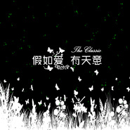
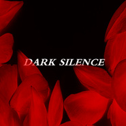

沈华夏
============================

|  |  |
| :--: | :-- |
| [ 沈华夏](https://i.xiami.com/snuaxa) | **播放数**: 2273252 **粉丝数**: 102 **评论数**: 2 **地区**: China 中国大陆 **风格**: 器乐独奏 Solo Instrumental, 轻音乐 Easy Listening, 国语流行 Mandarin Pop, 电音流行 Electropop, 华语唱作人 Chinese Singer-Songwriter  |

## 档案

歌手简介：沈华夏，内地作词人、作曲人、音乐人、歌手、内地独立音乐制作人。 
TA的基本档案 
中文名： 沈华夏 
生日： 1990-08-22 
别名： 沈华夏 
国籍： 中国 
身高： 183cm 
民族： 汉族 
代表作品： 《蓝色天空》、《青春路上》、《最后的光》等。

## 专辑

| 名称 | 语种 | 唱片公司 | 发行时间 | 专辑类别 | 专辑风格 |
| :--: | :-- | :-- | :-- | :-- | :-- |
| [ 那些年](./albums/2103658349.md) | 国语 | 独立发行 | 2018年03月29日 | 录音室专辑 | 流行 Pop |
| [ 假如爱有天意](./albums/2102777951.md) | 国语 | 独立发行 | 2017年07月05日 | 录音室专辑 | 流行 Pop |
| [ 爱恋](./albums/2105318959.md) | 国语 | 独立发行 | 2017年05月13日 | 录音室专辑 | 流行 Pop |
| [ DARK SILENCE](./albums/2102761899.md) | 国语 | 独立发行 | 2016年10月26日 | 录音室专辑 | 流行 Pop |
| [ 流光溢彩](./albums/909733352.md) | 国语 | 独立发行 | 2014年07月10日 | 录音室专辑 | 流行 Pop |

## 评论

|  |  |  |  |
| :-- | :-- | :-- | :-- |
|  [虾米用户](https://emumo.xiami.com/u/42131805)  2015-10-28 14:35 赞(0) 踩(0) | 
随他吧钢琴版很好听！
 |
|  [虾米用户](https://emumo.xiami.com/u/3486420)  2014-10-12 21:07 赞(0) 踩(0) | 
帅哥
 |
