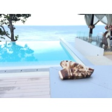

史峰ShiFeng
============================

|  |  |
| :--: | :-- |
| [ 史峰ShiFeng](https://i.xiami.com/ocarina) | **地区**: China 中国大陆 **风格**: 器乐独奏 Solo Instrumental, 轻音乐 Easy Listening, 器乐流行 Instrumental Pop, 沙发音乐 Lounge **播放数**: 2614319 **粉丝数**: 1675 **评论数**: 59  |

## 档案

青年陶笛演奏家； 
毕业于沈阳音乐学院； 
现任上海音乐家协会陶笛研究会副会长； 
国内、国际大型陶笛活动特邀嘉宾及赛事评委。史峰陶笛工作室创始人，致力于陶笛系统化教学研究与陶笛演奏技术的能力开发； 
同时编著有上海声像出版社出版的《中外陶笛精品曲选》； 
上海音乐出版社出版的，上海音乐家协会音乐考级丛书系列《陶笛考级曲集》等，为中国陶笛发展专业化奠定了坚实的基础； 
电视剧《知否知否应是绿肥红瘦》陶笛情感部分《磨砺 主题3》、《不舍》、《隐忍 卫小娘》乐曲的录制。

## 专辑

| 名称 | 语种 | 唱片公司 | 发行时间 | 专辑类别 | 专辑风格 |
| :--: | :-- | :-- | :-- | :-- | :-- |
| [ 陶笛精选集（十三）史峰演奏示范](./albums/2108234745.md) | 纯音乐 | 独立发行 | 2020年03月25日 | 录音室专辑 | 独奏 Recital, 轻音乐 Easy Listening |
| [ 陶笛古典精选集史峰演奏示范](./albums/2108153122.md) | 纯音乐 | 独立发行 | 2020年03月08日 | 录音室专辑 | 浪漫主义 Romanticism, 古典主义 Classical period, 独奏 Recital |
| [ 陶笛欣赏](./albums/2105009561.md) | 纯音乐 |  | 2019年07月21日 | 精选集 | 器乐独奏 Solo Instrumental |
| [ 陶笛精选集（十二）史峰演奏示范](./albums/2104941945.md) | 纯音乐 | 独立发行 | 2019年06月13日 | 录音室专辑 | 器乐独奏 Solo Instrumental |
| [ 陶笛精选集（十一）史峰演奏示范](./albums/2104462941.md) | 纯音乐 | 独立发行 | 2019年01月10日 | 原声带, 影视音乐 | 器乐独奏 Solo Instrumental |
| [ 陶笛伴奏陶笛伴奏](./albums/2103902144.md) | 纯音乐 | 独立发行 | 2018年08月07日 | 录音室专辑 | 古典音乐 Classical, 器乐流行 Instrumental Pop, 轻音乐 Easy Listening |
| [ 陶笛精选集（十）史峰演奏示范](./albums/2103527917.md) | 纯音乐 | 独立发行 | 2018年02月13日 | 录音室专辑 | 器乐独奏 Solo Instrumental |
| [ 陶笛演奏名曲集史峰ShiFeng](./albums/2103500057.md) | 纯音乐 | 独立发行 | 2018年01月25日 | 录音室专辑 | 器乐独奏 Solo Instrumental |
| [ 陶笛精选集（八）史峰演奏示范](./albums/2102747665.md) | 纯音乐 | 独立发行 | 2017年05月08日 | 录音室专辑 | 器乐独奏 Solo Instrumental |
| [ 陶笛精选集（二）史峰演奏示范](./albums/2102747646.md) | 纯音乐 | 独立发行 | 2017年05月08日 | 录音室专辑 | 器乐独奏 Solo Instrumental |
| [ 陶笛精选集（六）史峰演奏示范](./albums/2102747660.md) | 纯音乐 | 独立发行 | 2017年05月08日 | 录音室专辑 | 器乐独奏 Solo Instrumental |
| [ 陶笛精选集（五）史峰演奏示范](./albums/2102747658.md) | 纯音乐 | 独立发行 | 2017年05月08日 | 录音室专辑 | 器乐独奏 Solo Instrumental |
| [ 陶笛精选集（一）史峰演奏示范](./albums/2102747644.md) | 纯音乐 | 独立发行 | 2017年05月08日 | 录音室专辑 | 器乐独奏 Solo Instrumental |
| [ 陶笛精选集（四）史峰演奏示范](./albums/2102747655.md) | 纯音乐 | 独立发行 | 2017年05月08日 | 录音室专辑 | 器乐独奏 Solo Instrumental |
| [ 陶笛精选集（三）史峰演奏示范](./albums/2102747651.md) | 纯音乐 | 独立发行 | 2017年05月08日 | 录音室专辑 | 器乐独奏 Solo Instrumental |
| [ 陶笛精选集（七）史峰演奏示范](./albums/2102747662.md) | 纯音乐 | 独立发行 | 2017年05月08日 | 录音室专辑 | 器乐独奏 Solo Instrumental |
| [ 陶笛精选集（九）史峰演奏示范](./albums/2102747666.md) | 纯音乐 | 独立发行 | 2017年05月08日 | 录音室专辑 | 器乐独奏 Solo Instrumental |

## 评论

|  |  |  |
| :-- | :-- | :-- |
|  [虾米用户](https://emumo.xiami.com/u/7151428) 暖暖的～～ 2020-03-19 22:55 赞(0) 踩(0) | 
！！
 |
|  [虾米用户](https://emumo.xiami.com/u/357752578) 燕:  片叶寄思迎风飘，... 2019-07-18 18:38 赞(0) 踩(0) | 
   √√ 
 |
|  [虾米用户](https://emumo.xiami.com/u/325374787)  2019-07-12 21:20 赞(0) 踩(0) | 
，
 |
|  [虾米用户](https://emumo.xiami.com/u/347948803) 我还没想好要写什么... 2019-01-31 23:06 赞(0) 踩(0) | 
不一样的音乐 不一样的美妙 不一样的享受 谢谢  
 |
|  [虾米用户](https://emumo.xiami.com/u/255157124)   2018-12-01 12:25 赞(2) 踩(0) | 
喜欢埙和陶笛，觉得这种音色很有中国的韵味。感谢大师奏出这么多这么棒的作品～
 |
| ⇒ |  [虾米用户](https://emumo.xiami.com/u/357752578) 燕:  片叶寄思迎风飘，... 2019-07-18 18:43 赞(0) 踩(0) | 
   同感！我也喜欢埙和陶笛！ 
 |
|  [虾米用户](https://emumo.xiami.com/u/408195813)  2018-11-09 21:22 赞(0) 踩(0) | 
是每首曲都要25元吗 慕名而来铩羽而归
 |
|  [虾米用户](https://emumo.xiami.com/u/40467830)  2018-11-09 11:04 赞(0) 踩(0) | 
史大师你好，听过一首陶笛的曲子，就是不知道名字，好想向您请教，不知可否？
 |
|  [虾米用户](https://emumo.xiami.com/u/401460428)  2018-08-13 17:11 赞(0) 踩(0) | 
请问陶笛可以吹海德薇吗
 |
|  [虾米用户](https://emumo.xiami.com/u/356374914)  2018-04-27 23:27 赞(1) 踩(0) | 
史峰老师最棒      
 |
|  [虾米用户](https://emumo.xiami.com/u/261428681)  2018-04-26 20:13 赞(0) 踩(0) | 
喜欢听陶笛
 |
|  [虾米用户](https://emumo.xiami.com/u/286521973)  2018-04-23 18:25 赞(0) 踩(0) | 
在江南的古街上，总有那么一两家陶笛店。店里传出的陶笛声，穿透出来，古朴悠扬。此声此景此情令人难忘！ 陶笛比埙，个人感觉音色更秀气。喜欢这种古老的乐器，对同龄人来说，我已进入老年了
 |
|  [虾米用户](https://emumo.xiami.com/u/357097001)  2018-04-06 12:18 赞(1) 踩(0) | 
好听，不错
 |
|  [虾米用户](https://emumo.xiami.com/u/348148291)  2018-02-09 14:43 赞(0) 踩(0) | 
史峰老师，想要吹出这种空灵的感觉，需要什么样的吹奏技巧呢？
 |
| ⇒ |  [虾米用户](https://emumo.xiami.com/u/808174) Musician 2018-02-09 14:50 赞(0) 踩(0) | 
空灵？加点混响就有了。
 |
|  [虾米用户](https://emumo.xiami.com/u/300322415)  2018-02-04 22:49 赞(1) 踩(0) | 
史老师，  好想跟您学习
 |
|  [虾米用户](https://emumo.xiami.com/u/342311372)  2018-01-25 13:35 赞(0) 踩(0) | 
喜欢
 |
|  [虾米用户](https://emumo.xiami.com/u/210398029)  2018-01-12 17:11 赞(0) 踩(0) | 
听了之后就好想学陶笛阿
 |
|  [虾米用户](https://emumo.xiami.com/u/287935755)  2017-12-21 17:58 赞(0) 踩(0) | 
真的很好听
 |
|  [虾米用户](https://emumo.xiami.com/u/339583052) 麻花疼 2017-12-11 23:14 赞(0) 踩(0) | 
吹的好
 |
|  [虾米用户](https://emumo.xiami.com/u/808174) Musician 2017-11-08 09:53 赞(31) 踩(0) | 
多谢大家的支持！
 |
| ⇒ |  [虾米用户](https://emumo.xiami.com/u/261428681)  2018-04-26 20:13 赞(0) 踩(0) | 
好独特。可能因为我不了解乐器，请你见谅。就觉得明明都是陶笛，您吹的就像歌唱一样，很清晰的就能察觉到和别的陶笛者的区别。好好听
 |
| ⇒ |  [虾米用户](https://emumo.xiami.com/u/410332216)  2018-12-15 12:29 赞(0) 踩(0) | 
真的很好听！
 |
| ⇒ |  [虾米用户](https://emumo.xiami.com/u/402941586) 喜欢音乐 2019-01-27 11:09 赞(0) 踩(0) | 
曲做的太好了。陶笛吹的更好，点赞赞赞！
 |
| ⇒ |  [虾米用户](https://emumo.xiami.com/u/428727177) 人不知道，天知道，我在想... 2020-02-19 17:20 赞(0) 踩(0) | 
我想学陶笛
 |
| ⇒ |  [虾米用户](https://emumo.xiami.com/u/428727177) 人不知道，天知道，我在想... 2020-02-19 17:21 赞(0) 踩(0) | 
<q><b>淇裳说：</b></q>
 |
| ⇒ |  [虾米用户](https://emumo.xiami.com/u/428727177) 人不知道，天知道，我在想... 2020-02-19 17:21 赞(0) 踩(0) | 
<q><b>淇裳说：</b></q>
 |
| ⇒ |  [虾米用户](https://emumo.xiami.com/u/428727177) 人不知道，天知道，我在想... 2020-02-19 17:22 赞(0) 踩(0) | 
<q><b>淇裳说：</b></q>
 |
| ⇒ |  [虾米用户](https://emumo.xiami.com/u/428727177) 人不知道，天知道，我在想... 2020-02-19 17:22 赞(0) 踩(0) | 
<q><b>淇裳说：</b></q>
 |
| ⇒ |  [虾米用户](https://emumo.xiami.com/u/428727177) 人不知道，天知道，我在想... 2020-02-19 17:22 赞(0) 踩(0) | 
<q><b>淇裳说：</b></q>
 |
|  [虾米用户](https://emumo.xiami.com/u/296481348)  2017-11-06 23:56 赞(0) 踩(0) | 
  
 |
|  [虾米用户](https://emumo.xiami.com/u/318969819)  2017-10-05 09:35 赞(2) 踩(0) | 
真的超级厉害，超级好听，加油↖(^&amp;omega;^)↗
 |
|  [虾米用户](https://emumo.xiami.com/u/318541695) 在虾米听歌！2017.9... 2017-10-04 11:13 赞(0) 踩(0) | 
我也来了！
 |
|  [虾米用户](https://emumo.xiami.com/u/300322415)  2017-09-09 21:14 赞(1) 踩(0) | 
如神仙一般仙乐，令人沐浴在春天的竹海中，让人心旷神怡。   
 |
|  [虾米用户](https://emumo.xiami.com/u/321942308)  2017-08-27 21:24 赞(1) 踩(0) | 
一路追随，从网易云到我虾米
 |
|  [虾米用户](https://emumo.xiami.com/u/280041369)  2017-08-27 14:48 赞(1) 踩(0) | 
什么时候就免费能下载了呢 
 |
|  [虾米用户](https://emumo.xiami.com/u/319332188)  2017-08-14 16:25 赞(3) 踩(0) | 
为了听这个陶笛我从易云来到虾米 
 |
|  [虾米用户](https://emumo.xiami.com/u/64035672) 一路承载，因你绽放！ 2017-07-10 14:43 赞(2) 踩(0) | 
超级赞
 |
|  [虾米用户](https://emumo.xiami.com/u/159463312)  2017-07-02 11:45 赞(0) 踩(0) | 
令人陶醉！
 |
|  [虾米用户](https://emumo.xiami.com/u/295717418) 語晨林音 2017-06-08 16:53 赞(1) 踩(0) | 
吹得太棒 太喜歡嘞 是我的目標
 |
|  [虾米用户](https://emumo.xiami.com/u/289206225)  2017-06-05 13:19 赞(1) 踩(0) | 
我想问初学买个什么样的陶笛 
 |
| ⇒ |  [虾米用户](https://emumo.xiami.com/u/306434763)  2017-06-22 04:46 赞(0) 踩(0) | 
十二孔ac
 |
|  [虾米用户](https://emumo.xiami.com/u/41189546)   2015-09-01 00:53 赞(0) 踩(0) | 
怎么所有曲子都没了，好好听的说
 |
|  [虾米用户](https://emumo.xiami.com/u/52070054)  2015-07-04 17:26 赞(0) 踩(0) | 
老师用的是什么牌子的三管陶笛呀
 |
| ⇒ |  [虾米用户](https://emumo.xiami.com/u/38765021) … 2015-09-13 22:36 赞(0) 踩(0) | 
<q><b>说：</b></q>
 |
| ⇒ |  [虾米用户](https://emumo.xiami.com/u/38765021) … 2015-09-16 01:23 赞(0) 踩(0) | 
<q><b>说：</b></q>
 |
|  [虾米用户](https://emumo.xiami.com/u/3105637)  2015-04-16 00:08 赞(0) 踩(0) | 
好听，希望能出专辑
 |
|  [虾米用户](https://emumo.xiami.com/u/10390628)  2015-04-15 21:28 赞(2) 踩(0) | 
好桑心，每天我练习的都是吹疙瘩吗？这才是音乐的声音 
 |
| ⇒ |  [虾米用户](https://emumo.xiami.com/u/334570341) 快乐伤心都有音乐的陪伴就... 2018-01-19 03:56 赞(0) 踩(0) | 
两年过去了，现在应该进步很多了吧，我刚刚入手一个月不到
 |
|  [虾米用户](https://emumo.xiami.com/u/19256136)  2015-01-25 19:49 赞(0) 踩(0) | 
史峰Ocarina  好听的陶笛音乐
 |
|  [虾米用户](https://emumo.xiami.com/u/6814426) 爱听风中诗 2015-01-01 03:34 赞(0) 踩(0) | 
史老师有教学生吗？
 |
|  [虾米用户](https://emumo.xiami.com/u/3086900) 要再见了吗。。 2014-12-05 12:16 赞(0) 踩(0) | 
陶笛真不错！多放些歌的哦！
 |
|  [虾米用户](https://emumo.xiami.com/u/12123)  2014-11-18 10:09 赞(0) 踩(0) | 
好听
 |
|  [虾米用户](https://emumo.xiami.com/u/12123)  2014-11-18 10:09 赞(0) 踩(0) | 
史峰Ocarina
 |
|  [虾米用户](https://emumo.xiami.com/u/6293759) 愛真善美  审视欲望  ... 2014-09-28 08:14 赞(1) 踩(0) | 
很好听，加油
 |
|  [虾米用户](https://emumo.xiami.com/u/6865964) 一个世界里有你，一个世界... 2014-09-08 10:11 赞(1) 踩(0) | 
这个泪光闪闪实在是在中秋忍不住的赞美之词，希望有更多好的作品
 |
|  [虾米用户](https://emumo.xiami.com/u/2401674)  2014-08-21 17:41 赞(1) 踩(0) | 
32个赞！
 |
|  [虾米用户](https://emumo.xiami.com/u/13086816)  2014-08-20 22:42 赞(2) 踩(0) | 
陶笛吹的都很不错。
 |
| ⇒ |  [虾米用户](https://emumo.xiami.com/u/808174) Musician 2014-08-21 11:26 赞(0) 踩(0) | 
有空多来坐坐。
 |
