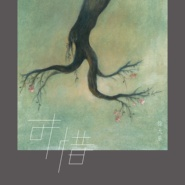

徐大乐
============================

|  |  |
| :--: | :-- |
| [ 徐大乐](https://i.xiami.com/xudalesir) | **地区**: China 中国大陆 **风格**: 民谣流行 Folk Pop **播放数**: 7409894 **粉丝数**: 970 **评论数**: 49  |

## 档案

徐大乐，本名徐丹，1979年3月16日出生于宁夏银川，现生活于北京，歌手，音乐创作人，声音磁性，性格安静。 
2007年为中央二套《交换空间》制作主题曲、插曲，并担任词曲演唱。其中主题歌经中央二套历时7年的频繁播出，有数亿级别听众。2014年为《交换空间》栏目制作改版主题曲。2015年3月录制《一个人的朝圣》、《总爱上班的徐大乐先生》，2016年6月18日，《奎妮的情歌》MV被猫王收音机选为电商大促发布会宣传曲。

## 专辑

| 名称 | 语种 | 唱片公司 | 发行时间 | 专辑类别 | 专辑风格 |
| :--: | :-- | :-- | :-- | :-- | :-- |
| [ 可惜](./albums/2104116868.md) | 国语 | 大音雅弦 | 2018年10月15日 | EP, 单曲 | 国语流行 Mandarin Pop |
| [ 生灭记](./albums/2102719093.md) | 国语 | 简单快乐 | 2017年05月18日 | 录音室专辑 | 民谣 Folk, 国语流行 Mandarin Pop |
| [ 一个人的朝圣](./albums/933317406.md) | 国语 | 独立发行 | 2015年06月05日 | 录音室专辑 | 国语流行 Mandarin Pop |

## 评论

|  |  |  |
| :-- | :-- | :-- |
|  [虾米用户](https://emumo.xiami.com/u/358104299) 悲观的唯心存在现实解构虚... 2020-12-14 05:16 赞(1) 踩(0) | 
42990
 |
|  [虾米用户](https://emumo.xiami.com/u/440856004) 冷暖自知 2020-11-14 22:01 赞(0) 踩(0) | 
这嗓音爱了
 |
|  [虾米用户](https://emumo.xiami.com/u/364882382) 眼睛里装的是善良，看到の... 2020-06-27 11:37 赞(0) 踩(0) | 
酷加油
 |
|  [虾米用户](https://emumo.xiami.com/u/431810786)  2019-11-30 15:39 赞(0) 踩(0) | 
喜欢
 |
|  [虾米用户](https://emumo.xiami.com/u/343207237)  2019-04-18 19:20 赞(0) 踩(0) | 
惊艳的声音
 |
|  [虾米用户](https://emumo.xiami.com/u/286479902)  2018-10-30 19:07 赞(0) 踩(0) | 
喜欢你的声音，期待新品
 |
|  [虾米用户](https://emumo.xiami.com/u/155947) 一期一会 2018-05-11 11:08 赞(0) 踩(0) | 
宁夏小哥好评
 |
|  [虾米用户](https://emumo.xiami.com/u/138354686)  2018-03-29 00:26 赞(0) 踩(0) | 
第一次听〖雾〗惊艳，循环了半月。 
 |
|  [虾米用户](https://emumo.xiami.com/u/17806314) 以梦为马 以己为光 2018-02-07 14:19 赞(0) 踩(0) | 
_(:⁍」&amp;ang;)_
 |
|  [虾米用户](https://emumo.xiami.com/u/15285021)  2017-12-27 11:48 赞(0) 踩(0) | 
今天偶然听到一个人的朝圣，旋律节奏很不错。一个人去朝圣了，收获很多。追梦的旅程是很孤独的，加油！
 |
|  [虾米用户](https://emumo.xiami.com/u/279176402) 生而为人，我很抱歉。 2017-08-26 17:22 赞(0) 踩(0) | 
喜欢你的声音
 |
|  [虾米用户](https://emumo.xiami.com/u/68487514)  2017-08-04 20:36 赞(0) 踩(0) | 
走在茫茫人海中，越热闹越孤单，越繁华越安静，坚持固执的坚持，也许远方还有路
 |
|  [虾米用户](https://emumo.xiami.com/u/225886311)  一心想入党的资产阶级分... 2017-06-13 20:07 赞(0) 踩(0) | 
交换空间
 |
|  [虾米用户](https://emumo.xiami.com/u/303226480)  2017-06-10 01:36 赞(0) 踩(0) | 
这歌太棒了
 |
|  [虾米用户](https://emumo.xiami.com/u/291160930) 找个懂你的人最温暖 2017-05-30 17:25 赞(0) 踩(0) | 
有磁性！好听！大乐：加油！ 
 |
|  [虾米用户](https://emumo.xiami.com/u/265411907) 我还没想好要写什么... 2017-05-18 20:47 赞(0) 踩(0) | 
想听下去你的所有歌曲，我的流量却不会允许
 |
|  [虾米用户](https://emumo.xiami.com/u/265411907) 我还没想好要写什么... 2017-05-18 20:47 赞(0) 踩(0) | 
想听下去你的所有歌曲，我的流量却不会允许 
 |
|  [虾米用户](https://emumo.xiami.com/u/28194942)  2017-05-02 21:57 赞(0) 踩(0) | 
好久没被感动到
 |
|  [虾米用户](https://emumo.xiami.com/u/54859048) 我还没想好要写什么... 2017-04-30 23:26 赞(0) 踩(0) | 
声音真的好听啊
 |
|  [虾米用户](https://emumo.xiami.com/u/88068784)  2017-04-22 00:53 赞(0) 踩(0) | 
好帅啊 声音很man
 |
|  [虾米用户](https://emumo.xiami.com/u/41339586)   2017-04-11 17:55 赞(0) 踩(0) | 
喜欢你
 |
|  [虾米用户](https://emumo.xiami.com/u/41339586)   2017-04-11 17:55 赞(0) 踩(0) | 
帅
 |
|  [虾米用户](https://emumo.xiami.com/u/96036516)   2017-04-11 07:18 赞(0) 踩(0) | 
宁夏人来关注
 |
|  [虾米用户](https://emumo.xiami.com/u/251393644) 如我何般 2017-04-08 21:36 赞(0) 踩(0) | 

 |
|  [虾米用户](https://emumo.xiami.com/u/284008769) 如果没有你～ 2017-03-28 12:08 赞(0) 踩(0) | 
 好听
 |
|  [虾米用户](https://emumo.xiami.com/u/215209573) Кому надо,то... 2017-03-24 17:10 赞(0) 踩(0) | 
听семнадцать мгновений весны 里的歌曲 刚好虾米推送了 春天的17个瞬间 又发现一块宝 
 |
|  [虾米用户](https://emumo.xiami.com/u/20452290) 在人事已非的景色里，我最... 2017-02-20 19:10 赞(0) 踩(0) | 
旋律超带感，驾车飞驰，开到天堂。。。。。。。。。。。。。。
 |
|  [虾米用户](https://emumo.xiami.com/u/256647289)  2017-01-24 13:38 赞(0) 踩(0) | 
一个人的朝圣！
 |
|  [虾米用户](https://emumo.xiami.com/u/256647289)  2017-01-24 13:38 赞(0) 踩(0) | 
好有感觉的歌
 |
|  [虾米用户](https://emumo.xiami.com/u/244633674)  2016-12-17 08:09 赞(0) 踩(0) | 
大乐加油！爱你哦
 |
|  [虾米用户](https://emumo.xiami.com/u/47330932) SSSSmile~ 2016-12-08 21:05 赞(0) 踩(0) | 

 |
|  [虾米用户](https://emumo.xiami.com/u/40024038)  2016-11-18 10:42 赞(4) 踩(0) | 
一开始的旋律没人觉得像痛仰的公路之歌么...
 |
|  [虾米用户](https://emumo.xiami.com/u/41952268) You only liv... 2016-10-24 08:27 赞(0) 踩(0) | 

 |
|  [虾米用户](https://emumo.xiami.com/u/27459411) 不忘初心 2016-10-22 17:21 赞(0) 踩(0) | 
好听又动心的歌声
 |
|  [虾米用户](https://emumo.xiami.com/u/83736930)  2016-10-19 16:14 赞(0) 踩(0) | 
听到声音
 |
|  [虾米用户](https://emumo.xiami.com/u/4415503)  2016-09-01 20:19 赞(0) 踩(0) | 
还以为是雪总
 |
|  [虾米用户](https://emumo.xiami.com/u/82713980) Be myself 2016-08-22 17:42 赞(0) 踩(0) | 
因为一个人的朝圣接触你，了解你，支持你
 |
|  [虾米用户](https://emumo.xiami.com/u/82537106)  2016-06-22 11:53 赞(1) 踩(0) | 
无意间听到你的声音 一下子被吸引到了！娓娓道来的声音，注定会在时光里，绽放耀眼的光芒……   
 |
|  [虾米用户](https://emumo.xiami.com/u/27459411) 不忘初心 2016-06-07 12:51 赞(0) 踩(0) | 
昨天在网易云音乐听了徐大乐的新歌《奎妮的情歌》，很不错，看过《一个人的朝圣》回味每句歌词都有画面感和体会，支持徐大乐的音乐创作。
 |
|  [虾米用户](https://emumo.xiami.com/u/60333516)  2016-05-02 01:26 赞(1) 踩(0) | 
声音性感，好喜欢。也喜欢你的生活，说实话是羡慕
 |
|  [虾米用户](https://emumo.xiami.com/u/2987526) no Romeo 2015-11-19 17:34 赞(0) 踩(0) | 
声音很赞  惊艳的感觉啊
 |
|  [虾米用户](https://emumo.xiami.com/u/36400012) 唯有祝福 2015-11-11 13:54 赞(1) 踩(0) | 
为啥没火
 |
|  [虾米用户](https://emumo.xiami.com/u/1507585) 我还没想好要写什么... 2015-11-10 18:22 赞(0) 踩(0) | 
听《交换空间》惊艳！
 |
|  [虾米用户](https://emumo.xiami.com/u/49495181)   2015-10-01 21:54 赞(0) 踩(0) | 
喜欢你的声音
 |
|  [虾米用户](https://emumo.xiami.com/u/49108866) 天地不仁，以万物为刍狗。 2015-09-21 12:28 赞(0) 踩(0) | 
好，感觉好
 |
|  [虾米用户](https://emumo.xiami.com/u/726752) 已下架 2015-05-10 11:49 赞(0) 踩(0) | 
嗓子真好！
 |
|  [虾米用户](https://emumo.xiami.com/u/49656829) 听见好时光 2015-05-05 14:47 赞(39) 踩(0) | 
我刚入驻了虾米音乐人，欢迎大家来我的个人主页，收听我的最新音乐
 |
| ⇒ |  [虾米用户](https://emumo.xiami.com/u/6374836)  2016-09-12 13:51 赞(0) 踩(0) | 
好听
 |
| ⇒ |  [虾米用户](https://emumo.xiami.com/u/114808056)  2017-02-06 13:56 赞(0) 踩(0) | 
我听到这首歌，我觉得歌里有故事，于是百度了，居然有这本书，我一下子买了两本，看完了，很感动，结局很揪心也很释然……谢谢大乐哥
 |
