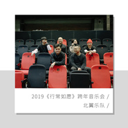

北翼乐队
============================

|  |  |
| :--: | :-- |
| [ 北翼乐队](https://i.xiami.com/luotianyi) | **播放数**: 2285837 **粉丝数**: 559 **评论数**: 42 **地区**: China 中国大陆 **风格**: 国语流行 Mandarin Pop, 流行摇滚 Pop Rock  |

## 档案

北翼乐队2015年5月成立于武汉，初期以民谣风格为基线进行编配，后逐渐转为Indie pop（独立流行）及Pop rock（流行摇滚）风格，也会融入另类摇滚等新式元素。音乐作品注重情感表达，民族乐器和西洋乐器恰当的结合，是北翼乐队的一大特点。 
乐队成员 
主   唱：罗天翼 
鼓   手：卢锚 
贝   斯：阿强 
琵   琶：玲子 
萨克斯：王威 
吉   他：李仁涛 
代表作品：《晚晴》、《汉口》、《珞珈山下东湖边》、《妈妈》等。

## 专辑

| 名称 | 语种 | 唱片公司 | 发行时间 | 专辑类别 | 专辑风格 |
| :--: | :-- | :-- | :-- | :-- | :-- |
| [ 行常如愿 跨年音乐会Live专辑](./albums/2106103916.md) | 国语 | 独立发行 | 2020年02月25日 | 现场专辑 | 流行摇滚 Pop Rock |
| [ 远方](./albums/2103742958.md) | 国语 | 独立发行 | 2018年06月10日 | EP, 单曲 | 流行摇滚 Pop Rock, 摇滚 Rock & Roll, 独立摇滚 Indie Rock |
| [ 妈妈](./albums/2103742873.md) | 国语 | 独立发行 | 2018年05月13日 | EP, 单曲 | 流行摇滚 Pop Rock |
| [ 汉口](./albums/2103468205.md) | 国语 | 独立发行 | 2018年01月01日 | EP, 单曲 | 独立流行 Indie Pop |
| [ 北翼音乐作品集](./albums/2100337030.md) | 国语 | 独立发行 | 2016年05月15日 | EP, 单曲 | 民谣 Folk, 摇滚 Rock & Roll |

## 评论

|  |  |  |  |
| :-- | :-- | :-- | :-- |
|  [虾米用户](https://emumo.xiami.com/u/530490) 音乐不说谎。 2019-09-09 13:54 赞(0) 踩(0) | 
豪情万丈，爷们！！
 |
|  [虾米用户](https://emumo.xiami.com/u/7201346)   2019-07-16 22:57 赞(0) 踩(0) | 
《树》的前奏真好听，得亏我手快下载了……希望还能发出来。我顺便求一个《树》的伴奏……真好听……
 |
|  [虾米用户](https://emumo.xiami.com/u/22240666) 一只后摇狗 2019-07-16 16:22 赞(0) 踩(0) | 
超级棒的乐队呀！编曲太棒，太好听了。
 |
|  [虾米用户](https://emumo.xiami.com/u/14747594) 大音希声 2019-06-22 10:01 赞(0) 踩(0) | 
《娜塔莎》很好听，很怀旧
 |
|  [虾米用户](https://emumo.xiami.com/u/358104299) 悲观的唯心存在现实解构虚... 2019-04-11 21:07 赞(1) 踩(0) | 
10646
 |
|  [虾米用户](https://emumo.xiami.com/u/293916754)  2019-03-02 09:25 赞(0) 踩(0) | 
怎么一下子下架了好多歌啊?
 |
|  [虾米用户](https://emumo.xiami.com/u/12221090) 逍遥于天地而心意自得 2019-02-20 22:32 赞(0) 踩(0) | 
赞
 |
|  [虾米用户](https://emumo.xiami.com/u/407629541) 我还没想好要写什么... 2019-02-07 17:25 赞(0) 踩(0) | 
加油(ง •̀_•́)ง第一次听晚晴 很喜欢 
 |
|  [虾米用户](https://emumo.xiami.com/u/263864318) 我不要天上的星星，我要尘... 2018-12-14 18:51 赞(2) 踩(0) | 
支持北翼乐队 
 |
|  [虾米用户](https://emumo.xiami.com/u/330949432) 我还没想好要写什么... 2018-06-20 16:05 赞(2) 踩(0) | 
第一次听娜塔莎这歌就喜欢这种风格，最近一直循环着北翼的其他歌，加油！！
 |
|  [虾米用户](https://emumo.xiami.com/u/39338080) 爱上一匹野马，这里到处都... 2018-06-15 06:38 赞(1) 踩(0) | 
加油！
 |
|  [虾米用户](https://emumo.xiami.com/u/188730298)  2018-06-02 00:21 赞(1) 踩(0) | 
加油！
 |
|  [虾米用户](https://emumo.xiami.com/u/341846199)   2018-02-01 17:57 赞(1) 踩(0) | 
年度武汉之声过来的 如获至宝
 |
|  [虾米用户](https://emumo.xiami.com/u/54554952) 你永远欠我的 2018-01-14 00:31 赞(1) 踩(0) | 
今晚最爱～～
 |
|  [虾米用户](https://emumo.xiami.com/u/1997808) 怀旧是一种情怀 2017-10-27 17:44 赞(1) 踩(0) | 
马
 |
|  [虾米用户](https://emumo.xiami.com/u/6187648) ✎。 2017-10-25 21:57 赞(2) 踩(0) | 

 |
|  [虾米用户](https://emumo.xiami.com/u/85978140)  2017-05-21 01:05 赞(1) 踩(0) | 
你什么时候巡演呢？？
 |
|  [虾米用户](https://emumo.xiami.com/u/295986941)  2017-05-13 14:28 赞(2) 踩(0) | 
大赞北翼，最爱晚晴。
 |
|  [虾米用户](https://emumo.xiami.com/u/3249345)  2016-11-21 12:41 赞(1) 踩(0) | 
很喜欢你们的歌。想问你们要一首《希望》的原版吉他谱可以吗？想要自己弹唱。
 |
| ⇒ |  [虾米用户](https://emumo.xiami.com/u/927592) 武汉独立流行乐队 2017-01-28 17:04 赞(0) 踩(0) | 
【希望-吉他谱】已经发布在北翼乐队的官方新浪微博。我们将这份新春贺礼送给大家，新年快乐！
 |
|  [虾米用户](https://emumo.xiami.com/u/6767596)  2016-09-23 19:01 赞(1) 踩(0) | 
“喜欢”这首歌什么时候可以听到啊 
 |
| ⇒ |  [虾米用户](https://emumo.xiami.com/u/927592) 武汉独立流行乐队 2016-10-22 11:15 赞(0) 踩(0) | 
已上线
 |
|  [虾米用户](https://emumo.xiami.com/u/53732946)  2016-07-18 14:29 赞(1) 踩(0) | 
真的很好听。第一次听就被深深吸引，加油北翼乐队。 
 |
|  [虾米用户](https://emumo.xiami.com/u/49063471) 我还没想好要写什么... 2016-05-25 20:22 赞(1) 踩(0) | 
加油。越做越好啦 
 |
|  [虾米用户](https://emumo.xiami.com/u/110547808)  2016-02-05 21:18 赞(1) 踩(0) | 
来了来了，我是曼点点
 |
|  [虾米用户](https://emumo.xiami.com/u/40789369) 偏执又纯真的人难免走向自... 2016-01-20 01:47 赞(1) 踩(0) | 
嗯，好喜欢你们乐队。 
 |
| ⇒ |  [虾米用户](https://emumo.xiami.com/u/927592) 武汉独立流行乐队 2016-01-23 23:14 赞(0) 踩(0) | 
厦门，你好！
 |
|  [虾米用户](https://emumo.xiami.com/u/6767596)  2016-01-17 21:57 赞(1) 踩(0) | 
加油，我要听新歌哟。。
 |
| ⇒ |  [虾米用户](https://emumo.xiami.com/u/927592) 武汉独立流行乐队 2016-01-18 20:35 赞(0) 踩(0) | 
不会让你们久等的...
 |
|  [虾米用户](https://emumo.xiami.com/u/6384372)  2015-06-14 14:49 赞(1) 踩(0) | 
第一次听小罗唱歌，被他的音色给惊艳了。细细听来，又在他的音乐中听到很多对音乐的执着，对生活的热爱。其实民谣是非常接地气的。我们喜欢民谣，因为我们热爱生活，也因为热爱生活，所以喜欢上小罗。
 |
|  [虾米用户](https://emumo.xiami.com/u/18495853)  2015-06-03 22:42 赞(1) 踩(0) | 
望专辑早日面世，
 |
|  [虾米用户](https://emumo.xiami.com/u/18495853)  2015-05-29 18:38 赞(1) 踩(0) | 
有一次在武汉听过一首你唱的歌，很感动，是一首诗谱曲写的歌，名字忘了，能不能把那首歌也放上来呢？很喜欢你这样的歌手。
 |
| ⇒ |  [虾米用户](https://emumo.xiami.com/u/927592) 武汉独立流行乐队 2015-06-02 21:34 赞(0) 踩(0) | 
那首歌叫《喜欢》，是武汉诗人小引的诗词，暂时还没有录，打算做专辑时一起上传。谢谢支持！
 |
|  [虾米用户](https://emumo.xiami.com/u/7158227) 一曲 2015-05-09 09:26 赞(1) 踩(0) | 
怎么没有档案资料 
 |
| ⇒ |  [虾米用户](https://emumo.xiami.com/u/927592) 武汉独立流行乐队 2015-05-09 10:39 赞(0) 踩(0) | 
一会儿整理
 |
|  [虾米用户](https://emumo.xiami.com/u/45713457)  2015-04-25 21:25 赞(1) 踩(0) | 
朋友昨天去听你的歌 她说你就坐在旁边那桌 她很喜欢你
 |
| ⇒ |  [虾米用户](https://emumo.xiami.com/u/927592) 武汉独立流行乐队 2015-05-03 11:23 赞(0) 踩(0) | 
感谢喜欢我们的音乐，下次见！
 |
|  [虾米用户](https://emumo.xiami.com/u/48523417)  2015-03-26 19:12 赞(1) 踩(0) | 
很偶然的跟朋友走进了加图咖啡，然后听到了你们的民谣，结果就很认真的听了一晚上。声音超好听，还有，超喜欢你们的咖啡屋！
 |
| ⇒ |  [虾米用户](https://emumo.xiami.com/u/927592) 武汉独立流行乐队 2015-05-03 11:23 赞(0) 踩(0) | 
谢谢你哦，期待再聚！
 |
|  [虾米用户](https://emumo.xiami.com/u/45877946)  2015-01-11 06:49 赞(1) 踩(0) | 
很喜欢很喜欢，我是你的粉条。
 |
| ⇒ |  [虾米用户](https://emumo.xiami.com/u/927592) 武汉独立流行乐队 2015-05-03 11:23 赞(0) 踩(0) | 
^_^
 |
|  [虾米用户](https://emumo.xiami.com/u/927592) 武汉独立流行乐队 2014-09-02 21:12 赞(4) 踩(0) | 
我刚入驻了虾米音乐人，欢迎大家来我的个人主页，收听我的最新音乐
 |
