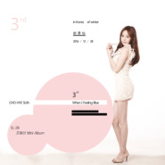

When I Feeling Blue
============================

|  |  |
| :--: | :-- |
| [ When I Feeling Blue](https://emumo.xiami.com/album/2102673288) | **艺人**: [赵慧仙](../index.md) **语种**: 韩语 **唱片公司**: 独立发行 **发行时间**: 2016年12月28日 **专辑类别**: EP, 单曲 **专辑风格**: 浩室舞曲 House, 韩国流行 K-Pop, 非洲流行 Afro-Pop **播放数**: 4717 **收藏数**: 3 **评论数**: 0  |

## 简介

2016年乐坛高颜值女神 HYE SUN温暖来袭  
荧幕上绽放光芒的射手座女孩 创作音乐新生命  
赵慧仙2016年末单曲3rd 《When I Feeling Blue》  
个人第三波单曲 暖悲伤韩语疗伤情歌  
12月28日温暖上线！  
  
演而优则唱的赵慧仙（조혜선）向女神变身,个人正规单曲3rd《When I Feeling Blue》正式公开，这也是她2016年发布迷你专辑《爱秘密》后时隔10个月的正式回归.自宣告回归以来赵慧仙公开了全新红衣洋装造型等多篇预告造型,展现了HYE SUN的多样风格。  
  
赵慧仙回归乐坛，推出个人第三波正规单曲。慧仙这次也告别过往形象，大玩俏皮甜美的优雅。mini专辑收录最新单曲「When I Feeling Blue」。慧仙本人担任填词创作，集合蓝调和folk多元曲风，再演绎经典作；OST指数攀升！原来在美貌与演技之外，赵慧仙在音乐方面才华洋溢。曾在电影《蓝色之恋》中首度演唱，重新编曲再演绎 12月28日温暖上线!! 

## 曲目

## 评论

|  |  |  |  |
| :-- | :-- | :-- | :-- |
