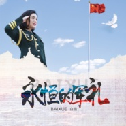

永恒的军礼
============================

|  |  |
| :--: | :-- |
| [ 永恒的军礼](https://emumo.xiami.com/album/2103773098) | **艺人**: [白雪](../index.md) **语种**: 国语 **唱片公司**: 龙乐世纪 **发行时间**: 2018年07月01日 **专辑类别**: 录音室专辑 **专辑风格**:  **播放数**: 64779 **收藏数**: 17 **评论数**: 3  |

## 简介

从军人的女儿到入伍参军，  
从战士演出队到中央军委政治工作部歌舞团，  
从演出队队员到国家一级演员……  
军旅是白雪此生不释的情结。  
这些年，军旅歌者白雪从未停下走军营的脚步，  
在她的记忆里尽是战友们激昂的歌声，挺拔的身影，  
那些舞动在高原、边防、海岛的青春而鲜亮的生命，  
让白雪一直牵挂。  
于是，推出一张属于自己的军旅歌曲专辑，  
成了白雪多年来的一个心愿。  
2017年底，白雪录制完成了这张《永恒的军礼》。  
白雪用她清丽的嗓音，和对音乐更深的理解，  
把她的歌声，献给最可爱的中国军人。  
专辑中收录了十二首歌曲，  
这些创作于不同历史时期，融军旅情怀、时代特色于一体的歌曲，  
是歌者白雪对自己走过的无悔年代的记录和怀念，  
更是白雪对中国军人最崇高的礼赞。

## 曲目

- [不要问为什么](./2103773098/8IunQVfee84.md)
- [永恒的军礼](./2103773098/xN9pcw165e9.md)
- [丝路新绿](./2103773098/8IunQXf8289.md)
- [无名烈士墓长征音画之序歌](./2103773098/bf2BksI2dff1.md)
- [大雪无情人有情](./2103773098/xN9pczcf284.md)
- [边关军魂](./2103773098/xN9pc020b95.md)
- [我在电视上看见了你](./2103773098/xN9pc1b1f71.md)
- [致远图强中国梦](./2103773098/bf2BksM82038.md)
- [久久的牵挂](./2103773098/b1shhVX3e765.md)
- [天路之上](./2103773098/8IunRe18d5c.md)
- [妻子](./2103773098/xN9pc5c528e.md)
- [我不想说再见](./2103773098/xN9pc6adcb1.md)

## 评论

|  |  |  |
| :-- | :-- | :-- |
|  [虾米用户](https://emumo.xiami.com/u/337774537)  2020-06-05 20:09 赞(0) 踩(0) | 
好听
 |
|  [虾米用户](https://emumo.xiami.com/u/258327527)  2020-03-13 17:04 赞(1) 踩(0) | 
好喜欢白雪姐姐
 |
|  [虾米用户](https://emumo.xiami.com/u/17258419) 健鸣 2018-08-04 14:47 赞(1) 踩(0) | 
见与不见，你都是永远爱的白雪
 |
