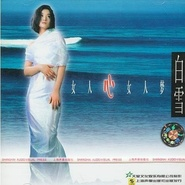

女人心女人梦
============================

|  |  |
| :--: | :-- |
| [ 女人心女人梦](https://emumo.xiami.com/album/6818) | **艺人**: [白雪](../index.md) **语种**: 国语 **唱片公司**: 天星文化 **发行时间**: 1999年01月01日 **专辑类别**: 录音室专辑 **专辑风格**: 国语流行 Mandarin Pop **播放数**: 58484 **收藏数**: 38 **评论数**: 6  |

## 简介

白雪1999久违歌坛三年 于北京天星文化公司发行第三张个人专辑《女人心女人梦》 收录古典优美金曲「声声慢恋曲」「牛郎织女」 都市伤感情歌「红颜为谁」「珍惜」「想他」 欧洲歌剧风「女人心女人梦」 耳目一新动感舞曲「我心梦寐」 其中「声声慢恋曲」荣获Channel [V] 1999年度华语榜中榜最佳歌曲奖 1999年度中国音乐电视MTV大赛金奖 「红颜为谁」荣获1998福建黄河杯中国原创十大金曲奖 同年白雪也成为金山词霸的形象代表 开创国内歌手代言电脑软件先河 精雕细琢 艺术精品 雅俗共赏 心旷神怡

## 曲目

- [红颜为谁MV](./6818/LHQ74129.md)
- [女人心女人梦MV](./6818/bBJFfb406.md)
- [真的情感](./6818/LHS76bd5.md)
- [想他](./6818/LHT9308c.md)
- [牛郎织女MV](./6818/bBJI1bdec.md)
- [我心梦寐MV](./6818/LHV896be.md)
- [珍惜](./6818/ehPk47206.md)
- [心甘情愿](./6818/bBJLeb0dd.md)
- [声声慢-恋曲](./6818/LHYeb635.md)
- [我心梦寐 (伴奏带)MV](./6818/bBJRed37d.md)

## 评论

|  |  |  |
| :-- | :-- | :-- |
|  [虾米用户](https://emumo.xiami.com/u/5868426)   2019-07-17 22:12 赞(1) 踩(0) | 
初中买的第一盘卡带 想他
 |
|  [虾米用户](https://emumo.xiami.com/u/4876323) 文章 2011-11-24 04:23 赞(0) 踩(0) | 
好听
 |
|  [虾米用户](https://emumo.xiami.com/u/3256620)  2011-03-31 18:30 赞(0) 踩(0) | 
天星旗下的白雪发的这张98国语碟当时的两波单曲打榜成绩都不错，可惜弱归还是因为内地音乐的不济，只能最终又转入军歌手，最后嫁人妇。
 |
|  [虾米用户](https://emumo.xiami.com/u/2172218)  2011-02-02 17:09 赞(0) 踩(0) | 
老歌迷喜欢的
 |
| ⇒ |  [虾米用户](https://emumo.xiami.com/u/9160696) 将爱进行到底 2014-06-11 16:39 赞(0) 踩(0) | 
完美无瑕
 |
|  [虾米用户](https://emumo.xiami.com/u/1342581)  2011-01-27 03:47 赞(0) 踩(0) | 
收藏
 |
