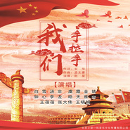
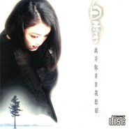

白雪
============================

|  |  |
| :--: | :-- |
| [ 白雪](https://i.xiami.com/bx) | **播放数**: 12761028 **粉丝数**: 2278 **评论数**: 70 **地区**: China 中国大陆 **风格**: 流行 Pop, 国语流行 Mandarin Pop  |

## 档案

白雪，1975年2月28日出生于浙江温州，中国青年女歌手，中国人民解放军总政歌舞团独唱演员，全国青联委员。代表作品有《每一次幸福》、《千古绝唱》、《白雪》、《女人心女人梦》等。 
小档案 
中文名：白雪 
国籍：中国 
民族：汉 
身高：170cm 
血型：O型 
星座：双鱼座 
生日：1975年2月28日 
出生地：浙江温州 
学历：大专 
初次登台：5岁 
口头禅：是不是 
最喜欢的歌手：蔡琴 
爱好：游泳、听音乐、和朋友聊天 
家庭成员：父、母、哥哥 
收集物品：手表、包、香水 
最喜爱的服装：体现个性的服装 
最喜欢的动物：兔子 
最爱吃的食物：海鲜 
最喜欢的颜色：白、黑 
最难忘的事：穿上军装 
最喜欢的电影：文艺片、动画片 
最喜欢的花：玫瑰 
最喜欢的季节：秋天 
最大的心愿：开个人演唱会 
最遗憾的事：学习的机会不多 
最喜爱的演员：山口百惠 
最喜欢的城市：香港 
主要成就：94年中国流行音乐风云歌手奖、上海94年度“上海大世界之星”、96年中国流行音乐十年歌手成就奖 
从艺经历 
1987年考上浙江温州乐清县小百花越剧团，在团里唱小生 
1991年考上浙江军区文工团，做了一名歌唱演员。由学戏改为演唱，颇费了一番工夫。马剑老师是她学唱歌的启蒙老师，对她走上歌坛的道路起了引路作用 
1992年全军排演大型歌剧《军魂》，总政在全国各军区文工团挑演员，白雪很幸运地被选中参加《军魂》的演出 
1992年获“检龙杯”青年歌手大奖赛特等奖 
1993年参加“中国风”演出团赴香港、新加坡、马来西亚等地演出 
1993年参加北京奥运会金曲百名歌星演唱会、纪念宋庆龄诞辰100周年大型晚会演出 
1993年由于白雪在《军魂》中的成功演出，总政前辈们慧眼识才，将她调入总政歌舞团，成为团里年龄最小的军旅歌手 
1993年8月中国青年歌手“英皇金融杯”电视大奖赛后，白雪与天星文化娱乐有限公司签约，成为公司旗下歌手。机遇一个接一个，使她周围的同龄人都羡慕的有点那个了 
1993年8月获中国青年歌手“英皇金融杯”电视大奖赛“钻石奖” 
1994年白雪考入解放军艺术学院音乐系，进修唱歌和音乐基础知识。又圆了她多年的梦 
1994年4月随中国艺术团出访欧洲八国演出，白雪是年龄最小的歌；7月出版第一张个人专辑《错位》；8月代表中国通俗歌手参加哈萨克斯坦举办的“亚洲之声”流行歌曲比赛荣获一等奖；12月《错位》获中国原创音乐第二次季选金奖 
1995年1月获辉煌94中国流行音乐电视大赛银奖；2月参加中央电视台春节晚会；3月获94年度“上海大世界之星”奖；3月随总政歌舞团赴缅甸演出；5月在天津参加第十二届“世界乒乓球锦标赛”开幕式演出；7月随中国艺术团赴哈萨克斯坦演出；8月单曲盒带《千古绝唱》发行；10月随二炮文工团赴香港演出；11月《久别的人》获鞍山经济广播电台主办的“95十大金曲”奖；12月北京音乐台在首都体育馆举办的音乐流行榜颁奖晚会上，《久别的人》、《你是我今生该等的人》荣获大奖；12月中央人民广播电台主办的大自然杯“第二届全国听众喜爱的歌手”颁奖晚会，白雪获“优秀奖”第一名；12月获山东省波士沙龙“95全国十大金曲十大歌星”奖 
1996年2月参加中央电视台春节晚会；5月随总政歌舞团赴香港演出；6月第二张个人专辑《离开你并非我愿意》发行；10月获山东省“96贵友杯十大歌手”奖；12月获96年度“全国听众最喜爱的歌手”通俗组银奖； 
1997年6月30日在北京参加迎香港回归大型文艺晚会；《拥抱祖国》作为全场演出的压轴节目；7月随中央慰问团参加内蒙古自治区成立50周年庆典活动；9月参加文化部主办的“97中国风”演出团赴香港演出；10月随总政歌舞团赴澳门演出 
1998年1月参加中央电视台春节晚会；2月参加中央电视台、北京电视台举行的“纪念周恩来100周年”大型演出活动；3月参加中国文联举办的“公仆赞”文化采风活动；5月参加总政歌舞团成立四十五周年大型晚会活动；6月参加中央电视台举办的《纪念田汉诞辰100周年》晚会演出；8月参加中央电视台“抗洪赈灾”义演晚会；9月参加中央电视台建台40周年台庆晚会；应邀成为金山词霸的形象代言人；参加中央电视台抗洪赈灾庆功晚会；10月随中央慰问团赴宁夏演出；参加总政治部抗洪赈灾庆功晚会；11月《红颜为谁》获98原创歌曲第三季度“十大金曲”奖；12月参加改革开放二十周年《春潮颂》晚会 
1999年1月第三张个人专辑《女人心女人梦》发行；《红颜为谁》荣获黄河杯98 (福建) 中国原创十大金曲奖；被选举为政协季员并参加北京市海淀区第六届一次政协会议奖 
1999年12月 作品《声声慢恋曲》获channel [v] 华语榜中榜'99最佳歌曲奖 
2000年 成为青联委员 
2001年11月 获国家广电部歌手

## 专辑

| 名称 | 语种 | 唱片公司 | 发行时间 | 专辑类别 | 专辑风格 |
| :--: | :-- | :-- | :-- | :-- | :-- |
| [ 爱的好盲目](./albums/5020616174.md) | 国语 | 龙乐世纪 | 2020年03月08日 | EP, 单曲 |  |
| [ 我们手拉手](./albums/2105904492.md) | 国语 | 千盛之星 | 2020年02月10日 | EP, 单曲 | 国语流行 Mandarin Pop |
| [ 不变的思念](./albums/2105194097.md) | 国语 | 龙乐世纪 | 2019年08月29日 | EP, 单曲 |  |
| [ 背影](./albums/5020616175.md) | 国语 | 龙乐文化 | 2019年08月22日 | EP, 单曲 |  |
| [ 习习春风](./albums/2104727135.md) | 国语 | 星外星音乐 | 2019年04月03日 | EP, 单曲 | 国语流行 Mandarin Pop |
| [ 歌者](./albums/2104665610.md) | 国语 | 龙乐世纪 | 2019年03月12日 | EP, 单曲 | 国语流行 Mandarin Pop |
| [ 永恒的军礼](./albums/2103773098.md) | 国语 | 龙乐世纪 | 2018年07月01日 | 录音室专辑 |  |
| [ 傲立天地间](./albums/2103513673.md) | 国语 | 龙乐世纪 | 2018年01月02日 | EP, 单曲 |  |
| [ 雪之恋](./albums/2102899977.md) | 国语 | 视星国际 | 2017年11月01日 | EP, 单曲 |  |
| [ 边关军魂](./albums/2102814372.md) | 国语 | 龙乐世纪 | 2017年08月18日 | EP, 单曲 |  |
| [ 朋友像杯酒](./albums/2102804981.md) | 国语 | Groover | 2017年07月29日 | EP, 单曲 |  |
| [ 天上之路](./albums/2102798932.md) | 国语 | 星外星音乐 | 2017年07月19日 | EP, 单曲 |  |
| [ 咱是一家人](./albums/2102780960.md) | 国语 | 因悦文化 | 2017年07月06日 | EP, 单曲 |  |
| [ 大爱广州](./albums/2102705700.md) | 国语 | 独立发行 | 2017年03月07日 | EP, 单曲 | 国语流行 Mandarin Pop |
| [ 朋友像杯酒](./albums/2102711048.md) | 国语 | 星艺源唱片 | 2017年03月06日 | EP, 单曲 |  |
| [ 秋水红颜](./albums/2102675827.md) | 国语 | 因悦文化 | 2017年01月04日 | EP, 单曲 |  |
| [ 等你一万年](./albums/2102671599.md) | 国语 | 龙乐世纪 | 2016年12月21日 | EP, 单曲 |  |
| [ 温州之恋](./albums/2100350342.md) | 国语 | 星外星音乐 | 2016年06月03日 | EP, 单曲 |  |
| [ 梦花期](./albums/5020645706.md) | 国语 | 龙乐世纪 | 2016年01月18日 | EP, 单曲 | 国语流行 Mandarin Pop |
| [ 暖色白雪情系家乡2015演唱会](./albums/5021856606.md) | 国语 |  | 2016年01月01日 | 现场专辑 |  |
| [ 望嫦娥](./albums/2102711042.md) | 国语 | 声宇听科技 | 2015年09月27日 | EP, 单曲 |  |
| [ 中国对联](./albums/523559634.md) | 国语 | 中韵娱乐 | 2015年02月10日 | EP, 单曲 |  |
| [ 倾城琵琶](./albums/1114733702.md) | 国语 | 因悦文化 | 2014年10月24日 | EP, 单曲 |  |
| [ 思乡](./albums/790808539.md) | 国语 | 百纳娱乐 | 2014年01月27日 | EP, 单曲 |  |
| [ 人人尽说江南好](./albums/2102711044.md) | 国语 | 酝星文化 | 2013年10月10日 | EP, 单曲 |  |
| [ 爱情花开](./albums/561295.md) | 国语 | 龙乐世纪 | 2012年12月05日 | 录音室专辑 |  |
| [ 草原春光](./albums/401962.md) | 国语 | 龙乐世纪 | 2010年09月05日 | EP, 单曲 |  |
| [ 如果爱还活着](./albums/1113862937.md) | 国语 | 广东音像 | 2010年04月13日 | 录音室专辑 |  |
| [ 祝福](./albums/355132.md) | 国语 | 天籁音典 | 2009年09月24日 | 录音室专辑 |  |
| [ 白雪越剧演唱专辑](./albums/5021855108.md) | 国语 | 浙江文艺音像 | 2009年04月23日 | 录音室专辑 |  |
| [ 每一次幸福](./albums/33099.md) | 国语 | 天籁音典 | 2007年12月28日 | 录音室专辑 |  |
| [ 我不想说再见 新歌+精选](./albums/6816.md) | 国语 | 杰盛唱片 | 2005年07月01日 | 精选集 | 国语流行 Mandarin Pop, 军旅歌曲 Military Songs |
| [ 白雪同名专辑](./albums/6817.md) | 国语 | 龙乐世纪 | 2003年02月01日 | 录音室专辑 |  |
| [ 女人心女人梦](./albums/6818.md) | 国语 | 天星文化 | 1999年01月01日 | 录音室专辑 | 国语流行 Mandarin Pop |
| [ 离开你并非我愿意](./albums/509769.md) | 国语 | 天星文化 | 1996年12月01日 | 录音室专辑 |  |
| [ 错位](./albums/6821.md) | 国语 | 龙乐世纪 | 1994年07月01日 | 录音室专辑 | 国语流行 Mandarin Pop, 俄罗斯流行 Russian Pop |

## 评论

|  |  |  |  |
| :-- | :-- | :-- | :-- |
|  [虾米用户](https://emumo.xiami.com/u/441009450) 莫愁前路无知己，天下谁人... 2020-11-17 04:25 赞(0) 踩(0) | 
白雪好漂亮，你们觉得呢？
 |
|  [虾米用户](https://emumo.xiami.com/u/280526227)  2020-11-14 14:27 赞(0) 踩(0) | 
没有真本事能进总政？
 |
|  [虾米用户](https://emumo.xiami.com/u/345180119)  2020-10-06 16:33 赞(0) 踩(0) | 
唱的真好!百听不厌。
 |
|  [虾米用户](https://emumo.xiami.com/u/426587524) 好想唱好歌却不会唱 2020-06-05 08:28 赞(0) 踩(0) | 
灵魂歌手
 |
|  [虾米用户](https://emumo.xiami.com/u/429565915)  2020-03-20 22:35 赞(0) 踩(0) | 
还是战士的时候还在旃坛寺大院给我签过名呢
 |
| ⇒ |  [虾米用户](https://emumo.xiami.com/u/429565915)  2020-03-20 22:37 赞(0) 踩(0) | 
时间真是把杀猪刀，如今我都快奔五了，但喜白雪的歌从未改变过
 |
|  [虾米用户](https://emumo.xiami.com/u/425659270)  2020-02-23 21:47 赞(2) 踩(0) | 
还记得以前有白雪的专辑磁带，听了好多遍；工作后听得比较少了，但现在一听到她的歌，就想到那些青春岁月，，喜欢白雪的歌～～～
 |
|  [虾米用户](https://emumo.xiami.com/u/425170111) 腐尸上开出的黑玫瑰，让人... 2020-02-13 11:44 赞(0) 踩(0) | 
要购买才能播放，我已经取消关注了
 |
|  [虾米用户](https://emumo.xiami.com/u/434569411)  2019-12-26 05:12 赞(2) 踩(0) | 
人好看歌好听
 |
|  [虾米用户](https://emumo.xiami.com/u/345314591) 一个人看星空，生活不易善... 2019-12-04 05:41 赞(1) 踩(0) | 
好听
 |
|  [虾米用户](https://emumo.xiami.com/u/240603088)  2019-11-28 17:15 赞(2) 踩(0) | 
以前听过的“久别的人”，“千古绝唱”旋律记忆犹新   
 |
|  [虾米用户](https://emumo.xiami.com/u/356595591)  2019-10-18 11:05 赞(1) 踩(0) | 
好听！
 |
|  [虾米用户](https://emumo.xiami.com/u/255015298) 河南漯河烟厂花园。初见那... 2019-10-17 02:37 赞(2) 踩(0) | 
每次听到你的那些老歌，仿佛回到了自己二十年前的少年时光……
 |
|  [虾米用户](https://emumo.xiami.com/u/48860460) 希望我他的感受温暖的家 2019-09-12 12:34 赞(2) 踩(0) | 
本来你穿的很漂亮，又很好听，可以去上舞台的，很期待你
 |
|  [虾米用户](https://emumo.xiami.com/u/410187054)  2019-09-04 11:54 赞(0) 踩(0) | 
我来了
 |
|  [虾米用户](https://emumo.xiami.com/u/245443765)  2019-09-01 21:24 赞(0) 踩(0) | 

 |
|  [虾米用户](https://emumo.xiami.com/u/1358999)   2019-08-20 19:13 赞(3) 踩(0) | 
白雪，1975年2月28日出生于浙江温州，中国青年女歌手，中央军委政治工作部歌舞团独唱演员，全国青联委员。主要作品有《每一次幸福》、《千古绝唱》、《白雪》、《女人心女人梦》等。
 |
|  [虾米用户](https://emumo.xiami.com/u/1358999)   2019-08-20 19:11 赞(0) 踩(0) | 
白雪，1975年2月28日出生于浙江温州，中国青年女歌手，中央军委政治工作部歌舞团独唱演员，全国青联委员。主要作品有《每一次幸福》、《千古绝唱》、《白雪》、《女人心女人梦》等。
 |
|  [虾米用户](https://emumo.xiami.com/u/376923626)  2019-08-17 21:05 赞(1) 踩(0) | 
喜欢你的歌
 |
|  [虾米用户](https://emumo.xiami.com/u/15441048) 音乐是灵魂的一种体现! 2019-05-20 23:49 赞(1) 踩(0) | 
歌唱家哦！我一直都很喜欢你的样子和歌声
 |
|  [虾米用户](https://emumo.xiami.com/u/422839015)  2019-05-07 22:00 赞(0) 踩(0) | 
你歌唱的《妻子》，听起来感觉稳稳当当，曲调很美 
 |
|  [虾米用户](https://emumo.xiami.com/u/597178) 今天等我来，就让 2019-05-01 12:06 赞(2) 踩(0) | 
久别的人最好听
 |
|  [虾米用户](https://emumo.xiami.com/u/346015057)  2019-04-20 11:52 赞(2) 踩(0) | 
希望你重新录制一些流行的老歌，配上现在的音效，期待。   
 |
|  [虾米用户](https://emumo.xiami.com/u/289862128) 谢谢虾米每天的陪伴 2019-03-05 07:53 赞(1) 踩(0) | 
喜欢这首歌，现在为什么不让我听完整的歌。
 |
|  [虾米用户](https://emumo.xiami.com/u/350731531)  2019-02-16 18:59 赞(1) 踩(0) | 
升
 |
|  [虾米用户](https://emumo.xiami.com/u/375733226)  2019-01-31 09:06 赞(0) 踩(0) | 
我也是2月28日的生日
 |
|  [虾米用户](https://emumo.xiami.com/u/412521662)  2019-01-22 21:08 赞(2) 踩(0) | 
很喜白雪的歌！白老师也是我喜欢的歌星！
 |
|  [虾米用户](https://emumo.xiami.com/u/235170316)  2019-01-19 22:37 赞(0) 踩(0) | 
白老师你来过我们单位！我还和你合过影
 |
|  [虾米用户](https://emumo.xiami.com/u/404990871)  2019-01-19 21:21 赞(2) 踩(0) | 
喜欢白雪的形象，喜欢白雪的音乐。
 |
|  [虾米用户](https://emumo.xiami.com/u/367278773) 我只喜欢回忆…… 2019-01-15 18:45 赞(1) 踩(0) | 
年轻时候 ，好美 ！ 
 |
|  [虾米用户](https://emumo.xiami.com/u/409918609) 王国庆 2019-01-15 14:43 赞(0) 踩(0) | 
白雪人如其名歌如其名白雪妹妹庆国王顶你❤♥♥❤❤♥✈✈✈⭐⭐⭐⭐⭐⭐⭐⭐⭐⭐庆国王王国庆19-1-15字♥❤
 |
|  [虾米用户](https://emumo.xiami.com/u/282022014) 音樂………………：人類自... 2019-01-12 09:16 赞(1) 踩(0) | 
盡在點評中，盡在不言中………………………………
 |
|  [虾米用户](https://emumo.xiami.com/u/38507594)  2018-12-31 21:42 赞(1) 踩(0) | 
这首歌对我有着特别的意义～～尤其是白雪的演唱更深情更动人～～很喜欢……
 |
|  [虾米用户](https://emumo.xiami.com/u/408215650) 每天听音乐能陶冶情操 2018-12-22 09:36 赞(1) 踩(0) | 
好听
 |
|  [虾米用户](https://emumo.xiami.com/u/32126406) 身体住了个老灵魂 2018-12-12 02:32 赞(1) 踩(0) | 
声音跟毛阿敏一样有一种大气哈哈哈~
 |
|  [虾米用户](https://emumo.xiami.com/u/44848026) 暂无签名~ 2018-10-20 21:59 赞(1) 踩(0) | 
老歌儿很好听。
 |
|  [虾米用户](https://emumo.xiami.com/u/319243709) 清新呼吸，云游霄外 2018-07-08 17:28 赞(3) 踩(0) | 
军中百灵，荡气回肠，正气满满!
 |
|  [虾米用户](https://emumo.xiami.com/u/239721859)  2018-07-02 15:33 赞(1) 踩(0) | 
白洁无瑕，晶莹如雪，冷若一冬冰霜，篱落纷纷满人间。
 |
|  [虾米用户](https://emumo.xiami.com/u/339321252)  2018-04-18 10:34 赞(3) 踩(0) | 
初次听是千古绝唱，受父辈影响，自己也喜欢听经典，现在的音乐节奏感太快，，找不到原来的感觉。
 |
|  [虾米用户](https://emumo.xiami.com/u/5531646) 我还没想好要写什么... 2018-03-16 20:05 赞(1) 踩(0) | 
推荐哎呀
 |
|  [虾米用户](https://emumo.xiami.com/u/315736618)  2017-08-16 13:09 赞(1) 踩(0) | 

 |
|  [虾米用户](https://emumo.xiami.com/u/230023195) 一本正经，一日千里，弱水... 2017-08-05 12:16 赞(3) 踩(0) | 
我觉得她唱的比较古老，我能看出来她在认真的唱歌。
 |
| ⇒ |  [虾米用户](https://emumo.xiami.com/u/9566654)  2020-04-14 21:16 赞(0) 踩(0) | 
这叫古典温婉懂么
 |
|  [虾米用户](https://emumo.xiami.com/u/311438900) 井无压力不出水，人无压力... 2017-07-11 21:19 赞(3) 踩(0) | 
白雪就是为人比较低调她也很有名的好吗！
 |
|  [虾米用户](https://emumo.xiami.com/u/311438900) 井无压力不出水，人无压力... 2017-07-11 21:18 赞(2) 踩(0) | 
喜欢她很久了！
 |
|  [虾米用户](https://emumo.xiami.com/u/84946968) 春天该很好，你若尚在场 2017-05-07 19:53 赞(1) 踩(0) | 
古典美的感觉。喜欢。
 |
|  [虾米用户](https://emumo.xiami.com/u/287581364)  2017-04-09 23:34 赞(2) 踩(0) | 
越看越美，越听越想
 |
|  [虾米用户](https://emumo.xiami.com/u/277086695)  2017-03-01 20:40 赞(3) 踩(0) | 
人美，歌也美
 |
|  [虾米用户](https://emumo.xiami.com/u/275771536)  2017-02-25 09:19 赞(2) 踩(0) | 
非常好听
 |
|  [虾米用户](https://emumo.xiami.com/u/97747450) 我还没想好要写什么... 2016-08-25 00:13 赞(0) 踩(0) | 
db13
 |
|  [虾米用户](https://emumo.xiami.com/u/12716819) 随(欲)遇而安 2015-08-23 00:37 赞(2) 踩(0) | 
见于不见，高中时喜欢的一首歌。
 |
|  [虾米用户](https://emumo.xiami.com/u/12543659)  2015-08-22 21:16 赞(1) 踩(0) | 
2015年cctv我是一个兵八一特别节目，听她歌唱二小放牛郎，被震撼了，如此忧伤而美丽的旋律，反复听了n遍，特地找来留念
 |
|  [虾米用户](https://emumo.xiami.com/u/10543171)  2015-01-05 16:47 赞(1) 踩(0) | 
头像美爆了有没有
 |
|  [虾米用户](https://emumo.xiami.com/u/17777300)   2014-09-19 23:09 赞(1) 踩(0) | 
这么好的歌手 强烈推荐
 |
|  [虾米用户](https://emumo.xiami.com/u/3246148)  2014-07-15 23:06 赞(1) 踩(0) | 
相貌真的仙女似的被军旅歌手的身份限制了不过她这一代的通俗歌手也没几个混出来的
 |
| ⇒ |  [虾米用户](https://emumo.xiami.com/u/9566654)  2020-05-24 00:03 赞(0) 踩(0) | 
是的，本来她也是和孙悦陈琳甘萍同时期出道的国内顶级女歌手，就是因为军旅歌手军人歌唱家身份限制她的音乐受众关注度，限制她的「红」了
 |
|  [虾米用户](https://emumo.xiami.com/u/11069474)   2014-06-29 14:31 赞(1) 踩(0) | 
见与不见~~ 很久以前还在看MTV音悦台的时候听到就觉得很好听的歌诶~~
 |
|  [虾米用户](https://emumo.xiami.com/u/16263850) 下架鸡柳的肯德基不迷人了... 2014-03-05 09:47 赞(1) 踩(0) | 
居然还在出专辑，赞一个!
 |
|  [虾米用户](https://emumo.xiami.com/u/5998313) 杏花春雨江南。 2013-05-11 01:50 赞(1) 踩(0) | 
很可惜白雪就是红不起来！
 |
|  [虾米用户](https://emumo.xiami.com/u/63912) 每个人的一生都是一次远行 2012-07-24 19:35 赞(1) 踩(0) | 
白雪演唱的动画片哈哈镜花缘的片尾曲“漂泊走过天北地南”很不错，给我童年留下了深刻的印象，可惜虾米上没有这首歌。
 |
|  [虾米用户](https://emumo.xiami.com/u/2738434) 我还没想好要写什么... 2012-04-29 20:45 赞(0) 踩(0) | 
很不错的大陆女歌手！！！
 |
|  [虾米用户](https://emumo.xiami.com/u/4863684) 凡夫俗子…… 2011-11-15 17:51 赞(1) 踩(0) | 
不过，还是喜欢她的老歌。新歌貌似很‘水’，有些为了唱而唱的意味……
 |
| ⇒ |  [虾米用户](https://emumo.xiami.com/u/7097413)  2016-03-21 14:16 赞(0) 踩(0) | 
同感
 |
|  [虾米用户](https://emumo.xiami.com/u/4863684) 凡夫俗子…… 2011-11-15 17:51 赞(1) 踩(0) | 
歌曲很有女人味，嗓音里弥漫着些女人的幽怨，是一种特有的心思。让人着迷……
 |
|  [虾米用户](https://emumo.xiami.com/u/4257990)  2011-06-15 01:24 赞(0) 踩(0) | 
喜欢
 |
|  [虾米用户](https://emumo.xiami.com/u/3395113)   2011-04-24 22:18 赞(0) 踩(0) | 
歌还中听
 |
|  [虾米用户](https://emumo.xiami.com/u/196704)  2011-02-13 14:09 赞(1) 踩(0) | 
一上网就看到这么欢乐的文章，兄弟我不禁虎躯一震。我以前现在将来都不认识作者自插双目，扶墙而出
 |
|  [虾米用户](https://emumo.xiami.com/u/2172218)  2011-02-02 16:52 赞(0) 踩(0) | 
老歌迷
 |
|  [虾米用户](https://emumo.xiami.com/u/1342581)  2011-01-27 03:46 赞(1) 踩(0) | 
白雪
 |
|  [虾米用户](https://emumo.xiami.com/u/479448)   2011-01-02 19:37 赞(1) 踩(0) | 
我还以为她早都退出娱乐圈了呢，原来还在出专辑啊……
 |
