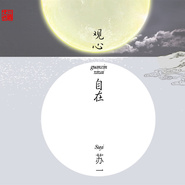

观心自在
============================

|  |  |
| :--: | :-- |
| [ 观心自在](https://emumo.xiami.com/album/2100362290) | **艺人**: [苏一](../index.md) **语种**: 国语 **唱片公司**: 闽艺文化 **发行时间**: 2016年07月01日 **专辑类别**: 录音室专辑 **专辑风格**:  **播放数**: 1080759 **收藏数**: 339 **评论数**: 20  |

## 简介

禅曲质朴脱俗,淡雅自然,别出心裁。  
2016年6月发行的苏一最新专辑《观心自在》,专辑是由苏一、卞舸、张轲等一些年轻有为的作曲家和演奏家创作演绎的原创音乐作品,以箫笛、琴筝为主要演奏乐器,淡雅自然,别出心裁。苏一,一位从生活到创作,从音乐到理想,都以无所求的初心投入,突破自我,也正因此,创造了更多自我,也成就今天更纯粹的“苏一”。现今的他已经不刻意去追求什么,想要什么,在当下这一刻,已然找到自己心灵的归属,从苏一的作品中总是能够聆听到生命的真谛。  
《观心自在》禅曲质朴脱俗,宁静清新,钢琴的轻缓中流露出一种隐逸,以笛箫纤细的音色修饰,蕴涵着清幽与宁静,如中国水墨山水淡淡写意,使人走入无边的善境,有当下的觉悟、欢喜、自在。在渐行渐远的光阴中,在起心动念之间,悟得“生活亦是最美的修行”。一曲禅音,一杯清茶,静下来,触摸自己的心灵,停下脚步,流连因匆忙而错过的风景。相信,你一定会喜欢苏一,喜欢听他的禅音,会喜欢上他那一尘不染的音符,超凡脱俗的音色,闭目聆听,让他带你进入空虚缥缈的音乐世界。这是一种奇妙的体验,如行云流水,豁然清朗。

## 曲目

## 评论

|  |  |  |
| :-- | :-- | :-- |
|  [虾米用户](https://emumo.xiami.com/u/7643438)  2020-04-06 14:22 赞(0) 踩(0) | 
令人心旷神怡的音乐，谢谢你…∩_∩
 |
|  [虾米用户](https://emumo.xiami.com/u/376906274) 馀音绕梁 以飨同道  2020-03-03 08:33 赞(0) 踩(0) | 
了然于心
 |
|  [虾米用户](https://emumo.xiami.com/u/406506471)  2020-02-15 11:19 赞(0) 踩(0) | 
清净清静
 |
|  [虾米用户](https://emumo.xiami.com/u/3279638)  2020-01-14 08:22 赞(0) 踩(0) | 
好听
 |
|  [虾米用户](https://emumo.xiami.com/u/426620843) 我还没想好要写什么... 2019-09-14 12:11 赞(0) 踩(0) | 

 |
|  [虾米用户](https://emumo.xiami.com/u/350963146)  2019-08-31 05:33 赞(0) 踩(0) | 
空灵之气
 |
|  [虾米用户](https://emumo.xiami.com/u/320956595)  2019-08-14 16:59 赞(0) 踩(0) | 
静净敬的用心之作   
 |
|  [虾米用户](https://emumo.xiami.com/u/334659918)  2019-06-19 06:04 赞(1) 踩(0) | 
平心静气，观自在！
 |
|  [虾米用户](https://emumo.xiami.com/u/323717973) 记住，通往神殿的入口就在... 2019-05-25 13:34 赞(0) 踩(0) | 
好听 漂亮  解忧
 |
|  [虾米用户](https://emumo.xiami.com/u/95415384) 享生命之安然 2019-04-05 12:17 赞(2) 踩(0) | 
静心 清心 最宜清明时节追忆故去的亲人……
 |
|  [虾米用户](https://emumo.xiami.com/u/1889616)  2019-02-05 15:08 赞(0) 踩(0) | 
好
 |
|  [虾米用户](https://emumo.xiami.com/u/260390040)  2019-01-12 12:39 赞(0) 踩(0) | 
太好听，干净，静心
 |
|  [虾米用户](https://emumo.xiami.com/u/4240438) 太古道音～ 2018-11-27 22:02 赞(0) 踩(0) | 
此辑大善。苏一与杨青有张古琴合集《半山听雨》☔️
 |
|  [虾米用户](https://emumo.xiami.com/u/11424348) 每一刻都是深情的告别—-... 2018-07-14 10:37 赞(0) 踩(0) | 
绝对支持！非常美！
 |
|  [虾米用户](https://emumo.xiami.com/u/13039372) 燕燕于飞，颉之颃之 2018-01-22 11:15 赞(0) 踩(0) | 
支持，喜欢，正在练习游子念母
 |
|  [虾米用户](https://emumo.xiami.com/u/6610459)  2017-10-17 14:36 赞(1) 踩(0) | 
【游子念母】此曲在箫声和笛声中融入游子的思念、渗透母爱的缠绵。它像是一曲游子心中之歌，丝丝缕缕，绵绵不绝；又像是一首田园诗，隽永秀美，和雅清淡；更像是一阵和煦的风，吹去朔雪纷飞，带来春光无限。期盼新作！
 |
|  [虾米用户](https://emumo.xiami.com/u/40197373) 随遇而安 2016-08-06 19:58 赞(1) 踩(0) | 
全集都是师哥吹的、望大家多多支持
 |
|  [虾米用户](https://emumo.xiami.com/u/40197373) 随遇而安 2016-08-06 19:57 赞(1) 踩(0) | 
全集都是师哥吹的、望大家多多支持
 |
|  [虾米用户](https://emumo.xiami.com/u/9584334) ~ 2016-07-20 21:58 赞(1) 踩(0) | 
（观心自在）、（游子念母）这两支曲子美得天上人间的 
 |
|  [虾米用户](https://emumo.xiami.com/u/40308637)   2016-07-20 18:31 赞(1) 踩(0) | 
心灵，心静，爱上
 |
