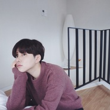
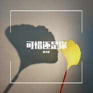
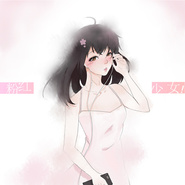
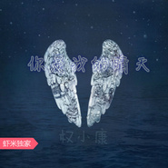
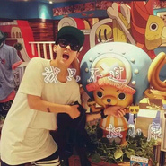

权小康
============================

|  |  |
| :--: | :-- |
| [ 权小康](https://i.xiami.com/qxk) | **地区**: China 中国大陆 **风格**: 流行说唱 Pop Rap, 独立流行 Indie Pop, 国语流行 Mandarin Pop, 电音流行 Electropop **播放数**: 4363140 **粉丝数**: 765 **评论数**: 103  |

## 档案

权小康，大陆/男/歌手，代表作品《完美句点》。 从艺历程：2016年03月，花儿朵朵网络海选西安区50强 2016年03月，珊瑚虫之声网络电台专访。 2016年04月，做客OnlyRadio唯音网络电台。 荣誉记录：花儿朵朵网络海选西安区50强，

## 专辑

| 名称 | 语种 | 唱片公司 | 发行时间 | 专辑类别 | 专辑风格 |
| :--: | :-- | :-- | :-- | :-- | :-- |
| [ 我爱她](./albums/5022238384.md) | 国语 | 独立发行 | 2020年12月21日 | EP, 单曲 | 国语流行 Mandarin Pop |
| [ 别让我忘不掉](./albums/2100270566.md) | 国语 | 独立发行 | 2020年11月16日 | 精选集 | 国语流行 Mandarin Pop, 电音流行 Electropop, 华语唱作人 Chinese Singer-Songwriter |
| [ 是我一人放不下](./albums/5021593076.md) | 国语 | 独立发行 | 2020年10月02日 | EP, 单曲 | 流行 Pop, 国语流行 Mandarin Pop |
| [ 24°7](./albums/5021549114.md) | 国语 | 独立发行 | 2020年09月27日 | EP, 单曲 | 国语流行 Mandarin Pop, 流行说唱 Pop Rap |
| [ 24.7](./albums/5021540130.md) | 国语 | 独立发行 | 2020年09月27日 | EP, 单曲 | 回响贝斯 Dubstep, 轻音乐流行 Light Pop, 电音流行 Electropop |
| [ 可惜还是你](./albums/2105538366.md) | 国语 |  | 2019年12月11日 | EP, 单曲 | 粤语流行 Cantopop, 电子舞曲 EDM / Electronic Dance Music |
| [ 分裂症](./albums/2105221236.md) | 国语 |  | 2019年09月06日 | EP, 单曲 | 国语流行 Mandarin Pop, 流行说唱 Pop Rap, 电子 Electronic |
| [ 玩弄](./albums/2104896873.md) | 国语 |  | 2019年05月24日 | EP, 单曲 | 流行 Pop, 电音流行 Electropop, 国语流行 Mandarin Pop |
| [ 完美句点](./albums/2104451451.md) | 国语 |  | 2019年01月06日 | 精选集 | 电音流行 Electropop, 网络流行 Cyber Hit, 国语流行 Mandarin Pop |
| [ 我的女孩](./albums/2104442355.md) | 国语 |  | 2019年01月03日 | EP, 单曲 | 国语流行 Mandarin Pop |
| [ 病变](./albums/2103509222.md) | 国语 | 独立发行 | 2018年01月31日 | EP, 单曲 | 流行 Pop, 流行说唱 Pop Rap, 国语流行 Mandarin Pop |
| [ 粉色少女](./albums/2103502289.md) | 国语 | 独立发行 | 2018年01月27日 | EP, 单曲 | 流行 Pop, 电音流行 Electropop, 国语流行 Mandarin Pop |
| [ 80000（Cover PRC 巴音汗）](./albums/2102968573.md) | 国语 | 独立发行 | 2017年12月06日 | EP, 单曲 | 国语流行 Mandarin Pop, 流行 Pop, 流行说唱 Pop Rap |
| [ 权小康翻唱集](./albums/2102855972.md) | 国语 | 独立发行 | 2017年09月13日 | 精选集 | 国语流行 Mandarin Pop, 流行说唱 Pop Rap, 嘻哈 Hip-Hop |
| [ 坚持](./albums/2102815151.md) | 国语 | 独立发行 | 2017年08月17日 | EP, 单曲 | 国语流行 Mandarin Pop, 流行说唱 Pop Rap, 电音流行 Electropop |
| [ 是的没有错](./albums/2102807521.md) | 国语 | 独立发行 | 2017年08月03日 | EP, 单曲 | 国语流行 Mandarin Pop, 电音流行 Electropop, 流行说唱 Pop Rap |
| [ 又一首串烧](./albums/2102761657.md) | 国语 | 独立发行 | 2017年06月08日 | EP, 单曲 | 流行 Pop, 电音流行 Electropop |
| [ 告诉她](./albums/2102640648.md) | 国语 |  | 2016年10月29日 | 精选集 | 国语流行 Mandarin Pop |
| [ 还魂门还魂门](./albums/2102400923.md) | 国语 |  | 2016年09月15日 | 古典音乐 |  |
| [ 电视剧《老九门》主题曲还魂门](./albums/2102400780.md) | 国语 |  | 2016年09月14日 | 录音室专辑 |  |
| [ 想念你](./albums/2100319472.md) | 国语 | 独立发行 | 2016年04月21日 | EP, 单曲 |  |
| [ 完美句点](./albums/2100301986.md) | 国语 | 独立发行 | 2016年03月28日 | EP, 单曲 | 国语流行 Mandarin Pop |
| [ 是我放不下](./albums/2100266714.md) | 国语 | 独立发行 | 2016年01月27日 | EP, 单曲 | 国语流行 Mandarin Pop, 电音流行 Electropop |
| [ 你是我的晴天](./albums/2100253452.md) | 国语 | 独立发行 | 2016年01月01日 | EP, 单曲 | 流行说唱 Pop Rap, 国语流行 Mandarin Pop, 华语唱作人 Chinese Singer-Songwriter |
| [ 饶舌串烧说唱串烧](./albums/2100250280.md) | 国语 | 独立发行 | 2015年12月24日 | EP, 单曲 | 流行说唱 Pop Rap, 独立电子乐 Indietronica, 国语流行 Mandarin Pop |
| [ 一次就好《一次就好》](./albums/2100246750.md) | 国语 | 独立发行 | 2015年12月15日 | EP, 单曲 | 国语流行 Mandarin Pop |
| [ 就此别过](./albums/2100234236.md) | 国语 | 权小康 | 2015年11月09日 | EP, 单曲 | 独立流行 Indie Pop, 国语流行 Mandarin Pop, 电音流行 Electropop |
| [ 笑看红尘](./albums/2100234232.md) | 国语 | 独立发行 | 2015年11月08日 | EP, 单曲 | 现代古典 Modern Classical, 国语流行 Mandarin Pop, 电音流行 Electropop |
| [ 我只不过只不过](./albums/2100234230.md) | 国语 | 独立发行 | 2015年11月08日 | EP, 单曲 | 流行说唱 Pop Rap, 国语流行 Mandarin Pop, 电音流行 Electropop |

## 评论

|  |  |  |
| :-- | :-- | :-- |
|  [虾米用户](https://emumo.xiami.com/u/358104299) 悲观的唯心存在现实解构虚... 2021-01-04 11:55 赞(0) 踩(0) | 
45308
 |
|  [虾米用户](https://emumo.xiami.com/u/432749698) 为一首歌下一个app 2019-11-29 13:03 赞(2) 踩(0) | 
很支持你，从酷狗到虾米，不过我觉得你不用电音更好听
 |
|  [虾米用户](https://emumo.xiami.com/u/170744720)  2019-08-15 23:03 赞(2) 踩(0) | 
康哥你要记住你是艺人
 |
|  [虾米用户](https://emumo.xiami.com/u/343013087)  2019-06-29 16:30 赞(1) 踩(0) | 
喜欢你的声音，心动的声音   
 |
|  [虾米用户](https://emumo.xiami.com/u/328867160) 你一直都是我心中不可触碰... 2019-06-03 13:06 赞(2) 踩(0) | 
表白  
 |
|  [虾米用户](https://emumo.xiami.com/u/293692544) 你敢给我说话吗？我咬你 2019-04-18 05:17 赞(2) 踩(0) | 
好听
 |
|  [虾米用户](https://emumo.xiami.com/u/293692544) 你敢给我说话吗？我咬你 2019-03-27 05:16 赞(2) 踩(0) | 
好听
 |
|  [虾米用户](https://emumo.xiami.com/u/366411967)  2019-03-15 17:42 赞(2) 踩(0) | 
好听啊
 |
|  [虾米用户](https://emumo.xiami.com/u/293692544) 你敢给我说话吗？我咬你 2019-02-12 17:46 赞(2) 踩(0) | 
好听
 |
|  [虾米用户](https://emumo.xiami.com/u/358617829) 听着喜欢的歌是最幸福的事... 2019-02-01 17:50 赞(2) 踩(0) | 
唯美主义
 |
|  [虾米用户](https://emumo.xiami.com/u/354584947)  2018-10-07 21:23 赞(2) 踩(0) | 
别管别人怎么说喜欢就唱吧！唱的还可以
 |
|  [虾米用户](https://emumo.xiami.com/u/358835633)  2018-09-17 10:28 赞(2) 踩(0) | 
好听～
 |
|  [虾米用户](https://emumo.xiami.com/u/293692544) 你敢给我说话吗？我咬你 2018-08-29 05:06 赞(2) 踩(0) | 
好听
 |
|  [虾米用户](https://emumo.xiami.com/u/293692544) 你敢给我说话吗？我咬你 2018-08-24 05:06 赞(2) 踩(0) | 
好听
 |
|  [虾米用户](https://emumo.xiami.com/u/38615745) 如果你感到辛苦，就来我怀... 2018-05-22 11:18 赞(2) 踩(0) | 
加油～～～～
 |
| ⇒ |  [虾米用户](https://emumo.xiami.com/u/48183995) 音乐人 2018-05-25 01:50 赞(0) 踩(0) | 
嗯呐
 |
|  [虾米用户](https://emumo.xiami.com/u/364672360) 越努力，越幸运! 2018-05-08 13:04 赞(2) 踩(0) | 
好帅
 |
|  [虾米用户](https://emumo.xiami.com/u/363836074)  2018-05-05 21:45 赞(2) 踩(0) | 
      
 |
|  [虾米用户](https://emumo.xiami.com/u/363836074)  2018-05-05 21:44 赞(2) 踩(0) | 
在创作首歌曲  
 |
|  [虾米用户](https://emumo.xiami.com/u/355491532) 挚爱挚爱 2018-04-23 19:19 赞(2) 踩(0) | 
    
 |
|  [虾米用户](https://emumo.xiami.com/u/344361598)  2018-04-14 07:28 赞(2) 踩(0) | 
太好听了，加油↖(^&amp;omega;^)↗
 |
|  [虾米用户](https://emumo.xiami.com/u/354287566) 减肉关注私聊我，我这还卖... 2018-03-30 10:09 赞(3) 踩(0) | 
唱的很好听哟，加油↖(^&amp;omega;^)↗
 |
|  [虾米用户](https://emumo.xiami.com/u/352908053) 爱乐乐 2018-03-24 11:37 赞(3) 踩(0) | 
好听，加油哦！么么哒，  
 |
| ⇒ |  [虾米用户](https://emumo.xiami.com/u/48183995) 音乐人 2018-03-24 14:03 赞(0) 踩(0) | 
好哒
 |
|  [虾米用户](https://emumo.xiami.com/u/352610454)  2018-03-01 18:30 赞(3) 踩(0) | 
好听      
 |
| ⇒ |  [虾米用户](https://emumo.xiami.com/u/48183995) 音乐人 2018-03-24 14:04 赞(0) 踩(0) | 
谢谢 
 |
|  [虾米用户](https://emumo.xiami.com/u/347625273)  2018-02-27 22:47 赞(3) 踩(0) | 
他是个垃圾
 |
| ⇒ |  [虾米用户](https://emumo.xiami.com/u/352908053) 爱乐乐 2018-03-24 11:35 赞(0) 踩(0) | 
你是狗
 |
|  [虾米用户](https://emumo.xiami.com/u/347625273)  2018-02-27 22:45 赞(2) 踩(0) | 
他不如我爸师
 |
| ⇒ |  [虾米用户](https://emumo.xiami.com/u/352908053) 爱乐乐 2018-03-24 11:36 赞(0) 踩(0) | 
你妈
 |
| ⇒ |  [虾米用户](https://emumo.xiami.com/u/48183995) 音乐人 2018-03-24 14:04 赞(0) 踩(0) | 
嗯
 |
|  [虾米用户](https://emumo.xiami.com/u/337387550) 我最爱你了.mua 2018-01-28 12:35 赞(5) 踩(0) | 
很好听哦，小康，爱你哦 
 |
| ⇒ |  [虾米用户](https://emumo.xiami.com/u/347625273)  2018-02-27 22:46 赞(0) 踩(0) | 
爱个头
 |
|  [虾米用户](https://emumo.xiami.com/u/293692544) 你敢给我说话吗？我咬你 2018-01-28 08:07 赞(4) 踩(0) | 
好听
 |
|  [虾米用户](https://emumo.xiami.com/u/293692544) 你敢给我说话吗？我咬你 2018-01-23 05:21 赞(4) 踩(0) | 
好听
 |
|  [虾米用户](https://emumo.xiami.com/u/257994838)  2018-01-14 15:51 赞(3) 踩(0) | 
老哥说下完美句点的女声是谁呗
 |
|  [虾米用户](https://emumo.xiami.com/u/317909137) 错的不是我，错的是这个世... 2018-01-13 14:42 赞(3) 踩(0) | 
唱的很好听，加油！
 |
|  [虾米用户](https://emumo.xiami.com/u/337176910) 饿了，谁有吃的 2017-12-29 09:57 赞(4) 踩(0) | 
唱的还可以，加油吧
 |
|  [虾米用户](https://emumo.xiami.com/u/293567128)  2017-12-23 16:25 赞(2) 踩(0) | 

 |
| ⇒ |  [虾米用户](https://emumo.xiami.com/u/347625273)  2018-02-27 22:46 赞(0) 踩(0) | 
？
 |
|  [虾米用户](https://emumo.xiami.com/u/289872198)  2017-12-19 11:44 赞(4) 踩(0) | 
广告＋q小心被骗   本人被骗有截图为证
 |
|  [虾米用户](https://emumo.xiami.com/u/289872198)  2017-12-19 11:42 赞(3) 踩(0) | 
此人骗子一个 大家务必小心
 |
|  [虾米用户](https://emumo.xiami.com/u/93777188)  2017-12-17 22:03 赞(2) 踩(0) | 
额
 |
|  [虾米用户](https://emumo.xiami.com/u/289872198)  2017-12-17 15:51 赞(3) 踩(0) | 
&amp;hellip;
 |
|  [虾米用户](https://emumo.xiami.com/u/332408492) 0529 ❤ 储存男 嘴... 2017-12-15 20:41 赞(3) 踩(0) | 
你 真的是照片中的你吗
 |
|  [虾米用户](https://emumo.xiami.com/u/94118800)  2017-12-09 09:59 赞(3) 踩(0) | 
把电音去掉也是垃圾一个
 |
|  [虾米用户](https://emumo.xiami.com/u/315450951) 爱上一个人，恋上一座城 2017-11-16 18:44 赞(3) 踩(0) | 
不错不错！   
 |
|  [虾米用户](https://emumo.xiami.com/u/315243456) 别再折磨我了，我已经心碎... 2017-11-11 10:56 赞(3) 踩(0) | 
   
 |
| ⇒ |  [虾米用户](https://emumo.xiami.com/u/315243456) 别再折磨我了，我已经心碎... 2017-11-25 14:07 赞(0) 踩(0) | 
快告诉你把我喜欢你
 |
|  [虾米用户](https://emumo.xiami.com/u/332063560)  2017-10-28 11:43 赞(2) 踩(0) | 
 
 |
|  [虾米用户](https://emumo.xiami.com/u/314645186)  2017-10-14 10:16 赞(3) 踩(0) | 
 
 |
|  [虾米用户](https://emumo.xiami.com/u/323583586)  2017-10-04 14:13 赞(2) 踩(0) | 
不错哦，
 |
| ⇒ |  [虾米用户](https://emumo.xiami.com/u/48183995) 音乐人 2017-11-02 00:27 赞(0) 踩(0) | 
谢谢哈！
 |
|  [虾米用户](https://emumo.xiami.com/u/199298615) 一生一个黑暗倩迪 2017-09-29 00:11 赞(3) 踩(0) | 
希望有机会合唱一首
 |
| ⇒ |  [虾米用户](https://emumo.xiami.com/u/48183995) 音乐人 2017-11-02 00:26 赞(0) 踩(0) | 
可以哒
 |
|  [虾米用户](https://emumo.xiami.com/u/310079905) 凭什么你安慰别人起来头头... 2017-09-18 01:31 赞(2) 踩(0) | 
还好吧。
 |
|  [虾米用户](https://emumo.xiami.com/u/310050025)  2017-09-16 12:28 赞(2) 踩(0) | 
       
 |
|  [虾米用户](https://emumo.xiami.com/u/287310491) 听说你也喜欢那幽静小道的... 2017-09-14 17:31 赞(3) 踩(0) | 
你个狗曰的王八蛋唱的还不错吗！继续努力啊！让更多人关注你，成为你的粉丝哦！☺☺
 |
|  [虾米用户](https://emumo.xiami.com/u/243472098)  2017-09-13 07:53 赞(2) 踩(0) | 
棒棒哒 
 |
|  [虾米用户](https://emumo.xiami.com/u/243472098)  2017-09-13 07:53 赞(2) 踩(0) | 
棒棒的 
 |
|  [虾米用户](https://emumo.xiami.com/u/324209379)  2017-09-09 20:41 赞(2) 踩(0) | 
不错哦！继续加油 
 |
|  [虾米用户](https://emumo.xiami.com/u/311331748)  2017-09-03 11:41 赞(2) 踩(0) | 
加油哦，期待你的新歌
 |
|  [虾米用户](https://emumo.xiami.com/u/299960096) 敢来你就 2017-08-29 12:54 赞(2) 踩(0) | 
696
 |
|  [虾米用户](https://emumo.xiami.com/u/310773497) 权志龙我喜欢你 2017-08-08 13:57 赞(2) 踩(0) | 
哇，好听    
 |
|  [虾米用户](https://emumo.xiami.com/u/313994522)  2017-08-06 14:12 赞(2) 踩(0) | 
好听
 |
|  [虾米用户](https://emumo.xiami.com/u/312194969)  2017-07-23 12:24 赞(3) 踩(0) | 
好听
 |
|  [虾米用户](https://emumo.xiami.com/u/312001597)  2017-07-13 23:32 赞(2) 踩(0) | 
好好听哦
 |
|  [虾米用户](https://emumo.xiami.com/u/301198256)  2017-07-12 09:56 赞(1) 踩(0) | 
因为喜欢没有理由
 |
|  [虾米用户](https://emumo.xiami.com/u/300257249)  2017-06-04 17:15 赞(4) 踩(0) | 
QQ帅哥   
 |
| ⇒ |  [虾米用户](https://emumo.xiami.com/u/48183995) 音乐人 2017-06-08 04:01 赞(0) 踩(0) | 
296265619
 |
| ⇒ |  [虾米用户](https://emumo.xiami.com/u/300257249)  2017-06-08 14:21 赞(0) 踩(0) | 
<q><b>权小康说：</b></q>
 |
| ⇒ |  [虾米用户](https://emumo.xiami.com/u/363836074)  2018-05-05 21:45 赞(0) 踩(0) | 
还是累成
 |
|  [虾米用户](https://emumo.xiami.com/u/298635123) 曾经你说要一辈子，但你的... 2017-05-29 19:28 赞(1) 踩(0) | 
棒棒哒!
 |
|  [虾米用户](https://emumo.xiami.com/u/299810487)  2017-05-28 12:41 赞(1) 踩(0) | 
给个qq，   拜托
 |
| ⇒ |  [虾米用户](https://emumo.xiami.com/u/48183995) 音乐人 2017-06-08 04:02 赞(0) 踩(0) | 
QQ296265619
 |
|  [虾米用户](https://emumo.xiami.com/u/298563376)  2017-05-26 10:18 赞(1) 踩(0) | 
qq多少呀？
 |
|  [虾米用户](https://emumo.xiami.com/u/289170373) 且行且珍惜 2017-05-23 21:22 赞(1) 踩(0) | 
好好听
 |
|  [虾米用户](https://emumo.xiami.com/u/291438464)  2017-05-16 18:14 赞(1) 踩(0) | 
好好听
 |
|  [虾米用户](https://emumo.xiami.com/u/296400308)  2017-05-14 21:15 赞(1) 踩(0) | 
很好听
 |
|  [虾米用户](https://emumo.xiami.com/u/295645777) 徐静 2017-05-12 08:58 赞(0) 踩(0) | 
好听
 |
|  [虾米用户](https://emumo.xiami.com/u/279234176)  2017-04-07 13:37 赞(1) 踩(0) | 
好好   
 |
|  [虾米用户](https://emumo.xiami.com/u/16135450)  2017-04-01 21:45 赞(0) 踩(0) | 
9310
 |
|  [虾米用户](https://emumo.xiami.com/u/283232714)  2017-03-25 15:30 赞(0) 踩(0) | 
一次就好的图片可以保存吗？     永远支持你
 |
|  [虾米用户](https://emumo.xiami.com/u/279486669)  2017-03-18 02:43 赞(0) 踩(0) | 
fighting
 |
|  [虾米用户](https://emumo.xiami.com/u/281098664) 社会呵呵，看惯了 2017-03-17 19:59 赞(0) 踩(0) | 
好好听     爱你加油↖(^&amp;omega;^)↗
 |
|  [虾米用户](https://emumo.xiami.com/u/169920078)  2017-02-13 02:21 赞(0) 踩(0) | 
翻唱非主流
 |
|  [虾米用户](https://emumo.xiami.com/u/127288140)  2016-12-31 16:19 赞(0) 踩(0) | 
好听安
 |
|  [虾米用户](https://emumo.xiami.com/u/94167158)  2016-09-27 05:06 赞(0) 踩(0) | 
加油
 |
|  [虾米用户](https://emumo.xiami.com/u/216307756)  2016-08-22 10:13 赞(2) 踩(0) | 
你声音和威仔的好像
 |
|  [虾米用户](https://emumo.xiami.com/u/216307756)  2016-08-22 10:12 赞(0) 踩(0) | 
喜欢你
 |
|  [虾米用户](https://emumo.xiami.com/u/164697744)  2016-06-25 10:48 赞(1) 踩(0) | 
加油哦！支持 
 |
|  [虾米用户](https://emumo.xiami.com/u/148439788)  2016-06-04 09:19 赞(1) 踩(0) | 
声音好清澈……喜欢 希望可以出新歌……
 |
|  [虾米用户](https://emumo.xiami.com/u/29234061) 放弃一切  放空自我 2016-03-31 03:05 赞(1) 踩(0) | 
加油
 |
|  [虾米用户](https://emumo.xiami.com/u/30823372) 有音乐，有动漫，人生足矣 2015-11-11 06:21 赞(1) 踩(0) | 
支持!!
 |
| ⇒ |  [虾米用户](https://emumo.xiami.com/u/48183995) 音乐人 2015-11-11 11:11 赞(0) 踩(0) | 
嘿嘿
 |
|  [虾米用户](https://emumo.xiami.com/u/48183995) 音乐人 2015-11-06 15:57 赞(29) 踩(0) | 
我刚入驻了虾米音乐人，欢迎大家来我的个人主页，收听我的最新音乐
 |
| ⇒ |  [虾米用户](https://emumo.xiami.com/u/269302572) 啦啦啦，经过…… 2017-04-04 11:03 赞(0) 踩(0) | 
么么哒加油 
 |
| ⇒ |  [虾米用户](https://emumo.xiami.com/u/298563376)  2017-05-23 12:58 赞(0) 踩(0) | 
哦哦
 |
| ⇒ |  [虾米用户](https://emumo.xiami.com/u/327015398) 乐享音乐，乐享生活。 2017-10-04 11:15 赞(0) 踩(0) | 
还可以奥！
 |
| ⇒ |  [虾米用户](https://emumo.xiami.com/u/195079316) 我还没想好要写什么... 2017-11-21 18:42 赞(0) 踩(0) | 
第3张和第九张专辑封面是谁   求透露
 |
| ⇒ |  [虾米用户](https://emumo.xiami.com/u/317909137) 错的不是我，错的是这个世... 2018-01-13 14:41 赞(0) 踩(0) | 
好好听啊！
 |
| ⇒ |  [虾米用户](https://emumo.xiami.com/u/335759636)  2018-01-22 20:58 赞(0) 踩(0) | 
加油 很好听
 |
| ⇒ |  [虾米用户](https://emumo.xiami.com/u/170744720)  2019-08-15 23:02 赞(0) 踩(0) | 
为什么都是好听点歌就是火不了，你是音乐界惨的人
 |
