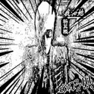

知夏
============================

|  |  |
| :--: | :-- |
| [ 知夏](https://i.xiami.com/yqg) | **地区**: China 中国大陆 **风格**: 流行摇滚 Pop Rock, 国语流行 Mandarin Pop **播放数**: 7812536 **粉丝数**: 264 **评论数**: 37  |

## 档案

知夏，独立音乐人。

## 专辑

| 名称 | 语种 | 唱片公司 | 发行时间 | 专辑类别 | 专辑风格 |
| :--: | :-- | :-- | :-- | :-- | :-- |
| [ 校园回忆](./albums/2104958470.md) | 国语 |  | 2019年08月25日 | 合集, 杂锦 | 流行 Pop |
| [ 让我留在你身边](./albums/2102755089.md) | 国语 | 金谷听文化 | 2017年05月20日 | 精选集 | 国语流行 Mandarin Pop |
| [ 其实不孤独](./albums/2102671767.md) | 国语 | 海蝶音乐, 致力音乐 | 2017年01月14日 | 合集, 杂锦 | 流行 Pop, 电音流行 Electropop |
| [ 快乐还是忧伤](./albums/2100287092.md) | 国语 | 致力音乐 | 2016年03月03日 | 精选集 | 国语流行 Mandarin Pop |
| [ 你的美丽泛滥成灾](./albums/531735019.md) | 国语 | 东方斯卡拉 | 2014年12月10日 | 原声带, 影视音乐 | 国语流行 Mandarin Pop |
| [ 我和她不熟](./albums/1424132501.md) | 国语 | 东方斯卡拉 | 2014年11月17日 | EP, 单曲 | 国语流行 Mandarin Pop |

## 评论

|  |  |  |
| :-- | :-- | :-- |
|  [虾米用户](https://emumo.xiami.com/u/445214819)  2020-10-05 11:28 赞(0) 踩(0) | 
'垃圾破音
 |
|  [虾米用户](https://emumo.xiami.com/u/379396429) 我还没想好要写什么... 2020-04-30 17:19 赞(0) 踩(0) | 
新一代电鳗？
 |
|  [虾米用户](https://emumo.xiami.com/u/402140806)  2020-03-18 18:00 赞(0) 踩(0) | 
很偶然听到你的声音，很喜欢你的声音。
 |
|  [虾米用户](https://emumo.xiami.com/u/419221286) 许我三千笔墨画你绝世容颜 2019-12-19 15:21 赞(0) 踩(0) | 
喜欢听你唱的歌
 |
|  [虾米用户](https://emumo.xiami.com/u/5424076) 咋个说？要签名？ 2019-10-14 07:45 赞(0) 踩(0) | 
什么玩意
 |
|  [虾米用户](https://emumo.xiami.com/u/351297883) 地球上的我们，一个在另一... 2019-07-13 17:54 赞(2) 踩(0) | 
好好听，      
 |
|  [虾米用户](https://emumo.xiami.com/u/407058716) 随寓而安，宁静致远！ 2019-04-17 22:13 赞(0) 踩(0) | 
还阔以啊！
 |
|  [虾米用户](https://emumo.xiami.com/u/358104299) 悲观的唯心存在现实解构虚... 2019-03-19 20:23 赞(0) 踩(0) | 
10417
 |
|  [虾米用户](https://emumo.xiami.com/u/312265424)  2018-06-03 20:35 赞(0) 踩(0) | 
好听
 |
|  [虾米用户](https://emumo.xiami.com/u/355707266) 想你了 2018-04-23 13:16 赞(1) 踩(0) | 
好听 
 |
|  [虾米用户](https://emumo.xiami.com/u/325889539) 這傢伙忙著吃肉肉，沒空留... 2018-04-22 17:47 赞(0) 踩(0) | 
喜歡你的聲音
 |
|  [虾米用户](https://emumo.xiami.com/u/30776425) SMOKE BOY 2018-04-10 00:27 赞(0) 踩(0) | 
为什么有些歌跟刘畅的声音一模一样&amp;hellip;&amp;hellip;虾米搞错了吗&amp;hellip;&amp;hellip;
 |
|  [虾米用户](https://emumo.xiami.com/u/346888838)  2018-03-31 15:32 赞(0) 踩(0) | 
爱你❤
 |
|  [虾米用户](https://emumo.xiami.com/u/297392080)  2018-03-30 11:34 赞(0) 踩(0) | 
好多歌都不是你真实声音
 |
|  [虾米用户](https://emumo.xiami.com/u/288590928)  2018-03-08 22:01 赞(0) 踩(0) | 
666我很喜歡這首歌
 |
|  [虾米用户](https://emumo.xiami.com/u/299755290)  2017-11-12 18:08 赞(1) 踩(0) | 
我们学校的耶！不管怎么样，希望都不要对人家人身攻击。
 |
|  [虾米用户](https://emumo.xiami.com/u/277092325)  2017-08-11 18:21 赞(0) 踩(0) | 
真好听
 |
|  [虾米用户](https://emumo.xiami.com/u/290823712)  2017-07-20 10:28 赞(1) 踩(0) | 
烟火里的尘埃还是算了吧
 |
| ⇒ |  [虾米用户](https://emumo.xiami.com/u/277092325)  2017-08-11 18:22 赞(0) 踩(0) | 
你也真下懂欣赏
 |
|  [虾米用户](https://emumo.xiami.com/u/300901659)  2017-06-01 01:33 赞(1) 踩(0) | 
呵呵
 |
|  [虾米用户](https://emumo.xiami.com/u/251313027)  2017-05-31 00:17 赞(1) 踩(0) | 
长成这样实力却很棒
 |
|  [虾米用户](https://emumo.xiami.com/u/262617866)  2017-05-26 20:24 赞(0) 踩(0) | 
杨其概唱的我的天空好听
 |
|  [虾米用户](https://emumo.xiami.com/u/281398185)  2017-05-21 13:52 赞(0) 踩(0) | 
 
 |
| ⇒ |  [虾米用户](https://emumo.xiami.com/u/287732401)  2017-06-10 17:39 赞(0) 踩(0) | 
很好听见
 |
|  [虾米用户](https://emumo.xiami.com/u/275615160)  2017-04-21 16:06 赞(0) 踩(0) | 
我喜欢
 |
|  [虾米用户](https://emumo.xiami.com/u/270064296)  2017-03-11 12:53 赞(3) 踩(0) | 
呵呵
 |
|  [虾米用户](https://emumo.xiami.com/u/275038729)  2017-02-21 23:17 赞(4) 踩(0) | 
这发型真刺眼
 |
|  [虾米用户](https://emumo.xiami.com/u/274222206)  2017-02-18 00:14 赞(4) 踩(0) | 
你唱歌还蛮好听的  
 |
|  [虾米用户](https://emumo.xiami.com/u/259733791)  2017-01-05 21:38 赞(2) 踩(0) | 
  
 |
|  [虾米用户](https://emumo.xiami.com/u/259565915)  2017-01-05 08:01 赞(1) 踩(0) | 
加油↖(^ω^)↗
 |
|  [虾米用户](https://emumo.xiami.com/u/243381831)  2016-11-06 10:31 赞(2) 踩(0) | 
我喜欢
 |
|  [虾米用户](https://emumo.xiami.com/u/213248339)  2016-09-10 20:03 赞(2) 踩(0) | 
  喜欢你
 |
|  [虾米用户](https://emumo.xiami.com/u/184365673)  2016-06-01 23:18 赞(4) 踩(0) | 

 |
|  [虾米用户](https://emumo.xiami.com/u/184365673)  2016-06-01 23:18 赞(8) 踩(0) | 
我好喜欢你杨其概
 |
|  [虾米用户](https://emumo.xiami.com/u/184365673)  2016-06-01 23:18 赞(4) 踩(0) | 
我好喜欢你杨其概
 |
|  [虾米用户](https://emumo.xiami.com/u/45310508)   2015-10-17 12:44 赞(6) 踩(0) | 
非
 |
|  [虾米用户](https://emumo.xiami.com/u/36484078)   2015-04-21 00:29 赞(8) 踩(0) | 
冷男，七色花，瓶装眼泪，处女情结。这四首歌我挺喜欢   
 |
