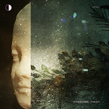
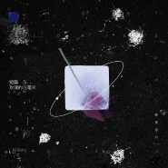

昨夜派对
============================

|  |  |
| :--: | :-- |
| [ 昨夜派对](https://i.xiami.com/ruyi) | **地区**: China 中国大陆 **风格**: 流行摇滚 Pop Rock, 独立流行 Indie Pop **播放数**: 6501555 **粉丝数**: 4168 **评论数**: 103  |

## 档案

## 专辑

| 名称 | 语种 | 唱片公司 | 发行时间 | 专辑类别 | 专辑风格 |
| :--: | :-- | :-- | :-- | :-- | :-- |
| [ 无尽美丽的事物](./albums/5020693560.md) | 国语 | 博生兄弟 | 2020年10月28日 | 录音室专辑 | 独立流行 Indie Pop |
| [ 短篇与玫瑰的八毫米](./albums/2105166898.md) | 国语 | 博生兄弟 | 2019年09月03日 | 录音室专辑 | 独立流行 Indie Pop |

## 评论

|  |  |  |
| :-- | :-- | :-- |
|  [虾米用户](https://emumo.xiami.com/u/3714518) 死人 2021-01-30 01:38 赞(0) 踩(0) | 
相见恨晚
 |
|  [虾米用户](https://emumo.xiami.com/u/8828963) 虾米走了。离开西北两年了... 2021-01-26 14:17 赞(0) 踩(0) | 
不行不行，这歌忒牛，电琴太撩人，女主唱的嗓音更是太销魂。猛一听，还以为是国外乐队，有西方音乐水准的感觉了。他们的《鲸落》更好，多少次单曲循环，听不够，这首又是经典之作。只是，这乐队在虾米肿么连个照片都木有啊，跟大家见个面嘛。
 |
|  [虾米用户](https://emumo.xiami.com/u/355879345)  2021-01-24 23:30 赞(1) 踩(0) | 
我得让评论破百
 |
|  [虾米用户](https://emumo.xiami.com/u/1800831) Hi！ 2021-01-23 08:43 赞(1) 踩(0) | 

 |
|  [虾米用户](https://emumo.xiami.com/u/34163762) 流逝的不止时间 2021-01-18 12:11 赞(1) 踩(0) | 
什么都报之以歌
 |
|  [虾米用户](https://emumo.xiami.com/u/325865556)  2021-01-10 20:05 赞(3) 踩(0) | 
我惊了！我以为这是一首经典老歌   这&amp;hellip;词曲唱制作也太棒了   
 |
|  [虾米用户](https://emumo.xiami.com/u/411408359) 爱你虾米  爱你编辑部 2021-01-09 10:34 赞(3) 踩(0) | 
虾米我爱你
 |
|  [虾米用户](https://emumo.xiami.com/u/973055) 人生固然有芳华，卻也不过... 2021-01-09 09:31 赞(3) 踩(0) | 
虾米始终是最优秀的  在这样深黯孤寂的苍穹下， 她骄傲绚烂的绽放过，像一道光划过无边的黑暗，像一帆旗帜树立在理想的岸边，她也许没有想到，十二年，她身后已是一片星海，引来万千追逐光辉的身影，十二年，也是一个轮回，在共同期许的未来，曾经默默碰撞也相互依偎的灵魂仍会向着光的方向寻找美好，这不是别离，而是带着希望和感恩出发，终有一天，我们还会再相见，因为爱和梦想不变，期待再次闪耀的那一天！！
 |
|  [虾米用户](https://emumo.xiami.com/u/525822) 我最爱的猫咪，你在天堂可... 2021-01-08 13:28 赞(10) 踩(0) | 
失去才会懂得珍惜，再见了虾米，我们爱你......
 |
|  [虾米用户](https://emumo.xiami.com/u/4448371) 还没想好 2021-01-08 01:21 赞(4) 踩(0) | 
离开时才会想起在一起时的美好 时代更迭太快了  能在这美好时代里拥有过真挚的情感  也许就是最难得的事情吧   谢谢虾米 我爱你
 |
|  [虾米用户](https://emumo.xiami.com/u/432075946) 独乐乐不如众乐乐 2021-01-07 20:35 赞(1) 踩(0) | 
歌名多应景啊，再见虾米 
 |
|  [虾米用户](https://emumo.xiami.com/u/7937403) 灵魂丢了怎么办 2021-01-07 17:42 赞(1) 踩(0) | 
真棒，女主唱长啥样想看看 
 |
| ⇒ |  [虾米用户](https://emumo.xiami.com/u/190429665)  2021-01-09 00:47 赞(0) 踩(0) | 
可以去b站搜来膜拜
 |
| ⇒ |  [虾米用户](https://emumo.xiami.com/u/60766928) 谢谢！长得那么好看的你关... 2021-01-09 01:15 赞(0) 踩(0) | 
微博上搜索AKIKO桃子，很漂亮哦
 |
|  [虾米用户](https://emumo.xiami.com/u/37114044) 关于经受的惩罚/我懂/我... 2021-01-07 16:33 赞(31) 踩(0) | 
虾米最后推荐了这首，听了好多遍才发现是国内乐队。记下这首歌，这是虾米与我关于音乐不忘的约定。
 |
|  [虾米用户](https://emumo.xiami.com/u/6320476) 再见 2021-01-06 23:27 赞(0) 踩(0) | 
再见
 |
|  [虾米用户](https://emumo.xiami.com/u/238394672)  2021-01-06 22:34 赞(4) 踩(0) | 
虾米，拜拜了。
 |
|  [虾米用户](https://emumo.xiami.com/u/8070377) 爱雾瑞性维欧腐漏 2021-01-06 10:16 赞(3) 踩(0) | 
挺好听
 |
|  [虾米用户](https://emumo.xiami.com/u/316261284) 到最后…… 2021-01-06 09:31 赞(2) 踩(0) | 
玫瑰的浪漫，星辰的诗意，深海的孤独。
 |
|  [虾米用户](https://emumo.xiami.com/u/194363877)  2021-01-05 08:46 赞(3) 踩(0) | 
听了一首，主唱的嗓子和唱功太棒了
 |
| ⇒ |  [虾米用户](https://emumo.xiami.com/u/194363877)  2021-01-05 09:06 赞(0) 踩(0) | 
更正一下&amp;mdash;&amp;mdash;女主唱
 |
|  [虾米用户](https://emumo.xiami.com/u/8706509)  2021-01-04 17:10 赞(1) 踩(0) | 
爱了
 |
|  [虾米用户](https://emumo.xiami.com/u/52065880) see ☁️  uuu 2020-12-26 00:18 赞(2) 踩(0) | 
喜欢 意象
 |
|  [虾米用户](https://emumo.xiami.com/u/52065880) see ☁️  uuu 2020-12-25 17:39 赞(2) 踩(0) | 
喜欢你们歌里的 宇宙力量～
 |
|  [虾米用户](https://emumo.xiami.com/u/379162683) 我想要记住你们，我想要你... 2020-12-25 13:47 赞(1) 踩(0) | 

 |
|  [虾米用户](https://emumo.xiami.com/u/377527719) 你是蓝色的 海是银色的 2020-12-21 14:55 赞(2) 踩(0) | 
感谢你们的《玫瑰往事》，让我能够在最难熬的日子里找到一束光
 |
|  [虾米用户](https://emumo.xiami.com/u/15961213)   2020-12-14 04:24 赞(0) 踩(0) | 
凌晨4:22，戴着耳机随机放着音乐，困的下一秒就要睡着，听到你们的歌，马上精神起来，掏出手机点到主页开始一首接一首！加油！！！
 |
|  [虾米用户](https://emumo.xiami.com/u/14217407)  2020-11-12 11:04 赞(0) 踩(0) | 
超棒啊！为什么现在才被推送到！！！
 |
|  [虾米用户](https://emumo.xiami.com/u/1802166) 自行车骑友 2020-11-11 15:25 赞(2) 踩(0) | 
词从头到尾的刻意押韵   有点过
 |
|  [虾米用户](https://emumo.xiami.com/u/362083809) 尘归尘 2020-11-10 13:27 赞(1) 踩(0) | 
。
 |
|  [虾米用户](https://emumo.xiami.com/u/290256884) 网易云同名 2020-11-09 12:17 赞(2) 踩(0) | 
昨夜派对
 |
|  [虾米用户](https://emumo.xiami.com/u/45818985) 颠儿啊颠儿的 2020-11-05 11:14 赞(1) 踩(0) | 
不浮于表面  而是骨子里  每缕清晨阳光里的 浪漫
 |
|  [虾米用户](https://emumo.xiami.com/u/24947360)  2020-10-31 17:59 赞(2) 踩(0) | 
我太爱了！为什么让我现在才听到你们！万一以后听不到怎么办啊！
 |
|  [虾米用户](https://emumo.xiami.com/u/295195620)  2020-10-07 20:46 赞(1) 踩(0) | 
&lt;加油[url=/u/5090300]@昨夜派对 [/url]&gt;&lt;5090300&gt;
 |
|  [虾米用户](https://emumo.xiami.com/u/48090365) 救世主的死亡，即为天启！ 2020-10-06 00:33 赞(1) 踩(0) | 
gay！！！
 |
|  [虾米用户](https://emumo.xiami.com/u/251780414) 蓝调,爵士,电子,咽嗓,... 2020-10-05 09:55 赞(2) 踩(0) | 
夜未央。派对才剛剛开启&amp;hellip;&amp;hellip;
 |
|  [虾米用户](https://emumo.xiami.com/u/366600377)  2020-10-03 18:29 赞(0) 踩(0) | 
很好
 |
|  [虾米用户](https://emumo.xiami.com/u/33643473) 是的是我 2020-10-03 14:34 赞(0) 踩(0) | 
好喜欢你们啊！
 |
|  [虾米用户](https://emumo.xiami.com/u/2796166) 最爱莫文蔚..... 2020-10-03 01:06 赞(1) 踩(0) | 
不错哦~ 加油~~
 |
|  [虾米用户](https://emumo.xiami.com/u/48501718) 我还没想好要写什么... 2020-10-02 23:06 赞(1) 踩(0) | 
好久没听到
 |
|  [虾米用户](https://emumo.xiami.com/u/54570261) Common avers... 2020-09-24 13:28 赞(1) 踩(0) | 
好温柔
 |
|  [虾米用户](https://emumo.xiami.com/u/136603366) 想要征服的世界始终都没有... 2020-09-14 22:15 赞(3) 踩(0) | 
我的天啊，想私藏的宝藏乐队，一定要一直一直一直一直写下去唱下去啊！！！！！！
 |
|  [虾米用户](https://emumo.xiami.com/u/331269448) 男 未婚 身高一米七五  2020-09-13 00:12 赞(0) 踩(0) | 
forever！
 |
|  [虾米用户](https://emumo.xiami.com/u/3186478) 我还没想好要写什么... 2020-09-03 09:38 赞(1) 踩(0) | 
喜欢。适合阳光正好的午后，没有人的海滩，以及一个人的手冲咖啡
 |
|  [虾米用户](https://emumo.xiami.com/u/354493224) 吮指原味鸡全年用户。 2020-08-29 16:45 赞(2) 踩(0) | 
10.3成都见
 |
|  [虾米用户](https://emumo.xiami.com/u/342333995) ❍ 2020-08-23 00:09 赞(0) 踩(0) | 
感谢昨夜派对的音乐 给我的生活带来了单纯的美好
 |
|  [虾米用户](https://emumo.xiami.com/u/354493224) 吮指原味鸡全年用户。 2020-08-20 16:42 赞(0) 踩(0) | 

 |
|  [虾米用户](https://emumo.xiami.com/u/431207215)  2020-08-19 16:16 赞(1) 踩(0) | 
耐听，看好你们
 |
|  [虾米用户](https://emumo.xiami.com/u/316261284) 到最后…… 2020-08-16 18:42 赞(3) 踩(0) | 
玫瑰的浪漫，星辰的诗意，深海的孤独。
 |
|  [虾米用户](https://emumo.xiami.com/u/404774010)  2020-08-13 17:46 赞(1) 踩(0) | 
我以哲学爱过你
 |
|  [虾米用户](https://emumo.xiami.com/u/344018512) 我还没想好要写什么... 2020-08-10 11:53 赞(1) 踩(0) | 
D
 |
|  [虾米用户](https://emumo.xiami.com/u/13911932) 暂冇签名~ 2020-07-28 13:18 赞(0) 踩(0) | 

 |
|  [虾米用户](https://emumo.xiami.com/u/73740960)  2020-07-25 17:12 赞(0) 踩(0) | 
。
 |
|  [虾米用户](https://emumo.xiami.com/u/188843800) 我盤算了一千種死法 我想... 2020-07-12 23:05 赞(0) 踩(0) | 
好棒！
 |
|  [虾米用户](https://emumo.xiami.com/u/412973511) 带上我的小蛋糕 2020-07-12 19:04 赞(0) 踩(0) | 
no.999
 |
|  [虾米用户](https://emumo.xiami.com/u/541091)  2020-07-12 07:57 赞(1) 踩(0) | 
很性感的声音，曲子也好听，喜欢
 |
|  [虾米用户](https://emumo.xiami.com/u/312833585)  2020-05-26 10:37 赞(1) 踩(0) | 
偶然从一个公号文章里听到，第一时间打开音乐app，一首接一首，为什么每一首都让人沉迷。让我，想把它分享给喜欢的人。能听你们的歌，我是如此有幸。
 |
| ⇒ |  [虾米用户](https://emumo.xiami.com/u/441730437)  2020-06-17 02:23 赞(0) 踩(0) | 
半岛玫瑰吗
 |
|  [虾米用户](https://emumo.xiami.com/u/3912562) 我还没想好要写什么... 2020-05-26 09:47 赞(0) 踩(0) | 
喜欢作曲 好有才华 呜呜呜呜呜呜
 |
|  [虾米用户](https://emumo.xiami.com/u/205195976) 暂时想不到什么矫情的话。 2020-05-23 23:51 赞(0) 踩(0) | 
好喜欢！
 |
|  [虾米用户](https://emumo.xiami.com/u/406630570) 我是饼 2020-05-18 01:28 赞(0) 踩(0) | 
加油
 |
|  [虾米用户](https://emumo.xiami.com/u/421578063) fox god 2020-05-15 15:44 赞(2) 踩(0) | 
- ̗̀(๑ᵔ⌔ᵔ๑)
 |
|  [虾米用户](https://emumo.xiami.com/u/288848176) 我还没想好要写什么... 2020-05-13 08:25 赞(1) 踩(0) | 
都好听
 |
|  [虾米用户](https://emumo.xiami.com/u/33495734) 我曾愿景活得好似佛门清净 2020-05-07 21:48 赞(1) 踩(0) | 
关注打卡，第730个粉丝，破万的那天我再来翻平均
 |
|  [虾米用户](https://emumo.xiami.com/u/300179835)  2020-05-03 12:47 赞(0) 踩(0) | 
加油，很棒的乐队啊啊啊啊 宝藏
 |
|  [虾米用户](https://emumo.xiami.com/u/47491624) 你要告别了 /  你会快... 2020-05-02 13:24 赞(0) 踩(0) | 
喜欢
 |
|  [虾米用户](https://emumo.xiami.com/u/196774791) 如风岁月  似水流年  ... 2020-04-30 05:13 赞(0) 踩(0) | 
真正的小众、独立、浪漫音乐
 |
|  [虾米用户](https://emumo.xiami.com/u/378120066)  2020-04-27 11:56 赞(0) 踩(0) | 
完了完了沉溺了大爱!
 |
|  [虾米用户](https://emumo.xiami.com/u/295195620)  2020-03-31 21:02 赞(0) 踩(0) | 
冲榜的all about anna来此。 报之以歌第一个音一响，就来关注  其他的还没听
 |
|  [虾米用户](https://emumo.xiami.com/u/441849081) 简单的音乐生活，有趣而不... 2020-03-31 17:30 赞(0) 踩(0) | 
声音很好啊
 |
|  [虾米用户](https://emumo.xiami.com/u/404774010)  2020-03-31 01:57 赞(1) 踩(0) | 
宇宙倒也是我们的囚徒
 |
|  [虾米用户](https://emumo.xiami.com/u/26489198)   2020-03-29 12:12 赞(0) 踩(0) | 
太棒啦
 |
|  [虾米用户](https://emumo.xiami.com/u/342561149) 走啦走啦还是得谢谢虾米让... 2020-03-24 01:50 赞(0) 踩(0) | 
温油 
 |
|  [虾米用户](https://emumo.xiami.com/u/3799199)  2020-03-20 01:26 赞(0) 踩(0) | 
看好这女声，这支乐队，不出名天理难容！
 |
|  [虾米用户](https://emumo.xiami.com/u/1337559) 我还没想好要写什么... 2020-03-16 14:13 赞(2) 踩(0) | 
感觉自己挖到宝藏一样，好赞的乐队
 |
|  [虾米用户](https://emumo.xiami.com/u/306924686)  2020-03-15 08:59 赞(0) 踩(0) | 
再留个jio印  
 |
|  [虾米用户](https://emumo.xiami.com/u/306924686)  2020-03-10 16:29 赞(1) 踩(0) | 
很喜欢你们的歌
 |
| ⇒ |  [虾米用户](https://emumo.xiami.com/u/316261284) 到最后…… 2020-08-16 18:43 赞(0) 踩(0) | 
哈哈，我还记得你，是不是在去年那张歌单里听到的。
 |
| ⇒ |  [虾米用户](https://emumo.xiami.com/u/306924686)  2021-01-27 10:39 赞(0) 踩(0) | 
<q><b>星屿说：</b></q>
 |
|  [虾米用户](https://emumo.xiami.com/u/40580193) 是美好的93青年啊 2020-03-04 14:46 赞(1) 踩(0) | 
All about Anna正！
 |
|  [虾米用户](https://emumo.xiami.com/u/320387) 赐我爱上你的力量 2020-03-02 00:56 赞(0) 踩(0) | 
还不错啊，歌单推荐进来的~
 |
|  [虾米用户](https://emumo.xiami.com/u/1395744) 嘘，我在听音乐。。。 2020-03-01 21:05 赞(0) 踩(0) | 
什么来头，可以可以~
 |
|  [虾米用户](https://emumo.xiami.com/u/234809)  2020-02-29 14:26 赞(0) 踩(0) | 
这张合辑好赞呀
 |
|  [虾米用户](https://emumo.xiami.com/u/16361220) 暂无签名~ 2020-02-26 10:40 赞(1) 踩(0) | 
喜欢 
 |
|  [虾米用户](https://emumo.xiami.com/u/189284668) ^/(⌒-⌒; ) 没有... 2020-02-22 22:31 赞(0) 踩(0) | 
喜欢
 |
|  [虾米用户](https://emumo.xiami.com/u/150621852) 这世界真的不算可爱 宝贝 2020-02-08 14:29 赞(0) 踩(0) | 
好喜欢啊
 |
|  [虾米用户](https://emumo.xiami.com/u/150621852) 这世界真的不算可爱 宝贝 2020-02-08 03:24 赞(0) 踩(0) | 
很棒 加油
 |
|  [虾米用户](https://emumo.xiami.com/u/316261284) 到最后…… 2020-01-29 21:44 赞(39) 踩(0) | 
三次在歌单里推荐你们的歌了，很喜欢。  有种隐秘的诗意。
 |
|  [虾米用户](https://emumo.xiami.com/u/7165352) 我还没想好要写什么... 2020-01-29 09:47 赞(0) 踩(0) | 
很厉害啊
 |
|  [虾米用户](https://emumo.xiami.com/u/85848010) 不知何时又会再忆起 2020-01-11 23:57 赞(1) 踩(0) | 
对不起！认识你们太晚了！！
 |
|  [虾米用户](https://emumo.xiami.com/u/49895220) 一念静心花开遍世界 2019-12-27 20:02 赞(0) 踩(0) | 
粉了
 |
|  [虾米用户](https://emumo.xiami.com/u/14626273) 暂无签名~ 2019-12-17 22:13 赞(3) 踩(0) | 
什么鬼乐队？？？？这么棒！！！！！！！！爱死了！！！！！！！！！！！！！
 |
|  [虾米用户](https://emumo.xiami.com/u/338032733) 極 度 理 智 2019-12-13 17:03 赞(0) 踩(0) | 
宝藏派对
 |
|  [虾米用户](https://emumo.xiami.com/u/404774010)  2019-12-04 15:04 赞(0) 踩(0) | 
宇宙地
 |
|  [虾米用户](https://emumo.xiami.com/u/9597157) ， 2019-12-02 22:04 赞(0) 踩(0) | 

 |
|  [虾米用户](https://emumo.xiami.com/u/47004271) 松散生命 2019-11-27 17:36 赞(0) 踩(0) | 
会的吧
 |
|  [虾米用户](https://emumo.xiami.com/u/316261284) 到最后…… 2019-11-13 12:34 赞(2) 踩(0) | 
。
 |
|  [虾米用户](https://emumo.xiami.com/u/33634014) 网易云音乐：乌昂科尔 2019-11-05 17:04 赞(0) 踩(0) | 
声音好听
 |
|  [虾米用户](https://emumo.xiami.com/u/90324136) 船在下沉 2019-09-05 03:05 赞(0) 踩(0) | 
M
 |
|  [虾米用户](https://emumo.xiami.com/u/113941394)  2019-02-15 13:28 赞(1) 踩(0) | 
一个来的 继续努力呢。 唐映枫的词很棒棒。
 |
|  [虾米用户](https://emumo.xiami.com/u/45897205)  2015-01-13 19:51 赞(0) 踩(0) | 
我是天天， 哈哈
 |
