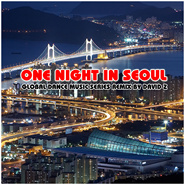

One Night In Seoul流行舞曲系列
============================

|  |  |
| :--: | :-- |
| [ One Night In Seoul流行舞曲系列](https://emumo.xiami.com/album/2102657056) | **艺人**: [David Z](../index.md) **语种**: 韩语 **唱片公司**: 独立发行 **发行时间**: 2016年11月28日 **专辑类别**: 录音室专辑 **专辑风格**: 流行舞曲 Dance-Pop, 浩室舞曲 House, 放克电子 Electro (Electro-Funk) **播放数**: 2587096 **收藏数**: 171 **评论数**: 2  |

## 简介

由 David Z 重新混音制作，环球电子舞曲系列第一辑，来自韩国最受欢迎流行单曲。包括Melbourne Bounce，House，Dance等不同风格的电子舞曲Remix版，专辑收录了适合DJ现场播放的完整版本和Radio Edit电台版。

## 曲目

## 评论

|  |  |  |
| :-- | :-- | :-- |
|  [虾米用户](https://emumo.xiami.com/u/346809265) 夭寿不二，修身以俟 2019-09-02 20:22 赞(1) 踩(0) | 
土，真的
 |
|  [虾米用户](https://emumo.xiami.com/u/224335428) 我还没想好要写什么... 2017-03-31 02:12 赞(1) 踩(0) | 
超有愛傷感覺
 |
