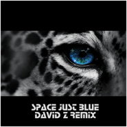

Space Just Blue Remix动物世界 片头曲
============================

|  |  |
| :--: | :-- |
| [ Space Just Blue Remix动物世界 片头曲](https://emumo.xiami.com/album/2102658318) | **艺人**: [David Z](../index.md) **语种**: 其他 **唱片公司**: 独立发行 **发行时间**: 2016年12月01日 **专辑类别**: EP, 单曲 **专辑风格**: 浩室舞曲 House **播放数**: 46915 **收藏数**: 12 **评论数**: 0  |

## 简介

曾在人们心中留下深刻印象的央视节目《动物世界》片头曲，是法国老牌电子乐团Space在70年代的单曲Just Blue。早期的原曲也代表着电子音乐开始步入主流音乐的一个时代。但由于当时的合成器及录音技术的限制，我们今天听到的原曲并没有很好的音质和动态，一直让人们觉得非常遗憾。
 

2016年由儿时热爱动物世界的电音制作人David Z，用现代数字音乐的制作方式重新混音制作。尽量保留了原曲的结构，并加入了现代合成器音色，在体验现代电子乐的同时，回味童年的梦！

## 曲目

## 评论

