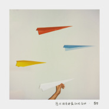

盛哲
============================

|  |  |
| :--: | :-- |
| [ 盛哲](https://i.xiami.com/xiaozhe) | **播放数**: 2948534 **粉丝数**: 827 **评论数**: 58 **地区**: United States of America 美国 **风格**: 国语流行 Mandarin Pop, 欧美流行 Western Pop  |

## 档案

盛哲，唱作人+制作人。2015年以最高荣誉毕业于美国顶尖工程院校，拉法耶特学院，获得音乐和机械工程双学位。2018年毕业于纽约大学（NYU）音乐制作专业。        「一切从好歌开始」。他的作品跨越欧美及华语流行、R&B、电子等诸多风格。复古|前卫，独立|流行，他的音乐中穿梭着不同流派的声音，听得到多维度的思想。 是值得期待的原创之声。       微博: 盛哲Zhe  Ins：zheshengzhe

## 专辑

| 名称 | 语种 | 唱片公司 | 发行时间 | 专辑类别 | 专辑风格 |
| :--: | :-- | :-- | :-- | :-- | :-- |
| [ 黯](./albums/5021782109.md) | 国语 | 独立发行 | 2020年10月30日 | EP, 单曲 | 流行 Pop, 国语流行 Mandarin Pop |
| [ 夏天的歌](./albums/5021228179.md) | 国语 | 独立发行 | 2020年08月07日 | EP, 单曲 | 流行 Pop, 国语流行 Mandarin Pop, 独立流行 Indie Pop |
| [ 愿你拥有那最初的美好](./albums/2106094076.md) | 国语 | 独立发行 | 2020年02月26日 | EP, 单曲 | 流行 Pop, 国语流行 Mandarin Pop, 电音流行 Electropop |
| [ 安静](./albums/2105524486.md) | 国语 | 独立发行 | 2019年11月30日 | EP, 单曲 | 国语流行 Mandarin Pop, 流行 Pop |
| [ 在你的身边](./albums/2102740685.md) | 国语 | 独立发行 | 2017年05月01日 | EP, 单曲 | 流行 Pop, 国语流行 Mandarin Pop |

## 评论

|  |  |  |  |
| :-- | :-- | :-- | :-- |
|  [虾米用户](https://emumo.xiami.com/u/339962561)   2020-12-15 15:13 赞(0) 踩(0) | 
好听，加油 
 |
|  [虾米用户](https://emumo.xiami.com/u/306479379)  2020-10-09 01:01 赞(0) 踩(0) | 
你的歌真的很好听，我好喜欢的，加油啊
 |
|  [虾米用户](https://emumo.xiami.com/u/2796166) 最爱莫文蔚..... 2020-08-12 00:58 赞(1) 踩(0) | 
不错呀~加油~ 支持你！
 |
|  [虾米用户](https://emumo.xiami.com/u/296562365) 【要用像夏天的微笑'隱藏... 2020-07-17 15:02 赞(2) 踩(0) | 
這聲線
 |
|  [虾米用户](https://emumo.xiami.com/u/104062906)          喧嚣渐... 2020-04-01 02:16 赞(2) 踩(0) | 
你就像爱心果冻 
 |
|  [虾米用户](https://emumo.xiami.com/u/181652518)  2020-03-18 22:11 赞(2) 踩(0) | 
对你充满期待✨✨✨
 |
|  [虾米用户](https://emumo.xiami.com/u/181652518)  2020-03-18 22:11 赞(2) 踩(0) | 
感觉超棒
 |
|  [虾米用户](https://emumo.xiami.com/u/280293103) 我还没想好要写什么... 2020-03-17 00:23 赞(2) 踩(0) | 
在你的身边 真是越听越好听 循环一整天❤
 |
|  [虾米用户](https://emumo.xiami.com/u/435203786)  2020-01-11 00:02 赞(0) 踩(0) | 
好听 超棒
 |
|  [虾米用户](https://emumo.xiami.com/u/93207882) 存在的我是我的我 2019-12-07 19:59 赞(0) 踩(0) | 
好棒，期待你的音乐
 |
|  [虾米用户](https://emumo.xiami.com/u/346166749) 总之岁月漫长 然而值得等... 2019-11-27 01:11 赞(0) 踩(0) | 
虾米听不了安静 哪里可以呢
 |
| ⇒ |  [虾米用户](https://emumo.xiami.com/u/435203786)  2020-01-11 00:01 赞(0) 踩(0) | 
现在可以了
 |
|  [虾米用户](https://emumo.xiami.com/u/377973290) 小花絮~宇宙深处的一只天... 2019-10-08 14:16 赞(0) 踩(0) | 
在你的身边
 |
|  [虾米用户](https://emumo.xiami.com/u/425499564)  2019-07-17 17:00 赞(0) 踩(0) | 
，
 |
|  [虾米用户](https://emumo.xiami.com/u/319928818) 等银河灌溉阡陌 2019-07-09 00:15 赞(1) 踩(0) | 
看好你
 |
|  [虾米用户](https://emumo.xiami.com/u/246689266)  2019-06-25 13:21 赞(0) 踩(0) | 
优秀！加油;-)
 |
|  [虾米用户](https://emumo.xiami.com/u/93207882) 存在的我是我的我 2019-06-18 00:55 赞(0) 踩(0) | 
期待新歌，不一定是电音，娓娓道来的歌曲更有魅力。
 |
|  [虾米用户](https://emumo.xiami.com/u/20178416)  2019-06-12 11:52 赞(0) 踩(0) | 
期待，唱作俱佳的优质男声，加油哦！
 |
|  [虾米用户](https://emumo.xiami.com/u/332539433)  2019-03-30 14:55 赞(0) 踩(0) | 

 |
|  [虾米用户](https://emumo.xiami.com/u/11446884) New York MoM... 2019-03-14 20:33 赞(0) 踩(0) | 
纽约大学的
 |
|  [虾米用户](https://emumo.xiami.com/u/328657369) 风格随心而变、 2019-03-01 02:25 赞(0) 踩(0) | 

 |
|  [虾米用户](https://emumo.xiami.com/u/317211627) 只听歌不理解故事 2019-01-16 22:52 赞(1) 踩(0) | 
真的很好听音乐人不放弃啊会慢慢火起来的喜欢你很长时间了希望你别忘了虾米记得传新歌.
 |
|  [虾米用户](https://emumo.xiami.com/u/323936909)  2018-12-28 18:57 赞(1) 踩(0) | 
好好听
 |
|  [虾米用户](https://emumo.xiami.com/u/346611444)  2018-12-21 15:38 赞(1) 踩(0) | 
大郅，转行做歌手啦 
 |
|  [虾米用户](https://emumo.xiami.com/u/44227625) 我还没想好要写什么... 2018-11-27 10:46 赞(0) 踩(0) | 
优秀啊
 |
|  [虾米用户](https://emumo.xiami.com/u/188902054) born in 2002 2018-11-21 00:58 赞(0) 踩(0) | 
老哥快一年了出新歌啊
 |
|  [虾米用户](https://emumo.xiami.com/u/115907612) 热爱 2018-07-15 13:51 赞(0) 踩(0) | 
偶遇到的你呢～你好！真的惊喜！真棒！
 |
|  [虾米用户](https://emumo.xiami.com/u/260431515)   2018-05-31 22:39 赞(0) 踩(0) | 
超喜欢
 |
|  [虾米用户](https://emumo.xiami.com/u/244583657)  2018-05-29 14:34 赞(0) 踩(0) | 
好听~还好遇见你
 |
|  [虾米用户](https://emumo.xiami.com/u/359561865)  2018-05-07 23:42 赞(0) 踩(0) | 
很帅
 |
|  [虾米用户](https://emumo.xiami.com/u/259411204) 虾米，等到会员到期，我就... 2018-04-18 10:47 赞(0) 踩(0) | 
6的
 |
|  [虾米用户](https://emumo.xiami.com/u/11865643)  2018-04-11 00:06 赞(1) 踩(0) | 
很抓耳
 |
|  [虾米用户](https://emumo.xiami.com/u/245279722) 平安喜乐 万事胜意 2018-03-09 22:37 赞(0) 踩(0) | 
绕圈绕圈又一圈，想你想了一整夜
 |
|  [虾米用户](https://emumo.xiami.com/u/352364967)  2018-03-09 17:08 赞(1) 踩(0) | 
坐等着你火！
 |
|  [虾米用户](https://emumo.xiami.com/u/349445391) 我还没想好要写什么... 2018-02-26 19:41 赞(0) 踩(0) | 
嗨 
 |
|  [虾米用户](https://emumo.xiami.com/u/350357686)  2018-02-24 21:43 赞(0) 踩(0) | 
绕圈何时发
 |
|  [虾米用户](https://emumo.xiami.com/u/288582045) 我愿你好 即使后来你与我... 2018-02-19 19:54 赞(0) 踩(0) | 
坐等新专辑！！！！期待！！ 
 |
|  [虾米用户](https://emumo.xiami.com/u/342133051)  2018-02-19 13:09 赞(0) 踩(0) | 
两首歌每天听~一遍一遍又一遍就是喜欢听！
 |
|  [虾米用户](https://emumo.xiami.com/u/36008675) Hola:) 2018-01-06 18:58 赞(0) 踩(0) | 
喜欢
 |
|  [虾米用户](https://emumo.xiami.com/u/288756498) 你好青年！ 2017-12-27 18:11 赞(3) 踩(0) | 
歌曲只为找到你虾米上会放吗
 |
|  [虾米用户](https://emumo.xiami.com/u/1418202)  江山共老 2017-12-27 15:35 赞(0) 踩(0) | 
哇，tang那张专好帅
 |
|  [虾米用户](https://emumo.xiami.com/u/50862597) ʅ(‾◡◝)ʃ 2017-12-23 07:41 赞(3) 踩(0) | 
小哥哥有男朋友了吗
 |
|  [虾米用户](https://emumo.xiami.com/u/50862597) ʅ(‾◡◝)ʃ 2017-12-23 06:43 赞(0) 踩(0) | 
小哥哥好棒呀
 |
|  [虾米用户](https://emumo.xiami.com/u/197288592)  2017-12-17 14:05 赞(0) 踩(0) | 
想关注你的微博&amp;hellip;&amp;hellip;
 |
|  [虾米用户](https://emumo.xiami.com/u/285810952)  2017-12-02 17:45 赞(0) 踩(0) | 
声色很好听
 |
|  [虾米用户](https://emumo.xiami.com/u/174868666) 自认自己是半个吃货，半个... 2017-09-25 18:27 赞(1) 踩(0) | 
希望你以后继续唱歌 歌好好听～
 |
|  [虾米用户](https://emumo.xiami.com/u/95353932) 就是爱音乐 2017-09-23 23:55 赞(1) 踩(0) | 
被基了一身，有男朋友了吧~
 |
|  [虾米用户](https://emumo.xiami.com/u/7839036)   2017-08-06 21:23 赞(0) 踩(0) | 
好帅
 |
|  [虾米用户](https://emumo.xiami.com/u/304557053) 早见晚爱。 2017-07-01 21:18 赞(2) 踩(0) | 
怎么就这一首哇&amp;hellip;好想多听几首 
 |
|  [虾米用户](https://emumo.xiami.com/u/612355) 好听音乐收藏了 2017-06-25 23:19 赞(0) 踩(0) | 

 |
|  [虾米用户](https://emumo.xiami.com/u/45621221) 卸载状态。 2017-06-15 18:37 赞(0) 踩(0) | 
新发现老公一枚。
 |
|  [虾米用户](https://emumo.xiami.com/u/246359888)  2017-05-06 19:49 赞(1) 踩(0) | 
在你的身边很不错，加油
 |
|  [虾米用户](https://emumo.xiami.com/u/1402431)  2017-05-05 11:08 赞(1) 踩(0) | 
你的热门歌曲列表里有一首《兄弟你还好吗》，声音听起来不像你哦？是不是虾米关联错了？
 |
|  [虾米用户](https://emumo.xiami.com/u/16745497) 我还没想好要写什么... 2017-05-01 22:58 赞(1) 踩(0) | 
在你的身边，听着很有感觉..太棒了
 |
|  [虾米用户](https://emumo.xiami.com/u/55796377)  2015-10-11 12:41 赞(0) 踩(0) | 
    
 |
|  [虾米用户](https://emumo.xiami.com/u/43392924)  2015-08-19 16:57 赞(1) 踩(0) | 
小哲，您好！我是MTV工作人员，我们之前工作人员联系不上你，星动雅乐轩项目您入围决赛了请给我们一个联系方式我们需要尽快联系您。
 |
|  [虾米用户](https://emumo.xiami.com/u/42535021) 暂无签名~ 2015-07-26 16:54 赞(2) 踩(0) | 
你好，我是中国好歌曲节目人员，不知道您对我们节目是否感兴趣？
 |
|  [虾米用户](https://emumo.xiami.com/u/2994172) who live 2015-07-13 22:31 赞(0) 踩(0) | 
咦你咋不回我呢？
 |
