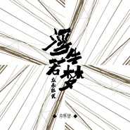

众乐纪贰 浮生若梦
============================

|  |  |
| :--: | :-- |
| [ 众乐纪贰 浮生若梦](https://emumo.xiami.com/album/2100257526) | **艺人**: [众乐纪](../index.md) **语种**: 国语 **唱片公司**: 众乐纪 **发行时间**: 2016年03月25日 **专辑类别**: 合集, 杂锦 **专辑风格**: 独立民谣 Indie Folk **播放数**: 3579559 **收藏数**: 1461 **评论数**: 70  |

## 简介

每个人的一生都是一部长篇小说   
所有感受经验都是主观的   
在记忆的造景里   
故事慢慢靠近自己的心理预期   
我们经常把故事抽象成音符   
谱上自己喜欢的曲调   
来创作一首属于自己的歌   
遇见你，我是快乐的   
脑海中的文字仿佛跳跃成了你口中的音符   
在你的故事里，听见我自己   
音乐里的故事，小说里的故事  
写就唱出了   
浮生   
若梦   
  
2016年1月1日，众乐纪发起了第二张合辑的众筹项目，与第一张合辑一样，这次我们尝试与文学进行跨界，与舞台剧跨界，让更多的人能够参与到我们的合辑中来。爱音乐，一起玩儿。

## 曲目

## 评论

|  |  |  |  |
| :-- | :-- | :-- | :-- |
|  [虾米用户](https://emumo.xiami.com/u/409259520)  2019-05-26 05:44 赞(0) 踩(0) | 
好听  有胡子哦
 |
|  [虾米用户](https://emumo.xiami.com/u/4861933)  2018-09-18 20:38 赞(0) 踩(0) | 
《相守》真的是诗情画意，一种悠悠的伤情，绵绵的思绪，非常美！
 |
|  [虾米用户](https://emumo.xiami.com/u/48014753) 失去了是痛苦_得到了是无... 2017-10-30 21:12 赞(0) 踩(0) | 
苏紫旭在哪呢？
 |
|  [虾米用户](https://emumo.xiami.com/u/42690109)  2017-06-03 11:02 赞(0) 踩(0) | 
总体还行，可以听听。
 |
|  [虾米用户](https://emumo.xiami.com/u/38662280) 不懂装懂中度患者 2017-03-27 21:11 赞(0) 踩(0) | 
普通的专辑但我们现在连普通的专辑都太少了加油，不管是否有人认可，辞藻刻意又怎样，旋律单一又怎样至少不是口水歌，至少主题万千，少年强说愁也好过麻木不已
 |
|  [虾米用户](https://emumo.xiami.com/u/260456473)  2017-01-11 21:12 赞(0) 踩(0) | 
大爱孙鹏老师，当初为了编曲也算是付出了很多吧，希望你离开了大连也依然过得好
 |
|  [虾米用户](https://emumo.xiami.com/u/29292813)  2016-09-12 10:20 赞(0) 踩(0) | 
只是自己喜欢民谣。。
 |
|  [虾米用户](https://emumo.xiami.com/u/8244559)  2016-06-07 10:42 赞(0) 踩(0) | 
******
 |
|  [虾米用户](https://emumo.xiami.com/u/116794334)  2016-05-21 18:34 赞(0) 踩(0) | 
独特的民谣
 |
|  [虾米用户](https://emumo.xiami.com/u/120889400) (´･㉨･`) 2016-04-01 17:45 赞(0) 踩(0) | 
马雨阳
 |
|  [虾米用户](https://emumo.xiami.com/u/45298985) Wechat:dqx19... 2016-03-30 13:37 赞(0) 踩(0) | 
+
 |
|  [虾米用户](https://emumo.xiami.com/u/22444238) 邱比官方虾米 2016-03-02 10:15 赞(0) 踩(0) | 
Get
 |
|  [虾米用户](https://emumo.xiami.com/u/58707992) 背弃了理想，谁人都可以。 2016-02-29 18:39 赞(0) 踩(0) | 
音乐文集。
 |
|  [虾米用户](https://emumo.xiami.com/u/2754685)  2016-02-17 09:54 赞(1) 踩(0) | 
什么都不比晨这首来得清新脱俗
 |
|  [虾米用户](https://emumo.xiami.com/u/13926147)  2016-02-16 10:41 赞(0) 踩(0) | 
好听
 |
|  [虾米用户](https://emumo.xiami.com/u/2533246)  2016-02-13 15:59 赞(1) 踩(0) | 
每首歌都很好听。很独特。
 |
|  [虾米用户](https://emumo.xiami.com/u/2533246)  2016-02-13 15:54 赞(0) 踩(0) | 
好听好听
 |
|  [虾米用户](https://emumo.xiami.com/u/41824757)   2016-02-02 11:34 赞(0) 踩(0) | 
喜欢 没有理由
 |
|  [虾米用户](https://emumo.xiami.com/u/15253814) 爱属性吸收 2016-02-02 01:07 赞(0) 踩(0) | 
值得听/
 |
|  [虾米用户](https://emumo.xiami.com/u/77077414)  2016-01-25 01:35 赞(0) 踩(0) | 

 |
|  [虾米用户](https://emumo.xiami.com/u/8007110)  2016-01-24 11:31 赞(0) 踩(0) | 
沉沉的沧桑独白
 |
|  [虾米用户](https://emumo.xiami.com/u/52536056) (◉ω◉υ)⁼³₌₃悄咪... 2016-01-18 17:32 赞(0) 踩(0) | 
吸吸∠( ᐛ 」∠)＿
 |
|  [虾米用户](https://emumo.xiami.com/u/776519)  2016-01-15 18:43 赞(0) 踩(0) | 
非常好听的一张专辑，每一首歌都很美
 |
|  [虾米用户](https://emumo.xiami.com/u/776519)  2016-01-15 18:39 赞(0) 踩(0) | 
非常的好的一张专辑，每一首歌都是那么的动听 。。。
 |
|  [虾米用户](https://emumo.xiami.com/u/49086299) 语虚，何以言知 2016-01-14 10:10 赞(0) 踩(0) | 
不错不错
 |
|  [虾米用户](https://emumo.xiami.com/u/1070578)  2016-01-14 09:23 赞(0) 踩(0) | 
nice  nice    nice   nice
 |
|  [虾米用户](https://emumo.xiami.com/u/7971186)  2016-01-13 12:44 赞(0) 踩(0) | 
多元的美好
 |
|  [虾米用户](https://emumo.xiami.com/u/2987526) no Romeo 2016-01-13 12:25 赞(0) 踩(0) | 
都很好  快去听
 |
|  [虾米用户](https://emumo.xiami.com/u/4778406) 我还没想好要写什么... 2016-01-12 22:52 赞(0) 踩(0) | 
简单而温暖，诗意与远方。
 |
|  [虾米用户](https://emumo.xiami.com/u/39603556)  2016-01-12 17:57 赞(0) 踩(0) | 
加油。
 |
|  [虾米用户](https://emumo.xiami.com/u/4016595) 益西曲珍 2016-01-12 15:48 赞(0) 踩(0) | 
(⊙o⊙)哇出2了
 |
|  [虾米用户](https://emumo.xiami.com/u/48141858) just like a ... 2016-01-12 14:57 赞(0) 踩(0) | 

 |
|  [虾米用户](https://emumo.xiami.com/u/48826315) 诗歌接近灵魂，音乐直抒胸... 2016-01-12 14:05 赞(2) 踩(0) | 
苏紫旭好听
 |
|  [虾米用户](https://emumo.xiami.com/u/478527) 好想跟衣服在洗衣机里滚 2016-01-12 13:12 赞(2) 踩(0) | 
只因“霓虹深处”（唐映枫＋陈鸿宇，就是品质保障）
 |
|  [虾米用户](https://emumo.xiami.com/u/478527) 好想跟衣服在洗衣机里滚 2016-01-12 13:12 赞(0) 踩(0) | 
只因“霓虹深处”（唐映枫＋陈鸿宇，就是品质保障）
 |
|  [虾米用户](https://emumo.xiami.com/u/5429478) 唯有音乐和亲情不可遗落！ 2016-01-12 11:57 赞(1) 踩(0) | 
我喜欢的你们，是简单，也是梦想
 |
|  [虾米用户](https://emumo.xiami.com/u/3723158)  2016-01-12 10:33 赞(2) 踩(0) | 
小鱼带着水墨的笔触感知电影《大鱼》的奇幻感；南极北极的设问让我们知道，原来文字的技巧与音乐融为一体；父爱如山，母爱似水，每个女生都有着与生俱来的母性，它融化在歌者的心里，谨以此歌献给作词者的恋人们；灯火红绿，那人就在阑珊深处，她未走远，也不会走过来。
 |
|  [虾米用户](https://emumo.xiami.com/u/47456885) 银色飞行船，迎风飞翔。 2016-01-12 08:59 赞(1) 踩(0) | 
真烂
 |
|  [虾米用户](https://emumo.xiami.com/u/83863238)  2016-01-12 00:54 赞(1) 踩(0) | 
男子汉不哭，好听！热血
 |
|  [虾米用户](https://emumo.xiami.com/u/4380273) 内心强大 外在闪耀 2016-01-12 00:20 赞(8) 踩(0) | 
《男子汉不哭》太精彩，我没听过气质如此独特的歌，整首歌行云流水，大气激昂，雨阳用真性情和过人音乐天赋唱出了俏皮、阳刚与不屈，听完浑身舒坦，就酱！
 |
|  [虾米用户](https://emumo.xiami.com/u/794813)  2016-01-11 20:45 赞(0) 踩(0) | 
good
 |
|  [虾米用户](https://emumo.xiami.com/u/3736075) 非冷即暖 2016-01-11 20:03 赞(0) 踩(0) | 
听到第一首，就被歌手的音色惊艳了
 |
|  [虾米用户](https://emumo.xiami.com/u/1632248)  2016-01-11 19:59 赞(0) 踩(0) | 
不一样的可能性
 |
|  [虾米用户](https://emumo.xiami.com/u/45621221) 卸载状态。 2016-01-11 19:52 赞(6) 踩(0) | 
陈鸿宇√
 |
|  [虾米用户](https://emumo.xiami.com/u/2928117) 你好 2016-01-11 19:31 赞(3) 踩(0) | 
我一直不怎么听内地民谣，一是旋律没有辨识度，大多数曲子听上去都差不多，二是编曲普通，三是有些曲子不怎么样，要么听了打瞌睡，要么听了没反应。去年听到了一些不错的内地式民谣。这张专辑我个人感受，一般。
 |
|  [虾米用户](https://emumo.xiami.com/u/61579966) 因为有光啊 2016-01-11 18:50 赞(0) 踩(0) | 
陈鸿宇我脑公 
 |
|  [虾米用户](https://emumo.xiami.com/u/33514232) 喜欢来这里找我喜欢的 2016-01-11 18:05 赞(0) 踩(0) | 
越听越喜欢，越听越有味道
 |
|  [虾米用户](https://emumo.xiami.com/u/9044095) 别有用心的一小撮分子 2016-01-11 18:00 赞(5) 踩(0) | 
《水的欢歌》，最出彩的一首歌。她们向这个世界投降，却最终把世界变成她们的模样；好比水，貌似柔弱，却善于迂回，善于渗透，最终以柔克刚。
 |
|  [虾米用户](https://emumo.xiami.com/u/43992747)   凡所有相，皆为虚妄。 2016-01-11 17:49 赞(0) 踩(0) | 

 |
|  [虾米用户](https://emumo.xiami.com/u/33514232) 喜欢来这里找我喜欢的 2016-01-11 17:40 赞(0) 踩(0) | 
来了
 |
|  [虾米用户](https://emumo.xiami.com/u/10006020) 很难 2016-01-11 17:03 赞(0) 踩(0) | 

 |
|  [虾米用户](https://emumo.xiami.com/u/17819982) 你在看我吗我在看什么。 2016-01-11 16:45 赞(0) 踩(0) | 
终于来了。
 |
|  [虾米用户](https://emumo.xiami.com/u/5985447)   2016-01-11 16:32 赞(0) 踩(0) | 
奇怪，竟然觉得很好听，钱是我都不认识这歌手。
 |
|  [虾米用户](https://emumo.xiami.com/u/308845) axelzx.com 2016-01-11 15:05 赞(0) 踩(0) | 
小鱼
 |
|  [虾米用户](https://emumo.xiami.com/u/21818117) 听着听着就... 2016-01-11 14:05 赞(0) 踩(0) | 
浮生若梦，总觉得听同样的，不为人知的，歌，是总缘分。
 |
|  [虾米用户](https://emumo.xiami.com/u/35078420) 暂无签名~ 2016-01-11 13:36 赞(0) 踩(0) | 
很温暖的感觉
 |
|  [虾米用户](https://emumo.xiami.com/u/405975)   2016-01-11 13:24 赞(0) 踩(0) | 
孙大肆也加进来啦！
 |
|  [虾米用户](https://emumo.xiami.com/u/5500200) 迩墨而游者，需追随己心。 2016-01-11 13:18 赞(0) 踩(0) | 
《水的欢歌》 听着非常舒服，点个赞！
 |
|  [虾米用户](https://emumo.xiami.com/u/2332621) SELF. 2016-01-11 13:01 赞(0) 踩(0) | 
不错
 |
|  [虾米用户](https://emumo.xiami.com/u/30648067) 聪明的家伙是我偏不留下 2016-01-11 12:49 赞(1) 踩(0) | 
众乐纪好棒！！！
 |
|  [虾米用户](https://emumo.xiami.com/u/47697178)  2016-01-11 12:17 赞(0) 踩(0) | 
第一句出来，表示我的兴趣就上来了！
 |
|  [虾米用户](https://emumo.xiami.com/u/823578)  2016-01-11 12:09 赞(0) 踩(0) | 
还行，不能给大多分，怕骄傲
 |
|  [虾米用户](https://emumo.xiami.com/u/47711130) 让她降落。 2016-01-11 12:06 赞(0) 踩(0) | 
考试回来发现新专可以听了 开心
 |
|  [虾米用户](https://emumo.xiami.com/u/12878826) 谢谢陪伴 再见哦！ 2016-01-11 11:55 赞(0) 踩(0) | 
终于有了 
 |
|  [虾米用户](https://emumo.xiami.com/u/77941458)   2016-01-11 11:23 赞(0) 踩(0) | 
不怕你骄傲
 |
|  [虾米用户](https://emumo.xiami.com/u/49091284)   2016-01-11 10:29 赞(0) 踩(0) | 
赞啦
 |
|  [虾米用户](https://emumo.xiami.com/u/1031) asca.lu 2016-01-11 08:51 赞(0) 踩(0) | 
没想到这么快就出贰，棒！
 |
|  [虾米用户](https://emumo.xiami.com/u/2288372) 我还没想好要写什么... 2016-01-11 08:41 赞(0) 踩(0) | 
= =
 |
|  [虾米用户](https://emumo.xiami.com/u/50216281) 希望有一天，有你的地方就... 2016-01-11 08:30 赞(0) 踩(0) | 
好听好听，～一早起来就听到这么好听的歌儿，！✌✌✌
 |
|  [虾米用户](https://emumo.xiami.com/u/70855530) 我的志向在山川湖海 在四... 2016-01-11 07:00 赞(1) 踩(0) | 
嘤嘤嘤嘤嘤嘤눈_눈大写的开心！
 |
