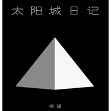

太阳城日记
============================

|  |  |
| :--: | :-- |
| [ 太阳城日记](https://emumo.xiami.com/album/2100380053) | **艺人**: [众乐纪](../index.md) **语种**: 国语 **唱片公司**: 众乐纪 **发行时间**: 2011年05月01日 **专辑类别**: 录音室专辑 **专辑风格**:  **播放数**: 162 **收藏数**: 2 **评论数**: 3  |

## 简介

&nbsp; &nbsp; 太阳城日记：完成于2011年，于当年5月发行，从极限世界到人世山海间，行者无疆，望江南，万家灯火送日暮，此地他方，星辉疗原，藏于世间眼 

## 曲目

## 评论

|  |  |  |
| :-- | :-- | :-- |
|  [虾米用户](https://emumo.xiami.com/u/8244559)  2016-08-18 10:22 赞(0) 踩(0) | 
******
 |
|  [虾米用户](https://emumo.xiami.com/u/3815293) baby Jesus s... 2016-08-17 13:43 赞(0) 踩(0) | 
？？？
 |
|  [虾米用户](https://emumo.xiami.com/u/69307508) 雀跃的人在河边骑脚踏车，... 2016-08-17 12:26 赞(0) 踩(0) | 
？？？
 |
