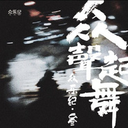

众乐纪叁·众声起舞
============================

|  |  |
| :--: | :-- |
| [ 众乐纪叁·众声起舞](https://emumo.xiami.com/album/2102733984) | **艺人**: [众乐纪](../index.md) **语种**: 国语 **唱片公司**: 众乐纪 **发行时间**: 2017年04月18日 **专辑类别**: 合集, 杂锦 **专辑风格**: 民谣 Folk **播放数**: 2407621 **收藏数**: 540 **评论数**: 25  |

## 简介

《众乐纪叁•众声起舞》音乐合辑源自众乐纪颇具仪式感的惯例，每年众乐纪都会以合辑的方式，尝试音乐与插画、文学等不同领域进行跨界，这次的第三张合辑的封面便是通过网络征集而来。  
  
这张合辑中，有马雨阳短而精彩的《烛火》，时而欢跳，时而沉稳。有柳爽的久而弥新的《高米店南》，褪去冗杂，沉淀自我。有冯佳界的择而从之《寄海书》，心系祖国，独爱“人间烟火”。有任灿的生而为人的《消化》，时而平静，时而动荡。有杨猛的志在醒悟《足步浮芳》，足步之下，芬芳四溢。有寒洛&amp;鼓润的《失眠的陈先生》，色调发暗却鲜活，节奏迟缓却欢脱。有倪健回首最初的《唐人山》，写出丑恶，剩下美好。有袁景寄往天堂的《她只是有一点伤心》，赠予未曾谋面的她、他、ta。有冯翔&amp;陈鸿宇的《窗》，些许愿望，留给时间。  
  
所谓众声，寓意众乐纪音乐人集体发声；所谓起舞，大家风格不一，声音翩然而知。就像一场即将开演的舞台剧，每个角色都有其独特的魅力，每首歌都带来未知的惊喜...... 

## 曲目

## 评论

|  |  |  |  |
| :-- | :-- | :-- | :-- |
|  [虾米用户](https://emumo.xiami.com/u/1236913)  2019-02-28 10:37 赞(0) 踩(0) | 
这个系列的歌词都追求辞藻华丽，难记
 |
|  [虾米用户](https://emumo.xiami.com/u/267517259) 超级无敌大美女哈哈哈 2018-08-08 13:53 赞(0) 踩(0) | 
66
 |
|  [虾米用户](https://emumo.xiami.com/u/5806141)  2018-02-02 15:45 赞(1) 踩(0) | 
音质
 |
|  [虾米用户](https://emumo.xiami.com/u/7797443) / / 2017-10-30 10:19 赞(0) 踩(0) | 
妈的幸好下载了哈哈哈哈
 |
|  [虾米用户](https://emumo.xiami.com/u/37706842)   2017-09-12 15:28 赞(1) 踩(0) | 
整张专辑都很棒
 |
|  [虾米用户](https://emumo.xiami.com/u/204795223)   2017-05-12 13:28 赞(0) 踩(0) | 
for later
 |
|  [虾米用户](https://emumo.xiami.com/u/13375540) 小分裂 2017-05-11 13:20 赞(0) 踩(0) | 
都超棒啊，国内好久没有这么惊喜的整张民谣专辑了！
 |
|  [虾米用户](https://emumo.xiami.com/u/3857402)  2017-05-09 00:01 赞(0) 踩(0) | 
《窗》最好听！
 |
|  [虾米用户](https://emumo.xiami.com/u/244849049)  2017-05-04 11:35 赞(0) 踩(0) | 
不错
 |
|  [虾米用户](https://emumo.xiami.com/u/52045517)   2017-05-04 11:27 赞(0) 踩(0) | 
喜欢这张专辑
 |
|  [虾米用户](https://emumo.xiami.com/u/5862353) Now or Never 2017-05-04 10:26 赞(1) 踩(0) | 
都是好听的男声~！选择困难，近期就把他们的集子挨个听过去吧......
 |
|  [虾米用户](https://emumo.xiami.com/u/293679339)  2017-05-04 00:35 赞(0) 踩(0) | 
好
 |
|  [虾米用户](https://emumo.xiami.com/u/47355043)  2017-05-03 17:21 赞(2) 踩(0) | 
好棒
 |
|  [虾米用户](https://emumo.xiami.com/u/35831197)  2017-05-02 14:06 赞(1) 踩(0) | 
众乐纪好
 |
|  [虾米用户](https://emumo.xiami.com/u/247079371)  2017-04-28 10:50 赞(0) 踩(0) | 
哈哈哈哈开心
 |
|  [虾米用户](https://emumo.xiami.com/u/245035451) 空山新雨后 天气晚来秋 2017-04-27 14:06 赞(0) 踩(0) | 
哈哈哈哈哈  虾米也终于又可以听了
 |
|  [虾米用户](https://emumo.xiami.com/u/247079371)  2017-04-19 18:39 赞(0) 踩(0) | 
不是昨天还可以听么？？！今天怎么就不行了  
 |
|  [虾米用户](https://emumo.xiami.com/u/245035451) 空山新雨后 天气晚来秋 2017-04-19 18:18 赞(0) 踩(0) | 
就我现在听不了了吗？
 |
|  [虾米用户](https://emumo.xiami.com/u/5429478) 唯有音乐和亲情不可遗落！ 2017-04-19 09:46 赞(0) 踩(0) | 
还好，虾米也有了。开森
 |
|  [虾米用户](https://emumo.xiami.com/u/7249300) 习惯，醒脑，排解，引导，... 2017-04-18 21:39 赞(1) 踩(0) | 
没抢到CD 
 |
|  [虾米用户](https://emumo.xiami.com/u/247079371)  2017-04-18 20:13 赞(0) 踩(0) | 
啊哈终于等到啦
 |
|  [虾米用户](https://emumo.xiami.com/u/7850233) Step by step... 2017-04-18 20:10 赞(0) 踩(0) | 
咩嘿等到窗ʕ &amp;bull;ᴥ&amp;bull;ʔ
 |
|  [虾米用户](https://emumo.xiami.com/u/1955060)  2017-04-18 17:09 赞(0) 踩(0) | 
欢迎
 |
|  [虾米用户](https://emumo.xiami.com/u/35822739) 猫控 2017-04-18 16:39 赞(0) 踩(0) | 
&amp;hellip;&amp;hellip;喔！来啦！
 |
|  [虾米用户](https://emumo.xiami.com/u/44267754)  2017-04-18 16:36 赞(0) 踩(0) | 
成长是一场约跑，好看的人先约到。沙发沙发
 |
