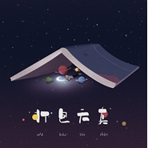

众乐纪伍·打包天真
============================

|  |  |
| :--: | :-- |
| [ 众乐纪伍·打包天真](https://emumo.xiami.com/album/2105250909) | **艺人**: [众乐纪](../index.md) **语种**: 国语 **唱片公司**: 众乐纪 **发行时间**: 2019年09月17日 **专辑类别**: 录音室专辑 **专辑风格**:  **播放数**: 425283 **收藏数**: 231 **评论数**: 18  |

## 简介

“据说永葆天真，才是真正的长大。”  
  
《众乐纪伍·打包天真》是独立音乐厂牌众乐纪发布的第五张音乐合辑。这将是一张以“天真”为主题的初心之作，特邀10组风格不同的音乐人，改编10首儿童的诗。参与音乐人：陈鸿宇、黑撒乐队、柳爽、梁琪、冀行、袁景、陈知&amp;游园惊梦、寒洛、石磊4ROCK、杨凡一。  
  
将天真打包，送给一如既往的你。  
  
  
（歌词部分收录自诗集《小孩的诗》，感谢所有天真。）  
 

## 曲目

## 评论

|  |  |  |  |
| :-- | :-- | :-- | :-- |
|  [虾米用户](https://emumo.xiami.com/u/413949746)  2019-12-16 12:08 赞(0) 踩(0) | 
特别的声音声音小小力量大大
 |
|  [虾米用户](https://emumo.xiami.com/u/7971186)  2019-10-28 00:25 赞(0) 踩(0) | 
美好的，天天真的
 |
|  [虾米用户](https://emumo.xiami.com/u/4506793)  2019-09-23 10:11 赞(0) 踩(0) | 
单曲循环宝箱，小男孩的世界太迷幻了还有只有我孤单打翻了天空做小床都很有趣萌化了冀行和曹石这种嗓音每次都会吸引我一会黑撒有金句，曲江淹没长安，每次想起都会有感觉，谁想出来的，献花
 |
|  [虾米用户](https://emumo.xiami.com/u/30591240) 天亮了，说晚安！ 2019-09-19 15:08 赞(1) 踩(0) | 
听着安静
 |
| ⇒ |  [虾米用户](https://emumo.xiami.com/u/329008713) 哎 呦 呦 呦 呦 呦 ... 2019-09-19 18:36 赞(0) 踩(0) | 
是挺安静
 |
|  [虾米用户](https://emumo.xiami.com/u/43875708)  遣词造句 穿山过水 他... 2019-09-19 04:34 赞(1) 踩(0) | 
众乐纪的安排 从不在深夜感到失望
 |
|  [虾米用户](https://emumo.xiami.com/u/12225403)  2019-09-18 21:22 赞(0) 踩(0) | 
听了马上想回家 
 |
|  [虾米用户](https://emumo.xiami.com/u/12225403)  2019-09-18 21:13 赞(0) 踩(0) | 
难得的一颗糖，各有味道。看似虚无的梦呓却是日常种种镜像。词清新有趣，曲优雅干净飘逸，难得的作品。带给我明亮和温暖情感的声音。迷幻却不耍酷的态度很棒。
 |
|  [虾米用户](https://emumo.xiami.com/u/24761002)   2019-09-18 14:37 赞(1) 踩(0) | 
白云桥下，墙推啊，哈哈
 |
|  [虾米用户](https://emumo.xiami.com/u/2248143)  2019-09-18 14:05 赞(0) 踩(0) | 
inspired by holy ghost, simply profound, innocently sophisticated. that sweet purity...oh...
 |
|  [虾米用户](https://emumo.xiami.com/u/2248143)  2019-09-18 13:58 赞(0) 踩(0) | 
比大人写的好太多太多。。
 |
|  [虾米用户](https://emumo.xiami.com/u/10088250) 自己的国王 2019-09-18 11:29 赞(2) 踩(0) | 
大爱《白云桥下》
 |
|  [虾米用户](https://emumo.xiami.com/u/316261284) 到最后…… 2019-09-18 11:21 赞(4) 踩(0) | 
二人直八。
 |
|  [虾米用户](https://emumo.xiami.com/u/223274661) 我还没想好要写什么，也许... 2019-09-18 00:02 赞(0) 踩(0) | 
很好啊很好啊
 |
|  [虾米用户](https://emumo.xiami.com/u/223274661) 我还没想好要写什么，也许... 2019-09-18 00:02 赞(1) 踩(0) | 
很好 很好
 |
|  [虾米用户](https://emumo.xiami.com/u/87421924) 唯有自己钟情的音乐不可抗... 2019-09-17 11:28 赞(0) 踩(0) | 
陈鸿宇的独立音乐厂牌众乐纪越发越壮大了
 |
|  [虾米用户](https://emumo.xiami.com/u/3566813) 菩萨，祝您身体健康！34... 2019-09-17 03:39 赞(0) 踩(0) | 
虽说说了不止一次，但还是得再次强调，众乐纪出品，差不了。得空去主页，发现宝贝去！
 |
|  [虾米用户](https://emumo.xiami.com/u/10880138)  2019-09-17 00:38 赞(0) 踩(0) | 
年度期待
 |
