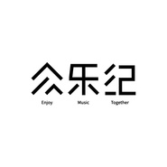

众乐纪
============================

|  |  |
| :--: | :-- |
| [ 众乐纪](https://i.xiami.com/zhongyueji) | **播放数**: 24149024 **粉丝数**: 4164 **评论数**: 289 **地区**: China 中国大陆 **风格**: 城市民谣 Urban Folk  |

## 档案

众乐纪，成立于2015年1月1日，成立初衷为“找一群人一起做跟音乐有关的值得纪念的事，自由、开放、协作、分享”。现已发展为成“专注于独立音乐，以出版音乐合辑、音乐人专辑，组织筹办音乐现场演出、音乐节”的新型音乐公司，为独立音乐人提供音乐全产业链服务。 
同时，众乐纪也是一个音乐爱好者社群，社群的小伙伴们可以一起做唱片、做音乐周边，组织线下聚会、近距离接触音乐人，一群人一起做和音乐有关的值得纪念的事。 
微信公众号：“众乐纪”（nidezhongyueji） 
官方微博：@众乐纪 
合作&投诉建议邮箱：    z@zhongyueji.com 
淘宝：zhongyueji.taobao.com

## 专辑

| 名称 | 语种 | 唱片公司 | 发行时间 | 专辑类别 | 专辑风格 |
| :--: | :-- | :-- | :-- | :-- | :-- |
| [ 众乐纪伍·打包天真](./albums/2105250909.md) | 国语 | 众乐纪 | 2019年09月17日 | 录音室专辑 |  |
| [ 三进制现场合辑](./albums/2104824190.md) | 国语 | 众乐纪 | 2019年04月28日 | 现场专辑 |  |
| [ 众乐纪肆·光怪陆离](./albums/2104317515.md) | 国语 | 众乐纪 | 2018年12月04日 | 合集, 杂锦 |  |
| [ 众乐纪叁·众声起舞](./albums/2102733984.md) | 国语 | 众乐纪 | 2017年04月18日 | 合集, 杂锦 | 民谣 Folk |
| [ “众乐纪音乐人”电台](./albums/2102698479.md) | 国语 | 独立发行 | 2016年12月15日 | 精选集 | 独立民谣 Indie Folk |
| [ 拾众而歌·民谣地图](./albums/2100377127.md) | 国语 | 众乐纪 | 2016年07月22日 | 合集, 杂锦 |  |
| [ 民谣地图·拾众而歌](./albums/2100353485.md) | 国语 | 众乐纪 | 2016年06月10日 | 合集, 杂锦 |  |
| [ 众乐纪贰 浮生若梦](./albums/2100257526.md) | 国语 | 众乐纪 | 2016年03月25日 | 合集, 杂锦 | 独立民谣 Indie Folk |
| [ 众乐纪壹 迷城行歌](./albums/119990411.md) | 国语 | 众乐纪 | 2015年01月01日 | 合集, 杂锦 | 城市民谣 Urban Folk |
| [ 太阳城日记](./albums/2100380053.md) | 国语 | 众乐纪 | 2011年05月01日 | 录音室专辑 |  |

## 评论

|  |  |  |  |
| :-- | :-- | :-- | :-- |
|  [虾米用户](https://emumo.xiami.com/u/305710018) 这是与虾米最后的「蜜月」... 2020-04-30 16:32 赞(0) 踩(0) | 
我感觉我挖到了好大一个金矿&amp;hellip;&amp;hellip;2020.4.30  16：32
 |
|  [虾米用户](https://emumo.xiami.com/u/411131919)  2018-12-31 12:44 赞(1) 踩(0) | 
瞧瞧我发现了什么
 |
|  [虾米用户](https://emumo.xiami.com/u/3626244)  2018-11-05 14:45 赞(0) 踩(0) | 
从stage开始关注
 |
|  [虾米用户](https://emumo.xiami.com/u/326391368) 大自在天圣人 带我走 2018-05-21 21:02 赞(1) 踩(0) | 
很喜欢很喜欢，加油
 |
|  [虾米用户](https://emumo.xiami.com/u/256903747)  2018-05-14 03:27 赞(0) 踩(0) | 
发现这个组织里的每一个人都有一首我特别喜欢的歌&amp;hellip;&amp;hellip;
 |
|  [虾米用户](https://emumo.xiami.com/u/351391954)  2018-05-01 09:22 赞(0) 踩(0) | 
陈鸿宇陈鸿宇陈鸿宇
 |
|  [虾米用户](https://emumo.xiami.com/u/351391954)  2018-05-01 09:22 赞(0) 踩(0) | 
加油加油加油加油加油加油加油加油加油加油
 |
|  [虾米用户](https://emumo.xiami.com/u/276866059)  2018-04-27 21:57 赞(0) 踩(0) | 
不知道说些什么，但总归要写下些什么
 |
|  [虾米用户](https://emumo.xiami.com/u/354414782)  2018-03-14 23:35 赞(0) 踩(0) | 
从云音乐跑过来打call
 |
|  [虾米用户](https://emumo.xiami.com/u/20587664)   2017-11-18 10:54 赞(0) 踩(0) | 
虽然时间已过两年，但我还是刷一刷
 |
|  [虾米用户](https://emumo.xiami.com/u/7971186)  2017-11-04 17:15 赞(0) 踩(0) | 
惊艳
 |
|  [虾米用户](https://emumo.xiami.com/u/315092128)   2017-07-31 12:51 赞(0) 踩(0) | 
2017.07.31
 |
|  [虾米用户](https://emumo.xiami.com/u/315092128)   2017-07-31 12:50 赞(0) 踩(0) | 
为一万页以后！
 |
|  [虾米用户](https://emumo.xiami.com/u/83736930)  2017-07-07 13:53 赞(0) 踩(0) | 
这个乐队里面的歌都好好听
 |
|  [虾米用户](https://emumo.xiami.com/u/199354745)  2017-06-19 22:22 赞(0) 踩(0) | 
一万条 哈哈哈
 |
|  [虾米用户](https://emumo.xiami.com/u/302178813)  2017-06-05 22:15 赞(0) 踩(0) | 
超级喜欢
 |
|  [虾米用户](https://emumo.xiami.com/u/295819516)  2017-06-05 11:56 赞(0) 踩(0) | 
陈叔
 |
|  [虾米用户](https://emumo.xiami.com/u/283922029)  2017-05-29 20:54 赞(0) 踩(0) | 
刚听到这首歌很喜欢很喜欢
 |
|  [虾米用户](https://emumo.xiami.com/u/283922029)  2017-05-29 20:54 赞(0) 踩(0) | 
2017.5.29.
 |
|  [虾米用户](https://emumo.xiami.com/u/115088496)  2017-05-27 21:50 赞(0) 踩(0) | 
祝众乐记越来越好～～加油哦～～
 |
|  [虾米用户](https://emumo.xiami.com/u/115088496)  2017-05-27 21:49 赞(0) 踩(0) | 
再来贡献一条 
 |
|  [虾米用户](https://emumo.xiami.com/u/115088496)  2017-05-27 21:49 赞(0) 踩(0) | 
喜欢倪健的音色  简直迷的不要不要的 
 |
|  [虾米用户](https://emumo.xiami.com/u/115088496)  2017-05-27 21:48 赞(0) 踩(0) | 
为了满足鸿宇哥哥一万条的愿望   加油～～
 |
|  [虾米用户](https://emumo.xiami.com/u/292384324)  2017-05-18 18:04 赞(0) 踩(0) | 
现在是2017年5月18。
 |
|  [虾米用户](https://emumo.xiami.com/u/261654865) love is love 2017-05-12 22:04 赞(0) 踩(0) | 
好听
 |
|  [虾米用户](https://emumo.xiami.com/u/271629776)  2017-05-11 22:39 赞(0) 踩(0) | 
耳朵怀孕
 |
|  [虾米用户](https://emumo.xiami.com/u/39470919) 离不开的是狗 2017-05-10 10:01 赞(0) 踩(0) | 
m
 |
|  [虾米用户](https://emumo.xiami.com/u/41932635) 笑嘻嘻地难过着 2017-05-05 16:57 赞(0) 踩(0) | 
好听 继续加油
 |
|  [虾米用户](https://emumo.xiami.com/u/94811922) 向往一切未知 2017-05-02 23:56 赞(0) 踩(0) | 
喜欢众乐纪！
 |
|  [虾米用户](https://emumo.xiami.com/u/4187272) 多洗心灵少洗脑 2017-04-18 16:53 赞(0) 踩(0) | 
虽然不是很分陈鸿宇但是我很喜欢这个Project
 |
|  [虾米用户](https://emumo.xiami.com/u/13947644) 今天不想脱发 2017-03-31 11:32 赞(0) 踩(0) | 
那就一万多页以后吧！
 |
|  [虾米用户](https://emumo.xiami.com/u/276040520)  2017-03-18 07:41 赞(0) 踩(0) | 
还不错
 |
|  [虾米用户](https://emumo.xiami.com/u/1643164) 阳光淌过手心天空笑了笑！ 2017-03-16 09:55 赞(0) 踩(0) | 
喜欢~_~
 |
|  [虾米用户](https://emumo.xiami.com/u/274960997) ᵕ᷄≀ ̠˘᷅ 2017-02-20 21:49 赞(0) 踩(0) | 
喜欢,
 |
|  [虾米用户](https://emumo.xiami.com/u/85928852) 穷极一生 追求快乐 2017-01-13 23:39 赞(0) 踩(0) | 
更明亮的光在前方
 |
|  [虾米用户](https://emumo.xiami.com/u/45564186) 余生没那么长，请你忠于自... 2017-01-06 15:40 赞(0) 踩(0) | 
当初
 |
|  [虾米用户](https://emumo.xiami.com/u/45619190) 心所愿，力必全，无所畏惧 2017-01-05 21:49 赞(0) 踩(0) | 
加油
 |
|  [虾米用户](https://emumo.xiami.com/u/93494498) 我还没想好要写什么... 2017-01-05 20:25 赞(0) 踩(0) | 
陈叔陈叔 
 |
|  [虾米用户](https://emumo.xiami.com/u/257258200) 我还没想好要写什么... 2017-01-01 01:32 赞(0) 踩(0) | 
我要走路 要坐公交 要坐动车回家 要坐火车旅行 带上耳机听歌
 |
|  [虾米用户](https://emumo.xiami.com/u/98781522)  2016-12-24 00:01 赞(0) 踩(0) | 
盯着，连呼吸声也不放过。
 |
|  [虾米用户](https://emumo.xiami.com/u/49574663) 你 愛 了 整 個 宇 ... 2016-12-16 22:53 赞(0) 踩(0) | 
晚安
 |
|  [虾米用户](https://emumo.xiami.com/u/98781522)  2016-11-26 14:23 赞(0) 踩(0) | 
加油。
 |
|  [虾米用户](https://emumo.xiami.com/u/49259189)  2016-11-20 16:14 赞(0) 踩(0) | 
第一句起来就要下载
 |
|  [虾米用户](https://emumo.xiami.com/u/34971965) 如果说一朵花很美/那么我... 2016-11-18 17:18 赞(0) 踩(0) | 
会的。
 |
|  [虾米用户](https://emumo.xiami.com/u/112138860) 想为一首寂寞的歌打破一片... 2016-11-15 13:29 赞(0) 踩(0) | 
喜欢
 |
|  [虾米用户](https://emumo.xiami.com/u/245288196)  2016-11-13 15:04 赞(0) 踩(0) | 
☺☺
 |
|  [虾米用户](https://emumo.xiami.com/u/41856456) 你要把你的脑子用在正事上 2016-11-13 11:03 赞(0) 踩(0) | 
眼光不错哦
 |
|  [虾米用户](https://emumo.xiami.com/u/1834562)  2016-11-03 17:08 赞(0) 踩(0) | 
李晋和冯佳界都好喜欢.
 |
|  [虾米用户](https://emumo.xiami.com/u/18862956) 用舍由时，行藏在我 2016-10-20 21:11 赞(0) 踩(0) | 
行歌
 |
|  [虾米用户](https://emumo.xiami.com/u/234696531)  2016-10-08 14:45 赞(0) 踩(0) | 
每天一句话
 |
|  [虾米用户](https://emumo.xiami.com/u/234696531)  2016-10-08 14:44 赞(0) 踩(0) | 
陈叔我要把身份证日期改成94的   
 |
|  [虾米用户](https://emumo.xiami.com/u/122900292)   2016-10-07 17:24 赞(0) 踩(0) | 
听了理想三旬过来的
 |
|  [虾米用户](https://emumo.xiami.com/u/232950541) 简单才能快乐！ 2016-10-03 21:30 赞(0) 踩(0) | 
陈叔我来了
 |
|  [虾米用户](https://emumo.xiami.com/u/83736930)  2016-09-29 00:24 赞(0) 踩(0) | 
好棒的乐队
 |
|  [虾米用户](https://emumo.xiami.com/u/32723794) 你温柔可爱，生来就应该被... 2016-09-14 13:56 赞(0) 踩(0) | 
真好呢
 |
|  [虾米用户](https://emumo.xiami.com/u/223008786)  2016-09-05 10:26 赞(0) 踩(0) | 

 |
|  [虾米用户](https://emumo.xiami.com/u/181190778)  2016-09-01 12:21 赞(0) 踩(0) | 

 |
|  [虾米用户](https://emumo.xiami.com/u/34971965) 如果说一朵花很美/那么我... 2016-08-21 13:25 赞(0) 踩(0) | 
再加一条
 |
|  [虾米用户](https://emumo.xiami.com/u/213915179)  2016-08-21 02:58 赞(0) 踩(0) | 
嗯
 |
|  [虾米用户](https://emumo.xiami.com/u/69307508) 雀跃的人在河边骑脚踏车，... 2016-07-31 09:09 赞(0) 踩(0) | 
为你的1万多页加一条
 |
|  [虾米用户](https://emumo.xiami.com/u/80982086)  2016-07-28 14:49 赞(0) 踩(0) | 

 |
|  [虾米用户](https://emumo.xiami.com/u/20643370)  2016-07-26 19:14 赞(0) 踩(0) | 
众乐纪里是谁翻唱大话西游的 。知道的告诉一下，谢谢。
 |
|  [虾米用户](https://emumo.xiami.com/u/36794566) 我还没想好要写什么... 2016-07-23 15:12 赞(0) 踩(0) | 
理想三旬
 |
|  [虾米用户](https://emumo.xiami.com/u/31299439)  2016-07-11 08:09 赞(0) 踩(0) | 
自带环绕立体声音效的嗓音，能让人看见海的歌词。希望不管过多少年你我都不变。
 |
|  [虾米用户](https://emumo.xiami.com/u/48161351) 做個有故事，而不事故的人... 2016-06-29 14:27 赞(0) 踩(0) | 
很少有听到怎么舒服的歌了！ 
 |
|  [虾米用户](https://emumo.xiami.com/u/32536879)  2016-06-20 11:59 赞(0) 踩(0) | 
为你的两万多页加一条
 |
|  [虾米用户](https://emumo.xiami.com/u/85928852) 穷极一生 追求快乐 2016-06-17 13:30 赞(0) 踩(0) | 
毕业一定去看你们
 |
|  [虾米用户](https://emumo.xiami.com/u/10299318)  2016-06-10 19:05 赞(0) 踩(0) | 

 |
|  [虾米用户](https://emumo.xiami.com/u/44177834) 不知什么时候虾米自动升级... 2016-06-05 22:28 赞(0) 踩(0) | 
理想三旬
 |
|  [虾米用户](https://emumo.xiami.com/u/48045793)  2016-06-05 13:05 赞(0) 踩(0) | 
迷
 |
|  [虾米用户](https://emumo.xiami.com/u/164181998)  2016-05-21 14:09 赞(0) 踩(0) | 
最喜欢的一首 理想三句
 |
|  [虾米用户](https://emumo.xiami.com/u/47788247)   2016-05-13 01:13 赞(0) 踩(0) | 
好啊
 |
|  [虾米用户](https://emumo.xiami.com/u/4419637) 一只程序猿 2016-05-11 23:41 赞(0) 踩(0) | 
好听
 |
|  [虾米用户](https://emumo.xiami.com/u/1878106) 大人中.... 2016-05-10 21:57 赞(0) 踩(0) | 
喜欢
 |
|  [虾米用户](https://emumo.xiami.com/u/1878106) 大人中.... 2016-05-10 21:57 赞(0) 踩(0) | 
喜欢
 |
|  [虾米用户](https://emumo.xiami.com/u/69829362)   2016-05-07 13:50 赞(0) 踩(0) | 
支持！
 |
|  [虾米用户](https://emumo.xiami.com/u/96123036) ちゃんと、生きているよ 2016-05-05 19:23 赞(0) 踩(0) | 
留言
 |
|  [虾米用户](https://emumo.xiami.com/u/117930572)  2016-05-03 17:04 赞(0) 踩(0) | 
留言
 |
|  [虾米用户](https://emumo.xiami.com/u/7891374) hi 2016-04-25 19:09 赞(0) 踩(0) | 
留言！
 |
|  [虾米用户](https://emumo.xiami.com/u/48264969) 谓心忧谓何求 2016-04-23 20:02 赞(0) 踩(0) | 
哇呀呀
 |
|  [虾米用户](https://emumo.xiami.com/u/37592735) 青春像花永远开在心里 2016-04-21 23:52 赞(0) 踩(0) | 
从窗口滴落的时光开始流淌
 |
|  [虾米用户](https://emumo.xiami.com/u/48150401)   2016-04-21 22:27 赞(0) 踩(0) | 

 |
|  [虾米用户](https://emumo.xiami.com/u/34356147) 极度脆弱 2016-04-17 13:47 赞(0) 踩(0) | 
表白chy
 |
|  [虾米用户](https://emumo.xiami.com/u/110955108) ‘완벽'이 아닌 '최선... 2016-04-17 10:43 赞(0) 踩(0) | 
好听
 |
|  [虾米用户](https://emumo.xiami.com/u/1117752) music！ 2016-04-16 21:13 赞(0) 踩(0) | 
超级棒！好喜欢！
 |
|  [虾米用户](https://emumo.xiami.com/u/11117032)  2016-04-15 16:45 赞(0) 踩(0) | 
没有来得及去你们在长沙的live，下次一定去 
 |
|  [虾米用户](https://emumo.xiami.com/u/1642433)  2016-04-14 11:31 赞(0) 踩(0) | 
我天这张专辑好听哭啊我说！！果然什么样的青春都是青春呀！！春天快乐～
 |
|  [虾米用户](https://emumo.xiami.com/u/126397442) 从前风闻有你 2016-04-13 19:58 赞(0) 踩(0) | 
加油 会去看你的演唱会的
 |
|  [虾米用户](https://emumo.xiami.com/u/35167460) La vie elle ... 2016-04-10 15:25 赞(0) 踩(0) | 
很神奇。
 |
|  [虾米用户](https://emumo.xiami.com/u/134293794) 哦 2016-04-08 13:49 赞(0) 踩(0) | 
(๑•ั็ω•็ั๑)
 |
|  [虾米用户](https://emumo.xiami.com/u/85928852) 穷极一生 追求快乐 2016-04-06 00:41 赞(0) 踩(0) | 
最好不过当下
 |
|  [虾米用户](https://emumo.xiami.com/u/48551073)  2016-04-05 14:06 赞(0) 踩(0) | 
+
 |
|  [虾米用户](https://emumo.xiami.com/u/5991007)   2016-04-03 01:21 赞(0) 踩(0) | 
加油
 |
|  [虾米用户](https://emumo.xiami.com/u/85928852) 穷极一生 追求快乐 2016-04-01 19:36 赞(0) 踩(0) | 
永远爱众乐纪 永远不回头
 |
|  [虾米用户](https://emumo.xiami.com/u/45298985) Wechat:dqx19... 2016-03-30 13:38 赞(0) 踩(0) | 
+
 |
|  [虾米用户](https://emumo.xiami.com/u/50754727)  2016-03-30 11:46 赞(0) 踩(0) | 
很耐听
 |
|  [虾米用户](https://emumo.xiami.com/u/7424327) 心开天籁乱弹琴 2016-03-24 06:41 赞(0) 踩(0) | 
加油，184
 |
|  [虾米用户](https://emumo.xiami.com/u/46178753)   2016-03-20 15:02 赞(0) 踩(0) | 
2万
 |
|  [虾米用户](https://emumo.xiami.com/u/68143470) 因为懂得所以慈悲 2016-03-19 14:51 赞(0) 踩(0) | 
伤心的时候都会来听，然后微笑大笑，继续前行
 |
|  [虾米用户](https://emumo.xiami.com/u/2506242)   2016-03-18 11:01 赞(0) 踩(0) | 
加油
 |
|  [虾米用户](https://emumo.xiami.com/u/9430584) 废人 2016-03-13 08:20 赞(0) 踩(0) | 
加油
 |
|  [虾米用户](https://emumo.xiami.com/u/2604752) 理论乃灰色，生命之树长青 2016-03-04 10:42 赞(0) 踩(0) | 
MN
 |
|  [虾米用户](https://emumo.xiami.com/u/25970857) 我还没想好要写什么... 2016-03-03 21:24 赞(0) 踩(0) | 
一万页有我的功劳
 |
|  [虾米用户](https://emumo.xiami.com/u/100368716)  2016-03-03 13:38 赞(0) 踩(0) | 
为了一万吱
 |
|  [虾米用户](https://emumo.xiami.com/u/43396836) 郎骑竹马来。 2016-03-02 21:36 赞(0) 踩(0) | 
来广州吗！！
 |
|  [虾米用户](https://emumo.xiami.com/u/58632920)  2016-03-02 12:57 赞(0) 踩(0) | 
2年后的一万页  
 |
|  [虾米用户](https://emumo.xiami.com/u/47330321) 一群人一起做有关音乐的事 2016-03-01 13:35 赞(2) 踩(0) | 
【折腾】“马雨阳/陈鸿宇2016搭车巡演” 3月11日，北京首站正式启程！无青春，不折腾！购票点这里：<a href="http://www.musikid.com/tour/3123" target="_blank" rel="nofollow noreferrer noopener">http://www.musikid.com/tour/3123</a>
 |
|  [虾米用户](https://emumo.xiami.com/u/49086299) 语虚，何以言知 2016-03-01 10:39 赞(0) 踩(0) | 
北京站正好是我出发去成都的时候，在成都多逗留几日，成都见
 |
|  [虾米用户](https://emumo.xiami.com/u/91898372)  2016-03-01 08:39 赞(0) 踩(0) | 
喜欢，加油 
 |
|  [虾米用户](https://emumo.xiami.com/u/14392534) 在这里 写什么都是多余 ... 2016-03-01 08:35 赞(0) 踩(0) | 
求北京票一张两张都行 
 |
|  [虾米用户](https://emumo.xiami.com/u/7083656)   2016-02-29 00:15 赞(0) 踩(0) | 
喜欢众学纪，习惯这诗一样的歌词和如大雪般热烈又宁静的情绪。风一起，歌声吹进心里。
 |
|  [虾米用户](https://emumo.xiami.com/u/12818088) 钟上有没有哪个时间 我从... 2016-02-28 21:17 赞(0) 踩(0) | 
为一万页
 |
|  [虾米用户](https://emumo.xiami.com/u/9340722)  2016-02-24 13:03 赞(1) 踩(0) | 
约了好朋友去看厦门场♬
 |
|  [虾米用户](https://emumo.xiami.com/u/9340722)  2016-02-24 13:02 赞(0) 踩(0) | 
(´･ω･`)留名
 |
|  [虾米用户](https://emumo.xiami.com/u/8546512)  2016-02-23 10:52 赞(0) 踩(0) | 
民谣要坚持下去
 |
|  [虾米用户](https://emumo.xiami.com/u/49692060)   2016-02-21 22:11 赞(0) 踩(0) | 
理想
 |
|  [虾米用户](https://emumo.xiami.com/u/67109882) 我还没想好要写什么... 2016-02-20 21:28 赞(0) 踩(0) | 
 
 |
|  [虾米用户](https://emumo.xiami.com/u/41065400)  2016-02-20 00:35 赞(0) 踩(0) | 
理想三旬不错
 |
|  [虾米用户](https://emumo.xiami.com/u/10565869) 我还没想好要写什么... 2016-02-18 22:37 赞(0) 踩(0) | 
我很喜欢理想三旬，鲜有给我灵感的国语歌
 |
|  [虾米用户](https://emumo.xiami.com/u/48934152) Be nice,be k... 2016-02-15 10:53 赞(0) 踩(0) | 
加油
 |
|  [虾米用户](https://emumo.xiami.com/u/66344934) 请私信给我 2016-02-12 19:51 赞(0) 踩(0) | 
啊啊耳朵要怀孕啦
 |
|  [虾米用户](https://emumo.xiami.com/u/3815293) baby Jesus s... 2016-02-10 14:18 赞(1) 踩(0) | 
人人人乐
 |
|  [虾米用户](https://emumo.xiami.com/u/19210386) 寻音而来…… 2016-02-07 16:11 赞(0) 踩(0) | 
确是在网易上发现的你  
 |
|  [虾米用户](https://emumo.xiami.com/u/46193256) 音乐与文学的杂食动物。 2016-02-04 22:59 赞(0) 踩(0) | 
耶耶耶
 |
|  [虾米用户](https://emumo.xiami.com/u/26613454) 叶格。 2016-02-04 12:46 赞(0) 踩(0) | 
为一万页献出我的一份力量。
 |
|  [虾米用户](https://emumo.xiami.com/u/8969455) 美与善 爱与诚 2016-02-03 13:02 赞(0) 踩(0) | 

 |
|  [虾米用户](https://emumo.xiami.com/u/80140294) 这人很懒，什么都没介绍o... 2016-02-01 21:53 赞(0) 踩(0) | 
别人推荐听的理想三旬。不错。因为很多民谣都其实没什么我喜欢的音感，所以一直没有听这一种类型的。你不错，不单歌词好，而且声音好、调子我也喜欢。收藏了。加油 
 |
|  [虾米用户](https://emumo.xiami.com/u/49574663) 你 愛 了 整 個 宇 ... 2016-02-01 17:20 赞(0) 踩(0) | 
为一万页吱个声
 |
|  [虾米用户](https://emumo.xiami.com/u/43971205)  2016-01-31 13:47 赞(0) 踩(0) | 
棒棒的
 |
|  [虾米用户](https://emumo.xiami.com/u/54302732) 就像一个多鸟的夏天 2016-01-31 13:33 赞(0) 踩(0) | 
行歌好听
 |
|  [虾米用户](https://emumo.xiami.com/u/82410584) 各种懒。人还好。 2016-01-31 09:52 赞(0) 踩(0) | 
过了7个月
 |
|  [虾米用户](https://emumo.xiami.com/u/82410584) 各种懒。人还好。 2016-01-31 09:51 赞(0) 踩(0) | 
理想三旬
 |
|  [虾米用户](https://emumo.xiami.com/u/102010794)  2016-01-30 20:46 赞(0) 踩(0) | 
加油
 |
|  [虾米用户](https://emumo.xiami.com/u/2748752)  2016-01-29 21:57 赞(0) 踩(0) | 
很好听 非常喜欢
 |
|  [虾米用户](https://emumo.xiami.com/u/6014508) 别端着了，该荡起来了！ 2016-01-21 13:06 赞(0) 踩(0) | 
不以留言多少论成败
 |
|  [虾米用户](https://emumo.xiami.com/u/40177279)  2016-01-17 17:57 赞(0) 踩(0) | 
支持啊
 |
|  [虾米用户](https://emumo.xiami.com/u/17050103) 没钱爱你 2016-01-15 03:52 赞(0) 踩(0) | 
like
 |
|  [虾米用户](https://emumo.xiami.com/u/91943478)  2016-01-14 22:11 赞(0) 踩(0) | 
喜欢陈鸿宇 
 |
|  [虾米用户](https://emumo.xiami.com/u/37668693) 夕阳拉长了我的影子 2016-01-14 15:36 赞(0) 踩(0) | 
为一万页吱个声
 |
|  [虾米用户](https://emumo.xiami.com/u/46178753)   2016-01-12 21:42 赞(0) 踩(0) | 
一万个男粉
 |
|  [虾米用户](https://emumo.xiami.com/u/48334604)  2016-01-12 15:26 赞(0) 踩(0) | 
+1
 |
|  [虾米用户](https://emumo.xiami.com/u/9725515) 多愿你是新浪潮。 2016-01-12 13:51 赞(0) 踩(0) | 
懒得写评论的人 为一万页吭个声儿 
 |
|  [虾米用户](https://emumo.xiami.com/u/44085445)  2016-01-11 08:12 赞(0) 踩(0) | 
喜欢李晋！
 |
|  [虾米用户](https://emumo.xiami.com/u/49732921) 我还没想好要写什么... 2016-01-10 21:28 赞(0) 踩(0) | 
好
 |
|  [虾米用户](https://emumo.xiami.com/u/47116151) 暂无签名~ 2016-01-08 19:25 赞(0) 踩(0) | 
1
 |
|  [虾米用户](https://emumo.xiami.com/u/95662332) 阿里的小世界^O^ 2016-01-08 13:27 赞(0) 踩(0) | 
  
 |
|  [虾米用户](https://emumo.xiami.com/u/33009066) 豬小小 2016-01-07 20:58 赞(0) 踩(0) | 
love
 |
|  [虾米用户](https://emumo.xiami.com/u/47711130) 让她降落。 2016-01-05 00:09 赞(0) 踩(0) | 
陈鸿宇 听歌跪
 |
|  [虾米用户](https://emumo.xiami.com/u/40046272)  2016-01-03 08:57 赞(1) 踩(0) | 
很不错
 |
|  [虾米用户](https://emumo.xiami.com/u/49091284)   2016-01-01 19:49 赞(0) 踩(0) | 
哟
 |
|  [虾米用户](https://emumo.xiami.com/u/44797113) 全凭自己编写这段探险记 2015-12-30 01:25 赞(0) 踩(0) | 
你的声音太让人舒服了
 |
|  [虾米用户](https://emumo.xiami.com/u/10165886) Komm， süsser... 2015-12-29 13:08 赞(0) 踩(0) | 
已入手cd和明信片。
 |
|  [虾米用户](https://emumo.xiami.com/u/20760978) 酾酒临江横槊赋诗 2015-12-26 23:58 赞(0) 踩(0) | 
  
 |
|  [虾米用户](https://emumo.xiami.com/u/12250944) 我是赫尔维式人。 2015-12-26 22:10 赞(0) 踩(0) | 
暖心
 |
|  [虾米用户](https://emumo.xiami.com/u/87307352) 时光易逝，旧人消失 2015-12-26 16:11 赞(0) 踩(0) | 
很喜欢你的理想三旬。每次都用它做铃声 
 |
|  [虾米用户](https://emumo.xiami.com/u/40549520) 暂无签名~ 2015-12-26 01:53 赞(0) 踩(0) | 
绝对火
 |
|  [虾米用户](https://emumo.xiami.com/u/40511461)  2015-12-25 23:38 赞(0) 踩(0) | 
加油加油！！！
 |
|  [虾米用户](https://emumo.xiami.com/u/41210)  2015-12-24 18:39 赞(0) 踩(0) | 
喜欢[带墨镜笑]
 |
|  [虾米用户](https://emumo.xiami.com/u/47116151) 暂无签名~ 2015-12-24 14:05 赞(0) 踩(0) | 
就歌唱吧
 |
|  [虾米用户](https://emumo.xiami.com/u/48988817) 我还没想好要写什么... 2015-12-23 20:03 赞(0) 踩(0) | 
加油
 |
|  [虾米用户](https://emumo.xiami.com/u/41985211)   2015-12-23 00:59 赞(0) 踩(0) | 
喜欢陈鸿宇
 |
|  [虾米用户](https://emumo.xiami.com/u/14329903)  2015-12-22 23:08 赞(0) 踩(0) | 
。
 |
|  [虾米用户](https://emumo.xiami.com/u/16644620) Oasis! 2015-12-22 22:22 赞(0) 踩(0) | 
好好听
 |
|  [虾米用户](https://emumo.xiami.com/u/53678589) 唔。 2015-12-22 14:15 赞(0) 踩(0) | 
声音好好好好好听TAT挤公交都变的开心了
 |
|  [虾米用户](https://emumo.xiami.com/u/39208323) 想活的透彻一些    像... 2015-12-21 20:37 赞(0) 踩(0) | 
我想起在音乐节上，听台上撕扯的时候，我旁边的姑娘骑在男友的肩上，擦亮了一枚冷焰火，直直的聚向星空，我长这么大，第一次觉得焰火会如此漂亮，好看到心里去了，我知道那叫自由。
 |
|  [虾米用户](https://emumo.xiami.com/u/12996076) 我还没想好要写什么... 2015-12-16 21:46 赞(0) 踩(0) | 
103的一万分之一 加油 
 |
|  [虾米用户](https://emumo.xiami.com/u/87480746)  2015-12-13 11:30 赞(0) 踩(0) | 
加油↖(^ω^)↗
 |
|  [虾米用户](https://emumo.xiami.com/u/55104806)  2015-12-09 12:36 赞(0) 踩(0) | 
加油
 |
|  [虾米用户](https://emumo.xiami.com/u/2457748)   2015-12-05 23:51 赞(0) 踩(0) | 
2015最暖心的歌者
 |
|  [虾米用户](https://emumo.xiami.com/u/490740)  2015-12-04 20:39 赞(0) 踩(0) | 
盖个楼，嗓音好迷人
 |
|  [虾米用户](https://emumo.xiami.com/u/33583103) 不自由 2015-12-03 23:34 赞(1) 踩(0) | 
不做第二个麻油叶  只做第一个众乐纪
 |
|  [虾米用户](https://emumo.xiami.com/u/13744575) 暂无签名~ 2015-12-02 15:43 赞(0) 踩(0) | 
慢慢的陈述 喜欢这种调调
 |
|  [虾米用户](https://emumo.xiami.com/u/49091284)   2015-12-01 13:51 赞(0) 踩(0) | 
两年后 一万多的评论
 |
|  [虾米用户](https://emumo.xiami.com/u/9397873)  2015-11-28 19:10 赞(0) 踩(0) | 
挺好的
 |
|  [虾米用户](https://emumo.xiami.com/u/11304264) 爱民谣也爱摇滚、喜欢疯狂... 2015-11-23 19:28 赞(1) 踩(0) | 
理想三旬！
 |
|  [虾米用户](https://emumo.xiami.com/u/45267007) 停 止 想 象. 2015-11-23 10:48 赞(0) 踩(0) | 
棒呆
 |
|  [虾米用户](https://emumo.xiami.com/u/15493182)   2015-11-22 14:54 赞(0) 踩(0) | 
好听
 |
|  [虾米用户](https://emumo.xiami.com/u/12810678)  2015-11-22 13:50 赞(0) 踩(0) | 
好听
 |
|  [虾米用户](https://emumo.xiami.com/u/39435833)  2015-11-20 05:51 赞(0) 踩(0) | 
给一万高楼添砖
 |
|  [虾米用户](https://emumo.xiami.com/u/5038775)  2015-11-19 19:25 赞(0) 踩(0) | 
有故事有画面，挺好！
 |
|  [虾米用户](https://emumo.xiami.com/u/35010098) 看，袜子总会找到的 2015-11-16 10:11 赞(0) 踩(0) | 
决定每天打卡
 |
|  [虾米用户](https://emumo.xiami.com/u/15891742) 谭剑狂歌过蓟州 2015-11-14 21:15 赞(0) 踩(0) | 
好听
 |
|  [虾米用户](https://emumo.xiami.com/u/78217880) 灵，境。 2015-11-12 20:34 赞(0) 踩(0) | 
听到的第一次，很感动！ 
 |
|  [虾米用户](https://emumo.xiami.com/u/16759082)  2015-11-12 19:31 赞(0) 踩(0) | 
nice
 |
|  [虾米用户](https://emumo.xiami.com/u/68519410)  2015-11-09 13:42 赞(0) 踩(0) | 
加油
 |
|  [虾米用户](https://emumo.xiami.com/u/32694126)  2015-11-04 13:12 赞(0) 踩(0) | 
为你圆梦努力
 |
|  [虾米用户](https://emumo.xiami.com/u/15920660) 今年欢笑复明年 2015-11-03 19:00 赞(0) 踩(0) | 
看到一万多页的愿望我这个从来不留言的人想要每天来打卡
 |
|  [虾米用户](https://emumo.xiami.com/u/48468510) … 2015-11-02 12:19 赞(0) 踩(0) | 
真的太喜欢了！！
 |
|  [虾米用户](https://emumo.xiami.com/u/379141) 梦寐以求，是真爱和自由。 2015-10-30 09:27 赞(0) 踩(0) | 
前排吗！！！
 |
|  [虾米用户](https://emumo.xiami.com/u/45754003)  2015-10-29 17:05 赞(0) 踩(0) | 
诗一样的歌词，吉他旋律绕耳，超级喜欢～
 |
|  [虾米用户](https://emumo.xiami.com/u/64545952)  2015-10-28 23:40 赞(0) 踩(0) | 
那我现在留言算是占个前排了 加油，会有越来越多的人爱你们的音乐。
 |
|  [虾米用户](https://emumo.xiami.com/u/49143160) 不是社会不公平，是你不够... 2015-10-26 15:39 赞(0) 踩(0) | 
又发新一个好的民谣歌手,希望你能一直坚持做民谣，带给我们更好的歌曲。支持你
 |
|  [虾米用户](https://emumo.xiami.com/u/936269) 我就喜欢看你看我不爽又干... 2015-10-25 09:08 赞(0) 踩(0) | 
好稀饭你的声音 
 |
|  [虾米用户](https://emumo.xiami.com/u/54321857) 我还没想好要写什么... 2015-10-22 07:07 赞(0) 踩(0) | 
真希望你别红
 |
|  [虾米用户](https://emumo.xiami.com/u/18332744)  2015-10-19 16:38 赞(0) 踩(0) | 
陈鸿宇 陈鸿宇 陈鸿宇 陈鸿宇 陈鸿宇 陈鸿宇
 |
|  [虾米用户](https://emumo.xiami.com/u/43688396)  2015-10-18 13:56 赞(0) 踩(0) | 
还好发现的不完
 |
|  [虾米用户](https://emumo.xiami.com/u/43627584) 相爱吧 终有一散的人们 2015-10-17 11:27 赞(0) 踩(0) | 

 |
|  [虾米用户](https://emumo.xiami.com/u/7848267) 没有歌 怎么说心事 2015-10-16 09:00 赞(0) 踩(0) | 
一万一万
 |
|  [虾米用户](https://emumo.xiami.com/u/5434262) 暂无签名~ 2015-10-15 15:41 赞(0) 踩(0) | 
为一万助力
 |
|  [虾米用户](https://emumo.xiami.com/u/20050604)  2015-10-13 14:45 赞(0) 踩(0) | 
✌
 |
|  [虾米用户](https://emumo.xiami.com/u/11297671) 反正最后 每个人都孤独。 2015-10-11 20:47 赞(0) 踩(0) | 
为了一万来盖楼。
 |
|  [虾米用户](https://emumo.xiami.com/u/43720550) 暂无签名~ 2015-10-03 23:46 赞(0) 踩(0) | 
而热泪的崩坏 只是没抵达的存在
 |
|  [虾米用户](https://emumo.xiami.com/u/43720550) 暂无签名~ 2015-10-03 23:46 赞(0) 踩(0) | 
而热泪的崩坏 只是没抵达的存在
 |
|  [虾米用户](https://emumo.xiami.com/u/20655144)   2015-09-20 14:18 赞(0) 踩(0) | 
为了一万哈哈哈
 |
| ⇒ |  [虾米用户](https://emumo.xiami.com/u/47330321) 一群人一起做有关音乐的事 2015-10-14 10:18 赞(0) 踩(0) | 
貌似遥望到了“一万的高楼”
 |
|  [虾米用户](https://emumo.xiami.com/u/1366353)  2015-09-19 07:52 赞(0) 踩(0) | 
想起盖楼这个词，当年好流行。一万分之一留。
 |
|  [虾米用户](https://emumo.xiami.com/u/52328722) 和你我也开心饮过酒 2015-09-18 20:13 赞(0) 踩(0) | 
哈哈哈
 |
|  [虾米用户](https://emumo.xiami.com/u/47636221)   2015-09-17 19:55 赞(0) 踩(0) | 
一万的高楼，我这里也算前排哈哈哈
 |
|  [虾米用户](https://emumo.xiami.com/u/1577426)  2015-09-15 23:32 赞(0) 踩(0) | 
ok
 |
|  [虾米用户](https://emumo.xiami.com/u/50652925) 怪人有猫 猫有孤独 孤独... 2015-09-12 22:26 赞(0) 踩(0) | 
为一万贡献力量！
 |
|  [虾米用户](https://emumo.xiami.com/u/12415307)   2015-09-11 00:03 赞(0) 踩(0) | 
喜歡☺️
 |
|  [虾米用户](https://emumo.xiami.com/u/14012947) 终须要归还，无谓多贪。 2015-09-01 22:45 赞(0) 踩(0) | 
喜欢歌词的意境，喜欢歌词的画面感，喜欢歌声里的虔诚，喜欢歌声里坦然的沧桑。加油，坚持。
 |
| ⇒ |  [虾米用户](https://emumo.xiami.com/u/47330321) 一群人一起做有关音乐的事 2015-09-06 09:10 赞(0) 踩(0) | 
有了你的支持众乐纪会更努力
 |
|  [虾米用户](https://emumo.xiami.com/u/32166085) 笑一笑！人间不值得你悲伤... 2015-08-27 08:36 赞(0) 踩(0) | 
会有一天被大家记住！
 |
| ⇒ |  [虾米用户](https://emumo.xiami.com/u/47330321) 一群人一起做有关音乐的事 2015-09-07 11:48 赞(0) 踩(0) | 
一个更赞的众乐纪！
 |
|  [虾米用户](https://emumo.xiami.com/u/3024011) 暂无签名~ 2015-08-26 19:27 赞(0) 踩(0) | 
  加油↖(^ω^)↗
 |
|  [虾米用户](https://emumo.xiami.com/u/3024011) 暂无签名~ 2015-08-26 19:27 赞(0) 踩(0) | 
  加油↖(^ω^)↗
 |
|  [虾米用户](https://emumo.xiami.com/u/50812023)  2015-08-25 20:05 赞(0) 踩(0) | 
希望越来越棒
 |
|  [虾米用户](https://emumo.xiami.com/u/8311275)  2015-08-21 17:19 赞(0) 踩(0) | 

 |
|  [虾米用户](https://emumo.xiami.com/u/8311275)  2015-08-21 17:19 赞(0) 踩(0) | 
支持
 |
|  [虾米用户](https://emumo.xiami.com/u/49965204) 脾气超烂 2015-08-19 14:35 赞(0) 踩(0) | 
好棒好棒
 |
|  [虾米用户](https://emumo.xiami.com/u/3825543) 爱意散漫 2015-08-16 19:06 赞(0) 踩(0) | 
加油加油
 |
|  [虾米用户](https://emumo.xiami.com/u/49495181)   2015-08-11 13:20 赞(0) 踩(0) | 
走心的乐队，加油
 |
| ⇒ |  [虾米用户](https://emumo.xiami.com/u/47330321) 一群人一起做有关音乐的事 2015-09-07 11:48 赞(0) 踩(0) | 
谢谢刘能大哥~
 |
|  [虾米用户](https://emumo.xiami.com/u/3475541)  2015-08-10 12:26 赞(0) 踩(0) | 
好好听的专辑·········
 |
|  [虾米用户](https://emumo.xiami.com/u/46287668)  2015-08-06 23:01 赞(0) 踩(0) | 
听着入眠，晚安
 |
|  [虾米用户](https://emumo.xiami.com/u/15296189) 有趣即真理 2015-08-03 19:42 赞(1) 踩(0) | 
理想三旬听着感觉像一首英文歌啊，不过还是很好听
 |
|  [虾米用户](https://emumo.xiami.com/u/51635252) 悦己者王 2015-07-29 19:50 赞(0) 踩(0) | 
很好听的歌，希望越来越好
 |
|  [虾米用户](https://emumo.xiami.com/u/40955394)  2015-07-19 11:29 赞(0) 踩(0) | 
美好的开始……
 |
| ⇒ |  [虾米用户](https://emumo.xiami.com/u/47330321) 一群人一起做有关音乐的事 2015-07-27 16:50 赞(0) 踩(0) | 
谢谢~
 |
|  [虾米用户](https://emumo.xiami.com/u/40955394)  2015-07-07 18:14 赞(0) 踩(0) | 
nice
 |
|  [虾米用户](https://emumo.xiami.com/u/46251904)   2015-07-06 20:29 赞(0) 踩(0) | 
很有feel加油
 |
|  [虾米用户](https://emumo.xiami.com/u/48049495)   2015-07-04 19:41 赞(1) 踩(0) | 
偶然听到行歌 被打动了。谢谢音乐人。
 |
| ⇒ |  [虾米用户](https://emumo.xiami.com/u/47330321) 一群人一起做有关音乐的事 2015-07-10 09:54 赞(0) 踩(0) | 
也谢谢你支持众乐纪呦~
 |
|  [虾米用户](https://emumo.xiami.com/u/1513337) 滴 2015-06-29 01:29 赞(0) 踩(0) | 
会的 你的歌很好听
 |
| ⇒ |  [虾米用户](https://emumo.xiami.com/u/47330321) 一群人一起做有关音乐的事 2015-07-01 16:22 赞(0) 踩(0) | 
借您的吉言啦！
 |
|  [虾米用户](https://emumo.xiami.com/u/46910740) 从今袅袅盈盈处，谁复端端... 2015-06-28 10:33 赞(0) 踩(0) | 
沙发
 |
| ⇒ |  [虾米用户](https://emumo.xiami.com/u/47330321) 一群人一起做有关音乐的事 2015-07-01 16:21 赞(0) 踩(0) | 
沙发已经被抢走喽~
 |
| ⇒ |  [虾米用户](https://emumo.xiami.com/u/46910740) 从今袅袅盈盈处，谁复端端... 2015-07-01 21:15 赞(0) 踩(0) | 
<q><b>众乐纪说：</b></q>
 |
| ⇒ |  [虾米用户](https://emumo.xiami.com/u/47330321) 一群人一起做有关音乐的事 2015-07-22 10:45 赞(0) 踩(0) | 
<q><b>潘朵拉Echo说：</b></q>
 |
|  [虾米用户](https://emumo.xiami.com/u/50072376)  2015-06-27 06:43 赞(0) 踩(0) | 
加油！
 |
| ⇒ |  [虾米用户](https://emumo.xiami.com/u/47330321) 一群人一起做有关音乐的事 2015-07-01 16:21 赞(0) 踩(0) | 
加油⛽️！
 |
|  [虾米用户](https://emumo.xiami.com/u/5008006) 我还没想好要写什么... 2015-06-26 18:58 赞(249) 踩(0) | 
希望2年后回来看这条留言已经在1万多页以后了
 |
| ⇒ |  [虾米用户](https://emumo.xiami.com/u/47330321) 一群人一起做有关音乐的事 2015-07-01 16:20 赞(0) 踩(0) | 
这是保守估计？
 |
| ⇒ |  [虾米用户](https://emumo.xiami.com/u/10911208) 大家好，我是仓买乐队运营... 2015-08-03 17:44 赞(0) 踩(0) | 
<q><b>众乐纪说：</b></q>
 |
| ⇒ |  [虾米用户](https://emumo.xiami.com/u/45125459) 我住在北方 2015-08-24 07:22 赞(0) 踩(0) | 
一定会！
 |
| ⇒ |  [虾米用户](https://emumo.xiami.com/u/1454366)  2015-09-10 10:14 赞(0) 踩(0) | 
不要败给世俗 
 |
| ⇒ |  [虾米用户](https://emumo.xiami.com/u/43392202)  2015-09-10 23:36 赞(0) 踩(0) | 
我想说你的歌声真的很美妙
 |
| ⇒ |  [虾米用户](https://emumo.xiami.com/u/50340998)  2015-09-16 00:26 赞(0) 踩(0) | 
会的，加油！很喜欢你的声音
 |
| ⇒ |  [虾米用户](https://emumo.xiami.com/u/50340998)  2015-09-16 00:26 赞(0) 踩(0) | 
会的，加油！很喜欢你的声音
 |
| ⇒ |  [虾米用户](https://emumo.xiami.com/u/21507943)   2015-10-10 00:20 赞(0) 踩(0) | 
哈哈一定
 |
| ⇒ |  [虾米用户](https://emumo.xiami.com/u/11227532) 我还没想好要写什么... 2015-10-15 19:07 赞(0) 踩(0) | 
加油！
 |
| ⇒ |  [虾米用户](https://emumo.xiami.com/u/30940450) 暂无签名~ 2015-10-19 19:04 赞(0) 踩(0) | 
听着理想三旬 翻到这里 看到这条  留一句加油
 |
| ⇒ |  [虾米用户](https://emumo.xiami.com/u/42615667)   2015-10-19 22:20 赞(0) 踩(0) | 
会的
 |
| ⇒ |  [虾米用户](https://emumo.xiami.com/u/78491222) 雨人是孤独的灵魂 2015-11-04 21:17 赞(0) 踩(0) | 
会的一定会的
 |
| ⇒ |  [虾米用户](https://emumo.xiami.com/u/49461518)  2015-11-26 07:58 赞(0) 踩(0) | 
这是必须的！加油！
 |
| ⇒ |  [虾米用户](https://emumo.xiami.com/u/49461518)  2015-11-26 07:58 赞(0) 踩(0) | 
这是必须的！加油！
 |
| ⇒ |  [虾米用户](https://emumo.xiami.com/u/73960218)  2015-11-30 18:40 赞(0) 踩(0) | 
支持，加油
 |
| ⇒ |  [虾米用户](https://emumo.xiami.com/u/39933218) 可惜世界不及你好 2015-12-04 10:45 赞(0) 踩(0) | 
加油呐~ᕙ(⇀‸↼‵‵)ᕗ
 |
| ⇒ |  [虾米用户](https://emumo.xiami.com/u/51637734) ：） 2015-12-19 15:39 赞(0) 踩(0) | 
加油！
 |
| ⇒ |  [虾米用户](https://emumo.xiami.com/u/47749215) 我还没想好要写什么... 2015-12-30 20:09 赞(0) 踩(0) | 
加油
 |
| ⇒ |  [虾米用户](https://emumo.xiami.com/u/55361091) 像吴彦祖 2016-01-12 00:40 赞(0) 踩(0) | 
一定要加油！！！ 
 |
| ⇒ |  [虾米用户](https://emumo.xiami.com/u/7252584) 新的梦想 2016-01-18 16:34 赞(0) 踩(0) | 
生日快乐!一万页君加油!
 |
| ⇒ |  [虾米用户](https://emumo.xiami.com/u/4269154)  2016-01-18 17:23 赞(0) 踩(0) | 
好好听   
 |
| ⇒ |  [虾米用户](https://emumo.xiami.com/u/342003)  2016-01-27 17:08 赞(0) 踩(0) | 
第一次听到陈，真是一场意外，然而这场意外让我好惊喜的喜欢。一直听～一直听
 |
| ⇒ |  [虾米用户](https://emumo.xiami.com/u/102584226) 代价是错过风景 2016-01-28 02:01 赞(0) 踩(0) | 
加油
 |
| ⇒ |  [虾米用户](https://emumo.xiami.com/u/44446200) 不擅长个性签名 2016-02-05 20:58 赞(0) 踩(0) | 
加油
 |
| ⇒ |  [虾米用户](https://emumo.xiami.com/u/91211544)  2016-02-06 13:57 赞(0) 踩(0) | 
加油
 |
| ⇒ |  [虾米用户](https://emumo.xiami.com/u/1893243) Better Me ！ 2016-03-13 00:43 赞(0) 踩(0) | 
一定会的！虽然我想据为己有～
 |
| ⇒ |  [虾米用户](https://emumo.xiami.com/u/73348056) 热情与冷静 2016-03-14 06:59 赞(0) 踩(0) | 

 |
| ⇒ |  [虾米用户](https://emumo.xiami.com/u/48855999)  2016-03-20 14:41 赞(0) 踩(0) | 
今年，我要去看你的演唱会
 |
| ⇒ |  [虾米用户](https://emumo.xiami.com/u/10109655)   2016-07-28 09:45 赞(0) 踩(0) | 
陈叔叔野心不小
 |
| ⇒ |  [虾米用户](https://emumo.xiami.com/u/45534877) 去见你想见的人吧。趁阳光... 2016-12-20 14:15 赞(0) 踩(0) | 
会有的，很棒！
 |
| ⇒ |  [虾米用户](https://emumo.xiami.com/u/3566734)   2017-05-08 22:29 赞(0) 踩(0) | 
不是应该用心唱自己喜欢的歌，自然会有喜欢的人。合并在乎我们的留言，不像你洒脱的歌声.
 |
| ⇒ |  [虾米用户](https://emumo.xiami.com/u/229490650) 就像他在游戏中所追求的排... 2017-05-12 20:43 赞(0) 踩(0) | 
哈哈加油
 |
| ⇒ |  [虾米用户](https://emumo.xiami.com/u/292164017)  2017-05-19 13:23 赞(0) 踩(0) | 
还有一年
 |
| ⇒ |  [虾米用户](https://emumo.xiami.com/u/115088496)  2017-05-27 21:47 赞(0) 踩(0) | 
相信会的 爱你们
 |
| ⇒ |  [虾米用户](https://emumo.xiami.com/u/295819516)  2017-06-05 11:56 赞(0) 踩(0) | 
超级爱你
 |
| ⇒ |  [虾米用户](https://emumo.xiami.com/u/199354745)  2017-06-19 22:40 赞(0) 踩(0) | 
还有一年 一年后希望你我都不变。
 |
| ⇒ |  [虾米用户](https://emumo.xiami.com/u/124559372) 【杂食】【爱我别走】 2017-10-21 12:56 赞(0) 踩(0) | 
加油
 |
|  [虾米用户](https://emumo.xiami.com/u/26837490) 真正的叛逆是执着、进取、... 2015-06-26 15:34 赞(0) 踩(0) | 
把美好的事情进行到底！！！
 |
| ⇒ |  [虾米用户](https://emumo.xiami.com/u/47330321) 一群人一起做有关音乐的事 2015-07-01 16:20 赞(0) 踩(0) | 
加油
 |
|  [虾米用户](https://emumo.xiami.com/u/47330321) 一群人一起做有关音乐的事 2015-06-26 15:13 赞(89) 踩(0) | 
这会是一个更美好的开始！！！~2015年6月26日~！众乐纪入驻虾米音乐人啦！谢谢大家！！众乐纪会继续努力！
 |
| ⇒ |  [虾米用户](https://emumo.xiami.com/u/17416352) 没 有 了 . 2015-06-27 20:44 赞(0) 踩(0) | 
好听
 |
| ⇒ |  [虾米用户](https://emumo.xiami.com/u/47330321) 一群人一起做有关音乐的事 2015-06-27 21:53 赞(0) 踩(0) | 
<q><b>Contagious.说：</b></q>
 |
| ⇒ |  [虾米用户](https://emumo.xiami.com/u/44021243) linn 2015-08-03 05:35 赞(0) 踩(0) | 
你们的歌，太好听了，加油，支持你们！    
 |
| ⇒ |  [虾米用户](https://emumo.xiami.com/u/49574770)   2015-12-02 23:13 赞(0) 踩(0) | 
加油↖(^ω^)↗
 |
|  [虾米用户](https://emumo.xiami.com/u/5429478) 唯有音乐和亲情不可遗落！ 2015-06-26 15:06 赞(1) 踩(0) | 
沙发。。
 |
| ⇒ |  [虾米用户](https://emumo.xiami.com/u/47330321) 一群人一起做有关音乐的事 2015-07-01 16:20 赞(0) 踩(0) | 

 |
