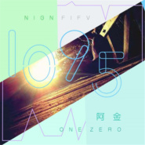
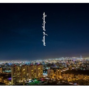
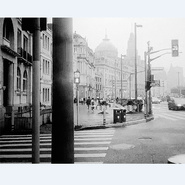

阿金和玄子
============================

|  |  |
| :--: | :-- |
| [ 阿金和玄子](https://i.xiami.com/ajin) | **地区**: China 中国大陆 **风格**: 硬核说唱 Hardcore Hip Hop, 流行说唱 Pop Rap, 流行摇滚 Pop Rock, 独立民谣 Indie Folk, 流行 Pop **播放数**: 13457383 **粉丝数**: 1161 **评论数**: 57  |

## 档案

把所有的一切记录下来，并写成歌词 
这里面可能有悲伤的故事，生活压抑带来的困扰 感悟等等.. 
在没有新原创之前，时不时会传一些翻唱 
生活就像音乐一样 总是需要新的感悟 
阿金，云南保山人，YOUNGSONG独立音乐厂牌负责人，非著名制作人，非著名说唱，摇滚，民谣歌手 
玄子，湖南妹子，陌陌知名女主播，擅长各种风格..并且唱的贼6..

## 专辑

| 名称 | 语种 | 唱片公司 | 发行时间 | 专辑类别 | 专辑风格 |
| :--: | :-- | :-- | :-- | :-- | :-- |
| [ SAVE ME](./albums/2104861915.md) | 国语 | 咚吧嗒文化 | 2019年05月09日 | EP, 单曲 |  |
| [ 1095](./albums/2104861916.md) | 国语 | 咚吧嗒文化 | 2019年05月09日 | EP, 单曲 | 国语流行 Mandarin Pop |
| [ 好聚好散](./albums/2103942225.md) | 国语 | 寿光坚诚 | 2018年08月23日 | EP, 单曲 | 国语流行 Mandarin Pop |
| [ NONE WANTS TO DO WITH ME](./albums/2102855909.md) | 国语 | 独立发行 | 2017年09月12日 | 录音室专辑 | 嘻哈 Hip-Hop |
| [ 无心无痛](./albums/2102877934.md) | 国语 | 太合音乐 | 2017年08月22日 | EP, 单曲 | 流行 Pop |
| [ 玄子翻唱精选](./albums/2102696160.md) | 国语 | YoungSong独立音乐 | 2017年02月08日 | EP, 单曲 | 流行 Pop |
| [ 执迷执迷](./albums/2100384376.md) | 国语 | YoungSong独立音乐 | 2016年08月30日 | EP, 单曲 | 流行说唱 Pop Rap |
| [ 乌兰巴托的夜阿金和玄子](./albums/2100352752.md) | 国语 | 独立发行 | 2016年06月11日 | 精选集 | 当代民谣 Contemporary Folk, 国语流行 Mandarin Pop |
| [ 我们都一样We are the same](./albums/2100352705.md) | 国语 | 独立发行 | 2016年06月11日 | EP, 单曲 | 老派说唱 Old-school Hip Hop |
| [ 妈妈](./albums/2100331514.md) | 国语 | 独立发行 | 2016年05月08日 | EP, 单曲 | 流行说唱 Pop Rap |
| [ 不要怕不要怕](./albums/2100305924.md) | 国语 | 独立发行 | 2016年04月04日 | 合集, 杂锦 | 传统民谣 Traditional Folk |
| [ 始终兰亭疾叙remix](./albums/2100303494.md) | 国语 | 独立发行 | 2016年03月31日 | EP, 单曲 | 流行说唱 Pop Rap |
| [ 明天 MIXTAPE (上)](./albums/1236130104.md) | 国语 | 独立发行 | 2015年07月01日 | 合集, 杂锦 | 流行说唱 Pop Rap, 当代民谣 Contemporary Folk |

## 评论

|  |  |  |
| :-- | :-- | :-- |
|  [虾米用户](https://emumo.xiami.com/u/309495101) 一个音乐发烧友 2020-07-13 16:23 赞(0) 踩(0) | 
唱的超级好，可是感觉录音设备还有杂音
 |
|  [虾米用户](https://emumo.xiami.com/u/331967302)  2020-02-09 13:49 赞(0) 踩(0) | 
很喜欢
 |
|  [虾米用户](https://emumo.xiami.com/u/432168070)  2019-12-16 13:04 赞(0) 踩(0) | 
随岁月，阿金的歌词也许会更动人。希望看到走到巅峰时期的阿金
 |
|  [虾米用户](https://emumo.xiami.com/u/432168070)  2019-12-16 13:02 赞(0) 踩(0) | 
这个女生的歌声具有穿透力，让人不由心生喜欢……
 |
|  [虾米用户](https://emumo.xiami.com/u/43933609) 你也是一朵蘑菇吗？ 2019-08-29 23:27 赞(0) 踩(0) | 

 |
|  [虾米用户](https://emumo.xiami.com/u/37974489) 你见过那么炫酷的未知生物... 2019-08-26 12:52 赞(0) 踩(0) | 
她的音色很好
 |
|  [虾米用户](https://emumo.xiami.com/u/37974489) 你见过那么炫酷的未知生物... 2019-08-26 12:52 赞(0) 踩(0) | 
哈哈,唱的是挺贼六的
 |
|  [虾米用户](https://emumo.xiami.com/u/421302621)  2019-07-02 07:46 赞(0) 踩(0) | 
真好听，喜欢你！
 |
|  [虾米用户](https://emumo.xiami.com/u/410868880) 一个创意，一种态度 2018-12-21 11:18 赞(1) 踩(0) | 
真好听
 |
|  [虾米用户](https://emumo.xiami.com/u/406193639)  2018-10-28 23:15 赞(0) 踩(0) | 
女声唱歌很好听
 |
|  [虾米用户](https://emumo.xiami.com/u/403987218)  2018-10-13 19:52 赞(1) 踩(0) | 
她们的歌声听着特舒服
 |
|  [虾米用户](https://emumo.xiami.com/u/356705164)  2018-10-10 14:38 赞(0) 踩(0) | 
好像不应该破坏888 
 |
|  [虾米用户](https://emumo.xiami.com/u/240900965) 我还没想好要写什么... 2018-09-21 14:10 赞(0) 踩(0) | 
不应该是个妹子吗？妹子呢 
 |
|  [虾米用户](https://emumo.xiami.com/u/9297421) 我还没想好要写什么... 2018-08-25 17:08 赞(0) 踩(0) | 
喜歡
 |
|  [虾米用户](https://emumo.xiami.com/u/46778988)  2018-07-31 22:05 赞(0) 踩(0) | 
这歌你也会唱？哈哈，知道我谁不？
 |
|  [虾米用户](https://emumo.xiami.com/u/803705)  2018-07-23 02:08 赞(0) 踩(0) | 
这么是硬核说唱，虾米这分类
 |
|  [虾米用户](https://emumo.xiami.com/u/250927329) 爱恨都有，爱，赢了恨 2018-06-04 17:50 赞(0) 踩(0) | 
内容已删除
 |
| ⇒ |  [虾米用户](https://emumo.xiami.com/u/350420708)  2018-08-31 20:18 赞(0) 踩(0) | 
就叫&amp;ldquo;玄&amp;rdquo;
 |
| ⇒ |  [虾米用户](https://emumo.xiami.com/u/410868880) 一个创意，一种态度 2018-12-21 11:18 赞(0) 踩(0) | 
陌陌的名字，也是叫（玄子）
 |
|  [虾米用户](https://emumo.xiami.com/u/352312091) 看着对你走来的那个人就够... 2018-05-21 01:49 赞(0) 踩(0) | 
内容已删除
 |
| ⇒ |  [虾米用户](https://emumo.xiami.com/u/35446985)  2018-09-28 09:37 赞(0) 踩(0) | 
拒绝？！！？                                                [18禁]  [文字up][文字up][文字cool]     [带墨镜笑]  
 |
|  [虾米用户](https://emumo.xiami.com/u/335320535)  2018-05-20 22:19 赞(0) 踩(0) | 
喜欢这首歌
 |
|  [虾米用户](https://emumo.xiami.com/u/363197274) 梦醒才明白，小菜只能开胃... 2018-05-06 18:17 赞(0) 踩(0) | 
喜欢你的太想念，听着歌儿，仿佛又见到了初恋
 |
|  [虾米用户](https://emumo.xiami.com/u/311375092) 也曾光脚路过 2018-02-28 16:03 赞(1) 踩(0) | 
谢谢你们阿金玄子听歌回忆养性
 |
|  [虾米用户](https://emumo.xiami.com/u/25174040) 冷冷清清风风火火 2018-01-18 07:56 赞(1) 踩(0) | 
封面头像是谁？
 |
| ⇒ |  [虾米用户](https://emumo.xiami.com/u/11898813) 阿金和玄子的虾米音乐小站 2018-01-18 08:31 赞(0) 踩(0) | 
阿金
 |
|  [虾米用户](https://emumo.xiami.com/u/327155535)  2017-11-29 20:45 赞(0) 踩(0) | 
好喜欢听       
 |
|  [虾米用户](https://emumo.xiami.com/u/337039897)  2017-11-24 17:53 赞(0) 踩(0) | 
你就不要想起我为什么没办法听啦！！！！！！！！！找也找不到了！！！！！！！！！！！求再发一次！！！！！！！！！！！！！！
 |
| ⇒ |  [虾米用户](https://emumo.xiami.com/u/285290903)  2017-12-01 20:37 赞(0) 踩(0) | 
 
 |
|  [虾米用户](https://emumo.xiami.com/u/335322970)  2017-11-16 20:07 赞(0) 踩(0) | 
非常棒啊！
 |
|  [虾米用户](https://emumo.xiami.com/u/317777232)  2017-10-14 09:18 赞(0) 踩(0) | 
好听啊，不火没道理，建议你们出自己的歌。 
 |
|  [虾米用户](https://emumo.xiami.com/u/116075772) 我还没想好要写什么... 2017-09-24 01:24 赞(0) 踩(0) | 
牛逼
 |
|  [虾米用户](https://emumo.xiami.com/u/116075772) 我还没想好要写什么... 2017-09-24 01:24 赞(0) 踩(0) | 
两个字表示一下心情。
 |
|  [虾米用户](https://emumo.xiami.com/u/284814904)   2017-08-25 17:29 赞(0) 踩(0) | 
可以
 |
|  [虾米用户](https://emumo.xiami.com/u/197487497)  2017-07-26 20:01 赞(0) 踩(0) | 
喜欢到爆
 |
|  [虾米用户](https://emumo.xiami.com/u/173069872)  2017-07-21 10:37 赞(0) 踩(0) | 
好听 
 |
|  [虾米用户](https://emumo.xiami.com/u/3607930) 一条红色的鱼，一只黑色的... 2017-06-16 21:05 赞(0) 踩(0) | 
自己的风格
 |
|  [虾米用户](https://emumo.xiami.com/u/19942005)  2017-06-13 20:34 赞(1) 踩(0) | 
玄子声音纯真不做作，听着容易有共鸣
 |
|  [虾米用户](https://emumo.xiami.com/u/289000970)  2017-06-07 10:27 赞(1) 踩(0) | 
玄子真的很不错，会一直默默支持你  
 |
|  [虾米用户](https://emumo.xiami.com/u/40783688)  2017-05-17 21:05 赞(3) 踩(0) | 
如果你看的见请和我联系，我想帮你做一个正式的mv。我的微信885623926
 |
| ⇒ |  [虾米用户](https://emumo.xiami.com/u/11898813) 阿金和玄子的虾米音乐小站 2017-06-07 03:23 赞(0) 踩(0) | 
？
 |
|  [虾米用户](https://emumo.xiami.com/u/146830062)  2017-05-09 00:43 赞(0) 踩(0) | 
执迷属实好听
 |
|  [虾米用户](https://emumo.xiami.com/u/135224668) 可惜不是你 2017-04-29 13:13 赞(1) 踩(0) | 
阿金真是太牛了。一直喜欢你
 |
|  [虾米用户](https://emumo.xiami.com/u/246357074)  2017-04-27 12:32 赞(1) 踩(0) | 
潜力存在 
 |
|  [虾米用户](https://emumo.xiami.com/u/182455326) 不用傻逼做补充 2017-04-16 18:15 赞(1) 踩(0) | 
时间总会带来惊喜 每一个难熬的时刻是你的执迷让我继续执迷
 |
|  [虾米用户](https://emumo.xiami.com/u/288356308)  2017-04-13 12:44 赞(2) 踩(0) | 
好喜欢阿金和玄子的为你心痛这首歌，太好听了
 |
|  [虾米用户](https://emumo.xiami.com/u/284512705)  2017-04-02 11:33 赞(1) 踩(0) | 
喜欢你的声音
 |
|  [虾米用户](https://emumo.xiami.com/u/273594733)   2017-03-08 16:41 赞(1) 踩(0) | 
走完了一程又一程&amp;hellip;&amp;hellip;又是一座城、还是一个人&amp;hellip;&amp;hellip;这里是&amp;hellip;&amp;hellip;成都
 |
|  [虾米用户](https://emumo.xiami.com/u/267044053) 虾米刷粉 2017-01-24 12:57 赞(0) 踩(0) | 
,./.,/.,
 |
|  [虾米用户](https://emumo.xiami.com/u/36680523)  2016-10-08 19:04 赞(0) 踩(0) | 
呵呵
 |
|  [虾米用户](https://emumo.xiami.com/u/141240592)  2016-09-11 12:21 赞(0) 踩(0) | 
阿金   你现在在哪里直播
 |
|  [虾米用户](https://emumo.xiami.com/u/36769676) 联系QQ 8126549 2016-09-03 20:48 赞(0) 踩(0) | 
执迷伴奏
 |
|  [虾米用户](https://emumo.xiami.com/u/147210772)  2016-08-29 13:33 赞(0) 踩(0) | 
护士小玄 
 |
|  [虾米用户](https://emumo.xiami.com/u/20452290) 在人事已非的景色里，我最... 2016-08-28 19:08 赞(0) 踩(0) | 
为乌兰巴托的夜 点赞！！！！！！！！！！！！
 |
|  [虾米用户](https://emumo.xiami.com/u/146837868)  2016-06-16 02:20 赞(1) 踩(0) | 
     
 |
|  [虾米用户](https://emumo.xiami.com/u/12876004) ` 2016-05-08 11:57 赞(0) 踩(0) | 
。，。
 |
|  [虾米用户](https://emumo.xiami.com/u/162987420)  2016-05-07 11:54 赞(1) 踩(0) | 
玄子实力派，好听
 |
|  [虾米用户](https://emumo.xiami.com/u/49633386)   2015-11-21 22:52 赞(1) 踩(0) | 
来支持下
 |
|  [虾米用户](https://emumo.xiami.com/u/11898813) 阿金和玄子的虾米音乐小站 2015-07-06 04:42 赞(17) 踩(0) | 
我刚入驻了阿里音乐人，欢迎大家来我的个人主页，收听我的最新音乐
 |
