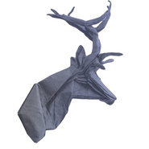
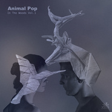

Animal Pop
============================

|  |  |
| :--: | :-- |
| [ Animal Pop](https://i.xiami.com/animalpop) | **地区**: China 中国大陆 **风格**: 浩室舞曲 House, 氛围浩室舞曲 Ambient House, 深浩室舞曲 Deep House **播放数**: 2894382 **粉丝数**: 272 **评论数**: 12  |

## 档案

Animal Pop是一位北京的Deep House 制作人，深受柏林和英国的Deep House 舞曲文化影响。他的音乐广泛的运用各种打击乐器以及真实的采样来创造丰满的乐器编配和节奏律动。飘渺的氛围，层层叠加的细微音效点缀，采样真实演奏的乐器，被混响浸透的合成音序旋律，金属质感的合成敲击乐器，他想通过这些元素引导听众更加直接和主观的欣赏这一风格的House音乐，享受其中传递的审美，而非利用音乐的律动和冲击性去操纵他们。

## 专辑

| 名称 | 语种 | 唱片公司 | 发行时间 | 专辑类别 | 专辑风格 |
| :--: | :-- | :-- | :-- | :-- | :-- |
| [ In The Woods Vol.2](./albums/1535402427.md) | 其他 | 燃音乐 | 2015年06月28日 | EP, 单曲 | 浩室舞曲 House, 深浩室舞曲 Deep House |
| [ In The Woods Vol.1](./albums/733843915.md) | 其他 | 燃音乐 | 2015年06月08日 | EP, 单曲 | 浩室舞曲 House, 深浩室舞曲 Deep House |

## 评论

|  |  |  |
| :-- | :-- | :-- |
|  [虾米用户](https://emumo.xiami.com/u/375582959) 我还没想好要写什么... 2020-06-27 18:33 赞(1) 踩(0) | 
竟然是国内的 不错不错
 |
|  [虾米用户](https://emumo.xiami.com/u/339073071)  2020-04-12 22:30 赞(0) 踩(0) | 
好音乐 超带感，赞
 |
|  [虾米用户](https://emumo.xiami.com/u/2493237) Star never l... 2019-11-22 21:55 赞(0) 踩(0) | 

 |
|  [虾米用户](https://emumo.xiami.com/u/50423311) R&B、House、氛围... 2019-11-19 12:07 赞(0) 踩(0) | 
超棒
 |
|  [虾米用户](https://emumo.xiami.com/u/118596438)  2019-08-27 10:52 赞(0) 踩(0) | 
听了好几遍，我非常喜欢
 |
|  [虾米用户](https://emumo.xiami.com/u/11749606) E l’alba ver... 2019-06-16 21:09 赞(0) 踩(0) | 
國內制作人啊厲害了
 |
|  [虾米用户](https://emumo.xiami.com/u/228843687) 懒惰统治人间 2019-04-04 20:45 赞(0) 踩(0) | 

 |
|  [虾米用户](https://emumo.xiami.com/u/951418) 一切过往，皆为序章。 2019-03-08 22:06 赞(0) 踩(0) | 
ོ
 |
|  [虾米用户](https://emumo.xiami.com/u/6096087) 我还没想好要写什么... 2017-11-13 21:49 赞(1) 踩(0) | 
厉害了！超级喜欢
 |
|  [虾米用户](https://emumo.xiami.com/u/22444238) 邱比官方虾米 2017-08-30 11:20 赞(1) 踩(0) | 
Get
 |
|  [虾米用户](https://emumo.xiami.com/u/9500689) i love music 2015-12-02 17:43 赞(0) 踩(0) | 
house music forever
 |
|  [虾米用户](https://emumo.xiami.com/u/50561603)  2015-06-09 17:28 赞(4) 踩(0) | 
我刚入驻了虾米音乐人，欢迎大家来我的个人主页，收听我的最新音乐
 |
