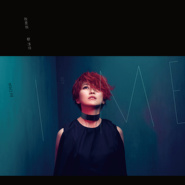
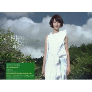
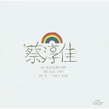
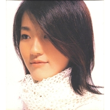

蔡淳佳
============================

|  |  |
| :--: | :-- |
| [ 蔡淳佳](https://i.xiami.com/ccj) | **地区**: Singapore 新加坡 **风格**: 国语流行 Mandarin Pop **播放数**: 66720627 **粉丝数**: 43734 **评论数**: 985  |

## 档案

新加坡女歌手，最初是新加坡海蝶音乐旗下歌手，后来转至新加坡Music Street唱片（现已被华纳唱片收购）。2000年才发行第一张专辑《蔡淳佳JOI》，一首翻唱的《爱如潮水》曾经备受瞩目，但由于种种原因，淳佳沉寂下来一直到现在签约1新加坡公司MUSICSTREET，才发行了令她重整出发的专辑《日出》。因演唱电视主题曲《陪我看日出》（收录于专辑《日出》中）一曲而成名，其专辑《日出》的销售量，在2004年全新加坡排行第8，2012年11月11日发行最新EP《视界观》。 
小档案 
中   文   名：蔡淳佳 
外   文   名：  Joi Chua 
国        籍：新加坡 
星        座：狮子座 
血        型：  A  型 
身        高：  168cm 
体        重：  48kg 
出   生   地：新加坡市 
出生日期：  1978  年  8  月  3  日 
职        业：歌手 
毕业院校：新加坡理工学院 
经纪公司：  MUSICSTREET 
代表作品：日出、庆幸有你爱我、依恋、回到最初、有一天我会、隐形纪念 
籍        贯：中国福建省 
艺人简介 
蔡淳佳（Joi Chua），1978年8月3日出生于新加坡城，新加坡流行乐女歌手。 
1996年，蔡淳佳参加了新加坡海蝶音乐所举办的非常歌手训练班，从并2000名对手中脱颖而出，加盟新加坡海蝶音乐，而蔡淳佳则决定在完成四年自己大学的学业之后在正式踏入乐坛。 
个人经历 
淳佳在18岁那年参加了新加坡海蝶音乐制作公司所办的『非常歌手』选拔活动。在近2000人当中，脱颖而出，成为入选的幸运女孩。从那时起，淳佳就一直被逼着想一件事：自己到底要不要出唱片？ 
海蝶音乐制作公司有位执着的音乐人，许环良。他从遇到淳佳开始，就一直鼓励她走上音乐路。 
对许环良来说，淳佳的声音，是可遇而不可求的。当时的淳佳，仍在念书。 
从13岁开始每年都会参加一二个大型的歌唱比赛。她说，她会挑素质好的比赛参加，搬些奖金奖品回家。 
只是，对于当歌手这件事，她从没有想过。学生的身分更让他不愿中断学业，就这样，淳佳让许环良等了四年。 
这四年中，淳佳为了兴趣，白天上课，晚上在民歌餐厅演唱，验光系毕了业，开始工作当验光师，还是唱。 
验光师的工作是每天从早上10点到晚上10点，淳佳就利用每周一天的休假去『木船民歌餐厅』演唱。 
为了兴趣，淳佳把自己弄得很累很累，可是她觉得高兴。许环良继续和淳佳保持连络，找她唱DEMO，不放弃的问她愿不愿意出唱片，不间断的游说淳佳…… 
淳佳答应许环良，是在母亲过世后。她说，经历生离死别，她想开很多事情。该做的事，就该及时去做。 
她不愿自己的人生，就在每天和一成不变的工作搏斗中渡过。 
四年来，淳佳被逼着想一件事，要不要出唱片，要不要投身音乐路。许环良等了淳佳四年，淳佳，在22岁这年，做了人生中，很重大的一个决定。 
中学一年级，13岁，淳佳开始参加校内的歌唱比赛。 
第一次，入围前五名。这之后的每一年，淳佳都会在校内外的比赛中，抱回奖杯。 
父亲在银行上班，母亲管教甚严，外表乖巧柔顺的淳佳，一直被视为会按照家人的期望过人生的好孩子。 
淳佳说，参加歌唱比赛，是自己向人生叛逆的方式。为了证明自己还能做些什么不同的事情，为了让一成不变的学生生活，留下回忆。也为了向单纯的人生寻找出口。淳佳选择唱歌，让自己不一样。 
他说，唱歌是我叛逆的一种方法。在后台紧张得发抖的乖乖牌好学生，上了舞台之后，立刻成为目光焦点。 
新加坡木船是一个很特别的地方，老板安排淳佳和不同的组合合作。接触过所有在木船表演的音乐人之后，找到最对味，最有默契的一群人，一起演唱。和台湾不同的地方在于，来这里的人，都是真正喜欢音乐的朋友，他们没有用餐，为了能专心听音乐，老板坚持自己的理念。也因此，淳佳在这里认识了许多好朋友。 
曾为包括许茹芸、周蕙等台湾许多知名歌手写过歌的新加坡创作人梁伟丰和唐玉璇，就是淳佳在驻唱生活中，所结识的死党。他们在木船演唱时，有一个BAND。 
淳佳和一样喜欢音乐的哥哥，梁伟丰、唐玉璇以及一位另女孩，就是这个BAND的完美组合。他们练歌写歌唱歌。淳佳说，他的人生中，最青春最美好的一段时光，都是在木船唱歌渡过的。 
专二参加海蝶音乐制作公司所办的『非常歌手』选拔活动，让淳佳的人生真的不一样了，只是18岁的淳佳，并不以为，那是多了不起的事。在一个小房间中，演出像是电影『金枝玉叶』选秀般的剧情。淳佳，就这样被许环良一眼相中，邀他加入海蝶。一直到要来台湾准备新专辑前，淳佳都还在木船演唱。 
她说，她永远也不会忘记，1999年的6月23日。她在木船的最后一场演出，所有的朋友都到齐了，常常来听他唱歌的歌迷，木船一起唱歌的朋友，大家好象在办道别演唱会一样，为淳佳加油。 
淳佳说，我要去台湾出唱片了，希望下次回来，就是带着我的新歌，唱给大家听。因为唱歌，淳佳不断的在生命的衔接点上，演出峰回路转的新剧情。 
这个22岁的年轻女孩，带着简单的行李，来到台湾。她用歌声向原本一成不变的人生叛逆，却意外开启了另一扇门。 
人物评价 
蔡淳佳，纸片人的纤弱身形让人以为她的个性可能也是如此；但是她一开口，一唱歌，原来，温柔可以很坚强，蔡淳佳的歌声，就像她的名字给人的感觉，干净无暇，有磁性的淳美声 
主要成就 
2009      第  4  届中国广播影视大奖原创歌曲奖亚太地区最佳华语歌手 
2007    Music Radio  中国  TOP  排行榜最佳专辑奖 
2006      新加坡最佳杰出青年奖

## 专辑

| 名称 | 语种 | 唱片公司 | 发行时间 | 专辑类别 | 专辑风格 |
| :--: | :-- | :-- | :-- | :-- | :-- |
| [ 我的时代](./albums/2103494368.md) | 国语 | 妙音鸟 | 2018年01月19日 | EP, 单曲 | 国语流行 Mandarin Pop |
| [ 我是我](./albums/2102736828.md) | 国语 | 诚利千代 | 2017年05月26日 | 录音室专辑 | 国语流行 Mandarin Pop, 华语唱作人 Chinese Singer-Songwriter |
| [ 自画像Self Portrait](./albums/2102653001.md) | 国语 | 诚利千代 | 2016年11月15日 | EP, 单曲 | 国语流行 Mandarin Pop, 华语唱作人 Chinese Singer-Songwriter |
| [ 会幸福吗](./albums/2100292450.md) | 国语 | 诚利千代 | 2016年03月14日 | EP, 单曲 | 国语流行 Mandarin Pop, 华语唱作人 Chinese Singer-Songwriter |
| [ 淳+](./albums/2100245440.md) | 国语 | 诚利千代 | 2015年12月22日 | EP, 单曲 | 国语流行 Mandarin Pop, 华语唱作人 Chinese Singer-Songwriter |
| [ 视界观Perspectives](./albums/532040.md) | 国语 | 大牌佳音 | 2012年11月10日 | EP, 单曲 | 国语流行 Mandarin Pop, 华语唱作人 Chinese Singer-Songwriter |
| [ 时间的礼盒 新歌+淳情精选](./albums/391682.md) | 国语 | 华纳音乐 | 2010年06月28日 | 精选集 | 国语流行 Mandarin Pop, 华语唱作人 Chinese Singer-Songwriter |
| [ 淳剧佳曲](./albums/499333.md) | 国语 | 华纳音乐 | 2010年01月04日 | 精选集 | 国语流行 Mandarin Pop |
| [ 回到最初](./albums/347543.md) | 国语 | 华纳音乐 | 2009年09月25日 | 录音室专辑 | 国语流行 Mandarin Pop, 华语唱作人 Chinese Singer-Songwriter |
| [ 庆幸拥有 蔡淳佳Joi Blessed](./albums/33023.md) | 国语 | 华纳音乐 | 2007年12月28日 | 录音室专辑 | 国语流行 Mandarin Pop |
| [ 蔡淳佳EP](./albums/32879.md) | 国语 | 华纳音乐 | 2007年06月30日 | EP, 单曲 | 国语流行 Mandarin Pop |
| [ 淳佳精选17首The Best of Joi](./albums/6904.md) | 国语 | 华纳音乐 | 2006年11月10日 | 精选集 | 国语流行 Mandarin Pop, 华语唱作人 Chinese Singer-Songwriter |
| [ 等一个晴天 新歌+精选](./albums/6905.md) | 国语 | 华纳音乐 | 2006年09月18日 | 精选集 | 国语流行 Mandarin Pop, 华语唱作人 Chinese Singer-Songwriter |
| [ 有一天我会](./albums/6906.md) | 国语 | Music Street | 2005年08月04日 | 录音室专辑 | 国语流行 Mandarin Pop |
| [ 日出陪我看日出](./albums/6907.md) | 国语 | Music Street | 2004年09月09日 | 录音室专辑 | 国语流行 Mandarin Pop |
| [ Joi 同名专辑蔡淳佳](./albums/6908.md) | 国语 | 海蝶音乐 | 2000年11月10日 | 录音室专辑 | 国语流行 Mandarin Pop |

## 评论

|  |  |  |
| :-- | :-- | :-- |
|  [虾米用户](https://emumo.xiami.com/u/443602524)  2020-10-17 22:13 赞(0) 踩(0) | 
音乐上的成就还可以更大，很棒
 |
|  [虾米用户](https://emumo.xiami.com/u/35201727) 再见 2020-10-16 12:36 赞(0) 踩(0) | 
气声唱法
 |
|  [虾米用户](https://emumo.xiami.com/u/332321065)  2020-08-17 18:43 赞(0) 踩(0) | 
我很欣赏妳这左右为难！很好听
 |
|  [虾米用户](https://emumo.xiami.com/u/161288048) 来啊，真心的人儿，我们一... 2020-08-03 11:35 赞(0) 踩(0) | 
感谢你在我曾经穷困潦倒的时候，有你的歌声陪伴，虽然仍然潦倒，祝生日快乐
 |
|  [虾米用户](https://emumo.xiami.com/u/966) 此論壇不需要簽字 2020-08-03 11:31 赞(0) 踩(0) | 
祝蔡姐生日快樂，也祝福我自己
 |
|  [虾米用户](https://emumo.xiami.com/u/10322977)  2020-08-03 11:18 赞(0) 踩(0) | 
刚毕业时，你的歌声陪伴了我
 |
|  [虾米用户](https://emumo.xiami.com/u/378324435)  2020-08-03 11:15 赞(1) 踩(0) | 
给人青春的声音
 |
|  [虾米用户](https://emumo.xiami.com/u/201853884)  2020-08-03 11:06 赞(0) 踩(0) | 
淳佳生日快乐
 |
|  [虾米用户](https://emumo.xiami.com/u/23630715) ：） 2020-08-03 10:31 赞(0) 踩(0) | 
happy birthday
 |
|  [虾米用户](https://emumo.xiami.com/u/277136693)  2020-08-03 10:13 赞(0) 踩(0) | 
生日快樂 平安，健康。事事順心。 特別喜歡你唱的 -- 陪我看日出  
 |
|  [虾米用户](https://emumo.xiami.com/u/319688150) 愿经典不被遗忘 2020-02-21 04:21 赞(1) 踩(0) | 

 |
|  [虾米用户](https://emumo.xiami.com/u/105720) Love Game of... 2020-02-06 00:56 赞(1) 踩(0) | 
唱片业不景气，，埋没了多少人才！
 |
|  [虾米用户](https://emumo.xiami.com/u/2469317) 每个人心中都有一团火，路... 2019-11-30 18:24 赞(0) 踩(0) | 
好久不见
 |
|  [虾米用户](https://emumo.xiami.com/u/352946313) 朋友们，虾米音乐就要和我... 2019-11-09 02:40 赞(0) 踩(0) | 
音乐界的高材生➕高颜值 
 |
|  [虾米用户](https://emumo.xiami.com/u/200277892)  2019-08-03 15:53 赞(0) 踩(0) | 
生日快乐。
 |
|  [虾米用户](https://emumo.xiami.com/u/65988992)  2019-08-03 12:13 赞(1) 踩(0) | 
佳姐生日快乐。 我第一个喜欢的偶像。
 |
|  [虾米用户](https://emumo.xiami.com/u/13620863)  2019-08-03 11:02 赞(0) 踩(0) | 

 |
|  [虾米用户](https://emumo.xiami.com/u/351396779)  2019-08-03 10:30 赞(0) 踩(0) | 
聲音好聽 繼續加油 生日愉快
 |
|  [虾米用户](https://emumo.xiami.com/u/330099202)  2019-08-03 10:16 赞(0) 踩(0) | 
祝福
 |
|  [虾米用户](https://emumo.xiami.com/u/10868456) 我就是我，是颜色不一样的... 2019-08-03 10:08 赞(0) 踩(0) | 
雨的气息～～～
 |
|  [虾米用户](https://emumo.xiami.com/u/380296431)  2019-07-09 17:56 赞(0) 踩(0) | 
******
 |
|  [虾米用户](https://emumo.xiami.com/u/193377100) Gone with wi... 2019-06-17 11:39 赞(0) 踩(0) | 
看了她的名片简介，觉得木船真的个美好的地方，遇到一群志同道合的伙伴，太幸运了。
 |
|  [虾米用户](https://emumo.xiami.com/u/83898222)   2019-06-13 23:09 赞(0) 踩(0) | 
好听好听！！
 |
|  [虾米用户](https://emumo.xiami.com/u/403155236) so what if 2019-05-10 15:27 赞(0) 踩(0) | 
好久不见
 |
|  [虾米用户](https://emumo.xiami.com/u/3877507) 劫尽观自在，动静两相宜。 2019-05-09 17:37 赞(0) 踩(0) | 
音色很甜
 |
|  [虾米用户](https://emumo.xiami.com/u/316992761)  2019-05-01 16:29 赞(1) 踩(0) | 
OMG 高中就听有心人有情人 到现在还在出歌啊 感觉就是唱片界的景甜 就是不红啊............
 |
|  [虾米用户](https://emumo.xiami.com/u/34885535)  2019-04-24 07:49 赞(0) 踩(0) | 
<a href="http://emumo.xiami.com/u/35318810" target="_blank" rel="nofollow" name_card="35318810">@魏小涵 </a>。。？7"*2卡呗！
 |
|  [虾米用户](https://emumo.xiami.com/u/2796166) 最爱莫文蔚..... 2018-12-29 00:11 赞(0) 踩(0) | 
加油！！！！
 |
|  [虾米用户](https://emumo.xiami.com/u/318069777)  2018-12-01 16:10 赞(1) 踩(0) | 
声音真好听啊
 |
|  [虾米用户](https://emumo.xiami.com/u/380245250)  2018-10-30 20:02 赞(2) 踩(0) | 
秒杀百分之九十九点五的新出的歌手，可惜不红啊。
 |
|  [虾米用户](https://emumo.xiami.com/u/2796166) 最爱莫文蔚..... 2018-10-17 11:05 赞(2) 踩(0) | 
非常厉害的歌者
 |
|  [虾米用户](https://emumo.xiami.com/u/340939272)  2018-09-27 11:39 赞(1) 踩(0) | 
大爱陪我看日出，我自己也在全民K歌里唱，赞赞赞
 |
|  [虾米用户](https://emumo.xiami.com/u/248867693)   2018-08-31 20:59 赞(3) 踩(0) | 
08年的时候，一位网友推荐她的《陪我看日出》，从此以后喜欢上了她的声音！经常在那么好听的声音为什么不红，但是有时候又不想她那么红，就像自己很珍惜的东西不想它烂大街一样！
 |
|  [虾米用户](https://emumo.xiami.com/u/201264057)  2018-08-08 00:09 赞(1) 踩(0) | 
  
 |
|  [虾米用户](https://emumo.xiami.com/u/7249300) 习惯，醒脑，排解，引导，... 2018-08-04 00:42 赞(1) 踩(0) | 
生快！ 
 |
|  [虾米用户](https://emumo.xiami.com/u/30333400) 音乐可以陶冶情操，平静心... 2018-08-03 21:49 赞(1) 踩(0) | 
生日快乐
 |
|  [虾米用户](https://emumo.xiami.com/u/1545529) 暂无签名~ 2018-08-03 13:50 赞(2) 踩(0) | 
生日快乐，Joi
 |
|  [虾米用户](https://emumo.xiami.com/u/2390658) 平和心境，豁达处事，用心... 2018-08-03 10:20 赞(1) 踩(0) | 
因为你，因为共同喜欢你的音乐，我遇到了音乐上的玩伴，趣味相投，时常共赏畅谈。
 |
|  [虾米用户](https://emumo.xiami.com/u/217721602) 广告位招租…… 2018-07-30 22:38 赞(1) 踩(0) | 
喜欢你的歌很多年了 
 |
|  [虾米用户](https://emumo.xiami.com/u/361017526)  2018-07-29 16:43 赞(1) 踩(0) | 
天籁
 |
|  [虾米用户](https://emumo.xiami.com/u/361099121) 什么都可以没有 不能没有 2018-07-28 07:06 赞(0) 踩(0) | 
确定第20张图是本人么？？？
 |
|  [虾米用户](https://emumo.xiami.com/u/346087991) 医路漫漫 音乐为伴 2018-07-09 21:23 赞(1) 踩(0) | 
看她出道，今天收藏了一首，只是不知道还在唱吗？
 |
|  [虾米用户](https://emumo.xiami.com/u/304982050)  2018-06-26 09:21 赞(1) 踩(0) | 
谁陪我去看日出
 |
|  [虾米用户](https://emumo.xiami.com/u/266094375) 过去我们喜欢新的歌，现在... 2018-06-19 23:00 赞(0) 踩(0) | 
刮奖刮到一个谢字就足够了，爱情也一样，没必要把谢谢惠顾四个字刮得干干净净才肯放手。   
 |
|  [虾米用户](https://emumo.xiami.com/u/317471426)  2018-05-28 13:51 赞(2) 踩(0) | 
第一次听她的歌，是在2007年，超级喜欢她~
 |
|  [虾米用户](https://emumo.xiami.com/u/357174846)  2018-05-24 21:14 赞(3) 踩(0) | 
很早听过依恋的，很美，平缓流淌于耳边
 |
|  [虾米用户](https://emumo.xiami.com/u/360218072)  2018-05-11 12:06 赞(2) 踩(0) | 
声音太喜欢了
 |
|  [虾米用户](https://emumo.xiami.com/u/52492195) 飞蛾扑火 2018-04-17 11:30 赞(2) 踩(0) | 
永远支持
 |
|  [虾米用户](https://emumo.xiami.com/u/339801727) 与虾米分离在即，纵有千般... 2018-03-06 23:29 赞(2) 踩(0) | 
听了这首，后来才知道是翻唱夏川里美的《泪光闪闪》，原唱听了，也很不错。都喜欢。
 |
|  [虾米用户](https://emumo.xiami.com/u/339801727) 与虾米分离在即，纵有千般... 2018-03-06 23:27 赞(1) 踩(0) | 
好听，就一个字！
 |
|  [虾米用户](https://emumo.xiami.com/u/239721859)  2018-02-02 14:58 赞(2) 踩(0) | 
超喜欢！加油！！！
 |
|  [虾米用户](https://emumo.xiami.com/u/288119210) 社会很单纯，复杂的才是人... 2018-01-24 23:20 赞(1) 踩(0) | 
爱你，么么哒
 |
|  [虾米用户](https://emumo.xiami.com/u/238206120) 有花当折何须折，占有不如... 2018-01-24 16:31 赞(2) 踩(0) | 
蔡淳佳的声音很好听，很暖   
 |
|  [虾米用户](https://emumo.xiami.com/u/337574176)  2017-12-31 16:57 赞(1) 踩(0) | 
你的歌很好听
 |
|  [虾米用户](https://emumo.xiami.com/u/108835982)   2017-12-26 07:51 赞(11) 踩(0) | 
有人评论说有一些歌曲是翻唱的，可是人家声音真的很好听，不想听请不要污染评论的环境，谢谢
 |
|  [虾米用户](https://emumo.xiami.com/u/309014677)  2017-12-12 08:06 赞(1) 踩(0) | 
嗯(⊙_⊙)
 |
|  [虾米用户](https://emumo.xiami.com/u/337100907)  2017-11-25 00:46 赞(4) 踩(0) | 
你好，很喜欢你的《依恋》。百听不厌，谢谢
 |
|  [虾米用户](https://emumo.xiami.com/u/4793902) 孤单的时候才知道你真正想... 2017-11-22 08:32 赞(2) 踩(0) | 
加油啊，注意身体
 |
|  [虾米用户](https://emumo.xiami.com/u/263975019)  2017-10-31 12:50 赞(4) 踩(0) | 
在某个凌晨和两个舍友喝了酒打车到校门口，学校里的便利店在放她的《依恋》，从此喜欢在夜深人静时戴上耳机听她的歌
 |
|  [虾米用户](https://emumo.xiami.com/u/2293852)  2017-10-28 00:24 赞(1) 踩(0) | 
君が好きだと叫びたい╭(╯3╰)╮**最近比较喜欢Pimchanok Leuwisetpaibul
 |
|  [虾米用户](https://emumo.xiami.com/u/4811600)  2017-10-28 00:00 赞(1) 踩(0) | 
最近开始喜欢的
 |
|  [虾米用户](https://emumo.xiami.com/u/7438016) happy togeth... 2017-10-27 23:10 赞(0) 踩(0) | 
小小的人大大的能量，关键还是狮子座~~~听着她的歌，会充满希望，会相信无论多远，多久，都会有放晴的时候
 |
|  [虾米用户](https://emumo.xiami.com/u/327008616) 海阔天空，一生何求？浪子... 2017-10-22 14:20 赞(3) 踩(0) | 
爱如潮水翻唱得绝好！是男人都会被折服了，很清澈、很迷离的声线！
 |
|  [虾米用户](https://emumo.xiami.com/u/8635478) 换个地方思考 2017-10-14 15:07 赞(0) 踩(0) | 
还行，好象听出了爵士的感觉
 |
|  [虾米用户](https://emumo.xiami.com/u/21622750) 就聽好歌 2017-10-09 19:38 赞(2) 踩(0) | 
我靠，快40的女人了还这么嫩
 |
|  [虾米用户](https://emumo.xiami.com/u/285342803) 从今天开始爱上音乐 2017-10-08 05:25 赞(1) 踩(0) | 
《陪你看日出》好美的画面
 |
|  [虾米用户](https://emumo.xiami.com/u/197632272)  2017-10-06 20:26 赞(0) 踩(0) | 
17106
 |
|  [虾米用户](https://emumo.xiami.com/u/21856867) paradise 2017-09-25 22:26 赞(1) 踩(0) | 
治愈系，听着很温暖。
 |
|  [虾米用户](https://emumo.xiami.com/u/301385852) 我还没想好要写什么... 2017-09-04 15:03 赞(0) 踩(0) | 
你給的抱歉，多想沒聽見
 |
|  [虾米用户](https://emumo.xiami.com/u/194792138) 想念如雨 突然袭来 2017-09-01 00:34 赞(1) 踩(0) | 
依恋陪伴我度过了最难过最难挨的时光！
 |
| ⇒ |  [虾米用户](https://emumo.xiami.com/u/289267615)  2017-09-01 23:21 赞(0) 踩(0) | 
这首歌是初恋推荐给我听的，一直忘不掉
 |
| ⇒ |  [虾米用户](https://emumo.xiami.com/u/194792138) 想念如雨 突然袭来 2017-09-02 22:27 赞(0) 踩(0) | 
<q><b>orangeeeeees说：</b></q>
 |
|  [虾米用户](https://emumo.xiami.com/u/315882571)  2017-08-28 00:11 赞(1) 踩(0) | 
在日本电车上每天都会循环听上几遍，好听！
 |
|  [虾米用户](https://emumo.xiami.com/u/50676775)  2017-07-24 17:51 赞(2) 踩(0) | 
声音太好了
 |
|  [虾米用户](https://emumo.xiami.com/u/49303880) 我还没想好要写什么... 2017-07-23 21:39 赞(2) 踩(0) | 
依恋。。。檐前雨
 |
|  [虾米用户](https://emumo.xiami.com/u/190604050) 再见昨天。 2017-07-06 22:35 赞(16) 踩(0) | 
因为《陪我看日出》这首歌，手绘了一件情侣海边看日出的T恤 这是我心里最美的画面
 |
| ⇒ |  [虾米用户](https://emumo.xiami.com/u/30973073)  2019-07-21 10:59 赞(0) 踩(0) | 
可惜的是虾米没有她唱的这个版本。
 |
|  [虾米用户](https://emumo.xiami.com/u/120906106)  2017-06-27 15:27 赞(3) 踩(0) | 
很喜欢的一位歌手
 |
|  [虾米用户](https://emumo.xiami.com/u/253082222) 寒天一点水，点点在心头 2017-05-29 15:39 赞(2) 踩(0) | 
么么哒 真好听
 |
|  [虾米用户](https://emumo.xiami.com/u/288384885)  2017-05-23 21:30 赞(1) 踩(0) | 
蔡淳佳
 |
|  [虾米用户](https://emumo.xiami.com/u/115799024) 你一直说的那个公园已经拆... 2017-05-23 10:14 赞(2) 踩(0) | 
看好Joi
 |
|  [虾米用户](https://emumo.xiami.com/u/185215817) 随你 2017-05-16 17:19 赞(2) 踩(0) | 
真的好听
 |
|  [虾米用户](https://emumo.xiami.com/u/25961375)  2017-05-01 00:07 赞(0) 踩(0) | 
佢同梁咏琪把声我几乎分唔清楚&amp;hellip;&amp;hellip;。
 |
| ⇒ |  [虾米用户](https://emumo.xiami.com/u/13930964) PKU 冲冲冲！ 2017-07-02 15:41 赞(0) 踩(0) | 
你噶白话猴呖！( &amp;bull;̀&amp;forall;&amp;bull;́ )
 |
|  [虾米用户](https://emumo.xiami.com/u/119739188) you are my e... 2017-04-26 08:57 赞(0) 踩(0) | 
喜欢依恋 
 |
|  [虾米用户](https://emumo.xiami.com/u/5152841) 音乐是最后的解药 2017-04-25 17:01 赞(0) 踩(0) | 
声音有点像梁咏琪...
 |
| ⇒ |  [虾米用户](https://emumo.xiami.com/u/25961375)  2017-05-01 00:06 赞(0) 踩(0) | 
真系好似！！！你唔讲我都唔觉！！！
 |
| ⇒ |  [虾米用户](https://emumo.xiami.com/u/3941600)  2017-12-14 15:02 赞(0) 踩(0) | 
音色是有点像，但是梁咏琪的港普口音更明显
 |
|  [虾米用户](https://emumo.xiami.com/u/259616365)  2017-04-23 03:49 赞(1) 踩(0) | 
这些歌好听，说岀了心里想要说的。
 |
|  [虾米用户](https://emumo.xiami.com/u/4934037)   2017-04-14 00:01 赞(0) 踩(0) | 
就是爱
 |
|  [虾米用户](https://emumo.xiami.com/u/68239582)  2017-04-03 12:03 赞(0) 踩(0) | 
啦啦咯很好听    
 |
|  [虾米用户](https://emumo.xiami.com/u/285481414) 云 2017-04-03 03:13 赞(0) 踩(0) | 

 |
|  [虾米用户](https://emumo.xiami.com/u/283196860)  2017-03-26 19:06 赞(1) 踩(0) | 

 |
|  [虾米用户](https://emumo.xiami.com/u/282934164)  2017-03-24 14:59 赞(0) 踩(0) | 
原唱是谁？
 |
|  [虾米用户](https://emumo.xiami.com/u/281820534)   2017-03-19 23:49 赞(0) 踩(0) | 
好听
 |
|  [虾米用户](https://emumo.xiami.com/u/18862956) 用舍由时，行藏在我 2017-03-17 23:23 赞(1) 踩(0) | 
想去新加坡看你，演唱会看完又来听
 |
|  [虾米用户](https://emumo.xiami.com/u/275288562)  2017-02-24 09:07 赞(0) 踩(0) | 
翻唱了好听的歌曲
 |
|  [虾米用户](https://emumo.xiami.com/u/273694509)   2017-02-18 20:55 赞(0) 踩(0) | 
很好听
 |
|  [虾米用户](https://emumo.xiami.com/u/41247317) 认真做事真诚做人 幸福就... 2017-02-15 13:55 赞(0) 踩(0) | 
一如既往地被干净的嗓音吸引
 |
|  [虾米用户](https://emumo.xiami.com/u/197575245)  2017-02-11 15:30 赞(0) 踩(0) | 
人美声甜
 |
|  [虾米用户](https://emumo.xiami.com/u/272042118)  2017-02-09 13:51 赞(0) 踩(0) | 
偶然听到了左右为难，而刚好是我当下的心境。谁说这不是缘分呢？
 |
|  [虾米用户](https://emumo.xiami.com/u/84645626) 有你我依然还在 2017-02-05 22:27 赞(0) 踩(0) | 
加油   
 |
|  [虾米用户](https://emumo.xiami.com/u/265334818)  2017-01-26 12:43 赞(2) 踩(0) | 
无意中听到她的歌，真的好喜欢
 |
|  [虾米用户](https://emumo.xiami.com/u/214225991)  2017-01-18 23:17 赞(0) 踩(0) | 
8d t
 |
|  [虾米用户](https://emumo.xiami.com/u/6247097) 我的耳朵已娶音乐为妻 2016-12-08 16:03 赞(0) 踩(0) | 
蔡淳佳、梁咏琪、郭静，我觉得可以划在一起
 |
|  [虾米用户](https://emumo.xiami.com/u/224402162)  2016-11-19 18:44 赞(1) 踩(0) | 
hello
 |
|  [虾米用户](https://emumo.xiami.com/u/15472545) 希言 2016-11-14 21:02 赞(4) 踩(0) | 
无意中听到她的歌，真的不明白这样的歌手为什么就不红，值得收藏她全部歌曲的一个歌手。
 |
|  [虾米用户](https://emumo.xiami.com/u/98105642) 从未如此开心 2016-09-15 21:16 赞(0) 踩(0) | 
有空一定要去你店里买眼镜
 |
|  [虾米用户](https://emumo.xiami.com/u/196207011)  2016-09-04 17:24 赞(0) 踩(0) | 
舒服，一直喜欢
 |
|  [虾米用户](https://emumo.xiami.com/u/122688364) 生在愤坑，长在赤圈；挣脱 2016-08-25 22:46 赞(0) 踩(0) | 
3075
 |
|  [虾米用户](https://emumo.xiami.com/u/43980967)  2016-08-15 14:39 赞(1) 踩(0) | 
等一个晴天
 |
|  [虾米用户](https://emumo.xiami.com/u/174014950) 我们用多一点点的辛苦，来... 2016-08-05 22:10 赞(2) 踩(0) | 
声音超级温暖
 |
|  [虾米用户](https://emumo.xiami.com/u/209060958)  2016-08-04 23:08 赞(0) 踩(0) | 
《超神学院-黑甲》片尾曲支持《超神学院》
 |
|  [虾米用户](https://emumo.xiami.com/u/206027750)  2016-07-28 10:23 赞(1) 踩(0) | 
好温暖的聲音, 讚呀..
 |
|  [虾米用户](https://emumo.xiami.com/u/35577075) 再见 2016-07-27 12:57 赞(0) 踩(0) | 
很巧的是喜欢的都下架了 
 |
|  [虾米用户](https://emumo.xiami.com/u/27983792)  2016-06-20 11:35 赞(0) 踩(0) | 
喜歡的女歌手
 |
|  [虾米用户](https://emumo.xiami.com/u/3729088)  2016-05-21 21:03 赞(1) 踩(0) | 
因为超神学院《黑甲》的片尾曲蔷薇来的0.0推荐推荐，好听
 |
|  [虾米用户](https://emumo.xiami.com/u/30874227) 该是新的开始了 2016-05-13 16:40 赞(0) 踩(0) | 
为什么喜欢的歌都下架了！！！
 |
| ⇒ |  [虾米用户](https://emumo.xiami.com/u/2307526) 连接比特与像素的造梦师！ 2016-05-23 16:28 赞(0) 踩(0) | 
虾米已死！说是正版化，这么久过去了，但是只见能听到歌越来越少，拿到的版权基本没发现，下架的居多！
 |
|  [虾米用户](https://emumo.xiami.com/u/152529212) 小声听，大声唱~ 2016-04-26 19:44 赞(1) 踩(0) | 
喜欢《依恋》，坐在你旁边。
 |
|  [虾米用户](https://emumo.xiami.com/u/13645082)  2016-04-17 15:56 赞(0) 踩(0) | 
翻唱一两首，觉得欸这声音还蛮不错的，翻唱多了就腻味了，感觉好像都没人给她写歌一样，只好不停的去翻唱
 |
|  [虾米用户](https://emumo.xiami.com/u/47483045) 快乐 2016-03-06 20:44 赞(0) 踩(0) | 
好听
 |
|  [虾米用户](https://emumo.xiami.com/u/47483045) 快乐 2016-03-06 20:44 赞(1) 踩(0) | 
中国第一部穿越剧的主题歌，很好听
 |
| ⇒ |  [虾米用户](https://emumo.xiami.com/u/307016653)  2017-12-24 20:42 赞(0) 踩(0) | 
非常好听
 |
|  [虾米用户](https://emumo.xiami.com/u/286463) 音乐不是歌 2016-02-25 23:07 赞(0) 踩(0) | 
温暖的声音
 |
|  [虾米用户](https://emumo.xiami.com/u/20458921) 。 2016-01-25 19:44 赞(1) 踩(0) | 
可以上我是歌手呢
 |
| ⇒ |  [虾米用户](https://emumo.xiami.com/u/7670602)   2016-02-12 02:37 赞(0) 踩(0) | 
<q><b>说：</b></q>
 |
| ⇒ |  [虾米用户](https://emumo.xiami.com/u/42217242)   2016-02-16 19:44 赞(0) 踩(0) | 
<q><b>猪阿不是P君说：</b></q>
 |
|  [虾米用户](https://emumo.xiami.com/u/6375713)  2016-01-16 00:01 赞(0) 踩(0) | 
BEAUTIFUL VOICE.
 |
|  [虾米用户](https://emumo.xiami.com/u/72666568)  2016-01-15 19:15 赞(1) 踩(0) | 
这么多年了你还听蔡淳佳么
 |
| ⇒ |  [虾米用户](https://emumo.xiami.com/u/13425584) 啦啦啦 2016-03-22 23:37 赞(0) 踩(0) | 
听啊
 |
|  [虾米用户](https://emumo.xiami.com/u/30179008) 暂无签名~ 2016-01-12 22:04 赞(1) 踩(0) | 
自然 舒服
 |
|  [虾米用户](https://emumo.xiami.com/u/89964018)  2015-12-25 18:15 赞(0) 踩(0) | 
恍惚间声音有点像我最爱滴 gigi..很温暖，很纯净
 |
|  [虾米用户](https://emumo.xiami.com/u/38888777) 今日之事今日毕 2015-12-22 19:41 赞(10) 踩(0) | 
之前不知道是翻译再唱，不过几首日，棒等国的确实不错。总的来说，与原曲水平不相上下，实现了中文环境的无缝对接。拿来用了，而且用好了，这就是有诚意。至于说翻唱各国歌曲改成中文的，几乎所有的华语天王天后们都有这样的歌。这也是个普遍现象。也是国人喜闻乐见的，说实话，中文词让人亲近，非得去听什么原唱的外语？如果两厢比较，我还是支持这种中文的翻唱。毕竟，那些外文不是我的母语，不能引起我的共鸣。感谢翻译重新创作的编曲作词人和歌手，带给我这一系列重创金曲。你们很不错，继续发挥，期待更佳作品。
 |
| ⇒ |  [虾米用户](https://emumo.xiami.com/u/100754488) 回首向来萧瑟处 也无风雨... 2019-12-18 13:13 赞(0) 踩(0) | 
同意
 |
|  [虾米用户](https://emumo.xiami.com/u/47928217)   2015-12-17 12:52 赞(0) 踩(0) | 
12月21日蔡淳佳在北京有live show，粉丝社区--乐扒APP在免费送1280元的票，歌迷朋友们可以去试试
 |
|  [虾米用户](https://emumo.xiami.com/u/1858508) 人可生如蚁而美如神 2015-12-02 12:21 赞(33) 踩(0) | 
在我心中只有“唱得好”和“唱得不好”两个标准，没有“翻唱就一定不如原唱”的强盗逻辑╮(╯▽╰)╭
 |
|  [虾米用户](https://emumo.xiami.com/u/7062746) 额…好吧 2015-11-28 17:56 赞(2) 踩(0) | 
声音的感情很饱满…像成熟的果子，“淳”厚地要溢出来╰(￣▽￣)╭…
 |
|  [虾米用户](https://emumo.xiami.com/u/72666568)  2015-11-13 13:25 赞(0) 踩(0) | 
翟萌萌，三年了，九点后路灯下的影子八点后座的我低声的唱着七点小区门口假装的偶遇。一直在同一座城市一直说着话一直默契着没有说出那句话一直，前座后座。
 |
|  [虾米用户](https://emumo.xiami.com/u/75448220) 季節交替時光飛逝，任誰會... 2015-11-12 16:16 赞(26) 踩(0) | 
翻唱又如何呢？默默地支持她。她在我心中，是一个即使很久不提也会想起来的一位歌手，好像永远在那里。
 |
|  [虾米用户](https://emumo.xiami.com/u/35659684)  2015-11-10 10:24 赞(0) 踩(0) | 
超喜欢的感觉 ，陪我看日出 好舒爽
 |
|  [虾米用户](https://emumo.xiami.com/u/78330412) 开心时入耳，难过时入心 2015-11-08 11:05 赞(0) 踩(0) | 
纯净的声音
 |
|  [虾米用户](https://emumo.xiami.com/u/7639752)  2015-11-04 16:10 赞(1) 踩(0) | 
怎么她的歌全是翻唱
 |
|  [虾米用户](https://emumo.xiami.com/u/534911)  2015-10-28 20:19 赞(0) 踩(0) | 
舒服,好听,
 |
|  [虾米用户](https://emumo.xiami.com/u/14745470) 陪伴了我7年时间的虾米 ... 2015-10-23 14:47 赞(1) 踩(0) | 
蔡淳佳 翻歌之王啊……
 |
|  [虾米用户](https://emumo.xiami.com/u/68363136) 拒绝活的太深刻 2015-10-18 04:55 赞(0) 踩(0) | 
一个雪碧口味的声音
 |
|  [虾米用户](https://emumo.xiami.com/u/926931)  2015-10-17 18:41 赞(0) 踩(0) | 
温暖的女声
 |
|  [虾米用户](https://emumo.xiami.com/u/33526842) 乐手与人生 2015-10-14 00:45 赞(0) 踩(0) | 
她的声音那么像阿sa，大家没有觉得嘛？
 |
|  [虾米用户](https://emumo.xiami.com/u/72442788)  2015-10-08 12:18 赞(0) 踩(0) | 
Sweet voice , great performace
 |
|  [虾米用户](https://emumo.xiami.com/u/66977960) 存在即合理 2015-09-18 10:50 赞(0) 踩(0) | 
阿佳的新电影 想入飞飞 昨天在新加坡上映了，是纪念风飞飞的电影 看了预告片感觉剧情不错 阿佳的演绎也很不错 希望到时候能看到电影
 |
|  [虾米用户](https://emumo.xiami.com/u/66977960) 存在即合理 2015-09-18 10:48 赞(0) 踩(0) | 
大爱阿佳，其实其间有断断续续的发过其他新歌，比如玻璃，一传一，信约，念，不过虾米都没有
 |
|  [虾米用户](https://emumo.xiami.com/u/17226843) ☆ 2015-09-15 01:40 赞(0) 踩(0) | 
王菲加梁静茹加梁咏琪。你说呢？嗯？？ 
 |
|  [虾米用户](https://emumo.xiami.com/u/50696410)  2015-08-18 17:21 赞(1) 踩(0) | 
高中的时候经常听她的歌啊。
 |
|  [虾米用户](https://emumo.xiami.com/u/1604862) 这家伙比较懒，是啊，没空 2015-08-14 16:04 赞(0) 踩(0) | 
总觉得有点像梁静茹
 |
|  [虾米用户](https://emumo.xiami.com/u/2555708)  2015-08-09 19:58 赞(2) 踩(0) | 
我从不生产好歌曲，我只是好歌曲的搬运工
 |
|  [虾米用户](https://emumo.xiami.com/u/8269111) 有了滑板鞋天黑都不怕 2015-07-08 20:22 赞(0) 踩(0) | 
点错了
 |
|  [虾米用户](https://emumo.xiami.com/u/4804122)  2015-07-07 00:39 赞(4) 踩(0) | 
前天见到了Joi，真的像做梦一样，听了她十多年了，我连话都不知道怎么说了，还好，她够nice，她现在在忙自己的事业，不过明年就有新专辑了！大家继续支持吧！
 |
| ⇒ |  [虾米用户](https://emumo.xiami.com/u/4544) 我继续，你要随意 2015-07-12 21:28 赞(0) 踩(0) | 
明年就有新专辑了???真的假的？
 |
| ⇒ |  [虾米用户](https://emumo.xiami.com/u/6630660) 猜赢涂口红… 2015-07-13 11:43 赞(0) 踩(0) | 
<q><b>Jonathan说：</b></q>
 |
| ⇒ |  [虾米用户](https://emumo.xiami.com/u/4804122)  2015-07-14 00:33 赞(0) 踩(0) | 
<q><b>Jonathan说：</b></q>
 |
| ⇒ |  [虾米用户](https://emumo.xiami.com/u/4544) 我继续，你要随意 2015-07-14 09:01 赞(0) 踩(0) | 
<q><b>Sam煜说：</b></q>
 |
| ⇒ |  [虾米用户](https://emumo.xiami.com/u/4804122)  2015-07-14 09:03 赞(0) 踩(0) | 
<q><b>Jonathan说：</b></q>
 |
| ⇒ |  [虾米用户](https://emumo.xiami.com/u/42203068)  2015-08-12 20:32 赞(0) 踩(0) | 
<q><b>Sam煜说：</b></q>
 |
| ⇒ |  [虾米用户](https://emumo.xiami.com/u/4804122)  2015-08-16 22:46 赞(0) 踩(0) | 
<q><b>土木信逸说：</b></q>
 |
|  [虾米用户](https://emumo.xiami.com/u/38640339) 我想好写什么了…… 2015-06-30 23:35 赞(0) 踩(0) | 

 |
|  [虾米用户](https://emumo.xiami.com/u/5102126)  2015-06-27 19:33 赞(1) 踩(0) | 
当时在机房听她的歌，边看小说，日子真美好啊
 |
|  [虾米用户](https://emumo.xiami.com/u/2694183) 人生太短 听音乐都不够 2015-06-26 00:16 赞(0) 踩(0) | 
听她的歌 就会想起初恋
 |
|  [虾米用户](https://emumo.xiami.com/u/1582578) 暂无签名~ 2015-06-18 08:09 赞(0) 踩(0) | 
喜欢上她的声音
 |
|  [虾米用户](https://emumo.xiami.com/u/4802464) 设私美以示丰饶 2015-06-16 21:44 赞(1) 踩(0) | 
翻唱狂魔
 |
|  [虾米用户](https://emumo.xiami.com/u/3845059)  2015-06-14 18:31 赞(0) 踩(0) | 
是走迪克牛仔路线吗
 |
|  [虾米用户](https://emumo.xiami.com/u/4874803)  2015-06-08 18:05 赞(0) 踩(0) | 
fs
 |
|  [虾米用户](https://emumo.xiami.com/u/35577075) 再见 2015-06-04 08:22 赞(0) 踩(0) | 
我爱你
 |
|  [虾米用户](https://emumo.xiami.com/u/43922499)  2015-05-24 16:16 赞(1) 踩(0) | 
她是新加坡人
 |
|  [虾米用户](https://emumo.xiami.com/u/43087742)  2015-05-24 14:41 赞(0) 踩(0) | 
第一次发现这个名字，棒
 |
|  [虾米用户](https://emumo.xiami.com/u/50195927) 四眼，包子脸。 2015-05-20 03:27 赞(0) 踩(0) | 
辣么好听
 |
|  [虾米用户](https://emumo.xiami.com/u/8287577) Stay alive. 2015-05-19 18:03 赞(0) 踩(0) | 
这几年又干什么去了也没有专辑…
 |
|  [虾米用户](https://emumo.xiami.com/u/9386375) 落下的是一颗疲倦的心 2015-05-15 19:58 赞(3) 踩(0) | 
感觉她的翻唱给了歌曲新的味道啊，难得不讨厌的翻唱
 |
|  [虾米用户](https://emumo.xiami.com/u/7315939)  2015-04-19 19:56 赞(3) 踩(0) | 
上《我是歌手》吧
 |
|  [虾米用户](https://emumo.xiami.com/u/41772659)  2015-04-10 10:58 赞(0) 踩(0) | 
2000年就有她专辑 但觉得一直不瘟不火
 |
|  [虾米用户](https://emumo.xiami.com/u/7871510)  2015-04-02 17:45 赞(2) 踩(0) | 
尽管好多翻唱还是很喜欢。。因为我可以唱中文版的了 ^_^
 |
|  [虾米用户](https://emumo.xiami.com/u/3694425) 哈哈哈3 2015-03-27 21:44 赞(0) 踩(0) | 
test
 |
|  [虾米用户](https://emumo.xiami.com/u/7597511)  2015-03-13 08:04 赞(0) 踩(0) | 
刚刚在火车上听到未知的以后，瞬间被简单的旋律吸引，搜歌词搜到这首歌，找到蔡淳佳，发现，被这声音迷住了。
 |
| ⇒ |  [虾米用户](https://emumo.xiami.com/u/7597511)  2015-03-13 08:04 赞(0) 踩(0) | 
哈，第八百条评论
 |
| ⇒ |  [虾米用户](https://emumo.xiami.com/u/330863887)  2017-10-19 20:08 赞(0) 踩(0) | 
火车上听到过她的歌
 |
|  [虾米用户](https://emumo.xiami.com/u/12279329) 我还没想好要写什么... 2015-03-13 05:13 赞(0) 踩(0) | 
充满感情的声音
 |
|  [虾米用户](https://emumo.xiami.com/u/7585793) Self Healed 2015-02-07 21:43 赞(0) 踩(0) | 
喜欢的第一个女歌手
 |
|  [虾米用户](https://emumo.xiami.com/u/8508614)  2015-01-29 15:26 赞(0) 踩(0) | 
好听
 |
|  [虾米用户](https://emumo.xiami.com/u/617910)  2015-01-20 11:19 赞(0) 踩(0) | 
新加坡歌手的声音总是温暖。
 |
|  [虾米用户](https://emumo.xiami.com/u/45740840)  2015-01-19 12:46 赞(0) 踩(0) | 
好听
 |
|  [虾米用户](https://emumo.xiami.com/u/2523233) 太热 2015-01-19 02:03 赞(1) 踩(0) | 
声音喜欢。
 |
|  [虾米用户](https://emumo.xiami.com/u/4018863)  2015-01-18 13:48 赞(0) 踩(0) | 
出名的歌 都是翻唱的 声音听着舒服
 |
|  [虾米用户](https://emumo.xiami.com/u/35577075) 再见 2015-01-01 00:44 赞(0) 踩(0) | 
加油淳佳
 |
|  [虾米用户](https://emumo.xiami.com/u/16849606)   2014-12-23 02:15 赞(0) 踩(0) | 
很干净的声音 很温暖 很温柔 喜欢
 |
|  [虾米用户](https://emumo.xiami.com/u/9326231)  2014-12-03 01:00 赞(0) 踩(0) | 

 |
|  [虾米用户](https://emumo.xiami.com/u/6831446)  2014-12-01 23:34 赞(0) 踩(0) | 
声音好听
 |
|  [虾米用户](https://emumo.xiami.com/u/12749976) SOS 2014-11-29 21:00 赞(1) 踩(0) | 
纯纯的声音，安心舒适
 |
|  [虾米用户](https://emumo.xiami.com/u/23483694)  2014-11-19 00:08 赞(0) 踩(0) | 
安静时听，赞一个
 |
|  [虾米用户](https://emumo.xiami.com/u/36263661) 悲观主义者 2014-11-17 09:33 赞(0) 踩(0) | 
呆
 |
|  [虾米用户](https://emumo.xiami.com/u/26490600) 精选集狂人ZQ。 2014-10-27 23:53 赞(0) 踩(0) | 
用心制作每一张精选集，值得你来试听。
 |
|  [虾米用户](https://emumo.xiami.com/u/4951186)  2014-10-25 12:25 赞(0) 踩(0) | 
这声音怎么那么像刘惜君
 |
| ⇒ |  [虾米用户](https://emumo.xiami.com/u/771098) 来自外星球的访客 2014-11-07 19:38 赞(0) 踩(0) | 
她出道的时候 刘惜君是谁 没有人知道
 |
| ⇒ |  [虾米用户](https://emumo.xiami.com/u/4951186)  2014-11-08 14:41 赞(0) 踩(0) | 
<q><b>冷月说：</b></q>
 |
|  [虾米用户](https://emumo.xiami.com/u/37025216)  2014-10-20 11:59 赞(0) 踩(0) | 
挺喜欢《檐前雨》的，有种清新空灵的感觉
 |
|  [虾米用户](https://emumo.xiami.com/u/3743437)  2014-10-19 01:01 赞(0) 踩(0) | 
爱如潮水
 |
|  [虾米用户](https://emumo.xiami.com/u/27603068) 阳光下，茶杯里的味道 2014-10-10 08:00 赞(0) 踩(0) | 
纯净的嗓音
 |
|  [虾米用户](https://emumo.xiami.com/u/3154276)  2014-10-09 16:21 赞(0) 踩(0) | 
好听
 |
|  [虾米用户](https://emumo.xiami.com/u/41207101) 沉痛悼念a站 2014-10-09 15:45 赞(1) 踩(0) | 
蛮喜欢的
 |
|  [虾米用户](https://emumo.xiami.com/u/2214908)  2014-10-09 11:49 赞(2) 踩(0) | 
声音有点像梁咏琪哦
 |
|  [虾米用户](https://emumo.xiami.com/u/6770643) 谨言慎行，戒急用忍 2014-10-09 00:29 赞(0) 踩(0) | 
夏川里美和伊莲娜霍娜翻唱的都还不错。赞
 |
|  [虾米用户](https://emumo.xiami.com/u/10203148) 临 2014-09-30 23:36 赞(0) 踩(0) | 
感动
 |
|  [虾米用户](https://emumo.xiami.com/u/34918968) Do best myse... 2014-09-27 12:21 赞(0) 踩(0) | 
low
 |
|  [虾米用户](https://emumo.xiami.com/u/20798871) 还给彼此的生活 就让我们 2014-09-25 16:31 赞(0) 踩(0) | 
许茹芸、梁静茹、邓丽君这一类玉女派歌手的标杆
 |
|  [虾米用户](https://emumo.xiami.com/u/12234448) 黄金时代 2014-09-23 18:24 赞(0) 踩(0) | 
她的声音，有夏天晚风拂过的感觉
 |
|  [虾米用户](https://emumo.xiami.com/u/13552)  2014-09-16 16:26 赞(0) 踩(0) | 
依恋
 |
|  [虾米用户](https://emumo.xiami.com/u/1655898) 雨不歇，心绵绵 2014-09-15 19:44 赞(0) 踩(0) | 
唱功很好，其实我更想说真像我前女友啊。。。
 |
|  [虾米用户](https://emumo.xiami.com/u/9018887)  2014-09-15 10:46 赞(1) 踩(0) | 
同意热门评论，诚意的翻唱没必要黑，她的声音真的好好，歌都唱出了自己的感觉。
 |
|  [虾米用户](https://emumo.xiami.com/u/41136099)  2014-09-12 11:04 赞(0) 踩(0) | 
纯纯的
 |
|  [虾米用户](https://emumo.xiami.com/u/29199497) 为你自己而活。 2014-09-07 21:32 赞(0) 踩(0) | 
无所谓了，声音好听就行了。
 |
|  [虾米用户](https://emumo.xiami.com/u/8537877) 生活不易，不如快乐。 2014-08-25 17:20 赞(0) 踩(0) | 
好听啊
 |
|  [虾米用户](https://emumo.xiami.com/u/3106787) 安静 澎湃 2014-08-14 11:02 赞(0) 踩(0) | 
一顿翻唱啊
 |
|  [虾米用户](https://emumo.xiami.com/u/11147774) 用有限来换无限 2014-08-12 13:41 赞(0) 踩(0) | 
女神级别的歌手！！
 |
|  [虾米用户](https://emumo.xiami.com/u/11147774) 用有限来换无限 2014-08-12 13:40 赞(0) 踩(0) | 
长相甜美，歌声清新~
 |
|  [虾米用户](https://emumo.xiami.com/u/12957417) 我有个耳朵挑剔的老公 2014-08-10 01:59 赞(0) 踩(0) | 
非常喜欢的很有气质，干净温暖的女声，还有很多好听的作品。
 |
|  [虾米用户](https://emumo.xiami.com/u/90033) 樂园 2014-08-06 08:37 赞(0) 踩(0) | 
-
 |
|  [虾米用户](https://emumo.xiami.com/u/9431245)  2014-08-05 14:04 赞(0) 踩(0) | 
很特别的一把声
 |
|  [虾米用户](https://emumo.xiami.com/u/13919954) 情不知所起，一往而深！ 2014-07-26 11:35 赞(0) 踩(0) | 
一首歌最吸引人的是也许不光光是歌曲本身，或许还有某些因素在内心深种，故而才会一遍遍不断的去听，去欣赏。
 |
|  [虾米用户](https://emumo.xiami.com/u/11938655)  2014-07-21 10:41 赞(0) 踩(0) | 
清新自然
 |
|  [虾米用户](https://emumo.xiami.com/u/3570490) 收藏100首50首不能听 2014-07-18 20:57 赞(0) 踩(0) | 
唉...本来挺喜欢的
 |
|  [虾米用户](https://emumo.xiami.com/u/7910525) 有音乐的世界不孤单 2014-07-12 20:34 赞(0) 踩(0) | 
声音我的菜，很温暖的感觉
 |
|  [虾米用户](https://emumo.xiami.com/u/31370171)   2014-07-12 00:11 赞(0) 踩(0) | 
纯静
 |
|  [虾米用户](https://emumo.xiami.com/u/9430725) 当为神所佑 2014-07-06 17:59 赞(0) 踩(0) | 
治愈系
 |
|  [虾米用户](https://emumo.xiami.com/u/10581589)  2014-07-05 12:04 赞(0) 踩(0) | 
好好听听
 |
|  [虾米用户](https://emumo.xiami.com/u/9926785)  2014-07-02 10:33 赞(0) 踩(0) | 
喜欢
 |
|  [虾米用户](https://emumo.xiami.com/u/34989284) 男人就要面对生活的一切 2014-06-25 17:57 赞(0) 踩(0) | 
声音有感染力，
 |
|  [虾米用户](https://emumo.xiami.com/u/853523)  2014-06-12 16:04 赞(150) 踩(0) | 
诚意的翻唱我不想黑
 |
| ⇒ |  [虾米用户](https://emumo.xiami.com/u/9003931) 千淘万漉虽辛苦 2014-07-01 17:24 赞(0) 踩(0) | 
只是知识普及，并无褒贬之义。得罪之处，还望海涵。
 |
|  [虾米用户](https://emumo.xiami.com/u/5691092) 爱生活 爱音乐 爱影视 2014-06-12 10:24 赞(0) 踩(0) | 
收藏
 |
|  [虾米用户](https://emumo.xiami.com/u/92230)  2014-06-02 19:41 赞(0) 踩(0) | 
太喜欢了   第一次在电台听到  就非常喜欢   据说是新加坡的 眼科医生？  还是配镜师？
 |
|  [虾米用户](https://emumo.xiami.com/u/31929452) 想而不问 2014-05-24 11:08 赞(0) 踩(0) | 
喜欢
 |
|  [虾米用户](https://emumo.xiami.com/u/28775901)  2014-05-22 12:03 赞(0) 踩(0) | 
声音干净
 |
|  [虾米用户](https://emumo.xiami.com/u/3732074)  2014-05-14 09:12 赞(0) 踩(0) | 
早上起来听到的美妙声音
 |
|  [虾米用户](https://emumo.xiami.com/u/35695348)  2014-05-11 12:54 赞(0) 踩(0) | 
倒爱~
 |
|  [虾米用户](https://emumo.xiami.com/u/36239392)  2014-05-05 12:54 赞(0) 踩(0) | 
好声音。
 |
| ⇒ |  [虾米用户](https://emumo.xiami.com/u/34034031)  2014-05-11 12:05 赞(0) 踩(0) | 
好喜欢的声音
 |
|  [虾米用户](https://emumo.xiami.com/u/13620863)  2014-05-03 17:13 赞(0) 踩(0) | 
复古？
 |
|  [虾米用户](https://emumo.xiami.com/u/13756228)  2014-05-02 16:22 赞(0) 踩(0) | 
good
 |
|  [虾米用户](https://emumo.xiami.com/u/19995614) 暂无签名~ 2014-05-02 09:43 赞(0) 踩(0) | 
佳佳声音很好听
 |
|  [虾米用户](https://emumo.xiami.com/u/16871571) #uncondition... 2014-05-01 05:49 赞(0) 踩(0) | 
庆幸有你爱我
 |
|  [虾米用户](https://emumo.xiami.com/u/9018887)  2014-04-25 14:38 赞(0) 踩(0) | 
翻唱得都很好听啊，声音不错不错~
 |
|  [虾米用户](https://emumo.xiami.com/u/2595903) 我还没想好要写什么... 2014-04-24 15:44 赞(0) 踩(0) | 
声音好，气质佳，却始终红不起来(╯﹏╰)
 |
|  [虾米用户](https://emumo.xiami.com/u/6385284) 我还没想好要写什么... 2014-04-22 19:49 赞(0) 踩(0) | 
果然疗伤女歌手收听量都不低╮(╯_╰)╭
 |
|  [虾米用户](https://emumo.xiami.com/u/5915842) 没空去控妹的怪蜀熟 2014-04-22 10:27 赞(0) 踩(0) | 
好听
 |
|  [虾米用户](https://emumo.xiami.com/u/3460503)  2014-04-19 20:24 赞(0) 踩(0) | 
天哪！！！简直世风日下 现在的人都怎么了 连阿佳都有人黑！！
 |
| ⇒ |  [虾米用户](https://emumo.xiami.com/u/2555708)  2014-04-21 19:16 赞(0) 踩(0) | 
难道实话实说也叫黑？
 |
| ⇒ |  [虾米用户](https://emumo.xiami.com/u/9003931) 千淘万漉虽辛苦 2014-04-23 00:21 赞(0) 踩(0) | 
只是知识普及，并无褒贬之义。得罪之处，还望海涵。
 |
|  [虾米用户](https://emumo.xiami.com/u/25751323)  2014-04-14 15:09 赞(0) 踩(0) | 
123
 |
|  [虾米用户](https://emumo.xiami.com/u/25751323)  2014-04-14 15:09 赞(0) 踩(0) | 
好聽
 |
|  [虾米用户](https://emumo.xiami.com/u/9118347) have no idea 2014-04-13 14:53 赞(0) 踩(0) | 
初高中那六年
 |
|  [虾米用户](https://emumo.xiami.com/u/4106015) 3.1415926535 2014-04-10 18:20 赞(0) 踩(0) | 
第一次听到她的声音是在周末回去的公交上，交广网里喧嚣的广告结束后突然传来她的《陪我看日出》（当时并不知道歌名和演唱者），舒缓的节奏和旋律犹如娓娓道来般，让我立刻触电一般，换个说法就像恋爱的感觉。原谅我在那样嘈杂的环境下没有听清哪怕一句歌词，心想恐怕又要错过一首好歌，直到第二次在好友的车载CD里才又听到熟悉的歌声，熟悉的感觉，这才知道了她的名字。
 |
|  [虾米用户](https://emumo.xiami.com/u/1326729)  2014-04-05 21:39 赞(0) 踩(0) | 
like
 |
|  [虾米用户](https://emumo.xiami.com/u/18239320) To be myself... 2014-04-05 14:34 赞(0) 踩(0) | 
纯美的音符，从她的口中被清晰地吐出，仿佛有了一种无以言喻的魔力。因为她是蔡淳佳，仅此而已。
 |
|  [虾米用户](https://emumo.xiami.com/u/4241117) 心外无物 2014-04-03 14:53 赞(0) 踩(0) | 
还有说声音好的 你知道做后期音频的 即便你跑调 叉音 声音不够清澈 都会修改 改到连你都不相信的程度。这些歌手有什么好追捧的 真正值得佩服的 一个好的作曲 作词 一个神一般的编曲 外加牛哄哄的制作人肯包装你 你就是貌似姚晨也能红透全中国。
 |
|  [虾米用户](https://emumo.xiami.com/u/4241117) 心外无物 2014-04-03 14:51 赞(0) 踩(0) | 
翻唱歌的一大好处 就是去外面的时候不会被愤愤怒视 怎样 无知的愤愤们
 |
|  [虾米用户](https://emumo.xiami.com/u/7466850) 不畏将来，不念过往 2014-04-03 12:41 赞(0) 踩(0) | 
流淌的私语与曼妙的音符
 |
|  [虾米用户](https://emumo.xiami.com/u/34704072)  2014-04-02 14:36 赞(0) 踩(0) | 
喜欢
 |
|  [虾米用户](https://emumo.xiami.com/u/870493)  2014-03-25 16:55 赞(0) 踩(0) | 
舒服舒服，很舒服。。。
 |
|  [虾米用户](https://emumo.xiami.com/u/664090)  2014-03-22 19:27 赞(0) 踩(0) | 
喜欢淳佳
 |
|  [虾米用户](https://emumo.xiami.com/u/1988433)  2014-03-14 13:45 赞(0) 踩(0) | 
等一个晴天~~
 |
|  [虾米用户](https://emumo.xiami.com/u/9430725) 当为神所佑 2014-03-14 12:15 赞(1) 踩(0) | 
佳姐 我来投靠你了 找不到感人的声音
 |
|  [虾米用户](https://emumo.xiami.com/u/8646494)  2014-03-13 08:26 赞(0) 踩(0) | 
纯美
 |
|  [虾米用户](https://emumo.xiami.com/u/314047)  2014-03-10 15:07 赞(0) 踩(0) | 
copy cat
 |
|  [虾米用户](https://emumo.xiami.com/u/32990010) 人生的無常,總是無奈.. 2014-02-27 23:50 赞(0) 踩(0) | 
GOOD
 |
|  [虾米用户](https://emumo.xiami.com/u/6286938)  2014-02-27 20:37 赞(0) 踩(0) | 
非常喜欢恋之憩，歌词美丽，唱的也好！
 |
|  [虾米用户](https://emumo.xiami.com/u/17691484)  2014-02-27 17:17 赞(0) 踩(0) | 
第一个晴天，好听
 |
|  [虾米用户](https://emumo.xiami.com/u/2607701)  2014-02-26 14:02 赞(0) 踩(0) | 
高中的时候迷恋过一阵子
 |
|  [虾米用户](https://emumo.xiami.com/u/409961) 是我是我还是我 2014-02-25 18:07 赞(0) 踩(0) | 
好听的vocal，但为什么总觉得欠点什么。。。。。
 |
|  [虾米用户](https://emumo.xiami.com/u/20172097)  2014-02-16 00:43 赞(1) 踩(0) | 
在tw好像沒那麼hit，不過很喜歡他溫暖感動的歌聲!
 |
|  [虾米用户](https://emumo.xiami.com/u/9636977)  2014-02-10 23:43 赞(1) 踩(0) | 
Beauty
 |
|  [虾米用户](https://emumo.xiami.com/u/3268924) 朴素且真实吧 2014-02-07 11:46 赞(1) 踩(0) | 
淳美
 |
|  [虾米用户](https://emumo.xiami.com/u/2307526) 连接比特与像素的造梦师！ 2014-01-17 14:03 赞(1) 踩(0) | 
等一个晴天！
 |
|  [虾米用户](https://emumo.xiami.com/u/2555708)  2014-01-16 19:26 赞(82) 踩(0) | 
搬运工做的不错，搬来了世界各国的好歌曲
 |
|  [虾米用户](https://emumo.xiami.com/u/3711647)   丢到马桶让水流 2014-01-16 16:02 赞(1) 踩(0) | 
让人很舒服的姑娘
 |
|  [虾米用户](https://emumo.xiami.com/u/15378674) 你懷念的，我緬懷的。 2014-01-10 23:28 赞(1) 踩(0) | 
那时的日出。
 |
|  [虾米用户](https://emumo.xiami.com/u/5838496) 不曾变化的心意 2014-01-08 20:30 赞(1) 踩(0) | 
我们是大自然的搬运工!但是真的很不错,至少方便那些想唱某些歌但是不会外语的同志们~
 |
|  [虾米用户](https://emumo.xiami.com/u/11938655)  2013-12-11 15:55 赞(1) 踩(0) | 
声临其景，甜甜的回味！
 |
|  [虾米用户](https://emumo.xiami.com/u/4376156) 暂无签名~ 2013-12-10 14:33 赞(1) 踩(0) | 
轻盈又有磁力线的嗓音很迷人     至少一瞬迷倒了我        O(∩_∩)O~
 |
|  [虾米用户](https://emumo.xiami.com/u/15775349)  2013-12-05 17:12 赞(0) 踩(0) | 
6336
 |
|  [虾米用户](https://emumo.xiami.com/u/28992120) 笨重而不轻狂 2013-12-04 04:38 赞(0) 踩(0) | 
轻盈优雅
 |
|  [虾米用户](https://emumo.xiami.com/u/1851561)  2013-11-28 22:26 赞(3) 踩(0) | 
看见那些刨原曲的就烦 。。。讨不讨厌啊
 |
|  [虾米用户](https://emumo.xiami.com/u/11590705)  2013-11-07 08:40 赞(0) 踩(0) | 
清新的歌聲.讓人一聽就喜歡.
 |
|  [虾米用户](https://emumo.xiami.com/u/15462222) ytbt 2013-11-04 11:26 赞(0) 踩(0) | 
讓我們的心中永遠有一片陽光照耀的晴空✿‿✿  把眼前的痛苦看淡，或許痛苦之後就是幸福✿‿✿  ✿‿✿歡喜✿‿✿開心來分享✿‿✿
 |
|  [虾米用户](https://emumo.xiami.com/u/50591) FUCK！ 2013-10-30 21:27 赞(0) 踩(0) | 
治愈系小女人。
 |
|  [虾米用户](https://emumo.xiami.com/u/2407025)  2013-10-29 12:58 赞(0) 踩(0) | 
哇，同月同日生啊~~
 |
|  [虾米用户](https://emumo.xiami.com/u/2648920) 喜欢静静地听略带忧伤的歌 2013-10-28 15:23 赞(0) 踩(0) | 
声音很甜，很清澈
 |
|  [虾米用户](https://emumo.xiami.com/u/10865206)  2013-10-23 21:04 赞(0) 踩(0) | 
···
 |
|  [虾米用户](https://emumo.xiami.com/u/5578775)  2013-10-23 05:00 赞(0) 踩(0) | 
小清晰
 |
|  [虾米用户](https://emumo.xiami.com/u/2555708)  2013-10-13 18:18 赞(1) 踩(0) | 
翻唱小天后
 |
|  [虾米用户](https://emumo.xiami.com/u/13949306)  2013-09-29 09:09 赞(0) 踩(0) | 
好聽
 |
|  [虾米用户](https://emumo.xiami.com/u/5301278)  2013-09-27 19:34 赞(0) 踩(0) | 
好听
 |
|  [虾米用户](https://emumo.xiami.com/u/15695159) 我爱听歌 2013-09-17 13:21 赞(0) 踩(0) | 
喜欢
 |
|  [虾米用户](https://emumo.xiami.com/u/8675232)  2013-09-14 09:46 赞(0) 踩(0) | 
@发疯的桶 这首歌是你的style
 |
|  [虾米用户](https://emumo.xiami.com/u/18623602) 我是一棵草，风雨欲飘摇。 2013-09-13 15:11 赞(0) 踩(0) | 
一首歌，一个人
 |
|  [虾米用户](https://emumo.xiami.com/u/13384674)  2013-09-13 14:20 赞(0) 踩(0) | 
没有为什么
 |
|  [虾米用户](https://emumo.xiami.com/u/11724776)  2013-09-12 00:24 赞(1) 踩(0) | 
翻唱歌曲太多，尤其听过原唱以后，总觉得听了出戏。。但是，有些歌，有故事的人，会听得懂。
 |
|  [虾米用户](https://emumo.xiami.com/u/13949306)  2013-09-11 08:43 赞(0) 踩(0) | 
愛啊~~~~~~~
 |
|  [虾米用户](https://emumo.xiami.com/u/21645875)  2013-09-11 00:04 赞(0) 踩(0) | 
喜欢
 |
|  [虾米用户](https://emumo.xiami.com/u/21607571)  2013-09-10 13:13 赞(0) 踩(0) | 
喜欢啊啊啊
 |
|  [虾米用户](https://emumo.xiami.com/u/4193297) 完美主义者 2013-09-10 10:55 赞(0) 踩(0) | 
佳人
 |
|  [虾米用户](https://emumo.xiami.com/u/2691052) 且看那青山綠水別來無恙。 2013-09-08 01:53 赞(1) 踩(0) | 
眼里眉间真的很棒
 |
|  [虾米用户](https://emumo.xiami.com/u/12927990) 暂无签名~ 2013-09-05 15:33 赞(0) 踩(0) | 
纯净
 |
|  [虾米用户](https://emumo.xiami.com/u/7634793) 爱还在 2013-08-24 20:08 赞(0) 踩(0) | 
很平静的感觉
 |
|  [虾米用户](https://emumo.xiami.com/u/4049657)  2013-08-23 16:10 赞(0) 踩(0) | 
我爱蔡淳佳
 |
|  [虾米用户](https://emumo.xiami.com/u/18495160)  2013-08-14 15:09 赞(0) 踩(0) | 
清新,纯净
 |
|  [虾米用户](https://emumo.xiami.com/u/18495160)  2013-08-14 15:09 赞(0) 踩(0) | 
清新,纯净
 |
|  [虾米用户](https://emumo.xiami.com/u/19288042)  2013-08-14 14:06 赞(0) 踩(0) | 
试下分享后是什么效果~~~
 |
|  [虾米用户](https://emumo.xiami.com/u/3711647)   丢到马桶让水流 2013-08-02 17:23 赞(0) 踩(0) | 
名字好熟悉
 |
|  [虾米用户](https://emumo.xiami.com/u/7997953)  2013-08-01 21:05 赞(0) 踩(0) | 
声音干净悦耳，像泉水滴咚至心里
 |
|  [虾米用户](https://emumo.xiami.com/u/9940676)  2013-07-31 22:01 赞(0) 踩(0) | 
ok
 |
|  [虾米用户](https://emumo.xiami.com/u/756907)  2013-07-28 21:13 赞(0) 踩(0) | 
就是知道是翻唱所以才特意听她的歌的，最开始以为会翻唱的很烂，没想到出乎意料的好听
 |
|  [虾米用户](https://emumo.xiami.com/u/2689520)  2013-07-26 21:11 赞(0) 踩(0) | 
翻唱歌曲 不是都能火吗？这翻唱这么多 为什么，难道你是新加坡人的关系？
 |
|  [虾米用户](https://emumo.xiami.com/u/563009)  2013-07-26 19:54 赞(0) 踩(0) | 
好听，风纯~
 |
|  [虾米用户](https://emumo.xiami.com/u/8419815) 一个在当地比较有节操的人 2013-07-26 08:08 赞(0) 踩(0) | 
干净的声音
 |
|  [虾米用户](https://emumo.xiami.com/u/13329264) 我是  神    经病 2013-07-24 12:33 赞(0) 踩(0) | 
.
 |
|  [虾米用户](https://emumo.xiami.com/u/4231156)  2013-07-11 18:55 赞(0) 踩(0) | 
...
 |
|  [虾米用户](https://emumo.xiami.com/u/9097383)  2013-07-10 19:32 赞(0) 踩(0) | 
喜欢
 |
|  [虾米用户](https://emumo.xiami.com/u/4011131) longlongago 2013-07-06 20:12 赞(0) 踩(0) | 
好干净的声音
 |
|  [虾米用户](https://emumo.xiami.com/u/1354172) 留孤亟待屋里巷 为此挂心... 2013-07-03 02:16 赞(0) 踩(0) | 
各种翻唱
 |
|  [虾米用户](https://emumo.xiami.com/u/11929223)  2013-06-27 17:24 赞(0) 踩(0) | 
很干净的声音啊！
 |
|  [虾米用户](https://emumo.xiami.com/u/1573927)  2013-06-25 13:41 赞(0) 踩(0) | 
会唱，有心
 |
|  [虾米用户](https://emumo.xiami.com/u/15451352) 嘻嘻嘻嘻嘻嘻嘻嘻嘻～暗爽 2013-06-19 21:25 赞(0) 踩(0) | 
like
 |
|  [虾米用户](https://emumo.xiami.com/u/2282929) 不挥霍生命，不随便生活。 2013-06-17 19:36 赞(0) 踩(0) | 
舒服
 |
|  [虾米用户](https://emumo.xiami.com/u/9257035) 我还没想好要写什么... 2013-06-17 14:11 赞(0) 踩(0) | 
纯净的声音
 |
|  [虾米用户](https://emumo.xiami.com/u/347982)  2013-06-17 01:58 赞(0) 踩(0) | 
有些承诺，需要一生等待去兑现。
 |
|  [虾米用户](https://emumo.xiami.com/u/7171419)  2013-06-14 19:13 赞(0) 踩(0) | 
最初的声线，最初的感动
 |
|  [虾米用户](https://emumo.xiami.com/u/1484818)  2013-06-10 17:45 赞(0) 踩(0) | 
淡淡
 |
|  [虾米用户](https://emumo.xiami.com/u/2829623) 野蛮生长，不忘初心 2013-06-06 22:42 赞(0) 踩(0) | 
虽然很多都是翻唱，但是翻唱质量还是挺有诚意的，不像国内的某些公司抄袭了还打死不承认，还说自己是原创
 |
|  [虾米用户](https://emumo.xiami.com/u/12291510)  2013-06-06 16:03 赞(1) 踩(0) | 
干净的声音
 |
|  [虾米用户](https://emumo.xiami.com/u/15817141)  2013-06-03 23:32 赞(0) 踩(0) | 
舒服
 |
|  [虾米用户](https://emumo.xiami.com/u/1206217)  2013-06-03 02:34 赞(0) 踩(0) | 
干净的声音
 |
|  [虾米用户](https://emumo.xiami.com/u/5124326)  2013-06-02 21:42 赞(0) 踩(0) | 
轻松，慵懒
 |
|  [虾米用户](https://emumo.xiami.com/u/3901881)  2013-06-02 01:26 赞(1) 踩(0) | 
她的歌，歌词，歌声，都无法抑制的温暖。
 |
|  [虾米用户](https://emumo.xiami.com/u/5150695)  2013-05-28 15:02 赞(0) 踩(0) | 
声音很好听
 |
|  [虾米用户](https://emumo.xiami.com/u/15367732)  2013-05-21 16:33 赞(0) 踩(0) | 
純淨的聲音
 |
|  [虾米用户](https://emumo.xiami.com/u/5533004) 爱一个人，一辈子 2013-05-20 13:21 赞(0) 踩(0) | 
声音很好听
 |
|  [虾米用户](https://emumo.xiami.com/u/6448634)  2013-05-14 22:58 赞(0) 踩(0) | 
好听
 |
|  [虾米用户](https://emumo.xiami.com/u/11305738) 安静倾听 2013-05-13 16:22 赞(0) 踩(0) | 
声音真的无杂质啊
 |
|  [虾米用户](https://emumo.xiami.com/u/7633729)  2013-05-13 05:20 赞(0) 踩(0) | 
Soft, mature, and clear voice.
 |
|  [虾米用户](https://emumo.xiami.com/u/14936700)  2013-05-11 19:26 赞(1) 踩(0) | 
amazing voice
 |
|  [虾米用户](https://emumo.xiami.com/u/9504335)  2013-05-10 17:14 赞(0) 踩(0) | 
看过《初见》，喜欢前座后座，也喜欢上了她
 |
|  [虾米用户](https://emumo.xiami.com/u/14507643) 你就是我的音乐 2013-05-07 18:46 赞(0) 踩(0) | 
好有回忆的感觉。。
 |
|  [虾米用户](https://emumo.xiami.com/u/1486330)  2013-05-04 21:25 赞(0) 踩(0) | 
声音挺好听的，哈哈....
 |
|  [虾米用户](https://emumo.xiami.com/u/14320754)  2013-05-03 19:47 赞(0) 踩(0) | 
g
 |
|  [虾米用户](https://emumo.xiami.com/u/11774938)  2013-04-26 17:41 赞(1) 踩(0) | 
非常好听，值得我给给出人生中第一个评价
 |
|  [虾米用户](https://emumo.xiami.com/u/13730346) 生得悲哀，死得窝囊。。。 2013-04-20 21:11 赞(0) 踩(0) | 
爱爱爱
 |
|  [虾米用户](https://emumo.xiami.com/u/6963904)  2013-04-20 09:57 赞(0) 踩(0) | 
特纯净的声音
 |
|  [虾米用户](https://emumo.xiami.com/u/13672320)  2013-04-18 18:20 赞(0) 踩(0) | 
非常喜欢
 |
|  [虾米用户](https://emumo.xiami.com/u/8734760)  2013-04-18 17:44 赞(0) 踩(0) | 
实力派
 |
|  [虾米用户](https://emumo.xiami.com/u/13984264)  2013-04-17 21:00 赞(0) 踩(0) | 
因为喜欢
 |
|  [虾米用户](https://emumo.xiami.com/u/8734760)  2013-04-17 17:42 赞(0) 踩(0) | 
实力派
 |
|  [虾米用户](https://emumo.xiami.com/u/13982365)  2013-04-17 16:54 赞(0) 踩(0) | 
dffdsfsd
 |
|  [虾米用户](https://emumo.xiami.com/u/8735174) 爱音乐 2013-04-15 17:35 赞(0) 踩(0) | 
蛮动听的
 |
|  [虾米用户](https://emumo.xiami.com/u/3821704)  2013-04-15 15:26 赞(0) 踩(0) | 
haoring
 |
|  [虾米用户](https://emumo.xiami.com/u/9379826)  2013-04-15 00:32 赞(0) 踩(0) | 
纯清的声音，干净。  谢谢小虾米音乐网站，有音乐相伴的日子好高兴。
 |
|  [虾米用户](https://emumo.xiami.com/u/11496464) 暂无签名~ 2013-04-13 20:21 赞(0) 踩(0) | 
很喜欢的声音。
 |
|  [虾米用户](https://emumo.xiami.com/u/9317138)  2013-04-13 20:11 赞(0) 踩(0) | 
目前最喜欢的女歌手！ 声音真的很好听！
 |
|  [虾米用户](https://emumo.xiami.com/u/11140949)  2013-04-10 18:22 赞(0) 踩(0) | 
声音素质真的是好，最可贵的是“干净”的分寸刚刚好
 |
|  [虾米用户](https://emumo.xiami.com/u/13852372) 淡定而疯狂的想念 2013-04-09 10:39 赞(0) 踩(0) | 
洞彻人心的声音
 |
|  [虾米用户](https://emumo.xiami.com/u/1854332)  2013-04-08 20:47 赞(0) 踩(0) | 
等一个晴天  单纯被声音吸引的 好干净
 |
|  [虾米用户](https://emumo.xiami.com/u/3813060)  2013-04-05 18:46 赞(0) 踩(0) | 
喜欢
 |
|  [虾米用户](https://emumo.xiami.com/u/13788607)  2013-04-03 16:30 赞(0) 踩(0) | 
第一次听她，是《隐形纪念》，她的歌声，给人感觉自己处身干净、新鲜、空旷的地方，于是，4年前，开始喜欢这个已近40的新加坡天后。
 |
|  [虾米用户](https://emumo.xiami.com/u/13755351)  2013-03-31 18:19 赞(0) 踩(0) | 
清新
 |
|  [虾米用户](https://emumo.xiami.com/u/13737260)  2013-03-30 10:59 赞(0) 踩(0) | 
轻，淡，静，很喜欢她的歌给我的感觉！
 |
|  [虾米用户](https://emumo.xiami.com/u/12955048)  2013-03-29 15:27 赞(0) 踩(0) | 
醇厚的声音
 |
|  [虾米用户](https://emumo.xiami.com/u/4209449)  2013-03-28 17:10 赞(0) 踩(0) | 
小清新的感觉
 |
|  [虾米用户](https://emumo.xiami.com/u/6394956)  2013-03-26 21:42 赞(0) 踩(0) | 
就是喜欢
 |
|  [虾米用户](https://emumo.xiami.com/u/8782582)  2013-03-26 21:38 赞(0) 踩(0) | 
据说当年如果运作得好的话,她可能比孙燕姿更红.喜欢她诱人的声音.
 |
|  [虾米用户](https://emumo.xiami.com/u/11838780) Fighting! 2013-03-26 13:07 赞(0) 踩(0) | 
“你是我最初的信仰，要幸福啊；你是我最大的牵挂，要幸福啊”——《要幸福啊》
 |
|  [虾米用户](https://emumo.xiami.com/u/9777812)  2013-03-18 11:36 赞(0) 踩(0) | 
温柔的声音  安静的聆听
 |
|  [虾米用户](https://emumo.xiami.com/u/13532257) 蓝色珊瑚海，树影与水波纠... 2013-03-17 10:11 赞(0) 踩(0) | 
小宁静，适合晚上听
 |
|  [虾米用户](https://emumo.xiami.com/u/13137539)  2013-03-14 07:51 赞(0) 踩(0) | 
纯净的声音
 |
|  [虾米用户](https://emumo.xiami.com/u/13492211)  2013-03-13 17:55 赞(0) 踩(0) | 
听歌
 |
|  [虾米用户](https://emumo.xiami.com/u/3351467) diadems 2013-03-12 21:16 赞(0) 踩(0) | 
喜欢她的声音，没有什么理由！
 |
|  [虾米用户](https://emumo.xiami.com/u/13414935) Angel 2013-03-10 10:21 赞(0) 踩(0) | 
good
 |
|  [虾米用户](https://emumo.xiami.com/u/5659880)  2013-03-08 15:58 赞(0) 踩(0) | 
这把好声音 没有好的原创歌曲 真的可惜了啊~~
 |
|  [虾米用户](https://emumo.xiami.com/u/13372042)  2013-03-06 19:33 赞(0) 踩(0) | 
偶然听到的歌，歌词意义很好，很舒服！
 |
|  [虾米用户](https://emumo.xiami.com/u/13372042)  2013-03-06 19:32 赞(0) 踩(0) | 
偶然听到的歌，很喜欢，歌曲意义深远！
 |
|  [虾米用户](https://emumo.xiami.com/u/6940439)  2013-03-06 10:28 赞(0) 踩(0) | 
好声音
 |
|  [虾米用户](https://emumo.xiami.com/u/8548568) 暂无签名~ 2013-03-05 10:03 赞(0) 踩(0) | 
好听~
 |
|  [虾米用户](https://emumo.xiami.com/u/299820)  2013-03-03 10:45 赞(0) 踩(0) | 
like
 |
|  [虾米用户](https://emumo.xiami.com/u/299820)  2013-03-03 10:44 赞(0) 踩(0) | 
like
 |
|  [虾米用户](https://emumo.xiami.com/u/11259253) 听靓歌 2013-02-20 15:10 赞(0) 踩(0) | 
不错。
 |
|  [虾米用户](https://emumo.xiami.com/u/6161232) 我还没想好要写什么... 2013-02-18 10:11 赞(0) 踩(0) | 
特别的声音   调调美丽
 |
|  [虾米用户](https://emumo.xiami.com/u/334057) 你的主题曲是什么 2013-02-16 15:45 赞(0) 踩(0) | 
治愈.
 |
|  [虾米用户](https://emumo.xiami.com/u/1314777)  2013-02-11 20:37 赞(0) 踩(0) | 
印象最深的，还是馁首《依恋》，希望会很好。
 |
|  [虾米用户](https://emumo.xiami.com/u/10278803)  2013-02-02 13:54 赞(0) 踩(0) | 
^ ^
 |
|  [虾米用户](https://emumo.xiami.com/u/2429264) 朝闻游子唱离歌,昨夜微霜... 2013-02-02 04:13 赞(0) 踩(0) | 
清爽。。。。。。。
 |
|  [虾米用户](https://emumo.xiami.com/u/12807604)  2013-01-31 22:54 赞(0) 踩(0) | 
温暖的歌声，打动人的歌词
 |
|  [虾米用户](https://emumo.xiami.com/u/1724235)  2013-01-30 15:58 赞(0) 踩(0) | 
温婉 清新
 |
|  [虾米用户](https://emumo.xiami.com/u/2733113) 暂无签名~ 2013-01-24 21:17 赞(0) 踩(0) | 
温暖
 |
|  [虾米用户](https://emumo.xiami.com/u/11442389)  2013-01-23 11:03 赞(0) 踩(0) | 
干净
 |
|  [虾米用户](https://emumo.xiami.com/u/12526658) 音乐即是生命 2013-01-20 01:55 赞(0) 踩(0) | 
清新,
 |
|  [虾米用户](https://emumo.xiami.com/u/12322153) 听音乐，交朋友！享受生活 2013-01-09 01:16 赞(0) 踩(0) | 
支持
 |
|  [虾米用户](https://emumo.xiami.com/u/12313661)  2013-01-08 14:51 赞(0) 踩(0) | 
没道理
 |
|  [虾米用户](https://emumo.xiami.com/u/10083640)  2013-01-08 13:40 赞(0) 踩(0) | 
溫柔
 |
|  [虾米用户](https://emumo.xiami.com/u/2966728)  2013-01-05 23:05 赞(0) 踩(0) | 
帅气的声音，会中毒的
 |
|  [虾米用户](https://emumo.xiami.com/u/2087503)  2013-01-02 20:57 赞(0) 踩(0) | 
好喜欢她的声音~蕴含着很多故事，有感动的感觉~
 |
|  [虾米用户](https://emumo.xiami.com/u/1137315) 美美的听 2012-12-31 23:37 赞(0) 踩(0) | 
喜欢
 |
|  [虾米用户](https://emumo.xiami.com/u/7132206)  2012-12-29 11:48 赞(0) 踩(0) | 
小清新
 |
|  [虾米用户](https://emumo.xiami.com/u/7409057) 万籁有声，天地无言！ 2012-12-26 16:43 赞(0) 踩(0) | 
陪我看日出也是翻唱夏川里美！
 |
|  [虾米用户](https://emumo.xiami.com/u/4292475)  2012-12-25 21:21 赞(0) 踩(0) | 
自然，舒服
 |
|  [虾米用户](https://emumo.xiami.com/u/113748) 御姐音叔音阳光少年音控 2012-12-20 19:10 赞(0) 踩(0) | 
很温暖的歌声带给听者是一次次的治愈和感悟。
 |
|  [虾米用户](https://emumo.xiami.com/u/9985993)  2012-12-20 17:42 赞(0) 踩(0) | 
未知的以后
 |
|  [虾米用户](https://emumo.xiami.com/u/11718952) 坤坤 2012-12-20 12:19 赞(0) 踩(0) | 
欧美,蔡淳佳,清新,女声,华语,舒服,曲婉婷,
 |
|  [虾米用户](https://emumo.xiami.com/u/640141)  2012-12-20 05:30 赞(0) 踩(0) | 
不错的声音
 |
|  [虾米用户](https://emumo.xiami.com/u/6377726) 低头思故乡…… 2012-12-19 19:00 赞(0) 踩(0) | 
说实话，真不如听原唱……
 |
|  [虾米用户](https://emumo.xiami.com/u/11933310)  2012-12-15 12:20 赞(0) 踩(0) | 
就是喜欢
 |
|  [虾米用户](https://emumo.xiami.com/u/11918295)  2012-12-13 23:41 赞(0) 踩(0) | 
干净的声音
 |
|  [虾米用户](https://emumo.xiami.com/u/6684966)  2012-12-13 00:20 赞(0) 踩(0) | 
治愈系情歌
 |
|  [虾米用户](https://emumo.xiami.com/u/9052995) zhouzy 2012-12-05 03:37 赞(0) 踩(0) | 
挺漂亮的一个美女 声音也很好听。。。
 |
|  [虾米用户](https://emumo.xiami.com/u/11784371)  2012-12-04 22:34 赞(0) 踩(0) | 
高三那年曾经有一整个月没有听过别人的歌，只听她的歌。只要一听就能安心下来。那段寂寞的混乱的感伤的现在却无比怀念的日子。
 |
|  [虾米用户](https://emumo.xiami.com/u/1597014)  2012-12-04 20:46 赞(0) 踩(0) | 
喜欢这样的声音~~~
 |
|  [虾米用户](https://emumo.xiami.com/u/9003931) 千淘万漉虽辛苦 2012-12-02 11:34 赞(176) 踩(0) | 
翻唱自华语歌曲的有：&amp;amp;lt;有一天我会(张琼瑶)&amp;amp;gt;,&amp;amp;lt;恋之憩(姜鄂)&amp;amp;gt;,&amp;amp;lt;爱如潮水(张信哲)&amp;amp;gt;,&amp;amp;lt;南屏晚钟(崔萍)&amp;amp;gt;,&amp;amp;lt;相亲相爱(群星合唱)&amp;amp;gt;,&amp;amp;lt;细水长流(梁文福&amp;amp;amp;刘瑞政&amp;amp;amp;王邦吉)&amp;amp;gt;.  翻唱自日本歌曲的有：&amp;amp;lt;对不起,我爱你(中岛美嘉)&amp;amp;gt;,&amp;amp;lt;陪我看日出(森山良子)&amp;amp;gt;,&amp;amp;lt;未知的以后(夏川里美)&amp;amp;gt;,&amp;amp;lt;等一个晴天(一青窈)&amp;amp;gt;,&amp;amp;lt;星星眼睛(柚子乐队)&amp;amp;gt;,&amp;amp;lt;隐形纪念(中孝介)&amp;amp;gt;,&amp;amp;lt;回家的路(中孝介)&amp;amp;gt;.  翻唱自棒子歌曲的有：&amp;amp;lt;左右为难(徐真英)&amp;amp;gt;,&amp;amp;lt;yesterday(朴慧京)&amp;amp;gt;.  翻唱自泰国歌曲的有：&amp;amp;lt;风铃(Punch)&amp;amp;gt;.  翻唱自法国歌曲的有：&amp;amp;lt;依恋(Hélène Rollès)&amp;amp;gt;.  翻唱自美国歌&amp;lt;Etenal Flame(The Bangles合唱团)&amp;gt;.
 |
| ⇒ |  [虾米用户](https://emumo.xiami.com/u/9003931) 千淘万漉虽辛苦 2012-12-18 17:40 赞(0) 踩(0) | 
<q><b>说：</b></q>
 |
| ⇒ |  [虾米用户](https://emumo.xiami.com/u/3490392)  2013-01-10 17:52 赞(0) 踩(0) | 
<q><b>说：</b></q>
 |
| ⇒ |  [虾米用户](https://emumo.xiami.com/u/5911826)   2013-01-10 19:45 赞(0) 踩(0) | 
<q><b>静子哗啦说：</b></q>
 |
| ⇒ |  [虾米用户](https://emumo.xiami.com/u/11248951) dream high 2013-05-16 16:30 赞(0) 踩(0) | 
bingo~
 |
| ⇒ |  [虾米用户](https://emumo.xiami.com/u/9003931) 千淘万漉虽辛苦 2013-05-16 19:23 赞(0) 踩(0) | 
<q><b>H-eather说：</b></q>
 |
| ⇒ |  [虾米用户](https://emumo.xiami.com/u/9430725) 当为神所佑 2013-10-17 13:12 赞(0) 踩(0) | 
哦哦好多我喜欢的都是翻唱的== 还好蝴蝶不是~
 |
| ⇒ |  [虾米用户](https://emumo.xiami.com/u/9003931) 千淘万漉虽辛苦 2013-10-17 20:12 赞(0) 踩(0) | 
<q><b>　○°夢伯说：</b></q>
 |
| ⇒ |  [虾米用户](https://emumo.xiami.com/u/5915842) 没空去控妹的怪蜀熟 2014-04-16 11:00 赞(0) 踩(0) | 
唱的还是蛮好的，唱怀旧歌曲挺好听的，音乐无国界，好歌大家一起唱，
 |
| ⇒ |  [虾米用户](https://emumo.xiami.com/u/9003931) 千淘万漉虽辛苦 2014-04-17 22:08 赞(0) 踩(0) | 
<q><b>未知生物说：</b></q>
 |
| ⇒ |  [虾米用户](https://emumo.xiami.com/u/6770643) 谨言慎行，戒急用忍 2014-10-09 00:36 赞(0) 踩(0) | 
《陪我看日出》是翻唱自夏川里美的《涙そうそう》（译：泪光闪闪），森山良子是词作者，夏川里美才是原唱
 |
| ⇒ |  [虾米用户](https://emumo.xiami.com/u/2307526) 连接比特与像素的造梦师！ 2016-05-23 16:25 赞(0) 踩(0) | 
牛！
 |
| ⇒ |  [虾米用户](https://emumo.xiami.com/u/294871791)  2018-01-02 18:19 赞(0) 踩(0) | 
厉害
 |
| ⇒ |  [虾米用户](https://emumo.xiami.com/u/354658787)  2018-09-24 16:40 赞(0) 踩(0) | 
能不能好好说话
 |
| ⇒ |  [虾米用户](https://emumo.xiami.com/u/9003931) 千淘万漉虽辛苦 2018-09-24 20:07 赞(0) 踩(0) | 
<q><b>花开彼岸说：</b></q>
 |
| ⇒ |  [虾米用户](https://emumo.xiami.com/u/354658787)  2018-09-24 20:21 赞(0) 踩(0) | 
<q><b>彧玥说：</b></q>
 |
| ⇒ |  [虾米用户](https://emumo.xiami.com/u/9003931) 千淘万漉虽辛苦 2018-09-24 20:34 赞(0) 踩(0) | 
<q><b>花开彼岸说：</b></q>
 |
| ⇒ |  [虾米用户](https://emumo.xiami.com/u/354658787)  2018-09-24 20:38 赞(0) 踩(0) | 
<q><b>彧玥说：</b></q>
 |
| ⇒ |  [虾米用户](https://emumo.xiami.com/u/9003931) 千淘万漉虽辛苦 2018-09-24 20:59 赞(0) 踩(0) | 
<q><b>花开彼岸说：</b></q>
 |
|  [虾米用户](https://emumo.xiami.com/u/6234954) 向前一步 2012-12-02 10:29 赞(0) 踩(0) | 
好听
 |
|  [虾米用户](https://emumo.xiami.com/u/3675947) 除了演戏什么都会 2012-11-30 18:39 赞(0) 踩(0) | 
不错   有点高亢的女声 低音也别有一番醇厚
 |
|  [虾米用户](https://emumo.xiami.com/u/2119866)  2012-11-30 14:43 赞(0) 踩(0) | 
小清新的歌声，很好听。
 |
|  [虾米用户](https://emumo.xiami.com/u/2119866)  2012-11-30 14:42 赞(0) 踩(0) | 
声音很好听。
 |
|  [虾米用户](https://emumo.xiami.com/u/11472070) 王老五没有钻石 2012-11-28 12:51 赞(0) 踩(0) | 
纯净的声音，仿佛夏日溪边草地上，感受那带着丝丝湿气的凉风。
 |
|  [虾米用户](https://emumo.xiami.com/u/5619289)  2012-11-26 09:37 赞(0) 踩(0) | 
清新
 |
|  [虾米用户](https://emumo.xiami.com/u/11529339)  2012-11-23 21:07 赞(0) 踩(0) | 
6666
 |
|  [虾米用户](https://emumo.xiami.com/u/6189284)  2012-11-22 18:26 赞(0) 踩(0) | 
好听~~~
 |
|  [虾米用户](https://emumo.xiami.com/u/2271998)   2012-11-15 18:21 赞(0) 踩(0) | 
相当不错啊
 |
|  [虾米用户](https://emumo.xiami.com/u/1515013)  2012-11-14 11:50 赞(0) 踩(0) | 
为了同月同日生的缘分
 |
|  [虾米用户](https://emumo.xiami.com/u/1515013)  2012-11-14 11:49 赞(0) 踩(0) | 
还没好好听过她的歌，但有着同月同日生的缘分
 |
|  [虾米用户](https://emumo.xiami.com/u/10304551)  2012-11-13 21:29 赞(0) 踩(0) | 
很小清新的歌手~温暖系。
 |
|  [虾米用户](https://emumo.xiami.com/u/7909558)  2012-11-13 08:21 赞(0) 踩(0) | 
like
 |
|  [虾米用户](https://emumo.xiami.com/u/7878537) 我还没想好要写什么... 2012-11-13 00:23 赞(0) 踩(0) | 
撩动心扉的好声音
 |
|  [虾米用户](https://emumo.xiami.com/u/1167775) 浪费脑细胞想签名干嘛！ 2012-11-12 18:00 赞(0) 踩(0) | 
@Tingtingxia
 |
|  [虾米用户](https://emumo.xiami.com/u/8402942)  2012-11-05 10:26 赞(0) 踩(0) | 
溫柔, 融化
 |
|  [虾米用户](https://emumo.xiami.com/u/1000925) 其实我是那谁谁谁。 2012-11-01 22:52 赞(0) 踩(0) | 
竟然木有收藏你呀。。。。
 |
|  [虾米用户](https://emumo.xiami.com/u/7916260) Firefox.ESR 2012-10-30 21:18 赞(0) 踩(0) | 
干净 真实 流畅 不嗲 不甜 不腻
 |
|  [虾米用户](https://emumo.xiami.com/u/1716987) 旷野漂流 2012-10-28 15:59 赞(0) 踩(0) | 
喜欢
 |
|  [虾米用户](https://emumo.xiami.com/u/10374242) XXXXXXXXXXXX 2012-10-28 15:54 赞(0) 踩(0) | 
x
 |
|  [虾米用户](https://emumo.xiami.com/u/9430725) 当为神所佑 2012-10-25 20:37 赞(0) 踩(0) | 
很耐听，很细腻，温柔地哼唱
 |
|  [虾米用户](https://emumo.xiami.com/u/11120282) 非标准定义下的惯性神经病 2012-10-19 21:21 赞(0) 踩(0) | 
好音色
 |
|  [虾米用户](https://emumo.xiami.com/u/3730203) 音乐是我在这最好的伙伴 2012-10-17 01:38 赞(0) 踩(0) | 
第一次在网络电台，放她的庆幸有你爱我，瞬间融化。爱上。
 |
|  [虾米用户](https://emumo.xiami.com/u/11086928) 桃小妞 2012-10-17 00:01 赞(0) 踩(0) | 
就是很喜欢。
 |
|  [虾米用户](https://emumo.xiami.com/u/8438884) 什么最重要。。❤ 2012-10-14 16:02 赞(0) 踩(0) | 
淡淡的
 |
|  [虾米用户](https://emumo.xiami.com/u/10271864) 很高兴我等待了 2012-10-13 15:42 赞(0) 踩(0) | 
永远的依恋~~
 |
|  [虾米用户](https://emumo.xiami.com/u/11030740) ivvanilla 2012-10-12 21:23 赞(0) 踩(0) | 
声音很治愈
 |
|  [虾米用户](https://emumo.xiami.com/u/10765408) 调教洛天依 2012-10-11 03:42 赞(0) 踩(0) | 
等一个晴天吧。09年到现在，一直在听。也从未发现晴天。。。晴儿，我对不起你。。。
 |
|  [虾米用户](https://emumo.xiami.com/u/11002488)  2012-10-10 16:40 赞(0) 踩(0) | 
小清新
 |
|  [虾米用户](https://emumo.xiami.com/u/4883478)  2012-10-09 11:52 赞(0) 踩(0) | 
好久没新歌了吧？喜欢那个声音。。。
 |
|  [虾米用户](https://emumo.xiami.com/u/9808259)  2012-10-06 14:53 赞(0) 踩(0) | 
很舒服的声音
 |
|  [虾米用户](https://emumo.xiami.com/u/9808259)  2012-10-06 14:51 赞(0) 踩(0) | 
喜欢
 |
|  [虾米用户](https://emumo.xiami.com/u/5588055)  2012-10-03 20:30 赞(0) 踩(0) | 
声音很特别。
 |
|  [虾米用户](https://emumo.xiami.com/u/10435106) 听靓歌 2012-10-02 18:05 赞(0) 踩(0) | 
喜欢。
 |
|  [虾米用户](https://emumo.xiami.com/u/3664254) 看我的唐诗剑法 2012-10-02 10:30 赞(0) 踩(0) | 
出新专辑！！！！！！！！！！！！！
 |
|  [虾米用户](https://emumo.xiami.com/u/2937306) 我还没想好要写什么... 2012-09-29 15:58 赞(0) 踩(0) | 
庆幸有你爱我
 |
|  [虾米用户](https://emumo.xiami.com/u/2937306) 我还没想好要写什么... 2012-09-29 15:55 赞(0) 踩(0) | 
庆幸有你爱我
 |
|  [虾米用户](https://emumo.xiami.com/u/79116)  2012-09-29 09:33 赞(0) 踩(0) | 
好听好听！~~~
 |
|  [虾米用户](https://emumo.xiami.com/u/9875474)  2012-09-25 00:28 赞(0) 踩(0) | 
舒情贊..
 |
|  [虾米用户](https://emumo.xiami.com/u/1779375) 没志向但有志趣！ 2012-09-22 12:38 赞(0) 踩(0) | 
死党最喜欢的歌儿 ——陪我看日出
 |
|  [虾米用户](https://emumo.xiami.com/u/3457464) 起飞 2012-09-21 10:23 赞(0) 踩(0) | 
清新
 |
|  [虾米用户](https://emumo.xiami.com/u/10664243)  2012-09-19 12:44 赞(0) 踩(0) | 
最喜欢的声音
 |
|  [虾米用户](https://emumo.xiami.com/u/10589404)  2012-09-19 12:35 赞(0) 踩(0) | 
就是喜欢
 |
|  [虾米用户](https://emumo.xiami.com/u/9712783)  2012-09-19 11:09 赞(0) 踩(0) | 
好舒服好温馨的声音
 |
|  [虾米用户](https://emumo.xiami.com/u/3413295) 如入不動 2012-09-19 06:10 赞(0) 踩(0) | 
突然被治愈了
 |
|  [虾米用户](https://emumo.xiami.com/u/5921270)  2012-09-17 20:35 赞(0) 踩(0) | 
舒服的声音
 |
|  [虾米用户](https://emumo.xiami.com/u/10435106) 听靓歌 2012-09-15 04:15 赞(0) 踩(0) | 
不错，好听，。
 |
|  [虾米用户](https://emumo.xiami.com/u/10605845) 青菜萝卜全都爱 2012-09-13 22:02 赞(0) 踩(0) | 
从“等一个晴天”开始喜欢她的歌的。
 |
|  [虾米用户](https://emumo.xiami.com/u/7948449)  2012-09-09 21:15 赞(0) 踩(0) | 
声音纯
 |
|  [虾米用户](https://emumo.xiami.com/u/5029665)  2012-09-06 20:56 赞(0) 踩(0) | 
虾米推荐
 |
|  [虾米用户](https://emumo.xiami.com/u/8576137) 我还没想好要写什么... 2012-09-04 03:57 赞(0) 踩(0) | 
檐前雨
 |
|  [虾米用户](https://emumo.xiami.com/u/3790217)  2012-09-02 21:06 赞(0) 踩(0) | 
还是一青窈的版本好一些
 |
|  [虾米用户](https://emumo.xiami.com/u/9413929)  2012-08-31 13:18 赞(0) 踩(0) | 
很清新
 |
|  [虾米用户](https://emumo.xiami.com/u/3534955)  2012-08-30 10:21 赞(0) 踩(0) | 
声音温柔
 |
|  [虾米用户](https://emumo.xiami.com/u/10121634)  2012-08-30 09:30 赞(0) 踩(0) | 
声音很好听。
 |
|  [虾米用户](https://emumo.xiami.com/u/10241228) love music 2012-08-27 22:31 赞(0) 踩(0) | 
温暖，干净的声音，从最早的陪我看日出，到最近的不透光，一样动人的好声音。。
 |
|  [虾米用户](https://emumo.xiami.com/u/4426181) 不酷不温柔 2012-08-27 12:57 赞(0) 踩(0) | 
声音很舒服。
 |
|  [虾米用户](https://emumo.xiami.com/u/10349556)  2012-08-24 16:42 赞(0) 踩(0) | 
声音很舒服
 |
|  [虾米用户](https://emumo.xiami.com/u/538874) 死活不肯成年 2012-08-23 22:34 赞(0) 踩(0) | 
声音
 |
|  [虾米用户](https://emumo.xiami.com/u/10334184)  2012-08-23 14:42 赞(0) 踩(0) | 
对我来说，你是最强烈的吸引力
 |
|  [虾米用户](https://emumo.xiami.com/u/10331612)  2012-08-23 11:06 赞(0) 踩(0) | 
淳净美声
 |
|  [虾米用户](https://emumo.xiami.com/u/10316849)  2012-08-23 00:01 赞(0) 踩(0) | 
开心时不需要手舞足蹈，难过时也没有撕心裂肺···她的声音总能让人从心底平静下来
 |
|  [虾米用户](https://emumo.xiami.com/u/10212786)  2012-08-22 22:33 赞(0) 踩(0) | 
治愈系
 |
|  [虾米用户](https://emumo.xiami.com/u/1585015)  2012-08-16 21:05 赞(0) 踩(0) | 
很喜欢。
 |
|  [虾米用户](https://emumo.xiami.com/u/10230899)  2012-08-15 22:47 赞(0) 踩(0) | 
喜欢的歌手之一。蔡淳佳
 |
|  [虾米用户](https://emumo.xiami.com/u/1166970)  2012-08-15 14:43 赞(0) 踩(0) | 
慢节奏
 |
|  [虾米用户](https://emumo.xiami.com/u/9440554)  2012-08-13 10:00 赞(0) 踩(0) | 
好清亮的嗓音
 |
|  [虾米用户](https://emumo.xiami.com/u/10142069) 君向潇湘我向秦 2012-08-09 10:27 赞(0) 踩(0) | 
雨中的铃铛
 |
|  [虾米用户](https://emumo.xiami.com/u/1382694)  2012-08-06 01:50 赞(0) 踩(0) | 
哦~不错啊~意外的发现
 |
|  [虾米用户](https://emumo.xiami.com/u/5404633)  2012-07-29 18:50 赞(0) 踩(0) | 
不错哟
 |
|  [虾米用户](https://emumo.xiami.com/u/1352497)  2012-07-29 18:06 赞(0) 踩(0) | 
喜欢你，没道理
 |
|  [虾米用户](https://emumo.xiami.com/u/3691691) 暂无签名~ 2012-07-27 23:11 赞(0) 踩(0) | 
干净的声音
 |
|  [虾米用户](https://emumo.xiami.com/u/3818984) 我还没想好要写什么... 2012-07-27 21:38 赞(0) 踩(0) | 
她唱歌把声质量很好。喜欢~
 |
|  [虾米用户](https://emumo.xiami.com/u/3200332)  2012-07-26 21:49 赞(0) 踩(0) | 
不错，喜欢！
 |
|  [虾米用户](https://emumo.xiami.com/u/1434476) 我还没想好要写什么... 2012-07-26 11:24 赞(0) 踩(0) | 
小清新的代表人物~
 |
|  [虾米用户](https://emumo.xiami.com/u/202092)  2012-07-24 13:16 赞(0) 踩(0) | 
清新
 |
|  [虾米用户](https://emumo.xiami.com/u/8083776)  2012-07-23 21:38 赞(0) 踩(0) | 
！！
 |
|  [虾米用户](https://emumo.xiami.com/u/9774075)  2012-07-15 13:32 赞(0) 踩(0) | 
都是翻唱的，没意思@@@@@@@@@@@@@@@@@@@@@@@@@@@@
 |
|  [虾米用户](https://emumo.xiami.com/u/9294747)  2012-07-15 11:02 赞(0) 踩(0) | 
声音纯净 有穿透力 富有强弱便
 |
|  [虾米用户](https://emumo.xiami.com/u/3790422)  2012-07-14 12:27 赞(0) 踩(0) | 
恬静的声音，优雅而舒畅～～～
 |
|  [虾米用户](https://emumo.xiami.com/u/3431726)  2012-07-13 10:22 赞(0) 踩(0) | 
不红,但是声音很舒服 即使听过很多声音后也很难找到的让人感觉自在的声音.
 |
|  [虾米用户](https://emumo.xiami.com/u/8966241)  2012-07-12 21:49 赞(0) 踩(0) | 
无尽 怀念 感动
 |
|  [虾米用户](https://emumo.xiami.com/u/3315638)  2012-07-11 10:22 赞(0) 踩(0) | 
都是老歌啊！怎么不出新歌呢？
 |
|  [虾米用户](https://emumo.xiami.com/u/6141116)  2012-07-09 16:56 赞(0) 踩(0) | 
唱功值得肯定！
 |
|  [虾米用户](https://emumo.xiami.com/u/4779440)  2012-07-08 13:44 赞(0) 踩(0) | 
听了舒服，好喜欢啊。
 |
|  [虾米用户](https://emumo.xiami.com/u/4779440)  2012-07-08 13:43 赞(0) 踩(0) | 
单曲循环
 |
|  [虾米用户](https://emumo.xiami.com/u/3021960)  2012-07-07 09:26 赞(0) 踩(0) | 
约好的以后，太多太多怀念的东西了。
 |
|  [虾米用户](https://emumo.xiami.com/u/1668848) 暂无签名~ 2012-07-05 21:10 赞(0) 踩(0) | 
蔡淳佳
 |
|  [虾米用户](https://emumo.xiami.com/u/8329421) 时光不及你眉眼 2012-07-03 18:16 赞(0) 踩(0) | 
1
 |
|  [虾米用户](https://emumo.xiami.com/u/7124323) 坚韧的一株草 2012-06-29 02:30 赞(1) 踩(0) | 
坚强的狮子座！
 |
|  [虾米用户](https://emumo.xiami.com/u/7182196) 暂无签名~ 2012-06-26 14:10 赞(0) 踩(0) | 
给我美好的感觉啊
 |
|  [虾米用户](https://emumo.xiami.com/u/9464025)  2012-06-22 13:02 赞(0) 踩(0) | 
无论配乐还是演唱，很清新
 |
|  [虾米用户](https://emumo.xiami.com/u/9423034)  2012-06-22 12:32 赞(0) 踩(0) | 
清澈的感觉
 |
|  [虾米用户](https://emumo.xiami.com/u/9203915)  2012-06-14 09:39 赞(0) 踩(0) | 
曾经的最爱
 |
|  [虾米用户](https://emumo.xiami.com/u/9450045)  2012-06-12 12:24 赞(0) 踩(0) | 
...
 |
|  [虾米用户](https://emumo.xiami.com/u/380930)  2012-05-31 16:32 赞(0) 踩(0) | 
~
 |
|  [虾米用户](https://emumo.xiami.com/u/9336100)  2012-05-31 13:52 赞(0) 踩(0) | 
清新纯净
 |
|  [虾米用户](https://emumo.xiami.com/u/9306193)  2012-05-28 16:19 赞(0) 踩(0) | 
喜欢不要原因
 |
|  [虾米用户](https://emumo.xiami.com/u/5622383)  2012-05-26 20:53 赞(0) 踩(0) | 
蔡淳佳
 |
|  [虾米用户](https://emumo.xiami.com/u/9211212)  2012-05-24 16:10 赞(0) 踩(0) | 
纯静的声音喜欢
 |
|  [虾米用户](https://emumo.xiami.com/u/8930108) 爲 2012-05-23 19:15 赞(0) 踩(0) | 
很毒的歌喉
 |
|  [虾米用户](https://emumo.xiami.com/u/9259835)  2012-05-23 17:07 赞(0) 踩(0) | 
淳朴的歌声
 |
|  [虾米用户](https://emumo.xiami.com/u/9219021)  2012-05-23 14:54 赞(0) 踩(0) | 
喜欢你是我的菜
 |
|  [虾米用户](https://emumo.xiami.com/u/1286082)  2012-05-22 22:33 赞(0) 踩(0) | 
庆幸有你爱我
 |
|  [虾米用户](https://emumo.xiami.com/u/9186938) do youself 2012-05-21 22:30 赞(0) 踩(0) | 
感觉
 |
|  [虾米用户](https://emumo.xiami.com/u/1153414) 暂无签名~ 2012-05-20 09:02 赞(0) 踩(0) | 
富磁性的聲音
 |
|  [虾米用户](https://emumo.xiami.com/u/1434547) 健康是最大的财富！ 2012-05-16 11:42 赞(0) 踩(0) | 
好
 |
|  [虾米用户](https://emumo.xiami.com/u/6035760)  2012-05-15 20:34 赞(0) 踩(0) | 
等一个晴天。。。
 |
|  [虾米用户](https://emumo.xiami.com/u/8607139)  2012-05-12 17:56 赞(0) 踩(0) | 
xihuan
 |
|  [虾米用户](https://emumo.xiami.com/u/6687709)  2012-05-06 22:07 赞(0) 踩(0) | 
每次听她的歌，心情就会变得平静。
 |
|  [虾米用户](https://emumo.xiami.com/u/5679661) 春梦秋云，聚散真容易 2012-05-06 12:18 赞(0) 踩(0) | 
舒服干净的声音。
 |
|  [虾米用户](https://emumo.xiami.com/u/8905650) 我与你偶尔看回去 2012-05-05 19:39 赞(0) 踩(0) | 
遗憾没有早些遇到她。。。这么温暖的声音，能帮我抵挡多少艰难啊。。。
 |
|  [虾米用户](https://emumo.xiami.com/u/3080279)  2012-05-05 12:56 赞(0) 踩(0) | 
如此依恋
 |
|  [虾米用户](https://emumo.xiami.com/u/9081778)  2012-05-05 11:02 赞(0) 踩(0) | 
大爱啊爱了好多年了
 |
|  [虾米用户](https://emumo.xiami.com/u/8991903)  2012-05-03 16:37 赞(0) 踩(0) | 
温暖的声音
 |
|  [虾米用户](https://emumo.xiami.com/u/7646613)  2012-05-03 16:30 赞(0) 踩(0) | 
likes
 |
|  [虾米用户](https://emumo.xiami.com/u/8653453) 音乐是一种生活态度 2012-05-03 12:04 赞(0) 踩(0) | 
清新 纯净
 |
|  [虾米用户](https://emumo.xiami.com/u/8812645) abcdefg 2012-05-03 09:52 赞(0) 踩(0) | 
因为Yesterday而喜欢
 |
|  [虾米用户](https://emumo.xiami.com/u/2556411)  2012-05-01 03:11 赞(0) 踩(0) | 
henhao
 |
|  [虾米用户](https://emumo.xiami.com/u/8973843)  2012-04-30 06:48 赞(0) 踩(0) | 
你
 |
|  [虾米用户](https://emumo.xiami.com/u/2732818) 这是啥- - 2012-04-27 23:37 赞(0) 踩(0) | 
yesterday很好听
 |
|  [虾米用户](https://emumo.xiami.com/u/8987158)  2012-04-27 09:51 赞(0) 踩(0) | 
歌声听着纯净
 |
|  [虾米用户](https://emumo.xiami.com/u/8764893) 黃揚 2012-04-23 17:38 赞(0) 踩(0) | 
樂韻柔和
 |
|  [虾米用户](https://emumo.xiami.com/u/2226751)  2012-04-22 17:57 赞(0) 踩(0) | 
不知道为什么就是非常喜欢蔡纯佳的歌。
 |
|  [虾米用户](https://emumo.xiami.com/u/5538909)  2012-04-20 12:46 赞(0) 踩(0) | 
喜欢她的声音
 |
|  [虾米用户](https://emumo.xiami.com/u/1114075) 哪儿哪儿都要老子写墓志铭 2012-04-15 00:55 赞(0) 踩(0) | 
檐前雨也应该进前十才对呀~
 |
|  [虾米用户](https://emumo.xiami.com/u/7081600)  2012-04-14 12:20 赞(0) 踩(0) | 
喜欢她的声音
 |
|  [虾米用户](https://emumo.xiami.com/u/8659505)  2012-04-13 23:16 赞(0) 踩(0) | 
淳就一个字，难忘一辈子
 |
|  [虾米用户](https://emumo.xiami.com/u/5994574) 盗号的人麻烦你冒个泡谢谢 2012-04-11 01:12 赞(0) 踩(0) | 
让我想到龚诗嘉～
 |
|  [虾米用户](https://emumo.xiami.com/u/6174692) 我们没有在一起 2012-04-10 22:09 赞(0) 踩(0) | 
pure.
 |
|  [虾米用户](https://emumo.xiami.com/u/1115490)  2012-04-07 18:24 赞(0) 踩(0) | 
有情人
 |
|  [虾米用户](https://emumo.xiami.com/u/1115490)  2012-04-07 18:24 赞(0) 踩(0) | 
喜欢这种干净的声音
 |
|  [虾米用户](https://emumo.xiami.com/u/8726632)  2012-04-04 07:31 赞(0) 踩(0) | 
喜歡那種清新的聲音
 |
|  [虾米用户](https://emumo.xiami.com/u/2944064)  2012-04-03 18:53 赞(0) 踩(0) | 
...............
 |
|  [虾米用户](https://emumo.xiami.com/u/8661753)  2012-04-03 17:16 赞(0) 踩(0) | 
淳朴自然
 |
|  [虾米用户](https://emumo.xiami.com/u/7907738)  2012-04-01 17:33 赞(0) 踩(0) | 
Great voice.
 |
|  [虾米用户](https://emumo.xiami.com/u/7657730) Like US 2012-03-24 21:47 赞(0) 踩(0) | 
444
 |
|  [虾米用户](https://emumo.xiami.com/u/8073271)  2012-03-23 11:17 赞(0) 踩(0) | 
好听
 |
|  [虾米用户](https://emumo.xiami.com/u/8514739)  2012-03-22 19:46 赞(0) 踩(0) | 
NO WHY
 |
|  [虾米用户](https://emumo.xiami.com/u/1699228)  每当四目相对，就会有奇... 2012-03-22 02:38 赞(0) 踩(0) | 
清澈的，风一样吹过，或冷或暖
 |
|  [虾米用户](https://emumo.xiami.com/u/4462566)  2012-03-19 20:58 赞(0) 踩(0) | 
一想到你和你的歌 思绪就乱飞 歌声\&amp;quot; 温柔而坚定/却并不企图穿透你“
 |
|  [虾米用户](https://emumo.xiami.com/u/8486896)  2012-03-18 19:18 赞(0) 踩(0) | 
嘿嘿，好听
 |
|  [虾米用户](https://emumo.xiami.com/u/8439488)  2012-03-15 18:34 赞(0) 踩(0) | 
......
 |
|  [虾米用户](https://emumo.xiami.com/u/8412302)  2012-03-13 23:18 赞(0) 踩(0) | 
很清新的一个女生 ，声音纯净与干净 ，听着很舒服与健康。。积极向上 ！！
 |
|  [虾米用户](https://emumo.xiami.com/u/8331856)  2012-03-09 13:45 赞(0) 踩(0) | 
喜欢
 |
| ⇒ |  [虾米用户](https://emumo.xiami.com/u/1175364)  2012-03-13 15:47 赞(0) 踩(0) | 
aaa
 |
|  [虾米用户](https://emumo.xiami.com/u/6299551)  2012-03-07 13:45 赞(0) 踩(0) | 
喜欢她
 |
|  [虾米用户](https://emumo.xiami.com/u/5897359)  2012-03-06 11:13 赞(0) 踩(0) | 
Joi Tsai
 |
|  [虾米用户](https://emumo.xiami.com/u/245374)  2012-03-05 12:28 赞(0) 踩(0) | 
轻快，优美
 |
|  [虾米用户](https://emumo.xiami.com/u/1398544) 回到原点。H.L 2012-03-04 12:57 赞(0) 踩(0) | 
庆幸有你、蔡淳佳。H.L
 |
|  [虾米用户](https://emumo.xiami.com/u/7067561)  2012-03-03 20:16 赞(0) 踩(0) | 
喜欢歌词
 |
|  [虾米用户](https://emumo.xiami.com/u/7677909)  2012-03-02 12:45 赞(0) 踩(0) | 
依恋·回家的路
 |
|  [虾米用户](https://emumo.xiami.com/u/2517142)  2012-02-28 16:47 赞(0) 踩(0) | 
慵懒
 |
|  [虾米用户](https://emumo.xiami.com/u/6395025) 暂无签名~ 2012-02-28 13:46 赞(0) 踩(0) | 
洗礼
 |
|  [虾米用户](https://emumo.xiami.com/u/5182324)  2012-02-27 20:00 赞(0) 踩(0) | 
喜欢 这种 干净纯净的 感觉
 |
|  [虾米用户](https://emumo.xiami.com/u/5896566) 芝麻芝麻要开花 2012-02-23 11:59 赞(0) 踩(0) | 
喜欢 檐前雨
 |
|  [虾米用户](https://emumo.xiami.com/u/4874434)  2012-02-21 11:48 赞(0) 踩(0) | 
佳酿甘醇
 |
|  [虾米用户](https://emumo.xiami.com/u/7579695)   2012-02-13 16:05 赞(0) 踩(0) | 
陪我度过了幸福和失意的日子
 |
|  [虾米用户](https://emumo.xiami.com/u/660968) 一起去狗带 2012-02-11 21:18 赞(0) 踩(0) | 
庆幸拥有那张海报曾经贴在家里好几年……
 |
|  [虾米用户](https://emumo.xiami.com/u/5997102)  2012-02-11 11:25 赞(0) 踩(0) | 
很喜欢
 |
|  [虾米用户](https://emumo.xiami.com/u/7881971)  2012-02-11 01:29 赞(0) 踩(0) | 
好听
 |
|  [虾米用户](https://emumo.xiami.com/u/7887699)  2012-02-09 21:03 赞(0) 踩(0) | 
反反复复寻寻觅觅为了什么。
 |
|  [虾米用户](https://emumo.xiami.com/u/7398527)  2012-02-09 10:06 赞(0) 踩(0) | 
喜欢那种纯净的感觉
 |
|  [虾米用户](https://emumo.xiami.com/u/6262238)  2012-02-08 10:44 赞(0) 踩(0) | 
v
 |
|  [虾米用户](https://emumo.xiami.com/u/4862851) 暂无签名~ 2012-02-07 15:22 赞(0) 踩(0) | 
喜欢这种干净的声音
 |
|  [虾米用户](https://emumo.xiami.com/u/5651228)  2012-02-03 19:14 赞(0) 踩(0) | 
等一个晴天
 |
|  [虾米用户](https://emumo.xiami.com/u/828622)  2012-01-31 14:12 赞(0) 踩(0) | 
蔡淳佳的歌好好听啊~~
 |
|  [虾米用户](https://emumo.xiami.com/u/7728899)  2012-01-29 09:29 赞(0) 踩(0) | 
声音浑厚有力，歌曲也很好听。
 |
|  [虾米用户](https://emumo.xiami.com/u/7754808)  2012-01-21 15:24 赞(0) 踩(0) | 
干净 扣人心弦
 |
|  [虾米用户](https://emumo.xiami.com/u/4241269)  2012-01-19 23:30 赞(0) 踩(0) | 
:)
 |
|  [虾米用户](https://emumo.xiami.com/u/7215824)  2012-01-09 12:33 赞(0) 踩(0) | 
治愈系
 |
|  [虾米用户](https://emumo.xiami.com/u/6472954)  2012-01-09 10:42 赞(0) 踩(0) | 
123
 |
|  [虾米用户](https://emumo.xiami.com/u/7579188)  2012-01-07 20:40 赞(0) 踩(0) | 
我爱你 蔡淳佳！
 |
|  [虾米用户](https://emumo.xiami.com/u/27408)  2012-01-04 17:49 赞(0) 踩(0) | 
声音好听
 |
|  [虾米用户](https://emumo.xiami.com/u/2409339)  2011-12-26 12:54 赞(0) 踩(0) | 
声线很美好
 |
|  [虾米用户](https://emumo.xiami.com/u/816179)  2011-12-24 11:04 赞(0) 踩(0) | 
等一个晴天
 |
|  [虾米用户](https://emumo.xiami.com/u/4851067)  2011-12-24 07:59 赞(0) 踩(0) | 
质感、舒服
 |
|  [虾米用户](https://emumo.xiami.com/u/7215804)  2011-12-21 00:38 赞(0) 踩(0) | 
感觉很纯净
 |
|  [虾米用户](https://emumo.xiami.com/u/7096118) 一条小鱼 2011-12-18 15:13 赞(0) 踩(0) | 
很好听
 |
|  [虾米用户](https://emumo.xiami.com/u/2680181)  2011-12-16 22:36 赞(0) 踩(0) | 
很难得的声音。干净，清澈，却透着温暖。喜欢。。
 |
|  [虾米用户](https://emumo.xiami.com/u/6589201)  2011-12-15 16:33 赞(0) 踩(0) | 
好
 |
|  [虾米用户](https://emumo.xiami.com/u/5153868)  2011-12-15 14:20 赞(0) 踩(0) | 
很舒服
 |
|  [虾米用户](https://emumo.xiami.com/u/7229354)  2011-12-13 20:52 赞(0) 踩(0) | 
温和醇美的声音，不惊艳，却很耐听
 |
|  [虾米用户](https://emumo.xiami.com/u/642025)  2011-12-09 17:45 赞(0) 踩(0) | 
很喜欢小蔡，特别她那首谈心，她总是给一个很友谊的感觉，说不上来，很特别。
 |
|  [虾米用户](https://emumo.xiami.com/u/6895845)  2011-12-07 18:53 赞(0) 踩(0) | 
清新、干净
 |
|  [虾米用户](https://emumo.xiami.com/u/7128579)  2011-12-06 23:06 赞(0) 踩(0) | 
纯净
 |
|  [虾米用户](https://emumo.xiami.com/u/6043630) Chilly beehi 2011-12-05 12:03 赞(0) 踩(0) | 
纯、佳好声音
 |
|  [虾米用户](https://emumo.xiami.com/u/6882800)  2011-12-03 09:54 赞(0) 踩(0) | 
干净
 |
|  [虾米用户](https://emumo.xiami.com/u/5106725) 我还没想好要写什么... 2011-11-30 17:22 赞(0) 踩(0) | 
声音真好听！
 |
|  [虾米用户](https://emumo.xiami.com/u/7013815)  2011-11-29 13:34 赞(0) 踩(0) | 
温暖
 |
|  [虾米用户](https://emumo.xiami.com/u/6742098)  2011-11-27 08:19 赞(0) 踩(0) | 
这样的清新很喜欢！
 |
|  [虾米用户](https://emumo.xiami.com/u/6650672)  2011-11-24 21:37 赞(0) 踩(0) | 
声音很干净
 |
|  [虾米用户](https://emumo.xiami.com/u/6937277)  2011-11-24 15:23 赞(0) 踩(0) | 
清爽
 |
|  [虾米用户](https://emumo.xiami.com/u/1398544) 回到原点。H.L 2011-11-22 13:59 赞(0) 踩(0) | 
听到了吗，那来自天空最深处的声音，
 |
|  [虾米用户](https://emumo.xiami.com/u/6221109)  2011-11-18 21:06 赞(0) 踩(0) | 
陪我看日出是由日本歌曲改編，非常好聽！！
 |
|  [虾米用户](https://emumo.xiami.com/u/6845811)  2011-11-18 20:59 赞(0) 踩(0) | 
優
 |
|  [虾米用户](https://emumo.xiami.com/u/6228518)  2011-11-18 15:40 赞(0) 踩(0) | 
優
 |
|  [虾米用户](https://emumo.xiami.com/u/6784639)  2011-11-15 23:12 赞(0) 踩(0) | 
听着让我感觉有希望
 |
|  [虾米用户](https://emumo.xiami.com/u/2772023)  2011-11-15 22:04 赞(0) 踩(0) | 
很清爽的声音
 |
|  [虾米用户](https://emumo.xiami.com/u/6621190) 大条生调！ 2011-11-15 13:09 赞(0) 踩(0) | 
简单就是好！
 |
|  [虾米用户](https://emumo.xiami.com/u/6733542)  2011-11-11 22:44 赞(0) 踩(0) | 
喜欢她 仅此而已
 |
|  [虾米用户](https://emumo.xiami.com/u/6689090)  2011-11-08 21:57 赞(0) 踩(0) | 
喜欢她纯净的声音。
 |
|  [虾米用户](https://emumo.xiami.com/u/1744700)  2011-11-08 15:17 赞(0) 踩(0) | 
舒服
 |
|  [虾米用户](https://emumo.xiami.com/u/6642863)  2011-11-07 13:24 赞(0) 踩(0) | 
good
 |
|  [虾米用户](https://emumo.xiami.com/u/843789)  2011-11-07 07:49 赞(0) 踩(0) | 
声音非常有质感的女生~
 |
|  [虾米用户](https://emumo.xiami.com/u/1216884) 没有音乐就没有空气 2011-11-06 22:29 赞(0) 踩(0) | 
大爱淳佳那清透，纯净的声音~~~
 |
|  [虾米用户](https://emumo.xiami.com/u/5964009)  2011-11-06 00:09 赞(0) 踩(0) | 
唱歌很有活力，充分发挥出年轻的味道，是年轻人的最爱。
 |
|  [虾米用户](https://emumo.xiami.com/u/6623941)  2011-11-05 12:10 赞(0) 踩(0) | 
纯净
 |
|  [虾米用户](https://emumo.xiami.com/u/6560524)  2011-11-04 22:46 赞(0) 踩(0) | 
清新  歌声美
 |
|  [虾米用户](https://emumo.xiami.com/u/6591859)  2011-11-03 21:07 赞(0) 踩(0) | 
HAO
 |
|  [虾米用户](https://emumo.xiami.com/u/317545)  2011-11-03 12:58 赞(0) 踩(0) | 
很舒心
 |
|  [虾米用户](https://emumo.xiami.com/u/317545)  2011-11-03 12:56 赞(0) 踩(0) | 
给人一种舒心的感觉
 |
|  [虾米用户](https://emumo.xiami.com/u/5507274)  2011-11-01 22:27 赞(0) 踩(0) | 
每一次听，心情就hi很好，很满足
 |
|  [虾米用户](https://emumo.xiami.com/u/1906959)  2011-10-29 23:44 赞(0) 踩(0) | 
翻唱的比较系统
 |
|  [虾米用户](https://emumo.xiami.com/u/1617130) 生活似流水，波澜不惊。 2011-10-29 00:12 赞(0) 踩(0) | 
让人心动的声音
 |
|  [虾米用户](https://emumo.xiami.com/u/2983885) 喜欢就好 2011-10-28 21:56 赞(0) 踩(0) | 
清新，柔美的声音
 |
|  [虾米用户](https://emumo.xiami.com/u/5709128) #写不了乐评的成叔 2011-10-27 10:07 赞(0) 踩(0) | 
好声音
 |
|  [虾米用户](https://emumo.xiami.com/u/6448978)  2011-10-26 20:56 赞(0) 踩(0) | 
清新平缓流畅
 |
|  [虾米用户](https://emumo.xiami.com/u/6429726)  2011-10-25 20:07 赞(0) 踩(0) | 
治愈系
 |
|  [虾米用户](https://emumo.xiami.com/u/1190049)  2011-10-25 00:36 赞(0) 踩(0) | 
喜欢她清新干净的声音
 |
|  [虾米用户](https://emumo.xiami.com/u/2221616)  2011-10-23 14:40 赞(0) 踩(0) | 
等一个晴天
 |
|  [虾米用户](https://emumo.xiami.com/u/1998648)  2011-10-20 13:46 赞(0) 踩(0) | 
听着听着就听进去了
 |
|  [虾米用户](https://emumo.xiami.com/u/1746646)  2011-10-19 21:38 赞(0) 踩(0) | 
百听不厌，听一次感动一次
 |
|  [虾米用户](https://emumo.xiami.com/u/6164727) 孤傲信徒 2011-10-18 23:33 赞(0) 踩(0) | 
啷个还把淳佳搞忘老也！
 |
|  [虾米用户](https://emumo.xiami.com/u/4714060)  2011-10-17 10:12 赞(0) 踩(0) | 
蔡淳佳
 |
|  [虾米用户](https://emumo.xiami.com/u/11231) 百里香 2011-10-16 19:53 赞(0) 踩(0) | 
陪我看日出，很好听～
 |
|  [虾米用户](https://emumo.xiami.com/u/5492791)  2011-10-13 02:32 赞(0) 踩(0) | 
.
 |
|  [虾米用户](https://emumo.xiami.com/u/4490590)  2011-10-12 13:54 赞(0) 踩(0) | 
舒服
 |
|  [虾米用户](https://emumo.xiami.com/u/6191294)  2011-10-10 14:27 赞(0) 踩(0) | 
温暖的声音，平静的面容
 |
|  [虾米用户](https://emumo.xiami.com/u/335863)  2011-10-09 22:10 赞(0) 踩(0) | 
好舒服的声音～
 |
|  [虾米用户](https://emumo.xiami.com/u/6130473)  2011-10-07 12:56 赞(0) 踩(0) | 
每次听隐形纪念都感动的几乎落泪。。。
 |
|  [虾米用户](https://emumo.xiami.com/u/6004561)  2011-09-29 13:31 赞(0) 踩(0) | 
简单，纯净
 |
|  [虾米用户](https://emumo.xiami.com/u/4081189) 雨,野鹅 2011-09-27 10:57 赞(0) 踩(0) | 
声音好美。
 |
|  [虾米用户](https://emumo.xiami.com/u/1030825)  2011-09-25 22:38 赞(0) 踩(0) | 
歌声随意自然,自然悠扬的声线,还有那无限暇想的歌词！深深的爱上了你！
 |
|  [虾米用户](https://emumo.xiami.com/u/3655496)  2011-09-25 22:36 赞(0) 踩(0) | 
醇
 |
|  [虾米用户](https://emumo.xiami.com/u/5765944)  2011-09-25 20:28 赞(0) 踩(0) | 
干净的感觉，美好的声音，安静，舒适
 |
|  [虾米用户](https://emumo.xiami.com/u/3264688)  2011-09-24 20:56 赞(0) 踩(0) | 
nice voice
 |
|  [虾米用户](https://emumo.xiami.com/u/5939451)  2011-09-23 13:27 赞(0) 踩(0) | 
流行风音乐
 |
|  [虾米用户](https://emumo.xiami.com/u/5922500)  2011-09-22 09:40 赞(0) 踩(0) | 
依恋
 |
|  [虾米用户](https://emumo.xiami.com/u/987501)  2011-09-20 23:29 赞(0) 踩(0) | 
她的歌曲听起来很舒服，安静，唯美
 |
|  [虾米用户](https://emumo.xiami.com/u/5745356)  2011-09-20 08:09 赞(0) 踩(0) | 
意境深远，听着入迷
 |
|  [虾米用户](https://emumo.xiami.com/u/1456623)  2011-09-19 20:30 赞(0) 踩(0) | 
歌声，曲风，伤感
 |
|  [虾米用户](https://emumo.xiami.com/u/5545512)  2011-09-15 23:16 赞(0) 踩(0) | 
声音美
 |
|  [虾米用户](https://emumo.xiami.com/u/3748572) 许某某許 2011-09-15 18:14 赞(0) 踩(0) | 
声音美
 |
|  [虾米用户](https://emumo.xiami.com/u/5787575)  2011-09-12 14:43 赞(0) 踩(0) | 
第一次听到陪你看日出就深深的爱上了你
 |
|  [虾米用户](https://emumo.xiami.com/u/2657593) 成为一个技工，然后连轴转 2011-09-10 22:41 赞(0) 踩(0) | 
自然悠扬的声线，最喜欢《隐形的纪念》
 |
|  [虾米用户](https://emumo.xiami.com/u/5766512)  2011-09-10 17:07 赞(0) 踩(0) | 
醇润的女中音~
 |
|  [虾米用户](https://emumo.xiami.com/u/5768266)  2011-09-10 07:24 赞(0) 踩(0) | 
歌声随意自然，听着舒服
 |
|  [虾米用户](https://emumo.xiami.com/u/5759249)  2011-09-09 17:29 赞(0) 踩(0) | 
纯洁的是声音啊，还是唱英文歌好听
 |
|  [虾米用户](https://emumo.xiami.com/u/3642296)  2011-09-06 16:46 赞(0) 踩(0) | 
听听
 |
|  [虾米用户](https://emumo.xiami.com/u/2324904) 我是一只机器喵儿.... 2011-09-06 06:05 赞(0) 踩(0) | 
赠与我很多年温暖的歌手
 |
|  [虾米用户](https://emumo.xiami.com/u/5579506)  2011-09-05 16:38 赞(0) 踩(0) | 
蔡纯佳
 |
|  [虾米用户](https://emumo.xiami.com/u/3715147)  2011-09-04 23:41 赞(0) 踩(0) | 
喜欢
 |
|  [虾米用户](https://emumo.xiami.com/u/3713177)  2011-09-03 18:51 赞(0) 踩(0) | 
很有磁性的声音，知性美女
 |
|  [虾米用户](https://emumo.xiami.com/u/2927270)  2011-09-02 23:13 赞(0) 踩(0) | 
清澈的声音，好噪音无需多说，只需静听。
 |
|  [虾米用户](https://emumo.xiami.com/u/5604569)  2011-09-02 12:50 赞(0) 踩(0) | 
日出
 |
|  [虾米用户](https://emumo.xiami.com/u/534979) 春天是这样闷热的吗？ 2011-09-01 12:13 赞(0) 踩(0) | 
翻唱大王
 |
|  [虾米用户](https://emumo.xiami.com/u/4341581)  2011-08-31 13:50 赞(0) 踩(0) | 
声音很干净，是魏勤推荐的哦
 |
|  [虾米用户](https://emumo.xiami.com/u/1446555) 一直走，一直走... 2011-08-30 21:17 赞(0) 踩(0) | 
声如其名 淳 厚 佳
 |
|  [虾米用户](https://emumo.xiami.com/u/1446555) 一直走，一直走... 2011-08-30 21:17 赞(0) 踩(0) | 
声如其名 淳 厚
 |
|  [虾米用户](https://emumo.xiami.com/u/5457036)  2011-08-30 13:36 赞(0) 踩(0) | 
干净清脆温柔的声音 不管在什么时候都能让我心情愉悦
 |
|  [虾米用户](https://emumo.xiami.com/u/4334258)  2011-08-28 20:42 赞(0) 踩(0) | 
简简单单，纯白如水
 |
|  [虾米用户](https://emumo.xiami.com/u/3621664)  2011-08-28 04:34 赞(0) 踩(0) | 
她的歌声就像冬日里的眼光，温暖，柔和，即使是那百年的坚冰也无法抵御她的光芒，而融化成滋润万物的春水吧
 |
|  [虾米用户](https://emumo.xiami.com/u/1084876)  2011-08-27 22:23 赞(0) 踩(0) | 
陪你看日出 温暖
 |
|  [虾米用户](https://emumo.xiami.com/u/4778227) 暂无签名~ 2011-08-27 16:18 赞(0) 踩(0) | 
~~~
 |
|  [虾米用户](https://emumo.xiami.com/u/5562029)  2011-08-27 14:22 赞(0) 踩(0) | 
干净温柔的声音！！
 |
|  [虾米用户](https://emumo.xiami.com/u/1988037) enjoy music 2011-08-26 08:12 赞(0) 踩(0) | 
听着这个总有些暖暖的，声音轻柔而安静，耳语般呢喃
 |
|  [虾米用户](https://emumo.xiami.com/u/5493775)  2011-08-24 23:53 赞(0) 踩(0) | 
《陪我看日出》是那首给我一起和你浪漫在晨曦之下的感觉。
 |
|  [虾米用户](https://emumo.xiami.com/u/3496718) idle space 2011-08-24 12:42 赞(0) 踩(0) | 
淳佳的歌曲首首都是精品
 |
|  [虾米用户](https://emumo.xiami.com/u/4095932)  2011-08-19 20:30 赞(0) 踩(0) | 
喜欢她的声音！
 |
|  [虾米用户](https://emumo.xiami.com/u/5489395)  2011-08-19 20:11 赞(0) 踩(0) | 
超喜欢……
 |
|  [虾米用户](https://emumo.xiami.com/u/5457826)  2011-08-17 16:47 赞(0) 踩(0) | 
温暖安静滴好声音
 |
|  [虾米用户](https://emumo.xiami.com/u/1604322)  2011-08-12 20:34 赞(0) 踩(0) | 
旋律很美，唱功很好，就是觉得没什么大的变化，没什么新鲜感
 |
|  [虾米用户](https://emumo.xiami.com/u/2150178)  2011-08-12 16:00 赞(0) 踩(0) | 
太好听了
 |
|  [虾米用户](https://emumo.xiami.com/u/584717)  2011-08-11 21:57 赞(0) 踩(0) | 
就喜欢
 |
|  [虾米用户](https://emumo.xiami.com/u/4774577)  2011-08-11 13:44 赞(0) 踩(0) | 
《有一天我会》让我知道了蔡淳佳。很好听~~
 |
|  [虾米用户](https://emumo.xiami.com/u/5189570)  2011-08-09 03:01 赞(0) 踩(0) | 
等一个晴天
 |
|  [虾米用户](https://emumo.xiami.com/u/1139775)  2011-08-07 23:54 赞(0) 踩(0) | 
独爱佳音
 |
|  [虾米用户](https://emumo.xiami.com/u/5172456)  2011-08-07 19:33 赞(0) 踩(0) | 
温暖的声音
 |
|  [虾米用户](https://emumo.xiami.com/u/3629093) 仁 义 博爱 2011-08-07 10:25 赞(0) 踩(0) | 
喜欢
 |
|  [虾米用户](https://emumo.xiami.com/u/4346767) Whale Song 2011-08-06 21:09 赞(0) 踩(0) | 
卖眼镜去了
 |
|  [虾米用户](https://emumo.xiami.com/u/1590163)  2011-08-06 20:35 赞(0) 踩(0) | 
爱她身上的清新气息和怀旧气质
 |
|  [虾米用户](https://emumo.xiami.com/u/4722658)  2011-08-04 14:05 赞(0) 踩(0) | 
喜欢她柔柔的曲调
 |
|  [虾米用户](https://emumo.xiami.com/u/2766693)  2011-08-04 11:59 赞(0) 踩(0) | 
舒缓而沁人
 |
|  [虾米用户](https://emumo.xiami.com/u/645326)  2011-08-04 11:16 赞(0) 踩(0) | 
喜欢她，喜欢她的歌，从那里我听到了生活的恬淡
 |
|  [虾米用户](https://emumo.xiami.com/u/630760) 感谢11年来的陪伴，我爱... 2011-08-03 23:00 赞(0) 踩(0) | 
生日快乐！！请继续用歌声温暖大家：）
 |
|  [虾米用户](https://emumo.xiami.com/u/3561883)  2011-08-02 22:54 赞(0) 踩(0) | 
我耳朵的情人
 |
|  [虾米用户](https://emumo.xiami.com/u/21591)  2011-08-02 19:34 赞(0) 踩(0) | 
声音很亮，蛮有味道。
 |
|  [虾米用户](https://emumo.xiami.com/u/4845159)  2011-08-02 15:36 赞(0) 踩(0) | 
好听的嗓子
 |
|  [虾米用户](https://emumo.xiami.com/u/720231)  2011-08-02 11:30 赞(0) 踩(0) | 
我明明收藏过这姑娘的!
 |
|  [虾米用户](https://emumo.xiami.com/u/5077594) be cool 2011-07-31 13:02 赞(0) 踩(0) | 
好听
 |
|  [虾米用户](https://emumo.xiami.com/u/4981017)  2011-07-29 13:04 赞(0) 踩(0) | 
嗓音不错
 |
|  [虾米用户](https://emumo.xiami.com/u/4845494)  2011-07-28 18:29 赞(0) 踩(0) | 
唱歌的感觉
 |
|  [虾米用户](https://emumo.xiami.com/u/906801)  2011-07-28 14:17 赞(0) 踩(0) | 
一直很喜欢她真诚的歌声，声线绝对是他的优势！另外，也看到她的努力，虽然没有大红大紫却一直在进步！
 |
|  [虾米用户](https://emumo.xiami.com/u/4801360)  2011-07-27 20:46 赞(0) 踩(0) | 
不错哦
 |
|  [虾米用户](https://emumo.xiami.com/u/4801360)  2011-07-26 22:47 赞(0) 踩(0) | 
给人一种清新的感觉
 |
|  [虾米用户](https://emumo.xiami.com/u/3879960)  2011-07-26 14:14 赞(0) 踩(0) | 
干净，透亮，想起第一次听她歌曲，应该是N多年前，那时候的我也许就如这歌曲般轻松
 |
|  [虾米用户](https://emumo.xiami.com/u/2287774)  2011-07-22 16:39 赞(0) 踩(0) | 
有淡淡的透着亮的感觉
 |
|  [虾米用户](https://emumo.xiami.com/u/4581097)  2011-07-22 09:19 赞(0) 踩(0) | 
干净，透明的声音
 |
|  [虾米用户](https://emumo.xiami.com/u/4028879) 木秀于林。。。 2011-07-18 19:46 赞(0) 踩(0) | 
喜欢
 |
|  [虾米用户](https://emumo.xiami.com/u/3966302)  2011-07-14 08:56 赞(0) 踩(0) | 
清丽
 |
|  [虾米用户](https://emumo.xiami.com/u/4800045)  2011-07-13 21:18 赞(0) 踩(0) | 
淡淡的爱恋，淡淡的依恋~
 |
|  [虾米用户](https://emumo.xiami.com/u/1147977)  2011-07-13 15:37 赞(0) 踩(0) | 
邻家女孩的感觉，好亲切。借用别人的评价，清澈，没错，也很好的表达了我内心的感觉！~
 |
|  [虾米用户](https://emumo.xiami.com/u/2488928)  2011-07-12 17:17 赞(0) 踩(0) | 
暖伤，真诚的感谢！
 |
|  [虾米用户](https://emumo.xiami.com/u/1547495)  2011-07-12 09:42 赞(0) 踩(0) | 
平凡
 |
|  [虾米用户](https://emumo.xiami.com/u/4440717)  2011-07-11 21:07 赞(0) 踩(0) | 
打动心灵
 |
|  [虾米用户](https://emumo.xiami.com/u/4804122)  2011-07-11 00:15 赞(0) 踩(0) | 
喜欢你安静、清澈的声线。
 |
|  [虾米用户](https://emumo.xiami.com/u/1275399)  2011-07-11 00:13 赞(0) 踩(0) | 
之前还真没尝试听过她的歌，一听还真有感觉。不错。谢谢分享哦~
 |
|  [虾米用户](https://emumo.xiami.com/u/329435) 请给我一个安静的世界 2011-07-10 23:22 赞(0) 踩(0) | 
新加坡出真多好声音
 |
|  [虾米用户](https://emumo.xiami.com/u/3483806)  2011-07-10 21:13 赞(0) 踩(0) | 
就喜欢这种柔柔的歌曲。
 |
|  [虾米用户](https://emumo.xiami.com/u/4795823)  2011-07-10 12:37 赞(0) 踩(0) | 
声音干净
 |
|  [虾米用户](https://emumo.xiami.com/u/4714460)  2011-07-02 21:02 赞(0) 踩(0) | 
微风拂面、暗香袭来de感觉，好温馨，好美
 |
|  [虾米用户](https://emumo.xiami.com/u/4714964)  2011-07-02 18:10 赞(0) 踩(0) | 
哦
 |
|  [虾米用户](https://emumo.xiami.com/u/1138389)  2011-07-01 02:29 赞(0) 踩(0) | 
voice
 |
|  [虾米用户](https://emumo.xiami.com/u/4296399)  2011-06-29 00:23 赞(0) 踩(0) | 
清新温暖
 |
|  [虾米用户](https://emumo.xiami.com/u/4410996)  2011-06-26 15:22 赞(0) 踩(0) | 
音乐很美很柔和
 |
|  [虾米用户](https://emumo.xiami.com/u/1584779) 我多想去找你用尽我的力气 2011-06-25 23:21 赞(0) 踩(0) | 
听着很有感觉~特别是陪我看日出
 |
|  [虾米用户](https://emumo.xiami.com/u/4425050)  2011-06-25 22:59 赞(0) 踩(0) | 
86
 |
|  [虾米用户](https://emumo.xiami.com/u/4161955)  2011-06-23 20:49 赞(0) 踩(0) | 
声音蛮好听叻、、、
 |
|  [虾米用户](https://emumo.xiami.com/u/4374850)  2011-06-22 11:26 赞(0) 踩(0) | 
喜欢
 |
|  [虾米用户](https://emumo.xiami.com/u/4360212)  2011-06-20 22:48 赞(0) 踩(0) | 
有温暖又安慰的声音
 |
|  [虾米用户](https://emumo.xiami.com/u/4257204)  2011-06-20 20:27 赞(0) 踩(0) | 
新鲜的歌声
 |
|  [虾米用户](https://emumo.xiami.com/u/859529)  2011-06-20 13:13 赞(0) 踩(0) | 
喜欢....
 |
|  [虾米用户](https://emumo.xiami.com/u/1690306)  2011-06-20 09:24 赞(0) 踩(0) | 
貌似还不错
 |
|  [虾米用户](https://emumo.xiami.com/u/3595868) 听听歌，发发呆… 2011-06-19 21:22 赞(0) 踩(0) | 
女声
 |
|  [虾米用户](https://emumo.xiami.com/u/4348038)  2011-06-19 19:57 赞(0) 踩(0) | 
！！！！！
 |
|  [虾米用户](https://emumo.xiami.com/u/2038563)  2011-06-17 12:56 赞(0) 踩(0) | 
美美的姑娘 歌也好听
 |
|  [虾米用户](https://emumo.xiami.com/u/4314831)  2011-06-16 21:25 赞(0) 踩(0) | 
123
 |
|  [虾米用户](https://emumo.xiami.com/u/713252)  2011-06-16 15:59 赞(0) 踩(0) | 
在等一个晴天的时候,认识了她
 |
|  [虾米用户](https://emumo.xiami.com/u/1583387)  2011-06-16 15:28 赞(0) 踩(0) | 
暖暖的
 |
|  [虾米用户](https://emumo.xiami.com/u/3869115) 暂无签名~ 2011-06-15 15:04 赞(0) 踩(0) | 
好听
 |
|  [虾米用户](https://emumo.xiami.com/u/2169367)  2011-06-13 23:02 赞(0) 踩(0) | 
干净的声音
 |
|  [虾米用户](https://emumo.xiami.com/u/1890020)  2011-06-12 16:46 赞(0) 踩(0) | 
纯净
 |
|  [虾米用户](https://emumo.xiami.com/u/3406574)  2011-06-12 15:49 赞(0) 踩(0) | 
唱功一流啊
 |
|  [虾米用户](https://emumo.xiami.com/u/2651216)  2011-06-10 14:27 赞(0) 踩(0) | 
XH
 |
|  [虾米用户](https://emumo.xiami.com/u/3496718) idle space 2011-06-09 22:42 赞(0) 踩(0) | 
喜欢淳佳的声音，温暖、窝心
 |
|  [虾米用户](https://emumo.xiami.com/u/4077782)  2011-06-09 19:35 赞(0) 踩(0) | 
清晰的声音
 |
|  [虾米用户](https://emumo.xiami.com/u/4208536)  2011-06-09 17:17 赞(0) 踩(0) | 
幽美而温暖的风格，适合静静的听
 |
|  [虾米用户](https://emumo.xiami.com/u/359445)  2011-06-05 12:03 赞(0) 踩(0) | 
始终都有一种柔软在心底！！
 |
|  [虾米用户](https://emumo.xiami.com/u/2163198) style 2011-06-04 09:50 赞(0) 踩(0) | 
清新
 |
|  [虾米用户](https://emumo.xiami.com/u/164061) 一转眼虾米就要走了，感谢... 2011-06-02 23:37 赞(0) 踩(0) | 
很久没听她的歌了 翻出来真是别有一番风味
 |
|  [虾米用户](https://emumo.xiami.com/u/3894003) 我有一个梦想 2011-06-02 17:54 赞(0) 踩(0) | 
清新淡雅
 |
|  [虾米用户](https://emumo.xiami.com/u/935157)  2011-06-01 13:28 赞(0) 踩(0) | 
依恋
 |
|  [虾米用户](https://emumo.xiami.com/u/1553212) 暂无签名~ 2011-05-31 23:35 赞(0) 踩(0) | 
我喜欢的声音！赞！
 |
|  [虾米用户](https://emumo.xiami.com/u/2613987) ♪尊重每一个歌者，每首歌... 2011-05-31 15:15 赞(0) 踩(0) | 
好听
 |
|  [虾米用户](https://emumo.xiami.com/u/4130710)  2011-05-31 15:13 赞(0) 踩(0) | 
稀饭
 |
|  [虾米用户](https://emumo.xiami.com/u/4128951)  2011-05-31 10:55 赞(0) 踩(0) | 
溫馨的聲音，溫馨的歌詞~~
 |
|  [虾米用户](https://emumo.xiami.com/u/1976232)  2011-05-28 12:01 赞(0) 踩(0) | 
很喜欢！
 |
|  [虾米用户](https://emumo.xiami.com/u/2351797)  2011-05-27 14:41 赞(0) 踩(0) | 
~
 |
|  [虾米用户](https://emumo.xiami.com/u/1655606)  2011-05-27 13:30 赞(0) 踩(0) | 
干净的声音，有点民族风
 |
|  [虾米用户](https://emumo.xiami.com/u/2204566)  2011-05-27 13:05 赞(0) 踩(0) | 
声音挺好听的
 |
|  [虾米用户](https://emumo.xiami.com/u/4002381)  2011-05-25 09:31 赞(0) 踩(0) | 
嘿嘿喜欢
 |
|  [虾米用户](https://emumo.xiami.com/u/2469034)  2011-05-24 21:31 赞(0) 踩(0) | 
好听
 |
|  [虾米用户](https://emumo.xiami.com/u/2469034)  2011-05-24 21:18 赞(0) 踩(0) | 
好听
 |
|  [虾米用户](https://emumo.xiami.com/u/3884670)  2011-05-23 12:14 赞(0) 踩(0) | 
有心人有情人
 |
|  [虾米用户](https://emumo.xiami.com/u/1203125) 暂无签名~ 2011-05-21 12:06 赞(0) 踩(0) | 
突然会喜欢一个新的中文歌手，真难得。
 |
|  [虾米用户](https://emumo.xiami.com/u/3874303)  2011-05-20 21:43 赞(0) 踩(0) | 
很王菲
 |
|  [虾米用户](https://emumo.xiami.com/u/3159311)  2011-05-20 08:56 赞(0) 踩(0) | 
hao
 |
|  [虾米用户](https://emumo.xiami.com/u/3597784)  2011-05-19 19:43 赞(0) 踩(0) | 
好听
 |
|  [虾米用户](https://emumo.xiami.com/u/3919353) 我还没想好要写什么... 2011-05-19 14:46 赞(0) 踩(0) | 
清新自然~~宛若夏日里的一拂清风~~~
 |
|  [虾米用户](https://emumo.xiami.com/u/3663854)  2011-05-19 10:00 赞(0) 踩(0) | 
心安静
 |
|  [虾米用户](https://emumo.xiami.com/u/2491236)  2011-05-18 13:23 赞(0) 踩(0) | 
清澈宁静
 |
|  [虾米用户](https://emumo.xiami.com/u/1586586) R&B, Pop, Ja... 2011-05-17 22:38 赞(0) 踩(0) | 
温暖，清新。。。
 |
|  [虾米用户](https://emumo.xiami.com/u/2544536) 暂无签名~ 2011-05-17 18:33 赞(0) 踩(0) | 
其實，本來，最近，心裡，對這種類型的中文歌是有些排斥的。但確實很好聽。心情會變好。謝謝moxu。
 |
|  [虾米用户](https://emumo.xiami.com/u/3952811)  2011-05-16 02:45 赞(0) 踩(0) | 
疗伤系 很温暖
 |
|  [虾米用户](https://emumo.xiami.com/u/3946071)  2011-05-15 10:36 赞(0) 踩(0) | 
等一个晴天
 |
|  [虾米用户](https://emumo.xiami.com/u/3885546) Yousaid,I th... 2011-05-13 14:31 赞(0) 踩(0) | 
吸管在咖啡的浓度里摇曳，窗外一片明净，听着蔡淳佳，泪水就滑落，一点点深沉的念想，肆意漂荡
 |
|  [虾米用户](https://emumo.xiami.com/u/3092464)  2011-05-11 01:29 赞(0) 踩(0) | 
蛮喜欢来自新加坡的女歌手，以前有燕姿，现有蔡淳佳...
 |
|  [虾米用户](https://emumo.xiami.com/u/3894080)  2011-05-10 13:54 赞(0) 踩(0) | 
声音干净，温暖。
 |
|  [虾米用户](https://emumo.xiami.com/u/3722439)  2011-05-10 10:32 赞(0) 踩(0) | 
喜欢，最早是听她和游鸿明唱的，《有心人，有情人》失恋的时候听最适合
 |
|  [虾米用户](https://emumo.xiami.com/u/1175485)  2011-05-10 08:09 赞(0) 踩(0) | 
好久没有来听蔡淳佳的歌 去年 歌声伴我度过漫长难受的暑假 每一个慢跑的黄昏 有你的陪伴 又一个夏天到来了 我一定会更好
 |
|  [虾米用户](https://emumo.xiami.com/u/2188710)  2011-05-08 19:59 赞(0) 踩(0) | 
喜欢 他和她。反复听了好几天
 |
|  [虾米用户](https://emumo.xiami.com/u/3080811) 暂无签名~ 2011-05-08 15:07 赞(0) 踩(0) | 
清澈的声音
 |
|  [虾米用户](https://emumo.xiami.com/u/3165391)  2011-05-07 18:03 赞(0) 踩(0) | 
有一种干净的声音叫蔡淳佳。
 |
|  [虾米用户](https://emumo.xiami.com/u/2151796)  2011-05-07 10:59 赞(0) 踩(0) | 
你说了再见，就一定会再见。
 |
|  [虾米用户](https://emumo.xiami.com/u/1098257)  2011-05-06 11:43 赞(0) 踩(0) | 
喜欢  没有理由
 |
|  [虾米用户](https://emumo.xiami.com/u/3833567)  2011-05-04 22:28 赞(0) 踩(0) | 
hi
 |
|  [虾米用户](https://emumo.xiami.com/u/3752349)  2011-05-04 01:46 赞(0) 踩(0) | 
清新治癒
 |
|  [虾米用户](https://emumo.xiami.com/u/3725534)  2011-05-03 20:14 赞(0) 踩(0) | 
淡淡的。。。。
 |
|  [虾米用户](https://emumo.xiami.com/u/3300495)  2011-05-03 19:39 赞(0) 踩(0) | 
很干净的声音
 |
|  [虾米用户](https://emumo.xiami.com/u/3816835)  2011-05-03 12:03 赞(0) 踩(0) | 
很喜欢她的声音
 |
|  [虾米用户](https://emumo.xiami.com/u/148238)  2011-05-02 12:09 赞(0) 踩(0) | 
等一个晴天
 |
|  [虾米用户](https://emumo.xiami.com/u/3605409)  2011-05-01 23:41 赞(0) 踩(0) | 
听蔡淳佳的音乐，再悲伤的音乐，也会变得美好
 |
|  [虾米用户](https://emumo.xiami.com/u/3605409)  2011-05-01 23:41 赞(0) 踩(0) | 
再悲伤的音乐，在她的演绎下，也会变得美好
 |
|  [虾米用户](https://emumo.xiami.com/u/564476) Normal is bo... 2011-05-01 12:16 赞(0) 踩(0) | 
一张平静的面孔，一把干净的声音。
 |
|  [虾米用户](https://emumo.xiami.com/u/1081110) 观 世 音 2011-04-30 17:12 赞(0) 踩(0) | 
声音好好  歌好有感觉 淡淡的忧伤 怎么就 被她 变美了呢。
 |
|  [虾米用户](https://emumo.xiami.com/u/3780351)  2011-04-30 08:55 赞(0) 踩(0) | 
不错哦
 |
|  [虾米用户](https://emumo.xiami.com/u/3782454)  2011-04-30 08:09 赞(0) 踩(0) | 
依恋
 |
|  [虾米用户](https://emumo.xiami.com/u/3361690)  2011-04-29 17:38 赞(0) 踩(0) | 
声音很好听
 |
|  [虾米用户](https://emumo.xiami.com/u/3361690)  2011-04-29 17:37 赞(0) 踩(0) | 
很好听
 |
|  [虾米用户](https://emumo.xiami.com/u/1475594)  2011-04-27 14:25 赞(0) 踩(0) | 
等一个晴天，陪我看日出。
 |
| ⇒ |  [虾米用户](https://emumo.xiami.com/u/53260)  2011-04-28 15:24 赞(0) 踩(0) | 
有了，谢谢
 |
|  [虾米用户](https://emumo.xiami.com/u/988462)  2011-04-26 21:06 赞(0) 踩(0) | 
她的音色有种清澈的感动
 |
| ⇒ |  [虾米用户](https://emumo.xiami.com/u/53260)  2011-04-28 15:24 赞(0) 踩(0) | 
是啊，我也是这么觉得
 |
|  [虾米用户](https://emumo.xiami.com/u/3634527)  2011-04-25 23:22 赞(0) 踩(0) | 
乡村
 |
|  [虾米用户](https://emumo.xiami.com/u/3395113)   2011-04-24 22:23 赞(0) 踩(0) | 
音色清澈.自然
 |
|  [虾米用户](https://emumo.xiami.com/u/2784561) 暂无签名~ 2011-04-24 16:06 赞(0) 踩(0) | 
短发系才有的清新~~
 |
|  [虾米用户](https://emumo.xiami.com/u/3564664)  2011-04-24 13:55 赞(0) 踩(0) | 
蔡淳佳大爱！
 |
|  [虾米用户](https://emumo.xiami.com/u/1355705)   2011-04-23 14:06 赞(0) 踩(0) | 
清純 清澈~
 |
|  [虾米用户](https://emumo.xiami.com/u/2909195) 某时 某些歌 某些人 某... 2011-04-22 22:27 赞(0) 踩(0) | 
喜欢陪我看日出
 |
|  [虾米用户](https://emumo.xiami.com/u/3654145)  2011-04-22 11:48 赞(0) 踩(0) | 
喜欢她温暖的声音
 |
|  [虾米用户](https://emumo.xiami.com/u/3685688)  2011-04-21 16:40 赞(0) 踩(0) | 
hao
 |
|  [虾米用户](https://emumo.xiami.com/u/3135015)  2011-04-21 07:36 赞(0) 踩(0) | 
自然
 |
|  [虾米用户](https://emumo.xiami.com/u/2163198) style 2011-04-20 22:46 赞(0) 踩(0) | 
陪我看日出，感觉比较淳朴。
 |
|  [虾米用户](https://emumo.xiami.com/u/3676800)  2011-04-20 21:28 赞(0) 踩(0) | 
很清淡。。。
 |
|  [虾米用户](https://emumo.xiami.com/u/3414327)  2011-04-20 06:32 赞(0) 踩(0) | 
清澈的声音
 |
|  [虾米用户](https://emumo.xiami.com/u/2939300)  2011-04-18 12:39 赞(0) 踩(0) | 
治疗系
 |
|  [虾米用户](https://emumo.xiami.com/u/3055759)  2011-04-17 23:28 赞(0) 踩(0) | 
莫名的喜欢，偶然间听到“日出”就开始喜欢她了
 |
|  [虾米用户](https://emumo.xiami.com/u/3103586)  2011-04-17 18:47 赞(0) 踩(0) | 
就是喜欢。
 |
|  [虾米用户](https://emumo.xiami.com/u/74900) @那我叫你小春春 2011-04-17 00:52 赞(0) 踩(0) | 
相见恨晚~ 蔡淳佳~名字感觉好熟悉，可是真正开始听她的歌却是别人播放器里的yesterday~ 从此恋恋不舍
 |
|  [虾米用户](https://emumo.xiami.com/u/3244027)  2011-04-17 00:11 赞(0) 踩(0) | 
等一个晴天，给人以信心。
 |
|  [虾米用户](https://emumo.xiami.com/u/2318203)  2011-04-16 14:12 赞(0) 踩(0) | 
稀饭！！相见恨晚~
 |
|  [虾米用户](https://emumo.xiami.com/u/3299131)  2011-04-15 19:54 赞(0) 踩(0) | 
声音很清新
 |
|  [虾米用户](https://emumo.xiami.com/u/2460296) 行到水窮處 坐看云起時 2011-04-15 17:50 赞(0) 踩(0) | 
干净的声音 ，写满我的日记。。。。。。。
 |
|  [虾米用户](https://emumo.xiami.com/u/3612371)  2011-04-15 12:14 赞(0) 踩(0) | 
喜欢她的声音，喜欢她的歌。
 |
|  [虾米用户](https://emumo.xiami.com/u/3575257)  2011-04-15 12:13 赞(0) 踩(0) | 
好听
 |
|  [虾米用户](https://emumo.xiami.com/u/3482408)  2011-04-15 07:35 赞(0) 踩(0) | 
不知道为什么，最近突然很想念她的声音
 |
|  [虾米用户](https://emumo.xiami.com/u/3569569)  2011-04-12 16:00 赞(0) 踩(0) | 
喜欢
 |
|  [虾米用户](https://emumo.xiami.com/u/3562935) 怡然自得 2011-04-11 10:20 赞(0) 踩(0) | 
\'清澈的声音\\\'
 |
|  [虾米用户](https://emumo.xiami.com/u/3474899)  2011-04-10 14:25 赞(0) 踩(0) | 
喜欢她的回到最初，人生若只如初见
 |
|  [虾米用户](https://emumo.xiami.com/u/722865)   2011-04-09 21:17 赞(0) 踩(0) | 
翻唱女王是有好声音的！
 |
|  [虾米用户](https://emumo.xiami.com/u/2356051)  2011-04-07 07:39 赞(0) 踩(0) | 
peace
 |
|  [虾米用户](https://emumo.xiami.com/u/3128394)  2011-04-05 23:59 赞(0) 踩(0) | 
才
 |
|  [虾米用户](https://emumo.xiami.com/u/3314341)  2011-04-05 09:56 赞(0) 踩(0) | 
清新温暖，静静的
 |
|  [虾米用户](https://emumo.xiami.com/u/3479583)  2011-04-04 19:24 赞(0) 踩(0) | 
喜欢那声音
 |
|  [虾米用户](https://emumo.xiami.com/u/3086981)   2011-04-04 17:42 赞(0) 踩(0) | 
李晓威推荐
 |
|  [虾米用户](https://emumo.xiami.com/u/2044643) 氤氲对你的痴情。 2011-04-04 10:11 赞(0) 踩(0) | 
干净又温暖的声音
 |
|  [虾米用户](https://emumo.xiami.com/u/3079289) 我还没想好要写什么... 2011-04-03 22:49 赞(0) 踩(0) | 
刊日出
 |
|  [虾米用户](https://emumo.xiami.com/u/3463186)  2011-04-03 17:10 赞(0) 踩(0) | 
很喜欢那种安静的感觉
 |
|  [虾米用户](https://emumo.xiami.com/u/2873480)  2011-04-02 18:58 赞(0) 踩(0) | 
不错的
 |
|  [虾米用户](https://emumo.xiami.com/u/63975)  2011-04-02 17:04 赞(0) 踩(0) | 
治愈系
 |
|  [虾米用户](https://emumo.xiami.com/u/1147218)  2011-04-01 23:21 赞(0) 踩(0) | 
感觉不同
 |
|  [虾米用户](https://emumo.xiami.com/u/3164391)  2011-04-01 10:23 赞(0) 踩(0) | 
莫名的，我就是喜欢你
 |
|  [虾米用户](https://emumo.xiami.com/u/1249582)  2011-03-31 16:18 赞(0) 踩(0) | 
干净
 |
|  [虾米用户](https://emumo.xiami.com/u/1761633) 汪汪的当当 2011-03-31 10:44 赞(0) 踩(0) | 
声音温暖 如温泉。
 |
|  [虾米用户](https://emumo.xiami.com/u/3419588)  2011-03-31 00:37 赞(0) 踩(0) | 
清纯
 |
|  [虾米用户](https://emumo.xiami.com/u/2538387)  2011-03-30 11:03 赞(0) 踩(0) | 
阴天的上午，听着她的歌，感觉挺舒服的~
 |
|  [虾米用户](https://emumo.xiami.com/u/1285250)  2011-03-30 04:44 赞(0) 踩(0) | 
好听啊
 |
|  [虾米用户](https://emumo.xiami.com/u/3173557)  2011-03-29 22:05 赞(0) 踩(0) | 
有共鸣
 |
|  [虾米用户](https://emumo.xiami.com/u/3403505)  2011-03-29 20:42 赞(0) 踩(0) | 
庆幸有你
 |
|  [虾米用户](https://emumo.xiami.com/u/3329905)  2011-03-26 12:40 赞(0) 踩(0) | 
等一个晴天
 |
|  [虾米用户](https://emumo.xiami.com/u/1490543)  2011-03-26 09:09 赞(0) 踩(0) | 
清澈的声音，有时感动，有时轻松，总会找到最舒服的感觉。
 |
|  [虾米用户](https://emumo.xiami.com/u/3256177)  2011-03-25 20:04 赞(0) 踩(0) | 
清新
 |
|  [虾米用户](https://emumo.xiami.com/u/2737939)  2011-03-25 07:40 赞(0) 踩(0) | 
雌性的声音
 |
|  [虾米用户](https://emumo.xiami.com/u/3322671)  2011-03-23 14:10 赞(0) 踩(0) | 
磁性！
 |
|  [虾米用户](https://emumo.xiami.com/u/3031085)  2011-03-23 09:44 赞(0) 踩(0) | 
舒服
 |
|  [虾米用户](https://emumo.xiami.com/u/3286197)  2011-03-23 02:23 赞(0) 踩(0) | 
声音很舒服 特别喜欢那首庆幸有你爱我
 |
|  [虾米用户](https://emumo.xiami.com/u/410975)  2011-03-22 17:27 赞(0) 踩(0) | 
纯白色的年代
 |
|  [虾米用户](https://emumo.xiami.com/u/3310005)  2011-03-22 14:34 赞(0) 踩(0) | 
声音纯粹
 |
|  [虾米用户](https://emumo.xiami.com/u/3306550)  2011-03-22 08:58 赞(0) 踩(0) | 
好听。
 |
|  [虾米用户](https://emumo.xiami.com/u/3299322)   2011-03-21 19:08 赞(0) 踩(0) | 
清新
 |
|  [虾米用户](https://emumo.xiami.com/u/3162232)  2011-03-21 16:45 赞(0) 踩(0) | 
陪我看日出,,,
 |
|  [虾米用户](https://emumo.xiami.com/u/3227848)  2011-03-20 14:02 赞(0) 踩(0) | 
安静
 |
|  [虾米用户](https://emumo.xiami.com/u/2654230)  2011-03-19 23:06 赞(0) 踩(0) | 
好听
 |
|  [虾米用户](https://emumo.xiami.com/u/2401187) 暂无签名~ 2011-03-19 22:58 赞(0) 踩(0) | 
声音好，听着很舒服。
 |
|  [虾米用户](https://emumo.xiami.com/u/3009157)  2011-03-19 21:25 赞(0) 踩(0) | 
喜欢她的歌是从一个晴天开始 天晴了 心情也就好了
 |
|  [虾米用户](https://emumo.xiami.com/u/3242405)  2011-03-17 21:38 赞(0) 踩(0) | 
声音不错
 |
|  [虾米用户](https://emumo.xiami.com/u/3243053) 121°E，给未来的自己 2011-03-17 19:47 赞(0) 踩(0) | 
喜欢她的“依恋”
 |
|  [虾米用户](https://emumo.xiami.com/u/3160975)  2011-03-13 23:43 赞(0) 踩(0) | 
喜歡淡淡沉靜的聲音。
 |
|  [虾米用户](https://emumo.xiami.com/u/279085) 痛觉の残留 2011-03-13 15:06 赞(0) 踩(0) | 
她唱的歌的风格我蛮喜欢
 |
|  [虾米用户](https://emumo.xiami.com/u/1040714) 梦仍在，怎能停？ 2011-03-13 13:12 赞(0) 踩(0) | 
很有感触
 |
|  [虾米用户](https://emumo.xiami.com/u/3108094)  2011-03-13 08:41 赞(0) 踩(0) | 
喜欢她的声音
 |
|  [虾米用户](https://emumo.xiami.com/u/3108094)  2011-03-13 08:39 赞(0) 踩(0) | 
喜欢她的歌。纯净清新
 |
|  [虾米用户](https://emumo.xiami.com/u/2597660)  2011-03-12 15:59 赞(0) 踩(0) | 
好听~喜欢这种风格的
 |
|  [虾米用户](https://emumo.xiami.com/u/3165975)  2011-03-11 23:41 赞(0) 踩(0) | 
庆幸拥有蔡存佳，清新淡雅的嗓音
 |
|  [虾米用户](https://emumo.xiami.com/u/3148493)  2011-03-10 12:49 赞(0) 踩(0) | 
nice song with sweet look
 |
|  [虾米用户](https://emumo.xiami.com/u/3146600)  2011-03-10 09:50 赞(0) 踩(0) | 
干净的声音~~
 |
|  [虾米用户](https://emumo.xiami.com/u/1747033) 跟着音乐去旅行 2011-03-09 11:55 赞(0) 踩(0) | 
舒服
 |
|  [虾米用户](https://emumo.xiami.com/u/3056319)  2011-03-06 20:54 赞(0) 踩(0) | 
自然如溪水流淌的声音
 |
|  [虾米用户](https://emumo.xiami.com/u/1083084)  2011-03-06 17:02 赞(0) 踩(0) | 
陪你看日出
 |
|  [虾米用户](https://emumo.xiami.com/u/2896938)  2011-03-06 15:00 赞(0) 踩(0) | 
声音很美
 |
|  [虾米用户](https://emumo.xiami.com/u/3079795)  2011-03-05 16:50 赞(0) 踩(0) | 
vu
 |
|  [虾米用户](https://emumo.xiami.com/u/1445944)  2011-03-05 14:22 赞(0) 踩(0) | 
单纯的美
 |
|  [虾米用户](https://emumo.xiami.com/u/2263319)  2011-03-05 13:11 赞(0) 踩(0) | 
回到最初
 |
|  [虾米用户](https://emumo.xiami.com/u/3057686)  2011-03-03 17:33 赞(0) 踩(0) | 
good
 |
|  [虾米用户](https://emumo.xiami.com/u/1137902) 再见了各位听歌者。 2011-03-01 18:03 赞(0) 踩(0) | 
喜欢纯净，干净的唱腔。。。
 |
|  [虾米用户](https://emumo.xiami.com/u/11183)  2011-03-01 12:09 赞(0) 踩(0) | 
第一次听她的歌就被声音吸引，非常喜欢
 |
|  [虾米用户](https://emumo.xiami.com/u/3008350)  2011-02-27 20:41 赞(0) 踩(0) | 
那是事实
 |
|  [虾米用户](https://emumo.xiami.com/u/2847502)  2011-02-22 17:15 赞(0) 踩(0) | 
自然的声线
 |
|  [虾米用户](https://emumo.xiami.com/u/2172218)  2011-02-21 12:00 赞(0) 踩(0) | 
歌迷
 |
|  [虾米用户](https://emumo.xiami.com/u/2912936)  2011-02-20 16:02 赞(0) 踩(0) | 
声音和我意
 |
|  [虾米用户](https://emumo.xiami.com/u/2408827)  2011-02-19 22:28 赞(0) 踩(0) | 
歌声好听，风格喜欢。
 |
|  [虾米用户](https://emumo.xiami.com/u/2904935)  2011-02-19 22:02 赞(0) 踩(0) | 
好听
 |
|  [虾米用户](https://emumo.xiami.com/u/2897466) None by none 2011-02-19 19:51 赞(0) 踩(0) | 
被那首《回到最初》俘虏了。
 |
|  [虾米用户](https://emumo.xiami.com/u/2495467)  2011-02-18 20:12 赞(0) 踩(0) | 
声音清澈
 |
|  [虾米用户](https://emumo.xiami.com/u/2207695)  2011-02-17 17:25 赞(0) 踩(0) | 
try
 |
|  [虾米用户](https://emumo.xiami.com/u/2731787) 暂无签名~ 2011-02-16 19:42 赞(0) 踩(0) | 
喜欢
 |
|  [虾米用户](https://emumo.xiami.com/u/1512045)  2011-02-13 19:56 赞(0) 踩(0) | 
xihuaneryi
 |
|  [虾米用户](https://emumo.xiami.com/u/2288878)  2011-02-13 19:35 赞(0) 踩(0) | 
清新温暖
 |
|  [虾米用户](https://emumo.xiami.com/u/1342581)  2011-02-12 18:09 赞(0) 踩(0) | 
蔡淳佳
 |
|  [虾米用户](https://emumo.xiami.com/u/2661163)  2011-02-12 14:57 赞(0) 踩(0) | 
支持一下……
 |
|  [虾米用户](https://emumo.xiami.com/u/2805641)  2011-02-11 18:53 赞(0) 踩(0) | 
溫暖系。
 |
|  [虾米用户](https://emumo.xiami.com/u/2792374)  2011-02-10 16:31 赞(0) 踩(0) | 
无
 |
|  [虾米用户](https://emumo.xiami.com/u/2786739)  2011-02-10 01:54 赞(0) 踩(0) | 
喜欢
 |
|  [虾米用户](https://emumo.xiami.com/u/425957)  2011-02-08 15:09 赞(0) 踩(0) | 
好听
 |
|  [虾米用户](https://emumo.xiami.com/u/2756529)   2011-02-08 11:46 赞(0) 踩(0) | 
依恋
 |
|  [虾米用户](https://emumo.xiami.com/u/2715715)  2011-02-07 22:10 赞(0) 踩(0) | 
声音很淳，很喜欢。
 |
|  [虾米用户](https://emumo.xiami.com/u/2050289)  2011-02-07 19:21 赞(0) 踩(0) | 
好听
 |
|  [虾米用户](https://emumo.xiami.com/u/66929)  2011-02-07 11:18 赞(0) 踩(0) | 
清澈的声音，嘹亮的歌声
 |
|  [虾米用户](https://emumo.xiami.com/u/2149591)  2011-02-03 20:14 赞(0) 踩(0) | 
嗓音如眼神般清澈，如笑容般温暖。。简简单单。。自自然然··
 |
|  [虾米用户](https://emumo.xiami.com/u/2720734)  2011-02-03 11:38 赞(0) 踩(0) | 
声音纯纯
 |
|  [虾米用户](https://emumo.xiami.com/u/2447363)  2011-02-03 09:00 赞(0) 踩(0) | 
纯净的声音
 |
|  [虾米用户](https://emumo.xiami.com/u/1151806) 暂无签名~ 2011-01-31 19:30 赞(0) 踩(0) | 
安静   知性的气质我很欣赏
 |
|  [虾米用户](https://emumo.xiami.com/u/2505282) Live in musi... 2011-01-31 09:37 赞(0) 踩(0) | 
温暖
 |
|  [虾米用户](https://emumo.xiami.com/u/1833974)  2011-01-30 12:15 赞(0) 踩(0) | 
清新，自然。
 |
|  [虾米用户](https://emumo.xiami.com/u/2610007)  2011-01-29 20:44 赞(0) 踩(0) | 
这个真的不错,为什么就没什么人分享呢
 |
|  [虾米用户](https://emumo.xiami.com/u/2648256)  2011-01-28 20:48 赞(0) 踩(0) | 
所听过的最纯净的声线，最深入人心的声音。
 |
|  [虾米用户](https://emumo.xiami.com/u/2646458)  2011-01-28 13:02 赞(0) 踩(0) | 
就是喜欢咯
 |
|  [虾米用户](https://emumo.xiami.com/u/2630421)  2011-01-27 19:06 赞(0) 踩(0) | 
纯，好听
 |
|  [虾米用户](https://emumo.xiami.com/u/2571156)  2011-01-26 14:39 赞(0) 踩(0) | 
wo の 最爱~~~淳淳~~
 |
|  [虾米用户](https://emumo.xiami.com/u/2588727)  2011-01-26 13:05 赞(0) 踩(0) | 
哈哈哈哈
 |
|  [虾米用户](https://emumo.xiami.com/u/2625745)  2011-01-26 13:04 赞(0) 踩(0) | 
清淡的曲风 旋律、清澈的嗓音
 |
|  [虾米用户](https://emumo.xiami.com/u/2594809)  2011-01-26 00:34 赞(0) 踩(0) | 
喜欢她的 声音
 |
|  [虾米用户](https://emumo.xiami.com/u/2574757)  2011-01-23 11:56 赞(0) 踩(0) | 
喜欢纯纯的声音，音乐有时候简单就好~~
 |
|  [虾米用户](https://emumo.xiami.com/u/185773)  2011-01-22 22:45 赞(0) 踩(0) | 
很有味道
 |
|  [虾米用户](https://emumo.xiami.com/u/2540434)  2011-01-20 15:06 赞(0) 踩(0) | 
喜欢
 |
|  [虾米用户](https://emumo.xiami.com/u/2136065)  2011-01-20 12:27 赞(0) 踩(0) | 
haoying
 |
|  [虾米用户](https://emumo.xiami.com/u/1092025)  2011-01-20 10:14 赞(0) 踩(0) | 
治愈系~
 |
|  [虾米用户](https://emumo.xiami.com/u/329837) 一加一等于几 2011-01-19 16:57 赞(0) 踩(0) | 
喜欢这个声音。
 |
|  [虾米用户](https://emumo.xiami.com/u/1365958)  2011-01-18 13:15 赞(0) 踩(0) | 
自然，带点香浓的味道
 |
|  [虾米用户](https://emumo.xiami.com/u/1560084) 暂无签名~ 2011-01-18 09:56 赞(0) 踩(0) | 
她的专辑我全收藏啦
 |
|  [虾米用户](https://emumo.xiami.com/u/235710) 拥有妳最幸福。 2011-01-17 14:32 赞(0) 踩(0) | 
温暖的声音
 |
|  [虾米用户](https://emumo.xiami.com/u/1167593) 我还没想好要写什么... 2011-01-15 13:34 赞(0) 踩(0) | 
很舒服·
 |
|  [虾米用户](https://emumo.xiami.com/u/2422933)  2011-01-13 11:13 赞(0) 踩(0) | 
听听看~
 |
|  [虾米用户](https://emumo.xiami.com/u/2364640)  2011-01-12 20:14 赞(0) 踩(0) | 
很喜欢的声音
 |
|  [虾米用户](https://emumo.xiami.com/u/2463244)  2011-01-12 09:09 赞(0) 踩(0) | 
干净纯净的嗓音我很喜欢
 |
|  [虾米用户](https://emumo.xiami.com/u/2453252)  2011-01-10 20:39 赞(0) 踩(0) | 
好听
 |
|  [虾米用户](https://emumo.xiami.com/u/2448729)  2011-01-10 12:40 赞(0) 踩(0) | 
淳.佳
 |
|  [虾米用户](https://emumo.xiami.com/u/2050116)  2011-01-08 15:41 赞(0) 踩(0) | 
喜欢她干净的嗓音！
 |
|  [虾米用户](https://emumo.xiami.com/u/1724235)  2011-01-08 12:45 赞(0) 踩(0) | 
天籁之音
 |
|  [虾米用户](https://emumo.xiami.com/u/2172218)  2011-01-08 09:30 赞(0) 踩(0) | 
有点好听
 |
|  [虾米用户](https://emumo.xiami.com/u/2113824)  2011-01-06 18:40 赞(0) 踩(0) | 
不可错过的好声音
 |
|  [虾米用户](https://emumo.xiami.com/u/913865)  2010-12-28 15:25 赞(0) 踩(0) | 
跟我同月同日生日。。哈哈比我大点。。。顶一下
 |
|  [虾米用户](https://emumo.xiami.com/u/1171396) 以前办不到的事情，未来也... 2010-12-23 17:13 赞(0) 踩(0) | 
0.0
 |
|  [虾米用户](https://emumo.xiami.com/u/341441)  2010-09-03 19:28 赞(0) 踩(0) | 
听完《依恋》，我也爱上她了
 |
|  [虾米用户](https://emumo.xiami.com/u/1224725) 最近很忙啷里个啷，奖励自... 2010-08-25 18:53 赞(0) 踩(0) | 
没有故作矫情的音乐就是好音乐~
 |
|  [虾米用户](https://emumo.xiami.com/u/1223019)  2010-07-25 11:04 赞(0) 踩(0) | 
纯净的治愈系嗓音。
 |
|  [虾米用户](https://emumo.xiami.com/u/986088)  2010-06-25 23:18 赞(0) 踩(0) | 
声音很喜欢！
 |
|  [虾米用户](https://emumo.xiami.com/u/940369) hsieh 2010-06-08 11:52 赞(0) 踩(0) | 
一直一直喜欢JOI
 |
|  [虾米用户](https://emumo.xiami.com/u/36029) ½ 2010-03-24 17:14 赞(0) 踩(0) | 
Joi的声音是这个世界最美好的事物之一
 |
|  [虾米用户](https://emumo.xiami.com/u/530121)  2010-02-25 13:24 赞(0) 踩(0) | 
真的很喜欢她的声音，成熟而温柔；但温婉的歌声中又隐隐有一股力量，坚强而不屈
 |
|  [虾米用户](https://emumo.xiami.com/u/635142)  2010-01-31 22:48 赞(0) 踩(0) | 
我想 我会 一辈子 都支持她。嗯嗯
 |
|  [虾米用户](https://emumo.xiami.com/u/570133) 帅得想毁容 2010-01-28 19:32 赞(0) 踩(0) | 
新歌好听
 |
|  [虾米用户](https://emumo.xiami.com/u/570922)  2009-12-13 08:55 赞(0) 踩(0) | 
好听！
 |
|  [虾米用户](https://emumo.xiami.com/u/261633)  2009-09-11 17:06 赞(0) 踩(0) | 
翻唱。。。。么
 |
