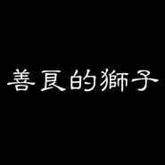

善良的狮子
============================

|  |  |
| :--: | :-- |
| [ 善良的狮子](https://emumo.xiami.com/album/2100238466) | **艺人**: [夏小虎](../index.md) **语种**: 国语 **唱片公司**: 独立发行 **发行时间**: 2015年11月09日 **专辑类别**: EP, 单曲 **专辑风格**: 独立民谣 Indie Folk **播放数**: 515984 **收藏数**: 37 **评论数**: 1  |

## 简介

 善良的狮子

## 曲目

## 评论

|  |  |  |
| :-- | :-- | :-- |
|  [虾米用户](https://emumo.xiami.com/u/33720873) 他来了。 2017-09-19 02:05 赞(0) 踩(0) | 
沙发是我的ʕ&amp;bull;ٹ&amp;bull;ʔ 老严精选的么么已经加进豆芽小窝的歌单，完美。
 |
