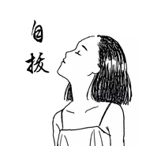
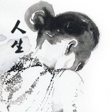

夏小虎
============================

|  |  |
| :--: | :-- |
| [ 夏小虎](https://i.xiami.com/xiaxiaohu) | **地区**: China 中国大陆 **风格**: 独立民谣 Indie Folk **播放数**: 22217430 **粉丝数**: 15092 **评论数**: 218  |

## 档案

1986年10月15日出生于中国江苏，中国民谣歌手，音乐制作人。

## 专辑

| 名称 | 语种 | 唱片公司 | 发行时间 | 专辑类别 | 专辑风格 |
| :--: | :-- | :-- | :-- | :-- | :-- |
| [ 我这样的年纪](./albums/2103644136.md) | 国语 | 独立发行 | 2018年03月26日 | EP, 单曲 |  |
| [ 忆往不忘](./albums/2103689355.md) | 国语 | 独立发行 | 2018年01月21日 | EP, 单曲 |  |
| [ 忏悔文](./albums/2103689354.md) | 国语 | 独立发行 | 2017年12月11日 | EP, 单曲 |  |
| [ 奔波](./albums/2102969815.md) | 国语 | 独立发行 | 2017年11月29日 | EP, 单曲 | 独立民谣 Indie Folk |
| [ 南无阿弥陀佛](./albums/2102870985.md) | 国语 | 独立发行 | 2017年10月12日 | 录音室专辑 | 佛教音乐 Buddhist Music |
| [ 月乡](./albums/2102867903.md) | 国语 | 独立发行 | 2017年10月04日 | EP, 单曲 | 独立民谣 Indie Folk |
| [ 大梦](./albums/2102818984.md) | 国语 | 独立发行 | 2017年07月01日 | 精选集 | 独立民谣 Indie Folk |
| [ 好的，再见！](./albums/2103689349.md) | 国语 | 独立发行 | 2017年06月04日 | EP, 单曲 |  |
| [ 四季](./albums/2103689352.md) | 国语 | 独立发行 | 2016年10月24日 | EP, 单曲 |  |
| [ 约](./albums/2103689348.md) | 国语 | 独立发行 | 2016年06月16日 | EP, 单曲 |  |
| [ 山野](./albums/2103689351.md) | 国语 | 独立发行 | 2016年05月20日 | EP, 单曲 |  |
| [ 夕阳下的歌](./albums/2100333268.md) | 国语 | 独立发行 | 2016年05月07日 | 精选集 | 独立民谣 Indie Folk |
| [ 这场名叫人生的旅途](./albums/2100317984.md) | 国语 | 独立发行 | 2016年04月20日 | 精选集 | 独立民谣 Indie Folk |
| [ 自拔](./albums/2100291296.md) | 国语 | 独立发行 | 2016年03月11日 | 录音室专辑 | 独立民谣 Indie Folk |
| [ 人生](./albums/2100279872.md) | 国语 | 独立发行 | 2016年02月22日 | 录音室专辑 | 独立民谣 Indie Folk |
| [ 寂静的春天](./albums/2103689350.md) | 国语 | 独立发行 | 2016年02月16日 | EP, 单曲 |  |
| [ 我们在世上流浪](./albums/2100261416.md) | 国语 | 独立发行 | 2016年01月16日 | 录音室专辑 | 独立民谣 Indie Folk |
| [ Demo](./albums/2100254030.md) | 国语 | 独立发行 | 2016年01月03日 | 录音室专辑 | 独立民谣 Indie Folk |
| [ 旧时光](./albums/2100250258.md) | 国语 | 独立发行 | 2015年12月24日 | EP, 单曲 | 独立民谣 Indie Folk |
| [ 善良的狮子](./albums/2100238466.md) | 国语 | 独立发行 | 2015年11月09日 | EP, 单曲 | 独立民谣 Indie Folk |
| [ 北方的冬天不会冷](./albums/2100204694.md) | 国语 | 独立发行 | 2015年09月20日 | 录音室专辑 | 独立民谣 Indie Folk |
| [ 固执的我](./albums/836697989.md) | 国语 | 独立发行 | 2015年07月12日 | 录音室专辑 | 独立民谣 Indie Folk |
| [ 逝年](./albums/435325938.md) | 国语 | 独立发行 | 2015年05月31日 | 录音室专辑 | 城市民谣 Urban Folk, 校园民谣 Campus Folk |

## 评论

|  |  |  |
| :-- | :-- | :-- |
|  [虾米用户](https://emumo.xiami.com/u/405382342) 望书，喝茶，音乐，凡人一... 2020-09-30 22:43 赞(0) 踩(0) | 
同乡，你好！
 |
|  [虾米用户](https://emumo.xiami.com/u/405767144)  2020-04-10 09:27 赞(0) 踩(0) | 
老哥，听到了太多的新歌儿，比起新歌儿来我喜欢老歌儿，老到巫启贤，李宗盛，高明骏，赵传，甚至梅艳芳。因为很少有新歌儿是用来品的，仅仅听完就过去了，但你的歌曲都有故事，甚至这些故事有可能有人正在经历着，我挺你我是一个99年的小弟弟
 |
|  [虾米用户](https://emumo.xiami.com/u/250689206) 不求人生辉煌，但求一生无... 2020-02-08 07:19 赞(1) 踩(0) | 
很喜欢你的歌，你的声音。
 |
|  [虾米用户](https://emumo.xiami.com/u/425521964) 心如止水 2019-06-12 15:32 赞(2) 踩(0) | 
听你每首歌都像每个动人的故事
 |
|  [虾米用户](https://emumo.xiami.com/u/9478491) 舌尖紋了瑪利亞 2019-05-13 06:16 赞(0) 踩(0) | 

 |
|  [虾米用户](https://emumo.xiami.com/u/285868258)  2018-11-14 03:27 赞(0) 踩(0) | 
夏小虎的版权也丢了这么多，虾米想做什么？
 |
|  [虾米用户](https://emumo.xiami.com/u/303506160) 因为我对你爱的深沉 2018-08-26 00:26 赞(1) 踩(0) | 
嘿呦
 |
|  [虾米用户](https://emumo.xiami.com/u/344493731)  2018-08-02 12:22 赞(0) 踩(0) | 
小虎，加油！
 |
|  [虾米用户](https://emumo.xiami.com/u/41883784) 世间本无情，何必处处留意 2018-07-31 12:03 赞(0) 踩(0) | 
主要你的歌唱的棒，别有意境
 |
|  [虾米用户](https://emumo.xiami.com/u/320754158)  2018-07-23 21:37 赞(0) 踩(0) | 
过
 |
|  [虾米用户](https://emumo.xiami.com/u/332401415)  2018-07-05 06:32 赞(0) 踩(0) | 
小虎，哪里能下载到你的无损音质的歌曲呢，或者大家谁给个链接啊，ape,flac,dsd,wav都可以的啊，我找不到地方下载啊
 |
|  [虾米用户](https://emumo.xiami.com/u/48810293)   2018-06-27 01:06 赞(1) 踩(0) | 
因为李志喜欢南京，因为小虎我爱江苏
 |
| ⇒ |  [虾米用户](https://emumo.xiami.com/u/40243265)  2019-01-21 01:06 赞(0) 踩(0) | 
虎哥是兴化的，继续喜欢吧
 |
| ⇒ |  [虾米用户](https://emumo.xiami.com/u/171851964) 你来，风雨多大我都去接你... 2019-12-11 07:43 赞(0) 踩(0) | 
<q><b>小明喔说：</b></q>
 |
|  [虾米用户](https://emumo.xiami.com/u/49894181) 最好的自己 2018-06-21 11:27 赞(1) 踩(0) | 
时间似流水，你我都是摆渡人 
 |
|  [虾米用户](https://emumo.xiami.com/u/281295976) 当虾米不再是虾米，就要学... 2018-06-17 09:01 赞(1) 踩(0) | 
封面照是卢冠廷吗？
 |
|  [虾米用户](https://emumo.xiami.com/u/255186901) 。 2018-06-10 19:37 赞(0) 踩(0) | 
喜欢你的声音
 |
|  [虾米用户](https://emumo.xiami.com/u/251479637) 无论时代好坏，行走在这世... 2018-06-08 21:38 赞(1) 踩(0) | 
这世界上总有喜欢民谣的人，它是一种惦念。在越来越快的生活节奏里，它会慢了时光，相信吧，无论早晚，人们总会回归，寻找这慢了的时光。
 |
|  [虾米用户](https://emumo.xiami.com/u/268729149) 先熄掉心跳才能拥抱 2018-06-06 09:59 赞(0) 踩(0) | 
好听
 |
|  [虾米用户](https://emumo.xiami.com/u/84122518) 狠人话不多 2018-06-06 00:26 赞(0) 踩(0) | 
下一个赵雷就是你
 |
|  [虾米用户](https://emumo.xiami.com/u/374143608)  2018-05-30 22:08 赞(0) 踩(0) | 
好喜欢你的歌，每句都唱出人生喜怒哀乐。
 |
|  [虾米用户](https://emumo.xiami.com/u/364308068)  2018-05-30 11:34 赞(0) 踩(0) | 
喜欢你的歌你的声音你的音乐，请一定坚持下去 
 |
|  [虾米用户](https://emumo.xiami.com/u/48449601) 好好干 2018-05-27 11:10 赞(0) 踩(0) | 
山野怎么下架了  
 |
|  [虾米用户](https://emumo.xiami.com/u/344660308)  2018-05-11 13:42 赞(1) 踩(0) | 
很喜欢你的声音，唱到心里去了。
 |
|  [虾米用户](https://emumo.xiami.com/u/351043708) 我还没想好要写什么... 2018-05-11 11:23 赞(0) 踩(0) | 
看好你， 
 |
|  [虾米用户](https://emumo.xiami.com/u/278441691)  2018-05-08 22:32 赞(0) 踩(0) | 
最近第一次听到你的歌，就喜欢上了 
 |
|  [虾米用户](https://emumo.xiami.com/u/260945023)   2018-04-28 09:49 赞(1) 踩(0) | 
什么时候巡演，记得来上海啊
 |
|  [虾米用户](https://emumo.xiami.com/u/355935783) 深陷泥潭无法自拔 2018-04-26 17:29 赞(0) 踩(0) | 
很对⚖的胃口
 |
|  [虾米用户](https://emumo.xiami.com/u/44633068)  2018-04-24 01:12 赞(0) 踩(0) | 
爱你
 |
|  [虾米用户](https://emumo.xiami.com/u/311103633) 我还没想好要写什么... 2018-04-18 09:42 赞(0) 踩(0) | 
太喜欢你的歌声啦！
 |
|  [虾米用户](https://emumo.xiami.com/u/358573877)  2018-04-16 20:26 赞(0) 踩(0) | 
有故事
 |
|  [虾米用户](https://emumo.xiami.com/u/357530645)  2018-04-10 07:26 赞(3) 踩(0) | 
没想到80后的音乐比我们的那时候还要迷迷幻的精彩，你的歌让我想起大四要毕业时的忧伤分离，困惑，迷茫，那时候的我们是崔健，齐秦，能让我回忆感触的歌真的不多了，直到遇见你的夕阳下的歌，加油
 |
|  [虾米用户](https://emumo.xiami.com/u/356732758)  2018-04-04 23:44 赞(1) 踩(0) | 
我喜欢你的声调
 |
|  [虾米用户](https://emumo.xiami.com/u/353039543)  2018-03-08 22:47 赞(0) 踩(0) | 
这屏幕怎么调节成暗色
 |
|  [虾米用户](https://emumo.xiami.com/u/280249478)  2018-03-06 10:23 赞(1) 踩(0) | 
虎哥 这么真实的发自内心大胆的歌 我怎能错过～喜欢你的歌&amp;hellip;&amp;hellip;
 |
|  [虾米用户](https://emumo.xiami.com/u/347846241)  2018-02-28 00:54 赞(1) 踩(0) | 
第一次听你的歌，是在朋友的花屋，从此深深喜欢上你的风格，特别是歌词，触动灵魂，最近重复听着《自拔》，我的爱人不知道我为什么深爱这首歌，只能说，对青春爱情的一种救赎吧，原来一切都可以这样的美好
 |
|  [虾米用户](https://emumo.xiami.com/u/252136412)  2018-02-19 13:05 赞(0) 踩(0) | 
头一次听你的歌，但是就离不开了，每首歌都那么好听，一口气把所有的都听了一遍
 |
|  [虾米用户](https://emumo.xiami.com/u/276893584)  2018-02-18 14:09 赞(1) 踩(0) | 
午后时分有你的歌声陪伴，悄然而过&amp;hellip;&amp;hellip;
 |
|  [虾米用户](https://emumo.xiami.com/u/332320521) 圆滑的三角形。。 2018-02-17 16:43 赞(0) 踩(0) | 
大叔，加油(ง &amp;bull;̀_&amp;bull;́)ง 我00后，叫你大叔没问题吧？
 |
|  [虾米用户](https://emumo.xiami.com/u/326811140)  2018-02-10 23:45 赞(0) 踩(0) | 
太棒的   
 |
|  [虾米用户](https://emumo.xiami.com/u/346705584)  2018-02-10 20:42 赞(0) 踩(0) | 
来沈阳的时候来演唱会的时候说一下，一定要去  
 |
|  [虾米用户](https://emumo.xiami.com/u/202241832)   2018-02-10 00:13 赞(0) 踩(0) | 
很喜欢
 |
|  [虾米用户](https://emumo.xiami.com/u/348805592)  2018-02-09 02:21 赞(0) 踩(0) | 
找你的歌找了好久，终于找到了，很喜欢，加油！
 |
|  [虾米用户](https://emumo.xiami.com/u/2122375)   2018-01-30 00:09 赞(0) 踩(0) | 
每一首都是故事，虎子加油
 |
|  [虾米用户](https://emumo.xiami.com/u/314985623)  2018-01-17 11:39 赞(0) 踩(0) | 
就这种味道，喜欢，
 |
|  [虾米用户](https://emumo.xiami.com/u/323724380)  2018-01-15 22:17 赞(0) 踩(0) | 
小虎哥，出mv吧
 |
|  [虾米用户](https://emumo.xiami.com/u/343753547)  2018-01-08 02:34 赞(0) 踩(0) | 
做点MTV，效果会更好
 |
|  [虾米用户](https://emumo.xiami.com/u/343753547)  2018-01-08 02:33 赞(1) 踩(0) | 
超喜欢你的歌，安静舒心，支持你，希望创建更多好作品
 |
|  [虾米用户](https://emumo.xiami.com/u/343753547)  2018-01-08 02:32 赞(1) 踩(0) | 
超喜欢你的歌，加油，民谣灵魂人物，希望创作更多作品，谢谢你给的安心
 |
|  [虾米用户](https://emumo.xiami.com/u/343077971)  2018-01-04 13:25 赞(1) 踩(0) | 
你很棒 
 |
|  [虾米用户](https://emumo.xiami.com/u/343010282)  2018-01-03 23:44 赞(1) 踩(0) | 
歌很有味道&amp;hellip;&amp;hellip;很喜欢
 |
|  [虾米用户](https://emumo.xiami.com/u/310492290)  2018-01-03 13:47 赞(2) 踩(0) | 
我特喜欢旧时光   
 |
|  [虾米用户](https://emumo.xiami.com/u/339006266)   2017-12-14 23:02 赞(2) 踩(0) | 
是金子总会发光，头次评论，加油
 |
|  [虾米用户](https://emumo.xiami.com/u/242953647)   2017-12-12 17:18 赞(2) 踩(0) | 
你的作品总是容易让人感动。我极少评论，你是例外。期待听你的演唱会！
 |
|  [虾米用户](https://emumo.xiami.com/u/321969464)  2017-12-05 23:10 赞(1) 踩(0) | 

 |
|  [虾米用户](https://emumo.xiami.com/u/289021562)  2017-12-03 15:49 赞(1) 踩(0) | 
非常棒，唱出了好多人的感慨
 |
|  [虾米用户](https://emumo.xiami.com/u/218236557)  2017-12-03 10:54 赞(2) 踩(0) | 
很喜欢虎哥的曲风
 |
|  [虾米用户](https://emumo.xiami.com/u/14285565)  2017-11-21 20:55 赞(2) 踩(0) | 
有质感的声音
 |
|  [虾米用户](https://emumo.xiami.com/u/335086826) 平安一切 2017-11-13 16:40 赞(1) 踩(0) | 
唱的很好，非常喜欢听
 |
|  [虾米用户](https://emumo.xiami.com/u/285311227)  2017-11-09 23:25 赞(1) 踩(0) | 
几乎每首都很好听。加油，几时来杭州哦
 |
|  [虾米用户](https://emumo.xiami.com/u/43385709) 等待不苦，苦的是没有希望... 2017-11-09 20:43 赞(0) 踩(0) | 
就是喜欢夏小虎的歌。
 |
|  [虾米用户](https://emumo.xiami.com/u/333781294)  2017-11-07 19:01 赞(0) 踩(0) | 
好听
 |
|  [虾米用户](https://emumo.xiami.com/u/2388131)  2017-11-06 10:42 赞(0) 踩(0) | 
很好
 |
|  [虾米用户](https://emumo.xiami.com/u/247079371)  2017-10-30 23:27 赞(1) 踩(0) | 
感谢深夜的陪伴
 |
|  [虾米用户](https://emumo.xiami.com/u/257801645)  2017-10-29 13:23 赞(1) 踩(0) | 
一遍又一遍循环播放逝年，说不出来的难受，只想安安静静一遍又一遍的听着
 |
|  [虾米用户](https://emumo.xiami.com/u/83005792) 弱水不止三千 2017-10-14 03:31 赞(0) 踩(0) | 
一直关注，你终于出名了。感觉很开心
 |
|  [虾米用户](https://emumo.xiami.com/u/45485152) Wubba lubba ... 2017-10-07 00:48 赞(0) 踩(0) | 
网易听了那么久逝年 想不到你也来虾米了 
 |
|  [虾米用户](https://emumo.xiami.com/u/328677310)   2017-10-06 01:58 赞(0) 踩(0) | 
怎么没有《梦之初》的 
 |
|  [虾米用户](https://emumo.xiami.com/u/145829518)  2017-09-25 06:22 赞(0) 踩(0) | 
好听
 |
|  [虾米用户](https://emumo.xiami.com/u/323727093)  2017-09-24 17:52 赞(3) 踩(0) | 
很喜欢你的歌，太好听，希望你越来越火
 |
|  [虾米用户](https://emumo.xiami.com/u/62313158) 一个人时听听歌。 2017-09-20 22:23 赞(0) 踩(0) | 
好听
 |
|  [虾米用户](https://emumo.xiami.com/u/65296874) 守住初心 2017-09-17 22:19 赞(0) 踩(0) | 
很好听
 |
|  [虾米用户](https://emumo.xiami.com/u/324963483)  2017-09-15 23:52 赞(0) 踩(0) | 
一样的年龄 切不一样的人生 希望你能越来越火
 |
|  [虾米用户](https://emumo.xiami.com/u/325040893) 和善心态，乐观生活... 2017-09-15 23:29 赞(2) 踩(0) | 
喜欢你的歌，更喜欢你那让人听起来温暖又平静的声音  
 |
|  [虾米用户](https://emumo.xiami.com/u/34239492)   2017-09-13 06:43 赞(1) 踩(0) | 
有感觉的歌！
 |
|  [虾米用户](https://emumo.xiami.com/u/117834718)  2017-09-10 21:55 赞(2) 踩(0) | 
安静
 |
|  [虾米用户](https://emumo.xiami.com/u/245222068)  2017-09-07 23:32 赞(3) 踩(0) | 
好听，写出唱出了人生的好多感慨。
 |
|  [虾米用户](https://emumo.xiami.com/u/6652575) mbz2006 2017-09-06 21:18 赞(0) 踩(0) | 
ok
 |
|  [虾米用户](https://emumo.xiami.com/u/228062552) 喜欢好听的，自己觉得好听... 2017-09-02 09:04 赞(2) 踩(0) | 
评论太少，我来写一个
 |
|  [虾米用户](https://emumo.xiami.com/u/1117109)  2017-09-01 09:57 赞(4) 踩(0) | 
第一次听，就爱上这个声音，非常棒， 希望一直唱下去。
 |
|  [虾米用户](https://emumo.xiami.com/u/79825062) 嘿，大白，我是小黑，听见... 2017-08-31 01:53 赞(4) 踩(0) | 
记得是去年快暑假的时候，室友从图书馆回来特别激动地跟我说，你知道吗？就刚刚我在图书馆里听见一首歌，特别特别有感触，尤其是其中有一句歌词，对于这个阶段的我们来说真的是太到位了，可以说到位到绝望啊，对就是《人生》这首歌的这句：&amp;ldquo;当我高举理想的火炬，天空却刚好下起了大雨&amp;rdquo;，各位奔波在追梦路上的人儿，有木有同感啊？真心佩服歌者这种用一句简单的话，以极其平和的语气，道出追梦人寻梦路上的坎坷甚至绝望的心境
 |
|  [虾米用户](https://emumo.xiami.com/u/267511074)  2017-08-12 00:33 赞(3) 踩(0) | 
人生理想潮起潮落就是这样，我们一直在路上，流浪&amp;hellip;漂浮不定&amp;hellip;
 |
|  [虾米用户](https://emumo.xiami.com/u/160246244)  2017-08-06 01:34 赞(1) 踩(0) | 
我是听了一个朋友唱的，我听过他唱的很多很多遍。其实他唱的非常非常好。我非常喜欢他。是崇拜那种喜欢。但是我和他的关系比较尴尬。我就一直做他的朋友，做他的迷妹吧 
 |
|  [虾米用户](https://emumo.xiami.com/u/314009260)  2017-07-22 02:57 赞(2) 踩(0) | 
很棒，希望你能坚持下去，歌是真的很不错 
 |
|  [虾米用户](https://emumo.xiami.com/u/313168765)  2017-07-18 18:58 赞(2) 踩(0) | 
很棒很棒！
 |
|  [虾米用户](https://emumo.xiami.com/u/33988457)  2017-07-15 23:56 赞(0) 踩(0) | 
有思想 有温度
 |
|  [虾米用户](https://emumo.xiami.com/u/218401617) ️良辰 2017-07-05 00:12 赞(1) 踩(0) | 
喜欢深夜听，太好听了 。
 |
|  [虾米用户](https://emumo.xiami.com/u/305914160)  2017-06-25 23:29 赞(3) 踩(0) | 
夜听里常听你的歌。让人在忧伤中不忘坚强
 |
|  [虾米用户](https://emumo.xiami.com/u/68127000)  2017-06-21 12:49 赞(0) 踩(0) | 
怀旧民谣
 |
|  [虾米用户](https://emumo.xiami.com/u/282642725) 常州开拓大金空调 2017-06-12 13:06 赞(0) 踩(0) | 
听你的歌真舒心
 |
|  [虾米用户](https://emumo.xiami.com/u/244857229)  2017-06-08 14:43 赞(2) 踩(0) | 
有故事的声音，感谢你的歌
 |
|  [虾米用户](https://emumo.xiami.com/u/92655250) 我就一听歌的。 2017-06-08 01:38 赞(0) 踩(0) | 
喜欢，听你的歌感觉到舒心，浅浅的唱出那些琐碎的又真实的。
 |
|  [虾米用户](https://emumo.xiami.com/u/2832551)  2017-06-01 21:29 赞(0) 踩(0) | 
太好听了，跟赵雷有的一拼！
 |
|  [虾米用户](https://emumo.xiami.com/u/300393865)  2017-05-31 16:52 赞(0) 踩(0) | 
城市里闪烁着灯光，哪一盏是为我而亮
 |
|  [虾米用户](https://emumo.xiami.com/u/300393865)  2017-05-31 16:50 赞(0) 踩(0) | 
我喜欢的人喜欢的歌
 |
|  [虾米用户](https://emumo.xiami.com/u/267752501)  2017-05-30 00:06 赞(0) 踩(0) | 
你的声音有种吸引力，用心在歌唱，很纯粹的声音，支持
 |
|  [虾米用户](https://emumo.xiami.com/u/64354810) 差强人意。 2017-05-23 21:44 赞(1) 踩(0) | 
没想到你还在这里，我是因为偶像爱上了虾米，你也是吧！
 |
|  [虾米用户](https://emumo.xiami.com/u/267970379)  2017-05-23 12:55 赞(1) 踩(0) | 
你的嗓音好听
 |
|  [虾米用户](https://emumo.xiami.com/u/266558757)  2017-05-23 00:16 赞(0) 踩(0) | 
 加油！
 |
|  [虾米用户](https://emumo.xiami.com/u/256238597)  2017-05-17 22:55 赞(2) 踩(0) | 
你只有一把破吉他，但我也只喜欢这么纯真的你。   
 |
|  [虾米用户](https://emumo.xiami.com/u/50066462) Metal is for... 2017-05-15 04:50 赞(0) 踩(0) | 
folk
 |
|  [虾米用户](https://emumo.xiami.com/u/256238597)  2017-05-10 00:20 赞(3) 踩(0) | 
这家伙在网易云很火 
 |
| ⇒ |  [虾米用户](https://emumo.xiami.com/u/95741664) 登山则情满于山 2017-08-30 02:13 赞(0) 踩(0) | 

 |
|  [虾米用户](https://emumo.xiami.com/u/295061592)  2017-05-09 17:23 赞(1) 踩(0) | 
夕阳下的歌也是我听电台的时候被吸引住了，这声音，这旋律非常动听  
 |
|  [虾米用户](https://emumo.xiami.com/u/292500871)  2017-04-30 05:16 赞(0) 踩(0) | 
好歌！
 |
|  [虾米用户](https://emumo.xiami.com/u/71422602) 是我为落叶而飘落。 2017-04-29 16:23 赞(2) 踩(0) | 
逝年让我想起了很多早已忘却的人们，不知道他们现在过的好吗。
 |
|  [虾米用户](https://emumo.xiami.com/u/266066160)  2017-04-27 22:07 赞(1) 踩(0) | 
有故事，   有酒。  
 |
|  [虾米用户](https://emumo.xiami.com/u/291509417) 人生是电影 自己是导演 2017-04-26 20:33 赞(0) 踩(0) | 
唱吧见过视频 很帅 很有才华 等待一次爆发吧&amp;hellip;&amp;hellip;
 |
|  [虾米用户](https://emumo.xiami.com/u/116899300)  2017-04-21 22:17 赞(0) 踩(0) | 
人生味道
 |
|  [虾米用户](https://emumo.xiami.com/u/191929767) 爱生活，爱可乐 2017-04-16 14:38 赞(0) 踩(0) | 
小虎哥唱的不错，多出新歌。
 |
|  [虾米用户](https://emumo.xiami.com/u/99519842)  2017-04-15 22:59 赞(0) 踩(0) | 
单曲循环 淡淡讲故事的感觉
 |
|  [虾米用户](https://emumo.xiami.com/u/287702051)  2017-04-10 22:09 赞(0) 踩(0) | 
逝年太好听了
 |
|  [虾米用户](https://emumo.xiami.com/u/286146435) 人生不过是一场旅行，你路... 2017-04-04 23:35 赞(0) 踩(0) | 
喜欢你的歌
 |
|  [虾米用户](https://emumo.xiami.com/u/262529304)  2017-04-03 23:04 赞(0) 踩(0) | 
好听又找到新大陆
 |
|  [虾米用户](https://emumo.xiami.com/u/284267280)  2017-03-30 12:45 赞(1) 踩(0) | 
小虎唱滴有味道
 |
|  [虾米用户](https://emumo.xiami.com/u/148683364)  2017-03-25 13:18 赞(0) 踩(0) | 
谢谢你的音乐
 |
|  [虾米用户](https://emumo.xiami.com/u/196495710)  2017-03-24 21:34 赞(1) 踩(0) | 
唱的好舒服啊
 |
|  [虾米用户](https://emumo.xiami.com/u/282877051)  2017-03-24 10:55 赞(0) 踩(0) | 
folk
 |
|  [虾米用户](https://emumo.xiami.com/u/253493945)  2017-03-21 12:16 赞(0) 踩(0) | 
不错不错
 |
|  [虾米用户](https://emumo.xiami.com/u/281511261)  2017-03-20 22:43 赞(0) 踩(0) | 
怎么这么好听？每次都听到流泪！
 |
|  [虾米用户](https://emumo.xiami.com/u/281523001)  2017-03-19 02:33 赞(0) 踩(0) | 
开车时听到《逝年》，花了点时间找歌名，终于找到了。
 |
|  [虾米用户](https://emumo.xiami.com/u/197108056) 长着月亮般的大眼睛还能绽... 2017-03-18 02:19 赞(0) 踩(0) | 
网易云怎么不更新？
 |
|  [虾米用户](https://emumo.xiami.com/u/222508202)  2017-03-16 21:08 赞(0) 踩(0) | 

 |
|  [虾米用户](https://emumo.xiami.com/u/279651772)  2017-03-11 23:21 赞(0) 踩(0) | 
每首都好听，一直在寻觅的歌声
 |
|  [虾米用户](https://emumo.xiami.com/u/272494101) 我还没想好要写什么... 2017-03-11 22:34 赞(1) 踩(0) | 
如果你把谁和谁比，谁和谁很像，那你不懂民谣、摇滚！
 |
| ⇒ |  [虾米用户](https://emumo.xiami.com/u/290507163)  2017-04-22 21:43 赞(0) 踩(0) | 
同意，尊重每一个歌手
 |
|  [虾米用户](https://emumo.xiami.com/u/252662562)  2017-03-07 15:06 赞(4) 踩(0) | 
很遗憾我们年轻的时候没有老狼和高晓松，很幸庆我们还有夏小虎和赵雷
 |
| ⇒ |  [虾米用户](https://emumo.xiami.com/u/293770884)  2017-05-08 10:44 赞(0) 踩(0) | 
只关注两人，夏小虎和赵雷  哈哈哈  一年重复一年   幸好遇见他们
 |
|  [虾米用户](https://emumo.xiami.com/u/278334002)  2017-03-06 19:35 赞(1) 踩(0) | 
时间如流水崔我们长大
 |
|  [虾米用户](https://emumo.xiami.com/u/10306815)   2017-03-05 08:27 赞(1) 踩(0) | 
你的歌很好听，你的声音很像赵雷！你的声音干净清澈！喜欢！
 |
|  [虾米用户](https://emumo.xiami.com/u/181391452) 良辰美景奈何人 2017-02-28 23:48 赞(0) 踩(0) | 
第一次听！很喜欢你的声音你的歌 。很有感情。666
 |
|  [虾米用户](https://emumo.xiami.com/u/5833797)  2017-02-20 13:50 赞(3) 踩(0) | 
偶然听到的，喜欢。有赵雷的感觉。两个我都喜欢。
 |
|  [虾米用户](https://emumo.xiami.com/u/36217627)  2017-02-16 19:07 赞(1) 踩(0) | 
感谢虾米推荐了你的音乐，旋律和歌词都很是打动我，声线也很舒服，感谢你的音乐，想一直关注
 |
|  [虾米用户](https://emumo.xiami.com/u/187412429)  2017-02-10 22:46 赞(35) 踩(0) | 
有故事的人，有味道的歌。
 |
| ⇒ |  [虾米用户](https://emumo.xiami.com/u/215991611) 韵味…… 2018-03-10 22:23 赞(0) 踩(0) | 
同感
 |
|  [虾米用户](https://emumo.xiami.com/u/109912914)  2017-02-10 22:30 赞(0) 踩(0) | 
听你的歌已经挺久了。希望你能实现自己的理想，因为单纯的喜欢
 |
|  [虾米用户](https://emumo.xiami.com/u/10603191) E心E意 2017-02-08 13:52 赞(0) 踩(0) | 
打动此刻的心
 |
|  [虾米用户](https://emumo.xiami.com/u/4298562)  2017-02-07 11:33 赞(0) 踩(0) | 
民谣
 |
|  [虾米用户](https://emumo.xiami.com/u/44312963)  2017-02-01 20:48 赞(1) 踩(0) | 
年初三在广州黄埔大道的隧道里听到了一个流浪艺人拿着一把吉他唱着你的《旧时光》，瞬间被感动了
 |
|  [虾米用户](https://emumo.xiami.com/u/254298450)  2017-01-18 16:31 赞(0) 踩(0) | 
好听
 |
|  [虾米用户](https://emumo.xiami.com/u/259368220)  2017-01-11 23:26 赞(0) 踩(0) | 
这个世界上民谣有很多，可我最爱你的歌
 |
|  [虾米用户](https://emumo.xiami.com/u/39421022)  2017-01-10 00:25 赞(0) 踩(0) | 
加油
 |
|  [虾米用户](https://emumo.xiami.com/u/8337431) 以乐会友 2017-01-07 14:36 赞(0) 踩(0) | 
民谣52
 |
|  [虾米用户](https://emumo.xiami.com/u/258178733)  2016-12-31 00:06 赞(2) 踩(0) | 
无意听到你的声音，有种共鸣，有种触及心底的感动，自然的卸载掉酷我，只为虾米有你，每晚有你的旋律陪我入眠，感恩在2016年最后一天听到你的吉他，你的旋律！ 
 |
|  [虾米用户](https://emumo.xiami.com/u/72666568)  2016-12-27 23:12 赞(0) 踩(0) | 
就这样慢慢说
 |
|  [虾米用户](https://emumo.xiami.com/u/118046350) 末世之鱼。 2016-12-22 13:11 赞(0) 踩(0) | 
16年末的时候遇到你的声音，还不错(ง •̀_•́)ง期待更多的作品
 |
|  [虾米用户](https://emumo.xiami.com/u/6187648) ✎。 2016-12-19 11:00 赞(0) 踩(0) | 
加油！
 |
|  [虾米用户](https://emumo.xiami.com/u/40976192)  2016-12-14 11:35 赞(0) 踩(0) | 
喜欢你的歌！
 |
|  [虾米用户](https://emumo.xiami.com/u/18789615)  2016-12-13 22:38 赞(0) 踩(0) | 
好听，我的歌
 |
|  [虾米用户](https://emumo.xiami.com/u/17475925)   2016-12-12 00:51 赞(0) 踩(0) | 
加油，虎哥！
 |
|  [虾米用户](https://emumo.xiami.com/u/251313289)  2016-12-01 23:09 赞(0) 踩(0) | 
和我一样生肖，生日你是8月29日，我是8月22日，我和你一样，是善良的狮子！好喜欢你的歌，有空来云南了，我请你吃好吃的！
 |
|  [虾米用户](https://emumo.xiami.com/u/10373383) 很明显 迷恋一个人的身体... 2016-11-30 04:32 赞(1) 踩(0) | 
虎哥不火 六月飞雪
 |
|  [虾米用户](https://emumo.xiami.com/u/26359305)   2016-11-25 00:07 赞(0) 踩(0) | 
好想去听你的现场～
 |
|  [虾米用户](https://emumo.xiami.com/u/26359305)   2016-11-25 00:06 赞(0) 踩(0) | 
好喜欢你的歌！！
 |
|  [虾米用户](https://emumo.xiami.com/u/243019091) 我想和你结婚 2016-11-10 17:55 赞(1) 踩(0) | 
因为你，我下载了虾米，然后我停了扣扣音乐的豪华钻，卸载了扣扣音乐。觉得很值得，很开心。 
 |
|  [虾米用户](https://emumo.xiami.com/u/243019091) 我想和你结婚 2016-11-09 22:05 赞(1) 踩(0) | 
好想认识你的。我姐妹儿跟我说，她找到了一个跟我一样气质的男人，一个歌手。她说我们都是那种骨子里带着荒凉的悲伤的人。 来呀！互相认识下，互相伤害吧！
 |
|  [虾米用户](https://emumo.xiami.com/u/104121284) 所以你们只是为了能量？病... 2016-10-31 00:31 赞(1) 踩(0) | 
希望你一直小众，但也希望你能够出名。所以啊，请努力出名吧，毕竟好的音乐不会被埋没   
 |
|  [虾米用户](https://emumo.xiami.com/u/191545406)  2016-10-15 23:51 赞(0) 踩(0) | 
在我耳边唱给我听吧 
 |
|  [虾米用户](https://emumo.xiami.com/u/227554803)   2016-09-18 02:08 赞(0) 踩(0) | 
很喜欢你的歌，每晚听着睡觉 
 |
|  [虾米用户](https://emumo.xiami.com/u/16024907) 我是画家听歌找灵感 2016-09-07 10:51 赞(0) 踩(0) | 
声音好听！orz
 |
|  [虾米用户](https://emumo.xiami.com/u/112871310)  2016-09-06 10:04 赞(0) 踩(0) | 
好听 
 |
|  [虾米用户](https://emumo.xiami.com/u/39396908) 你傻呀。 2016-09-01 00:08 赞(0) 踩(0) | 
苏州人吗 喜欢你的歌，有做驻唱吗
 |
|  [虾米用户](https://emumo.xiami.com/u/819805) 我们点起火把，烧死爱情。 2016-08-25 00:03 赞(1) 踩(0) | 
基本上每首都很好听啊……
 |
|  [虾米用户](https://emumo.xiami.com/u/50227776)   2016-08-15 18:25 赞(0) 踩(0) | 
好棒啊声音迷人
 |
|  [虾米用户](https://emumo.xiami.com/u/144290164) 所有的酒都不如你 2016-08-01 11:57 赞(0) 踩(0) | 
声音舒服
 |
|  [虾米用户](https://emumo.xiami.com/u/7026100)  2016-06-16 18:31 赞(0) 踩(0) | 
加油，支持你
 |
|  [虾米用户](https://emumo.xiami.com/u/1577426)  2016-05-23 21:10 赞(0) 踩(0) | 
ok
 |
|  [虾米用户](https://emumo.xiami.com/u/109912914)  2016-05-22 21:39 赞(0) 踩(0) | 
第一次听这声音就迷上了。真希望有机会能听你的live
 |
|  [虾米用户](https://emumo.xiami.com/u/146582710)   2016-05-01 03:01 赞(0) 踩(0) | 
我就希望能会弹会唱你所有的歌
 |
|  [虾米用户](https://emumo.xiami.com/u/49748785) 你的孤独 虽败犹荣 2016-04-30 20:55 赞(0) 踩(0) | 
早上晨跑时 无论是多大体力运动 体育老师就放你的歌 吉他 旧嗓子 简单 听着安逸 昨天终于忍不住去问了老师听的是谁的歌 原来。是你
 |
|  [虾米用户](https://emumo.xiami.com/u/138686352)   2016-04-23 20:34 赞(0) 踩(0) | 
好听
 |
|  [虾米用户](https://emumo.xiami.com/u/44938100)  2016-04-14 14:29 赞(0) 踩(0) | 
好听，真好听
 |
|  [虾米用户](https://emumo.xiami.com/u/24395688)   2016-03-14 00:21 赞(0) 踩(0) | 
嗓音很好听   关注
 |
|  [虾米用户](https://emumo.xiami.com/u/117937790)  2016-02-27 00:56 赞(0) 踩(0) | 
虎哥，我是你的吧友
 |
| ⇒ |  [虾米用户](https://emumo.xiami.com/u/51800191)  2016-03-17 02:20 赞(0) 踩(0) | 
你好 
 |
|  [虾米用户](https://emumo.xiami.com/u/74803084)  2016-02-26 10:55 赞(0) 踩(0) | 
虎哥，很喜欢你的歌。
 |
|  [虾米用户](https://emumo.xiami.com/u/20560009)  2016-02-26 07:05 赞(0) 踩(0) | 
     
 |
|  [虾米用户](https://emumo.xiami.com/u/106050950)  2016-02-06 10:58 赞(0) 踩(0) | 
湖畔乱红很好听可惜虾米没有
 |
|  [虾米用户](https://emumo.xiami.com/u/87031754)  2016-01-02 11:25 赞(0) 踩(0) | 
第一次听就喜欢得不行不行的~
 |
|  [虾米用户](https://emumo.xiami.com/u/79965162)  2015-11-05 14:40 赞(21) 踩(0) | 
同岁啊，真棒！李志听了十年，希望四十岁的时候谈及音乐了能够说听了小虎十年了～喜欢
 |
| ⇒ |  [虾米用户](https://emumo.xiami.com/u/51800191)  2016-03-17 02:21 赞(0) 踩(0) | 
你好你好
 |
| ⇒ |  [虾米用户](https://emumo.xiami.com/u/1023227)   2017-06-13 23:15 赞(0) 踩(0) | 
掐指一算，我也听了李志十年了。。。
 |
| ⇒ |  [虾米用户](https://emumo.xiami.com/u/341609920)  2017-12-26 22:48 赞(0) 踩(0) | 
我很喜欢赵雷的歌，阿姨你有没有觉得夏小虎声音和赵雷很像
 |
| ⇒ |  [虾米用户](https://emumo.xiami.com/u/247276785)  2018-03-29 21:09 赞(0) 踩(0) | 
阿姨吃饭了没
 |
|  [虾米用户](https://emumo.xiami.com/u/73684158)  2015-10-14 00:10 赞(0) 踩(0) | 
好听的声音
 |
|  [虾米用户](https://emumo.xiami.com/u/73475862) 爱情不是最初的甜蜜，而是... 2015-10-12 23:04 赞(0) 踩(0) | 

 |
|  [虾米用户](https://emumo.xiami.com/u/9077266)  2015-09-22 18:58 赞(0) 踩(0) | 
非常喜欢你的民谣歌曲！超赞！ ↖(^ω^)↗
 |
|  [虾米用户](https://emumo.xiami.com/u/42535021) 暂无签名~ 2015-07-13 18:02 赞(0) 踩(0) | 
你好，我是中国好歌曲节目组的，不知道您是否感兴趣呢?
 |
| ⇒ |  [虾米用户](https://emumo.xiami.com/u/42882087) 夏小虎 2015-07-26 17:25 赞(0) 踩(0) | 
给我联系方式
 |
| ⇒ |  [虾米用户](https://emumo.xiami.com/u/42535021) 暂无签名~ 2017-10-28 00:15 赞(0) 踩(0) | 
<q><b>夏小虎说：</b></q>
 |
|  [虾米用户](https://emumo.xiami.com/u/52226376)  2015-07-07 13:41 赞(0) 踩(0) | 
原来在这里，找到了找到了 
 |
|  [虾米用户](https://emumo.xiami.com/u/52089290)  2015-07-04 23:08 赞(0) 踩(0) | 
超级喜欢，找了半天能下载的地方，我都要爱死这个声音了， 
 |
| ⇒ |  [虾米用户](https://emumo.xiami.com/u/51800191)  2016-03-17 02:20 赞(0) 踩(0) | 
你好 
 |
|  [虾米用户](https://emumo.xiami.com/u/50200408) 无摇不滚的我有颗民谣的心 2015-06-30 23:28 赞(1) 踩(0) | 
很喜欢你的嗓音，支持你。加油
 |
|  [虾米用户](https://emumo.xiami.com/u/42882087) 夏小虎 2015-06-26 08:25 赞(284) 踩(0) | 
我刚入驻了阿里音乐人，欢迎大家来我的个人主页，收听我的最新音乐
 |
| ⇒ |  [虾米用户](https://emumo.xiami.com/u/51800191)  2016-03-17 02:21 赞(0) 踩(0) | 
你好很荣幸认识你 
 |
| ⇒ |  [虾米用户](https://emumo.xiami.com/u/101271940)   2016-09-07 00:03 赞(0) 踩(0) | 
我要买你的歌！支持你！
 |
| ⇒ |  [虾米用户](https://emumo.xiami.com/u/160496334)  2017-01-22 01:16 赞(0) 踩(0) | 
喜欢不止一点点
 |
| ⇒ |  [虾米用户](https://emumo.xiami.com/u/44312963)  2017-02-01 20:59 赞(0) 踩(0) | 
年初三在广州黄埔大道的隧道里听到了一个流浪艺人拿着一把吉他唱着你的歌，瞬间被感动了
 |
| ⇒ |  [虾米用户](https://emumo.xiami.com/u/278624195)  2017-03-17 00:57 赞(0) 踩(0) | 
喜欢你的歌
 |
| ⇒ |  [虾米用户](https://emumo.xiami.com/u/71007882)  2017-04-15 10:34 赞(0) 踩(0) | 
加油，有一天你一定会站在山的顶峰
 |
| ⇒ |  [虾米用户](https://emumo.xiami.com/u/24361184)  阴晴圆缺在窗外，心中一... 2017-05-05 23:22 赞(0) 踩(0) | 
支持，会默默关注你的
 |
| ⇒ |  [虾米用户](https://emumo.xiami.com/u/242781932)   2017-05-09 00:25 赞(0) 踩(0) | 
喜欢你的声音
 |
| ⇒ |  [虾米用户](https://emumo.xiami.com/u/171851964) 你来，风雨多大我都去接你... 2017-05-24 15:53 赞(0) 踩(0) | 
不错伙计
 |
| ⇒ |  [虾米用户](https://emumo.xiami.com/u/61283986) 我从不相信这世界无路可走... 2017-05-30 19:35 赞(0) 踩(0) | 
很喜欢你的歌
 |
| ⇒ |  [虾米用户](https://emumo.xiami.com/u/49926750) 微信ywd9175 2017-06-29 15:13 赞(0) 踩(0) | 
不好意思 才发现你的歌  很有感觉
 |
| ⇒ |  [虾米用户](https://emumo.xiami.com/u/103706452)  2017-07-05 23:49 赞(0) 踩(0) | 
加油
 |
| ⇒ |  [虾米用户](https://emumo.xiami.com/u/267511074)  2017-08-12 00:34 赞(0) 踩(0) | 
嗯，有味道，人生路理想路就是这样漂浮不定&amp;hellip;
 |
| ⇒ |  [虾米用户](https://emumo.xiami.com/u/321477738)  2017-10-09 21:33 赞(0) 踩(0) | 
你的歌儿唱的很好听，能让人不由自主的安静下来认真的听
 |
| ⇒ |  [虾米用户](https://emumo.xiami.com/u/14672981)  2017-10-14 12:32 赞(0) 踩(0) | 
声音干净又有故事
 |
| ⇒ |  [虾米用户](https://emumo.xiami.com/u/325055830)  2017-10-27 15:54 赞(0) 踩(0) | 
声音真好听！听到《逝年》和《人生》瞬间喜欢上，音乐和歌词都很让人感动❤️
 |
| ⇒ |  [虾米用户](https://emumo.xiami.com/u/336999455)  2017-11-24 13:28 赞(0) 踩(0) | 
喜欢那首山野，虾米怎么没有
 |
| ⇒ |  [虾米用户](https://emumo.xiami.com/u/320545647) 我还没想好要写什么... 2017-11-24 22:52 赞(0) 踩(0) | 
喜欢你，支持你，一直在微博关注你很久了，加油
 |
| ⇒ |  [虾米用户](https://emumo.xiami.com/u/338353331)  2017-12-03 21:22 赞(0) 踩(0) | 
喜欢听你唱歌，好听，
 |
| ⇒ |  [虾米用户](https://emumo.xiami.com/u/246017541)  2017-12-26 22:57 赞(0) 踩(0) | 
有实力，好歌！
 |
| ⇒ |  [虾米用户](https://emumo.xiami.com/u/247143670) 我只是不想做～ 2018-01-29 11:30 赞(0) 踩(0) | 
尊称一声虎哥，虽同龄，可比我年长了四天。听你的歌有几年，推荐给过朋友基本给我的反馈都是&amp;mdash;&amp;mdash;&amp;mdash;&amp;mdash;大爱虎哥！ 一七年初我辞了工作，每天就是看风景/音乐/弹琴、还有书和茶，偶尔晚上会喝点酒，约三两个好友聊聊天小酌几杯。完全放空了自己之后，出走了大半年，跨越了南北一路上你的很多歌都有我的映射，好像就写的是我一样。真心感谢虎哥，你的音乐也曾陪我度过过很长一段类似于&amp;ldquo;抑郁&amp;rdquo;的日子，庆幸自愈挺了过来。那段时间就是听三个人的歌，还有许巍和赵雷。说起了赵雷，虽然他火了之后，在我们歌迷来讲，有点&amp;ldquo;心理纠结&amp;rdquo;的感觉，就好像失恋了一样的！可更多的还是会替他高兴。2018新年，衷心祝愿虎哥也尽早的火起来。
 |
| ⇒ |  [虾米用户](https://emumo.xiami.com/u/328171947)  2018-04-30 23:42 赞(0) 踩(0) | 
小虎加油 
 |
| ⇒ |  [虾米用户](https://emumo.xiami.com/u/331877585)  2018-10-05 23:45 赞(0) 踩(0) | 
基本每首都喜欢，每次画画的时候就听，感谢孤独时候有你的歌陪伴。
 |
