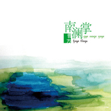
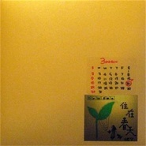

曹方
============================

|  |  |
| :--: | :-- |
| [<br>曹方](https://i.xiami.com/icy) | **地区**: China 中国大陆<br>**风格**: 独立流行 Indie Pop<br>**播放数**: 35260201<br>**粉丝数**: 140437<br>**评论数**: 1991<br> |

## 档案

<div>
曹方（Icy），被歌迷称为班长，中国大陆流行音乐歌手。她是一个独立、纯真、自我，略有些孩子气、情绪化的女生。<br>
个人档案<br>
中文名： 曹方<br>
外文名： lcy<br>
别名： 班长<br>
国籍： 中国<br>
出生地： 云南西双版纳<br>
出生日期： 1982年5月6日<br>
血型： O型<br>
星座： 金牛座<br>
职业： 歌手<br>
经纪公司： NOVA娱乐<br>
代表作品： 专辑《黑色香水》《遇见我》《哼一首歌 等日落》<br>
身高： 163cm<br>
爱好： 绘画 写作 烹饪<br>
特长： 作词 作曲 烹饪<br>
个人简介<br>
名词解释：班长=曹方=Icy<br>
大班——喜欢Icy音乐的朋友都可以加入的组织<br>
大班唯一的规矩：团结友爱，互相帮助<br>
ICY的来历：<br>
Ic，就是I see，也就是我知道的意思，加上y只是为了好发音。“我知道，我明白，我希望自己是一个谦虚又清楚自己在做什么的人。”<br>
另外，在英语中icy有“冰”的意思<br>
大班的来历：<br>
版本一：“大班的来历也很凑巧，那时候曹方的歌迷非常少03年的时候，在钛友的bbs上有一胖人叫小狼，一酸人叫殊寒，当时就提出叫一口号，那时候王菲不是有一圈内组织叫六年三班吗？大家都很喜欢王菲，就说，定了，叫大班，icy 后来就默认了，当时icy经常上bbs的。时不时也跟着后面拍两砖。”（BY网友“其实我是演员”）<br>
版本二：曹方小时候只上过几天的幼儿园，把她的歌迷们叫成大班同学，也算是为了弥补以前的遗憾。（Renyzhang整理创作）<br>
音乐特点：<br>
曹方的个性中似乎天生就存在着另类的成份，她安静甚至略带冷漠的外表下，隐含着一份热烈而激荡的心。曹方的创作受各种音乐素质，特别是欧美优秀音乐作品及少数民族音乐的影响，在创作中文歌曲的同时，她还尝试创作英文歌曲。没有受过正规音乐创作训练，使曹方的音乐中充满了自由、幻想，她无拘无束地表达着心中的音乐情思。这些，使她的音乐更具个人特质，具有与目前内地歌手普遍受台港影响的曲风迥异的独特音乐取向，清新中透出另类风味，其潜质和才气受到诸多业内人士的赞赏。<br>
曹方创作的歌曲干净、简单，神秘而又精致，并结合了她在绘画方面的造诣，赋予歌曲更生动的表现力及画面感，同时拥有了更鲜明的个人音乐风格。她的音乐象低声叙说的往事，在静匿中追寻着对生活的感知，真正牵引着听者的心灵。曹方的演唱风格朴实细腻，没有太多的炫技和华丽，却恰恰以朴实打动着听众，用她的话讲，是以音乐诠释心声。曹方的每一首歌都像是一篇日记，一部小说，淡淡地唱，静静地听，原来我们都有过这样美好的感觉。<br>
曹方OR曹芳？<br>
本名为曹方的她在2003年发行首张专辑《黑色香水》时，因为公司的团队都把精力放在了音乐本身上。最后好音乐做出来了，没有想到的是，印刷厂把唱片封面、歌词本的名字错印为“曹芳”了，并且已经大量印刷。于是将错就错，曹方就以“曹芳”之名出专辑了。其实玫瑰换个名字一样芬芳。<br>
在“曹芳”这个名字渐渐被人知晓的时候，曹方还是选择改回本名。2005年发行的单曲《滴答》、《我不在乎》以及第二张专辑《遇见我》，用的就是本名——曹方。后来，人们就牢记了这个“新”名字——曹方。旧名字“曹芳”更多是和《黑色香水》联系在一起的。现在，我们说起《黑色香水》时期的ICY，用“曹芳”和“曹方”都可以。但提到2005年之后的ICY，那就只有“曹方”一个了。不过，还是有一些媒体会写错名字，这些都当作是小插曲吧。<br>
个人经历<br>
1996年 赴昆明求学，开始参加乐队演出。18岁到成都西南民族学院学习，多次参加歌唱比赛并获奖。<br>
2000年 凭其创作的第一支歌曲《夕阳情歌》参加“兴网首届全国高校原创音乐大赛”荣获最佳组合及最佳作词提名。<br>
2002年 来到北京，担任小柯的录音助理<br>
2003年 签约小柯担任音乐总监的“钛友文化”，9月发行个人首张全创作专辑《黑色香水》，赢得媒体一致好评。<br>
2004年 12月 《黑色香水》被“新京报”评为内地年度十大唱片。<br>
2005年 10月 创盟音乐、钛友文化宣布结盟，成立“创盟钛友”音乐厂牌，通力打造优质创作女生曹方。<br>
2005年 12月 发行第二张专辑《遇见我》。曹方再次包揽了专辑内全部歌曲的词曲创作，并首度担任唱片的音乐制作人，其出众的音乐才华再次赢得了业内喝彩的同时，也作为“小众歌手”创下了超过十万张唱片的销量纪录。<br>
2006年 专辑里的歌曲《遇见我》、《ICY是淑女》、《神秘礼物》、《城市稻草人》分别登上北京音乐台“中国歌曲排行榜”，中央人民广播电台“中国TOP排行榜” ，百事音乐内地榜的冠军。<br>
2006年2月凭借新专辑《遇见我》一举拿下“第六届百事音乐风云榜”内地“最佳唱作人”、“最佳制作人”、“最佳歌曲”、“最佳作曲”、“最佳编曲”五个重量级专业奖项的提名。<br>
2006年 4月“Music Radio中国TOP排行榜”颁奖典礼，《遇见我》获得“内地年度最佳唱片”奖；，专辑同名主打歌曲《遇见我》也获得“内地年度十大金曲”奖 。<br>
2007年 3月 钛友创盟音乐合约期满。<br>
2007年 8月 自立门户成立“大班音乐工作室”，开始筹备推出自己的全新EP。<br>
2007年 11月 以独立发行的方式推出“音乐＋摄影＋文字”精品EP《比天空还远》，限量5000张。<br>
同时该EP同名主打歌《比天空还远》被确定为亚洲知名广播厂牌FMAISA《快乐漂泊》节目的主题曲。第八届音乐风云榜上，《比天空还远》获得五项重要提名，并最终获得“最佳唱作人”、“最佳作曲”两项大奖。<br>
2008年3月22日，曹方在北京星光现场举办了“住在春天”个人演唱会，当晚演出现场气氛热烈，媒体报道对这场演出均给予高度的评价。<br>
2008年7月，获得大学生音乐节“独立音乐人奖”。<br>
2009年1月，参加2009年新加坡华艺节，举办专场演出，赢得新加坡当地媒体的一致好评。<br>
2009年11月，发行第三张个人专辑《哼一首歌 等日落》。<br>
2009年《哼一首歌 等日落》专辑：<br>
《TIME OUT》全球杂志，曹方以音乐人身份摘得“北京城市英雄”殊荣，以及“年度都市民谣歌手奖”。<br>
中央人民广播电台MUSIC RADIO 中国TOP排行榜“内地最佳作词”、“内地最佳创作歌手”提名。<br>
第十届华语音乐传媒大奖“最佳国语女歌手”提名<br>
华语金曲奖“最佳创作女歌手”、“最佳民谣艺人”提名，并最终斩获“2009年度十大国语唱片”和“最佳民谣艺人”两项大奖。<br>
2012年《浅彩虹》EP：<br>
第十三届音乐风云榜“年度最佳EP”提名<br>
Music Radio 中国TOP排行榜 “内地年度最佳创作歌手”、“内地年度最佳唱片”、“内地年度最佳制作人”三项提名
</div>

## 专辑

| 名称 | 语种 | 唱片公司 | 发行时间 | 专辑类别 | 专辑风格 |
| :--: | :-- | :-- | :-- | :-- | :-- |
| [<br>3170](./albums/2103744474.md) | 国语 | 诺玛文化 | 2018年06月11日 | 录音室专辑 | 国语流行 Mandarin Pop, 华语唱作人 Chinese Singer-Songwriter |
| [<br>WANDERLUST流浪癖](./albums/1572084908.md) | 国语 | NOVA娱乐, 海蝶音乐 | 2015年10月26日 | 录音室专辑 | 独立流行 Indie Pop, 华语唱作人 Chinese Singer-Songwriter |
| [<br>浅彩虹](./albums/495373.md) | 国语 | 大班音乐工作室 | 2012年03月06日 | EP, 单曲 | 独立流行 Indie Pop, 华语唱作人 Chinese Singer-Songwriter |
| [<br>南澜掌曹方2010年度首张概念单曲](./albums/379996.md) | 国语 | 大班音乐工作室 | 2010年05月09日 | EP, 单曲 | 独立流行 Indie Pop, 华语唱作人 Chinese Singer-Songwriter |
| [<br>哼一首歌 等日落](./albums/353314.md) | 国语 | 大班音乐工作室 | 2009年11月11日 | 录音室专辑 | 独立流行 Indie Pop, 华语唱作人 Chinese Singer-Songwriter, 独立民谣 Indie Folk |
| [<br>住在春天](./albums/171804.md) | 国语 | 大班音乐工作室 | 2008年03月22日 | EP, 单曲 | 独立流行 Indie Pop, 华语唱作人 Chinese Singer-Songwriter |
| [<br>比天空还远](./albums/32619.md) | 国语 | 大班音乐工作室 | 2007年11月10日 | EP, 单曲 | 独立流行 Indie Pop, 华语唱作人 Chinese Singer-Songwriter |
| [<br>遇见我](./albums/32273.md) | 国语 | 钛友文化 | 2005年12月18日 | 录音室专辑 | 独立流行 Indie Pop, 华语唱作人 Chinese Singer-Songwriter |
| [<br>滴答](./albums/383460.md) | 国语 | 钛友文化 | 2005年06月03日 | EP, 单曲 | 独立流行 Indie Pop, 华语唱作人 Chinese Singer-Songwriter |
| [<br>黑色香水](./albums/7143.md) | 国语 | 钛友文化 | 2003年09月01日 | 录音室专辑 | 独立流行 Indie Pop, 华语唱作人 Chinese Singer-Songwriter |

## 评论

|  |  |  |
| :-- | :-- | :-- |
| <br>[虾米用户](https://emumo.xiami.com/u/358104299)<br>悲观的唯心存在现实解构虚...<br>2020-12-13 10:07<br>赞(0) 踩(0) | <div>42952</div> |
| <br>[虾米用户](https://emumo.xiami.com/u/276944698)<br>不要自我设限.....<br>2020-08-19 00:29<br>赞(0) 踩(0) | <div>⭐️⭐️⭐️</div> |
| <br>[虾米用户](https://emumo.xiami.com/u/2575719)<br>听会儿歌<br>2020-05-23 22:01<br>赞(3) 踩(0) | <div>老曹秒杀陈粒</div> |
| <br>[虾米用户](https://emumo.xiami.com/u/419390911)<br><br>2020-05-06 16:03<br>赞(0) 踩(0) | <div>生日快乐啊～</div> |
| <br>[虾米用户](https://emumo.xiami.com/u/187595459)<br>一切都是笨蛋的血脉使然。<br>2020-05-06 10:51<br>赞(0) 踩(0) | <div>生日快乐！</div> |
| <br>[虾米用户](https://emumo.xiami.com/u/329435878)<br><br>2020-05-06 10:51<br>赞(0) 踩(0) | <div>你会回我吗 </div> |
| <br>[虾米用户](https://emumo.xiami.com/u/349804248)<br><br>2020-05-06 10:45<br>赞(0) 踩(0) | <div>生日快乐</div> |
| <br>[虾米用户](https://emumo.xiami.com/u/339837206)<br>人与人相遇，本就是一场经...<br>2020-05-06 10:42<br>赞(0) 踩(0) | <div>生日快乐！</div> |
| <br>[虾米用户](https://emumo.xiami.com/u/17372274)<br>喜欢做梦的浪漫小阿姨～<br>2020-05-06 10:41<br>赞(0) 踩(0) | <div>哈哈哈姐姐生日快乐</div> |
| <br>[虾米用户](https://emumo.xiami.com/u/46481205)<br><br>2020-05-06 10:37<br>赞(0) 踩(0) | <div>班长生日快乐！</div> |
| <br>[虾米用户](https://emumo.xiami.com/u/39695168)<br> <br>2020-05-06 10:33<br>赞(0) 踩(0) | <div>生日快乐</div> |
| <br>[虾米用户](https://emumo.xiami.com/u/376218037)<br>蝎子<br>2020-05-06 10:24<br>赞(0) 踩(0) | <div>喜欢，就这么简单</div> |
| <br>[虾米用户](https://emumo.xiami.com/u/335359279)<br><br>2020-03-26 22:26<br>赞(0) 踩(0) | <div>怎么都没版权了？网易也是 </div> |
| <br>[虾米用户](https://emumo.xiami.com/u/1096655)<br>Hi<br>2020-03-24 11:17<br>赞(0) 踩(0) | <div>那时候的bolg必须配一首曹方</div> |
| <br>[虾米用户](https://emumo.xiami.com/u/321736834)<br>毛裤太扎<br>2019-12-18 01:34<br>赞(0) 踩(0) | <div>都变老了</div> |
| <br>[虾米用户](https://emumo.xiami.com/u/21748173)<br><br>2019-09-14 15:30<br>赞(0) 踩(0) | <div>每首付费都是八毛钱，太良心了！ </div> |
| <br>[虾米用户](https://emumo.xiami.com/u/48408131)<br><br>2019-09-08 14:15<br>赞(0) 踩(0) | <div>没有大家那么早知道她。可我却觉得人生中该遇到的人、知道的事，或许早在我们大家还未出生就早早地建立了纽带。我看了一样她的简介很多地方我都不敢相信这是真的。如:在昆明生活或工作过，去过北京工作，外表像有刺的蔷薇，内心却住着采白莲的孩童。冷漠只不过是我们为了抵御严寒酷暑的方式。</div> |
| <br>[虾米用户](https://emumo.xiami.com/u/296071692)<br><br>2019-08-20 21:48<br>赞(0) 踩(0) | <div>微信名字就改成城市稻草人了</div> |
| <br>[虾米用户](https://emumo.xiami.com/u/66823378)<br><br>2019-08-20 17:21<br>赞(1) 踩(0) | <div>听着，想到了朴树，女版朴树吧</div> |
| <br>[虾米用户](https://emumo.xiami.com/u/66823378)<br><br>2019-08-20 17:13<br>赞(0) 踩(0) | <div></div> |
| <br>[虾米用户](https://emumo.xiami.com/u/426842751)<br><br>2019-08-18 17:40<br>赞(0) 踩(0) | <div>******</div> |
| <br>[虾米用户](https://emumo.xiami.com/u/5586779)<br>be nice,be c...<br>2019-05-11 02:02<br>赞(1) 踩(0) | <div>从初中开始喜欢的班长  终于在今晚见到了  班长真的好温柔好美还很可爱<br>听到了想听的歌 感动的一塌糊涂<br></div> |
| <br>[虾米用户](https://emumo.xiami.com/u/404861997)<br><br>2019-05-06 17:57<br>赞(0) 踩(0) | <div>生日快乐，加油，你是我对华语乐坛的眷恋</div> |
| <br>[虾米用户](https://emumo.xiami.com/u/2737024)<br>不是僵尸号，台湾流行乐爱...<br>2019-05-06 17:03<br>赞(0) 踩(0) | <div>班长生日快乐！今年的巡演我追了两场，也算是一名合格的大班歌迷了吧哈哈</div> |
| <br>[虾米用户](https://emumo.xiami.com/u/840848)<br>笨笨的笨笨笨死了<br>2019-05-06 13:31<br>赞(0) 踩(0) | <div>生日快乐</div> |
| <br>[虾米用户](https://emumo.xiami.com/u/199057825)<br><br>2019-05-06 11:42<br>赞(1) 踩(0) | <div>班长的歌里藏着一个分外自由辽阔的天地，为班长打call～</div> |
| <br>[虾米用户](https://emumo.xiami.com/u/2166908)<br><br>2019-05-06 11:40<br>赞(2) 踩(0) | <div>陪我走过了最青春文艺的年代，记录了那个年纪经历的种种，自己的，好友的，一生难忘</div> |
| <br>[虾米用户](https://emumo.xiami.com/u/2296117)<br>简单<br>2019-05-06 10:44<br>赞(0) 踩(0) | <div>生日快乐 </div> |
| <br>[虾米用户](https://emumo.xiami.com/u/410955427)<br><br>2019-05-06 10:43<br>赞(1) 踩(0) | <div>生日快乐！渴望成为像你一样通透的独立的女生！骨子里带着个性。</div> |
| <br>[虾米用户](https://emumo.xiami.com/u/224685501)<br>我还没想好要写什么...<br>2019-05-06 10:08<br>赞(0) 踩(0) | <div>生日快乐</div> |
| <br>[虾米用户](https://emumo.xiami.com/u/1092908)<br>我喜欢你是寂静的<br>2019-05-06 10:02<br>赞(0) 踩(0) | <div>生日快乐！</div> |
| <br>[虾米用户](https://emumo.xiami.com/u/24931445)<br>那天，你正好路过了我的青...<br>2019-05-06 10:02<br>赞(0) 踩(0) | <div>生日快乐，班长！巡演顺利！  </div> |
| <br>[虾米用户](https://emumo.xiami.com/u/34089759)<br>带上思考帽<br>2019-04-13 17:58<br>赞(0) 踩(0) | <div>5.12 宁波</div> |
| <br>[虾米用户](https://emumo.xiami.com/u/317102698)<br>哩嗰世界系咁噶啦……<br>2019-03-14 14:49<br>赞(0) 踩(0) | <div>虾米麻烦管一管音乐人分类，没版权也不能由着自生自灭吧。</div> |
| <br>[虾米用户](https://emumo.xiami.com/u/15906441)<br>我还没想好要写什么...<br>2018-12-18 09:07<br>赞(1) 踩(0) | <div>为什么不能买版权…</div> |
| <br>[虾米用户](https://emumo.xiami.com/u/45342967)<br>好的音乐总是源于内心，而...<br>2018-10-04 07:50<br>赞(1) 踩(0) | <div>喜欢越活越明白的曹方，从容，认真，有自己的节奏和主张，喜欢</div> |
| <br>[虾米用户](https://emumo.xiami.com/u/214667545)<br><br>2018-10-03 19:47<br>赞(0) 踩(0) | <div>曹方我爱你h</div> |
| <br>[虾米用户](https://emumo.xiami.com/u/306065331)<br>幸福开始有人选<br>2018-08-07 21:31<br>赞(0) 踩(0) | <div>秋天不回来，祝愿外地的人二十四节气中的立秋都幸福快乐！  </div> |
| <br>[虾米用户](https://emumo.xiami.com/u/300942080)<br><br>2018-06-01 20:09<br>赞(2) 踩(0) | <div>第一次听她的声音，有点像邵小毛？</div> |
| <br>[虾米用户](https://emumo.xiami.com/u/3509846)<br>不过如此<br>2018-05-19 07:42<br>赞(1) 踩(0) | <div>今天音乐节去看她;)</div> |
| <br>[虾米用户](https://emumo.xiami.com/u/254699850)<br><br>2018-05-07 08:39<br>赞(1) 踩(0) | <div>才女生日快乐！</div> |
| <br>[虾米用户](https://emumo.xiami.com/u/11122038)<br>你是你，我是我<br>2018-05-06 22:36<br>赞(1) 踩(0) | <div>生日快乐哈～从高中开始听你的歌的，被身边的一个人带着听你的歌，然后就听了很久，还拉着我弟一起听。最近和他打电话问起想去看谁的演出，说是你呢～应该是喜欢了 祝开心</div> |
| <br>[虾米用户](https://emumo.xiami.com/u/240860642)<br>爱回忆的人不快乐<br>2018-05-06 20:40<br>赞(1) 踩(0) | <div>喜欢</div> |
| <br>[虾米用户](https://emumo.xiami.com/u/3446970)<br>你拥抱的并不总是也拥抱你<br>2018-05-06 15:51<br>赞(1) 踩(0) | <div>班长生日快乐</div> |
| <br>[虾米用户](https://emumo.xiami.com/u/347642957)<br>我只是感到不安。<br>2018-05-06 13:40<br>赞(1) 踩(0) | <div>喜欢曹方啊，可惜不能去草莓音乐节啊！！！</div> |
| <br>[虾米用户](https://emumo.xiami.com/u/263732911)<br><br>2018-05-06 12:59<br>赞(1) 踩(0) | <div>生日快乐   </div> |
| <br>[虾米用户](https://emumo.xiami.com/u/107011226)<br><br>2018-05-06 12:10<br>赞(0) 踩(0) | <div>喜欢</div> |
| <br>[虾米用户](https://emumo.xiami.com/u/32039274)<br>‭<br>2018-05-06 10:43<br>赞(0) 踩(0) | <div> 生日快乐 爱你</div> |
| <br>[虾米用户](https://emumo.xiami.com/u/330798741)<br>我还没想好要写什么...<br>2018-05-06 10:07<br>赞(0) 踩(0) | <div>如果 这个世界 在明天一醒来崩掉，在此刻 还是会做个美味的生日蛋糕。2018-05-06。</div> |
| <br>[虾米用户](https://emumo.xiami.com/u/44237369)<br>少一些羁绊<br>2018-05-06 10:06<br>赞(1) 踩(0) | <div>偶尔听一个喜欢的女主播唱南部小城，瞬间迷住，但是不知道是啥名字，自己哼旋律听音识曲也识不出，过了好久虾米竟然给我推荐了，真是有缘。 有很多好听不腻的民谣歌曲呢！今后会一直喜欢下去。  祝班长生日快乐，工作顺利！希望今后给歌迷们带来更多好的作品！</div> |
| <br>[虾米用户](https://emumo.xiami.com/u/264577997)<br>音乐是毒药！（开心家族）<br>2018-05-06 10:04<br>赞(1) 踩(0) | <div>生日快乐，小姑娘</div> |
| <br>[虾米用户](https://emumo.xiami.com/u/44294500)<br><br>2018-04-05 02:04<br>赞(0) 踩(0) | <div>一直是我内心的独白，自由的假寐。听你的歌，细数我的沉静。</div> |
| <br>[虾米用户](https://emumo.xiami.com/u/2254916)<br>攀谈&声量&天象 of ...<br>2018-03-30 01:11<br>赞(0) 踩(0) | <div>既然是虾米音乐人，怎么还没有获得《流浪癖》的版权？？</div> |
| <br>[虾米用户](https://emumo.xiami.com/u/37739818)<br><br>2018-03-22 00:15<br>赞(1) 踩(0) | <div>真正的老乡啊，几年前就喜欢听她的透明对白</div> |
| <br>[虾米用户](https://emumo.xiami.com/u/118046350)<br>末世之鱼。<br>2018-03-15 14:10<br>赞(1) 踩(0) | <div>新专辑要来咯，等等等登登登~</div> |
| <br>[虾米用户](https://emumo.xiami.com/u/313066787)<br>一枚咸鱼～<br>2018-02-20 13:50<br>赞(2) 踩(0) | <div>你是我的光</div> |
| <br>[虾米用户](https://emumo.xiami.com/u/350285710)<br>待人友善是修养，独来独往...<br>2018-02-14 01:49<br>赞(0) 踩(0) | <div>2018.2.14午夜1.47分我收藏你的歌，你们就发信息给我，不管是什么，这感觉很好。</div> |
| <br>[虾米用户](https://emumo.xiami.com/u/52112754)<br> <br>2018-02-04 20:28<br>赞(2) 踩(0) | <div>有时候，成绩不能说明什么问题曹方唱了15年歌，我知道曹方也有十年了，现在都流行tf和48了，曹方鲜有人知。遇见我这张专辑绝对是好东西，一个认真做音乐的好姑娘最美。</div> |
| <br>[虾米用户](https://emumo.xiami.com/u/232480624)<br>kiyomii \\\❤...<br>2018-01-28 17:07<br>赞(1) 踩(0) | <div>从无意中听到遇见我的那个时候 到现在三年过去了 一切都会越来越好的 表白班长 </div> |
| <br>[虾米用户](https://emumo.xiami.com/u/175623)<br>树木与花草<br>2018-01-18 14:45<br>赞(0) 踩(0) | <div>很久没有出新专辑了，听你的歌永远不油腻！</div> |
| <br>[虾米用户](https://emumo.xiami.com/u/187303378)<br>节制的人生。<br>2018-01-05 17:00<br>赞(2) 踩(0) | <div>我喜欢把班长和田馥甄一起相提评论。真的毫不逊色。</div> |
| ⇒ | <br>[虾米用户](https://emumo.xiami.com/u/276214279)<br><br>2018-01-09 16:46<br>赞(0) 踩(0) | <div>田馥甄创作不行，还是陈绮贞吧</div> |
| <br>[虾米用户](https://emumo.xiami.com/u/202871621)<br>房间音乐人 微博：谢小呆...<br>2017-12-24 00:15<br>赞(1) 踩(0) | <div>淡淡的恰恰好</div> |
| <br>[虾米用户](https://emumo.xiami.com/u/280427826)<br><br>2017-12-13 11:06<br>赞(0) 踩(0) | <div>认真的老去 太好听了 循环一上午</div> |
| <br>[虾米用户](https://emumo.xiami.com/u/14453932)<br>no personali...<br>2017-12-01 07:40<br>赞(0) 踩(0) | <div>黑色香水和遇见我多么好&amp;hellip; 也真的是只喜欢这两张</div> |
| <br>[虾米用户](https://emumo.xiami.com/u/10616625)<br>歌曲创造灵动<br>2017-11-18 23:58<br>赞(0) 踩(0) | <div>云南，云南的忧郁</div> |
| <br>[虾米用户](https://emumo.xiami.com/u/831786)<br>人已老，歌不老<br>2017-11-17 16:14<br>赞(0) 踩(0) | <div>发现弦子和曹方有点像哈。</div> |
| <br>[虾米用户](https://emumo.xiami.com/u/12286407)<br>No Talking, ...<br>2017-11-07 08:48<br>赞(0) 踩(0) | <div>为什么好多歌听不了！不让听！！</div> |
| <br>[虾米用户](https://emumo.xiami.com/u/3275546)<br> <br>2017-10-31 09:19<br>赞(1) 踩(0) | <div>高中就爱上曹方的歌，十年过去了 </div> |
| <br>[虾米用户](https://emumo.xiami.com/u/6980557)<br>日消月长 得未曾有<br>2017-10-30 10:02<br>赞(1) 踩(0) | <div>几年前，我在大二的时候给自己买了份礼物  《哼一首歌 等日落》   专辑里有段话我很喜欢：你醒来，告诉我你做的稀疏的梦。你的悲伤不能自已，我的茫然无法入睡。攀上冰川一览无遗的山顶，我多想给你全部的温暖。最后，霜结在你的睫毛。我爱你，简简单单；你爱我，简简单单，这样多好。❤</div> |
| <br>[虾米用户](https://emumo.xiami.com/u/6497663)<br>再不见雷峰塔倒<br>2017-10-28 00:35<br>赞(0) 踩(0) | <div>原创音乐，带有少数民族远离尘世，飘渺若仙的感觉！</div> |
| <br>[虾米用户](https://emumo.xiami.com/u/568624)<br>阿根廷、米兰球迷, 古典...<br>2017-10-28 00:30<br>赞(0) 踩(0) | <div>我感到ICY班长是内地未来十年独立原创的中坚，希望还能更久！<br><br>时光网大班支部开张：<a href="http://www.mtime.com/group/caofang/" target="_blank" rel="nofollow noreferrer noopener">http://www.mtime.com/group/caofang/</a> ，热烈欢迎同学们来坐！</div> |
| ⇒ | <br>[虾米用户](https://emumo.xiami.com/u/227944443)<br><br>2018-11-03 19:46<br>赞(0) 踩(0) | <div>哪里</div> |
| <br>[虾米用户](https://emumo.xiami.com/u/310865)<br><br>2017-10-28 00:29<br>赞(0) 踩(0) | <div>西安大班的同学等班长来</div> |
| <br>[虾米用户](https://emumo.xiami.com/u/4852776)<br><br>2017-10-28 00:12<br>赞(0) 踩(0) | <div>一个人的天空下，一个人的旅途。地平线那边的风景，是雨是晴。</div> |
| <br>[虾米用户](https://emumo.xiami.com/u/6255993)<br><br>2017-10-28 00:06<br>赞(13) 踩(0) | <div>记得好多年前，我在中央三看到她第一次登场唱了首黑色香水，我就被她的歌吸引了。在东北下着雪，为了买到她第一张专辑，我走了很多家音像店，跑了整整一天，可惜没买到。但庆幸的是有家店老板答应帮我进一张她的专辑，等了好几天后终于买到了。现在回想起来，那时候心情真是非常开心~</div> |
| <br>[虾米用户](https://emumo.xiami.com/u/2743411)<br>Do Not Go Ge...<br>2017-10-27 23:56<br>赞(1) 踩(0) | <div>除了小清新，觉得歌词很好，直指人心，不为商业化，自然，入心</div> |
| <br>[虾米用户](https://emumo.xiami.com/u/2300609)<br><br>2017-10-27 23:55<br>赞(1) 踩(0) | <div>又一小清新女声,远未被过度商业化!!</div> |
| <br>[虾米用户](https://emumo.xiami.com/u/201853884)<br><br>2017-10-27 23:39<br>赞(1) 踩(0) | <div>那年夏天发烧断断续续将近一个礼拜，那几天的夜晚都在院子里的凉席乘凉，而曹方的歌在耳边哼唱，如此清凉的夜晚如此的歌声如此的应景</div> |
| <br>[虾米用户](https://emumo.xiami.com/u/1529071)<br>把生活变成幻想再变为现实<br>2017-10-27 23:19<br>赞(1) 踩(0) | <div>还记得听曹方的歌还源于高中时喜欢半夜听收音机，偶然听到《遇见我》，然后开始喜欢这个清澈安静的声音，转眼近6年过去了，不禁怀起旧了。</div> |
| <br>[虾米用户](https://emumo.xiami.com/u/684388)<br><br>2017-10-27 23:15<br>赞(0) 踩(0) | <div>最近开始关注她。。感觉很好，很清新。嗯~~~就是喜欢这种风格</div> |
| <br>[虾米用户](https://emumo.xiami.com/u/24428206)<br> <br>2017-10-27 23:10<br>赞(0) 踩(0) | <div>生活的嗓音，心情的乐感，平淡而不沾染俗气，干净温暖</div> |
| <br>[虾米用户](https://emumo.xiami.com/u/5390688)<br><br>2017-10-27 23:02<br>赞(0) 踩(0) | <div>******</div> |
| <br>[虾米用户](https://emumo.xiami.com/u/5753900)<br><br>2017-10-27 23:02<br>赞(0) 踩(0) | <div>09年那张专辑之后 就再没听过 有时间去复习下。</div> |
| <br>[虾米用户](https://emumo.xiami.com/u/7686338)<br>静静深夜 月涌江流<br>2017-10-23 14:28<br>赞(0) 踩(0) | <div>塞里木</div> |
| <br>[虾米用户](https://emumo.xiami.com/u/298948030)<br>中國詩音樂電影创始人作曲...<br>2017-10-17 22:03<br>赞(1) 踩(0) | <div>你好</div> |
| <br>[虾米用户](https://emumo.xiami.com/u/70316880)<br>莫思身外无穷事，一心只听...<br>2017-10-07 10:04<br>赞(4) 踩(0) | <div>这可恶的家伙承包了我每次去旅行时的BGM</div> |
| <br>[虾米用户](https://emumo.xiami.com/u/324723151)<br>Almost lover...<br>2017-10-03 22:01<br>赞(1) 踩(0) | <div>听到等人而感觉挺好的</div> |
| <br>[虾米用户](https://emumo.xiami.com/u/328214777)<br><br>2017-10-03 18:53<br>赞(1) 踩(0) | <div>glacier</div> |
| <br>[虾米用户](https://emumo.xiami.com/u/227688831)<br>每个人都置身荒野<br>2017-10-02 00:37<br>赞(1) 踩(0) | <div>有点安溥的样子</div> |
| <br>[虾米用户](https://emumo.xiami.com/u/227616724)<br>思而不得，最为心伤<br>2017-10-01 06:38<br>赞(1) 踩(0) | <div>声音听着很舒服，很小清新轻灵的声音</div> |
| <br>[虾米用户](https://emumo.xiami.com/u/10028400)<br>我还没想好要写什么...<br>2017-09-29 17:48<br>赞(3) 踩(0) | <div></div> |
| <br>[虾米用户](https://emumo.xiami.com/u/324264515)<br>我和你有一个春天的距离。<br>2017-09-19 12:52<br>赞(3) 踩(0) | <div>下了好几天的雨，一逢下雨，总是最特别安静的时光。静静的坐着听着曹方的歌，盘起双腿坐在窗前的床沿边上望向窗外模糊的远处，听着急促的雨滴打在窗户外铁皮上的声音，也听我用音响放着的曹方的歌，然后静静想着生活，想着遥远的你。我喜欢思考，不知道该思考什么的时候就默默地听音乐的声音听雨的声音这样真好。</div> |
| <br>[虾米用户](https://emumo.xiami.com/u/19122308)<br>疲倦。<br>2017-09-11 22:24<br>赞(1) 踩(0) | <div>我真的是喜欢班长啊！！</div> |
| <br>[虾米用户](https://emumo.xiami.com/u/261505024)<br>被愛妄想症<br>2017-09-10 16:16<br>赞(3) 踩(0) | <div>我一直以为是台湾歌手 和陈绮贞好像</div> |
| <br>[虾米用户](https://emumo.xiami.com/u/302864926)<br>开心就好<br>2017-08-25 21:35<br>赞(1) 踩(0) | <div>喜欢到无言</div> |
| <br>[虾米用户](https://emumo.xiami.com/u/69661576)<br>岁月悠悠，皆可缓矣。<br>2017-08-24 10:44<br>赞(0) 踩(0) | <div>嗯，喜欢你的歌</div> |
| <br>[虾米用户](https://emumo.xiami.com/u/3072308)<br><br>2017-08-11 22:52<br>赞(0) 踩(0) | <div>终于要发新歌了。这回收费吧。绝对买</div> |
| <br>[虾米用户](https://emumo.xiami.com/u/13049)<br><br>2017-07-28 14:01<br>赞(0) 踩(0) | <div>曹方姐姐口活好，驰名中外美名扬，呀美名扬</div> |
| <br>[虾米用户](https://emumo.xiami.com/u/3848385)<br> <br>2017-07-10 21:25<br>赞(0) 踩(0) | <div>现在在做什么啦</div> |
| <br>[虾米用户](https://emumo.xiami.com/u/6119114)<br><br>2017-05-28 17:23<br>赞(0) 踩(0) | <div>喜欢班长的人有多少同时喜欢老师啊？</div> |
| ⇒ | <br>[虾米用户](https://emumo.xiami.com/u/276214279)<br><br>2018-01-09 16:47<br>赞(0) 踩(0) | <div>这里</div> |
| <br>[虾米用户](https://emumo.xiami.com/u/7297745)<br>珍愛<br>2017-05-25 11:48<br>赞(0) 踩(0) | <div>回忆啊回忆</div> |
| <br>[虾米用户](https://emumo.xiami.com/u/275976833)<br>Met,have mea...<br>2017-05-19 13:47<br>赞(0) 踩(0) | <div>爱死她了啊啊啊！    </div> |
| <br>[虾米用户](https://emumo.xiami.com/u/290464153)<br><br>2017-05-01 12:12<br>赞(0) 踩(0) | <div>啦啦啦，好听!</div> |
| <br>[虾米用户](https://emumo.xiami.com/u/285087815)<br><br>2017-04-30 19:50<br>赞(0) 踩(0) | <div>喜欢到无言</div> |
| <br>[虾米用户](https://emumo.xiami.com/u/51967915)<br><br>2017-04-24 14:31<br>赞(2) 踩(0) | <div>从初中就开始听了</div> |
| <br>[虾米用户](https://emumo.xiami.com/u/282836233)<br><br>2017-04-21 07:43<br>赞(3) 踩(0) | <div>&amp;ldquo;如果我用你待我的方式来待你，恐怕你早已离去&amp;rdquo;好好体会这句话，适合任何关系，凡事换个角度，假如你是我，你未必有我大度。</div> |
| <br>[虾米用户](https://emumo.xiami.com/u/37735012)<br>音乐，快乐时入耳，难过时...<br>2017-04-16 14:52<br>赞(0) 踩(0) | <div>清澈入耳～喜欢</div> |
| <br>[虾米用户](https://emumo.xiami.com/u/34089759)<br>带上思考帽<br>2017-04-15 00:40<br>赞(0) 踩(0) | <div>啦啦啦</div> |
| <br>[虾米用户](https://emumo.xiami.com/u/253246843)<br><br>2017-04-14 10:00<br>赞(0) 踩(0) | <div>班长棒棒的！一路支持你 从黑色香水到现在！加油</div> |
| <br>[虾米用户](https://emumo.xiami.com/u/172675860)<br>爱音乐爱生活<br>2017-04-10 19:54<br>赞(1) 踩(0) | <div>我觉得现在一直坚持这种清新类型的歌手很少了，当我们浮躁的时候听到你的声音真的很舒心！加油吧，</div> |
| <br>[虾米用户](https://emumo.xiami.com/u/2296117)<br>简单<br>2017-04-08 02:28<br>赞(0) 踩(0) | <div>喜欢</div> |
| <br>[虾米用户](https://emumo.xiami.com/u/264577997)<br>音乐是毒药！（开心家族）<br>2017-04-04 22:24<br>赞(1) 踩(0) | <div>歌声浸透你的灵魂！</div> |
| <br>[虾米用户](https://emumo.xiami.com/u/27602504)<br> <br>2017-03-28 09:07<br>赞(1) 踩(0) | <div>太棒了，以后就下载听她的歌了 </div> |
| <br>[虾米用户](https://emumo.xiami.com/u/280226465)<br><br>2017-03-25 11:00<br>赞(1) 踩(0) | <div>好听</div> |
| <br>[虾米用户](https://emumo.xiami.com/u/47269351)<br><br>2017-03-21 13:06<br>赞(1) 踩(0) | <div>好听</div> |
| <br>[虾米用户](https://emumo.xiami.com/u/276430401)<br>像呼吸一样的音乐！<br>2017-03-15 18:46<br>赞(2) 踩(0) | <div>好听，静静地一个人听。 </div> |
| <br>[虾米用户](https://emumo.xiami.com/u/213467130)<br> <br>2017-03-10 21:39<br>赞(1) 踩(0) | <div>好喜欢 每一首</div> |
| <br>[虾米用户](https://emumo.xiami.com/u/51752469)<br><br>2017-01-28 16:48<br>赞(0) 踩(0) | <div>版权呢？</div> |
| <br>[虾米用户](https://emumo.xiami.com/u/19930298)<br>我还没想好要写什么...<br>2017-01-22 21:59<br>赞(0) 踩(0) | <div>南京太阳宫 曹方棒棒哒</div> |
| <br>[虾米用户](https://emumo.xiami.com/u/254342585)<br><br>2017-01-08 16:51<br>赞(0) 踩(0) | <div>你好</div> |
| <br>[虾米用户](https://emumo.xiami.com/u/25402994)<br> <br>2016-11-22 22:58<br>赞(0) 踩(0) | <div>何时出新歌呢</div> |
| ⇒ | <br>[虾米用户](https://emumo.xiami.com/u/22444238)<br>邱比官方虾米<br>2017-02-28 13:07<br>赞(0) 踩(0) | <div>Get</div> |
| <br>[虾米用户](https://emumo.xiami.com/u/241771002)<br><br>2016-11-02 01:10<br>赞(1) 踩(0) | <div>如果曹方遇见我</div> |
| <br>[虾米用户](https://emumo.xiami.com/u/33444208)<br>:)<br>2016-10-30 00:44<br>赞(1) 踩(0) | <div>西湖音乐节一脸满足哈哈哈</div> |
| <br>[虾米用户](https://emumo.xiami.com/u/634749)<br><br>2016-10-22 05:35<br>赞(2) 踩(0) | <div>感觉她得音乐总能让人陷入到一个时光里</div> |
| <br>[虾米用户](https://emumo.xiami.com/u/71475064)<br>克服，恢复。<br>2016-10-03 21:10<br>赞(0) 踩(0) | <div>然而没有火[叹号问好]</div> |
| ⇒ | <br>[虾米用户](https://emumo.xiami.com/u/2297284)<br>还可以叫我peko<br>2017-03-08 17:25<br>赞(0) 踩(0) | <div>人作吧大概</div> |
| ⇒ | <br>[虾米用户](https://emumo.xiami.com/u/120763164)<br> <br>2017-03-10 23:41<br>赞(0) 踩(0) | <div><q><b>周 嫼说：</b></q></div> |
| ⇒ | <br>[虾米用户](https://emumo.xiami.com/u/2297284)<br>还可以叫我peko<br>2017-03-14 10:04<br>赞(0) 踩(0) | <div><q><b>玖歌阿说：</b></q></div> |
| <br>[虾米用户](https://emumo.xiami.com/u/8160346)<br><br>2016-09-22 13:56<br>赞(0) 踩(0) | <div>高中</div> |
| <br>[虾米用户](https://emumo.xiami.com/u/136926004)<br><br>2016-09-13 11:16<br>赞(0) 踩(0) | <div>曹芳</div> |
| <br>[虾米用户](https://emumo.xiami.com/u/7686338)<br>静静深夜 月涌江流<br>2016-08-27 20:12<br>赞(1) 踩(0) | <div>从最初的被夏末惊艳 到后来的被门 在夏天一听倾心 时隔三年再重拾曹方 瞬间又回到了那个美好 纯净 宁静的时代</div> |
| ⇒ | <br>[虾米用户](https://emumo.xiami.com/u/634749)<br><br>2016-10-22 05:35<br>赞(0) 踩(0) | <div>感觉她得音乐总能让人陷入到一个时光里</div> |
| <br>[虾米用户](https://emumo.xiami.com/u/122688364)<br>生在愤坑，长在赤圈；挣脱<br>2016-08-25 23:09<br>赞(0) 踩(0) | <div>3098</div> |
| <br>[虾米用户](https://emumo.xiami.com/u/53612950)<br>Beggar and l...<br>2016-08-21 19:59<br>赞(0) 踩(0) | <div>难道所有音乐人都付费了？？？</div> |
| <br>[虾米用户](https://emumo.xiami.com/u/85501584)<br><br>2016-08-15 10:26<br>赞(0) 踩(0) | <div>很好听</div> |
| <br>[虾米用户](https://emumo.xiami.com/u/46794242)<br> <br>2016-08-14 17:21<br>赞(1) 踩(0) | <div>纪念册 百听不厌</div> |
| <br>[虾米用户](https://emumo.xiami.com/u/42380563)<br><br>2016-08-13 20:53<br>赞(1) 踩(0) | <div>那种安静的甜甜的感觉</div> |
| <br>[虾米用户](https://emumo.xiami.com/u/2296117)<br>简单<br>2016-08-06 11:53<br>赞(0) 踩(0) | <div>好喜欢啊啊啊</div> |
| <br>[虾米用户](https://emumo.xiami.com/u/14971249)<br>听一首简单的歌<br>2016-07-28 17:58<br>赞(0) 踩(0) | <div>为什么你的歌要付费  </div> |
| <br>[虾米用户](https://emumo.xiami.com/u/44144351)<br>hi.<br>2016-06-10 11:28<br>赞(73) 踩(0) | <div>两个月前曹方来我们学校 我作为工作人员在后台守着调台和灯光 我一直站在后面看她 听她讲她小时候 她的新专辑 她的故事 唱歌的时候我跑到第一排录她 她一直看着我 冲我笑 我突然觉得一天的忙碌都很值</div> |
| <br>[虾米用户](https://emumo.xiami.com/u/16396825)<br>do you ?<br>2016-06-04 22:34<br>赞(0) 踩(0) | <div>呵呵一首歌都没有了</div> |
| <br>[虾米用户](https://emumo.xiami.com/u/5584039)<br>我还没想好要写什么...<br>2016-05-20 21:02<br>赞(0) 踩(0) | <div>耐人寻味……</div> |
| <br>[虾米用户](https://emumo.xiami.com/u/5584039)<br>我还没想好要写什么...<br>2016-05-20 21:02<br>赞(0) 踩(0) | <div>四季歌</div> |
| <br>[虾米用户](https://emumo.xiami.com/u/9066707)<br>不特别<br>2016-05-12 08:54<br>赞(0) 踩(0) | <div>最爱觉醒</div> |
| <br>[虾米用户](https://emumo.xiami.com/u/69051304)<br>故事你真的在听吗<br>2016-05-01 15:37<br>赞(0) 踩(0) | <div>最喜欢的       等人</div> |
| <br>[虾米用户](https://emumo.xiami.com/u/49965960)<br>天色不早了早点歇息吧<br>2016-04-30 21:38<br>赞(0) 踩(0) | <div>清爽干净。</div> |
| <br>[虾米用户](https://emumo.xiami.com/u/1262033)<br>Music is a u...<br>2016-04-27 19:15<br>赞(3) 踩(0) | <div>这声线初听到现在 从无感觉的偏爱到越发觉得特殊的存在</div> |
| <br>[虾米用户](https://emumo.xiami.com/u/72666568)<br><br>2016-04-27 15:05<br>赞(0) 踩(0) | <div>啊哈</div> |
| <br>[虾米用户](https://emumo.xiami.com/u/74261336)<br>累<br>2016-04-02 13:05<br>赞(1) 踩(0) | <div>偏偏冰川不能听</div> |
| <br>[虾米用户](https://emumo.xiami.com/u/2616541)<br><br>2016-03-28 11:03<br>赞(3) 踩(0) | <div>为什么虾米音乐人连自己的版权都没有</div> |
| <br>[虾米用户](https://emumo.xiami.com/u/8707966)<br> <br>2016-03-23 23:49<br>赞(0) 踩(0) | <div>怎么新专没有版权了，操！</div> |
| <br>[虾米用户](https://emumo.xiami.com/u/42446628)<br>she's damn r...<br>2016-03-21 16:41<br>赞(1) 踩(0) | <div>永远听不腻的曹方 </div> |
| <br>[虾米用户](https://emumo.xiami.com/u/35963062)<br><br>2016-03-19 20:10<br>赞(0) 踩(0) | <div>无意间打开一个博客，听到背景音乐，听了一下还不错，就这样</div> |
| <br>[虾米用户](https://emumo.xiami.com/u/1187462)<br>我还没想好要写什么...<br>2016-03-02 10:43<br>赞(3) 踩(0) | <div>以前听曹方的歌，就觉得声音很性感，而且妩媚，后来有人说曹方口活很好，心想，这也算果不其然吧。。</div> |
| <br>[虾米用户](https://emumo.xiami.com/u/47191452)<br>listening<br>2016-02-22 23:00<br>赞(16) 踩(0) | <div>有些歌手只活在青春的记忆里</div> |
| <br>[虾米用户](https://emumo.xiami.com/u/88806150)<br><br>2016-02-19 16:43<br>赞(2) 踩(0) | <div></div> |
| <br>[虾米用户](https://emumo.xiami.com/u/8000052)<br><br>2016-02-16 10:14<br>赞(0) 踩(0) | <div>为什么我看到这样柔柔的哼唧唱歌的，却赢得那么多人气的歌手就立即产生排斥心了呢</div> |
| ⇒ | <br>[虾米用户](https://emumo.xiami.com/u/112506486)<br>希望我活成自己想要的样子<br>2016-02-28 00:16<br>赞(0) 踩(0) | <div>那是你不懂</div> |
| <br>[虾米用户](https://emumo.xiami.com/u/70274014)<br>我还没想好要写什么...<br>2016-02-15 22:07<br>赞(0) 踩(0) | <div>支持</div> |
| <br>[虾米用户](https://emumo.xiami.com/u/40831564)<br>世界在改变，我们还是从前<br>2016-02-15 15:42<br>赞(0) 踩(0) | <div>不是从遇见我开始但早晚会遇到，同哥帮我证实我找到了虽然迟一点</div> |
| <br>[虾米用户](https://emumo.xiami.com/u/59800218)<br>苦逼大学生一枚<br>2016-02-14 22:49<br>赞(4) 踩(0) | <div>她一定会很火</div> |
| <br>[虾米用户](https://emumo.xiami.com/u/90556894)<br>我还没想好要写什么...<br>2016-02-13 14:13<br>赞(2) 踩(0) | <div>五年留念 </div> |
| <br>[虾米用户](https://emumo.xiami.com/u/52711886)<br><br>2016-02-11 17:56<br>赞(0) 踩(0) | <div>好喜欢遇见我</div> |
| <br>[虾米用户](https://emumo.xiami.com/u/605182)<br>人人都是精神病<br>2016-01-30 02:47<br>赞(4) 踩(0) | <div>漂泊过北美、欧洲，回到中国，一路有班长陪我，真好。</div> |
| <br>[虾米用户](https://emumo.xiami.com/u/47705988)<br>Carpe Diem<br>2016-01-29 17:47<br>赞(0) 踩(0) | <div>厉害厉害</div> |
| <br>[虾米用户](https://emumo.xiami.com/u/4372028)<br><br>2016-01-29 14:02<br>赞(0) 踩(0) | <div>冰川<br>不错~</div> |
| <br>[虾米用户](https://emumo.xiami.com/u/6442637)<br> <br>2016-01-22 14:37<br>赞(0) 踩(0) | <div>一年前娜娜我们在版纳吃过饭 现在我在加拿大睡前又听到了你的歌 棒</div> |
| <br>[虾米用户](https://emumo.xiami.com/u/48650887)<br>啦啦啦啦啦<br>2016-01-08 00:08<br>赞(0) 踩(0) | <div>让人心安</div> |
| <br>[虾米用户](https://emumo.xiami.com/u/9796520)<br>暂无签名~<br>2016-01-04 07:21<br>赞(1) 踩(0) | <div>歌很棒，声音很纯，但不能多听，听多了会导致不会唱歌</div> |
| <br>[虾米用户](https://emumo.xiami.com/u/95916134)<br><br>2015-12-30 19:44<br>赞(1) 踩(0) | <div>微妙的感觉，真实的声音</div> |
| <br>[虾米用户](https://emumo.xiami.com/u/47711130)<br>让她降落。<br>2015-12-24 12:19<br>赞(0) 踩(0) | <div>晚上见❤️</div> |
| <br>[虾米用户](https://emumo.xiami.com/u/19521639)<br>暂无签名~<br>2015-12-20 10:48<br>赞(12) 踩(0) | <div>高一听班长 如今我都工作几年 并要结婚了 看到评论里有人说 淡淡的喜欢 深深的陪伴 不能同意更多 。希望班长能来秦皇岛 到时一定会去听</div> |
| <br>[虾米用户](https://emumo.xiami.com/u/8102795)<br> <br>2015-12-18 21:51<br>赞(3) 踩(0) | <div>明天见 预售刚开始就买了 日子好巧 明天生日 应该是最后一次看live了   人长大 心态会变的 但我喜欢你的歌 你的音乐 淡淡的喜欢 深深的陪伴 愿你可以更顺心做你想做的 自在 愉快  </div> |
| <br>[虾米用户](https://emumo.xiami.com/u/12410355)<br>暂无签名~<br>2015-12-16 12:42<br>赞(3) 踩(0) | <div>温柔的大姐姐 </div> |
| <br>[虾米用户](https://emumo.xiami.com/u/73335136)<br>向前冲！<br>2015-12-15 17:39<br>赞(0) 踩(0) | <div>今天要见你了</div> |
| <br>[虾米用户](https://emumo.xiami.com/u/13645559)<br> <br>2015-12-14 16:20<br>赞(0) 踩(0) | <div>现场好听   </div> |
| <br>[虾米用户](https://emumo.xiami.com/u/41256695)<br>就像隔着银河<br>2015-12-09 22:25<br>赞(0) 踩(0) | <div>烟熏着我的头</div> |
| <br>[虾米用户](https://emumo.xiami.com/u/41256695)<br>就像隔着银河<br>2015-12-09 22:23<br>赞(0) 踩(0) | <div>烟熏着我的头</div> |
| <br>[虾米用户](https://emumo.xiami.com/u/41256695)<br>就像隔着银河<br>2015-12-09 22:08<br>赞(0) 踩(0) | <div>烟熏着我的头</div> |
| <br>[虾米用户](https://emumo.xiami.com/u/28189399)<br> <br>2015-12-08 22:57<br>赞(0) 踩(0) | <div>真漂亮</div> |
| <br>[虾米用户](https://emumo.xiami.com/u/176046)<br>人间正道是沧桑<br>2015-12-07 21:13<br>赞(0) 踩(0) | <div>巡演歌单谁有啊</div> |
| <br>[虾米用户](https://emumo.xiami.com/u/89112502)<br><br>2015-12-06 09:30<br>赞(0) 踩(0) | <div>喜欢你</div> |
| <br>[虾米用户](https://emumo.xiami.com/u/16852456)<br>理想是御用配乐师(/ω＼...<br>2015-12-06 01:42<br>赞(1) 踩(0) | <div>封面美的不要不要的～</div> |
| <br>[虾米用户](https://emumo.xiami.com/u/5545107)<br>Honey Pie<br>2015-12-06 00:30<br>赞(0) 踩(0) | <div>大陆还有个女歌手叫曹方！</div> |
| <br>[虾米用户](https://emumo.xiami.com/u/34302381)<br> <br>2015-12-03 11:22<br>赞(1) 踩(0) | <div>现在难得的音乐  听了这么多年你的歌</div> |
| <br>[虾米用户](https://emumo.xiami.com/u/88347716)<br><br>2015-12-03 11:21<br>赞(0) 踩(0) | <div>清亮</div> |
| <br>[虾米用户](https://emumo.xiami.com/u/49553042)<br><br>2015-12-02 21:54<br>赞(0) 踩(0) | <div>厦门理工学院前来打卡</div> |
| <br>[虾米用户](https://emumo.xiami.com/u/63176192)<br><br>2015-12-01 20:06<br>赞(0) 踩(0) | <div>      </div> |
| <br>[虾米用户](https://emumo.xiami.com/u/8434477)<br><br>2015-11-30 18:28<br>赞(1) 踩(0) | <div>原来已经十年了——遇见我</div> |
| <br>[虾米用户](https://emumo.xiami.com/u/83881344)<br><br>2015-11-29 05:41<br>赞(0) 踩(0) | <div>曹方</div> |
| <br>[虾米用户](https://emumo.xiami.com/u/45845637)<br>我还没想好要写什么...<br>2015-11-27 22:23<br>赞(1) 踩(0) | <div>虾米的推荐不会错</div> |
| <br>[虾米用户](https://emumo.xiami.com/u/1854156)<br>Ditto <br>2015-11-25 22:22<br>赞(1) 踩(0) | <div>曹班~本周日深圳见\\-\\</div> |
| <br>[虾米用户](https://emumo.xiami.com/u/36258308)<br><br>2015-11-25 14:06<br>赞(0) 踩(0) | <div>支持！！！最好听的女歌手！！！</div> |
| <br>[虾米用户](https://emumo.xiami.com/u/52648998)<br><br>2015-11-22 02:23<br>赞(0) 踩(0) | <div>曹方</div> |
| <br>[虾米用户](https://emumo.xiami.com/u/10812448)<br> <br>2015-11-17 12:47<br>赞(0) 踩(0) | <div>曹方2015全国唱游高校巡回见面会 上海站，报名链接 <a href="http://www.musikid.com/tour/2706" target="_blank" rel="nofollow noreferrer noopener">http://www.musikid.com/tour/2706</a></div> |
| <br>[虾米用户](https://emumo.xiami.com/u/36393779)<br>转战云音乐了^_^<br>2015-11-15 15:25<br>赞(4) 踩(0) | <div>曹方宣传新专辑去各高校巡演，明天晚上就能见到她了！超期待！突然很感谢母校！</div> |
| <br>[虾米用户](https://emumo.xiami.com/u/25614709)<br>苍白故事集。<br>2015-11-14 12:34<br>赞(0) 踩(0) | <div>今晚见</div> |
| <br>[虾米用户](https://emumo.xiami.com/u/14100613)<br> <br>2015-11-10 10:33<br>赞(0) 踩(0) | <div>很舒服</div> |
| <br>[虾米用户](https://emumo.xiami.com/u/9626310)<br>折腾中……<br>2015-11-09 21:38<br>赞(0) 踩(0) | <div>来了</div> |
| <br>[虾米用户](https://emumo.xiami.com/u/2819266)<br> <br>2015-11-08 17:10<br>赞(0) 踩(0) | <div>独特的声桑</div> |
| <br>[虾米用户](https://emumo.xiami.com/u/59325458)<br><br>2015-11-06 20:26<br>赞(0) 踩(0) | <div>每一首歌都值得单循</div> |
| <br>[虾米用户](https://emumo.xiami.com/u/80452434)<br><br>2015-11-06 08:54<br>赞(0) 踩(0) | <div>可可</div> |
| <br>[虾米用户](https://emumo.xiami.com/u/7170833)<br>我还没想好要写什么...<br>2015-11-06 01:16<br>赞(0) 踩(0) | <div>这口还是很喜欢的</div> |
| <br>[虾米用户](https://emumo.xiami.com/u/23677468)<br>无所不能.<br>2015-11-05 19:42<br>赞(0) 踩(0) | <div>1801</div> |
| <br>[虾米用户](https://emumo.xiami.com/u/47340419)<br>暂无签名~<br>2015-11-04 16:06<br>赞(0) 踩(0) | <div>1800</div> |
| <br>[虾米用户](https://emumo.xiami.com/u/47393711)<br><br>2015-11-04 14:27<br>赞(0) 踩(0) | <div>班长好~~~</div> |
| <br>[虾米用户](https://emumo.xiami.com/u/47393711)<br><br>2015-11-04 14:27<br>赞(0) 踩(0) | <div>班长好~~~</div> |
| <br>[虾米用户](https://emumo.xiami.com/u/14560885)<br><br>2015-11-04 09:15<br>赞(0) 踩(0) | <div>冬天的阳光 一杯水的味道</div> |
| ⇒ | <br>[虾米用户](https://emumo.xiami.com/u/80452434)<br><br>2015-11-06 08:55<br>赞(0) 踩(0) | <div>恩</div> |
| ⇒ | <br>[虾米用户](https://emumo.xiami.com/u/80452434)<br><br>2015-11-06 08:55<br>赞(0) 踩(0) | <div>恩</div> |
| <br>[虾米用户](https://emumo.xiami.com/u/77878400)<br>乐活当下，闪亮走起…<br>2015-11-03 22:00<br>赞(0) 踩(0) | <div>喜欢的女声 </div> |
| <br>[虾米用户](https://emumo.xiami.com/u/947031)<br><br>2015-11-03 21:37<br>赞(3) 踩(0) | <div>当年大环境不好，没火。挺可惜的。</div> |
| <br>[虾米用户](https://emumo.xiami.com/u/33712492)<br>暂无签名~<br>2015-11-03 10:22<br>赞(1) 踩(0) | <div>喜欢她的声音</div> |
| <br>[虾米用户](https://emumo.xiami.com/u/78601474)<br>估计估计估计孩子教育路替...<br>2015-11-02 17:10<br>赞(0) 踩(0) | <div>发表几回不后悔</div> |
| <br>[虾米用户](https://emumo.xiami.com/u/52696611)<br>就这样逃跑吧<br>2015-11-01 17:25<br>赞(0) 踩(0) | <div>曹方,清新,独立音乐,安静,薄荷味,女声,</div> |
| <br>[虾米用户](https://emumo.xiami.com/u/75831806)<br>一位颜值忽高忽低的奇女子<br>2015-10-31 19:25<br>赞(0) 踩(0) | <div>认识他我是在刘同的书里读到这个名字</div> |
| <br>[虾米用户](https://emumo.xiami.com/u/50244038)<br>音乐就是是人类最好的朋友<br>2015-10-31 16:50<br>赞(0) 踩(0) | <div>班长依旧在</div> |
| <br>[虾米用户](https://emumo.xiami.com/u/7583789)<br>在沉默中爆发。<br>2015-10-31 15:12<br>赞(0) 踩(0) | <div>大美女</div> |
| <br>[虾米用户](https://emumo.xiami.com/u/77797498)<br>笑一笑，没什么事情过不了<br>2015-10-30 02:06<br>赞(0) 踩(0) | <div>刚了解，很喜欢她的声音</div> |
| <br>[虾米用户](https://emumo.xiami.com/u/22339223)<br><br>2015-10-30 00:43<br>赞(0) 踩(0) | <div>l</div> |
| <br>[虾米用户](https://emumo.xiami.com/u/15373649)<br>我还没想好要写什么...<br>2015-10-28 00:24<br>赞(0) 踩(0) | <div>有人说三年班长却走下坡路了 其实 整砖听完发现其实班长更成熟了 音乐也更成熟了 没有以前那么少女更知性了 三年前的我可能也觉得走下坡路了 但是 喜欢的人还是喜欢 不喜欢的人可能不会听下去 前者比如说我 管他三七二十一 嗯 二十一</div> |
| <br>[虾米用户](https://emumo.xiami.com/u/38576650)<br>夜泊枫桥<br>2015-10-27 17:13<br>赞(0) 踩(0) | <div>慢慢听,家里很静!</div> |
| <br>[虾米用户](https://emumo.xiami.com/u/38788842)<br>腻了就换<br>2015-10-27 00:30<br>赞(1) 踩(0) | <div>一直觉得她的声音就是性冷淡</div> |
| <br>[虾米用户](https://emumo.xiami.com/u/44008091)<br>再见明天<br>2015-10-26 21:23<br>赞(0) 踩(0) | <div>好美 </div> |
| <br>[虾米用户](https://emumo.xiami.com/u/7661454)<br>为宝我的爱<br>2015-10-26 17:11<br>赞(2) 踩(0) | <div>看一眼就觉得很洒脱的歌手</div> |
| <br>[虾米用户](https://emumo.xiami.com/u/517846)<br>Jazz-Rap<br>2015-10-25 21:01<br>赞(0) 踩(0) | <div>薄荷味</div> |
| <br>[虾米用户](https://emumo.xiami.com/u/517846)<br>Jazz-Rap<br>2015-10-25 21:01<br>赞(0) 踩(0) | <div>薄荷味</div> |
| <br>[虾米用户](https://emumo.xiami.com/u/24482114)<br>无音乐，无世界。<br>2015-10-25 15:25<br>赞(0) 踩(0) | <div>新专辑已入正</div> |
| <br>[虾米用户](https://emumo.xiami.com/u/5421244)<br>爱音乐的人不会老<br>2015-10-25 12:28<br>赞(0) 踩(0) | <div>期待新专辑啊</div> |
| <br>[虾米用户](https://emumo.xiami.com/u/8966202)<br>我不要死后被珍藏。<br>2015-10-24 12:26<br>赞(1) 踩(0) | <div>班长的新专辑有几个网站已经早泄了……虾米还是太端庄。</div> |
| <br>[虾米用户](https://emumo.xiami.com/u/24931445)<br>那天，你正好路过了我的青...<br>2015-10-24 11:49<br>赞(0) 踩(0) | <div>耶～～要出新歌了！</div> |
| <br>[虾米用户](https://emumo.xiami.com/u/46927057)<br><br>2015-10-24 10:02<br>赞(0) 踩(0) | <div>啊曹方要发新专辑了好赞</div> |
| <br>[虾米用户](https://emumo.xiami.com/u/3815293)<br>baby Jesus s...<br>2015-10-23 21:56<br>赞(0) 踩(0) | <div>只期待个巡演</div> |
| ⇒ | <br>[虾米用户](https://emumo.xiami.com/u/39671865)<br>然而梦 它会破灭吧<br>2015-10-25 12:01<br>赞(0) 踩(0) | <div>豆瓣已出路线啦</div> |
| ⇒ | <br>[虾米用户](https://emumo.xiami.com/u/3815293)<br>baby Jesus s...<br>2015-10-25 22:03<br>赞(0) 踩(0) | <div><q><b>dampblues说：</b></q></div> |
| <br>[虾米用户](https://emumo.xiami.com/u/42759745)<br>我还没想好要写什么...<br>2015-10-17 00:05<br>赞(0) 踩(0) | <div></div> |
| <br>[虾米用户](https://emumo.xiami.com/u/47421433)<br>群居动物<br>2015-10-16 20:59<br>赞(1) 踩(0) | <div>是不是文艺青年都爱听丫</div> |
| <br>[虾米用户](https://emumo.xiami.com/u/6960729)<br>庭前花木满，院外小径芳。...<br>2015-10-14 10:08<br>赞(0) 踩(0) | <div>冰川啥时候能上～</div> |
| <br>[虾米用户](https://emumo.xiami.com/u/5614508)<br>从无到有<br>2015-10-14 01:50<br>赞(0) 踩(0) | <div>同求新砖啊</div> |
| <br>[虾米用户](https://emumo.xiami.com/u/48084758)<br>写歌的人格分裂   公众...<br>2015-10-13 19:11<br>赞(0) 踩(0) | <div>新歌呢</div> |
| <br>[虾米用户](https://emumo.xiami.com/u/31608105)<br>人心是不待风吹而自落的花<br>2015-10-13 11:45<br>赞(2) 踩(0) | <div>来给新专预热一下～～虾米啥时候能拿到版权啊 ～～～～～～</div> |
| <br>[虾米用户](https://emumo.xiami.com/u/8993494)<br> <br>2015-10-12 20:57<br>赞(0) 踩(0) | <div>【门】</div> |
| <br>[虾米用户](https://emumo.xiami.com/u/43293358)<br>听。<br>2015-10-11 03:22<br>赞(2) 踩(0) | <div>听你的歌，心就静了。</div> |
| <br>[虾米用户](https://emumo.xiami.com/u/46927057)<br><br>2015-10-07 20:08<br>赞(1) 踩(0) | <div>清新、个性。</div> |
| <br>[虾米用户](https://emumo.xiami.com/u/4376156)<br>暂无签名~<br>2015-10-07 10:26<br>赞(0) 踩(0) | <div>难得遇上的一个当下很新很出色的中国女歌手</div> |
| <br>[虾米用户](https://emumo.xiami.com/u/13031646)<br><br>2015-09-29 21:39<br>赞(0) 踩(0) | <div>曹方的不错</div> |
| <br>[虾米用户](https://emumo.xiami.com/u/47105036)<br>不忘初心<br>2015-09-27 00:10<br>赞(0) 踩(0) | <div>班长好，开始喜欢～ </div> |
| <br>[虾米用户](https://emumo.xiami.com/u/5815393)<br>落单续<br>2015-09-24 16:15<br>赞(1) 踩(0) | <div>一个很适合任何环境的歌，不管心情低落还是心情愉快</div> |
| <br>[虾米用户](https://emumo.xiami.com/u/50707785)<br>三峡好人<br>2015-09-16 16:58<br>赞(0) 踩(0) | <div>没办法 自虐 想她的时候就会来听她喜欢的歌手</div> |
| <br>[虾米用户](https://emumo.xiami.com/u/44839831)<br> <br>2015-09-13 08:17<br>赞(1) 踩(0) | <div>班长，好久不见</div> |
| <br>[虾米用户](https://emumo.xiami.com/u/519)<br><br>2015-09-10 15:39<br>赞(0) 踩(0) | <div>还是那个曹方</div> |
| <br>[虾米用户](https://emumo.xiami.com/u/28727612)<br> <br>2015-09-07 00:35<br>赞(3) 踩(0) | <div>版纳的骄傲</div> |
| <br>[虾米用户](https://emumo.xiami.com/u/538934)<br>Soul of the ...<br>2015-09-05 11:26<br>赞(1) 踩(0) | <div>2008-2015 一直听。</div> |
| <br>[虾米用户](https://emumo.xiami.com/u/43395436)<br>我们要告诉自己：“明天和...<br>2015-08-31 22:12<br>赞(1) 踩(0) | <div>反正就是喜欢 </div> |
| <br>[虾米用户](https://emumo.xiami.com/u/1638956)<br>I am a creep<br>2015-08-31 10:49<br>赞(0) 踩(0) | <div>好久不见，三年了，12-15</div> |
| <br>[虾米用户](https://emumo.xiami.com/u/5807734)<br>终究只是路人<br>2015-08-28 11:49<br>赞(0) 踩(0) | <div>安静</div> |
| <br>[虾米用户](https://emumo.xiami.com/u/46128112)<br>一个假泰国人 <br>2015-08-27 14:52<br>赞(0) 踩(0) | <div>嗯</div> |
| <br>[虾米用户](https://emumo.xiami.com/u/4855997)<br>和我一起听歌看风景<br>2015-08-26 09:44<br>赞(0) 踩(0) | <div>海鸥飞来了</div> |
| <br>[虾米用户](https://emumo.xiami.com/u/33666290)<br><br>2015-08-25 20:43<br>赞(0) 踩(0) | <div>上新歌，，，，，，</div> |
| <br>[虾米用户](https://emumo.xiami.com/u/31608105)<br>人心是不待风吹而自落的花<br>2015-08-25 19:37<br>赞(0) 踩(0) | <div>所以这次虾米是怎么了～～～还是更习惯在这听～</div> |
| <br>[虾米用户](https://emumo.xiami.com/u/11739510)<br>不用开花 打个哈欠吧。<br>2015-08-25 11:23<br>赞(0) 踩(0) | <div>等了一天也没等来海鸥</div> |
| <br>[虾米用户](https://emumo.xiami.com/u/39055925)<br> <br>2015-08-24 23:15<br>赞(1) 踩(0) | <div>新专辑海鸥呢...</div> |
| <br>[虾米用户](https://emumo.xiami.com/u/56150509)<br>ヾ(●ω●)ノ<br>2015-08-24 14:26<br>赞(0) 踩(0) | <div>浓浓的王菲咽嗓啊</div> |
| <br>[虾米用户](https://emumo.xiami.com/u/46712874)<br>痞极泰会来~<br>2015-08-24 07:20<br>赞(0) 踩(0) | <div>抵挡不了这种清新范儿的声音~</div> |
| <br>[虾米用户](https://emumo.xiami.com/u/47964271)<br> <br>2015-08-23 20:58<br>赞(0) 踩(0) | <div>胸小，美丽</div> |
| <br>[虾米用户](https://emumo.xiami.com/u/47964271)<br> <br>2015-08-23 20:58<br>赞(0) 踩(0) | <div>胸小，美丽</div> |
| <br>[虾米用户](https://emumo.xiami.com/u/8202822)<br>憧憬北极星<br>2015-08-14 19:59<br>赞(2) 踩(0) | <div>第一次她介绍给我听就喜欢上了。</div> |
| <br>[虾米用户](https://emumo.xiami.com/u/54575018)<br>用虾米就是为了发现摇滚<br>2015-08-08 13:57<br>赞(1) 踩(0) | <div>认识你是icy是淑女，深深喜欢的是那首城市稻草人</div> |
| ⇒ | <br>[虾米用户](https://emumo.xiami.com/u/54993480)<br><br>2015-08-11 12:57<br>赞(0) 踩(0) | <div>有点像樱花的眼泪，可以听听</div> |
| <br>[虾米用户](https://emumo.xiami.com/u/9741887)<br><br>2015-08-07 21:57<br>赞(0) 踩(0) | <div>班长是有权利不出新传的</div> |
| <br>[虾米用户](https://emumo.xiami.com/u/31608105)<br>人心是不待风吹而自落的花<br>2015-08-07 10:43<br>赞(0) 踩(0) | <div>新专出来之前继续听听老歌~~</div> |
| <br>[虾米用户](https://emumo.xiami.com/u/49071314)<br><br>2015-08-06 19:42<br>赞(1) 踩(0) | <div>2006年至今，快10年了，连英文名都要模仿她的。每个月都会有几天突然想听她声音~</div> |
| <br>[虾米用户](https://emumo.xiami.com/u/44558474)<br><br>2015-07-31 00:41<br>赞(1) 踩(0) | <div>我喜欢的女孩子很喜欢你</div> |
| <br>[虾米用户](https://emumo.xiami.com/u/49263928)<br>You are the ...<br>2015-07-28 10:48<br>赞(0) 踩(0) | <div>遇见我，很喜欢这首歌</div> |
| <br>[虾米用户](https://emumo.xiami.com/u/52606380)<br>最好的结局，就是懵智和G...<br>2015-07-26 22:21<br>赞(0) 踩(0) | <div>文艺</div> |
| <br>[虾米用户](https://emumo.xiami.com/u/33858311)<br><br>2015-07-26 17:59<br>赞(0) 踩(0) | <div>下次有机会还会再见。</div> |
| <br>[虾米用户](https://emumo.xiami.com/u/1139645)<br><br>2015-07-07 20:49<br>赞(1) 踩(0) | <div>www.letv.com/ptv/vplay/22746423.html<br>期待新砖</div> |
| <br>[虾米用户](https://emumo.xiami.com/u/44515476)<br><br>2015-07-05 23:24<br>赞(2) 踩(0) | <div>一直以为曹方是台湾的文艺女青年~</div> |
| <br>[虾米用户](https://emumo.xiami.com/u/36536789)<br>深锁广寒宫殿<br>2015-07-02 00:29<br>赞(0) 踩(0) | <div>红红火火</div> |
| <br>[虾米用户](https://emumo.xiami.com/u/28299938)<br>我还没想好要写什么...<br>2015-06-25 10:22<br>赞(0) 踩(0) | <div>真好听！！！</div> |
| <br>[虾米用户](https://emumo.xiami.com/u/10895389)<br><br>2015-06-22 10:58<br>赞(0) 踩(0) | <div>hh</div> |
| <br>[虾米用户](https://emumo.xiami.com/u/16876753)<br>食草<br>2015-06-16 22:35<br>赞(1) 踩(0) | <div>太有台湾文青气质 非贬。</div> |
| <br>[虾米用户](https://emumo.xiami.com/u/7719106)<br>love music m...<br>2015-06-14 22:07<br>赞(0) 踩(0) | <div>大陆版陈绮贞</div> |
| <br>[虾米用户](https://emumo.xiami.com/u/36069827)<br>暂无签名~<br>2015-06-14 18:00<br>赞(0) 踩(0) | <div>曹芳还没新专辑吗？</div> |
| <br>[虾米用户](https://emumo.xiami.com/u/50573110)<br><br>2015-06-08 01:15<br>赞(0) 踩(0) | <div>同姓，赞一个 </div> |
| <br>[虾米用户](https://emumo.xiami.com/u/822049)<br>我还没想好要写什么...<br>2015-06-05 10:57<br>赞(0) 踩(0) | <div>怎么不出专了</div> |
| <br>[虾米用户](https://emumo.xiami.com/u/50534191)<br>多少浅浅淡淡的转身，是旁...<br>2015-06-04 10:03<br>赞(1) 踩(0) | <div>灵魂歌者</div> |
| <br>[虾米用户](https://emumo.xiami.com/u/13518792)<br>欲携桂花同载酒<br>2015-06-03 16:11<br>赞(1) 踩(0) | <div>总是听成孙燕姿…慢慢喜欢上了。</div> |
| <br>[虾米用户](https://emumo.xiami.com/u/50519364)<br><br>2015-06-03 15:23<br>赞(3) 踩(0) | <div>听她的歌，会觉得生活很美好，心情很安宁。</div> |
| <br>[虾米用户](https://emumo.xiami.com/u/50335380)<br>努力 奋斗<br>2015-05-31 16:34<br>赞(1) 踩(0) | <div>natural</div> |
| <br>[虾米用户](https://emumo.xiami.com/u/50335380)<br>努力 奋斗<br>2015-05-31 16:34<br>赞(0) 踩(0) | <div>natural</div> |
| <br>[虾米用户](https://emumo.xiami.com/u/50296465)<br>陈坚<br>2015-05-31 08:39<br>赞(0) 踩(0) | <div>好听</div> |
| <br>[虾米用户](https://emumo.xiami.com/u/1749408)<br><br>2015-05-24 03:42<br>赞(0) 踩(0) | <div>她的歌感动又好听</div> |
| <br>[虾米用户](https://emumo.xiami.com/u/41772050)<br>音乐，为我为你发烧而生什...<br>2015-05-22 08:58<br>赞(0) 踩(0) | <div>喜欢你，因为我是玉溪的 </div> |
| ⇒ | <br>[虾米用户](https://emumo.xiami.com/u/4335954)<br> <br>2015-06-01 01:53<br>赞(0) 踩(0) | <div>握手握手，我应该是玉溪人在虾米上等级最高的了＝。＝哈哈</div> |
| <br>[虾米用户](https://emumo.xiami.com/u/2737024)<br>不是僵尸号，台湾流行乐爱...<br>2015-05-21 18:57<br>赞(1) 踩(0) | <div>班长今年要回归啦！自然生长·致生活 - 曹方2015回归纪录片（先导版) →_→ <a href="http://www.letv.com/ptv/vplay/22746423.html" target="_blank" rel="nofollow noreferrer noopener">http://www.letv.com/ptv/vplay/22746423.html</a></div> |
| <br>[虾米用户](https://emumo.xiami.com/u/12843364)<br>期待与你的相遇。<br>2015-05-17 15:07<br>赞(0) 踩(0) | <div></div> |
| <br>[虾米用户](https://emumo.xiami.com/u/12843364)<br>期待与你的相遇。<br>2015-05-17 15:07<br>赞(1) 踩(0) | <div>初一喜欢你 三年了 马上得高考 希望能带着你给我的幸运来迎接高考</div> |
| ⇒ | <br>[虾米用户](https://emumo.xiami.com/u/1507244)<br> <br>2015-05-27 13:57<br>赞(0) 踩(0) | <div>会的 goodluck</div> |
| <br>[虾米用户](https://emumo.xiami.com/u/3917105)<br>我还没想好要写什么...<br>2015-05-17 10:09<br>赞(0) 踩(0) | <div>哪一首好听？</div> |
| <br>[虾米用户](https://emumo.xiami.com/u/12615185)<br><br>2015-05-15 20:41<br>赞(0) 踩(0) | <div>she is coming back,3 years later,from yunnan lifed with flowers in lazy life.we will see her face without fame or gain,but rich and vigorous.im expecting.</div> |
| <br>[虾米用户](https://emumo.xiami.com/u/46226735)<br>顿感的后知后觉的人。<br>2015-05-11 22:40<br>赞(0) 踩(0) | <div>好听 </div> |
| <br>[虾米用户](https://emumo.xiami.com/u/5403654)<br>我还没想好要写什么...<br>2015-05-06 23:22<br>赞(0) 踩(0) | <div>不错哦~</div> |
| <br>[虾米用户](https://emumo.xiami.com/u/25482732)<br><br>2015-05-06 11:27<br>赞(0) 踩(0) | <div>&amp;gt;</div> |
| <br>[虾米用户](https://emumo.xiami.com/u/25482732)<br><br>2015-05-06 11:27<br>赞(0) 踩(0) | <div>&amp;gt;=</div> |
| <br>[虾米用户](https://emumo.xiami.com/u/1135923)<br><br>2015-05-04 15:03<br>赞(0) 踩(0) | <div>偶像居然是学姐</div> |
| <br>[虾米用户](https://emumo.xiami.com/u/43054930)<br>爱摇滚！！！<br>2015-05-02 18:08<br>赞(0) 踩(0) | <div>    </div> |
| <br>[虾米用户](https://emumo.xiami.com/u/46745241)<br>音乐充斥回忆<br>2015-05-01 01:29<br>赞(0) 踩(0) | <div>声音好纯净</div> |
| <br>[虾米用户](https://emumo.xiami.com/u/9552584)<br>人生太短，也太长。<br>2015-04-24 11:17<br>赞(0) 踩(0) | <div>班长什么时候能有新歌呢。。。想想喜欢你也喜欢快九年了。。。</div> |
| ⇒ | <br>[虾米用户](https://emumo.xiami.com/u/7351074)<br>喜欢阳光，崇拜距离。<br>2015-05-14 13:37<br>赞(0) 踩(0) | <div>微博已经放出新专辑的宣传小片，很快了。</div> |
| ⇒ | <br>[虾米用户](https://emumo.xiami.com/u/9552584)<br>人生太短，也太长。<br>2015-05-14 13:48<br>赞(0) 踩(0) | <div><q><b>莫辰说：</b></q></div> |
| <br>[虾米用户](https://emumo.xiami.com/u/12742923)<br>JMY要搭上一架会爆炸的...<br>2015-04-22 00:45<br>赞(3) 踩(0) | <div>再不出专辑就真的要淹没在人海里了班长</div> |
| <br>[虾米用户](https://emumo.xiami.com/u/21885036)<br>唯有爱和美食不可辜负。<br>2015-04-21 10:26<br>赞(0) 踩(0) | <div>一直都很喜欢你~因为我们同月同日生。</div> |
| <br>[虾米用户](https://emumo.xiami.com/u/306307)<br><br>2015-04-20 01:04<br>赞(0) 踩(0) | <div>「門」那麼好聽！竟然沒有上top 10！笨蛋！</div> |
| <br>[虾米用户](https://emumo.xiami.com/u/35801477)<br>仗贱走天涯。<br>2015-04-18 19:22<br>赞(0) 踩(0) | <div>我的这个初中回忆都收在这里</div> |
| <br>[虾米用户](https://emumo.xiami.com/u/42208968)<br><br>2015-04-12 21:25<br>赞(0) 踩(0) | <div>独特的嗓音带点女孩子气～从大学就开始喜欢～旅行必备～</div> |
| <br>[虾米用户](https://emumo.xiami.com/u/45135920)<br>霜雪白头。<br>2015-04-11 16:33<br>赞(2) 踩(0) | <div>初中喜欢你的<br>那个时候脑子里完全没有民谣的概念<br>就是喜欢听你唱歌 太美妙太喜欢<br>现在我大二了<br>还是最最喜欢你</div> |
| <br>[虾米用户](https://emumo.xiami.com/u/49019540)<br><br>2015-04-09 07:16<br>赞(0) 踩(0) | <div>还通讯 </div> |
| <br>[虾米用户](https://emumo.xiami.com/u/46077301)<br><br>2015-04-08 11:19<br>赞(0) 踩(0) | <div>音乐风格好新鲜，好好听</div> |
| <br>[虾米用户](https://emumo.xiami.com/u/41214379)<br>我爱吃柠檬<br>2015-04-05 09:57<br>赞(0) 踩(0) | <div>听着遇见我 想着你</div> |
| <br>[虾米用户](https://emumo.xiami.com/u/9709849)<br>这个人非常聪明，他什么也...<br>2015-04-04 22:06<br>赞(58) 踩(0) | <div>秋赏光夏春程璧，冬听阿肆夏曹方。个人非常欣赏的四位。</div> |
| ⇒ | <br>[虾米用户](https://emumo.xiami.com/u/10263780)<br>life is good<br>2015-04-12 00:53<br>赞(0) 踩(0) | <div>一样</div> |
| ⇒ | <br>[虾米用户](https://emumo.xiami.com/u/91054420)<br><br>2018-02-14 22:55<br>赞(0) 踩(0) | <div>雷光夏吗</div> |
| ⇒ | <br>[虾米用户](https://emumo.xiami.com/u/335797255)<br><br>2018-04-01 14:39<br>赞(0) 踩(0) | <div><q><b>谶说：</b></q></div> |
| ⇒ | <br>[虾米用户](https://emumo.xiami.com/u/355070070)<br><br>2018-05-12 12:08<br>赞(0) 踩(0) | <div>加个卡奇社如何</div> |
| ⇒ | <br>[虾米用户](https://emumo.xiami.com/u/587531)<br><br>2020-07-09 10:23<br>赞(0) 踩(0) | <div>高</div> |
| <br>[虾米用户](https://emumo.xiami.com/u/20097802)<br>鱼...<br>2015-03-28 15:03<br>赞(0) 踩(0) | <div>喜欢喜欢~</div> |
| <br>[虾米用户](https://emumo.xiami.com/u/11964675)<br><br>2015-03-20 23:31<br>赞(1) 踩(0) | <div>喜欢这样纯净的声音</div> |
| <br>[虾米用户](https://emumo.xiami.com/u/11668725)<br><br>2015-03-13 12:59<br>赞(1) 踩(0) | <div>新专辑应该快了～</div> |
| <br>[虾米用户](https://emumo.xiami.com/u/1994140)<br>我还没想好要写什么...<br>2015-02-28 00:24<br>赞(0) 踩(0) | <div>曹方。。现在在做什么呢。。</div> |
| <br>[虾米用户](https://emumo.xiami.com/u/5160144)<br>暂无签名~<br>2015-02-26 11:06<br>赞(1) 踩(0) | <div>听一听感冒该加快好了</div> |
| <br>[虾米用户](https://emumo.xiami.com/u/18265880)<br><br>2015-02-16 12:35<br>赞(0) 踩(0) | <div>~</div> |
| <br>[虾米用户](https://emumo.xiami.com/u/12625762)<br>这个人很持久，什么都没有...<br>2015-02-15 14:25<br>赞(0) 踩(0) | <div>好久不见了</div> |
| <br>[虾米用户](https://emumo.xiami.com/u/9884149)<br>我还没想好要写什么...<br>2015-02-13 09:11<br>赞(2) 踩(0) | <div>从曹方到陈粒，我从一个初中生到毕业工作。</div> |
| ⇒ | <br>[虾米用户](https://emumo.xiami.com/u/44876301)<br>真榥市的阴翳者<br>2015-03-30 21:38<br>赞(0) 踩(0) | <div>曹方是起 陈粒是最想停留的景</div> |
| <br>[虾米用户](https://emumo.xiami.com/u/47041864)<br>暂无签名~<br>2015-02-07 16:25<br>赞(0) 踩(0) | <div>很美好的声音，喜欢《门》</div> |
| <br>[虾米用户](https://emumo.xiami.com/u/16071194)<br>岁月浓淡总相宜   人生...<br>2015-02-04 18:56<br>赞(0) 踩(0) | <div>我想到了我读初中时第一次听孙燕姿的歌～～</div> |
| <br>[虾米用户](https://emumo.xiami.com/u/16071194)<br>岁月浓淡总相宜   人生...<br>2015-02-04 18:51<br>赞(0) 踩(0) | <div>让我想起了零几年听孙燕姿歌的刚觉～过了回不来</div> |
| <br>[虾米用户](https://emumo.xiami.com/u/10212392)<br><br>2015-02-03 22:50<br>赞(0) 踩(0) | <div>(☉౪⊙)班长跟我一天的：D</div> |
| <br>[虾米用户](https://emumo.xiami.com/u/26889845)<br>甜到忧伤<br>2015-02-02 10:52<br>赞(0) 踩(0) | <div>就是喜欢！你咬我啊！</div> |
| <br>[虾米用户](https://emumo.xiami.com/u/46800403)<br>不爱说话，特别酷。<br>2015-02-02 00:55<br>赞(0) 踩(0) | <div>住在春天。</div> |
| <br>[虾米用户](https://emumo.xiami.com/u/12996076)<br>我还没想好要写什么...<br>2015-01-30 21:15<br>赞(0) 踩(0) | <div>这两天快到家时总放到她的歌～</div> |
| <br>[虾米用户](https://emumo.xiami.com/u/13591)<br><br>2015-01-27 03:58<br>赞(0) 踩(0) | <div>新歌何时出来呢，班长</div> |
| <br>[虾米用户](https://emumo.xiami.com/u/44242542)<br>暂无签名~<br>2015-01-26 22:51<br>赞(0) 踩(0) | <div>又来听</div> |
| <br>[虾米用户](https://emumo.xiami.com/u/38557564)<br>我們都自由自在的吧。<br>2015-01-23 13:02<br>赞(0) 踩(0) | <div>好久没听了…</div> |
| <br>[虾米用户](https://emumo.xiami.com/u/15871718)<br>已婚大兒童<br>2015-01-22 15:25<br>赞(0) 踩(0) | <div>树与花 最应该是她</div> |
| ⇒ | <br>[虾米用户](https://emumo.xiami.com/u/10652860)<br>是谁来自山川湖海，却囿于...<br>2015-09-16 06:19<br>赞(0) 踩(0) | <div>不能同意更多</div> |
| <br>[虾米用户](https://emumo.xiami.com/u/43136168)<br>你好，再见<br>2015-01-22 00:53<br>赞(0) 踩(0) | <div>声音好听～～～～</div> |
| <br>[虾米用户](https://emumo.xiami.com/u/6119792)<br>我爱音乐<br>2015-01-17 13:22<br>赞(0) 踩(0) | <div>好听啊</div> |
| <br>[虾米用户](https://emumo.xiami.com/u/5190087)<br><br>2015-01-15 19:56<br>赞(0) 踩(0) | <div>声音...大爱</div> |
| <br>[虾米用户](https://emumo.xiami.com/u/43723707)<br><br>2015-01-08 13:38<br>赞(1) 踩(0) | <div>班长，我喜欢你很久了。<br>那年我才14岁<br>现在我都快24了</div> |
| <br>[虾米用户](https://emumo.xiami.com/u/21885036)<br>唯有爱和美食不可辜负。<br>2015-01-07 17:57<br>赞(0) 踩(0) | <div>我喜欢她因为那首  遇见我  我喜欢她   因为她和我一天的生日。</div> |
| <br>[虾米用户](https://emumo.xiami.com/u/43883448)<br><br>2015-01-03 23:29<br>赞(0) 踩(0) | <div>什么时候出新专</div> |
| <br>[虾米用户](https://emumo.xiami.com/u/10758152)<br>我还没想好要写什么...<br>2015-01-02 10:13<br>赞(0) 踩(0) | <div>竟有这么多人喜欢</div> |
| <br>[虾米用户](https://emumo.xiami.com/u/13998042)<br> <br>2015-01-02 00:24<br>赞(0) 踩(0) | <div>我知道我要走的路比天空還遙遠，因為我擁有自由，擁有夢。喜歡曹方的低吟訴說。</div> |
| <br>[虾米用户](https://emumo.xiami.com/u/13797470)<br>暂无签名~<br>2014-12-28 22:40<br>赞(0) 踩(0) | <div>以前的留言怎么显示不了</div> |
| <br>[虾米用户](https://emumo.xiami.com/u/1801929)<br> <br>2014-12-28 19:08<br>赞(0) 踩(0) | <div>怎么这留言的人那么少..</div> |
| <br>[虾米用户](https://emumo.xiami.com/u/8833102)<br>伟❤️375882267<br>2014-12-25 01:16<br>赞(0) 踩(0) | <div>这里的歌真好听<br><br><br><br><br><br><br><br><br><br><br><br><br><br><br><br><br><br><br><br><br><br><br>圣诞快乐  ！！！</div> |
| <br>[虾米用户](https://emumo.xiami.com/u/7647547)<br>垂死的岁末<br>2014-12-22 14:26<br>赞(0) 踩(0) | <div>26岁才听曹方啊，早听了估计我早就成才了</div> |
| <br>[虾米用户](https://emumo.xiami.com/u/6491765)<br>我只是个门外汉。<br>2014-12-19 10:45<br>赞(0) 踩(0) | <div>新专啊新专啥时候出来。</div> |
| <br>[虾米用户](https://emumo.xiami.com/u/45030750)<br><br>2014-12-18 19:12<br>赞(0) 踩(0) | <div>学姐。。呵呵。</div> |
| <br>[虾米用户](https://emumo.xiami.com/u/44447321)<br><br>2014-12-18 17:47<br>赞(0) 踩(0) | <div>春花秋开~~</div> |
| <br>[虾米用户](https://emumo.xiami.com/u/12076161)<br>兼容古典和嘻哈<br>2014-11-30 17:42<br>赞(0) 踩(0) | <div>我最喜欢南澜掌</div> |
| <br>[虾米用户](https://emumo.xiami.com/u/6980557)<br>日消月长 得未曾有<br>2014-11-21 16:13<br>赞(4) 踩(0) | <div>高二开始喜欢班长，现在都研究生要毕业了。时光如白驹过隙。你说每个人心里都有个领地其他人不可以随意来去，我想，我心里肯定有你的一席之地。</div> |
| <br>[虾米用户](https://emumo.xiami.com/u/7464378)<br>我还没想好要写什么...<br>2014-11-18 23:34<br>赞(0) 踩(0) | <div>``````````````````````````````<br>````````       ```````    ````<br>``````````` ````````   ``</div> |
| <br>[虾米用户](https://emumo.xiami.com/u/38881044)<br><br>2014-11-18 10:11<br>赞(0) 踩(0) | <div>有想法有表达</div> |
| <br>[虾米用户](https://emumo.xiami.com/u/41887751)<br>万事胜意<br>2014-11-11 21:37<br>赞(0) 踩(0) | <div>秋凉和城市稻草人居然不在前十！“就算张嘴也喊不出多美”就是形容【遇见我】这张专辑的了吧。</div> |
| <br>[虾米用户](https://emumo.xiami.com/u/6933992)<br>来听网易云上没有的歌。<br>2014-11-10 16:37<br>赞(0) 踩(0) | <div>夏末的萨克斯手——这是个会写诗的女歌手。</div> |
| <br>[虾米用户](https://emumo.xiami.com/u/33457836)<br> <br>2014-10-30 13:15<br>赞(0) 踩(0) | <div>-</div> |
| <br>[虾米用户](https://emumo.xiami.com/u/13088981)<br><br>2014-10-30 08:32<br>赞(0) 踩(0) | <div>适合看书时听</div> |
| <br>[虾米用户](https://emumo.xiami.com/u/26490600)<br>精选集狂人ZQ。<br>2014-10-27 23:53<br>赞(0) 踩(0) | <div>用心制作每一张精选集，值得你来试听。</div> |
| <br>[虾米用户](https://emumo.xiami.com/u/6801494)<br><br>2014-10-27 10:26<br>赞(0) 踩(0) | <div>小曹，你好久没出作品了啊</div> |
| <br>[虾米用户](https://emumo.xiami.com/u/12340201)<br>Leyla是淑女<br>2014-10-20 19:44<br>赞(0) 踩(0) | <div>坐在屋顶 晨光直射 nice :)</div> |
| <br>[虾米用户](https://emumo.xiami.com/u/3743437)<br><br>2014-10-19 00:59<br>赞(0) 踩(0) | <div>四季天很好听</div> |
| <br>[虾米用户](https://emumo.xiami.com/u/16206156)<br>没脾气 没个性<br>2014-10-15 23:41<br>赞(0) 踩(0) | <div>班长爱你 么么么</div> |
| <br>[虾米用户](https://emumo.xiami.com/u/7384892)<br><br>2014-10-15 16:52<br>赞(0) 踩(0) | <div>。</div> |
| ⇒ | <br>[虾米用户](https://emumo.xiami.com/u/41062960)<br>哈哈哈哈哈哈哈哈哈哈哈哈...<br>2014-10-18 03:17<br>赞(0) 踩(0) | <div>啊呀吗u哦2viv个1o2几月好3</div> |
| ⇒ | <br>[虾米用户](https://emumo.xiami.com/u/41062960)<br>哈哈哈哈哈哈哈哈哈哈哈哈...<br>2014-10-18 03:23<br>赞(0) 踩(0) | <div>TD1Pr·／！！＼· t,</div> |
| <br>[虾米用户](https://emumo.xiami.com/u/42292657)<br>游走在音乐之中 你在吗<br>2014-10-15 02:00<br>赞(0) 踩(0) | <div>hhh</div> |
| <br>[虾米用户](https://emumo.xiami.com/u/7919028)<br><br>2014-10-14 23:28<br>赞(0) 踩(0) | <div>我 的 声音</div> |
| ⇒ | <br>[虾米用户](https://emumo.xiami.com/u/41062960)<br>哈哈哈哈哈哈哈哈哈哈哈哈...<br>2014-10-18 02:55<br>赞(0) 踩(0) | <div>wj几！...</div> |
| <br>[虾米用户](https://emumo.xiami.com/u/5590033)<br>我还没想好要写什么...<br>2014-10-13 15:16<br>赞(0) 踩(0) | <div>好听</div> |
| <br>[虾米用户](https://emumo.xiami.com/u/3181391)<br>一期一会<br>2014-10-04 19:24<br>赞(0) 踩(0) | <div>这声音好好听</div> |
| <br>[虾米用户](https://emumo.xiami.com/u/3982607)<br><br>2014-10-02 17:13<br>赞(0) 踩(0) | <div>刚喝过我们咖啡下午就去赶场草莓了，祝演出顺利～不能去看现场，好遗憾！</div> |
| <br>[虾米用户](https://emumo.xiami.com/u/41944065)<br><br>2014-10-01 22:42<br>赞(0) 踩(0) | <div>好期待新歌</div> |
| <br>[虾米用户](https://emumo.xiami.com/u/19219450)<br>play hard<br>2014-09-12 21:54<br>赞(0) 踩(0) | <div>爱死她的声音了</div> |
| <br>[虾米用户](https://emumo.xiami.com/u/9575892)<br>陪伴是最长情的告白<br>2014-09-12 20:17<br>赞(0) 踩(0) | <div>其实非常喜欢班长写给王筝的影子，豆瓣有虾米也有就好了.</div> |
| <br>[虾米用户](https://emumo.xiami.com/u/1064676)<br><br>2014-09-11 10:56<br>赞(0) 踩(0) | <div>大爱班长</div> |
| <br>[虾米用户](https://emumo.xiami.com/u/9575892)<br>陪伴是最长情的告白<br>2014-09-08 23:35<br>赞(0) 踩(0) | <div>10.2大理草莓音乐节见</div> |
| <br>[虾米用户](https://emumo.xiami.com/u/28823937)<br><br>2014-09-04 11:40<br>赞(0) 踩(0) | <div>发新歌呀~</div> |
| <br>[虾米用户](https://emumo.xiami.com/u/23399783)<br>时间能过慢一点<br>2014-08-30 12:28<br>赞(0) 踩(0) | <div>被你迷住</div> |
| <br>[虾米用户](https://emumo.xiami.com/u/8620695)<br>Cheer You Up<br>2014-08-28 18:45<br>赞(0) 踩(0) | <div>大部分歌感觉有点像Yanzi早期出道时的专辑，偏台风格，贵在原创，当代大陆少有的佳作。</div> |
| <br>[虾米用户](https://emumo.xiami.com/u/6108400)<br>至纯至性，敏善多情<br>2014-08-28 13:25<br>赞(0) 踩(0) | <div>清新爽约，独立灵性</div> |
| <br>[虾米用户](https://emumo.xiami.com/u/8309184)<br><br>2014-08-28 06:55<br>赞(0) 踩(0) | <div>好久好久没有新动态，妹子你是嫁人了吗？</div> |
| <br>[虾米用户](https://emumo.xiami.com/u/6892945)<br>Voltka<br>2014-08-27 22:08<br>赞(0) 踩(0) | <div>~</div> |
| <br>[虾米用户](https://emumo.xiami.com/u/38557564)<br>我們都自由自在的吧。<br>2014-08-25 23:34<br>赞(0) 踩(0) | <div>挺好</div> |
| <br>[虾米用户](https://emumo.xiami.com/u/17520744)<br>落英不忍拭素手<br>2014-08-24 13:14<br>赞(0) 踩(0) | <div>薄荷味清新女声~最爱遇见我~</div> |
| <br>[虾米用户](https://emumo.xiami.com/u/17520744)<br>落英不忍拭素手<br>2014-08-24 13:14<br>赞(0) 踩(0) | <div>薄荷味清新女声。</div> |
| <br>[虾米用户](https://emumo.xiami.com/u/33908446)<br>简单，随性。<br>2014-08-24 10:31<br>赞(0) 踩(0) | <div>真实 清新</div> |
| <br>[虾米用户](https://emumo.xiami.com/u/33908446)<br>简单，随性。<br>2014-08-24 10:30<br>赞(0) 踩(0) | <div>等火车的人在黎明昏睡 站牌没有写清会去向哪里</div> |
| ⇒ | <br>[虾米用户](https://emumo.xiami.com/u/38645624)<br><br>2014-09-05 21:38<br>赞(0) 踩(0) | <div>去心里</div> |
| ⇒ | <br>[虾米用户](https://emumo.xiami.com/u/33908446)<br>简单，随性。<br>2014-09-05 22:40<br>赞(0) 踩(0) | <div><q><b>春未暖花开否说：</b></q></div> |
| <br>[虾米用户](https://emumo.xiami.com/u/37708927)<br> <br>2014-08-17 22:54<br>赞(0) 踩(0) | <div></div> |
| <br>[虾米用户](https://emumo.xiami.com/u/10575959)<br><br>2014-08-17 10:13<br>赞(0) 踩(0) | <div>原创 独特</div> |
| <br>[虾米用户](https://emumo.xiami.com/u/3569954)<br>微博 & Ins: As...<br>2014-08-13 01:04<br>赞(4) 踩(0) | <div>完爆台湾一众小清新</div> |
| <br>[虾米用户](https://emumo.xiami.com/u/7264359)<br>For ever.<br>2014-08-11 18:46<br>赞(1) 踩(0) | <div>西双版纳怎么出了这样厉害的一角色。一直很想去云南，嗯，一定要去</div> |
| <br>[虾米用户](https://emumo.xiami.com/u/5188469)<br>不好笑为什么要笑<br>2014-08-09 19:22<br>赞(0) 踩(0) | <div>怎么没有周围啊</div> |
| <br>[虾米用户](https://emumo.xiami.com/u/1665415)<br><br>2014-08-05 15:34<br>赞(2) 踩(0) | <div>内地也只有曹方可以听</div> |
| <br>[虾米用户](https://emumo.xiami.com/u/11695507)<br><br>2014-07-28 16:06<br>赞(0) 踩(0) | <div>clean</div> |
| <br>[虾米用户](https://emumo.xiami.com/u/8633692)<br>暂无签名~<br>2014-07-20 09:15<br>赞(0) 踩(0) | <div>刚上大学那会很迷她</div> |
| <br>[虾米用户](https://emumo.xiami.com/u/36357609)<br><br>2014-07-19 14:37<br>赞(0) 踩(0) | <div>我太喜欢了</div> |
| <br>[虾米用户](https://emumo.xiami.com/u/16813711)<br>我还没想好要写什么...<br>2014-07-15 09:18<br>赞(0) 踩(0) | <div>喜欢</div> |
| <br>[虾米用户](https://emumo.xiami.com/u/28709757)<br><br>2014-07-13 14:59<br>赞(0) 踩(0) | <div>同乡人。</div> |
| ⇒ | <br>[虾米用户](https://emumo.xiami.com/u/6545705)<br>ooooo……在于不不不<br>2014-08-12 23:54<br>赞(0) 踩(0) | <div>cbl5<br>k</div> |
| ⇒ | <br>[虾米用户](https://emumo.xiami.com/u/6545705)<br>ooooo……在于不不不<br>2014-08-12 23:55<br>赞(0) 踩(0) | <div><q><b>虾小菜说：</b></q></div> |
| <br>[虾米用户](https://emumo.xiami.com/u/10809361)<br><br>2014-07-12 16:15<br>赞(1) 踩(0) | <div>比起陈绮贞，蔡健雅之流我更喜欢曹方这种淡的随时可以随风而去的声音，大爱哦</div> |
| <br>[虾米用户](https://emumo.xiami.com/u/14000602)<br>不想签名<br>2014-07-10 12:55<br>赞(0) 踩(0) | <div>回味</div> |
| <br>[虾米用户](https://emumo.xiami.com/u/6801494)<br><br>2014-07-08 21:23<br>赞(0) 踩(0) | <div>再写首在夏天2好吗，我是认真的</div> |
| <br>[虾米用户](https://emumo.xiami.com/u/6801494)<br><br>2014-07-07 21:38<br>赞(0) 踩(0) | <div>好的</div> |
| <br>[虾米用户](https://emumo.xiami.com/u/29756284)<br>选择一种舒服的生活方式<br>2014-07-01 15:59<br>赞(0) 踩(0) | <div>好萌她的声音 耳朵要怀孕了 肿么办</div> |
| <br>[虾米用户](https://emumo.xiami.com/u/3781923)<br>别拒绝上帝。<br>2014-06-27 18:57<br>赞(0) 踩(0) | <div>这个必须好</div> |
| <br>[虾米用户](https://emumo.xiami.com/u/22411032)<br>你好~可是我不叫逗兒呀~<br>2014-06-21 17:24<br>赞(0) 踩(0) | <div>嗓音空灵很动听</div> |
| <br>[虾米用户](https://emumo.xiami.com/u/37681373)<br><br>2014-06-17 11:57<br>赞(0) 踩(0) | <div>昂啊昂声音舒服，歌声喜欢</div> |
| <br>[虾米用户](https://emumo.xiami.com/u/37278847)<br> <br>2014-06-12 20:29<br>赞(0) 踩(0) | <div>小清新音乐的典范</div> |
| <br>[虾米用户](https://emumo.xiami.com/u/34266440)<br>我在等风来吹走心中的灰尘<br>2014-06-06 23:24<br>赞(0) 踩(0) | <div>大陆女歌手，给人不一样的感觉</div> |
| <br>[虾米用户](https://emumo.xiami.com/u/7996861)<br><br>2014-06-04 22:32<br>赞(0) 踩(0) | <div>黑色香水 全新未拆 <a href="http://item.taobao.com/item.htm?spm=686.1000925.1000774.43.QWxu0n&amp;amp;id=24284352553" target="_blank" rel="nofollow noreferrer noopener">http://item.taobao.com/item.htm?spm=686.1000925.1000774.43.QWxu0n&amp;amp;id=24284352553</a></div> |
| <br>[虾米用户](https://emumo.xiami.com/u/22479782)<br>一见倾心 十年钟情<br>2014-06-01 13:09<br>赞(0) 踩(0) | <div>庆幸没有错过她</div> |
| <br>[虾米用户](https://emumo.xiami.com/u/34366665)<br><br>2014-06-01 11:32<br>赞(0) 踩(0) | <div>@好友里最美的那个 又将要夏天了！</div> |
| <br>[虾米用户](https://emumo.xiami.com/u/32094670)<br>从一个地方迁徙到一个地方...<br>2014-05-25 18:31<br>赞(1) 踩(0) | <div>初三时候天天听，后来变摇滚青年了，结果最近临近高考又突然想听听曹班长的歌了，真是奇妙=_=</div> |
| ⇒ | <br>[虾米用户](https://emumo.xiami.com/u/4200163)<br>很无趣一人。<br>2014-06-21 22:24<br>赞(0) 踩(0) | <div>和你一样样的。现在刚高考完了又回归了。。</div> |
| ⇒ | <br>[虾米用户](https://emumo.xiami.com/u/2718342)<br>我決定快樂起來 我今天就...<br>2014-06-29 19:14<br>赞(0) 踩(0) | <div>不冲突~<br>幸运的是，每个人在不同时期都有不同的音乐陪伴 :)</div> |
| ⇒ | <br>[虾米用户](https://emumo.xiami.com/u/37770699)<br>寻找一个声音，将会来自哪...<br>2014-06-30 13:46<br>赞(0) 踩(0) | <div><q><b>yup Vera说：</b></q></div> |
| ⇒ | <br>[虾米用户](https://emumo.xiami.com/u/2718342)<br>我決定快樂起來 我今天就...<br>2014-06-30 19:39<br>赞(0) 踩(0) | <div><q><b>跳动的音符，波澜的旋律说：</b></q></div> |
| <br>[虾米用户](https://emumo.xiami.com/u/4744259)<br>喜欢萌的事物 WeCha...<br>2014-05-25 12:38<br>赞(0) 踩(0) | <div>爱了好多年~</div> |
| <br>[虾米用户](https://emumo.xiami.com/u/4038954)<br><br>2014-05-23 14:12<br>赞(0) 踩(0) | <div>点击 “热门TOP100” -&amp;gt; No.11 等人。</div> |
| <br>[虾米用户](https://emumo.xiami.com/u/924605)<br> <br>2014-05-20 18:00<br>赞(0) 踩(0) | <div>干净</div> |
| <br>[虾米用户](https://emumo.xiami.com/u/924605)<br> <br>2014-05-20 17:59<br>赞(0) 踩(0) | <div>干净</div> |
| <br>[虾米用户](https://emumo.xiami.com/u/20348052)<br><br>2014-05-20 17:33<br>赞(0) 踩(0) | <div>.</div> |
| <br>[虾米用户](https://emumo.xiami.com/u/6378890)<br><br>2014-05-19 11:54<br>赞(0) 踩(0) | <div>昨天才认识的一位好歌手，大陆歌坛其实不是想象中那么不可取。真的不错。</div> |
| <br>[虾米用户](https://emumo.xiami.com/u/32089206)<br> <br>2014-05-19 00:57<br>赞(0) 踩(0) | <div>旅行的时候静静听～</div> |
| <br>[虾米用户](https://emumo.xiami.com/u/1946649)<br><br>2014-05-15 22:23<br>赞(0) 踩(0) | <div>不知道为什么，一直以来就很排斥曹方  估计跟学生时代某个喜欢她的女孩儿有关吧</div> |
| <br>[虾米用户](https://emumo.xiami.com/u/36470558)<br><br>2014-05-11 13:02<br>赞(0) 踩(0) | <div>.......</div> |
| <br>[虾米用户](https://emumo.xiami.com/u/36470558)<br><br>2014-05-11 13:01<br>赞(0) 踩(0) | <div>..</div> |
| <br>[虾米用户](https://emumo.xiami.com/u/8013190)<br><br>2014-05-10 22:36<br>赞(0) 踩(0) | <div>喜欢就是喜欢</div> |
| <br>[虾米用户](https://emumo.xiami.com/u/11594261)<br>自我救赎<br>2014-05-08 23:50<br>赞(0) 踩(0) | <div>05年music radio打榜“遇见我”，听了就很喜欢，放学路上天天哼呢~小学开始喜欢你，大学来到了云南，也去了版纳。一直觉得挺奇妙的，你都不知道当我在素选课上听到我老师介绍和你是同学的时候我有多激动！！！听到她讲关于你的故事让我觉得跟你的距离突然变得近了些，也慢慢感觉到除了歌中表达的你之外的更真实的你。记得那天在学校下课回宿舍的路上，校园广播里正好放着你的伤心旅客，边走边听，那种感觉真的特别好~~</div> |
| ⇒ | <br>[虾米用户](https://emumo.xiami.com/u/29717581)<br><br>2014-05-09 19:29<br>赞(0) 踩(0) | <div>你老师好幸运啊。我参加歌友会跟班长说过话，哈哈</div> |
| ⇒ | <br>[虾米用户](https://emumo.xiami.com/u/11594261)<br>自我救赎<br>2014-05-11 13:55<br>赞(0) 踩(0) | <div><q><b>MrRocketing说：</b></q></div> |
| ⇒ | <br>[虾米用户](https://emumo.xiami.com/u/368635)<br>积极努力的悲观主义者～<br>2014-05-22 21:09<br>赞(0) 踩(0) | <div>哇哇哇 亲你在昆明哪个学校？云艺吗？</div> |
| ⇒ | <br>[虾米用户](https://emumo.xiami.com/u/11594261)<br>自我救赎<br>2014-05-23 20:57<br>赞(0) 踩(0) | <div><q><b>请叫我鹿先森说：</b></q></div> |
| ⇒ | <br>[虾米用户](https://emumo.xiami.com/u/368635)<br>积极努力的悲观主义者～<br>2014-05-24 16:35<br>赞(0) 踩(0) | <div><q><b>mocha说：</b></q></div> |
| <br>[虾米用户](https://emumo.xiami.com/u/19833623)<br><br>2014-05-08 14:07<br>赞(0) 踩(0) | <div>爱班长！！！真的希望班长可以来重庆%&amp;gt;_&amp;lt;%</div> |
| <br>[虾米用户](https://emumo.xiami.com/u/10454363)<br>est maama<br>2014-05-04 23:30<br>赞(0) 踩(0) | <div>绿茶婊</div> |
| <br>[虾米用户](https://emumo.xiami.com/u/36122696)<br><br>2014-05-02 15:31<br>赞(0) 踩(0) | <div>很好的歌曲</div> |
| <br>[虾米用户](https://emumo.xiami.com/u/7212939)<br>柚子不给你吃<br>2014-04-18 23:58<br>赞(0) 踩(0) | <div>回忆</div> |
| <br>[虾米用户](https://emumo.xiami.com/u/33605265)<br>随风飞<br>2014-04-03 21:46<br>赞(0) 踩(0) | <div>班长 听你哥有几年了</div> |
| <br>[虾米用户](https://emumo.xiami.com/u/33605265)<br>随风飞<br>2014-04-03 21:39<br>赞(0) 踩(0) | <div>喜欢</div> |
| <br>[虾米用户](https://emumo.xiami.com/u/3867690)<br>Man Propsed,...<br>2014-04-02 00:30<br>赞(0) 踩(0) | <div>小女生</div> |
| <br>[虾米用户](https://emumo.xiami.com/u/1716281)<br><br>2014-04-01 22:51<br>赞(0) 踩(0) | <div>独立</div> |
| <br>[虾米用户](https://emumo.xiami.com/u/9973743)<br><br>2014-03-31 09:46<br>赞(0) 踩(0) | <div>比天空辽远<br>比大地稳脉<br>声音的魅力像是梦呓<br>无法言说</div> |
| <br>[虾米用户](https://emumo.xiami.com/u/13566552)<br>不会唱，却很喜欢听。<br>2014-03-25 14:46<br>赞(0) 踩(0) | <div>班长</div> |
| <br>[虾米用户](https://emumo.xiami.com/u/11098378)<br>1.2.3,gogogo<br>2014-03-20 13:12<br>赞(1) 踩(0) | <div>唯一让我听完全部歌的华语女歌手，不知怎么回事，听你的歌就能心里平静</div> |
| <br>[虾米用户](https://emumo.xiami.com/u/31608105)<br>人心是不待风吹而自落的花<br>2014-03-19 22:33<br>赞(0) 踩(0) | <div>才发现班长的分类和其他艺人不一样。。。</div> |
| <br>[虾米用户](https://emumo.xiami.com/u/10817122)<br><br>2014-03-18 13:17<br>赞(0) 踩(0) | <div>蛮个性的声音</div> |
| <br>[虾米用户](https://emumo.xiami.com/u/8761075)<br>穿过黑夜遇见你<br>2014-03-18 12:50<br>赞(0) 踩(0) | <div>高中时候的感觉</div> |
| <br>[虾米用户](https://emumo.xiami.com/u/11594450)<br><br>2014-03-16 13:53<br>赞(0) 踩(0) | <div>Love U</div> |
| <br>[虾米用户](https://emumo.xiami.com/u/2149486)<br>泡沫<br>2014-03-15 00:52<br>赞(0) 踩(0) | <div>shengyin</div> |
| <br>[虾米用户](https://emumo.xiami.com/u/32415828)<br>Z z<br>2014-03-07 17:42<br>赞(0) 踩(0) | <div>。。</div> |
| <br>[虾米用户](https://emumo.xiami.com/u/4281102)<br> <br>2014-02-28 10:01<br>赞(0) 踩(0) | <div>“遇见我”是我大学时代室友的起床闹钟，后来全寝室都很喜欢，至今我也没听腻</div> |
| <br>[虾米用户](https://emumo.xiami.com/u/12742923)<br>JMY要搭上一架会爆炸的...<br>2014-02-26 13:32<br>赞(0) 踩(0) | <div>才女</div> |
| <br>[虾米用户](https://emumo.xiami.com/u/33098829)<br>我还没想好要写什么...<br>2014-02-22 16:40<br>赞(1) 踩(0) | <div>橘子</div> |
| <br>[虾米用户](https://emumo.xiami.com/u/982033)<br><br>2014-02-18 00:36<br>赞(2) 踩(0) | <div>又一个让我后知后觉是才女的歌手，云南真美啊</div> |
| <br>[虾米用户](https://emumo.xiami.com/u/16296925)<br><br>2014-02-16 20:12<br>赞(1) 踩(0) | <div>班长</div> |
| <br>[虾米用户](https://emumo.xiami.com/u/7208075)<br>隐居修炼<br>2014-02-16 11:42<br>赞(1) 踩(0) | <div>有味道！</div> |
| <br>[虾米用户](https://emumo.xiami.com/u/294251)<br>Sukhavāti<br>2014-02-16 01:25<br>赞(1) 踩(0) | <div>好想去旅行。</div> |
| <br>[虾米用户](https://emumo.xiami.com/u/32425281)<br><br>2014-02-06 22:43<br>赞(1) 踩(0) | <div>很有才华。</div> |
| <br>[虾米用户](https://emumo.xiami.com/u/2307526)<br>连接比特与像素的造梦师！<br>2014-01-27 14:37<br>赞(1) 踩(0) | <div>遇见我——曹方<br>热气球——黄淑惠<br>有木有异曲同工之妙？</div> |
| <br>[虾米用户](https://emumo.xiami.com/u/2307526)<br>连接比特与像素的造梦师！<br>2014-01-27 14:22<br>赞(0) 踩(0) | <div>遇见我！</div> |
| <br>[虾米用户](https://emumo.xiami.com/u/11463043)<br>我的心里，永远住着一只小...<br>2014-01-25 00:15<br>赞(0) 踩(0) | <div>邻家女孩的感觉，很舒服</div> |
| <br>[虾米用户](https://emumo.xiami.com/u/31342189)<br>飞去南方。<br>2014-01-09 17:41<br>赞(0) 踩(0) | <div>班长的声音很容易让人想到滴答的雨滴。</div> |
| <br>[虾米用户](https://emumo.xiami.com/u/28843481)<br><br>2014-01-06 13:00<br>赞(0) 踩(0) | <div>都听了四五年了，习惯了。</div> |
| <br>[虾米用户](https://emumo.xiami.com/u/30873353)<br>我还没想好要写什么...<br>2014-01-02 19:53<br>赞(0) 踩(0) | <div>沒為什麼</div> |
| <br>[虾米用户](https://emumo.xiami.com/u/17663921)<br>一个人，也精彩！<br>2014-01-01 12:38<br>赞(0) 踩(0) | <div>nice!</div> |
| <br>[虾米用户](https://emumo.xiami.com/u/16803857)<br>hakuna_matat...<br>2013-12-29 23:26<br>赞(0) 踩(0) | <div>竟然叫大班，好嘛大班童鞋~</div> |
| <br>[虾米用户](https://emumo.xiami.com/u/28853678)<br><br>2013-12-27 23:32<br>赞(0) 踩(0) | <div>声音很干净！吉他很棒！nice！！</div> |
| <br>[虾米用户](https://emumo.xiami.com/u/26526457)<br>滕州二中91<br>2013-12-24 12:23<br>赞(0) 踩(0) | <div>喜欢</div> |
| <br>[虾米用户](https://emumo.xiami.com/u/30128720)<br><br>2013-12-24 00:36<br>赞(0) 踩(0) | <div>Icy</div> |
| <br>[虾米用户](https://emumo.xiami.com/u/28373549)<br><br>2013-12-23 13:11<br>赞(0) 踩(0) | <div>你</div> |
| <br>[虾米用户](https://emumo.xiami.com/u/30009635)<br><br>2013-12-18 11:58<br>赞(0) 踩(0) | <div>喜欢</div> |
| <br>[虾米用户](https://emumo.xiami.com/u/10319812)<br>simple life.<br>2013-12-16 17:20<br>赞(0) 踩(0) | <div>曹方</div> |
| <br>[虾米用户](https://emumo.xiami.com/u/2236549)<br><br>2013-12-10 15:11<br>赞(1) 踩(0) | <div>每一首歌都听过每一张专辑都收藏她的歌我会弹会唱模仿着写过她的人我见过聊过写过信，班长在我人生最荒唐的年岁给我思考的勇气和希望，在她身上我体会到生活的善意的和独立的灵魂。曹方，我的生命里无可替代的一个人。</div> |
| ⇒ | <br>[虾米用户](https://emumo.xiami.com/u/727885)<br>音乐总是没有错的<br>2013-12-21 13:47<br>赞(0) 踩(0) | <div>和你的感受好像好像。哪怕是早已没有了当初的激情，也舍不得放下。</div> |
| <br>[虾米用户](https://emumo.xiami.com/u/15535971)<br>人生，是一场盛大的遇见。<br>2013-12-05 22:24<br>赞(0) 踩(0) | <div>骄傲</div> |
| <br>[虾米用户](https://emumo.xiami.com/u/28977868)<br><br>2013-12-04 10:46<br>赞(0) 踩(0) | <div>好听</div> |
| <br>[虾米用户](https://emumo.xiami.com/u/1949345)<br>Skong(司空)<br>2013-12-02 19:35<br>赞(0) 踩(0) | <div>2005，是一个分割线，自从选秀节目开始泛滥后，国内就没有再出现一个认真做音乐的团体和个人（地下音乐圈除外），在内地，选秀对音乐一次大毁灭。</div> |
| ⇒ | <br>[虾米用户](https://emumo.xiami.com/u/17692775)<br>签名是什么？可以吃么？<br>2013-12-06 18:13<br>赞(0) 踩(0) | <div>这样说不免太绝对，选秀节目给了一大批喜爱音乐的人创造了机会。不过有个很奇怪的现象05年以前，确实随便一张专辑都能找出好歌。往后的歌各种口水系列。</div> |
| ⇒ | <br>[虾米用户](https://emumo.xiami.com/u/6630660)<br>猜赢涂口红…<br>2014-01-06 22:08<br>赞(0) 踩(0) | <div>点个赞~想通过选秀为出名和成功找捷径，踏实就少了。</div> |
| <br>[虾米用户](https://emumo.xiami.com/u/28718505)<br><br>2013-11-30 12:58<br>赞(0) 踩(0) | <div>继续支持</div> |
| <br>[虾米用户](https://emumo.xiami.com/u/28718505)<br><br>2013-11-30 12:50<br>赞(0) 踩(0) | <div>很好</div> |
| <br>[虾米用户](https://emumo.xiami.com/u/6230933)<br>Pony Run!<br>2013-11-28 14:42<br>赞(0) 踩(0) | <div>初三时候，寝室每天放的歌曲。</div> |
| <br>[虾米用户](https://emumo.xiami.com/u/1023293)<br><br>2013-11-20 23:43<br>赞(0) 踩(0) | <div>灰常有味道</div> |
| <br>[虾米用户](https://emumo.xiami.com/u/7265753)<br><br>2013-11-20 13:40<br>赞(0) 踩(0) | <div>还不错、、、、、、、、、、、、</div> |
| <br>[虾米用户](https://emumo.xiami.com/u/1226865)<br>爱音乐的人原本就该活简单<br>2013-11-19 07:15<br>赞(0) 踩(0) | <div>好歌手</div> |
| <br>[虾米用户](https://emumo.xiami.com/u/2809200)<br>我还没想好要写什么...<br>2013-11-17 10:49<br>赞(0) 踩(0) | <div>长得好像三毛</div> |
| <br>[虾米用户](https://emumo.xiami.com/u/26439443)<br><br>2013-11-13 11:30<br>赞(0) 踩(0) | <div>曹方,清新,独立</div> |
| <br>[虾米用户](https://emumo.xiami.com/u/6761893)<br>一心禅寂，摄诸乱意<br>2013-11-09 12:27<br>赞(0) 踩(0) | <div>独特嗓音， 动人旋律</div> |
| <br>[虾米用户](https://emumo.xiami.com/u/14838169)<br>Let’s talk a...<br>2013-11-04 10:59<br>赞(0) 踩(0) | <div>特别的女孩儿。</div> |
| <br>[虾米用户](https://emumo.xiami.com/u/7326069)<br>好大的雪<br>2013-11-04 10:42<br>赞(0) 踩(0) | <div>喜欢ICY,和她的音乐</div> |
| <br>[虾米用户](https://emumo.xiami.com/u/25839771)<br>音乐 氧气<br>2013-11-01 12:02<br>赞(0) 踩(0) | <div>班长什么时候出新作品啊？</div> |
| <br>[虾米用户](https://emumo.xiami.com/u/2527953)<br><br>2013-10-30 17:41<br>赞(1) 踩(0) | <div>升级版张悬嘛，还是版纳呢，说了这么久一直没有克成版纳，这个假期咋个说？小伙伴们</div> |
| <br>[虾米用户](https://emumo.xiami.com/u/6397492)<br><br>2013-10-30 17:36<br>赞(0) 踩(0) | <div>打动我的小清新，大爱。</div> |
| <br>[虾米用户](https://emumo.xiami.com/u/14848312)<br>祖峰<br>2013-10-30 12:04<br>赞(0) 踩(0) | <div>好听</div> |
| <br>[虾米用户](https://emumo.xiami.com/u/24750931)<br>周腊宝<br>2013-10-21 07:02<br>赞(0) 踩(0) | <div>好听</div> |
| <br>[虾米用户](https://emumo.xiami.com/u/24324806)<br> <br>2013-10-19 20:52<br>赞(0) 踩(0) | <div>听了第一首比天空还遥远，就喜欢上了，音乐库里4年来一直有班长。</div> |
| <br>[虾米用户](https://emumo.xiami.com/u/8322043)<br>victim<br>2013-10-15 23:12<br>赞(1) 踩(0) | <div>最小的海。</div> |
| <br>[虾米用户](https://emumo.xiami.com/u/14012077)<br><br>2013-10-15 09:07<br>赞(0) 踩(0) | <div>不知为什么，就是很喜欢~</div> |
| <br>[虾米用户](https://emumo.xiami.com/u/9227195)<br><br>2013-10-09 11:17<br>赞(0) 踩(0) | <div>喜欢唱歌的节奏</div> |
| <br>[虾米用户](https://emumo.xiami.com/u/24006004)<br><br>2013-10-08 22:19<br>赞(0) 踩(0) | <div>南部小城</div> |
| <br>[虾米用户](https://emumo.xiami.com/u/23656244)<br><br>2013-10-08 15:05<br>赞(0) 踩(0) | <div>。</div> |
| <br>[虾米用户](https://emumo.xiami.com/u/1987137)<br><br>2013-10-02 17:28<br>赞(0) 踩(0) | <div>比天空还远的曹方</div> |
| <br>[虾米用户](https://emumo.xiami.com/u/1477574)<br><br>2013-09-30 19:01<br>赞(0) 踩(0) | <div>一个时代一个神·····总希望将来有人能接菲姐的班</div> |
| <br>[虾米用户](https://emumo.xiami.com/u/5786191)<br>蛋黄顶在头上~<br>2013-09-29 20:17<br>赞(0) 踩(0) | <div>啥时候回母校开个演唱会啥的~</div> |
| <br>[虾米用户](https://emumo.xiami.com/u/908450)<br><br>2013-09-27 15:07<br>赞(0) 踩(0) | <div>声音干净纯粹。 不急躁。</div> |
| <br>[虾米用户](https://emumo.xiami.com/u/3356368)<br><br>2013-09-27 10:55<br>赞(0) 踩(0) | <div>好感动  好想家，</div> |
| <br>[虾米用户](https://emumo.xiami.com/u/20364035)<br><br>2013-09-24 19:48<br>赞(0) 踩(0) | <div>好听。</div> |
| <br>[虾米用户](https://emumo.xiami.com/u/56722)<br><br>2013-09-20 08:52<br>赞(0) 踩(0) | <div>舒服。才女。</div> |
| <br>[虾米用户](https://emumo.xiami.com/u/558630)<br><br>2013-09-19 05:08<br>赞(0) 踩(0) | <div>干净。不是一张白纸的干净。但是对于音乐来说，比较适合年轻姑娘吧。<br>班长别生气，很喜欢班长。</div> |
| <br>[虾米用户](https://emumo.xiami.com/u/21811014)<br>人生若只如初见<br>2013-09-12 22:26<br>赞(0) 踩(0) | <div>喜欢干净清新的声音</div> |
| <br>[虾米用户](https://emumo.xiami.com/u/17052755)<br><br>2013-09-05 00:45<br>赞(0) 踩(0) | <div>安静的吟唱</div> |
| <br>[虾米用户](https://emumo.xiami.com/u/21075991)<br>爱者音乐<br>2013-09-04 22:21<br>赞(0) 踩(0) | <div>悠远 干净的声音</div> |
| <br>[虾米用户](https://emumo.xiami.com/u/21087943)<br>容易忘记不快的人是幸福的<br>2013-09-04 17:16<br>赞(0) 踩(0) | <div>喜欢</div> |
| <br>[虾米用户](https://emumo.xiami.com/u/15463579)<br>微信公众账号：的和了<br>2013-08-31 17:52<br>赞(0) 踩(0) | <div>清新派掌门人</div> |
| <br>[虾米用户](https://emumo.xiami.com/u/16048693)<br>好或不好 生活都是自己的<br>2013-08-31 11:20<br>赞(0) 踩(0) | <div>宁静</div> |
| <br>[虾米用户](https://emumo.xiami.com/u/20351380)<br><br>2013-08-30 14:35<br>赞(0) 踩(0) | <div>没理由的心动</div> |
| <br>[虾米用户](https://emumo.xiami.com/u/2960843)<br><br>2013-08-26 16:52<br>赞(0) 踩(0) | <div>之前听总觉得差点什么，现在一首首的听，开始喜欢上了。</div> |
| <br>[虾米用户](https://emumo.xiami.com/u/20112513)<br><br>2013-08-24 15:58<br>赞(0) 踩(0) | <div>干净</div> |
| <br>[虾米用户](https://emumo.xiami.com/u/11954193)<br>没有人会留意这个城市的秋<br>2013-08-23 23:37<br>赞(0) 踩(0) | <div>还是不想说</div> |
| <br>[虾米用户](https://emumo.xiami.com/u/4387659)<br>0v0 高中妹纸~<br>2013-08-22 17:09<br>赞(0) 踩(0) | <div>曾经一段时间很喜欢班长&amp;gt;.&amp;lt;</div> |
| <br>[虾米用户](https://emumo.xiami.com/u/10657606)<br>koolper.com<br>2013-08-22 01:34<br>赞(0) 踩(0) | <div>NB，这Y头( ^_^ )不错嘛</div> |
| <br>[虾米用户](https://emumo.xiami.com/u/10842312)<br>音乐是第二个老公<br>2013-08-21 13:07<br>赞(0) 踩(0) | <div>曾经歌单里循环播放的那个</div> |
| <br>[虾米用户](https://emumo.xiami.com/u/906801)<br><br>2013-08-21 12:33<br>赞(0) 踩(0) | <div>让我很长时间不想听欧美歌曲的女歌手！中国音乐的骄傲！</div> |
| <br>[虾米用户](https://emumo.xiami.com/u/14128564)<br><br>2013-08-19 23:14<br>赞(0) 踩(0) | <div>晚安。</div> |
| <br>[虾米用户](https://emumo.xiami.com/u/815926)<br>音乐是良药<br>2013-08-14 09:08<br>赞(0) 踩(0) | <div>喜欢“比天空还远”</div> |
| <br>[虾米用户](https://emumo.xiami.com/u/12418043)<br><br>2013-08-12 00:41<br>赞(0) 踩(0) | <div>清爽的节奏~</div> |
| <br>[虾米用户](https://emumo.xiami.com/u/12418043)<br><br>2013-08-12 00:41<br>赞(0) 踩(0) | <div>清爽的节奏~</div> |
| <br>[虾米用户](https://emumo.xiami.com/u/17782759)<br>我还没想好要写什么...<br>2013-08-03 22:31<br>赞(0) 踩(0) | <div>很喜欢</div> |
| <br>[虾米用户](https://emumo.xiami.com/u/458362)<br><br>2013-08-02 17:08<br>赞(0) 踩(0) | <div>比天空还远，，，非常非常赞！</div> |
| <br>[虾米用户](https://emumo.xiami.com/u/16380795)<br><br>2013-07-30 11:05<br>赞(0) 踩(0) | <div>第一次听曹方的“比天空还远”就感动得不行了！喜欢这个云南姑娘，不是因为我也是云南人，因为她的歌声里有云南人那种田园、质朴、浪漫和忧伤！</div> |
| <br>[虾米用户](https://emumo.xiami.com/u/18089504)<br>过期不候<br>2013-07-30 10:42<br>赞(0) 踩(0) | <div>kan jian jie hen xi huan</div> |
| <br>[虾米用户](https://emumo.xiami.com/u/18189415)<br>想要的遗忘，原来就在你<br>2013-07-29 19:17<br>赞(0) 踩(0) | <div>遇见你</div> |
| <br>[虾米用户](https://emumo.xiami.com/u/18013331)<br><br>2013-07-26 14:18<br>赞(0) 踩(0) | <div>一直很喜欢</div> |
| <br>[虾米用户](https://emumo.xiami.com/u/3218371)<br>搞<br>2013-07-22 20:13<br>赞(0) 踩(0) | <div>我爱死浅彩虹</div> |
| <br>[虾米用户](https://emumo.xiami.com/u/17153272)<br>我还没想好要写什么...<br>2013-07-21 10:44<br>赞(0) 踩(0) | <div>干净的歌声</div> |
| <br>[虾米用户](https://emumo.xiami.com/u/851366)<br><br>2013-07-20 13:01<br>赞(0) 踩(0) | <div>歌手名字可以换个艺名了</div> |
| <br>[虾米用户](https://emumo.xiami.com/u/10101874)<br><br>2013-07-19 16:02<br>赞(0) 踩(0) | <div>甜美的声音，太爱</div> |
| <br>[虾米用户](https://emumo.xiami.com/u/2588222)<br>生命与民谣，同在路上。<br>2013-07-19 15:03<br>赞(0) 踩(0) | <div>第一次听她的《遇见我》 就觉得很特别！</div> |
| <br>[虾米用户](https://emumo.xiami.com/u/9441731)<br><br>2013-07-17 18:10<br>赞(0) 踩(0) | <div>hao</div> |
| <br>[虾米用户](https://emumo.xiami.com/u/397729)<br><br>2013-07-16 21:24<br>赞(0) 踩(0) | <div>非常好听。当初在音像店听见，非常深刻。</div> |
| <br>[虾米用户](https://emumo.xiami.com/u/320897)<br>音乐无国界，分享无境界<br>2013-07-16 17:03<br>赞(0) 踩(0) | <div>像陈绮贞....也很好听</div> |
| <br>[虾米用户](https://emumo.xiami.com/u/17334774)<br><br>2013-07-15 20:15<br>赞(0) 踩(0) | <div>清新</div> |
| <br>[虾米用户](https://emumo.xiami.com/u/9741887)<br><br>2013-07-12 09:27<br>赞(0) 踩(0) | <div>天啊，我竟然才发现！！！！</div> |
| <br>[虾米用户](https://emumo.xiami.com/u/660968)<br>一起去狗带<br>2013-07-11 23:31<br>赞(106) 踩(0) | <div>班长看到吱一声呗。。</div> |
| ⇒ | <br>[虾米用户](https://emumo.xiami.com/u/12208471)<br>明日之舟携着纯白无瑕的光...<br>2014-04-22 11:56<br>赞(0) 踩(0) | <div>班长：吱~~~~~~~！</div> |
| ⇒ | <br>[虾米用户](https://emumo.xiami.com/u/5905824)<br>我还没想好要写什么...<br>2014-10-09 17:54<br>赞(0) 踩(0) | <div>我<br>是班长</div> |
| ⇒ | <br>[虾米用户](https://emumo.xiami.com/u/660968)<br>一起去狗带<br>2014-10-09 21:41<br>赞(0) 踩(0) | <div><q><b>n l o t说：</b></q></div> |
| ⇒ | <br>[虾米用户](https://emumo.xiami.com/u/5905824)<br>我还没想好要写什么...<br>2014-10-10 10:17<br>赞(0) 踩(0) | <div><q><b>顾里晓无城猫说：</b></q></div> |
| ⇒ | <br>[虾米用户](https://emumo.xiami.com/u/460752)<br>我还没想好要写什么...<br>2015-10-17 18:31<br>赞(0) 踩(0) | <div>吱</div> |
| ⇒ | <br>[虾米用户](https://emumo.xiami.com/u/10850905)<br>音乐是为了更好的活着！<br>2016-10-24 09:17<br>赞(0) 踩(0) | <div>吱……</div> |
| ⇒ | <br>[虾米用户](https://emumo.xiami.com/u/660968)<br>一起去狗带<br>2016-10-24 09:18<br>赞(0) 踩(0) | <div><q><b>兜里没糖说：</b></q></div> |
| ⇒ | <br>[虾米用户](https://emumo.xiami.com/u/10850905)<br>音乐是为了更好的活着！<br>2016-10-24 11:40<br>赞(0) 踩(0) | <div><q><b>顾里晓无城猫说：</b></q></div> |
| ⇒ | <br>[虾米用户](https://emumo.xiami.com/u/660968)<br>一起去狗带<br>2016-10-24 11:57<br>赞(0) 踩(0) | <div><q><b>兜里没糖说：</b></q></div> |
| ⇒ | <br>[虾米用户](https://emumo.xiami.com/u/10850905)<br>音乐是为了更好的活着！<br>2016-10-24 21:49<br>赞(0) 踩(0) | <div><q><b>顾里晓无城猫说：</b></q></div> |
| ⇒ | <br>[虾米用户](https://emumo.xiami.com/u/660968)<br>一起去狗带<br>2016-10-24 23:56<br>赞(0) 踩(0) | <div><q><b>兜里没糖说：</b></q></div> |
| ⇒ | <br>[虾米用户](https://emumo.xiami.com/u/10850905)<br>音乐是为了更好的活着！<br>2016-10-25 09:10<br>赞(0) 踩(0) | <div><q><b>顾里晓无城猫说：</b></q></div> |
| ⇒ | <br>[虾米用户](https://emumo.xiami.com/u/660968)<br>一起去狗带<br>2016-10-25 13:23<br>赞(0) 踩(0) | <div><q><b>兜里没糖说：</b></q></div> |
| ⇒ | <br>[虾米用户](https://emumo.xiami.com/u/322684056)<br>不妥协，不将就。<br>2017-09-28 23:25<br>赞(0) 踩(0) | <div>吱</div> |
| ⇒ | <br>[虾米用户](https://emumo.xiami.com/u/276214279)<br><br>2018-01-09 16:45<br>赞(0) 踩(0) | <div>喵 </div> |
| <br>[虾米用户](https://emumo.xiami.com/u/13394613)<br>你还在不在<br>2013-07-11 12:57<br>赞(0) 踩(0) | <div>班长</div> |
| <br>[虾米用户](https://emumo.xiami.com/u/383998)<br>要记住的时刻总是被遗忘…<br>2013-07-07 10:27<br>赞(0) 踩(0) | <div>因为那个“在杭州的冬天聆听曹方”的播放列表，一度是我的战斗歌曲，伴随着我写论文的日子</div> |
| <br>[虾米用户](https://emumo.xiami.com/u/16071258)<br><br>2013-07-02 17:03<br>赞(0) 踩(0) | <div>继续爱才女</div> |
| <br>[虾米用户](https://emumo.xiami.com/u/8830883)<br> <br>2013-06-30 16:47<br>赞(0) 踩(0) | <div>干净，简单，云南</div> |
| <br>[虾米用户](https://emumo.xiami.com/u/8252497)<br>走走停停，没个安静！<br>2013-06-23 22:36<br>赞(0) 踩(0) | <div>班长好，班长加油，班长再见！</div> |
| <br>[虾米用户](https://emumo.xiami.com/u/2198512)<br><br>2013-06-23 19:52<br>赞(0) 踩(0) | <div>可惜居然一直这样，听说还去酒球会过</div> |
| <br>[虾米用户](https://emumo.xiami.com/u/7201849)<br> <br>2013-06-23 10:29<br>赞(0) 踩(0) | <div>清新的声音</div> |
| <br>[虾米用户](https://emumo.xiami.com/u/16066408)<br><br>2013-06-22 15:16<br>赞(0) 踩(0) | <div>女神 我的女神。</div> |
| <br>[虾米用户](https://emumo.xiami.com/u/9666079)<br><br>2013-06-20 15:58<br>赞(0) 踩(0) | <div>不一样</div> |
| <br>[虾米用户](https://emumo.xiami.com/u/1023293)<br><br>2013-06-20 12:50<br>赞(0) 踩(0) | <div>曹班长果然犀利</div> |
| <br>[虾米用户](https://emumo.xiami.com/u/16116078)<br><br>2013-06-20 10:53<br>赞(0) 踩(0) | <div>小清新</div> |
| <br>[虾米用户](https://emumo.xiami.com/u/10585006)<br><br>2013-06-18 09:18<br>赞(0) 踩(0) | <div>遇见我</div> |
| <br>[虾米用户](https://emumo.xiami.com/u/978124)<br>我想能不能不要这么坚强？<br>2013-06-16 01:54<br>赞(0) 踩(0) | <div>喜欢，伤心旅客。</div> |
| <br>[虾米用户](https://emumo.xiami.com/u/15431283)<br>没有音乐，怎么活下去。。<br>2013-06-15 22:28<br>赞(0) 踩(0) | <div>FRHDGJ</div> |
| <br>[虾米用户](https://emumo.xiami.com/u/15219122)<br>normal and b...<br>2013-06-14 17:23<br>赞(0) 踩(0) | <div>《忽略》</div> |
| <br>[虾米用户](https://emumo.xiami.com/u/8757848)<br><br>2013-06-10 12:25<br>赞(0) 踩(0) | <div>象森林的空气</div> |
| <br>[虾米用户](https://emumo.xiami.com/u/15369060)<br><br>2013-06-09 12:57<br>赞(0) 踩(0) | <div>好像过了很久了</div> |
| <br>[虾米用户](https://emumo.xiami.com/u/4073765)<br><br>2013-06-08 10:29<br>赞(0) 踩(0) | <div>安静的代表</div> |
| <br>[虾米用户](https://emumo.xiami.com/u/13819914)<br>小鹏孙<br>2013-06-08 00:14<br>赞(0) 踩(0) | <div>一直爱班长！</div> |
| <br>[虾米用户](https://emumo.xiami.com/u/2930708)<br>天涯海角，唯愿君安。<br>2013-06-07 15:29<br>赞(0) 踩(0) | <div>如果可以认识他就好了。。。</div> |
| <br>[虾米用户](https://emumo.xiami.com/u/199122)<br><br>2013-06-07 15:22<br>赞(0) 踩(0) | <div>最喜欢曹方了！</div> |
| <br>[虾米用户](https://emumo.xiami.com/u/8953203)<br><br>2013-06-07 14:23<br>赞(0) 踩(0) | <div>原来她也玩虾米</div> |
| <br>[虾米用户](https://emumo.xiami.com/u/15790220)<br><br>2013-06-04 21:24<br>赞(0) 踩(0) | <div>就是一种感觉</div> |
| <br>[虾米用户](https://emumo.xiami.com/u/10224774)<br>文藝憤怒青年一名<br>2013-06-02 20:27<br>赞(0) 踩(0) | <div>清新 有味道</div> |
| <br>[虾米用户](https://emumo.xiami.com/u/12300699)<br>自由自在的享受<br>2013-06-02 10:11<br>赞(0) 踩(0) | <div>轻快的节奏，优美的曲调</div> |
| <br>[虾米用户](https://emumo.xiami.com/u/15486189)<br><br>2013-05-30 21:58<br>赞(0) 踩(0) | <div>听她的歌感觉像在旅行一样。很舒服</div> |
| <br>[虾米用户](https://emumo.xiami.com/u/6796953)<br><br>2013-05-29 13:35<br>赞(0) 踩(0) | <div>大陆最喜欢女歌手，没有之一</div> |
| <br>[虾米用户](https://emumo.xiami.com/u/3449737)<br>ww<br>2013-05-27 20:21<br>赞(0) 踩(0) | <div>欢迎班长！！！！！</div> |
| <br>[虾米用户](https://emumo.xiami.com/u/2317954)<br><br>2013-05-26 14:46<br>赞(1) 踩(0) | <div>从初中开始，被一首《城市里的稻草人》彻底迷住，到现在，大三了，少说已有七八年了吧。遇见你真的是足够骄傲的事情，曹方</div> |
| <br>[虾米用户](https://emumo.xiami.com/u/1520643)<br>生活是这样子，不如诗<br>2013-05-24 23:57<br>赞(0) 踩(0) | <div>就是曹方</div> |
| <br>[虾米用户](https://emumo.xiami.com/u/7127226)<br>自由，自由<br>2013-05-24 15:02<br>赞(0) 踩(0) | <div>欢迎入驻欢迎入驻~~~撒花</div> |
| <br>[虾米用户](https://emumo.xiami.com/u/15135241)<br><br>2013-05-23 23:10<br>赞(0) 踩(0) | <div>特别喜欢她</div> |
| <br>[虾米用户](https://emumo.xiami.com/u/7853914)<br><br>2013-05-23 10:53<br>赞(0) 踩(0) | <div>我也蛮喜欢的，唯一喜欢的流行界歌手</div> |
| <br>[虾米用户](https://emumo.xiami.com/u/15385095)<br>没有音乐怎么活<br>2013-05-22 20:42<br>赞(0) 踩(0) | <div>清新，平和</div> |
| <br>[虾米用户](https://emumo.xiami.com/u/1113723)<br>喵喵喵~~~<br>2013-05-22 18:39<br>赞(0) 踩(0) | <div>来给班长加加人气儿</div> |
| <br>[虾米用户](https://emumo.xiami.com/u/66)<br>六楼后座<br>2013-05-22 17:56<br>赞(0) 踩(0) | <div>班长发首demo听听呗</div> |
| <br>[虾米用户](https://emumo.xiami.com/u/5722216)<br>哦耶式！<br>2013-05-22 16:41<br>赞(0) 踩(0) | <div>哇哦 班长入驻虾米了</div> |
| <br>[虾米用户](https://emumo.xiami.com/u/246887)<br>音乐是一种想象<br>2013-05-22 16:26<br>赞(0) 踩(0) | <div>我喜欢你五六年了</div> |
| <br>[虾米用户](https://emumo.xiami.com/u/1364164)<br>我还没想好要写什么...<br>2013-05-22 12:01<br>赞(0) 踩(0) | <div>哎呀 欢迎w</div> |
| <br>[虾米用户](https://emumo.xiami.com/u/1381909)<br><br>2013-05-22 12:01<br>赞(0) 踩(0) | <div>班长 喜欢你那么久了 回我句话呗</div> |
| <br>[虾米用户](https://emumo.xiami.com/u/9917759)<br>青山不改,绿水长流,江湖...<br>2013-05-22 10:15<br>赞(0) 踩(0) | <div>欢迎欢迎</div> |
| <br>[虾米用户](https://emumo.xiami.com/u/6255993)<br><br>2013-05-22 10:05<br>赞(0) 踩(0) | <div>欢迎曹方</div> |
| <br>[虾米用户](https://emumo.xiami.com/u/2450964)<br>这是一个淫荡是世界<br>2013-05-22 09:36<br>赞(0) 踩(0) | <div>大班~</div> |
| <br>[虾米用户](https://emumo.xiami.com/u/16250)<br>让我升华,放我自由<br>2013-05-22 07:56<br>赞(0) 踩(0) | <div>喜欢她</div> |
| <br>[虾米用户](https://emumo.xiami.com/u/1170903)<br>我妖气重我自豪<br>2013-05-22 00:02<br>赞(0) 踩(0) | <div>欢迎班长入驻虾米~</div> |
| <br>[虾米用户](https://emumo.xiami.com/u/2700420)<br><br>2013-05-21 23:52<br>赞(0) 踩(0) | <div>最喜欢&amp;quot;我是认真的&amp;quot;.另一个我.</div> |
| <br>[虾米用户](https://emumo.xiami.com/u/8212548)<br><br>2013-05-21 22:53<br>赞(0) 踩(0) | <div>班长好 混过脸熟</div> |
| <br>[虾米用户](https://emumo.xiami.com/u/370892)<br>心如宝月映琉璃<br>2013-05-21 22:50<br>赞(0) 踩(0) | <div>激动啊，班长快出现吧</div> |
| <br>[虾米用户](https://emumo.xiami.com/u/1148765)<br><br>2013-05-21 22:49<br>赞(0) 踩(0) | <div>爱班长爱生活~~</div> |
| <br>[虾米用户](https://emumo.xiami.com/u/2527832)<br>超越生命 解放自由<br>2013-05-21 22:05<br>赞(0) 踩(0) | <div>給我個回覆吧,我收藏你了!</div> |
| <br>[虾米用户](https://emumo.xiami.com/u/795119)<br>囧<br>2013-05-21 21:59<br>赞(0) 踩(0) | <div>希望icy以后能多出像《南澜掌》这样的作品 民乐和流行的结合</div> |
| <br>[虾米用户](https://emumo.xiami.com/u/1530339)<br>把时间浪费在有意义的事上<br>2013-05-21 21:48<br>赞(0) 踩(0) | <div>班长，曹方</div> |
| <br>[虾米用户](https://emumo.xiami.com/u/8175760)<br> <br>2013-05-21 21:41<br>赞(0) 踩(0) | <div>老班长，欢迎入驻！！</div> |
| <br>[虾米用户](https://emumo.xiami.com/u/4441803)<br>原来不朽的/是自由<br>2013-05-21 20:17<br>赞(0) 踩(0) | <div>班长我来啦！！！</div> |
| <br>[虾米用户](https://emumo.xiami.com/u/9297677)<br>：）<br>2013-05-21 19:56<br>赞(0) 踩(0) | <div>班長你好！</div> |
| <br>[虾米用户](https://emumo.xiami.com/u/3110981)<br>:з」∠<br>2013-05-21 19:41<br>赞(0) 踩(0) | <div>哇塞~ 欢迎入驻！！！！</div> |
| <br>[虾米用户](https://emumo.xiami.com/u/1134294)<br>我还没想好要写什么...<br>2013-05-21 19:36<br>赞(0) 踩(0) | <div>怎么跟你聊天呢</div> |
| <br>[虾米用户](https://emumo.xiami.com/u/978385)<br><br>2013-05-21 19:16<br>赞(0) 踩(0) | <div>icy棒哟~</div> |
| <br>[虾米用户](https://emumo.xiami.com/u/2368371)<br><br>2013-05-21 18:42<br>赞(0) 踩(0) | <div>班长 ！ 绝对虾米的贵客啊^^</div> |
| <br>[虾米用户](https://emumo.xiami.com/u/378236)<br>刺多不吃鱼<br>2013-05-21 18:31<br>赞(0) 踩(0) | <div>welcome！</div> |
| <br>[虾米用户](https://emumo.xiami.com/u/1400679)<br>在音樂里做著漫長的白日夢<br>2013-05-21 18:08<br>赞(0) 踩(0) | <div>班长，新歌呀！</div> |
| <br>[虾米用户](https://emumo.xiami.com/u/7242130)<br>我才不穿动物袜子！<br>2013-05-21 17:57<br>赞(0) 踩(0) | <div>欢迎~</div> |
| <br>[虾米用户](https://emumo.xiami.com/u/6664126)<br>阳光与音乐。<br>2013-05-21 17:53<br>赞(0) 踩(0) | <div>欢迎。</div> |
| <br>[虾米用户](https://emumo.xiami.com/u/73)<br>等风景都看透 谁陪我看细...<br>2013-05-21 17:53<br>赞(0) 踩(0) | <div>欢迎班长~~~@曹方Icy</div> |
| <br>[虾米用户](https://emumo.xiami.com/u/325870)<br>我还没想好要写什么...<br>2013-05-21 17:51<br>赞(0) 踩(0) | <div>班长好！！</div> |
| <br>[虾米用户](https://emumo.xiami.com/u/3510038)<br>海天之恋<br>2013-05-21 17:31<br>赞(0) 踩(0) | <div>我才不下载呢</div> |
| <br>[虾米用户](https://emumo.xiami.com/u/5035126)<br>必须起来奋斗！<br>2013-05-21 17:16<br>赞(0) 踩(0) | <div>班长入驻音乐人啦~~！</div> |
| <br>[虾米用户](https://emumo.xiami.com/u/2902012)<br> <br>2013-05-21 17:14<br>赞(0) 踩(0) | <div>撒花迎班长~~~~~~~~~~~~~~~</div> |
| <br>[虾米用户](https://emumo.xiami.com/u/2604752)<br>理论乃灰色，生命之树长青<br>2013-05-21 16:51<br>赞(0) 踩(0) | <div>Wow,恭迎班长大驾！！！</div> |
| <br>[虾米用户](https://emumo.xiami.com/u/11238989)<br>暂无签名~<br>2013-05-21 16:48<br>赞(0) 踩(0) | <div>大爱班长</div> |
| <br>[虾米用户](https://emumo.xiami.com/u/3765954)<br>装下那片湖<br>2013-05-21 16:46<br>赞(0) 踩(0) | <div>班长进驻了，好高兴！</div> |
| <br>[虾米用户](https://emumo.xiami.com/u/11970559)<br>音乐有生命。<br>2013-05-21 16:31<br>赞(0) 踩(0) | <div>欢迎班长入驻虾米，哦耶，哦呀，哦耶呀：P</div> |
| <br>[虾米用户](https://emumo.xiami.com/u/29)<br>耍中偶得<br>2013-05-21 16:27<br>赞(0) 踩(0) | <div>欢迎欢迎。</div> |
| <br>[虾米用户](https://emumo.xiami.com/u/1585570)<br><br>2013-05-20 13:23<br>赞(0) 踩(0) | <div>去云南的时候，耳机里一遍一遍放着南澜掌。当你亲身来到西双版纳，看着澜沧江汹涌流过，你就瞬间被那歌声感动的一塌糊涂。</div> |
| <br>[虾米用户](https://emumo.xiami.com/u/14061586)<br>哟哟虾米<br>2013-05-17 12:02<br>赞(0) 踩(0) | <div>很久以前听过她的歌，很喜欢</div> |
| <br>[虾米用户](https://emumo.xiami.com/u/15303427)<br><br>2013-05-17 12:01<br>赞(0) 踩(0) | <div>大班~好喜欢！</div> |
| <br>[虾米用户](https://emumo.xiami.com/u/8154323)<br><br>2013-05-15 23:08<br>赞(0) 踩(0) | <div>大班同学，何必多说，听歌，夜晚。</div> |
| <br>[虾米用户](https://emumo.xiami.com/u/14522488)<br><br>2013-05-14 10:43<br>赞(0) 踩(0) | <div>曹方,小清新,</div> |
| <br>[虾米用户](https://emumo.xiami.com/u/141654)<br><br>2013-05-13 14:15<br>赞(0) 踩(0) | <div>舒服 小女生的情怀 越来越温暖了</div> |
| <br>[虾米用户](https://emumo.xiami.com/u/14561957)<br><br>2013-05-10 13:47<br>赞(0) 踩(0) | <div>好喜欢你</div> |
| <br>[虾米用户](https://emumo.xiami.com/u/1827296)<br><br>2013-05-06 23:53<br>赞(0) 踩(0) | <div>生日快乐</div> |
| <br>[虾米用户](https://emumo.xiami.com/u/1716281)<br><br>2013-05-06 22:14<br>赞(0) 踩(0) | <div>想唱她的歌。</div> |
| <br>[虾米用户](https://emumo.xiami.com/u/14607746)<br>我还没想好要写什么...<br>2013-05-06 19:26<br>赞(0) 踩(0) | <div>唯一钟爱的女歌手</div> |
| <br>[虾米用户](https://emumo.xiami.com/u/270000)<br>各色音乐爱好者<br>2013-05-05 00:19<br>赞(0) 踩(0) | <div>好棒的歌，果然才女</div> |
| <br>[虾米用户](https://emumo.xiami.com/u/14468518)<br><br>2013-05-04 00:37<br>赞(0) 踩(0) | <div>纯真</div> |
| <br>[虾米用户](https://emumo.xiami.com/u/3596620)<br><br>2013-05-02 11:50<br>赞(0) 踩(0) | <div>音乐很美 歌词就。。。</div> |
| <br>[虾米用户](https://emumo.xiami.com/u/3493424)<br>不畏将来，不念过去<br>2013-04-30 23:20<br>赞(0) 踩(0) | <div>永远的班长，icy</div> |
| <br>[虾米用户](https://emumo.xiami.com/u/7114671)<br>悬壶济世<br>2013-04-26 00:31<br>赞(0) 踩(0) | <div>想到TY在VOX听她的画面了</div> |
| <br>[虾米用户](https://emumo.xiami.com/u/3765954)<br>装下那片湖<br>2013-04-24 21:20<br>赞(0) 踩(0) | <div>其实听第一首她的歌就喜欢了，我不做别的，继续听，</div> |
| <br>[虾米用户](https://emumo.xiami.com/u/3821704)<br><br>2013-04-24 17:13<br>赞(0) 踩(0) | <div>小清新</div> |
| <br>[虾米用户](https://emumo.xiami.com/u/2527832)<br>超越生命 解放自由<br>2013-04-23 21:17<br>赞(0) 踩(0) | <div>她的音樂應該不算是流行</div> |
| <br>[虾米用户](https://emumo.xiami.com/u/14038447)<br><br>2013-04-22 21:37<br>赞(0) 踩(0) | <div>曾经</div> |
| <br>[虾米用户](https://emumo.xiami.com/u/13951228)<br>暂无签名~<br>2013-04-20 08:59<br>赞(0) 踩(0) | <div>很舒服的声音。</div> |
| <br>[虾米用户](https://emumo.xiami.com/u/5647899)<br>听，里面的故事<br>2013-04-19 17:55<br>赞(0) 踩(0) | <div>喜欢她的歌，总是带着淡淡忧伤，淡淡的情感，淡淡的，像细雨，如丝竹，打动着我的心弦。。。</div> |
| <br>[虾米用户](https://emumo.xiami.com/u/8154283)<br>脱了衣服去<br>2013-04-16 21:58<br>赞(0) 踩(0) | <div>对抗台湾陈绮贞</div> |
| <br>[虾米用户](https://emumo.xiami.com/u/13957688)<br>听音乐，做自己，开心明朗<br>2013-04-15 01:19<br>赞(0) 踩(0) | <div>纯真，忠于自我，在不一样的世界里前行~</div> |
| <br>[虾米用户](https://emumo.xiami.com/u/13952797)<br>我还没想好要写什么...<br>2013-04-14 17:17<br>赞(0) 踩(0) | <div>她的声音很美</div> |
| <br>[虾米用户](https://emumo.xiami.com/u/13952797)<br>我还没想好要写什么...<br>2013-04-14 17:16<br>赞(1) 踩(0) | <div>话说我一边喜欢小清新，一边喜欢重金属是不是有点不搭调啊</div> |
| ⇒ | <br>[虾米用户](https://emumo.xiami.com/u/12328979)<br>你只能叫我姑娘了吗<br>2013-04-29 19:51<br>赞(0) 踩(0) | <div>哈哈我也是的 要相信自己</div> |
| ⇒ | <br>[虾米用户](https://emumo.xiami.com/u/13952797)<br>我还没想好要写什么...<br>2015-02-01 14:18<br>赞(0) 踩(0) | <div><q><b>你叫我姑娘说：</b></q></div> |
| <br>[虾米用户](https://emumo.xiami.com/u/13597194)<br>嘿巴扎嘿~<br>2013-04-13 17:32<br>赞(0) 踩(0) | <div>安静</div> |
| <br>[虾米用户](https://emumo.xiami.com/u/7988360)<br>朝闻美乐，夕死可矣。<br>2013-04-13 14:59<br>赞(0) 踩(0) | <div>O(∩_∩)O~</div> |
| <br>[虾米用户](https://emumo.xiami.com/u/5521290)<br><br>2013-04-08 16:34<br>赞(0) 踩(0) | <div>版纳人的骄傲！</div> |
| <br>[虾米用户](https://emumo.xiami.com/u/1391993)<br><br>2013-04-07 21:36<br>赞(0) 踩(0) | <div>很清澈的嗓音 很清新的风格</div> |
| <br>[虾米用户](https://emumo.xiami.com/u/1897850)<br><br>2013-04-06 19:45<br>赞(0) 踩(0) | <div>励志</div> |
| <br>[虾米用户](https://emumo.xiami.com/u/13809837)<br><br>2013-04-04 10:50<br>赞(0) 踩(0) | <div>很清新，很舒服</div> |
| <br>[虾米用户](https://emumo.xiami.com/u/7089769)<br>我还没想好要写什么...<br>2013-04-02 10:44<br>赞(0) 踩(0) | <div>我在南部小城，慢悠悠的步子，听着这首歌。</div> |
| <br>[虾米用户](https://emumo.xiami.com/u/13581510)<br>Cindy-Law<br>2013-03-31 10:50<br>赞(0) 踩(0) | <div>纯真女声</div> |
| <br>[虾米用户](https://emumo.xiami.com/u/13710994)<br><br>2013-03-28 09:02<br>赞(0) 踩(0) | <div>舒服</div> |
| <br>[虾米用户](https://emumo.xiami.com/u/8899510)<br><br>2013-03-27 19:42<br>赞(0) 踩(0) | <div>遇见我</div> |
| <br>[虾米用户](https://emumo.xiami.com/u/13657028)<br>一刻也不能离开你<br>2013-03-25 21:43<br>赞(0) 踩(0) | <div>好好听</div> |
| <br>[虾米用户](https://emumo.xiami.com/u/13657028)<br>一刻也不能离开你<br>2013-03-25 21:41<br>赞(0) 踩(0) | <div>怀念。。。</div> |
| <br>[虾米用户](https://emumo.xiami.com/u/13657028)<br>一刻也不能离开你<br>2013-03-25 21:40<br>赞(0) 踩(0) | <div>喜欢。。。。</div> |
| <br>[虾米用户](https://emumo.xiami.com/u/13637822)<br>暂无签名~<br>2013-03-22 22:58<br>赞(0) 踩(0) | <div>很干净，睡前听。而且和我声线很像</div> |
| <br>[虾米用户](https://emumo.xiami.com/u/3175041)<br>相遇是缘，听的开心<br>2013-03-20 13:08<br>赞(0) 踩(0) | <div>声音与第一感觉差别巨大！所以记住了她~</div> |
| <br>[虾米用户](https://emumo.xiami.com/u/13566155)<br><br>2013-03-17 20:59<br>赞(0) 踩(0) | <div>喜欢干净简单的曲调</div> |
| <br>[虾米用户](https://emumo.xiami.com/u/8843051)<br><br>2013-03-17 14:54<br>赞(1) 踩(0) | <div>云南的啊。。。</div> |
| <br>[虾米用户](https://emumo.xiami.com/u/3218371)<br>搞<br>2013-03-15 17:50<br>赞(0) 踩(0) | <div>棒死了！！！</div> |
| <br>[虾米用户](https://emumo.xiami.com/u/831948)<br>jackman1900<br>2013-03-15 15:00<br>赞(0) 踩(0) | <div>差些错过了~~~</div> |
| ⇒ | <br>[虾米用户](https://emumo.xiami.com/u/1171396)<br>以前办不到的事情，未来也...<br>2013-03-15 15:04<br>赞(0) 踩(0) | <div>卡奇社的女主唱也很好听的</div> |
| ⇒ | <br>[虾米用户](https://emumo.xiami.com/u/831948)<br>jackman1900<br>2013-03-15 15:07<br>赞(0) 踩(0) | <div><q><b>小讨厌。说：</b></q></div> |
| ⇒ | <br>[虾米用户](https://emumo.xiami.com/u/1171396)<br>以前办不到的事情，未来也...<br>2013-03-15 15:12<br>赞(0) 踩(0) | <div><q><b>蒹葭说：</b></q></div> |
| ⇒ | <br>[虾米用户](https://emumo.xiami.com/u/831948)<br>jackman1900<br>2013-03-15 15:15<br>赞(0) 踩(0) | <div><q><b>小讨厌。说：</b></q></div> |
| ⇒ | <br>[虾米用户](https://emumo.xiami.com/u/1171396)<br>以前办不到的事情，未来也...<br>2013-03-15 15:34<br>赞(0) 踩(0) | <div><q><b>蒹葭说：</b></q></div> |
| ⇒ | <br>[虾米用户](https://emumo.xiami.com/u/831948)<br>jackman1900<br>2013-03-15 15:41<br>赞(0) 踩(0) | <div><q><b>小讨厌。说：</b></q></div> |
| ⇒ | <br>[虾米用户](https://emumo.xiami.com/u/1171396)<br>以前办不到的事情，未来也...<br>2013-03-16 08:52<br>赞(0) 踩(0) | <div><q><b>蒹葭说：</b></q></div> |
| ⇒ | <br>[虾米用户](https://emumo.xiami.com/u/831948)<br>jackman1900<br>2013-03-18 19:07<br>赞(0) 踩(0) | <div><q><b>小讨厌。说：</b></q></div> |
| ⇒ | <br>[虾米用户](https://emumo.xiami.com/u/1171396)<br>以前办不到的事情，未来也...<br>2013-03-19 09:34<br>赞(0) 踩(0) | <div><q><b>蒹葭说：</b></q></div> |
| ⇒ | <br>[虾米用户](https://emumo.xiami.com/u/831948)<br>jackman1900<br>2013-03-19 19:23<br>赞(0) 踩(0) | <div><q><b>小讨厌。说：</b></q></div> |
| ⇒ | <br>[虾米用户](https://emumo.xiami.com/u/1171396)<br>以前办不到的事情，未来也...<br>2013-03-20 09:35<br>赞(0) 踩(0) | <div><q><b>蒹葭说：</b></q></div> |
| ⇒ | <br>[虾米用户](https://emumo.xiami.com/u/7244871)<br><br>2013-03-20 19:18<br>赞(0) 踩(0) | <div><q><b>小讨厌。说：</b></q></div> |
| ⇒ | <br>[虾米用户](https://emumo.xiami.com/u/831948)<br>jackman1900<br>2013-03-20 21:34<br>赞(0) 踩(0) | <div><q><b>小讨厌。说：</b></q></div> |
| ⇒ | <br>[虾米用户](https://emumo.xiami.com/u/1171396)<br>以前办不到的事情，未来也...<br>2013-03-21 09:00<br>赞(0) 踩(0) | <div><q><b>蒹葭说：</b></q></div> |
| ⇒ | <br>[虾米用户](https://emumo.xiami.com/u/1171396)<br>以前办不到的事情，未来也...<br>2013-03-21 09:00<br>赞(0) 踩(0) | <div><q><b>joke_tam说：</b></q></div> |
| ⇒ | <br>[虾米用户](https://emumo.xiami.com/u/9799922)<br><br>2013-04-30 12:57<br>赞(0) 踩(0) | <div><q><b>小讨厌。说：</b></q></div> |
| ⇒ | <br>[虾米用户](https://emumo.xiami.com/u/1171396)<br>以前办不到的事情，未来也...<br>2013-04-30 12:59<br>赞(0) 踩(0) | <div><q><b>云边幽说：</b></q></div> |
| <br>[虾米用户](https://emumo.xiami.com/u/13260419)<br>让爱绽放<br>2013-03-14 19:40<br>赞(0) 踩(0) | <div>轻轻柔柔的声音</div> |
| <br>[虾米用户](https://emumo.xiami.com/u/13395158)<br><br>2013-03-14 01:08<br>赞(0) 踩(0) | <div>好听</div> |
| <br>[虾米用户](https://emumo.xiami.com/u/893979)<br><br>2013-03-13 23:33<br>赞(0) 踩(0) | <div>afternoon,day,</div> |
| <br>[虾米用户](https://emumo.xiami.com/u/4459039)<br>I just...<br>2013-03-10 19:47<br>赞(0) 踩(0) | <div>爱班长~顶起。<br>顶起~</div> |
| <br>[虾米用户](https://emumo.xiami.com/u/13414935)<br>Angel<br>2013-03-10 13:31<br>赞(0) 踩(0) | <div>good</div> |
| <br>[虾米用户](https://emumo.xiami.com/u/13439149)<br><br>2013-03-09 18:57<br>赞(0) 踩(0) | <div>喜欢听</div> |
| <br>[虾米用户](https://emumo.xiami.com/u/3555914)<br>最幸运是真心换真心<br>2013-03-08 21:29<br>赞(0) 踩(0) | <div>好纯的声音。。。</div> |
| <br>[虾米用户](https://emumo.xiami.com/u/12232382)<br><br>2013-03-07 12:56<br>赞(0) 踩(0) | <div>我就是爱自由爱清新</div> |
| <br>[虾米用户](https://emumo.xiami.com/u/13122367)<br><br>2013-03-05 22:54<br>赞(0) 踩(0) | <div>try</div> |
| <br>[虾米用户](https://emumo.xiami.com/u/2379966)<br>芭蕉鲸不会停<br>2013-03-05 22:02<br>赞(0) 踩(0) | <div>继续求巡演~！浅彩虹那次还么有听够。。</div> |
| <br>[虾米用户](https://emumo.xiami.com/u/8772182)<br><br>2013-03-05 22:00<br>赞(0) 踩(0) | <div>简单</div> |
| <br>[虾米用户](https://emumo.xiami.com/u/11157355)<br>榕树长青<br>2013-03-04 18:49<br>赞(0) 踩(0) | <div>好</div> |
| <br>[虾米用户](https://emumo.xiami.com/u/13357126)<br>最小的海<br>2013-03-03 20:37<br>赞(0) 踩(0) | <div>轻轻的诉说我们的心情</div> |
| <br>[虾米用户](https://emumo.xiami.com/u/5595406)<br>天行健，君子以自强不息；<br>2013-03-03 19:34<br>赞(0) 踩(0) | <div>歌唱的不错，听起来很舒服，在一本书里面了解到这个歌手的，不错！</div> |
| <br>[虾米用户](https://emumo.xiami.com/u/299820)<br><br>2013-03-03 09:59<br>赞(0) 踩(0) | <div>like</div> |
| <br>[虾米用户](https://emumo.xiami.com/u/8859500)<br>vx:thejesusa...<br>2013-03-02 17:28<br>赞(0) 踩(0) | <div>班长的现场还是不错的</div> |
| <br>[虾米用户](https://emumo.xiami.com/u/8562553)<br> <br>2013-03-02 11:15<br>赞(1) 踩(0) | <div>清新，不是小清新</div> |
| <br>[虾米用户](https://emumo.xiami.com/u/13229135)<br><br>2013-03-02 05:04<br>赞(0) 踩(0) | <div>难得好听的小清新</div> |
| <br>[虾米用户](https://emumo.xiami.com/u/9099048)<br><br>2013-02-18 22:29<br>赞(0) 踩(0) | <div>音乐舒缓，轻快，让人心一下子就安静了。</div> |
| <br>[虾米用户](https://emumo.xiami.com/u/13092315)<br><br>2013-02-17 18:43<br>赞(0) 踩(0) | <div>木有理由</div> |
| <br>[虾米用户](https://emumo.xiami.com/u/13049521)<br><br>2013-02-14 22:21<br>赞(0) 踩(0) | <div>喜欢  只在一瞬之间</div> |
| <br>[虾米用户](https://emumo.xiami.com/u/6991640)<br>慵懒的逆行者。<br>2013-02-14 10:25<br>赞(0) 踩(0) | <div>她有着能够洗涤心灵的声音</div> |
| <br>[虾米用户](https://emumo.xiami.com/u/5661544)<br><br>2013-02-13 18:50<br>赞(0) 踩(0) | <div>I like her! very much</div> |
| <br>[虾米用户](https://emumo.xiami.com/u/12154113)<br><br>2013-02-13 13:28<br>赞(0) 踩(0) | <div>...</div> |
| <br>[虾米用户](https://emumo.xiami.com/u/2538475)<br><br>2013-02-11 23:13<br>赞(0) 踩(0) | <div>i know her!</div> |
| <br>[虾米用户](https://emumo.xiami.com/u/454356)<br>化作风，自由的旅行……<br>2013-02-11 01:43<br>赞(0) 踩(0) | <div>好听</div> |
| <br>[虾米用户](https://emumo.xiami.com/u/7878857)<br>山脚驴<br>2013-02-06 22:16<br>赞(0) 踩(0) | <div>反正对曹班长一直就听不下去..</div> |
| <br>[虾米用户](https://emumo.xiami.com/u/5445157)<br><br>2013-02-06 21:17<br>赞(0) 踩(0) | <div>清新的歌声，洗涤净城市的喧嚣。</div> |
| <br>[虾米用户](https://emumo.xiami.com/u/6740831)<br><br>2013-01-31 13:54<br>赞(0) 踩(0) | <div>别说班长老了....自己都老了。。。</div> |
| <br>[虾米用户](https://emumo.xiami.com/u/9587378)<br><br>2013-01-31 00:52<br>赞(0) 踩(0) | <div>好听</div> |
| <br>[虾米用户](https://emumo.xiami.com/u/11669883)<br>努力成为一个善良的有钱人<br>2013-01-27 22:20<br>赞(0) 踩(0) | <div>不知道啊</div> |
| <br>[虾米用户](https://emumo.xiami.com/u/12568000)<br><br>2013-01-22 13:34<br>赞(0) 踩(0) | <div>干净的声音，让人可以忘却一切</div> |
| <br>[虾米用户](https://emumo.xiami.com/u/12467776)<br><br>2013-01-21 09:49<br>赞(0) 踩(0) | <div>随性</div> |
| <br>[虾米用户](https://emumo.xiami.com/u/12234360)<br>炭烤菠萝皮儿<br>2013-01-19 07:48<br>赞(0) 踩(0) | <div>高中的记忆诶</div> |
| <br>[虾米用户](https://emumo.xiami.com/u/816823)<br>过去现在未来，音乐都一直...<br>2013-01-17 20:01<br>赞(0) 踩(0) | <div>我最喜欢的内地民谣女歌手！</div> |
| <br>[虾米用户](https://emumo.xiami.com/u/11523072)<br>黄尘清泉三山下 更变千年...<br>2013-01-15 23:58<br>赞(0) 踩(0) | <div>喜欢就是喜欢啊。。。</div> |
| <br>[虾米用户](https://emumo.xiami.com/u/1386277)<br>发乎于情，止乎于情<br>2013-01-06 22:46<br>赞(0) 踩(0) | <div>突然发现老班长31岁了·····</div> |
| <br>[虾米用户](https://emumo.xiami.com/u/9485951)<br>暂无签名~<br>2013-01-04 11:36<br>赞(0) 踩(0) | <div>不错</div> |
| <br>[虾米用户](https://emumo.xiami.com/u/2165208)<br>Never dreame...<br>2013-01-02 17:08<br>赞(0) 踩(0) | <div>哈哈哈</div> |
| <br>[虾米用户](https://emumo.xiami.com/u/8953468)<br><br>2012-12-30 01:45<br>赞(0) 踩(0) | <div>曹方,民谣,</div> |
| <br>[虾米用户](https://emumo.xiami.com/u/6645440)<br>黑与白的相遇不一定成灰，...<br>2012-12-28 19:57<br>赞(0) 踩(0) | <div>简单干净的歌</div> |
| <br>[虾米用户](https://emumo.xiami.com/u/5493596)<br><br>2012-12-27 18:50<br>赞(0) 踩(0) | <div>就那样</div> |
| <br>[虾米用户](https://emumo.xiami.com/u/6119114)<br><br>2012-12-25 12:59<br>赞(0) 踩(0) | <div>小清新</div> |
| <br>[虾米用户](https://emumo.xiami.com/u/10742567)<br>岂能尽如人意，但求无愧于...<br>2012-12-23 11:11<br>赞(0) 踩(0) | <div>try</div> |
| <br>[虾米用户](https://emumo.xiami.com/u/2379966)<br>芭蕉鲸不会停<br>2012-12-21 12:10<br>赞(0) 踩(0) | <div>比天空还远， 陪着度过了快8年的各种一个人在初中校园高中校园大学校园里游荡的时间，班长~~~~~~</div> |
| <br>[虾米用户](https://emumo.xiami.com/u/6260033)<br>Hi～<br>2012-12-19 21:53<br>赞(0) 踩(0) | <div>确实好听</div> |
| <br>[虾米用户](https://emumo.xiami.com/u/2852241)<br><br>2012-12-18 19:58<br>赞(0) 踩(0) | <div>我永远的小曹方！</div> |
| <br>[虾米用户](https://emumo.xiami.com/u/11803192)<br><br>2012-12-16 13:18<br>赞(0) 踩(0) | <div>民族特色旋律</div> |
| <br>[虾米用户](https://emumo.xiami.com/u/5784569)<br><br>2012-12-16 12:45<br>赞(0) 踩(0) | <div>最小的海</div> |
| <br>[虾米用户](https://emumo.xiami.com/u/1597014)<br><br>2012-12-15 17:19<br>赞(0) 踩(0) | <div>坚持自己，永远比那些迎合和取悦大众，更加深远。喜欢这样的曹方，喜欢她这么多年依旧坚持自己的音乐风格，比天空 更远的是我们对你的喜爱，比浅彩虹更吸引人的是你那依旧让人无比安静的歌。。。</div> |
| <br>[虾米用户](https://emumo.xiami.com/u/6895934)<br>别再说 别再说<br>2012-12-15 13:00<br>赞(0) 踩(0) | <div>好听呗……</div> |
| <br>[虾米用户](https://emumo.xiami.com/u/5413698)<br><br>2012-12-14 19:46<br>赞(0) 踩(0) | <div>曹方,</div> |
| <br>[虾米用户](https://emumo.xiami.com/u/2636086)<br><br>2012-12-12 14:31<br>赞(0) 踩(0) | <div>赞～～～作词作曲～～</div> |
| <br>[虾米用户](https://emumo.xiami.com/u/6843891)<br>世界空阔，你总在底处。<br>2012-12-11 22:38<br>赞(0) 踩(0) | <div>高中年代，我的落魄岁月有你伴。</div> |
| <br>[虾米用户](https://emumo.xiami.com/u/11883217)<br><br>2012-12-11 13:31<br>赞(0) 踩(0) | <div>大陆最喜欢女歌手，没有之一！</div> |
| <br>[虾米用户](https://emumo.xiami.com/u/9474314)<br>Jerrrrrrrrrr<br>2012-12-09 16:47<br>赞(0) 踩(0) | <div>学吉他的时候要多听听</div> |
| <br>[虾米用户](https://emumo.xiami.com/u/11803427)<br><br>2012-12-05 21:34<br>赞(0) 踩(0) | <div>你是永远的班长。</div> |
| <br>[虾米用户](https://emumo.xiami.com/u/10767255)<br>郭小包<br>2012-12-04 10:37<br>赞(0) 踩(0) | <div>@游游游花园</div> |
| <br>[虾米用户](https://emumo.xiami.com/u/11730447)<br>耳机居然坏了一半<br>2012-11-30 22:20<br>赞(0) 踩(0) | <div>习惯了她的声音</div> |
| <br>[虾米用户](https://emumo.xiami.com/u/11710720)<br>新人啊<br>2012-11-29 15:12<br>赞(0) 踩(0) | <div>歌很干净</div> |
| <br>[虾米用户](https://emumo.xiami.com/u/754722)<br>我还没想好要写什么...<br>2012-11-25 15:07<br>赞(0) 踩(0) | <div>喜欢以前的风格。清净的一眼就能看到淳朴的心。但她长大了，我也长大了。ICY</div> |
| <br>[虾米用户](https://emumo.xiami.com/u/10435106)<br>听靓歌<br>2012-11-20 00:51<br>赞(0) 踩(0) | <div>喜欢。</div> |
| <br>[虾米用户](https://emumo.xiami.com/u/11516802)<br>11<br>2012-11-18 18:20<br>赞(0) 踩(0) | <div>比天空还远!!</div> |
| <br>[虾米用户](https://emumo.xiami.com/u/7409057)<br>万籁有声，天地无言！<br>2012-11-18 10:23<br>赞(0) 踩(0) | <div>喜欢家乡的歌手</div> |
| <br>[虾米用户](https://emumo.xiami.com/u/11513862)<br> <br>2012-11-16 14:03<br>赞(0) 踩(0) | <div>第一次来这个地方，点开电台就听到她的歌，吉他旋晕的我飘飘的。再是好是金牛哦~</div> |
| <br>[虾米用户](https://emumo.xiami.com/u/1411677)<br><br>2012-11-16 13:10<br>赞(0) 踩(0) | <div>淡淡的思绪</div> |
| <br>[虾米用户](https://emumo.xiami.com/u/10305783)<br><br>2012-11-14 14:30<br>赞(2) 踩(0) | <div>曹方（Icy），被歌迷称为班长，中国大陆流行音乐歌手。她是一个独立、纯真、自我，略有些孩子气、情绪化的女生。</div> |
| <br>[虾米用户](https://emumo.xiami.com/u/11477901)<br>随声所乐<br>2012-11-13 22:56<br>赞(0) 踩(0) | <div>宁静</div> |
| <br>[虾米用户](https://emumo.xiami.com/u/4755002)<br><br>2012-11-13 10:40<br>赞(0) 踩(0) | <div>曹方……有点慵懒，又有点空灵，喜欢得有点晚了</div> |
| <br>[虾米用户](https://emumo.xiami.com/u/5824257)<br> <br>2012-11-12 23:53<br>赞(0) 踩(0) | <div>一个人的声音</div> |
| <br>[虾米用户](https://emumo.xiami.com/u/11456495)<br>挥霍青春，享受当下<br>2012-11-12 09:24<br>赞(0) 踩(0) | <div>她的声音很有个性，纯纯的很好听</div> |
| <br>[虾米用户](https://emumo.xiami.com/u/11088255)<br><br>2012-11-11 12:05<br>赞(0) 踩(0) | <div>安静 自然 清新</div> |
| <br>[虾米用户](https://emumo.xiami.com/u/10456709)<br>：—）<br>2012-11-11 10:11<br>赞(0) 踩(0) | <div>初中的时候知道你</div> |
| <br>[虾米用户](https://emumo.xiami.com/u/6372750)<br><br>2012-11-07 13:28<br>赞(0) 踩(0) | <div>发了好多专辑啊。。</div> |
| ⇒ | <br>[虾米用户](https://emumo.xiami.com/u/8775888)<br>我还没想好要写什么...<br>2012-11-12 22:47<br>赞(0) 踩(0) | <div>同惊奇</div> |
| <br>[虾米用户](https://emumo.xiami.com/u/6372750)<br><br>2012-11-07 13:28<br>赞(0) 踩(0) | <div>发了好多专辑啊。。</div> |
| <br>[虾米用户](https://emumo.xiami.com/u/6372750)<br><br>2012-11-07 13:28<br>赞(0) 踩(0) | <div>发了好多专辑啊。。</div> |
| <br>[虾米用户](https://emumo.xiami.com/u/6372750)<br><br>2012-11-07 13:28<br>赞(0) 踩(0) | <div>发了好多专辑啊。。</div> |
| <br>[虾米用户](https://emumo.xiami.com/u/11367227)<br>Smash it！！！<br>2012-11-06 10:16<br>赞(0) 踩(0) | <div>我爱你班长~</div> |
| <br>[虾米用户](https://emumo.xiami.com/u/10168699)<br><br>2012-11-05 23:34<br>赞(0) 踩(0) | <div>喜欢她的声音吧</div> |
| <br>[虾米用户](https://emumo.xiami.com/u/9422280)<br><br>2012-11-05 03:14<br>赞(0) 踩(0) | <div>初中的时候就听你的歌了。</div> |
| <br>[虾米用户](https://emumo.xiami.com/u/9379985)<br>凭心而动<br>2012-11-04 17:44<br>赞(0) 踩(0) | <div>越来越喜欢 这淡淡的声音</div> |
| <br>[虾米用户](https://emumo.xiami.com/u/11343610)<br>爱音乐  爱分享<br>2012-11-04 10:43<br>赞(0) 踩(0) | <div>感觉不错</div> |
| <br>[虾米用户](https://emumo.xiami.com/u/2947720)<br><br>2012-11-02 18:20<br>赞(0) 踩(0) | <div>最早听到她的歌是城市稻草人，就挺喜欢的</div> |
| <br>[虾米用户](https://emumo.xiami.com/u/11305186)<br>Stephanie<br>2012-11-01 23:05<br>赞(0) 踩(0) | <div>喜歡班長～那種淡淡的感覺。</div> |
| <br>[虾米用户](https://emumo.xiami.com/u/8481522)<br><br>2012-11-01 22:57<br>赞(0) 踩(0) | <div>清新安静</div> |
| <br>[虾米用户](https://emumo.xiami.com/u/10952055)<br><br>2012-11-01 20:16<br>赞(0) 踩(0) | <div>彩云之南有曹方，自由，随性，唱着自己的歌。</div> |
| <br>[虾米用户](https://emumo.xiami.com/u/9592105)<br><br>2012-11-01 10:13<br>赞(0) 踩(0) | <div>随意自然洒脱</div> |
| <br>[虾米用户](https://emumo.xiami.com/u/10080489)<br>MNS<br>2012-10-27 19:10<br>赞(0) 踩(0) | <div>MUSIC NEVER SLEEPS</div> |
| <br>[虾米用户](https://emumo.xiami.com/u/11185202)<br><br>2012-10-27 09:11<br>赞(0) 踩(0) | <div>稀饭~</div> |
| <br>[虾米用户](https://emumo.xiami.com/u/11215839)<br>懒货<br>2012-10-26 23:45<br>赞(0) 踩(0) | <div>感觉很好啊</div> |
| <br>[虾米用户](https://emumo.xiami.com/u/11215839)<br>懒货<br>2012-10-26 23:45<br>赞(0) 踩(0) | <div>以前不要太喜欢哦   现在还好啦</div> |
| <br>[虾米用户](https://emumo.xiami.com/u/9510677)<br> <br>2012-10-23 21:31<br>赞(0) 踩(0) | <div>干净  清爽</div> |
| <br>[虾米用户](https://emumo.xiami.com/u/11123510)<br>失眠是一种习惯<br>2012-10-21 20:35<br>赞(0) 踩(0) | <div>才女~~~</div> |
| <br>[虾米用户](https://emumo.xiami.com/u/420647)<br>love my life<br>2012-10-19 21:19<br>赞(0) 踩(0) | <div>才女</div> |
| <br>[虾米用户](https://emumo.xiami.com/u/3606998)<br> <br>2012-10-19 14:10<br>赞(0) 踩(0) | <div>大爱曹方~~~~</div> |
| <br>[虾米用户](https://emumo.xiami.com/u/2700420)<br><br>2012-10-17 07:26<br>赞(0) 踩(0) | <div>之前的歌儿很清新</div> |
| <br>[虾米用户](https://emumo.xiami.com/u/8558752)<br><br>2012-10-15 13:10<br>赞(0) 踩(0) | <div>小清新啊小清新</div> |
| <br>[虾米用户](https://emumo.xiami.com/u/11035397)<br><br>2012-10-13 16:03<br>赞(0) 踩(0) | <div>感觉还好</div> |
| <br>[虾米用户](https://emumo.xiami.com/u/5663624)<br><br>2012-10-11 21:34<br>赞(0) 踩(0) | <div>自由</div> |
| <br>[虾米用户](https://emumo.xiami.com/u/921091)<br>海へ行こうよ<br>2012-10-11 00:12<br>赞(0) 踩(0) | <div>曾爱过</div> |
| <br>[虾米用户](https://emumo.xiami.com/u/4319796)<br><br>2012-10-10 01:00<br>赞(0) 踩(0) | <div>內地indie班長！那麼久以前從初中時的《春花秋開》《透明對白》開始，一直收藏在心裡。</div> |
| <br>[虾米用户](https://emumo.xiami.com/u/10964612)<br><br>2012-10-07 15:48<br>赞(0) 踩(0) | <div>真实</div> |
| <br>[虾米用户](https://emumo.xiami.com/u/877155)<br>不知不觉，虾米播放音乐居...<br>2012-10-07 12:24<br>赞(0) 踩(0) | <div>好听的歌声</div> |
| <br>[虾米用户](https://emumo.xiami.com/u/7356894)<br><br>2012-10-06 11:11<br>赞(0) 踩(0) | <div>确实很舒服</div> |
| <br>[虾米用户](https://emumo.xiami.com/u/10771082)<br><br>2012-10-05 04:31<br>赞(0) 踩(0) | <div>写作业的时候听！</div> |
| <br>[虾米用户](https://emumo.xiami.com/u/7936385)<br> <br>2012-09-29 22:53<br>赞(0) 踩(0) | <div>特别舒服</div> |
| <br>[虾米用户](https://emumo.xiami.com/u/796590)<br>姑娘，请你慢慢来。<br>2012-09-28 23:11<br>赞(0) 踩(0) | <div>清新！</div> |
| <br>[虾米用户](https://emumo.xiami.com/u/7362309)<br>最重要的人就坐在我身邊<br>2012-09-27 15:36<br>赞(0) 踩(0) | <div>喜歡去旅行聽著舒服的調子～</div> |
| <br>[虾米用户](https://emumo.xiami.com/u/4784090)<br>绝了。<br>2012-09-26 20:51<br>赞(0) 踩(0) | <div>班长的声音戳中萌点~</div> |
| <br>[虾米用户](https://emumo.xiami.com/u/10777356)<br>看电影<br>2012-09-24 21:24<br>赞(0) 踩(0) | <div>就是喜欢班长</div> |
| <br>[虾米用户](https://emumo.xiami.com/u/10757362)<br>yyu<br>2012-09-23 19:02<br>赞(0) 踩(0) | <div>内地难得</div> |
| <br>[虾米用户](https://emumo.xiami.com/u/6048337)<br>はいはい。何もない。<br>2012-09-23 16:00<br>赞(0) 踩(0) | <div>嘛。这是小清新。没错。</div> |
| <br>[虾米用户](https://emumo.xiami.com/u/6733359)<br><br>2012-09-17 19:05<br>赞(0) 踩(0) | <div>声音很好，音场很足。</div> |
| <br>[虾米用户](https://emumo.xiami.com/u/10435106)<br>听靓歌<br>2012-09-15 21:49<br>赞(0) 踩(0) | <div>不错，喜欢。</div> |
| <br>[虾米用户](https://emumo.xiami.com/u/10604114)<br>界面很漂亮<br>2012-09-14 16:07<br>赞(284) 踩(0) | <div>最喜欢的大陆女歌手没有之一。</div> |
| ⇒ | <br>[虾米用户](https://emumo.xiami.com/u/3851702)<br>爱我就给我看你的播放列表<br>2014-04-19 08:25<br>赞(0) 踩(0) | <div>啊，我一直还以为她是台湾歌手</div> |
| ⇒ | <br>[虾米用户](https://emumo.xiami.com/u/16807556)<br><br>2014-11-02 18:57<br>赞(0) 踩(0) | <div>啊，头像</div> |
| ⇒ | <br>[虾米用户](https://emumo.xiami.com/u/2826645)<br>音乐不死，年轻继续<br>2015-11-29 13:24<br>赞(0) 踩(0) | <div>一样一样的，这声音辨识度和原创无人超越</div> |
| ⇒ | <br>[虾米用户](https://emumo.xiami.com/u/122190530)<br><br>2016-03-11 13:51<br>赞(0) 踩(0) | <div>index赶。</div> |
| ⇒ | <br>[虾米用户](https://emumo.xiami.com/u/276214279)<br><br>2018-01-09 16:45<br>赞(0) 踩(0) | <div>同</div> |
| ⇒ | <br>[虾米用户](https://emumo.xiami.com/u/91032728)<br>花有重开日 人无再少年<br>2018-01-20 17:08<br>赞(0) 踩(0) | <div><q><b>royhui说：</b></q></div> |
| ⇒ | <br>[虾米用户](https://emumo.xiami.com/u/243670652)<br><br>2018-07-17 17:08<br>赞(0) 踩(0) | <div>我才知道是我学姐 骄傲</div> |
| <br>[虾米用户](https://emumo.xiami.com/u/10592013)<br>烟雨只为情留 山水只为你...<br>2012-09-12 17:04<br>赞(0) 踩(0) | <div>她的歌曲总能打动人心</div> |
| <br>[虾米用户](https://emumo.xiami.com/u/667564)<br><br>2012-09-12 16:15<br>赞(0) 踩(0) | <div>喜欢独立音乐人</div> |
| <br>[虾米用户](https://emumo.xiami.com/u/7967081)<br><br>2012-09-12 13:19<br>赞(0) 踩(0) | <div>班长！</div> |
| <br>[虾米用户](https://emumo.xiami.com/u/10495358)<br>秋凉天气<br>2012-09-09 09:51<br>赞(0) 踩(0) | <div>清新</div> |
| <br>[虾米用户](https://emumo.xiami.com/u/10507806)<br><br>2012-09-08 13:01<br>赞(0) 踩(0) | <div>good</div> |
| <br>[虾米用户](https://emumo.xiami.com/u/1933046)<br><br>2012-09-06 02:28<br>赞(0) 踩(0) | <div>干净的声音和好听的旋律</div> |
| <br>[虾米用户](https://emumo.xiami.com/u/3515)<br>凡事做了，你才知道<br>2012-09-01 20:58<br>赞(0) 踩(0) | <div>清醇的感动</div> |
| <br>[虾米用户](https://emumo.xiami.com/u/748357)<br>有灵<br>2012-09-01 14:34<br>赞(1) 踩(0) | <div>你知道吗？我一直觉得 你就是我成长时光里 住在我隔壁的姐姐</div> |
| <br>[虾米用户](https://emumo.xiami.com/u/10442122)<br>笨蛋金妮<br>2012-08-31 14:06<br>赞(0) 踩(0) | <div>可以叫她空灵混音吗</div> |
| <br>[虾米用户](https://emumo.xiami.com/u/10435780)<br><br>2012-08-31 00:10<br>赞(0) 踩(0) | <div>good</div> |
| <br>[虾米用户](https://emumo.xiami.com/u/4471159)<br>我自倾怀，君且随意。<br>2012-08-28 20:26<br>赞(0) 踩(0) | <div>最喜欢的内地歌手吧</div> |
| <br>[虾米用户](https://emumo.xiami.com/u/10069394)<br><br>2012-08-27 03:54<br>赞(0) 踩(0) | <div>声音清澈的创作歌手</div> |
| <br>[虾米用户](https://emumo.xiami.com/u/10349446)<br>find yoursel<br>2012-08-24 22:27<br>赞(0) 踩(0) | <div>班长好</div> |
| <br>[虾米用户](https://emumo.xiami.com/u/81933)<br><br>2012-08-24 20:22<br>赞(0) 踩(0) | <div>我是认真的，好音乐不是拼凑的</div> |
| <br>[虾米用户](https://emumo.xiami.com/u/10271864)<br>很高兴我等待了<br>2012-08-23 02:54<br>赞(0) 踩(0) | <div>南部小城~~陪伴我最艰苦的学生时代~~</div> |
| <br>[虾米用户](https://emumo.xiami.com/u/10293719)<br>有些美好只能属于过去<br>2012-08-21 15:22<br>赞(0) 踩(0) | <div>很舒服的声音，听到就能让人安静下来</div> |
| <br>[虾米用户](https://emumo.xiami.com/u/10296767)<br>只要你愿意。可以很美好。<br>2012-08-20 19:53<br>赞(0) 踩(0) | <div>才华 独立 感觉</div> |
| <br>[虾米用户](https://emumo.xiami.com/u/9416958)<br>サカナ<br>2012-08-20 18:08<br>赞(0) 踩(0) | <div>南方小城</div> |
| <br>[虾米用户](https://emumo.xiami.com/u/3636619)<br><br>2012-08-19 21:40<br>赞(0) 踩(0) | <div>喜欢歌词，喜欢调调</div> |
| <br>[虾米用户](https://emumo.xiami.com/u/10277009)<br><br>2012-08-19 12:55<br>赞(0) 踩(0) | <div>好美的声音……</div> |
| <br>[虾米用户](https://emumo.xiami.com/u/3665254)<br>你好<br>2012-08-17 19:11<br>赞(0) 踩(0) | <div>,</div> |
| <br>[虾米用户](https://emumo.xiami.com/u/5829887)<br><br>2012-08-16 03:58<br>赞(0) 踩(0) | <div>高中時候最喜歡她的《遇見我》</div> |
| <br>[虾米用户](https://emumo.xiami.com/u/9563899)<br><br>2012-08-15 22:44<br>赞(0) 踩(0) | <div>小清新</div> |
| <br>[虾米用户](https://emumo.xiami.com/u/10230114)<br><br>2012-08-15 21:58<br>赞(0) 踩(0) | <div>自然</div> |
| <br>[虾米用户](https://emumo.xiami.com/u/8281389)<br><br>2012-08-15 14:06<br>赞(0) 踩(0) | <div>纯真</div> |
| <br>[虾米用户](https://emumo.xiami.com/u/366174)<br><br>2012-08-13 16:54<br>赞(0) 踩(0) | <div>难得的版纳mm</div> |
| <br>[虾米用户](https://emumo.xiami.com/u/10138357)<br>我还没想好要写什么...<br>2012-08-08 17:31<br>赞(0) 踩(0) | <div>听了很久的日子,想起了高中</div> |
| <br>[虾米用户](https://emumo.xiami.com/u/7154807)<br>身行万里半天下，眼高四海<br>2012-08-08 15:09<br>赞(0) 踩(0) | <div>纯真在这个年代是那么的稀少</div> |
| <br>[虾米用户](https://emumo.xiami.com/u/10080601)<br>无论快乐还是低落都听音乐<br>2012-08-04 18:40<br>赞(0) 踩(0) | <div>喜欢曹方干净的声音，她的歌真的很不错</div> |
| <br>[虾米用户](https://emumo.xiami.com/u/10068225)<br><br>2012-08-03 00:48<br>赞(0) 踩(0) | <div>同曲婉婷 黄小琥</div> |
| <br>[虾米用户](https://emumo.xiami.com/u/9996661)<br><br>2012-08-01 21:49<br>赞(0) 踩(0) | <div>简简单单</div> |
| <br>[虾米用户](https://emumo.xiami.com/u/865983)<br><br>2012-08-01 15:39<br>赞(0) 踩(0) | <div>因为是班长。</div> |
| <br>[虾米用户](https://emumo.xiami.com/u/4570486)<br> <br>2012-07-31 22:23<br>赞(0) 踩(0) | <div>内谁,,,,,内谁,,,,,,,W,,,,,,,,,ICY</div> |
| <br>[虾米用户](https://emumo.xiami.com/u/9757936)<br><br>2012-07-31 16:21<br>赞(0) 踩(0) | <div>112233</div> |
| <br>[虾米用户](https://emumo.xiami.com/u/9842933)<br><br>2012-07-29 15:52<br>赞(0) 踩(0) | <div>曹方（Icy），被歌迷称为班长，中国大陆流行音乐歌手。她是一个独立、纯真、自我，略有些孩子气、情绪化的女生。<br>经纪公司： 大班音乐<br>代表作品： 专辑《黑色香水》《遇见我》《哼一首歌 等日落》</div> |
| <br>[虾米用户](https://emumo.xiami.com/u/9987359)<br>彩虹。<br>2012-07-27 21:35<br>赞(0) 踩(0) | <div>老子是个好姑娘。</div> |
| <br>[虾米用户](https://emumo.xiami.com/u/9917135)<br><br>2012-07-25 20:38<br>赞(0) 踩(0) | <div>我觉着曹方和陈绮贞的风格很像吧~</div> |
| <br>[虾米用户](https://emumo.xiami.com/u/6683715)<br><br>2012-07-24 15:12<br>赞(0) 踩(0) | <div>icy，i see why，i see，why?</div> |
| <br>[虾米用户](https://emumo.xiami.com/u/9299174)<br>暂无签名~<br>2012-07-24 05:12<br>赞(0) 踩(0) | <div>yyyy</div> |
| <br>[虾米用户](https://emumo.xiami.com/u/8083776)<br><br>2012-07-23 21:31<br>赞(0) 踩(0) | <div>！！</div> |
| <br>[虾米用户](https://emumo.xiami.com/u/9801347)<br>暂无签名~<br>2012-07-22 10:26<br>赞(0) 踩(0) | <div>安静的声音</div> |
| <br>[虾米用户](https://emumo.xiami.com/u/320011)<br><br>2012-07-21 16:27<br>赞(0) 踩(0) | <div>从南部小城开始喜欢</div> |
| <br>[虾米用户](https://emumo.xiami.com/u/9365026)<br>心里装得下江河湖泊 都一...<br>2012-07-21 10:56<br>赞(0) 踩(0) | <div>很随意的很随性的声音</div> |
| <br>[虾米用户](https://emumo.xiami.com/u/4159123)<br><br>2012-07-21 07:22<br>赞(0) 踩(0) | <div>声音不错</div> |
| <br>[虾米用户](https://emumo.xiami.com/u/9669200)<br><br>2012-07-20 03:52<br>赞(0) 踩(0) | <div>声音干净，拨动内心</div> |
| <br>[虾米用户](https://emumo.xiami.com/u/6421731)<br><br>2012-07-20 00:31<br>赞(0) 踩(0) | <div>小清新</div> |
| <br>[虾米用户](https://emumo.xiami.com/u/9770943)<br><br>2012-07-19 17:19<br>赞(0) 踩(0) | <div>班长！！！！！！！！！！！！！！！！！！！！！！！！！！！！！！</div> |
| <br>[虾米用户](https://emumo.xiami.com/u/9853902)<br><br>2012-07-17 22:54<br>赞(0) 踩(0) | <div>好听</div> |
| <br>[虾米用户](https://emumo.xiami.com/u/6906282)<br><br>2012-07-17 16:52<br>赞(0) 踩(0) | <div>ICY是淑女</div> |
| <br>[虾米用户](https://emumo.xiami.com/u/4999444)<br><br>2012-07-17 10:13<br>赞(0) 踩(0) | <div>民谣的动力</div> |
| <br>[虾米用户](https://emumo.xiami.com/u/5797982)<br><br>2012-07-14 17:38<br>赞(0) 踩(0) | <div>声音清新好听</div> |
| <br>[虾米用户](https://emumo.xiami.com/u/6477892)<br><br>2012-07-14 16:29<br>赞(0) 踩(0) | <div>小清新～独立音乐</div> |
| <br>[虾米用户](https://emumo.xiami.com/u/6189931)<br><br>2012-07-14 00:44<br>赞(0) 踩(0) | <div>清新</div> |
| <br>[虾米用户](https://emumo.xiami.com/u/3221562)<br><br>2012-07-13 19:29<br>赞(0) 踩(0) | <div>干净</div> |
| <br>[虾米用户](https://emumo.xiami.com/u/9766845)<br><br>2012-07-11 15:12<br>赞(0) 踩(0) | <div>清新，独立啊……简单</div> |
| <br>[虾米用户](https://emumo.xiami.com/u/4237498)<br>弹性，力度，流动，神秘感<br>2012-07-10 17:26<br>赞(0) 踩(0) | <div>西双版纳，呵呵，这声音来自一个美丽的地方</div> |
| <br>[虾米用户](https://emumo.xiami.com/u/4446332)<br>写论文中……<br>2012-07-09 17:09<br>赞(0) 踩(0) | <div>干净肆意</div> |
| <br>[虾米用户](https://emumo.xiami.com/u/9710814)<br>sad song.<br>2012-07-09 10:08<br>赞(0) 踩(0) | <div>爱一种自然的感觉。</div> |
| <br>[虾米用户](https://emumo.xiami.com/u/9718207)<br><br>2012-07-08 06:29<br>赞(0) 踩(0) | <div>原来有着这么独特的声音。。。</div> |
| <br>[虾米用户](https://emumo.xiami.com/u/8755279)<br><br>2012-07-06 19:07<br>赞(0) 踩(0) | <div>甜的要死</div> |
| <br>[虾米用户](https://emumo.xiami.com/u/9683078)<br><br>2012-07-03 23:37<br>赞(0) 踩(0) | <div>最喜欢你</div> |
| <br>[虾米用户](https://emumo.xiami.com/u/8329421)<br>时光不及你眉眼<br>2012-07-01 23:23<br>赞(0) 踩(0) | <div>+1</div> |
| <br>[虾米用户](https://emumo.xiami.com/u/9658104)<br> <br>2012-07-01 21:03<br>赞(0) 踩(0) | <div>最喜欢班长啦~~~</div> |
| <br>[虾米用户](https://emumo.xiami.com/u/8708984)<br> <br>2012-07-01 18:30<br>赞(0) 踩(0) | <div>小女生而已~</div> |
| <br>[虾米用户](https://emumo.xiami.com/u/9625239)<br>暂无签名～～啦啦～<br>2012-06-29 00:42<br>赞(0) 踩(0) | <div>就是喜欢</div> |
| <br>[虾米用户](https://emumo.xiami.com/u/4126399)<br>超酷<br>2012-06-27 12:23<br>赞(0) 踩(0) | <div>遇见既是欢喜。</div> |
| <br>[虾米用户](https://emumo.xiami.com/u/9588796)<br> <br>2012-06-25 22:30<br>赞(0) 踩(0) | <div>爱她~</div> |
| <br>[虾米用户](https://emumo.xiami.com/u/4003095)<br><br>2012-06-25 21:22<br>赞(0) 踩(0) | <div>浓郁的忧伤，淡淡的坚强。</div> |
| <br>[虾米用户](https://emumo.xiami.com/u/9546795)<br> <br>2012-06-22 13:54<br>赞(0) 踩(0) | <div>喜欢这种漫不经心的声音。</div> |
| <br>[虾米用户](https://emumo.xiami.com/u/4478087)<br>无需怀念，终有弱水替沧海<br>2012-06-22 10:18<br>赞(0) 踩(0) | <div>喜欢随性而为</div> |
| <br>[虾米用户](https://emumo.xiami.com/u/9309444)<br><br>2012-06-21 15:18<br>赞(0) 踩(0) | <div>班长吗！就是喜欢</div> |
| <br>[虾米用户](https://emumo.xiami.com/u/9199202)<br><br>2012-06-20 13:51<br>赞(0) 踩(0) | <div>喜欢，已经不是因为是她推荐</div> |
| <br>[虾米用户](https://emumo.xiami.com/u/6908328)<br>Lost for wor...<br>2012-06-19 16:22<br>赞(0) 踩(0) | <div>从遇见我到哼一首歌 等日落。</div> |
| <br>[虾米用户](https://emumo.xiami.com/u/9515451)<br><br>2012-06-19 13:20<br>赞(0) 踩(0) | <div>无拘无束、个性不羁、纯粹、可爱、明媚、天籁，安抚自己灵魂的声音。</div> |
| <br>[虾米用户](https://emumo.xiami.com/u/9500002)<br>我在等一个人。<br>2012-06-18 09:30<br>赞(0) 踩(0) | <div>喜欢。喜欢。</div> |
| <br>[虾米用户](https://emumo.xiami.com/u/9287245)<br><br>2012-06-13 08:55<br>赞(0) 踩(0) | <div>随意</div> |
| <br>[虾米用户](https://emumo.xiami.com/u/8809295)<br>再别说了，都是命<br>2012-06-11 01:13<br>赞(0) 踩(0) | <div>喜欢小清❤</div> |
| <br>[虾米用户](https://emumo.xiami.com/u/9097167)<br><br>2012-06-10 17:51<br>赞(0) 踩(0) | <div>清新</div> |
| <br>[虾米用户](https://emumo.xiami.com/u/8953684)<br>慢慢挪…<br>2012-06-10 14:43<br>赞(0) 踩(0) | <div>七年…</div> |
| <br>[虾米用户](https://emumo.xiami.com/u/3633611)<br><br>2012-06-09 12:17<br>赞(0) 踩(0) | <div>喜欢的声音，喜欢的音乐。</div> |
| <br>[虾米用户](https://emumo.xiami.com/u/4298941)<br> <br>2012-06-05 12:59<br>赞(0) 踩(0) | <div>发现曹方是因为我的好朋友~她很喜欢曹方。</div> |
| <br>[虾米用户](https://emumo.xiami.com/u/699411)<br><br>2012-06-03 18:47<br>赞(0) 踩(0) | <div>很好听</div> |
| <br>[虾米用户](https://emumo.xiami.com/u/3944351)<br><br>2012-05-31 18:56<br>赞(0) 踩(0) | <div>好声音！</div> |
| <br>[虾米用户](https://emumo.xiami.com/u/9306731)<br><br>2012-05-31 16:21<br>赞(0) 踩(0) | <div>小清新</div> |
| <br>[虾米用户](https://emumo.xiami.com/u/4899758)<br>自己喜欢的才是最好的。<br>2012-05-30 14:00<br>赞(0) 踩(0) | <div>西双版纳老乡！！！顶你</div> |
| <br>[虾米用户](https://emumo.xiami.com/u/8801806)<br><br>2012-05-29 22:03<br>赞(0) 踩(0) | <div>云南女孩让我关注她，但是更喜欢她的清新独立</div> |
| <br>[虾米用户](https://emumo.xiami.com/u/5142656)<br><br>2012-05-29 21:01<br>赞(0) 踩(0) | <div>班长清新的声线，以及独立纯真自我 i like</div> |
| <br>[虾米用户](https://emumo.xiami.com/u/6102909)<br><br>2012-05-29 08:54<br>赞(0) 踩(0) | <div>很清新的感觉。</div> |
| <br>[虾米用户](https://emumo.xiami.com/u/9310840)<br>for  music<br>2012-05-28 20:31<br>赞(0) 踩(0) | <div>懒懒的声音旅行的记录</div> |
| <br>[虾米用户](https://emumo.xiami.com/u/7948449)<br><br>2012-05-28 12:54<br>赞(167) 踩(0) | <div>大陆的骄傲</div> |
| <br>[虾米用户](https://emumo.xiami.com/u/9300967)<br><br>2012-05-27 19:27<br>赞(0) 踩(0) | <div>2012年5月27號的晚上我聽見了曹方也注定開始聽1輩子</div> |
| <br>[虾米用户](https://emumo.xiami.com/u/4474386)<br><br>2012-05-27 13:06<br>赞(1) 踩(0) | <div>最早还是YAYA推给我的吧……一晃多少年过去了，sign~</div> |
| ⇒ | <br>[虾米用户](https://emumo.xiami.com/u/5162515)<br>不満は意志の衰弱である<br>2012-05-28 11:27<br>赞(0) 踩(0) | <div>的确。如梭啊时光。</div> |
| <br>[虾米用户](https://emumo.xiami.com/u/6768559)<br>song``<br>2012-05-26 13:06<br>赞(0) 踩(0) | <div>曹方还是很牛B的</div> |
| <br>[虾米用户](https://emumo.xiami.com/u/3698440)<br><br>2012-05-26 13:04<br>赞(0) 踩(0) | <div>握爪,来深圳吧!</div> |
| <br>[虾米用户](https://emumo.xiami.com/u/1139645)<br><br>2012-05-25 19:38<br>赞(0) 踩(0) | <div>深圳呢深圳呢！</div> |
| <br>[虾米用户](https://emumo.xiami.com/u/3698440)<br><br>2012-05-25 00:08<br>赞(0) 踩(0) | <div>请问会来深圳麽.深圳欢迎你!</div> |
| <br>[虾米用户](https://emumo.xiami.com/u/745509)<br>不盲目骄傲 不刻意渺小<br>2012-05-24 13:09<br>赞(0) 踩(0) | <div>不是每一站演出前1天中午12：30 公布抢票获奖的同学么 在哪里看啊</div> |
| <br>[虾米用户](https://emumo.xiami.com/u/9266394)<br>你活在世上  死在我心里<br>2012-05-24 13:05<br>赞(0) 踩(0) | <div>自我的音乐</div> |
| <br>[虾米用户](https://emumo.xiami.com/u/3307815)<br><br>2012-05-24 10:48<br>赞(0) 踩(0) | <div>期待~~</div> |
| <br>[虾米用户](https://emumo.xiami.com/u/9241799)<br><br>2012-05-23 23:47<br>赞(0) 踩(0) | <div>就是喜欢</div> |
| <br>[虾米用户](https://emumo.xiami.com/u/2316654)<br>不是星辰 没有轨迹.<br>2012-05-23 22:09<br>赞(0) 踩(0) | <div>好想去</div> |
| <br>[虾米用户](https://emumo.xiami.com/u/1289382)<br>一切物质都是波动的现象，...<br>2012-05-23 13:59<br>赞(0) 踩(0) | <div>不错</div> |
| <br>[虾米用户](https://emumo.xiami.com/u/1037540)<br>生活总是不可想像的<br>2012-05-23 09:49<br>赞(0) 踩(0) | <div>223</div> |
| <br>[虾米用户](https://emumo.xiami.com/u/9251392)<br><br>2012-05-22 21:39<br>赞(0) 踩(0) | <div>期待班长25号演出</div> |
| <br>[虾米用户](https://emumo.xiami.com/u/4491403)<br><br>2012-05-22 13:46<br>赞(0) 踩(0) | <div>偏爱这样的声线，不甜腻，暖阳下的冰沙一样的声音~~~每句尾音都收裹得很饱满，听起来没有了嘈杂、很透明轻盈又俏皮~</div> |
| <br>[虾米用户](https://emumo.xiami.com/u/4491403)<br><br>2012-05-22 13:42<br>赞(0) 踩(0) | <div>偏爱这样的声线，不甜腻，暖阳下的冰沙一样的声音~~~每句尾音都收裹得很饱满，听起来没有了嘈杂、很透明轻盈又俏皮~</div> |
| <br>[虾米用户](https://emumo.xiami.com/u/3110397)<br><br>2012-05-20 09:06<br>赞(0) 踩(0) | <div>内容已删除</div> |
| ⇒ | <br>[虾米用户](https://emumo.xiami.com/u/576239)<br><br>2012-05-20 11:23<br>赞(0) 踩(0) | <div>擦 你听谁说的</div> |
| ⇒ | <br>[虾米用户](https://emumo.xiami.com/u/4855499)<br> <br>2012-05-22 16:20<br>赞(0) 踩(0) | <div>神马意思？听不懂</div> |
| ⇒ | <br>[虾米用户](https://emumo.xiami.com/u/3110397)<br><br>2012-05-22 20:16<br>赞(0) 踩(0) | <div><q><b>Juli说：</b></q></div> |
| <br>[虾米用户](https://emumo.xiami.com/u/7732814)<br><br>2012-05-18 21:33<br>赞(0) 踩(0) | <div>想问问你们，听过她的歌吗？ 非常纯真的人和歌，有小清新，小忧伤，小成熟，小俏皮。。。真的很不错，我很喜欢。。。虽然她真的不红。。。</div> |
| <br>[虾米用户](https://emumo.xiami.com/u/8914033)<br>戴了面具的假王子<br>2012-05-16 21:52<br>赞(0) 踩(0) | <div>嗯，很少年的声音。（居然来自西双版纳）</div> |
| <br>[虾米用户](https://emumo.xiami.com/u/5893462)<br><br>2012-05-15 00:00<br>赞(0) 踩(0) | <div>干净的 淳朴的，能找到小时候的纯真。</div> |
| <br>[虾米用户](https://emumo.xiami.com/u/2193668)<br><br>2012-05-14 21:39<br>赞(0) 踩(0) | <div>多年前很喜欢的~</div> |
| <br>[虾米用户](https://emumo.xiami.com/u/7654669)<br>Helen<br>2012-05-14 19:39<br>赞(0) 踩(0) | <div>好喜欢落单续~</div> |
| <br>[虾米用户](https://emumo.xiami.com/u/8156433)<br><br>2012-05-13 20:46<br>赞(0) 踩(0) | <div>清新清新~</div> |
| <br>[虾米用户](https://emumo.xiami.com/u/2940607)<br><br>2012-05-10 10:33<br>赞(0) 踩(0) | <div>对曹方的喜欢 还需要说什么？</div> |
| <br>[虾米用户](https://emumo.xiami.com/u/9117542)<br><br>2012-05-08 22:39<br>赞(0) 踩(0) | <div>很有感觉</div> |
| <br>[虾米用户](https://emumo.xiami.com/u/8965579)<br><br>2012-05-08 16:01<br>赞(0) 踩(0) | <div>清新自然</div> |
| <br>[虾米用户](https://emumo.xiami.com/u/7742928)<br><br>2012-05-08 15:14<br>赞(0) 踩(0) | <div>擦 这就是我一直找的音乐....</div> |
| <br>[虾米用户](https://emumo.xiami.com/u/7670829)<br><br>2012-05-06 21:48<br>赞(0) 踩(0) | <div>很好听~</div> |
| <br>[虾米用户](https://emumo.xiami.com/u/1827296)<br><br>2012-05-06 20:07<br>赞(0) 踩(0) | <div>生日快乐~</div> |
| <br>[虾米用户](https://emumo.xiami.com/u/1805325)<br><br>2012-05-06 16:14<br>赞(0) 踩(0) | <div>爱上了~</div> |
| <br>[虾米用户](https://emumo.xiami.com/u/1737268)<br>我还没想好要写什么...<br>2012-05-04 09:34<br>赞(0) 踩(0) | <div>所有独立、纯真、自我、略有些孩子气、情绪化都是需要才气来支撑的。这是所谓的腹有诗书气自华吧。活法很多，挑清雅的过~~</div> |
| <br>[虾米用户](https://emumo.xiami.com/u/1737268)<br>我还没想好要写什么...<br>2012-05-04 09:34<br>赞(0) 踩(0) | <div>所有独立、纯真、自我、略有些孩子气、情绪化都是需要才气来支撑的。这是所谓的腹有诗书气自华吧。活法很多，挑清雅的过~~</div> |
| <br>[虾米用户](https://emumo.xiami.com/u/868545)<br>喵喵喵~<br>2012-05-04 00:10<br>赞(0) 踩(0) | <div>旅途比天空还遥远</div> |
| <br>[虾米用户](https://emumo.xiami.com/u/7825800)<br><br>2012-05-02 21:10<br>赞(0) 踩(0) | <div>城市稻草人。</div> |
| <br>[虾米用户](https://emumo.xiami.com/u/9053885)<br><br>2012-05-02 14:23<br>赞(0) 踩(0) | <div>小清新民谣独立</div> |
| <br>[虾米用户](https://emumo.xiami.com/u/6424911)<br><br>2012-05-02 14:03<br>赞(0) 踩(0) | <div>偶尔也可以小清新一下。</div> |
| <br>[虾米用户](https://emumo.xiami.com/u/6328587)<br><br>2012-05-02 08:58<br>赞(0) 踩(0) | <div>草莓上看见，清新！</div> |
| <br>[虾米用户](https://emumo.xiami.com/u/9042188)<br>lala<br>2012-05-01 01:18<br>赞(0) 踩(0) | <div>才女</div> |
| <br>[虾米用户](https://emumo.xiami.com/u/5176211)<br>追逐自由和梦想，这就是生...<br>2012-04-30 16:14<br>赞(0) 踩(0) | <div>昨天在草莓音乐节看到她啦，真不错</div> |
| ⇒ | <br>[虾米用户](https://emumo.xiami.com/u/685594)<br>我还没想好要写什么...<br>2012-05-01 09:58<br>赞(0) 踩(0) | <div>她变好看了。。。</div> |
| <br>[虾米用户](https://emumo.xiami.com/u/9034229)<br><br>2012-04-30 12:13<br>赞(0) 踩(0) | <div>风格独特</div> |
| <br>[虾米用户](https://emumo.xiami.com/u/3791889)<br><br>2012-04-28 22:30<br>赞(0) 踩(0) | <div>不同的感觉</div> |
| <br>[虾米用户](https://emumo.xiami.com/u/5611626)<br>范大鹏<br>2012-04-28 14:08<br>赞(0) 踩(0) | <div>不错，有感觉</div> |
| <br>[虾米用户](https://emumo.xiami.com/u/1737268)<br>我还没想好要写什么...<br>2012-04-28 09:26<br>赞(0) 踩(0) | <div>所有独立、纯真、自我、略有些孩子气、情绪化都是需要才气来支撑的。这是所谓的腹有诗书气自华吧。活法很多，挑清雅的过~~</div> |
| <br>[虾米用户](https://emumo.xiami.com/u/4901409)<br>闭上双眼你最挂念谁<br>2012-04-27 22:40<br>赞(0) 踩(0) | <div>我音乐世界的彩虹</div> |
| <br>[虾米用户](https://emumo.xiami.com/u/7165962)<br><br>2012-04-27 11:20<br>赞(0) 踩(0) | <div>所有独立、纯真、自我、略有些孩子气、情绪化都是需要才气来支撑的。这是所谓的腹有诗书气自华吧。活法很多，挑清雅的过~~</div> |
| <br>[虾米用户](https://emumo.xiami.com/u/3379781)<br><br>2012-04-26 21:28<br>赞(0) 踩(0) | <div>小清新+民谣风+校园风</div> |
| <br>[虾米用户](https://emumo.xiami.com/u/8984229)<br>305猪舍<br>2012-04-26 16:47<br>赞(0) 踩(0) | <div>小清新</div> |
| <br>[虾米用户](https://emumo.xiami.com/u/6066886)<br>Beautiful an...<br>2012-04-24 23:30<br>赞(0) 踩(0) | <div>rocker中的小清新~</div> |
| <br>[虾米用户](https://emumo.xiami.com/u/647352)<br><br>2012-04-23 23:33<br>赞(0) 踩(0) | <div>今晚复习一下曹方,明天和@Timy-Wind去见她~</div> |
| <br>[虾米用户](https://emumo.xiami.com/u/8969911)<br>煮了你来吃 搓一顿<br>2012-04-23 20:38<br>赞(0) 踩(0) | <div>班长好</div> |
| <br>[虾米用户](https://emumo.xiami.com/u/31057)<br><br>2012-04-23 12:45<br>赞(0) 踩(0) | <div>真的蛮有朴树的感觉</div> |
| <br>[虾米用户](https://emumo.xiami.com/u/8631018)<br><br>2012-04-21 21:52<br>赞(0) 踩(0) | <div>曹方</div> |
| <br>[虾米用户](https://emumo.xiami.com/u/7777843)<br>暂无签名~<br>2012-04-21 02:06<br>赞(0) 踩(0) | <div>班长</div> |
| <br>[虾米用户](https://emumo.xiami.com/u/165291)<br>OST爱好者<br>2012-04-20 23:52<br>赞(0) 踩(0) | <div>今天去了听了Live，pretty nice！</div> |
| <br>[虾米用户](https://emumo.xiami.com/u/7246826)<br><br>2012-04-20 20:25<br>赞(0) 踩(0) | <div>女版朴树</div> |
| <br>[虾米用户](https://emumo.xiami.com/u/8827404)<br><br>2012-04-20 06:40<br>赞(0) 踩(0) | <div>今天新发现的，又一支小清新。喜欢喜欢。</div> |
| <br>[虾米用户](https://emumo.xiami.com/u/8914849)<br>上得了厅堂，下得了厨房，<br>2012-04-19 14:23<br>赞(0) 踩(0) | <div>喜欢他的歌好听</div> |
| <br>[虾米用户](https://emumo.xiami.com/u/8568636)<br> <br>2012-04-19 14:16<br>赞(0) 踩(0) | <div>在你的眼中，我看到了彩虹。</div> |
| <br>[虾米用户](https://emumo.xiami.com/u/7409057)<br>万籁有声，天地无言！<br>2012-04-18 21:36<br>赞(0) 踩(0) | <div>最喜欢——春花秋开</div> |
| <br>[虾米用户](https://emumo.xiami.com/u/8907939)<br><br>2012-04-18 18:06<br>赞(0) 踩(0) | <div>就是喜欢</div> |
| <br>[虾米用户](https://emumo.xiami.com/u/6589086)<br>勇敢和柔弱的矛盾共同体<br>2012-04-18 16:21<br>赞(0) 踩(0) | <div>喜欢没有原因</div> |
| <br>[虾米用户](https://emumo.xiami.com/u/3589757)<br><br>2012-04-18 14:11<br>赞(0) 踩(0) | <div>真的讲不出什么特别的原因，只是喜欢，一种感觉，一种态度~呵，对，就是一种态度，对生活的态度。不是惜字如金，确实在某种状态下常常会觉得词穷。突然想换个播放列表，却发现竟然还没有收藏咱曹班长。于是。。。听歌吧。今晚，该去见见她吧~</div> |
| <br>[虾米用户](https://emumo.xiami.com/u/4286703)<br><br>2012-04-17 18:20<br>赞(0) 踩(0) | <div>很普通啊</div> |
| <br>[虾米用户](https://emumo.xiami.com/u/8420943)<br>结束十页的笔记。<br>2012-04-17 07:50<br>赞(0) 踩(0) | <div>就是喜欢的风格嘛</div> |
| <br>[虾米用户](https://emumo.xiami.com/u/8883022)<br><br>2012-04-16 10:38<br>赞(0) 踩(0) | <div>喜欢</div> |
| <br>[虾米用户](https://emumo.xiami.com/u/4225746)<br><br>2012-04-15 23:13<br>赞(0) 踩(0) | <div>和她比起来，陈老师的声音就好像涂了粉底一样</div> |
| <br>[虾米用户](https://emumo.xiami.com/u/3937542)<br><br>2012-04-15 02:11<br>赞(0) 踩(0) | <div>就要去北京草莓听她的现场啦</div> |
| <br>[虾米用户](https://emumo.xiami.com/u/8856032)<br><br>2012-04-14 10:16<br>赞(0) 踩(0) | <div>喜欢她的随意自在唱腔</div> |
| <br>[虾米用户](https://emumo.xiami.com/u/3901761)<br>懵懂顽童，游手好闲<br>2012-04-13 21:30<br>赞(0) 踩(0) | <div>有武汉同去的么 ~~~</div> |
| <br>[虾米用户](https://emumo.xiami.com/u/8779191)<br><br>2012-04-12 22:49<br>赞(0) 踩(0) | <div>我不禁看向我的天空里这边是读不懂的忧郁那1边是大太阳高挂的画</div> |
| <br>[虾米用户](https://emumo.xiami.com/u/8666124)<br>世界与我无关<br>2012-04-12 22:43<br>赞(0) 踩(0) | <div>Mr.D</div> |
| <br>[虾米用户](https://emumo.xiami.com/u/8094985)<br><br>2012-04-12 16:22<br>赞(0) 踩(0) | <div>轻快、舒服、清新~~~</div> |
| <br>[虾米用户](https://emumo.xiami.com/u/4517840)<br><br>2012-04-12 10:28<br>赞(0) 踩(0) | <div>喜欢她的声音</div> |
| <br>[虾米用户](https://emumo.xiami.com/u/8487280)<br>我还没想好要写什么...<br>2012-04-11 16:56<br>赞(0) 踩(0) | <div>班长你好~</div> |
| <br>[虾米用户](https://emumo.xiami.com/u/335524)<br><br>2012-04-11 13:46<br>赞(0) 踩(0) | <div>抢票的界面为啥米有了。。。</div> |
| <br>[虾米用户](https://emumo.xiami.com/u/2261928)<br><br>2012-04-11 12:37<br>赞(0) 踩(0) | <div>曹方是正妹~</div> |
| <br>[虾米用户](https://emumo.xiami.com/u/7638383)<br><br>2012-04-11 00:19<br>赞(1) 踩(0) | <div>既然朋友都喜欢， 俺也喜欢喜欢吧</div> |
| ⇒ | <br>[虾米用户](https://emumo.xiami.com/u/7819895)<br>向阳草坡 晨曦夜幕<br>2012-04-12 09:39<br>赞(0) 踩(0) | <div>蛮好听，不是吗。</div> |
| <br>[虾米用户](https://emumo.xiami.com/u/4743942)<br><br>2012-04-10 15:49<br>赞(0) 踩(0) | <div>声音很独特</div> |
| <br>[虾米用户](https://emumo.xiami.com/u/335524)<br><br>2012-04-10 11:27<br>赞(0) 踩(0) | <div>上海的孩子有多少去听的哇~~~</div> |
| <br>[虾米用户](https://emumo.xiami.com/u/3572916)<br><br>2012-04-09 22:57<br>赞(0) 踩(0) | <div>内地歌手的模范吖！</div> |
| <br>[虾米用户](https://emumo.xiami.com/u/1851561)<br><br>2012-04-09 21:47<br>赞(0) 踩(0) | <div>亮亮喜欢 其实我觉得也就...</div> |
| <br>[虾米用户](https://emumo.xiami.com/u/2793710)<br>生活在希望之中<br>2012-04-09 00:45<br>赞(0) 踩(0) | <div>期待~~</div> |
| <br>[虾米用户](https://emumo.xiami.com/u/8729707)<br><br>2012-04-07 10:24<br>赞(0) 踩(0) | <div>纯真的歌声</div> |
| <br>[虾米用户](https://emumo.xiami.com/u/7826440)<br><br>2012-04-04 22:57<br>赞(0) 踩(0) | <div>灵气。</div> |
| <br>[虾米用户](https://emumo.xiami.com/u/7096738)<br><br>2012-04-04 19:08<br>赞(0) 踩(0) | <div>听说4月13日她要带着《浅彩虹》来杭州大剧院开唱，祝小女孩成功！</div> |
| <br>[虾米用户](https://emumo.xiami.com/u/8690474)<br><br>2012-04-04 14:31<br>赞(0) 踩(0) | <div>南方小城</div> |
| <br>[虾米用户](https://emumo.xiami.com/u/7170966)<br>我就是我<br>2012-04-03 23:18<br>赞(0) 踩(0) | <div>小清新 小众 好听 耐听 词好</div> |
| <br>[虾米用户](https://emumo.xiami.com/u/3425833)<br><br>2012-04-03 16:35<br>赞(0) 踩(0) | <div>很喜欢哦</div> |
| <br>[虾米用户](https://emumo.xiami.com/u/7738433)<br><br>2012-04-02 23:50<br>赞(0) 踩(0) | <div>听她的歌，感觉自己在路上</div> |
| <br>[虾米用户](https://emumo.xiami.com/u/3821692)<br><br>2012-04-02 18:36<br>赞(0) 踩(0) | <div>清新</div> |
| <br>[虾米用户](https://emumo.xiami.com/u/8696666)<br><br>2012-04-01 23:59<br>赞(0) 踩(0) | <div>听班长唱歌就俩字安心</div> |
| <br>[虾米用户](https://emumo.xiami.com/u/7182002)<br><br>2012-04-01 16:35<br>赞(0) 踩(0) | <div>我们清新的南方姑娘</div> |
| <br>[虾米用户](https://emumo.xiami.com/u/6430622)<br><br>2012-03-31 23:41<br>赞(0) 踩(0) | <div>刚从她的音乐会回来~大爱</div> |
| <br>[虾米用户](https://emumo.xiami.com/u/256470)<br><br>2012-03-31 18:26<br>赞(0) 踩(0) | <div>独立音乐，小清新，还有喜欢她的那些歌的歌词。</div> |
| <br>[虾米用户](https://emumo.xiami.com/u/8661624)<br><br>2012-03-31 11:49<br>赞(0) 踩(0) | <div>喜欢</div> |
| <br>[虾米用户](https://emumo.xiami.com/u/8664361)<br><br>2012-03-30 22:00<br>赞(0) 踩(0) | <div>真的清新听着听着眼前出现了春天的田野</div> |
| <br>[虾米用户](https://emumo.xiami.com/u/7325463)<br><br>2012-03-30 20:14<br>赞(0) 踩(0) | <div>轻轻松松很快乐</div> |
| <br>[虾米用户](https://emumo.xiami.com/u/2234892)<br>音乐？做给懂的人听！<br>2012-03-30 17:32<br>赞(0) 踩(0) | <div>这里貌似不给钱。</div> |
| <br>[虾米用户](https://emumo.xiami.com/u/4387191)<br><br>2012-03-30 16:36<br>赞(0) 踩(0) | <div>推荐-适合胎教</div> |
| ⇒ | <br>[虾米用户](https://emumo.xiami.com/u/7182002)<br><br>2012-04-01 16:13<br>赞(0) 踩(0) | <div>哈哈，这是多么有爱的回复啊。</div> |
| <br>[虾米用户](https://emumo.xiami.com/u/1131290)<br>我还没想好要写什么...<br>2012-03-30 16:26<br>赞(0) 踩(0) | <div>I was so young...</div> |
| <br>[虾米用户](https://emumo.xiami.com/u/8660341)<br><br>2012-03-30 15:11<br>赞(0) 踩(0) | <div>喜欢喜欢</div> |
| <br>[虾米用户](https://emumo.xiami.com/u/7273310)<br><br>2012-03-30 12:34<br>赞(0) 踩(0) | <div>想安静的时候，很喜欢听。。</div> |
| <br>[虾米用户](https://emumo.xiami.com/u/2434394)<br>我还没想好要写什么...<br>2012-03-30 10:08<br>赞(0) 踩(0) | <div>让触动心灵的动人女声</div> |
| <br>[虾米用户](https://emumo.xiami.com/u/3268315)<br>脸谱<br>2012-03-29 09:55<br>赞(0) 踩(0) | <div>喜爱班长!有音乐真好!</div> |
| <br>[虾米用户](https://emumo.xiami.com/u/775394)<br>聆听耳边风景<br>2012-03-28 22:11<br>赞(0) 踩(0) | <div>喜欢班长，带着彩虹，出发</div> |
| <br>[虾米用户](https://emumo.xiami.com/u/8632765)<br><br>2012-03-28 17:35<br>赞(0) 踩(0) | <div>音乐是种态度我有我的音乐态度</div> |
| <br>[虾米用户](https://emumo.xiami.com/u/14849)<br>我的心像海水<br>2012-03-28 11:15<br>赞(0) 踩(0) | <div>班长班长！！很快我们又要见面了！！！</div> |
| <br>[虾米用户](https://emumo.xiami.com/u/1820564)<br>方向比速度更重要<br>2012-03-28 09:58<br>赞(0) 踩(0) | <div>支持中国音乐歌手！</div> |
| <br>[虾米用户](https://emumo.xiami.com/u/4271500)<br>能陪我走一程的人有多少<br>2012-03-27 23:45<br>赞(0) 踩(0) | <div>支持校友，很不错的好听</div> |
| <br>[虾米用户](https://emumo.xiami.com/u/5584426)<br>我从火星来<br>2012-03-27 21:09<br>赞(0) 踩(0) | <div>怎么不来厦门啦</div> |
| <br>[虾米用户](https://emumo.xiami.com/u/7839055)<br>暂无签名~<br>2012-03-27 18:14<br>赞(0) 踩(0) | <div>自由纯真  孩子气 情绪化</div> |
| <br>[虾米用户](https://emumo.xiami.com/u/159104)<br><br>2012-03-27 17:35<br>赞(0) 踩(0) | <div>春夏季节最适合听曹方，这么一想她很像“春姑娘” 哈哈</div> |
| <br>[虾米用户](https://emumo.xiami.com/u/3429529)<br><br>2012-03-27 16:11<br>赞(0) 踩(0) | <div>.......</div> |
| <br>[虾米用户](https://emumo.xiami.com/u/8615978)<br><br>2012-03-27 14:29<br>赞(0) 踩(0) | <div>好听</div> |
| <br>[虾米用户](https://emumo.xiami.com/u/8557820)<br><br>2012-03-27 13:34<br>赞(0) 踩(0) | <div>3213213213</div> |
| <br>[虾米用户](https://emumo.xiami.com/u/487368)<br><br>2012-03-27 12:46<br>赞(0) 踩(0) | <div>班长哦</div> |
| <br>[虾米用户](https://emumo.xiami.com/u/4845307)<br><br>2012-03-27 01:04<br>赞(0) 踩(0) | <div>找到自由了</div> |
| <br>[虾米用户](https://emumo.xiami.com/u/8264849)<br><br>2012-03-26 23:09<br>赞(0) 踩(0) | <div>喜欢班长，支持ICY。。。。喜欢班长歌中营造的意境了。。。。喜欢曹方歌曲的歌名。</div> |
| <br>[虾米用户](https://emumo.xiami.com/u/1880584)<br>≫(‘♀’)≪<br>2012-03-26 16:35<br>赞(0) 踩(0) | <div>我来了</div> |
| <br>[虾米用户](https://emumo.xiami.com/u/3544361)<br><br>2012-03-26 13:50<br>赞(0) 踩(0) | <div>很安静 很曹方</div> |
| <br>[虾米用户](https://emumo.xiami.com/u/6511009)<br>假面舞会<br>2012-03-26 10:12<br>赞(0) 踩(0) | <div>清新，温婉，真实，感动的感觉</div> |
| <br>[虾米用户](https://emumo.xiami.com/u/7865401)<br><br>2012-03-25 19:38<br>赞(0) 踩(0) | <div>浅彩虹</div> |
| <br>[虾米用户](https://emumo.xiami.com/u/7404038)<br><br>2012-03-25 15:23<br>赞(0) 踩(0) | <div>她的歌聲和她的身影是一道淡淡的彩虹⋯</div> |
| <br>[虾米用户](https://emumo.xiami.com/u/7081600)<br><br>2012-03-25 11:19<br>赞(0) 踩(0) | <div>挺小众的，稀饭~\\(≧▽≦)/~啦啦啦</div> |
| <br>[虾米用户](https://emumo.xiami.com/u/2711147)<br><br>2012-03-25 01:07<br>赞(0) 踩(0) | <div>想起那本LB被我们借来借去听到烂的磁带，还有挑灯夜读时研究她写下每句歌词的心情的夜晚。2005, 遇见我。</div> |
| <br>[虾米用户](https://emumo.xiami.com/u/836896)<br>也许某一天，我紧闭双眼，...<br>2012-03-24 22:30<br>赞(0) 踩(0) | <div>忘了在哪看到谁说曹方的声音不够特别 其实真诚的声音投入自我的演唱比一把有高辨识度好声音更打动人</div> |
| <br>[虾米用户](https://emumo.xiami.com/u/1771838)<br><br>2012-03-24 13:44<br>赞(0) 踩(0) | <div>说不出</div> |
| <br>[虾米用户](https://emumo.xiami.com/u/7988317)<br><br>2012-03-24 09:22<br>赞(0) 踩(0) | <div>喜欢她的风格</div> |
| <br>[虾米用户](https://emumo.xiami.com/u/8525426)<br><br>2012-03-23 19:24<br>赞(0) 踩(0) | <div>声音清澈~~</div> |
| <br>[虾米用户](https://emumo.xiami.com/u/6223137)<br><br>2012-03-21 23:19<br>赞(0) 踩(0) | <div>我来这里寻找我soul mate的记忆.</div> |
| <br>[虾米用户](https://emumo.xiami.com/u/8532531)<br><br>2012-03-21 22:02<br>赞(0) 踩(0) | <div>曹方</div> |
| <br>[虾米用户](https://emumo.xiami.com/u/832155)<br>及时行乐<br>2012-03-21 11:39<br>赞(0) 踩(0) | <div>小清新。</div> |
| <br>[虾米用户](https://emumo.xiami.com/u/5646077)<br><br>2012-03-20 14:32<br>赞(0) 踩(0) | <div>民谣</div> |
| <br>[虾米用户](https://emumo.xiami.com/u/1581571)<br><br>2012-03-20 08:54<br>赞(0) 踩(0) | <div>纯粹</div> |
| <br>[虾米用户](https://emumo.xiami.com/u/6040557)<br><br>2012-03-20 01:48<br>赞(0) 踩(0) | <div>99</div> |
| <br>[虾米用户](https://emumo.xiami.com/u/3224578)<br><br>2012-03-19 19:38<br>赞(0) 踩(0) | <div>她的歌曲感觉比较悠悠荡荡的，有点校园味道，但是嗓音穿透性不强，而且她的嗓音也起不到一听就觉得忘不了的惊艳，感觉目前乐坛里还是不缺这样的嗓音。</div> |
| <br>[虾米用户](https://emumo.xiami.com/u/7266346)<br><br>2012-03-19 18:16<br>赞(0) 踩(0) | <div>淡</div> |
| <br>[虾米用户](https://emumo.xiami.com/u/640009)<br><br>2012-03-19 17:13<br>赞(0) 踩(0) | <div>清新，小忧伤</div> |
| <br>[虾米用户](https://emumo.xiami.com/u/1654153)<br><br>2012-03-19 12:25<br>赞(0) 踩(0) | <div>干净</div> |
| <br>[虾米用户](https://emumo.xiami.com/u/7235978)<br><br>2012-03-18 21:54<br>赞(0) 踩(0) | <div>声音很清脆</div> |
| <br>[虾米用户](https://emumo.xiami.com/u/8484846)<br><br>2012-03-18 16:12<br>赞(0) 踩(0) | <div>这个女生的声音我很喜欢。</div> |
| <br>[虾米用户](https://emumo.xiami.com/u/8435163)<br><br>2012-03-18 11:32<br>赞(0) 踩(0) | <div>听者心里很舒服，平静</div> |
| <br>[虾米用户](https://emumo.xiami.com/u/2063022)<br><br>2012-03-17 20:37<br>赞(1) 踩(0) | <div>好难听啊！</div> |
| <br>[虾米用户](https://emumo.xiami.com/u/291289)<br><br>2012-03-17 13:27<br>赞(0) 踩(0) | <div>小清新~</div> |
| <br>[虾米用户](https://emumo.xiami.com/u/3517689)<br>哈哈哈<br>2012-03-16 13:40<br>赞(0) 踩(0) | <div>独立独特</div> |
| <br>[虾米用户](https://emumo.xiami.com/u/1702976)<br><br>2012-03-16 13:31<br>赞(0) 踩(0) | <div>只是喜欢没有为什么。</div> |
| <br>[虾米用户](https://emumo.xiami.com/u/8447372)<br><br>2012-03-16 10:01<br>赞(0) 踩(0) | <div>朴实无华 喜欢</div> |
| <br>[虾米用户](https://emumo.xiami.com/u/2316000)<br>我还没想好要写什么...<br>2012-03-15 21:30<br>赞(0) 踩(0) | <div>自然简单</div> |
| <br>[虾米用户](https://emumo.xiami.com/u/4117318)<br>哈3巫4<br>2012-03-15 13:06<br>赞(0) 踩(0) | <div>她的低吟浅唱 一直会去跟</div> |
| <br>[虾米用户](https://emumo.xiami.com/u/5846459)<br>不来也不去<br>2012-03-15 02:35<br>赞(0) 踩(0) | <div>我的大爱</div> |
| <br>[虾米用户](https://emumo.xiami.com/u/8298724)<br><br>2012-03-14 20:57<br>赞(0) 踩(0) | <div>低吟浅唱</div> |
| <br>[虾米用户](https://emumo.xiami.com/u/5610096)<br><br>2012-03-14 19:20<br>赞(0) 踩(0) | <div>小清新</div> |
| <br>[虾米用户](https://emumo.xiami.com/u/8354678)<br><br>2012-03-14 10:11<br>赞(0) 踩(0) | <div>孩子气~</div> |
| <br>[虾米用户](https://emumo.xiami.com/u/4415235)<br>我还没想好要写什么...<br>2012-03-14 09:48<br>赞(0) 踩(0) | <div>＝ ＝</div> |
| <br>[虾米用户](https://emumo.xiami.com/u/5792115)<br>你，迷路了么？<br>2012-03-14 00:23<br>赞(0) 踩(0) | <div>难得的清新</div> |
| <br>[虾米用户](https://emumo.xiami.com/u/4063902)<br><br>2012-03-13 23:15<br>赞(0) 踩(0) | <div>很久没听班长的歌了 工作实在太忙..........</div> |
| <br>[虾米用户](https://emumo.xiami.com/u/1523567)<br><br>2012-03-13 23:09<br>赞(0) 踩(0) | <div>春天的好声音。</div> |
| <br>[虾米用户](https://emumo.xiami.com/u/2010397)<br><br>2012-03-13 20:57<br>赞(0) 踩(0) | <div>一回头，时光不见了。高一，不知道怎么的，就找到了班长的歌，第一次听到那个清澈的声音，我就知道，这个声音会一直温暖的陪着我。那时候真是小众当中的小众呀，记得当年找歌，除了找曹方，还得找曹芳，想想真是年代久远了，想想当年那些128M、256M的MP3，不禁得唏嘘不已。不知不觉，伴随着歌声的流淌，就那么自然而然的考上大学了，成绩高不成低不就，高重本50分，浑浑噩噩的度过大一大二，连我自己都忘了那两年是什么一个过程，我的记忆里除了夏日的草地阳光以及班长和许巍汪峰的歌，再无别物。如今，不觉得已经变身研究僧，时光已让我慢慢长大，不知未来又会在哪个城市和自己的爱人相互依偎。爱你，我的媳妇宝贝。谢谢班长的音乐</div> |
| <br>[虾米用户](https://emumo.xiami.com/u/3022192)<br><br>2012-03-13 18:52<br>赞(0) 踩(0) | <div>對岸 有這樣的小清新耶 喜歡</div> |
| <br>[虾米用户](https://emumo.xiami.com/u/2476461)<br><br>2012-03-12 01:46<br>赞(0) 踩(0) | <div>听了最新专辑才喜欢的，不知道之前怎么不觉得好啊。</div> |
| <br>[虾米用户](https://emumo.xiami.com/u/8378904)<br><br>2012-03-11 22:26<br>赞(0) 踩(0) | <div>为你收藏，为爱收藏</div> |
| <br>[虾米用户](https://emumo.xiami.com/u/5978949)<br><br>2012-03-11 19:27<br>赞(0) 踩(0) | <div>喜欢独特的感觉</div> |
| <br>[虾米用户](https://emumo.xiami.com/u/4988171)<br><br>2012-03-11 12:22<br>赞(0) 踩(0) | <div>夏天要到了，来点南方的声音</div> |
| <br>[虾米用户](https://emumo.xiami.com/u/2976909)<br><br>2012-03-10 23:16<br>赞(0) 踩(0) | <div>让人心静。。</div> |
| <br>[虾米用户](https://emumo.xiami.com/u/8363945)<br><br>2012-03-09 23:04<br>赞(0) 踩(0) | <div>歌词不错，嘿嘿。</div> |
| <br>[虾米用户](https://emumo.xiami.com/u/321705)<br><br>2012-03-09 22:00<br>赞(0) 踩(0) | <div>第一次遇见就知道你是对的~</div> |
| <br>[虾米用户](https://emumo.xiami.com/u/1718420)<br><br>2012-03-09 20:30<br>赞(0) 踩(0) | <div>曹方，太想说爱你</div> |
| <br>[虾米用户](https://emumo.xiami.com/u/8357444)<br><br>2012-03-09 15:14<br>赞(0) 踩(0) | <div>~~</div> |
| <br>[虾米用户](https://emumo.xiami.com/u/4376122)<br>谁在我青春的末尾留下伤痕<br>2012-03-08 21:51<br>赞(0) 踩(0) | <div>始终记得在鼓浪屿上听的那场live，那个坦言冻到流涕的曹方，真实而坦然。</div> |
| <br>[虾米用户](https://emumo.xiami.com/u/8342956)<br><br>2012-03-08 12:58<br>赞(0) 踩(0) | <div>有点小清新，有点小本质</div> |
| <br>[虾米用户](https://emumo.xiami.com/u/4376351)<br><br>2012-03-07 18:48<br>赞(0) 踩(0) | <div>让心安静，大爱！！！</div> |
| <br>[虾米用户](https://emumo.xiami.com/u/8331801)<br><br>2012-03-07 14:45<br>赞(0) 踩(0) | <div>小清新</div> |
| <br>[虾米用户](https://emumo.xiami.com/u/1588560)<br><br>2012-03-06 22:56<br>赞(0) 踩(0) | <div>最近是多么的爱她！！！</div> |
| <br>[虾米用户](https://emumo.xiami.com/u/8180113)<br><br>2012-03-06 19:52<br>赞(0) 踩(0) | <div>干净的女声</div> |
| <br>[虾米用户](https://emumo.xiami.com/u/2445633)<br>桑尼要开米店！<br>2012-03-06 16:43<br>赞(0) 踩(0) | <div>才发现比我生日早一天哎~</div> |
| <br>[虾米用户](https://emumo.xiami.com/u/1733294)<br><br>2012-03-02 11:05<br>赞(0) 踩(0) | <div>琪琪</div> |
| <br>[虾米用户](https://emumo.xiami.com/u/1542281)<br><br>2012-03-01 13:11<br>赞(0) 踩(0) | <div>安静，清新</div> |
| <br>[虾米用户](https://emumo.xiami.com/u/8243737)<br><br>2012-03-01 12:49<br>赞(0) 踩(0) | <div>哇，，，</div> |
| <br>[虾米用户](https://emumo.xiami.com/u/1293434)<br><br>2012-02-29 10:33<br>赞(0) 踩(0) | <div>大陆流行女歌手 小清新</div> |
| <br>[虾米用户](https://emumo.xiami.com/u/6009873)<br><br>2012-02-28 21:38<br>赞(0) 踩(0) | <div>那么自我</div> |
| <br>[虾米用户](https://emumo.xiami.com/u/8211210)<br><br>2012-02-27 20:03<br>赞(0) 踩(0) | <div>灵魂一直在路上~</div> |
| <br>[虾米用户](https://emumo.xiami.com/u/1219768)<br><br>2012-02-27 16:53<br>赞(0) 踩(0) | <div>你的长相老忘记<br>不好记</div> |
| <br>[虾米用户](https://emumo.xiami.com/u/6276666)<br><br>2012-02-27 10:27<br>赞(0) 踩(0) | <div>一直喜欢</div> |
| <br>[虾米用户](https://emumo.xiami.com/u/6729050)<br>请用力..<br>2012-02-26 19:23<br>赞(0) 踩(0) | <div>好舒服的聲音哦</div> |
| <br>[虾米用户](https://emumo.xiami.com/u/8182065)<br><br>2012-02-25 19:36<br>赞(0) 踩(0) | <div>haohao</div> |
| <br>[虾米用户](https://emumo.xiami.com/u/7400161)<br><br>2012-02-24 20:02<br>赞(0) 踩(0) | <div>清新，小众，和我一篇小说里的女主角很像。</div> |
| <br>[虾米用户](https://emumo.xiami.com/u/7954591)<br><br>2012-02-24 19:52<br>赞(0) 踩(0) | <div>+1</div> |
| <br>[虾米用户](https://emumo.xiami.com/u/8153371)<br> <br>2012-02-23 19:03<br>赞(0) 踩(0) | <div>最喜歡 遇見我</div> |
| <br>[虾米用户](https://emumo.xiami.com/u/1375425)<br><br>2012-02-23 15:04<br>赞(0) 踩(0) | <div>舒服</div> |
| <br>[虾米用户](https://emumo.xiami.com/u/2554858)<br>喜欢蓝色的步调般悠然前行<br>2012-02-22 22:56<br>赞(0) 踩(0) | <div>如同山谷中缠绵清澈的小溪般干净的嗓音。</div> |
| <br>[虾米用户](https://emumo.xiami.com/u/723372)<br><br>2012-02-22 09:51<br>赞(0) 踩(0) | <div>小清新</div> |
| <br>[虾米用户](https://emumo.xiami.com/u/85241)<br><br>2012-02-21 18:06<br>赞(0) 踩(0) | <div>甜甜的性感的女子的声线。</div> |
| <br>[虾米用户](https://emumo.xiami.com/u/3302894)<br><br>2012-02-21 14:42<br>赞(0) 踩(0) | <div>no reason</div> |
| <br>[虾米用户](https://emumo.xiami.com/u/4771745)<br> <br>2012-02-21 13:26<br>赞(0) 踩(0) | <div>干净可爱的声音</div> |
| <br>[虾米用户](https://emumo.xiami.com/u/3923285)<br>我还没想好要写什么...<br>2012-02-21 12:55<br>赞(0) 踩(0) | <div>简单自然❀</div> |
| <br>[虾米用户](https://emumo.xiami.com/u/8055463)<br><br>2012-02-21 11:28<br>赞(0) 踩(0) | <div>挺有感觉</div> |
| <br>[虾米用户](https://emumo.xiami.com/u/6117515)<br><br>2012-02-20 19:21<br>赞(0) 踩(0) | <div>清新</div> |
| <br>[虾米用户](https://emumo.xiami.com/u/7401547)<br><br>2012-02-20 10:27<br>赞(0) 踩(0) | <div>好宁静！！</div> |
| <br>[虾米用户](https://emumo.xiami.com/u/5594531)<br><br>2012-02-18 20:49<br>赞(0) 踩(0) | <div>比较喜欢她清新的声音。干净、</div> |
| <br>[虾米用户](https://emumo.xiami.com/u/6262238)<br><br>2012-02-18 12:21<br>赞(0) 踩(0) | <div>bb</div> |
| <br>[虾米用户](https://emumo.xiami.com/u/8063002)<br><br>2012-02-16 04:58<br>赞(0) 踩(0) | <div>ICY</div> |
| <br>[虾米用户](https://emumo.xiami.com/u/3953176)<br>当时明月在，曾照彩云归<br>2012-02-15 21:14<br>赞(0) 踩(0) | <div>我喜欢遇见我</div> |
| <br>[虾米用户](https://emumo.xiami.com/u/6612137)<br><br>2012-02-15 20:08<br>赞(0) 踩(0) | <div>还行</div> |
| <br>[虾米用户](https://emumo.xiami.com/u/5777313)<br>活着就是为了折腾<br>2012-02-14 21:27<br>赞(0) 踩(0) | <div>谁能给我无限辽阔，张望天空空空如我</div> |
| <br>[虾米用户](https://emumo.xiami.com/u/650216)<br>土豆泥<br>2012-02-14 14:04<br>赞(0) 踩(0) | <div>测试分享~</div> |
| <br>[虾米用户](https://emumo.xiami.com/u/6641836)<br>喜欢的音乐很杂 =)<br>2012-02-13 07:05<br>赞(0) 踩(0) | <div>随性，随行。。。</div> |
| <br>[虾米用户](https://emumo.xiami.com/u/8015587)<br><br>2012-02-12 17:04<br>赞(0) 踩(0) | <div>就是喜欢</div> |
| <br>[虾米用户](https://emumo.xiami.com/u/5741671)<br><br>2012-02-11 14:28<br>赞(0) 踩(0) | <div>让人舒心，在安静的下午喜欢上了她的声音</div> |
| <br>[虾米用户](https://emumo.xiami.com/u/7928210)<br><br>2012-02-11 14:25<br>赞(0) 踩(0) | <div>声音很好听哦</div> |
| <br>[虾米用户](https://emumo.xiami.com/u/7870467)<br>哼着、你听不懂の歌__)<br>2012-02-11 13:19<br>赞(0) 踩(0) | <div>水晶般的天空透亮.........</div> |
| <br>[虾米用户](https://emumo.xiami.com/u/7973237)<br>思想总转向希望<br>2012-02-09 19:39<br>赞(0) 踩(0) | <div>路途比天空还要远，一个人会不会寂寞。雨天，行程，光影，斑驳，破碎，遥望，风。而我只身而来，唯有希望。</div> |
| <br>[虾米用户](https://emumo.xiami.com/u/1116119)<br><br>2012-02-09 18:31<br>赞(0) 踩(0) | <div>独立清新</div> |
| <br>[虾米用户](https://emumo.xiami.com/u/1403820)<br><br>2012-02-08 23:13<br>赞(0) 踩(0) | <div>喜欢的声音</div> |
| <br>[虾米用户](https://emumo.xiami.com/u/3334767)<br><br>2012-02-08 20:48<br>赞(0) 踩(0) | <div>很清新的一位姑娘，让人莫名的生出令爱</div> |
| <br>[虾米用户](https://emumo.xiami.com/u/2403528)<br>你们点赞，我就再听一遍，...<br>2012-02-08 01:21<br>赞(0) 踩(0) | <div>班长好久没动静，进来瞧瞧</div> |
| <br>[虾米用户](https://emumo.xiami.com/u/4487542)<br><br>2012-02-07 11:22<br>赞(0) 踩(0) | <div>随性自然舒服不做作</div> |
| <br>[虾米用户](https://emumo.xiami.com/u/7507098)<br><br>2012-02-07 02:13<br>赞(0) 踩(0) | <div>qingqing</div> |
| <br>[虾米用户](https://emumo.xiami.com/u/7855907)<br><br>2012-02-06 09:00<br>赞(0) 踩(0) | <div>曹方</div> |
| <br>[虾米用户](https://emumo.xiami.com/u/3426199)<br><br>2012-02-05 04:53<br>赞(0) 踩(0) | <div>因为云南西双版纳 ，所以关注</div> |
| <br>[虾米用户](https://emumo.xiami.com/u/7756300)<br><br>2012-02-04 20:17<br>赞(0) 踩(0) | <div>随性的姑娘</div> |
| <br>[虾米用户](https://emumo.xiami.com/u/7559077)<br><br>2012-02-03 22:31<br>赞(0) 踩(0) | <div>听曹方歌的人都是有品位的人，我就这一句话。<br>自己琢磨去</div> |
| <br>[虾米用户](https://emumo.xiami.com/u/7216558)<br><br>2012-02-03 16:35<br>赞(0) 踩(0) | <div>听她的歌，像是听一个故事</div> |
| <br>[虾米用户](https://emumo.xiami.com/u/257053)<br>call me cat<br>2012-02-03 14:36<br>赞(0) 踩(0) | <div>支持ICY！很久无去大班看看班长了</div> |
| <br>[虾米用户](https://emumo.xiami.com/u/7887835)<br><br>2012-02-03 14:23<br>赞(0) 踩(0) | <div>歌词</div> |
| <br>[虾米用户](https://emumo.xiami.com/u/4122832)<br><br>2012-02-03 00:44<br>赞(0) 踩(0) | <div>好清新的风格啊……</div> |
| <br>[虾米用户](https://emumo.xiami.com/u/6567801)<br><br>2012-02-02 21:41<br>赞(0) 踩(0) | <div>独特的风格</div> |
| <br>[虾米用户](https://emumo.xiami.com/u/4742691)<br><br>2012-02-02 20:11<br>赞(0) 踩(0) | <div>清新</div> |
| <br>[虾米用户](https://emumo.xiami.com/u/2144253)<br><br>2012-02-02 18:15<br>赞(0) 踩(0) | <div>haha</div> |
| <br>[虾米用户](https://emumo.xiami.com/u/1933891)<br><br>2012-02-02 14:22<br>赞(0) 踩(0) | <div>适合一个人静静的听~</div> |
| <br>[虾米用户](https://emumo.xiami.com/u/7722324)<br><br>2012-02-01 13:14<br>赞(0) 踩(0) | <div>~</div> |
| <br>[虾米用户](https://emumo.xiami.com/u/7869151)<br><br>2012-02-01 09:15<br>赞(0) 踩(0) | <div>班长，新专还要加油哦</div> |
| <br>[虾米用户](https://emumo.xiami.com/u/2511652)<br><br>2012-01-31 12:20<br>赞(0) 踩(0) | <div>小清新</div> |
| <br>[虾米用户](https://emumo.xiami.com/u/7783798)<br><br>2012-01-30 10:18<br>赞(0) 踩(0) | <div>感觉还是多不错的</div> |
| <br>[虾米用户](https://emumo.xiami.com/u/6044465)<br>暂无签名~<br>2012-01-28 21:50<br>赞(0) 踩(0) | <div>在已经调教好的豆瓣私人电台上经常听到，看来没错的。</div> |
| <br>[虾米用户](https://emumo.xiami.com/u/2960306)<br>忧思在我的心里平静下去，<br>2012-01-28 15:10<br>赞(0) 踩(0) | <div>比较平静，读书的时候可以听</div> |
| <br>[虾米用户](https://emumo.xiami.com/u/7788272)<br>怕孤独，想自由。<br>2012-01-27 20:02<br>赞(0) 踩(0) | <div>一直在听.</div> |
| <br>[虾米用户](https://emumo.xiami.com/u/7802037)<br><br>2012-01-27 11:08<br>赞(0) 踩(0) | <div>不知不觉听了一遍又一遍</div> |
| <br>[虾米用户](https://emumo.xiami.com/u/7153457)<br><br>2012-01-26 21:37<br>赞(0) 踩(0) | <div>很舒服的声音~</div> |
| <br>[虾米用户](https://emumo.xiami.com/u/7459760)<br><br>2012-01-26 08:52<br>赞(0) 踩(0) | <div>很棒的一位歌手</div> |
| <br>[虾米用户](https://emumo.xiami.com/u/7551561)<br><br>2012-01-22 13:38<br>赞(0) 踩(0) | <div>怎么给取消了呢。。。。汗</div> |
| <br>[虾米用户](https://emumo.xiami.com/u/3531414)<br><br>2012-01-21 22:42<br>赞(0) 踩(0) | <div>老乡</div> |
| <br>[虾米用户](https://emumo.xiami.com/u/7754444)<br><br>2012-01-21 14:36<br>赞(0) 踩(0) | <div>干净呀</div> |
| <br>[虾米用户](https://emumo.xiami.com/u/6868250)<br><br>2012-01-18 20:07<br>赞(0) 踩(0) | <div>ICY~</div> |
| <br>[虾米用户](https://emumo.xiami.com/u/3544879)<br><br>2012-01-18 12:12<br>赞(0) 踩(0) | <div>大爱《城市稻草人》</div> |
| <br>[虾米用户](https://emumo.xiami.com/u/7710973)<br><br>2012-01-17 22:43<br>赞(0) 踩(0) | <div>就是喜欢</div> |
| <br>[虾米用户](https://emumo.xiami.com/u/7693524)<br><br>2012-01-16 17:14<br>赞(0) 踩(0) | <div>喜欢她 因为她简单美好，认真的生活着，感受着，然后写成音乐与我们分享。那写小情绪，小片段。一直传达到内心深处。</div> |
| <br>[虾米用户](https://emumo.xiami.com/u/3344068)<br><br>2012-01-16 16:57<br>赞(0) 踩(0) | <div>喜欢静静的感觉，回到以前，永远的纯真。</div> |
| <br>[虾米用户](https://emumo.xiami.com/u/1032355)<br><br>2012-01-15 20:40<br>赞(0) 踩(0) | <div>清新曲风</div> |
| <br>[虾米用户](https://emumo.xiami.com/u/7580483)<br>暂无签名~<br>2012-01-14 22:48<br>赞(0) 踩(0) | <div>干净的声音她的音乐才华，全都很吸引我</div> |
| <br>[虾米用户](https://emumo.xiami.com/u/7666349)<br>罗里吧嗦的<br>2012-01-14 21:04<br>赞(0) 踩(0) | <div>很好听的民谣</div> |
| <br>[虾米用户](https://emumo.xiami.com/u/911040)<br><br>2012-01-14 20:49<br>赞(0) 踩(0) | <div>假装下小清新~</div> |
| <br>[虾米用户](https://emumo.xiami.com/u/4811181)<br><br>2012-01-14 19:34<br>赞(0) 踩(0) | <div>班长。。。。。</div> |
| <br>[虾米用户](https://emumo.xiami.com/u/7551561)<br><br>2012-01-14 17:59<br>赞(0) 踩(0) | <div>喜欢她的声音</div> |
| <br>[虾米用户](https://emumo.xiami.com/u/7266628)<br><br>2012-01-13 14:20<br>赞(0) 踩(0) | <div>每首歌我都喜欢。</div> |
| <br>[虾米用户](https://emumo.xiami.com/u/5017594)<br><br>2012-01-11 19:20<br>赞(0) 踩(0) | <div>很清新的风格~</div> |
| <br>[虾米用户](https://emumo.xiami.com/u/6995507)<br>JANE<br>2012-01-10 16:09<br>赞(0) 踩(0) | <div>班长真不错！</div> |
| <br>[虾米用户](https://emumo.xiami.com/u/2962787)<br><br>2012-01-10 10:00<br>赞(0) 踩(0) | <div>民谣</div> |
| <br>[虾米用户](https://emumo.xiami.com/u/7380323)<br><br>2012-01-09 21:31<br>赞(0) 踩(0) | <div>feel~</div> |
| <br>[虾米用户](https://emumo.xiami.com/u/3027894)<br><br>2012-01-09 20:59<br>赞(0) 踩(0) | <div>就是喜欢她,瘦瘦小小的但有很大能量的感觉</div> |
| <br>[虾米用户](https://emumo.xiami.com/u/7215824)<br><br>2012-01-09 12:31<br>赞(0) 踩(0) | <div>有的人生来就是小清新的范，我怎么装都不像</div> |
| <br>[虾米用户](https://emumo.xiami.com/u/3396129)<br><br>2012-01-06 21:45<br>赞(0) 踩(0) | <div>云南姑娘</div> |
| <br>[虾米用户](https://emumo.xiami.com/u/334449)<br><br>2012-01-06 03:55<br>赞(0) 踩(0) | <div>喜欢 清新</div> |
| <br>[虾米用户](https://emumo.xiami.com/u/3465523)<br>我还没想好要写什么...<br>2012-01-05 18:17<br>赞(0) 踩(0) | <div>有feel</div> |
| <br>[虾米用户](https://emumo.xiami.com/u/3062255)<br><br>2012-01-04 19:49<br>赞(0) 踩(0) | <div>风格清新、耳目一新</div> |
| <br>[虾米用户](https://emumo.xiami.com/u/7117736)<br><br>2012-01-04 19:41<br>赞(0) 踩(0) | <div>全能音乐才女，有诗人的气质。</div> |
| <br>[虾米用户](https://emumo.xiami.com/u/4704999)<br><br>2012-01-02 23:26<br>赞(0) 踩(0) | <div>上初中就开始喜欢大班了！</div> |
| <br>[虾米用户](https://emumo.xiami.com/u/1001269)<br><br>2012-01-02 20:48<br>赞(0) 踩(0) | <div>声音</div> |
| <br>[虾米用户](https://emumo.xiami.com/u/2749841)<br><br>2012-01-02 18:23<br>赞(0) 踩(0) | <div>挺不错的，纯朴的声音</div> |
| <br>[虾米用户](https://emumo.xiami.com/u/7387405)<br><br>2012-01-02 11:14<br>赞(0) 踩(0) | <div>有点儿像Dido。我就喜欢女歌手。</div> |
| <br>[虾米用户](https://emumo.xiami.com/u/6660389)<br><br>2012-01-02 01:58<br>赞(0) 踩(0) | <div>不简单的好听</div> |
| <br>[虾米用户](https://emumo.xiami.com/u/2798019)<br><br>2012-01-02 01:04<br>赞(0) 踩(0) | <div>我们云南的很不简单啊~~支持曹方</div> |
| <br>[虾米用户](https://emumo.xiami.com/u/3662279)<br> <br>2011-12-31 20:23<br>赞(0) 踩(0) | <div>喜欢icy~</div> |
| <br>[虾米用户](https://emumo.xiami.com/u/5793270)<br><br>2011-12-31 20:00<br>赞(0) 踩(0) | <div>不错！！有当年朴树的感觉！！！</div> |
| <br>[虾米用户](https://emumo.xiami.com/u/7137368)<br><br>2011-12-30 17:30<br>赞(0) 踩(0) | <div>高中一个同学很喜欢。</div> |
| <br>[虾米用户](https://emumo.xiami.com/u/7437543)<br><br>2011-12-29 16:02<br>赞(0) 踩(0) | <div>好喜欢她的的声音，能把我整个人抽空~</div> |
| <br>[虾米用户](https://emumo.xiami.com/u/5596673)<br>讲道理，这么多人关注我干...<br>2011-12-28 12:39<br>赞(0) 踩(0) | <div>没胸部 什么都是假的</div> |
| <br>[虾米用户](https://emumo.xiami.com/u/3151216)<br><br>2011-12-28 10:03<br>赞(0) 踩(0) | <div>唯美小清新</div> |
| <br>[虾米用户](https://emumo.xiami.com/u/6713565)<br>一个品味不可描述的音乐自...<br>2011-12-28 01:25<br>赞(0) 踩(0) | <div>有味道</div> |
| <br>[虾米用户](https://emumo.xiami.com/u/7305887)<br><br>2011-12-27 21:53<br>赞(0) 踩(0) | <div>GOOD</div> |
| <br>[虾米用户](https://emumo.xiami.com/u/7345739)<br><br>2011-12-27 21:48<br>赞(0) 踩(0) | <div>不错</div> |
| <br>[虾米用户](https://emumo.xiami.com/u/5122815)<br> <br>2011-12-27 16:16<br>赞(0) 踩(0) | <div>清新</div> |
| <br>[虾米用户](https://emumo.xiami.com/u/3650099)<br><br>2011-12-27 11:38<br>赞(0) 踩(0) | <div>喜欢的声音</div> |
| <br>[虾米用户](https://emumo.xiami.com/u/2377690)<br>我想骑着单车带你回火星<br>2011-12-26 21:44<br>赞(0) 踩(0) | <div>听曹方那会儿，小清新还真的是清新呢……</div> |
| <br>[虾米用户](https://emumo.xiami.com/u/6052583)<br><br>2011-12-26 00:20<br>赞(0) 踩(0) | <div>不知所以然。</div> |
| <br>[虾米用户](https://emumo.xiami.com/u/7136821)<br><br>2011-12-25 23:06<br>赞(0) 踩(0) | <div>輕輕柔柔聽了思緒飄搖 心沉澱了 煩憂也一併帶走了</div> |
| <br>[虾米用户](https://emumo.xiami.com/u/7070776)<br>暂无签名~<br>2011-12-24 23:21<br>赞(0) 踩(0) | <div>哈哈  好快乐</div> |
| <br>[虾米用户](https://emumo.xiami.com/u/7072546)<br><br>2011-12-24 15:21<br>赞(0) 踩(0) | <div>清新</div> |
| <br>[虾米用户](https://emumo.xiami.com/u/7381109)<br><br>2011-12-24 12:04<br>赞(0) 踩(0) | <div>比较喜欢的女歌手</div> |
| <br>[虾米用户](https://emumo.xiami.com/u/5440038)<br><br>2011-12-23 13:28<br>赞(0) 踩(0) | <div>住在春天 四季天</div> |
| <br>[虾米用户](https://emumo.xiami.com/u/7341250)<br>我还没想好要写什么...<br>2011-12-22 13:10<br>赞(0) 踩(0) | <div>清澈</div> |
| <br>[虾米用户](https://emumo.xiami.com/u/6319408)<br>我哒哒的走 带起一路烟尘<br>2011-12-21 23:09<br>赞(0) 踩(0) | <div>遇见她</div> |
| <br>[虾米用户](https://emumo.xiami.com/u/3965229)<br><br>2011-12-19 20:47<br>赞(0) 踩(0) | <div>简单</div> |
| <br>[虾米用户](https://emumo.xiami.com/u/7293531)<br><br>2011-12-19 19:50<br>赞(0) 踩(0) | <div>hehe</div> |
| <br>[虾米用户](https://emumo.xiami.com/u/7309933)<br><br>2011-12-19 13:34<br>赞(0) 踩(0) | <div>special voice</div> |
| <br>[虾米用户](https://emumo.xiami.com/u/7080870)<br><br>2011-12-19 13:34<br>赞(0) 踩(0) | <div>有事没事都听听</div> |
| <br>[虾米用户](https://emumo.xiami.com/u/34141)<br><br>2011-12-19 13:17<br>赞(0) 踩(0) | <div>hg</div> |
| <br>[虾米用户](https://emumo.xiami.com/u/6272122)<br><br>2011-12-18 16:13<br>赞(0) 踩(0) | <div>她的音乐风格十分轻快，木吉他是我很喜欢的乐器，表现形式随意</div> |
| <br>[虾米用户](https://emumo.xiami.com/u/6689460)<br><br>2011-12-17 20:49<br>赞(0) 踩(0) | <div>中学时爱的那个小姑娘，现在还是那个样，而我却长大到成熟得可怕。</div> |
| <br>[虾米用户](https://emumo.xiami.com/u/7200559)<br>我燃烧了一颗恒星，来向你...<br>2011-12-17 18:04<br>赞(0) 踩(0) | <div>小清新</div> |
| <br>[虾米用户](https://emumo.xiami.com/u/5973821)<br>那我也吧<br>2011-12-17 16:27<br>赞(0) 踩(0) | <div>清新。</div> |
| <br>[虾米用户](https://emumo.xiami.com/u/3198186)<br><br>2011-12-16 11:05<br>赞(0) 踩(0) | <div>就是喜欢曹方</div> |
| <br>[虾米用户](https://emumo.xiami.com/u/4207534)<br><br>2011-12-15 18:23<br>赞(0) 踩(0) | <div>好久没听歌，突然感动到</div> |
| <br>[虾米用户](https://emumo.xiami.com/u/7225919)<br>我还没想好要写什么...<br>2011-12-15 08:40<br>赞(0) 踩(0) | <div>icy</div> |
| <br>[虾米用户](https://emumo.xiami.com/u/1462740)<br><br>2011-12-14 22:42<br>赞(0) 踩(0) | <div>真心喜欢。</div> |
| <br>[虾米用户](https://emumo.xiami.com/u/5120304)<br><br>2011-12-14 19:49<br>赞(0) 踩(0) | <div>喜欢。</div> |
| <br>[虾米用户](https://emumo.xiami.com/u/7112152)<br><br>2011-12-14 16:41<br>赞(0) 踩(0) | <div>喜欢她的小清新</div> |
| <br>[虾米用户](https://emumo.xiami.com/u/422541)<br><br>2011-12-13 22:55<br>赞(0) 踩(0) | <div>喜欢</div> |
| <br>[虾米用户](https://emumo.xiami.com/u/5472035)<br><br>2011-12-13 12:56<br>赞(0) 踩(0) | <div>～～</div> |
| <br>[虾米用户](https://emumo.xiami.com/u/7042705)<br><br>2011-12-12 13:31<br>赞(0) 踩(0) | <div>舒服</div> |
| <br>[虾米用户](https://emumo.xiami.com/u/3703329)<br><br>2011-12-11 15:21<br>赞(0) 踩(0) | <div>不错</div> |
| <br>[虾米用户](https://emumo.xiami.com/u/6398091)<br><br>2011-12-08 21:28<br>赞(0) 踩(0) | <div>喜欢喜欢</div> |
| <br>[虾米用户](https://emumo.xiami.com/u/5945317)<br><br>2011-12-08 21:19<br>赞(0) 踩(0) | <div>支持云南，支持曹方</div> |
| <br>[虾米用户](https://emumo.xiami.com/u/2244392)<br><br>2011-12-08 14:49<br>赞(0) 踩(0) | <div>风格不错，难得的国内的民谣女声</div> |
| <br>[虾米用户](https://emumo.xiami.com/u/5003445)<br><br>2011-12-08 02:10<br>赞(0) 踩(0) | <div>低吟</div> |
| <br>[虾米用户](https://emumo.xiami.com/u/7138979)<br><br>2011-12-07 14:57<br>赞(0) 踩(0) | <div>一直在等一个人</div> |
| <br>[虾米用户](https://emumo.xiami.com/u/310309)<br>我观我自在<br>2011-12-07 09:51<br>赞(0) 踩(0) | <div>喜欢的声音和气质。</div> |
| <br>[虾米用户](https://emumo.xiami.com/u/334491)<br>独乐乐不如独乐乐~<br>2011-12-05 10:20<br>赞(0) 踩(0) | <div>真好 遇见我</div> |
| <br>[虾米用户](https://emumo.xiami.com/u/2473520)<br><br>2011-12-04 11:17<br>赞(0) 踩(0) | <div>******</div> |
| <br>[虾米用户](https://emumo.xiami.com/u/3931495)<br><br>2011-12-03 21:09<br>赞(0) 踩(0) | <div>很自然，很清新，很唯美</div> |
| <br>[虾米用户](https://emumo.xiami.com/u/2318545)<br>不想变老<br>2011-12-02 14:22<br>赞(0) 踩(0) | <div>声音</div> |
| <br>[虾米用户](https://emumo.xiami.com/u/7053949)<br><br>2011-12-02 14:07<br>赞(0) 踩(0) | <div>回想起高中，，一个人静静的走在校道上，把影子埋在树的阴影里，即使忧郁，悲伤，或无感，只想一人静静的。塞上耳机，听音乐，徜徉~~~跨过一年有一年，那种无人知晓的心酸，还有那自认为的小小幸福，一直埋藏着，，，像曹芳的音乐，，就总使我静静的想，静静地快乐，静静地享受，静静地度过那青涩年华……</div> |
| <br>[虾米用户](https://emumo.xiami.com/u/5382333)<br><br>2011-12-01 16:19<br>赞(0) 踩(0) | <div>门</div> |
| <br>[虾米用户](https://emumo.xiami.com/u/3592749)<br><br>2011-11-30 23:32<br>赞(0) 踩(0) | <div>云南人·~~~~</div> |
| <br>[虾米用户](https://emumo.xiami.com/u/3578233)<br>时光因浪费而明亮<br>2011-11-28 21:18<br>赞(0) 踩(0) | <div>有自己的独特风格</div> |
| <br>[虾米用户](https://emumo.xiami.com/u/2890620)<br>一路狗屎<br>2011-11-27 00:34<br>赞(0) 踩(0) | <div>清纯的感觉很不错</div> |
| <br>[虾米用户](https://emumo.xiami.com/u/6920608)<br><br>2011-11-23 12:10<br>赞(0) 踩(0) | <div>音乐人+生活家+写字者</div> |
| <br>[虾米用户](https://emumo.xiami.com/u/3080279)<br><br>2011-11-20 17:19<br>赞(0) 踩(0) | <div>小清新</div> |
| <br>[虾米用户](https://emumo.xiami.com/u/5034235)<br><br>2011-11-19 21:05<br>赞(0) 踩(0) | <div>还是清新。</div> |
| <br>[虾米用户](https://emumo.xiami.com/u/3368808)<br><br>2011-11-18 01:53<br>赞(0) 踩(0) | <div>标签免了。</div> |
| <br>[虾米用户](https://emumo.xiami.com/u/2494717)<br>Happiness.<br>2011-11-14 06:05<br>赞(0) 踩(0) | <div>班长你再不发片我就谢了.= ... =</div> |
| <br>[虾米用户](https://emumo.xiami.com/u/864786)<br><br>2011-11-14 01:10<br>赞(0) 踩(0) | <div>春花秋开。</div> |
| <br>[虾米用户](https://emumo.xiami.com/u/469851)<br>这世间，唯有梦想和好姑娘...<br>2011-11-13 17:54<br>赞(0) 踩(0) | <div>...</div> |
| <br>[虾米用户](https://emumo.xiami.com/u/6725407)<br><br>2011-11-12 00:41<br>赞(0) 踩(0) | <div>没有负担的清爽声线和那些片段式的小情绪</div> |
| <br>[虾米用户](https://emumo.xiami.com/u/5633376)<br><br>2011-11-11 18:37<br>赞(0) 踩(0) | <div>很高兴 遇见你</div> |
| <br>[虾米用户](https://emumo.xiami.com/u/6587314)<br><br>2011-11-11 13:55<br>赞(0) 踩(0) | <div>听多了rock，来民谣小清新非常舒服</div> |
| <br>[虾米用户](https://emumo.xiami.com/u/6685433)<br>哇咔咔~<br>2011-11-09 18:51<br>赞(0) 踩(0) | <div>稻草人，不孤独</div> |
| <br>[虾米用户](https://emumo.xiami.com/u/6327800)<br><br>2011-11-09 16:26<br>赞(0) 踩(0) | <div>喜欢</div> |
| <br>[虾米用户](https://emumo.xiami.com/u/2987520)<br><br>2011-11-07 12:54<br>赞(0) 踩(0) | <div>淡雅小清新</div> |
| <br>[虾米用户](https://emumo.xiami.com/u/4052259)<br><br>2011-11-06 11:34<br>赞(0) 踩(0) | <div>小清新的感觉~很nice</div> |
| <br>[虾米用户](https://emumo.xiami.com/u/6626078)<br><br>2011-11-05 13:45<br>赞(0) 踩(0) | <div>.</div> |
| <br>[虾米用户](https://emumo.xiami.com/u/4946632)<br><br>2011-11-04 21:27<br>赞(0) 踩(0) | <div>好多好多年</div> |
| <br>[虾米用户](https://emumo.xiami.com/u/6352298)<br><br>2011-11-03 21:10<br>赞(0) 踩(0) | <div>清澈而流动</div> |
| <br>[虾米用户](https://emumo.xiami.com/u/89619)<br><br>2011-11-03 12:06<br>赞(0) 踩(0) | <div>indie</div> |
| <br>[虾米用户](https://emumo.xiami.com/u/2367658)<br>不酷<br>2011-11-02 13:26<br>赞(0) 踩(0) | <div>一直忘了你</div> |
| <br>[虾米用户](https://emumo.xiami.com/u/6553517)<br><br>2011-11-01 19:26<br>赞(0) 踩(0) | <div>恩</div> |
| <br>[虾米用户](https://emumo.xiami.com/u/433403)<br>生于土地，死于民谣……<br>2011-11-01 15:36<br>赞(0) 踩(0) | <div>小清新 女文青</div> |
| <br>[虾米用户](https://emumo.xiami.com/u/4185674)<br>大家好，我是来自皮亚琴察...<br>2011-10-31 00:20<br>赞(0) 踩(0) | <div>在武汉草莓看到她。</div> |
| <br>[虾米用户](https://emumo.xiami.com/u/6503501)<br><br>2011-10-30 10:06<br>赞(0) 踩(0) | <div>安静</div> |
| <br>[虾米用户](https://emumo.xiami.com/u/325053)<br><br>2011-10-29 17:42<br>赞(0) 踩(0) | <div>呆呆的待着</div> |
| <br>[虾米用户](https://emumo.xiami.com/u/6472768)<br><br>2011-10-28 13:23<br>赞(0) 踩(0) | <div>有感觉的歌</div> |
| <br>[虾米用户](https://emumo.xiami.com/u/5800101)<br><br>2011-10-26 00:43<br>赞(0) 踩(0) | <div>+1</div> |
| <br>[虾米用户](https://emumo.xiami.com/u/6422180)<br><br>2011-10-25 10:34<br>赞(0) 踩(0) | <div>无</div> |
| <br>[虾米用户](https://emumo.xiami.com/u/3024090)<br>浮生且过<br>2011-10-25 01:31<br>赞(0) 踩(0) | <div>小清新</div> |
| <br>[虾米用户](https://emumo.xiami.com/u/3376339)<br><br>2011-10-24 23:41<br>赞(0) 踩(0) | <div>feel good</div> |
| <br>[虾米用户](https://emumo.xiami.com/u/6414290)<br><br>2011-10-24 20:47<br>赞(0) 踩(0) | <div>好听……</div> |
| <br>[虾米用户](https://emumo.xiami.com/u/4270094)<br><br>2011-10-23 11:03<br>赞(0) 踩(0) | <div>百听不厌</div> |
| <br>[虾米用户](https://emumo.xiami.com/u/6254846)<br><br>2011-10-20 07:56<br>赞(0) 踩(0) | <div>干净，纯真</div> |
| <br>[虾米用户](https://emumo.xiami.com/u/6328346)<br><br>2011-10-19 16:35<br>赞(0) 踩(0) | <div>清新亮丽</div> |
| <br>[虾米用户](https://emumo.xiami.com/u/6313556)<br><br>2011-10-19 11:24<br>赞(0) 踩(0) | <div>干净·</div> |
| <br>[虾米用户](https://emumo.xiami.com/u/6222828)<br>凡乐队主唱，词曲创作人！<br>2011-10-16 18:55<br>赞(0) 踩(0) | <div>气齐全</div> |
| <br>[虾米用户](https://emumo.xiami.com/u/6233373)<br><br>2011-10-16 11:24<br>赞(0) 踩(0) | <div>独立纯真自我.....</div> |
| <br>[虾米用户](https://emumo.xiami.com/u/6261190)<br><br>2011-10-15 19:05<br>赞(0) 踩(0) | <div>安静的听</div> |
| <br>[虾米用户](https://emumo.xiami.com/u/6159344)<br><br>2011-10-15 15:27<br>赞(0) 踩(0) | <div>CHUANGZUO</div> |
| <br>[虾米用户](https://emumo.xiami.com/u/2183692)<br>不开心，可不行！<br>2011-10-14 23:31<br>赞(0) 踩(0) | <div>简单 略带沙哑的声线容易令人沉迷，适合在街道人来人往中听，别有滋味。</div> |
| <br>[虾米用户](https://emumo.xiami.com/u/5454001)<br><br>2011-10-14 22:37<br>赞(0) 踩(0) | <div>很有feel~</div> |
| <br>[虾米用户](https://emumo.xiami.com/u/6246087)<br><br>2011-10-14 11:53<br>赞(0) 踩(0) | <div>小清新的声音细细的 、</div> |
| <br>[虾米用户](https://emumo.xiami.com/u/4187209)<br><br>2011-10-14 09:52<br>赞(0) 踩(0) | <div>就是喜欢~</div> |
| <br>[虾米用户](https://emumo.xiami.com/u/3107201)<br>Missing.<br>2011-10-12 13:29<br>赞(0) 踩(0) | <div>一场偶遇</div> |
| <br>[虾米用户](https://emumo.xiami.com/u/3348665)<br><br>2011-10-12 10:37<br>赞(0) 踩(0) | <div>good</div> |
| <br>[虾米用户](https://emumo.xiami.com/u/2368378)<br>互勉，共進！<br>2011-10-12 09:01<br>赞(0) 踩(0) | <div>因为你像陈绮贞</div> |
| <br>[虾米用户](https://emumo.xiami.com/u/4915651)<br><br>2011-10-11 19:18<br>赞(0) 踩(0) | <div>清新的人，清新的歌声</div> |
| <br>[虾米用户](https://emumo.xiami.com/u/4228119)<br><br>2011-10-11 04:06<br>赞(0) 踩(0) | <div>喜欢没商量</div> |
| <br>[虾米用户](https://emumo.xiami.com/u/6153257)<br><br>2011-10-11 00:16<br>赞(0) 踩(0) | <div>梵蒂冈南郡忽感激</div> |
| <br>[虾米用户](https://emumo.xiami.com/u/5689806)<br><br>2011-10-09 22:30<br>赞(0) 踩(0) | <div>她的小清新很有个性嘛~不讨人厌</div> |
| <br>[虾米用户](https://emumo.xiami.com/u/1817704)<br><br>2011-10-09 14:35<br>赞(0) 踩(0) | <div>喜欢</div> |
| <br>[虾米用户](https://emumo.xiami.com/u/6158514)<br><br>2011-10-08 12:57<br>赞(0) 踩(0) | <div>...</div> |
| <br>[虾米用户](https://emumo.xiami.com/u/3327257)<br><br>2011-10-06 13:03<br>赞(0) 踩(0) | <div>喜欢这个来自新双版纳的姑娘，干净纯粹的声音~不含一点杂质~~</div> |
| <br>[虾米用户](https://emumo.xiami.com/u/5496630)<br><br>2011-10-06 12:59<br>赞(0) 踩(0) | <div>虽然只有一个调，却刚好是我喜欢的调调。</div> |
| <br>[虾米用户](https://emumo.xiami.com/u/1980525)<br><br>2011-10-03 21:26<br>赞(0) 踩(0) | <div>清新</div> |
| <br>[虾米用户](https://emumo.xiami.com/u/6049973)<br><br>2011-10-02 21:50<br>赞(0) 踩(0) | <div>好听、安静。</div> |
| <br>[虾米用户](https://emumo.xiami.com/u/3396785)<br><br>2011-10-02 17:13<br>赞(0) 踩(0) | <div>2011摩登天空音乐节，同去同去！(时间：2011.10.03-05 场馆：北京怀北国际滑雪场)</div> |
| <br>[虾米用户](https://emumo.xiami.com/u/5982830)<br><br>2011-10-02 10:40<br>赞(0) 踩(0) | <div>第一次听就觉得很好听，现在清新的音乐不是很多啊</div> |
| <br>[虾米用户](https://emumo.xiami.com/u/4343187)<br><br>2011-09-30 21:59<br>赞(0) 踩(0) | <div>班长的新碟什么时候发呢？</div> |
| <br>[虾米用户](https://emumo.xiami.com/u/6048687)<br>因果有缘自生自灭<br>2011-09-30 18:12<br>赞(0) 踩(0) | <div>纯纯的感觉</div> |
| <br>[虾米用户](https://emumo.xiami.com/u/5818325)<br><br>2011-09-29 18:53<br>赞(0) 踩(0) | <div>很适合长久的听下去的歌曲</div> |
| <br>[虾米用户](https://emumo.xiami.com/u/725161)<br><br>2011-09-29 09:55<br>赞(0) 踩(0) | <div>俺的阿方，</div> |
| <br>[虾米用户](https://emumo.xiami.com/u/6020583)<br><br>2011-09-28 19:30<br>赞(0) 踩(0) | <div>超爱~~~</div> |
| <br>[虾米用户](https://emumo.xiami.com/u/3858119)<br><br>2011-09-26 11:08<br>赞(0) 踩(0) | <div>民谣</div> |
| <br>[虾米用户](https://emumo.xiami.com/u/5852633)<br><br>2011-09-25 11:31<br>赞(0) 踩(0) | <div>在耳边轻轻唱歌</div> |
| <br>[虾米用户](https://emumo.xiami.com/u/5609816)<br><br>2011-09-22 22:54<br>赞(0) 踩(0) | <div>清新</div> |
| <br>[虾米用户](https://emumo.xiami.com/u/5924719)<br><br>2011-09-22 17:43<br>赞(0) 踩(0) | <div>曹方   最爱她的两首歌曲：长大了；比天堂还遥远.</div> |
| <br>[虾米用户](https://emumo.xiami.com/u/1388478)<br><br>2011-09-21 19:21<br>赞(0) 踩(0) | <div>比天空还远 西双版纳</div> |
| <br>[虾米用户](https://emumo.xiami.com/u/5898175)<br><br>2011-09-20 13:08<br>赞(0) 踩(0) | <div>就是喜欢，感觉</div> |
| <br>[虾米用户](https://emumo.xiami.com/u/4870567)<br><br>2011-09-20 12:36<br>赞(0) 踩(0) | <div>民谣喜欢</div> |
| <br>[虾米用户](https://emumo.xiami.com/u/5031414)<br><br>2011-09-19 20:55<br>赞(0) 踩(0) | <div>清新 青春</div> |
| <br>[虾米用户](https://emumo.xiami.com/u/4144026)<br><br>2011-09-19 18:40<br>赞(0) 踩(0) | <div>iii</div> |
| <br>[虾米用户](https://emumo.xiami.com/u/4245438)<br><br>2011-09-19 16:18<br>赞(0) 踩(0) | <div>清新自然</div> |
| <br>[虾米用户](https://emumo.xiami.com/u/2662539)<br><br>2011-09-19 11:08<br>赞(0) 踩(0) | <div>纯净，感性</div> |
| <br>[虾米用户](https://emumo.xiami.com/u/2336256)<br><br>2011-09-19 10:12<br>赞(0) 踩(0) | <div>喜欢她的纯真小女生的感觉。</div> |
| <br>[虾米用户](https://emumo.xiami.com/u/3277670)<br><br>2011-09-19 08:42<br>赞(0) 踩(0) | <div>好东东齐分享</div> |
| <br>[虾米用户](https://emumo.xiami.com/u/5678801)<br><br>2011-09-18 18:18<br>赞(0) 踩(0) | <div>曹方不可多得</div> |
| <br>[虾米用户](https://emumo.xiami.com/u/3657313)<br><br>2011-09-18 17:40<br>赞(0) 踩(0) | <div>好听~！</div> |
| <br>[虾米用户](https://emumo.xiami.com/u/5865518)<br><br>2011-09-18 00:43<br>赞(0) 踩(0) | <div>e</div> |
| <br>[虾米用户](https://emumo.xiami.com/u/1933784)<br>爱生活！爱音乐！<br>2011-09-17 23:56<br>赞(0) 踩(0) | <div>清新</div> |
| <br>[虾米用户](https://emumo.xiami.com/u/4334061)<br><br>2011-09-16 21:59<br>赞(0) 踩(0) | <div>有点慵懒的声音，陪伴着工作的我，心情渐渐平静了下来……</div> |
| <br>[虾米用户](https://emumo.xiami.com/u/5848997)<br><br>2011-09-16 21:49<br>赞(0) 踩(0) | <div>美</div> |
| <br>[虾米用户](https://emumo.xiami.com/u/5847229)<br><br>2011-09-16 19:32<br>赞(0) 踩(0) | <div>城市生活的呓语者，安静的外表下有一颗激越而特立独行的心</div> |
| <br>[虾米用户](https://emumo.xiami.com/u/4998652)<br><br>2011-09-16 18:06<br>赞(0) 踩(0) | <div>南国小城</div> |
| <br>[虾米用户](https://emumo.xiami.com/u/5786906)<br> <br>2011-09-16 12:09<br>赞(0) 踩(0) | <div>小感动 小清新</div> |
| <br>[虾米用户](https://emumo.xiami.com/u/847604)<br>有了主的自由，是最大的自...<br>2011-09-16 07:27<br>赞(0) 踩(0) | <div>还是一如往前，在安静中找寻力量</div> |
| <br>[虾米用户](https://emumo.xiami.com/u/4257394)<br>永远年轻 永远热泪盈眶<br>2011-09-15 22:45<br>赞(0) 踩(0) | <div>清新 民谣 感伤</div> |
| <br>[虾米用户](https://emumo.xiami.com/u/5776615)<br><br>2011-09-15 20:59<br>赞(0) 踩(0) | <div>我蛮喜欢的</div> |
| <br>[虾米用户](https://emumo.xiami.com/u/5776615)<br><br>2011-09-15 20:59<br>赞(0) 踩(0) | <div>真的很不错</div> |
| <br>[虾米用户](https://emumo.xiami.com/u/5830538)<br><br>2011-09-15 18:18<br>赞(0) 踩(0) | <div>安静的世界</div> |
| <br>[虾米用户](https://emumo.xiami.com/u/5832777)<br><br>2011-09-15 14:26<br>赞(0) 踩(0) | <div>清新，家乡人</div> |
| <br>[虾米用户](https://emumo.xiami.com/u/3153655)<br><br>2011-09-14 20:38<br>赞(0) 踩(0) | <div>音乐随性</div> |
| <br>[虾米用户](https://emumo.xiami.com/u/5823841)<br><br>2011-09-14 19:31<br>赞(0) 踩(0) | <div>小文艺</div> |
| <br>[虾米用户](https://emumo.xiami.com/u/5728476)<br><br>2011-09-14 10:24<br>赞(0) 踩(0) | <div>嗯，蛮清新的感觉～～～～</div> |
| <br>[虾米用户](https://emumo.xiami.com/u/3624475)<br><br>2011-09-13 20:17<br>赞(0) 踩(0) | <div>小调轻轻拂过耳朵，痒痒的，心里却不可思议的安静下来</div> |
| <br>[虾米用户](https://emumo.xiami.com/u/1111318)<br><br>2011-09-13 16:57<br>赞(0) 踩(0) | <div>喜欢</div> |
| <br>[虾米用户](https://emumo.xiami.com/u/5762108)<br><br>2011-09-13 16:32<br>赞(0) 踩(0) | <div>风吹了，叶落了。</div> |
| <br>[虾米用户](https://emumo.xiami.com/u/1795453)<br>请输入签名按回车保存<br>2011-09-11 21:38<br>赞(0) 踩(0) | <div>为何才发现曹班长呢？一听她的歌，就喜欢死她了。酷酷的有个性的童鞋~</div> |
| <br>[虾米用户](https://emumo.xiami.com/u/5132764)<br><br>2011-09-10 08:27<br>赞(0) 踩(0) | <div>那首城市稻草人很喜欢</div> |
| <br>[虾米用户](https://emumo.xiami.com/u/3550782)<br><br>2011-09-09 12:33<br>赞(0) 踩(0) | <div>我喜欢她歌声中流露的清澈情感。不装、不压抑！</div> |
| <br>[虾米用户](https://emumo.xiami.com/u/1820730)<br><br>2011-09-09 11:21<br>赞(0) 踩(0) | <div>很清新，给人恬静的感觉，很治愈啊！</div> |
| <br>[虾米用户](https://emumo.xiami.com/u/5756116)<br><br>2011-09-09 03:08<br>赞(0) 踩(0) | <div>YOU HAVE THE VALUABLE TALENTS THAT I AM EAGER FOR.</div> |
| <br>[虾米用户](https://emumo.xiami.com/u/5179433)<br><br>2011-09-08 19:37<br>赞(0) 踩(0) | <div>学生</div> |
| <br>[虾米用户](https://emumo.xiami.com/u/5746747)<br><br>2011-09-08 18:19<br>赞(0) 踩(0) | <div>讲讲价</div> |
| <br>[虾米用户](https://emumo.xiami.com/u/4275380)<br><br>2011-09-07 16:11<br>赞(0) 踩(0) | <div>喜欢着轻轻的声音...</div> |
| <br>[虾米用户](https://emumo.xiami.com/u/1524878)<br><br>2011-09-07 10:17<br>赞(0) 踩(0) | <div>孩子们荡着秋天的夏天，容我在你的心里住上一段时间</div> |
| <br>[虾米用户](https://emumo.xiami.com/u/5472885)<br><br>2011-09-06 13:51<br>赞(0) 踩(0) | <div>我的大班~</div> |
| <br>[虾米用户](https://emumo.xiami.com/u/2020577)<br><br>2011-09-06 08:44<br>赞(0) 踩(0) | <div>内地少有的小清新啊</div> |
| <br>[虾米用户](https://emumo.xiami.com/u/5717433)<br><br>2011-09-05 22:42<br>赞(0) 踩(0) | <div>纯真，自我</div> |
| <br>[虾米用户](https://emumo.xiami.com/u/2800114)<br>zuhören~<br>2011-09-05 21:11<br>赞(0) 踩(0) | <div>有时候就是想不讲理，有时候就是不想听到借口，有时候就是想听班长的歌。</div> |
| <br>[虾米用户](https://emumo.xiami.com/u/3653158)<br><br>2011-09-05 19:40<br>赞(0) 踩(0) | <div>纯音乐</div> |
| <br>[虾米用户](https://emumo.xiami.com/u/93224)<br><br>2011-09-05 19:29<br>赞(0) 踩(0) | <div>很有味道的歌呀~</div> |
| <br>[虾米用户](https://emumo.xiami.com/u/3048772)<br><br>2011-09-05 17:19<br>赞(0) 踩(0) | <div>喜欢</div> |
| <br>[虾米用户](https://emumo.xiami.com/u/5715151)<br><br>2011-09-05 15:48<br>赞(0) 踩(0) | <div>懒懒的，很纯净，很舒服</div> |
| <br>[虾米用户](https://emumo.xiami.com/u/3275666)<br><br>2011-09-05 14:12<br>赞(0) 踩(0) | <div>听她的歌。很舒服</div> |
| <br>[虾米用户](https://emumo.xiami.com/u/3849264)<br>没有绝对的永远~坚持做自...<br>2011-09-05 10:55<br>赞(0) 踩(0) | <div>干净低吟浅声 曹美女</div> |
| <br>[虾米用户](https://emumo.xiami.com/u/5194082)<br>再也没有去过音乐节了.....<br>2011-09-04 21:20<br>赞(0) 踩(0) | <div>就像张悬，像yui，用木吉他拨开我的心~</div> |
| <br>[虾米用户](https://emumo.xiami.com/u/4327852)<br>pray for RY ...<br>2011-09-04 19:46<br>赞(0) 踩(0) | <div>爱班长，一直爱哦········</div> |
| <br>[虾米用户](https://emumo.xiami.com/u/5700345)<br><br>2011-09-04 13:49<br>赞(0) 踩(0) | <div>就是喜欢</div> |
| <br>[虾米用户](https://emumo.xiami.com/u/4914655)<br><br>2011-09-04 00:19<br>赞(0) 踩(0) | <div>放松</div> |
| <br>[虾米用户](https://emumo.xiami.com/u/4914655)<br><br>2011-09-03 23:55<br>赞(0) 踩(0) | <div>放松</div> |
| <br>[虾米用户](https://emumo.xiami.com/u/4327334)<br><br>2011-09-03 20:47<br>赞(0) 踩(0) | <div>就是曹方</div> |
| <br>[虾米用户](https://emumo.xiami.com/u/3705270)<br>暂无签名~<br>2011-09-03 18:53<br>赞(0) 踩(0) | <div>我喜欢的华语原创歌手</div> |
| <br>[虾米用户](https://emumo.xiami.com/u/3705270)<br>暂无签名~<br>2011-09-03 18:04<br>赞(0) 踩(0) | <div>我喜欢的华语原创歌手</div> |
| <br>[虾米用户](https://emumo.xiami.com/u/861448)<br><br>2011-09-03 12:58<br>赞(0) 踩(0) | <div>清新~~~~</div> |
| <br>[虾米用户](https://emumo.xiami.com/u/5684421)<br><br>2011-09-03 12:36<br>赞(0) 踩(0) | <div>喜欢</div> |
| <br>[虾米用户](https://emumo.xiami.com/u/5684421)<br><br>2011-09-03 12:32<br>赞(0) 踩(0) | <div>喜欢她的《玻璃海星》</div> |
| <br>[虾米用户](https://emumo.xiami.com/u/1539021)<br><br>2011-09-02 21:57<br>赞(0) 踩(0) | <div>可以</div> |
| <br>[虾米用户](https://emumo.xiami.com/u/3685324)<br><br>2011-09-02 20:36<br>赞(0) 踩(0) | <div>好久没听她的歌，不过每次听回来都会再细细品味。</div> |
| <br>[虾米用户](https://emumo.xiami.com/u/5675243)<br><br>2011-09-02 17:51<br>赞(0) 踩(0) | <div>曹方的声音很清新</div> |
| <br>[虾米用户](https://emumo.xiami.com/u/1038059)<br><br>2011-09-02 17:03<br>赞(0) 踩(0) | <div>安静的声音</div> |
| <br>[虾米用户](https://emumo.xiami.com/u/5638611)<br>假装水瓶座。<br>2011-09-02 12:38<br>赞(0) 踩(0) | <div>喜欢</div> |
| <br>[虾米用户](https://emumo.xiami.com/u/5403621)<br><br>2011-09-01 22:28<br>赞(0) 踩(0) | <div>讚!</div> |
| <br>[虾米用户](https://emumo.xiami.com/u/5624002)<br><br>2011-09-01 13:06<br>赞(0) 踩(0) | <div>回忆满满的</div> |
| <br>[虾米用户](https://emumo.xiami.com/u/5586357)<br><br>2011-09-01 12:14<br>赞(0) 踩(0) | <div>就是喜欢，才女，很清新的嗓音，很清新的旋律，很清新的歌词</div> |
| <br>[虾米用户](https://emumo.xiami.com/u/4587714)<br><br>2011-09-01 11:05<br>赞(0) 踩(0) | <div>很干净 和朴素的声音 很喜欢</div> |
| <br>[虾米用户](https://emumo.xiami.com/u/5654880)<br><br>2011-08-31 23:01<br>赞(0) 踩(0) | <div>没有理由</div> |
| <br>[虾米用户](https://emumo.xiami.com/u/872527)<br><br>2011-08-31 21:24<br>赞(0) 踩(0) | <div>很干净，很干净~</div> |
| <br>[虾米用户](https://emumo.xiami.com/u/5642178)<br><br>2011-08-31 19:48<br>赞(0) 踩(0) | <div>遇见</div> |
| <br>[虾米用户](https://emumo.xiami.com/u/5647976)<br><br>2011-08-31 14:08<br>赞(0) 踩(0) | <div>遇见我，喜欢你</div> |
| <br>[虾米用户](https://emumo.xiami.com/u/5644137)<br><br>2011-08-31 10:25<br>赞(0) 踩(0) | <div>比天空还远</div> |
| <br>[虾米用户](https://emumo.xiami.com/u/5602210)<br><br>2011-08-31 02:01<br>赞(0) 踩(0) | <div>一直爱她~</div> |
| <br>[虾米用户](https://emumo.xiami.com/u/5072099)<br><br>2011-08-30 21:42<br>赞(0) 踩(0) | <div>独立 自由 生活</div> |
| <br>[虾米用户](https://emumo.xiami.com/u/5513999)<br><br>2011-08-30 17:08<br>赞(0) 踩(0) | <div>好听的舒服的声音</div> |
| <br>[虾米用户](https://emumo.xiami.com/u/5625486)<br><br>2011-08-30 14:51<br>赞(0) 踩(0) | <div>hey，一起出去走走吧</div> |
| <br>[虾米用户](https://emumo.xiami.com/u/4037966)<br><br>2011-08-30 12:58<br>赞(0) 踩(0) | <div>低沉而魅力十足的音质让你不得不停下脚步</div> |
| <br>[虾米用户](https://emumo.xiami.com/u/5601752)<br><br>2011-08-30 09:40<br>赞(0) 踩(0) | <div>等人，勾起最初的情愫。。。</div> |
| <br>[虾米用户](https://emumo.xiami.com/u/5629247)<br><br>2011-08-30 00:30<br>赞(0) 踩(0) | <div>清新女声</div> |
| <br>[虾米用户](https://emumo.xiami.com/u/5614520)<br>天马行空陪我走一遭<br>2011-08-29 23:36<br>赞(0) 踩(0) | <div>清新的女声</div> |
| <br>[虾米用户](https://emumo.xiami.com/u/3367843)<br><br>2011-08-29 16:32<br>赞(0) 踩(0) | <div>喜欢</div> |
| <br>[虾米用户](https://emumo.xiami.com/u/5612555)<br><br>2011-08-29 09:21<br>赞(0) 踩(0) | <div>值得一听</div> |
| <br>[虾米用户](https://emumo.xiami.com/u/5581302)<br><br>2011-08-28 20:55<br>赞(0) 踩(0) | <div>喜欢需要理由吗？感觉而已</div> |
| <br>[虾米用户](https://emumo.xiami.com/u/4371979)<br><br>2011-08-28 20:03<br>赞(0) 踩(0) | <div>最初喜欢曹方，从等人开始，越发不可收拾。很多歌，听了就会哭。</div> |
| <br>[虾米用户](https://emumo.xiami.com/u/5090516)<br><br>2011-08-28 16:37<br>赞(0) 踩(0) | <div>感受淡淡的时光~</div> |
| <br>[虾米用户](https://emumo.xiami.com/u/5596404)<br><br>2011-08-28 08:56<br>赞(0) 踩(0) | <div>喜欢曹方的音色~</div> |
| <br>[虾米用户](https://emumo.xiami.com/u/5404339)<br>simple and n...<br>2011-08-28 01:08<br>赞(0) 踩(0) | <div>自然而舒适</div> |
| <br>[虾米用户](https://emumo.xiami.com/u/242956)<br><br>2011-08-28 00:17<br>赞(0) 踩(0) | <div>路途比天空还远~</div> |
| <br>[虾米用户](https://emumo.xiami.com/u/5599822)<br><br>2011-08-27 21:37<br>赞(0) 踩(0) | <div>歌声干净</div> |
| <br>[虾米用户](https://emumo.xiami.com/u/1554383)<br>孤独症患者。<br>2011-08-27 12:36<br>赞(0) 踩(0) | <div>清新民谣</div> |
| <br>[虾米用户](https://emumo.xiami.com/u/5586617)<br><br>2011-08-26 21:21<br>赞(0) 踩(0) | <div>等一个晴天</div> |
| <br>[虾米用户](https://emumo.xiami.com/u/4209667)<br><br>2011-08-26 20:37<br>赞(0) 踩(0) | <div>喜欢</div> |
| <br>[虾米用户](https://emumo.xiami.com/u/5585387)<br>走吧，走吧。<br>2011-08-26 20:02<br>赞(0) 踩(0) | <div>clean.</div> |
| <br>[虾米用户](https://emumo.xiami.com/u/5578656)<br><br>2011-08-26 11:31<br>赞(0) 踩(0) | <div>很喜欢 ：《风吹过下雨天》</div> |
| <br>[虾米用户](https://emumo.xiami.com/u/763456)<br><br>2011-08-26 11:10<br>赞(0) 踩(0) | <div>不错</div> |
| <br>[虾米用户](https://emumo.xiami.com/u/1825603)<br><br>2011-08-26 10:22<br>赞(0) 踩(0) | <div>干净的声音</div> |
| <br>[虾米用户](https://emumo.xiami.com/u/5552319)<br><br>2011-08-25 22:53<br>赞(0) 踩(0) | <div>小清新  无理由喜欢她</div> |
| <br>[虾米用户](https://emumo.xiami.com/u/5569343)<br> <br>2011-08-25 15:21<br>赞(0) 踩(0) | <div>安静</div> |
| <br>[虾米用户](https://emumo.xiami.com/u/5079193)<br><br>2011-08-25 04:18<br>赞(0) 踩(0) | <div>小清新</div> |
| <br>[虾米用户](https://emumo.xiami.com/u/4465744)<br><br>2011-08-24 16:14<br>赞(0) 踩(0) | <div>孤独的告白者，ICY。</div> |
| <br>[虾米用户](https://emumo.xiami.com/u/4399299)<br><br>2011-08-24 14:41<br>赞(0) 踩(0) | <div>从朋友那听到她的歌就一直很喜欢</div> |
| <br>[虾米用户](https://emumo.xiami.com/u/5530732)<br><br>2011-08-23 19:11<br>赞(0) 踩(0) | <div>******</div> |
| <br>[虾米用户](https://emumo.xiami.com/u/5007966)<br><br>2011-08-23 16:58<br>赞(0) 踩(0) | <div>好听</div> |
| <br>[虾米用户](https://emumo.xiami.com/u/5542154)<br><br>2011-08-23 16:56<br>赞(0) 踩(0) | <div>清新</div> |
| <br>[虾米用户](https://emumo.xiami.com/u/537863)<br> <br>2011-08-23 16:42<br>赞(0) 踩(0) | <div>很好，不错。</div> |
| <br>[虾米用户](https://emumo.xiami.com/u/5517734)<br><br>2011-08-21 19:55<br>赞(0) 踩(0) | <div>四季的小清新。</div> |
| <br>[虾米用户](https://emumo.xiami.com/u/5490700)<br><br>2011-08-19 22:25<br>赞(0) 踩(0) | <div>独立自由~</div> |
| <br>[虾米用户](https://emumo.xiami.com/u/1481725)<br><br>2011-08-19 21:25<br>赞(0) 踩(0) | <div>她们她们她们</div> |
| <br>[虾米用户](https://emumo.xiami.com/u/1357523)<br><br>2011-08-19 16:26<br>赞(0) 踩(0) | <div>喜欢就是喜欢，干净的东西我都喜欢</div> |
| <br>[虾米用户](https://emumo.xiami.com/u/5483002)<br><br>2011-08-19 11:22<br>赞(0) 踩(0) | <div>清新</div> |
| <br>[虾米用户](https://emumo.xiami.com/u/5478001)<br><br>2011-08-18 22:35<br>赞(0) 踩(0) | <div>...</div> |
| <br>[虾米用户](https://emumo.xiami.com/u/1904923)<br><br>2011-08-18 11:50<br>赞(0) 踩(0) | <div>和煦的带着阳光的微风</div> |
| <br>[虾米用户](https://emumo.xiami.com/u/2160569)<br>想。或者无想。<br>2011-08-18 11:27<br>赞(0) 踩(0) | <div>独立音乐的强大</div> |
| <br>[虾米用户](https://emumo.xiami.com/u/14920)<br><br>2011-08-18 09:45<br>赞(0) 踩(0) | <div>这声音不错</div> |
| <br>[虾米用户](https://emumo.xiami.com/u/3159932)<br>我还没想好要写什么...<br>2011-08-18 00:53<br>赞(0) 踩(0) | <div>班长驾到~</div> |
| <br>[虾米用户](https://emumo.xiami.com/u/5197344)<br><br>2011-08-17 18:43<br>赞(0) 踩(0) | <div>浮华中的小清新</div> |
| <br>[虾米用户](https://emumo.xiami.com/u/3348323)<br><br>2011-08-17 13:43<br>赞(0) 踩(0) | <div>很难得的内地原创歌手，喜欢她的曲风！</div> |
| <br>[虾米用户](https://emumo.xiami.com/u/1792690)<br><br>2011-08-17 12:35<br>赞(0) 踩(0) | <div>就是这样了</div> |
| <br>[虾米用户](https://emumo.xiami.com/u/5395222)<br><br>2011-08-16 17:15<br>赞(0) 踩(0) | <div>干净</div> |
| <br>[虾米用户](https://emumo.xiami.com/u/5133330)<br><br>2011-08-16 13:54<br>赞(0) 踩(0) | <div>深爱的声音</div> |
| <br>[虾米用户](https://emumo.xiami.com/u/2404505)<br><br>2011-08-16 13:28<br>赞(0) 踩(0) | <div>没有为什么</div> |
| <br>[虾米用户](https://emumo.xiami.com/u/4388279)<br><br>2011-08-15 10:25<br>赞(0) 踩(0) | <div>最近发现的好声音。。</div> |
| <br>[虾米用户](https://emumo.xiami.com/u/5401137)<br><br>2011-08-15 09:57<br>赞(0) 踩(0) | <div>大班 做自己</div> |
| <br>[虾米用户](https://emumo.xiami.com/u/5401137)<br><br>2011-08-15 09:55<br>赞(0) 踩(0) | <div>两棵榕树的范围 那游戏叫做微微 无敌了</div> |
| <br>[虾米用户](https://emumo.xiami.com/u/4315263)<br>呆萌又不是罪过~<br>2011-08-14 15:34<br>赞(0) 踩(0) | <div>班长我爱你</div> |
| <br>[虾米用户](https://emumo.xiami.com/u/3544375)<br><br>2011-08-14 11:49<br>赞(0) 踩(0) | <div>其实我们不是喜欢朴素，而是对于那些好的词曲，朴素的风格就够了。这个西双版纳的姑娘，喜欢在自己的世界里看夕阳，喜欢在平静小城里慢悠悠散步，喜欢扎实的山水。能够听出对生活的爱恋和感恩，没有尖锐，没有幽怨，以这样的心境存在多好。</div> |
| <br>[虾米用户](https://emumo.xiami.com/u/4146694)<br><br>2011-08-13 01:34<br>赞(0) 踩(0) | <div>你很有才，是该感谢你的公司让你不得不独立吗？呵呵~加油吧，让内地的独立音乐更强点。</div> |
| <br>[虾米用户](https://emumo.xiami.com/u/1210388)<br><br>2011-08-12 22:15<br>赞(0) 踩(0) | <div>飞飞果然了解我的胃口</div> |
| <br>[虾米用户](https://emumo.xiami.com/u/3150328)<br><br>2011-08-12 19:36<br>赞(0) 踩(0) | <div>喜欢</div> |
| <br>[虾米用户](https://emumo.xiami.com/u/5396918)<br><br>2011-08-12 17:32<br>赞(0) 踩(0) | <div>班长不解释。</div> |
| <br>[虾米用户](https://emumo.xiami.com/u/5392354)<br><br>2011-08-12 11:22<br>赞(0) 踩(0) | <div>湿答答的生活本身</div> |
| <br>[虾米用户](https://emumo.xiami.com/u/5064088)<br><br>2011-08-11 21:31<br>赞(0) 踩(0) | <div>支持大陆音乐  向上...</div> |
| <br>[虾米用户](https://emumo.xiami.com/u/5064088)<br><br>2011-08-11 21:29<br>赞(0) 踩(0) | <div>中国大陆流行音乐歌手。  尽管歌不够好  我们因该支持   帮助我们的大陆音乐的蓬勃发展</div> |
| <br>[虾米用户](https://emumo.xiami.com/u/5382123)<br><br>2011-08-11 14:35<br>赞(0) 踩(0) | <div>有好！</div> |
| <br>[虾米用户](https://emumo.xiami.com/u/5376788)<br><br>2011-08-11 12:43<br>赞(0) 踩(0) | <div>美美的声音</div> |
| <br>[虾米用户](https://emumo.xiami.com/u/5275991)<br> <br>2011-08-11 11:38<br>赞(0) 踩(0) | <div>嗓音清澈</div> |
| <br>[虾米用户](https://emumo.xiami.com/u/5119350)<br><br>2011-08-11 10:43<br>赞(0) 踩(0) | <div>比天空还远~</div> |
| <br>[虾米用户](https://emumo.xiami.com/u/5363809)<br> <br>2011-08-11 10:20<br>赞(0) 踩(0) | <div>舒服的南方。</div> |
| <br>[虾米用户](https://emumo.xiami.com/u/3042640)<br><br>2011-08-10 17:07<br>赞(0) 踩(0) | <div>最开始的 城市稻草人</div> |
| <br>[虾米用户](https://emumo.xiami.com/u/262632)<br><br>2011-08-09 21:14<br>赞(0) 踩(0) | <div>好听！</div> |
| <br>[虾米用户](https://emumo.xiami.com/u/5092261)<br><br>2011-08-09 09:46<br>赞(0) 踩(0) | <div>没听过，试试看。</div> |
| <br>[虾米用户](https://emumo.xiami.com/u/2600420)<br><br>2011-08-08 10:50<br>赞(0) 踩(0) | <div>方方回来了？！我怎不知，死老陈，不要以为你不说我就补知道了，已经给我简讯了。哈哈。。。。</div> |
| <br>[虾米用户](https://emumo.xiami.com/u/1945851)<br>我还没想好要写什么...<br>2011-08-08 10:11<br>赞(0) 踩(0) | <div>听曹方的歌永远想到的是旅行 清晰的声音像云南圣神清泉。</div> |
| <br>[虾米用户](https://emumo.xiami.com/u/1215043)<br><br>2011-08-07 09:00<br>赞(0) 踩(0) | <div>老婆喜欢</div> |
| <br>[虾米用户](https://emumo.xiami.com/u/2360597)<br><br>2011-08-06 22:38<br>赞(0) 踩(0) | <div>大陆版XXX</div> |
| <br>[虾米用户](https://emumo.xiami.com/u/3534800)<br><br>2011-08-05 10:29<br>赞(0) 踩(0) | <div>清新的声音··吉他缓慢的弹奏···</div> |
| <br>[虾米用户](https://emumo.xiami.com/u/3685433)<br><br>2011-08-04 18:25<br>赞(0) 踩(0) | <div>nm</div> |
| <br>[虾米用户](https://emumo.xiami.com/u/3949528)<br><br>2011-08-04 17:55<br>赞(0) 踩(0) | <div>小清新</div> |
| <br>[虾米用户](https://emumo.xiami.com/u/2747942)<br><br>2011-08-04 16:44<br>赞(0) 踩(0) | <div>******</div> |
| <br>[虾米用户](https://emumo.xiami.com/u/5110680)<br><br>2011-08-03 23:09<br>赞(0) 踩(0) | <div>不矫揉造作的声音</div> |
| <br>[虾米用户](https://emumo.xiami.com/u/5119650)<br><br>2011-08-03 14:39<br>赞(0) 踩(0) | <div>慵懒的声音<br>很喜欢</div> |
| <br>[虾米用户](https://emumo.xiami.com/u/2001055)<br><br>2011-08-01 18:27<br>赞(0) 踩(0) | <div>大班长</div> |
| <br>[虾米用户](https://emumo.xiami.com/u/1360834)<br><br>2011-08-01 15:07<br>赞(0) 踩(0) | <div>喜欢安静的声音</div> |
| <br>[虾米用户](https://emumo.xiami.com/u/5022648)<br><br>2011-08-01 09:59<br>赞(0) 踩(0) | <div>低吟浅唱</div> |
| <br>[虾米用户](https://emumo.xiami.com/u/2484809)<br><br>2011-07-31 16:41<br>赞(0) 踩(0) | <div>淡淡的</div> |
| <br>[虾米用户](https://emumo.xiami.com/u/4148141)<br>音乐是另一个世界<br>2011-07-31 11:39<br>赞(0) 踩(0) | <div>就是喜欢</div> |
| <br>[虾米用户](https://emumo.xiami.com/u/5017632)<br><br>2011-07-31 01:02<br>赞(0) 踩(0) | <div>清澈~~</div> |
| <br>[虾米用户](https://emumo.xiami.com/u/30041)<br><br>2011-07-30 16:24<br>赞(0) 踩(0) | <div>算才女了吧，不过她和其他清新不同的是，她有点少数民族的气质。</div> |
| <br>[虾米用户](https://emumo.xiami.com/u/5067981)<br><br>2011-07-30 11:21<br>赞(0) 踩(0) | <div>她的长裙还有她的花衬衫就是喜欢喽</div> |
| <br>[虾米用户](https://emumo.xiami.com/u/5067981)<br><br>2011-07-30 10:39<br>赞(0) 踩(0) | <div>嫂噶扫噶，喜欢</div> |
| <br>[虾米用户](https://emumo.xiami.com/u/5052141)<br>因为此人很聪明 所以什么...<br>2011-07-29 19:59<br>赞(0) 踩(0) | <div>安静 又唱到了心里去</div> |
| <br>[虾米用户](https://emumo.xiami.com/u/5059579)<br><br>2011-07-29 18:15<br>赞(0) 踩(0) | <div>清新……</div> |
| <br>[虾米用户](https://emumo.xiami.com/u/5055047)<br><br>2011-07-29 15:37<br>赞(0) 踩(0) | <div>干净的</div> |
| <br>[虾米用户](https://emumo.xiami.com/u/4267846)<br><br>2011-07-29 10:07<br>赞(0) 踩(0) | <div>住在春天~</div> |
| <br>[虾米用户](https://emumo.xiami.com/u/4829198)<br><br>2011-07-27 16:04<br>赞(0) 踩(0) | <div>心</div> |
| <br>[虾米用户](https://emumo.xiami.com/u/2392878)<br><br>2011-07-27 15:44<br>赞(0) 踩(0) | <div>大班音乐是神马。。</div> |
| <br>[虾米用户](https://emumo.xiami.com/u/1727892)<br>我还没想好要写什么...<br>2011-07-26 16:42<br>赞(0) 踩(0) | <div>还不错吧</div> |
| <br>[虾米用户](https://emumo.xiami.com/u/4755566)<br>音樂力量<br>2011-07-26 00:41<br>赞(0) 踩(0) | <div>清清的,聽了很舒服.</div> |
| <br>[虾米用户](https://emumo.xiami.com/u/50241)<br><br>2011-07-25 00:57<br>赞(0) 踩(0) | <div>遇见你，遇见我。</div> |
| <br>[虾米用户](https://emumo.xiami.com/u/3507018)<br>哪有那么多偶然，不过都是...<br>2011-07-24 22:45<br>赞(0) 踩(0) | <div>其实一直很喜欢<br>其实一直很害怕</div> |
| <br>[虾米用户](https://emumo.xiami.com/u/4991840)<br><br>2011-07-24 21:15<br>赞(0) 踩(0) | <div>很可爱的女声，觉得通过她的音乐能了解到她的很多···</div> |
| <br>[虾米用户](https://emumo.xiami.com/u/4953072)<br><br>2011-07-23 07:41<br>赞(0) 踩(0) | <div>弹着吉它，嗓声浅淡地。出现在我面前。</div> |
| <br>[虾米用户](https://emumo.xiami.com/u/4957210)<br><br>2011-07-22 15:45<br>赞(0) 踩(0) | <div>舒服。。</div> |
| <br>[虾米用户](https://emumo.xiami.com/u/202184)<br><br>2011-07-22 08:39<br>赞(0) 踩(0) | <div>轻轻的哼唱着，惬意的唱着~</div> |
| <br>[虾米用户](https://emumo.xiami.com/u/1208452)<br><br>2011-07-22 00:18<br>赞(0) 踩(0) | <div>耳边哼出的调调</div> |
| <br>[虾米用户](https://emumo.xiami.com/u/4276053)<br><br>2011-07-20 17:20<br>赞(0) 踩(0) | <div>曹方。。大爱</div> |
| <br>[虾米用户](https://emumo.xiami.com/u/4912002)<br>知黑守白<br>2011-07-19 19:54<br>赞(0) 踩(0) | <div>曹方！！</div> |
| <br>[虾米用户](https://emumo.xiami.com/u/4136887)<br>朴素生活<br>2011-07-19 11:19<br>赞(0) 踩(0) | <div>喜欢</div> |
| <br>[虾米用户](https://emumo.xiami.com/u/4869077)<br><br>2011-07-18 20:41<br>赞(0) 踩(0) | <div>川。</div> |
| <br>[虾米用户](https://emumo.xiami.com/u/3969333)<br><br>2011-07-17 17:21<br>赞(0) 踩(0) | <div>最爱班长</div> |
| <br>[虾米用户](https://emumo.xiami.com/u/932367)<br><br>2011-07-11 22:16<br>赞(0) 踩(0) | <div>Love~~~</div> |
| <br>[虾米用户](https://emumo.xiami.com/u/3931256)<br><br>2011-07-11 21:05<br>赞(0) 踩(0) | <div>小星介绍给我的，清新独立.</div> |
| <br>[虾米用户](https://emumo.xiami.com/u/4221009)<br><br>2011-07-10 14:07<br>赞(0) 踩(0) | <div>喜欢曹方是毋庸置疑的!</div> |
| <br>[虾米用户](https://emumo.xiami.com/u/675670)<br>我不会再来这里<br>2011-07-07 10:09<br>赞(0) 踩(0) | <div>就喜欢这种姑娘儿 吉他独立 干净清澈的声音 唱进人心</div> |
| <br>[虾米用户](https://emumo.xiami.com/u/1809850)<br><br>2011-07-07 08:47<br>赞(0) 踩(0) | <div>听着听着就很安静了，舒服了</div> |
| <br>[虾米用户](https://emumo.xiami.com/u/3449594)<br><br>2011-07-06 16:34<br>赞(0) 踩(0) | <div>必须喜欢她了。</div> |
| <br>[虾米用户](https://emumo.xiami.com/u/4473711)<br><br>2011-07-06 13:06<br>赞(0) 踩(0) | <div>那是在路上的时候，应该哼着小调子，一步一晃荡的，小忧桑，小得瑟</div> |
| <br>[虾米用户](https://emumo.xiami.com/u/4709138)<br><br>2011-07-05 21:09<br>赞(0) 踩(0) | <div>\'曹方\'</div> |
| <br>[虾米用户](https://emumo.xiami.com/u/4330447)<br><br>2011-07-05 20:59<br>赞(0) 踩(0) | <div>透明对白，落单。。。开始爱上她的</div> |
| <br>[虾米用户](https://emumo.xiami.com/u/2697646)<br>哈牛柚子露<br>2011-07-04 16:40<br>赞(0) 踩(0) | <div>校友 学姐 前辈 支持</div> |
| <br>[虾米用户](https://emumo.xiami.com/u/3663473)<br><br>2011-07-04 14:10<br>赞(0) 踩(0) | <div>很清新，很独特的声音</div> |
| <br>[虾米用户](https://emumo.xiami.com/u/4701232)<br><br>2011-07-01 13:03<br>赞(0) 踩(0) | <div>清新 自然 舒服，也让我回忆起当年在海边，在码头时念着的那个人~ 嘻嘻 怀念的感觉很好</div> |
| <br>[虾米用户](https://emumo.xiami.com/u/3563027)<br><br>2011-06-30 16:15<br>赞(0) 踩(0) | <div>喜欢这样的女生</div> |
| <br>[虾米用户](https://emumo.xiami.com/u/3638297)<br>我还没想好要写什么...<br>2011-06-30 02:08<br>赞(0) 踩(0) | <div>喜欢你的声音和你的淡然</div> |
| <br>[虾米用户](https://emumo.xiami.com/u/2168474)<br><br>2011-06-30 00:47<br>赞(0) 踩(0) | <div>清新</div> |
| <br>[虾米用户](https://emumo.xiami.com/u/1223782)<br><br>2011-06-29 12:52<br>赞(0) 踩(0) | <div>很舒服，有内涵。</div> |
| <br>[虾米用户](https://emumo.xiami.com/u/4374120)<br> <br>2011-06-28 19:36<br>赞(0) 踩(0) | <div>睡觉适合</div> |
| <br>[虾米用户](https://emumo.xiami.com/u/4455573)<br><br>2011-06-27 00:31<br>赞(0) 踩(0) | <div>夏天的海~</div> |
| <br>[虾米用户](https://emumo.xiami.com/u/1116933)<br><br>2011-06-26 07:41<br>赞(0) 踩(0) | <div>纯乐！</div> |
| <br>[虾米用户](https://emumo.xiami.com/u/2891677)<br><br>2011-06-22 19:18<br>赞(0) 踩(0) | <div>。</div> |
| <br>[虾米用户](https://emumo.xiami.com/u/764)<br>一直在等一个人，一直在寻...<br>2011-06-22 16:04<br>赞(0) 踩(0) | <div>喜欢这样随意的洒脱，比天空还远，那些不舍的忽略</div> |
| <br>[虾米用户](https://emumo.xiami.com/u/3863828)<br><br>2011-06-20 21:18<br>赞(0) 踩(0) | <div>就喜欢这样特立独行的音乐人~</div> |
| <br>[虾米用户](https://emumo.xiami.com/u/3110380)<br>敏感无趣冷幽默，矫情幼稚...<br>2011-06-20 20:59<br>赞(0) 踩(0) | <div>终于忍不住收藏曹方的东西了……</div> |
| <br>[虾米用户](https://emumo.xiami.com/u/3595868)<br>听听歌，发发呆…<br>2011-06-19 21:19<br>赞(0) 踩(0) | <div>清新的声音</div> |
| <br>[虾米用户](https://emumo.xiami.com/u/4122639)<br><br>2011-06-19 17:27<br>赞(0) 踩(0) | <div>小清新~~~~</div> |
| <br>[虾米用户](https://emumo.xiami.com/u/3939878)<br><br>2011-06-16 00:11<br>赞(0) 踩(0) | <div>小清新呢</div> |
| <br>[虾米用户](https://emumo.xiami.com/u/4293116)<br><br>2011-06-15 19:07<br>赞(0) 踩(0) | <div>喜欢她的清新，淡雅，声音中又透出一点点小女人的慵懒。。。</div> |
| <br>[虾米用户](https://emumo.xiami.com/u/4226404)<br><br>2011-06-15 15:02<br>赞(0) 踩(0) | <div>第一次知道曹方，是因为她和李健一起参加一个颁奖晚会！民谣、清新、独立~无一不击中我的音乐命脉！推荐城市稻草人、遇见我！</div> |
| <br>[虾米用户](https://emumo.xiami.com/u/553063)<br><br>2011-06-14 18:42<br>赞(0) 踩(0) | <div>静下来 就这么简单</div> |
| <br>[虾米用户](https://emumo.xiami.com/u/4273962)<br><br>2011-06-14 11:41<br>赞(0) 踩(0) | <div>第一次听的是她的《等人》，被感动了</div> |
| <br>[虾米用户](https://emumo.xiami.com/u/4242802)<br><br>2011-06-12 19:36<br>赞(0) 踩(0) | <div>你的歌声曾经陪伴我度过那段时光。。。。</div> |
| <br>[虾米用户](https://emumo.xiami.com/u/1351775)<br>会发光的虫子。<br>2011-06-12 00:35<br>赞(0) 踩(0) | <div>不一样。</div> |
| <br>[虾米用户](https://emumo.xiami.com/u/4137796)<br><br>2011-06-12 00:31<br>赞(0) 踩(0) | <div>她怎么最近都不出新歌了</div> |
| <br>[虾米用户](https://emumo.xiami.com/u/4257166)<br><br>2011-06-11 22:39<br>赞(0) 踩(0) | <div>feeling</div> |
| <br>[虾米用户](https://emumo.xiami.com/u/536102)<br>碧海蓝天 心随所愿<br>2011-06-09 22:59<br>赞(0) 踩(0) | <div>这一两年曹方不是很活跃 那淡淡的声音与简单的旋律总是能恰到好处的触动内心的焦虑与忧伤 很爱的女声</div> |
| <br>[虾米用户](https://emumo.xiami.com/u/477185)<br><br>2011-06-09 13:10<br>赞(0) 踩(0) | <div>喜欢上曹芳的歌了</div> |
| <br>[虾米用户](https://emumo.xiami.com/u/836054)<br><br>2011-06-08 17:04<br>赞(0) 踩(0) | <div>柔情，舒服，不错的说</div> |
| <br>[虾米用户](https://emumo.xiami.com/u/4219163)<br>做一只微笑的鱼<br>2011-06-08 14:02<br>赞(0) 踩(0) | <div>喜欢她的气质</div> |
| <br>[虾米用户](https://emumo.xiami.com/u/1900056)<br><br>2011-06-07 22:10<br>赞(0) 踩(0) | <div>舒服的声音。。。</div> |
| <br>[虾米用户](https://emumo.xiami.com/u/4203223)<br><br>2011-06-07 18:41<br>赞(0) 踩(0) | <div>挚爱icy</div> |
| <br>[虾米用户](https://emumo.xiami.com/u/1089071)<br><br>2011-06-06 21:29<br>赞(0) 踩(0) | <div>不错</div> |
| <br>[虾米用户](https://emumo.xiami.com/u/4179860)<br>你是我三十九度的风<br>2011-06-06 12:38<br>赞(0) 踩(0) | <div>恬恬淡淡，美好如初。</div> |
| <br>[虾米用户](https://emumo.xiami.com/u/2403528)<br>你们点赞，我就再听一遍，...<br>2011-06-05 08:57<br>赞(0) 踩(0) | <div>每首都喜欢</div> |
| <br>[虾米用户](https://emumo.xiami.com/u/3083125)<br>若不想说明，请埋在心里。<br>2011-06-04 21:50<br>赞(0) 踩(0) | <div>一种初中听歌时的感觉，我好怀念那个时候的WXYZ啊！</div> |
| <br>[虾米用户](https://emumo.xiami.com/u/3083125)<br>若不想说明，请埋在心里。<br>2011-06-04 21:49<br>赞(0) 踩(0) | <div>怀念的味道</div> |
| <br>[虾米用户](https://emumo.xiami.com/u/3571796)<br><br>2011-06-04 20:23<br>赞(0) 踩(0) | <div>莫名的喜欢听 很舒服</div> |
| <br>[虾米用户](https://emumo.xiami.com/u/3346480)<br><br>2011-06-04 15:38<br>赞(0) 踩(0) | <div>有一种生叫做悦耳，那么这就是！有一种声音叫做动听，那么这就是！</div> |
| <br>[虾米用户](https://emumo.xiami.com/u/4083205)<br>是谁来自山川湖海，却囿于...<br>2011-06-04 13:43<br>赞(0) 踩(0) | <div>清晰空灵。</div> |
| <br>[虾米用户](https://emumo.xiami.com/u/4083205)<br>是谁来自山川湖海，却囿于...<br>2011-06-04 13:43<br>赞(0) 踩(0) | <div>清晰空灵。</div> |
| <br>[虾米用户](https://emumo.xiami.com/u/2441026)<br><br>2011-06-03 22:34<br>赞(0) 踩(0) | <div>清新，让人安静的音乐</div> |
| <br>[虾米用户](https://emumo.xiami.com/u/4080552)<br><br>2011-06-03 17:04<br>赞(0) 踩(0) | <div>喜欢</div> |
| <br>[虾米用户](https://emumo.xiami.com/u/4163435)<br><br>2011-06-03 16:51<br>赞(0) 踩(0) | <div>独立自我的音乐人</div> |
| <br>[虾米用户](https://emumo.xiami.com/u/4143999)<br><br>2011-06-02 19:37<br>赞(0) 踩(0) | <div>不知道从什么时候开始听她爱她，她总能打动我，仅此而已</div> |
| <br>[虾米用户](https://emumo.xiami.com/u/4150609)<br><br>2011-06-02 12:54<br>赞(0) 踩(0) | <div>喜欢夏天纯真的自己，穿着随意的黑T恤和轻便的帆布鞋，我还是个小孩。</div> |
| <br>[虾米用户](https://emumo.xiami.com/u/4127769)<br><br>2011-06-02 11:21<br>赞(0) 踩(0) | <div>好清新的女孩 喜欢</div> |
| <br>[虾米用户](https://emumo.xiami.com/u/4053622)<br><br>2011-06-02 01:04<br>赞(0) 踩(0) | <div>就是喜欢。</div> |
| <br>[虾米用户](https://emumo.xiami.com/u/102268)<br>我还没想好要写什么...<br>2011-06-01 20:03<br>赞(0) 踩(0) | <div>没歌听了，也好久没听歌，今天的收获就是听到了曹方清澈的声音，清澈的不一般，稀饭。</div> |
| <br>[虾米用户](https://emumo.xiami.com/u/3848634)<br><br>2011-06-01 16:54<br>赞(0) 踩(0) | <div>磁性</div> |
| <br>[虾米用户](https://emumo.xiami.com/u/4125495)<br><br>2011-06-01 15:23<br>赞(0) 踩(0) | <div>又是一直喜欢的，干净如你。</div> |
| <br>[虾米用户](https://emumo.xiami.com/u/3859431)<br><br>2011-06-01 09:52<br>赞(0) 踩(0) | <div>在儿童节遇见了小清新的曹方，可能是节日最大的礼物吧。轻快的节奏，简单的哼唱，感动在蔓延。</div> |
| <br>[虾米用户](https://emumo.xiami.com/u/341441)<br><br>2011-05-31 15:46<br>赞(0) 踩(0) | <div>喜欢：）</div> |
| <br>[虾米用户](https://emumo.xiami.com/u/3687193)<br><br>2011-05-31 14:51<br>赞(0) 踩(0) | <div>清新</div> |
| <br>[虾米用户](https://emumo.xiami.com/u/2643946)<br><br>2011-05-30 21:50<br>赞(0) 踩(0) | <div>向往曹方生活的地方~~~</div> |
| <br>[虾米用户](https://emumo.xiami.com/u/3054032)<br>不以物喜，不以己悲<br>2011-05-30 10:53<br>赞(0) 踩(0) | <div>遇见太晚</div> |
| <br>[虾米用户](https://emumo.xiami.com/u/1735366)<br><br>2011-05-30 07:10<br>赞(0) 踩(0) | <div>喜欢</div> |
| <br>[虾米用户](https://emumo.xiami.com/u/4097945)<br><br>2011-05-29 14:43<br>赞(0) 踩(0) | <div>安静</div> |
| <br>[虾米用户](https://emumo.xiami.com/u/4010388)<br><br>2011-05-29 10:49<br>赞(0) 踩(0) | <div>虽说小清新在炮轰中激增的势头让人望而却步，但既然这只是它的反对者建构的称谓，就难免让人怀疑这个标签同样不过是另一组群自我保存的策略。喜欢曹方，没什么可说的</div> |
| <br>[虾米用户](https://emumo.xiami.com/u/3758923)<br>我还没想好要写什么...<br>2011-05-29 09:49<br>赞(0) 踩(0) | <div>曹方</div> |
| <br>[虾米用户](https://emumo.xiami.com/u/4101125)<br><br>2011-05-28 23:44<br>赞(0) 踩(0) | <div>声音。</div> |
| <br>[虾米用户](https://emumo.xiami.com/u/2579864)<br><br>2011-05-28 12:22<br>赞(0) 踩(0) | <div>給人很特別的感覺。</div> |
| <br>[虾米用户](https://emumo.xiami.com/u/1037734)<br><br>2011-05-28 09:55<br>赞(0) 踩(0) | <div>一直觉得曹方是个很感性的歌手</div> |
| <br>[虾米用户](https://emumo.xiami.com/u/4080565)<br><br>2011-05-27 15:20<br>赞(0) 踩(0) | <div>蛮不错地。。。KK</div> |
| <br>[虾米用户](https://emumo.xiami.com/u/1113632)<br>暂无签名~<br>2011-05-26 23:59<br>赞(0) 踩(0) | <div>聽起來簡單卻很有特質。<br>難得。</div> |
| <br>[虾米用户](https://emumo.xiami.com/u/4062154)<br><br>2011-05-25 21:01<br>赞(0) 踩(0) | <div>清新，自然</div> |
| <br>[虾米用户](https://emumo.xiami.com/u/3573334)<br><br>2011-05-25 20:51<br>赞(0) 踩(0) | <div>清醒简单小调调</div> |
| <br>[虾米用户](https://emumo.xiami.com/u/744491)<br><br>2011-05-25 17:31<br>赞(0) 踩(0) | <div>清新，舒服。。。。。。</div> |
| <br>[虾米用户](https://emumo.xiami.com/u/2656725)<br><br>2011-05-24 19:49<br>赞(0) 踩(0) | <div>我喜欢的女人</div> |
| <br>[虾米用户](https://emumo.xiami.com/u/4050030)<br><br>2011-05-24 18:38<br>赞(0) 踩(0) | <div>舒服</div> |
| <br>[虾米用户](https://emumo.xiami.com/u/4038879)<br><br>2011-05-24 12:09<br>赞(0) 踩(0) | <div>淡淡的</div> |
| <br>[虾米用户](https://emumo.xiami.com/u/164971)<br>“不过没关系，哪来那么多...<br>2011-05-23 22:17<br>赞(0) 踩(0) | <div>你是春天的花开在秋天~</div> |
| <br>[虾米用户](https://emumo.xiami.com/u/4038401)<br><br>2011-05-23 18:14<br>赞(0) 踩(0) | <div>Icy</div> |
| <br>[虾米用户](https://emumo.xiami.com/u/4029060)<br>我还没想好要写什么...<br>2011-05-23 10:57<br>赞(0) 踩(0) | <div>想念雨天里听的南部小城。</div> |
| <br>[虾米用户](https://emumo.xiami.com/u/817384)<br><br>2011-05-22 23:02<br>赞(0) 踩(0) | <div>像雨后初晴般明净</div> |
| <br>[虾米用户](https://emumo.xiami.com/u/3035324)<br><br>2011-05-22 22:07<br>赞(0) 踩(0) | <div>曹班长啊,曹班长</div> |
| <br>[虾米用户](https://emumo.xiami.com/u/1482060)<br><br>2011-05-22 21:35<br>赞(0) 踩(0) | <div>有韵味</div> |
| <br>[虾米用户](https://emumo.xiami.com/u/1504485)<br>暂无签名~<br>2011-05-21 22:34<br>赞(0) 踩(0) | <div>简单清新</div> |
| <br>[虾米用户](https://emumo.xiami.com/u/3324694)<br><br>2011-05-20 16:42<br>赞(0) 踩(0) | <div>喜欢</div> |
| <br>[虾米用户](https://emumo.xiami.com/u/561149)<br><br>2011-05-20 08:54<br>赞(0) 踩(0) | <div>安静</div> |
| <br>[虾米用户](https://emumo.xiami.com/u/1942579)<br><br>2011-05-19 22:14<br>赞(0) 踩(0) | <div>木吉他，小清新~</div> |
| <br>[虾米用户](https://emumo.xiami.com/u/1375689)<br>我还没想好要写什么...<br>2011-05-19 12:56<br>赞(0) 踩(0) | <div>哼一首歌等日落</div> |
| <br>[虾米用户](https://emumo.xiami.com/u/3987542)<br>Nothing is.<br>2011-05-19 12:32<br>赞(0) 踩(0) | <div>..................</div> |
| <br>[虾米用户](https://emumo.xiami.com/u/3408183)<br>暂无签名~<br>2011-05-19 00:40<br>赞(0) 踩(0) | <div>清纯的歌声</div> |
| <br>[虾米用户](https://emumo.xiami.com/u/3046518)<br><br>2011-05-18 14:47<br>赞(0) 踩(0) | <div>淡淡清新~</div> |
| <br>[虾米用户](https://emumo.xiami.com/u/3884477)<br><br>2011-05-16 22:02<br>赞(0) 踩(0) | <div>ICY是淑女</div> |
| <br>[虾米用户](https://emumo.xiami.com/u/3959922)<br><br>2011-05-16 19:30<br>赞(0) 踩(0) | <div>大学生的音乐。</div> |
| <br>[虾米用户](https://emumo.xiami.com/u/962146)<br><br>2011-05-16 17:00<br>赞(0) 踩(0) | <div>简单</div> |
| <br>[虾米用户](https://emumo.xiami.com/u/551898)<br><br>2011-05-16 16:41<br>赞(0) 踩(0) | <div>很喜欢~</div> |
| <br>[虾米用户](https://emumo.xiami.com/u/3953547)<br><br>2011-05-16 12:08<br>赞(0) 踩(0) | <div>清新自然，比较真诚</div> |
| <br>[虾米用户](https://emumo.xiami.com/u/3521287)<br><br>2011-05-14 08:35<br>赞(0) 踩(0) | <div>Icy-那个夏天</div> |
| <br>[虾米用户](https://emumo.xiami.com/u/3929487)<br><br>2011-05-14 01:02<br>赞(0) 踩(0) | <div>在那个夏天，遇见你</div> |
| <br>[虾米用户](https://emumo.xiami.com/u/3812071)<br>岁月神偷<br>2011-05-13 20:41<br>赞(0) 踩(0) | <div>很清淡甜蜜，如午后微凉的橙汁</div> |
| <br>[虾米用户](https://emumo.xiami.com/u/701732)<br><br>2011-05-12 20:30<br>赞(0) 踩(0) | <div><a href="http://www.yinyuetai.com/fanclub/1364" target="_blank" rel="nofollow noreferrer noopener">http://www.yinyuetai.com/fanclub/1364</a></div> |
| <br>[虾米用户](https://emumo.xiami.com/u/3860311)<br><br>2011-05-12 13:17<br>赞(0) 踩(0) | <div>喜欢这样唱歌的女生</div> |
| <br>[虾米用户](https://emumo.xiami.com/u/953979)<br><br>2011-05-10 17:03<br>赞(0) 踩(0) | <div>恬静</div> |
| <br>[虾米用户](https://emumo.xiami.com/u/558365)<br><br>2011-05-10 16:31<br>赞(0) 踩(0) | <div>始于2010夏天 属于2010夏天</div> |
| <br>[虾米用户](https://emumo.xiami.com/u/3895421)<br><br>2011-05-10 13:59<br>赞(0) 踩(0) | <div>说不出的</div> |
| <br>[虾米用户](https://emumo.xiami.com/u/3548689)<br><br>2011-05-10 11:00<br>赞(0) 踩(0) | <div>``````</div> |
| <br>[虾米用户](https://emumo.xiami.com/u/3792525)<br><br>2011-05-09 19:48<br>赞(0) 踩(0) | <div>住进我心里的声音 倔强而有爱的音乐</div> |
| <br>[虾米用户](https://emumo.xiami.com/u/300486)<br>我还没想好要写什么...<br>2011-05-09 10:31<br>赞(0) 踩(0) | <div>清新</div> |
| <br>[虾米用户](https://emumo.xiami.com/u/3876462)<br><br>2011-05-09 09:39<br>赞(0) 踩(0) | <div>因为小众</div> |
| <br>[虾米用户](https://emumo.xiami.com/u/3866536)<br>我还没想好要写什么...<br>2011-05-09 09:27<br>赞(0) 踩(0) | <div>清新的声音。</div> |
| <br>[虾米用户](https://emumo.xiami.com/u/3845509)<br>听听歌儿。<br>2011-05-08 23:38<br>赞(0) 踩(0) | <div>夏天</div> |
| <br>[虾米用户](https://emumo.xiami.com/u/1044619)<br>一二三<br>2011-05-08 18:42<br>赞(0) 踩(0) | <div>秋凉。好听</div> |
| <br>[虾米用户](https://emumo.xiami.com/u/1162638)<br>ILYSB<br>2011-05-08 03:14<br>赞(0) 踩(0) | <div>我们云南的孩子，纪念册那首歌感动了我一季呢~</div> |
| <br>[虾米用户](https://emumo.xiami.com/u/3721258)<br><br>2011-05-07 23:37<br>赞(0) 踩(0) | <div>清新，真实，直接的</div> |
| <br>[虾米用户](https://emumo.xiami.com/u/3865996)<br><br>2011-05-07 19:30<br>赞(0) 踩(0) | <div>好听</div> |
| <br>[虾米用户](https://emumo.xiami.com/u/2502245)<br><br>2011-05-06 17:34<br>赞(0) 踩(0) | <div>.........</div> |
| <br>[虾米用户](https://emumo.xiami.com/u/3501088)<br><br>2011-05-06 16:38<br>赞(0) 踩(0) | <div>小清新</div> |
| <br>[虾米用户](https://emumo.xiami.com/u/3774498)<br><br>2011-05-06 15:33<br>赞(0) 踩(0) | <div>\'❤\' \'曹方\' \'。\'</div> |
| <br>[虾米用户](https://emumo.xiami.com/u/3415992)<br><br>2011-05-06 13:17<br>赞(0) 踩(0) | <div>民谣原创才女</div> |
| <br>[虾米用户](https://emumo.xiami.com/u/391765)<br><br>2011-05-05 01:26<br>赞(0) 踩(0) | <div>小傻妞</div> |
| <br>[虾米用户](https://emumo.xiami.com/u/2223562)<br>我啊，就是谦虚。<br>2011-05-04 13:17<br>赞(0) 踩(0) | <div>高中时候的清新</div> |
| <br>[虾米用户](https://emumo.xiami.com/u/3820687)<br><br>2011-05-03 19:00<br>赞(0) 踩(0) | <div>淡淡忧伤</div> |
| <br>[虾米用户](https://emumo.xiami.com/u/83709)<br><br>2011-05-02 20:50<br>赞(0) 踩(0) | <div>才女</div> |
| <br>[虾米用户](https://emumo.xiami.com/u/3721258)<br><br>2011-05-01 23:28<br>赞(0) 踩(0) | <div>简单 天真 单纯 忧伤</div> |
| <br>[虾米用户](https://emumo.xiami.com/u/913344)<br><br>2011-05-01 16:05<br>赞(0) 踩(0) | <div>我的菜</div> |
| <br>[虾米用户](https://emumo.xiami.com/u/3783511)<br><br>2011-05-01 10:05<br>赞(0) 踩(0) | <div>独立民谣</div> |
| <br>[虾米用户](https://emumo.xiami.com/u/3776197)<br><br>2011-04-30 22:04<br>赞(0) 踩(0) | <div>清浅和惆怅的调调</div> |
| <br>[虾米用户](https://emumo.xiami.com/u/3767457)<br><br>2011-04-29 20:56<br>赞(0) 踩(0) | <div>就是喜欢，没什么。</div> |
| <br>[虾米用户](https://emumo.xiami.com/u/2564557)<br><br>2011-04-29 19:05<br>赞(0) 踩(0) | <div>难得的独立音乐</div> |
| <br>[虾米用户](https://emumo.xiami.com/u/3776742)<br>to see<br>2011-04-29 17:42<br>赞(0) 踩(0) | <div>想一个人去流浪</div> |
| <br>[虾米用户](https://emumo.xiami.com/u/1225999)<br><br>2011-04-28 20:06<br>赞(0) 踩(0) | <div>清新</div> |
| <br>[虾米用户](https://emumo.xiami.com/u/839162)<br><br>2011-04-28 10:20<br>赞(0) 踩(0) | <div>无争 静心 自省</div> |
| <br>[虾米用户](https://emumo.xiami.com/u/3691888)<br><br>2011-04-27 12:42<br>赞(0) 踩(0) | <div>曹方，我只喜欢你一首歌</div> |
| <br>[虾米用户](https://emumo.xiami.com/u/9318)<br><br>2011-04-26 13:23<br>赞(0) 踩(0) | <div>最爱的小清新~</div> |
| <br>[虾米用户](https://emumo.xiami.com/u/3637045)<br><br>2011-04-26 12:53<br>赞(0) 踩(0) | <div>现在也好喜欢这个女生，很清新的声音</div> |
| <br>[虾米用户](https://emumo.xiami.com/u/3662145)<br><br>2011-04-25 18:39<br>赞(0) 踩(0) | <div>icy</div> |
| <br>[虾米用户](https://emumo.xiami.com/u/2348262)<br><br>2011-04-25 17:03<br>赞(0) 踩(0) | <div>喜欢《遇见我》</div> |
| <br>[虾米用户](https://emumo.xiami.com/u/3731619)<br><br>2011-04-25 12:14<br>赞(0) 踩(0) | <div>很久就开始注意到她了</div> |
| <br>[虾米用户](https://emumo.xiami.com/u/152418)<br>我只爱我的小萝卜永远<br>2011-04-25 00:30<br>赞(0) 踩(0) | <div>感觉是声音很纯粹清新</div> |
| <br>[虾米用户](https://emumo.xiami.com/u/3634573)<br><br>2011-04-24 23:43<br>赞(0) 踩(0) | <div>因为就是春花秋开</div> |
| <br>[虾米用户](https://emumo.xiami.com/u/3395113)<br> <br>2011-04-24 22:35<br>赞(0) 踩(0) | <div>一般</div> |
| <br>[虾米用户](https://emumo.xiami.com/u/1173123)<br><br>2011-04-24 22:17<br>赞(0) 踩(0) | <div>昨天大班美翻了~</div> |
| <br>[虾米用户](https://emumo.xiami.com/u/3685597)<br><br>2011-04-24 14:27<br>赞(0) 踩(0) | <div>曹方</div> |
| <br>[虾米用户](https://emumo.xiami.com/u/2682255)<br> <br>2011-04-23 23:47<br>赞(0) 踩(0) | <div>靜不下來的時候有兩個很好的選擇——陳老師和曹班長 明天早起社區服務咯：） 晚安~~</div> |
| <br>[虾米用户](https://emumo.xiami.com/u/2289680)<br>暂无签名~<br>2011-04-23 23:47<br>赞(0) 踩(0) | <div>云南的</div> |
| <br>[虾米用户](https://emumo.xiami.com/u/3702577)<br>只差一秒 心声都已变历史<br>2011-04-22 23:10<br>赞(0) 踩(0) | <div>o o</div> |
| <br>[虾米用户](https://emumo.xiami.com/u/3701232)<br><br>2011-04-22 21:56<br>赞(0) 踩(0) | <div>-</div> |
| <br>[虾米用户](https://emumo.xiami.com/u/3334753)<br><br>2011-04-22 17:17<br>赞(0) 踩(0) | <div>曹方</div> |
| <br>[虾米用户](https://emumo.xiami.com/u/3697183)<br><br>2011-04-22 16:13<br>赞(0) 踩(0) | <div>喜欢她的每一首歌  很有feel</div> |
| <br>[虾米用户](https://emumo.xiami.com/u/1524425)<br><br>2011-04-22 01:23<br>赞(0) 踩(0) | <div>爱曹方，爱大班。大班的音乐一直是宁静而充满力量的！</div> |
| <br>[虾米用户](https://emumo.xiami.com/u/2881587)<br><br>2011-04-21 16:06<br>赞(0) 踩(0) | <div>她是一个独立、纯真、自我，略有些孩子气、情绪化的女生。金牛座</div> |
| <br>[虾米用户](https://emumo.xiami.com/u/757292)<br><br>2011-04-20 13:12<br>赞(0) 踩(0) | <div>曹方的声音，轻柔而沙哑，很喜欢。</div> |
| <br>[虾米用户](https://emumo.xiami.com/u/3379523)<br>我还没想好要写什么...<br>2011-04-19 19:45<br>赞(0) 踩(0) | <div>因为喜欢风吹过的下雨天</div> |
| <br>[虾米用户](https://emumo.xiami.com/u/2581845)<br><br>2011-04-19 08:59<br>赞(0) 踩(0) | <div>喜欢啊.</div> |
| <br>[虾米用户](https://emumo.xiami.com/u/379489)<br>他们的天堂。<br>2011-04-18 23:30<br>赞(0) 踩(0) | <div>班长，小清新。</div> |
| <br>[虾米用户](https://emumo.xiami.com/u/3496568)<br>暂无签名~<br>2011-04-18 18:08<br>赞(0) 踩(0) | <div>喜欢喜欢。</div> |
| <br>[虾米用户](https://emumo.xiami.com/u/1052461)<br>@blinK4sy-<br>2011-04-18 13:33<br>赞(0) 踩(0) | <div>fine.</div> |
| <br>[虾米用户](https://emumo.xiami.com/u/3629639)<br><br>2011-04-16 19:14<br>赞(0) 踩(0) | <div>干净，喜欢这种低吟浅唱的感觉，淡淡的却能唱进人的心里。</div> |
| <br>[虾米用户](https://emumo.xiami.com/u/2670671)<br> <br>2011-04-16 18:44<br>赞(0) 踩(0) | <div>简单的音乐，淡淡的声调，柔柔的嗓音。</div> |
| <br>[虾米用户](https://emumo.xiami.com/u/2670671)<br> <br>2011-04-16 18:39<br>赞(0) 踩(0) | <div>曹方，一个很认真做音乐的人。喜欢听歌，喜欢曹方</div> |
| <br>[虾米用户](https://emumo.xiami.com/u/2670671)<br> <br>2011-04-16 18:38<br>赞(0) 踩(0) | <div>我是认真的</div> |
| <br>[虾米用户](https://emumo.xiami.com/u/3606047)<br><br>2011-04-14 20:36<br>赞(0) 踩(0) | <div>小清新</div> |
| <br>[虾米用户](https://emumo.xiami.com/u/2822398)<br><br>2011-04-14 18:46<br>赞(0) 踩(0) | <div>夏末的萨克斯手</div> |
| <br>[虾米用户](https://emumo.xiami.com/u/1316533)<br>不折腾不舒服斯基<br>2011-04-14 14:20<br>赞(0) 踩(0) | <div>怎么和张悬的很像。</div> |
| <br>[虾米用户](https://emumo.xiami.com/u/3152121)<br><br>2011-04-14 09:04<br>赞(0) 踩(0) | <div>不错</div> |
| <br>[虾米用户](https://emumo.xiami.com/u/1548368)<br><br>2011-04-14 06:12<br>赞(0) 踩(0) | <div>安静</div> |
| <br>[虾米用户](https://emumo.xiami.com/u/3443428)<br><br>2011-04-12 00:40<br>赞(0) 踩(0) | <div>纯净～</div> |
| <br>[虾米用户](https://emumo.xiami.com/u/3563027)<br><br>2011-04-11 07:55<br>赞(0) 踩(0) | <div>感动</div> |
| <br>[虾米用户](https://emumo.xiami.com/u/3530143)<br><br>2011-04-10 21:19<br>赞(0) 踩(0) | <div>自由。</div> |
| <br>[虾米用户](https://emumo.xiami.com/u/812392)<br>【封面控】毛驴牌❤小众好...<br>2011-04-10 20:14<br>赞(0) 踩(0) | <div>喜欢</div> |
| <br>[虾米用户](https://emumo.xiami.com/u/761162)<br><br>2011-04-10 10:32<br>赞(0) 踩(0) | <div>xihuan</div> |
| <br>[虾米用户](https://emumo.xiami.com/u/288807)<br><br>2011-04-10 01:14<br>赞(0) 踩(0) | <div>看好曹方。</div> |
| <br>[虾米用户](https://emumo.xiami.com/u/2820887)<br><br>2011-04-09 23:31<br>赞(0) 踩(0) | <div>我爱</div> |
| <br>[虾米用户](https://emumo.xiami.com/u/2736005)<br>在高压锅里各自咕嘟着.....<br>2011-04-09 12:55<br>赞(0) 踩(0) | <div>放松</div> |
| <br>[虾米用户](https://emumo.xiami.com/u/3050066)<br><br>2011-04-09 12:16<br>赞(0) 踩(0) | <div>我喜欢的</div> |
| <br>[虾米用户](https://emumo.xiami.com/u/3536647)<br>决不后悔。<br>2011-04-09 12:11<br>赞(0) 踩(0) | <div>小清新。</div> |
| <br>[虾米用户](https://emumo.xiami.com/u/3524309)<br>go on<br>2011-04-08 23:26<br>赞(0) 踩(0) | <div>很干净呢~</div> |
| <br>[虾米用户](https://emumo.xiami.com/u/3524009)<br><br>2011-04-08 16:05<br>赞(0) 踩(0) | <div>aaaaaaaaa</div> |
| <br>[虾米用户](https://emumo.xiami.com/u/3473493)<br><br>2011-04-07 22:40<br>赞(0) 踩(0) | <div>随性执着。</div> |
| <br>[虾米用户](https://emumo.xiami.com/u/1555626)<br><br>2011-04-07 20:19<br>赞(0) 踩(0) | <div>淡雅、好心情</div> |
| <br>[虾米用户](https://emumo.xiami.com/u/2495368)<br><br>2011-04-07 14:59<br>赞(0) 踩(0) | <div>小众，声音很清新、舒服</div> |
| <br>[虾米用户](https://emumo.xiami.com/u/3337042)<br><br>2011-04-06 15:07<br>赞(0) 踩(0) | <div>小芳</div> |
| <br>[虾米用户](https://emumo.xiami.com/u/305283)<br><br>2011-04-06 10:34<br>赞(0) 踩(0) | <div>只有她能让我沉静下来~~让我感觉哪怕是下雨天也是干净而美好~~她能把我带向美丽的南方小镇，或是海边小屋~谢谢班长~~</div> |
| <br>[虾米用户](https://emumo.xiami.com/u/305283)<br><br>2011-04-06 10:32<br>赞(0) 踩(0) | <div>我爱~</div> |
| <br>[虾米用户](https://emumo.xiami.com/u/1207907)<br>心依旧<br>2011-04-05 14:28<br>赞(0) 踩(0) | <div>喜欢没道理</div> |
| <br>[虾米用户](https://emumo.xiami.com/u/3481314)<br><br>2011-04-04 21:48<br>赞(0) 踩(0) | <div>just  feel  it。。。。。。。。</div> |
| <br>[虾米用户](https://emumo.xiami.com/u/1792139)<br><br>2011-04-04 11:46<br>赞(0) 踩(0) | <div>小清新。</div> |
| <br>[虾米用户](https://emumo.xiami.com/u/3294643)<br><br>2011-04-04 00:20<br>赞(0) 踩(0) | <div>山里的精灵 城市的孤岛</div> |
| <br>[虾米用户](https://emumo.xiami.com/u/3294992)<br><br>2011-04-02 23:39<br>赞(0) 踩(0) | <div>发现一枚</div> |
| <br>[虾米用户](https://emumo.xiami.com/u/3414153)<br><br>2011-04-02 23:24<br>赞(0) 踩(0) | <div>她的歌陪伴我走过一段不知道该怎么去形容的时间。</div> |
| <br>[虾米用户](https://emumo.xiami.com/u/2885340)<br>在努力的前提下顺其自然。<br>2011-04-02 20:52<br>赞(0) 踩(0) | <div>我爱的自由清新</div> |
| <br>[虾米用户](https://emumo.xiami.com/u/3405223)<br><br>2011-04-02 15:04<br>赞(0) 踩(0) | <div>非常喜欢这首</div> |
| <br>[虾米用户](https://emumo.xiami.com/u/3323545)<br><br>2011-04-02 15:02<br>赞(0) 踩(0) | <div>不开心时的良药</div> |
| <br>[虾米用户](https://emumo.xiami.com/u/3253298)<br>我要瘦我要瘦~<br>2011-04-02 10:42<br>赞(0) 踩(0) | <div>总是那么动听</div> |
| <br>[虾米用户](https://emumo.xiami.com/u/3228219)<br><br>2011-03-31 16:41<br>赞(0) 踩(0) | <div>独立，洒脱</div> |
| <br>[虾米用户](https://emumo.xiami.com/u/1116865)<br>音乐改变人生<br>2011-03-31 12:40<br>赞(0) 踩(0) | <div>声音太好了，已经达到超凡脱俗的境界了。</div> |
| <br>[虾米用户](https://emumo.xiami.com/u/1934046)<br><br>2011-03-30 12:44<br>赞(0) 踩(0) | <div>听得起鸡皮疙瘩啦~~~</div> |
| <br>[虾米用户](https://emumo.xiami.com/u/1084473)<br><br>2011-03-28 23:46<br>赞(0) 踩(0) | <div>班长~班长</div> |
| <br>[虾米用户](https://emumo.xiami.com/u/1519610)<br><br>2011-03-28 20:01<br>赞(0) 踩(0) | <div>清新</div> |
| <br>[虾米用户](https://emumo.xiami.com/u/797562)<br><br>2011-03-27 18:27<br>赞(0) 踩(0) | <div>******</div> |
| <br>[虾米用户](https://emumo.xiami.com/u/3376678)<br><br>2011-03-27 13:30<br>赞(0) 踩(0) | <div>。。。</div> |
| <br>[虾米用户](https://emumo.xiami.com/u/3358285)<br><br>2011-03-26 20:26<br>赞(0) 踩(0) | <div>就是这种淡淡的思念 不用太多华丽的词藻</div> |
| <br>[虾米用户](https://emumo.xiami.com/u/3136415)<br><br>2011-03-26 20:13<br>赞(0) 踩(0) | <div>邻家姐姐恬静的声音</div> |
| <br>[虾米用户](https://emumo.xiami.com/u/279085)<br>痛觉の残留<br>2011-03-26 19:00<br>赞(0) 踩(0) | <div>《南部小城》开始接触她的，恬静型的音乐。</div> |
| <br>[虾米用户](https://emumo.xiami.com/u/429638)<br> <br>2011-03-26 16:20<br>赞(0) 踩(0) | <div>静静的</div> |
| <br>[虾米用户](https://emumo.xiami.com/u/826018)<br><br>2011-03-26 10:26<br>赞(0) 踩(0) | <div>a peaceful heart</div> |
| <br>[虾米用户](https://emumo.xiami.com/u/2967763)<br><br>2011-03-25 20:36<br>赞(0) 踩(0) | <div>喜欢声线</div> |
| <br>[虾米用户](https://emumo.xiami.com/u/3340821)<br><br>2011-03-25 14:50<br>赞(0) 踩(0) | <div>清新</div> |
| <br>[虾米用户](https://emumo.xiami.com/u/1590889)<br>please shine<br>2011-03-25 14:17<br>赞(0) 踩(0) | <div>小清新</div> |
| <br>[虾米用户](https://emumo.xiami.com/u/1590889)<br>please shine<br>2011-03-25 14:17<br>赞(0) 踩(0) | <div>不腻的小甜点</div> |
| <br>[虾米用户](https://emumo.xiami.com/u/207292)<br><br>2011-03-25 12:14<br>赞(0) 踩(0) | <div>安静</div> |
| <br>[虾米用户](https://emumo.xiami.com/u/3315456)<br>暂无签名~<br>2011-03-24 21:31<br>赞(0) 踩(0) | <div>很清新</div> |
| <br>[虾米用户](https://emumo.xiami.com/u/3338343)<br><br>2011-03-24 20:10<br>赞(0) 踩(0) | <div>小清新</div> |
| <br>[虾米用户](https://emumo.xiami.com/u/1153273)<br><br>2011-03-23 07:15<br>赞(0) 踩(0) | <div>我音乐路上的开始</div> |
| <br>[虾米用户](https://emumo.xiami.com/u/2649943)<br><br>2011-03-22 23:50<br>赞(0) 踩(0) | <div>THE KIND OF</div> |
| <br>[虾米用户](https://emumo.xiami.com/u/1332902)<br><br>2011-03-22 20:34<br>赞(0) 踩(0) | <div>小清新。最喜欢第一张专辑</div> |
| <br>[虾米用户](https://emumo.xiami.com/u/2818924)<br><br>2011-03-22 18:18<br>赞(0) 踩(0) | <div>easygoing easyway~</div> |
| <br>[虾米用户](https://emumo.xiami.com/u/3312584)<br><br>2011-03-22 17:55<br>赞(0) 踩(0) | <div>清纯，独立</div> |
| <br>[虾米用户](https://emumo.xiami.com/u/3020720)<br><br>2011-03-22 13:28<br>赞(0) 踩(0) | <div>/</div> |
| <br>[虾米用户](https://emumo.xiami.com/u/3302775)<br><br>2011-03-21 22:01<br>赞(0) 踩(0) | <div>也许不温暖但很真实</div> |
| <br>[虾米用户](https://emumo.xiami.com/u/3192739)<br><br>2011-03-20 21:24<br>赞(0) 踩(0) | <div>就这么上瘾了</div> |
| <br>[虾米用户](https://emumo.xiami.com/u/778954)<br>zhejiushishu...<br>2011-03-20 14:31<br>赞(0) 踩(0) | <div>有自己的风格</div> |
| <br>[虾米用户](https://emumo.xiami.com/u/3281079)<br><br>2011-03-20 13:24<br>赞(0) 踩(0) | <div>独立纯真孩子气，是你，也是我……</div> |
| <br>[虾米用户](https://emumo.xiami.com/u/3235348)<br><br>2011-03-17 21:32<br>赞(0) 踩(0) | <div>很喜欢她的音乐情调……</div> |
| <br>[虾米用户](https://emumo.xiami.com/u/1374693)<br><br>2011-03-17 10:14<br>赞(0) 踩(0) | <div>声音舒服</div> |
| <br>[虾米用户](https://emumo.xiami.com/u/3234291)<br><br>2011-03-16 23:15<br>赞(0) 踩(0) | <div>icy</div> |
| <br>[虾米用户](https://emumo.xiami.com/u/790286)<br><br>2011-03-15 13:13<br>赞(0) 踩(0) | <div>声音~</div> |
| <br>[虾米用户](https://emumo.xiami.com/u/1977312)<br><br>2011-03-13 17:18<br>赞(0) 踩(0) | <div>陈绮贞</div> |
| <br>[虾米用户](https://emumo.xiami.com/u/3183808)<br><br>2011-03-12 23:56<br>赞(0) 踩(0) | <div>声音听干净的</div> |
| <br>[虾米用户](https://emumo.xiami.com/u/3101458)<br><br>2011-03-12 18:16<br>赞(0) 踩(0) | <div>最初听到的是【遇见我】这首歌，给人很文静的感觉。</div> |
| <br>[虾米用户](https://emumo.xiami.com/u/2368279)<br>他虚伪的来日方长是她真实...<br>2011-03-12 00:44<br>赞(0) 踩(0) | <div>特别格局</div> |
| <br>[虾米用户](https://emumo.xiami.com/u/1806661)<br><br>2011-03-12 00:19<br>赞(0) 踩(0) | <div>心灵，干净</div> |
| <br>[虾米用户](https://emumo.xiami.com/u/1530115)<br>我还没想好要写什么...<br>2011-03-11 21:05<br>赞(0) 踩(0) | <div>清新独立~~</div> |
| <br>[虾米用户](https://emumo.xiami.com/u/3161431)<br><br>2011-03-11 16:22<br>赞(0) 踩(0) | <div>一般人不喜欢她， 喜欢她的都不是一般人！</div> |
| ⇒ | <br>[虾米用户](https://emumo.xiami.com/u/2436764)<br><br>2011-03-14 11:17<br>赞(0) 踩(0) | <div>哈哈  你这句话特别有意思   你暗指你也不是一般人吗   不过 我也蛮欣赏她的</div> |
| <br>[虾米用户](https://emumo.xiami.com/u/3113414)<br><br>2011-03-11 10:20<br>赞(0) 踩(0) | <div>听天空的声音</div> |
| <br>[虾米用户](https://emumo.xiami.com/u/3113414)<br><br>2011-03-11 10:19<br>赞(0) 踩(0) | <div>还可以啦，&amp;amp;</div> |
| <br>[虾米用户](https://emumo.xiami.com/u/2837651)<br><br>2011-03-08 20:08<br>赞(0) 踩(0) | <div>在豆瓣电台发现的。她的歌淡淡的，很文艺。</div> |
| <br>[虾米用户](https://emumo.xiami.com/u/3112725)<br><br>2011-03-08 11:32<br>赞(0) 踩(0) | <div>安静。。。</div> |
| <br>[虾米用户](https://emumo.xiami.com/u/3117618)<br><br>2011-03-07 22:12<br>赞(0) 踩(0) | <div>风格歌手</div> |
| <br>[虾米用户](https://emumo.xiami.com/u/3108742)<br><br>2011-03-07 09:57<br>赞(0) 踩(0) | <div>清澈</div> |
| <br>[虾米用户](https://emumo.xiami.com/u/2965356)<br>安于平静，悬于生活~<br>2011-03-06 20:39<br>赞(0) 踩(0) | <div>喜欢她的声音，很清新。</div> |
| <br>[虾米用户](https://emumo.xiami.com/u/2794843)<br><br>2011-03-06 20:14<br>赞(0) 踩(0) | <div>雨天的气味</div> |
| <br>[虾米用户](https://emumo.xiami.com/u/3043034)<br><br>2011-03-03 16:39<br>赞(0) 踩(0) | <div>超爱大班！</div> |
| <br>[虾米用户](https://emumo.xiami.com/u/2623078)<br><br>2011-03-02 21:28<br>赞(0) 踩(0) | <div>很舒服，很轻快</div> |
| <br>[虾米用户](https://emumo.xiami.com/u/2853111)<br><br>2011-03-02 15:30<br>赞(0) 踩(0) | <div>索性飞扬！</div> |
| <br>[虾米用户](https://emumo.xiami.com/u/709059)<br>有所依<br>2011-03-01 13:14<br>赞(0) 踩(0) | <div>才女</div> |
| <br>[虾米用户](https://emumo.xiami.com/u/1926677)<br>Almost Lover<br>2011-03-01 09:26<br>赞(0) 踩(0) | <div>木吉他</div> |
| <br>[虾米用户](https://emumo.xiami.com/u/618642)<br><br>2011-03-01 02:29<br>赞(0) 踩(0) | <div>+适合旅行听的音乐。</div> |
| <br>[虾米用户](https://emumo.xiami.com/u/2973854)<br><br>2011-02-26 03:07<br>赞(0) 踩(0) | <div>没法不喜欢</div> |
| <br>[虾米用户](https://emumo.xiami.com/u/2912647)<br><br>2011-02-25 14:45<br>赞(0) 踩(0) | <div>云南人</div> |
| <br>[虾米用户](https://emumo.xiami.com/u/2093281)<br>一个喃喃自语的怪物。<br>2011-02-25 14:24<br>赞(0) 踩(0) | <div>很平静，很舒适，很悠闲。</div> |
| <br>[虾米用户](https://emumo.xiami.com/u/2797546)<br> <br>2011-02-24 16:01<br>赞(0) 踩(0) | <div>Icy</div> |
| <br>[虾米用户](https://emumo.xiami.com/u/2450757)<br><br>2011-02-22 15:18<br>赞(0) 踩(0) | <div>深夜听风吹过的下雨天 希望交织着思念疯长。。。。。。。。。</div> |
| <br>[虾米用户](https://emumo.xiami.com/u/92692)<br><br>2011-02-21 12:28<br>赞(0) 踩(0) | <div>她在我心中代表了希望和美好</div> |
| <br>[虾米用户](https://emumo.xiami.com/u/1007469)<br>呵呵，我喜欢的是谁!<br>2011-02-20 18:55<br>赞(0) 踩(0) | <div>..</div> |
| <br>[虾米用户](https://emumo.xiami.com/u/1926677)<br>Almost Lover<br>2011-02-19 20:56<br>赞(0) 踩(0) | <div>吉他跟漂亮的女声</div> |
| <br>[虾米用户](https://emumo.xiami.com/u/2361594)<br><br>2011-02-19 00:25<br>赞(0) 踩(0) | <div>很喜欢她的声音</div> |
| <br>[虾米用户](https://emumo.xiami.com/u/2044643)<br>氤氲对你的痴情。<br>2011-02-18 19:16<br>赞(0) 踩(0) | <div>我记得曹方，记得你——记得给我听曹方声音的你。</div> |
| <br>[虾米用户](https://emumo.xiami.com/u/2718342)<br>我決定快樂起來 我今天就...<br>2011-02-17 23:01<br>赞(0) 踩(0) | <div>曹方，曹方</div> |
| <br>[虾米用户](https://emumo.xiami.com/u/2877514)<br><br>2011-02-17 17:52<br>赞(0) 踩(0) | <div>喜欢她的歌曲的旋律，给了我很多的灵感</div> |
| <br>[虾米用户](https://emumo.xiami.com/u/2750519)<br><br>2011-02-17 16:36<br>赞(0) 踩(0) | <div>我爱曹方，小小的温柔，大大的感动</div> |
| <br>[虾米用户](https://emumo.xiami.com/u/1936131)<br>十几年，剧本还是没变<br>2011-02-17 10:23<br>赞(0) 踩(0) | <div>清水一般纯净的嗓音，听出酒一样醇香的味道~印象最深《黑色香水》</div> |
| <br>[虾米用户](https://emumo.xiami.com/u/2709705)<br>ただ抱きしめる ..<br>2011-02-16 22:42<br>赞(0) 踩(0) | <div>薄荷味 夏天 班长</div> |
| <br>[虾米用户](https://emumo.xiami.com/u/2761102)<br><br>2011-02-16 22:37<br>赞(0) 踩(0) | <div>曹方（Icy），被歌迷称为班长，中国大陆流行音乐歌手。她是一个独立、纯真、自我，略有些孩子气、情绪化的女生。</div> |
| <br>[虾米用户](https://emumo.xiami.com/u/2606956)<br><br>2011-02-15 00:30<br>赞(0) 踩(0) | <div>******</div> |
| <br>[虾米用户](https://emumo.xiami.com/u/2606956)<br><br>2011-02-15 00:30<br>赞(0) 踩(0) | <div>******</div> |
| <br>[虾米用户](https://emumo.xiami.com/u/2844906)<br>我还没想好要写什么...<br>2011-02-15 00:23<br>赞(0) 踩(0) | <div>喜欢,因为吉他...</div> |
| <br>[虾米用户](https://emumo.xiami.com/u/2837899)<br><br>2011-02-14 14:26<br>赞(0) 踩(0) | <div>清澈的</div> |
| <br>[虾米用户](https://emumo.xiami.com/u/2791446)<br><br>2011-02-14 13:58<br>赞(0) 踩(0) | <div>没有理由的喜欢她</div> |
| <br>[虾米用户](https://emumo.xiami.com/u/2837172)<br><br>2011-02-14 13:18<br>赞(0) 踩(0) | <div>让我惊奇发现美</div> |
| <br>[虾米用户](https://emumo.xiami.com/u/2597916)<br><br>2011-02-14 13:12<br>赞(0) 踩(0) | <div>喜欢她纯净空灵的音乐调调~~</div> |
| <br>[虾米用户](https://emumo.xiami.com/u/1460293)<br><br>2011-02-13 16:18<br>赞(0) 踩(0) | <div>声音很喜欢。</div> |
| <br>[虾米用户](https://emumo.xiami.com/u/196704)<br><br>2011-02-13 14:14<br>赞(0) 踩(0) | <div>一上网就看到这么欢乐的文章，兄弟我不禁虎躯一震。我以前现在将来都不认识作者自插双目，扶墙而出</div> |
| <br>[虾米用户](https://emumo.xiami.com/u/2825910)<br><br>2011-02-13 13:25<br>赞(0) 踩(0) | <div>huhu</div> |
| <br>[虾米用户](https://emumo.xiami.com/u/2825651)<br><br>2011-02-13 13:07<br>赞(0) 踩(0) | <div>喜欢</div> |
| <br>[虾米用户](https://emumo.xiami.com/u/1355263)<br><br>2011-02-13 12:39<br>赞(0) 踩(0) | <div>清新.</div> |
| <br>[虾米用户](https://emumo.xiami.com/u/2823357)<br><br>2011-02-13 07:24<br>赞(0) 踩(0) | <div>c</div> |
| <br>[虾米用户](https://emumo.xiami.com/u/2599080)<br>,,I.＿。Z<br>2011-02-12 22:31<br>赞(0) 踩(0) | <div>.</div> |
| <br>[虾米用户](https://emumo.xiami.com/u/1113723)<br>喵喵喵~~~<br>2011-02-12 10:24<br>赞(0) 踩(0) | <div>才华</div> |
| <br>[虾米用户](https://emumo.xiami.com/u/1927860)<br><br>2011-02-10 23:23<br>赞(0) 踩(0) | <div>ICY~旅行必备</div> |
| <br>[虾米用户](https://emumo.xiami.com/u/2796322)<br><br>2011-02-10 22:21<br>赞(0) 踩(0) | <div>好听</div> |
| <br>[虾米用户](https://emumo.xiami.com/u/2793454)<br><br>2011-02-10 18:15<br>赞(0) 踩(0) | <div>个性</div> |
| <br>[虾米用户](https://emumo.xiami.com/u/2783989)<br><br>2011-02-09 21:27<br>赞(0) 踩(0) | <div>门</div> |
| <br>[虾米用户](https://emumo.xiami.com/u/2721951)<br><br>2011-02-09 21:26<br>赞(0) 踩(0) | <div>声音不算很好，但有自己的风格。</div> |
| <br>[虾米用户](https://emumo.xiami.com/u/2721951)<br><br>2011-02-09 21:25<br>赞(0) 踩(0) | <div>有个性，我喜欢！</div> |
| <br>[虾米用户](https://emumo.xiami.com/u/2606956)<br><br>2011-02-08 00:59<br>赞(0) 踩(0) | <div>******</div> |
| <br>[虾米用户](https://emumo.xiami.com/u/2606956)<br><br>2011-02-08 00:59<br>赞(0) 踩(0) | <div>******</div> |
| <br>[虾米用户](https://emumo.xiami.com/u/2606956)<br><br>2011-02-08 00:48<br>赞(0) 踩(0) | <div>******</div> |
| <br>[虾米用户](https://emumo.xiami.com/u/2606956)<br><br>2011-02-08 00:47<br>赞(0) 踩(0) | <div>******</div> |
| <br>[虾米用户](https://emumo.xiami.com/u/2600420)<br><br>2011-02-07 16:17<br>赞(0) 踩(0) | <div>在景洪听曹方演出~</div> |
| <br>[虾米用户](https://emumo.xiami.com/u/2698493)<br><br>2011-02-05 08:43<br>赞(0) 踩(0) | <div>.</div> |
| <br>[虾米用户](https://emumo.xiami.com/u/2725227)<br>我还没想好要写什么...<br>2011-02-03 20:19<br>赞(0) 踩(0) | <div>永远支持icy</div> |
| <br>[虾米用户](https://emumo.xiami.com/u/2681421)<br><br>2011-02-02 13:53<br>赞(0) 踩(0) | <div>我的最爱！</div> |
| <br>[虾米用户](https://emumo.xiami.com/u/2687060)<br><br>2011-02-01 23:30<br>赞(0) 踩(0) | <div>独立却不清冷的声音</div> |
| <br>[虾米用户](https://emumo.xiami.com/u/2695128)<br><br>2011-02-01 15:44<br>赞(0) 踩(0) | <div>喜欢纯粹干净的声音 不矫揉造作 很舒服~</div> |
| <br>[虾米用户](https://emumo.xiami.com/u/2701056)<br><br>2011-02-01 10:30<br>赞(0) 踩(0) | <div>纯粹的岁月里~你是安慰</div> |
| <br>[虾米用户](https://emumo.xiami.com/u/2606956)<br><br>2011-02-01 00:31<br>赞(0) 踩(0) | <div>******</div> |
| <br>[虾米用户](https://emumo.xiami.com/u/2606956)<br><br>2011-02-01 00:31<br>赞(0) 踩(0) | <div>******</div> |
| <br>[虾米用户](https://emumo.xiami.com/u/2684077)<br><br>2011-01-31 19:32<br>赞(0) 踩(0) | <div>刚掀起被子的感觉.........</div> |
| <br>[虾米用户](https://emumo.xiami.com/u/706960)<br><br>2011-01-31 15:51<br>赞(0) 踩(0) | <div>版纳</div> |
| <br>[虾米用户](https://emumo.xiami.com/u/2634004)<br><br>2011-01-31 12:32<br>赞(0) 踩(0) | <div>无意中听到的声音</div> |
| <br>[虾米用户](https://emumo.xiami.com/u/2686423)<br><br>2011-01-31 12:19<br>赞(0) 踩(0) | <div>~</div> |
| <br>[虾米用户](https://emumo.xiami.com/u/2648100)<br><br>2011-01-30 13:58<br>赞(0) 踩(0) | <div>清新的感觉</div> |
| <br>[虾米用户](https://emumo.xiami.com/u/2648100)<br><br>2011-01-30 13:57<br>赞(0) 踩(0) | <div>小清新</div> |
| <br>[虾米用户](https://emumo.xiami.com/u/2673753)<br><br>2011-01-30 00:03<br>赞(0) 踩(0) | <div>喜欢曹方的声音~~</div> |
| <br>[虾米用户](https://emumo.xiami.com/u/2653330)<br><br>2011-01-29 17:01<br>赞(0) 踩(0) | <div>大陆我还喜欢她~口味好奇妙啊</div> |
| <br>[虾米用户](https://emumo.xiami.com/u/2581523)<br>暂无签名~<br>2011-01-27 14:35<br>赞(0) 踩(0) | <div>是的,我初三听你的歌没喜欢上,高中嘴里就哼着你的歌..</div> |
| <br>[虾米用户](https://emumo.xiami.com/u/2556337)<br><br>2011-01-26 21:06<br>赞(0) 踩(0) | <div>爱曹方</div> |
| <br>[虾米用户](https://emumo.xiami.com/u/2618202)<br><br>2011-01-25 21:35<br>赞(0) 踩(0) | <div>很舒服</div> |
| <br>[虾米用户](https://emumo.xiami.com/u/2183123)<br>瞬间倾心，恒久钟情。<br>2011-01-25 18:30<br>赞(0) 踩(0) | <div>最容易打动心底沉淀的东西，产生共鸣……</div> |
| <br>[虾米用户](https://emumo.xiami.com/u/564335)<br>每一个缺少音乐相伴的日子...<br>2011-01-24 13:18<br>赞(0) 踩(0) | <div>穿越城市上空的民谣&amp;amp;抹去白与灰画上橙和蓝......</div> |
| <br>[虾米用户](https://emumo.xiami.com/u/2276796)<br><br>2011-01-23 18:45<br>赞(0) 踩(0) | <div>ㄒ</div> |
| <br>[虾米用户](https://emumo.xiami.com/u/1591602)<br><br>2011-01-22 19:57<br>赞(0) 踩(0) | <div>喜欢就是喜欢</div> |
| <br>[虾米用户](https://emumo.xiami.com/u/2547656)<br><br>2011-01-22 18:16<br>赞(0) 踩(0) | <div>只是喜欢</div> |
| <br>[虾米用户](https://emumo.xiami.com/u/1467966)<br>懒懒懒<br>2011-01-22 15:18<br>赞(0) 踩(0) | <div>淡淡的清净带我走向一片新世界。。。</div> |
| <br>[虾米用户](https://emumo.xiami.com/u/2570029)<br><br>2011-01-21 22:25<br>赞(0) 踩(0) | <div>大学最爱</div> |
| <br>[虾米用户](https://emumo.xiami.com/u/2566788)<br><br>2011-01-21 17:25<br>赞(0) 踩(0) | <div>我爱班长 。</div> |
| <br>[虾米用户](https://emumo.xiami.com/u/635031)<br><br>2011-01-21 13:59<br>赞(0) 踩(0) | <div>抒情</div> |
| <br>[虾米用户](https://emumo.xiami.com/u/1721917)<br><br>2011-01-20 12:14<br>赞(0) 踩(0) | <div>国内用心做音乐的女音乐人！民谣，清新，有那么一点哀愁</div> |
| <br>[虾米用户](https://emumo.xiami.com/u/2499682)<br><br>2011-01-19 22:42<br>赞(0) 踩(0) | <div>国内用心做音乐的女音乐人！</div> |
| <br>[虾米用户](https://emumo.xiami.com/u/2534742)<br><br>2011-01-19 16:16<br>赞(0) 踩(0) | <div>民谣，清新，有那么一点哀愁</div> |
| <br>[虾米用户](https://emumo.xiami.com/u/2542117)<br><br>2011-01-19 13:02<br>赞(0) 踩(0) | <div>小众啊!经常听她的歌，很喜欢！</div> |
| <br>[虾米用户](https://emumo.xiami.com/u/361821)<br><br>2011-01-19 07:33<br>赞(0) 踩(0) | <div>有些歌还不错~</div> |
| <br>[虾米用户](https://emumo.xiami.com/u/1076202)<br><br>2011-01-17 17:32<br>赞(0) 踩(0) | <div>小清新</div> |
| <br>[虾米用户](https://emumo.xiami.com/u/1293307)<br><br>2011-01-15 21:47<br>赞(0) 踩(0) | <div>懒懒的午后</div> |
| <br>[虾米用户](https://emumo.xiami.com/u/2473939)<br><br>2011-01-14 14:20<br>赞(0) 踩(0) | <div>不解释，独特</div> |
| <br>[虾米用户](https://emumo.xiami.com/u/2487023)<br><br>2011-01-14 01:11<br>赞(0) 踩(0) | <div>干净，安静，去执</div> |
| <br>[虾米用户](https://emumo.xiami.com/u/2416506)<br>耳朵很挑剔<br>2011-01-13 19:27<br>赞(0) 踩(0) | <div>有感觉的 哈哈 。</div> |
| <br>[虾米用户](https://emumo.xiami.com/u/2474951)<br><br>2011-01-12 21:55<br>赞(0) 踩(0) | <div>最爱</div> |
| <br>[虾米用户](https://emumo.xiami.com/u/2368098)<br><br>2011-01-12 16:22<br>赞(0) 踩(0) | <div>like</div> |
| <br>[虾米用户](https://emumo.xiami.com/u/1523467)<br><br>2011-01-12 15:12<br>赞(0) 踩(0) | <div>好安静的音乐，辽远的歌曲。</div> |
| <br>[虾米用户](https://emumo.xiami.com/u/1080806)<br><br>2011-01-12 14:59<br>赞(0) 踩(0) | <div>房贷首付是</div> |
| <br>[虾米用户](https://emumo.xiami.com/u/2279749)<br><br>2011-01-12 12:21<br>赞(0) 踩(0) | <div>安静的唱温暖的歌。。</div> |
| <br>[虾米用户](https://emumo.xiami.com/u/2098206)<br><br>2011-01-12 10:11<br>赞(0) 踩(0) | <div>陪伴我渡过高中三年枯燥的生活...</div> |
| <br>[虾米用户](https://emumo.xiami.com/u/2463957)<br> <br>2011-01-11 21:04<br>赞(0) 踩(0) | <div>就是喜欢他</div> |
| <br>[虾米用户](https://emumo.xiami.com/u/2462907)<br><br>2011-01-11 19:31<br>赞(0) 踩(0) | <div>清新一如既往，干净剔透。</div> |
| <br>[虾米用户](https://emumo.xiami.com/u/1601440)<br><br>2011-01-10 09:49<br>赞(0) 踩(0) | <div>喜欢你这么干净舒缓的声音</div> |
| <br>[虾米用户](https://emumo.xiami.com/u/2435460)<br>保持初心，方得始终。<br>2011-01-09 14:15<br>赞(0) 踩(0) | <div>Icy</div> |
| <br>[虾米用户](https://emumo.xiami.com/u/2431164)<br><br>2011-01-08 18:44<br>赞(0) 踩(0) | <div>班长。</div> |
| <br>[虾米用户](https://emumo.xiami.com/u/2424130)<br><br>2011-01-07 23:23<br>赞(0) 踩(0) | <div>喜欢</div> |
| <br>[虾米用户](https://emumo.xiami.com/u/2261504)<br>疯游，是一种态度<br>2011-01-07 17:15<br>赞(0) 踩(0) | <div>自然 清新</div> |
| <br>[虾米用户](https://emumo.xiami.com/u/2415788)<br><br>2011-01-07 09:28<br>赞(0) 踩(0) | <div>永远的大班</div> |
| <br>[虾米用户](https://emumo.xiami.com/u/286296)<br>要年轻干净的活着<br>2011-01-05 22:44<br>赞(0) 踩(0) | <div>喜欢这个略带沙哑的声音。</div> |
| <br>[虾米用户](https://emumo.xiami.com/u/2315257)<br><br>2010-12-31 20:35<br>赞(0) 踩(0) | <div>小清新的声音~有不错的歌曲。<br>但总觉得，听两遍便显得甜腻。</div> |
| <br>[虾米用户](https://emumo.xiami.com/u/1422523)<br><br>2010-12-31 09:07<br>赞(0) 踩(0) | <div>还可以吧</div> |
| <br>[虾米用户](https://emumo.xiami.com/u/564826)<br>但愿我是你 寻找我自己<br>2010-12-27 22:14<br>赞(0) 踩(0) | <div>太喜欢这种感觉</div> |
| <br>[虾米用户](https://emumo.xiami.com/u/1527621)<br><br>2010-12-22 11:30<br>赞(0) 踩(0) | <div>一杯咖啡，王若琳，曹方，够了</div> |
| <br>[虾米用户](https://emumo.xiami.com/u/1639830)<br>孤独旅伴<br>2010-12-09 11:58<br>赞(0) 踩(0) | <div>喜欢哦</div> |
| <br>[虾米用户](https://emumo.xiami.com/u/68794)<br><br>2010-12-05 19:10<br>赞(0) 踩(0) | <div>班长赶紧出新专辑吧，等着买呢~~</div> |
| <br>[虾米用户](https://emumo.xiami.com/u/853993)<br>暂无签名~<br>2010-11-22 11:15<br>赞(0) 踩(0) | <div>喜欢</div> |
| <br>[虾米用户](https://emumo.xiami.com/u/1042269)<br><br>2010-11-09 22:23<br>赞(0) 踩(0) | <div>我宿舍有个叫方曹...</div> |
| <br>[虾米用户](https://emumo.xiami.com/u/989246)<br><br>2010-11-03 10:34<br>赞(0) 踩(0) | <div>才女，喜欢！！</div> |
| <br>[虾米用户](https://emumo.xiami.com/u/1223782)<br><br>2010-10-23 20:14<br>赞(0) 踩(0) | <div>再飘来，又飘过去。</div> |
| <br>[虾米用户](https://emumo.xiami.com/u/664223)<br><br>2010-10-20 21:13<br>赞(0) 踩(0) | <div>曹班长~想听你的演唱会TT</div> |
| <br>[虾米用户](https://emumo.xiami.com/u/1657816)<br><br>2010-10-19 18:04<br>赞(0) 踩(0) | <div>喜欢</div> |
| <br>[虾米用户](https://emumo.xiami.com/u/987294)<br>暂无签名~<br>2010-10-11 04:55<br>赞(0) 踩(0) | <div>喜欢。。</div> |
| <br>[虾米用户](https://emumo.xiami.com/u/1052461)<br>@blinK4sy-<br>2010-10-08 00:46<br>赞(0) 踩(0) | <div>好吧,,<br>07年听她《遇见我》那张专辑时就喜欢她了。。<br>还给同学介绍来着。结果被说我矫情<br>好声音是不会被埋没的，不管什么时候。</div> |
| <br>[虾米用户](https://emumo.xiami.com/u/1549783)<br><br>2010-10-05 22:54<br>赞(0) 踩(0) | <div>单纯的音乐人，非艺人。比天空还远。。。</div> |
| <br>[虾米用户](https://emumo.xiami.com/u/1588651)<br><br>2010-10-01 18:27<br>赞(0) 踩(0) | <div>..</div> |
| <br>[虾米用户](https://emumo.xiami.com/u/1563015)<br><br>2010-09-25 22:33<br>赞(0) 踩(0) | <div>my favourite ya~~~</div> |
| <br>[虾米用户](https://emumo.xiami.com/u/52551)<br>心有猛虎，细嗅蔷薇<br>2010-09-12 22:19<br>赞(0) 踩(0) | <div>夏末的萨克斯手   是什么语言呀？</div> |
| ⇒ | <br>[虾米用户](https://emumo.xiami.com/u/845551)<br><br>2010-09-19 16:44<br>赞(0) 踩(0) | <div>好像是法语，不全是~~</div> |
| ⇒ | <br>[虾米用户](https://emumo.xiami.com/u/925194)<br><br>2010-09-21 23:55<br>赞(0) 踩(0) | <div><q><b>鉛筆、小房说：</b></q></div> |
| ⇒ | <br>[虾米用户](https://emumo.xiami.com/u/1389856)<br><br>2010-09-23 18:59<br>赞(0) 踩(0) | <div>曹方語= =</div> |
| <br>[虾米用户](https://emumo.xiami.com/u/52551)<br>心有猛虎，细嗅蔷薇<br>2010-09-12 22:16<br>赞(0) 踩(0) | <div>喜欢夏末的萨克斯手 那种感觉  很有海滨风情</div> |
| <br>[虾米用户](https://emumo.xiami.com/u/5034)<br><br>2010-09-12 17:59<br>赞(0) 踩(0) | <div>我多希望她能来广州啊。</div> |
| <br>[虾米用户](https://emumo.xiami.com/u/45830)<br><br>2010-09-11 03:43<br>赞(0) 踩(0) | <div>开学前一天去听了曹方的Live,重庆,坚果.. We are nuts. We walk on. 曹方真棒.</div> |
| <br>[虾米用户](https://emumo.xiami.com/u/540256)<br><br>2010-09-09 22:20<br>赞(0) 踩(0) | <div>怎么觉得声音和孙燕姿的有点像...</div> |
| <br>[虾米用户](https://emumo.xiami.com/u/878756)<br><br>2010-09-06 21:53<br>赞(0) 踩(0) | <div>轻盈。</div> |
| <br>[虾米用户](https://emumo.xiami.com/u/1124003)<br><br>2010-08-30 19:54<br>赞(0) 踩(0) | <div>照片里的方方好美哦，爱死你了，这次没法听你的演唱会，记得以后多开点啊，我一定支持</div> |
| <br>[虾米用户](https://emumo.xiami.com/u/656516)<br><br>2010-08-27 17:24<br>赞(0) 踩(0) | <div>终于来重庆了。。。</div> |
| <br>[虾米用户](https://emumo.xiami.com/u/675279)<br>我还没想好要写什么...<br>2010-08-27 10:36<br>赞(0) 踩(0) | <div>来广州</div> |
| <br>[虾米用户](https://emumo.xiami.com/u/284137)<br><br>2010-08-24 21:07<br>赞(0) 踩(0) | <div>来成都。。。。。。。。。</div> |
| <br>[虾米用户](https://emumo.xiami.com/u/547315)<br>12年，却这样被迫匆匆结...<br>2010-08-23 21:34<br>赞(0) 踩(0) | <div>为什么没南京，很喜欢她的歌。</div> |
| ⇒ | <br>[虾米用户](https://emumo.xiami.com/u/1041072)<br><br>2010-10-22 12:53<br>赞(0) 踩(0) | <div>有的。。。</div> |
| <br>[虾米用户](https://emumo.xiami.com/u/660968)<br>一起去狗带<br>2010-08-21 22:42<br>赞(0) 踩(0) | <div>白色的海报像极了苏菲玛索的感觉。</div> |
| <br>[虾米用户](https://emumo.xiami.com/u/950801)<br><br>2010-08-21 22:34<br>赞(0) 踩(0) | <div>来广州啦，厦门也行~~</div> |
| <br>[虾米用户](https://emumo.xiami.com/u/448685)<br>Lucky, unalt...<br>2010-08-21 20:08<br>赞(0) 踩(0) | <div>上海,南京，杭州为嘛木有!!!!!!!!!!!大大的抗议!</div> |
| <br>[虾米用户](https://emumo.xiami.com/u/1323941)<br><br>2010-08-21 17:23<br>赞(0) 踩(0) | <div>上海为啥米有！</div> |
| <br>[虾米用户](https://emumo.xiami.com/u/492527)<br><br>2010-08-20 21:41<br>赞(0) 踩(0) | <div>短发了很清爽</div> |
| <br>[虾米用户](https://emumo.xiami.com/u/242956)<br><br>2010-08-20 13:11<br>赞(0) 踩(0) | <div>不是吧。。8月27日北京站？？我怎么才知道啊。。怎么买票啊。。啊~~疯狂！！！</div> |
| <br>[虾米用户](https://emumo.xiami.com/u/423384)<br><br>2010-08-19 20:04<br>赞(0) 踩(0) | <div>终于等到了，去年一直在等，结果黄掉了，感慨</div> |
| <br>[虾米用户](https://emumo.xiami.com/u/1167729)<br>.<br>2010-08-19 01:47<br>赞(0) 踩(0) | <div>还是喜欢第一张专辑 遇见我 每一首都很来电。当时买了后还到处跟筒子们推荐。 接下来一张就感觉很淡很淡了然后就好久没听了.....</div> |
| <br>[虾米用户](https://emumo.xiami.com/u/1295515)<br><br>2010-08-10 14:04<br>赞(0) 踩(0) | <div>以为朴树是无可替代的，原来曹方有过之而无不及。</div> |
| <br>[虾米用户](https://emumo.xiami.com/u/1256858)<br><br>2010-08-02 00:41<br>赞(0) 踩(0) | <div>&amp;lt;信&amp;gt;是她的代表作</div> |
| <br>[虾米用户](https://emumo.xiami.com/u/958218)<br>暂无签名~<br>2010-08-01 17:58<br>赞(0) 踩(0) | <div>夏天的清新</div> |
| <br>[虾米用户](https://emumo.xiami.com/u/1222632)<br>我还没想好要写什么...<br>2010-07-27 16:03<br>赞(0) 踩(0) | <div>清新、淡雅<br>声音听了很舒服。</div> |
| <br>[虾米用户](https://emumo.xiami.com/u/42136)<br><br>2010-07-17 14:14<br>赞(0) 踩(0) | <div>要得要得</div> |
| <br>[虾米用户](https://emumo.xiami.com/u/1164461)<br><br>2010-07-12 22:43<br>赞(0) 踩(0) | <div>我喜欢她淡淡的声音~~</div> |
| <br>[虾米用户](https://emumo.xiami.com/u/1124003)<br><br>2010-07-11 22:23<br>赞(0) 踩(0) | <div>越听越有味道<br>喜欢那首 夏末的萨克斯手</div> |
| <br>[虾米用户](https://emumo.xiami.com/u/1077633)<br><br>2010-07-10 13:55<br>赞(0) 踩(0) | <div>喜欢曹方的&amp;quot;纪念册&amp;quot;，淡淡的，与世无争</div> |
| <br>[虾米用户](https://emumo.xiami.com/u/1051984)<br><br>2010-07-08 23:26<br>赞(0) 踩(0) | <div>迷上了，一直在听。<br>声线清新又迷人<br>.........</div> |
| <br>[虾米用户](https://emumo.xiami.com/u/1125732)<br><br>2010-07-04 13:57<br>赞(0) 踩(0) | <div>音质很优雅</div> |
| <br>[虾米用户](https://emumo.xiami.com/u/861403)<br><br>2010-06-25 21:19<br>赞(0) 踩(0) | <div>曹方我就是忍不住喜欢你、 内心很狂热的那种、</div> |
| <br>[虾米用户](https://emumo.xiami.com/u/391041)<br><br>2010-06-24 00:25<br>赞(0) 踩(0) | <div>越来越喜欢~</div> |
| <br>[虾米用户](https://emumo.xiami.com/u/993930)<br><br>2010-06-23 01:11<br>赞(0) 踩(0) | <div>炎炎夏日，清爽感受，超好！</div> |
| <br>[虾米用户](https://emumo.xiami.com/u/986088)<br><br>2010-06-20 13:31<br>赞(0) 踩(0) | <div>班长　遇见你　清新扑面</div> |
| <br>[虾米用户](https://emumo.xiami.com/u/199122)<br><br>2010-06-19 12:56<br>赞(0) 踩(0) | <div>高三一年听出来的。<br>很安静。</div> |
| <br>[虾米用户](https://emumo.xiami.com/u/1043299)<br><br>2010-06-18 22:24<br>赞(0) 踩(0) | <div>第一次听 好喜欢，天籁的声音</div> |
| <br>[虾米用户](https://emumo.xiami.com/u/992784)<br><br>2010-06-17 12:30<br>赞(0) 踩(0) | <div>感觉很舒服</div> |
| <br>[虾米用户](https://emumo.xiami.com/u/866716)<br><br>2010-06-15 20:15<br>赞(0) 踩(0) | <div>夏末的萨克斯手，很舒缓</div> |
| <br>[虾米用户](https://emumo.xiami.com/u/1014253)<br><br>2010-06-13 22:05<br>赞(0) 踩(0) | <div>感觉好好~~</div> |
| <br>[虾米用户](https://emumo.xiami.com/u/970378)<br>我还没想好要写什么...<br>2010-06-12 18:40<br>赞(0) 踩(0) | <div>很棒的感觉</div> |
| <br>[虾米用户](https://emumo.xiami.com/u/674750)<br>我只想了解更多，关于这世...<br>2010-06-11 13:53<br>赞(0) 踩(0) | <div>美妙的声音   美好的心灵~</div> |
| <br>[虾米用户](https://emumo.xiami.com/u/909822)<br>我还没想好要写什么...<br>2010-06-04 10:26<br>赞(0) 踩(0) | <div>我的大爱</div> |
| <br>[虾米用户](https://emumo.xiami.com/u/643531)<br><br>2010-05-31 11:12<br>赞(0) 踩(0) | <div>新 顶~~</div> |
| <br>[虾米用户](https://emumo.xiami.com/u/186508)<br><br>2010-05-31 09:26<br>赞(0) 踩(0) | <div>拿到编号00778 ICY签名版的EP了，还是挺开心的</div> |
| <br>[虾米用户](https://emumo.xiami.com/u/392773)<br>Finding U.<br>2010-05-28 14:09<br>赞(0) 踩(0) | <div>一个处女吗？但愿吧</div> |
| ⇒ | <br>[虾米用户](https://emumo.xiami.com/u/67710)<br><br>2010-05-30 09:38<br>赞(0) 踩(0) | <div>你怎么知道？</div> |
| <br>[虾米用户](https://emumo.xiami.com/u/934063)<br><br>2010-05-28 11:36<br>赞(0) 踩(0) | <div>喜欢她的声音</div> |
| <br>[虾米用户](https://emumo.xiami.com/u/467929)<br><br>2010-05-24 12:22<br>赞(0) 踩(0) | <div>一直这么喜欢你的!</div> |
| <br>[虾米用户](https://emumo.xiami.com/u/211811)<br>我们是我们自己。<br>2010-05-22 21:10<br>赞(0) 踩(0) | <div>因为南澜掌，所以叫班长。<br>我觉得我是真正喜欢上了吧，不管是因为葫芦丝还是歌里描绘的地方。<br>色彩感和其他五感调和，我好像真的看到那个地方了<br>啊呜，有机会真想去看看赞哈和他们一起歌唱啊</div> |
| <br>[虾米用户](https://emumo.xiami.com/u/909720)<br><br>2010-05-22 09:25<br>赞(0) 踩(0) | <div>她的声音总是能让我安静下来，带有一点伤感。。。</div> |
| <br>[虾米用户](https://emumo.xiami.com/u/816626)<br>Nothing spec...<br>2010-05-20 12:40<br>赞(0) 踩(0) | <div>我的焦虑抑制剂</div> |
| <br>[虾米用户](https://emumo.xiami.com/u/897276)<br> <br>2010-05-18 21:26<br>赞(0) 踩(0) | <div>在大班的声音中，我平静下来……</div> |
| <br>[虾米用户](https://emumo.xiami.com/u/896625)<br><br>2010-05-18 20:13<br>赞(0) 踩(0) | <div>听着她的歌，就想起云朵。</div> |
| <br>[虾米用户](https://emumo.xiami.com/u/530459)<br><br>2010-05-18 11:36<br>赞(0) 踩(0) | <div>在豆瓣有看到，在虾米来听到，很喜欢~</div> |
| <br>[虾米用户](https://emumo.xiami.com/u/856585)<br><br>2010-05-17 15:45<br>赞(0) 踩(0) | <div>很好听，很喜欢</div> |
| <br>[虾米用户](https://emumo.xiami.com/u/431260)<br>地心引力抓不住我<br>2010-05-16 10:28<br>赞(0) 踩(0) | <div>夏末的萨克斯手，自言自语？</div> |
| <br>[虾米用户](https://emumo.xiami.com/u/852418)<br><br>2010-05-14 14:32<br>赞(0) 踩(0) | <div>歌和人我都喜欢</div> |
| <br>[虾米用户](https://emumo.xiami.com/u/855911)<br><br>2010-05-13 10:36<br>赞(0) 踩(0) | <div>让人心静的专辑</div> |
| <br>[虾米用户](https://emumo.xiami.com/u/776020)<br><br>2010-05-10 04:08<br>赞(0) 踩(0) | <div>我想听南澜掌啊~~~哪里有听的啊?</div> |
| ⇒ | <br>[虾米用户](https://emumo.xiami.com/u/73)<br>等风景都看透 谁陪我看细...<br>2010-05-10 14:02<br>赞(0) 踩(0) | <div>试听版 <a href="http://www.xiami.com/album/379996" target="_blank" rel="nofollow noreferrer noopener">http://www.xiami.com/album/379996</a><br>正式版请买专辑支持一下吧</div> |
| ⇒ | <br>[虾米用户](https://emumo.xiami.com/u/776020)<br><br>2010-05-10 17:54<br>赞(0) 踩(0) | <div><q><b>一衣说：</b></q></div> |
| ⇒ | <br>[虾米用户](https://emumo.xiami.com/u/73)<br>等风景都看透 谁陪我看细...<br>2010-05-10 18:02<br>赞(0) 踩(0) | <div><q><b>源说：</b></q></div> |
| ⇒ | <br>[虾米用户](https://emumo.xiami.com/u/776020)<br><br>2010-05-10 18:25<br>赞(0) 踩(0) | <div><q><b>一衣说：</b></q></div> |
| <br>[虾米用户](https://emumo.xiami.com/u/525067)<br> <br>2010-04-13 20:28<br>赞(0) 踩(0) | <div>最近一直都在听</div> |
| <br>[虾米用户](https://emumo.xiami.com/u/697251)<br>成长<br>2010-04-09 20:01<br>赞(0) 踩(0) | <div>台湾有张悬，大陆有曹芳，平衡了</div> |
| <br>[虾米用户](https://emumo.xiami.com/u/641712)<br><br>2010-04-04 18:43<br>赞(0) 踩(0) | <div>心灵的声音，少了聒噪和商业，很喜欢</div> |
| <br>[虾米用户](https://emumo.xiami.com/u/749765)<br><br>2010-03-27 18:36<br>赞(0) 踩(0) | <div>好听<br>喜欢她的歌、、</div> |
| <br>[虾米用户](https://emumo.xiami.com/u/756170)<br><br>2010-03-26 00:00<br>赞(0) 踩(0) | <div>声音好听</div> |
| <br>[虾米用户](https://emumo.xiami.com/u/427605)<br><br>2010-03-20 14:51<br>赞(0) 踩(0) | <div>她的歌都带着浓浓的大自然的气息，喜欢这种感觉，淡淡地，清澈地，流过你的心田</div> |
| <br>[虾米用户](https://emumo.xiami.com/u/540256)<br><br>2010-03-06 19:31<br>赞(0) 踩(0) | <div>她的歌真好听，很喜欢....</div> |
| <br>[虾米用户](https://emumo.xiami.com/u/589394)<br>why!<br>2010-02-10 13:05<br>赞(0) 踩(0) | <div>太爱了~~~~加油加油~~~等着你来大连的的巡演咧。不知道什么时间。</div> |
| <br>[虾米用户](https://emumo.xiami.com/u/515510)<br><br>2010-02-05 13:44<br>赞(0) 踩(0) | <div>人气再高也没有周杰伦高。。。。。。。</div> |
| ⇒ | <br>[虾米用户](https://emumo.xiami.com/u/334816)<br>13号<br>2010-02-05 20:15<br>赞(0) 踩(0) | <div>周杰伦是你吗毛，越听周杰伦越少脑子</div> |
| ⇒ | <br>[虾米用户](https://emumo.xiami.com/u/515510)<br><br>2010-02-20 21:08<br>赞(0) 踩(0) | <div><q><b>说：</b></q></div> |
| <br>[虾米用户](https://emumo.xiami.com/u/580288)<br><br>2010-01-28 10:39<br>赞(0) 踩(0) | <div>简单是我最爱</div> |
| <br>[虾米用户](https://emumo.xiami.com/u/386391)<br><br>2010-01-07 18:50<br>赞(0) 踩(0) | <div>哇，这姑娘是我们金牛座的啊。喜欢夏末的萨克斯手。</div> |
| <br>[虾米用户](https://emumo.xiami.com/u/182779)<br><br>2009-12-19 19:01<br>赞(0) 踩(0) | <div>爱你 曹方...</div> |
| <br>[虾米用户](https://emumo.xiami.com/u/518503)<br><br>2009-12-18 11:00<br>赞(0) 踩(0) | <div>喜欢的声音</div> |
| <br>[虾米用户](https://emumo.xiami.com/u/331940)<br><br>2009-12-13 22:55<br>赞(0) 踩(0) | <div>比陈绮贞要简单，适合我这种脑子笨的人</div> |
| <br>[虾米用户](https://emumo.xiami.com/u/309919)<br> <br>2009-12-05 20:02<br>赞(0) 踩(0) | <div>来深圳吧~~~~</div> |
| <br>[虾米用户](https://emumo.xiami.com/u/533398)<br><br>2009-11-30 16:25<br>赞(0) 踩(0) | <div>节奏不需要张扬，慢慢体会--悠扬而来</div> |
| <br>[虾米用户](https://emumo.xiami.com/u/423384)<br><br>2009-11-29 13:25<br>赞(0) 踩(0) | <div>成都，在这里等着你····<br><br>等待的时候其实也是种幸福</div> |
| <br>[虾米用户](https://emumo.xiami.com/u/541031)<br><br>2009-11-27 21:54<br>赞(0) 踩(0) | <div>再过两天就能看她的演唱了 爱死了</div> |
| <br>[虾米用户](https://emumo.xiami.com/u/184538)<br><br>2009-11-26 21:06<br>赞(0) 踩(0) | <div>才知道，她是西双版纳的，应该是老乡了，呵呵。</div> |
| <br>[虾米用户](https://emumo.xiami.com/u/520406)<br><br>2009-11-25 06:02<br>赞(0) 踩(0) | <div>高中开始听。。一直关注到现在。<br><br>感觉她不只是在唱歌，好像在说故事，每首歌都是一个心事</div> |
| <br>[虾米用户](https://emumo.xiami.com/u/338562)<br><br>2009-11-22 00:07<br>赞(0) 踩(0) | <div>刚从现场回来， 真HIGH哈！</div> |
| <br>[虾米用户](https://emumo.xiami.com/u/479437)<br><br>2009-11-14 18:03<br>赞(0) 踩(0) | <div>初三就开始听她的歌了，一直到现在，还是非常喜欢~</div> |
| <br>[虾米用户](https://emumo.xiami.com/u/46723)<br><br>2009-11-12 05:33<br>赞(0) 踩(0) | <div>特别喜欢四季天，有公路电影的感觉。</div> |
| <br>[虾米用户](https://emumo.xiami.com/u/454365)<br><br>2009-11-10 13:45<br>赞(0) 踩(0) | <div>《哼一首歌 等日落》太好听了。。。</div> |
| <br>[虾米用户](https://emumo.xiami.com/u/132538)<br>互粉~<br>2009-11-10 11:14<br>赞(0) 踩(0) | <div>.哼一首歌 等日落.<br><br><br>喜欢    ♬.............</div> |
| <br>[虾米用户](https://emumo.xiami.com/u/496190)<br><br>2009-11-09 13:19<br>赞(0) 踩(0) | <div>感觉是个很清新的女生 之前没关注过也没听过<br>像是在春夏哼着节奏的邻家小妹妹@@</div> |
| <br>[虾米用户](https://emumo.xiami.com/u/488479)<br><br>2009-11-08 07:33<br>赞(0) 踩(0) | <div>、 喜欢啦</div> |
| <br>[虾米用户](https://emumo.xiami.com/u/303990)<br><br>2009-11-07 13:47<br>赞(0) 踩(0) | <div>YESH~~~!!!</div> |
| <br>[虾米用户](https://emumo.xiami.com/u/442713)<br><br>2009-11-06 11:34<br>赞(0) 踩(0) | <div>暂时还是支持&amp;lt;遇见我&amp;gt;</div> |
| <br>[虾米用户](https://emumo.xiami.com/u/415976)<br><br>2009-11-06 11:25<br>赞(0) 踩(0) | <div>----？？山寨陳綺貞？？----  其實并不特別喜歡近來的陳綺貞和她的歌，還到不如聽聽芳大姐，舊式綺貞+新鮮感（對我來說）可以帶來刺激？？</div> |
| ⇒ | <br>[虾米用户](https://emumo.xiami.com/u/246887)<br>音乐是一种想象<br>2009-11-10 12:07<br>赞(0) 踩(0) | <div>----？？山寨陳綺貞？？----<br>这话怎么听着这么不爽呢<br>曹芳一直以来坚持做自己的音乐，这就是她的风格<br>她就是她<br>您想表达对陈绮贞的膜拜，说曾哥去吧</div> |
| ⇒ | <br>[虾米用户](https://emumo.xiami.com/u/415976)<br><br>2009-11-11 11:14<br>赞(0) 踩(0) | <div><q><b>Russ说：</b></q></div> |
| <br>[虾米用户](https://emumo.xiami.com/u/469851)<br>这世间，唯有梦想和好姑娘...<br>2009-11-03 19:58<br>赞(0) 踩(0) | <div>shit !</div> |
| <br>[虾米用户](https://emumo.xiami.com/u/171588)<br><br>2009-11-03 15:40<br>赞(0) 踩(0) | <div>等成都消息。</div> |
| <br>[虾米用户](https://emumo.xiami.com/u/279200)<br><br>2009-11-03 12:27<br>赞(0) 踩(0) | <div>成都的安排快点出来吧~</div> |
| <br>[虾米用户](https://emumo.xiami.com/u/480063)<br><br>2009-11-02 00:01<br>赞(0) 踩(0) | <div>等新砖</div> |
| <br>[虾米用户](https://emumo.xiami.com/u/477813)<br>我还没想好要写什么...<br>2009-11-01 20:53<br>赞(0) 踩(0) | <div>好像去听</div> |
| <br>[虾米用户](https://emumo.xiami.com/u/386386)<br><br>2009-10-31 23:47<br>赞(0) 踩(0) | <div>为什么你不来厦门~~~<br>哭。。。</div> |
| <br>[虾米用户](https://emumo.xiami.com/u/466380)<br><br>2009-10-31 11:05<br>赞(0) 踩(0) | <div>等着杭州站....</div> |
| <br>[虾米用户](https://emumo.xiami.com/u/408281)<br> <br>2009-10-30 21:45<br>赞(0) 踩(0) | <div>啊，好想去 不过13号是周五。。</div> |
| <br>[虾米用户](https://emumo.xiami.com/u/7)<br>单恋木吉他<br>2009-10-30 17:24<br>赞(0) 踩(0) | <div>听说，新专辑是11月10日正式发布吧～～</div> |
| <br>[虾米用户](https://emumo.xiami.com/u/3665)<br><br>2009-10-29 21:55<br>赞(0) 踩(0) | <div>新专辑的“门”不错，在她blog上听的，推荐下</div> |
| <br>[虾米用户](https://emumo.xiami.com/u/372779)<br><br>2009-10-29 12:45<br>赞(0) 踩(0) | <div>继续加油，等着你的专辑~</div> |
| <br>[虾米用户](https://emumo.xiami.com/u/432386)<br><br>2009-10-10 12:12<br>赞(0) 踩(0) | <div>天籁之音不为过吧。。反正是我近来听到的最好听的声音！</div> |
| <br>[虾米用户](https://emumo.xiami.com/u/390192)<br><br>2009-09-24 10:38<br>赞(0) 踩(0) | <div>喜欢这种唱歌的感觉~</div> |
| <br>[虾米用户](https://emumo.xiami.com/u/217123)<br><br>2009-07-30 16:58<br>赞(0) 踩(0) | <div>城市稻草人不错，越听越有味道</div> |
| <br>[虾米用户](https://emumo.xiami.com/u/296097)<br>暂无签名~<br>2009-07-28 18:08<br>赞(0) 踩(0) | <div>绝对才女 快要出新专辑了 好期待啊</div> |
| <br>[虾米用户](https://emumo.xiami.com/u/94575)<br><br>2009-05-13 19:58<br>赞(0) 踩(0) | <div>很喜欢春花秋开.<br>很喜欢这种声音,淡淡的,纯纯的.<br>我对云南很有好感.</div> |
| <br>[虾米用户](https://emumo.xiami.com/u/56197)<br><br>2009-03-04 22:50<br>赞(0) 踩(0) | <div>她不出名，但是她的歌绝不比有史以来世界上任何一首歌逊色，这完全是我个人对她的欣赏，想念喜欢听她的歌的人也许会有同样的感受。</div> |
| <br>[虾米用户](https://emumo.xiami.com/u/42130)<br><br>2009-01-30 19:56<br>赞(0) 踩(0) | <div>不喜欢城市稻草人</div> |
| <br>[虾米用户](https://emumo.xiami.com/u/42130)<br><br>2009-01-30 19:53<br>赞(0) 踩(0) | <div>恩 总算找到一听钟情的专辑了O(∩_∩)O~</div> |
| ⇒ | <br>[虾米用户](https://emumo.xiami.com/u/33830)<br>啊啊啊啊啊啊啊啊<br>2009-02-20 17:47<br>赞(0) 踩(0) | <div>要收藏捏，我也喜欢</div> |
| ⇒ | <br>[虾米用户](https://emumo.xiami.com/u/42130)<br><br>2009-06-06 00:24<br>赞(0) 踩(0) | <div><q><b>老棉说：</b></q></div> |
| ⇒ | <br>[虾米用户](https://emumo.xiami.com/u/42130)<br><br>2009-07-31 23:07<br>赞(0) 踩(0) | <div><q><b>老棉说：</b></q></div> |
