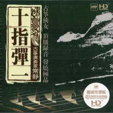

常静
============================

|  |  |
| :--: | :-- |
| [ 常静](https://i.xiami.com/changjing) | **地区**: China 中国大陆 **风格**: 世界融合 World Fusion, 自由即兴 Free Improvisation, 自然新世纪 Nature New Age, 新世纪音乐 New Age, 新古典新世纪 Neoclassical New Age **播放数**: 13335137 **粉丝数**: 11369 **评论数**: 386  |

## 档案

常靜，古箏演奏家，獨立音樂人，國家一級演員，泰國公主常任古箏老師，群仙乐团创始人。2008年北京奧運會開幕式獨奏《禮樂－－春江花月夜》，2013年在中央電視台春節聯歡晚會上和世界著名音樂家雅尼合作《琴箏和鳴》。 
2019纽约大都会博物馆特邀专场音乐会演奏嘉宾，北京世界园艺博览会开幕式表演嘉宾。 
她的音樂空靈唯美，如中國山水畫般氣韻悠長，並用現代的方式向世界介紹中國古老的文化，通過獨特的演奏吟唱方式和東西方樂器的混搭，給予古箏音樂全新的詮釋。 
在美國真音樂，台灣源動力，德國EDEL，香港雨果，中国瑞鳴等唱片公司出版《常靜》,《離弦》,《彩虹之上》《箏美人》《十指彈一》《杏花天影》,《瑞鶴飛》《仙渡云霓》等多部唱片，並在唱片中擔任作曲，編曲，演唱，演奏，製作等工作。 
2015年赴希臘和古希臘樂器音樂家合作《仙渡雲霓》。2016年作为音乐总监制作实验及声音艺术专辑《舍卫国》。2017年成立常靜藝術工作室，參與创意设计了北京國際設計周開幕式、國家大劇院「仙遊記」、正乙祠老戲樓「仙鏡奇緣」、北京bluenote 【天青色】等音樂藝術現場及獨立藝術項目。2019年應邀在紐約大都會藝術博物館舉辦音樂會。 
常靜曾與多位古典藝術大師合作，指揮家洛林.馬澤爾，作曲家陳其鋼，指揮家湯沐海等合作。合作樂團，法國國家交響樂團，BBC威爾士交響樂團等。同時，作為一個全面型藝術家與流行，新世紀，搖滾，爵士，電子，實驗，融合等音樂。 
常靜在張藝謀電影《山楂樹之戀》、《影》，王家衛電影《東邪西毒終極版》，文章主演電影《走著瞧》等電影音樂中也有精彩的古箏獨奏。 
常靜從2002年至今受聘於泰國皇室為朱拉蓬公主殿下教授古箏，和公主殿下一起在中國和泰國多個城市成功舉辦六屆「中泰一家親」的古箏歌舞晚會，擔任演奏，創作，策劃等工作，為兩國的文化交流，友好發展做出了卓越的貢獻，獲兩國領導人的高度贊揚。 
2016年作为音乐制作人制作实验及声音艺术专辑《舍卫国》。 
2015年赴希腊与古希腊乐器音乐家合作录制《仙渡雲霓》。 
2016年受邀参加希腊国庆日，被希腊驻上海领事Vassilis Xiros 授予“中希文化大使”称号。 
由于常静在艺术中的突出贡献，与之合作的国际品牌有： 
奥迪 宝马 雀巢咖啡 三宅一生 可口可乐 森海塞尔 雷克萨斯等。 
TedxFactory798 北京 （2016）演讲《永恒的乐音》 
受邀Coca-Cola（中国）演讲及即兴演奏（2017）

## 专辑

| 名称 | 语种 | 唱片公司 | 发行时间 | 专辑类别 | 专辑风格 |
| :--: | :-- | :-- | :-- | :-- | :-- |
| [ 春江花月夜](./albums/2105241104.md) | 国语 |  | 2019年09月13日 | EP, 单曲 | 古典跨界 Classical Crossover, 中国民乐 Chinese Folk Music, 新世纪音乐 New Age |
| [ 瑞鹤飞](./albums/1509128804.md) | 其他 | 上海音像 | 2012年01月01日 | 录音室专辑 |  |
| [ 杏花天影（常静 古筝仙子领衔 跨界古典唯美呈现）](./albums/5020693159.md) | 纯音乐 | 瑞鸣音乐 | 2010年07月28日 | 录音室专辑 |  |
| [ 十指弹一](./albums/391390.md) | 其他 |  | 2010年06月21日 | 合集, 杂锦 | 中国民乐 Chinese Folk Music |
| [ 箏美人](./albums/314792.md) | 国语 | 雨果唱片 | 2008年12月23日 | 录音室专辑 | 中国民乐 Chinese Folk Music |
| [ 离弦](./albums/7155.md) | 其他 | OPEN MUSIC | 2004年08月01日 | 录音室专辑 | 中国民乐 Chinese Folk Music |

## 评论

|  |  |  |
| :-- | :-- | :-- |
|  [虾米用户](https://emumo.xiami.com/u/7882047) ↗这家伙试听了很多曲子！ 2020-10-25 05:12 赞(0) 踩(0) | 
不知道美女有没有男朋友 
 |
|  [虾米用户](https://emumo.xiami.com/u/276944698) 不要自我设限..... 2019-11-21 12:49 赞(1) 踩(0) | 

 |
|  [虾米用户](https://emumo.xiami.com/u/52056952) 人生即是到來、相遇、陪伴... 2019-11-05 23:33 赞(0) 踩(0) | 

 |
|  [虾米用户](https://emumo.xiami.com/u/10386754) 旅程让我们感到快乐,而不... 2019-08-22 23:42 赞(0) 踩(0) | 
加油。
 |
|  [虾米用户](https://emumo.xiami.com/u/412977498)  2019-08-07 19:52 赞(0) 踩(0) | 
这首曲灯很喜欢，给我一种安静的感觉。我收藏了。
 |
|  [虾米用户](https://emumo.xiami.com/u/357752578) 燕:  片叶寄思迎风飘，... 2019-07-04 10:20 赞(2) 踩(0) | 
常静的《问情》，《枉凝眉》，《画心》很好听！   
 |
|  [虾米用户](https://emumo.xiami.com/u/407740715) 天马行空的想象力，哈哈哈... 2019-05-31 23:00 赞(0) 踩(0) | 
什么时候弹奏下周华健老爹的武侠歌曲老好听的哟，金典与经典哟，刀剑如梦，天下有情人，难念的经。
 |
|  [虾米用户](https://emumo.xiami.com/u/407740715) 天马行空的想象力，哈哈哈... 2019-05-28 19:09 赞(0) 踩(0) | 
19岁小妮子呀
 |
|  [虾米用户](https://emumo.xiami.com/u/407740715) 天马行空的想象力，哈哈哈... 2019-05-28 19:08 赞(0) 踩(0) | 
李宗盛作曲笑红尘，罗大佑作曲作词滚滚红尘，周华健有唱了红，这首歌呼，纵贯线红呀，可惜解散了哟   
 |
|  [虾米用户](https://emumo.xiami.com/u/353373223)  2019-04-27 21:29 赞(0) 踩(0) | 
巨蟹座女神哦
 |
|  [虾米用户](https://emumo.xiami.com/u/357752578) 燕:  片叶寄思迎风飘，... 2019-03-29 17:56 赞(3) 踩(0) | 
对灵魂的每一个细胞，进行温柔舒服地按摩着…
 |
|  [虾米用户](https://emumo.xiami.com/u/361287195) 暖暖的幸福(^o^)o甜... 2019-03-11 08:31 赞(0) 踩(0) | 
（   ）
 |
|  [虾米用户](https://emumo.xiami.com/u/272087565) 我还没想好要写什么... 2019-01-25 15:02 赞(0) 踩(0) | 
编曲能力有待提高
 |
|  [虾米用户](https://emumo.xiami.com/u/328297320) 我还没想好要写什么... 2018-10-05 18:07 赞(0) 踩(0) | 
润心悦耳动
 |
|  [虾米用户](https://emumo.xiami.com/u/2521128) 昵称和签名都回不去了。。... 2018-09-14 23:40 赞(0) 踩(0) | 
我的天，仙游记音乐会的曲目基本都没有呢
 |
|  [虾米用户](https://emumo.xiami.com/u/377525941)  2018-07-03 20:13 赞(1) 踩(0) | 
静寂的夜里　我舞在宋词的忧伤 裙裳如霓　环佩叮铛 在最妩媚的刹那　清泪成行 红莲静静绽放夜鸟掠过湖的中央 热血涌动的青春终会归于冷漠苍桑 美酒仍在而红颜会消亡 落叶归于尘土 前世今生都不知此身在何方 我也将不再有　如今夜般的诡媚与痴狂 裙裳如霓　环佩叮铛 他朝两两相忘啊 纵然今夜　明月朗朗 ------离弦
 |
|  [虾米用户](https://emumo.xiami.com/u/377525941)  2018-07-03 20:07 赞(0) 踩(0) | 
乱剑迷音 三千年的那场细雨 看一眼吧 风雨飘摇散乱如丝中的我那柔肠百转的一剑 足尖挑起的一串水珠 碎在冰冷的剑身 你一扫弦 我的长衫便旋转着洒了周遭的泥泞 放在你琴边的一杯酒 映着琴弦上掠过的一双手 还有几个这样的黄昏迟暮？ 许我这一夜的狂野 许你看一眼三千年前的风 拂动我的长衫 听我远去的尘埃落地的声响 奏响明日的葬曲 别急着让我听你细乱的心思 喝一杯我举在剑尖的酒 再等我离开 那个我舞过风雨飘摇中柔肠百转的一剑的亭子 和亭中被呼吸割破手指的你  风盈袖　杏花随之飞满了天 佚名的古筝在云深处起伏迥旋 剑光所指就是目光所在 少年的清愁和未逝的红颜 为谁留连 酒已千觞 静寂的夜里　我舞在宋词的
 |
|  [虾米用户](https://emumo.xiami.com/u/25260189)   2018-06-09 19:40 赞(0) 踩(0) | 
我喜欢
 |
|  [虾米用户](https://emumo.xiami.com/u/50161319) 沙滩只把我们的脚印停留几... 2018-06-09 02:57 赞(0) 踩(0) | 
不要写什么去欧洲【渡金】，中国及东方音乐的意境更玄妙&amp;hellip;世界音乐来形容非欧美主流体脉的音乐，正如【远东地区】是欧洲中心论视角结果，要用自己音理来确定自己的价值
 |
|  [虾米用户](https://emumo.xiami.com/u/28499293) Avignon 2018-06-01 22:22 赞(0) 踩(0) | 
深入骨髓的优美~
 |
|  [虾米用户](https://emumo.xiami.com/u/324627359) 勇往直前坚强的奋斗不缺不... 2018-05-07 10:27 赞(0) 踩(0) | 
艺术这东西是修身养性的好方单，从古到今我国的艺术文化内涵优美博大精深。
 |
|  [虾米用户](https://emumo.xiami.com/u/17676520)  2018-04-30 07:06 赞(0) 踩(0) | 
最美古筝 还属常静
 |
|  [虾米用户](https://emumo.xiami.com/u/255094967) 嘟噜嘟噜噜，胡椒粉 2018-04-05 23:59 赞(0) 踩(0) | 
你很棒哦！加油！
 |
|  [虾米用户](https://emumo.xiami.com/u/334286345)  2018-03-18 11:27 赞(0) 踩(0) | 
您的长相思是我目前最喜欢的古筝曲。希望能一直有这样的作品。
 |
|  [虾米用户](https://emumo.xiami.com/u/256277981) 宁可冻死于酷寒，也绝不穿... 2018-03-06 22:42 赞(0) 踩(0) | 
小姐姐怎么不发新曲子啦？
 |
|  [虾米用户](https://emumo.xiami.com/u/288411628) 谁不曾彷徨迷茫，谁不曾满... 2017-11-15 23:32 赞(0) 踩(0) | 
相识恨晚，好棒的音乐。
 |
|  [虾米用户](https://emumo.xiami.com/u/154175526) 艺术是生活的鸦片 2017-11-13 14:59 赞(0) 踩(0) | 
东方的马克西姆
 |
|  [虾米用户](https://emumo.xiami.com/u/257581452)  2017-10-29 08:27 赞(1) 踩(0) | 
最喜爱的筝人之一
 |
|  [虾米用户](https://emumo.xiami.com/u/298948030) 中國詩音樂電影创始人作曲... 2017-10-17 22:04 赞(0) 踩(0) | 
你好
 |
|  [虾米用户](https://emumo.xiami.com/u/2571352) Q372275025 2017-10-12 12:49 赞(0) 踩(0) | 
举手投足间的神韵，是千年的积累。
 |
|  [虾米用户](https://emumo.xiami.com/u/37009403) wxid_ufin72q... 2017-09-12 17:56 赞(0) 踩(0) | 
好听。
 |
|  [虾米用户](https://emumo.xiami.com/u/188895338)   2017-09-10 17:20 赞(0) 踩(0) | 
支持一下 
 |
|  [虾米用户](https://emumo.xiami.com/u/311221850)  2017-09-03 22:52 赞(0) 踩(0) | 
我喜欢你的素颜照。
 |
|  [虾米用户](https://emumo.xiami.com/u/317720489)  2017-08-08 01:00 赞(0) 踩(0) | 
好听
 |
|  [虾米用户](https://emumo.xiami.com/u/5828782) 一眼可载几多剑 2017-06-07 23:40 赞(0) 踩(0) | 
风采轮  常静   吕秀菱   ：）
 |
|  [虾米用户](https://emumo.xiami.com/u/5062396) 热爱真实生活即真实英雄主... 2017-05-12 16:00 赞(0) 踩(0) | 
民乐大爱！
 |
|  [虾米用户](https://emumo.xiami.com/u/291902091)  2017-04-27 22:19 赞(0) 踩(0) | 
第一次听你的声音~~~眼眶湿了~
 |
|  [虾米用户](https://emumo.xiami.com/u/68394924) 厚厚的想念，随月光蔓延。 2017-04-15 17:28 赞(1) 踩(0) | 

 |
|  [虾米用户](https://emumo.xiami.com/u/265999837)  2017-04-15 12:01 赞(0) 踩(0) | 
Beautiful music.
 |
|  [虾米用户](https://emumo.xiami.com/u/285504581)  2017-04-02 22:46 赞(0) 踩(0) | 
글용
 |
|  [虾米用户](https://emumo.xiami.com/u/194035989)  2017-03-21 13:33 赞(0) 踩(0) | 
喜欢
 |
|  [虾米用户](https://emumo.xiami.com/u/13330601) 致虚极，守静笃。 2017-03-14 19:27 赞(1) 踩(0) | 
国乐侧重的是修身养性，西方newage强调探求自然万物之理。因此，别下下拿国乐尤其是古筝和国外的newage对比。
 |
|  [虾米用户](https://emumo.xiami.com/u/13330601) 致虚极，守静笃。 2017-03-14 19:22 赞(1) 踩(0) | 
神马是newage顶级殿堂？？？？？！
 |
|  [虾米用户](https://emumo.xiami.com/u/10730406)  2017-02-21 20:13 赞(0) 踩(0) | 
期待新专辑哦！
 |
|  [虾米用户](https://emumo.xiami.com/u/10730406)  2017-02-21 12:33 赞(2) 踩(0) | 
20秒就被俘虏了~
 |
|  [虾米用户](https://emumo.xiami.com/u/264946314)  2017-01-23 09:52 赞(0) 踩(0) | 
  必须赞
 |
|  [虾米用户](https://emumo.xiami.com/u/9003931) 千淘万漉虽辛苦 2017-01-08 22:03 赞(0) 踩(0) | 
加油。
 |
|  [虾米用户](https://emumo.xiami.com/u/12411753)  2016-11-01 06:31 赞(0) 踩(0) | 
女神
 |
|  [虾米用户](https://emumo.xiami.com/u/122688364) 生在愤坑，长在赤圈；挣脱 2016-08-25 23:29 赞(1) 踩(0) | 
3117
 |
|  [虾米用户](https://emumo.xiami.com/u/6770643) 谨言慎行，戒急用忍 2016-08-04 16:39 赞(0) 踩(0) | 
今晚去看她在南京的演出『仙渡云霓』，著名古筝音乐家常静、笛箫音乐家张笛、古希腊里拉琴音乐家 Aliki Markantonatou、打击乐音乐家 Areti Miggou、歌者 Pan Kaperneka——20160804于南京“十三月空间”
 |
| ⇒ |  [虾米用户](https://emumo.xiami.com/u/6674166)  2016-08-06 16:53 赞(0) 踩(0) | 
今早在上海演出，非常棒
 |
| ⇒ |  [虾米用户](https://emumo.xiami.com/u/6770643) 谨言慎行，戒急用忍 2016-08-06 18:35 赞(0) 踩(0) | 
<q><b>潜意识说：</b></q>
 |
| ⇒ |  [虾米用户](https://emumo.xiami.com/u/6770643) 谨言慎行，戒急用忍 2016-08-15 15:53 赞(0) 踩(0) | 
<q><b>潜意识说：</b></q>
 |
|  [虾米用户](https://emumo.xiami.com/u/581402)  2016-05-28 11:25 赞(1) 踩(0) | 
这不是开茶店的开美容院的打太极练扇子舞的……各种阿姨小妹们喜欢的音乐吗。明明大俗的东西瞎捧什么臭脚。
 |
| ⇒ |  [虾米用户](https://emumo.xiami.com/u/581402)  2016-06-21 10:15 赞(0) 踩(0) | 
<q><b>KaleW说：</b></q>
 |
| ⇒ |  [虾米用户](https://emumo.xiami.com/u/852998) 西尔德斯神话 2016-07-28 15:54 赞(0) 踩(0) | 
离弦那张专辑跳扇子舞？哪个大妈，来个地址
 |
| ⇒ |  [虾米用户](https://emumo.xiami.com/u/581402)  2016-07-28 17:28 赞(0) 踩(0) | 
<q><b>c.t说：</b></q>
 |
| ⇒ |  [虾米用户](https://emumo.xiami.com/u/852998) 西尔德斯神话 2017-07-18 21:11 赞(0) 踩(0) | 
<q><b>安非他命说：</b></q>
 |
| ⇒ |  [虾米用户](https://emumo.xiami.com/u/9853927) 被声音抓走的考拉 2017-10-28 00:42 赞(0) 踩(0) | 
民乐是大俗的话那么流行可谓糟糠了吧。另外，热门几首不成代表，显然是迎合市场罢了，艺术家真正的趣致和水准室内乐都不在这类专辑，她中西结合的室内乐巡演真的很赞。
 |
|  [虾米用户](https://emumo.xiami.com/u/50875031) .无论是现在还是以前我所... 2016-05-18 19:30 赞(10) 踩(0) | 
学习古筝十几年，也曾因为古筝曲荒而弃之不弹。古筝曲多感时伤怀或是咏诵喜悦，不像是其它乐器那样有丰富的表现力，即使是悲凉的曲子似乎都有一丝甜腻。不得不说常静的曲子打破了我的偏见。我头一次在她的《呼吸》中听到了凌厉萧瑟之气，忽觉这清冽的乐器背后暗藏剑心。进可挽弓驭怒马，退可洗手做羹汤。低音区的铮铮作响，高音区的极速收弦，一如沙场铁蹄伴随刀剑金属刮擦。实在妙绝
 |
| ⇒ |  [虾米用户](https://emumo.xiami.com/u/338953552) 时光如水，岁月如歌，你我... 2019-05-02 16:13 赞(0) 踩(0) | 
看来是个行家，加油，为华夏文化争光！
 |
|  [虾米用户](https://emumo.xiami.com/u/18441703)  2016-05-11 16:32 赞(1) 踩(0) | 
常常静心
 |
|  [虾米用户](https://emumo.xiami.com/u/5573537) 音乐彩塑心灵 2016-05-09 22:59 赞(1) 踩(0) | 
坊间弹筝高手，能动某心弦者二三也。每感常静所弹，风云跌宕，大开大合，或细语呢喃，或大嗓声张，不由思之颇多而不可尽述，姑拟短句二则于后，以略表心得与谢忱： 其一： 弦拨轻重有驰张，指弹情意分抑扬；常羡瑞鹤杏花影，静听美人诉衷肠。 其二： 香沉月升空烟景，金戈铁马真豪情；以心运指弦触动，天音奏响意境成。
 |
|  [虾米用户](https://emumo.xiami.com/u/1153116)  2016-04-05 22:47 赞(0) 踩(0) | 
******
 |
|  [虾米用户](https://emumo.xiami.com/u/5691521) 孤独是最大的敌人 2016-03-09 01:56 赞(1) 踩(0) | 
说句实话，我一直不怎么喜欢她，直到我听到了《篆音》，我真的听哭了。
 |
|  [虾米用户](https://emumo.xiami.com/u/46665222) 处女座 2015-12-30 12:52 赞(0) 踩(0) | 
落花飞听不了了好难过。。。很喜欢这首歌
 |
|  [虾米用户](https://emumo.xiami.com/u/4838785) VapeTea 2015-12-29 19:11 赞(0) 踩(0) | 
桂林藏音阁《离弦》首版精装与普通版大量有货，欢迎来搞
 |
|  [虾米用户](https://emumo.xiami.com/u/46235090)  2015-12-29 11:43 赞(1) 踩(0) | 
很早就收藏并认识常静的《离弦》和《呼吸》，堪称经典。百听不厌！
 |
|  [虾米用户](https://emumo.xiami.com/u/4106767) 却道天凉好个秋 2015-12-29 11:20 赞(0) 踩(0) | 
认识常静老师几年了，也是因为场景老师的古筝从而爱上了古筝
 |
|  [虾米用户](https://emumo.xiami.com/u/7536131)  2015-12-29 00:20 赞(105) 踩(0) | 
我刚入驻了虾米音乐人，欢迎大家来我的个人主页，收听我的最新音乐
 |
| ⇒ |  [虾米用户](https://emumo.xiami.com/u/20432)  2016-01-17 22:11 赞(0) 踩(0) | 
233333
 |
| ⇒ |  [虾米用户](https://emumo.xiami.com/u/273240312) 听歌看书与休息 2017-11-03 19:35 赞(0) 踩(0) | 
二楼，嘿嘿嘿(&amp;ordm;﹃&amp;ordm;&amp;nbsp;)
 |
| ⇒ |  [虾米用户](https://emumo.xiami.com/u/262274284)  2017-12-06 08:39 赞(0) 踩(0) | 
支持！
 |
| ⇒ |  [虾米用户](https://emumo.xiami.com/u/68657276) 惟江上之清风，与山间之明... 2017-12-17 23:04 赞(0) 踩(0) | 
支持，为中华传统音乐传承者疯狂点赞。  
 |
| ⇒ |  [虾米用户](https://emumo.xiami.com/u/48300337)  2018-01-14 23:10 赞(0) 踩(0) | 
好听
 |
| ⇒ |  [虾米用户](https://emumo.xiami.com/u/205207322) 音乐是人生美好之旅，也是... 2018-01-25 00:25 赞(0) 踩(0) | 
听了很久，不同时期风格不一样，喜欢，国乐的传承与创新是音乐人毕生追求的梦想和尝试，不愧为古筝仙子，收藏了好多你演绎的曲子，真心喜欢！
 |
| ⇒ |  [虾米用户](https://emumo.xiami.com/u/377525941)  2018-07-03 20:09 赞(0) 踩(0) | 
再听《离弦》  一剑碧泓出云岫 意气风发处 侠骨柔肠醉红颜  故都风物 几许如旧 美人安在  伤、伤、伤 唯记旧曲新韵里 琮琮铮铮总关情
 |
| ⇒ |  [虾米用户](https://emumo.xiami.com/u/322986610)  2018-10-31 18:36 赞(0) 踩(0) | 
是本人吗
 |
| ⇒ |  [虾米用户](https://emumo.xiami.com/u/407637683) 倾心 2018-11-03 14:35 赞(0) 踩(0) | 
好的 遇到了你 真的好幸运 百年冷暖有佳人 常静一曲度余生 (◔◡◔)
 |
| ⇒ |  [虾米用户](https://emumo.xiami.com/u/259672679) 平凡是金 2019-06-24 08:30 赞(0) 踩(0) | 
喜欢
 |
|  [虾米用户](https://emumo.xiami.com/u/1162587)  2015-12-28 20:39 赞(1) 踩(0) | 
恭喜恭喜。。终于入驻了。。然后我想问，在哪可以买到您的同名专辑《常静》呢
 |
|  [虾米用户](https://emumo.xiami.com/u/6044057)  2015-12-26 00:21 赞(0) 踩(0) | 
恭喜常老师
 |
|  [虾米用户](https://emumo.xiami.com/u/8286923) 赛赛粉丝 2015-12-25 21:16 赞(0) 踩(0) | 
欢迎入驻。
 |
|  [虾米用户](https://emumo.xiami.com/u/8128176) 好好活着 2015-12-25 19:39 赞(0) 踩(0) | 
欢迎入驻
 |
|  [虾米用户](https://emumo.xiami.com/u/10819042) d(≖ᴗ≖ )b 2015-12-25 18:21 赞(0) 踩(0) | 
欢迎  非常喜欢常老师的弹奏
 |
|  [虾米用户](https://emumo.xiami.com/u/45032185) 微博：@乐者张笛 微信圈... 2015-12-23 20:45 赞(0) 踩(0) | 
请问常老师这个帐号是谁在管理？
 |
|  [虾米用户](https://emumo.xiami.com/u/51631029)   2015-11-23 13:26 赞(0) 踩(0) | 
，
 |
|  [虾米用户](https://emumo.xiami.com/u/77978852)  2015-10-31 12:50 赞(0) 踩(0) | 
认识常静是因为一首《呼吸》，堪称经典啊
 |
|  [虾米用户](https://emumo.xiami.com/u/14016503) 不忘初心，方得始终 2015-10-17 23:44 赞(0) 踩(0) | 
醉了醉了。。。
 |
|  [虾米用户](https://emumo.xiami.com/u/23367467) world 2015-10-02 04:24 赞(0) 踩(0) | 
Like
 |
|  [虾米用户](https://emumo.xiami.com/u/46235090)  2015-09-15 16:24 赞(0) 踩(0) | 
风格独特！
 |
|  [虾米用户](https://emumo.xiami.com/u/20432)  2015-09-11 19:42 赞(0) 踩(0) | 
我是來看靜靜的。
 |
|  [虾米用户](https://emumo.xiami.com/u/18337347)  2015-09-05 04:13 赞(0) 踩(0) | 
音乐灵性贯穿与知识丰富中.世间情为何物——音乐。
 |
|  [虾米用户](https://emumo.xiami.com/u/44815080)  2015-07-31 10:52 赞(0) 踩(0) | 
真美。。。
 |
|  [虾米用户](https://emumo.xiami.com/u/27174417)  2015-07-02 21:00 赞(0) 踩(0) | 
喜欢
 |
|  [虾米用户](https://emumo.xiami.com/u/11721040)  2015-06-08 20:02 赞(1) 踩(0) | 
刚听了 “升” ，果然美妙~
 |
|  [虾米用户](https://emumo.xiami.com/u/11728160)  2015-06-08 08:07 赞(0) 踩(0) | 
美妙的古筝。
 |
|  [虾米用户](https://emumo.xiami.com/u/5691521) 孤独是最大的敌人 2015-05-18 16:04 赞(51) 踩(0) | 
其实真正的民乐、古曲 它们的旋律结构也好 所演绎的特质也罢 在这个被快餐音乐洗过脑的时代 是很难抓住普通听众耳朵的 听众大多会批评它们没新意 不好听 从而得出一些悲观的结论 诸如中国音乐已亡云云 诚然 newage里 民乐元素运用非常出彩 融合现代音乐元素的确抓耳且动听 但它仍然是newage 而且更可笑的是 大多数听众都分不清newage和民乐 故而一味悲观 而不深思自己那连几十种传统戏剧都绝不肯静心去听上一段的耳朵 不可置否 就音乐这一块 国情阻力巨大 但无论哪个领域都有萌芽 我希望看见的 是国人坚持传统的纯朴味道 而非追逐newage稍显浮华的悦耳 这需要中国听众们一齐努力
 |
| ⇒ |  [虾米用户](https://emumo.xiami.com/u/4241117) 心外无物 2015-09-10 14:25 赞(0) 踩(0) | 
“浙江的古筝精英们，我这个人快人快语，你们不要生气！如今古筝在我们国家很热，可是，一直都在吃老本，再这样下去的话，古筝就要死了！”一上台，何占豪就语出惊人。这番话让台下上百名古筝师生鸦雀无声 整台音乐会，除了最后一曲《长安社火》是近年来改编自管弦乐以外，可以说没有一个新曲子，最新的也是创作于20年前。 中国的民乐是需要人去热爱才能谈得上去理论定义它 如果喜欢的人越来越少 自然不懂得区分民乐和newage的人只多不少 你这种想法 只会让民乐走入末路 这点何老师说的很不错
 |
| ⇒ |  [虾米用户](https://emumo.xiami.com/u/4241117) 心外无物 2015-09-10 14:26 赞(0) 踩(0) | 
所以我只能弱一下你了
 |
| ⇒ |  [虾米用户](https://emumo.xiami.com/u/5691521) 孤独是最大的敌人 2015-09-10 15:29 赞(0) 踩(0) | 
<q><b>遠山清说：</b></q>
 |
| ⇒ |  [虾米用户](https://emumo.xiami.com/u/4241117) 心外无物 2015-09-11 09:19 赞(0) 踩(0) | 
<q><b>夏羽说：</b></q>
 |
| ⇒ |  [虾米用户](https://emumo.xiami.com/u/4241117) 心外无物 2015-09-11 09:20 赞(0) 踩(0) | 
<q><b>夏羽说：</b></q>
 |
| ⇒ |  [虾米用户](https://emumo.xiami.com/u/47067227) 步步为营 2016-05-25 23:59 赞(0) 踩(0) | 
发展具有中国特色的文化，需要每一个中国公民的努力。
 |
| ⇒ |  [虾米用户](https://emumo.xiami.com/u/334031877)  2017-11-09 08:09 赞(0) 踩(0) | 
你好
 |
| ⇒ |  [虾米用户](https://emumo.xiami.com/u/154175526) 艺术是生活的鸦片 2017-11-13 15:01 赞(0) 踩(0) | 
大清就是这样亡的
 |
| ⇒ |  [虾米用户](https://emumo.xiami.com/u/8337431) 以乐会友 2018-06-03 06:04 赞(0) 踩(0) | 
同感，没有传承和创新，不与时俱进，就会被历史湮灭。
 |
| ⇒ |  [虾米用户](https://emumo.xiami.com/u/8337431) 以乐会友 2018-06-03 06:06 赞(0) 踩(0) | 
<q><b>遠山清说：</b></q>
 |
| ⇒ |  [虾米用户](https://emumo.xiami.com/u/8337431) 以乐会友 2018-06-03 06:08 赞(0) 踩(0) | 
<q><b>遠山清说：</b></q>
 |
| ⇒ |  [虾米用户](https://emumo.xiami.com/u/8337431) 以乐会友 2018-06-03 06:10 赞(0) 踩(0) | 
<q><b>遠山清说：</b></q>
 |
|  [虾米用户](https://emumo.xiami.com/u/6375713)  2015-04-24 22:02 赞(0) 踩(0) | 
美妙的古筝。
 |
|  [虾米用户](https://emumo.xiami.com/u/34877243) 古龙说过 爱笑的女孩子运... 2015-04-21 20:44 赞(1) 踩(0) | 
常静的古筝 吕秀龄的琵琶 都是一绝~女子的柔情全在曲子里了…
 |
|  [虾米用户](https://emumo.xiami.com/u/13012891) Musicneverce... 2015-04-01 17:47 赞(0) 踩(0) | 
不错
 |
|  [虾米用户](https://emumo.xiami.com/u/2540647)  2015-03-31 09:17 赞(0) 踩(0) | 
我也带着孩子 一起来学习古筝了，自己有点笨手笨脚，但是非常喜欢
 |
|  [虾米用户](https://emumo.xiami.com/u/1365690) ⛴ 2015-03-14 21:15 赞(0) 踩(0) | 
挺能静心
 |
|  [虾米用户](https://emumo.xiami.com/u/16565346) QQ音乐：rainbri... 2015-03-05 13:33 赞(0) 踩(0) | 
为什么落花飞听不了了!!!!!
 |
|  [虾米用户](https://emumo.xiami.com/u/8218530) 加油！ 2015-02-28 10:19 赞(0) 踩(0) | 
哇 o.o
 |
|  [虾米用户](https://emumo.xiami.com/u/14494009)  2015-02-17 16:56 赞(0) 踩(0) | 
古风
 |
|  [虾米用户](https://emumo.xiami.com/u/12876004) ` 2015-02-01 22:14 赞(0) 踩(0) | 
~~
 |
|  [虾米用户](https://emumo.xiami.com/u/2764643)  2015-02-01 17:52 赞(19) 踩(0) | 
旧东西不一定都是好的，可只要加一点新的心进去，其实这些老玩意儿可以有更强大的生命力。
 |
| ⇒ |  [虾米用户](https://emumo.xiami.com/u/2764643)  2015-03-21 00:11 赞(0) 踩(0) | 
<q><b>lonegene说：</b></q>
 |
| ⇒ |  [虾米用户](https://emumo.xiami.com/u/700453) 虾米再见 2017-10-28 00:43 赞(0) 踩(0) | 
翻译：国乐不一定都是好的，可只要加一点西洋音乐进去，其实这些国乐玩意可以有更强大的（西洋文化霸权下的）生命力。
 |
|  [虾米用户](https://emumo.xiami.com/u/46119340)  2015-01-16 22:45 赞(0) 踩(0) | 
常静的古筝，令人陶醉
 |
|  [虾米用户](https://emumo.xiami.com/u/14838169) Let’s talk a... 2015-01-12 08:41 赞(0) 踩(0) | 
去年看她在学校演出的时候居然忘了戴眼镜……话说我这样看音乐人的脸真的好么！
 |
|  [虾米用户](https://emumo.xiami.com/u/1091908) 一切随缘 2015-01-07 10:05 赞(1) 踩(0) | 
落花飞 - 静界音乐会 - 常静：<a href="http://v.youku.com/v_show/id_XODMyNzQ2NTY0.html" target="_blank" rel="nofollow noreferrer noopener">http://v.youku.com/v_show/id_XODMyNzQ2NTY0.html</a>
 |
|  [虾米用户](https://emumo.xiami.com/u/44161162) 音乐人生 2014-12-27 19:13 赞(0) 踩(0) | 
琴心合一，琴中有情。琴中有画，琴中有诗意。
 |
|  [虾米用户](https://emumo.xiami.com/u/44161162) 音乐人生 2014-12-27 19:09 赞(0) 踩(0) | 
比起。。只是多了一份女子柔情的妩媚。
 |
|  [虾米用户](https://emumo.xiami.com/u/31825593) Miss.D&M 2014-12-27 18:41 赞(0) 踩(0) | 
.
 |
|  [虾米用户](https://emumo.xiami.com/u/39425440)  2014-12-18 00:30 赞(0) 踩(0) | 
爱！
 |
|  [虾米用户](https://emumo.xiami.com/u/9151332)  2014-12-08 20:31 赞(0) 踩(0) | 
只喜欢这种真正干净的曲子， 不喜欢付娜的那种，加上一些乱七八糟的东西，让人觉得不伦不类（主要是不好听）    个人还是觉得  中国乐曲，得 纯，得 回归本质
 |
|  [虾米用户](https://emumo.xiami.com/u/8128176) 好好活着 2014-12-07 13:00 赞(0) 踩(0) | 
女神
 |
|  [虾米用户](https://emumo.xiami.com/u/32461398) 曾在云上浮想联翩如今也终... 2014-12-04 19:13 赞(0) 踩(0) | 
真心╮(￣▽￣）
 |
|  [虾米用户](https://emumo.xiami.com/u/89262) 音乐于我这乏味的一生如同... 2014-11-22 22:34 赞(0) 踩(0) | 
有点下垂了
 |
|  [虾米用户](https://emumo.xiami.com/u/21679543)  2014-11-03 19:32 赞(0) 踩(0) | 
音色太干净了！弦挑流水洗客愁！
 |
|  [虾米用户](https://emumo.xiami.com/u/43027521) 山穷水尽已无路   沿街... 2014-10-26 03:55 赞(1) 踩(0) | 
寂静的夜、唯有一丝清凉 是这种琴声  曾感动着多少少年的心声 梦  总是那么美好  加油……
 |
|  [虾米用户](https://emumo.xiami.com/u/13552)  2014-10-08 14:46 赞(0) 踩(0) | 
画心
 |
|  [虾米用户](https://emumo.xiami.com/u/5492697) 节奏旋律带感 2014-09-22 22:18 赞(0) 踩(0) | 
掠-未完成
 |
|  [虾米用户](https://emumo.xiami.com/u/40525969) 一雯 2014-08-28 13:00 赞(0) 踩(0) | 
喜欢常静的音乐
 |
|  [虾米用户](https://emumo.xiami.com/u/5488945) ご無用 2014-08-20 14:22 赞(0) 踩(0) | 
好
 |
|  [虾米用户](https://emumo.xiami.com/u/5642099) 我还没想好要写什么... 2014-08-14 23:41 赞(0) 踩(0) | 
怎么没有 完美?这个才是常静代表作
 |
|  [虾米用户](https://emumo.xiami.com/u/8049688)   2014-08-08 07:12 赞(0) 踩(0) | 
唯美的场景中，充满着温柔、包含着大气！
 |
|  [虾米用户](https://emumo.xiami.com/u/15427197) 程序搬运工 2014-08-05 20:13 赞(0) 踩(0) | 
我喜欢这箫。
 |
|  [虾米用户](https://emumo.xiami.com/u/6666474) shuiruyan 2014-08-02 19:03 赞(0) 踩(0) | 
超喜欢她的古筝
 |
|  [虾米用户](https://emumo.xiami.com/u/9360539) 愿无岁月可回头 2014-08-01 17:20 赞(0) 踩(0) | 
泰国公主的老师啊~~
 |
|  [虾米用户](https://emumo.xiami.com/u/231797) 活着真好 好好活着 2014-07-16 21:18 赞(0) 踩(0) | 
~
 |
|  [虾米用户](https://emumo.xiami.com/u/4421659)  2014-06-23 12:46 赞(0) 踩(0) | 
古香古色
 |
|  [虾米用户](https://emumo.xiami.com/u/10819042) d(≖ᴗ≖ )b 2014-06-14 00:07 赞(0) 踩(0) | 
古筝,民乐,纯音乐,古典音乐,
 |
|  [虾米用户](https://emumo.xiami.com/u/19237460)  2014-04-24 06:56 赞(0) 踩(0) | 
喜欢！
 |
|  [虾米用户](https://emumo.xiami.com/u/1102881)  2014-04-08 08:53 赞(0) 踩(0) | 
古色古香
 |
|  [虾米用户](https://emumo.xiami.com/u/2002503) 追风筝的人。 2014-04-05 15:00 赞(0) 踩(0) | 
古筝的声音
 |
|  [虾米用户](https://emumo.xiami.com/u/6790498)  2014-04-02 12:29 赞(0) 踩(0) | 
知性，气质
 |
|  [虾米用户](https://emumo.xiami.com/u/10532234) light music 2014-03-14 20:57 赞(0) 踩(0) | 
有一个喜欢的中国乐手。
 |
|  [虾米用户](https://emumo.xiami.com/u/33585405)  2014-03-05 14:17 赞(0) 踩(0) | 
2
 |
|  [虾米用户](https://emumo.xiami.com/u/13193466)  2014-03-02 12:57 赞(0) 踩(0) | 
清新中带有一点点的忧伤。喜欢！
 |
|  [虾米用户](https://emumo.xiami.com/u/645218) 任性逍遥于有欲无欲之间 2014-02-26 23:50 赞(0) 踩(0) | 
喜欢这个调调
 |
|  [虾米用户](https://emumo.xiami.com/u/10943164) 以诚相待 2014-02-18 11:49 赞(0) 踩(0) | 
我也喜欢常静古筝乐曲。特别是《离弦》。第一次听没啥感觉，后面越听越喜欢。值得品味。我想这就是好音乐吧！
 |
|  [虾米用户](https://emumo.xiami.com/u/31299502) 梦幻天使helen966 2014-01-08 16:28 赞(0) 踩(0) | 
喜欢常静古筝乐曲
 |
|  [虾米用户](https://emumo.xiami.com/u/7730996) 这家伙很傻，居然留了言…... 2014-01-05 10:57 赞(0) 踩(0) | 
为什么篆音没找到，求链接
 |
|  [虾米用户](https://emumo.xiami.com/u/9481845)  2014-01-04 19:24 赞(0) 踩(0) | 
有没有搞错，画心排第一，呼吸怎么在下面？
 |
|  [虾米用户](https://emumo.xiami.com/u/26526457) 滕州二中91 2013-12-24 11:59 赞(0) 踩(0) | 
妙曼
 |
|  [虾米用户](https://emumo.xiami.com/u/4167649) 暂无签名~ 2013-12-17 20:29 赞(0) 踩(0) | 
@常小敬 我还以为你换名字了 而且开始弹古筝了
 |
|  [虾米用户](https://emumo.xiami.com/u/4399004) 沉淀。。。 2013-12-17 13:33 赞(0) 踩(0) | 
筝
 |
|  [虾米用户](https://emumo.xiami.com/u/3129769)  2013-12-14 22:28 赞(0) 踩(0) | 
筝美人常静！
 |
|  [虾米用户](https://emumo.xiami.com/u/3088369)  2013-12-09 21:29 赞(0) 踩(0) | 
古人的情绪
 |
|  [虾米用户](https://emumo.xiami.com/u/29051941) 修炼自身 2013-12-04 23:39 赞(0) 踩(0) | 
作为现代版的古典音乐，很够味
 |
|  [虾米用户](https://emumo.xiami.com/u/20432781) nothing 2013-11-29 14:57 赞(0) 踩(0) | 
古典
 |
|  [虾米用户](https://emumo.xiami.com/u/9040123)  2013-11-29 14:54 赞(27) 踩(0) | 
常静的《升》被听众严重忽略了！——西尔德斯.新世纪.中国推荐的没错！——常静的曲子唯《升》可入New Age顶级殿堂！！！
 |
| ⇒ |  [虾米用户](https://emumo.xiami.com/u/828217) 凉风起，又羁旅。。。 2013-12-02 15:46 赞(0) 踩(0) | 
有推荐就听一下，谢啦！
 |
| ⇒ |  [虾米用户](https://emumo.xiami.com/u/828217) 凉风起，又羁旅。。。 2013-12-02 15:47 赞(0) 踩(0) | 
有《阿姐鼓》的味道。
 |
| ⇒ |  [虾米用户](https://emumo.xiami.com/u/9481845)  2014-11-26 20:37 赞(0) 踩(0) | 
听了，不错的
 |
| ⇒ |  [虾米用户](https://emumo.xiami.com/u/942415)  2014-12-29 12:40 赞(0) 踩(0) | 
西尔德斯.新世纪我全部听过，个人认为不只有《升》，《霸王一》、《天宫》都可以。
 |
|  [虾米用户](https://emumo.xiami.com/u/28489780)  2013-11-27 01:44 赞(0) 踩(0) | 
很美
 |
|  [虾米用户](https://emumo.xiami.com/u/1949345) Skong(司空) 2013-11-22 19:32 赞(2) 踩(0) | 
陈悦，常静，邵荣，赵聪……为什么这么些民乐演奏家不推出原创专辑呢？建议和林海、范宗沛这样的作曲家合作，多多搞原创，这样民乐才能发展，才能走的更远。
 |
| ⇒ |  [虾米用户](https://emumo.xiami.com/u/5063824)  2013-12-28 00:29 赞(0) 踩(0) | 
陈悦的专辑《远行》，《乱红》不是原创，OUT!
 |
|  [虾米用户](https://emumo.xiami.com/u/8443562)  2013-11-22 13:32 赞(0) 踩(0) | 
好听
 |
|  [虾米用户](https://emumo.xiami.com/u/722784) Bite me！Baby 2013-11-18 19:03 赞(0) 踩(0) | 
一个 常安，常静，  有点意思
 |
|  [虾米用户](https://emumo.xiami.com/u/18773012) 卫道东升 2013-11-16 12:35 赞(0) 踩(0) | 
非常喜欢她的音乐
 |
|  [虾米用户](https://emumo.xiami.com/u/22485851) my oh my 2013-11-02 21:03 赞(0) 踩(0) | 
古箏好聽
 |
|  [虾米用户](https://emumo.xiami.com/u/22485851) my oh my 2013-11-02 21:02 赞(0) 踩(0) | 
gd
 |
|  [虾米用户](https://emumo.xiami.com/u/25914273)  2013-11-02 13:19 赞(0) 踩(0) | 
good
 |
|  [虾米用户](https://emumo.xiami.com/u/2307526) 连接比特与像素的造梦师！ 2013-11-01 09:30 赞(0) 踩(0) | 
古筝派！
 |
|  [虾米用户](https://emumo.xiami.com/u/4241117) 心外无物 2013-10-25 15:23 赞(0) 踩(0) | 
藤原育郎为画心做的曲子很棒 改编起来也得心应手 加上演奏者技术 很棒
 |
|  [虾米用户](https://emumo.xiami.com/u/14972652)  2013-10-03 21:10 赞(0) 踩(0) | 
情感的凝练如果再诗画一些那一定很迷人，指法的功底的确相当好。（再切入情感的气质进去就好了）
 |
|  [虾米用户](https://emumo.xiami.com/u/15477519) 爱  是生命的和弦，而不... 2013-09-20 09:36 赞(4) 踩(0) | 
一直很喜欢常静的古筝乐...
 |
|  [虾米用户](https://emumo.xiami.com/u/22172832) 跟你听音乐 2013-09-17 19:52 赞(0) 踩(0) | 
tt
 |
|  [虾米用户](https://emumo.xiami.com/u/1081643)  2013-09-11 22:56 赞(0) 踩(0) | 
篆音呢？给删了？
 |
|  [虾米用户](https://emumo.xiami.com/u/2722471)   2013-09-05 10:35 赞(0) 踩(0) | 
编曲都好棒
 |
|  [虾米用户](https://emumo.xiami.com/u/19569044) 天下乐友聚一堂 2013-08-28 20:26 赞(0) 踩(0) | 
常静美人
 |
|  [虾米用户](https://emumo.xiami.com/u/7184182)   2013-08-20 13:47 赞(0) 踩(0) | 
很有创意，结合的
 |
|  [虾米用户](https://emumo.xiami.com/u/18874620)  2013-08-12 16:28 赞(0) 踩(0) | 
古筝 1
 |
|  [虾米用户](https://emumo.xiami.com/u/18874620)  2013-08-12 16:28 赞(0) 踩(0) | 
古筝 1
 |
|  [虾米用户](https://emumo.xiami.com/u/317986)  2013-08-05 12:42 赞(1) 踩(0) | 
无论音乐还是爱情，心动就是收获！
 |
|  [虾米用户](https://emumo.xiami.com/u/7956143)  2013-07-31 10:34 赞(1) 踩(0) | 
琴幻 古琴悠悠回，空灵迷幻魅。 彩云乘飘飞，蓝天舞明媚。
 |
|  [虾米用户](https://emumo.xiami.com/u/17096969) s站733aaa.com 2013-07-11 00:00 赞(0) 踩(0) | 
好听
 |
|  [虾米用户](https://emumo.xiami.com/u/4938458)  2013-07-06 22:00 赞(0) 踩(0) | 
很厉害
 |
|  [虾米用户](https://emumo.xiami.com/u/10392414)  2013-07-05 21:18 赞(0) 踩(0) | 
呼吸常静
 |
|  [虾米用户](https://emumo.xiami.com/u/6259410)  2013-06-23 14:46 赞(0) 踩(0) | 
活力
 |
|  [虾米用户](https://emumo.xiami.com/u/13512605)  2013-06-16 11:47 赞(1) 踩(0) | 
喜欢筝的悠扬。
 |
|  [虾米用户](https://emumo.xiami.com/u/13512605)  2013-06-16 11:46 赞(1) 踩(0) | 
喜欢筝的悠扬和淡淡的忧愁。
 |
|  [虾米用户](https://emumo.xiami.com/u/13512605)  2013-06-16 11:42 赞(0) 踩(0) | 
这样的筝曲真好听，我特别喜欢《画心》，那抹不掉的一丝伤感才是真的人心底里的那一些困惑。
 |
|  [虾米用户](https://emumo.xiami.com/u/918421)  2013-06-09 04:53 赞(0) 踩(0) | 
sounds great
 |
|  [虾米用户](https://emumo.xiami.com/u/11913286) 斗战圣皇 2013-06-07 18:25 赞(0) 踩(0) | 
常静2
 |
|  [虾米用户](https://emumo.xiami.com/u/4847772)  2013-06-07 09:42 赞(0) 踩(0) | 
好听
 |
|  [虾米用户](https://emumo.xiami.com/u/1271940) 性情中人 2013-06-05 13:14 赞(0) 踩(0) | 
常静常静，非常宁静，
 |
|  [虾米用户](https://emumo.xiami.com/u/11906345) 埋没在音乐中 2013-05-30 03:06 赞(0) 踩(0) | 
真的很不错，旋律优美
 |
|  [虾米用户](https://emumo.xiami.com/u/15269606)  2013-05-29 20:24 赞(0) 踩(0) | 
好听
 |
|  [虾米用户](https://emumo.xiami.com/u/15458785) 生活不是等待风暴过去，而 2013-05-27 19:34 赞(0) 踩(0) | 
清新
 |
|  [虾米用户](https://emumo.xiami.com/u/7618264) 疯人疯语 2013-05-23 00:01 赞(0) 踩(0) | 
清爽
 |
|  [虾米用户](https://emumo.xiami.com/u/5143195)  2013-05-20 21:57 赞(0) 踩(0) | 
唯美古筝
 |
|  [虾米用户](https://emumo.xiami.com/u/2998485) zi 2013-05-01 09:09 赞(0) 踩(0) | 
古筝
 |
|  [虾米用户](https://emumo.xiami.com/u/5453031) 风住街33号 2013-04-24 16:58 赞(0) 踩(0) | 
和平之月,
 |
| ⇒ |  [虾米用户](https://emumo.xiami.com/u/450722) 中年人徐二千 2013-05-04 17:31 赞(0) 踩(0) | 
和平之月什么时候签她了
 |
| ⇒ |  [虾米用户](https://emumo.xiami.com/u/5453031) 风住街33号 2017-10-30 10:11 赞(0) 踩(0) | 
<q><b>Tea.说：</b></q>
 |
|  [虾米用户](https://emumo.xiami.com/u/13981862) 音乐，心灵茶语…… 2013-04-23 10:44 赞(0) 踩(0) | 
喜欢
 |
|  [虾米用户](https://emumo.xiami.com/u/6437798)  2013-04-15 09:18 赞(0) 踩(0) | 
漂亮
 |
|  [虾米用户](https://emumo.xiami.com/u/12717563) . 2013-04-13 19:42 赞(0) 踩(0) | 
画心真是国风之经典
 |
|  [虾米用户](https://emumo.xiami.com/u/7663017) 不是猫中偏爱橘 2013-04-13 16:16 赞(0) 踩(0) | 
第一次这么喜欢古筝……
 |
|  [虾米用户](https://emumo.xiami.com/u/11754612)  2013-04-11 15:30 赞(0) 踩(0) | 
天籁，清新
 |
|  [虾米用户](https://emumo.xiami.com/u/3121427) 等，我们自己，一起前行… 2013-04-10 20:22 赞(0) 踩(0) | 
心静
 |
|  [虾米用户](https://emumo.xiami.com/u/6895134)  2013-04-09 18:58 赞(0) 踩(0) | 
天籁之音
 |
|  [虾米用户](https://emumo.xiami.com/u/13037028)  2013-04-08 14:30 赞(0) 踩(0) | 
古筝真的是 媚到骨子里。尤其还有这样一位抚琴人。
 |
|  [虾米用户](https://emumo.xiami.com/u/13787227) 好的音乐让人陶醉 2013-04-02 19:38 赞(0) 踩(0) | 
最喜欢她的  离弦
 |
|  [虾米用户](https://emumo.xiami.com/u/5738886) “你住的城市下雨了，很想... 2013-03-31 01:31 赞(0) 踩(0) | 
古筝,常静,中国风,纯音乐,
 |
|  [虾米用户](https://emumo.xiami.com/u/2894781)  2013-03-23 02:09 赞(0) 踩(0) | 
good
 |
|  [虾米用户](https://emumo.xiami.com/u/658427) 重口味者的清淡修行 2013-03-18 20:11 赞(0) 踩(0) | 
她有呼吸感。
 |
|  [虾米用户](https://emumo.xiami.com/u/4412959) fresh steame... 2013-03-18 16:53 赞(0) 踩(0) | 
古箏是我唯一會的樂器。sigh
 |
|  [虾米用户](https://emumo.xiami.com/u/13548616) 浮生若梦，怎奈一梦成痴。 2013-03-16 18:41 赞(0) 踩(0) | 
古筝仙子~~
 |
|  [虾米用户](https://emumo.xiami.com/u/13505650) 暂无签名~ 2013-03-15 09:23 赞(0) 踩(0) | 
中国风
 |
|  [虾米用户](https://emumo.xiami.com/u/13414935) Angel 2013-03-13 18:20 赞(0) 踩(0) | 
good
 |
|  [虾米用户](https://emumo.xiami.com/u/13437354)  2013-03-12 16:34 赞(0) 踩(0) | 
很美
 |
|  [虾米用户](https://emumo.xiami.com/u/12882932)  2013-03-06 18:07 赞(0) 踩(0) | 
喜欢古筝古色古香的曲风。
 |
|  [虾米用户](https://emumo.xiami.com/u/3670501) 我还没想好要写什么... 2013-03-04 20:22 赞(0) 踩(0) | 
古筝，古香古色中国风
 |
|  [虾米用户](https://emumo.xiami.com/u/5942311) 一书一茶一曲夫复何求 2013-03-03 20:28 赞(0) 踩(0) | 
动听，享受
 |
|  [虾米用户](https://emumo.xiami.com/u/10216979)  2013-03-02 20:29 赞(0) 踩(0) | 
優美~
 |
|  [虾米用户](https://emumo.xiami.com/u/13307404) 愿如一叶知秋般的灵性. 2013-03-01 14:16 赞(1) 踩(0) | 
就是喜欢常静的这句自我介绍:我是常静,这是古筝!像是在说一种与生俱来的默契一样.
 |
|  [虾米用户](https://emumo.xiami.com/u/13307404) 愿如一叶知秋般的灵性. 2013-03-01 14:15 赞(0) 踩(0) | 
十分喜欢古筝
 |
|  [虾米用户](https://emumo.xiami.com/u/10932472) 浪琴 2013-02-27 23:06 赞(0) 踩(0) | 
+1
 |
|  [虾米用户](https://emumo.xiami.com/u/639275)  2013-02-27 14:39 赞(0) 踩(0) | 
老人就该听古典。
 |
|  [虾米用户](https://emumo.xiami.com/u/11939688)  2013-02-19 15:33 赞(0) 踩(0) | 
语未成  曲先行
 |
|  [虾米用户](https://emumo.xiami.com/u/12962866)  2013-02-15 02:19 赞(0) 踩(0) | 
3
 |
|  [虾米用户](https://emumo.xiami.com/u/5986700)  2013-02-13 10:47 赞(0) 踩(0) | 
@大卫-曾玉波 这里可以听听常静的古筝。
 |
|  [虾米用户](https://emumo.xiami.com/u/531424)  2013-02-07 16:21 赞(0) 踩(0) | 
古筝，很适合看书的时候听啊！
 |
|  [虾米用户](https://emumo.xiami.com/u/10407055)  2013-02-06 21:26 赞(0) 踩(0) | 
喜欢就是喜欢啦
 |
|  [虾米用户](https://emumo.xiami.com/u/12494170)  2013-01-20 18:16 赞(0) 踩(0) | 
都是挺熟悉的旋律
 |
|  [虾米用户](https://emumo.xiami.com/u/12470866) 我还没想好要写什么... 2013-01-19 15:55 赞(0) 踩(0) | 
喜欢
 |
|  [虾米用户](https://emumo.xiami.com/u/12481957) 加夜班 2013-01-17 20:56 赞(0) 踩(0) | 
有特色，属于发烧友喜欢的类型
 |
|  [虾米用户](https://emumo.xiami.com/u/12320288)  2013-01-08 22:27 赞(0) 踩(0) | 
喜欢古筝，喜欢常静是从她的《呼吸》开始，我喜欢英姿飒爽的古典美女
 |
|  [虾米用户](https://emumo.xiami.com/u/5752134)  2013-01-03 02:31 赞(0) 踩(0) | 
中国民乐的新希望。
 |
|  [虾米用户](https://emumo.xiami.com/u/10733714)  2012-12-26 21:57 赞(0) 踩(0) | 
好
 |
|  [虾米用户](https://emumo.xiami.com/u/8634523)  2012-12-18 21:16 赞(0) 踩(0) | 
听久了外国的纯音乐，偶尔也试听一下中国风；
 |
|  [虾米用户](https://emumo.xiami.com/u/255584)  2012-12-09 11:51 赞(0) 踩(0) | 
古筝,
 |
|  [虾米用户](https://emumo.xiami.com/u/11703891)  2012-11-29 21:09 赞(0) 踩(0) | 
真好聽
 |
|  [虾米用户](https://emumo.xiami.com/u/2857926)  2012-11-22 20:38 赞(0) 踩(0) | 
kuli--古箏聲音太美了.可能會的人太少----知音難尋！
 |
|  [虾米用户](https://emumo.xiami.com/u/2075821) 暂无签名~ 2012-11-21 22:31 赞(0) 踩(0) | 
喜欢
 |
|  [虾米用户](https://emumo.xiami.com/u/2075821) 暂无签名~ 2012-11-21 22:30 赞(0) 踩(0) | 
古色古香
 |
|  [虾米用户](https://emumo.xiami.com/u/11072645)  2012-11-20 11:15 赞(0) 踩(0) | 
道不尽唯美绵长。。。。
 |
|  [虾米用户](https://emumo.xiami.com/u/1616484)   2012-11-17 21:14 赞(0) 踩(0) | 
@Table_lamp
 |
|  [虾米用户](https://emumo.xiami.com/u/10658749) 周霞青 2012-11-17 11:33 赞(0) 踩(0) | 
音乐比较好听，希望能有更多更新的作品。
 |
|  [虾米用户](https://emumo.xiami.com/u/6227075)  2012-11-06 20:18 赞(0) 踩(0) | 
心灵振荡
 |
|  [虾米用户](https://emumo.xiami.com/u/3783594) 你若盛开清风自来 2012-10-31 22:07 赞(0) 踩(0) | 
上次百讲常静和戴维的琴筝合奏真心赞~
 |
|  [虾米用户](https://emumo.xiami.com/u/11121763) 爱音乐，很幸福 2012-10-29 13:00 赞(0) 踩(0) | 
纤纤素手，绵绵琴音，道不尽的唯美绵长。。。
 |
|  [虾米用户](https://emumo.xiami.com/u/3223739)  2012-10-22 18:15 赞(1) 踩(0) | 
我真的是一个很害羞的人。如果我出现了，不是因为我想被人看到，而是因为音乐。
 |
|  [虾米用户](https://emumo.xiami.com/u/10097074)  2012-10-17 11:47 赞(0) 踩(0) | 
美美美
 |
|  [虾米用户](https://emumo.xiami.com/u/9076669)  2012-10-14 11:07 赞(0) 踩(0) | 
很棒的古筝
 |
|  [虾米用户](https://emumo.xiami.com/u/9722594) 不夸张的说。我… 2012-10-11 21:52 赞(0) 踩(0) | 
壮哉我中国古风~~~&amp;gt;&amp;lt;
 |
|  [虾米用户](https://emumo.xiami.com/u/7326069) 好大的雪 2012-10-06 14:35 赞(0) 踩(0) | 
古筝的现代美，赞一个。
 |
|  [虾米用户](https://emumo.xiami.com/u/7326069) 好大的雪 2012-10-06 10:26 赞(0) 踩(0) | 
不错。真没想到。别有洞天。赞一个。
 |
|  [虾米用户](https://emumo.xiami.com/u/10904783) jksiu 2012-10-03 05:42 赞(0) 踩(0) | 
Cool!
 |
|  [虾米用户](https://emumo.xiami.com/u/10484319)  2012-09-29 22:47 赞(0) 踩(0) | 
太好聽了
 |
|  [虾米用户](https://emumo.xiami.com/u/10695405) 每个人都有自己的金蔷薇 2012-09-29 21:10 赞(0) 踩(0) | 
啊啦啦，偶滴同行哦~~（自我抬高）
 |
|  [虾米用户](https://emumo.xiami.com/u/10766531)  2012-09-24 22:17 赞(0) 踩(0) | 
喜欢，有一种幻影的感觉。
 |
|  [虾米用户](https://emumo.xiami.com/u/3235848)  2012-09-21 20:15 赞(0) 踩(0) | 
啊啊啊  俺好想学古筝T T
 |
|  [虾米用户](https://emumo.xiami.com/u/7156321) O(∩_∩)O 2012-09-20 10:00 赞(0) 踩(0) | 
不一一去听了有时间再来
 |
|  [虾米用户](https://emumo.xiami.com/u/7366460) 音乐，是心灵的感受，是心... 2012-09-15 09:55 赞(0) 踩(0) | 
赞一个！
 |
|  [虾米用户](https://emumo.xiami.com/u/10438666)  2012-09-13 11:04 赞(0) 踩(0) | 
不错
 |
|  [虾米用户](https://emumo.xiami.com/u/7812206)  2012-09-12 13:19 赞(0) 踩(0) | 
古筝
 |
|  [虾米用户](https://emumo.xiami.com/u/9856339) kyr 2012-09-11 10:36 赞(0) 踩(0) | 
优美.
 |
|  [虾米用户](https://emumo.xiami.com/u/5596291)  2012-09-10 18:20 赞(0) 踩(0) | 
好听
 |
|  [虾米用户](https://emumo.xiami.com/u/10550399)  2012-09-09 08:30 赞(0) 踩(0) | 
yi
 |
|  [虾米用户](https://emumo.xiami.com/u/978091)  2012-09-02 12:54 赞(0) 踩(0) | 
~~~~~~~
 |
|  [虾米用户](https://emumo.xiami.com/u/1914168)  2012-08-21 14:39 赞(0) 踩(0) | 
古筝一绝
 |
|  [虾米用户](https://emumo.xiami.com/u/2303506)  2012-08-20 08:55 赞(1) 踩(0) | 
古筝好
 |
|  [虾米用户](https://emumo.xiami.com/u/9827725)   2012-08-16 23:09 赞(0) 踩(0) | 
古典
 |
|  [虾米用户](https://emumo.xiami.com/u/8797283)  2012-08-13 23:03 赞(0) 踩(0) | 
风沙拂面，酒囊相传，弹剑吟，沧海一声笑。丝纱里，红唇酌酒桃花面，一囊酒，青钢剑，谁更娇艳？
 |
|  [虾米用户](https://emumo.xiami.com/u/10099384) HONGDOU 2012-08-07 11:27 赞(0) 踩(0) | 
分享给大家听
 |
|  [虾米用户](https://emumo.xiami.com/u/10099384) HONGDOU 2012-08-05 17:06 赞(0) 踩(0) | 
优美动听
 |
|  [虾米用户](https://emumo.xiami.com/u/6122057) 耄耋 2012-08-05 14:04 赞(0) 踩(0) | 
适合舞蹈
 |
|  [虾米用户](https://emumo.xiami.com/u/6897505)  2012-07-31 15:24 赞(0) 踩(0) | 
很古典
 |
|  [虾米用户](https://emumo.xiami.com/u/6947503)  2012-07-30 11:20 赞(0) 踩(0) | 
超级喜欢
 |
|  [虾米用户](https://emumo.xiami.com/u/6619432)  2012-07-29 09:50 赞(0) 踩(0) | 
古典优扬
 |
|  [虾米用户](https://emumo.xiami.com/u/687193) 自由 2012-07-25 18:02 赞(0) 踩(0) | 
中国风,
 |
|  [虾米用户](https://emumo.xiami.com/u/9144466)  2012-07-22 20:22 赞(0) 踩(0) | 
心弦
 |
|  [虾米用户](https://emumo.xiami.com/u/9525778)  2012-07-11 09:32 赞(0) 踩(0) | 
彈的真棒
 |
|  [虾米用户](https://emumo.xiami.com/u/9071815)  2012-07-08 10:02 赞(0) 踩(0) | 
听听
 |
|  [虾米用户](https://emumo.xiami.com/u/5400774)  2012-07-06 20:19 赞(0) 踩(0) | 
好听
 |
|  [虾米用户](https://emumo.xiami.com/u/9686000)  2012-07-04 10:54 赞(0) 踩(0) | 
静心~~纯粹~
 |
|  [虾米用户](https://emumo.xiami.com/u/4491227)  2012-07-03 15:26 赞(0) 踩(0) | 
古典美，古筝
 |
|  [虾米用户](https://emumo.xiami.com/u/4020450)  2012-06-26 22:36 赞(1) 踩(0) | 
你的古筝比摇滚更拉风 ， 有个性 ！
 |
|  [虾米用户](https://emumo.xiami.com/u/9570074) 邓红梅 2012-06-25 18:42 赞(0) 踩(0) | 
只因喜欢她的琴音和她孤傲的气质！
 |
|  [虾米用户](https://emumo.xiami.com/u/6249454)  2012-06-20 16:26 赞(0) 踩(0) | 
我的曾用名，听听！
 |
|  [虾米用户](https://emumo.xiami.com/u/7681386)  2012-06-14 14:09 赞(0) 踩(0) | 
nice
 |
|  [虾米用户](https://emumo.xiami.com/u/9267688)  2012-06-14 11:06 赞(0) 踩(0) | 
笑红尘笛子配的好美
 |
|  [虾米用户](https://emumo.xiami.com/u/1987316)  2012-06-06 11:35 赞(0) 踩(0) | 
当时寻求古曲，有收藏过她的专辑，很喜欢，一如其名。
 |
|  [虾米用户](https://emumo.xiami.com/u/4909747)  2012-06-04 17:39 赞(0) 踩(0) | 
被热心的爱音乐人推荐而来！特别喜欢！
 |
|  [虾米用户](https://emumo.xiami.com/u/1504845)  2012-06-03 21:26 赞(0) 踩(0) | 
常静弹奏的《笑红尘》不是一般的赞
 |
|  [虾米用户](https://emumo.xiami.com/u/5842383)  2012-05-28 06:19 赞(0) 踩(0) | 
清丽卓绝
 |
|  [虾米用户](https://emumo.xiami.com/u/5983325)  2012-05-21 09:52 赞(0) 踩(0) | 
特别喜欢这位乐友对常静的评语——率性无遗，洒脱自如
 |
|  [虾米用户](https://emumo.xiami.com/u/5983325)  2012-05-21 09:51 赞(0) 踩(0) | 
从《离弦》《呼吸》开始惊艳于常静。有点玄幻感的音乐，嗲来完全不一样的听感
 |
|  [虾米用户](https://emumo.xiami.com/u/7503021)  2012-05-19 23:30 赞(0) 踩(0) | 
纯音乐、真音乐，喜欢
 |
|  [虾米用户](https://emumo.xiami.com/u/9224502)  2012-05-19 22:09 赞(0) 踩(0) | 
轻音乐
 |
|  [虾米用户](https://emumo.xiami.com/u/9129221) 天然纯净带来心的愉悦 2012-05-18 13:43 赞(0) 踩(0) | 
幽幽古筝
 |
|  [虾米用户](https://emumo.xiami.com/u/8639305)  2012-05-17 20:23 赞(0) 踩(0) | 
马上要去听她现场的啦
 |
|  [虾米用户](https://emumo.xiami.com/u/7337401)  2012-05-14 19:26 赞(0) 踩(0) | 
常静的古筝有种阴柔悠远的美。
 |
|  [虾米用户](https://emumo.xiami.com/u/8501097)  2012-05-13 23:16 赞(1) 踩(0) | 
率性无遗，洒脱自如
 |
|  [虾米用户](https://emumo.xiami.com/u/4840215)  2012-05-06 15:21 赞(0) 踩(0) | 
a
 |
|  [虾米用户](https://emumo.xiami.com/u/8246418)  2012-04-30 10:13 赞(0) 踩(0) | 
好听，，很受用。简直是沁入心扉。。。
 |
|  [虾米用户](https://emumo.xiami.com/u/8551589)  2012-04-20 21:04 赞(0) 踩(0) | 
新民乐
 |
|  [虾米用户](https://emumo.xiami.com/u/8784832)  2012-04-15 06:23 赞(0) 踩(0) | 
中国风
 |
|  [虾米用户](https://emumo.xiami.com/u/8545727)  2012-04-10 19:44 赞(0) 踩(0) | 
听着很舒服,没理由的喜欢
 |
|  [虾米用户](https://emumo.xiami.com/u/8018643)  2012-04-01 18:25 赞(0) 踩(0) | 
べ_べ
 |
|  [虾米用户](https://emumo.xiami.com/u/6326526)  2012-03-30 14:32 赞(0) 踩(0) | 
动 听
 |
|  [虾米用户](https://emumo.xiami.com/u/8592265)  2012-03-29 15:36 赞(1) 踩(0) | 
喜欢常静和林海
 |
|  [虾米用户](https://emumo.xiami.com/u/2888100)  2012-03-20 19:35 赞(0) 踩(0) | 
看样子我得去弄个电古筝
 |
|  [虾米用户](https://emumo.xiami.com/u/8461825) 。。。。。。 2012-03-17 09:39 赞(0) 踩(0) | 
感觉很舒服
 |
|  [虾米用户](https://emumo.xiami.com/u/8366087)  2012-03-10 01:33 赞(0) 踩(0) | 
好听好有feel
 |
|  [虾米用户](https://emumo.xiami.com/u/3991181)  2012-03-06 17:09 赞(0) 踩(0) | 
中国之音
 |
|  [虾米用户](https://emumo.xiami.com/u/8314256)  2012-03-06 08:10 赞(0) 踩(0) | 
好听.喜欢古典音乐.
 |
|  [虾米用户](https://emumo.xiami.com/u/8309614)  2012-03-05 21:34 赞(0) 踩(0) | 
好好
 |
|  [虾米用户](https://emumo.xiami.com/u/1748212)  2012-03-02 16:55 赞(0) 踩(0) | 
喜欢古典
 |
|  [虾米用户](https://emumo.xiami.com/u/5828782) 一眼可载几多剑 2012-03-01 22:16 赞(0) 踩(0) | 
:)
 |
|  [虾米用户](https://emumo.xiami.com/u/6195942) 你一天天长大，我一天天变... 2012-02-25 09:03 赞(0) 踩(0) | 
古筝上的现代
 |
|  [虾米用户](https://emumo.xiami.com/u/8166132)  2012-02-24 19:15 赞(0) 踩(0) | 
心静
 |
|  [虾米用户](https://emumo.xiami.com/u/7818727)  2012-02-21 02:25 赞(0) 踩(0) | 
喜欢
 |
|  [虾米用户](https://emumo.xiami.com/u/7324720)  2012-02-13 16:31 赞(0) 踩(0) | 
好
 |
|  [虾米用户](https://emumo.xiami.com/u/3739724)  2012-02-07 14:01 赞(0) 踩(0) | 
意境
 |
|  [虾米用户](https://emumo.xiami.com/u/4188734) 专业甩锅 2012-02-04 01:42 赞(0) 踩(0) | 
昆山玉碎，芙蓉泣露
 |
|  [虾米用户](https://emumo.xiami.com/u/684222) 只有偶然相遇触碰了心里 2012-02-02 12:05 赞(0) 踩(0) | 
零八年奥运的古筝独奏。
 |
|  [虾米用户](https://emumo.xiami.com/u/14734)  2012-01-30 14:29 赞(0) 踩(0) | 
古人云“一泓清可沁诗脾”，常静老师的古筝演奏也同样如此！
 |
|  [虾米用户](https://emumo.xiami.com/u/7571228)  2012-01-15 23:54 赞(0) 踩(0) | 
喜欢她的音乐韵律。
 |
|  [虾米用户](https://emumo.xiami.com/u/6825543)  2012-01-05 21:19 赞(0) 踩(0) | 
彷彿置身於寧靜小島,心中充滿著舒暢的感覺
 |
|  [虾米用户](https://emumo.xiami.com/u/7529291) 得之坦然，失之淡然！ 2012-01-03 20:59 赞(0) 踩(0) | 
听着她的音乐，内心很快就平静！
 |
|  [虾米用户](https://emumo.xiami.com/u/5699062) 褶的深意 2012-01-01 00:15 赞(0) 踩(0) | 
纯净
 |
|  [虾米用户](https://emumo.xiami.com/u/755857)  2011-12-29 09:18 赞(0) 踩(0) | 
好听
 |
|  [虾米用户](https://emumo.xiami.com/u/4466661)  2011-12-28 17:09 赞(0) 踩(0) | 
好听
 |
|  [虾米用户](https://emumo.xiami.com/u/2315093)  2011-12-24 02:54 赞(0) 踩(0) | 
new age
 |
|  [虾米用户](https://emumo.xiami.com/u/1176632)  2011-12-16 21:34 赞(0) 踩(0) | 
xihuan
 |
|  [虾米用户](https://emumo.xiami.com/u/7235047)  2011-12-14 11:33 赞(0) 踩(0) | 
HAO
 |
|  [虾米用户](https://emumo.xiami.com/u/73109) 我还没想好要写什么... 2011-12-10 18:02 赞(0) 踩(0) | 
超爱她的呼吸啊
 |
|  [虾米用户](https://emumo.xiami.com/u/1714502)  2011-12-06 14:35 赞(0) 踩(0) | 
古筝 Newage
 |
|  [虾米用户](https://emumo.xiami.com/u/6308825) 暂无签名~ 2011-11-29 23:17 赞(0) 踩(0) | 
非常爱！
 |
|  [虾米用户](https://emumo.xiami.com/u/5752558) 444444444 2011-11-15 06:32 赞(0) 踩(0) | 
好音乐
 |
|  [虾米用户](https://emumo.xiami.com/u/5752558) 444444444 2011-11-15 05:55 赞(0) 踩(0) | 
喜欢她的音乐
 |
|  [虾米用户](https://emumo.xiami.com/u/1742284) ♂ 2011-11-13 12:10 赞(0) 踩(0) | 
“与古筝的不解之缘”
 |
|  [虾米用户](https://emumo.xiami.com/u/6722196)  2011-11-11 01:12 赞(0) 踩(0) | 
纯净，自然，新的曲调演绎传统，静心的好音乐。
 |
|  [虾米用户](https://emumo.xiami.com/u/6651476)  2011-11-06 19:38 赞(0) 踩(0) | 
Iloveit
 |
|  [虾米用户](https://emumo.xiami.com/u/856237) 曲风~ 2011-10-13 00:27 赞(0) 踩(0) | 
有四川人的泼辣风格，
 |
|  [虾米用户](https://emumo.xiami.com/u/856237) 曲风~ 2011-10-13 00:24 赞(0) 踩(0) | 
离弦，大开大阖，风格迥异
 |
|  [虾米用户](https://emumo.xiami.com/u/1091908) 一切随缘 2011-10-03 22:19 赞(0) 踩(0) | 
离弦
 |
|  [虾米用户](https://emumo.xiami.com/u/5864130)  2011-10-02 23:35 赞(0) 踩(0) | 
好听
 |
|  [虾米用户](https://emumo.xiami.com/u/4416369)  2011-10-01 11:54 赞(0) 踩(0) | 
空
 |
|  [虾米用户](https://emumo.xiami.com/u/5820181)  2011-09-21 11:14 赞(0) 踩(0) | 
中国风,
 |
|  [虾米用户](https://emumo.xiami.com/u/3080279)  2011-08-31 19:20 赞(1) 踩(0) | 
古筝也能这样，意外了
 |
|  [虾米用户](https://emumo.xiami.com/u/5077522)  2011-08-27 12:54 赞(0) 踩(0) | 
离弦，大概是三年前听到的曲子，气势磅礴。。
 |
|  [虾米用户](https://emumo.xiami.com/u/2350216) monky hill 2011-08-22 12:18 赞(0) 踩(0) | 
看过现场表演，不错
 |
|  [虾米用户](https://emumo.xiami.com/u/5182755) I like xiami 2011-08-16 18:07 赞(0) 踩(0) | 
古筝四大美女之一，演技纯熟。
 |
|  [虾米用户](https://emumo.xiami.com/u/5412369)  2011-08-13 22:22 赞(0) 踩(0) | 
心中自有丘壑
 |
|  [虾米用户](https://emumo.xiami.com/u/2432380)  2011-07-02 18:23 赞(0) 踩(0) | 
中国风
 |
|  [虾米用户](https://emumo.xiami.com/u/61297)  2011-06-24 22:54 赞(0) 踩(0) | 
炎炎夏日，来听古筝消暑吧……
 |
|  [虾米用户](https://emumo.xiami.com/u/4186247)  2011-06-07 23:15 赞(0) 踩(0) | 
空灵~~~无穷的张力，如同刺破黑暗的一束光亮~
 |
|  [虾米用户](https://emumo.xiami.com/u/4107088)  2011-06-01 17:55 赞(0) 踩(0) | 
动感激情的空灵
 |
|  [虾米用户](https://emumo.xiami.com/u/3948849)  2011-05-30 18:30 赞(0) 踩(0) | 
喜欢耶
 |
|  [虾米用户](https://emumo.xiami.com/u/3974558)  2011-05-17 23:43 赞(0) 踩(0) | 
空灵
 |
|  [虾米用户](https://emumo.xiami.com/u/3395113)   2011-04-25 12:20 赞(0) 踩(0) | 
动听
 |
|  [虾米用户](https://emumo.xiami.com/u/131877) 暂无签名~ 2011-04-21 20:42 赞(0) 踩(0) | 
常静
 |
|  [虾米用户](https://emumo.xiami.com/u/1106437)  2011-03-24 20:57 赞(0) 踩(0) | 
古风融合现代元素 美而生动
 |
|  [虾米用户](https://emumo.xiami.com/u/462250)  2011-03-20 00:59 赞(0) 踩(0) | 
古筝
 |
|  [虾米用户](https://emumo.xiami.com/u/3114240)  2011-03-07 18:49 赞(0) 踩(0) | 
好听
 |
|  [虾米用户](https://emumo.xiami.com/u/478527) 好想跟衣服在洗衣机里滚 2011-03-01 14:49 赞(0) 踩(0) | 
推荐第二首
 |
|  [虾米用户](https://emumo.xiami.com/u/1999771)  2011-02-28 12:35 赞(0) 踩(0) | 
好喜欢她的音乐 所有哦
 |
|  [虾米用户](https://emumo.xiami.com/u/696756) life uninten... 2011-02-25 12:19 赞(0) 踩(0) | 
古筝第一人啊 刚收到杏花天影的CD，不错不错啊
 |
|  [虾米用户](https://emumo.xiami.com/u/1199640) 我还没想好要写什么... 2011-02-12 20:07 赞(0) 踩(0) | 
喜欢常静电子合成的古筝，带给大家全新的感受~相信常静的古筝一定不会让你失望！
 |
|  [虾米用户](https://emumo.xiami.com/u/1199640) 我还没想好要写什么... 2011-02-12 20:06 赞(0) 踩(0) | 
喜欢常静的古筝，电子合成的古筝带给大家前所未有的体会~
 |
|  [虾米用户](https://emumo.xiami.com/u/2589754) 我还没想好要写什么... 2011-02-10 23:06 赞(0) 踩(0) | 
有时听听New Age也蛮舒服的
 |
|  [虾米用户](https://emumo.xiami.com/u/1342581)  2011-01-22 17:54 赞(0) 踩(0) | 
现代筝常静...
 |
|  [虾米用户](https://emumo.xiami.com/u/573243)  2010-10-17 20:04 赞(0) 踩(0) | 
现中国东方歌舞团古筝演奏家，独立音乐人，泰国公主常任古筝老师。 常静生于四川成都，八岁始随启蒙老师龙德君学习古筝谱。1985年考入四川音乐学院附中，1991年考入中国音乐学院，师从于李婉芬老师和邱大成老师，1995年以全班第一的成绩毕业并考入中国歌舞团。 常静专注于唐宋诗歌的古筝音乐演奏与研究，有多张个人唱片出版。常静拥有与世界一流古典音乐家与乐团合作的经历，包括陈其钢，汤沐海，法国国家交响乐团等。常静也参加过众多大型演出，交响音乐会，世界各地的音乐节，包括在北京颐和园举办的奥运火炬传递仪式。
 |
|  [虾米用户](https://emumo.xiami.com/u/1340686)  2010-09-08 15:52 赞(0) 踩(0) | 
等待命名 经典
 |
