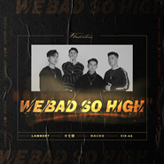

We Bad So high
============================

|  |  |
| :--: | :-- |
| [ We Bad So high](https://emumo.xiami.com/album/2106059682) | **艺人**: [NaCho.](../index.md) **语种**: 国语 **唱片公司**: 中视鸣达 **发行时间**: 2020年01月01日 **专辑类别**: EP, 单曲 **专辑风格**: 流行 Pop **播放数**: 0 **收藏数**: 1 **评论数**: 0  |

## 简介

2020新年伊始，四位风格迥异的rapper在一起碰撞出新的火花，这是一次令人耳目一新的集体创作。善于将R&amp;B与硬核说唱巧妙糅合的lambert；言辞犀利、风格锐利的十七草；拥有华丽flow，节奏肆虐的NaCho；还有希望通过Sing Rap让更多人了解到嘻哈文化多元性的sixx66。四个人用不同的风格和flow表达同样的态度：不接受被恶意揣测，坚持自己的音乐态度。  
  
这首单曲也是Flowsixteen旗下的rapper们首次集体合作，体现了Flowsixteen的厂牌文化和一贯的作品风格，不在意他人的眼光，做自己最完美的作品。

## 曲目

## 评论

|  |  |  |  |
| :-- | :-- | :-- | :-- |
