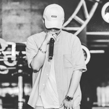
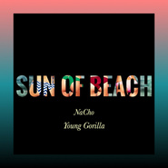
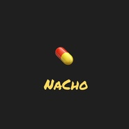
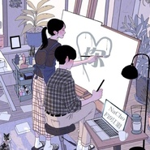
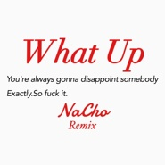

NaCho.
============================

|  |  |
| :--: | :-- |
| [ NaCho.](https://i.xiami.com/ghettomaster) | **播放数**: 3828441 **粉丝数**: 693 **评论数**: 40 **地区**: China 中国大陆 **风格**: 流行说唱 Pop Rap  |

## 档案

微博:NaChoBoi 
网易云:NaCho 
演出/合作/电话:17642075932

## 专辑

| 名称 | 语种 | 唱片公司 | 发行时间 | 专辑类别 | 专辑风格 |
| :--: | :-- | :-- | :-- | :-- | :-- |
| [ We Bad So high](./albums/2106059682.md) | 国语 | 中视鸣达 | 2020年01月01日 | EP, 单曲 | 流行 Pop |
| [ All in](./albums/2104205663.md) | 国语 |  | 2018年11月13日 | EP, 单曲 | 嘻哈 Hip-Hop |
| [ By My Self收录三首歌](./albums/2104107101.md) | 国语 | 独立发行 | 2018年10月14日 | 精选集 | 嘻哈 Hip-Hop |
| [ Opium](./albums/2103827398.md) | 国语 | 独立发行 | 2018年07月19日 | EP, 单曲 | 嘻哈 Hip-Hop, 流行说唱 Pop Rap, 陷阱说唱 Trap Rap |
| [ FutureFuture Rap star](./albums/2103751702.md) | 国语 | 独立发行 | 2018年06月17日 | EP, 单曲 | 陷阱说唱 Trap Rap |
| [ STILLStill on my way](./albums/2103722082.md) | 国语 | 独立发行 | 2018年05月28日 | EP, 单曲 | 嘻哈 Hip-Hop |
| [ 阳光沙滩sun of beach](./albums/2103699334.md) | 国语 | 独立发行 | 2018年05月01日 | EP, 单曲 | 流行说唱 Pop Rap |
| [ Drug 2.0Drug 2.0](./albums/2103696889.md) | 国语 | 独立发行 | 2018年04月27日 | EP, 单曲 | 老派说唱 Old-school Hip Hop |
| [ Drug药](./albums/2103591976.md) | 国语 | 独立发行 | 2018年03月07日 | EP, 单曲 | 老派说唱 Old-school Hip Hop |
| [ 你你](./albums/2103519555.md) | 国语 | 独立发行 | 2018年02月07日 | EP, 单曲 | 流行说唱 Pop Rap |
| [ Love the way you Lie♥](./albums/2102924091.md) | 国语 | 独立发行 | 2017年11月13日 | EP, 单曲 | 流行说唱 Pop Rap |
| [ Nice Girl](./albums/2102924097.md) | 国语 | 独立发行 | 2017年11月13日 | EP, 单曲 | 流行说唱 Pop Rap |
| [ What UpWhat Up](./albums/2102924090.md) | 国语 | 独立发行 | 2017年11月13日 | EP, 单曲 | 老派说唱 Old-school Hip Hop |
| [ 随心所欲](./albums/2102858489.md) | 国语 | 独立发行 | 2017年09月17日 | EP, 单曲 | 嘻哈 Hip-Hop, 流行说唱 Pop Rap |
| [ How are UI'm OK](./albums/2102807447.md) | 国语 | 独立发行 | 2017年08月03日 | EP, 单曲 | 流行说唱 Pop Rap |
| [ 继续Life goes on NaCho](./albums/2102755077.md) | 国语 | 独立发行 | 2017年05月27日 | EP, 单曲 | 流行说唱 Pop Rap |
| [ 我的世界Remixremix](./albums/2102755075.md) | 国语 | 独立发行 | 2017年05月27日 | EP, 单曲 | 流行说唱 Pop Rap |
| [ 老司机哈哈哈哈哈](./albums/2102755070.md) | 国语 | 独立发行 | 2017年05月27日 | EP, 单曲 | 嘻哈 Hip-Hop |
| [ Air Force 1Air](./albums/2102679096.md) | 国语 | 独立发行 | 2017年01月11日 | EP, 单曲 |  |
| [ I'm Back](./albums/2100353931.md) | 国语 | BlackMusicTown | 2016年06月14日 | EP, 单曲 | 老派说唱 Old-school Hip Hop |
| [ For U过眼云烟](./albums/2100265348.md) | 国语 |  | 2016年01月24日 | EP, 单曲 | 流行说唱 Pop Rap |
| [ 那年这里我们曾来过过眼云烟](./albums/2100261796.md) | 国语 |  | 2016年01月17日 | EP, 单曲 | 流行说唱 Pop Rap |

## 评论

|  |  |  |  |
| :-- | :-- | :-- | :-- |
|  [虾米用户](https://emumo.xiami.com/u/213591621) 正因为一无所有，所以才能... 2020-08-24 03:44 赞(0) 踩(0) | 
                
 |
|  [虾米用户](https://emumo.xiami.com/u/7887426) papabibibobo 2020-08-15 00:47 赞(0) 踩(0) | 
Brilliant!
 |
|  [虾米用户](https://emumo.xiami.com/u/422836347) just enjoy i... 2020-05-15 22:20 赞(0) 踩(0) | 
加油！
 |
|  [虾米用户](https://emumo.xiami.com/u/379162683) 我想要记住你们，我想要你... 2020-05-04 11:02 赞(0) 踩(0) | 

 |
|  [虾米用户](https://emumo.xiami.com/u/322558918) 我还没想好要写什么... 2020-02-21 21:01 赞(0) 踩(0) | 
希望你继续坚定的走自己的路，加油加油
 |
|  [虾米用户](https://emumo.xiami.com/u/440478210) . 2020-02-14 11:31 赞(0) 踩(0) | 
Kk,第520的赞 
 |
|  [虾米用户](https://emumo.xiami.com/u/404172792) 人生若只如初见 2020-02-10 20:04 赞(0) 踩(0) | 
我也想知道女声是谁 
 |
|  [虾米用户](https://emumo.xiami.com/u/224402608)  2020-02-04 11:59 赞(0) 踩(0) | 
你火了
 |
|  [虾米用户](https://emumo.xiami.com/u/356763773) 我还没想好要写什么... 2019-12-26 17:07 赞(0) 踩(0) | 
~
 |
|  [虾米用户](https://emumo.xiami.com/u/106223752) 我还没想好要写什么... 2019-07-02 09:44 赞(1) 踩(0) | 
好听啊！猜我喜欢听到的
 |
|  [虾米用户](https://emumo.xiami.com/u/309256043) 一起听歌吧… 2019-06-01 11:24 赞(0) 踩(0) | 

 |
|  [虾米用户](https://emumo.xiami.com/u/71178106) 塵世や 酒、風呂を抜け ... 2019-05-22 11:26 赞(1) 踩(0) | 
♡
 |
|  [虾米用户](https://emumo.xiami.com/u/205998002) 清醒！ 2019-04-06 13:13 赞(0) 踩(0) | 
加油！
 |
|  [虾米用户](https://emumo.xiami.com/u/12878321) 辗转井的谣言中徘徊风的宫... 2018-11-19 00:32 赞(0) 踩(0) | 
w
 |
|  [虾米用户](https://emumo.xiami.com/u/297634897) 大家都是胆小鬼，所以才要... 2018-10-28 16:25 赞(0) 踩(0) | 
嗯哼.
 |
|  [虾米用户](https://emumo.xiami.com/u/5490437) 女士优先 2018-10-27 16:30 赞(0) 踩(0) | 

 |
|  [虾米用户](https://emumo.xiami.com/u/277162970) 做一个对自己说谎的哑巴 2018-09-01 05:45 赞(0) 踩(0) | 
加油，期待你更多的惊喜和作品
 |
|  [虾米用户](https://emumo.xiami.com/u/85501218)   2018-08-27 16:57 赞(0) 踩(0) | 

 |
|  [虾米用户](https://emumo.xiami.com/u/91372642) 不開心就不好看了 2018-08-01 16:02 赞(0) 踩(0) | 
x
 |
|  [虾米用户](https://emumo.xiami.com/u/193176117)  2018-07-29 16:51 赞(0) 踩(0) | 
加油
 |
|  [虾米用户](https://emumo.xiami.com/u/12076161) 兼容古典和嘻哈 2018-07-09 19:05 赞(0) 踩(0) | 
你会火的～加油～
 |
|  [虾米用户](https://emumo.xiami.com/u/313960957) 我他吗今天没有死掉，就算... 2018-06-26 17:26 赞(0) 踩(0) | 
兄弟，歌很棒，词也棒直击内心，挺你
 |
|  [虾米用户](https://emumo.xiami.com/u/46393985)  2018-05-07 00:41 赞(0) 踩(0) | 
想听老以前的那个涅槃！！！！
 |
|  [虾米用户](https://emumo.xiami.com/u/10471420)  2018-05-04 07:47 赞(0) 踩(0) | 
好好听   
 |
|  [虾米用户](https://emumo.xiami.com/u/352148740) 若云似风，无影无踪 2018-04-18 22:41 赞(0) 踩(0) | 
日常听歌来
 |
|  [虾米用户](https://emumo.xiami.com/u/352148740) 若云似风，无影无踪 2018-04-05 14:37 赞(0) 踩(0) | 
：永远不会下坠
 |
|  [虾米用户](https://emumo.xiami.com/u/218774214) 我还没想好要写什么... 2018-01-13 08:42 赞(0) 踩(0) | 
好听
 |
|  [虾米用户](https://emumo.xiami.com/u/337895391)  2017-11-30 02:30 赞(2) 踩(0) | 
你做的东西听着真的很舒服！
 |
|  [虾米用户](https://emumo.xiami.com/u/186178048) 超爱Latin/电音/雷... 2017-11-28 04:11 赞(0) 踩(0) | 
重名了 我还以为是那个西班牙歌手
 |
|  [虾米用户](https://emumo.xiami.com/u/2418238) weibo: @尤米口 2017-08-18 03:56 赞(1) 踩(0) | 
火钳刘明
 |
|  [虾米用户](https://emumo.xiami.com/u/192226333)  2017-05-11 12:40 赞(2) 踩(0) | 
你个人信息有问题啊！和另一个nacho重了！
 |
|  [虾米用户](https://emumo.xiami.com/u/76548780) 什么都不想那就什么都不做 2016-11-29 00:49 赞(0) 踩(0) | 
神似dok2
 |
|  [虾米用户](https://emumo.xiami.com/u/197039977) 有梦想的男孩 2016-09-08 12:52 赞(0) 踩(0) | 
炸
 |
|  [虾米用户](https://emumo.xiami.com/u/9295639) 沉默是因为包容 2016-06-25 19:58 赞(0) 踩(0) | 
想听迷恋……
 |
|  [虾米用户](https://emumo.xiami.com/u/88968932)  2016-05-18 00:21 赞(0) 踩(0) | 
hey.nacho
 |
|  [虾米用户](https://emumo.xiami.com/u/70734984) 宁可孤独也不违心，宁可抱... 2016-04-26 22:19 赞(0) 踩(0) | 
在说唱家听了你的
 |
|  [虾米用户](https://emumo.xiami.com/u/54996167) 我更珍惜我现在所拥有的！ 2016-01-25 16:07 赞(0) 踩(0) | 
好兄弟  捧你
 |
|  [虾米用户](https://emumo.xiami.com/u/42535021) 暂无签名~ 2015-07-13 17:00 赞(0) 踩(0) | 
你好
 |
|  [虾米用户](https://emumo.xiami.com/u/40851411) 稳 2015-07-09 20:16 赞(1) 踩(0) | 
我刚入驻了阿里音乐人，欢迎大家来我的个人主页，收听我的最新音乐
 |
| ⇒ |  [虾米用户](https://emumo.xiami.com/u/285378600) 我还没想好要写什么... 2017-12-21 00:48 赞(0) 踩(0) | 
哇，你的我呸在网易下架了，还能听到么在虾米
 |
