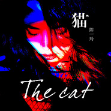

猫
============================

|  |  |
| :--: | :-- |
| [ 猫](https://emumo.xiami.com/album/2103921025) | **艺人**: [陈一玲](../index.md) **语种**: 国语 **唱片公司**: 乐动时代 **发行时间**: 2018年08月10日 **专辑类别**: EP, 单曲 **专辑风格**:  **播放数**: 2859 **收藏数**: 4 **评论数**: 0  |

## 简介

陈一玲2018年首支单曲《猫》，由乐动时代文化诚意发行。经过一年的沉淀，不论从歌曲风格还是整体造型陈一玲都在不断突破自己，尝试触碰新的领域，只为给歌迷耳目一新的感觉。单曲取名为《猫》寓意女人的猫性，慵懒而高贵，优雅又神秘，它只做自己的事情，并不刻意附和。整首歌曲的编曲围绕Funk风格展开，除了70年代的funk元素外，加入了一小部分电子元素增加现代感，用慵懒的电钢音色与主唱的嗓音相互配合，塑造主唱代指的猫那份不被束缚的灵魂。歌曲中穿插的小号以及切分的架子鼓、弹跳感十足的贝斯，都是funk音乐的表象，能让你纵情跟着律动摇晃起来，把在世俗生活里丢失的自我重新找回，像猫那样自我的活着，才是这首歌的意义。

## 曲目

## 评论

|  |  |  |  |
| :-- | :-- | :-- | :-- |
