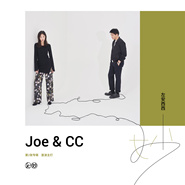

妙
============================

|  |  |
| :--: | :-- |
| [ 妙](https://emumo.xiami.com/album/2102895239) | **艺人**: [左安西西](../index.md) **语种**: 国语 **唱片公司**: 独立发行 **发行时间**: 2017年10月31日 **专辑类别**: EP, 单曲 **专辑风格**: 国语流行 Mandarin Pop, 独立流行 Indie Pop **播放数**: 1861612 **收藏数**: 128 **评论数**: 31  |

## 简介

「妙」是天涯海角，一见如故；  
「妙」是近在眼前，白首如新。  
「妙」是缘，不可言。  
  
左安西西第二张创作大碟首波主打，「妙」，2017.10.31，深秋温暖上线。  
作为专辑的首波主打，《妙》沿袭了左安西西首张专辑中热门歌曲《你一直在》的创作方式——由朱家明Joe的大热吉他创作曲《花市》改编，王成成CC填词，二人默契再现。全新的编曲制作让旋律焕然一新，俏皮中更多了些温润的古典气质。在冬天来临前，提前温暖你。  
  
【关于创作】   
CC说：「一别两年，这两年之中我和Joe对待音乐的方式和态度都在变得更加成熟。《妙》的旋律其实来自Joe在2014年发表的一首大受好评的吉他曲，但我第一次听就觉得它朗朗上口，非常适合变成一首歌，这两年间我多次尝试填词，终于在2016年完成了它。我很惊喜的是Joe的重新编曲让这首歌的气质完全不同于之前的吉他曲，希望大家能喜欢这首“老歌”的新感觉。」  
  
Joe说：「我记得当时在写这个旋律的时候就觉得它很适合做一首歌，但限于制作条件还不成熟，所以把它留在了这张专辑中。CC贡献了她最好的词创作，也赋予了这首歌全新的感觉。」  
  
【关于「妙」】  
CC说：「《妙》这首歌的灵感其实很随意，我自己在这两年中也有很多变化，有时候会想人和人的相遇很奇妙，为什么是我遇见了这个人，却不是另一个人？所以这首歌其实是在说“缘分”的，除了「妙」我觉得没有更好的形容词去形容了。」  
  
Joe说：我第一次想把这段旋律变成歌的时候，就想到这首词只有CC可以填。当我拿到歌词的时候更印证了当初的想法。它讲的是人与人，或人与事物间的一种奇妙关系，这种关系就如同大家听到这首歌的感觉，真是— “妙”。  

## 曲目

## 评论

|  |  |  |
| :-- | :-- | :-- |
|  [虾米用户](https://emumo.xiami.com/u/42989128)  2017-11-20 14:48 赞(0) 踩(0) | 
轻快。好听
 |
|  [虾米用户](https://emumo.xiami.com/u/333412520)   2017-11-09 15:45 赞(1) 踩(0) | 
轻音乐，曲调愉悦，让人心情变好
 |
| ⇒ |  [虾米用户](https://emumo.xiami.com/u/307630220)  2018-02-26 08:47 赞(0) 踩(0) | 
，men你8
 |
|  [虾米用户](https://emumo.xiami.com/u/44026015)  2017-11-04 23:15 赞(0) 踩(0) | 
快出新专啊！
 |
|  [虾米用户](https://emumo.xiami.com/u/1191743)  2017-11-02 14:29 赞(1) 踩(0) | 
秒 秒 秒 真是秒 好 好 好 真是好 妙不可言 一切尽在音乐中
 |
|  [虾米用户](https://emumo.xiami.com/u/332810566)  2017-11-02 13:21 赞(0) 踩(0) | 
微信微博搜索NERD微刊，点赞吃鸡！
 |
|  [虾米用户](https://emumo.xiami.com/u/45298985) Wechat:dqx19... 2017-11-01 17:09 赞(0) 踩(0) | 
+
 |
|  [虾米用户](https://emumo.xiami.com/u/20451058)  2017-11-01 14:54 赞(0) 踩(0) | 
好听
 |
|  [虾米用户](https://emumo.xiami.com/u/11421497) dont act lik... 2017-11-01 07:34 赞(0) 踩(0) | 
好
 |
|  [虾米用户](https://emumo.xiami.com/u/2859888)  2017-11-01 01:56 赞(0) 踩(0) | 
好听
 |
|  [虾米用户](https://emumo.xiami.com/u/10104297)  2017-11-01 00:33 赞(0) 踩(0) | 
呃，已经预感到，明儿俺要是放了介首歌，用一个表情包来形容小伙伴们的心理（尼要是不装逼咱还能做盆友）sorry，歌是好歌，是偶的形象玷污了介首歌(╥╯^╰╥) ——  一位糙汉纸留
 |
| ⇒ |  [虾米用户](https://emumo.xiami.com/u/24667214)   2017-11-05 22:52 赞(0) 踩(0) | 
糙汉子哪会用会用颜文字？你个骗纸，嘤嘤嘤
 |
|  [虾米用户](https://emumo.xiami.com/u/13952797) 我还没想好要写什么... 2017-10-31 23:57 赞(0) 踩(0) | 
天哪新专
 |
|  [虾米用户](https://emumo.xiami.com/u/289286963)  2017-10-31 23:10 赞(0) 踩(0) | 
好听哦。
 |
|  [虾米用户](https://emumo.xiami.com/u/3108605) 无趣的庸人，就这么活着吧 2017-10-31 19:18 赞(1) 踩(0) | 
还是喜欢原版
 |
|  [虾米用户](https://emumo.xiami.com/u/40253035)  2017-10-31 19:03 赞(0) 踩(0) | 
调子很好听
 |
|  [虾米用户](https://emumo.xiami.com/u/144620702)  2017-10-31 17:17 赞(1) 踩(0) | 
嗯（ ）妙不可言！
 |
|  [虾米用户](https://emumo.xiami.com/u/44066184)  2017-10-31 16:39 赞(2) 踩(0) | 
我的 西西 我爱你
 |
| ⇒ |  [虾米用户](https://emumo.xiami.com/u/290163769)  2017-12-19 19:28 赞(0) 踩(0) | 
*。ibn
 |
|  [虾米用户](https://emumo.xiami.com/u/3917678)   2017-10-31 16:17 赞(0) 踩(0) | 
妙
 |
|  [虾米用户](https://emumo.xiami.com/u/48601538) 我还没想好要写什么... 2017-10-31 15:07 赞(0) 踩(0) | 
好听
 |
|  [虾米用户](https://emumo.xiami.com/u/6944604) 再见了，虾米！ 2017-10-31 14:49 赞(0) 踩(0) | 
造型。。。
 |
|  [虾米用户](https://emumo.xiami.com/u/292270198)  2017-10-31 14:26 赞(0) 踩(0) | 
花市的曲，全新的编曲，让人耳目一新，妙
 |
|  [虾米用户](https://emumo.xiami.com/u/3815293) baby Jesus s... 2017-10-31 14:14 赞(1) 踩(0) | 
。
 |
|  [虾米用户](https://emumo.xiami.com/u/7365010) 超然 2017-10-31 13:51 赞(0) 踩(0) | 
妙！~
 |
|  [虾米用户](https://emumo.xiami.com/u/15270473) 听到喜欢的歌 身体不跟着... 2017-10-31 13:20 赞(0) 踩(0) | 
-
 |
|  [虾米用户](https://emumo.xiami.com/u/8650117)  2017-10-31 13:16 赞(0) 踩(0) | 
妙妙妙
 |
|  [虾米用户](https://emumo.xiami.com/u/3531256) 倾听一切 2017-10-31 10:29 赞(0) 踩(0) | 
妙～
 |
|  [虾米用户](https://emumo.xiami.com/u/48601538) 我还没想好要写什么... 2017-10-31 00:44 赞(0) 踩(0) | 
歌啊
 |
|  [虾米用户](https://emumo.xiami.com/u/2523233) 太热 2017-10-30 23:18 赞(0) 踩(0) | 
终于来了！
 |
| ⇒ |  [虾米用户](https://emumo.xiami.com/u/290163769)  2017-12-19 19:32 赞(0) 踩(0) | 
8  Pplp0 【】,
 |
