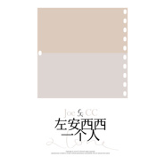

一个人
============================

|  |  |
| :--: | :-- |
| [ 一个人](https://emumo.xiami.com/album/2103674282) | **艺人**: [左安西西](../index.md) **语种**: 国语 **唱片公司**: 独立发行 **发行时间**: 2018年04月08日 **专辑类别**: EP, 单曲 **专辑风格**: 独立民谣 Indie Folk, 民谣流行 Folk Pop **播放数**: 55376 **收藏数**: 42 **评论数**: 10  |

## 简介

一个人，看电影；一个人，去旅行。  
一个人的生活有多少留白，就有多精彩！  
  
最原声的左安西西，只为你【一个人】。  
2018左安西西 Joe &amp; CC春日单曲——《一个人》，回归二人最初“你弹我唱”的表演方式，用最真挚的音乐，最Acoustic的表达，唤醒你的耳朵。  
  
CC（王成成）的词曲作品《一个人》，是左安西西第二张全创作专辑中一首简单温暖的小品，新歌聚焦当代女孩的都市生活。当“两个人”不是生活唯一选项，左安西西歌曲中的三个女生，各有各自的精彩。Joe（朱家明）在《一个人》中的吉他演奏与编排如行云流水，亦娓娓道来，和CC真诚的歌声一同向我们讲述了三个你我身边的故事。 

## 曲目

## 评论

|  |  |  |
| :-- | :-- | :-- |
|  [虾米用户](https://emumo.xiami.com/u/564335) 每一个缺少音乐相伴的日子... 2020-10-07 11:59 赞(1) 踩(0) | 
怎么这里木有人说耳朵怀孕了、十年虾米好像随处有这样瓜子壳 
 |
|  [虾米用户](https://emumo.xiami.com/u/321630931)  2019-08-22 20:03 赞(0) 踩(0) | 
声音很好听，歌词很走心
 |
|  [虾米用户](https://emumo.xiami.com/u/283102826)  2019-08-10 13:13 赞(0) 踩(0) | 
好听
 |
|  [虾米用户](https://emumo.xiami.com/u/403704402) 我还没想好要写什么... 2019-05-24 10:28 赞(0) 踩(0) | 
来支持了
 |
|  [虾米用户](https://emumo.xiami.com/u/2098080) (￣Д￣)ﾉ 2019-04-24 08:14 赞(0) 踩(0) | 
好听的很(￣д￣)ノ支持你们！
 |
|  [虾米用户](https://emumo.xiami.com/u/402183197)  2019-03-17 07:51 赞(0) 踩(0) | 
支持你们，加油
 |
|  [虾米用户](https://emumo.xiami.com/u/292270198)  2018-05-20 01:15 赞(0) 踩(0) | 
好听啊，
 |
|  [虾米用户](https://emumo.xiami.com/u/10916490) 张孑仁 2018-04-24 10:27 赞(0) 踩(0) | 
一个人一首歌一张专辑，去你妈的
 |
|  [虾米用户](https://emumo.xiami.com/u/11421497) dont act lik... 2018-04-09 08:28 赞(0) 踩(0) | 
好
 |
|  [虾米用户](https://emumo.xiami.com/u/2097922)  2018-04-08 15:48 赞(0) 踩(0) | 
懂了那么多道理，可依然过不好这一生
 |
