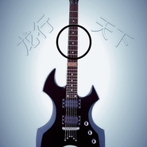
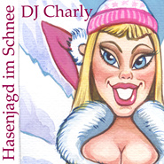

DJ Harry
============================

|  |  |
| :--: | :-- |
| [ DJ Harry](https://i.xiami.com/dj_harry) | **地区**: China 中国大陆 **风格**: 电子舞曲 EDM / Electronic Dance Music **播放数**: 8078021 **粉丝数**: 297 **评论数**: 17  |

## 档案

艺人:DJHarry 
爱好：看电影 
1986年12月05日生于河南 
职业:混音师、制作DJ舞曲 
曾为众多网络原创歌手及夜店DJ制作Dj单曲 得到了广大舞曲爱好者的支持 ！ 
个人工作室：阳光音乐工作室 
QQ:694320025    电话:13623750064

## 专辑

| 名称 | 语种 | 唱片公司 | 发行时间 | 专辑类别 | 专辑风格 |
| :--: | :-- | :-- | :-- | :-- | :-- |
| [ The Sound Of Mercury Rising Compiled with Love By DJ Harvey](./albums/2104066415.md) | 英语 | Merlin Records | 2017年09月29日 | 录音室专辑 | 电子 Electronic |
| [ D-Nada](./albums/2103900475.md) | 英语 |  | 2016年04月12日 | EP, 单曲 |  |
| [ Drawbass](./albums/2103919529.md) | 英语 |  | 2015年12月24日 | EP, 单曲 |  |
| [ The One](./albums/2103920266.md) | 英语 |  | 2015年04月14日 | EP, 单曲 |  |
| [ 经典金曲DJ版](./albums/1880213112.md) | 国语 | 独立发行 | 2013年09月27日 | 精选集 |  |
| [ Hasenjagd im Schnee](./albums/2103980157.md) | 英语 | Merlin Records | 2010年12月15日 | EP, 单曲 |  |
| [ Just Believe](./albums/2104086060.md) | 英语 | Behaviors | 2009年12月21日 | EP, 单曲 | 科技浩室 Tech House |
| [ Komm mit auf die Hütten](./albums/2104014855.md) | 英语 | Merlin Records | 2008年09月09日 | EP, 单曲 |  |
| [ Zwei Spuren im Schnee](./albums/2104014918.md) | 英语 | Merlin Records | 2007年08月08日 | EP, 单曲 |  |
| [ Eins zwei ex und hopp](./albums/2104014901.md) | 英语 | Merlin Records | 2007年08月08日 | EP, 单曲 |  |
| [ Hüttenpolonaise](./albums/2104014943.md) | 英语 | Merlin Records | 2006年08月08日 | EP, 单曲 |  |
| [ Superburschi](./albums/2104014874.md) | 英语 | Merlin Records | 2004年05月05日 | EP, 单曲 |  |
| [ The String Cheese Remix Project](./albums/2103728781.md) | 英语 | Instinct Records | 2001年07月09日 | 录音室专辑 |  |

## 评论

|  |  |  |
| :-- | :-- | :-- |
|  [虾米用户](https://emumo.xiami.com/u/427840279) 购买诗集《落日飞奔术》电... 2020-09-19 14:32 赞(0) 踩(0) | 
好
 |
|  [虾米用户](https://emumo.xiami.com/u/301010233) 伤心的歌能治愈伤心的人 2018-06-12 07:10 赞(0) 踩(0) | 
加油  
 |
|  [虾米用户](https://emumo.xiami.com/u/301010233) 伤心的歌能治愈伤心的人 2018-06-12 07:09 赞(1) 踩(0) | 
因为你的歌曲入我心
 |
|  [虾米用户](https://emumo.xiami.com/u/32217919)  2018-03-16 07:12 赞(0) 踩(0) | 
刺激 销魂
 |
|  [虾米用户](https://emumo.xiami.com/u/44301345) 澎湃的感覺喜羊羊 2017-10-28 00:14 赞(1) 踩(0) | 
丈母娘哈，他们当年可能是太专注抓革命促生产了，居然都搞不清了十五&amp;十六的月亮究竟是哪个圆了！更可笑掉牙的是时光哈，仅仅穿过三四十年儿哈！R到啥程度了哈我亲爱的父母亲大人哈，正月二十&amp;二十二里哈，最少多了一个R哈！矮霾呀，笑不笑习银类哈！您看看俺家的生日哈！那是相当的快乐哈，哈哈哈哈！我说呐，人家唱【十五的月亮】，她非得加上个【十六圆】！我在家里男女排行是个R哈，那个尿包来个女女排行还是个R！你说俺爹排老R那对，可俺老丈淫排老五啊!哈哈5为缘啊，缘分啊，谢谢啊！
 |
|  [虾米用户](https://emumo.xiami.com/u/293692544) 你敢给我说话吗？我咬你 2017-10-22 21:48 赞(1) 踩(0) | 
呵呵
 |
|  [虾米用户](https://emumo.xiami.com/u/277606376)  2017-06-20 00:35 赞(1) 踩(0) | 
听了多年熟悉的歌曲，换个听法，不错！
 |
|  [虾米用户](https://emumo.xiami.com/u/294538357)  2017-06-03 18:33 赞(1) 踩(0) | 
     
 |
|  [虾米用户](https://emumo.xiami.com/u/11763865)  2017-03-14 22:59 赞(1) 踩(0) | 

 |
|  [虾米用户](https://emumo.xiami.com/u/3208618) Pulsar.:  2016-02-26 19:15 赞(1) 踩(0) | 
哥真牛逼
 |
|  [虾米用户](https://emumo.xiami.com/u/37874711) I draw 2015-12-16 22:12 赞(1) 踩(0) | 
用的是FL耶，同好过来凑热闹（工程排版点赞
 |
|  [虾米用户](https://emumo.xiami.com/u/26363189) 我还没想好要写什么... 2015-09-15 21:06 赞(1) 踩(0) | 
很好
 |
|  [虾米用户](https://emumo.xiami.com/u/51651909)  2015-06-22 22:54 赞(1) 踩(0) | 
很好
 |
|  [虾米用户](https://emumo.xiami.com/u/35072308)  2014-05-07 16:48 赞(1) 踩(0) | 
劲爆
 |
|  [虾米用户](https://emumo.xiami.com/u/1880885) 我还没想好要写什么... 2013-11-06 20:04 赞(2) 踩(0) | 
哎哟我草草草
 |
| ⇒ |  [虾米用户](https://emumo.xiami.com/u/594931) 趴间:巴尔鲁克歌舞厅 2014-01-02 01:49 赞(0) 踩(0) | 
吊炸天啊！
 |
| ⇒ |  [虾米用户](https://emumo.xiami.com/u/20699580) Are you an a... 2014-06-29 22:51 赞(0) 踩(0) | 
<q><b>BU!NO说：</b></q>
 |
