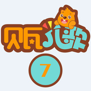

贝瓦儿歌 系列7
============================

|  |  |
| :--: | :-- |
| [ 贝瓦儿歌 系列7](https://emumo.xiami.com/album/2102719753) | **艺人**: [贝瓦儿歌](../index.md) **语种**: 其他 **唱片公司**: 贝瓦BEVA **发行时间**: 2016年09月18日 **专辑类别**: 精选集 **专辑风格**: 儿歌 Nursery Rhyme **播放数**: 1218254 **收藏数**: 768 **评论数**: 0  |

## 简介

## 曲目

- [Quand trois poules](./2102719753/mSr61u50641.md)
- [Rain Rain Go Away](./2102719753/xNc5pZa5715.md)
- [Rain, Rain, Go Away](./2102719753/8HN4eFf08c8.md)
- [ramsamsam](./2102719753/bCmvwYqb1f3a.md)
- [red's walk](./2102719753/xNc5qrdd3c3.md)
- [reuben,reuben](./2102719753/mSr61L738db.md)
- [Ride A Cock-Horse To Banbury Cross](./2102719753/mSr61R79a8c.md)
- [Ring A Ring O'Roses](./2102719753/8HN4fgf9a87.md)
- [ring around the rosyMV](./2102719753/mSr62a92404.md)
- [rise and shine](./2102719753/U7t1Ix605a1.md)
- [Rock n roll des gallinacés](./2102719753/8HN4fqff07a.md)
- [Rock-A-Bye,Baby](./2102719753/xNc5qKa4230.md)
- [roll that ball](./2102719753/bCmvwXV48ee9.md)
- [Roses Are Red](./2102719753/mSr61w7ed37.md)
- [Rosy,My Posy](./2102719753/mSr6105052f.md)
- [Round And Round The Garden](./2102719753/mSr6136ca45.md)
- [Row Row Row Your Boat](./2102719753/8HN4eGeaec1.md)
- [Row Your Boat](./2102719753/xNc5qj12050.md)
- [Rub A Dub Dub](./2102719753/xNc5qna450e.md)
- [Sally Go Round The Sun](./2102719753/bqwPzvk3ae19.md)
- [Santa's Reindeer (口白)](./2102719753/8HN4eTfe9d3.md)
- [See-Saw,Margery Daw](./2102719753/xNc5qxbfc65.md)
- [She's folding the clothes](./2102719753/bf2e06J32d26.md)
- [She’s my mom](./2102719753/8HN4fd18530.md)
- [Shoes and shirts](./2102719753/JC82Td35d2b.md)
- [Simple Simon Met A Pieman](./2102719753/mSr61x5bc1b.md)
- [sing a song of sixpence](./2102719753/xNc5qb136de.md)
- [sing together](./2102719753/xNc5qccb088.md)
- [six little ducks](./2102719753/8HN4eHecfbd.md)
- [Six Little Mice Sat Down To Spin](./2102719753/8HN4eLedfcd.md)
- [Skidaddle!](./2102719753/xNc5qob1570.md)
- [skidamarink](./2102719753/mSr61I8cf04.md)
- [Skip to my Lou](./2102719753/xNc5qwba009.md)
- [sleep,baby,sleep](./2102719753/bf2e06K2e0bd.md)
- [Sleeping In The Car](./2102719753/xNc5q49cd6d.md)
- [Something Good](./2102719753/mSr61X631dc.md)
- [Sports](./2102719753/bCmvwXW44a8d.md)
- [spring arrival](./2102719753/bf2e06p32313.md)
- [Star Light,Star Bright](./2102719753/xNc5pYd9d2a.md)
- [sticky stuff](./2102719753/8HN4eEe6ba8.md)
- [Stingray City](./2102719753/mSr61863949.md)
- [Stomp](./2102719753/mSr61A5820d.md)
- [Straight Vocab](./2102719753/8HN4ePf5fa4.md)
- [Sunday,Monday,Tuesday](./2102719753/8HN4eU2746c.md)
- [Sur le plancher](./2102719753/xNc5qyd9464.md)
- [Swing Low,Sweet Chariot](./2102719753/8HN4fce2f19.md)
- [Tapent,tapent petites mains](./2102719753/mSr61V8c889.md)
- [Teddy Bear,Teddy Bear](./2102719753/xNc5q9a155b.md)
- [teddybear](./2102719753/bqwPzv2396be.md)
- [Ten little indian boys](./2102719753/mSr62c5a8ea.md)
- [The Animal Train](./2102719753/mSr62e893f9.md)
- [The Ant and the Dove (口白)](./2102719753/mSr62h913e4.md)
- [The ants go marching](./2102719753/xNc5qLbf87a.md)
- [The Bumblz Theme](./2102719753/xNc5qOc7b8d.md)
- [The Dancing Monkeys (口白)](./2102719753/JC82Ud21101.md)
- [the family](./2102719753/8HN4f7e5c2a.md)
- [the Finger FamilyMV](./2102719753/8HN4fMfe879.md)
- [the first noel](./2102719753/8HN4fRf69f1.md)
- [The Fox and the Grapes (口白)](./2102719753/xNc5rucf51d.md)
- [The Haircut Song](./2102719753/8HN4fWf0084.md)
- [The Lord's Army](./2102719753/xNc5qBa00f2.md)
- [The Monkey Dance](./2102719753/bqwPzv936a21.md)
- [the MonthsMV](./2102719753/xNc5qI11064.md)
- [The more we get together](./2102719753/mSr62n8da1d.md)
- [The Muffin Man](./2102719753/mSr62r95687.md)
- [The Muffin Man](./2102719753/mSr62v5225d.md)
- [The North Wind Doth Blow](./2102719753/xNc5qZ975da.md)
- [The Pride of Youth (口白)](./2102719753/mSr6218bc09.md)
- [the tickabilla jive](./2102719753/xNc5rdc430d.md)
- [The Wheels on the Bus](./2102719753/8HN4fFff9c3.md)
- [There is Thunder](./2102719753/xNc5rg997d1.md)
- [There Was A Crooked Man](./2102719753/mSr6297b5be.md)
- [There Was An Old Woman](./2102719753/U7t1I32c90c.md)
- [There's a Bear in There](./2102719753/mSr62m6b29b.md)
- [There's A Monster In My House](./2102719753/xNc5qPd2e96.md)
- [this is the way](./2102719753/xNc5qSdeb2f.md)
- [This is the way](./2102719753/bf2e07q32a74.md)
- [this little pig](./2102719753/xNc5ra9de1e.md)
- [this little pig went to market](./2102719753/8HN4fCed2f1.md)
- [This Song's About Transportation](./2102719753/mSr62455e27.md)
- [three blue pigeons](./2102719753/U7t1IS2d0a8.md)
- [three little pigs](./2102719753/xNc5rlbeda8.md)
- [Time-Out Blues](./2102719753/xNc5rod0dea.md)
- [To Market,To Market,To Buy A Fat Pig](./2102719753/mSr62I8da35.md)
- [Toc,toc,toc monsieur pouce](./2102719753/xNc5qQa35e5.md)
- [Toi,toi,toi](./2102719753/xNc5qUd7fb9.md)
- [Tom,Tom The Piper's Son](./2102719753/mSr62y77fc1.md)
- [tomorrow](./2102719753/xNc5rhb8e84.md)
- [Too Busy](./2102719753/xNc5rkdc1f2.md)
- [Top Of The Stairs](./2102719753/8HN4fN16b3a.md)
- [Twinkle,twinkle,little star](./2102719753/xNc5rq96b29.md)
- [two little blackbirds](./2102719753/mSr62J5ad6b.md)
- [What is This](./2102719753/mSr62L4bc34.md)
- [wheels on the bus](./2102719753/mSr62N5976a.md)
- [where is the chamelon?](./2102719753/xNc5rya7b3b.md)
- [Who stole the cookies from the cookie jar](./2102719753/xNc5rzaf0e8.md)
- [问句星星亮也晶](./2102719753/xNc5rpc2db1.md)

## 评论

