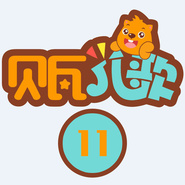

贝瓦儿歌 系列11
============================

|  |  |
| :--: | :-- |
| [ 贝瓦儿歌 系列11](https://emumo.xiami.com/album/2102719785) | **艺人**: [贝瓦儿歌](../index.md) **语种**: 国语 **唱片公司**: 贝瓦BEVA **发行时间**: 2016年09月18日 **专辑类别**: 精选集 **专辑风格**: 儿歌 Nursery Rhyme **播放数**: 4290184 **收藏数**: 2187 **评论数**: 3  |

## 简介

## 曲目

- [滴滴嘟嘟汽车](./2102719785/8HNCZpe281c.md)
- [地球和谐真美丽](./2102719785/mSrFwj7c326.md)
- [地球小卫士](./2102719785/mSrFwn83f62.md)
- [地毯上的游戏](./2102719785/bCmv5SU712b1.md)
- [点虫虫开开心心学飞](./2102719785/xNcEkUd6a34.md)
- [电子琴-酒醉的探戈](./2102719785/JC8BOh22616.md)
- [东郊 (口白)](./2102719785/8HNCZBe73e7.md)
- [咚咚鼓](./2102719785/xNcEled4380.md)
- [懂礼貌的毛毛猴 (口白)](./2102719785/b1rA7eB42ead.md)
- [动动小身体](./2102719785/8HNCZKeb498.md)
- [动物唱歌](./2102719785/xNcEln1483b.md)
- [动物叫声](./2102719785/mSrFwG6b678.md)
- [动物狂欢节_袋鼠 (口白)](./2102719785/xNcEkIdc3a5.md)
- [动物狂欢节_驴子 (口白)](./2102719785/xNcEkMbecb9.md)
- [动物狂欢节_终曲](./2102719785/JC8BOc3b0a4.md)
- [动物音乐会](./2102719785/mSrFww81d54.md)
- [兜和豆](./2102719785/mSrFw26bfbb.md)
- [渡汉江](./2102719785/b1rA7eA3f9b7.md)
- [对不起我们打碎了花瓶 (口白)](./2102719785/xNcEljac455.md)
- [对牛弹琴 (口白)](./2102719785/mSrFwF84a10.md)
- [多多的大眼睛 (口白)](./2102719785/mSrFwJ5e7f2.md)
- [多想有个星期八](./2102719785/mSrFwP8799e.md)
- [躲猫猫](./2102719785/mSrFwS6acfb.md)
- [躲猫猫](./2102719785/b1rA7fa41148.md)
- [鳄鱼](./2102719785/bCmv5SL4932f.md)
- [儿童光明成长计划](./2102719785/8HNCZv1894d.md)
- [儿童睡前故事 (口白)](./2102719785/bCmv5ST46ae0.md)
- [儿童睡前故事](./2102719785/8HNCZ3f280d.md)
- [儿童睡前故事3 (口白)](./2102719785/xNcEkZ16158.md)
- [儿童睡前故事6 (口白)](./2102719785/b1rA7eF3feb8.md)
- [儿童睡前故事8 (口白)](./2102719785/xNcElod9ef5.md)
- [儿童睡前故事9 (口白)](./2102719785/xNcElsd6d35.md)
- [儿童睡前故事10 (口白)](./2102719785/8HNCZW1dc8d.md)
- [儿童睡前故事15 (口白)](./2102719785/8HNDabedef7.md)
- [耳朵](./2102719785/bqwP8qy36451.md)
- [反义词 (口白)MV](./2102719785/bqwP8q1552ad.md)
- [纺织歌](./2102719785/xNcEkGa7e42.md)
- [丰收](./2102719785/8HNCZuf26f2.md)
- [蜂和风](./2102719785/mSrFwo79b50.md)
- [逢雪宿芙蓉山主人](./2102719785/b1rA7ev3c467.md)
- [奉和中书舍人贾至早朝大明宫](./2102719785/xNcEkVa15dc.md)
- [奉济驿重送严公四韵](./2102719785/mSrFwy5c36e.md)
- [符号歌](./2102719785/xNcElab5647.md)
- [父母的情绪化影响孩子 (口白)](./2102719785/xNcEldbd081.md)
- [赋得暮雨送李胄](./2102719785/xNcElfd0062.md)
- [橄榄树](./2102719785/mSrFw8783b1.md)
- [高朋满座 (口白)](./2102719785/mSrFwC83ad6.md)
- [高枕无忧 艾斯卡尔 (口白)](./2102719785/xNcElr99fae.md)
- [鸽子](./2102719785/mSrFwK92b27.md)
- [阁夜](./2102719785/xNcEly99dff.md)
- [给宝宝喝酸奶时需不需要加热 (口白)](./2102719785/mSrFwQ51dd3.md)
- [给小桃树穿棉衣](./2102719785/mSrFwT952bd.md)
- [给予是最好的礼物 (口白)](./2102719785/xNcEl5b3f86.md)
- [跟我唱](./2102719785/mSrFwY77fbd.md)
- [公共汽车](./2102719785/xNcElA9bd4f.md)
- [咕咕钟和闹钟](./2102719785/xNcElEd1918.md)
- [咕呱呱](./2102719785/U7tAD52be79.md)
- [古从行军](./2102719785/U7tAD925b2f.md)
- [古意](./2102719785/U7tADH261d6.md)
- [谷口书斋寄杨补阙](./2102719785/xNcEmab61cd.md)
- [鼓诗](./2102719785/bqwP8qp36627.md)
- [故乡](./2102719785/xNcElxb0c2a.md)
- [故乡的老家MV](./2102719785/mSrFwZ621cc.md)
- [光脚丫](./2102719785/xNcElDd0fce.md)
- [归嵩山作 (口白)](./2102719785/8HNDarf770e.md)
- [过马路](./2102719785/bf2e92e2e1ca.md)
- [过生日](./2102719785/mSrFxn73528.md)
- [蛤蟆大姐穿新衣](./2102719785/JC8BPb20852.md)
- [孩子弹跳提高智商 (口白)](./2102719785/xNcElU9a511.md)
- [海尔兄弟](./2102719785/mSrFxy61ef4.md)
- [海马](./2102719785/mSrFx17d324.md)
- [海鸥](./2102719785/bCmv5Uh4a7f9.md)
- [海外有声故事 (口白)](./2102719785/mSrFxb6effd.md)
- [海外有声故事（一） (口白)](./2102719785/bf2e92a317d0.md)
- [海外有声故事（一）8 (口白)](./2102719785/8HNDat1de2b.md)
- [海外有声故事（一）10 (口白)](./2102719785/8HNDay18677.md)
- [海外有声故事（一）11 (口白)](./2102719785/mSrFxs52167.md)
- [海外有声故事（一）12 (口白)](./2102719785/xNcElVd3e6c.md)
- [海外有声故事（一）13 (口白)](./2102719785/8HNDa918f71.md)
- [海外有声故事（一）14 (口白)](./2102719785/xNcEmcb81f6.md)
- [海外有声故事（一）16 (口白)](./2102719785/xNcEme97b76.md)
- [海星](./2102719785/8HNDaGea606.md)
- [寒号鸟 (口白)](./2102719785/mSrFx710283.md)
- [寒食](./2102719785/xNcEmi9eabc.md)
- [寒夜](./2102719785/8HNDamf8efa.md)
- [行路难](./2102719785/8HNDapf9bf0.md)
- [好伙伴](./2102719785/xNcElI9dc33.md)
- [好玩的皮球 (口白)](./2102719785/mSrFxm635da.md)
- [好小子](./2102719785/8HNDa019183.md)
- [合拢张开](./2102719785/JC8BPd1ef56.md)
- [何家公鸡何家猜](./2102719785/JC8BPg22c0e.md)
- [和贾至舍人早朝大明宫之作](./2102719785/xNcEmjaffc6.md)
- [河马](./2102719785/mSrFxA58274.md)
- [黑风车](./2102719785/xNcEmlc419c.md)
- [黑绵羊巴巴](./2102719785/mSrFxCe70cc.md)
- [红绿灯](./2102719785/8HNDaNeef07.md)
- [你怎么舍得我难过 (二胡独奏)](./2102719785/xNcEmf98a31.md)

## 评论

|  |  |  |
| :-- | :-- | :-- |
|  [虾米用户](https://emumo.xiami.com/u/315903799)  2018-06-18 08:49 赞(1) 踩(0) | 
Ugly girls don't know if you like the idea or a bad guy to talk with him but when they are all you gotta say to
 |
|  [虾米用户](https://emumo.xiami.com/u/283390726)  2017-12-18 10:25 赞(1) 踩(0) | 
ll)
 |
| ⇒ |  [虾米用户](https://emumo.xiami.com/u/287995278)  2018-02-28 20:05 赞(0) 踩(0) | 
小朋友
 |
