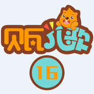

贝瓦儿歌 系列16
============================

|  |  |
| :--: | :-- |
| [ 贝瓦儿歌 系列16](https://emumo.xiami.com/album/2102719868) | **艺人**: [贝瓦儿歌](../index.md) **语种**: 国语 **唱片公司**: 贝瓦BEVA **发行时间**: 2016年09月18日 **专辑类别**: 精选集 **专辑风格**: 儿歌 Nursery Rhyme **播放数**: 1010936 **收藏数**: 507 **评论数**: 1  |

## 简介

## 曲目

- [厨房里的争论 (口白)](./2102719868/mSrLik602ee.md)
- [龟兔赛跑 (口白)](./2102719868/8HNILxf16be.md)
- [快乐骑士的宝藏 (口白)](./2102719868/bf2eFnm34323.md)
- [饶舌的麻雀 (口白)](./2102719868/xNcJWW9ca37.md)
- [同写一片爱](./2102719868/8HNIL9edada.md)
- [童话59 (口白)](./2102719868/mSrLi38f878.md)
- [童话66 (口白)](./2102719868/mSrLi694d4c.md)
- [童话85 (口白)](./2102719868/U7tGyU297a5.md)
- [童话89 (口白)](./2102719868/8HNILNf111e.md)
- [童话98 (口白)](./2102719868/xNcJXrd40b6.md)
- [童话故事10 (口白)](./2102719868/xNcJWEd1e58.md)
- [童年的相册 (口白)](./2102719868/bf2eFna2d375.md)
- [童年的小船 (口白)](./2102719868/bqwPEbC3834a.md)
- [童年情景-舒曼-3 (口白)](./2102719868/mSrLil4d384.md)
- [童年情景-舒曼-5 (口白)](./2102719868/xNcJWOcacd6.md)
- [童年情景-舒曼-6 (口白)](./2102719868/bCmvBEU4941c.md)
- [童年情景-舒曼-8 (口白)](./2102719868/mSrLiu831d3.md)
- [童年情景-舒曼-9 (口白)](./2102719868/xNcJWYaa09d.md)
- [童年情景-舒曼-10 (口白)](./2102719868/xNcJXhcbdc6.md)
- [童年情景-舒曼-11 (口白)](./2102719868/xNcJXoc729e.md)
- [童年情景-舒曼-12 (口白)](./2102719868/mSrLiG755d4.md)
- [童年情景-舒曼-13 (口白)](./2102719868/xNcJXt96ea5.md)
- [童年住在故事里 (口白)](./2102719868/xNcJWFcee8a.md)
- [童声童气看世界 (口白)](./2102719868/U7tGy32c482.md)
- [桶和孔 (口白)](./2102719868/xNcJWMc78db.md)
- [图画展览会_雏鸡在蛋壳中的芭蕾 (口白)](./2102719868/mSrLip874ba.md)
- [图画展览会_孩子们在游戏后的争吵 (口白)](./2102719868/8HNIL3e9c3d.md)
- [图画展览会_利莫杰斯集市 (口白)](./2102719868/bqwPEbR3aed1.md)
- [图画展览会_漫步 (口白)](./2102719868/xNcJXac7d64.md)
- [图书馆之旅](./2102719868/mSrLi28432a.md)
- [兔子的尾巴 (口白)](./2102719868/xNcJXfbd852.md)
- [兔子为什么是红眼睛长耳朵 (口白)](./2102719868/xNcJXjc102c.md)
- [鸵鸟 (口白)](./2102719868/mSrLiC4cbb9.md)
- [娃娃家](./2102719868/mSrLiI7798d.md)
- [外婆桥](./2102719868/bCmvBEL466d4.md)
- [弯弯歌](./2102719868/mSrLirddb7e.md)
- [完美画像1 (口白)](./2102719868/mSrLiv58d8b.md)
- [完美画像2 (口白)](./2102719868/mSrLi15819f.md)
- [玩具进行时](./2102719868/b1rACQ83e6cf.md)
- [望蓟门 (口白)](./2102719868/8HNILIe93a9.md)
- [危如累卵 (口白)](./2102719868/xNcJXl992fc.md)
- [为别人着想的孙叔敖 (口白)](./2102719868/U7tGyZ25b93.md)
- [维尼的好主意 (口白)](./2102719868/bf2eFnE2e27a.md)
- [渭川田家](./2102719868/JC8HA71eab2.md)
- [蔚蓝的未来](./2102719868/xNcJX1b9ba9.md)
- [温暖有多暖](./2102719868/xNcJX6c42b4.md)
- [温馨的童话-5个月](./2102719868/xNcJXw14f14.md)
- [文明歌](./2102719868/xNcJXza44b5.md)
- [蜗牛](./2102719868/xNcJX2a1026.md)
- [蜗牛旅游 (口白)](./2102719868/8HNIMfe6c33.md)
- [我爱圆圈圈](./2102719868/xNcJX9d0d4c.md)
- [我把勇敢送给你 (口白)](./2102719868/mSrLjf61aa2.md)
- [我不是河狸 (口白)](./2102719868/JC8HAS21976.md)
- [我的爸爸会盖楼](./2102719868/8HNIMv243ed.md)
- [我的家](./2102719868/U7tGz92d009.md)
- [我的妈妈](./2102719868/mSrLjs53908.md)
- [我的身体](./2102719868/xNcJXUb4820.md)
- [我和爸爸比一比 (口白)](./2102719868/mSrLjx7eeb9.md)
- [我和泡泡做游戏 (口白)](./2102719868/xNcJXv10691.md)
- [我会拍 (口白)](./2102719868/xNcJX09fb4c.md)
- [我会自己穿衣服 (口白)](./2102719868/U7tGzo3ee27.md)
- [我会自己做 (口白)](./2102719868/xNcJX8c4ce3.md)
- [我叫对不起 (口白)](./2102719868/xNcJXBbb503.md)
- [我们把家安在童话里](./2102719868/mSrLjeaf911.md)
- [我们从小爱劳动](./2102719868/xNcJXHb3731.md)
- [我们来围几圈](./2102719868/b1rACRo41496.md)
- [我们来游戏](./2102719868/xNcJXN14393.md)
- [我们是大自然的伙伴](./2102719868/bqwPEcK38e3f.md)
- [我们是快乐河狸](./2102719868/mSrLjv5a847.md)
- [我是曼尼](./2102719868/mSrLjy63d49.md)
- [我是小熊杰里米](./2102719868/mSrLiO8fbce.md)
- [我是一朵看不见的小花](./2102719868/xNcJX310711.md)
- [我想飞2 (口白)](./2102719868/bCmvBFB44db5.md)
- [我像小鸟](./2102719868/bCmvBFE48620.md)
- [我有一个心愿](./2102719868/mSrLjm936ec.md)
- [我又长大一岁了](./2102719868/8HNIM1efabf.md)
- [我长大以后2 (口白)](./2102719868/mSrLj16a377.md)
- [我最喜欢](./2102719868/mSrLj4913a9.md)
- [乌龟 (口白)](./2102719868/mSrLj784b32.md)
- [乌衣巷 (口白)](./2102719868/mSrLjA71ebf.md)
- [无题其二 (口白)](./2102719868/bCmvBGq46589.md)
- [五颜六色](./2102719868/mSrLjc78823.md)
- [五月歌 (口白)](./2102719868/JC8HAQ21449.md)
- [西北雨直直落 (口白)](./2102719868/mSrLjj6999d.md)
- [西施咏 (口白)](./2102719868/xNcJXOcebc8.md)
- [犀牛 (口白)](./2102719868/mSrLjt89f3f.md)
- [洗脸声 (口白)](./2102719868/bf2eFoq30820.md)
- [洗澡 (口白)](./2102719868/mSrLjz9348e.md)
- [喜欢安徒生](./2102719868/xNcJYcc31ed.md)
- [喜见外弟卢纶见宿 (口白)](./2102719868/8HNIMFe422c.md)
- [虾 (口白)](./2102719868/mSrLj968bfc.md)
- [下雨 (口白)](./2102719868/mSrLjB7bf85.md)
- [下雨歌](./2102719868/xNcJYnb3e8e.md)
- [下雨啦](./2102719868/U7tGzK26f99.md)
- [下终南山 (口白)](./2102719868/mSrLj36aef8.md)
- [雪房子 (口白)](./2102719868/8HNIMGe8463.md)
- [长发妹 (口白)](./2102719868/bqwPEdc57a2e.md)

## 评论

|  |  |  |
| :-- | :-- | :-- |
|  [虾米用户](https://emumo.xiami.com/u/410246341)  2019-08-21 19:27 赞(0) 踩(0) | 
很好听。
 |
