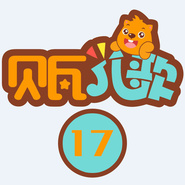

贝瓦儿歌 系列17
============================

|  |  |
| :--: | :-- |
| [ 贝瓦儿歌 系列17](https://emumo.xiami.com/album/2102719941) | **艺人**: [贝瓦儿歌](../index.md) **语种**: 国语 **唱片公司**: 贝瓦BEVA **发行时间**: 2016年09月18日 **专辑类别**: 精选集 **专辑风格**: 儿歌 Nursery Rhyme **播放数**: 2839465 **收藏数**: 883 **评论数**: 1  |

## 简介

## 曲目

- [夏天到 (口白)](./2102719941/xNcKjQafdbb.md)
- [夏天到](./2102719941/JC8HME25329.md)
- [夏天在哪里](./2102719941/mSrLuV5740f.md)
- [夏夜](./2102719941/bqwPEo236a05.md)
- [鲜花的魔力 (口白)](./2102719941/mSrLuZ61c6c.md)
- [现代童话寓言 (33)](./2102719941/mSrLvc6310d.md)
- [乡下的老鼠](./2102719941/mSrLvfd7788.md)
- [相邻数](./2102719941/mSrLvh83e53.md)
- [相信勇敢相信爱](./2102719941/mSrLvk4c243.md)
- [香蕉 (口白)](./2102719941/mSrLvn73f38.md)
- [香皂宝宝的一天 (口白)](./2102719941/mSrLvp87c61.md)
- [向日葵 (口白)](./2102719941/mSrLvs7548b.md)
- [向日葵](./2102719941/mSrLvv8b12b.md)
- [向未来](./2102719941/mSrLuW4d074.md)
- [小白鹅学跳水 (口白)](./2102719941/U7tGBv2870a.md)
- [小白兔种萝卜](./2102719941/mSrLve5110e.md)
- [小白牙](./2102719941/bCmvBRM47523.md)
- [小板凳 (3)](./2102719941/8HNIYvfddc0.md)
- [小宝宝 (口白)](./2102719941/JC8HMY24dda.md)
- [小宝宝快睡觉](./2102719941/xNcKjUdbd42.md)
- [小背篓](./2102719941/mSrLvy8c5f7.md)
- [小布叮的痒痒肉 (口白)](./2102719941/xNcKkb98731.md)
- [小布叮和小青蛙 (口白)](./2102719941/xNcKked3b55.md)
- [小儿多食影响智力 (口白)](./2102719941/mSrLv758e2e.md)
- [小肥猪上学校](./2102719941/mSrLvB69fc4.md)
- [小哥哥 (口白)](./2102719941/8HNIYhf94c6.md)
- [小个子挺好 (口白)](./2102719941/xNcKjAb8459.md)
- [小狗跳舞](./2102719941/b1rADdh3d2aa.md)
- [小国王 (2)](./2102719941/mSrLvg8b48c.md)
- [小国王 (3)](./2102719941/8HNIYte1c4c.md)
- [小国王 (7)](./2102719941/b1rADdq3dfb7.md)
- [小孩的自尊心与大人一样不可伤害 (口白)](./2102719941/mSrLvr66a54.md)
- [小海军](./2102719941/xNcKjT9c527.md)
- [小荷花找朋友](./2102719941/xNcKjX14b52.md)
- [小蝴蝶](./2102719941/mSrLv26c9fc.md)
- [小花猫 (口白)](./2102719941/xNcKkdb17fe.md)
- [小鸡没有吃蛋糕 (口白)](./2102719941/8HNIYIe97c2.md)
- [小剪刀 (口白)](./2102719941/8HNIY6f9eae.md)
- [小将岳云](./2102719941/mSrLv07e22d.md)
- [小金鱼 (口白)](./2102719941/mSrLv57a65d.md)
- [小可爱](./2102719941/bqwPEpe358f1.md)
- [小老虎吃巧克力-儿歌音乐 (口白)](./2102719941/mSrLvD6e8b6.md)
- [小老鼠打喷嚏](./2102719941/8HNIYQf5c8d.md)
- [小老鼠的红伞 (口白)](./2102719941/xNcKkud8564.md)
- [小老鼠和猫](./2102719941/mSrLvO6ba4d.md)
- [小老鼠和啤酒桶](./2102719941/U7tGCm2969c.md)
- [小老鼠赏月亮](./2102719941/bf2eF0P2fb76.md)
- [小螺号MV](./2102719941/xNcKk8b018d.md)
- [小麻雀](./2102719941/mSrLwc90354.md)
- [小马](./2102719941/xNcKjZd1c80.md)
- [小蚂蚁搬馅饼](./2102719941/xNcKkgbca56.md)
- [小猫的胡子](./2102719941/xNcKkj15f14.md)
- [小猫卡拉OK](./2102719941/xNcKkm10dbf.md)
- [小猫咪与小手套](./2102719941/8HNIYP1d53f.md)
- [小毛驴](./2102719941/8HNIYTef668.md)
- [小蜜蜂](./2102719941/xNcKkxd7324.md)
- [小魔女的魔法书](./2102719941/8HNIZb1998a.md)
- [小木马](./2102719941/xNcKk9c4b22.md)
- [小木屋](./2102719941/xNcKkFbcf66.md)
- [小木屋做游戏](./2102719941/mSrLwj6891e.md)
- [小牧童](./2102719941/mSrLwl13561.md)
- [小闹钟](./2102719941/xNcKkoa2e93.md)
- [小鸟餐桌 (口白)](./2102719941/JC8HN123047.md)
- [小鸟和大%u(口白)](./2102719941/xNcKkva42ab.md)
- [小鸟减肥 (口白)](./2102719941/8HNIYZe68ee.md)
- [小牛牛放牛牛](./2102719941/U7tGCo28300.md)
- [小胖墩儿](./2102719941/mSrLvW926c8.md)
- [小泡泡历险记 (口白)](./2102719941/xNcKkBd82b8.md)
- [小企鹅](./2102719941/mSrLwd523ad.md)
- [小青虫的梦 (01-晚安我的星星)](./2102719941/xNcKkGf4d8b.md)
- [小青虫的梦 (02-小青虫的梦)](./2102719941/xNcKkKa7950.md)
- [小青虫的梦 (03-大尾巴鳄鱼)](./2102719941/mSrLwn4e08a.md)
- [小青虫的梦 (04-小熊的森林)](./2102719941/8HNIZ0e2c92.md)
- [小青虫的梦](./2102719941/mSrLvI8bf6d.md)
- [小青虫的梦 (06-竖琴网)](./2102719941/xNcKkwa265d.md)
- [小青虫的梦 (07-树上的鞋子)](./2102719941/mSrLvQ63da9.md)
- [小青虫的梦 (08-买梦)](./2102719941/8HNIZdeda34.md)
- [小青虫的梦 (09-云朵变的小羊)](./2102719941/mSrLvX6eb48.md)
- [小青虫的梦 (10-山大王和小小鸟)](./2102719941/U7tGCu299c2.md)
- [小青虫的梦 (11-朋友的信)](./2102719941/8HNIZof7b02.md)
- [小青虫的梦 (12-怪物咕吧的大角)](./2102719941/b1rADem3e2ac.md)
- [小青虫的梦 (13-青蛙龙)](./2102719941/mSrLwm619e1.md)
- [小青蛙](./2102719941/mSrLwp7d028.md)
- [小蜻蜓快飞吧](./2102719941/U7tGCC2b264.md)
- [小手小手](./2102719941/xNcKkTd9049.md)
- [小数歌 (口白)](./2102719941/xNcKkHaca27.md)
- [小螳螂 (口白)](./2102719941/xNcKkO980c7.md)
- [小淘淘 (口白)](./2102719941/xNcKkRcad9b.md)
- [小兔蹦蹦跳 (口白)](./2102719941/mSrLwu951de.md)
- [小兔想小猪](./2102719941/xNcKkVa220d.md)
- [小兔子](./2102719941/mSrLww7ca4e.md)
- [小乌鸦](./2102719941/mSrLwx5ec2e.md)
- [小象转学 (口白)](./2102719941/xNcKkY9f443.md)
- [小小兵](./2102719941/mSrLwz7ffef.md)
- [小小蛋儿把门开](./2102719941/mSrLw0f0178.md)

## 评论

|  |  |  |
| :-- | :-- | :-- |
|  [虾米用户](https://emumo.xiami.com/u/439986301)  2020-02-27 15:23 赞(1) 踩(0) | 
(◦˙▽˙◦)yuh
 |
