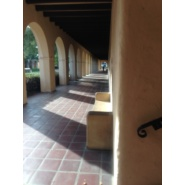

音乐测序Chord-seq和弦一样必须要在一起
============================

|  |  |
| :--: | :-- |
| [ 音乐测序Chord-seq和弦一样必须要在一起](https://emumo.xiami.com/album/1991653765) | **艺人**: [Dr_Hope](../index.md) **语种**: 其他 **唱片公司**: 独立发行 **发行时间**: 2014年02月06日 **专辑类别**: EP, 单曲 **专辑风格**: 新世纪音乐 New Age, 放松新世纪 Relaxation New Age **播放数**: 1578998 **收藏数**: 160 **评论数**: 5  |

## 简介

Dr_Hope首张编配专辑。 

## 曲目

## 评论

|  |  |  |  |
| :-- | :-- | :-- | :-- |
|  [虾米用户](https://emumo.xiami.com/u/345395052)  2018-04-19 07:52 赞(0) 踩(0) | 
卡农兔子舞好听，古典流行相结合。 
 |
|  [虾米用户](https://emumo.xiami.com/u/89858360) 天高任鸟飞，海深让鱼油，... 2017-07-27 22:33 赞(0) 踩(0) | 
牛逼
 |
|  [虾米用户](https://emumo.xiami.com/u/4703074)  2015-10-22 09:12 赞(0) 踩(0) | 
蛮有个性的
 |
|  [虾米用户](https://emumo.xiami.com/u/4376156)  2014-07-13 15:34 赞(0) 踩(0) | 
编配的不错    有些青涩的味道还是很好    期待新的作品出来
 |
|  [虾米用户](https://emumo.xiami.com/u/11643877) 姑且听之 2014-05-09 17:53 赞(0) 踩(0) | 
~
 |
