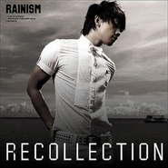

李承洁
============================

|  |  |
| :--: | :-- |
| [ 李承洁](https://i.xiami.com/lichengjie) | **播放数**: 16759117 **粉丝数**: 494 **评论数**: 71 **地区**: China 中国大陆 **风格**: 华语唱作人 Chinese Singer-Songwriter  |

## 档案

李承洁，原创歌手、模特儿。兼具偶像与实力的创作型歌手。一手包办的全能型歌手。担当自己所有作品的词曲配乐以及幕后制作。2014年02月发行《时光》《不如散的痛快》等，即清晰又有磁性的音色，音乐作品受到众多网友的赞誉，被誉为”R&B小王子“ 中文名:李承洁  英文名：OrionJay  生日：1993-11-10  民族： 汉  国籍： 中国  出生地： 河北省  身高： 185CM

## 专辑

| 名称 | 语种 | 唱片公司 | 发行时间 | 专辑类别 | 专辑风格 |
| :--: | :-- | :-- | :-- | :-- | :-- |
| [ 最懂的世界](./albums/2105150761.md) | 国语 | 看见文娱 | 2019年08月13日 | EP, 单曲 |  |
| [ 最懂的世界](./albums/2104309545.md) | 国语 |  | 2018年06月25日 | 录音室专辑 | 流行 Pop |
| [ 此刻好想她](./albums/2103463461.md) | 国语 | 独立发行 | 2017年12月25日 | 录音室专辑 | 流行 Pop |
| [ 合集合集](./albums/2102766510.md) | 国语 | 独立发行 | 2017年06月15日 | 合集, 杂锦 | 国语流行 Mandarin Pop |
| [ 多幸运](./albums/2100371868.md) | 国语 | 独立发行 | 2016年07月01日 | EP, 单曲 | 国语流行 Mandarin Pop |
| [ 温柔](./albums/2100243826.md) | 国语 | 独立发行 | 2015年12月02日 | EP, 单曲 | 国语流行 Mandarin Pop |
| [ 回忆周杰伦](./albums/2100243828.md) | 国语 | 独立发行 | 2015年12月02日 | EP, 单曲 | 国语流行 Mandarin Pop |
| [ 只对你说](./albums/2100229320.md) | 国语 | 独立发行 | 2015年10月30日 | 录音室专辑 | 国语流行 Mandarin Pop |
| [ 南山南](./albums/2100181558.md) | 国语 | 独立发行 | 2015年08月22日 | 录音室专辑 | 国语流行 Mandarin Pop |
| [ 那些年的‘周杰伦’](./albums/2100178774.md) | 国语 | 独立发行 | 2015年08月14日 | 录音室专辑 | 国语流行 Mandarin Pop |
| [ 青花瓷](./albums/837376401.md) | 国语 | 独立发行 | 2015年07月17日 | 录音室专辑 | 国语流行 Mandarin Pop |
| [ 我的错](./albums/234030097.md) | 国语 | 独立发行 | 2015年06月11日 | 录音室专辑 | 国语流行 Mandarin Pop |
| [ 高中之路](./albums/1833235793.md) | 国语 | 独立发行 | 2015年06月02日 | 录音室专辑 | 国语流行 Mandarin Pop |
| [ 新开始](./albums/230792891.md) | 国语 | 独立发行 | 2015年05月02日 | 录音室专辑 | 国语流行 Mandarin Pop |
| [ 模特](./albums/22522072.md) | 国语 | 独立发行 | 2015年01月29日 | EP, 单曲 | 国语流行 Mandarin Pop |
| [ 听说爱情回来过](./albums/1019402435.md) | 国语 | 独立发行 | 2014年12月24日 | EP, 单曲 |  |
| [ Always online](./albums/2016214196.md) | 国语 | 独立发行 | 2014年11月17日 | EP, 单曲 | 国语流行 Mandarin Pop |
| [ 3年的回忆](./albums/214820513.md) | 国语 | 独立发行 | 2014年11月01日 | 合集, 杂锦 | 国语流行 Mandarin Pop |
| [ 咱们结婚吧](./albums/1911900914.md) | 国语 | 独立发行 | 2014年09月28日 | EP, 单曲 | 国语流行 Mandarin Pop |
| [ 美丽的神话](./albums/1208017215.md) | 国语 | 独立发行 | 2014年08月14日 | EP, 单曲 | 国语流行 Mandarin Pop |
| [ 忘记尘缘忘记你](./albums/1404236104.md) | 国语 | 凯邦文化传播有限公司 | 2014年07月01日 | 录音室专辑 | 国语流行 Mandarin Pop |
| [ 最后的天使Last angel](./albums/903860132.md) | 国语 | 独立发行 | 2014年06月27日 | EP, 单曲 | 青少年流行 Teen Pop |
| [ 洁不放弃](./albums/1025274702.md) | 国语 | 独立发行 | 2014年04月18日 | EP, 单曲 | 国语流行 Mandarin Pop |
| [ 《为红颜》](./albums/1792719384.md) | 国语 | 李承洁 | 2014年02月17日 | EP, 单曲 | 诗歌 Poetry |
| [ 痴心绝对](./albums/1817757728.md) | 国语 | 独立发行 | 2013年12月02日 | 录音室专辑 | 国语流行 Mandarin Pop |
| [ 情歌王](./albums/1516889150.md) | 国语 | 独立发行 | 2011年11月03日 | EP, 单曲 | 国语流行 Mandarin Pop |
| [ 时光](./albums/201782104.md) | 国语 | 独立发行 | 2010年06月14日 | EP, 单曲 | 华语唱作人 Chinese Singer-Songwriter |

## 评论

|  |  |  |  |
| :-- | :-- | :-- | :-- |
|  [虾米用户](https://emumo.xiami.com/u/354192415)  2020-07-04 20:37 赞(0) 踩(0) | 
这也算歌手？
 |
|  [虾米用户](https://emumo.xiami.com/u/16106736)  2020-03-08 15:27 赞(0) 踩(0) | 
青花瓷给唱废了
 |
|  [虾米用户](https://emumo.xiami.com/u/1465973)   2019-06-14 09:36 赞(1) 踩(0) | 
跑调没关系，有包装就可以说是歌手。妈个鸡，真的是。。。这个时代。
 |
|  [虾米用户](https://emumo.xiami.com/u/74936314)   2019-02-27 00:40 赞(1) 踩(0) | 
什么东西...歌词都能唱错？
 |
|  [虾米用户](https://emumo.xiami.com/u/293692544) 你敢给我说话吗？我咬你 2019-02-15 05:19 赞(1) 踩(0) | 
好听
 |
|  [虾米用户](https://emumo.xiami.com/u/293692544) 你敢给我说话吗？我咬你 2019-01-30 17:12 赞(1) 踩(0) | 
好听
 |
|  [虾米用户](https://emumo.xiami.com/u/2381982) 我还没想好要写什么... 2019-01-13 19:09 赞(3) 踩(0) | 
都是翻唱的原创歌手，全能创作人......
 |
|  [虾米用户](https://emumo.xiami.com/u/350242352)  2018-02-24 19:40 赞(1) 踩(0) | 
挺好听的我喜欢     
 |
|  [虾米用户](https://emumo.xiami.com/u/308050571)  2018-01-08 19:48 赞(1) 踩(0) | 

 |
|  [虾米用户](https://emumo.xiami.com/u/338478392)  2018-01-05 16:46 赞(1) 踩(0) | 
❤❤好听
 |
|  [虾米用户](https://emumo.xiami.com/u/330274269)  2017-12-10 13:16 赞(1) 踩(0) | 
真好听
 |
|  [虾米用户](https://emumo.xiami.com/u/297809028)  2017-10-22 11:56 赞(1) 踩(0) | 
好听
 |
|  [虾米用户](https://emumo.xiami.com/u/267867426)  2017-07-31 12:44 赞(1) 踩(0) | 
     
 |
|  [虾米用户](https://emumo.xiami.com/u/315799411)  2017-07-29 14:01 赞(2) 踩(0) | 
你唱歌好好听
 |
|  [虾米用户](https://emumo.xiami.com/u/256437594)  2017-07-18 09:33 赞(7) 踩(0) | 
不咋样，这也算艺人
 |
| ⇒ |  [虾米用户](https://emumo.xiami.com/u/315424526)  2017-07-28 14:47 赞(0) 踩(0) | 
 
 |
| ⇒ |  [虾米用户](https://emumo.xiami.com/u/332241650)  2019-08-01 09:48 赞(0) 踩(0) | 
页
 |
|  [虾米用户](https://emumo.xiami.com/u/299872042) 郑家豪 2017-07-01 16:20 赞(2) 踩(0) | 
呵呵。
 |
|  [虾米用户](https://emumo.xiami.com/u/287407209) 辛福之家。 2017-05-30 15:08 赞(3) 踩(0) | 
真好听。
 |
|  [虾米用户](https://emumo.xiami.com/u/262331890) 为何。。。。。。。 2017-05-06 21:10 赞(2) 踩(0) | 
好听，好丑！
 |
|  [虾米用户](https://emumo.xiami.com/u/257673285)  2017-02-22 21:47 赞(5) 踩(0) | 
好喜欢你
 |
|  [虾米用户](https://emumo.xiami.com/u/44296672)  2017-02-17 22:01 赞(0) 踩(0) | 
[Reply@sleepingado]此外俺还想说，死变态烂屁眼
 |
| ⇒ |  [虾米用户](https://emumo.xiami.com/u/315424526)  2017-07-28 14:47 赞(0) 踩(0) | 

 |
|  [虾米用户](https://emumo.xiami.com/u/44296672)  2017-02-17 21:59 赞(1) 踩(0) | 
[Reply@sleepingado]说出了我的心声
 |
|  [虾米用户](https://emumo.xiami.com/u/87190074) 刘若英  2017-01-29 14:59 赞(4) 踩(0) | 
你好帅，爱 
 |
|  [虾米用户](https://emumo.xiami.com/u/266108661)  2017-01-22 20:25 赞(3) 踩(0) | 
你唱的歌很好听，望你继续加油，将来我也喜欢唱歌，我一定会像你一样优秀
 |
|  [虾米用户](https://emumo.xiami.com/u/257012412)  2016-12-25 23:05 赞(3) 踩(0) | 
爱 洁
 |
|  [虾米用户](https://emumo.xiami.com/u/254058473)  2016-12-13 11:30 赞(1) 踩(0) | 
好听
 |
|  [虾米用户](https://emumo.xiami.com/u/239599878)  2016-10-23 16:37 赞(1) 踩(0) | 
哈哈！
 |
|  [虾米用户](https://emumo.xiami.com/u/239599878)  2016-10-23 16:37 赞(2) 踩(0) | 
    
 |
|  [虾米用户](https://emumo.xiami.com/u/239599878)  2016-10-23 16:36 赞(4) 踩(0) | 
真好听，牛
 |
| ⇒ |  [虾米用户](https://emumo.xiami.com/u/315424526)  2017-07-28 14:48 赞(0) 踩(0) | 
<q><b>说：</b></q>
 |
|  [虾米用户](https://emumo.xiami.com/u/239599878)  2016-10-23 16:35 赞(2) 踩(0) | 
不错 继续努力!
 |
|  [虾米用户](https://emumo.xiami.com/u/16135450)  2016-09-25 16:55 赞(1) 踩(0) | 
4139
 |
|  [虾米用户](https://emumo.xiami.com/u/71642508)  2016-07-20 12:08 赞(0) 踩(0) | 
为啥下载你那首甜甜的。下载地址显示的是0.0MB？？？？你们歌曲的下载链接有问题
 |
|  [虾米用户](https://emumo.xiami.com/u/187016340)   2016-06-21 13:24 赞(1) 踩(0) | 
支持一下我们新疆人
 |
|  [虾米用户](https://emumo.xiami.com/u/115194856)  2016-06-11 12:56 赞(0) 踩(0) | 
你在唱歌的时候可以放开唱，还有在翻唱的时候多听几遍，我听你唱的那个情歌王时，给你个建议，做自己
 |
|  [虾米用户](https://emumo.xiami.com/u/73476720) doyou havea ... 2016-05-07 18:44 赞(1) 踩(0) | 
英语不太动听
 |
|  [虾米用户](https://emumo.xiami.com/u/73476720) doyou havea ... 2016-05-07 18:43 赞(0) 踩(0) | 
不错
 |
|  [虾米用户](https://emumo.xiami.com/u/100169460)   2016-05-01 16:00 赞(12) 踩(0) | 
内容已删除
 |
| ⇒ |  [虾米用户](https://emumo.xiami.com/u/308050571)  2018-01-15 19:08 赞(0) 踩(0) | 
请你不要骂人
 |
|  [虾米用户](https://emumo.xiami.com/u/120327246) 离开以后 2016-04-16 14:30 赞(1) 踩(0) | 
好听
 |
|  [虾米用户](https://emumo.xiami.com/u/117351986) 有自己的音乐路 2016-04-04 12:44 赞(0) 踩(0) | 
不错 继续努力！
 |
|  [虾米用户](https://emumo.xiami.com/u/127912658) 简单的梦想，简单的生活，... 2016-03-28 02:41 赞(1) 踩(0) | 
声音很好听
 |
|  [虾米用户](https://emumo.xiami.com/u/122984270)  2016-03-18 19:28 赞(0) 踩(0) | 
我家有一只狗希望您去我家玩意儿  
 |
|  [虾米用户](https://emumo.xiami.com/u/122984270)  2016-03-18 19:23 赞(1) 踩(0) | 
思，我喜欢您，谢谢您的歜      
 |
|  [虾米用户](https://emumo.xiami.com/u/32551447) We were both... 2016-02-29 22:08 赞(0) 踩(0) | 
不好听…
 |
|  [虾米用户](https://emumo.xiami.com/u/64092516)  2016-01-25 18:32 赞(0) 踩(0) | 
听不错的
 |
|  [虾米用户](https://emumo.xiami.com/u/73465058) ୧(﹒︠ᴗ﹒︡)୨ 2016-01-11 23:44 赞(0) 踩(0) | 
加油吧。
 |
|  [虾米用户](https://emumo.xiami.com/u/73796528) 童声发烧控一只在这里听歌... 2015-12-20 20:47 赞(0) 踩(0) | 
新疆人
 |
|  [虾米用户](https://emumo.xiami.com/u/73796528) 童声发烧控一只在这里听歌... 2015-12-20 20:47 赞(0) 踩(0) | 

 |
|  [虾米用户](https://emumo.xiami.com/u/37972715) 灵玉蛇钻心，脾静壳钻精… 2015-11-22 11:45 赞(0) 踩(0) | 
吓死我了，
 |
|  [虾米用户](https://emumo.xiami.com/u/81340492)  2015-11-09 13:50 赞(1) 踩(0) | 
很好听啊
 |
| ⇒ |  [虾米用户](https://emumo.xiami.com/u/32873382) 李承洁，90原创歌手、模... 2015-12-03 22:53 赞(0) 踩(0) | 
谢谢
 |
|  [虾米用户](https://emumo.xiami.com/u/74281786) 双重性格 2015-10-16 23:06 赞(1) 踩(0) | 
我只关注了你 
 |
|  [虾米用户](https://emumo.xiami.com/u/45752692)   2015-10-12 08:59 赞(1) 踩(0) | 
不要听别人说的  做自己  好听 
 |
|  [虾米用户](https://emumo.xiami.com/u/37637121) 暂无签名~ 2015-10-03 16:44 赞(1) 踩(0) | 
什么鬼。
 |
|  [虾米用户](https://emumo.xiami.com/u/47795797) 我是你尘世中的安慰。 2015-08-22 19:35 赞(0) 踩(0) | 
喜欢，可以认识你吗。   
 |
|  [虾米用户](https://emumo.xiami.com/u/8876234) Let it be~ 2015-08-02 12:04 赞(0) 踩(0) | 
很難聽 
 |
|  [虾米用户](https://emumo.xiami.com/u/12808919)  2015-03-17 18:03 赞(2) 踩(0) | 
唱的都不在调上啊
 |
|  [虾米用户](https://emumo.xiami.com/u/46434720) 暂无签名~ 2015-01-31 19:49 赞(1) 踩(0) | 
你喜欢金在中吗。。
 |
| ⇒ |  [虾米用户](https://emumo.xiami.com/u/32873382) 李承洁，90原创歌手、模... 2015-02-04 16:47 赞(0) 踩(0) | 
怎么了？
 |
|  [虾米用户](https://emumo.xiami.com/u/45782649)  2015-01-08 20:58 赞(0) 踩(0) | 
我是看到你的微博才进来的，很喜欢你的歌，我认识你是在快手上看到，
 |
| ⇒ |  [虾米用户](https://emumo.xiami.com/u/32873382) 李承洁，90原创歌手、模... 2015-01-15 15:39 赞(0) 踩(0) | 
恩，看到了，谢谢你的支持
 |
|  [虾米用户](https://emumo.xiami.com/u/32873382) 李承洁，90原创歌手、模... 2014-02-18 18:17 赞(29) 踩(0) | 
我刚入驻了虾米音乐人，欢迎大家来我的个人主页，收听我的最新音乐
 |
| ⇒ |  [虾米用户](https://emumo.xiami.com/u/43771594) 暂无签名~ 2014-12-29 02:09 赞(0) 踩(0) | 
好听
 |
| ⇒ |  [虾米用户](https://emumo.xiami.com/u/285137707)  2017-04-12 20:53 赞(0) 踩(0) | 
你是真的李承洁吗
 |
| ⇒ |  [虾米用户](https://emumo.xiami.com/u/307593616)  2017-07-02 13:42 赞(0) 踩(0) | 
呵呵呵
 |
| ⇒ |  [虾米用户](https://emumo.xiami.com/u/315424526)  2017-07-28 14:47 赞(0) 踩(0) | 
<q><b>|你特么算什么东西°说：</b></q>
 |
| ⇒ |  [虾米用户](https://emumo.xiami.com/u/307593616)  2017-08-02 11:27 赞(0) 踩(0) | 
<q><b>难言么说：</b></q>
 |
| ⇒ |  [虾米用户](https://emumo.xiami.com/u/226024422) 微博：名偵探張戶川丹藍 2017-08-21 01:47 赞(0) 踩(0) | 
你唱的咱們結婚吧，太有感情了，害我reply一整天。
 |
| ⇒ |  [虾米用户](https://emumo.xiami.com/u/12536609)  2018-07-21 21:20 赞(0) 踩(0) | 
卧槽 模特那首歌明明是你唱的？？？
 |
