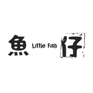
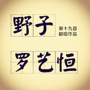
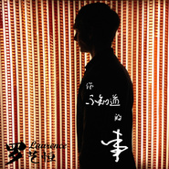
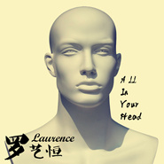

罗艺恒
============================

|  |  |
| :--: | :-- |
| [ 罗艺恒](https://i.xiami.com/luoyiheng0304) | **地区**: New Zealand 新西兰 **风格**: 国语流行 Mandarin Pop **播放数**: 29589272 **粉丝数**: 12097 **评论数**: 476  |

## 档案

也许你对“罗艺恒”这个名字还很陌生，但是如果您百度一下“罗艺恒”，您就会发现这个新西兰籍的阳光大男孩。 
罗艺恒，原名：Laurence，擅长歌唱，Rap，编曲，吉他和其它乐器等。小罗出生于新西兰，父亲来自于美国。今年19岁的他和其他所有的年轻人一样，非常喜欢流行音乐。但是特别的是；母语是英文的他却十分钟情于华语流行音乐。当红的一些华语歌手如林俊杰、周杰伦、陈奕迅等都是他十分崇拜的偶像。 
为了可以创作出喜欢的中文歌曲，罗艺恒在高中毕业后更是毫不犹豫地报读了奥克兰大学的中文及流行音乐系。在就读期间，他翻唱录制并重新填词改编了一些当红的华语流行歌曲(如《童话》、《好久不见》、《我的歌声里》等)并上传至中国的一些视频网站(如“优酷”、“我乐网”等)。在短短两个月不到的时间内就迅速引起了中国广大网友们的关注。

## 专辑

| 名称 | 语种 | 唱片公司 | 发行时间 | 专辑类别 | 专辑风格 |
| :--: | :-- | :-- | :-- | :-- | :-- |
| [ 铁血男儿](./albums/5022047698.md) | 国语 | 奇大音乐 | 2020年11月30日 | EP, 单曲 | 国语流行 Mandarin Pop |
| [ 我以为我已经好了](./albums/5020834564.md) | 国语 | KKFARM | 2020年06月05日 | EP, 单曲 | 流行 Pop |
| [ 感谢每一个你](./albums/2420340548.md) | 国语 | 梦织音 | 2020年02月29日 | EP, 单曲 | 国语流行 Mandarin Pop |
| [ 无名之辈](./albums/2105099977.md) | 英语 | 独立发行 | 2019年08月07日 | EP, 单曲 |  |
| [ 牛奶面包](./albums/2105049920.md) | 英语 | 独立发行 | 2019年07月31日 | EP, 单曲 |  |
| [ 炫舞之王(cover-KingOfDisco)](./albums/5020804255.md) | 国语 | 禾信科技 | 2018年12月12日 | EP, 单曲 | 国语流行 Mandarin Pop |
| [ Love Like This](./albums/2103747551.md) | 国语 | 奇大音乐 | 2018年06月14日 | EP, 单曲 | 国语流行 Mandarin Pop |
| [ 空空如也Empty](./albums/2103702835.md) | 国语 | 独立发行 | 2018年05月06日 | EP, 单曲 | 流行 Pop, 民谣 Folk, 嘻哈 Hip-Hop |
| [ 绒花](./albums/2103658305.md) | 国语 | 独立发行 | 2018年04月01日 | EP, 单曲 | 流行 Pop, 民谣 Folk, 红歌 Red Song |
| [ 等你下课Deng你Xia课](./albums/2103499032.md) | 国语 | 独立发行 | 2018年01月23日 | EP, 单曲 | 流行 Pop, 民谣 Folk, 民谣流行 Folk Pop |
| [ 鱼仔](./albums/2102975959.md) | 国语 | 独立发行 | 2017年12月17日 | EP, 单曲 | 民谣 Folk, 乡村 Country |
| [ 这样一个人](./albums/2102967377.md) | 国语 | 音为乐趣 | 2017年12月06日 | EP, 单曲 |  |
| [ 远走高飞（Cover 金志文）](./albums/2102864517.md) | 国语 | 独立发行 | 2017年09月27日 | EP, 单曲 | 流行 Pop |
| [ 普通朋友普通不普通 都是朋友](./albums/2102817705.md) | 国语 | 独立发行 | 2017年08月21日 | EP, 单曲 | 流行 Pop, 民谣 Folk, 节奏布鲁斯 R&B |
| [ 帅到分手](./albums/2102797040.md) | 国语 | 独立发行 | 2017年07月15日 | EP, 单曲 | 流行 Pop, 城市布鲁斯 Urban Blues, 节奏布鲁斯 R&B |
| [ 刚好遇见你](./albums/2102757942.md) | 国语 | 独立发行 | 2017年06月02日 | EP, 单曲 |  |
| [ 演员](./albums/2102403165.md) | 国语 | 独立发行 | 2016年09月28日 | EP, 单曲 |  |
| [ 罗艺恒的好歌曲](./albums/2100383114.md) | 国语 | 米.西克传媒工作组 | 2016年08月26日 | EP, 单曲 |  |
| [ 不该](./albums/2100375482.md) | 国语 | 独立发行 | 2016年08月04日 | EP, 单曲 |  |
| [ 好想你 (中英文版)I Miss You](./albums/2100357507.md) | 国语 | 米.西克传媒工作组 | 2016年06月23日 | EP, 单曲 | 国语流行 Mandarin Pop, 欧美流行 Western Pop |
| [ 空白格](./albums/2100334706.md) | 国语 | 独立发行 | 2016年05月12日 | EP, 单曲 | 国语流行 Mandarin Pop |
| [ 爱很简单I Love You](./albums/2100274536.md) | 国语 | 独立发行 | 2016年02月16日 | EP, 单曲 | 节奏布鲁斯 Rhythm & Blues, 国语流行 Mandarin Pop |
| [ 默](./albums/2100240738.md) | 国语 | 独立发行 | 2015年11月27日 | EP, 单曲 | 国语流行 Mandarin Pop |
| [ 温暖的情歌Warm Rhythm](./albums/2100240736.md) | 国语 | 米.西克传媒工作组 | 2015年11月26日 | EP, 单曲 | 国语流行 Mandarin Pop |
| [ 青花瓷QING HUA CI](./albums/2100221610.md) | 英语 | 米.西克传媒工作组 | 2015年10月17日 | EP, 单曲 | 国语流行 Mandarin Pop, 欧美流行 Western Pop, 华语唱作人 Chinese Singer-Songwriter |
| [ 野子 (中英文版)](./albums/2100189864.md) | 国语 | 米.西克传媒工作组 | 2015年09月03日 | EP, 单曲 | 国语流行 Mandarin Pop, 欧美流行 Western Pop |
| [ 我愿意](./albums/1237553915.md) | 国语 | 米.西克传媒工作组 | 2015年07月24日 | EP, 单曲 | 国语流行 Mandarin Pop, 欧美流行 Western Pop, 电音流行 Electropop |
| [ See You Again再见一面](./albums/330396843.md) | 国语 | 米.西克传媒工作组 | 2015年05月01日 | EP, 单曲 | 国语流行 Mandarin Pop, 欧美流行 Western Pop |
| [ Home To Mama (中英文版)](./albums/327272600.md) | 国语 | 独立发行 | 2015年03月26日 | EP, 单曲 | 国语流行 Mandarin Pop, 欧美流行 Western Pop |
| [ 算什么男人What Kind Of Man](./albums/1123471561.md) | 国语 | 独立发行 | 2015年02月10日 | EP, 单曲 | 国语流行 Mandarin Pop, 欧美流行 Western Pop |
| [ 听爸爸的话](./albums/19214314.md) | 国语 | 独立发行 | 2014年12月22日 | EP, 单曲 | 国语流行 Mandarin Pop, 欧美流行 Western Pop |
| [ 爱笑的眼睛Smiling Eyes](./albums/1917651692.md) | 英语 | 独立发行 | 2014年12月04日 | EP, 单曲 | 国语流行 Mandarin Pop |
| [ 你不知道的事](./albums/1814464341.md) | 国语 | 独立发行 | 2014年10月28日 | EP, 单曲 | 国语流行 Mandarin Pop, 欧美流行 Western Pop |
| [ 上瘾OVERDOSE](./albums/709885391.md) | 英语 | 米.西克传媒工作组 | 2014年09月05日 | EP, 单曲 | 电音流行 Electropop |
| [ 想你的夜](./albums/304870536.md) | 国语 | 米.西克传媒工作组 | 2014年07月09日 | EP, 单曲 | 国语流行 Mandarin Pop, 欧美流行 Western Pop |
| [ All In Your Head](./albums/1104257541.md) | 英语 | 米.西克传媒工作组 | 2014年07月04日 | EP, 单曲 | 欧美流行 Western Pop, 电音流行 Electropop |
| [ 眼,鼻,嘴EYES,NOSE,LIPS](./albums/1602558985.md) | 英语 | 米.西克传媒工作组 | 2014年06月11日 | EP, 单曲 | 民谣流行 Folk Pop |
| [ 爱过Give Up On Love](./albums/401166608.md) | 国语 | 米.西克传媒工作组 | 2014年05月26日 | 录音室专辑 | 国语流行 Mandarin Pop, 欧美流行 Western Pop |
| [ 罗艺恒翻唱歌曲](./albums/1798774832.md) | 国语 | 米.西克传媒工作组 | 2014年04月24日 | 录音室专辑 | 国语流行 Mandarin Pop |
| [ Missing You想念你](./albums/298769736.md) | 英语 | 米.西克传媒工作组 | 2014年04月01日 | EP, 单曲 | 独立流行 Indie Pop, 欧美流行 Western Pop |
| [ Be Mine](./albums/1998767555.md) | 国语 | 米.西克传媒工作组 | 2014年03月04日 | EP, 单曲 | 当代乡村 Contemporary Country, 乡村流行 Country Pop |

## 评论

|  |  |  |
| :-- | :-- | :-- |
|  [虾米用户](https://emumo.xiami.com/u/358104299) 悲观的唯心存在现实解构虚... 2020-11-29 21:59 赞(1) 踩(0) | 
18428
 |
|  [虾米用户](https://emumo.xiami.com/u/342038768) pucikaka don... 2020-05-08 13:00 赞(0) 踩(0) | 
关注很久了
 |
|  [虾米用户](https://emumo.xiami.com/u/3510038) 海天之恋 2020-02-22 15:04 赞(2) 踩(0) | 
我一个小学同学叫罗恒，一个大学同学叫罗艺 
 |
|  [虾米用户](https://emumo.xiami.com/u/279929230)   2019-08-02 10:47 赞(0) 踩(0) | 
好棒
 |
|  [虾米用户](https://emumo.xiami.com/u/426583100) 有好听的推荐一下 2019-07-29 13:46 赞(0) 踩(0) | 
Do you know that a friend named Luo named Ni, haha, stumbled in June 2009, 10 years from now on, serious words became a joke, finally understood the lyrics, and later gave up to get close to you. Take care of yourself and be sure.
 |
|  [虾米用户](https://emumo.xiami.com/u/426573263) 听歌，是我生命中的一部分 2019-06-27 00:40 赞(2) 踩(0) | 
你的声音真的超级超级好听(ง •̀_•́)ง，贼好(✪▽✪)
 |
|  [虾米用户](https://emumo.xiami.com/u/333332256) 要学会爱生活哟 2019-05-12 10:33 赞(0) 踩(0) | 
加油加油加油加油
 |
|  [虾米用户](https://emumo.xiami.com/u/52399377) 其他歌不再有耐心听 2019-04-01 01:58 赞(2) 踩(0) | 
太好听了 还长得那么帅 心动的感觉
 |
|  [虾米用户](https://emumo.xiami.com/u/289967633) ⛓紫色灵魂⛓ 2019-03-06 11:58 赞(0) 踩(0) | 
阔以阔以
 |
|  [虾米用户](https://emumo.xiami.com/u/356101866) 柯楚鎏，六年级学生一枚…... 2019-01-13 20:15 赞(0) 踩(0) | 
灰常稀饭！继续加油！！！
 |
|  [虾米用户](https://emumo.xiami.com/u/405209823)  2019-01-04 22:47 赞(0) 踩(0) | 
我喜欢你的歌
 |
|  [虾米用户](https://emumo.xiami.com/u/27936212)  2018-12-24 01:54 赞(0) 踩(0) | 
夜深了，一边听着他的歌声，一边工作，很悠扬，很舒服。。。
 |
|  [虾米用户](https://emumo.xiami.com/u/410507804) 我还没想好要写什么... 2018-12-20 16:51 赞(0) 踩(0) | 
好喜欢你能以自己的爱好生活
 |
|  [虾米用户](https://emumo.xiami.com/u/136249032) 与你相遇 好幸运。 2018-12-10 22:08 赞(0) 踩(0) | 
不错
 |
|  [虾米用户](https://emumo.xiami.com/u/330262481) 为音乐而奋斗 2018-12-06 15:47 赞(1) 踩(0) | 
你的流行歌曲非常有特色！希望你在华语乐坛取得优异的成绩！为你加油
 |
|  [虾米用户](https://emumo.xiami.com/u/330262481) 为音乐而奋斗 2018-12-06 15:46 赞(1) 踩(0) | 
好听的歌声！美妙的旋律！新西兰的自豪！也是我们奥克兰大学的骄傲！为你点赞赞
 |
|  [虾米用户](https://emumo.xiami.com/u/49918733) 同人音乐向 2018-11-21 22:02 赞(0) 踩(0) | 
远走高飞真心不错
 |
|  [虾米用户](https://emumo.xiami.com/u/31456460) 风筝有风，海豚有海 2018-11-11 00:42 赞(0) 踩(0) | 
在梦想的声音上看到了，收藏许久的小哥！加油鸭↖(^ω^)↗
 |
|  [虾米用户](https://emumo.xiami.com/u/334967960)  2018-10-26 05:51 赞(0) 踩(0) | 
歌很好，中文也不错。真是好声音。
 |
|  [虾米用户](https://emumo.xiami.com/u/358264558)  2018-10-26 00:35 赞(1) 踩(0) | 
Love how passionate you are with music❤️  The creativity with the language shifting throughout the songs is remarkable.
 |
|  [虾米用户](https://emumo.xiami.com/u/351421858)  2018-10-25 22:46 赞(1) 踩(0) | 
加油，罗艺恒，我是来自新西兰惠林顿的华人妈妈，祝福你，希望你可以在中国歌唱事业大红大紫，也希望你可以唱广东话的经典歌曲！
 |
| ⇒ |  [虾米用户](https://emumo.xiami.com/u/351421858)  2018-10-25 22:47 赞(0) 踩(0) | 
加油加油＾０＾~
 |
|  [虾米用户](https://emumo.xiami.com/u/344634613)  2018-10-23 15:31 赞(1) 踩(0) | 
求翻《瞬间》
 |
|  [虾米用户](https://emumo.xiami.com/u/361496382)  2018-09-08 14:29 赞(0) 踩(0) | 
好好听！  
 |
|  [虾米用户](https://emumo.xiami.com/u/439196) 每天打鸡血的射鸡师 2018-08-27 12:24 赞(0) 踩(0) | 
厉害啊啊啊，偶然听见青花瓷的英文版，瞬间圈粉
 |
|  [虾米用户](https://emumo.xiami.com/u/293396341) 皮皮虾，我们走! 2018-08-25 22:58 赞(1) 踩(0) | 
电话被打爆了么 
 |
|  [虾米用户](https://emumo.xiami.com/u/336663592)  2018-08-08 21:32 赞(0) 踩(0) | 
希望你能用英文演唱更多带中国古风的歌，比如张信哲的焚情
 |
|  [虾米用户](https://emumo.xiami.com/u/333271604) 平僖 2018-08-02 19:35 赞(1) 踩(0) | 
不喜欢444，所以就有了这个评论[文字up]
 |
|  [虾米用户](https://emumo.xiami.com/u/253194350)  2018-07-30 01:10 赞(1) 踩(0) | 
中文很棒，歌也很好听  微博上关注你  现在在虾米上捉住你啦   要加油哦  未来可期  你超棒的
 |
|  [虾米用户](https://emumo.xiami.com/u/331211315)  2018-07-20 11:02 赞(1) 踩(0) | 
音色超级靓！
 |
|  [虾米用户](https://emumo.xiami.com/u/357640893)  2018-07-16 10:19 赞(1) 踩(0) | 
非常好聽
 |
|  [虾米用户](https://emumo.xiami.com/u/371325093) 我还没想好要写什么... 2018-07-14 11:38 赞(2) 踩(0) | 
  
 |
|  [虾米用户](https://emumo.xiami.com/u/282789625)  2018-06-10 22:41 赞(3) 踩(0) | 
加油
 |
|  [虾米用户](https://emumo.xiami.com/u/353308001) 熱巴是我女神 2018-06-08 18:07 赞(1) 踩(0) | 
真的超喜歡你的歌的！！希望你一直唱下去
 |
|  [虾米用户](https://emumo.xiami.com/u/355281854) 喜欢的都可以追求！想做的... 2018-06-07 00:50 赞(2) 踩(0) | 
我爱你
 |
|  [虾米用户](https://emumo.xiami.com/u/260533402) 有往事的人，与将未来…… 2018-06-02 22:54 赞(1) 踩(0) | 
六喽加油 顶你！
 |
|  [虾米用户](https://emumo.xiami.com/u/261590705) exo _心动 2018-06-02 21:54 赞(2) 踩(0) | 
加油，很喜欢你的声音，很好听
 |
|  [虾米用户](https://emumo.xiami.com/u/331289793) 超强的执行力是对平庸生活... 2018-05-31 20:03 赞(1) 踩(0) | 
低吟浅唱，如一杯清酒，让我如痴如醉。
 |
|  [虾米用户](https://emumo.xiami.com/u/352126542)  2018-05-30 21:24 赞(1) 踩(0) | 
怎么一个关注的也没有?_?
 |
|  [虾米用户](https://emumo.xiami.com/u/346467335)  2018-05-19 13:41 赞(3) 踩(0) | 
爱你
 |
|  [虾米用户](https://emumo.xiami.com/u/349463996)  2018-05-17 23:30 赞(3) 踩(0) | 
只粉你
 |
|  [虾米用户](https://emumo.xiami.com/u/3325059)  2018-05-16 11:06 赞(14) 踩(0) | 
支持一个~中文很标准，声音有特色！
 |
|  [虾米用户](https://emumo.xiami.com/u/353847752)  2018-05-12 18:09 赞(2) 踩(0) | 
很不错
 |
|  [虾米用户](https://emumo.xiami.com/u/57397392)  2018-05-11 22:21 赞(2) 踩(0) | 
好听死了 请继续坚持下去 加油！！！为你打call啊啊啊T^T
 |
|  [虾米用户](https://emumo.xiami.com/u/365575565) 微风缓缓，你走了 2018-05-11 17:37 赞(2) 踩(0) | 
很好听，非常喜欢 
 |
|  [虾米用户](https://emumo.xiami.com/u/336575258)   2018-05-10 14:11 赞(3) 踩(0) | 
Wow~!!!! 惊艳了～！！！！
 |
|  [虾米用户](https://emumo.xiami.com/u/280198751) 我还没想好要写什么... 2018-05-10 13:59 赞(0) 踩(0) | 
老天太棒了
 |
|  [虾米用户](https://emumo.xiami.com/u/7604768) 关爱小学生… 2018-05-07 12:25 赞(0) 踩(0) | 
经常虾米消息里提示有你的歌。  见证你的进取。
 |
|  [虾米用户](https://emumo.xiami.com/u/4421063) 梦里是谁 2018-05-04 19:36 赞(0) 踩(0) | 
男的屌，女的骚
 |
|  [虾米用户](https://emumo.xiami.com/u/349768688)  2018-04-29 15:20 赞(3) 踩(0) | 
可不可以唱一首周杰伦的《告白气球》
 |
|  [虾米用户](https://emumo.xiami.com/u/356992770)  2018-04-28 20:26 赞(0) 踩(0) | 
我喜欢
 |
|  [虾米用户](https://emumo.xiami.com/u/284150818) 你可真是又傻又天真。 2018-04-22 18:25 赞(17) 踩(0) | 
他的中文简直了&amp;hellip;&amp;hellip;比我的标准多了
 |
|  [虾米用户](https://emumo.xiami.com/u/253197520)  2018-04-13 20:26 赞(0) 踩(0) | 
好厉害，的，男神
 |
|  [虾米用户](https://emumo.xiami.com/u/9406563)  2018-04-13 15:21 赞(1) 踩(0) | 
我的妈呀 好厉害 这名字也非常本土 ~\(≧▽≦)/~
 |
|  [虾米用户](https://emumo.xiami.com/u/349291990)  2018-03-25 20:20 赞(0) 踩(0) | 
好好听，喜欢你唱的歌，男神    
 |
|  [虾米用户](https://emumo.xiami.com/u/351213935) 我还没想好要写什么... 2018-03-24 13:46 赞(0) 踩(0) | 
默默支持
 |
|  [虾米用户](https://emumo.xiami.com/u/236561132)  2018-03-22 21:30 赞(0) 踩(0) | 
好听。 
 |
|  [虾米用户](https://emumo.xiami.com/u/346686401)  2018-03-17 13:20 赞(0) 踩(0) | 
好好听啊  
 |
|  [虾米用户](https://emumo.xiami.com/u/353928173)  2018-03-10 19:14 赞(0) 踩(0) | 
节奏不错。很好。我特别喜欢！(o^?^o)? YunOS 真棒！
 |
|  [虾米用户](https://emumo.xiami.com/u/293692544) 你敢给我说话吗？我咬你 2018-03-09 05:22 赞(2) 踩(0) | 
好听
 |
|  [虾米用户](https://emumo.xiami.com/u/281519444)  2018-03-05 04:05 赞(3) 踩(0) | 
很想听你唱《最长的电影》中英版
 |
|  [虾米用户](https://emumo.xiami.com/u/333257082)  2018-03-04 19:02 赞(2) 踩(0) | 
  100分，   送你一个棒棒糖！
 |
|  [虾米用户](https://emumo.xiami.com/u/333257082)  2018-03-04 09:22 赞(1) 踩(0) | 
《远走高飞》的前奏很好听！
 |
|  [虾米用户](https://emumo.xiami.com/u/333257082)  2018-03-03 19:16 赞(1) 踩(0) | 
  好听！棒棒哒！
 |
|  [虾米用户](https://emumo.xiami.com/u/280661596)  2018-02-26 21:55 赞(2) 踩(0) | 
小哥哥声音好好听
 |
|  [虾米用户](https://emumo.xiami.com/u/342383360)  2018-02-26 14:38 赞(1) 踩(0) | 
              
 |
|  [虾米用户](https://emumo.xiami.com/u/342383360)  2018-02-26 14:36 赞(2) 踩(0) | 
棒棒的！
 |
|  [虾米用户](https://emumo.xiami.com/u/342383360)  2018-02-26 14:36 赞(1) 踩(0) | 
你是苹果
 |
|  [虾米用户](https://emumo.xiami.com/u/316639201)  2018-02-25 23:46 赞(22) 踩(0) | 
怎么办，听你的声音觉得要爱上你了，喜欢你这种柔柔的感觉，很舒服，比起原版甚至更喜欢你的版本呢♡
 |
|  [虾米用户](https://emumo.xiami.com/u/51842584)  2018-02-25 11:10 赞(22) 踩(0) | 
求翻唱《追光者》
 |
|  [虾米用户](https://emumo.xiami.com/u/349229684) 爱生活，享音乐。 2018-02-24 14:08 赞(15) 踩(0) | 
加油！坚持做你爱的音乐！新西兰小哥哥，新年快乐！      
 |
|  [虾米用户](https://emumo.xiami.com/u/57397392)  2018-02-22 02:35 赞(4) 踩(0) | 
声音真的太温柔啦。
 |
|  [虾米用户](https://emumo.xiami.com/u/343203866) 我还没想好要写什么... 2018-02-21 02:03 赞(3) 踩(0) | 
很帅
 |
|  [虾米用户](https://emumo.xiami.com/u/132375964) 我什么都没有，只是有一点... 2018-02-20 21:59 赞(4) 踩(0) | 
我在cctv音乐频道看到你演唱的《童话》了，好好听啊 
 |
|  [虾米用户](https://emumo.xiami.com/u/113019004)   2018-02-20 20:59 赞(3) 踩(0) | 
小哥哥这么帅的吗！！
 |
|  [虾米用户](https://emumo.xiami.com/u/304779630)  2018-02-11 12:53 赞(2) 踩(0) | 
在听远走高飞，很好听～
 |
|  [虾米用户](https://emumo.xiami.com/u/238022999)   2018-02-10 10:31 赞(3) 踩(0) | 
Hi,你是澳大利亚人吗？有一次在悉尼town hall附近见到一个中文很标准的小哥哥在唱周杰伦和林俊杰
 |
|  [虾米用户](https://emumo.xiami.com/u/196549477) 我喜欢你爱我的心 2018-02-05 23:07 赞(47) 踩(0) | 
真的很棒啊！！！中文标准！又很好听！刚听鱼仔的时候完全不知道是个外国人唱的！！还会闽南语真是佩服到五体投地了！！
 |
|  [虾米用户](https://emumo.xiami.com/u/247601654) 每个人都要学着自己长大。 2018-02-02 23:34 赞(2) 踩(0) | 
666，希望可以上非正式会谈 
 |
|  [虾米用户](https://emumo.xiami.com/u/343440900)  2018-01-28 15:51 赞(1) 踩(0) | 
唱的不错，很好听。
 |
|  [虾米用户](https://emumo.xiami.com/u/336332875) 岁月不等你的…… 2018-01-28 13:38 赞(1) 踩(0) | 
声音很好听
 |
|  [虾米用户](https://emumo.xiami.com/u/42284192) 我还没想好要写什么... 2018-01-23 16:21 赞(1) 踩(0) | 
好听。。。
 |
|  [虾米用户](https://emumo.xiami.com/u/283794363) idk what to ... 2018-01-23 03:26 赞(2) 踩(0) | 
best translation i ever seen， keep it up XD
 |
|  [虾米用户](https://emumo.xiami.com/u/291406911)  2018-01-20 21:09 赞(3) 踩(0) | 
真的一点都听不出是个外国帅哥唱的中文歌，而且声线感觉和张杰有点像呢 但个人听这首歌外国帅哥唱的更有味道，好听，收藏店里循坏中  
 |
|  [虾米用户](https://emumo.xiami.com/u/340330091)  2018-01-14 15:41 赞(1) 踩(0) | 
以前遇到过说闽南语的，虽然不会说，但是觉得你唱得很好，加油。
 |
|  [虾米用户](https://emumo.xiami.com/u/122408898) 2014注册 2018-01-08 00:37 赞(1) 踩(0) | 
7个呆不傻
 |
|  [虾米用户](https://emumo.xiami.com/u/281983352)  2018-01-05 19:13 赞(1) 踩(0) | 
好
 |
|  [虾米用户](https://emumo.xiami.com/u/321378851)  2017-12-30 18:26 赞(1) 踩(0) | 
中国话说的不错
 |
|  [虾米用户](https://emumo.xiami.com/u/266902070)  2017-12-25 23:21 赞(0) 踩(0) | 
好喜欢你的风格啊！
 |
|  [虾米用户](https://emumo.xiami.com/u/340278754)  2017-12-17 12:14 赞(0) 踩(0) | 
唱得真好听，好喜欢
 |
|  [虾米用户](https://emumo.xiami.com/u/340158164)  2017-12-16 11:32 赞(1) 踩(0) | 
在公众号上听到英文版青花瓷 太赞了 加油 
 |
|  [虾米用户](https://emumo.xiami.com/u/3510038) 海天之恋 2017-12-16 08:50 赞(17) 踩(0) | 
你上辈子一定是个中国人吧 
 |
|  [虾米用户](https://emumo.xiami.com/u/132502238)  2017-12-13 22:39 赞(1) 踩(0) | 
好听
 |
|  [虾米用户](https://emumo.xiami.com/u/214542942)  2017-11-21 20:41 赞(2) 踩(0) | 
上瘾非常好听^O^
 |
|  [虾米用户](https://emumo.xiami.com/u/335242353)  2017-11-18 15:22 赞(2) 踩(0) | 
这个歪果仁很厉害，原汁原味，顶你
 |
|  [虾米用户](https://emumo.xiami.com/u/335297238)  2017-11-14 17:47 赞(0) 踩(0) | 
父
 |
|  [虾米用户](https://emumo.xiami.com/u/335297238)  2017-11-14 17:46 赞(0) 踩(0) | 
，
 |
|  [虾米用户](https://emumo.xiami.com/u/276207162)  2017-11-13 23:43 赞(0) 踩(0) | 
真的很不错 
 |
|  [虾米用户](https://emumo.xiami.com/u/26648191)  2017-11-13 00:10 赞(0) 踩(0) | 
666
 |
|  [虾米用户](https://emumo.xiami.com/u/334518644)  2017-11-11 21:16 赞(0) 踩(0) | 
好听
 |
|  [虾米用户](https://emumo.xiami.com/u/259924427) 小仙女，不伤心 2017-11-05 23:49 赞(0) 踩(0) | 
真心很不错
 |
|  [虾米用户](https://emumo.xiami.com/u/316296808) 一声我锥，一生我追~ 2017-11-05 13:32 赞(0) 踩(0) | 
第366条评论，愿你能够幸福快乐
 |
|  [虾米用户](https://emumo.xiami.com/u/1284030) 我还没想好要写什么... 2017-10-27 23:47 赞(1) 踩(0) | 
听好久不见哭成狗 支持
 |
|  [虾米用户](https://emumo.xiami.com/u/321732656) 音乐是活的 2017-10-20 20:51 赞(0) 踩(0) | 
声音很好听
 |
|  [虾米用户](https://emumo.xiami.com/u/50397708) see u tomorr... 2017-10-16 13:16 赞(1) 踩(0) | 
卧槽真的好听
 |
|  [虾米用户](https://emumo.xiami.com/u/293692544) 你敢给我说话吗？我咬你 2017-10-15 14:42 赞(1) 踩(0) | 
呵呵
 |
|  [虾米用户](https://emumo.xiami.com/u/322588828)  2017-10-15 09:11 赞(1) 踩(0) | 
真好听真好听真好听
 |
|  [虾米用户](https://emumo.xiami.com/u/3821056)  2017-10-15 03:17 赞(1) 踩(0) | 

 |
|  [虾米用户](https://emumo.xiami.com/u/52056952) 人生即是到來、相遇、陪伴... 2017-10-14 12:37 赞(1) 踩(0) | 

 |
|  [虾米用户](https://emumo.xiami.com/u/300049735) Adios, Echo！ 2017-10-08 21:46 赞(1) 踩(0) | 
加油！！你唱歌真是太好听了！英文翻译意境也超级美
 |
|  [虾米用户](https://emumo.xiami.com/u/18226684)   2017-10-01 21:32 赞(2) 踩(0) | 
声音好美！谢谢你的歌
 |
|  [虾米用户](https://emumo.xiami.com/u/326847934)  2017-09-25 22:24 赞(2) 踩(0) | 
很棒
 |
|  [虾米用户](https://emumo.xiami.com/u/284293123) 是擦身相遇 或擦肩而去 ... 2017-09-24 23:30 赞(2) 踩(0) | 
第一次在微博听到你的刚好遇见你，数不清有多久没听到这种第一次听到就喜欢的音乐了&amp;hellip;
 |
|  [虾米用户](https://emumo.xiami.com/u/12027184)  2017-09-17 12:45 赞(2) 踩(0) | 
唱国语歌的外国人
 |
|  [虾米用户](https://emumo.xiami.com/u/8714588) 一到三十就回忆。 2017-09-13 17:41 赞(2) 踩(0) | 
疯狂打call
 |
|  [虾米用户](https://emumo.xiami.com/u/30211104) 每首歌都是新的 2017-09-10 19:18 赞(3) 踩(0) | 
加油哦 很有前途
 |
|  [虾米用户](https://emumo.xiami.com/u/57179824)   2017-09-07 00:37 赞(1) 踩(0) | 
加油老铁！
 |
|  [虾米用户](https://emumo.xiami.com/u/312608855)   2017-09-04 23:20 赞(1) 踩(0) | 
可以的
 |
|  [虾米用户](https://emumo.xiami.com/u/170494080)  2017-08-30 18:36 赞(1) 踩(0) | 
喜欢
 |
|  [虾米用户](https://emumo.xiami.com/u/276092297) 一无所有 2017-08-27 16:49 赞(2) 踩(0) | 
舒服 
 |
|  [虾米用户](https://emumo.xiami.com/u/47641403) 乐悦楽 2017-08-24 23:50 赞(1) 踩(0) | 
老铁，加油！
 |
|  [虾米用户](https://emumo.xiami.com/u/89131432) 开口笑，胖胖 2017-08-19 19:54 赞(3) 踩(0) | 
圈粉 小哥唱的好，有才
 |
|  [虾米用户](https://emumo.xiami.com/u/208571028) 书被催成墨未浓 2017-08-11 19:39 赞(4) 踩(0) | 
好像有点喜欢你哎
 |
|  [虾米用户](https://emumo.xiami.com/u/208571028) 书被催成墨未浓 2017-08-11 19:38 赞(2) 踩(0) | 
好像听到你的声音好多次了啊
 |
|  [虾米用户](https://emumo.xiami.com/u/220915563) 音乐是的最长久的朋友 2017-08-09 17:33 赞(4) 踩(0) | 
中文好好
 |
|  [虾米用户](https://emumo.xiami.com/u/313858618)  2017-08-05 21:38 赞(1) 踩(0) | 
圈粉了
 |
|  [虾米用户](https://emumo.xiami.com/u/312899298)  2017-08-02 20:41 赞(2) 踩(0) | 
音色好，唱功棒～
 |
|  [虾米用户](https://emumo.xiami.com/u/248389999)  2017-08-01 23:30 赞(1) 踩(0) | 
。。
 |
|  [虾米用户](https://emumo.xiami.com/u/312370532)  2017-08-01 13:52 赞(2) 踩(0) | 
中文歌也能唱得很棒的歪果小哥哥！ps：翻唱也棒( &amp;bull;̀&amp;forall;&amp;bull;́ )
 |
|  [虾米用户](https://emumo.xiami.com/u/159283044)  2017-07-22 08:07 赞(1) 踩(0) | 
罗艺恒好帅啊！
 |
|  [虾米用户](https://emumo.xiami.com/u/272392912) 欧美控 2017-07-21 20:34 赞(1) 踩(0) | 
这个小哥哥很有才
 |
|  [虾米用户](https://emumo.xiami.com/u/256216777)  2017-07-21 16:25 赞(1) 踩(0) | 
很不错哦，喜欢你，加油啊 
 |
|  [虾米用户](https://emumo.xiami.com/u/85928852) 穷极一生 追求快乐 2017-07-21 13:15 赞(0) 踩(0) | 
  
 |
|  [虾米用户](https://emumo.xiami.com/u/308237587)  2017-07-18 08:13 赞(0) 踩(0) | 
我觉得还不是很不错的
 |
|  [虾米用户](https://emumo.xiami.com/u/157705136)  2017-07-13 23:47 赞(1) 踩(0) | 
hello老罗  几年前从优酷看到你的视频青花瓷 就觉得你很有才 颜值还特别高！后来一直关注你的唱吧 希望你能红起来！你可以写一首英文歌冲个榜啊！这样名气就大了！
 |
|  [虾米用户](https://emumo.xiami.com/u/253292302)  2017-07-09 12:51 赞(0) 踩(0) | 
青花瓷棒棒哒
 |
|  [虾米用户](https://emumo.xiami.com/u/20732338) 幸福又安心。 2017-07-07 23:40 赞(0) 踩(0) | 
唱得真好听！！！
 |
|  [虾米用户](https://emumo.xiami.com/u/309394982)  2017-07-03 14:14 赞(0) 踩(0) | 
唱得这么好听，不红不行啊
 |
|  [虾米用户](https://emumo.xiami.com/u/256512975) 一切的不好 都起源于你心 2017-07-01 21:39 赞(0) 踩(0) | 
哥声来了 初次见面多多关照
 |
|  [虾米用户](https://emumo.xiami.com/u/240504725)  2017-06-30 13:19 赞(0) 踩(0) | 
找到宝了哈哈哈，火钳刘明你在中国必火
 |
|  [虾米用户](https://emumo.xiami.com/u/189828409) LOVELESS 2017-06-23 19:58 赞(1) 踩(0) | 
上瘾非常好听哦 声音也很好听哦  （如果您能够唱EXO的Black Pearl或者Monster就好了   ）爱你呦
 |
|  [虾米用户](https://emumo.xiami.com/u/305756366)  2017-06-19 12:41 赞(0) 踩(0) | 
找中后英可以有些没听过的也能听出味道来
 |
|  [虾米用户](https://emumo.xiami.com/u/305332635)  2017-06-17 21:29 赞(0) 踩(0) | 
听到《我不配》觉得很棒就喜欢你了，加油么么
 |
|  [虾米用户](https://emumo.xiami.com/u/305332635)  2017-06-17 21:27 赞(0) 踩(0) | 
声音非常棒
 |
|  [虾米用户](https://emumo.xiami.com/u/6936745) 体恤安慰我心 2017-06-11 12:50 赞(0) 踩(0) | 
唱得真心不错~~nice!!
 |
|  [虾米用户](https://emumo.xiami.com/u/9080508) 可知道 你的光 耀了我 2017-06-10 19:46 赞(2) 踩(0) | 
估计下季【歌手】就会请你呢 促进中西友好就靠你了 哈哈 人帅中文还这么棒！~ 期待你翻唱更多好听的 我喜欢的歌。
 |
|  [虾米用户](https://emumo.xiami.com/u/297632964)  2017-06-10 12:12 赞(0) 踩(0) | 
啊啊啊停不下来了，i love you超级好听！！！
 |
|  [虾米用户](https://emumo.xiami.com/u/297632964)  2017-06-10 12:11 赞(2) 踩(0) | 
罗哥哥的声音，一听就沉醉，感觉比原唱好听多了。相比于原唱歌手炫耀唱歌技巧，罗哥哥的声音更自然更细腻(这就是为什么我们觉得街头歌手唱歌比原唱歌手好听的原因)。支持我哥哥加油～
 |
|  [虾米用户](https://emumo.xiami.com/u/292176162) 生命的具象，原来只是幻象... 2017-06-09 19:59 赞(0) 踩(0) | 
天呐好帅啊，唱歌也好好听！普通话说的好棒，被演员圈粉
 |
|  [虾米用户](https://emumo.xiami.com/u/52056952) 人生即是到來、相遇、陪伴... 2017-06-09 16:55 赞(0) 踩(0) | 
 
 |
|  [虾米用户](https://emumo.xiami.com/u/47299390)   2017-06-09 11:28 赞(2) 踩(0) | 
好帅，中文说得好好，声音又那么磁，挺喜欢你，希望多出好作品。
 |
|  [虾米用户](https://emumo.xiami.com/u/210662136) 像风一样的漂泊 2017-06-09 09:40 赞(0) 踩(0) | 
一发不可收拾，忽然想起大学翘课在操场晒太阳的感觉，真好 
 |
|  [虾米用户](https://emumo.xiami.com/u/54590356) 用心听歌:) 2017-06-08 06:03 赞(1) 踩(0) | 
小哥厉害呢
 |
|  [虾米用户](https://emumo.xiami.com/u/95300058)  2017-06-07 15:14 赞(1) 踩(0) | 
帅
 |
|  [虾米用户](https://emumo.xiami.com/u/175349)  2017-06-07 13:58 赞(0) 踩(0) | 
快上我是歌手
 |
|  [虾米用户](https://emumo.xiami.com/u/43662252)  2017-06-07 10:32 赞(2) 踩(0) | 
你唱歌好好听！唱中文完全听不出来是外国人，太棒了！
 |
|  [虾米用户](https://emumo.xiami.com/u/12878321) 辗转井的谣言中徘徊风的宫... 2017-06-02 23:32 赞(0) 踩(0) | 
老公老公老公
 |
|  [虾米用户](https://emumo.xiami.com/u/291793408)  2017-05-22 23:16 赞(1) 踩(0) | 
唱首《天后》吧！ 
 |
|  [虾米用户](https://emumo.xiami.com/u/48475132)  2017-05-14 22:23 赞(0) 踩(0) | 
加油↖(^&amp;omega;^)↗
 |
|  [虾米用户](https://emumo.xiami.com/u/284248066)   2017-04-26 08:42 赞(3) 踩(0) | 
超喜欢你将所有歌都可以唱出这种慵懒的小清新的感觉～～夏日的午后，漫步在法桐树的光影下～～背着一把吉他，哼着小曲儿～～面朝太阳，这是我的城～～
 |
| ⇒ |  [虾米用户](https://emumo.xiami.com/u/210662136) 像风一样的漂泊 2017-06-09 09:34 赞(0) 踩(0) | 
有种让人无法自拔的慵懒味道
 |
|  [虾米用户](https://emumo.xiami.com/u/284248066)   2017-04-26 08:39 赞(2) 踩(0) | 
青花瓷的英文版真的是太赞！加油！   
 |
|  [虾米用户](https://emumo.xiami.com/u/278189742)  2017-04-25 00:04 赞(0) 踩(0) | 
唱的真好！先生你真厉害！
 |
|  [虾米用户](https://emumo.xiami.com/u/240980770)  2017-04-17 08:16 赞(0) 踩(0) | 
好听，喜欢
 |
|  [虾米用户](https://emumo.xiami.com/u/283865585)  2017-04-03 07:55 赞(0) 踩(0) | 
翻唱非常赞！ 
 |
|  [虾米用户](https://emumo.xiami.com/u/279343110)  2017-03-20 21:48 赞(0) 踩(0) | 
唱得好好听，很喜欢
 |
|  [虾米用户](https://emumo.xiami.com/u/93790106)  2017-03-19 14:11 赞(0) 踩(0) | 
好好听哦，默好听，算什么男人好听，全部都好好听！声音好特别
 |
|  [虾米用户](https://emumo.xiami.com/u/193287879) 换个头像不奇怪啊！ 2017-03-17 22:07 赞(0) 踩(0) | 
老外中文学的好啊！
 |
|  [虾米用户](https://emumo.xiami.com/u/164409836)  2017-03-14 21:56 赞(0) 踩(0) | 
刚刚听得时候以为是个中国人
 |
|  [虾米用户](https://emumo.xiami.com/u/201041464) 陪你走完最后一月～ 2017-03-12 22:53 赞(0) 踩(0) | 
粉你三年了
 |
|  [虾米用户](https://emumo.xiami.com/u/214657476)  2017-01-24 15:39 赞(3) 踩(0) | 
根本听不出是个外国人，中文发音好标准
 |
|  [虾米用户](https://emumo.xiami.com/u/260167529) 爱音乐的疯子 2017-01-19 17:49 赞(0) 踩(0) | 
希望你能红遍世界 其实洪涛可以考虑啊 到处乱找啥
 |
|  [虾米用户](https://emumo.xiami.com/u/260167529) 爱音乐的疯子 2017-01-19 17:47 赞(1) 踩(0) | 
哇 中国欢迎你 抱歉 我以前不认识你 不过现在知道就行了
 |
|  [虾米用户](https://emumo.xiami.com/u/242496586) 善听 2016-11-15 22:52 赞(2) 踩(0) | 
加油   你的歌很好听
 |
|  [虾米用户](https://emumo.xiami.com/u/212096021) 爱 2016-11-12 09:57 赞(0) 踩(0) | 
  
 |
|  [虾米用户](https://emumo.xiami.com/u/212096021) 爱 2016-11-12 09:57 赞(2) 踩(0) | 
英文版的青花瓷太好听了
 |
|  [虾米用户](https://emumo.xiami.com/u/3841423)  2016-11-11 18:08 赞(1) 踩(0) | 
666
 |
|  [虾米用户](https://emumo.xiami.com/u/181104172)  2016-10-29 09:52 赞(1) 踩(0) | 
这首歌就他唱的最好听
 |
|  [虾米用户](https://emumo.xiami.com/u/97747450) 我还没想好要写什么... 2016-10-27 21:18 赞(1) 踩(0) | 
5310
 |
|  [虾米用户](https://emumo.xiami.com/u/235399379)   2016-10-19 13:47 赞(0) 踩(0) | 
He's so talented
 |
|  [虾米用户](https://emumo.xiami.com/u/194095893) 滑稽信仰久不治，不如自挂... 2016-10-11 21:36 赞(0) 踩(0) | 
很不错
 |
|  [虾米用户](https://emumo.xiami.com/u/71098792)  2016-09-19 02:17 赞(0) 踩(0) | 
 
 |
|  [虾米用户](https://emumo.xiami.com/u/227781395)  2016-09-18 20:18 赞(0) 踩(0) | 

 |
|  [虾米用户](https://emumo.xiami.com/u/217150413)  2016-09-15 19:53 赞(1) 踩(0) | 
很让人感觉惊讶！一个外国人国语说的好唱歌还这么好，而且音准拿捏的很到位！
 |
|  [虾米用户](https://emumo.xiami.com/u/220690004) ins：viveka05... 2016-09-02 18:36 赞(0) 踩(0) | 
真的很好听
 |
|  [虾米用户](https://emumo.xiami.com/u/44467309) 能听到哭的音乐一定不赖l... 2016-08-26 21:06 赞(1) 踩(0) | 
刚听了你唱的overdose 好好听 中文好棒 。    
 |
|  [虾米用户](https://emumo.xiami.com/u/205036447)  2016-08-23 17:28 赞(0) 踩(0) | 
路转粉
 |
|  [虾米用户](https://emumo.xiami.com/u/207255302)  2016-08-14 20:09 赞(0) 踩(0) | 
我想起了克里斯汀  
 |
|  [虾米用户](https://emumo.xiami.com/u/207255302)  2016-08-14 20:03 赞(0) 踩(0) | 
好喜欢你
 |
|  [虾米用户](https://emumo.xiami.com/u/163945560)  2016-08-14 13:19 赞(0) 踩(0) | 
很喜欢
 |
|  [虾米用户](https://emumo.xiami.com/u/12076161) 兼容古典和嘻哈 2016-08-11 16:57 赞(1) 踩(0) | 
喜欢华语流行的外国人，好难得 翻唱很棒
 |
|  [虾米用户](https://emumo.xiami.com/u/206665285) 紫色幻想…… 2016-07-29 22:27 赞(2) 踩(0) | 
太棒了，我一直觉得《青花瓷》意境很美，但用英文来翻唱更美！ 
 |
|  [虾米用户](https://emumo.xiami.com/u/202522182) 힘껏 사랑했던 사람 이... 2016-07-20 18:01 赞(0) 踩(0) | 
棒哦～喜欢～
 |
|  [虾米用户](https://emumo.xiami.com/u/199629870)  2016-07-18 13:12 赞(0) 踩(0) | 
棒，好听
 |
|  [虾米用户](https://emumo.xiami.com/u/87834086)  2016-07-10 01:34 赞(0) 踩(0) | 
好听 
 |
|  [虾米用户](https://emumo.xiami.com/u/87834086)  2016-07-10 01:34 赞(1) 踩(0) | 
好听，支持  
 |
|  [虾米用户](https://emumo.xiami.com/u/53008228) 尝试用旋律纪念我成长的一... 2016-07-01 19:16 赞(1) 踩(0) | 
很棒。。
 |
|  [虾米用户](https://emumo.xiami.com/u/192254249)  2016-06-20 21:39 赞(1) 踩(0) | 

 |
|  [虾米用户](https://emumo.xiami.com/u/192254249)  2016-06-20 21:38 赞(1) 踩(0) | 
亲爱的我来了  
 |
|  [虾米用户](https://emumo.xiami.com/u/901190)  SCC 2016-06-10 11:44 赞(1) 踩(0) | 

 |
|  [虾米用户](https://emumo.xiami.com/u/188092563)  2016-06-09 23:35 赞(0) 踩(0) | 
很好听，继续支持你。
 |
|  [虾米用户](https://emumo.xiami.com/u/188092563)  2016-06-09 23:34 赞(0) 踩(0) | 
很好听，支持你。
 |
|  [虾米用户](https://emumo.xiami.com/u/122380572) 我还没想好要写什么... 2016-06-07 08:44 赞(0) 踩(0) | 
精灵王子
 |
|  [虾米用户](https://emumo.xiami.com/u/10065836) 签到什么的忘得一干二净呢... 2016-05-29 20:42 赞(1) 踩(0) | 
听了青花瓷英文版来虾米找  现在已分不清中英文
 |
|  [虾米用户](https://emumo.xiami.com/u/166922262) 我还没想好要写什么... 2016-05-12 22:23 赞(0) 踩(0) | 
nb，有才
 |
|  [虾米用户](https://emumo.xiami.com/u/40701929)  2016-04-26 23:31 赞(1) 踩(0) | 
音色非常棒，中英文皆好，且是可以创作歌曲，期待他的中文和英文专辑。
 |
|  [虾米用户](https://emumo.xiami.com/u/13526500) Comment ça v... 2016-04-21 23:34 赞(3) 踩(0) | 
一听就好温柔的男孩子
 |
|  [虾米用户](https://emumo.xiami.com/u/1660711)  2016-04-20 21:14 赞(1) 踩(0) | 
不错 没想到的梦 洗脑
 |
|  [虾米用户](https://emumo.xiami.com/u/46277360)   2016-04-13 15:52 赞(2) 踩(0) | 
虾米太惊喜了，算什么男人，翻唱太喜欢。点进去看谁知道是歪国人
 |
|  [虾米用户](https://emumo.xiami.com/u/46233036)  2016-04-11 00:49 赞(1) 踩(0) | 
不错错错不错
 |
|  [虾米用户](https://emumo.xiami.com/u/50271720)  2016-04-09 21:56 赞(0) 踩(0) | 
喜欢你
 |
|  [虾米用户](https://emumo.xiami.com/u/50271720)  2016-04-09 21:56 赞(0) 踩(0) | 
加油哦(⊙o⊙)哦
 |
|  [虾米用户](https://emumo.xiami.com/u/15463825) music 2016-04-01 15:51 赞(0) 踩(0) | 
很好听，关注一波
 |
|  [虾米用户](https://emumo.xiami.com/u/11486253)   2016-03-23 11:31 赞(0) 踩(0) | 
翻唱的很好听，baby们快去听
 |
|  [虾米用户](https://emumo.xiami.com/u/2764999)  2016-03-20 14:57 赞(1) 踩(0) | 
超级赞！！的声音。罗艺恒。加油！！！
 |
|  [虾米用户](https://emumo.xiami.com/u/16610199) 旅途之后是旅途，一生几十... 2016-03-17 23:15 赞(0) 踩(0) | 
中文真棒加油↖(^ω^)↗
 |
|  [虾米用户](https://emumo.xiami.com/u/16696912) kiss rain 2016-03-12 08:28 赞(0) 踩(0) | 
罗艺大大
 |
|  [虾米用户](https://emumo.xiami.com/u/10521212) 打酱油 2016-03-11 14:17 赞(0) 踩(0) | 
帅帅帅
 |
|  [虾米用户](https://emumo.xiami.com/u/119210314)  2016-03-01 23:31 赞(0) 踩(0) | 
你得声音好有魅力 
 |
|  [虾米用户](https://emumo.xiami.com/u/119210314)  2016-03-01 23:29 赞(0) 踩(0) | 
你的声音好有魅力哒。 
 |
|  [虾米用户](https://emumo.xiami.com/u/118409482) 没什么  就是喜欢罗艺恒... 2016-02-28 13:41 赞(0) 踩(0) | 
我喜欢你
 |
|  [虾米用户](https://emumo.xiami.com/u/8308482)  2016-02-26 08:15 赞(0) 踩(0) | 
声音超级喜欢，循环播放听不厌~
 |
|  [虾米用户](https://emumo.xiami.com/u/117515784)  2016-02-25 22:02 赞(0) 踩(0) | 
好棒！加油↖(^ω^)↗
 |
|  [虾米用户](https://emumo.xiami.com/u/11422550) 什么音乐都吃的杂食动物 2016-02-21 15:17 赞(0) 踩(0) | 
喜欢眼鼻嘴
 |
|  [虾米用户](https://emumo.xiami.com/u/6754061)  2016-02-20 21:22 赞(0) 踩(0) | 
厉害，刚看了微博就跑过来，赞
 |
|  [虾米用户](https://emumo.xiami.com/u/28350689) 我还没想好要写什么... 2016-02-13 09:14 赞(0) 踩(0) | 
好听 jiayou喔
 |
|  [虾米用户](https://emumo.xiami.com/u/101517526)  2016-02-10 14:20 赞(0) 踩(0) | 
超喜欢你的
 |
|  [虾米用户](https://emumo.xiami.com/u/101517526)  2016-02-10 14:20 赞(0) 踩(0) | 
超喜欢你的
 |
|  [虾米用户](https://emumo.xiami.com/u/11058444) 我还没想好要写什么... 2016-02-09 14:33 赞(0) 踩(0) | 
非常好听  自己的创作也很好呢
 |
|  [虾米用户](https://emumo.xiami.com/u/109855186)  2016-02-04 18:57 赞(0) 踩(0) | 
非常棒，加油 
 |
|  [虾米用户](https://emumo.xiami.com/u/52359618) Honey Carrie 2016-02-03 00:26 赞(1) 踩(0) | 
今天又把世界青年说看了一遍  情歌唱的太好   帅瞎我
 |
|  [虾米用户](https://emumo.xiami.com/u/42071559) 岁月漫长 2016-02-03 00:21 赞(2) 踩(0) | 
我是那个把热门评论赞到250 的人 
 |
|  [虾米用户](https://emumo.xiami.com/u/12562992) 我还没想好要写什么... 2016-02-02 08:07 赞(0) 踩(0) | 
刚发现你 今天就看到你在中国好歌曲了！0 0 I love your song! Keep up the good work
 |
|  [虾米用户](https://emumo.xiami.com/u/12562992) 我还没想好要写什么... 2016-01-31 15:53 赞(2) 踩(0) | 
哇啊啊啊啊你太棒了你太棒了你太棒了
 |
|  [虾米用户](https://emumo.xiami.com/u/5811078)  2016-01-30 17:45 赞(1) 踩(0) | 
太棒了～
 |
|  [虾米用户](https://emumo.xiami.com/u/35949246) WEI KUO 2016-01-30 15:48 赞(0) 踩(0) | 
好聽
 |
|  [虾米用户](https://emumo.xiami.com/u/37293326) People chang... 2016-01-29 20:56 赞(0) 踩(0) | 
刚在中国好歌曲看到..
 |
|  [虾米用户](https://emumo.xiami.com/u/34743819)   2016-01-28 22:09 赞(0) 踩(0) | 
可以啊，大兄弟
 |
|  [虾米用户](https://emumo.xiami.com/u/103557294)  2016-01-27 13:15 赞(0) 踩(0) | 
喜欢你的声音
 |
|  [虾米用户](https://emumo.xiami.com/u/7867182)  2016-01-26 21:43 赞(0) 踩(0) | 
唱得很好，↖(^ω^)↗
 |
|  [虾米用户](https://emumo.xiami.com/u/60892662)   2016-01-25 19:19 赞(0) 踩(0) | 
耳朵会怀孕
 |
|  [虾米用户](https://emumo.xiami.com/u/42009588)  2016-01-24 06:11 赞(0) 踩(0) | 
一听就怀孕了 竟然还是个歪果仁
 |
|  [虾米用户](https://emumo.xiami.com/u/1990321) 愿你心中有爱，心中有善 2016-01-21 05:22 赞(0) 踩(0) | 
还是不错的，虽然感觉中文部分好听 但是新编曲不错，而且也挺创新的 支持一下。 
 |
|  [虾米用户](https://emumo.xiami.com/u/2405345)  2016-01-17 00:03 赞(0) 踩(0) | 
咦？清新哦。
 |
|  [虾米用户](https://emumo.xiami.com/u/42995858) 爱很简单 2016-01-14 09:20 赞(0) 踩(0) | 
喜欢你的声音 
 |
|  [虾米用户](https://emumo.xiami.com/u/16994877) 音海拾音 2016-01-08 11:00 赞(0) 踩(0) | 
在喜马拉雅听过。那首心跳。很好听的。赞赞
 |
| ⇒ |  [虾米用户](https://emumo.xiami.com/u/16994877) 音海拾音 2016-01-08 23:23 赞(0) 踩(0) | 
<q><b>说：</b></q>
 |
|  [虾米用户](https://emumo.xiami.com/u/95246568) 会飞的麦克疯 2016-01-07 13:21 赞(0) 踩(0) | 
....
 |
|  [虾米用户](https://emumo.xiami.com/u/9899279) 我的生命不过是温柔的疯狂 2015-12-30 22:18 赞(0) 踩(0) | 
居然是新西兰的？
 |
|  [虾米用户](https://emumo.xiami.com/u/9899279) 我的生命不过是温柔的疯狂 2015-12-30 22:18 赞(0) 踩(0) | 
居然是新西兰的？
 |
|  [虾米用户](https://emumo.xiami.com/u/52222204) 杀了你喲. 2015-12-12 21:07 赞(0) 踩(0) | 
很喜欢你
 |
|  [虾米用户](https://emumo.xiami.com/u/6596555) 寻找快乐是件快乐的事！ 2015-11-28 23:20 赞(0) 踩(0) | 
不错的创作，很欣赏
 |
|  [虾米用户](https://emumo.xiami.com/u/85950746)  2015-11-24 10:58 赞(4) 踩(0) | 
中文歌才是最吊的
 |
|  [虾米用户](https://emumo.xiami.com/u/4899758) 自己喜欢的才是最好的。 2015-11-23 12:08 赞(1) 踩(0) | 
野子。。。。。。最好听的版本
 |
|  [虾米用户](https://emumo.xiami.com/u/43794055) Love is blin... 2015-11-22 16:57 赞(0) 踩(0) | 
啊啊啊，哥哥你好帅！  痴汉脸
 |
|  [虾米用户](https://emumo.xiami.com/u/70621550) 万物即静  2015-11-14 19:04 赞(0) 踩(0) | 
我偶像
 |
|  [虾米用户](https://emumo.xiami.com/u/4899758) 自己喜欢的才是最好的。 2015-11-04 17:32 赞(2) 踩(0) | 
中文棒棒哒。。。普通话比一部分国人都要好。。。。赞赞赞赞赞  歌唱的也好听。。。么么哒。(* ￣3)(ε￣ *)(* ￣3)(ε￣ *)
 |
|  [虾米用户](https://emumo.xiami.com/u/59467404)  2015-11-04 11:47 赞(0) 踩(0) | 
太棒了，加油！
 |
|  [虾米用户](https://emumo.xiami.com/u/2424615)  2015-11-02 18:25 赞(2) 踩(0) | 
最近一直在听罗艺恒的“野子”（比较了包括原唱和沙宝的几个版本，觉得这个版本最能准确地表达出歌的意境）！今有空翻了翻档案，吓到我了，竟然是个老外！一点没听出来啊！厉害！大大地支持！
 |
|  [虾米用户](https://emumo.xiami.com/u/32416410) 我还没想好要写什么... 2015-10-29 21:50 赞(1) 踩(0) | 
好标准的发音٩(๑ᵒ̴̶̷͈᷄ᗨᵒ̴̶̷͈᷅)و
 |
|  [虾米用户](https://emumo.xiami.com/u/35926661)   2015-10-28 15:28 赞(0) 踩(0) | 
amazing！
 |
|  [虾米用户](https://emumo.xiami.com/u/50785091)  2015-10-26 00:00 赞(0) 踩(0) | 
很喜欢呢，什么时候能听原创呢 
 |
|  [虾米用户](https://emumo.xiami.com/u/48162474)  2015-10-25 21:56 赞(0) 踩(0) | 
喜欢
 |
|  [虾米用户](https://emumo.xiami.com/u/47054426) 可随风。 2015-10-24 07:34 赞(0) 踩(0) | 
厉害啊兄弟
 |
|  [虾米用户](https://emumo.xiami.com/u/75285790) 不现实的，虚拟的。 2015-10-24 05:52 赞(1) 踩(0) | 
居然是外国人，这中文真是服了
 |
|  [虾米用户](https://emumo.xiami.com/u/75285790) 不现实的，虚拟的。 2015-10-24 05:51 赞(0) 踩(0) | 
是华裔还是外国人？
 |
|  [虾米用户](https://emumo.xiami.com/u/55229016)  2015-10-22 18:05 赞(0) 踩(0) | 
帅帅的
 |
|  [虾米用户](https://emumo.xiami.com/u/443853)  2015-10-22 14:42 赞(0) 踩(0) | 
怎么可以这么好
 |
|  [虾米用户](https://emumo.xiami.com/u/54862942) 只为听你的歌声 2015-10-22 04:37 赞(0) 踩(0) | 
无意中在谁是歌手的节目看到了你，好喜欢你的声音
 |
|  [虾米用户](https://emumo.xiami.com/u/74764356)  2015-10-19 01:38 赞(0) 踩(0) | 
裂心什么时候可以听啊，好着急
 |
|  [虾米用户](https://emumo.xiami.com/u/74764356)  2015-10-19 01:36 赞(0) 踩(0) | 
在echo就一直听你的歌，偶尔有些发音错了觉得好可爱
 |
|  [虾米用户](https://emumo.xiami.com/u/74627024)  2015-10-18 13:53 赞(0) 踩(0) | 
听了你的歌专门来下了虾米，美拍我也有一直在关注
 |
|  [虾米用户](https://emumo.xiami.com/u/52274891)  2015-10-18 08:33 赞(0) 踩(0) | 
liker
 |
|  [虾米用户](https://emumo.xiami.com/u/46837014)  2015-10-17 22:31 赞(0) 踩(0) | 
听了青花瓷，瞬间被吸引，声线好，有潜力，加油
 |
|  [虾米用户](https://emumo.xiami.com/u/38520174) 无乐不欢 2015-10-16 13:27 赞(0) 踩(0) | 
哪个是狗嗨
 |
|  [虾米用户](https://emumo.xiami.com/u/6187648) ✎。 2015-10-15 13:29 赞(1) 踩(0) | 
微博过来，好棒哦你！
 |
|  [虾米用户](https://emumo.xiami.com/u/73898284)  2015-10-15 03:16 赞(1) 踩(0) | 
听你的野子，所以下载了虾米，谢谢
 |
|  [虾米用户](https://emumo.xiami.com/u/73624536) …你看什么看，没见过喜欢... 2015-10-13 19:36 赞(1) 踩(0) | 
中文比我还标准
 |
|  [虾米用户](https://emumo.xiami.com/u/10643306) 声色犬马，请等一下。 2015-10-13 15:53 赞(0) 踩(0) | 
萌萌哒
 |
|  [虾米用户](https://emumo.xiami.com/u/54677662) hi,gym girl ... 2015-10-13 12:56 赞(0) 踩(0) | 
很好听
 |
|  [虾米用户](https://emumo.xiami.com/u/61500858)  2015-10-12 13:10 赞(0) 踩(0) | 
太赞了。  男神嗯啊
 |
|  [虾米用户](https://emumo.xiami.com/u/5776875) 为嘛我介么喜欢笑呢~ 2015-10-12 01:17 赞(1) 踩(0) | 
看到微博视频的末尾，有提到虾米和5sing，来看看
 |
|  [虾米用户](https://emumo.xiami.com/u/730717) 一听音乐，都好了。 2015-10-11 21:22 赞(0) 踩(0) | 
一开始还感叹，这个中国人的英文唱得真好，从小在国外长大的吧。过来一看，还真是外国人。( ⊙ o ⊙ )啊！
 |
|  [虾米用户](https://emumo.xiami.com/u/1775407)   2015-10-10 22:22 赞(0) 踩(0) | 
MY DAUGHTER IS YOUR BIG FUN.  SHE DO NOT BELIEVE THAT YOU WILL REPLY MY POST BUT I HOPE SO. 加油！
 |
|  [虾米用户](https://emumo.xiami.com/u/44964465)   2015-10-10 21:04 赞(0) 踩(0) | 
唱得超好
 |
|  [虾米用户](https://emumo.xiami.com/u/41540008) 未来在哪里 一起找 2015-10-10 00:19 赞(0) 踩(0) | 
微博上看到你视频开头  来虾米搜了一下听了下罗艺恒版本的 结婚看完视频看到你就是罗艺恒！
 |
|  [虾米用户](https://emumo.xiami.com/u/11017202) 物來則應，過去不留 2015-10-10 00:00 赞(65) 踩(0) | 
刚在微博听到你唱的《野子》，好好听  就马上来虾米，还真找到你了
 |
| ⇒ |  [虾米用户](https://emumo.xiami.com/u/298195956)  2017-05-26 18:24 赞(0) 踩(0) | 
真心不错 
 |
| ⇒ |  [虾米用户](https://emumo.xiami.com/u/329588274)  2018-01-28 20:33 赞(0) 踩(0) | 
:(
 |
|  [虾米用户](https://emumo.xiami.com/u/46847018)  2015-10-06 14:06 赞(0) 踩(0) | 
太暖了！啊啊啊啊啊啊啊啊啊啊啊 老夫的少女心炸棚！！！
 |
| ⇒ |  [虾米用户](https://emumo.xiami.com/u/101517526)  2016-02-10 14:24 赞(0) 踩(0) | 
老夫也是233333爱死他了
 |
|  [虾米用户](https://emumo.xiami.com/u/51881680) 一团糟，糟透了 2015-10-01 19:25 赞(0) 踩(0) | 
很棒
 |
|  [虾米用户](https://emumo.xiami.com/u/49060845) 背上吉他去旅行 2015-09-29 17:46 赞(0) 踩(0) | 
收藏了
 |
|  [虾米用户](https://emumo.xiami.com/u/32234057)  2015-09-28 11:31 赞(1) 踩(0) | 
歌唱得很棒   中文也很赞 
 |
|  [虾米用户](https://emumo.xiami.com/u/52486166) balalalala 2015-09-27 09:21 赞(0) 踩(0) | 
好棒！
 |
|  [虾米用户](https://emumo.xiami.com/u/64296422)   2015-09-23 12:53 赞(0) 踩(0) | 
棒。。。超好听 
 |
|  [虾米用户](https://emumo.xiami.com/u/46220216)  2015-09-21 12:30 赞(0) 踩(0) | 
  
 |
|  [虾米用户](https://emumo.xiami.com/u/54991013) 正在加载中… 2015-09-20 13:12 赞(0) 踩(0) | 
厉害还上了歌手是谁
 |
|  [虾米用户](https://emumo.xiami.com/u/1284151)  2015-09-18 17:09 赞(1) 踩(0) | 
干净的声音，朴素的唱腔，很容易打动人，喜欢听带一点不标准的老外普通话，哈哈
 |
|  [虾米用户](https://emumo.xiami.com/u/22225463)   2015-09-17 22:47 赞(0) 踩(0) | 
野子非常棒！
 |
|  [虾米用户](https://emumo.xiami.com/u/66498176)  2015-09-16 23:29 赞(0) 踩(0) | 
好听是好听，就是歌词不是英文的
 |
|  [虾米用户](https://emumo.xiami.com/u/32301122) 我就想知道七楼到底发生了... 2015-09-14 00:33 赞(0) 踩(0) | 
这版《野子》非常不错哦！加油！
 |
|  [虾米用户](https://emumo.xiami.com/u/2717626) Endure And S... 2015-09-13 01:27 赞(0) 踩(0) | 
住哪 奥克兰吗
 |
|  [虾米用户](https://emumo.xiami.com/u/6827221)   2015-09-12 01:50 赞(0) 踩(0) | 
居然有这么中的名字。这歌的英文版也很赞。
 |
|  [虾米用户](https://emumo.xiami.com/u/34523821)  2015-09-10 08:01 赞(0) 踩(0) | 
好赞的声音！ 想听完整中文版
 |
|  [虾米用户](https://emumo.xiami.com/u/48370822) 再也不要想起不快乐的旋律... 2015-09-10 02:27 赞(0) 踩(0) | 
挺不错的
 |
|  [虾米用户](https://emumo.xiami.com/u/50635937)   2015-09-08 12:53 赞(0) 踩(0) | 

 |
|  [虾米用户](https://emumo.xiami.com/u/44022092)  2015-09-05 11:15 赞(0) 踩(0) | 
太合我胃口了
 |
|  [虾米用户](https://emumo.xiami.com/u/1094936) 乘着歌声的翅膀 2015-09-05 10:26 赞(0) 踩(0) | 
别人推荐的好声音，不错啊~
 |
|  [虾米用户](https://emumo.xiami.com/u/8766168) 一枚从小热爱音乐的警察蜀... 2015-09-04 19:03 赞(1) 踩(0) | 
喜欢你的声音、看好你喔 
 |
|  [虾米用户](https://emumo.xiami.com/u/1851561)  2015-09-03 18:07 赞(0) 踩(0) | 
小伙儿不错哦
 |
|  [虾米用户](https://emumo.xiami.com/u/54354813) Wow... 2015-08-31 16:45 赞(0) 踩(0) | 
先收藏着...回头看.
 |
|  [虾米用户](https://emumo.xiami.com/u/11037520) 强迫症 2015-08-18 18:21 赞(0) 踩(0) | 
才发现原来虾米也有
 |
|  [虾米用户](https://emumo.xiami.com/u/54841803) 呵呵 2015-08-14 11:12 赞(0) 踩(0) | 
好听
 |
|  [虾米用户](https://emumo.xiami.com/u/55048497)  2015-08-11 23:14 赞(0) 踩(0) | 
喜欢
 |
|  [虾米用户](https://emumo.xiami.com/u/43888261)  2015-08-10 23:10 赞(0) 踩(0) | 
英文版的挺新鲜
 |
|  [虾米用户](https://emumo.xiami.com/u/54416518) Quizas,whate... 2015-08-03 23:39 赞(0) 踩(0) | 
最近不混echo了  跑来这里依然惦记你
 |
|  [虾米用户](https://emumo.xiami.com/u/44284896)  2015-07-31 18:44 赞(0) 踩(0) | 
好听
 |
|  [虾米用户](https://emumo.xiami.com/u/32154283)   2015-07-29 21:47 赞(0) 踩(0) | 
唱得很好听！！！加油！
 |
|  [虾米用户](https://emumo.xiami.com/u/40579374)   2015-07-25 19:09 赞(0) 踩(0) | 

 |
|  [虾米用户](https://emumo.xiami.com/u/40579374)   2015-07-25 18:58 赞(0) 踩(0) | 
好棒  加油！
 |
|  [虾米用户](https://emumo.xiami.com/u/39478650) 只要一个人还有追求，他就... 2015-07-22 14:07 赞(0) 踩(0) | 
活捉帅哥一枚
 |
|  [虾米用户](https://emumo.xiami.com/u/52756167)  2015-07-20 12:46 赞(0) 踩(0) | 
声音好好听！唱功也很棒！大爱 希望出更多好听的歌
 |
|  [虾米用户](https://emumo.xiami.com/u/926422) 我們明天去哪裡 /忙着开... 2015-07-17 12:51 赞(0) 踩(0) | 
男朋友你好~
 |
|  [虾米用户](https://emumo.xiami.com/u/52371422)  2015-07-10 14:27 赞(1) 踩(0) | 
他唱歌真的超好听 ，有一种男朋友的感觉  ，然后我以后要找一个外国男朋友  
 |
|  [虾米用户](https://emumo.xiami.com/u/38640339) 我想好写什么了…… 2015-07-09 15:58 赞(0) 踩(0) | 

 |
|  [虾米用户](https://emumo.xiami.com/u/32751678)  2015-07-08 12:23 赞(0) 踩(0) | 
perfect voice
 |
|  [虾米用户](https://emumo.xiami.com/u/36054851) 反腐倡廉 2015-07-01 22:10 赞(0) 踩(0) | 
好听！
 |
|  [虾米用户](https://emumo.xiami.com/u/50815849)  2015-06-29 18:56 赞(0) 踩(0) | 
老外，爱你
 |
|  [虾米用户](https://emumo.xiami.com/u/16295984) No money wil... 2015-06-28 12:34 赞(0) 踩(0) | 
我喜欢.
 |
|  [虾米用户](https://emumo.xiami.com/u/51660808)  2015-06-23 11:09 赞(0) 踩(0) | 
大爱，好听   
 |
|  [虾米用户](https://emumo.xiami.com/u/49170174) zzz 2015-06-23 09:10 赞(0) 踩(0) | 
好好听爱你支持你
 |
|  [虾米用户](https://emumo.xiami.com/u/47204468)  2015-06-13 04:02 赞(0) 踩(0) | 
I like u and ur songs  
 |
|  [虾米用户](https://emumo.xiami.com/u/45292721)  2015-06-12 11:57 赞(0) 踩(0) | 
罗艺恒
 |
|  [虾米用户](https://emumo.xiami.com/u/23416946) 我今天也加油了 2015-06-11 20:06 赞(0) 踩(0) | 
很好听很好听很好听，中英文结合有不同的感觉，加油！
 |
|  [虾米用户](https://emumo.xiami.com/u/9476906) 後搖，氛圍，迷幻電音。 2015-06-08 11:42 赞(0) 踩(0) | 
太棒了！加油！
 |
|  [虾米用户](https://emumo.xiami.com/u/47909855)  2015-06-06 18:02 赞(0) 踩(0) | 
在回声听见你的SeeYouAgain
 |
|  [虾米用户](https://emumo.xiami.com/u/34788081)  2015-06-03 23:26 赞(0) 踩(0) | 
偶然听到搜到你，加油不错
 |
|  [虾米用户](https://emumo.xiami.com/u/2164392) 暂无签名~ 2015-05-31 10:45 赞(0) 踩(0) | 
非常棒。声音很好听，很有磁性 
 |
|  [虾米用户](https://emumo.xiami.com/u/6403692)  2015-05-30 22:47 赞(0) 踩(0) | 
很喜欢！非常棒！希望音乐越做越棒
 |
|  [虾米用户](https://emumo.xiami.com/u/50345971)  2015-05-26 12:10 赞(0) 踩(0) | 
声音特别好听
 |
|  [虾米用户](https://emumo.xiami.com/u/19446224)  2015-05-24 19:31 赞(0) 踩(0) | 
喜欢你！
 |
|  [虾米用户](https://emumo.xiami.com/u/50279465)  2015-05-23 16:15 赞(0) 踩(0) | 
太棒了！
 |
|  [虾米用户](https://emumo.xiami.com/u/50278432)  2015-05-23 15:36 赞(0) 踩(0) | 
呜呜，想要吉他谱
 |
|  [虾米用户](https://emumo.xiami.com/u/50273124)  2015-05-23 11:54 赞(0) 踩(0) | 
nice
 |
|  [虾米用户](https://emumo.xiami.com/u/15951049)  2015-05-23 00:56 赞(0) 踩(0) | 
nice
 |
|  [虾米用户](https://emumo.xiami.com/u/50261487)  2015-05-22 21:44 赞(0) 踩(0) | 
喜欢你的声音，中英搭配！很有特点，继续关注！！ 
 |
|  [虾米用户](https://emumo.xiami.com/u/42380126)   2015-05-18 23:16 赞(0) 踩(0) | 
很不错 
 |
|  [虾米用户](https://emumo.xiami.com/u/49966252)  2015-05-10 17:07 赞(0) 踩(0) | 
喜欢听
 |
|  [虾米用户](https://emumo.xiami.com/u/1445655)  E.L.F. ♥ BA... 2015-05-08 01:04 赞(0) 踩(0) | 
❤❤❤中文实力赞! 声音感觉有点husky.. 中文歌却能唱出欧美的风格
 |
|  [虾米用户](https://emumo.xiami.com/u/26524401) 暂无签名~ 2015-05-06 01:25 赞(0) 踩(0) | 
小伙儿太赞
 |
|  [虾米用户](https://emumo.xiami.com/u/49710469)  2015-05-04 18:36 赞(0) 踩(0) | 
他有唱吧号，就他名字
 |
|  [虾米用户](https://emumo.xiami.com/u/12668973) 深河之际，深心之渊 2015-04-24 19:55 赞(0) 踩(0) | 
I'm not worthy! 喜欢这个:)
 |
|  [虾米用户](https://emumo.xiami.com/u/20909911)  2015-04-16 11:55 赞(0) 踩(0) | 
WOW
 |
|  [虾米用户](https://emumo.xiami.com/u/9035251)  2015-04-15 02:44 赞(0) 踩(0) | 
好听
 |
|  [虾米用户](https://emumo.xiami.com/u/44014048) Nothing but ... 2015-04-03 22:20 赞(0) 踩(0) | 
好听！支持！
 |
|  [虾米用户](https://emumo.xiami.com/u/20169015) 我的安静” 2015-03-29 22:29 赞(0) 踩(0) | 
我爱你
 |
|  [虾米用户](https://emumo.xiami.com/u/3781923) 别拒绝上帝。 2015-03-29 18:11 赞(0) 踩(0) | 
我怎么才认识你
 |
|  [虾米用户](https://emumo.xiami.com/u/12425837) Weibo【欧美好歌推荐... 2015-03-29 01:13 赞(0) 踩(0) | 
好听死
 |
|  [虾米用户](https://emumo.xiami.com/u/5184180) The last str... 2015-03-28 12:21 赞(0) 踩(0) | 
很棒，支持！
 |
|  [虾米用户](https://emumo.xiami.com/u/8601290) 远在远方的风，比远方更远 2015-03-27 15:09 赞(0) 踩(0) | 
喜欢《你不知道的事》英文版，赞！！！
 |
|  [虾米用户](https://emumo.xiami.com/u/13909269) 我的netease id... 2015-03-26 09:47 赞(0) 踩(0) | 
好喜欢小哥的《算什么男人》！
 |
|  [虾米用户](https://emumo.xiami.com/u/38504732) 我还没想好要写什么... 2015-03-22 00:26 赞(0) 踩(0) | 
Impressive
 |
|  [虾米用户](https://emumo.xiami.com/u/12808919)  2015-03-17 18:05 赞(0) 踩(0) | 
还是你好
 |
|  [虾米用户](https://emumo.xiami.com/u/44512714)  2015-03-07 17:28 赞(0) 踩(0) | 
新歌很好听哦~很期待下一首*^_^*
 |
|  [虾米用户](https://emumo.xiami.com/u/44512714)  2015-03-07 17:23 赞(0) 踩(0) | 
很喜欢你的声音，很喜欢……
 |
|  [虾米用户](https://emumo.xiami.com/u/45445943) 记忆给他的礼物..... 2015-03-06 10:54 赞(0) 踩(0) | 
我也以为是王力宏的歌。。很棒！
 |
|  [虾米用户](https://emumo.xiami.com/u/15923500)  2015-03-04 19:03 赞(0) 踩(0) | 
✌️
 |
|  [虾米用户](https://emumo.xiami.com/u/42491118) 梦想仗剑走天涯，以梦为马... 2015-03-03 00:47 赞(0) 踩(0) | 
颜值高声音好有才华
 |
|  [虾米用户](https://emumo.xiami.com/u/6043630) Chilly beehi 2015-03-01 21:34 赞(0) 踩(0) | 
翻唱帅锅
 |
|  [虾米用户](https://emumo.xiami.com/u/15862953) You only liv... 2015-02-28 23:56 赞(0) 踩(0) | 
天啦噜，最炫民族风改编成R&amp;amp;B风格，还有点力宏的味道。华语音乐被一个外国小伙子呈现得这么好。现在歌坛层出不穷，但大部分只能说可以叫做明星，娱乐圈里的演员，真正认真的歌手和音乐人太少了。很喜欢那些单纯的音乐人，不为迎合任何人，只为音乐本身而创作，虾米里的很多音乐人都很棒！
 |
|  [虾米用户](https://emumo.xiami.com/u/15862953) You only liv... 2015-02-28 23:45 赞(0) 踩(0) | 
你太棒了！
 |
|  [虾米用户](https://emumo.xiami.com/u/13690923) hot what！ 2015-02-28 23:32 赞(0) 踩(0) | 
不可思议8
 |
|  [虾米用户](https://emumo.xiami.com/u/27646544)  2015-02-28 17:24 赞(0) 踩(0) | 
好听~~
 |
|  [虾米用户](https://emumo.xiami.com/u/7518935)   2015-02-27 22:32 赞(0) 踩(0) | 
哎呦不错哦这个屌
 |
|  [虾米用户](https://emumo.xiami.com/u/19943138) 南方逗逼 2015-02-27 20:55 赞(0) 踩(0) | 
duang的一声把膝盖交给你
 |
|  [虾米用户](https://emumo.xiami.com/u/16925156) 95 2015-02-27 19:49 赞(0) 踩(0) | 
喜欢，认真就很迷人，难得可贵的是闭眼听也很喜欢！
 |
|  [虾米用户](https://emumo.xiami.com/u/7586590) 笑ってくれさえすればいい... 2015-02-27 18:45 赞(0) 踩(0) | 
留个名～
 |
|  [虾米用户](https://emumo.xiami.com/u/8946950) 灌不饱的耳朵 2015-02-27 18:23 赞(0) 踩(0) | 
颜值在哪个行业都好混
 |
|  [虾米用户](https://emumo.xiami.com/u/39082376) 也许有一天，生命就以某种... 2015-02-27 16:24 赞(0) 踩(0) | 
对于一个喜欢中文的人，我只想说声谢谢！
 |
|  [虾米用户](https://emumo.xiami.com/u/39082376) 也许有一天，生命就以某种... 2015-02-27 16:18 赞(0) 踩(0) | 
棒棒哒！You are a good man！
 |
|  [虾米用户](https://emumo.xiami.com/u/11221608) 最爱民谣！ 2015-02-27 15:49 赞(0) 踩(0) | 
我难道会肤浅到因为颜而收藏吗 。。。。。我不要脸，想了一下还是这样做了
 |
|  [虾米用户](https://emumo.xiami.com/u/44707868) 一个不会打鼓的傻逼鼓手 2015-02-27 15:22 赞(0) 踩(0) | 

 |
|  [虾米用户](https://emumo.xiami.com/u/5901907) 虾米拜拜 2015-02-27 13:48 赞(0) 踩(0) | 
火钳刘明
 |
|  [虾米用户](https://emumo.xiami.com/u/38749387) 小熊软糖 2015-02-27 13:05 赞(0) 踩(0) | 
留名
 |
|  [虾米用户](https://emumo.xiami.com/u/12878321) 辗转井的谣言中徘徊风的宫... 2015-02-27 12:11 赞(0) 踩(0) | 
这个小哥。。。
 |
|  [虾米用户](https://emumo.xiami.com/u/32910772)  2015-02-27 11:57 赞(0) 踩(0) | 
要火
 |
|  [虾米用户](https://emumo.xiami.com/u/39034156) 暂无签名~ 2015-02-27 00:44 赞(0) 踩(0) | 
同杰迷^_^
 |
|  [虾米用户](https://emumo.xiami.com/u/46249322)   2015-02-27 00:05 赞(0) 踩(0) | 
后排留名
 |
|  [虾米用户](https://emumo.xiami.com/u/881774)  2015-02-26 23:05 赞(0) 踩(0) | 
哈哈，也来留名
 |
|  [虾米用户](https://emumo.xiami.com/u/3732683)  2015-02-26 23:01 赞(0) 踩(0) | 
火钳刘明！
 |
|  [虾米用户](https://emumo.xiami.com/u/18295388) 暂无签名~ 2015-02-26 22:53 赞(0) 踩(0) | 
火前留名。(≧▽≦)
 |
|  [虾米用户](https://emumo.xiami.com/u/10877617) 我还没想好要写什么... 2015-02-26 21:43 赞(0) 踩(0) | 
刘明
 |
|  [虾米用户](https://emumo.xiami.com/u/47060793)  2015-02-26 21:18 赞(0) 踩(0) | 
哈哈哈小哥棒火前留名
 |
|  [虾米用户](https://emumo.xiami.com/u/6684451)  2015-02-26 20:58 赞(0) 踩(0) | 
火钳留名
 |
|  [虾米用户](https://emumo.xiami.com/u/3375901)  2015-02-20 20:50 赞(0) 踩(0) | 
唱得好好听！中文也说得好溜！小哥太厉害啦！
 |
|  [虾米用户](https://emumo.xiami.com/u/15458734) 我还没想好要写什么... 2015-02-12 19:12 赞(0) 踩(0) | 
竟然这样阴差阳错地听到了周董的歌..好感人
 |
|  [虾米用户](https://emumo.xiami.com/u/18142287) 不准不开心~ 2015-01-15 14:15 赞(0) 踩(0) | 
好喜欢
 |
|  [虾米用户](https://emumo.xiami.com/u/41813400) 音悦~ 2015-01-08 14:34 赞(0) 踩(0) | 
很喜欢他的声音
 |
|  [虾米用户](https://emumo.xiami.com/u/39556280) o 2015-01-07 11:03 赞(0) 踩(0) | 
哈哈哈cute
 |
|  [虾米用户](https://emumo.xiami.com/u/3338569) 虾米懂我的欢喜，你呢？ 2014-12-17 16:44 赞(0) 踩(0) | 
i heard kiwi style , cool~~~~
 |
|  [虾米用户](https://emumo.xiami.com/u/3338569) 虾米懂我的欢喜，你呢？ 2014-12-17 16:09 赞(0) 踩(0) | 
NZ 音乐人~让我想起了ｍａｒｃｕｓ
 |
|  [虾米用户](https://emumo.xiami.com/u/44898050)  2014-12-15 13:46 赞(0) 踩(0) | 
超级无敌喜欢
 |
|  [虾米用户](https://emumo.xiami.com/u/44150671)  2014-12-08 18:33 赞(0) 踩(0) | 
听！
 |
|  [虾米用户](https://emumo.xiami.com/u/44150671)  2014-12-08 18:33 赞(0) 踩(0) | 
好！
 |
|  [虾米用户](https://emumo.xiami.com/u/43959146) 除了勇往直前，我别无选择... 2014-11-21 20:28 赞(0) 踩(0) | 
Love your different style！your voice is warm！come on:)
 |
|  [虾米用户](https://emumo.xiami.com/u/11154238)   2014-11-03 02:55 赞(0) 踩(0) | 
eyesnoselips好听
 |
|  [虾米用户](https://emumo.xiami.com/u/31059512)  2014-10-14 14:29 赞(0) 踩(0) | 
喜欢
 |
|  [虾米用户](https://emumo.xiami.com/u/42053400)  2014-10-04 21:49 赞(0) 踩(0) | 
感觉很好
 |
|  [虾米用户](https://emumo.xiami.com/u/2543291) 氪星girl//银河系漫... 2014-09-26 11:35 赞(0) 踩(0) | 
Great! Love your english version and expecting more :)
 |
|  [虾米用户](https://emumo.xiami.com/u/38548771) Drink more w... 2014-08-24 17:06 赞(0) 踩(0) | 
留名
 |
|  [虾米用户](https://emumo.xiami.com/u/40162798)  2014-08-19 18:48 赞(0) 踩(0) | 
。。。。
 |
|  [虾米用户](https://emumo.xiami.com/u/789205)  2014-06-27 14:21 赞(0) 踩(0) | 
好棒~~~
 |
|  [虾米用户](https://emumo.xiami.com/u/9161767)  2014-05-01 17:53 赞(0) 踩(0) | 
这不是唱吧里那位~
 |
|  [虾米用户](https://emumo.xiami.com/u/338702)  2014-04-30 12:59 赞(0) 踩(0) | 
大赞~~
 |
|  [虾米用户](https://emumo.xiami.com/u/1010155) 暂无签名~ 2014-04-29 21:12 赞(0) 踩(0) | 
不错  赞一个
 |
|  [虾米用户](https://emumo.xiami.com/u/8311190)  2014-04-29 17:54 赞(835) 踩(0) | 
我刚入驻了虾米音乐人，欢迎大家来我的个人主页，收听我的最新音乐
 |
| ⇒ |  [虾米用户](https://emumo.xiami.com/u/15818075) O_o 2015-02-27 13:14 赞(0) 踩(0) | 
好。
 |
| ⇒ |  [虾米用户](https://emumo.xiami.com/u/46310101)  2015-02-27 13:19 赞(0) 踩(0) | 
帅哥你好 推荐你去唱吧 在虾米这里高手云集您算普通的
 |
| ⇒ |  [虾米用户](https://emumo.xiami.com/u/46444036) 欧美嗓音控！ 2015-03-15 00:17 赞(0) 踩(0) | 
<q><b>    LEe.说：</b></q>
 |
| ⇒ |  [虾米用户](https://emumo.xiami.com/u/840848) 笨笨的笨笨笨死了 2015-03-28 20:53 赞(0) 踩(0) | 
Welcome to Xiami~Expect your more works~
 |
| ⇒ |  [虾米用户](https://emumo.xiami.com/u/44067351)  2015-05-23 06:58 赞(0) 踩(0) | 
牛逼！给你点个赞！
 |
| ⇒ |  [虾米用户](https://emumo.xiami.com/u/50290708)   2015-05-23 23:05 赞(0) 踩(0) | 
好厉害，希望你继续加油  
 |
| ⇒ |  [虾米用户](https://emumo.xiami.com/u/50843486)   2015-06-15 22:25 赞(0) 踩(0) | 
爱你
 |
| ⇒ |  [虾米用户](https://emumo.xiami.com/u/51660808)  2015-06-23 11:08 赞(0) 踩(0) | 

 |
| ⇒ |  [虾米用户](https://emumo.xiami.com/u/19941469) 我等你。 2015-07-10 01:18 赞(0) 踩(0) | 
为什么不把《爱笑的眼睛》MV传上来？我是从唱吧奔到虾米的 
 |
| ⇒ |  [虾米用户](https://emumo.xiami.com/u/37394291)  2015-09-15 11:47 赞(0) 踩(0) | 
听到声音就会爱上你啊！加油！！
 |
| ⇒ |  [虾米用户](https://emumo.xiami.com/u/37394291)  2015-09-15 11:47 赞(0) 踩(0) | 
听到声音就会爱上你啊！加油！！
 |
| ⇒ |  [虾米用户](https://emumo.xiami.com/u/7392223)  2015-10-02 23:21 赞(0) 踩(0) | 
支持支持~
 |
| ⇒ |  [虾米用户](https://emumo.xiami.com/u/33144699) 愿我一生有梦可依，有树可... 2015-10-14 08:19 赞(0) 踩(0) | 
喜欢你的声音，支持你✌
 |
| ⇒ |  [虾米用户](https://emumo.xiami.com/u/52006902)  2015-11-11 22:09 赞(0) 踩(0) | 
加油加油！
 |
| ⇒ |  [虾米用户](https://emumo.xiami.com/u/46353928) 少年 孤独穿梭于二三次元 2015-12-27 21:36 赞(0) 踩(0) | 
不错！喜欢你呀！
 |
| ⇒ |  [虾米用户](https://emumo.xiami.com/u/44293862) 用爱归音 2016-01-03 12:56 赞(0) 踩(0) | 
不错 但是。。。
 |
| ⇒ |  [虾米用户](https://emumo.xiami.com/u/6518574)  2016-01-31 22:27 赞(0) 踩(0) | 
你中文歌唱得太棒了！
 |
| ⇒ |  [虾米用户](https://emumo.xiami.com/u/100633296)  2016-02-01 14:20 赞(0) 踩(0) | 
可以的 大兄弟
 |
| ⇒ |  [虾米用户](https://emumo.xiami.com/u/108937182)  2016-02-03 20:24 赞(0) 踩(0) | 
昨天刚看完世界青年说，今日无意间听到你唱的青花瓷，立马下了虾米，专为你来，好有才  
 |
| ⇒ |  [虾米用户](https://emumo.xiami.com/u/6451532) 沧海桑田 2016-02-10 21:19 赞(0) 踩(0) | 
很喜欢你的音乐，期待你的深圳巡演哦
 |
| ⇒ |  [虾米用户](https://emumo.xiami.com/u/11711476) ~\\(≧▽≦)/~ 2016-02-11 11:29 赞(0) 踩(0) | 
太棒了！声音好好听
 |
| ⇒ |  [虾米用户](https://emumo.xiami.com/u/115022732)  2016-02-18 01:04 赞(0) 踩(0) | 
歌唱得真心不错，加油？
 |
| ⇒ |  [虾米用户](https://emumo.xiami.com/u/115022732)  2016-02-18 01:05 赞(0) 踩(0) | 
喜欢你的歌，老婆的名字和你一字之差，就中间字不一样
 |
| ⇒ |  [虾米用户](https://emumo.xiami.com/u/13167480) 哈哈 2016-02-29 11:20 赞(0) 踩(0) | 
感觉你会喜欢蔡健雅的歌
 |
| ⇒ |  [虾米用户](https://emumo.xiami.com/u/44435575) 一切艺术都趋于音乐止于完... 2016-03-16 07:27 赞(0) 踩(0) | 
 
 |
| ⇒ |  [虾米用户](https://emumo.xiami.com/u/50833849) 譬如昨日死 2016-03-20 22:41 赞(0) 踩(0) | 
老公我来看你了  
 |
| ⇒ |  [虾米用户](https://emumo.xiami.com/u/2129667)  2016-05-13 18:03 赞(0) 踩(0) | 
<q><b>胖哒说：</b></q>
 |
| ⇒ |  [虾米用户](https://emumo.xiami.com/u/131289974)  2016-05-22 00:50 赞(0) 踩(0) | 
可以上中国好声音
 |
| ⇒ |  [虾米用户](https://emumo.xiami.com/u/84081596)  2016-09-03 13:20 赞(0) 踩(0) | 
******
 |
| ⇒ |  [虾米用户](https://emumo.xiami.com/u/239748368)  2017-04-10 20:46 赞(0) 踩(0) | 
帅~
 |
| ⇒ |  [虾米用户](https://emumo.xiami.com/u/238440227) 这家伙很聪明 2017-06-06 23:38 赞(0) 踩(0) | 
成功动员舍友集体化身你的迷妹
 |
| ⇒ |  [虾米用户](https://emumo.xiami.com/u/301221036) 我还没想好要写什么... 2017-06-11 09:25 赞(0) 踩(0) | 
好喜欢好喜欢听你唱的歌，好棒
 |
| ⇒ |  [虾米用户](https://emumo.xiami.com/u/185633201)  2017-06-21 00:24 赞(0) 踩(0) | 
加油!
 |
| ⇒ |  [虾米用户](https://emumo.xiami.com/u/267457858)  2017-06-30 15:20 赞(0) 踩(0) | 
加油啊！！！！！！
 |
| ⇒ |  [虾米用户](https://emumo.xiami.com/u/279097024) peace 2017-06-30 21:18 赞(0) 踩(0) | 
唱的好好听(ง &amp;bull;̀_&amp;bull;́)ง
 |
| ⇒ |  [虾米用户](https://emumo.xiami.com/u/311344401)  2017-07-13 10:58 赞(0) 踩(0) | 
好听啊啊啊
 |
| ⇒ |  [虾米用户](https://emumo.xiami.com/u/30014905)  2017-07-31 10:56 赞(0) 踩(0) | 
你好棒!加油
 |
| ⇒ |  [虾米用户](https://emumo.xiami.com/u/277216760)  2017-08-13 16:55 赞(0) 踩(0) | 
演员   刚好遇见你   请问你会韩文吗   可以多组合
 |
| ⇒ |  [虾米用户](https://emumo.xiami.com/u/170707720) 我想要把我们的故事写成想... 2017-10-07 16:19 赞(0) 踩(0) | 
太喜欢听你唱歌，就像你如此喜欢中国文化一样
 |
| ⇒ |  [虾米用户](https://emumo.xiami.com/u/60709796) 我还没想好要写什么... 2017-10-14 22:34 赞(0) 踩(0) | 
好听！ 支持你哦！    
 |
| ⇒ |  [虾米用户](https://emumo.xiami.com/u/302572686)  2017-11-06 23:13 赞(0) 踩(0) | 
我和你一个年纪～
 |
| ⇒ |  [虾米用户](https://emumo.xiami.com/u/316296808) 一声我锥，一生我追~ 2017-11-15 13:36 赞(0) 踩(0) | 
Good!
 |
| ⇒ |  [虾米用户](https://emumo.xiami.com/u/199613501) 少熬些夜 2017-11-27 23:08 赞(0) 踩(0) | 
加油
 |
| ⇒ |  [虾米用户](https://emumo.xiami.com/u/302168006) Weak 2017-12-03 00:35 赞(0) 踩(0) | 
好喜欢你的治愈系声音
 |
| ⇒ |  [虾米用户](https://emumo.xiami.com/u/273675884) 灿烈 2017-12-15 10:16 赞(0) 踩(0) | 
真的非常棒啊~ 关注了。
 |
| ⇒ |  [虾米用户](https://emumo.xiami.com/u/273998802) 音乐能让我静下来 2017-12-20 17:40 赞(0) 踩(0) | 
喜欢这种风格
 |
| ⇒ |  [虾米用户](https://emumo.xiami.com/u/305152551)  2018-01-19 04:03 赞(0) 踩(0) | 
老账号丢了，很早就关注你，希望你有更好的发展，一直在音乐的道路上越走越远
 |
| ⇒ |  [虾米用户](https://emumo.xiami.com/u/265992563)  2018-02-07 21:47 赞(0) 踩(0) | 
加油！ 
 |
| ⇒ |  [虾米用户](https://emumo.xiami.com/u/46513907) 遇到好聽的歌曲就要收藏啊 2018-03-01 21:42 赞(0) 踩(0) | 
加油!
 |
| ⇒ |  [虾米用户](https://emumo.xiami.com/u/349782522)  2018-04-15 15:48 赞(0) 踩(0) | 
翻唱的绝对没话说！加油
 |
| ⇒ |  [虾米用户](https://emumo.xiami.com/u/12535622) 我还没想好要写什么... 2018-05-11 10:26 赞(0) 踩(0) | 
加油！
 |
| ⇒ |  [虾米用户](https://emumo.xiami.com/u/336866507) 喜欢古风，现代甜美，抖音... 2018-06-01 22:52 赞(0) 踩(0) | 
我超级喜欢你的歌曲！！！( &amp;bull; ̀&amp;omega;&amp;bull;́  )
 |
| ⇒ |  [虾米用户](https://emumo.xiami.com/u/374191486)  2018-06-03 22:53 赞(0) 踩(0) | 
Like your voice .  你唱的歌很棒，很有感觉。希望你能有更多好的作品，支持你。
 |
| ⇒ |  [虾米用户](https://emumo.xiami.com/u/377937547) Hægt, kemur ... 2018-09-05 18:45 赞(0) 踩(0) | 
不知道有没有兴趣翻唱朴树的歌 
 |
| ⇒ |  [虾米用户](https://emumo.xiami.com/u/351421858)  2018-10-25 22:47 赞(0) 踩(0) | 
天天在听你的歌曲，毕竟我们都来自新西兰，祝福你
 |
| ⇒ |  [虾米用户](https://emumo.xiami.com/u/378753509) 一名中国学生 2018-12-15 14:22 赞(0) 踩(0) | 
我来晚了，但会一直支持你
 |
| ⇒ |  [虾米用户](https://emumo.xiami.com/u/19102723)  2019-07-27 13:42 赞(0) 踩(0) | 
试试李宗盛的歌
 |
| ⇒ |  [虾米用户](https://emumo.xiami.com/u/233658956) 彼は私の若い時の初めての... 2019-07-28 19:45 赞(0) 踩(0) | 
谢谢你翻唱EXO的上瘾，很好听
 |
| ⇒ |  [虾米用户](https://emumo.xiami.com/u/421468264) 我没想好要写什么 2021-01-16 12:48 赞(0) 踩(0) | 
我初一的时候就知道你啦，现在高二了，依然超级喜欢你的声音，干净清澈有磁性，在音乐这条路上我会一直支持你哒~你忠实的小粉
 |
