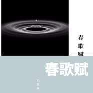

春歌赋
============================

|  |  |
| :--: | :-- |
| [ 春歌赋](https://emumo.xiami.com/album/2104608219) | **艺人**: [刘惠美](../index.md) **语种**: 国语 **唱片公司**: 独立发行 **发行时间**: 2019年02月20日 **专辑类别**: 录音室专辑 **专辑风格**: 民谣 Folk **播放数**: 141 **收藏数**: 0 **评论数**: 0  |

## 简介

 

作者疯语《离花兑》一书中在保持原文不变的前提下为戚夫人的《春歌》进一步丰富了情感。在音乐创作时，进行曲式排列中稍作删减，制作完成，整曲以歌谣反复吟唱简明易仿的形式表达出来，舍弃了较为常见的主歌与副歌的编排模式，在叹息戚姬命运的同时，回顾那段尘封千年的历史片段。
 

《舂歌》原版
 

子为王。母为虏。终日舂薄暮。常与死为伍。相离三千里。谁使告女。
 

## 曲目

## 评论

|  |  |  |  |
| :-- | :-- | :-- | :-- |
