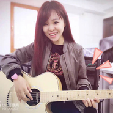

刘惠美
============================

|  |  |
| :--: | :-- |
| [ 刘惠美](https://i.xiami.com/liuhuimei) | **播放数**: 2623251 **粉丝数**: 182 **评论数**: 18 **地区**: China 中国大陆 **风格**: 国语流行 Mandarin Pop  |

## 档案

中文名：刘惠美 生日：12-25 出生地：辽宁大连 毕业院校：沈阳音乐学院 微博@刘惠美

## 专辑

| 名称 | 语种 | 唱片公司 | 发行时间 | 专辑类别 | 专辑风格 |
| :--: | :-- | :-- | :-- | :-- | :-- |
| [ 大鱼](./albums/2420320884.md) | 国语 | 独立发行 | 2020年03月01日 | EP, 单曲 | 流行 Pop |
| [ 遥远的你（女声清唱版）](./albums/2105054749.md) | 国语 |  | 2019年08月03日 | 现场专辑 | 民谣 Folk, 轻音乐 Easy Listening |
| [ 马马嘟嘟骑](./albums/2104974277.md) | 国语 |  | 2019年07月06日 | EP, 单曲 | 民谣 Folk |
| [ 春歌赋](./albums/2104608219.md) | 国语 | 独立发行 | 2019年02月20日 | 录音室专辑 | 民谣 Folk |
| [ 追光者（夏至未至主题曲）（Cover岑宁儿）](./albums/2103771865.md) | 国语 | 独立发行 | 2018年07月01日 | EP, 单曲 | 民谣 Folk, 流行 Pop |
| [ 成都 女生版cover赵雷](./albums/2102702209.md) | 国语 | 独立发行 | 2017年03月02日 | 现场专辑 | 民谣 Folk |
| [ 青春花落](./albums/2102659575.md) | 国语 | 独立发行 | 2016年12月05日 | 录音室专辑 | 民谣流行 Folk Pop |
| [ 只要有你](./albums/2102640656.md) | 国语 |  | 2016年10月29日 | 录音室专辑 |  |
| [ 大连少年大连少年](./albums/2100362825.md) | 国语 | 大连忆时刻传媒 | 2016年07月05日 | EP, 单曲 | 流行说唱 Pop Rap |
| [ 惠美](./albums/904963758.md) | 国语 | 独立发行 | 2014年07月10日 | 录音室专辑 | 流行 Pop |

## 评论

|  |  |  |  |
| :-- | :-- | :-- | :-- |
|  [虾米用户](https://emumo.xiami.com/u/442207139)  2020-11-04 20:23 赞(0) 踩(0) | 
好听～ 
 |
|  [虾米用户](https://emumo.xiami.com/u/87475648) 其实我们都是幸福的，只是... 2020-05-04 17:30 赞(1) 踩(0) | 
唱的很好，坚持哦！看好你！！
 |
|  [虾米用户](https://emumo.xiami.com/u/268479778) 我还没想好要写什么... 2019-01-17 20:01 赞(0) 踩(0) | 
  
 |
|  [虾米用户](https://emumo.xiami.com/u/325588050)  2018-09-05 02:27 赞(0) 踩(0) | 
这货谁啊？
 |
|  [虾米用户](https://emumo.xiami.com/u/293692544) 你敢给我说话吗？我咬你 2018-05-14 05:06 赞(1) 踩(0) | 
好听
 |
|  [虾米用户](https://emumo.xiami.com/u/322323666)  2018-04-25 20:28 赞(1) 踩(0) | 
 
 |
|  [虾米用户](https://emumo.xiami.com/u/348196674)  2018-02-13 21:12 赞(1) 踩(0) | 
好听
 |
|  [虾米用户](https://emumo.xiami.com/u/133965392)  2017-12-28 16:01 赞(1) 踩(0) | 
不知道唱的是啥，只是玩票吧
 |
|  [虾米用户](https://emumo.xiami.com/u/333301722) 我想听的 2017-11-05 02:13 赞(3) 踩(0) | 
       
 |
|  [虾米用户](https://emumo.xiami.com/u/332006661)  2017-10-31 08:14 赞(1) 踩(0) | 
傻
 |
|  [虾米用户](https://emumo.xiami.com/u/252423597) 现在后悔也换不回来父母的... 2017-08-27 09:45 赞(1) 踩(0) | 
你好
 |
|  [虾米用户](https://emumo.xiami.com/u/290212630) 遇见……遗忘… 2017-04-21 00:30 赞(1) 踩(0) | 
我想我们能做好朋友
 |
| ⇒ |  [虾米用户](https://emumo.xiami.com/u/288846792) 小心，我就在你身邊！ 2017-10-19 16:33 赞(0) 踩(0) | 
好
 |
|  [虾米用户](https://emumo.xiami.com/u/289775074)  2017-04-19 06:39 赞(2) 踩(0) | 

 |
|  [虾米用户](https://emumo.xiami.com/u/48019747)   2016-07-07 01:08 赞(1) 踩(0) | 
好美哦
 |
|  [虾米用户](https://emumo.xiami.com/u/93256596) 把原唱关掉 听我的！ 2016-06-13 23:44 赞(0) 踩(0) | 
不错啊 邻家女孩气质
 |
|  [虾米用户](https://emumo.xiami.com/u/97747450) 我还没想好要写什么... 2016-05-28 23:48 赞(0) 踩(0) | 
769
 |
|  [虾米用户](https://emumo.xiami.com/u/1091023)  2012-06-10 23:03 赞(3) 踩(0) | 
你的声音很好听，加油！
 |
